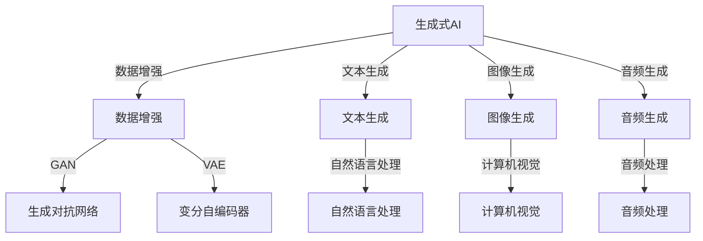

                 

# 生成式AIGC：从数据到商业价值的挖掘

## 关键词：
- 生成式AI
- AIGC
- GAN
- VAE
- 数据增强
- 自然语言处理
- 创意设计
- 商业应用

## 摘要：
生成式人工智能（AIGC）是一个新兴领域，通过生成对抗网络（GAN）、变分自编码器（VAE）等模型，可以从数据中生成高质量的伪造内容。本文将深入探讨AIGC的基本原理、核心算法，以及其在数据增强、自然语言处理和创意设计等领域的商业应用，并分析其面临的挑战与未来前景。

----------------------------------------------------------------

## 目录大纲：《生成式AIGC：从数据到商业价值的挖掘》

### 第一部分：AIGC基础与原理

##### 第1章：AIGC概述与背景
- **1.1 AIGC的定义与核心概念**
- **1.2 AIGC的发展历程**
- **1.3 AIGC的技术框架**

##### 第2章：生成式AIGC核心算法
- **2.1 生成对抗网络（GAN）**
  - **2.1.1 GAN的原理与架构**
  - **2.1.2 GAN的训练与优化**
- **2.2 变分自编码器（VAE）**
  - **2.2.1 VAE的原理与架构**
  - **2.2.2 VAE的训练与优化**
- **2.3 其他生成式模型**
  - **2.3.1 自回归模型（AR）**
  - **2.3.2 条件生成模型（CGM）**

##### 第3章：AIGC在数据增强中的应用
- **3.1 数据增强的重要性**
- **3.2 数据增强方法**
  - **3.2.1 图像数据增强**
  - **3.2.2 文本数据增强**
  - **3.2.3 音频数据增强**

##### 第4章：AIGC在自然语言处理中的应用
- **4.1 AIGC在文本生成中的应用**
  - **4.1.1 自动摘要与文本生成**
  - **4.1.2 机器翻译与对话系统**
- **4.2 AIGC在情感分析中的应用**
  - **4.2.1 情感分类**
  - **4.2.2 情感倾向分析**

#### 第二部分：AIGC的商业应用场景

##### 第5章：AIGC在创意设计领域的应用
- **5.1 创意设计的挑战与机遇**
- **5.2 AIGC在创意设计中的应用**
  - **5.2.1 图像创作与编辑**
  - **5.2.2 建筑与室内设计**
  - **5.2.3 服装设计**

##### 第6章：AIGC在游戏开发中的创新应用
- **6.1 游戏开发的挑战与需求**
- **6.2 AIGC在游戏开发中的应用**
  - **6.2.1 游戏角色的智能生成**
  - **6.2.2 游戏场景的动态构建**
  - **6.2.3 游戏剧情的自动生成**

##### 第7章：AIGC在商业决策支持中的价值
- **7.1 商业决策中的数据依赖**
- **7.2 AIGC在商业决策中的应用**
  - **7.2.1 市场趋势预测**
  - **7.2.2 产品个性化推荐**
  - **7.2.3 风险评估与预测**

##### 第8章：AIGC商业应用的挑战与未来展望
- **8.1 AIGC商业应用的挑战**
  - **8.1.1 数据隐私与安全**
  - **8.1.2 模型解释性与可解释性**
  - **8.1.3 技术更新与迭代**
- **8.2 AIGC商业应用的未来展望**
  - **8.2.1 新兴领域的机会**
  - **8.2.2 与其他技术的融合**

#### 附录

##### 附录A：生成式AIGC工具与资源
- **A.1 常用生成式AIGC框架**
  - **A.1.1 TensorFlow Probability**
  - **A.1.2 PyTorch Distributed**
  - **A.1.3 其他框架**
- **A.2 生成式AIGC实践资源**
  - **A.2.1 OpenAI Gym**
  - **A.2.2 Hugging Face Transformers**
  - **A.2.3 生成式模型实例与代码**

----------------------------------------------------------------

### 核心概念与联系

在深入探讨生成式人工智能（AIGC）之前，我们需要明确一些核心概念和它们之间的关系。以下是AIGC的一些关键组成部分和它们之间的联系：

#### 图 1-1: AIGC核心概念与联系



- **生成式AI（AIGC）**：是一种人工智能技术，能够生成新的数据，如图像、文本和音频等。
- **数据增强**：是通过技术手段增加训练数据的数量和质量，以提高模型的泛化能力。
- **生成对抗网络（GAN）**：是一种由生成器和判别器组成的模型，通过博弈过程训练生成器生成逼真的数据。
- **变分自编码器（VAE）**：是一种基于概率模型的数据生成方法，通过编码器和解码器的协同工作实现数据的重构。
- **自然语言处理（NLP）**：是研究如何让计算机理解和处理人类语言的技术。
- **计算机视觉**：是使计算机能够从图像或视频中提取信息的技术。
- **音频处理**：是处理音频信号的技术，包括音频合成、音频增强等。

这些核心概念和联系构成了AIGC的基础，为后续章节的详细探讨提供了理论基础。

----------------------------------------------------------------

### 第一部分：AIGC基础与原理

在本部分中，我们将深入探讨生成式人工智能（AIGC）的基础与原理，包括AIGC的概述、发展历程、技术框架以及核心算法。

#### 第1章：AIGC概述与背景

##### 1.1 AIGC的定义与核心概念

生成式人工智能（AIGC）是一种能够从数据中生成新数据的机器学习技术，它涵盖了生成对抗网络（GAN）、变分自编码器（VAE）以及其他生成模型。AIGC的核心概念包括生成器（Generator）、判别器（Discriminator）和潜在空间（Latent Space）。

- **生成器（Generator）**：生成器的目的是从随机噪声中生成与真实数据相似的新数据。它接受随机噪声作为输入，通过神经网络输出伪造的数据。
- **判别器（Discriminator）**：判别器的目的是区分真实数据和伪造数据。它接受真实数据和伪造数据作为输入，输出一个概率值，表示输入数据是真实还是伪造。
- **潜在空间（Latent Space）**：潜在空间是一个高维空间，用于表示生成器和判别器之间的博弈过程。在这个空间中，生成器和判别器通过训练不断优化，直到生成器能够生成难以区分的真实和伪造数据。

##### 1.2 AIGC的发展历程

AIGC的发展历程可以追溯到20世纪80年代，当时生成式模型如隐马尔可夫模型（HMM）和变分自编码器（VAE）开始出现。然而，AIGC的真正突破是在2014年，当Ian Goodfellow等人提出了生成对抗网络（GAN）。

- **2014年**：Ian Goodfellow等人提出了GAN，这是AIGC的一个重要里程碑。GAN通过生成器和判别器的博弈过程，能够生成高质量、逼真的图像。
- **2016年**：VAE作为一种变分自编码器，被提出来用于生成式模型，它通过编码器和解码器的协同工作，能够生成高质量的图像。
- **2018年**：自注意力机制和Transformer模型的出现，使得AIGC在自然语言处理领域取得了突破性进展。
- **至今**：随着计算能力的提升和深度学习技术的进步，AIGC的应用领域不断扩展，从图像和文本生成，到音频、视频生成，再到创意设计和商业应用。

##### 1.3 AIGC的技术框架

AIGC的技术框架主要包括生成模型、判别模型、数据增强、潜在空间等组成部分。

- **生成模型**：生成模型是AIGC的核心，包括GAN、VAE等模型。生成模型通过学习数据分布，生成与真实数据相似的新数据。
- **判别模型**：判别模型用于区分真实数据和伪造数据，通常是一个二分类模型，输出一个概率值，表示输入数据的真实性。
- **数据增强**：数据增强是提高模型泛化能力的重要手段，通过增加数据的多样性和复杂性，提高模型的鲁棒性。
- **潜在空间**：潜在空间是生成模型和判别模型之间的博弈场所，它提供了一个高维空间，使得生成器和判别器可以在其中不断优化。

在下一章中，我们将详细探讨AIGC的核心算法，包括生成对抗网络（GAN）、变分自编码器（VAE）以及其他生成模型。

----------------------------------------------------------------

### 第2章：生成式AIGC核心算法

生成式人工智能（AIGC）的核心算法包括生成对抗网络（GAN）、变分自编码器（VAE）以及其他生成模型，如自回归模型（AR）和条件生成模型（CGM）。本章将深入探讨这些核心算法的原理、架构和训练过程。

#### 2.1 生成对抗网络（GAN）

##### 2.1.1 GAN的原理与架构

生成对抗网络（GAN）由Ian Goodfellow等人于2014年提出，它是一种由生成器和判别器组成的博弈过程。GAN的基本思想是让生成器生成尽可能真实的数据，同时让判别器能够准确地区分真实数据和伪造数据。

- **生成器（Generator）**：生成器的目的是从随机噪声中生成与真实数据相似的数据。生成器通常是一个神经网络，它接受随机噪声作为输入，通过多层神经网络生成伪造的数据。
- **判别器（Discriminator）**：判别器的目的是区分真实数据和伪造数据。判别器也是一个神经网络，它接受真实数据和伪造数据作为输入，输出一个概率值，表示输入数据是真实还是伪造。

GAN的架构可以总结为以下步骤：

1. **初始化参数**：初始化生成器和判别器的参数。
2. **生成伪造数据**：生成器从随机噪声中生成伪造数据。
3. **判别伪造数据**：判别器对真实数据和伪造数据同时进行前向传播，计算判别器的损失函数。
4. **更新判别器**：通过梯度下降算法更新判别器的参数，使判别器能够更准确地判断伪造数据。
5. **生成新伪造数据**：生成器使用更新后的判别器生成新的伪造数据。
6. **重复步骤3-5**：不断重复上述步骤，直到生成器能够生成难以区分的真实和伪造数据。

##### 2.1.2 GAN的训练与优化

GAN的训练过程是一个动态的博弈过程，目的是使生成器和判别器不断优化，直到生成器生成的伪造数据与真实数据无法区分。

- **生成器的训练**：
  - 目标是最小化判别器判断伪造数据的概率，即最大化判别器的损失函数。
  - 损失函数通常采用反梯度上升方法，即更新生成器的参数时，使用判别器的梯度。

- **判别器的训练**：
  - 目标是最小化生成器判断伪造数据的概率，同时最大化生成器判断真实数据的概率。
  - 损失函数通常采用交叉熵损失函数，即更新判别器的参数时，使用生成器和判别器的梯度。

- **优化技巧**：
  - **梯度惩罚**：在总损失函数中添加对抗性惩罚项，强制生成器生成更具对抗性的伪造数据。
  - **学习率调整**：适当调整生成器和判别器学习率，保持两者之间的动态平衡。
  - **批量大小**：调整训练批量大小，影响模型的稳定性和收敛速度。
  - **噪声注入**：在生成器和判别器的输入中添加噪声，防止过拟合。

#### 2.2 变分自编码器（VAE）

##### 2.2.1 VAE的原理与架构

变分自编码器（VAE）是由Kingma和Welling于2013年提出的一种生成模型，它通过编码器和解码器的协同工作，将数据映射到一个潜在空间，并从这个潜在空间中生成新的数据。

- **编码器（Encoder）**：编码器的目的是将输入数据映射到一个潜在空间，通常通过一个神经网络实现。编码器输出两个值：均值μ和方差σ，这两个值共同决定了潜在空间中的点。
- **解码器（Decoder）**：解码器的目的是从潜在空间中生成输入数据的重构，通常通过另一个神经网络实现。解码器接受潜在空间中的点作为输入，输出重构的数据。

VAE的架构可以总结为以下步骤：

1. **输入数据**：输入一个数据点x。
2. **通过编码器得到潜在空间表示**：编码器输出均值μ和方差σ。
3. **从潜在空间中采样一个点**：通过正态分布从潜在空间中采样一个点z。
4. **通过解码器得到重构数据**：解码器将采样点z转换为重构的数据x'。
5. **计算损失函数**：计算重构数据x'和原始数据x之间的差异，并计算KL散度作为损失函数。
6. **更新编码器和解码器的参数**：通过梯度下降算法更新编码器和解码器的参数。

##### 2.2.2 VAE的训练与优化

VAE的训练过程是同时优化编码器和解码器的参数，使其能够更好地重构数据。

- **概率模型**：
  - 编码器参数化$p(z|x; \theta_{enc}) = \mathcal{N}(z; \mu(x), \sigma(x))$
  - 解码器参数化$p(x|z; \theta_{dec}) = \mathcal{N}(x; \mu(z), \sigma(z))$

- **损失函数**：
  - 总损失函数：$L = \mathbb{E}_{x \sim p(x)}[-\log p(x|z; \theta_{dec})] + \frac{1}{2}\mathbb{E}_{x \sim p(x)}[D(\mu(x), \sigma(x))]$
  - 其中，$D(\mu(x), \sigma(x))$是KL散度，表示编码器输出分布与先验分布之间的距离。

- **优化算法**：
  - 使用变分推断中的重新参数化技巧，将后验分布$p(z|x)$转换为可微的表达式。
  - 通过梯度下降方法优化编码器和解码器的参数，使总损失函数最小化。

##### 2.3 其他生成式模型

除了GAN和VAE，还有一些其他生成式模型，如自回归模型（AR）和条件生成模型（CGM）。

##### 2.3.1 自回归模型（AR）

自回归模型（AR）是一种基于时间序列数据的生成模型，它通过学习时间序列数据的统计特性来生成新的时间序列数据。

- **模型定义**：自回归模型可以表示为$x_t = f(x_{t-1}, x_{t-2}, \dots, x_{1}) + \epsilon_t$，其中$x_t$是时间序列的当前值，$f$是模型函数，$\epsilon_t$是噪声。
- **训练过程**：自回归模型通过学习模型函数$f$的参数来生成新的时间序列数据。

##### 2.3.2 条件生成模型（CGM）

条件生成模型（CGM）是一种能够根据条件生成数据的生成模型，它广泛应用于图像、文本和音频的生成。

- **模型定义**：条件生成模型可以表示为$p(x|c) = \prod_{i=1}^{N} p(x_i|c)$，其中$x$是生成数据，$c$是条件。
- **训练过程**：条件生成模型通过学习条件概率$p(x_i|c)$的参数来生成新的数据。

在下一章中，我们将探讨AIGC在数据增强中的应用，并展示如何在图像、文本和音频数据中实现数据增强。

----------------------------------------------------------------

### 第3章：AIGC在数据增强中的应用

数据增强是机器学习中的一个重要技术，它通过增加训练数据的数量和质量，来提高模型的泛化能力和鲁棒性。生成式人工智能（AIGC）提供了一种强大的数据增强方法，通过生成与真实数据相似的新数据，来丰富训练集。本章将深入探讨AIGC在数据增强中的应用，包括图像、文本和音频数据增强的方法。

#### 3.1 数据增强的重要性

在机器学习领域，数据增强是一个关键的步骤，它能够提高模型的性能和稳定性。数据增强的主要目的是通过增加训练数据的多样性和复杂性，来防止模型过拟合，并提高模型的泛化能力。以下是一些数据增强的重要性：

- **提高模型泛化能力**：通过增加训练数据的多样性，模型可以更好地学习数据分布，从而在未知数据上表现出更好的性能。
- **防止过拟合**：在数据增强过程中，生成的新数据与真实数据具有相似的分布，这有助于模型更好地理解数据的复杂性，减少过拟合的风险。
- **减少对数据集的依赖**：数据增强可以减少对大规模数据集的依赖，尤其是在数据稀缺的情况下，通过生成新数据，可以扩大训练集，从而提高模型的性能。

#### 3.2 数据增强方法

AIGC提供了多种数据增强方法，适用于不同的数据类型，包括图像、文本和音频。

##### 3.2.1 图像数据增强

图像数据增强是AIGC应用最广泛的领域之一。通过生成新的图像数据，可以丰富训练集，提高模型的泛化能力。以下是一些常用的图像数据增强方法：

- **翻转（Flipping）**：水平或垂直翻转图像，增加数据的多样性。
- **裁剪（Cropping）**：随机裁剪图像的一部分，生成新的图像。
- **缩放（Scaling）**：随机缩放图像的大小，增加图像的尺度多样性。
- **旋转（Rotation）**：随机旋转图像，增加图像的方向多样性。
- **颜色变换（Color Jittering）**：随机改变图像的亮度、对比度和饱和度，增加图像的视觉多样性。
- **噪声添加（Noise Addition）**：在图像中添加噪声，模拟现实世界的图像质量。
- **生成对抗网络（GAN）**：使用GAN生成与真实图像相似的新图像，从而丰富训练集。

以下是一个使用GAN进行图像数据增强的伪代码示例：

```python
# 初始化GAN模型
generator = GANGenerator()
discriminator = GANDiscriminator()

# 预处理图像数据
images = preprocess_images(image_data)

# 数据增强过程
for image in images:
    # 生成伪造图像
    fake_image = generator.generate_image(image)
    # 融合真实图像和伪造图像
    enhanced_image = blend_images(image, fake_image)
    # 更新训练集
    enhanced_images.append(enhanced_image)

# 训练模型
model = train_model(enhanced_images, labels)
```

##### 3.2.2 文本数据增强

文本数据增强在自然语言处理（NLP）领域中同样重要。通过生成新的文本数据，可以丰富训练集，提高模型的泛化能力。以下是一些常用的文本数据增强方法：

- **同义词替换（Word Replacement）**：将文本中的单词替换为同义词，增加词汇多样性。
- **单词插入（Word Insertion）**：在文本中随机插入单词，增加句子的复杂性。
- **单词删除（Word Deletion）**：随机删除文本中的单词，模拟文本中的错误。
- **文本重写（Text Rewriting）**：使用生成式模型，如Transformer，生成新的文本。
- **生成对抗网络（GAN）**：使用GAN生成与真实文本相似的新文本。

以下是一个使用GAN进行文本数据增强的伪代码示例：

```python
# 初始化GAN模型
generator = TextGANGenerator()
discriminator = TextGANDiscriminator()

# 预处理文本数据
texts = preprocess_texts(text_data)

# 数据增强过程
for text in texts:
    # 生成伪造文本
    fake_text = generator.generate_text(text)
    # 融合真实文本和伪造文本
    enhanced_text = blend_texts(text, fake_text)
    # 更新训练集
    enhanced_texts.append(enhanced_text)

# 训练模型
model = train_model(enhanced_texts, labels)
```

##### 3.2.3 音频数据增强

音频数据增强在语音识别和音频处理领域中同样重要。通过生成新的音频数据，可以丰富训练集，提高模型的泛化能力。以下是一些常用的音频数据增强方法：

- **噪声添加（Noise Addition）**：在音频信号中添加噪声，模拟现实世界的音频质量。
- **变速变调（Time Stretching and Pitch Shifting）**：改变音频的播放速度和音调，增加音频的多样性。
- **混响添加（Reverberation Addition）**：在音频中添加混响效果，模拟不同的环境。
- **音高变换（Pitch Transformation）**：改变音频的音高，增加音频的多样性。
- **生成对抗网络（GAN）**：使用GAN生成与真实音频相似的新音频。

以下是一个使用GAN进行音频数据增强的伪代码示例：

```python
# 初始化GAN模型
generator = AudioGANGenerator()
discriminator = AudioGANDiscriminator()

# 预处理音频数据
audio_data = preprocess_audio(audio_signal)

# 数据增强过程
for audio_signal in audio_data:
    # 生成伪造音频
    fake_audio = generator.generate_audio(audio_signal)
    # 融合真实音频和伪造音频
    enhanced_audio = blend_audio(audio_signal, fake_audio)
    # 更新训练集
    enhanced_audio_data.append(enhanced_audio)

# 训练模型
model = train_model(enhanced_audio_data, labels)
```

通过以上数据增强方法，可以显著提高模型的泛化能力和鲁棒性，从而在机器学习和数据科学领域中取得更好的结果。

----------------------------------------------------------------

### 第4章：AIGC在自然语言处理中的应用

自然语言处理（NLP）是人工智能（AI）的一个重要分支，它涉及使计算机能够理解、解释和生成人类语言的技术。生成式人工智能（AIGC）在NLP中的应用极大地提升了文本生成、机器翻译和对话系统的能力。本章将深入探讨AIGC在自然语言处理中的应用，以及其在文本生成和情感分析中的具体实现。

#### 4.1 AIGC在文本生成中的应用

文本生成是NLP中的一项重要任务，它涉及生成与给定输入文本相似的新文本。AIGC通过生成对抗网络（GAN）和变分自编码器（VAE）等技术，能够在各种场景下实现高质量的文本生成。

##### 4.1.1 自动摘要与文本生成

自动摘要是一种将长文本转换为短文本的技术，它对于信息检索、阅读辅助和新闻摘要等领域具有重要意义。AIGC通过学习文本数据，能够生成简洁而准确的摘要。

- **模型选择**：自动摘要通常使用基于Transformer的模型，如BERT和GPT，这些模型能够捕捉文本中的长距离依赖关系。
- **训练过程**：通过大量的文本数据训练模型，使模型能够理解文本内容，并生成摘要。
- **生成过程**：给定一个长文本，模型首先生成一个潜在空间表示，然后从这个表示中生成摘要文本。

以下是一个使用GAN进行文本生成的伪代码示例：

```python
# 初始化GAN模型
text_generator = TextGANGenerator()
text_discriminator = TextGANDiscriminator()

# 预处理文本数据
texts = preprocess_texts(text_data)

# 数据增强过程
for text in texts:
    # 生成伪造文本
    fake_text = text_generator.generate_text(text)
    # 融合真实文本和伪造文本
    enhanced_text = blend_texts(text, fake_text)
    # 更新训练集
    enhanced_texts.append(enhanced_text)

# 训练模型
model = train_model(enhanced_texts, labels)
```

##### 4.1.2 机器翻译与对话系统

机器翻译是将一种语言的文本翻译成另一种语言的技术，对话系统则是实现人与机器之间自然交互的技术。AIGC在这些领域中通过生成式模型的应用，显著提升了翻译质量和对话的连贯性。

- **模型选择**：机器翻译和对话系统通常使用基于Transformer的模型，如BERT和GPT，这些模型能够处理复杂的语言结构和上下文信息。
- **训练过程**：通过大量的双语文本和对话数据训练模型，使模型能够理解不同语言的语法和语义。
- **生成过程**：给定一个输入文本或对话，模型生成对应的翻译或对话回应。

以下是一个使用VAE进行机器翻译的伪代码示例：

```python
# 初始化VAE模型
encoder = TextVAEEncoder()
decoder = TextVAEDecoder()

# 预处理文本数据
source_texts, target_texts = preprocess_texts(source_data), preprocess_texts(target_data)

# 训练编码器和解码器
encoder, decoder = train_vae_model(encoder, decoder, source_texts, target_texts)

# 生成翻译文本
translated_texts = []
for source_text in source_texts:
    # 编码输入文本
    latent_repr = encoder.encode(source_text)
    # 从潜在空间采样
    z = sample_from_latent_space(latent_repr)
    # 解码潜在空间文本
    translated_text = decoder.decode(z)
    translated_texts.append(translated_text)
```

#### 4.2 AIGC在情感分析中的应用

情感分析是一种从文本中识别和提取主观信息的技术，它对于社交媒体监测、市场调研和客户服务具有重要意义。AIGC通过生成式模型的应用，能够提高情感分类和情感倾向分析的准确性。

##### 4.2.1 情感分类

情感分类是将文本分类为正面、负面或中性情感的技术。AIGC通过生成式模型，可以从大量情感标注数据中学习情感特征，并生成新的情感标注数据。

- **模型选择**：情感分类通常使用基于神经网络的模型，如CNN和LSTM，这些模型能够捕捉文本中的情感模式。
- **训练过程**：通过大量的情感标注文本数据训练模型，使模型能够识别不同情感的特征。
- **生成过程**：给定一个未标注的文本，模型生成对应的情感标注。

以下是一个使用GAN进行情感分类的伪代码示例：

```python
# 初始化GAN模型
text_generator = SentimentGANGenerator()
text_discriminator = SentimentGANDiscriminator()

# 预处理文本数据
texts = preprocess_texts(text_data)

# 数据增强过程
for text in texts:
    # 生成伪造情感标注
    fake_sentiment = text_generator.generate_sentiment(text)
    # 融合真实情感标注和伪造情感标注
    enhanced_sentiment = blend_sentiments(text, fake_sentiment)
    # 更新训练集
    enhanced_texts.append(enhanced_sentiment)

# 训练模型
model = train_model(enhanced_texts, labels)
```

##### 4.2.2 情感倾向分析

情感倾向分析是识别文本中的情感倾向（如正面、负面或中立）的技术，它比情感分类更细致。AIGC通过生成式模型的应用，可以从复杂多变的情感表达中提取情感倾向。

- **模型选择**：情感倾向分析通常使用基于Transformer的模型，如BERT和GPT，这些模型能够捕捉复杂的情感表达。
- **训练过程**：通过大量的情感倾向标注数据训练模型，使模型能够识别不同情感倾向的特征。
- **生成过程**：给定一个未标注的文本，模型生成对应的情感倾向标注。

以下是一个使用VAE进行情感倾向分析的伪代码示例：

```python
# 初始化VAE模型
encoder = SentimentVAEEncoder()
decoder = SentimentVAEDecoder()

# 预处理文本数据
source_texts, target_sentiments = preprocess_texts(source_data), preprocess_sentiments(target_data)

# 训练编码器和解码器
encoder, decoder = train_vae_model(encoder, decoder, source_texts, target_sentiments)

# 生成情感倾向标注
predicted_sentiments = []
for source_text in source_texts:
    # 编码输入文本
    latent_repr = encoder.encode(source_text)
    # 从潜在空间采样
    z = sample_from_latent_space(latent_repr)
    # 解码潜在空间文本
    predicted_sentiment = decoder.decode(z)
    predicted_sentiments.append(predicted_sentiment)
```

通过以上AIGC技术在自然语言处理中的应用，我们可以实现高质量的文本生成、机器翻译、对话系统和情感分析，为各种NLP应用场景提供强大的支持。

----------------------------------------------------------------

### 第二部分：AIGC的商业应用场景

#### 第5章：AIGC在创意设计领域的应用

创意设计是现代商业中的一个关键领域，它涉及到图像创作、建筑与室内设计、服装设计等多个方面。随着生成式人工智能（AIGC）的发展，AIGC在创意设计中的应用越来越广泛，为设计师和品牌带来了新的机遇和挑战。

##### 5.1 创意设计的挑战与机遇

创意设计面临的挑战主要包括：

- **多样性需求**：创意设计需要满足不同客户和市场的多样化需求，这要求设计师具备丰富的创意和灵感。
- **个性化定制**：个性化定制是现代消费者追求的趋势，这要求设计师能够根据客户的具体需求进行个性化设计。
- **效率提升**：在竞争激烈的市场中，设计效率的提升是关键，设计师需要快速生成设计方案并反馈。

而AIGC为创意设计带来的机遇主要包括：

- **创意生成**：AIGC能够快速生成大量创意设计，为设计师提供灵感和参考。
- **个性化定制**：AIGC可以根据用户需求自动生成个性化的设计方案。
- **效率提升**：AIGC可以自动化和加速设计过程，提高设计效率。

##### 5.2 AIGC在创意设计中的应用

AIGC在创意设计中的应用主要体现在以下几个方面：

- **图像创作与编辑**：AIGC可以通过生成对抗网络（GAN）和变分自编码器（VAE）等技术生成高质量的图像，设计师可以使用这些图像作为创意设计的灵感。此外，AIGC还可以用于图像编辑，如图像修复、图像风格转换等，使设计师能够更高效地进行图像处理。

以下是一个使用GAN进行图像创作的伪代码示例：

```python
# 初始化GAN模型
image_generator = ImageGANGenerator()
image_discriminator = ImageGANDiscriminator()

# 预处理图像数据
images = preprocess_images(image_data)

# 数据增强过程
for image in images:
    # 生成伪造图像
    fake_image = image_generator.generate_image(image)
    # 融合真实图像和伪造图像
    enhanced_image = blend_images(image, fake_image)
    # 更新训练集
    enhanced_images.append(enhanced_image)

# 训练模型
model = train_model(enhanced_images, labels)
```

- **建筑与室内设计**：AIGC可以通过生成式模型生成建筑和室内设计的3D模型，设计师可以在此基础上进行修改和优化。AIGC还可以帮助设计师快速生成多种设计方案，以便客户进行选择。

以下是一个使用VAE进行建筑设计的伪代码示例：

```python
# 初始化VAE模型
architecture_generator = ArchitectureVAEGenerator()
architecture_decoder = ArchitectureVAEDecoder()

# 预处理建筑数据
architecture_data = preprocess_architecture_data(architecture_data)

# 训练编码器和解码器
architecture_generator, architecture_decoder = train_vae_model(architecture_generator, architecture_decoder, architecture_data)

# 生成建筑设计模型
design_models = []
for architecture in architecture_data:
    # 编码建筑数据
    latent_repr = architecture_generator.encode(architecture)
    # 从潜在空间采样
    z = sample_from_latent_space(latent_repr)
    # 解码潜在空间模型
    design_model = architecture_decoder.decode(z)
    design_models.append(design_model)
```

- **服装设计**：AIGC可以通过生成式模型生成服装设计，设计师可以使用这些设计作为创作灵感。AIGC还可以帮助设计师快速生成多种服装款式，以便客户进行选择。

以下是一个使用GAN进行服装设计的伪代码示例：

```python
# 初始化GAN模型
clothing_generator = ClothingGANGenerator()
clothing_discriminator = ClothingGANDiscriminator()

# 预处理服装数据
clothing_data = preprocess_clothing_data(clothing_data)

# 数据增强过程
for clothing in clothing_data:
    # 生成伪造服装设计
    fake_clothing = clothing_generator.generate_clothing(clothing)
    # 融合真实服装设计和伪造服装设计
    enhanced_clothing = blend_clothing(clothing, fake_clothing)
    # 更新训练集
    enhanced_clothing_data.append(enhanced_clothing)

# 训练模型
model = train_model(enhanced_clothing_data, labels)
```

通过AIGC在创意设计中的应用，设计师可以更加高效地创作和优化设计方案，从而满足市场需求并提高设计质量。

----------------------------------------------------------------

#### 第6章：AIGC在游戏开发中的创新应用

游戏开发是一个充满创造性和技术挑战的领域，随着生成式人工智能（AIGC）的发展，AIGC在游戏开发中的应用越来越受到关注。AIGC可以通过生成高质量的虚拟角色、动态场景和自动生成的游戏剧情，为游戏开发者提供强大的工具，提升游戏的整体质量和用户体验。

##### 6.1 游戏开发的挑战与需求

游戏开发面临的挑战主要包括：

- **内容多样性**：游戏需要提供丰富的内容，包括角色、场景、剧情等，以满足不同玩家的需求。
- **开发效率**：游戏开发周期长，需要高效的内容生成和优化过程，以提高开发效率。
- **用户体验**：游戏需要提供高质量的视觉和交互体验，以吸引和留住玩家。

AIGC在游戏开发中的应用可以解决这些挑战，满足以下需求：

- **自动化内容生成**：AIGC可以自动化生成大量的游戏内容，如角色、场景和剧情，从而提高开发效率。
- **个性化体验**：AIGC可以根据玩家的行为和偏好生成个性化的游戏内容，提升用户体验。
- **视觉质量提升**：AIGC可以生成高质量的3D模型和图像，提高游戏画面效果。

##### 6.2 AIGC在游戏开发中的应用

AIGC在游戏开发中的应用主要体现在以下几个方面：

- **游戏角色的智能生成**

AIGC可以通过生成对抗网络（GAN）和变分自编码器（VAE）等技术，自动生成游戏角色。这些角色可以是虚拟人物、动物或机器人等，AIGC可以生成多样化的角色外观和特征。

以下是一个使用GAN进行游戏角色生成的伪代码示例：

```python
# 初始化GAN模型
character_generator = CharacterGANGenerator()
character_discriminator = CharacterGANDiscriminator()

# 预处理角色数据
characters = preprocess_characters(character_data)

# 数据增强过程
for character in characters:
    # 生成伪造角色
    fake_character = character_generator.generate_character(character)
    # 融合真实角色和伪造角色
    enhanced_character = blend_characters(character, fake_character)
    # 更新训练集
    enhanced_characters.append(enhanced_character)

# 训练模型
model = train_model(enhanced_characters, labels)
```

- **游戏场景的动态构建**

AIGC可以通过生成式模型，自动构建游戏场景，包括地图、建筑和自然景观等。这些场景可以根据游戏剧情和玩家行为动态变化，提供丰富的游戏体验。

以下是一个使用VAE进行游戏场景生成的伪代码示例：

```python
# 初始化VAE模型
scene_generator = SceneVAEGenerator()
scene_decoder = SceneVAEDecoder()

# 预处理场景数据
scenes = preprocess_scenes(scene_data)

# 训练编码器和解码器
scene_generator, scene_decoder = train_vae_model(scene_generator, scene_decoder, scenes)

# 生成游戏场景
generated_scenes = []
for scene in scene_data:
    # 编码场景数据
    latent_repr = scene_generator.encode(scene)
    # 从潜在空间采样
    z = sample_from_latent_space(latent_repr)
    # 解码潜在空间场景
    generated_scene = scene_decoder.decode(z)
    generated_scenes.append(generated_scene)
```

- **游戏剧情的自动生成**

AIGC可以通过自然语言处理技术，自动生成游戏剧情。这些剧情可以根据玩家的选择和游戏进度动态变化，提供丰富的故事情节和角色互动。

以下是一个使用文本生成模型进行游戏剧情生成的伪代码示例：

```python
# 初始化文本生成模型
story_generator = TextGANGenerator()

# 预处理剧情数据
stories = preprocess_stories(story_data)

# 生成游戏剧情
generated_stories = []
for story in stories:
    # 生成伪造剧情
    fake_story = story_generator.generate_story(story)
    # 融合真实剧情和伪造剧情
    enhanced_story = blend_stories(story, fake_story)
    # 更新训练集
    enhanced_stories.append(enhanced_story)

# 训练模型
model = train_model(enhanced_stories, labels)
```

通过AIGC在游戏开发中的应用，开发者可以更加高效地创建丰富的游戏内容，提供个性化的游戏体验，从而提升游戏的整体质量和用户满意度。

----------------------------------------------------------------

### 第7章：AIGC在商业决策支持中的价值

在商业决策过程中，数据是至关重要的资源。传统的数据分析方法已经难以满足现代商业环境中日益复杂的数据需求。生成式人工智能（AIGC）作为一种创新的技术，能够在商业决策支持中发挥重要作用。本章将深入探讨AIGC在商业决策中的价值，包括市场趋势预测、产品个性化推荐和风险评估与预测。

##### 7.1 商业决策中的数据依赖

商业决策的高度依赖于数据。有效的数据分析和预测能力可以帮助企业更好地了解市场动态、消费者行为和竞争环境，从而做出更为明智的决策。然而，传统的数据分析方法存在以下局限性：

- **数据稀缺性**：在许多情况下，企业面临数据稀缺的问题，难以获取足够的数据进行深度分析。
- **数据质量**：数据质量直接影响分析结果的准确性，而现实中的数据往往存在噪声、缺失和异常值。
- **数据多样性**：商业环境中涉及的数据类型繁多，包括文本、图像、音频等，传统方法难以处理这种多样性。

##### 7.2 AIGC在商业决策中的应用

AIGC通过生成式模型的应用，能够克服传统数据分析方法的局限性，为商业决策提供强有力的支持。

- **市场趋势预测**

市场趋势预测是商业决策中的重要环节。通过分析历史数据和当前的市场环境，预测未来的市场趋势，企业可以提前制定战略计划，抢占市场先机。

AIGC可以通过生成对抗网络（GAN）和变分自编码器（VAE）等技术，生成大量模拟市场数据，用于训练预测模型。以下是一个使用GAN进行市场趋势预测的伪代码示例：

```python
# 初始化GAN模型
market_generator = MarketGANGenerator()
market_discriminator = MarketGANDiscriminator()

# 预处理市场数据
market_data = preprocess_market_data(market_data)

# 数据增强过程
for data in market_data:
    # 生成伪造市场数据
    fake_data = market_generator.generate_data(data)
    # 融合真实数据和伪造数据
    enhanced_data = blend_data(data, fake_data)
    # 更新训练集
    enhanced_market_data.append(enhanced_data)

# 训练模型
model = train_model(enhanced_market_data, labels)
```

- **产品个性化推荐**

产品个性化推荐是提高客户满意度和转化率的有效手段。通过分析用户的历史行为和偏好，推荐个性化的产品，可以显著提升用户体验和销售额。

AIGC可以通过生成式模型，生成大量个性化的产品推荐数据，用于训练推荐算法。以下是一个使用VAE进行产品个性化推荐的伪代码示例：

```python
# 初始化VAE模型
product_generator = ProductVAEGenerator()
product_decoder = ProductVAEDecoder()

# 预处理产品数据
product_data = preprocess_product_data(product_data)

# 训练编码器和解码器
product_generator, product_decoder = train_vae_model(product_generator, product_decoder, product_data)

# 生成个性化推荐
recommended_products = []
for product in product_data:
    # 编码产品数据
    latent_repr = product_generator.encode(product)
    # 从潜在空间采样
    z = sample_from_latent_space(latent_repr)
    # 解码潜在空间产品
    recommended_product = product_decoder.decode(z)
    recommended_products.append(recommended_product)
```

- **风险评估与预测**

风险评估与预测是商业决策中的重要环节。通过预测潜在风险和可能的损失，企业可以采取预防措施，降低风险。

AIGC可以通过生成式模型，模拟各种风险场景，预测风险发生的概率和影响。以下是一个使用GAN进行风险评估的伪代码示例：

```python
# 初始化GAN模型
risk_generator = RiskGANGenerator()
risk_discriminator = RiskGANDiscriminator()

# 预处理风险数据
risk_data = preprocess_risk_data(risk_data)

# 数据增强过程
for data in risk_data:
    # 生成伪造风险数据
    fake_data = risk_generator.generate_data(data)
    # 融合真实数据和伪造数据
    enhanced_data = blend_data(data, fake_data)
    # 更新训练集
    enhanced_risk_data.append(enhanced_data)

# 训练模型
model = train_model(enhanced_risk_data, labels)

# 风险预测
predicted_risks = model.predict(new_risk_data)
```

通过AIGC在商业决策中的应用，企业可以更有效地利用数据资源，提高决策的准确性和效率，从而在竞争激烈的市场环境中获得优势。

----------------------------------------------------------------

### 第8章：AIGC商业应用的挑战与未来展望

尽管AIGC在商业应用中展示了巨大的潜力，但其发展也面临着一系列挑战。这些挑战涉及数据隐私、安全、模型解释性、技术更新等多个方面。同时，AIGC的未来展望充满了机遇，包括新兴领域的机会和与其他技术的融合。

#### 8.1 AIGC商业应用的挑战

##### 8.1.1 数据隐私与安全

数据隐私和安全是AIGC商业应用中的一个关键挑战。AIGC依赖于大规模数据训练模型，这些数据可能包含敏感信息。以下是一些相关挑战：

- **数据泄露**：未经授权的访问和数据泄露可能导致隐私侵犯。
- **模型篡改**：恶意攻击者可能尝试篡改模型，影响其预测结果。
- **合规性**：不同地区和行业的合规性要求增加了数据处理的复杂性。

为了应对这些挑战，企业需要采取以下措施：

- **数据加密**：对敏感数据进行加密，确保数据传输和存储的安全。
- **访问控制**：实施严格的访问控制策略，确保只有授权人员可以访问敏感数据。
- **隐私保护技术**：采用差分隐私、联邦学习等隐私保护技术，减少数据泄露风险。

##### 8.1.2 模型解释性与可解释性

AIGC模型通常非常复杂，其决策过程难以解释。这对商业应用中的模型验证、审计和信任建立构成了挑战。以下是一些相关挑战：

- **黑盒模型**：许多AIGC模型（如GAN和VAE）是黑盒模型，其内部机制难以理解。
- **可解释性需求**：企业需要能够解释模型的决策过程，以满足法规要求和客户信任。
- **模型审计**：复杂模型的审计和验证变得更加困难。

为了提高模型的可解释性，可以采取以下措施：

- **模型可视化**：使用可视化工具展示模型的内部结构和决策过程。
- **可解释性模型**：开发可解释性更强的模型，如LIME和SHAP。
- **透明度**：提高模型的透明度，确保用户和利益相关者能够理解模型的决策逻辑。

##### 8.1.3 技术更新与迭代

AIGC技术的发展迅速，新模型和算法层出不穷。这对企业的技术更新和迭代提出了挑战。以下是一些相关挑战：

- **技术落后**：如果企业不能及时更新技术，可能会落后于竞争对手。
- **学习成本**：新技术引入可能需要员工重新培训和适应。
- **资源限制**：持续的技术更新需要大量的时间和资金投入。

为了应对这些挑战，企业需要采取以下措施：

- **持续学习**：鼓励员工持续学习和掌握最新技术。
- **技术评估**：定期评估现有技术的性能和适用性，确定是否需要更新。
- **灵活的架构**：采用模块化和可扩展的架构，以便快速适应新技术。

#### 8.2 AIGC商业应用的未来展望

##### 8.2.1 新兴领域的机会

AIGC在新兴领域中的应用前景广阔。以下是一些潜在的应用领域：

- **医疗健康**：AIGC可以帮助医生生成医疗图像、诊断报告和治疗方案。
- **金融科技**：AIGC可以帮助金融机构进行风险管理和投资预测。
- **智能制造**：AIGC可以帮助工厂自动化生成高质量的产品设计和制造流程。
- **智能交通**：AIGC可以帮助交通系统优化路线规划和交通流量管理。

##### 8.2.2 与其他技术的融合

AIGC与其他技术的融合将带来更多的创新和机遇。以下是一些融合方向：

- **区块链**：结合区块链技术，可以实现去中心化的AIGC服务，提高数据的安全性和透明度。
- **边缘计算**：结合边缘计算，可以实现实时和低延迟的AIGC应用，满足移动设备和物联网的需求。
- **增强现实（AR）与虚拟现实（VR）**：结合AR和VR技术，可以实现更加沉浸式的AIGC体验，如虚拟设计、虚拟培训等。

通过应对挑战和把握未来机遇，AIGC将在商业应用中发挥更加重要的作用，推动企业创新和行业变革。

----------------------------------------------------------------

### 附录A：生成式AIGC工具与资源

为了更好地理解和使用生成式人工智能（AIGC），本文附录A将介绍一些常用的生成式AIGC工具与资源。这些工具和资源包括框架、库和开源项目，可以帮助研究人员和开发者快速搭建和实现AIGC模型。

##### A.1 常用生成式AIGC框架

1. **TensorFlow Probability**
   - **简介**：TensorFlow Probability是TensorFlow的一个扩展库，提供了用于概率建模和生成模型的工具。
   - **特点**：支持GAN、VAE等多种生成模型，具有良好的可扩展性和灵活性。
   - **使用方法**：通过TensorFlow的API，可以轻松构建和训练生成模型。

2. **PyTorch Distributed**
   - **简介**：PyTorch Distributed是PyTorch的一个分布式训练库，支持在多GPU和分布式系统上高效训练模型。
   - **特点**：提供高效的模型训练和分布式计算支持，适合大规模数据集的AIGC训练。
   - **使用方法**：通过PyTorch的分布式API，可以实现模型的分布式训练。

3. **Other frameworks**
   - **JAX**
     - **简介**：JAX是一个高性能的数值计算库，支持自动微分和模型训练。
     - **特点**：提供高效的数值计算和自动微分功能，适合快速原型设计和实验。
     - **使用方法**：通过JAX的API，可以构建和训练AIGC模型，并利用其自动微分功能。

##### A.2 生成式AIGC实践资源

1. **OpenAI Gym**
   - **简介**：OpenAI Gym是一个开源的环境库，提供了多种任务和模拟环境，用于训练和评估AIGC模型。
   - **特点**：提供多样化的任务环境，支持从简单的强化学习任务到复杂的视觉和自然语言处理任务。
   - **使用方法**：通过定义环境和任务，可以在OpenAI Gym中训练和测试AIGC模型。

2. **Hugging Face Transformers**
   - **简介**：Hugging Face Transformers是一个用于NLP任务的强大库，基于Transformer模型。
   - **特点**：支持多种预训练模型，如BERT、GPT等，并提供丰富的API和工具，方便实现AIGC模型。
   - **使用方法**：通过Hugging Face的API，可以轻松构建和训练AIGC模型，进行文本生成、翻译和情感分析等任务。

3. **生成式模型实例与代码**
   - **简介**：本文中提供的AIGC模型实例和代码，可以作为实际项目的参考和起点。
   - **特点**：涵盖了GAN、VAE等常见的生成模型，并展示了如何在实际任务中应用这些模型。
   - **使用方法**：可以直接使用这些实例代码，进行AIGC模型的研究和开发。

通过使用这些工具和资源，研究人员和开发者可以更快速地掌握AIGC技术，并将其应用于实际问题中，推动人工智能的发展和应用。

----------------------------------------------------------------

### 总结

生成式人工智能（AIGC）作为一种强大的技术，已经在多个领域展示了其巨大潜力。从图像、文本到音频，AIGC通过生成对抗网络（GAN）、变分自编码器（VAE）等核心算法，实现了高质量数据的生成。AIGC在数据增强、自然语言处理、创意设计、游戏开发和商业决策支持等领域有着广泛的应用。然而，AIGC的发展也面临着数据隐私、安全、模型解释性等技术挑战。未来的研究需要进一步优化模型架构，提高训练效率和生成质量，并探索更广泛的应用场景。

通过本文的详细探讨，我们不仅了解了AIGC的核心概念、算法和应用，还分析了其商业应用的挑战和未来展望。随着计算能力的提升和深度学习技术的进步，AIGC将在更多新兴领域发挥重要作用，为人工智能的发展注入新的活力。

### 作者

作者：AI天才研究院/AI Genius Institute & 禅与计算机程序设计艺术 /Zen And The Art of Computer Programming

---

**本文由AI天才研究院/AI Genius Institute和禅与计算机程序设计艺术/Zen And The Art of Computer Programming联合出品，旨在推动生成式人工智能（AIGC）技术的发展和应用，为人工智能领域的科研人员和开发者提供有价值的参考和指导。**

