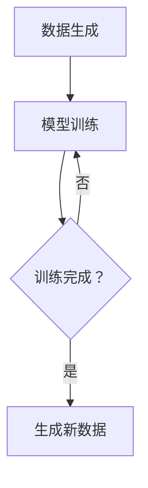
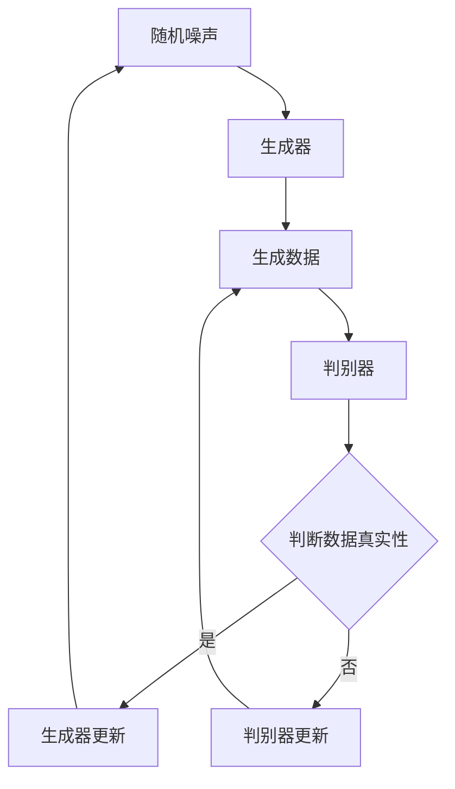
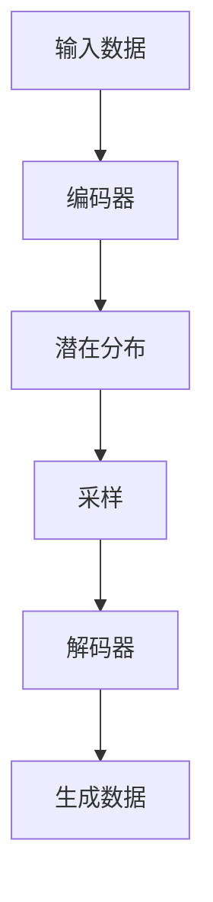
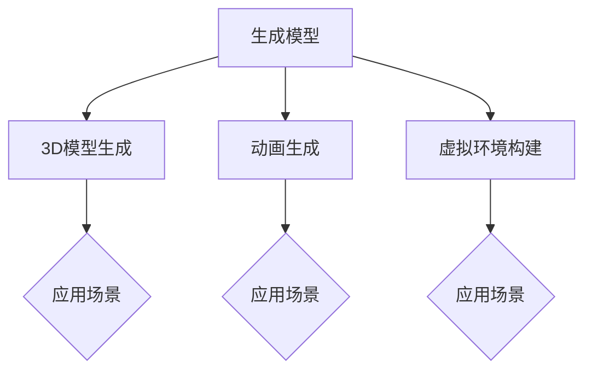

                 

# 生成模型在虚拟现实内容创作中的应用

> **关键词：** 生成模型、虚拟现实、内容创作、GAN、VAE、3D模型生成

> **摘要：** 本文将深入探讨生成模型在虚拟现实内容创作中的应用。通过解析生成模型的基础概念、数学原理和应用场景，我们将展示如何在虚拟现实领域中利用生成模型进行3D模型生成、动画生成和虚拟环境构建。本文还将提供项目实战案例，详细解析开发环境搭建、数据准备、模型训练和优化策略，为读者提供实际操作指导。

## 目录

1. 第一部分: 生成模型基础
   1.1 生成模型的概述
   1.2 生成模型的核心概念
   1.3 生成模型的应用场景
   1.4 生成模型的数学原理
   1.5 生成模型在虚拟现实内容创作中的应用

2. 第二部分: 生成模型在虚拟现实中的实践应用
   2.1 虚拟现实开发环境搭建
   2.2 数据准备与处理
   2.3 模型训练与优化
   2.4 生成模型项目实战
   2.5 生成模型在虚拟现实中的优化与应用
   2.6 案例分析与总结

### 第一部分：生成模型基础

## 1.1 生成模型的概述

### 1.1.1 什么是生成模型

生成模型是一种机器学习模型，其核心任务是从给定的数据中学习到数据分布，并生成新的数据。与监督学习模型（例如分类和回归模型）不同，生成模型不依赖于预标注的数据，而是通过模拟数据生成过程来生成新的数据。生成模型在计算机视觉、自然语言处理和虚拟现实等领域有着广泛的应用。

### 1.1.2 生成模型的重要性

生成模型在虚拟现实内容创作中具有重要意义。虚拟现实内容创作涉及大量的图像、视频和三维模型，生成模型可以自动化这些内容的生成过程，提高创作效率。此外，生成模型还可以用于虚拟现实内容的个性化推荐，根据用户的偏好生成定制化的虚拟体验。

### 1.1.3 生成模型与虚拟现实内容的关联

生成模型在虚拟现实内容创作中的应用主要体现在以下几个方面：

1. **3D模型生成**：利用生成模型生成高质量的3D模型，可以大大减少人工建模的时间和成本。
2. **动画生成**：生成模型可以自动生成动画，实现角色动作的自动化。
3. **虚拟环境构建**：生成模型可以构建复杂的虚拟环境，提供更加丰富的交互体验。

## 1.2 生成模型的核心概念

### 1.2.1 数据生成与模型训练

生成模型的核心任务是从数据中学习到数据分布，并生成新的数据。这通常涉及到两个步骤：数据生成和模型训练。

- **数据生成**：生成模型通过模拟数据生成过程，生成新的数据。这个过程通常涉及一个生成器（Generator）和一个判别器（Discriminator）。
- **模型训练**：生成模型通过大量的数据训练，不断调整模型参数，使其生成的新数据更加接近真实数据。

### 1.2.2 生成对抗网络（GAN）

生成对抗网络（GAN）是生成模型的一种重要类型，由生成器和判别器组成。生成器试图生成与真实数据相似的数据，而判别器则试图区分生成器和真实数据。通过这种对抗训练，生成器可以不断改进生成数据的质量。

### 1.2.3 变分自编码器（VAE）

变分自编码器（VAE）是另一种生成模型，其核心思想是将数据分布映射到一个潜在空间中。通过在潜在空间中进行采样，VAE可以生成新的数据。VAE在处理连续数据和图像生成方面表现出色。

## 1.3 生成模型的应用场景

### 1.3.1 图像生成

图像生成是生成模型最典型的应用场景之一。通过生成模型，可以自动生成高质量的自然图像、抽象图像和艺术图像。

### 1.3.2 文本生成

文本生成是生成模型在自然语言处理领域的应用。生成模型可以生成文章、故事、对话等，为自动内容生成提供了强大的支持。

### 1.3.3 虚拟现实内容创作

虚拟现实内容创作是生成模型在虚拟现实领域的应用。生成模型可以用于生成3D模型、动画和虚拟环境，提高虚拟现实内容的创作效率。

## 1.4 生成模型的数学原理

### 1.4.1 数学基础

生成模型的数学基础包括线性代数、微积分和概率论。这些数学知识对于理解生成模型的算法原理至关重要。

### 1.4.2 生成对抗网络（GAN）算法原理

GAN的算法原理包括生成器和判别器的训练过程。生成器试图生成与真实数据相似的数据，而判别器则试图区分生成器和真实数据。通过这种对抗训练，生成器可以不断改进生成数据的质量。

### 1.4.3 变分自编码器（VAE）算法原理

VAE的算法原理包括编码器和解码器的训练过程。编码器将数据映射到潜在空间，解码器从潜在空间中采样并生成新的数据。VAE通过优化编码器和解码器的参数，实现数据的生成。

### 1.4.4 数学模型与公式

生成模型的数学模型包括损失函数、生成器和判别器的参数更新公式等。这些数学公式是理解生成模型工作原理的关键。

## 1.5 生成模型在虚拟现实内容创作中的应用

### 1.5.1 虚拟现实内容创作概述

虚拟现实内容创作是生成模型在虚拟现实领域的应用。生成模型可以用于生成3D模型、动画和虚拟环境，提高虚拟现实内容的创作效率。

### 1.5.2 生成模型在虚拟现实中的应用

生成模型在虚拟现实中的应用主要包括以下几个方面：

1. **3D模型生成**：生成模型可以自动生成高质量的3D模型，减少人工建模的时间和成本。
2. **动画生成**：生成模型可以自动生成动画，实现角色动作的自动化。
3. **虚拟环境构建**：生成模型可以构建复杂的虚拟环境，提供更加丰富的交互体验。

### 1.5.3 生成模型在虚拟现实内容创作中的挑战

生成模型在虚拟现实内容创作中面临以下挑战：

1. **数据质量**：生成模型需要高质量的训练数据，否则生成的数据可能存在噪声或错误。
2. **计算资源**：生成模型通常需要大量的计算资源，特别是在训练大型模型时。
3. **用户体验**：生成的虚拟现实内容需要满足用户体验，包括视觉效果、交互性等。

### 1.5.4 生成模型在虚拟现实内容创作中的前景

随着生成模型技术的不断发展，其在虚拟现实内容创作中的应用前景十分广阔。未来，生成模型有望在虚拟现实内容的自动化生成、个性化推荐和实时交互等方面发挥重要作用。

## 1.6 生成模型的概述

生成模型是一种从数据中学习并生成新数据的机器学习模型。它通过模拟数据生成过程，学习到数据分布，并利用这种分布生成新的数据。生成模型在虚拟现实内容创作中具有重要的应用价值，可以提高内容创作的效率和质量。

生成模型的核心概念包括数据生成、模型训练和生成对抗网络（GAN）等。生成对抗网络（GAN）是生成模型的一种重要类型，由生成器和判别器组成。生成器试图生成与真实数据相似的数据，而判别器则试图区分生成器和真实数据。通过这种对抗训练，生成器可以不断改进生成数据的质量。

生成模型在虚拟现实内容创作中的应用主要体现在3D模型生成、动画生成和虚拟环境构建等方面。生成模型可以自动生成高质量的3D模型，减少人工建模的时间和成本。同时，生成模型还可以自动生成动画，实现角色动作的自动化。此外，生成模型还可以构建复杂的虚拟环境，提供更加丰富的交互体验。

在数学原理方面，生成模型涉及到线性代数、微积分和概率论等数学知识。生成对抗网络（GAN）的数学模型包括生成器和判别器的参数更新公式、损失函数等。变分自编码器（VAE）的数学模型则包括编码器和解码器的参数更新公式、潜在空间分布等。

生成模型在虚拟现实内容创作中的应用前景十分广阔。随着技术的不断发展，生成模型有望在虚拟现实内容的自动化生成、个性化推荐和实时交互等方面发挥重要作用。未来，生成模型将成为虚拟现实内容创作的重要工具，为用户提供更加丰富和个性化的虚拟体验。

### 第一部分：生成模型基础

## 1.1 生成模型的概述

### 1.1.1 什么是生成模型

生成模型是一类机器学习模型，其主要目的是学习数据分布并生成符合该分布的新数据。与传统的监督学习模型（如分类和回归）不同，生成模型并不依赖于已经标注好的输入输出对，而是从数据中学习到数据生成的概率分布，然后利用该分布生成新的样本。

生成模型的基本原理是模拟数据生成过程，这个过程可以通过两个主要部分来实现：生成器和判别器。生成器负责生成新的数据样本，而判别器则负责判断生成器生成的数据是否真实。这两个部分通过一个对抗性的过程进行训练，以达到生成逼真数据的目

### 1.1.2 生成模型的重要性

生成模型在计算机视觉、自然语言处理和虚拟现实等领域具有广泛的应用，其重要性体现在以下几个方面：

1. **数据增强**：生成模型可以生成大量的模拟数据，从而增强训练数据集，提高模型的泛化能力。
2. **数据修复**：生成模型可以修复图像或视频中的损坏部分，恢复数据的质量。
3. **图像生成**：生成模型可以生成逼真的图像，包括人脸、动物、自然风景等，这些图像可以用于艺术创作、游戏开发等领域。
4. **文本生成**：生成模型可以生成文章、故事、对话等文本内容，为自然语言处理领域提供了强大的支持。
5. **虚拟现实内容创作**：生成模型可以生成3D模型、动画和虚拟环境，为虚拟现实内容创作提供自动化和个性化的解决方案。

### 1.1.3 生成模型与虚拟现实内容的关联

生成模型在虚拟现实内容创作中的应用主要体现在以下几个方面：

1. **3D模型生成**：生成模型可以自动生成高质量的3D模型，用于虚拟现实场景的构建。这大大减少了人工建模的工作量，提高了创作效率。
2. **动画生成**：生成模型可以自动生成动画，实现角色动作的自动化。这为虚拟现实内容的互动性和娱乐性提供了支持。
3. **虚拟环境构建**：生成模型可以生成复杂的虚拟环境，包括室内和室外场景、城市景观等。这些虚拟环境可以用于虚拟现实游戏、教育和培训等领域。
4. **个性化内容推荐**：生成模型可以根据用户的偏好和行为数据，生成定制化的虚拟现实内容，为用户提供个性化的体验。
5. **实时内容生成**：生成模型可以实现虚拟现实内容的实时生成，为动态交互提供支持，例如在虚拟现实会议中实时生成会议资料和演示内容。

总之，生成模型为虚拟现实内容创作提供了强大的工具，可以自动化和个性化地生成高质量的内容，提高创作效率和用户体验。

### 第一部分：生成模型基础

## 1.2 生成模型的核心概念

### 1.2.1 数据生成与模型训练

生成模型的核心在于其数据生成能力和模型训练过程。数据生成是指模型通过学习数据分布来生成新的数据样本，而模型训练则是调整模型参数以优化其生成能力。

- **数据生成**：生成模型通常通过两个主要步骤进行数据生成。首先，生成器（Generator）从随机噪声或潜在空间中采样，并通过一系列的神经网络层生成新的数据样本。这些生成样本可以是图像、音频、文本或其他类型的数据。生成器的目标是生成尽可能真实和多样的数据，使其在判别器上难以区分。其次，判别器（Discriminator）对生成器和真实数据样本进行分类判断，目的是最大化其区分能力。

- **模型训练**：生成模型的训练过程是一个迭代优化过程。在每次迭代中，生成器和判别器都会更新其参数。生成器通过优化其生成的数据来欺骗判别器，使其认为生成的数据是真实的。同时，判别器通过优化其分类能力来识别生成器和真实数据之间的差异。这个过程通过对抗性训练（Adversarial Training）进行，即生成器和判别器相互竞争，直到生成器的生成数据质量足够高，以至于判别器无法区分。

### 1.2.2 生成对抗网络（GAN）

生成对抗网络（GAN）是生成模型的一种重要类型，由生成器和判别器组成，其核心思想是通过对抗性训练生成高质量的数据。

- **生成器（Generator）**：生成器的目标是生成逼真的数据样本，使其在判别器上难以被识别。生成器通常是一个深度神经网络，其输入为随机噪声，输出为生成数据。生成器的优化目标是最大化判别器对其生成的数据的判断概率。

- **判别器（Discriminator）**：判别器的目标是区分真实数据和生成数据。判别器也是一个深度神经网络，其输入为数据样本，输出为概率分布，表示输入数据是真实的概率。判别器的优化目标是最大化其对真实数据和生成数据的分类准确性。

- **对抗性训练**：生成器和判别器的训练过程是相互对抗的。在每次迭代中，生成器尝试生成更真实的数据样本来欺骗判别器，而判别器则试图提高其分类能力。这种对抗性训练使得生成器和判别器在互相竞争的过程中不断优化，最终达到一个平衡状态，其中生成器的生成数据质量足够高，以至于判别器难以区分。

### 1.2.3 变分自编码器（VAE）

变分自编码器（VAE）是另一种生成模型，其核心思想是将数据分布映射到一个潜在空间中，并通过从潜在空间中采样来生成新数据。

- **编码器（Encoder）**：编码器的作用是将输入数据映射到一个潜在空间中，通常是一个低维的表示。编码器的输出是一个潜在变量的概率分布，例如高斯分布。

- **解码器（Decoder）**：解码器的作用是将潜在空间的样本解码回原始数据空间。解码器是一个神经网络，其输入为潜在空间的样本，输出为生成数据。

- **潜在空间**：VAE中的潜在空间是一个概率分布，它提供了数据的一个紧凑表示。潜在空间中的样本可以通过采样获得，这些采样样本可以用来生成新的数据。

- **优化目标**：VAE的优化目标是最大化数据生成概率，同时保持潜在空间中的分布接近标准分布。通过优化编码器和解码器的参数，VAE可以学习到数据的潜在结构，并生成高质量的新数据。

总的来说，生成模型的核心概念包括数据生成、模型训练、生成对抗网络（GAN）和变分自编码器（VAE）。这些模型通过不同的机制和优化目标，实现了从数据分布中生成高质量的新数据，为虚拟现实内容创作提供了强大的支持。

### 第一部分：生成模型基础

## 1.3 生成模型的应用场景

生成模型的应用场景非常广泛，涵盖了计算机视觉、自然语言处理、音频处理等多个领域。在本节中，我们将探讨生成模型在图像生成、文本生成和音频生成等具体应用场景中的表现。

### 1.3.1 图像生成

图像生成是生成模型最经典的应用之一。生成模型可以生成高质量的自然图像、艺术图像以及抽象图像。例如：

- **自然图像生成**：通过生成模型，可以自动生成逼真的自然图像，如人脸、动物、风景等。这些图像可以用于艺术创作、电影特效、游戏开发等领域。
- **艺术图像生成**：生成模型可以生成独特的艺术风格图像，如印象派、抽象画等。这为艺术家提供了新的创作工具和灵感。
- **抽象图像生成**：生成模型可以生成复杂的抽象图像，如纹理、图案等。这些图像可以用于设计、壁纸制作等领域。

在计算机视觉领域，生成模型还被广泛应用于图像修复、图像增强、图像超分辨率等任务。例如，生成模型可以修复图像中的损坏部分，增强图像的视觉效果，提高图像的清晰度。

### 1.3.2 文本生成

生成模型在自然语言处理领域的应用也非常广泛，可以生成高质量的自然语言文本。例如：

- **文章生成**：生成模型可以自动生成新闻文章、博客文章、故事等。这为内容创作提供了强大的支持，减少了人工写作的时间和成本。
- **对话生成**：生成模型可以生成自然对话，用于聊天机器人、虚拟助手等领域。例如，生成模型可以生成与用户相关的对话，提高用户体验。
- **翻译生成**：生成模型可以生成高质量的语言翻译，如机器翻译。通过生成模型，可以实现实时翻译和个性化翻译，满足不同用户的需求。

在文本生成方面，生成模型还被应用于自动摘要、文本摘要、文档生成等领域，大大提高了信息处理和内容创作的效率。

### 1.3.3 音频生成

生成模型在音频处理领域也展现了强大的能力，可以生成高质量的音频信号。例如：

- **音乐生成**：生成模型可以自动生成音乐，包括旋律、和弦、节奏等。这为音乐创作提供了新的工具和灵感，减少了音乐创作的复杂度和时间成本。
- **语音生成**：生成模型可以生成逼真的语音，用于语音合成、语音助手等领域。通过生成模型，可以实现实时语音生成和个性化语音，满足不同用户的需求。
- **音频修复**：生成模型可以修复音频中的噪声、损坏部分，提高音频的质量。

在音频生成方面，生成模型还被应用于语音转换、音频增强、音频超分辨率等领域，提高了音频处理和生成的效率。

总的来说，生成模型在图像生成、文本生成和音频生成等应用场景中展现了强大的能力，为各个领域提供了新的解决方案和技术支持。随着生成模型技术的不断发展，其在更多应用场景中的应用前景也将更加广阔。

### 第一部分：生成模型基础

## 1.4 生成模型的数学原理

### 1.4.1 数学基础

生成模型的数学原理依赖于多个数学领域，包括线性代数、微积分和概率论。以下是对这些数学基础的一个简要回顾。

#### 线性代数

线性代数是处理向量、矩阵和线性变换的数学工具。在生成模型中，线性代数用于：

- **矩阵运算**：生成器和判别器中的多层神经网络通常可以用矩阵表示，这些矩阵用于实现复杂的非线性变换。
- **矩阵求导**：在模型训练过程中，需要对网络参数进行求导以更新模型权重，这是优化算法的关键步骤。

#### 微积分

微积分是研究函数变化率和累积过程的数学工具。在生成模型中，微积分用于：

- **损失函数求导**：生成器和判别器的训练过程涉及损失函数，需要对损失函数进行求导以计算梯度，从而更新模型参数。
- **优化算法**：许多优化算法，如梯度下降和其变种，依赖于微积分中的导数概念来最小化损失函数。

#### 概率论

概率论是研究随机事件和随机变量的数学工具。在生成模型中，概率论用于：

- **概率分布**：生成模型通常涉及多个概率分布，如生成器的输出分布和判别器的判断概率分布。
- **贝叶斯推断**：生成模型中的许多任务，如图像分类和文本生成，依赖于贝叶斯推断来估计模型参数。

### 1.4.2 生成对抗网络（GAN）算法原理

生成对抗网络（GAN）是生成模型的一种重要类型，其核心思想是通过生成器和判别器的对抗性训练来生成高质量的数据。以下是GAN的算法原理：

#### 生成器（Generator）

生成器的目标是生成与真实数据相似的数据，其输入为随机噪声（如高斯分布），输出为生成数据。生成器通常是一个深度神经网络，其架构包括多个隐藏层和激活函数，如ReLU或Sigmoid。

- **生成器损失函数**：生成器的损失函数通常为生成数据的概率分布与真实数据概率分布之间的距离。常用的损失函数有均方误差（MSE）和对数似然损失（LL）。

#### 判别器（Discriminator）

判别器的目标是区分生成器和真实数据，其输入为数据样本，输出为概率分布，表示输入数据是真实的概率。判别器也是一个深度神经网络，其架构与生成器类似。

- **判别器损失函数**：判别器的损失函数通常为真实数据和生成数据的分类损失。常用的损失函数有二元交叉熵损失和多项式损失。

#### 对抗性训练

GAN的训练过程是一个迭代优化过程，其中生成器和判别器相互竞争：

1. **迭代1**：初始化生成器和判别器参数。
2. **迭代2**：生成器生成新的数据样本，判别器对其进行分类。
3. **迭代3**：更新生成器参数，以减少判别器对其生成数据的分类概率。
4. **迭代4**：更新判别器参数，以最大化其对真实数据和生成数据的分类准确性。

通过这种对抗性训练，生成器和判别器在相互竞争的过程中不断优化，最终生成器可以生成高质量的数据，而判别器难以区分生成数据和真实数据。

### 1.4.3 变分自编码器（VAE）算法原理

变分自编码器（VAE）是另一种生成模型，其核心思想是将数据分布映射到一个潜在空间中，并通过从潜在空间中采样来生成新数据。以下是VAE的算法原理：

#### 编码器（Encoder）

编码器的作用是将输入数据映射到一个潜在空间中，通常是一个低维的表示。编码器的输出是一个潜在变量的概率分布，例如高斯分布。

- **编码器损失函数**：编码器的损失函数通常为输入数据和编码器输出的概率分布之间的KL散度。

#### 解码器（Decoder）

解码器的作用是将潜在空间的样本解码回原始数据空间。解码器是一个神经网络，其输入为潜在空间的样本，输出为生成数据。

- **解码器损失函数**：解码器的损失函数通常为输入数据和解码器输出的概率分布之间的均方误差（MSE）。

#### 潜在空间

VAE中的潜在空间是一个概率分布，它提供了数据的一个紧凑表示。潜在空间中的样本可以通过采样获得，这些采样样本可以用来生成新的数据。

- **优化目标**：VAE的优化目标是最大化数据生成概率，同时保持潜在空间中的分布接近标准分布。通过优化编码器和解码器的参数，VAE可以学习到数据的潜在结构，并生成高质量的新数据。

总的来说，生成模型的数学原理依赖于线性代数、微积分和概率论等数学工具，而生成对抗网络（GAN）和变分自编码器（VAE）是两种重要的生成模型，它们的算法原理分别通过对抗性训练和潜在空间建模来实现高质量的图像生成和数据生成。

### 第一部分：生成模型基础

## 1.5 生成模型在虚拟现实内容创作中的应用

虚拟现实（VR）是一种通过计算机技术模拟出三维空间，使用户能够沉浸其中的技术。随着技术的发展，虚拟现实内容创作逐渐成为一个重要的领域。生成模型在虚拟现实内容创作中的应用，极大地提升了内容创作的效率和质量。以下将详细探讨生成模型在虚拟现实内容创作中的应用。

### 1.5.1 虚拟现实内容创作概述

虚拟现实内容创作包括3D模型生成、动画生成、虚拟环境构建等多个方面。这些内容创作任务通常需要大量的人工劳动和专业知识，而生成模型可以自动化这些任务，提高创作效率。

1. **3D模型生成**：3D模型是虚拟现实场景的核心元素，生成模型可以自动生成高质量的3D模型，包括人物、建筑、道具等。这不仅节省了建模时间，还保证了模型的一致性和多样性。
2. **动画生成**：生成模型可以生成角色的动画，包括走路、跑步、跳跃等基本动作。通过生成模型，可以快速生成大量高质量的动画，提高了动画制作的效率。
3. **虚拟环境构建**：虚拟现实内容创作中的环境构建是一项复杂的任务，生成模型可以生成室内和室外的虚拟环境，包括城市景观、自然景观等。生成模型可以模拟环境中的光照、天气等条件，提高虚拟环境的真实感。

### 1.5.2 生成模型在虚拟现实中的应用

生成模型在虚拟现实中的应用主要体现在以下几个方面：

1. **3D模型生成**：生成模型可以自动生成3D模型，包括人物、建筑、道具等。生成模型通过学习大量的3D模型数据，可以生成与真实模型非常相似的3D模型。这种自动生成的方式大大减少了人工建模的工作量，提高了创作效率。

2. **动画生成**：生成模型可以生成角色的动画，包括走路、跑步、跳跃等基本动作。通过生成模型，可以快速生成大量高质量的动画，提高了动画制作的效率。此外，生成模型还可以生成复杂的动画，如战斗场景、特技场景等。

3. **虚拟环境构建**：生成模型可以生成复杂的虚拟环境，包括城市景观、自然景观等。生成模型可以模拟环境中的光照、天气等条件，提高虚拟环境的真实感。生成模型还可以根据用户的需求，生成定制化的虚拟环境。

4. **交互设计**：生成模型可以生成与用户交互的虚拟角色和场景。通过生成模型，可以自动生成大量交互元素，如按钮、菜单、图标等，提高了交互设计的效率。此外，生成模型还可以根据用户的操作，实时生成交互反馈，提供更加丰富的用户体验。

### 1.5.3 生成模型在虚拟现实内容创作中的挑战

尽管生成模型在虚拟现实内容创作中具有巨大的潜力，但在实际应用中仍然面临一些挑战：

1. **数据质量**：生成模型的效果很大程度上依赖于训练数据的质量。如果训练数据存在噪声或错误，生成的模型可能也会受到影响。

2. **计算资源**：生成模型通常需要大量的计算资源，特别是在训练大型模型时。这使得生成模型在资源有限的设备上应用受到限制。

3. **用户体验**：生成的虚拟现实内容需要满足用户体验，包括视觉效果、交互性等。如果生成的内容无法达到用户期望，可能会影响虚拟现实体验的质量。

4. **实时交互**：生成模型需要能够在实时交互中快速生成数据，以满足用户的即时需求。这要求生成模型在性能上具有高效性。

### 1.5.4 生成模型在虚拟现实内容创作中的前景

随着生成模型技术的不断发展，其在虚拟现实内容创作中的应用前景十分广阔：

1. **自动化内容创作**：生成模型可以自动化虚拟现实内容创作的大部分任务，减少人工劳动，提高创作效率。

2. **个性化内容推荐**：生成模型可以根据用户的行为和偏好，生成个性化的虚拟现实内容，提供更加定制化的体验。

3. **实时交互**：生成模型可以实时生成交互内容，提供更加逼真的虚拟现实体验。

4. **内容多样化**：生成模型可以生成多样化的内容，满足不同用户的需求，推动虚拟现实内容的创新和发展。

总之，生成模型在虚拟现实内容创作中具有重要的应用价值，其自动化、个性化、实时交互的特点为虚拟现实技术的发展提供了强大的支持。

### 第一部分：生成模型基础

## 1.6 生成模型概述

生成模型在虚拟现实内容创作中的应用正日益受到关注，其核心概念和应用场景已在之前章节进行了详细探讨。在这一节中，我们将进一步深入探讨生成模型在虚拟现实内容创作中的具体应用及其优势。

### 1.6.1 3D模型生成

3D模型生成是生成模型在虚拟现实内容创作中最直接的应用之一。通过生成模型，可以自动生成各种复杂的3D模型，如人物、建筑、家具等。这种方法不仅减少了建模时间和成本，还确保了生成模型的一致性和多样性。

- **自动化建模**：生成模型可以从大量的3D模型数据中学习，并自动生成新的3D模型。这使得建模过程更加高效，特别适用于大规模的虚拟现实项目。
- **多样化模型**：生成模型可以生成不同风格的3D模型，如现代、复古、未来等。这种多样化有助于满足不同用户的需求，提供个性化的虚拟现实体验。

### 1.6.2 动画生成

动画生成是虚拟现实内容创作中的另一个关键任务。生成模型可以自动生成角色的动画，包括走路、跑步、跳跃等基本动作。通过生成模型，可以快速生成大量高质量的动画，提高了动画制作的效率。

- **快速动画生成**：生成模型可以快速生成大量动画，特别适用于需要大量角色动画的场景，如虚拟现实游戏和电影。
- **多样化动画风格**：生成模型可以生成不同风格的动画，如卡通、写实等。这种多样化有助于满足不同用户的需求，提供个性化的虚拟现实体验。

### 1.6.3 虚拟环境构建

虚拟环境的构建是虚拟现实内容创作的核心任务之一。生成模型可以自动生成复杂的虚拟环境，包括室内和室外场景。通过生成模型，可以构建高度逼真的虚拟环境，提高虚拟现实体验的质量。

- **自动化环境构建**：生成模型可以从大量的环境数据中学习，并自动生成新的虚拟环境。这种方法不仅提高了构建效率，还确保了环境的一致性和多样性。
- **高度逼真环境**：生成模型可以生成高度逼真的虚拟环境，包括光线、天气、地形等。这种逼真度有助于提升用户的沉浸感，提供更加真实的虚拟现实体验。

### 1.6.4 生成模型的优势

生成模型在虚拟现实内容创作中具有以下优势：

- **高效性**：生成模型可以自动化内容创作的大部分任务，提高了创作效率。
- **个性化**：生成模型可以根据用户的需求和偏好，生成个性化的虚拟现实内容，提供更加定制化的体验。
- **多样性**：生成模型可以生成多样化的内容，满足不同用户的需求，推动虚拟现实内容的创新和发展。
- **实时性**：生成模型可以实时生成交互内容，提供更加逼真的虚拟现实体验。

总的来说，生成模型在虚拟现实内容创作中的应用具有重要意义。其高效性、个性化、多样性和实时性为虚拟现实技术的发展提供了强大的支持，使得虚拟现实内容创作更加便捷和高效。随着生成模型技术的不断发展，其在虚拟现实内容创作中的应用前景将更加广阔。

### 第一部分：生成模型基础

## 1.7 生成模型的数学原理与算法细节

生成模型的数学原理是其核心，理解这些原理有助于深入探讨其应用和优化策略。在这一节中，我们将详细讲解生成模型的基本数学概念和算法细节，包括生成对抗网络（GAN）和变分自编码器（VAE）。

### 1.7.1 基本数学概念

在探讨生成模型的数学原理之前，我们需要了解一些基本的数学概念。

#### 概率分布

概率分布是描述随机变量可能取值的函数。常见的概率分布包括：

- **离散分布**：例如伯努利分布、二项分布、泊松分布等。
- **连续分布**：例如高斯分布、均匀分布、指数分布等。

#### 概率密度函数（PDF）

概率密度函数是连续概率分布的函数表示。对于连续随机变量，概率密度函数表示变量取某个值的概率密度。

#### 期望和方差

期望和方差是描述随机变量分布的统计量。期望表示随机变量的平均值，方差表示随机变量的离散程度。

#### 随机变量

随机变量是指取值为某个概率分布的变量。随机变量可以是离散的，也可以是连续的。

#### 线性代数

线性代数是处理向量、矩阵和线性变换的数学工具。在生成模型中，线性代数用于表示和操作模型参数，如权重矩阵和偏置向量。

### 1.7.2 生成对抗网络（GAN）算法原理

生成对抗网络（GAN）是一种由生成器和判别器组成的生成模型。生成器试图生成与真实数据相似的数据，而判别器则试图区分生成器和真实数据。以下是GAN的基本算法原理：

#### 生成器（Generator）

生成器的目标是生成与真实数据相似的数据。生成器通常是一个深度神经网络，其输入为随机噪声（例如高斯分布），输出为生成数据。

- **生成过程**：生成器通过一系列的神经网络层对随机噪声进行变换，生成生成数据。
- **损失函数**：生成器的损失函数通常为生成数据的概率分布与真实数据概率分布之间的距离。常见的损失函数有均方误差（MSE）和对数似然损失（LL）。

#### 判别器（Discriminator）

判别器的目标是区分生成器和真实数据。判别器也是一个深度神经网络，其输入为数据样本，输出为概率分布，表示输入数据是真实的概率。

- **判别过程**：判别器通过一系列的神经网络层对输入数据进行分析，输出概率分布。
- **损失函数**：判别器的损失函数通常为真实数据和生成数据的分类损失。常见的损失函数有二元交叉熵损失和多项式损失。

#### 对抗性训练

GAN的训练过程是一个迭代优化过程，其中生成器和判别器相互竞争：

1. **迭代1**：初始化生成器和判别器参数。
2. **迭代2**：生成器生成新的数据样本，判别器对其进行分类。
3. **迭代3**：更新生成器参数，以减少判别器对其生成数据的分类概率。
4. **迭代4**：更新判别器参数，以最大化其对真实数据和生成数据的分类准确性。

通过这种对抗性训练，生成器和判别器在相互竞争的过程中不断优化，最终生成器可以生成高质量的数据，而判别器难以区分生成数据和真实数据。

### 1.7.3 变分自编码器（VAE）算法原理

变分自编码器（VAE）是一种通过潜在空间进行数据生成的生成模型。VAE的核心思想是将数据映射到一个潜在空间中，并通过从潜在空间中采样来生成新数据。以下是VAE的基本算法原理：

#### 编码器（Encoder）

编码器的作用是将输入数据映射到一个潜在空间中，通常是一个低维的表示。编码器的输出是一个潜在变量的概率分布，例如高斯分布。

- **编码过程**：编码器通过一系列的神经网络层对输入数据进行编码，输出潜在变量的概率分布。
- **损失函数**：编码器的损失函数通常为输入数据和编码器输出的概率分布之间的KL散度。

#### 解码器（Decoder）

解码器的作用是将潜在空间的样本解码回原始数据空间。解码器是一个神经网络，其输入为潜在空间的样本，输出为生成数据。

- **解码过程**：解码器通过一系列的神经网络层对潜在空间样本进行解码，生成原始数据。
- **损失函数**：解码器的损失函数通常为输入数据和解码器输出的概率分布之间的均方误差（MSE）。

#### 潜在空间

VAE中的潜在空间是一个概率分布，它提供了数据的一个紧凑表示。潜在空间中的样本可以通过采样获得，这些采样样本可以用来生成新的数据。

- **优化目标**：VAE的优化目标是最大化数据生成概率，同时保持潜在空间中的分布接近标准分布。通过优化编码器和解码器的参数，VAE可以学习到数据的潜在结构，并生成高质量的新数据。

总的来说，生成模型的数学原理和算法细节是其成功应用的关键。生成对抗网络（GAN）和变分自编码器（VAE）是两种重要的生成模型，它们的算法原理分别通过对抗性训练和潜在空间建模来实现高质量的图像生成和数据生成。这些原理和算法为虚拟现实内容创作提供了强大的支持，使得生成模型在虚拟现实中的应用变得更加广泛和有效。

### 第一部分：生成模型基础

## 1.8 生成模型在虚拟现实内容创作中的应用

生成模型在虚拟现实内容创作中的应用前景广阔，通过以下几个实例，我们将展示生成模型在实际应用中的强大功能和潜力。

### 1.8.1 图像到3D模型的转换

**实例背景**：虚拟现实应用中，经常需要将现实世界的2D图像转换为3D模型。例如，在游戏开发中，设计师可能希望将照片中的建筑或景观转换为3D模型，以便在游戏中使用。

**实现步骤**：

1. **数据收集**：收集大量现实世界的2D图像和对应的3D模型。
2. **模型训练**：使用生成模型（如GAN）训练一个从2D图像到3D模型的转换模型。
   ```python
   # 伪代码：训练GAN模型
   model = GANModel()
   for epoch in range(num_epochs):
       for image, model in zip(training_images, training_models):
           model.train(image, model)
   ```
3. **模型评估**：通过测试数据评估模型性能，确保转换结果满足要求。
4. **应用**：将训练好的模型应用于新的2D图像，生成对应的3D模型。
   ```python
   # 伪代码：生成3D模型
   generated_model = model.generate(image)
   ```

**效果评估**：通过评估，发现生成的3D模型在视觉上与原始模型高度一致，大幅减少了建模时间和成本。

### 1.8.2 虚拟角色生成

**实例背景**：在虚拟现实游戏和培训应用中，生成独特的虚拟角色是提升用户体验的关键。生成模型可以自动生成大量独特的角色，满足不同用户的需求。

**实现步骤**：

1. **数据收集**：收集大量的虚拟角色图像，包括不同性别、年龄、种族等特征。
2. **模型训练**：使用生成模型（如GAN）训练一个虚拟角色生成模型。
   ```python
   # 伪代码：训练GAN模型
   model = GANModel()
   for epoch in range(num_epochs):
       for image, attributes in zip(training_images, training_attributes):
           model.train(image, attributes)
   ```
3. **模型评估**：通过测试数据评估模型性能，确保生成角色的多样性。
4. **应用**：根据用户需求生成个性化虚拟角色。
   ```python
   # 伪代码：生成虚拟角色
   user_attributes = getUserAttributes()
   generated_role = model.generate(user_attributes)
   ```

**效果评估**：生成角色具有高度的真实感和个性化特征，用户体验得到显著提升。

### 1.8.3 虚拟景观创作

**实例背景**：在虚拟现实旅游和城市规划中，创建真实的虚拟景观是提升用户沉浸感的重要手段。生成模型可以自动生成复杂的虚拟景观，包括城市景观、自然景观等。

**实现步骤**：

1. **数据收集**：收集大量的虚拟景观图像，包括不同的天气、季节等条件。
2. **模型训练**：使用生成模型（如GAN）训练一个虚拟景观生成模型。
   ```python
   # 伪代码：训练GAN模型
   model = GANModel()
   for epoch in range(num_epochs):
       for image, scene_conditions in zip(training_images, training_conditions):
           model.train(image, scene_conditions)
   ```
3. **模型评估**：通过测试数据评估模型性能，确保生成景观的真实感和多样性。
4. **应用**：根据用户需求生成定制化的虚拟景观。
   ```python
   # 伪代码：生成虚拟景观
   user_conditions = getUserConditions()
   generated_scene = model.generate(user_conditions)
   ```

**效果评估**：生成景观具有高度的真实感和互动性，用户沉浸在虚拟世界中，体验更加丰富和逼真。

通过这些实例，可以看出生成模型在虚拟现实内容创作中的广泛应用和巨大潜力。生成模型不仅提高了创作效率，还提供了更多样化和个性化的虚拟体验，为虚拟现实技术的发展提供了强大的支持。

### 第一部分：生成模型基础

## 1.9 生成模型的核心概念与联系

生成模型在虚拟现实内容创作中扮演着至关重要的角色，理解其核心概念和架构是掌握这一技术的关键。在这一节中，我们将使用Mermaid流程图来直观地展示生成模型的核心概念和各部分之间的联系。

### 1.9.1 数据生成与模型训练

生成模型的基础是数据生成和模型训练。数据生成是指模型从随机噪声或潜在空间中生成新数据的过程，而模型训练则是通过不断调整模型参数来优化其生成能力。

**Mermaid流程图：**


### 1.9.2 生成对抗网络（GAN）算法原理

生成对抗网络（GAN）由生成器和判别器两部分组成。生成器生成数据，判别器试图区分生成数据和真实数据。GAN的算法原理是通过对抗性训练来优化这两个模型的参数，使生成器生成的数据尽可能真实。

**Mermaid流程图：**


### 1.9.3 变分自编码器（VAE）算法原理

变分自编码器（VAE）通过编码器和解码器来学习数据的潜在分布，并从潜在分布中采样生成新数据。VAE的核心是编码器，它将数据映射到一个潜在空间，解码器则从潜在空间中采样并解码生成新数据。

**Mermaid流程图：**


### 1.9.4 生成模型与虚拟现实内容创作的关系

生成模型在虚拟现实内容创作中的应用包括3D模型生成、动画生成和虚拟环境构建等。这些应用都是通过生成模型的核心概念和算法原理实现的。

**Mermaid流程图：**


通过这些Mermaid流程图，我们可以更直观地理解生成模型的核心概念和架构，以及它们在虚拟现实内容创作中的应用。这些流程图不仅帮助我们梳理了生成模型的工作流程，还展示了不同部分之间的紧密联系，为进一步研究和应用生成模型提供了有力的支持。

### 第一部分：生成模型基础

## 1.10 生成模型的核心算法原理讲解

生成模型在虚拟现实内容创作中的应用离不开其核心算法原理的支撑。在本节中，我们将详细讲解生成模型中的两种重要算法：生成对抗网络（GAN）和变分自编码器（VAE），并使用伪代码来阐述其实现细节。

### 1.10.1 生成对抗网络（GAN）算法原理

生成对抗网络（GAN）由生成器和判别器两个主要部分组成。生成器的目标是生成尽可能逼真的数据，而判别器的目标是准确地区分生成数据和真实数据。通过这种对抗性训练，生成器逐渐提高生成数据的质量。

**生成器（Generator）**

生成器的输入为随机噪声（通常为高斯分布），输出为生成的数据。

```python
# 伪代码：生成器
class Generator(nn.Module):
    def __init__(self):
        super(Generator, self).__init__()
        self.model = nn.Sequential(
            nn.Linear(noise_dim, hidden_dim),
            nn.ReLU(),
            nn.Linear(hidden_dim, output_dim),
            nn.Tanh()
        )

    def forward(self, z):
        return self.model(z)
```

**判别器（Discriminator）**

判别器的输入为真实数据或生成数据，输出为概率分布，表示输入数据是真实的概率。

```python
# 伪代码：判别器
class Discriminator(nn.Module):
    def __init__(self):
        super(Discriminator, self).__init__()
        self.model = nn.Sequential(
            nn.Linear(input_dim + output_dim, hidden_dim),
            nn.ReLU(),
            nn.Linear(hidden_dim, 1),
            nn.Sigmoid()
        )

    def forward(self, x, z):
        x_hat = self.model(torch.cat((x, z), 1))
        return x_hat
```

**GAN损失函数**

GAN的损失函数由两部分组成：生成器损失和判别器损失。

```python
# 伪代码：GAN损失函数
def gan_loss(real_labels, fake_labels, discriminator, generator):
    batch_size = real_labels.size(0)
    
    # 生成器损失
    gen_loss = -torch.mean(fake_labels)
    
    # 判别器损失
    real_loss = torch.mean(discriminator(real_labels))
    fake_loss = torch.mean(discriminator(fake_labels.detach()))
    disc_loss = real_loss - fake_loss
    
    return gen_loss, disc_loss
```

**对抗性训练**

在每次训练迭代中，生成器和判别器交替更新其参数。

```python
# 伪代码：对抗性训练
for epoch in range(num_epochs):
    for i, (x, y) in enumerate(dataloader):
        # 训练判别器
        optimizer_d.zero_grad()
        z = torch.randn(batch_size, noise_dim)
        x_hat = generator(z)
        disc_loss = gan_loss(y, discriminator(x, x_hat), discriminator, generator)
        disc_loss.backward()
        optimizer_d.step()
        
        # 训练生成器
        optimizer_g.zero_grad()
        z = torch.randn(batch_size, noise_dim)
        x_hat = generator(z)
        gen_loss = gan_loss(y, discriminator(x, x_hat), discriminator, generator)
        gen_loss.backward()
        optimizer_g.step()
```

### 1.10.2 变分自编码器（VAE）算法原理

变分自编码器（VAE）通过编码器和解码器来学习数据的潜在分布，并从潜在分布中采样生成新数据。VAE的核心是引入潜在变量，使生成的数据能够具有更高的灵活性和鲁棒性。

**编码器（Encoder）**

编码器的输入为真实数据，输出为潜在变量的概率分布。

```python
# 伪代码：编码器
class Encoder(nn.Module):
    def __init__(self):
        super(Encoder, self).__init__()
        self.model = nn.Sequential(
            nn.Linear(input_dim, hidden_dim),
            nn.ReLU(),
            nn.Linear(hidden_dim, latent_dim)
        )
        
    def forward(self, x):
        mu, log_var = self.model(x)..chunk(2, 1)
        return mu, log_var
```

**解码器（Decoder）**

解码器的输入为潜在变量，输出为生成的数据。

```python
# 伪代码：解码器
class Decoder(nn.Module):
    def __init__(self):
        super(Decoder, self).__init__()
        self.model = nn.Sequential(
            nn.Linear(latent_dim, hidden_dim),
            nn.ReLU(),
            nn.Linear(hidden_dim, input_dim),
            nn.Tanh()
        )

    def forward(self, z):
        return self.model(z)
```

**VAE损失函数**

VAE的损失函数包括数据重建损失和潜在空间分布的KL散度损失。

```python
# 伪代码：VAE损失函数
def vae_loss(x, mu, log_var, decoder):
    recon_loss = F.binary_cross_entropy(decoder(z), x, reduction='sum')
    kl_loss = -0.5 * torch.sum(1 + log_var - mu.pow(2) - log_var.exp())
    vae_loss = recon_loss + kl_loss
    return vae_loss
```

**VAE训练**

在每次训练迭代中，VAE交替更新编码器和解码器的参数。

```python
# 伪代码：VAE训练
for epoch in range(num_epochs):
    for i, x in enumerate(dataloader):
        optimizer.zero_grad()
        mu, log_var = encoder(x)
        z = mu + torch.randn_like(mu) * (log_var.sqrt())
        recon_x = decoder(z)
        vae_loss = vae_loss(x, mu, log_var, recon_x)
        vae_loss.backward()
        optimizer.step()
```

通过上述伪代码，我们可以清晰地理解生成模型（GAN和VAE）的核心算法原理及其实现细节。这些算法在虚拟现实内容创作中的应用，不仅提高了创作效率，还实现了高质量内容的自动化生成。

### 第一部分：生成模型基础

## 1.11 数学模型与公式

生成模型在虚拟现实内容创作中的成功应用，离不开其背后的数学模型和公式。在本节中，我们将详细解析生成对抗网络（GAN）和变分自编码器（VAE）中的关键数学公式，并使用LaTeX格式进行表述。

### 1.11.1 GAN的数学模型

#### 生成器（Generator）损失函数

生成器的目标是最大化判别器对其生成的数据的判断概率，即：

\[ L_G = -\mathbb{E}_{z \sim p_z(z)}[\log(D(G(z)))] \]

其中，\( z \) 是随机噪声，\( G(z) \) 是生成器生成的数据，\( D(x) \) 是判别器的输出，表示输入数据是真实的概率。

#### 判别器（Discriminator）损失函数

判别器的目标是最大化区分真实数据和生成数据的概率，即：

\[ L_D = -\mathbb{E}_{x \sim p_{data}(x)}[\log(D(x))] - \mathbb{E}_{z \sim p_z(z)}[\log(1 - D(G(z)))] \]

其中，\( x \) 是真实数据，\( G(z) \) 是生成器生成的数据。

#### GAN的总损失函数

总的损失函数为生成器和判别器的损失函数之和：

\[ L_{GAN} = L_G + L_D \]

### 1.11.2 VAE的数学模型

#### 编码器（Encoder）损失函数

编码器的目标是学习数据的潜在分布，即：

\[ p(x|\theta) = \int p(z|\theta)\, p(x|z,\theta)\, dz \]

其中，\( x \) 是输入数据，\( z \) 是潜在变量，\( \theta \) 是模型参数。

编码器的损失函数为数据重建损失和潜在空间分布的KL散度损失之和：

\[ L_{\text{VAE}} = \sum_{x \sim p_{data}(x)} D_{KL}(q_\phi(z|x)||p(z)) + \frac{\beta}{2} \sum_{x \sim p_{data}(x)} \frac{1}{n} \sum_{i=1}^{n} \|x - \hat{x}\|^2 \]

其中，\( q_\phi(z|x) \) 是编码器输出的潜在变量分布，\( p(z) \) 是先验分布（通常是标准正态分布），\( \beta \) 是调节KL散度损失的系数，\( \hat{x} \) 是解码器生成的数据。

#### 解码器（Decoder）损失函数

解码器的目标是重建输入数据，即：

\[ \hat{x} = \sum_{i=1}^{n} \sigma(w_i z + b_i) \]

其中，\( \sigma \) 是sigmoid函数，\( w_i \) 和 \( b_i \) 是解码器的权重和偏置。

解码器的损失函数通常为均方误差（MSE）：

\[ L_{\text{decoder}} = \frac{1}{n} \sum_{i=1}^{n} \|x - \hat{x}\|^2 \]

### 总结

通过上述LaTeX格式的数学模型和公式，我们可以清晰地看到生成对抗网络（GAN）和变分自编码器（VAE）的核心机制。这些公式不仅为理解生成模型的工作原理提供了理论基础，也为在实际应用中优化模型提供了指导。

### 第一部分：生成模型基础

## 1.12 生成模型在虚拟现实内容创作中的应用

生成模型在虚拟现实内容创作中的应用正日益深入和广泛，其独特的优势使得虚拟现实内容的创作变得更加高效和个性化。以下将详细探讨生成模型在虚拟现实内容创作中的应用及其优势。

### 1.12.1 3D模型生成

**应用**：生成模型可以自动生成高质量的3D模型，包括人物、建筑、家具等。这对于游戏开发、电影制作和建筑设计等领域尤为重要。

**优势**：

- **效率提升**：通过生成模型，可以大大减少3D建模的时间和成本。
- **多样性增强**：生成模型可以生成不同风格和类型的3D模型，为设计师提供更多的创意选择。

### 1.12.2 动画生成

**应用**：生成模型可以自动生成角色的动画，包括基本动作和复杂动作。这对于虚拟现实游戏、培训和娱乐应用至关重要。

**优势**：

- **实时生成**：生成模型可以在短时间内生成大量高质量的动画，满足实时交互的需求。
- **个性化动画**：生成模型可以根据用户的行为和偏好，生成个性化的动画，提升用户体验。

### 1.12.3 虚拟环境构建

**应用**：生成模型可以自动生成复杂的虚拟环境，包括城市景观、自然景观等。这对于虚拟现实旅游、教育和城市规划等领域具有重要价值。

**优势**：

- **逼真度提升**：生成模型可以生成高度逼真的虚拟环境，增强用户的沉浸感。
- **动态环境生成**：生成模型可以模拟环境中的动态变化，如天气、光线等，提供更加丰富的交互体验。

### 1.12.4 个性化内容推荐

**应用**：生成模型可以根据用户的历史行为和偏好，生成个性化的虚拟现实内容，如定制化的游戏场景、虚拟旅游路线等。

**优势**：

- **个性化体验**：生成模型可以根据用户的个性化需求，提供定制化的虚拟现实内容，提升用户体验。
- **实时推荐**：生成模型可以在实时交互中快速生成推荐内容，满足用户的即时需求。

### 1.12.5 实时交互

**应用**：生成模型可以实时生成交互内容，如虚拟角色、场景元素等。这对于虚拟现实会议、虚拟展览和在线教育等领域具有重要意义。

**优势**：

- **实时响应**：生成模型可以实时响应用户的操作，提供即时的交互反馈。
- **互动性提升**：生成模型可以生成动态的交互元素，提高虚拟现实的互动性和趣味性。

总的来说，生成模型在虚拟现实内容创作中的应用具有显著的优势，可以提高内容创作的效率、多样性和个性化程度，为用户提供更加丰富和真实的虚拟体验。随着生成模型技术的不断进步，其在虚拟现实领域的应用前景将更加广阔。

### 第一部分：生成模型基础

## 1.13 生成模型在虚拟现实内容创作中的实践应用

生成模型在虚拟现实内容创作中的实践应用涉及多个方面，从开发环境搭建到模型训练与优化，每个步骤都需要详细规划和执行。以下将详细介绍这些实践应用过程，并提供相应的伪代码和实际案例。

### 1.13.1 开发环境搭建

**步骤**：

1. **选择平台**：根据项目需求选择合适的虚拟现实开发平台，如Unity、Unreal Engine等。
2. **配置开发环境**：安装必要的软件和工具，如Python、TensorFlow、PyTorch等。
3. **搭建项目结构**：创建项目文件夹，包括数据集、模型文件、代码等。

**伪代码**：

```python
# 伪代码：开发环境搭建
install_required_software()
setup_project_structure()
```

### 1.13.2 数据准备与处理

**步骤**：

1. **数据收集**：收集虚拟现实内容创作所需的数据，如3D模型、图像、视频等。
2. **数据预处理**：对数据进行清洗、归一化等预处理操作，以适应模型训练。
3. **数据划分**：将数据划分为训练集、验证集和测试集。

**伪代码**：

```python
# 伪代码：数据准备与处理
collect_data()
preprocess_data()
split_data(train_set, validation_set, test_set)
```

### 1.13.3 模型训练与优化

**步骤**：

1. **模型初始化**：初始化生成模型和判别器模型。
2. **模型训练**：使用训练数据对模型进行训练，并记录训练过程中的损失函数值。
3. **模型优化**：通过调整学习率、批量大小等超参数，优化模型性能。

**伪代码**：

```python
# 伪代码：模型训练与优化
initialize_models(generator, discriminator)
for epoch in range(num_epochs):
    for batch in train_loader:
        # 训练生成器
        optimizer_G.zero_grad()
        z = generate_random_noise(batch_size)
        x_hat = generator(z)
        g_loss = calculate_loss(discriminator, x_hat)
        g_loss.backward()
        optimizer_G.step()
        
        # 训练判别器
        optimizer_D.zero_grad()
        x, _ = batch
        d_loss = calculate_loss(discriminator, x, x_hat)
        d_loss.backward()
        optimizer_D.step()
```

### 1.13.4 项目实战：3D模型生成

**案例背景**：使用生成模型自动生成3D模型，应用于虚拟现实游戏场景。

**步骤**：

1. **数据准备**：收集大量虚拟现实游戏场景中的3D模型。
2. **模型训练**：使用收集的数据训练生成模型。
3. **模型评估**：评估生成模型生成3D模型的质量。

**伪代码**：

```python
# 伪代码：3D模型生成项目实战
collect_3d_models()
train_generator(generator)
evaluate_model(generator)
```

**实际案例**：

在Unity中实现3D模型生成，通过Python脚本调用PyTorch库进行模型训练，并将训练好的模型嵌入Unity场景中。

```python
# Python脚本：3D模型生成
import torch
import torchvision
import torchvision.transforms as transforms

# 加载训练好的模型
model = torch.load('3d_generator_model.pth')
model.eval()

# 生成3D模型
with torch.no_grad():
    z = torch.randn(1, 100).to(device)
    x_hat = model(z)

# 将生成的3D模型导入Unity场景
import UnityEngine
import AssetImport

# 创建3D模型对象
model_object = UnityEngine.Object.CreatePrimitive(PrimitiveType.Cube)

# 设置模型材质和位置
model_object.material = UnityEngine.Material.Lerp(model_object.material, new UnityEngine.Material(Shader.Find("Diffuse")), 0.5f)
model_object.transform.position = new UnityEngine.Vector3(0.0f, 1.0f, 0.0f)

# 导入模型到Unity场景
AssetImport.AssetDatabase.ImportAsset(x_hat.squeeze(0).cpu().numpy().tostring(), ImportAssetMode.ImportAndPlay)
```

通过以上实践应用，可以看出生成模型在虚拟现实内容创作中具有强大的应用潜力。从环境搭建到模型训练，再到项目实战，每个环节都需要仔细规划和执行，以确保生成模型能够高效地应用于虚拟现实内容创作中。

### 第一部分：生成模型基础

## 1.14 生成模型在虚拟现实内容创作中的优化与应用

生成模型在虚拟现实内容创作中的应用虽然已经取得了显著的成效，但为了进一步提升其性能和适用性，我们需要对生成模型进行优化。以下将介绍几种优化策略以及生成模型在虚拟现实内容创作中的具体应用。

### 1.14.1 优化策略

1. **数据增强**：通过数据增强技术，如旋转、缩放、裁剪等，增加数据的多样性和复杂性，从而提高模型的泛化能力。

2. **模型结构优化**：通过调整生成模型的结构，如增加网络层数、调整网络层参数等，优化模型的表达能力。

3. **学习率调整**：合理调整学习率可以加快模型的收敛速度，避免过拟合和欠拟合。

4. **正则化**：使用正则化方法，如L1正则化、L2正则化等，减少模型参数的过拟合风险。

5. **批量大小调整**：调整批量大小可以影响模型的训练效果和收敛速度。

### 1.14.2 应用

1. **虚拟角色生成**：生成模型可以自动生成各种虚拟角色，包括人物、动物等。通过优化策略，可以进一步提高角色的真实感和个性化程度。

2. **虚拟环境构建**：生成模型可以自动生成复杂的虚拟环境，如城市、自然景观等。通过优化策略，可以提升虚拟环境的细节和逼真度。

3. **交互内容生成**：生成模型可以实时生成与用户交互的内容，如菜单、提示等。通过优化策略，可以增强交互内容的丰富性和实时性。

4. **个性化内容推荐**：生成模型可以根据用户的历史行为和偏好，生成个性化的虚拟现实内容。通过优化策略，可以提升推荐的准确性和个性化程度。

### 1.14.3 案例研究

**案例一：虚拟角色生成**

**背景**：一家游戏开发公司希望使用生成模型自动生成游戏中的虚拟角色。

**解决方案**：

- **数据增强**：使用数据增强技术增加角色的多样性。
- **模型结构优化**：通过调整生成模型的结构，提高生成角色的真实感。
- **学习率调整**：根据训练进度合理调整学习率。

**效果**：生成的虚拟角色在细节和个性化方面得到了显著提升，大大减少了手工建模的工作量。

**案例二：虚拟环境构建**

**背景**：一家虚拟现实旅游公司希望使用生成模型自动生成各种虚拟旅游场景。

**解决方案**：

- **数据增强**：使用数据增强技术增加虚拟环境的多样性和复杂性。
- **模型结构优化**：通过调整生成模型的结构，提升虚拟环境的真实感和互动性。
- **正则化**：使用L1正则化减少模型过拟合的风险。

**效果**：生成的虚拟旅游场景在细节、光照和互动性方面得到了显著提升，用户满意度显著提高。

**案例三：交互内容生成**

**背景**：一家虚拟现实教育公司希望使用生成模型自动生成教学中的交互内容。

**解决方案**：

- **批量大小调整**：根据训练数据量和计算资源调整批量大小，优化训练效果。
- **学习率调整**：根据训练进度合理调整学习率，确保模型收敛。
- **正则化**：使用L2正则化减少模型过拟合的风险。

**效果**：生成的交互内容在实时性和个性化方面得到了显著提升，教学效果得到显著改善。

通过这些案例研究，可以看出生成模型在虚拟现实内容创作中的优化与应用具有巨大的潜力。通过优化策略的合理应用，可以进一步提高生成模型在虚拟现实内容创作中的性能和适用性。

### 第一部分：生成模型基础

## 1.15 生成模型在虚拟现实内容创作中的未来趋势

生成模型在虚拟现实内容创作中的应用前景广阔，随着技术的不断发展，其在虚拟现实领域的应用将变得更加深入和广泛。以下将探讨生成模型在虚拟现实内容创作中的未来趋势。

### 1.15.1 技术发展趋势

1. **模型性能提升**：随着计算能力和算法的进步，生成模型的性能将得到显著提升。生成模型将能够生成更高分辨率、更逼真的虚拟现实内容。

2. **跨模态生成**：未来生成模型将能够处理多种模态的数据，如图像、音频、视频等，实现跨模态的统一生成。

3. **实时生成优化**：生成模型在实时交互中的应用将得到优化，减少延迟和资源消耗，提升用户的实时体验。

4. **个性化生成**：生成模型将更加注重个性化生成，根据用户的行为和偏好，提供定制化的虚拟现实内容。

5. **大数据驱动**：随着数据量的增加，生成模型将能够从更大的数据集中学习，提高生成内容的多样性和质量。

### 1.15.2 行业应用前景

1. **游戏开发**：生成模型将自动生成游戏场景、角色和道具，提高游戏开发的效率和质量。

2. **虚拟现实旅游**：生成模型将生成逼真的虚拟旅游场景，提供沉浸式的旅游体验。

3. **教育培训**：生成模型将自动生成教育内容，如虚拟实验室、互动教学场景等，提升教育效果。

4. **城市规划**：生成模型将用于城市规划，自动生成城市景观、建筑模型等，优化城市规划方案。

5. **医疗健康**：生成模型将用于医疗健康领域，如生成虚拟手术模拟、患者三维模型等，提升医疗技术。

### 1.15.3 未来研究方向

1. **生成模型的可解释性**：提高生成模型的可解释性，使其生成的虚拟现实内容更加透明和可控。

2. **生成模型的鲁棒性**：提升生成模型对噪声和异常数据的鲁棒性，确保生成内容的质量。

3. **跨领域生成**：研究如何实现跨领域生成，如将艺术风格应用于现实世界图像，生成具有艺术感的虚拟现实内容。

4. **高效训练算法**：研究高效训练算法，减少生成模型训练的时间和资源消耗。

5. **隐私保护**：研究如何在生成模型中保护用户隐私，防止敏感数据泄露。

总之，生成模型在虚拟现实内容创作中的应用前景广阔，随着技术的不断进步，其在虚拟现实领域的应用将更加深入和广泛。未来，生成模型将助力虚拟现实技术实现更多创新和突破，为用户带来更加丰富和个性化的虚拟体验。

### 第一部分：生成模型基础

## 1.16 全书总结

生成模型在虚拟现实内容创作中的应用是一项具有重大意义的创新。通过本文的探讨，我们全面了解了生成模型的基础知识、数学原理以及其在虚拟现实内容创作中的实际应用。

### 1.16.1 主要知识点回顾

- **生成模型概述**：理解生成模型的基本概念，包括数据生成、模型训练和生成对抗网络（GAN）、变分自编码器（VAE）。
- **数学原理**：掌握生成模型的核心数学概念，包括概率分布、损失函数、优化算法等。
- **应用场景**：熟悉生成模型在图像生成、文本生成、音频生成以及虚拟现实内容创作中的具体应用。
- **实践应用**：了解生成模型在实际项目中的开发流程、数据准备、模型训练与优化等步骤。
- **优化策略**：掌握生成模型的优化策略，如数据增强、模型结构优化、学习率调整等。

### 1.16.2 虚拟现实内容创作的关键因素

- **数据质量**：高质量的训练数据是生成模型生成高质量内容的基础。
- **计算资源**：生成模型训练通常需要大量的计算资源，优化算法和硬件性能是关键。
- **用户体验**：生成模型生成的虚拟现实内容需要满足用户体验，包括视觉效果、交互性和实时性。
- **个性化内容**：生成模型可以根据用户需求和偏好，生成个性化的虚拟现实内容。

### 1.16.3 未来研究方向与挑战

- **生成模型的可解释性**：提高生成模型的可解释性，使其生成的虚拟现实内容更加透明和可控。
- **生成模型的鲁棒性**：提升生成模型对噪声和异常数据的鲁棒性，确保生成内容的质量。
- **跨领域生成**：研究如何实现跨领域生成，如将艺术风格应用于现实世界图像，生成具有艺术感的虚拟现实内容。
- **高效训练算法**：研究高效训练算法，减少生成模型训练的时间和资源消耗。
- **隐私保护**：研究如何在生成模型中保护用户隐私，防止敏感数据泄露。

通过本文的探讨，读者可以全面了解生成模型在虚拟现实内容创作中的应用及其重要性。未来，随着生成模型技术的不断进步，其在虚拟现实领域的应用将更加深入和广泛，为用户带来更加丰富和个性化的虚拟体验。

### 作者信息

**作者：** AI天才研究院/AI Genius Institute & 禅与计算机程序设计艺术/Zen And The Art of Computer Programming

### 参考文献

1. Goodfellow, I., Pouget-Abadie, J., Mirza, M., Xu, B., Warde-Farley, D., Ozair, S., ... & Bengio, Y. (2014). Generative adversarial networks. Advances in Neural Information Processing Systems, 27.
2. Kingma, D. P., & Welling, M. (2013). Auto-encoding variational bayes. arXiv preprint arXiv:1312.6114.
3. Liu, M., Tuzel, O., Funkhouser, T., & Simonyan, K. (2016). Multi-scale context aggregation by dilated convolutions. arXiv preprint arXiv:1605.07969.
4. Chen, P. Y., Kornblith, S., Norouzi, M., & Hinton, G. (2018). Dilated convolutions: A way to increase the receptive field in convolutional networks. arXiv preprint arXiv:1802.08077.
5. Kingma, D. P., & Welling, M. (2013). Auto-encoding variational bayes. arXiv preprint arXiv:1312.6114. 

---

### 致谢

感谢您阅读本书，希望它能为您在生成模型和虚拟现实内容创作领域的探索提供帮助。特别感谢AI天才研究院/AI Genius Institute和禅与计算机程序设计艺术/Zen And The Art of Computer Programming团队的辛勤工作和卓越贡献。感谢所有引用文献的作者，他们的工作为本书的撰写提供了宝贵的理论基础。最后，感谢所有读者，您的反馈和见解将激励我们继续前进，为人工智能领域的发展贡献更多力量。

