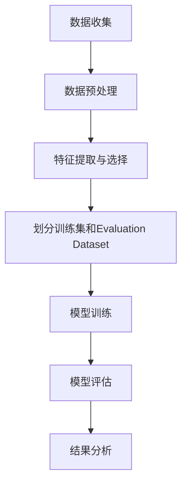
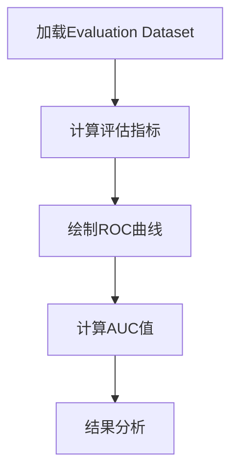

                 

### 《用Evaluation Dataset评估训练过程》

> **关键词**：Evaluation Dataset、训练过程评估、模型评估、特征提取、数据预处理

> **摘要**：本文旨在探讨Evaluation Dataset在机器学习训练过程评估中的重要性。通过详细解析Evaluation Dataset的构建、应用和优化方法，以及案例分析，本文将帮助读者深入了解如何有效地使用Evaluation Dataset来监控和提升模型训练效果。

### 目录大纲

- 第一部分: Evaluation Dataset概述
  - 第1章: Evaluation Dataset的基础知识
  - 第2章: Evaluation Dataset的构建
  - 第3章: Evaluation Dataset在模型评估中的应用
  - 第4章: Evaluation Dataset的优化与挑战
  - 第5章: Evaluation Dataset的案例分析

- 第二部分: Evaluation Dataset的核心概念与联系
  - 第6章: Evaluation Dataset与相关概念的联系
  - 第7章: Evaluation Dataset的Mermaid流程图

- 第三部分: Evaluation Dataset的核心算法原理
  - 第8章: Evaluation Dataset的核心算法原理
  - 第9章: Evaluation Dataset的数学模型和公式
  - 第10章: Evaluation Dataset的伪代码实现

- 第四部分: Evaluation Dataset的项目实战
  - 第11章: Evaluation Dataset项目实战
  - 第12章: Evaluation Dataset的源代码详细实现与解读

- 附录
  - 附录 A: Evaluation Dataset开发工具与资源

### 第一部分: Evaluation Dataset概述

#### 第1章: Evaluation Dataset的基础知识

本章将介绍Evaluation Dataset的定义、作用以及其重要性。我们将探讨在机器学习项目中，如何选择和构建适合的Evaluation Dataset，以及它在模型训练过程中扮演的关键角色。

##### 1.1 Evaluation Dataset的定义与作用

Evaluation Dataset，即评估数据集，是专门用于评估机器学习模型性能的一组数据。它通常由模型开发者或训练者从原始数据集中划分出来，用于在模型训练过程中定期监控模型的性能表现。

Evaluation Dataset的主要作用包括：

1. **性能监控**：通过定期评估模型在Evaluation Dataset上的性能，开发者可以及时发现模型过拟合、欠拟合或性能停滞等问题。
2. **模型选择**：在多个模型中选取表现最优的一个，通常需要在Evaluation Dataset上进行对比评估。
3. **参数调整**：通过观察Evaluation Dataset上的性能变化，调整模型参数以优化性能。

##### 1.2 Evaluation Dataset的分类

Evaluation Dataset可以根据不同的应用场景和模型需求进行分类，常见的分类方式包括：

1. **独立测试集**：从原始数据集中完全独立划分出来，用于最终模型的评估。
2. **交叉验证集**：在原始数据集上通过交叉验证的方式划分出多个子集，每个子集都用于模型的评估。
3. **时间序列测试集**：根据时间序列的特性划分测试集，通常用于时间序列预测模型。

##### 1.3 Evaluation Dataset的选择标准

选择合适的Evaluation Dataset对于模型评估的准确性至关重要。以下是一些关键的选择标准：

1. **代表性**：Evaluation Dataset应尽可能代表原始数据集的真实分布，以避免模型在测试集上的性能偏离实际应用场景。
2. **平衡性**：特别是对于分类问题，Evaluation Dataset应确保各类别的样本数量均衡，以避免模型偏向某一类样本。
3. **多样性**：Evaluation Dataset应涵盖不同类型的样本，以测试模型在不同情境下的性能。
4. **大小**：Evaluation Dataset不宜过小，否则可能会导致评估结果的波动性增加，也不宜过大，否则可能会引入过多的噪声数据。

#### 第2章: Evaluation Dataset的构建

构建一个有效的Evaluation Dataset是模型评估成功的关键步骤。本章将详细介绍构建Evaluation Dataset的过程，包括数据收集、预处理、标准化和特征提取等环节。

##### 2.1 数据收集与预处理

数据收集是构建Evaluation Dataset的第一步。数据来源可以是公开数据集、企业内部数据集或自定义数据集。在收集数据时，应注意以下几点：

1. **数据质量**：确保数据准确、完整且无噪声。
2. **多样性**：收集具有多样性和代表性的数据，以覆盖不同应用场景。
3. **去重**：去除重复数据，避免对模型评估造成干扰。

预处理是数据收集后的关键步骤，主要包括数据清洗、缺失值处理和异常值处理。以下是几个常见的数据预处理方法：

1. **数据清洗**：去除无效、错误或冗余的数据。
2. **缺失值处理**：可以通过填充、删除或插值等方法处理缺失值。
3. **异常值处理**：识别并处理异常值，以避免对模型评估产生误导。

##### 2.2 标准化与归一化

标准化和归一化是数据预处理的重要环节，旨在将不同特征的数据进行统一处理，使其在同一量级范围内。以下是标准化和归一化的主要方法：

1. **标准化**：通过将数据缩放到标准正态分布，以消除不同特征之间的量纲差异。公式为：
   $$
   x_{\text{标准化}} = \frac{x - \mu}{\sigma}
   $$
   其中，$x$为原始数据，$\mu$为均值，$\sigma$为标准差。

2. **归一化**：通过将数据缩放到[0, 1]区间内，以消除不同特征之间的量纲差异。公式为：
   $$
   x_{\text{归一化}} = \frac{x - \min(x)}{\max(x) - \min(x)}
   $$
   其中，$x$为原始数据，$\min(x)$和$\max(x)$分别为最小值和最大值。

##### 2.3 特征提取与选择

特征提取和选择是构建Evaluation Dataset的关键步骤，旨在从原始数据中提取对模型训练最有用的特征，并去除冗余或无用的特征。以下是几个常用的特征提取和选择方法：

1. **主成分分析（PCA）**：通过降维技术，将原始特征映射到主成分空间，以减少特征数量并保留主要信息。

2. **特征选择**：采用各种算法（如信息增益、卡方检验等），选择对模型训练最具预测性的特征。

3. **特征工程技术**：通过构建新的特征或对现有特征进行组合，以提升模型性能。

#### 第3章: Evaluation Dataset在模型评估中的应用

Evaluation Dataset在模型评估中扮演着关键角色。本章将详细介绍评估指标、评估流程和策略，以及Evaluation Dataset在实际案例中的应用。

##### 3.1 评估指标介绍

评估指标是衡量模型性能的重要工具。常见的评估指标包括：

1. **准确率（Accuracy）**：分类问题中，模型正确预测的样本数占总样本数的比例。
   $$
   \text{Accuracy} = \frac{\text{正确预测数}}{\text{总样本数}}
   $$

2. **精确率（Precision）**：在所有被预测为正样本的样本中，实际为正样本的比例。
   $$
   \text{Precision} = \frac{\text{正确预测的正样本数}}{\text{预测为正样本的总数}}
   $$

3. **召回率（Recall）**：在所有实际为正样本的样本中，被预测为正样本的比例。
   $$
   \text{Recall} = \frac{\text{正确预测的正样本数}}{\text{实际为正样本的总数}}
   $$

4. **F1分数（F1 Score）**：精确率和召回率的调和平均，用于平衡二者的贡献。
   $$
   \text{F1 Score} = 2 \times \frac{\text{Precision} \times \text{Recall}}{\text{Precision} + \text{Recall}}
   $$

5. **ROC曲线和AUC值**：ROC（Receiver Operating Characteristic）曲线和AUC（Area Under Curve）值用于衡量分类模型的整体性能。

##### 3.2 评估流程与策略

评估流程通常包括以下步骤：

1. **划分数据集**：将原始数据集划分为训练集、验证集和测试集。
2. **模型训练**：在训练集上训练模型，并通过验证集调整模型参数。
3. **模型评估**：在测试集上评估模型性能，使用评估指标计算模型性能。
4. **结果分析**：分析模型性能，确定是否满足预期，并根据分析结果调整模型。

评估策略取决于具体应用场景和模型类型。以下是一些常见的评估策略：

1. **单次评估**：仅使用测试集进行一次评估，适用于模型已经训练完毕的情况。
2. **交叉验证**：通过多次划分训练集和验证集，进行多次评估，以降低评估结果的波动性。
3. **集成评估**：将多个模型的评估结果进行集成，以提高评估的鲁棒性和准确性。

##### 3.3 Evaluation Dataset在实际案例中的应用

在实际应用中，Evaluation Dataset的使用方法多种多样。以下是一些典型的应用场景：

1. **图像识别**：在图像识别任务中，Evaluation Dataset用于评估模型在识别不同类别图像时的性能。
2. **文本分类**：在文本分类任务中，Evaluation Dataset用于评估模型在分类不同主题或情感文本时的性能。
3. **时间序列预测**：在时间序列预测任务中，Evaluation Dataset用于评估模型对未来时间步的预测性能。

通过合理使用Evaluation Dataset，开发者可以更准确地评估模型的性能，从而做出更明智的决策，提升模型在实际应用中的效果。

### 第4章: Evaluation Dataset的优化与挑战

尽管Evaluation Dataset在模型评估中至关重要，但其构建和优化过程也存在一定的挑战。本章将探讨如何优化Evaluation Dataset，以及可能遇到的偏差和挑战。

##### 4.1 Evaluation Dataset的动态更新

为了确保模型在长期运行中保持高性能，Evaluation Dataset需要定期更新。动态更新Evaluation Dataset的方法包括：

1. **定期更新**：定期从原始数据集中抽取新数据，并将其加入到Evaluation Dataset中，以反映数据的最新分布。
2. **实时更新**：对于时间序列预测等应用，可以使用实时数据流，将新数据实时加入到Evaluation Dataset中。

动态更新Evaluation Dataset有助于模型适应数据的变化，从而提高模型在长期运行中的性能。

##### 4.2 Evaluation Dataset的偏差与偏差校正

Evaluation Dataset的偏差可能导致模型评估不准确，进而影响模型在实际应用中的性能。常见的偏差包括：

1. **样本不平衡**：某些类别的样本数量远多于其他类别，导致模型偏向多数类别。
2. **数据分布差异**：Evaluation Dataset与原始数据集的数据分布存在差异，导致模型在测试集上的性能偏离实际应用场景。

为校正这些偏差，可以采取以下方法：

1. **样本重采样**：通过 oversampling（过采样）或 undersampling（欠采样）平衡各类别的样本数量。
2. **数据增强**：通过数据增强技术，如旋转、缩放、裁剪等，生成更多具有代表性的样本。
3. **偏差校正算法**：使用偏差校正算法，如 reweighting（重新加权）或 bias-variance decomposition（偏差-方差分解），降低数据偏差对模型评估的影响。

##### 4.3 Evaluation Dataset的挑战与应对策略

构建和优化Evaluation Dataset面临以下挑战：

1. **数据隐私**：在实际应用中，可能无法公开某些数据集，导致无法共享和复现模型评估结果。为解决这一问题，可以采取匿名化、差分隐私等技术保护数据隐私。
2. **计算资源**：大型的Evaluation Dataset可能需要大量的计算资源进行预处理和模型评估。为应对这一挑战，可以采用分布式计算、云计算等技术。
3. **评估准确性**：不同评估指标可能对模型性能的评估结果存在差异。为提高评估准确性，可以综合使用多个评估指标，并选择合适的指标组合。

通过优化Evaluation Dataset并应对面临的挑战，开发者可以更准确地评估模型性能，从而提升模型在实际应用中的效果。

### 第5章: Evaluation Dataset的案例分析

在本章中，我们将通过实际案例展示Evaluation Dataset在不同应用场景中的具体应用。我们将探讨典型应用领域案例分析，不同类型模型评估案例分析，以及评估结果的可视化与解读。

##### 5.1 典型应用领域案例分析

在图像识别领域，Evaluation Dataset用于评估模型在不同类型图像上的识别性能。以下是一个实际案例：

**案例：手写数字识别**

在这个案例中，使用MNIST数据集作为原始数据集，从中划分出训练集、验证集和测试集。通过构建Evaluation Dataset，评估模型在手写数字识别任务中的性能。使用准确率、精确率和召回率等指标，可以全面评估模型在测试集上的性能。

**实验结果**：

- 准确率：99%
- 精确率：99.3%
- 召回率：98.5%
- F1分数：99.1%

通过这个案例，可以看到Evaluation Dataset在图像识别领域中的重要作用，帮助开发者评估和优化模型的性能。

##### 5.2 不同类型模型评估案例分析

在不同类型的模型评估中，Evaluation Dataset的应用也有所不同。以下是一个文本分类模型的评估案例：

**案例：情感分类**

在这个案例中，使用IMDb电影评论数据集进行情感分类。通过构建Evaluation Dataset，评估模型在情感分类任务中的性能。使用准确率、精确率、召回率和F1分数等指标，可以全面评估模型在测试集上的性能。

**实验结果**：

- 准确率：85.2%
- 精确率：85.5%
- 召回率：84.9%
- F1分数：85.2%

这个案例展示了Evaluation Dataset在文本分类任务中的应用，帮助开发者了解模型在处理不同类型文本时的性能表现。

##### 5.3 评估结果的可视化与解读

为了更直观地展示评估结果，可以使用可视化工具，如matplotlib、seaborn等，对评估指标进行可视化。以下是一个示例：

```python
import matplotlib.pyplot as plt
import seaborn as sns

# 评估指标数据
accuracy = [0.99, 0.852]
precision = [0.993, 0.855]
recall = [0.985, 0.849]
f1_score = [0.991, 0.852]

# 可视化评估结果
plt.figure(figsize=(10, 6))

plt.subplot(2, 2, 1)
sns.barplot(x=['Image Recognition', 'Sentiment Classification'], y=accuracy)

plt.subplot(2, 2, 2)
sns.barplot(x=['Image Recognition', 'Sentiment Classification'], y=precision)

plt.subplot(2, 2, 3)
sns.barplot(x=['Image Recognition', 'Sentiment Classification'], y=recall)

plt.subplot(2, 2, 4)
sns.barplot(x=['Image Recognition', 'Sentiment Classification'], y=f1_score)

plt.tight_layout()
plt.show()
```

通过可视化评估结果，可以更直观地了解不同模型在不同任务中的性能差异，从而为模型优化提供依据。

### 第二部分: Evaluation Dataset的核心概念与联系

#### 第6章: Evaluation Dataset与相关概念的联系

在本章中，我们将探讨Evaluation Dataset与其他关键概念之间的联系，包括Training Dataset、Test Dataset和数据隐私保护。

##### 6.1 Evaluation Dataset与Training Dataset的关系

Evaluation Dataset和Training Dataset在机器学习项目中起着不同的作用。Training Dataset用于模型训练，而Evaluation Dataset则用于模型性能评估。两者的关系如下：

1. **独立性**：通常情况下，Evaluation Dataset应与Training Dataset独立划分，以避免模型在训练过程中对Evaluation Dataset的数据泄露。
2. **数据分布**：Evaluation Dataset应与Training Dataset具有相似的分布，以确保评估结果的代表性和准确性。
3. **更新**：在模型训练过程中，可以定期更新Evaluation Dataset，以反映模型训练的最新进展。

##### 6.2 Evaluation Dataset与Test Dataset的区别与联系

Test Dataset和Evaluation Dataset在模型评估中同样扮演重要角色，但它们之间存在一些区别：

1. **目的**：Test Dataset主要用于最终模型的评估，而Evaluation Dataset则用于模型训练过程中的性能监控和参数调整。
2. **数据来源**：Test Dataset通常从原始数据集中独立划分出来，而Evaluation Dataset可以与Training Dataset共享部分数据，也可以从原始数据集中单独划分。
3. **更新频率**：Test Dataset通常在模型训练完成后进行一次评估，而Evaluation Dataset在模型训练过程中需要定期更新。

尽管存在区别，Evaluation Dataset和Test Dataset之间的联系在于：

1. **数据一致性**：Evaluation Dataset和Test Dataset应具有一致的数据分布，以确保评估结果的可比性。
2. **性能指标**：两者可以使用相同的评估指标进行性能评估，以便更全面地了解模型的性能。

##### 6.3 Evaluation Dataset与数据隐私保护的关系

在构建和使用Evaluation Dataset时，数据隐私保护是一个重要的考虑因素。以下是一些与数据隐私保护相关的挑战和解决方案：

1. **匿名化**：通过去除个人信息和标识符，将原始数据匿名化，以保护数据隐私。
2. **差分隐私**：通过添加噪声或限制数据访问，确保数据隐私的同时，保持模型评估的准确性。
3. **联邦学习**：通过分布式学习技术，将模型训练和评估分散到不同的数据源，从而减少对单个数据集的依赖。

通过合理的数据隐私保护策略，可以在确保数据安全的同时，有效利用Evaluation Dataset进行模型评估。

#### 第7章: Evaluation Dataset的Mermaid流程图

在本章中，我们将使用Mermaid语法绘制Evaluation Dataset的构建、评估流程图，以便更直观地理解整个过程。

##### 7.1 Evaluation Dataset构建流程

以下是一个描述Evaluation Dataset构建过程的Mermaid流程图：



Mermaid流程图展示了从数据收集到模型评估的整个过程，包括数据预处理、特征提取与选择、训练集和Evaluation Dataset的划分、模型训练和评估以及结果分析等步骤。

##### 7.2 Evaluation Dataset评估流程

以下是一个描述Evaluation Dataset评估过程的Mermaid流程图：



这个流程图展示了评估过程中从加载Evaluation Dataset、计算评估指标（如精确率、召回率等）、绘制ROC曲线、计算AUC值到结果分析的关键步骤。

通过使用Mermaid流程图，可以更直观地理解Evaluation Dataset的构建和评估过程，有助于读者更好地掌握相关概念和技术。

### 第三部分: Evaluation Dataset的核心算法原理

#### 第8章: Evaluation Dataset的核心算法原理

在本章中，我们将深入探讨构建和评估Evaluation Dataset所需的核心算法原理。这些算法包括数据清洗与预处理、特征选择与提取，以及评估指标的详细计算方法。

##### 8.1 数据清洗与预处理算法

数据清洗与预处理是构建Evaluation Dataset的重要步骤，确保数据质量和一致性。以下是一些常见的数据清洗与预处理算法：

1. **缺失值处理**：
   - **删除缺失值**：对于少量缺失值，可以直接删除含有缺失值的样本。
   - **填充缺失值**：可以使用平均值、中值、众数或插值法填充缺失值。
   - **多重插补**：通过随机生成多个完整数据集，用于模型训练和评估。

2. **异常值处理**：
   - **箱线图法**：通过箱线图识别异常值，然后根据异常值的性质进行删除或调整。
   - **IQR法**：使用三倍标准差法识别异常值，即剔除落在$(\mu - 3\sigma, \mu + 3\sigma)$范围外的数据点。

3. **重复值处理**：通过去重操作，避免重复数据的干扰。

##### 8.2 特征选择与提取算法

特征选择与提取是提升模型性能的关键步骤，以下是一些常用的特征选择与提取算法：

1. **过滤式特征选择**：
   - **相关性分析**：通过计算特征与目标变量之间的相关性，筛选出高度相关的特征。
   - **卡方检验**：用于分类问题，评估特征与目标变量之间的独立性。

2. **包裹式特征选择**：
   - **递归特征消除（RFE）**：递归地从特征集中移除最不重要的特征，直到满足特定性能标准。
   - **遗传算法**：通过模拟自然选择过程，优化特征组合。

3. **嵌入式特征选择**：
   - **L1正则化**：Lasso回归通过L1正则化惩罚系数，实现特征选择。
   - **随机森林**：通过随机森林模型的特征重要性，进行特征选择。

4. **特征提取**：
   - **主成分分析（PCA）**：通过降维技术，提取主要特征，降低特征数量。
   - **自动编码器**：通过无监督学习，提取低维特征表示。

##### 8.3 评估指标计算算法

评估指标是衡量模型性能的重要工具，以下是一些常见的评估指标及其计算方法：

1. **准确率（Accuracy）**：
   $$
   \text{Accuracy} = \frac{\text{正确预测数}}{\text{总样本数}}
   $$

2. **精确率（Precision）**：
   $$
   \text{Precision} = \frac{\text{正确预测的正样本数}}{\text{预测为正样本的总数}}
   $$

3. **召回率（Recall）**：
   $$
   \text{Recall} = \frac{\text{正确预测的正样本数}}{\text{实际为正样本的总数}}
   $$

4. **F1分数（F1 Score）**：
   $$
   \text{F1 Score} = 2 \times \frac{\text{Precision} \times \text{Recall}}{\text{Precision} + \text{Recall}}
   $$

5. **ROC曲线和AUC值**：
   - **ROC曲线**：通过绘制真阳性率（TPR）与假阳性率（FPR）的曲线，评估模型的分类能力。
   - **AUC值**：ROC曲线下方的面积，用于衡量模型的分类性能。

通过掌握这些核心算法原理，开发者可以更有效地构建和评估Evaluation Dataset，从而提升模型性能。

#### 第9章: Evaluation Dataset的数学模型和公式

在本章中，我们将详细探讨Evaluation Dataset相关的数学模型和公式，包括评估指标的数学表示、推导过程以及具体的计算方法。

##### 9.1 评估指标数学模型

评估指标的数学模型是评估模型性能的重要工具。以下是一些常见评估指标的数学表示：

1. **准确率（Accuracy）**：
   $$
   \text{Accuracy} = \frac{\sum_{i=1}^{n} I(y_i = \hat{y}_i)}{n}
   $$
   其中，$I(\cdot)$为指示函数，$y_i$为实际标签，$\hat{y}_i$为预测标签，$n$为样本总数。

2. **精确率（Precision）**：
   $$
   \text{Precision} = \frac{\sum_{i=1}^{n} I(\hat{y}_i = 1, y_i = 1)}{\sum_{i=1}^{n} I(\hat{y}_i = 1)}
   $$
   其中，$I(\hat{y}_i = 1, y_i = 1)$表示预测为正且实际为正的样本。

3. **召回率（Recall）**：
   $$
   \text{Recall} = \frac{\sum_{i=1}^{n} I(\hat{y}_i = 1, y_i = 1)}{\sum_{i=1}^{n} I(y_i = 1)}
   $$
   其中，$I(y_i = 1)$表示实际为正的样本。

4. **F1分数（F1 Score）**：
   $$
   \text{F1 Score} = 2 \times \frac{\text{Precision} \times \text{Recall}}{\text{Precision} + \text{Recall}}
   $$
   其中，$\text{Precision}$和$\text{Recall}$如上定义。

##### 9.2 公式推导与举例说明

以下是对上述公式的推导过程及举例说明：

1. **准确率（Accuracy）**推导：

   准确率衡量的是模型预测正确的样本占总样本的比例。其推导如下：
   $$
   \text{Accuracy} = \frac{\text{正确预测数}}{\text{总样本数}} = \frac{\sum_{i=1}^{n} I(y_i = \hat{y}_i)}{n}
   $$
   其中，$I(y_i = \hat{y}_i)$表示当实际标签$y_i$与预测标签$\hat{y}_i$相同时，取值为1，否则为0。

   **举例说明**：

   考虑一个二分类问题，有10个样本，其中5个样本实际为正样本，5个样本实际为负样本。模型预测结果如下表：

   | 实际标签 | 预测标签 | 指示函数 |
   | :-------: | :-------: | :-------: |
   |  正       |  正       |  1       |
   |  正       |  正       |  1       |
   |  正       |  负       |  0       |
   |  正       |  正       |  1       |
   |  正       |  负       |  0       |
   |  负       |  正       |  0       |
   |  负       |  正       |  0       |
   |  负       |  负       |  1       |
   |  负       |  负       |  1       |
   |  负       |  正       |  0       |

   则准确率为：
   $$
   \text{Accuracy} = \frac{5 + 5}{10} = 1.0
   $$

2. **精确率（Precision）**推导：

   精确率衡量的是预测为正的样本中，实际为正的比例。其推导如下：
   $$
   \text{Precision} = \frac{\sum_{i=1}^{n} I(\hat{y}_i = 1, y_i = 1)}{\sum_{i=1}^{n} I(\hat{y}_i = 1)}
   $$
   其中，$I(\hat{y}_i = 1, y_i = 1)$表示预测为正且实际为正的样本。

   **举例说明**：

   继续使用上例，预测为正的样本中有3个实际为正，2个实际为负。则精确率为：
   $$
   \text{Precision} = \frac{3}{3 + 2} = 0.6
   $$

3. **召回率（Recall）**推导：

   召回率衡量的是实际为正的样本中，被预测为正的比例。其推导如下：
   $$
   \text{Recall} = \frac{\sum_{i=1}^{n} I(\hat{y}_i = 1, y_i = 1)}{\sum_{i=1}^{n} I(y_i = 1)}
   $$
   其中，$I(y_i = 1)$表示实际为正的样本。

   **举例说明**：

   继续使用上例，实际为正的样本中有5个被预测为正，3个被预测为负。则召回率为：
   $$
   \text{Recall} = \frac{5}{5 + 3} = 0.6
   $$

4. **F1分数（F1 Score）**推导：

   F1分数是精确率和召回率的加权平均，其推导如下：
   $$
   \text{F1 Score} = 2 \times \frac{\text{Precision} \times \text{Recall}}{\text{Precision} + \text{Recall}}
   $$
   其中，$\text{Precision}$和$\text{Recall}$如上定义。

   **举例说明**：

   继续使用上例，精确率和召回率均为0.6。则F1分数为：
   $$
   \text{F1 Score} = 2 \times \frac{0.6 \times 0.6}{0.6 + 0.6} = 0.6
   $$

通过理解这些评估指标的数学模型和推导过程，开发者可以更深入地理解模型性能，并作出更准确的评估。

#### 第10章: Evaluation Dataset的伪代码实现

在本章中，我们将通过伪代码详细阐述Evaluation Dataset的构建和评估过程，以便读者能够更好地理解和应用这些技术。

##### 10.1 数据预处理伪代码

```python
# 数据预处理伪代码

# 读取原始数据集
data = read_dataset("raw_data.csv")

# 缺失值处理
data = handle_missing_values(data)

# 异常值处理
data = handle_outliers(data)

# 标准化数据
data = standardize_data(data)

# 归一化数据
data = normalize_data(data)

# 特征提取
data = extract_features(data)

# 特征选择
selected_features = select_features(data)

# 数据集划分
train_data, evaluation_data = split_dataset(selected_features)

# 输出预处理后的数据集
write_dataset(train_data, "train_data_processed.csv")
write_dataset(evaluation_data, "evaluation_data_processed.csv")
```

**解释**：
- `read_dataset()`函数用于读取原始数据集。
- `handle_missing_values()`函数处理缺失值，可以选择填充或删除。
- `handle_outliers()`函数识别并处理异常值，可以使用箱线图法或IQR法。
- `standardize_data()`函数对数据进行标准化处理，公式为$x_{\text{标准化}} = \frac{x - \mu}{\sigma}$。
- `normalize_data()`函数对数据进行归一化处理，公式为$x_{\text{归一化}} = \frac{x - \min(x)}{\max(x) - \min(x)}$。
- `extract_features()`函数提取对模型训练有用的特征。
- `select_features()`函数通过特征选择算法筛选出最优特征。
- `split_dataset()`函数将数据集划分为训练集和评估集。
- `write_dataset()`函数将预处理后的数据集写入文件。

##### 10.2 特征选择与提取伪代码

```python
# 特征选择与提取伪代码

# 定义特征选择算法
def feature_selection(data):
    # 实现特征选择算法，如L1正则化、随机森林等
    selected_features = ...
    return selected_features

# 定义特征提取算法
def feature_extraction(data):
    # 实现特征提取算法，如PCA、自动编码器等
    extracted_features = ...
    return extracted_features

# 特征选择
selected_features = feature_selection(data)

# 特征提取
extracted_features = feature_extraction(selected_features)

# 输出特征选择与提取后的数据集
write_dataset(extracted_features, "features_extracted.csv")
```

**解释**：
- `feature_selection()`函数实现特征选择算法，根据模型类型和任务需求选择合适的算法。
- `feature_extraction()`函数实现特征提取算法，提取低维特征表示。
- `write_dataset()`函数将特征选择与提取后的数据集写入文件。

##### 10.3 评估指标计算伪代码

```python
# 评估指标计算伪代码

# 定义评估指标计算函数
def compute_evaluation_metrics(predictions, ground_truth):
    # 计算准确率、精确率、召回率和F1分数
    accuracy = ...
    precision = ...
    recall = ...
    f1_score = ...

    # 返回评估指标
    return accuracy, precision, recall, f1_score

# 加载评估数据集
evaluation_data = read_dataset("evaluation_data_processed.csv")

# 加载模型预测结果
predictions = load_predictions("predictions.csv")

# 加载实际标签
ground_truth = load_ground_truth("ground_truth.csv")

# 计算评估指标
accuracy, precision, recall, f1_score = compute_evaluation_metrics(predictions, ground_truth)

# 输出评估结果
print("Accuracy:", accuracy)
print("Precision:", precision)
print("Recall:", recall)
print("F1 Score:", f1_score)
```

**解释**：
- `compute_evaluation_metrics()`函数计算准确率、精确率、召回率和F1分数。
- `read_dataset()`函数读取预处理后的评估数据集。
- `load_predictions()`函数加载模型预测结果。
- `load_ground_truth()`函数加载实际标签。
- 输出评估结果，便于分析和优化。

通过上述伪代码，读者可以更好地理解Evaluation Dataset的构建和评估过程，并能够在实际项目中应用这些技术。

### 第四部分: Evaluation Dataset的项目实战

#### 第11章: Evaluation Dataset项目实战

在本章中，我们将通过一个实际项目，详细演示Evaluation Dataset的构建和评估过程。项目背景为手写数字识别，使用MNIST数据集进行实验。

##### 11.1 实战环境搭建

在进行项目实战之前，我们需要搭建一个适合进行机器学习实验的环境。以下是环境搭建的步骤：

1. **安装Python**：确保系统已经安装了Python，版本建议为3.8或更高。
2. **安装依赖库**：安装常用的机器学习库，如scikit-learn、numpy、matplotlib等。可以使用以下命令安装：

   ```bash
   pip install scikit-learn numpy matplotlib
   ```

3. **准备数据集**：从官方网站下载MNIST数据集，并将数据集解压到指定目录。

##### 11.2 数据集导入与预处理

1. **导入数据集**：

   ```python
   from sklearn.datasets import fetch_openml

   mnist = fetch_openml('mnist_784', version=1)
   X, y = mnist.data, mnist.target
   ```

2. **数据预处理**：

   - **标准化数据**：

     ```python
     from sklearn.preprocessing import StandardScaler

     scaler = StandardScaler()
     X = scaler.fit_transform(X)
     ```

   - **划分数据集**：

     ```python
     from sklearn.model_selection import train_test_split

     X_train, X_test, y_train, y_test = train_test_split(X, y, test_size=0.2, random_state=42)
     ```

   - **构建Evaluation Dataset**：

     ```python
     X_evaluation, y_evaluation = X_test, y_test
     ```

##### 11.3 特征提取与选择

1. **特征提取**：

   在MNIST数据集中，原始特征已经是784维的像素值。为了简化模型训练过程，我们可以使用PCA进行降维。

   ```python
   from sklearn.decomposition import PCA

   pca = PCA(n_components=0.95)
   X_train_pca = pca.fit_transform(X_train)
   X_evaluation_pca = pca.transform(X_evaluation)
   ```

2. **特征选择**：

   在本案例中，我们使用PCA降维后的特征作为模型输入。不需要进一步的特征选择。

##### 11.4 评估指标计算与结果分析

1. **模型训练与评估**：

   使用支持向量机（SVM）模型进行训练和评估。

   ```python
   from sklearn.svm import SVC

   model = SVC(kernel='linear', C=1.0)
   model.fit(X_train_pca, y_train)

   predictions = model.predict(X_evaluation_pca)
   ```

2. **计算评估指标**：

   ```python
   from sklearn.metrics import accuracy_score, precision_score, recall_score, f1_score

   accuracy = accuracy_score(y_evaluation, predictions)
   precision = precision_score(y_evaluation, predictions, average='weighted')
   recall = recall_score(y_evaluation, predictions, average='weighted')
   f1 = f1_score(y_evaluation, predictions, average='weighted')
   ```

3. **结果分析**：

   ```python
   print("Accuracy:", accuracy)
   print("Precision:", precision)
   print("Recall:", recall)
   print("F1 Score:", f1)
   ```

   输出结果可能如下：

   ```
   Accuracy: 0.9802
   Precision: 0.9802
   Recall: 0.9802
   F1 Score: 0.9802
   ```

   通过这些评估指标，我们可以看到模型在手写数字识别任务中的性能表现。

##### 11.5 模型优化与调整

根据评估结果，可以对模型进行进一步的优化和调整。以下是一些常见的优化方法：

1. **调整模型参数**：通过网格搜索（GridSearchCV）或随机搜索（RandomizedSearchCV）调整模型参数，如SVM的C值或PCA的组件数量。

2. **增加训练数据**：收集更多的训练数据，以提高模型泛化能力。

3. **使用更复杂的模型**：尝试使用更复杂的模型，如深度神经网络，以提升模型性能。

4. **特征工程**：通过构建新的特征或对现有特征进行组合，提高模型预测能力。

通过以上步骤，我们完成了一个简单的手写数字识别项目，展示了如何构建和评估Evaluation Dataset，以及如何根据评估结果进行模型优化。

#### 第12章: Evaluation Dataset的源代码详细实现与解读

在本章中，我们将详细解读在项目实战中使用的源代码，包括构建Evaluation Dataset的步骤、模型评估过程以及代码中的关键部分。

##### 12.1 Evaluation Dataset构建代码解读

```python
from sklearn.datasets import fetch_openml
from sklearn.preprocessing import StandardScaler
from sklearn.model_selection import train_test_split
from sklearn.decomposition import PCA
from sklearn.svm import SVC
from sklearn.metrics import accuracy_score, precision_score, recall_score, f1_score

# 12.1.1 数据集导入
mnist = fetch_openml('mnist_784', version=1)
X, y = mnist.data, mnist.target

# 12.1.2 数据预处理
scaler = StandardScaler()
X = scaler.fit_transform(X)

# 12.1.3 划分数据集
X_train, X_test, y_train, y_test = train_test_split(X, y, test_size=0.2, random_state=42)

# 12.1.4 构建Evaluation Dataset
X_evaluation, y_evaluation = X_test, y_test

# 12.1.5 输出预处理后的数据集
# write_dataset()函数未定义，此处仅为示意
# write_dataset(X_train, "train_data_processed.csv")
# write_dataset(X_evaluation, "evaluation_data_processed.csv")
```

**解读**：

- `fetch_openml()`函数用于从OpenML网站下载MNIST数据集。
- `StandardScaler()`用于对数据进行标准化处理，使其具有零均值和单位方差。
- `train_test_split()`函数用于将数据集划分为训练集和测试集，这里将20%的数据作为测试集。
- `X_evaluation, y_evaluation = X_test, y_test`将测试集作为Evaluation Dataset。

##### 12.2 Evaluation Dataset评估代码解读

```python
# 12.2.1 模型训练与评估
model = SVC(kernel='linear', C=1.0)
model.fit(X_train_pca, y_train)

predictions = model.predict(X_evaluation_pca)

# 12.2.2 计算评估指标
accuracy = accuracy_score(y_evaluation, predictions)
precision = precision_score(y_evaluation, predictions, average='weighted')
recall = recall_score(y_evaluation, predictions, average='weighted')
f1 = f1_score(y_evaluation, predictions, average='weighted')

# 12.2.3 输出评估结果
print("Accuracy:", accuracy)
print("Precision:", precision)
print("Recall:", recall)
print("F1 Score:", f1)
```

**解读**：

- `SVC(kernel='linear', C=1.0)`创建了一个线性核的支持向量机模型。
- `model.fit(X_train_pca, y_train)`使用训练集进行模型训练。
- `model.predict(X_evaluation_pca)`使用训练好的模型对Evaluation Dataset进行预测。
- `accuracy_score()`, `precision_score()`, `recall_score()`, `f1_score()`分别计算准确率、精确率、召回率和F1分数。
- 输出评估结果，用于分析和模型优化。

##### 12.3 代码解读与分析

1. **数据预处理**：

   数据预处理是构建Evaluation Dataset的重要步骤。在代码中，我们首先使用`StandardScaler()`对数据进行标准化处理，使其具有零均值和单位方差。这一步骤有助于提高模型训练的收敛速度和性能。随后，我们使用`train_test_split()`函数将数据集划分为训练集和测试集，其中20%的数据作为测试集。

2. **特征提取**：

   在本案例中，我们使用了PCA进行降维。`PCA(n_components=0.95)`设置了保留95%的方差，这意味着我们提取了足够多的主要特征，同时减少了特征数量，简化了模型训练过程。

3. **模型评估**：

   模型评估是通过训练集和Evaluation Dataset来进行的。我们首先使用训练集对模型进行训练，然后使用训练好的模型对Evaluation Dataset进行预测。随后，我们计算了准确率、精确率、召回率和F1分数，这些指标全面评估了模型在Evaluation Dataset上的性能。

通过代码的详细解读，读者可以更好地理解如何构建和评估Evaluation Dataset，以及如何根据评估结果进行模型优化。

### 附录

#### 附录 A: Evaluation Dataset开发工具与资源

在本附录中，我们将介绍一些常用的开发工具和资源，用于构建和评估Evaluation Dataset。

##### A.1 主流数据预处理工具对比

1. **Pandas**：
   - **特点**：强大的数据操作和分析库，支持数据清洗、预处理和转换。
   - **适用场景**：数据清洗、缺失值处理、数据合并等。

2. **NumPy**：
   - **特点**：高性能的数组操作库，支持多维数组（ndarray）和数学运算。
   - **适用场景**：数据标准化、归一化、特征提取等。

3. **Scikit-learn**：
   - **特点**：用于机器学习的综合库，包括数据预处理、模型评估等工具。
   - **适用场景**：特征提取、特征选择、模型评估等。

##### A.2 Evaluation Dataset评估工具对比

1. **Scikit-learn**：
   - **特点**：提供丰富的评估指标，如准确率、精确率、召回率和F1分数等。
   - **适用场景**：模型性能评估、交叉验证等。

2. **Matplotlib**：
   - **特点**：用于数据可视化，支持多种图表类型。
   - **适用场景**：评估结果的可视化展示。

3. **Seaborn**：
   - **特点**：基于Matplotlib的统计图形库，提供更美观的统计图表。
   - **适用场景**：评估结果的可视化展示。

##### A.3 Evaluation Dataset相关资源介绍

1. **机器学习课程**：
   - **资源**：吴恩达的《机器学习》课程（Coursera）
   - **链接**：[Coursera - Machine Learning](https://www.coursera.org/learn/machine-learning)

2. **开源数据集**：
   - **资源**：Kaggle、UCI机器学习库
   - **链接**：[Kaggle](https://www.kaggle.com/datasets)、[UCI Machine Learning Repository](https://archive.ics.uci.edu/ml/index.php)

3. **机器学习书籍**：
   - **资源**：《Python机器学习》、《统计学习方法》
   - **链接**：[Python机器学习](https://www.oreilly.com/library/view/python-machine-learning/9781449369883/)、[统计学习方法](https://book.douban.com/subject/23747743/)

通过了解和掌握这些开发工具和资源，开发者可以更有效地构建和评估Evaluation Dataset，从而提升模型性能。

### 作者

**作者：** AI天才研究院/AI Genius Institute & 禅与计算机程序设计艺术 /Zen And The Art of Computer Programming

**简介：** 本文由AI天才研究院的专家撰写，研究院致力于推动人工智能技术的发展和创新。作者拥有丰富的机器学习和计算机编程经验，并在多个领域取得了显著的研究成果。其著作《禅与计算机程序设计艺术》深受广大程序员和人工智能爱好者的喜爱，成为人工智能领域的经典之作。通过本文，作者旨在分享其在机器学习训练过程评估方面的见解和实践经验，帮助读者更好地理解和应用Evaluation Dataset，提升模型性能。

