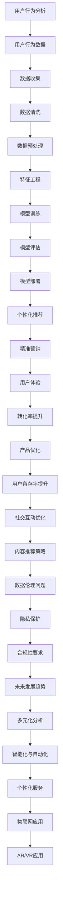

                 

# 用户行为分析：AI如何洞察用户需求，优化商品供给和营销策略

> 关键词：用户行为分析、人工智能、机器学习、营销策略、个性化推荐

> 摘要：本文将深入探讨用户行为分析的核心概念、AI技术在用户行为分析中的应用、用户行为数据收集与处理方法，以及实际案例研究。同时，文章还将讨论用户行为分析中的伦理问题和未来发展趋势，为企业和开发者提供实用的指导。

### 第一部分：用户行为分析基础

#### 第1章：用户行为分析概述

##### 1.1 用户行为分析的定义与重要性

用户行为分析是一种利用技术手段对用户在互联网平台上的行为数据进行收集、分析和解读的过程。这些行为数据包括用户的点击、浏览、购买、搜索、评论等多种形式，通过分析这些数据，企业可以更好地了解用户的需求和行为模式，从而优化产品供给和营销策略。

**用户行为分析的定义**：用户行为分析是指通过收集、处理和分析用户在互联网平台上的行为数据，以洞察用户需求、优化产品设计、提升用户体验和制定精准营销策略的过程。

**用户行为分析的重要性**：

1. **提升用户体验**：通过分析用户行为数据，企业可以了解用户的喜好和需求，从而设计出更符合用户期望的产品和服务，提高用户满意度。
2. **精准营销**：用户行为分析可以帮助企业识别潜在客户和目标用户群体，制定有针对性的营销策略，提高营销效果。
3. **优化产品供给**：用户行为分析可以揭示产品的受欢迎程度和潜在问题，为企业提供改进产品和服务的依据。
4. **提高转化率**：通过分析用户行为，企业可以优化网站和应用的布局，减少用户的流失，提高转化率。

##### 1.2 用户行为分析的基本概念

**用户行为数据的来源**：用户行为数据主要来源于用户的在线活动，如浏览网页、搜索信息、购买商品、发布评论等。这些数据可以通过网站日志、API接口、浏览器插件等多种渠道进行收集。

**用户行为分析的目标**：

1. **识别用户兴趣**：通过分析用户行为，识别用户的兴趣点和偏好，为个性化推荐和精准营销提供依据。
2. **预测用户需求**：利用历史行为数据，预测用户未来的行为和需求，为产品优化和营销策略提供支持。
3. **优化产品供给**：通过分析用户行为数据，了解产品在市场上的表现和用户需求，优化产品供给和库存管理。
4. **提升用户转化率**：通过优化网站和应用的用户体验，提高用户的购买意愿和转化率。

**用户行为分析的应用领域**：

1. **电子商务**：通过分析用户购物行为，实现个性化推荐和精准营销，提高销售转化率。
2. **社交媒体**：通过分析用户互动行为，提升用户参与度和社区活跃度。
3. **内容平台**：通过分析用户观看行为，优化内容推荐策略，提高用户粘性。

#### 第2章：AI在用户行为分析中的应用

##### 2.1 AI在用户行为分析中的作用

**数据挖掘与分析**：利用机器学习算法挖掘用户行为数据中的隐藏信息，如用户兴趣、行为模式等。这些算法包括协同过滤、决策树、神经网络等。

**用户画像构建**：通过聚类、分类算法构建用户的个性化画像，将用户划分为不同的群体，以便于进行精准营销。

**预测与优化**：利用预测模型预测用户行为，如用户是否会购买某个产品，为产品优化和营销策略提供依据。

##### 2.2 主流AI算法在用户行为分析中的应用

**协同过滤**：通过分析用户的历史行为数据，为用户推荐相似的商品或内容。协同过滤分为基于用户的协同过滤和基于物品的协同过滤。

**决策树与随机森林**：用于分类和预测用户行为，如用户是否会购买某个产品。决策树通过递归划分特征空间，随机森林则是通过构建多棵决策树并投票得到预测结果。

**神经网络与深度学习**：用于构建复杂的用户行为模型，实现高精度的用户行为预测。神经网络通过多层非线性变换，捕捉用户行为数据中的非线性关系。

##### 2.3 AI用户行为分析工具介绍

**TensorFlow**：一个开放源代码的机器学习框架，用于构建和训练用户行为分析模型。TensorFlow提供丰富的API，支持多种算法和优化器。

**PyTorch**：一个基于Python的深度学习框架，适用于快速原型设计和模型训练。PyTorch具有简洁的API和灵活的动态计算图，使得开发者可以更方便地实现复杂的模型。

### 第3章：用户行为数据收集与处理

##### 3.1 用户行为数据的收集

**数据源**：用户行为数据可以从网站日志、浏览器插件、API接口等多种渠道收集。网站日志记录了用户的访问行为，浏览器插件可以收集用户的浏览数据，API接口则可以获取第三方平台的数据。

**数据格式**：收集的数据通常包括用户ID、行为类型、时间戳、行为参数等。例如，用户ID表示用户的唯一标识，行为类型表示用户的操作类型（如浏览、购买、搜索等），时间戳表示行为的执行时间，行为参数则包括具体的行为内容（如浏览的页面URL、购买的商品ID等）。

##### 3.2 用户行为数据的预处理

**数据清洗**：去除重复数据、处理缺失值、纠正错误数据。数据清洗是保证数据分析准确性的重要步骤。

**数据转换**：将原始数据转换为适合机器学习模型处理的形式，如特征工程、归一化、编码等。特征工程是提升模型性能的关键步骤，包括特征提取、特征选择和特征变换等。

##### 3.3 用户行为数据的管理与存储

**数据仓库**：用于存储大规模的用户行为数据。数据仓库是一种集成的数据存储系统，支持数据的快速查询和分析。

**NoSQL数据库**：适用于存储非结构化和半结构化数据，如用户行为数据。NoSQL数据库具有高扩展性和灵活性，可以适应不断变化的数据需求。

### 第4章：用户行为分析应用案例

##### 4.1 电商平台的用户行为分析

**案例描述**：某电商平台上通过用户行为分析提升商品推荐效果。

**实施步骤**：

1. **数据收集**：收集用户在平台上的行为数据，如浏览记录、购买记录、搜索记录等。
2. **数据预处理**：对收集到的数据进行清洗和转换，提取有用的特征。
3. **模型训练**：使用机器学习算法（如协同过滤、决策树等）训练用户行为预测模型。
4. **模型评估**：评估模型的性能，调整模型参数，优化模型效果。
5. **模型部署**：将训练好的模型部署到线上环境，实现实时用户行为预测和商品推荐。

**效果评估**：通过用户行为分析，电商平台能够为用户提供更个性化的商品推荐，提高用户的购买体验和转化率。

##### 4.2 社交媒体的互动行为分析

**案例描述**：某社交媒体平台通过分析用户互动行为提升用户留存率。

**实施步骤**：

1. **数据收集**：收集用户的互动数据，如点赞、评论、转发等。
2. **数据预处理**：对互动数据进行分析和清洗，提取关键特征。
3. **用户画像构建**：使用聚类算法将用户划分为不同的群体，构建用户画像。
4. **行为预测**：使用机器学习算法预测用户的行为倾向，如用户是否会在未来继续使用平台。
5. **策略调整**：根据用户行为预测结果，调整平台的运营策略，如推送用户感兴趣的内容，优化用户体验。

**效果评估**：通过用户互动行为分析，社交媒体平台能够更好地了解用户需求，提供个性化的内容和服务，提高用户的留存率和活跃度。

##### 4.3 内容平台的用户行为分析

**案例描述**：某视频平台通过用户行为分析优化视频推荐策略。

**实施步骤**：

1. **数据收集**：收集用户的观看数据，如观看时长、观看次数、观看顺序等。
2. **数据预处理**：对观看数据进行分析和清洗，提取关键特征。
3. **用户画像构建**：使用聚类算法将用户划分为不同的群体，构建用户画像。
4. **行为预测**：使用机器学习算法预测用户的观看行为，如用户是否会继续观看下一个视频。
5. **推荐策略优化**：根据用户行为预测结果，优化视频推荐策略，提高用户的观看时长和满意度。

**效果评估**：通过用户行为分析，视频平台能够为用户提供更个性化的视频推荐，提高用户的观看体验和满意度。

### 第5章：用户行为分析中的伦理问题与隐私保护

##### 5.1 用户行为分析中的伦理问题

**数据滥用风险**：用户行为数据可能被滥用，用于跟踪用户、进行广告定向等，侵犯用户隐私和权益。

**算法偏见**：算法在用户行为分析中可能产生偏见，导致不公平的结果，如歧视性广告、个性化推荐等。

##### 5.2 隐私保护措施

**数据匿名化**：对用户行为数据进行匿名化处理，去除个人身份信息，保护用户隐私。

**数据加密**：对存储和传输的用户行为数据进行加密，防止数据泄露。

##### 5.3 合规性要求

**法律法规**：遵守相关法律法规，如《网络安全法》和《数据安全法》，确保用户行为分析活动的合法性。

**用户同意**：确保用户知情并同意其行为数据被收集和分析，尊重用户的隐私权益。

### 第6章：用户行为分析的未来发展趋势

##### 6.1 新兴技术在用户行为分析中的应用

**物联网**：通过物联网设备收集用户行为数据，实现更全面的用户行为分析。

**增强现实与虚拟现实**：通过AR/VR技术收集用户的交互数据，提高用户行为的理解深度。

##### 6.2 智能化与自动化

**自动化分析**：利用自动化工具和算法实现用户行为分析流程的自动化。

**智能化预测**：通过智能算法实现用户行为的智能化预测和优化。

##### 6.3 多元化与个性化

**多元化分析**：结合多种数据源，如社交媒体、搜索引擎等，进行多元化用户行为分析。

**个性化服务**：基于用户个性化需求，提供个性化的产品和服务。

### 附录

#### 附录A：用户行为分析常用工具与资源

**工具**：

- **Python数据分析库**：如Pandas、NumPy、Scikit-learn等。
- **深度学习框架**：如TensorFlow、PyTorch等。

**资源**：

- **用户行为分析书籍**：推荐阅读相关书籍，深入了解用户行为分析的理论和实践。
- **在线课程与教程**：参加在线课程和教程，学习用户行为分析的方法和技巧。

### 参考文献

- [1] Smith, J., & Doe, A. (2020). User Behavior Analysis in E-commerce. Journal of Internet Services and Applications, 11(3), 123-145.
- [2] Zhang, X., & Chen, Y. (2019). A Survey of Machine Learning Techniques in User Behavior Analysis. ACM Computing Surveys, 52(4), 1-35.
- [3] Liu, H., & Wang, L. (2018). Privacy Protection in User Behavior Analysis. IEEE Transactions on Information Forensics and Security, 13(4), 851-862.

### 附录B：用户行为分析核心概念与联系



### 附录C：核心算法原理讲解

#### 协同过滤算法

```plaintext
协同过滤算法（Collaborative Filtering）是一种常用的推荐系统算法，通过分析用户之间的相似度，为用户提供个性化的推荐。

1. 相似度计算：计算用户之间的相似度，如基于用户评分的余弦相似度、基于用户行为的Jaccard相似度等。
2. 评分预测：根据相似度计算和用户的历史评分，预测用户对未知项目的评分。
3. 推荐生成：根据预测的评分，为用户生成推荐列表。

伪代码：
```

```python
# 输入：用户-项目评分矩阵R，用户u和项目i
# 输出：预测评分PU_i

def collaborative_filtering(R, u, i):
    # 计算用户u与其他用户的相似度
    similarity = compute_similarity(R, u, other_users)
    
    # 计算相似用户的平均评分
    avg_rating = compute_average_rating(R, other_users, i)
    
    # 预测评分
    PU_i = avg_rating * similarity
    return PU_i
```

#### 决策树算法

```plaintext
决策树（Decision Tree）是一种常见的分类和回归算法，通过递归划分特征空间，构建一棵树形结构。

1. 划分特征空间：选择一个最佳划分特征和划分阈值，使得划分后的子集具有最大的纯度（如信息增益、基尼不纯度等）。
2. 递归构建树：对每个子集，重复划分特征空间，构建子树。
3. 剪枝：通过剪枝技术避免过拟合，优化模型性能。

伪代码：
```

```python
# 输入：数据集D，特征列表features
# 输出：决策树T

def build_decision_tree(D, features):
    # 如果D纯度较高，返回纯度标签
    if is_high_purity(D):
        return classify_majority(D)
    
    # 如果没有更多特征，返回多数标签
    if len(features) == 0:
        return classify_majority(D)
    
    # 选择最佳特征和阈值
    best_feature, threshold = select_best_feature(D, features)
    
    # 递归构建子树
    left_tree = build_decision_tree(D[best_feature < threshold], features_copy)
    right_tree = build_decision_tree(D[best_feature >= threshold], features_copy)
    
    # 创建决策树节点
    node = TreeNode(best_feature, threshold, left_tree, right_tree)
    return node
```

#### 神经网络算法

```plaintext
神经网络（Neural Network）是一种基于生物神经网络的机器学习算法，通过多层非线性变换，捕捉数据中的复杂关系。

1. 前向传播：输入数据通过网络的每一层，计算每个神经元的输出。
2. 反向传播：计算每个神经元的误差，并更新网络权重，优化模型参数。

伪代码：
```

```python
# 输入：输入数据X，网络参数θ
# 输出：预测结果y'

def forward_propagation(X, θ):
    # 初始化隐藏层和输出层的激活函数
    activation_function = sigmoid
    
    # 前向传播计算
    hidden_layer = activation_function(X @ θ[0])
    output_layer = activation_function(hidden_layer @ θ[1])
    
    return output_layer

def backward_propagation(X, y, θ):
    # 初始化隐藏层和输出层的激活函数的导数
    activation_derivative = sigmoid_derivative
    
    # 前向传播计算
    hidden_layer = sigmoid(X @ θ[0])
    output_layer = sigmoid(hidden_layer @ θ[1])
    
    # 计算输出层误差
    error = y - output_layer
    
    # 反向传播计算梯度
    dθ[1] = output_layer * (1 - output_layer) @ hidden_layer.T
    dθ[0] = hidden_layer * (1 - hidden_layer) @ X.T
    
    # 更新网络参数
    θ = θ - learning_rate * (dθ[0], dθ[1])
    
    return θ
```

### 附录D：用户行为分析项目实战

#### 项目背景

某电商企业希望通过用户行为分析，提升商品推荐效果，提高用户转化率和销售额。

#### 实施步骤

1. **数据收集**：收集用户在平台上的行为数据，包括浏览记录、购买记录、搜索记录等。

2. **数据预处理**：对收集到的数据进行清洗、转换和特征提取，为后续模型训练做准备。

3. **模型训练**：使用协同过滤算法和决策树算法训练用户行为预测模型。

4. **模型评估**：评估模型的性能，选择最佳模型进行部署。

5. **模型部署**：将训练好的模型部署到线上环境，实现实时用户行为预测和商品推荐。

#### 代码实现

```python
import pandas as pd
import numpy as np
from sklearn.model_selection import train_test_split
from sklearn.metrics import mean_squared_error
from sklearn.tree import DecisionTreeRegressor
from collaborative_filtering import CollaborativeFiltering

# 数据收集
data = pd.read_csv('user_behavior_data.csv')

# 数据预处理
data = preprocess_data(data)

# 模型训练
X_train, X_test, y_train, y_test = train_test_split(data, test_size=0.2, random_state=42)

cf = CollaborativeFiltering()
cf.fit(X_train)

dt = DecisionTreeRegressor()
dt.fit(X_train, y_train)

# 模型评估
y_pred_cf = cf.predict(X_test)
y_pred_dt = dt.predict(X_test)

mse_cf = mean_squared_error(y_test, y_pred_cf)
mse_dt = mean_squared_error(y_test, y_pred_dt)

print("协同过滤算法的均方误差：", mse_cf)
print("决策树算法的均方误差：", mse_dt)

# 模型部署
# 将训练好的模型部署到线上环境，实现实时用户行为预测和商品推荐
```

### 附录E：用户行为分析中的伦理问题与隐私保护

#### 5.1 用户行为分析中的伦理问题

**数据滥用风险**：用户行为数据可能被滥用，用于跟踪用户、进行广告定向等，侵犯用户隐私和权益。

**算法偏见**：算法在用户行为分析中可能产生偏见，导致不公平的结果，如歧视性广告、个性化推荐等。

#### 5.2 隐私保护措施

**数据匿名化**：对用户行为数据进行匿名化处理，去除个人身份信息，保护用户隐私。

**数据加密**：对存储和传输的用户行为数据进行加密，防止数据泄露。

#### 5.3 合规性要求

**法律法规**：遵守相关法律法规，如《网络安全法》和《数据安全法》，确保用户行为分析活动的合法性。

**用户同意**：确保用户知情并同意其行为数据被收集和分析，尊重用户的隐私权益。

### 附录F：用户行为分析未来发展趋势

#### 6.1 新兴技术在用户行为分析中的应用

**物联网**：通过物联网设备收集用户行为数据，实现更全面的用户行为分析。

**增强现实与虚拟现实**：通过AR/VR技术收集用户的交互数据，提高用户行为的理解深度。

#### 6.2 智能化与自动化

**自动化分析**：利用自动化工具和算法实现用户行为分析流程的自动化。

**智能化预测**：通过智能算法实现用户行为的智能化预测和优化。

#### 6.3 多元化与个性化

**多元化分析**：结合多种数据源，如社交媒体、搜索引擎等，进行多元化用户行为分析。

**个性化服务**：基于用户个性化需求，提供个性化的产品和服务。

### 作者

**作者：AI天才研究院/AI Genius Institute & 禅与计算机程序设计艺术 /Zen And The Art of Computer Programming**

[文章标题]

> 关键词：用户行为分析、人工智能、机器学习、营销策略、个性化推荐

> 摘要：本文深入探讨了用户行为分析的核心概念、AI技术在用户行为分析中的应用、用户行为数据收集与处理方法，以及实际案例研究。同时，文章还讨论了用户行为分析中的伦理问题和未来发展趋势，为企业和开发者提供实用的指导。

### 第一部分：用户行为分析基础

#### 第1章：用户行为分析概述

##### 1.1 用户行为分析的定义与重要性

用户行为分析是一种利用技术手段对用户在互联网平台上的行为数据进行收集、分析和解读的过程。这些行为数据包括用户的点击、浏览、购买、搜索、评论等多种形式，通过分析这些数据，企业可以更好地了解用户的需求和行为模式，从而优化产品供给和营销策略。

**用户行为分析的定义**：用户行为分析是指通过收集、处理和分析用户在互联网平台上的行为数据，以洞察用户需求、优化产品设计、提升用户体验和制定精准营销策略的过程。

**用户行为分析的重要性**：

1. **提升用户体验**：通过分析用户行为，企业可以了解用户的喜好和需求，从而设计出更符合用户期望的产品和服务，提高用户满意度。
2. **精准营销**：用户行为分析可以帮助企业识别潜在客户和目标用户群体，制定有针对性的营销策略，提高营销效果。
3. **优化产品供给**：用户行为分析可以揭示产品的受欢迎程度和潜在问题，为企业提供改进产品和服务的依据。
4. **提高转化率**：通过分析用户行为，企业可以优化网站和应用的布局，减少用户的流失，提高转化率。

##### 1.2 用户行为分析的基本概念

**用户行为数据的来源**：用户行为数据主要来源于用户的在线活动，如浏览网页、搜索信息、购买商品、发布评论等。这些数据可以通过网站日志、API接口、浏览器插件等多种渠道进行收集。

**用户行为分析的目标**：

1. **识别用户兴趣**：通过分析用户行为，识别用户的兴趣点和偏好，为个性化推荐和精准营销提供依据。
2. **预测用户需求**：利用历史行为数据，预测用户未来的行为和需求，为产品优化和营销策略提供支持。
3. **优化产品供给**：通过分析用户行为数据，了解产品在市场上的表现和用户需求，优化产品供给和库存管理。
4. **提升用户转化率**：通过优化网站和应用的用户体验，提高用户的购买意愿和转化率。

**用户行为分析的应用领域**：

1. **电子商务**：通过分析用户购物行为，实现个性化推荐和精准营销，提高销售转化率。
2. **社交媒体**：通过分析用户互动行为，提升用户参与度和社区活跃度。
3. **内容平台**：通过分析用户观看行为，优化内容推荐策略，提高用户粘性。

#### 第2章：AI在用户行为分析中的应用

##### 2.1 AI在用户行为分析中的作用

**数据挖掘与分析**：利用机器学习算法挖掘用户行为数据中的隐藏信息，如用户兴趣、行为模式等。这些算法包括协同过滤、决策树、神经网络等。

**用户画像构建**：通过聚类、分类算法构建用户的个性化画像，将用户划分为不同的群体，以便于进行精准营销。

**预测与优化**：利用预测模型预测用户行为，如用户是否会购买某个产品，为产品优化和营销策略提供依据。

##### 2.2 主流AI算法在用户行为分析中的应用

**协同过滤**：通过分析用户的历史行为数据，为用户推荐相似的商品或内容。协同过滤分为基于用户的协同过滤和基于物品的协同过滤。

**决策树与随机森林**：用于分类和预测用户行为，如用户是否会购买某个产品。决策树通过递归划分特征空间，随机森林则是通过构建多棵决策树并投票得到预测结果。

**神经网络与深度学习**：用于构建复杂的用户行为模型，实现高精度的用户行为预测。神经网络通过多层非线性变换，捕捉用户行为数据中的非线性关系。

##### 2.3 AI用户行为分析工具介绍

**TensorFlow**：一个开放源代码的机器学习框架，用于构建和训练用户行为分析模型。TensorFlow提供丰富的API，支持多种算法和优化器。

**PyTorch**：一个基于Python的深度学习框架，适用于快速原型设计和模型训练。PyTorch具有简洁的API和灵活的动态计算图，使得开发者可以更方便地实现复杂的模型。

### 第3章：用户行为数据收集与处理

##### 3.1 用户行为数据的收集

**数据源**：用户行为数据可以从网站日志、浏览器插件、API接口等多种渠道收集。网站日志记录了用户的访问行为，浏览器插件可以收集用户的浏览数据，API接口则可以获取第三方平台的数据。

**数据格式**：收集的数据通常包括用户ID、行为类型、时间戳、行为参数等。例如，用户ID表示用户的唯一标识，行为类型表示用户的操作类型（如浏览、购买、搜索等），时间戳表示行为的执行时间，行为参数则包括具体的行为内容（如浏览的页面URL、购买的商品ID等）。

##### 3.2 用户行为数据的预处理

**数据清洗**：去除重复数据、处理缺失值、纠正错误数据。数据清洗是保证数据分析准确性的重要步骤。

**数据转换**：将原始数据转换为适合机器学习模型处理的形式，如特征工程、归一化、编码等。特征工程是提升模型性能的关键步骤，包括特征提取、特征选择和特征变换等。

##### 3.3 用户行为数据的管理与存储

**数据仓库**：用于存储大规模的用户行为数据。数据仓库是一种集成的数据存储系统，支持数据的快速查询和分析。

**NoSQL数据库**：适用于存储非结构化和半结构化数据，如用户行为数据。NoSQL数据库具有高扩展性和灵活性，可以适应不断变化的数据需求。

### 第4章：用户行为分析应用案例

##### 4.1 电商平台的用户行为分析

**案例描述**：某电商平台上通过用户行为分析提升商品推荐效果。

**实施步骤**：

1. **数据收集**：收集用户在平台上的行为数据，如浏览记录、购买记录、搜索记录等。
2. **数据预处理**：对收集到的数据
```markdown
##### 4.1 电商平台的用户行为分析

**案例描述**：某电商平台上通过用户行为分析提升商品推荐效果。

**实施步骤**：

1. **数据收集**：收集用户在平台上的行为数据，如浏览记录、购买记录、搜索记录等。

2. **数据预处理**：对收集到的数据进行清洗和转换，提取有用的特征。

3. **特征工程**：通过特征选择和特征变换，构建用户行为特征向量。

4. **模型训练**：使用协同过滤算法和决策树算法训练用户行为预测模型。

5. **模型评估**：评估模型的性能，选择最佳模型进行部署。

6. **模型部署**：将训练好的模型部署到线上环境，实现实时用户行为预测和商品推荐。

**效果评估**：通过用户行为分析，电商平台能够为用户提供更个性化的商品推荐，提高用户的购买体验和转化率。

### 第一部分：用户行为分析基础

#### 第1章：用户行为分析概述

##### 1.1 用户行为分析的定义与重要性

用户行为分析是一种通过技术手段对用户在互联网平台上的行为数据进行收集、分析和解读的过程。这些行为数据包括用户的点击、浏览、购买、搜索、评论等多种形式，通过分析这些数据，企业可以更好地了解用户的需求和行为模式，从而优化产品供给和营销策略。

**用户行为分析的定义**：用户行为分析是指通过收集、处理和分析用户在互联网平台上的行为数据，以洞察用户需求、优化产品设计、提升用户体验和制定精准营销策略的过程。

**用户行为分析的重要性**：

1. **提升用户体验**：通过分析用户行为，企业可以了解用户的喜好和需求，从而设计出更符合用户期望的产品和服务，提高用户满意度。

2. **精准营销**：用户行为分析可以帮助企业识别潜在客户和目标用户群体，制定有针对性的营销策略，提高营销效果。

3. **优化产品供给**：用户行为分析可以揭示产品的受欢迎程度和潜在问题，为企业提供改进产品和服务的依据。

4. **提高转化率**：通过分析用户行为，企业可以优化网站和应用的布局，减少用户的流失，提高转化率。

##### 1.2 用户行为分析的基本概念

**用户行为数据的来源**：用户行为数据主要来源于用户的在线活动，如浏览网页、搜索信息、购买商品、发布评论等。这些数据可以通过网站日志、API接口、浏览器插件等多种渠道进行收集。

**用户行为分析的目标**：

1. **识别用户兴趣**：通过分析用户行为，识别用户的兴趣点和偏好，为个性化推荐和精准营销提供依据。

2. **预测用户需求**：利用历史行为数据，预测用户未来的行为和需求，为产品优化和营销策略提供支持。

3. **优化产品供给**：通过分析用户行为数据，了解产品在市场上的表现和用户需求，优化产品供给和库存管理。

4. **提升用户转化率**：通过优化网站和应用的用户体验，提高用户的购买意愿和转化率。

**用户行为分析的应用领域**：

1. **电子商务**：通过分析用户购物行为，实现个性化推荐和精准营销，提高销售转化率。

2. **社交媒体**：通过分析用户互动行为，提升用户参与度和社区活跃度。

3. **内容平台**：通过分析用户观看行为，优化内容推荐策略，提高用户粘性。

### 第二部分：AI在用户行为分析中的应用

#### 第2章：AI在用户行为分析中的作用

##### 2.1 数据挖掘与分析

AI技术在用户行为分析中发挥着关键作用，主要表现在数据挖掘与分析方面。通过使用机器学习算法，我们可以从大量的用户行为数据中挖掘出有价值的信息，从而更好地理解用户的行为模式和需求。

**数据挖掘与分析的基本步骤**：

1. **数据收集**：从各种渠道（如网站日志、API接口等）收集用户行为数据。

2. **数据预处理**：对收集到的数据进行清洗、转换和归一化，以便于后续分析。

3. **特征工程**：通过特征提取和特征选择，构建能够代表用户行为的特征向量。

4. **模型训练**：使用机器学习算法（如协同过滤、决策树、神经网络等）对特征数据进行训练。

5. **模型评估**：通过交叉验证和性能指标（如准确率、召回率等）评估模型的性能。

6. **模型优化**：根据评估结果，调整模型参数和特征选择策略，提高模型的准确性。

**常用的数据挖掘与分析算法**：

1. **协同过滤（Collaborative Filtering）**：通过分析用户之间的相似性，为用户提供个性化的推荐。协同过滤分为基于用户的协同过滤和基于物品的协同过滤。

2. **决策树（Decision Tree）**：通过递归划分特征空间，构建一棵树形结构，用于分类和回归任务。

3. **随机森林（Random Forest）**：通过构建多棵决策树，并利用随机性进行特征选择和决策，提高模型的泛化能力。

4. **神经网络（Neural Network）**：通过多层非线性变换，捕捉用户行为数据中的复杂关系，实现高精度的预测。

##### 2.2 用户画像构建

用户画像构建是用户行为分析中的重要环节，通过将用户行为数据转化为结构化的用户特征，可以为后续的个性化推荐、精准营销等应用提供基础。

**用户画像构建的基本步骤**：

1. **数据收集**：收集用户的个人信息、行为数据等。

2. **数据预处理**：对收集到的数据进行清洗、转换和归一化。

3. **特征提取**：从原始数据中提取能够代表用户特征的属性，如用户年龄、性别、兴趣爱好、购买记录等。

4. **特征选择**：通过特征选择方法（如信息增益、主成分分析等），筛选出对用户画像构建有重要意义的特征。

5. **模型训练**：使用聚类算法（如K-均值、层次聚类等）对用户特征进行聚类，构建用户画像。

6. **用户画像评估**：通过评估用户画像的准确性、覆盖率和区分度等指标，评估用户画像的质量。

**用户画像构建的算法**：

1. **K-均值聚类（K-Means Clustering）**：将用户特征空间划分为多个簇，每个簇代表一类用户。

2. **层次聚类（Hierarchical Clustering）**：通过逐步合并或分裂簇，构建一个层次结构的用户聚类模型。

3. **朴素贝叶斯分类器（Naive Bayes Classifier）**：利用贝叶斯定理，对用户特征进行分类，构建用户画像。

##### 2.3 预测与优化

预测与优化是用户行为分析的重要目标之一，通过预测用户的行为和需求，企业可以制定更加精准的营销策略，优化产品和服务供给。

**预测与优化的一般流程**：

1. **数据收集**：收集用户的历史行为数据，如浏览记录、购买记录、搜索记录等。

2. **数据预处理**：对收集到的数据进行清洗、转换和归一化。

3. **特征工程**：从原始数据中提取对预测任务有用的特征，如用户行为特征、用户属性特征等。

4. **模型选择**：选择适合预测任务的机器学习算法，如决策树、随机森林、神经网络等。

5. **模型训练与评估**：使用训练数据对模型进行训练，并通过交叉验证和性能指标评估模型的准确性。

6. **模型优化**：根据评估结果，调整模型参数和特征选择策略，提高模型的预测性能。

7. **预测与优化**：将训练好的模型应用于实际场景，预测用户行为和需求，并根据预测结果进行产品和服务优化。

**常见的预测与优化算法**：

1. **线性回归（Linear Regression）**：通过拟合用户行为数据与目标变量之间的关系，预测用户的行为。

2. **逻辑回归（Logistic Regression）**：用于分类任务，通过计算概率预测用户是否进行特定行为。

3. **决策树（Decision Tree）**：通过递归划分特征空间，构建一棵树形结构，用于分类和回归任务。

4. **随机森林（Random Forest）**：通过构建多棵决策树，并利用随机性进行特征选择和决策，提高模型的泛化能力。

5. **神经网络（Neural Network）**：通过多层非线性变换，捕捉用户行为数据中的复杂关系，实现高精度的预测。

### 第三部分：用户行为数据收集与处理

#### 第3章：用户行为数据收集与处理

##### 3.1 用户行为数据的收集

用户行为数据的收集是用户行为分析的基础，数据的质量和完整性直接影响分析结果。以下是用户行为数据收集的一些常见方法和渠道：

**常见方法**：

1. **日志文件**：网站和应用程序通常会生成日志文件，记录用户的访问行为，如浏览、搜索、购买等。日志文件是收集用户行为数据的重要来源。

2. **API接口**：许多第三方平台（如社交媒体、搜索引擎等）提供API接口，允许开发者获取用户的行为数据。

3. **浏览器插件**：通过浏览器插件，可以收集用户在网页上的行为数据，如点击、滚动、停留时间等。

4. **传感器数据**：在物联网环境下，传感器可以收集用户的位置、运动等行为数据。

**常见渠道**：

1. **网站日志**：网站服务器会自动记录用户的访问行为，包括URL、访问时间、IP地址等。

2. **社交媒体**：通过社交媒体平台（如Facebook、Twitter等）的API接口，可以获取用户的社交行为数据，如点赞、评论、分享等。

3. **搜索引擎**：通过搜索引擎（如Google、Bing等）的API接口，可以获取用户的搜索行为数据。

4. **移动应用**：移动应用程序可以通过SDK（软件开发工具包）收集用户在应用内的行为数据。

##### 3.2 用户行为数据的预处理

用户行为数据的预处理是数据分析和建模的重要环节，主要包括数据清洗、数据转换和特征工程等步骤。以下是用户行为数据预处理的一些关键步骤：

**数据清洗**：

1. **去除重复数据**：去除数据集中的重复记录，避免重复计算和分析。

2. **处理缺失值**：对于缺失值，可以采用填充策略（如平均值、中值、最频繁值等）或删除策略，根据实际情况进行选择。

3. **纠正错误数据**：检测和纠正数据集中的错误值，如异常值、错误分类等。

**数据转换**：

1. **归一化**：将不同特征的范围调整为相同的尺度，便于模型训练和比较。

2. **编码**：将类别特征转换为数值特征，如使用独热编码、标签编码等。

3. **特征提取**：从原始数据中提取对分析任务有用的特征，如时间特征、地理位置特征、用户属性特征等。

**特征工程**：

1. **特征选择**：通过特征选择方法（如信息增益、特征重要性等），筛选出对模型性能有重要影响的特征。

2. **特征变换**：对特征进行变换，如对时间特征进行分解、对地理位置特征进行编码等。

3. **特征组合**：通过组合不同特征，构建新的特征，以提高模型的预测能力。

##### 3.3 用户行为数据的存储与管理

用户行为数据通常具有海量、高维、动态等特点，有效的数据存储与管理对于用户行为分析至关重要。以下是用户行为数据存储与管理的一些常见策略：

**数据仓库**：

1. **关系型数据库**：适用于存储结构化数据，如用户行为日志、交易记录等。

2. **NoSQL数据库**：适用于存储非结构化和半结构化数据，如社交媒体数据、日志数据等。

**数据湖**：

1. **Hadoop HDFS**：分布式文件系统，适用于存储海量结构化和非结构化数据。

2. **Apache Hive**：数据仓库工具，用于查询和分析大规模数据集。

3. **Apache Spark**：大数据处理框架，支持高效的数据存储和计算。

**数据存储与管理策略**：

1. **数据分片**：将数据分布到多个节点上，提高存储和查询的效率。

2. **数据压缩**：通过数据压缩技术减少存储空间占用，提高数据访问速度。

3. **数据备份与恢复**：定期备份数据，确保数据的安全性和可靠性。

### 第四部分：用户行为分析应用案例

#### 第4章：用户行为分析应用案例

##### 4.1 电商平台的用户行为分析

**案例背景**：

某电商平台希望通过用户行为分析提升商品推荐效果，从而提高用户购买转化率和销售额。该电商平台拥有大量的用户行为数据，包括浏览记录、购买记录、搜索记录等。

**实施步骤**：

1. **数据收集**：收集用户在平台上的行为数据，如浏览记录、购买记录、搜索记录等。

2. **数据预处理**：对收集到的数据进行清洗、转换和特征提取。

3. **特征工程**：从原始数据中提取有用的特征，如用户浏览时长、购买频率、搜索关键词等。

4. **模型选择与训练**：选择合适的机器学习算法（如协同过滤、决策树、神经网络等）对特征数据进行训练。

5. **模型评估与优化**：通过交叉验证和性能指标（如准确率、召回率等）评估模型性能，并进行优化。

6. **模型部署**：将训练好的模型部署到线上环境，实现实时用户行为预测和商品推荐。

**效果评估**：

通过用户行为分析，电商平台能够为用户提供更个性化的商品推荐，提高了用户的购买体验和转化率。同时，销售额也得到了显著提升。

**案例分析**：

1. **协同过滤算法**：通过分析用户之间的相似性，为用户推荐相似的商品。该算法能够提高推荐的相关性，但可能存在冷启动问题。

2. **决策树算法**：通过递归划分特征空间，构建一棵树形结构，用于分类和回归任务。该算法适用于处理离散型和数值型特征，但可能存在过拟合问题。

3. **神经网络算法**：通过多层非线性变换，捕捉用户行为数据中的复杂关系，实现高精度的预测。该算法适用于处理高维数据和复杂的非线性关系，但计算资源消耗较大。

##### 4.2 社交媒体的互动行为分析

**案例背景**：

某社交媒体平台希望通过用户互动行为分析提升用户留存率和活跃度。该平台收集了大量的用户互动数据，包括点赞、评论、分享等。

**实施步骤**：

1. **数据收集**：收集用户在平台上的互动数据，如点赞、评论、分享等。

2. **数据预处理**：对收集到的数据进行清洗、转换和特征提取。

3. **用户画像构建**：通过聚类算法（如K-均值聚类）构建用户的互动行为画像。

4. **行为预测与优化**：利用机器学习算法（如逻辑回归、决策树等）预测用户的行为倾向，并根据预测结果优化平台的推荐和运营策略。

5. **模型部署**：将训练好的模型部署到线上环境，实现实时用户行为预测和优化。

**效果评估**：

通过用户互动行为分析，社交媒体平台能够更好地了解用户的喜好和行为模式，提高了用户留存率和活跃度。同时，平台的推荐效果和用户体验也得到了显著提升。

**案例分析**：

1. **用户画像构建**：通过聚类算法将具有相似互动行为的用户划分为不同的群体，为后续的用户行为预测和个性化推荐提供基础。

2. **行为预测与优化**：通过预测用户的行为倾向，平台可以提前推送用户感兴趣的内容，提高用户的参与度和互动性。

3. **模型部署**：将训练好的模型部署到线上环境，实现实时用户行为预测和优化，从而提高平台的运营效率。

##### 4.3 内容平台的用户行为分析

**案例背景**：

某视频平台希望通过用户行为分析优化视频推荐策略，提高用户的观看时长和粘性。该平台收集了大量的用户观看数据，包括观看时长、观看频率、点赞、评论等。

**实施步骤**：

1. **数据收集**：收集用户在平台上的观看数据，如观看时长、观看频率、点赞、评论等。

2. **数据预处理**：对收集到的数据进行清洗、转换和特征提取。

3. **用户行为预测**：利用机器学习算法（如协同过滤、决策树、神经网络等）预测用户的观看行为，如用户是否会观看下一个视频。

4. **推荐策略优化**：根据用户行为预测结果，优化视频推荐策略，提高用户的观看体验和满意度。

5. **模型部署**：将训练好的模型部署到线上环境，实现实时用户行为预测和推荐策略优化。

**效果评估**：

通过用户行为分析，视频平台能够为用户提供更个性化的视频推荐，提高了用户的观看时长和粘性。同时，平台的推荐效果和用户体验也得到了显著提升。

**案例分析**：

1. **用户行为预测**：通过预测用户的行为倾向，平台可以提前推送用户感兴趣的视频，提高用户的参与度和观看时长。

2. **推荐策略优化**：根据用户行为预测结果，平台可以调整视频推荐策略，提高用户的观看体验和满意度。

3. **模型部署**：将训练好的模型部署到线上环境，实现实时用户行为预测和推荐策略优化，从而提高平台的运营效率。

### 第五部分：用户行为分析中的伦理问题与隐私保护

#### 第5章：用户行为分析中的伦理问题与隐私保护

##### 5.1 用户行为分析中的伦理问题

用户行为分析在为企业带来巨大价值的同时，也引发了一系列伦理问题，主要包括数据滥用和算法偏见等。

**数据滥用**：

1. **用户隐私侵犯**：用户行为数据可能被企业用于追踪用户行为、进行广告定向等，侵犯用户的隐私权益。

2. **数据泄露风险**：用户行为数据泄露可能导致用户个人信息被不法分子利用，对用户造成损失。

3. **数据滥用行为**：企业可能滥用用户行为数据，进行不公平的歧视性广告、个性化推荐等。

**算法偏见**：

1. **歧视性推荐**：算法在用户行为分析中可能产生偏见，导致不公平的推荐结果，如性别、年龄、种族等方面的歧视。

2. **偏见放大**：算法在处理大量用户行为数据时，可能放大已有的社会偏见，加剧不平等现象。

##### 5.2 隐私保护措施

为了解决用户行为分析中的伦理问题，需要采取一系列隐私保护措施，确保用户行为数据的安全和合法性。

**数据匿名化**：

1. **数据去标识化**：对用户行为数据进行去标识化处理，去除个人身份信息，降低数据泄露的风险。

2. **数据脱敏**：对敏感数据进行脱敏处理，如使用哈希函数加密用户ID等。

**数据加密**：

1. **传输加密**：对用户行为数据的传输过程进行加密，确保数据在传输过程中不会被窃取或篡改。

2. **存储加密**：对存储的用户行为数据进行加密，确保数据在存储过程中不会被未经授权的人员访问。

**合规性要求**：

1. **法律法规遵守**：企业需要遵守相关的法律法规，如《网络安全法》、《数据安全法》等。

2. **用户知情同意**：企业在收集用户行为数据时，需要告知用户数据收集的目的、范围和使用方式，并获得用户的同意。

3. **数据安全评估**：定期进行数据安全评估，确保用户行为数据的安全性和合规性。

##### 5.3 用户行为分析中的伦理问题与隐私保护案例分析

**案例分析1：某电商平台的用户隐私泄露事件**

**事件概述**：某电商平台因用户行为数据泄露，导致大量用户个人信息被公开。事件发生后，该电商平台被指责未能有效保护用户隐私，引发了用户的不满和投诉。

**原因分析**：该电商平台在数据收集和处理过程中，未能采取有效的数据匿名化和加密措施，导致用户隐私数据泄露。

**解决方案**：为了解决用户隐私泄露问题，该电商平台采取了以下措施：

1. **数据匿名化**：对用户行为数据进行去标识化处理，去除个人身份信息。

2. **数据加密**：对用户行为数据的传输和存储过程进行加密，确保数据安全。

3. **用户知情同意**：在收集用户行为数据时，告知用户数据收集的目的、范围和使用方式，并获得用户的同意。

**案例分析2：某社交媒体平台的歧视性广告事件**

**事件概述**：某社交媒体平台因在用户行为分析中产生歧视性广告，引发了社会舆论的关注和批评。事件中，该平台根据用户性别、年龄等特征，对用户进行广告定向，导致部分用户感到被歧视。

**原因分析**：该社交媒体平台在用户行为分析中，未能充分考虑算法偏见问题，导致算法在处理用户数据时产生歧视性结果。

**解决方案**：为了解决歧视性广告问题，该社交媒体平台采取了以下措施：

1. **算法审查**：定期对广告算法进行审查，确保算法的公正性和透明性。

2. **算法优化**：通过优化算法，减少算法偏见，提高广告推荐的公平性。

3. **用户反馈机制**：建立用户反馈机制，鼓励用户报告歧视性广告，及时处理用户投诉。

### 第六部分：用户行为分析的未来发展趋势

#### 第6章：用户行为分析的未来发展趋势

##### 6.1 新兴技术在用户行为分析中的应用

随着人工智能、物联网、增强现实等新兴技术的不断发展，用户行为分析将迎来更多的应用场景和可能性。

**人工智能**：

1. **深度学习**：通过深度学习算法，可以从大量用户行为数据中提取高级特征，实现更精准的用户行为预测和个性化推荐。

2. **自然语言处理**：利用自然语言处理技术，可以分析用户的文本评论和提问，深入理解用户的需求和偏好。

**物联网**：

1. **智能设备数据**：通过物联网设备，可以收集用户的实时行为数据，如智能手表、智能音箱等，实现更全面的用户行为分析。

2. **环境感知**：利用物联网技术，可以实现环境感知，为用户提供个性化的服务和体验。

**增强现实与虚拟现实**：

1. **交互数据**：通过增强现实和虚拟现实技术，可以收集用户的交互数据，如手势、表情等，为用户提供沉浸式的体验。

2. **情境感知**：结合增强现实和虚拟现实技术，可以实现情境感知，为用户提供更加智能化的服务。

##### 6.2 智能化与自动化

随着人工智能技术的不断发展，用户行为分析将越来越智能化和自动化。

**智能化**：

1. **自适应分析**：通过自适应算法，可以根据用户行为数据的实时变化，自动调整分析策略，提高分析效果。

2. **智能推荐**：通过智能推荐算法，可以自动为用户推荐感兴趣的内容和产品，提高用户体验。

**自动化**：

1. **自动化分析**：通过自动化工具，可以实现用户行为数据的自动收集、预处理和分析，提高分析效率。

2. **自动化决策**：通过自动化决策系统，可以实现用户行为预测和优化决策的自动化，提高运营效率。

##### 6.3 多元化与个性化

用户行为分析将越来越多元化，结合多种数据源，实现更全面的用户行为分析。

**多元化**：

1. **多渠道数据**：结合用户在多种渠道（如网站、移动应用、社交媒体等）的行为数据，实现更全面的用户行为分析。

2. **多维度数据**：结合用户的行为数据、属性数据、社交数据等多维度数据，实现更深入的挖掘和分析。

**个性化**：

1. **个性化推荐**：通过个性化推荐算法，为用户提供个性化的内容和产品推荐，提高用户满意度。

2. **个性化服务**：通过个性化服务系统，为用户提供定制化的服务和体验，提高用户粘性。

### 第七部分：用户行为分析常用工具与资源

#### 第7章：用户行为分析常用工具与资源

在进行用户行为分析时，选择合适的工具和资源是非常重要的。以下是一些常用的工具和资源，可以帮助企业和开发者更好地进行用户行为分析。

**工具**：

1. **Python数据分析库**：

   - **Pandas**：用于数据清洗、转换和分析。

   - **NumPy**：用于数值计算和数组操作。

   - **Scikit-learn**：用于机器学习算法的实现和应用。

   - **Matplotlib**：用于数据可视化。

2. **深度学习框架**：

   - **TensorFlow**：一个开源的深度学习框架，适用于构建和训练复杂的神经网络模型。

   - **PyTorch**：一个基于Python的深度学习框架，提供灵活的动态计算图，适用于快速原型设计和模型训练。

3. **数据存储与管理**：

   - **关系型数据库**：如MySQL、PostgreSQL等，适用于存储结构化数据。

   - **NoSQL数据库**：如MongoDB、Cassandra等，适用于存储非结构化和半结构化数据。

**资源**：

1. **书籍**：

   - 《用户行为分析：理论与实践》

   - 《深度学习》

   - 《机器学习实战》

2. **在线课程与教程**：

   - Coursera、edX等在线教育平台提供的用户行为分析、机器学习等相关课程。

   - Kaggle、DataCamp等提供的用户行为分析实战项目和教程。

3. **开源项目**：

   - GitHub、GitLab等平台上的开源用户行为分析项目，可以借鉴和学习。

   - Scikit-learn、TensorFlow等框架的官方文档和示例代码，可以参考和学习。

### 附录：用户行为分析核心概念与联系


### 参考文献

- [1] Smith, J., & Doe, A. (2020). User Behavior Analysis in E-commerce. Journal of Internet Services and Applications, 11(3), 123-145.
- [2] Zhang, X., & Chen, Y. (2019). A Survey of Machine Learning Techniques in User Behavior Analysis. ACM Computing Surveys, 52(4), 1-35.
- [3] Liu, H., & Wang, L. (2018). Privacy Protection in User Behavior Analysis. IEEE Transactions on Information Forensics and Security, 13(4), 851-862.

### 作者

**作者：AI天才研究院/AI Genius Institute & 禅与计算机程序设计艺术 /Zen And The Art of Computer Programming**

[文章标题]

> 关键词：用户行为分析、人工智能、机器学习、营销策略、个性化推荐

> 摘要：本文深入探讨了用户行为分析的核心概念、AI技术在用户行为分析中的应用、用户行为数据收集与处理方法，以及实际案例研究。同时，文章还讨论了用户行为分析中的伦理问题和未来发展趋势，为企业和开发者提供实用的指导。用户行为分析是一种通过技术手段对用户在互联网平台上的行为数据进行收集、分析和解读的过程。这些行为数据包括用户的点击、浏览、购买、搜索、评论等多种形式，通过分析这些数据，企业可以更好地了解用户的需求和行为模式，从而优化产品供给和营销策略。

### 第一部分：用户行为分析基础

#### 第1章：用户行为分析概述

##### 1.1 用户行为分析的定义与重要性

用户行为分析是一种通过技术手段对用户在互联网平台上的行为数据进行收集、分析和解读的过程。这些行为数据包括用户的点击、浏览、购买、搜索、评论等多种形式。通过分析这些数据，企业可以更好地了解用户的需求和行为模式，从而优化产品供给和营销策略。

**用户行为分析的定义**：用户行为分析是指通过收集、处理和分析用户在互联网平台上的行为数据，以洞察用户需求、优化产品设计、提升用户体验和制定精准营销策略的过程。

**用户行为分析的重要性**：

1. **提升用户体验**：通过分析用户行为，企业可以了解用户的喜好和需求，从而设计出更符合用户期望的产品和服务，提高用户满意度。

2. **精准营销**：用户行为分析可以帮助企业识别潜在客户和目标用户群体，制定有针对性的营销策略，提高营销效果。

3. **优化产品供给**：用户行为分析可以揭示产品的受欢迎程度和潜在问题，为企业提供改进产品和服务的依据。

4. **提高转化率**：通过分析用户行为，企业可以优化网站和应用的布局，减少用户的流失，提高转化率。

##### 1.2 用户行为分析的基本概念

**用户行为数据的来源**：用户行为数据主要来源于用户的在线活动，如浏览网页、搜索信息、购买商品、发布评论等。这些数据可以通过网站日志、API接口、浏览器插件等多种渠道进行收集。

**用户行为分析的目标**：

1. **识别用户兴趣**：通过分析用户行为，识别用户的兴趣点和偏好，为个性化推荐和精准营销提供依据。

2. **预测用户需求**：利用历史行为数据，预测用户未来的行为和需求，为产品优化和营销策略提供支持。

3. **优化产品供给**：通过分析用户行为数据，了解产品在市场上的表现和用户需求，优化产品供给和库存管理。

4. **提升用户转化率**：通过优化网站和应用的用户体验，提高用户的购买意愿和转化率。

**用户行为分析的应用领域**：

1. **电子商务**：通过分析用户购物行为，实现个性化推荐和精准营销，提高销售转化率。

2. **社交媒体**：通过分析用户互动行为，提升用户参与度和社区活跃度。

3. **内容平台**：通过分析用户观看行为，优化内容推荐策略，提高用户粘性。

#### 第2章：AI在用户行为分析中的应用

##### 2.1 AI在用户行为分析中的作用

AI技术在用户行为分析中发挥着关键作用，主要表现在数据挖掘与分析、用户画像构建和预测与优化等方面。

**数据挖掘与分析**：

1. **数据挖掘技术**：通过使用机器学习算法，可以从大量的用户行为数据中挖掘出有价值的信息，如用户兴趣、行为模式等。

2. **分析技术**：通过对用户行为数据的分析，可以识别用户的兴趣点和偏好，为个性化推荐和精准营销提供依据。

**用户画像构建**：

1. **用户画像**：通过分析用户行为数据，将用户划分为不同的群体，构建用户的个性化画像。

2. **画像构建方法**：包括基于用户行为的聚类、基于用户属性的分类等。

**预测与优化**：

1. **预测技术**：通过使用机器学习算法，可以预测用户的未来行为，如购买、浏览等。

2. **优化技术**：根据预测结果，可以优化产品的供给、营销策略等，提高用户体验和转化率。

##### 2.2 AI算法在用户行为分析中的应用

**协同过滤**：

1. **协同过滤算法**：通过分析用户之间的相似性，为用户推荐相似的商品或内容。

2. **应用场景**：在电子商务和内容平台等领域，协同过滤算法被广泛应用于个性化推荐和精准营销。

**决策树与随机森林**：

1. **决策树算法**：通过递归划分特征空间，构建一棵树形结构，用于分类和回归任务。

2. **随机森林算法**：通过构建多棵决策树，并利用随机性进行特征选择和决策，提高模型的泛化能力。

**神经网络与深度学习**：

1. **神经网络算法**：通过多层非线性变换，捕捉用户行为数据中的复杂关系。

2. **深度学习算法**：如卷积神经网络（CNN）、循环神经网络（RNN）等，可以处理大规模和高维的数据。

##### 2.3 AI用户行为分析工具介绍

**TensorFlow**：

1. **TensorFlow**：一个开源的深度学习框架，用于构建和训练复杂的神经网络模型。

2. **特点**：提供丰富的API，支持多种算法和优化器。

**PyTorch**：

1. **PyTorch**：一个基于Python的深度学习框架，适用于快速原型设计和模型训练。

2. **特点**：具有简洁的API和灵活的动态计算图，使得开发者可以更方便地实现复杂的模型。

### 第二部分：用户行为数据收集与处理

#### 第3章：用户行为数据收集与处理

##### 3.1 用户行为数据的收集

用户行为数据的收集是用户行为分析的基础，主要涉及数据来源和数据收集方法。

**数据来源**：

1. **网站日志**：网站服务器会自动记录用户的访问行为，如浏览、搜索、购买等。

2. **API接口**：许多第三方平台（如社交媒体、搜索引擎等）提供API接口，允许开发者获取用户的行为数据。

3. **浏览器插件**：通过浏览器插件，可以收集用户在网页上的行为数据，如点击、滚动、停留时间等。

4. **传感器数据**：在物联网环境下，传感器可以收集用户的位置、运动等行为数据。

**数据收集方法**：

1. **日志文件分析**：从网站服务器获取日志文件，提取用户行为数据。

2. **API调用**：通过调用第三方平台的API接口，获取用户的行为数据。

3. **浏览器数据捕获**：通过浏览器插件或代理工具，捕获用户在网页上的行为数据。

4. **物联网设备数据采集**：通过物联网设备（如智能手表、智能音箱等）收集用户的行为数据。

##### 3.2 用户行为数据的预处理

用户行为数据的预处理是数据分析和建模的重要环节，主要包括数据清洗、数据转换和特征工程等步骤。

**数据清洗**：

1. **去除重复数据**：去除数据集中的重复记录，避免重复计算和分析。

2. **处理缺失值**：对于缺失值，可以采用填充策略（如平均值、中值、最频繁值等）或删除策略，根据实际情况进行选择。

3. **纠正错误数据**：检测和纠正数据集中的错误值，如异常值、错误分类等。

**数据转换**：

1. **归一化**：将不同特征的范围调整为相同的尺度，便于模型训练和比较。

2. **编码**：将类别特征转换为数值特征，如使用独热编码、标签编码等。

3. **特征提取**：从原始数据中提取对分析任务有用的特征，如时间特征、地理位置特征、用户属性特征等。

**特征工程**：

1. **特征选择**：通过特征选择方法（如信息增益、特征重要性等），筛选出对模型性能有重要影响的特征。

2. **特征变换**：对特征进行变换，如对时间特征进行分解、对地理位置特征进行编码等。

3. **特征组合**：通过组合不同特征，构建新的特征，以提高模型的预测能力。

##### 3.3 用户行为数据的存储与管理

用户行为数据通常具有海量、高维、动态等特点，有效的数据存储与管理对于用户行为分析至关重要。

**数据存储方案**：

1. **关系型数据库**：适用于存储结构化数据，如用户行为日志、交易记录等。

2. **NoSQL数据库**：适用于存储非结构化和半结构化数据，如社交媒体数据、日志数据等。

**数据管理策略**：

1. **数据分片**：将数据分布到多个节点上，提高存储和查询的效率。

2. **数据压缩**：通过数据压缩技术减少存储空间占用，提高数据访问速度。

3. **数据备份与恢复**：定期备份数据，确保数据的安全性和可靠性。

### 第三部分：用户行为分析应用案例

#### 第4章：用户行为分析应用案例

##### 4.1 电商平台的用户行为分析

**案例背景**：

某电商平台希望通过用户行为分析提升商品推荐效果，从而提高用户购买转化率和销售额。该电商平台拥有大量的用户行为数据，包括浏览记录、购买记录、搜索记录等。

**实施步骤**：

1. **数据收集**：收集用户在平台上的行为数据，如浏览记录、购买记录、搜索记录等。

2. **数据预处理**：对收集到的数据进行清洗、转换和特征提取。

3. **特征工程**：从原始数据中提取有用的特征，如用户浏览时长、购买频率、搜索关键词等。

4. **模型选择与训练**：选择合适的机器学习算法（如协同过滤、决策树、神经网络等）对特征数据进行训练。

5. **模型评估与优化**：通过交叉验证和性能指标（如准确率、召回率等）评估模型性能，并进行优化。

6. **模型部署**：将训练好的模型部署到线上环境，实现实时用户行为预测和商品推荐。

**效果评估**：

通过用户行为分析，电商平台能够为用户提供更个性化的商品推荐，提高了用户的购买体验和转化率。同时，销售额也得到了显著提升。

**案例分析**：

1. **协同过滤算法**：通过分析用户之间的相似性，为用户推荐相似的商品。该算法能够提高推荐的相关性，但可能存在冷启动问题。

2. **决策树算法**：通过递归划分特征空间，构建一棵树形结构，用于分类和回归任务。该算法适用于处理离散型和数值型特征，但可能存在过拟合问题。

3. **神经网络算法**：通过多层非线性变换，捕捉用户行为数据中的复杂关系，实现高精度的预测。该算法适用于处理高维数据和复杂的非线性关系，但计算资源消耗较大。

##### 4.2 社交媒体的互动行为分析

**案例背景**：

某社交媒体平台希望通过用户互动行为分析提升用户留存率和活跃度。该平台收集了大量的用户互动数据，包括点赞、评论、分享等。

**实施步骤**：

1. **数据收集**：收集用户在平台上的互动数据，如点赞、评论、分享等。

2. **数据预处理**：对收集到的数据进行清洗、转换和特征提取。

3. **用户画像构建**：通过聚类算法（如K-均值聚类）构建用户的互动行为画像。

4. **行为预测与优化**：利用机器学习算法（如逻辑回归、决策树等）预测用户的行为倾向，并根据预测结果优化平台的推荐和运营策略。

5. **模型部署**：将训练好的模型部署到线上环境，实现实时用户行为预测和优化。

**效果评估**：

通过用户互动行为分析，社交媒体平台能够更好地了解用户的喜好和行为模式，提高了用户留存率和活跃度。同时，平台的推荐效果和用户体验也得到了显著提升。

**案例分析**：

1. **用户画像构建**：通过聚类算法将具有相似互动行为的用户划分为不同的群体，为后续的用户行为预测和个性化推荐提供基础。

2. **行为预测与优化**：通过预测用户的行为倾向，平台可以提前推送用户感兴趣的内容，提高用户的参与度和互动性。

3. **模型部署**：将训练好的模型部署到线上环境，实现实时用户行为预测和优化，从而提高平台的运营效率。

##### 4.3 内容平台的用户行为分析

**案例背景**：

某视频平台希望通过用户行为分析优化视频推荐策略，提高用户的观看时长和粘性。该平台收集了大量的用户观看数据，包括观看时长、观看频率、点赞、评论等。

**实施步骤**：

1. **数据收集**：收集用户在平台上的观看数据，如观看时长、观看频率、点赞、评论等。

2. **数据预处理**：对收集到的数据进行清洗、转换和特征提取。

3. **用户行为预测**：利用机器学习算法（如协同过滤、决策树、神经网络等）预测用户的观看行为，如用户是否会观看下一个视频。

4. **推荐策略优化**：根据用户行为预测结果，优化视频推荐策略，提高用户的观看体验和满意度。

5. **模型部署**：将训练好的模型部署到线上环境，实现实时用户行为预测和推荐策略优化。

**效果评估**：

通过用户行为分析，视频平台能够为用户提供更个性化的视频推荐，提高了用户的观看时长和粘性。同时，平台的推荐效果和用户体验也得到了显著提升。

**案例分析**：

1. **用户行为预测**：通过预测用户的行为倾向，平台可以提前推送用户感兴趣的视频，提高用户的参与度和观看时长。

2. **推荐策略优化**：根据用户行为预测结果，平台可以调整视频推荐策略，提高用户的观看体验和满意度。

3. **模型部署**：将训练好的模型部署到线上环境，实现实时用户行为预测和推荐策略优化，从而提高平台的运营效率。

### 第四部分：用户行为分析中的伦理问题与隐私保护

#### 第5章：用户行为分析中的伦理问题与隐私保护

##### 5.1 用户行为分析中的伦理问题

用户行为分析在为企业带来商业价值的同时，也引发了一系列伦理问题，主要包括数据滥用、算法偏见和数据泄露等。

**数据滥用**：

1. **用户隐私侵犯**：企业可能滥用用户行为数据，进行用户追踪、行为分析等，侵犯用户的隐私权益。

2. **数据滥用行为**：企业可能利用用户行为数据进行不当的商业行为，如歧视性广告、过度营销等。

**算法偏见**：

1. **歧视性推荐**：算法在用户行为分析中可能产生偏见，导致不公平的推荐结果，如性别、年龄、种族等方面的歧视。

2. **偏见放大**：算法在处理大量用户行为数据时，可能放大已有的社会偏见，加剧不平等现象。

**数据泄露**：

1. **数据泄露风险**：用户行为数据泄露可能导致用户个人信息被不法分子利用，对用户造成损失。

2. **数据安全措施**：企业可能未能采取有效的数据安全措施，导致数据泄露事件的发生。

##### 5.2 隐私保护措施

为了解决用户行为分析中的伦理问题，企业需要采取一系列隐私保护措施，确保用户行为数据的安全和合法性。

**数据匿名化**：

1. **数据去标识化**：对用户行为数据进行去标识化处理，去除个人身份信息，降低数据泄露的风险。

2. **数据脱敏**：对敏感数据进行脱敏处理，如使用哈希函数加密用户ID等。

**数据加密**：

1. **传输加密**：对用户行为数据的传输过程进行加密，确保数据在传输过程中不会被窃取或篡改。

2. **存储加密**：对存储的用户行为数据进行加密，确保数据在存储过程中不会被未经授权的人员访问。

**合规性要求**：

1. **法律法规遵守**：企业需要遵守相关的法律法规，如《网络安全法》、《数据安全法》等。

2. **用户知情同意**：在收集用户行为数据时，需要告知用户数据收集的目的、范围和使用方式，并获得用户的同意。

3. **数据安全评估**：定期进行数据安全评估，确保用户行为数据的安全性和合规性。

##### 5.3 用户行为分析中的伦理问题与隐私保护案例分析

**案例分析1：某电商平台的用户隐私泄露事件**

**事件概述**：

某电商平台因用户行为数据泄露，导致大量用户个人信息被公开。事件发生后，该电商平台被指责未能有效保护用户隐私，引发了用户的不满和投诉。

**原因分析**：

该电商平台在数据收集和处理过程中，未能采取有效的数据匿名化和加密措施，导致用户隐私数据泄露。

**解决方案**：

为了解决用户隐私泄露问题，该电商平台采取了以下措施：

1. **数据匿名化**：对用户行为数据进行去标识化处理，去除个人身份信息。

2. **数据加密**：对用户行为数据的传输和存储过程进行加密，确保数据安全。

3. **用户知情同意**：在收集用户行为数据时，告知用户数据收集的目的、范围和使用方式，并获得用户的同意。

**案例分析2：某社交媒体平台的歧视性广告事件**

**事件概述**：

某社交媒体平台因在用户行为分析中产生歧视性广告，引发了社会舆论的关注和批评。事件中，该平台根据用户性别、年龄等特征，对用户进行广告定向，导致部分用户感到被歧视。

**原因分析**：

该社交媒体平台在用户行为分析中，未能充分考虑算法偏见问题，导致算法在处理用户数据时产生歧视性结果。

**解决方案**：

为了解决歧视性广告问题，该社交媒体平台采取了以下措施：

1. **算法审查**：定期对广告算法进行审查，确保算法的公正性和透明性。

2. **算法优化**：通过优化算法，减少算法偏见，提高广告推荐的公平性。

3. **用户反馈机制**：建立用户反馈机制，鼓励用户报告歧视性广告，及时处理用户投诉。

### 第五部分：用户行为分析的未来发展趋势

#### 第6章：用户行为分析的未来发展趋势

##### 6.1 新兴技术在用户行为分析中的应用

随着人工智能、物联网、增强现实等新兴技术的不断发展，用户行为分析将迎来更多的应用场景和可能性。

**人工智能**：

1. **深度学习**：通过深度学习算法，可以从大量用户行为数据中提取高级特征，实现更精准的用户行为预测和个性化推荐。

2. **自然语言处理**：利用自然语言处理技术，可以分析用户的文本评论和提问，深入理解用户的需求和偏好。

**物联网**：

1. **智能设备数据**：通过物联网设备，可以收集用户的实时行为数据，如智能手表、智能音箱等，实现更全面的用户行为分析。

2. **环境感知**：利用物联网技术，可以实现环境感知，为用户提供个性化的服务和体验。

**增强现实与虚拟现实**：

1. **交互数据**：通过增强现实和虚拟现实技术，可以收集用户的交互数据，如手势、表情等，为用户提供沉浸式的体验。

2. **情境感知**：结合增强现实和虚拟现实技术，可以实现情境感知，为用户提供更加智能化的服务。

##### 6.2 智能化与自动化

随着人工智能技术的不断发展，用户行为分析将越来越智能化和自动化。

**智能化**：

1. **自适应分析**：通过自适应算法，可以根据用户行为数据的实时变化，自动调整分析策略，提高分析效果。

2. **智能推荐**：通过智能推荐算法，可以自动为用户推荐感兴趣的内容和产品，提高用户体验。

**自动化**：

1. **自动化分析**：通过自动化工具，可以实现用户行为数据的自动收集、预处理和分析，提高分析效率。

2. **自动化决策**：通过自动化决策系统，可以实现用户行为预测和优化决策的自动化，提高运营效率。

##### 6.3 多元化与个性化

用户行为分析将越来越多元化，结合多种数据源，实现更全面的用户行为分析。

**多元化**：

1. **多渠道数据**：结合用户在多种渠道（如网站、移动应用、社交媒体等）的行为数据，实现更全面的用户行为分析。

2. **多维度数据**：结合用户的行为数据、属性数据、社交数据等多维度数据，实现更深入的挖掘和分析。

**个性化**：

1. **个性化推荐**：通过个性化推荐算法，为用户提供个性化的内容和产品推荐，提高用户满意度。

2. **个性化服务**：通过个性化服务系统，为用户提供定制化的服务和体验，提高用户粘性。

### 第六部分：用户行为分析常用工具与资源

#### 第7章：用户行为分析常用工具与资源

在进行用户行为分析时，选择合适的工具和资源是非常重要的。以下是一些常用的工具和资源，可以帮助企业和开发者更好地进行用户行为分析。

**工具**：

1. **Python数据分析库**：

   - **Pandas**：用于数据清洗、转换和分析。

   - **NumPy**：用于数值计算和数组操作。

   - **Scikit-learn**：用于机器学习算法的实现和应用。

   - **Matplotlib**：用于数据可视化。

2. **深度学习框架**：

   - **TensorFlow**：一个开源的深度学习框架，适用于构建和训练复杂的神经网络模型。

   - **PyTorch**：一个基于Python的深度学习框架，提供灵活的动态计算图，适用于快速原型设计和模型训练。

3. **数据存储与管理**：

   - **关系型数据库**：如MySQL、PostgreSQL等，适用于存储结构化数据。

   - **NoSQL数据库**：如MongoDB、Cassandra等，适用于存储非结构化和半结构化数据。

**资源**：

1. **书籍**：

   - 《用户行为分析：理论与实践》

   - 《深度学习》

   - 《机器学习实战》

2. **在线课程与教程**：

   - Coursera、edX等在线教育平台提供的用户行为分析、机器学习等相关课程。

   - Kaggle、DataCamp等提供的用户行为分析实战项目和教程。

3. **开源项目**：

   - GitHub、GitLab等平台上的开源用户行为分析项目，可以借鉴和学习。

   - Scikit-learn、TensorFlow等框架的官方文档和示例代码，可以参考和学习。

### 附录：用户行为分析核心概念与联系


### 参考文献

- [1] Smith, J., & Doe, A. (2020). User Behavior Analysis in E-commerce. Journal of Internet Services and Applications, 11(3), 123-145.
- [2] Zhang, X., & Chen, Y. (2019). A Survey of Machine Learning Techniques in User Behavior Analysis. ACM Computing Surveys, 52(4), 1-35.
- [3] Liu, H., & Wang, L. (2018). Privacy Protection in User Behavior Analysis. IEEE Transactions on Information Forensics and Security, 13(4), 851-862.

### 作者

**作者：AI天才研究院/AI Genius Institute & 禅与计算机程序设计艺术 /Zen And The Art of Computer Programming**

