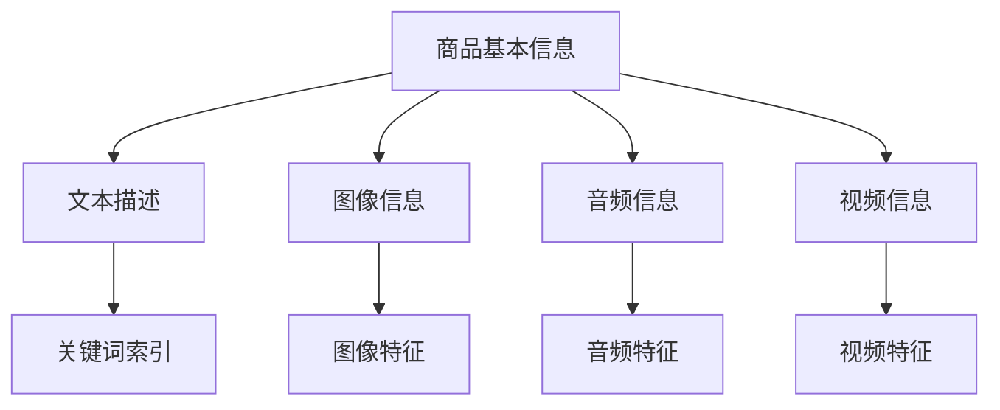

                 

# 文章标题：电商平台中的跨模态商品检索系统设计

## 关键词：跨模态检索、商品数据管理、文本检索、图像检索、音频检索、视频检索、多模态融合、系统设计与实现、项目实战、性能优化、安全与可靠性保障、未来发展

## 摘要：
本文全面深入地探讨了电商平台中的跨模态商品检索系统设计。首先，我们概述了跨模态检索的基本概念和其在电商平台中的重要性。接着，文章详细介绍了商品数据管理、文本检索、图像检索、音频检索和视频检索技术，并讲解了多模态融合检索的方法。在第三部分，我们设计了跨模态检索系统的架构，并逐步实现了文本-图像、文本-音频、文本-视频的跨模态检索。通过实战项目，我们展示了系统的实际搭建与配置，并对代码进行了详细解读。最后，文章讨论了系统性能优化、安全性与可靠性保障以及跨模态检索系统的未来发展。

## 第一部分：引言

### 第1章：跨模态商品检索系统概述

#### 1.1 跨模态检索的概念与重要性

跨模态检索是指将不同类型的数据模态（如文本、图像、音频、视频）结合起来，通过建立一种多模态的数据表示和检索机制，实现对这些不同类型数据的联合查询与检索。在电商平台中，用户通常需要通过多种方式来搜索商品，例如输入关键词、浏览商品图片、听取商品描述等。跨模态检索系统能够处理这些不同模态的信息，提供更加丰富和准确的检索结果。

跨模态检索在电商平台中的重要性主要体现在以下几个方面：

1. **提升用户体验**：用户可以更灵活地使用各种模态的信息来搜索商品，从而提高检索效率和满意度。
2. **扩大搜索范围**：跨模态检索能够将不同模态的信息结合起来，拓宽了用户的搜索渠道，提高了商品的曝光率和销售机会。
3. **个性化推荐**：跨模态检索可以帮助电商平台更好地理解用户的需求，实现个性化的商品推荐。
4. **降低搜索成本**：传统的单模态检索系统在处理复杂查询时效率较低，跨模态检索能够提高查询速度，降低搜索成本。

#### 1.2 电商平台中的跨模adt模态商品检索需求

电商平台中的跨模态商品检索需求主要体现在以下几个方面：

1. **关键词检索**：用户输入关键词进行商品搜索，系统需要根据关键词从多种模态的数据中检索出相关的商品。
2. **图像检索**：用户上传图片或浏览商品图片，系统需要根据图像特征检索出相似的商品。
3. **语音检索**：用户可以通过语音输入搜索商品，系统需要识别语音并检索出相应的商品。
4. **视频检索**：用户观看商品视频，系统需要根据视频内容检索出相关的商品。

#### 1.3 跨模态检索技术的发展趋势

随着人工智能和大数据技术的快速发展，跨模态检索技术也在不断演进。以下是跨模态检索技术的一些发展趋势：

1. **深度学习应用**：深度学习技术在跨模态检索中的应用越来越广泛，通过神经网络模型可以更好地提取不同模态的特征，实现高效的跨模态检索。
2. **多模态融合方法**：为了提高检索效果，研究人员提出了多种多模态融合方法，如基于特征的融合、基于知识的融合和基于模型的融合等。
3. **自适应检索算法**：跨模态检索系统需要根据用户的行为和反馈动态调整检索策略，实现个性化的检索体验。
4. **跨平台应用**：随着移动互联网和物联网的普及，跨模态检索技术将在更多应用场景中发挥作用，如智能家居、智能穿戴设备等。

### 第2章：商品数据管理

#### 2.1 商品数据结构设计

商品数据结构设计是跨模态商品检索系统的基础。一个有效的商品数据结构应该能够存储多种模态的信息，并支持高效的检索和更新。

以下是一个商品数据结构的示例：

在这个结构中，商品基本信息包括商品ID、名称、价格等基础信息；文本描述包含商品详情、用户评价等文本信息；图像信息包括商品图片的URL和图像特征；音频信息和视频信息则分别包含音频和视频的URL及其特征信息。

#### 2.2 商品数据采集与清洗

商品数据的采集是构建跨模态商品检索系统的关键步骤。以下是商品数据采集与清洗的几个关键点：

1. **数据来源**：商品数据可以从电商平台的数据库、第三方数据服务商、社交媒体等多个渠道获取。
2. **数据清洗**：在采集到商品数据后，需要进行数据清洗，去除重复、错误和无效的数据。例如，删除重复的商品条目、纠正错误的商品价格、过滤不相关的用户评论等。
3. **数据标准化**：对于不同来源的数据，需要统一数据格式和字段命名，以便后续的处理和检索。

#### 2.3 商品数据存储与索引

商品数据存储与索引是保证检索效率的重要环节。以下是商品数据存储与索引的几个关键点：

1. **数据存储**：商品数据可以存储在关系数据库、NoSQL数据库、文件系统等多种存储介质中。关系数据库适合存储结构化数据，NoSQL数据库适合存储非结构化数据。
2. **索引构建**：为了提高检索效率，需要对商品数据构建索引。常见的索引技术包括全文索引、倒排索引、图像索引、音频索引和视频索引等。
3. **数据分片**：当商品数据量非常大时，需要采用数据分片技术将数据分布到多个存储节点上，以提高系统的并发处理能力和查询效率。

### 第3章：跨模态检索技术基础

#### 第3章：文本检索技术

文本检索技术是跨模态检索系统中最基本和常见的一种技术。文本检索主要关注文本的表示、索引和相似度计算。

##### 3.1 文本检索的基本原理

文本检索的基本原理是利用用户输入的查询词或短语，在索引库中找到与之匹配的文档，并按照匹配程度排序，返回给用户。

以下是文本检索的基本流程：

1. **查询分析**：将用户输入的查询词或短语转换为检索式。
2. **索引查找**：在索引库中查找与检索式匹配的文档。
3. **文档排序**：根据匹配程度对文档进行排序。
4. **结果返回**：将排序后的文档返回给用户。

##### 3.2 词语表示方法

词语表示方法是文本检索系统的核心之一。常见的词语表示方法包括：

1. **布尔表示法**：将查询词表示为布尔表达式，如AND、OR、NOT等。
2. **向量表示法**：将查询词和文档表示为向量，常用的向量表示方法包括TF-IDF、Word2Vec、BERT等。

##### 3.3 文本相似度计算

文本相似度计算是文本检索系统的关键环节。常见的文本相似度计算方法包括：

1. **基于词频的方法**：计算查询词和文档中词频的相似度，如Jaccard相似度、余弦相似度等。
2. **基于语义的方法**：通过计算查询词和文档中词语的语义相似度，如WordNet相似度、Word2Vec相似度等。
3. **基于图的方法**：构建词图或文档图，通过图论算法计算节点间的相似度。

#### 第4章：图像检索技术

图像检索技术是跨模态检索系统中的重要组成部分，主要关注图像的特征提取、相似度计算和检索策略。

##### 4.1 图像检索的基本原理

图像检索的基本原理是利用用户输入的查询图像或查询短语，从图像库中找到与之相似的图像，并按照相似度排序，返回给用户。

以下是图像检索的基本流程：

1. **查询分析**：将用户输入的查询图像或查询短语转换为检索式。
2. **特征提取**：从查询图像中提取特征向量。
3. **图像检索**：在图像库中检索与查询图像特征相似的图像。
4. **结果排序**：根据相似度对检索结果进行排序。
5. **结果返回**：将排序后的图像返回给用户。

##### 4.2 特征提取方法

图像特征提取是图像检索系统的核心。常见的图像特征提取方法包括：

1. **传统特征提取方法**：如SIFT、SURF、HOG等，这些方法能够提取出图像的局部特征。
2. **深度学习方法**：如卷积神经网络（CNN），通过端到端的学习方式提取图像的全局和局部特征。

##### 4.3 图像相似度计算

图像相似度计算是图像检索系统的关键。常见的图像相似度计算方法包括：

1. **基于特征的相似度计算**：如欧氏距离、余弦相似度等，通过计算特征向量之间的距离来衡量相似度。
2. **基于内容相似度计算**：如结构相似性、纹理相似性等，通过分析图像内容来衡量相似度。
3. **基于聚类的方法**：如K-means、DBSCAN等，通过聚类算法将图像划分为相似类别。

#### 第5章：音频检索技术

音频检索技术是跨模态检索系统中的重要组成部分，主要关注音频的特征提取、相似度计算和检索策略。

##### 5.1 音频检索的基本原理

音频检索的基本原理是利用用户输入的查询音频或查询短语，从音频库中找到与之相似的音频，并按照相似度排序，返回给用户。

以下是音频检索的基本流程：

1. **查询分析**：将用户输入的查询音频或查询短语转换为检索式。
2. **特征提取**：从查询音频中提取特征向量。
3. **音频检索**：在音频库中检索与查询音频特征相似的音频。
4. **结果排序**：根据相似度对检索结果进行排序。
5. **结果返回**：将排序后的音频返回给用户。

##### 5.2 音频特征提取

音频特征提取是音频检索系统的核心。常见的音频特征提取方法包括：

1. **时域特征提取**：如能量、过零率等，通过分析音频信号的时域特性提取特征。
2. **频域特征提取**：如频谱特征、倒谱特征等，通过分析音频信号的频域特性提取特征。
3. **时频特征提取**：如短时傅里叶变换（STFT）、梅尔频率倒谱系数（MFCC）等，结合时域和频域特征提取。

##### 5.3 音频相似度计算

音频相似度计算是音频检索系统的关键。常见的音频相似度计算方法包括：

1. **基于特征的相似度计算**：如欧氏距离、余弦相似度等，通过计算特征向量之间的距离来衡量相似度。
2. **基于内容的相似度计算**：如周期性相似性、音色相似性等，通过分析音频内容来衡量相似度。
3. **基于聚类的方法**：如K-means、DBSCAN等，通过聚类算法将音频划分为相似类别。

#### 第6章：视频检索技术

视频检索技术是跨模态检索系统中的高级应用，主要关注视频的特征提取、相似度计算和检索策略。

##### 6.1 视频检索的基本原理

视频检索的基本原理是利用用户输入的查询视频或查询短语，从视频库中找到与之相似的

