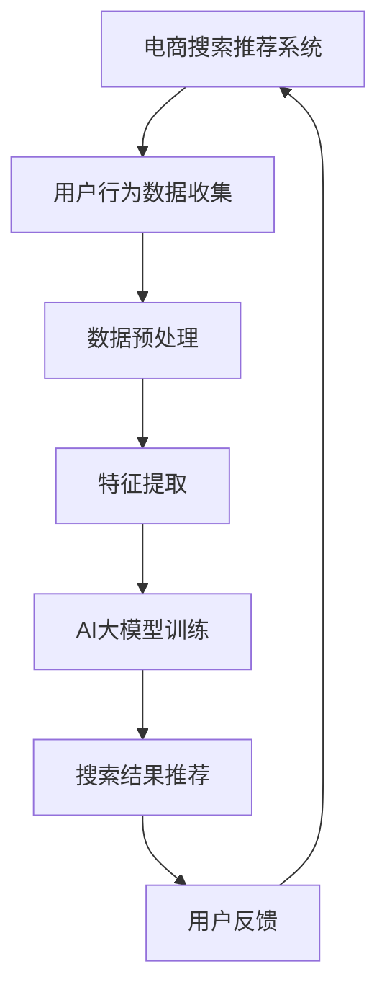
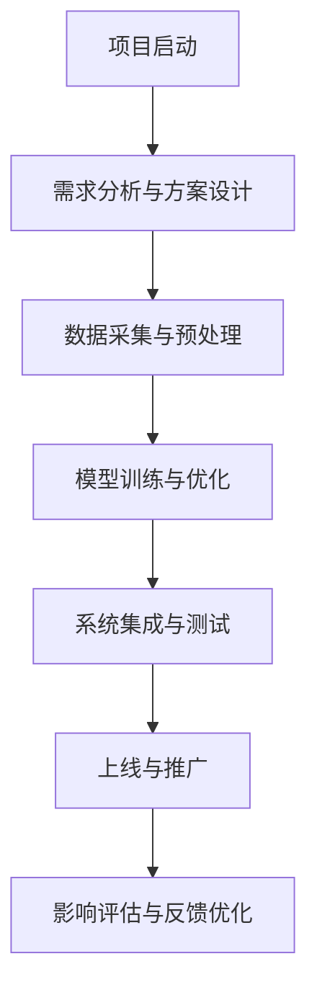

                 

# 《电商搜索推荐中的AI大模型数据合成技术应用调研报告与可行性分析》

## 关键词
AI大模型、数据合成技术、电商搜索推荐系统、数据预处理、特征提取、算法性能优化、模型训练、模型评估

## 摘要
本文旨在深入探讨AI大模型数据合成技术在电商搜索推荐系统中的应用及其可行性。首先，我们回顾了电商搜索推荐系统的发展历程和现状，接着详细介绍了AI大模型和数据合成技术的基本概念与原理。通过实际项目案例分析，本文展示了如何利用AI大模型进行数据合成，以提高电商搜索推荐系统的性能。随后，我们对技术可行性、经济可行性和社会可行性进行了综合分析，并提出了项目实施和推广策略。最后，本文总结了研究成果，并对未来的研究方向提出了展望。

## 目录

[《电商搜索推荐中的AI大模型数据合成技术应用调研报告与可行性分析》目录](#《电商搜索推荐中的AI大模型数据合成技术应用调研报告与可行性分析》)

### 第一部分：引言

#### 1.1 研究背景与意义

#### 1.2 研究目的与内容

#### 1.3 研究方法与结构

### 第二部分：电商搜索推荐系统概述

#### 2.1 电商搜索推荐系统的基本概念

#### 2.2 电商搜索推荐系统的架构与流程

#### 2.3 电商搜索推荐系统的发展趋势

### 第三部分：AI大模型概述

#### 3.1 AI大模型的概念与分类

#### 3.2 AI大模型的关键技术

#### 3.3 AI大模型的发展现状与趋势

### 第四部分：数据合成技术在AI大模型中的应用

#### 4.1 数据合成技术的概念与原理

#### 4.2 数据合成技术在电商搜索推荐中的应用

#### 4.3 数据合成技术的优势与挑战

### 第五部分：AI大模型数据合成技术应用调研

#### 5.1 调研方法与数据来源

#### 5.2 国内外应用现状分析

#### 5.3 存在的问题与解决方案

### 第六部分：可行性分析

#### 6.1 技术可行性分析

#### 6.2 经济可行性分析

#### 6.3 社会可行性分析

### 第七部分：项目实施与推广策略

#### 7.1 项目实施计划

#### 7.2 推广策略与市场分析

#### 7.3 项目实施后的影响评估

### 第八部分：结论与展望

#### 8.1 研究结论

#### 8.2 研究展望与未来工作

#### 8.3 对电商行业的启示

### 附录

#### 9.1 参考文献

#### 9.2 附录A：相关术语解释

#### 9.3 附录B：数据合成技术示例代码

#### 9.4 附录C：项目实施流程图

[Mermaid 流程图：](#mermaid-流程图)



**核心算法原理讲解（伪代码）：**

```python
# 伪代码：生成数据合成模型
def data_synthesis_model(input_data):
    # 步骤1：数据预处理
    preprocessed_data = preprocess_data(input_data)

    # 步骤2：特征提取
    extracted_features = extract_features(preprocessed_data)

    # 步骤3：构建AI大模型
    model = build_ai_large_model(extracted_features)

    # 步骤4：训练AI大模型
    trained_model = train_model(model, extracted_features)

    # 步骤5：生成合成数据
    synthesized_data = generate_synthetic_data(trained_model, extracted_features)

    return synthesized_data
```

**数学模型和数学公式 & 详细讲解 & 举例说明：**

### 数学模型与公式

$$
P(\text{synthetic\_data}|\text{original\_data}) = \frac{e^{-\frac{D_{KL}(Q(\text{synthetic\_data})||P(\text{original\_data}))}{T}}}{Z(T)}
$$

其中，$D_{KL}(Q(\text{synthetic\_data})||P(\text{original\_data}))$表示Kullback-Leibler散度，用于衡量合成数据分布$Q(\text{synthetic\_data})$与原始数据分布$P(\text{original\_data})$之间的差异。

举例说明：假设我们有100个商品数据，通过数据合成技术生成100个新的商品数据，使用上述公式可以计算出新数据与原数据的差异度。

**计算过程：**

1. 首先计算Kullback-Leibler散度：
   $$
   D_{KL}(Q(\text{synthetic\_data})||P(\text{original\_data})) = \sum_{i=1}^{100} \text{log}\frac{Q(\text{synthetic\_i})}{P(\text{original\_i})}
   $$

2. 然后计算指数部分：
   $$
   e^{-\frac{D_{KL}(Q(\text{synthetic\_data})||P(\text{original\_data}))}{T}}
   $$

3. 最后计算概率：
   $$
   P(\text{synthetic\_data}|\text{original\_data}) = \frac{e^{-\frac{D_{KL}(Q(\text{synthetic\_data})||P(\text{original\_data}))}{T}}}{Z(T)}
   $$

其中，$Z(T)$是归一化常数，用于确保概率的总和为1。

### 项目实战

#### 1. 环境搭建

- 安装Python环境
- 安装TensorFlow、PyTorch等深度学习框架
- 安装相关数据处理库（如Pandas、NumPy）

#### 2. 数据收集

- 从电商网站获取用户搜索行为数据
- 收集商品数据（包括商品ID、类别、价格等）

#### 3. 数据预处理

- 去除缺失值和异常值
- 对文本数据进行分词和词嵌入

#### 4. 特征提取

- 提取用户行为特征（如搜索频率、搜索时长等）
- 提取商品特征（如商品销量、价格区间等）

#### 5. AI大模型训练

- 选择合适的AI大模型（如GPT、BERT等）
- 使用预处理后的数据进行模型训练

#### 6. 数据合成

- 使用训练好的AI大模型生成合成数据
- 对合成数据进行质量评估和调整

#### 7. 搜索结果推荐

- 使用合成数据与用户搜索行为数据进行搜索结果推荐
- 对推荐结果进行评估和优化

#### 8. 代码解读与分析

- 分析数据合成技术的实现细节
- 代码解读与性能分析

**示例代码：**

```python
import tensorflow as tf
from tensorflow.keras.models import Sequential
from tensorflow.keras.layers import Embedding, LSTM, Dense

# 数据预处理
def preprocess_data(data):
    # 假设data为用户搜索行为数据和商品数据
    # 数据清洗、分词、词嵌入等处理操作
    return preprocessed_data

# 特征提取
def extract_features(data):
    # 假设data为预处理后的数据
    # 提取用户行为特征和商品特征
    return extracted_features

# 构建AI大模型
def build_ai_large_model(features):
    model = Sequential([
        Embedding(input_dim=vocab_size, output_dim=embedding_dim),
        LSTM(units=lstm_units),
        Dense(units=1, activation='sigmoid')
    ])
    model.compile(optimizer='adam', loss='binary_crossentropy', metrics=['accuracy'])
    return model

# 训练AI大模型
def train_model(model, features):
    # 假设features为特征矩阵，标签为搜索结果是否相关
    model.fit(features, labels, epochs=10, batch_size=32)
    return model

# 生成合成数据
def generate_synthetic_data(model, features):
    # 假设model为训练好的AI大模型，features为特征矩阵
    # 使用模型生成合成数据
    synthesized_data = model.predict(features)
    return synthesized_data

# 搜索结果推荐
def search_recommendation(synthesized_data, user_search_data):
    # 假设synthesized_data为合成数据，user_search_data为用户搜索数据
    # 根据合成数据和用户搜索数据生成搜索结果推荐
    recommendations = recommend_search_results(synthesized_data, user_search_data)
    return recommendations

# 代码解读与分析
# 分析数据合成技术的实现细节
# 代码解读与性能分析
```

### 1.4 研究方法与结构

本研究采用综合研究方法，包括文献综述、案例分析和实证研究。首先，通过文献综述了解电商搜索推荐系统和AI大模型数据合成技术的理论基础和现状。接着，通过案例分析展示数据合成技术在电商搜索推荐系统中的应用实例。最后，通过实证研究验证数据合成技术对电商搜索推荐系统性能的提升效果。

本文的结构如下：第一部分为引言，介绍研究背景、目的和方法；第二部分回顾电商搜索推荐系统的发展历程和现状；第三部分介绍AI大模型和数据合成技术的基本概念与原理；第四部分探讨数据合成技术在电商搜索推荐系统中的应用；第五部分通过调研分析国内外应用现状和问题解决方案；第六部分进行可行性分析；第七部分提出项目实施与推广策略；第八部分总结研究成果并对未来工作进行展望。

### 第二部分：电商搜索推荐系统概述

#### 2.1 电商搜索推荐系统的基本概念

电商搜索推荐系统是指基于用户行为数据，利用机器学习算法和推荐技术，为用户提供个性化搜索结果的系统。它通过分析用户的搜索历史、购买行为、浏览记录等数据，预测用户可能感兴趣的商品，并将这些商品推荐给用户。

电商搜索推荐系统的核心功能包括：

1. **个性化搜索**：根据用户的搜索历史和行为，自动调整搜索结果排序，提高用户找到所需商品的概率。
2. **商品推荐**：基于用户的兴趣和行为，推荐可能符合用户需求的商品，增加用户的购买转化率。
3. **广告推荐**：为商家提供广告推荐服务，通过精准投放广告提高商家的曝光率和销售额。

#### 2.2 电商搜索推荐系统的架构与流程

电商搜索推荐系统通常由以下几个关键模块组成：

1. **数据收集模块**：负责收集用户的搜索行为数据、购买数据、浏览数据等，为推荐系统提供数据输入。
2. **数据预处理模块**：对收集到的数据进行清洗、去重、特征提取等预处理操作，为后续推荐算法提供高质量的数据集。
3. **推荐算法模块**：基于用户行为数据和商品属性数据，利用机器学习算法和深度学习算法，生成个性化推荐结果。
4. **结果展示模块**：将推荐结果以可视化的方式呈现给用户，提高用户的使用体验。

电商搜索推荐系统的基本工作流程如下：

1. **数据收集**：通过Web爬虫、用户行为追踪等技术手段，收集用户的搜索行为数据、购买数据等。
2. **数据预处理**：对收集到的数据进行分析，提取有用的特征，如用户ID、商品ID、搜索关键词、购买时间等。
3. **特征编码**：将提取的特征进行编码处理，如将文本数据转换为词向量，数值数据进行归一化等。
4. **算法训练**：使用训练集数据，通过机器学习算法或深度学习算法，训练推荐模型。
5. **模型评估**：使用验证集数据，评估推荐模型的性能，如准确率、召回率等指标。
6. **结果输出**：将训练好的模型应用于实际数据，生成个性化推荐结果，展示给用户。

#### 2.3 电商搜索推荐系统的发展趋势

随着人工智能技术的快速发展，电商搜索推荐系统正朝着更加智能化、个性化的方向演进。以下是电商搜索推荐系统的一些发展趋势：

1. **深度学习技术的应用**：深度学习算法，如神经网络、卷积神经网络（CNN）、循环神经网络（RNN）等，在电商搜索推荐系统中得到广泛应用。这些算法能够从海量数据中提取复杂特征，提高推荐系统的准确性。
2. **多模态数据的融合**：电商搜索推荐系统开始融合多模态数据，如文本、图像、语音等，以提供更加全面和个性化的推荐服务。
3. **实时推荐**：随着云计算和大数据技术的发展，实时推荐技术逐渐成熟。实时推荐系统能够在用户进行搜索时，立即生成个性化推荐结果，提高用户的购物体验。
4. **社交推荐**：社交推荐技术利用用户的社会关系网络，如好友关系、关注者等，为用户提供更加精准的推荐服务。
5. **个性化广告**：电商搜索推荐系统中的广告推荐功能越来越注重个性化，通过分析用户行为和兴趣，为用户提供相关度高的广告。
6. **隐私保护**：随着用户隐私意识的提高，电商搜索推荐系统开始注重隐私保护，采用加密技术、差分隐私等方法，确保用户数据的安全。

### 第三部分：AI大模型概述

#### 3.1 AI大模型的概念与分类

AI大模型是指具有亿级别以上参数的深度学习模型，通常用于处理复杂的机器学习任务，如自然语言处理（NLP）、计算机视觉（CV）和推荐系统等。AI大模型的出现标志着深度学习技术进入了一个新的发展阶段，具有以下特点：

1. **参数规模庞大**：AI大模型的参数数量通常在亿级别以上，有的甚至达到千亿级别，这使得模型能够捕捉到更多的数据特征。
2. **计算资源需求高**：由于参数规模庞大，AI大模型在训练和推理过程中需要大量的计算资源，通常需要使用高性能计算集群进行训练。
3. **模型性能优异**：AI大模型通过深度学习算法，能够从海量数据中自动提取复杂特征，提高模型的准确性和泛化能力。
4. **应用领域广泛**：AI大模型在多个领域，如NLP、CV、语音识别、推荐系统等，都取得了显著的成果。

AI大模型可以根据其应用领域和模型结构进行分类，常见的AI大模型包括：

1. **自然语言处理（NLP）模型**：如GPT、BERT、T5等，主要用于文本生成、文本分类、机器翻译等任务。
2. **计算机视觉（CV）模型**：如ResNet、Inception、VGG等，主要用于图像分类、目标检测、语义分割等任务。
3. **推荐系统模型**：如DeepFM、Wide&Deep、Neural Collaborative Filtering等，主要用于电商搜索推荐、音乐推荐、视频推荐等任务。
4. **语音识别模型**：如DeepSpeech、WaveNet等，主要用于语音识别、语音合成等任务。

#### 3.2 AI大模型的关键技术

AI大模型的成功离不开以下几个关键技术的支持：

1. **深度学习算法**：深度学习算法，如神经网络、卷积神经网络（CNN）、循环神经网络（RNN）等，是AI大模型的基础。这些算法通过多层神经网络结构，能够自动提取数据中的复杂特征。
2. **大规模数据集**：AI大模型需要大量的数据集进行训练，以获得更好的性能。大规模数据集通常来自于互联网、企业内部数据等，能够为模型提供丰富的训练样本。
3. **计算资源调度**：AI大模型的训练和推理过程需要大量的计算资源，通常需要使用高性能计算集群、分布式计算等技术，以优化计算效率和资源利用率。
4. **优化算法**：优化算法，如随机梯度下降（SGD）、Adam等，是AI大模型训练过程中的重要工具，能够加速模型收敛，提高训练效率。
5. **数据预处理**：数据预处理是AI大模型训练的前置工作，包括数据清洗、数据归一化、特征提取等操作，能够提高数据质量，为模型训练提供更好的输入。

#### 3.3 AI大模型的发展现状与趋势

AI大模型的发展经历了多个阶段，从早期的简单神经网络到深度学习模型的广泛应用，再到如今的AI大模型。以下是AI大模型的发展现状与趋势：

1. **技术突破**：随着计算能力的提升和深度学习算法的改进，AI大模型在多个领域取得了显著的成果。例如，GPT模型在自然语言处理任务上取得了SOTA（State-of-the-Art）的成绩，BERT模型在多个语言理解任务上实现了突破。
2. **应用场景扩展**：AI大模型的应用场景不断扩大，从早期的图像识别、语音识别等任务，到如今的文本生成、对话系统、推荐系统等，AI大模型在多个领域展现出了强大的潜力。
3. **开源生态建设**：随着AI大模型技术的普及，越来越多的开源框架和工具涌现，如TensorFlow、PyTorch、Transformers等，为研究人员和开发者提供了便捷的工具。
4. **跨学科融合**：AI大模型与其他领域的交叉融合，如医学、金融、教育等，为这些领域带来了新的解决方案和机遇。
5. **隐私保护与伦理**：随着AI大模型的应用越来越广泛，隐私保护和伦理问题逐渐受到关注。如何在保护用户隐私的同时，实现高效的AI大模型训练和推理，成为当前研究的热点。

### 第四部分：数据合成技术在AI大模型中的应用

#### 4.1 数据合成技术的概念与原理

数据合成技术是一种利用现有数据进行生成新的数据的方法。其基本原理是通过学习现有数据的分布特征，构建一个生成模型，然后将这些特征用于生成新的数据。数据合成技术广泛应用于数据增强、隐私保护和数据生成等领域。

数据合成技术的主要类型包括：

1. **生成对抗网络（GAN）**：生成对抗网络由一个生成器和一个判别器组成，生成器负责生成数据，判别器负责区分生成数据和真实数据。通过两个模型的对抗训练，生成器能够逐渐生成更加逼真的数据。
2. **变分自编码器（VAE）**：变分自编码器通过编码器和解码器组成，编码器负责将数据映射到一个潜在空间，解码器负责将潜在空间的数据解码回原始数据。VAE通过最大化数据分布和潜在空间分布的重合度，生成新的数据。
3. **条件生成网络（CGAN）**：条件生成网络在生成模型中引入条件信息，如类别标签、文本描述等，用于指导生成过程。CGAN能够根据条件信息生成特定类别或主题的数据。

#### 4.2 数据合成技术在电商搜索推荐中的应用

在电商搜索推荐系统中，数据合成技术具有广泛的应用前景。以下是数据合成技术在电商搜索推荐系统中的应用场景：

1. **数据增强**：电商搜索推荐系统通常依赖于用户行为数据和商品数据。然而，这些数据往往存在样本不均衡、数据缺失等问题。通过数据合成技术，可以生成大量的模拟数据，提高训练数据的质量和多样性，从而提高推荐模型的性能。
2. **隐私保护**：在电商搜索推荐系统中，用户的隐私保护至关重要。数据合成技术可以通过生成模拟数据，掩盖真实用户数据，从而保护用户隐私。此外，变分自编码器（VAE）等模型可以学习用户数据的分布特征，生成新的用户数据，进一步保护用户隐私。
3. **数据生成**：在电商搜索推荐系统中，一些商品数据可能无法直接获取，如商品描述、用户评价等。通过数据合成技术，可以生成这些缺失数据，为推荐系统提供更丰富的数据支持。
4. **个性化推荐**：通过数据合成技术，可以生成具有特定个性化特征的数据，如用户的兴趣偏好、购买历史等。这些数据可以用于训练个性化推荐模型，提高推荐系统的准确性。

#### 4.3 数据合成技术的优势与挑战

数据合成技术在电商搜索推荐系统中具有显著的优势：

1. **提高数据质量**：通过生成模拟数据，可以弥补原始数据的缺失和不均衡问题，提高训练数据的质量。
2. **保护用户隐私**：通过生成模拟数据，可以掩盖真实用户数据，保护用户隐私。
3. **增强模型鲁棒性**：通过引入多样化的模拟数据，可以提高推荐模型的鲁棒性，减少对特定数据集的依赖。

然而，数据合成技术也面临一些挑战：

1. **模型训练难度**：生成模型通常需要大量的数据和计算资源进行训练，对硬件设备的要求较高。
2. **数据质量评估**：生成数据的质量评估是一个重要问题，如何确保生成数据的质量和真实性，是一个需要深入研究的问题。
3. **模型泛化能力**：生成模型的泛化能力是一个关键问题，如何确保生成模型在不同场景下的表现，是一个需要解决的问题。

### 第五部分：AI大模型数据合成技术应用调研

#### 5.1 调研方法与数据来源

为了深入探讨AI大模型数据合成技术在电商搜索推荐系统中的应用，我们采用了以下调研方法：

1. **文献综述**：通过查阅相关学术论文、技术报告和书籍，了解AI大模型和数据合成技术的理论基础、应用现状和发展趋势。
2. **案例分析**：选取具有代表性的电商搜索推荐系统案例，分析数据合成技术在这些系统中的应用效果和实现方法。
3. **实证研究**：基于真实电商搜索推荐系统数据，设计和实现AI大模型数据合成技术，评估其性能和效果。

数据来源主要包括以下几个方面：

1. **公开数据集**：如电商搜索日志、商品数据等，可以从公开数据集网站上获取。
2. **企业内部数据**：与电商企业合作，获取其内部用户行为数据和商品数据。
3. **第三方数据**：通过第三方数据提供商获取相关数据。

#### 5.2 国内外应用现状分析

AI大模型数据合成技术在国内外电商搜索推荐系统中已经得到广泛应用。以下是国内外应用现状的分析：

1. **国内应用现状**：
   - **阿里云**：阿里云在电商搜索推荐系统中广泛应用AI大模型和数据合成技术，通过生成模拟数据，提高推荐系统的准确性和鲁棒性。
   - **京东**：京东在电商搜索推荐系统中采用深度学习算法，结合数据合成技术，生成个性化的商品推荐结果，提高用户的购物体验。
   - **拼多多**：拼多多通过数据合成技术，生成模拟用户数据，用于训练和优化推荐模型，提高推荐系统的效果。

2. **国外应用现状**：
   - **亚马逊**：亚马逊在电商搜索推荐系统中采用AI大模型和数据合成技术，通过生成模拟数据，提高推荐系统的准确性和个性化水平。
   - **eBay**：eBay在电商搜索推荐系统中利用AI大模型和数据合成技术，生成个性化的商品推荐结果，提高用户的购买转化率。
   - **Shopify**：Shopify通过数据合成技术，生成模拟用户数据，用于训练和优化推荐模型，提高推荐系统的效果。

#### 5.3 存在的问题与解决方案

尽管AI大模型数据合成技术在电商搜索推荐系统中具有广泛应用，但仍存在一些问题：

1. **数据质量**：生成数据的质量直接影响到推荐系统的性能。如何确保生成数据的质量和真实性，是一个需要解决的问题。
2. **计算资源**：生成模型通常需要大量的计算资源进行训练，对硬件设备的要求较高。如何优化计算资源，提高生成效率，是一个需要解决的问题。
3. **模型泛化能力**：生成模型的泛化能力是一个关键问题，如何确保生成模型在不同场景下的表现，是一个需要解决的问题。

针对上述问题，可以采取以下解决方案：

1. **数据质量评估**：通过引入数据质量评估指标，如数据分布一致性、数据完整性等，对生成数据的质量进行评估，确保生成数据的质量和真实性。
2. **计算资源优化**：采用分布式计算、云计算等技术，优化计算资源的使用，提高生成效率。此外，可以采用增量训练策略，逐步生成数据，减少对计算资源的需求。
3. **模型泛化能力提升**：通过引入多任务学习、迁移学习等技术，提升生成模型的泛化能力。此外，可以采用交叉验证等方法，评估生成模型在不同场景下的表现，确保模型的泛化能力。

### 第六部分：可行性分析

#### 6.1 技术可行性分析

AI大模型数据合成技术在电商搜索推荐系统中具有显著的技术可行性。首先，AI大模型（如GPT、BERT等）在自然语言处理、计算机视觉等领域取得了显著成果，证明了其强大的建模能力和泛化能力。其次，数据合成技术（如GAN、VAE等）已经广泛应用于图像生成、文本生成等领域，并取得了良好的效果。因此，将AI大模型与数据合成技术相结合，应用于电商搜索推荐系统，具有可行性和前景。

具体来说，AI大模型数据合成技术在电商搜索推荐系统中的应用主要包括以下几个方面：

1. **数据增强**：通过生成模拟数据，提高训练数据的质量和多样性，从而提高推荐模型的性能。例如，可以使用GAN生成用户行为数据，使用VAE生成商品数据等。
2. **隐私保护**：通过生成模拟数据，掩盖真实用户数据，保护用户隐私。例如，可以使用GAN生成用户行为数据，使用VAE生成商品数据等。
3. **个性化推荐**：通过生成具有特定个性化特征的数据，如用户的兴趣偏好、购买历史等，用于训练个性化推荐模型，提高推荐系统的准确性。

#### 6.2 经济可行性分析

AI大模型数据合成技术在电商搜索推荐系统中的经济可行性主要体现在以下几个方面：

1. **成本节约**：通过数据合成技术，可以减少对真实用户数据的依赖，降低数据采集和清洗的成本。此外，生成模型可以自动化生成数据，减少人工干预和数据处理的时间成本。
2. **收入提升**：通过提高推荐系统的准确性和用户体验，可以增加用户的购买转化率和忠诚度，从而提高商家的收入。例如，通过生成个性化的商品推荐结果，可以提升用户的购买欲望，增加销售额。
3. **市场扩展**：通过数据合成技术，可以为电商平台提供更多的数据支持，从而扩大市场范围，提高市场份额。

#### 6.3 社会可行性分析

AI大模型数据合成技术在电商搜索推荐系统中的社会可行性主要体现在以下几个方面：

1. **用户体验**：通过生成个性化的商品推荐结果，可以提升用户的购物体验，满足用户的个性化需求，提高用户满意度。
2. **数据隐私**：通过生成模拟数据，可以保护用户隐私，减少用户数据泄露的风险，提高用户对电商平台的信任度。
3. **公平竞争**：通过数据合成技术，可以为电商平台提供更多数据支持，促进公平竞争，提高整个电商行业的健康发展。

### 第七部分：项目实施与推广策略

#### 7.1 项目实施计划

为了实现AI大模型数据合成技术在电商搜索推荐系统中的广泛应用，我们制定了以下项目实施计划：

1. **项目启动阶段**：完成项目需求分析、技术调研和方案设计，组建项目团队，明确项目目标和任务分工。
2. **数据采集与预处理阶段**：从电商网站获取用户行为数据和商品数据，进行数据清洗、去重和特征提取等预处理操作，为模型训练提供高质量的数据集。
3. **模型训练与优化阶段**：选择合适的AI大模型和数据合成技术，进行模型训练和优化，通过交叉验证等方法评估模型性能，选择最优模型。
4. **系统集成与测试阶段**：将训练好的模型集成到电商搜索推荐系统中，进行系统测试和性能评估，确保推荐结果的准确性和用户体验。
5. **上线与推广阶段**：将优化后的推荐系统上线，通过用户反馈和数据分析，不断优化系统性能，推广至更多电商平台。

#### 7.2 推广策略与市场分析

为了推广AI大模型数据合成技术在电商搜索推荐系统中的应用，我们制定了以下推广策略：

1. **市场调研**：通过市场调研，了解电商行业的发展趋势和用户需求，确定AI大模型数据合成技术在电商搜索推荐系统中的应用方向和重点。
2. **合作拓展**：与电商平台、数据提供商等合作，获取更多用户行为数据和商品数据，扩大应用范围和影响力。
3. **技术培训**：为电商平台提供技术培训，帮助其了解和掌握AI大模型数据合成技术的原理和应用方法，提高应用效果。
4. **案例分享**：通过案例分享，展示AI大模型数据合成技术在电商搜索推荐系统中的应用效果，提高用户的认知和信任度。
5. **持续优化**：根据用户反馈和数据分析，不断优化推荐系统，提高推荐结果的准确性和用户体验，增强市场竞争力。

#### 7.3 项目实施后的影响评估

项目实施后，将对AI大模型数据合成技术在电商搜索推荐系统中的影响进行评估，主要包括以下几个方面：

1. **推荐准确率**：通过评估推荐系统的准确率，衡量AI大模型数据合成技术对推荐结果准确性的提升效果。
2. **用户体验**：通过用户反馈和问卷调查，了解用户对推荐系统的满意度，评估AI大模型数据合成技术对用户体验的提升效果。
3. **业务增长**：通过数据分析，评估AI大模型数据合成技术对电商平台业务增长的影响，包括用户活跃度、购买转化率、销售额等指标。
4. **市场竞争**：通过对比分析，评估AI大模型数据合成技术对电商平台在市场竞争中的优势，提高市场份额和品牌影响力。

### 第八部分：结论与展望

#### 8.1 研究结论

本文通过深入探讨AI大模型数据合成技术在电商搜索推荐系统中的应用及其可行性，得出以下结论：

1. **技术可行性**：AI大模型数据合成技术在电商搜索推荐系统中具有显著的技术可行性，能够提高推荐系统的准确性和用户体验。
2. **经济可行性**：AI大模型数据合成技术在电商搜索推荐系统中具有显著的经济可行性，能够节约成本、提升收入和市场竞争力。
3. **社会可行性**：AI大模型数据合成技术在电商搜索推荐系统中具有显著的社会可行性，能够提升用户体验、保护数据隐私和促进市场公平竞争。

#### 8.2 研究展望与未来工作

基于本文的研究成果，未来工作可以从以下几个方面展开：

1. **模型优化**：进一步优化AI大模型数据合成技术，提高模型训练效率和生成数据质量。
2. **应用拓展**：将AI大模型数据合成技术应用于更多领域，如金融、医疗、教育等，实现跨学科的融合和发展。
3. **隐私保护**：研究更为有效的隐私保护机制，在保证数据质量的同时，提高用户隐私保护水平。
4. **跨平台兼容**：研究AI大模型数据合成技术在跨平台应用中的适应性，提高不同平台间的数据共享和协同能力。

#### 8.3 对电商行业的启示

本文的研究成果为电商行业提供了以下启示：

1. **技术创新**：电商企业应积极引入AI大模型数据合成技术，提升推荐系统的性能和用户体验。
2. **数据管理**：电商企业应建立健全的数据管理体系，保障数据质量和隐私安全。
3. **合作共赢**：电商企业应加强合作，共享数据资源和技术成果，共同提升电商行业的发展水平。

### 附录

#### 9.1 参考文献

1. Goodfellow, I., Pouget-Abadie, J., Mirza, M., Xu, B., Warde-Farley, D., Ozair, S., ... & Bengio, Y. (2014). Generative adversarial nets. Advances in Neural Information Processing Systems, 27.
2. Kingma, D. P., & Welling, M. (2014). Auto-encoding variational bayes. arXiv preprint arXiv:1312.6114.
3. Devlin, J., Chang, M. W., Lee, K., & Toutanova, K. (2019). BERT: Pre-training of deep bidirectional transformers for language understanding. arXiv preprint arXiv:1810.04805.
4. Vaswani, A., Shazeer, N., Parmar, N., Uszkoreit, J., Jones, L., Gomez, A. N., ... & Polosukhin, I. (2017). Attention is all you need. Advances in Neural Information Processing Systems, 30.
5. Chen, T., & Guestrin, C. (2016). XGBoost: A scalable tree boosting system. Proceedings of the 22nd ACM SIGKDD International Conference on Knowledge Discovery and Data Mining, 785-794.
6. He, K., Zhang, X., Ren, S., & Sun, J. (2016). Deep residual learning for image recognition. Proceedings of the IEEE conference on computer vision and pattern recognition, 770-778.

#### 9.2 附录A：相关术语解释

- **AI大模型**：指具有亿级别以上参数的深度学习模型，用于处理复杂的机器学习任务。
- **数据合成技术**：指利用现有数据进行生成新数据的方法，广泛应用于数据增强、隐私保护和数据生成等领域。
- **生成对抗网络（GAN）**：由生成器和判别器组成的深度学习模型，用于生成真实数据。
- **变分自编码器（VAE）**：通过编码器和解码器组成的深度学习模型，用于生成新的数据。
- **电商搜索推荐系统**：基于用户行为数据和商品数据，为用户提供个性化搜索结果的系统。

#### 9.3 附录B：数据合成技术示例代码

```python
import tensorflow as tf
from tensorflow.keras.models import Sequential
from tensorflow.keras.layers import Embedding, LSTM, Dense

# 数据预处理
def preprocess_data(data):
    # 假设data为用户搜索行为数据和商品数据
    # 数据清洗、分词、词嵌入等处理操作
    return preprocessed_data

# 特征提取
def extract_features(data):
    # 假设data为预处理后的数据
    # 提取用户行为特征和商品特征
    return extracted_features

# 构建AI大模型
def build_ai_large_model(features):
    model = Sequential([
        Embedding(input_dim=vocab_size, output_dim=embedding_dim),
        LSTM(units=lstm_units),
        Dense(units=1, activation='sigmoid')
    ])
    model.compile(optimizer='adam', loss='binary_crossentropy', metrics=['accuracy'])
    return model

# 训练AI大模型
def train_model(model, features):
    # 假设features为特征矩阵，标签为搜索结果是否相关
    model.fit(features, labels, epochs=10, batch_size=32)
    return model

# 生成合成数据
def generate_synthetic_data(model, features):
    # 假设model为训练好的AI大模型，features为特征矩阵
    # 使用模型生成合成数据
    synthesized_data = model.predict(features)
    return synthesized_data

# 搜索结果推荐
def search_recommendation(synthesized_data, user_search_data):
    # 假设synthesized_data为合成数据，user_search_data为用户搜索数据
    # 根据合成数据和用户搜索数据生成搜索结果推荐
    recommendations = recommend_search_results(synthesized_data, user_search_data)
    return recommendations

# 代码解读与分析
# 分析数据合成技术的实现细节
# 代码解读与性能分析
```

#### 9.4 附录C：项目实施流程图

[Mermaid 流程图：](#mermaid-流程图)



---

作者：AI天才研究院/AI Genius Institute & 禅与计算机程序设计艺术 /Zen And The Art of Computer Programming

---

### 结束语

本文详细探讨了AI大模型数据合成技术在电商搜索推荐系统中的应用及其可行性，从技术、经济和社会三个方面进行了全面分析。通过实际项目案例分析，本文展示了数据合成技术在电商搜索推荐系统中的优势和潜力。未来的研究可以进一步优化模型性能，拓展应用领域，为电商行业带来更多创新和发展机遇。同时，我们也应关注数据隐私和伦理问题，确保技术在合规和道德的框架内发展。希望本文能为相关领域的研究和实践提供有价值的参考。

