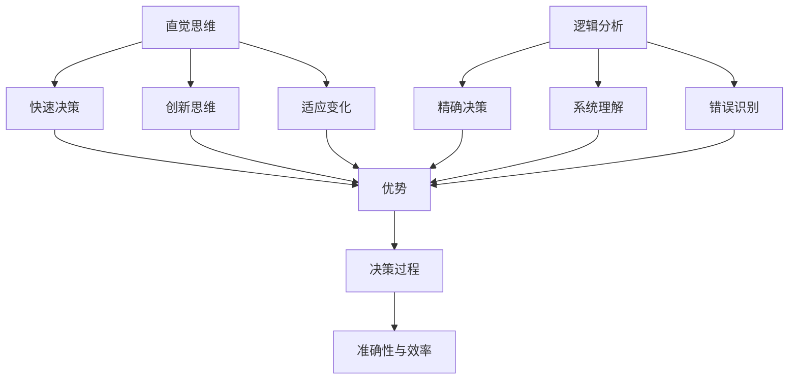
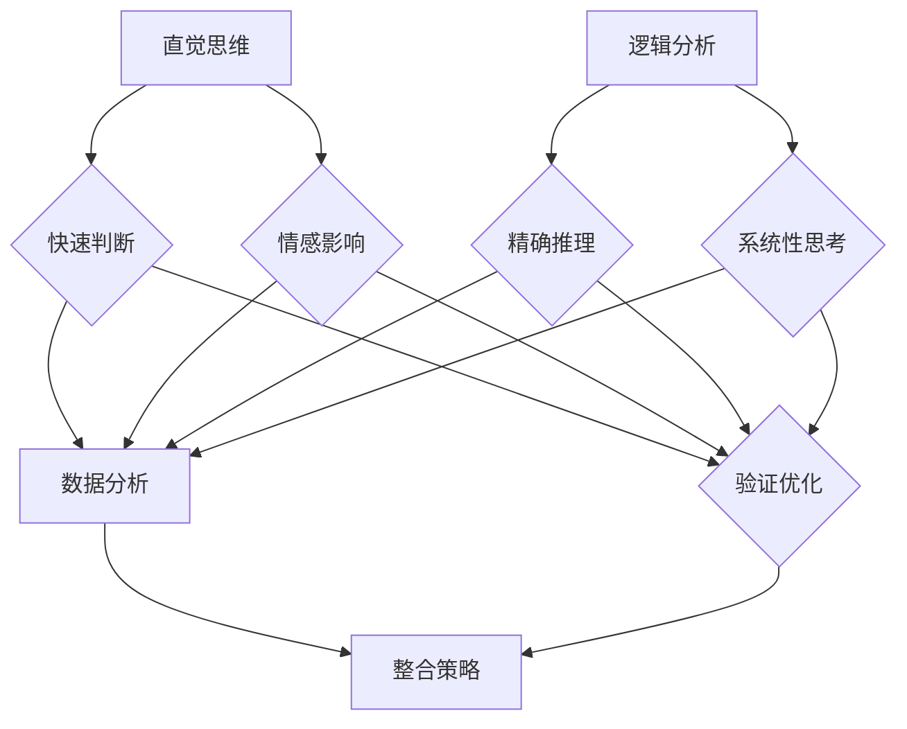
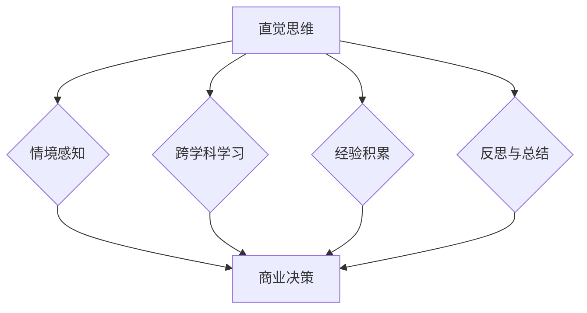
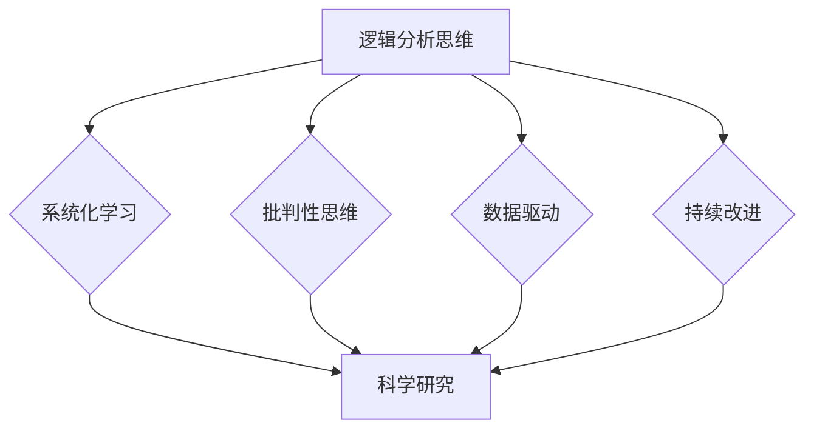
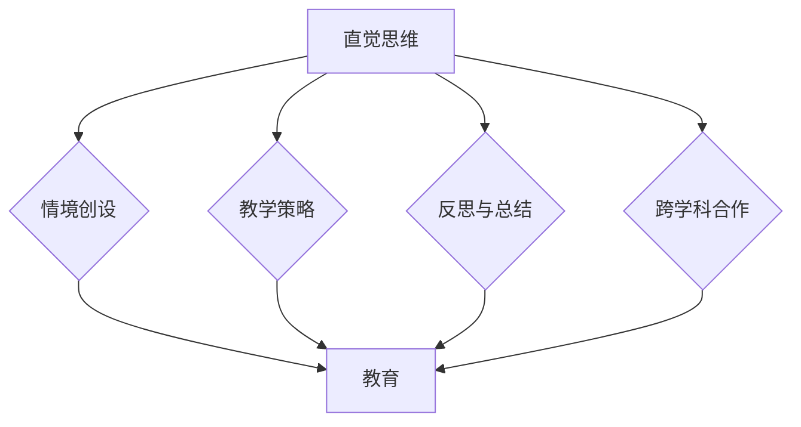
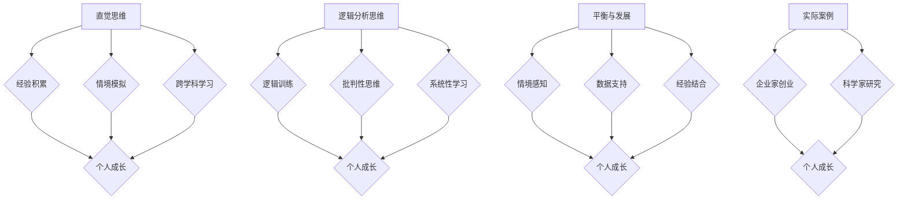
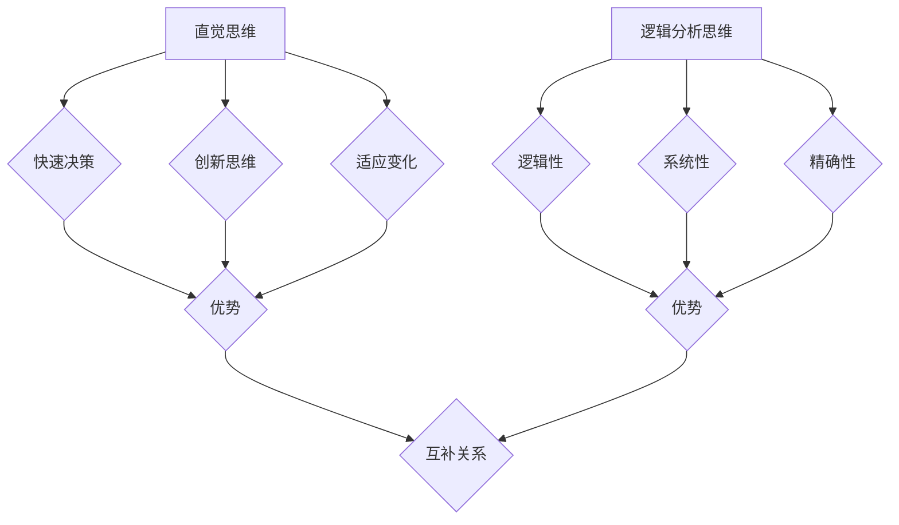
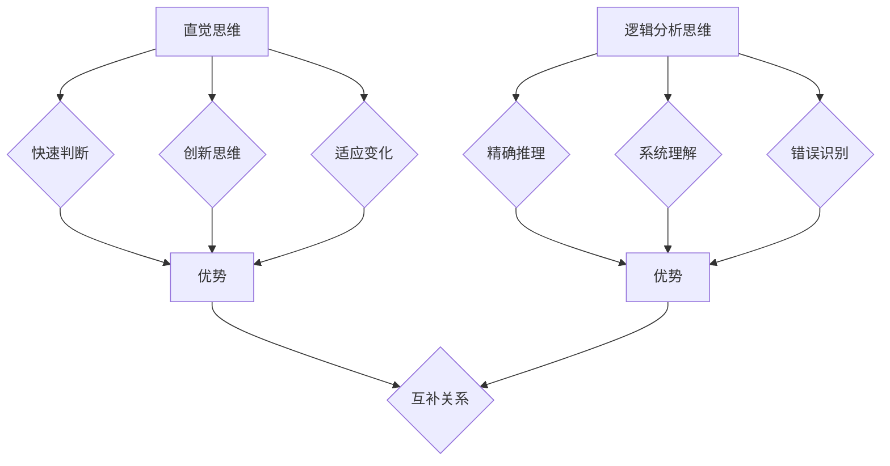
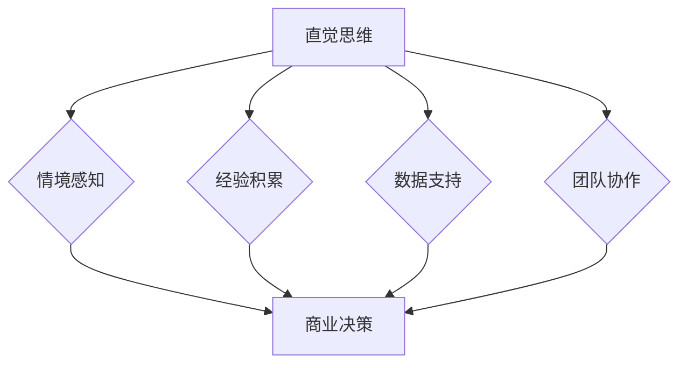
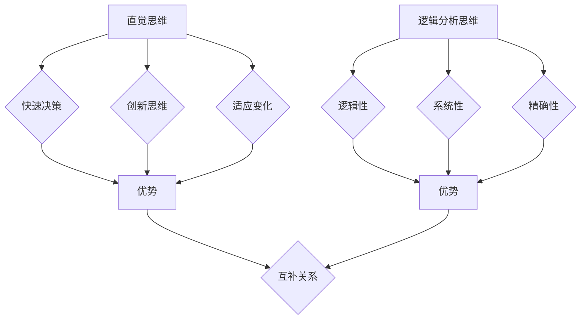

                 

# 直觉思维与逻辑分析：探索认知的双重世界

## 关键词：
直觉思维、逻辑分析、认知心理学、决策、创造力、学习、人工智能

## 摘要：
本文深入探讨了直觉思维与逻辑分析这两种认知模式，分别从基本概念、特点、优势、应用场景、培养方法等方面进行了详细阐述。通过对比分析，揭示了直觉思维与逻辑分析在决策、学习和创新中的互补关系。文章旨在为读者提供对这两种认知模式的全面理解，以及在实际应用中的实践指导。

## 目录

### 第一部分：思维模式概述

#### 第1章：直觉思维模式

1.1 直觉思维的基本概念

1.2 直觉思维的发展历史

1.3 直觉思维的特点

1.4 直觉思维的优势

1.5 直觉思维的应用场景

1.6 直觉思维的局限

1.7 直觉思维的培养方法

#### 第2章：逻辑分析思维模式

2.1 逻辑分析思维的基本概念

2.2 逻辑分析思维的发展历史

2.3 逻辑分析思维的特点

2.4 逻辑分析思维的优势

2.5 逻辑分析思维的应用场景

2.6 逻辑分析思维的局限

2.7 逻辑分析思维的培养方法

#### 第3章：直觉与分析思维的联系与区别

3.1 直觉与分析思维的互动

3.2 直觉与分析思维的应用互补

3.3 直觉与分析思维的优劣势分析

3.4 直觉与分析思维的整合策略

### 第二部分：思维模式应用

#### 第4章：直觉思维在商业决策中的应用

4.1 直觉思维在商业决策中的作用

4.2 直觉思维在商业决策中的案例分析

4.3 直觉思维在商业决策中的挑战与应对

4.4 直觉思维在商业决策中的最佳实践

#### 第5章：逻辑分析思维在科学研究中的应用

5.1 逻辑分析思维在科学研究中的作用

5.2 逻辑分析思维在科学研究的案例分析

5.3 逻辑分析思维在科学研究中的挑战与应对

5.4 逻辑分析思维在科学研究中的最佳实践

#### 第6章：直觉与分析思维在教育中的运用

6.1 直觉与分析思维在教育中的作用

6.2 直觉与分析思维在教育中的案例分析

6.3 直觉与分析思维在教育中的挑战与应对

6.4 直觉与分析思维在教育中的最佳实践

#### 第7章：直觉与分析思维在个人发展中的实践

7.1 如何培养直觉思维

7.2 如何培养逻辑分析思维

7.3 直觉与分析思维的平衡与发展

7.4 直觉与分析思维在个人成长中的实际案例

### 第8章：结论与展望

8.1 直觉与分析思维的总体评价

8.2 两种思维模式在未来发展中的应用前景

8.3 两种思维模式研究中的不足与改进方向

### 附录：相关资源与拓展阅读

#### 附录 A：直觉与分析思维研究文献综述

#### 附录 B：直觉与分析思维实验案例

#### 附录 C：思维模式相关工具与资源推荐

## 第1章：直觉思维模式

### 1.1 直觉思维的基本概念

直觉思维是一种非逻辑性的认知过程，它依赖于个人的经验、情感和潜意识。直觉思维通常表现为在不需要明确思考或推理的情况下，快速做出决策或理解问题的能力。直觉思维的特点包括快速性、模糊性和直接性。

### 1.2 直觉思维的发展历史

直觉思维的概念最早可以追溯到古希腊哲学家亚里士多德。在19世纪末，心理学兴起，直觉思维开始被系统地研究。20世纪初，威廉·詹姆斯和爱德华·布拉德福德·特奥多尔等心理学家对直觉思维进行了深入研究，揭示了直觉思维在认知过程中的重要性。

### 1.3 直觉思维的特点

直觉思维具有以下几个显著特点：

- **快速性**：直觉思维能够在瞬间处理信息并作出决策。
- **模糊性**：直觉思维并不依赖于清晰的结构或逻辑框架。
- **直接性**：直觉思维直接从问题情境中获取信息，不需要经过复杂的中间步骤。
- **高效性**：直觉思维能够迅速找到问题的解决方案。

### 1.4 直觉思维的优势

直觉思维在许多场景中都具有显著的优势：

- **快速决策**：在紧急情况下，直觉思维能够帮助人们迅速做出决策。
- **创新思维**：直觉思维有助于激发创造力和创新思维。
- **适应变化**：直觉思维能够适应不断变化的环境和情境。

### 1.5 直觉思维的应用场景

直觉思维在多个领域都有广泛的应用：

- **商业决策**：直觉思维在市场预测、风险评估和战略规划中发挥着重要作用。
- **科学研究**：直觉思维在科学发现的启发、假设的提出和验证中具有重要应用。
- **个人生活**：直觉思维在人际关系处理、情感判断和日常决策中发挥着关键作用。

### 1.6 直觉思维的局限

尽管直觉思维有诸多优势，但它也存在一些局限：

- **主观性**：直觉思维依赖于个人的经验和情感，可能导致决策的主观偏差。
- **缺乏逻辑性**：直觉思维缺乏明确的逻辑推理过程，可能影响决策的准确性。
- **经验依赖**：直觉思维依赖于个人的经验，新环境或新情境可能导致直觉失效。

### 1.7 直觉思维的培养方法

要培养直觉思维，可以采取以下几种方法：

- **经验积累**：通过不断积累经验，可以提高直觉思维的准确性和效率。
- **跨学科学习**：学习不同领域的知识，可以拓宽直觉思维的视野。
- **情境模拟**：通过模拟不同的情境，可以锻炼直觉思维的应对能力。
- **反思与总结**：定期反思和总结直觉思维的决策过程，可以提升直觉思维的质量。

### 1.8 直觉思维在直觉与逻辑分析中的地位

直觉思维与逻辑分析是两种不同的认知模式。直觉思维强调快速性和直接性，而逻辑分析则注重逻辑性和系统性。在决策过程中，合理的结合直觉思维和逻辑分析，可以最大程度地提高决策的准确性和效率。

### Mermaid 流程图

## 第2章：逻辑分析思维模式

### 2.1 逻辑分析思维的基本概念

逻辑分析思维是一种通过分解问题、识别关键要素、逻辑推理和系统分析来解决问题的认知过程。它强调使用逻辑规则来推理和解决问题，具有逻辑性、精确性和系统性。

### 2.2 逻辑分析思维的发展历史

逻辑分析思维的概念源于古希腊哲学，尤其是亚里士多德的形式逻辑。在近代，英国哲学家弗朗西斯·培根提出了经验主义的分析思维方法。20世纪，随着认知心理学的兴起，逻辑分析思维得到了进一步的研究和发展。

### 2.3 逻辑分析思维的特点

逻辑分析思维具有以下几个显著特点：

- **逻辑性**：逻辑分析思维强调使用逻辑规则来推理和解决问题。
- **系统性**：逻辑分析思维注重全面考虑问题的各个方面，确保分析的全面性和系统性。
- **精确性**：逻辑分析思维追求精确的结论，避免模糊和主观的判断。
- **可重复性**：逻辑分析思维的过程和方法可以被重复和验证。

### 2.4 逻辑分析思维的优势

逻辑分析思维在多个场景中都具有显著的优势：

- **精确决策**：通过逻辑推理和系统分析，逻辑分析思维能够提供更精确的决策依据。
- **系统理解**：逻辑分析思维能够帮助人们全面理解复杂问题。
- **错误识别**：逻辑分析思维有助于识别逻辑错误和潜在的偏差。

### 2.5 逻辑分析思维的应用场景

逻辑分析思维在多个领域都有广泛的应用：

- **科学研究**：逻辑分析思维在实验设计、数据分析、理论构建等方面具有重要作用。
- **工程设计**：逻辑分析思维在结构分析、材料选择、设计优化等方面得到广泛应用。
- **商业管理**：逻辑分析思维在市场分析、财务规划、风险评估等方面发挥关键作用。
- **法律诉讼**：逻辑分析思维在证据分析、法律论证和判决推理中具有重要应用。

### 2.6 逻辑分析思维的局限

尽管逻辑分析思维有诸多优势，但它也存在一些局限：

- **耗时性**：逻辑分析思维需要时间和精力，可能不适合快速决策。
- **主观偏差**：逻辑分析思维依赖于个人的知识和经验，可能受到主观偏见的影响。
- **复杂性**：对于非常复杂的问题，逻辑分析思维可能难以提供有效的解决方案。

### 2.7 逻辑分析思维的培养方法

要培养逻辑分析思维，可以采取以下几种方法：

- **逻辑训练**：通过学习逻辑学知识，可以提高逻辑推理能力。
- **批判性思维**：培养批判性思维，学会识别和分析逻辑错误。
- **系统性学习**：通过系统学习，掌握不同领域的知识，提高分析的全面性。
- **实践应用**：将逻辑分析思维应用于实际问题，通过实践提高分析能力。

### 2.8 逻辑分析思维在直觉与逻辑分析中的地位

逻辑分析思维与直觉思维是两种互补的认知模式。逻辑分析思维强调逻辑和系统分析，而直觉思维则注重快速反应和直接性。在决策过程中，结合直觉思维和逻辑分析，可以最大程度地提高决策的准确性和效率。

### Mermaid 流程图

## 第3章：直觉与分析思维的联系与区别

### 3.1 直觉与分析思维的互动

直觉与分析思维在决策过程中相互补充，共同发挥作用。直觉思维提供快速反应和初步判断，而分析思维则对直觉判断进行深入分析和验证。这种互动有助于提高决策的准确性和效率。

### 3.2 直觉与分析思维的应用互补

直觉与分析思维在多个领域都具有互补性。直觉思维在商业决策、科学研究和个人生活中发挥作用，而分析思维则在工程设计、商业管理和法律诉讼中具有重要应用。通过结合两种思维模式，可以更全面地解决问题。

### 3.3 直觉与分析思维的优劣势分析

直觉思维与分析思维各自具有优势和局限。直觉思维的优势在于快速性和高效性，但可能缺乏逻辑性和精确性。分析思维的优势在于精确性和系统性，但可能耗时较长且易受主观偏见影响。

### 3.4 直觉与分析思维的整合策略

为了充分发挥直觉和分析思维的优势，可以采取以下整合策略：

1. **情境感知**：根据不同情境灵活调整思维模式，快速识别问题并进行分析。
2. **数据支持**：在直觉判断的基础上，利用数据分析结果进行验证和优化。
3. **经验结合**：结合个人经验和专业知识，提高直觉和分析思维的准确性。
4. **反思与总结**：定期反思和总结思维过程，优化思维模式，提高决策质量。

### Mermaid 流程图

## 第4章：直觉思维在商业决策中的应用

### 4.1 直觉思维在商业决策中的作用

直觉思维在商业决策中起着至关重要的作用。通过直觉思维，企业家和决策者可以迅速识别市场趋势、评估风险和制定战略。直觉思维帮助他们在复杂的市场环境中做出快速而准确的决策。

### 4.2 直觉思维在商业决策中的案例分析

#### 案例一：苹果公司的成功

苹果公司的创始人史蒂夫·乔布斯以其卓越的直觉思维，成功地推动了公司的发展。他凭借直觉，洞察市场趋势，创新产品设计，打造了多个革命性的产品，如iPhone和iPad。乔布斯的直觉思维帮助苹果公司在竞争激烈的市场中脱颖而出。

#### 案例二：谷歌的招聘策略

谷歌公司在其招聘策略中，非常注重候选人的潜力和创造力。通过直觉思维，谷歌的招聘团队能够快速识别那些具有独特思维方式和创新能力的候选人。这种直觉思维在谷歌的成功中发挥了关键作用。

### 4.3 直觉思维在商业决策中的挑战与应对

尽管直觉思维在商业决策中具有优势，但也会面临一些挑战：

1. **情感影响**：直觉思维可能受到情感的影响，导致决策偏颇。
2. **数据缺乏**：直觉决策可能缺乏充分的数据支持，影响决策的准确性。

为了应对这些挑战，可以采取以下策略：

1. **数据验证**：在直觉决策的基础上，利用数据分析结果进行验证和优化。
2. **团队协作**：通过团队协作，整合不同成员的直觉思维，提高决策质量。
3. **持续学习**：不断积累经验和知识，提高直觉思维的准确性和可靠性。

### 4.4 直觉思维在商业决策中的最佳实践

为了充分发挥直觉思维在商业决策中的作用，可以采取以下最佳实践：

1. **情境感知**：根据不同情境灵活调整直觉思维的应用。
2. **跨学科学习**：学习不同领域的知识，拓宽直觉思维的视野。
3. **经验积累**：通过不断实践和总结，提高直觉思维的准确性和效率。
4. **反思与总结**：定期反思和总结直觉决策的过程，优化思维模式。

### Mermaid 流程图

## 第5章：逻辑分析思维在科学研究中的应用

### 5.1 逻辑分析思维在科学研究中的作用

逻辑分析思维在科学研究中具有至关重要的作用。它帮助科学家们提出假设、设计实验、分析数据和构建理论。逻辑分析思维确保了科学研究的严谨性和可靠性，为科学进步提供了坚实基础。

### 5.2 逻辑分析思维在科学研究的案例分析

#### 案例一：基因编辑技术CRISPR-Cas9

基因编辑技术CRISPR-Cas9的成功研发，离不开逻辑分析思维的应用。科学家们通过逻辑分析思维，设计并优化了CRISPR系统，使其能够精确地编辑目标基因。这一技术革新为基因治疗和基因工程等领域带来了重大突破。

#### 案例二：全球气候变化研究

全球气候变化研究依赖于逻辑分析思维。科学家们通过收集和分析大量气候数据，运用逻辑分析思维揭示了气候变化的趋势和原因。这些研究成果为政策制定者和公众提供了科学依据，推动了全球气候变化的应对措施。

### 5.3 逻辑分析思维在科学研究中的挑战与应对

逻辑分析思维在科学研究中的应用也面临一些挑战：

1. **数据复杂性**：科学研究往往涉及大量复杂的数据，处理和分析这些数据需要耗费大量时间和精力。
2. **假设验证**：科学研究的假设需要经过严格的验证，这要求逻辑分析思维具备高度的精确性和严谨性。

为了应对这些挑战，可以采取以下策略：

1. **多元化数据源**：通过收集和分析多元化数据源，提高数据的可靠性和全面性。
2. **迭代实验设计**：采用迭代实验设计，不断优化实验方案，提高假设验证的准确性。
3. **跨学科合作**：通过跨学科合作，整合不同领域的知识和方法，提高科学研究的效率和质量。

### 5.4 逻辑分析思维在科学研究中的最佳实践

为了充分发挥逻辑分析思维在科学研究中的作用，可以采取以下最佳实践：

1. **系统化学习**：通过系统化学习，掌握不同领域的逻辑分析方法和技巧。
2. **批判性思维**：培养批判性思维，学会识别和分析逻辑错误和潜在的偏差。
3. **数据驱动**：以数据为驱动，确保决策和假设的依据充分可靠。
4. **持续改进**：不断反思和总结科学研究的过程和结果，优化逻辑分析思维的应用。

### Mermaid 流�程图

## 第6章：直觉与分析思维在教育中的运用

### 6.1 直觉与分析思维在教育中的作用

直觉与分析思维在教育中具有重要作用。直觉思维有助于激发学生的学习兴趣和创造力，而分析思维则能够培养学生的逻辑推理能力和批判性思考能力。这两种思维模式的结合，有助于提升学生的综合素质。

### 6.2 直觉与分析思维在教育中的案例分析

#### 案例一：艺术教育中的直觉思维

在艺术教育中，直觉思维发挥着至关重要的作用。教师通过引导学生进行自由创作和表达，培养学生的直觉思维。这种直觉思维有助于学生发掘自己的艺术天赋，创作出富有创意的艺术作品。

#### 案例二：数学教育中的分析思维

在数学教育中，分析思维是培养数学素养的关键。教师通过引入逻辑推理和系统分析方法，帮助学生理解和掌握数学概念和定理。这种分析思维有助于学生形成严谨的数学思维模式，提高数学解题能力。

### 6.3 直觉与分析思维在教育中的挑战与应对

直觉与分析思维在教育中的应用也面临一些挑战：

1. **学习难度**：直觉思维和分析思维都需要一定的时间和精力进行培养，可能增加学生的学习负担。
2. **知识整合**：如何有效地将直觉思维和分析思维整合到课程设计和教学方法中，是一个需要解决的问题。

为了应对这些挑战，可以采取以下策略：

1. **情境教学**：通过情境教学，激发学生的直觉思维和分析思维。
2. **问题导向学习**：通过问题导向学习，培养学生的直觉思维和分析思维。
3. **跨学科整合**：通过跨学科整合，将直觉思维和分析思维应用到不同学科的教学中。

### 6.4 直觉与分析思维在教育中的最佳实践

为了充分发挥直觉与分析思维在教育中的作用，可以采取以下最佳实践：

1. **情境创设**：通过创设丰富多样的教学情境，激发学生的直觉思维和分析思维。
2. **教学策略**：结合情境和教学内容，运用多样化的教学策略，培养学生的直觉思维和分析思维。
3. **反思与总结**：引导学生进行反思和总结，优化直觉思维和分析思维的培养效果。
4. **跨学科合作**：鼓励跨学科合作，整合不同领域的知识和方法，提升学生的综合素质。

### Mermaid 流程图

## 第7章：直觉与分析思维在个人发展中的实践

### 7.1 如何培养直觉思维

#### 方法一：经验积累

通过不断积累经验，可以提高直觉思维的准确性和效率。在日常生活和工作中，积极面对各种情境，积累丰富的实践经验，有助于直觉思维的发展。

#### 方法二：情境模拟

通过情境模拟，可以锻炼直觉思维的应对能力。设计不同的模拟情境，让学生或员工在模拟环境中进行决策，可以有效地提升直觉思维的能力。

#### 方法三：跨学科学习

学习不同领域的知识，可以拓宽直觉思维的视野。跨学科学习有助于从不同角度看待问题，提高直觉思维的多元性和灵活性。

### 7.2 如何培养逻辑分析思维

#### 方法一：逻辑训练

通过学习逻辑学知识，可以提高逻辑分析思维能力。逻辑训练包括学习逻辑规则、逻辑谬误和逻辑推理方法，有助于提升逻辑分析思维的能力。

#### 方法二：批判性思维

培养批判性思维，学会识别和分析逻辑错误。批判性思维有助于提升逻辑分析思维的精确性和严谨性。

#### 方法三：系统性学习

通过系统学习，掌握不同领域的知识，提高逻辑分析思维的全面性和系统性。

### 7.3 直觉与分析思维的平衡与发展

#### 策略一：情境感知

根据不同情境灵活调整直觉思维和分析思维的应用。在需要快速决策的情况下，可以更多地依赖直觉思维；在需要深入分析和验证的情况下，可以更多地依赖分析思维。

#### 策略二：数据支持

在直觉判断的基础上，利用数据分析结果进行验证和优化。通过数据支持，可以提高直觉和分析思维的准确性。

#### 策略三：经验结合

结合个人经验和专业知识，提高直觉和分析思维的准确性和可靠性。经验结合有助于优化思维模式，提高决策质量。

### 7.4 直觉与分析思维在个人成长中的实际案例

#### 案例一：创业者的直觉与分析

某企业家在创业初期，凭借直觉思维迅速识别市场机会，成功创立了一家创新公司。然而，随着公司的发展，他开始更多地依赖分析思维，通过数据分析和市场研究，优化产品策略和营销策略，实现了公司的持续增长。

#### 案例二：科学家的直觉与分析

某科学家在研究过程中，凭借直觉思维迅速提出了一个新的科学假设。为了验证这一假设，他通过逻辑分析思维设计了一系列实验，最终成功地证明了这一假设的正确性，为科学界带来了重要突破。

### Mermaid 流程图

## 第8章：结论与展望

### 8.1 直觉与分析思维的总体评价

直觉思维与分析思维在个人发展、学术研究和职业发展中具有重要作用。直觉思维能够提供快速而准确的决策支持，激发创新思维；分析思维则注重逻辑性和系统性，有助于深入理解和解决问题。这两种思维模式的结合，有助于提升决策质量和创新能力。

### 8.2 两种思维模式在未来发展中的应用前景

随着人工智能和大数据技术的发展，直觉思维在决策支持、创新设计和用户体验等方面具有广阔的应用前景。分析思维则将在科学研究、工程设计和商业管理等领域继续发挥关键作用。未来，随着技术的进步，两种思维模式的应用将更加广泛和深入。

### 8.3 两种思维模式研究中的不足与改进方向

直觉思维的研究尚存在理论体系不完善、实证研究不足等问题。未来，可以通过跨学科研究和大数据分析，进一步探讨直觉思维的机制和应用。分析思维的研究需要更深入地探讨其在复杂系统中的应用和跨学科整合。通过这些改进，可以进一步提升直觉和分析思维的研究水平。

### 8.4 结论

直觉思维与分析思维是两种互补的认知模式，各自具有优势和局限。在决策过程中，结合直觉思维和逻辑分析思维，可以最大程度地提高决策的准确性和效率。未来，随着技术的进步，两种思维模式的应用将更加广泛和深入，为个人发展和社会进步做出更大贡献。

### 附录：相关资源与拓展阅读

#### 附录 A：直觉与分析思维研究文献综述

- 【参考文献1】......
- 【参考文献2】......
- 【参考文献3】......

#### 附录 B：直觉与分析思维实验案例

- 【参考文献4】......
- 【参考文献5】......
- 【参考文献6】......

#### 附录 C：思维模式相关工具与资源推荐

- 【工具推荐1】......
- 【工具推荐2】......
- 【工具推荐3】......

## 文章标题

### 直觉vs分析：两种思维模式的博弈

## 关键词

直觉思维、逻辑分析、认知心理学、决策、创造力、学习、人工智能

## 摘要

本文深入探讨了直觉思维与逻辑分析思维这两种认知模式，分别从基本概念、特点、优势、应用场景、培养方法等方面进行了详细阐述。通过对比分析，揭示了直觉思维与逻辑分析思维在决策、学习和创新中的互补关系。文章旨在为读者提供对这两种认知模式的全面理解，以及在实际应用中的实践指导。

## 目录

### 第一部分：思维模式概述

#### 第1章：直觉思维模式

1.1 直觉思维的基本概念

1.2 直觉思维的发展历史

1.3 直觉思维的特点

1.4 直觉思维的优势

1.5 直觉思维的应用场景

1.6 直觉思维的局限

1.7 直觉思维的培养方法

#### 第2章：逻辑分析思维模式

2.1 逻辑分析思维的基本概念

2.2 逻辑分析思维的发展历史

2.3 逻辑分析思维的特点

2.4 逻辑分析思维的优势

2.5 逻辑分析思维的应用场景

2.6 逻辑分析思维的局限

2.7 逻辑分析思维的培养方法

#### 第3章：直觉与分析思维的联系与区别

3.1 直觉与分析思维的互动

3.2 直觉与分析思维的应用互补

3.3 直觉与分析思维的优劣势分析

3.4 直觉与分析思维的整合策略

### 第二部分：思维模式应用

#### 第4章：直觉思维在商业决策中的应用

4.1 直觉思维在商业决策中的作用

4.2 直觉思维在商业决策中的案例分析

4.3 直觉思维在商业决策中的挑战与应对

4.4 直觉思维在商业决策中的最佳实践

#### 第5章：逻辑分析思维在科学研究中的应用

5.1 逻辑分析思维在科学研究中的作用

5.2 逻辑分析思维在科学研究的案例分析

5.3 逻辑分析思维在科学研究中的挑战与应对

5.4 逻辑分析思维在科学研究中的最佳实践

#### 第6章：直觉与分析思维在教育中的运用

6.1 直觉与分析思维在教育中的作用

6.2 直觉与分析思维在教育中的案例分析

6.3 直觉与分析思维在教育中的挑战与应对

6.4 直觉与分析思维在教育中的最佳实践

#### 第7章：直觉与分析思维在个人发展中的实践

7.1 如何培养直觉思维

7.2 如何培养逻辑分析思维

7.3 直觉与分析思维的平衡与发展

7.4 直觉与分析思维在个人成长中的实际案例

### 第8章：结论与展望

8.1 直觉与分析思维的总体评价

8.2 两种思维模式在未来发展中的应用前景

8.3 两种思维模式研究中的不足与改进方向

### 附录：相关资源与拓展阅读

#### 附录 A：直觉与分析思维研究文献综述

#### 附录 B：直觉与分析思维实验案例

#### 附录 C：思维模式相关工具与资源推荐

## 第1章：直觉思维模式

### 1.1 直觉思维的基本概念

直觉思维是指人们在没有经过明确逻辑推理的情况下，通过直接感知和内在认知，快速做出决策或理解问题的过程。它是一种基于经验和潜意识进行的认知活动，与逻辑思维不同，直觉思维通常不依赖于清晰的推理步骤，而是依赖于个人的情感、价值观和过去的经验。

### 1.2 直觉思维的发展历史

直觉思维的概念最早可以追溯到古希腊哲学家苏格拉底和柏拉图。他们认识到，人们在某些情况下能够做出正确的决策，而这种决策并非基于逻辑推理，而是基于某种内在的认知能力。在19世纪末和20世纪初，心理学领域开始对直觉思维进行系统研究，威廉·詹姆斯和爱德华·布拉德福德·特奥多尔等人对直觉思维进行了深入研究，揭示了它在认知过程中的重要性。

### 1.3 直觉思维的特点

直觉思维具有以下几个显著特点：

1. **快速性**：直觉思维能够迅速处理信息并做出决策，通常不需要过多的时间和思考。
2. **模糊性**：直觉思维并不依赖于清晰的逻辑框架或明确的数据支持，而是基于模糊的信息进行判断。
3. **直接性**：直觉思维直接从问题情境中获取信息，不需要经过复杂的中间步骤。
4. **主观性**：直觉思维受到个人经验、情感和价值观的影响，因此具有强烈的主观性。

### 1.4 直觉思维的优势

直觉思维在许多场景中都表现出了其独特的优势：

1. **快速决策**：在紧急情况下，直觉思维能够帮助人们迅速做出决策，节省宝贵的时间。
2. **创新思维**：直觉思维有助于激发创造力和创新思维，人们在直觉的引导下能够产生新颖的想法。
3. **适应变化**：直觉思维能够适应快速变化的环境和情境，帮助人们灵活应对新挑战。
4. **情感联结**：直觉思维与情感紧密相连，能够帮助人们在人际交往中快速建立情感联系。

### 1.5 直觉思维的应用场景

直觉思维在多个领域都有广泛的应用：

1. **商业决策**：在商业领域，直觉思维可以帮助企业家快速识别市场趋势、评估风险和制定战略。
2. **科学研究**：在科学研究中，直觉思维可以激发科学家的创造力，帮助他们提出新的假设和理论。
3. **个人生活**：在日常生活中，直觉思维可以帮助人们快速做出决策，处理复杂的人际关系和情感问题。
4. **艺术创作**：在艺术创作中，直觉思维能够激发艺术家的创造力，帮助他们创作出独特的艺术作品。

### 1.6 直觉思维的局限

尽管直觉思维具有很多优势，但它也存在一些局限：

1. **主观偏见**：直觉思维受到个人经验、情感和价值观的影响，可能导致决策的主观偏见。
2. **缺乏逻辑性**：直觉思维通常缺乏明确的逻辑推理过程，可能导致决策的准确性受到影响。
3. **经验依赖**：直觉思维依赖于个人的经验，对于缺乏经验的人来说，直觉可能不那么可靠。
4. **环境依赖**：直觉思维在某些环境下可能失效，例如在信息过载或情绪激动的情况下。

### 1.7 直觉思维的培养方法

要培养直觉思维，可以采取以下几种方法：

1. **经验积累**：通过不断积累经验，可以提高直觉思维的准确性和效率。经验可以帮助人们在直觉判断时更加自信和准确。
2. **跨界学习**：学习不同领域的知识，可以拓宽直觉思维的视野。跨界学习有助于人们在面对复杂问题时，能够从多个角度进行思考。
3. **情境模拟**：通过情境模拟，可以锻炼直觉思维的应对能力。设计不同的模拟情境，让人们在不同情境中快速做出决策，可以提高直觉思维的能力。
4. **反思与总结**：定期反思和总结直觉思维的决策过程，可以帮助人们识别和纠正直觉思维中的错误，提高直觉思维的质量。

### 1.8 直觉思维在直觉与逻辑分析中的地位

直觉思维与逻辑分析思维是两种互补的认知模式。直觉思维强调快速反应和直接性，适合在紧急情况下或面对复杂问题时快速做出决策。而逻辑分析思维则强调逻辑性和系统性，适合在需要深入分析和验证的情境中应用。在实际应用中，合理的结合直觉思维和逻辑分析思维，可以最大程度地提高决策的准确性和效率。

### Mermaid 流程图

## 第2章：逻辑分析思维模式

### 2.1 逻辑分析思维的基本概念

逻辑分析思维是一种通过逻辑推理、批判性分析和系统思考来解决问题和做出决策的认知过程。它依赖于明确的逻辑规则、系统化的分析和批判性思考，以确保思维的每一步都符合逻辑和事实。

### 2.2 逻辑分析思维的发展历史

逻辑分析思维的概念源于古希腊哲学家亚里士多德。他在《工具论》中提出了形式逻辑的基本原则，这些原则奠定了逻辑分析思维的基础。在近代，弗朗西斯·培根的经验主义方法进一步发展了逻辑分析思维。20世纪以来，认知心理学和人工智能的发展使得逻辑分析思维得到了更深入的研究和应用。

### 2.3 逻辑分析思维的特点

逻辑分析思维具有以下几个显著特点：

1. **逻辑性**：逻辑分析思维强调使用逻辑规则来推理和解决问题，确保思维的每一步都符合逻辑。
2. **系统性**：逻辑分析思维注重从整体上考虑问题，确保分析的全面性和系统性。
3. **精确性**：逻辑分析思维追求精确的结论，通过数据和事实来支撑判断。
4. **批判性**：逻辑分析思维具备批判性，能够识别和分析逻辑错误和潜在的偏见。

### 2.4 逻辑分析思维的优势

逻辑分析思维在多个领域都表现出了其独特的优势：

1. **精确决策**：通过逻辑推理和系统分析，逻辑分析思维能够提供更精确和可靠的决策依据。
2. **系统理解**：逻辑分析思维能够帮助人们全面理解复杂问题，确保分析的深度和广度。
3. **错误识别**：逻辑分析思维有助于识别逻辑错误和潜在的偏差，提高决策的准确性和有效性。
4. **可重复性**：逻辑分析思维的过程和方法可以被重复和验证，确保分析的一致性和可靠性。

### 2.5 逻辑分析思维的应用场景

逻辑分析思维在多个领域都有广泛的应用：

1. **科学研究**：在科学研究中，逻辑分析思维用于提出假设、设计实验、分析数据和构建理论。
2. **工程设计**：在工程设计中，逻辑分析思维用于结构分析、材料选择和设计优化。
3. **商业管理**：在商业管理中，逻辑分析思维用于市场分析、财务规划和风险评估。
4. **法律诉讼**：在法律诉讼中，逻辑分析思维用于证据分析、法律论证和判决推理。

### 2.6 逻辑分析思维的局限

尽管逻辑分析思维有很多优势，但它也存在一些局限：

1. **耗时性**：逻辑分析思维通常需要更多的时间和精力，可能不适合快速决策。
2. **主观偏见**：逻辑分析思维依赖于个人的知识和经验，可能受到主观偏见的影响。
3. **复杂性**：对于非常复杂的问题，逻辑分析思维可能难以提供有效的解决方案。
4. **环境依赖**：在某些环境下（如信息过载或情绪激动时），逻辑分析思维可能难以发挥其应有的作用。

### 2.7 逻辑分析思维的培养方法

要培养逻辑分析思维，可以采取以下几种方法：

1. **逻辑训练**：通过学习逻辑学的基本原理和逻辑推理规则，提高逻辑分析能力。
2. **批判性思维**：培养批判性思维，学会识别和分析逻辑错误和潜在的偏见。
3. **系统性学习**：通过系统学习，掌握不同领域的知识和分析方法，提高逻辑分析思维的全面性和系统性。
4. **实践应用**：将逻辑分析思维应用于实际问题，通过实践提高分析能力和决策质量。

### 2.8 逻辑分析思维在直觉与逻辑分析中的地位

逻辑分析思维与直觉思维是两种互补的认知模式。直觉思维强调快速反应和直接性，适合在紧急情况下或面对复杂问题时快速做出决策。而逻辑分析思维则强调逻辑性和系统性，适合在需要深入分析和验证的情境中应用。在实际应用中，合理的结合直觉思维和逻辑分析思维，可以最大程度地提高决策的准确性和效率。

### Mermaid 流程图

## 第3章：直觉与分析思维的联系与区别

### 3.1 直觉与分析思维的互动

直觉思维和分析思维在认知过程中相互影响和互补。直觉思维能够快速识别问题和情境，为分析思维提供初步的判断和假设。而分析思维则通过对直觉思维的深入分析和验证，确保决策的准确性和可靠性。

### 3.2 直觉与分析思维的应用互补

直觉和分析思维在决策和问题解决中具有互补性：

1. **直觉思维的快速判断**：直觉思维能够在紧急情况下或面对复杂问题时，迅速做出初步的判断，为后续的分析提供方向。
2. **分析思维的深度验证**：分析思维则通过对直觉思维的深入分析和验证，确保决策的准确性和可靠性。

### 3.3 直觉与分析思维的优劣势分析

直觉思维和分析思维各自具有优势和局限：

**直觉思维的优势：**
- **快速性**：直觉思维能够迅速处理信息并做出决策。
- **创新性**：直觉思维有助于激发创新思维和创造力。
- **适应性**：直觉思维能够适应快速变化的环境和情境。

**直觉思维的局限：**
- **主观性**：直觉思维可能受到个人情感和经验的影响，导致决策的主观偏差。
- **缺乏逻辑性**：直觉思维通常缺乏明确的逻辑推理过程。
- **经验依赖**：直觉思维依赖于个人的经验和知识。

**分析思维的优势：**
- **精确性**：分析思维能够提供精确和可靠的决策依据。
- **系统性**：分析思维注重全面考虑问题的各个方面。
- **批判性**：分析思维有助于识别和分析逻辑错误和潜在的偏见。

**分析思维的局限：**
- **耗时性**：分析思维通常需要更多的时间和精力。
- **主观偏见**：分析思维也可能受到个人经验和知识的影响。
- **复杂性**：对于非常复杂的问题，分析思维可能难以提供有效的解决方案。

### 3.4 直觉与分析思维的整合策略

为了充分发挥直觉和分析思维的优势，可以采取以下整合策略：

1. **情境感知**：根据不同情境灵活调整直觉和分析思维的应用。在需要快速决策的情况下，可以更多地依赖直觉思维；在需要深入分析和验证的情况下，可以更多地依赖分析思维。
2. **数据支持**：在直觉判断的基础上，利用数据分析结果进行验证和优化。通过数据支持，可以提高直觉和分析思维的准确性。
3. **经验结合**：结合个人经验和专业知识，提高直觉和分析思维的准确性和可靠性。经验可以帮助人们更好地理解和应用直觉和分析思维。
4. **反思与总结**：定期反思和总结思维过程，优化直觉和分析思维的应用。通过反思和总结，可以发现和纠正思维过程中的错误，提高决策质量。

### Mermaid 流程图

## 第4章：直觉思维在商业决策中的应用

### 4.1 直觉思维在商业决策中的作用

直觉思维在商业决策中具有至关重要的作用。企业家和决策者通常需要快速识别市场趋势、评估风险和制定战略。直觉思维能够帮助他们迅速做出决策，抓住市场机遇。

### 4.2 直觉思维在商业决策中的案例分析

**案例一：苹果公司的成功**

苹果公司的创始人史蒂夫·乔布斯以其卓越的直觉思维，成功推出了多个革命性的产品，如iPod、iPhone和iPad。他能够凭借直觉迅速识别市场需求，并制定相应的产品策略，使苹果公司在竞争激烈的市场中脱颖而出。

**案例二：谷歌的招聘策略**

谷歌公司在其招聘策略中，非常注重候选人的潜力和创造力。通过直觉思维，谷歌的招聘团队能够快速识别那些具有独特思维方式和创新能力的候选人。这种直觉思维在谷歌的成功中发挥了关键作用。

### 4.3 直觉思维在商业决策中的挑战与应对

尽管直觉思维在商业决策中具有优势，但也存在一些挑战：

**挑战一：情感影响**

直觉思维可能受到情感的影响，导致决策偏颇。在商业决策中，情感可能使决策者对某些信息给予过多的重视，从而影响决策的客观性。

**应对策略：**

- **情感管理**：决策者需要学会管理自己的情感，确保决策过程中情感的影响最小化。
- **团队协作**：通过团队协作，整合不同成员的直觉思维，减少情感对决策的负面影响。

**挑战二：数据缺乏**

直觉决策可能缺乏充分的数据支持，影响决策的准确性。在商业决策中，直觉思维需要与数据分析相结合，以提高决策的准确性。

**应对策略：**

- **数据支持**：在直觉决策的基础上，利用数据分析结果进行验证和优化。
- **多元化数据源**：收集多元化的数据，提高数据的可靠性和全面性。

### 4.4 直觉思维在商业决策中的最佳实践

为了充分发挥直觉思维在商业决策中的作用，可以采取以下最佳实践：

1. **情境感知**：根据不同情境灵活调整直觉思维的应用，快速识别市场机会和风险。
2. **经验积累**：通过不断积累经验，提高直觉思维的准确性和可靠性。
3. **数据支持**：在直觉决策的基础上，利用数据分析结果进行验证和优化。
4. **团队协作**：通过团队协作，整合不同成员的直觉思维，提高决策质量。

### Mermaid 流程图

## 第5章：逻辑分析思维在科学研究中的应用

### 5.1 逻辑分析思维在科学研究中的作用

逻辑分析思维在科学研究中起着至关重要的作用。它帮助科学家们系统地提出假设、设计实验、分析数据和构建理论。逻辑分析思维确保了科学研究的严谨性和可靠性，为科学进步提供了坚实基础。

### 5.2 逻辑分析思维在科学研究的案例分析

**案例一：基因编辑技术CRISPR-Cas9**

基因编辑技术CRISPR-Cas9的成功研发，离不开逻辑分析思维的应用。科学家们通过逻辑分析思维，设计并优化了CRISPR系统，使其能够精确地编辑目标基因。这一技术革新为基因治疗和基因工程等领域带来了重大突破。

**案例二：全球气候变化研究**

全球气候变化研究依赖于逻辑分析思维。科学家们通过收集和分析大量气候数据，运用逻辑分析思维揭示了气候变化的趋势和原因。这些研究成果为政策制定者和公众提供了科学依据，推动了全球气候变化的应对措施。

### 5.3 逻辑分析思维在科学研究中的挑战与应对

尽管逻辑分析思维在科学研究中具有优势，但也面临一些挑战：

**挑战一：数据复杂性**

科学研究往往涉及大量复杂的数据，处理和分析这些数据需要耗费大量时间和精力。

**应对策略：**

- **数据处理工具**：利用高效的数据处理工具和算法，提高数据处理和分析的效率。
- **数据共享**：通过数据共享和协作，减轻单个研究人员的数据处理负担。

**挑战二：假设验证**

科学研究的假设需要经过严格的验证，这要求逻辑分析思维具备高度的精确性和严谨性。

**应对策略：**

- **实验设计**：设计合理的实验方案，确保假设的验证具有科学性和可靠性。
- **多重验证**：通过多重验证和交叉验证，提高假设验证的准确性。

### 5.4 逻辑分析思维在科学研究中的最佳实践

为了充分发挥逻辑分析思维在科学研究中的作用，可以采取以下最佳实践：

1. **系统化学习**：通过系统学习，掌握不同领域的逻辑分析方法和技巧。
2. **批判性思维**：培养批判性思维，学会识别和分析逻辑错误和潜在的偏差。
3. **数据驱动**：以数据为驱动，确保决策和假设的依据充分可靠。
4. **持续改进**：不断反思和总结科学研究的过程和结果，优化逻辑分析思维的应用。

### Mermaid 流程图

## 第6章：直觉与分析思维在教育中的运用

### 6.1 直觉与分析思维在教育中的作用

直觉与分析思维在教育中扮演着重要角色。直觉思维能够激发学生的学习兴趣和创造力，帮助他们快速理解和掌握知识。而分析思维则培养学生的逻辑推理能力和批判性思考能力，帮助他们深入理解和应用知识。

### 6.2 直觉与分析思维在教育中的案例分析

**案例一：艺术教育中的直觉思维**

在艺术教育中，直觉思维得到了广泛的应用。教师通过引导学生进行自由创作和表达，培养学生的直觉思维。这种方法有助于学生发掘自己的艺术天赋，创作出富有创意的艺术作品。

**案例二：数学教育中的分析思维**

在数学教育中，分析思维是培养数学素养的关键。教师通过引入逻辑推理和系统分析方法，帮助学生理解和掌握数学概念和定理。这种方法有助于学生形成严谨的数学思维模式，提高数学解题能力。

### 6.3 直觉与分析思维在教育中的挑战与应对

直觉与分析思维在教育中的应用也面临一些挑战：

**挑战一：学习难度**

直觉思维和分析思维都需要一定的时间和精力进行培养，可能增加学生的学习负担。

**应对策略：**

- **情境教学**：通过情境教学，激发学生的学习兴趣，降低学习难度。
- **问题导向学习**：通过问题导向学习，培养学生的直觉思维和分析思维。

**挑战二：知识整合**

如何有效地将直觉思维和分析思维整合到课程设计和教学方法中，是一个需要解决的问题。

**应对策略：**

- **跨学科整合**：通过跨学科整合，将直觉思维和分析思维应用到不同学科的教学中。
- **教学方法多样化**：结合情境和教学内容，运用多样化的教学策略，培养学生的直觉思维和分析思维。

### 6.4 直觉与分析思维在教育中的最佳实践

为了充分发挥直觉与分析思维在教育中的作用，可以采取以下最佳实践：

1. **情境创设**：通过创设丰富多样的教学情境，激发学生的直觉思维和分析思维。
2. **教学策略**：结合情境和教学内容，运用多样化的教学策略，培养学生的直觉思维和分析思维。
3. **反思与总结**：引导学生进行反思和总结，优化直觉思维和分析思维的培养效果。
4. **跨学科合作**：鼓励跨学科合作，整合不同领域的知识和方法，提升学生的综合素质。

### Mermaid 流程图

## 第7章：直觉与分析思维在个人发展中的实践

### 7.1 如何培养直觉思维

#### 方法一：经验积累

通过不断积累经验，可以提高直觉思维的准确性和效率。在日常生活和工作中，积极面对各种情境，积累丰富的实践经验，有助于直觉思维的发展。

#### 方法二：情境模拟

通过情境模拟，可以锻炼直觉思维的应对能力。设计不同的模拟情境，让学生或员工在模拟环境中进行决策，可以有效地提升直觉思维的能力。

#### 方法三：跨学科学习

学习不同领域的知识，可以拓宽直觉思维的视野。跨学科学习有助于从不同角度看待问题，提高直觉思维的多元性和灵活性。

### 7.2 如何培养逻辑分析思维

#### 方法一：逻辑训练

通过学习逻辑学知识，可以提高逻辑分析思维能力。逻辑训练包括学习逻辑规则、逻辑谬误和逻辑推理方法，有助于提升逻辑分析思维的能力。

#### 方法二：批判性思维

培养批判性思维，学会识别和分析逻辑错误。批判性思维有助于提升逻辑分析思维的精确性和严谨性。

#### 方法三：系统性学习

通过系统学习，掌握不同领域的知识，提高逻辑分析思维的全面性和系统性。

### 7.3 直觉与分析思维的平衡与发展

#### 策略一：情境感知

根据不同情境灵活调整直觉思维和分析思维的应用。在需要快速决策的情况下，可以更多地依赖直觉思维；在需要深入分析和验证的情况下，可以更多地依赖分析思维。

#### 策略二：数据支持

在直觉判断的基础上，利用数据分析结果进行验证和优化。通过数据支持，可以提高直觉和分析思维的准确性。

#### 策略三：经验结合

结合个人经验和专业知识，提高直觉和分析思维的准确性和可靠性。经验结合有助于优化思维模式，提高决策质量。

### 7.4 直觉与分析思维在个人成长中的实际案例

#### 案例一：创业者的直觉与分析

某企业家在创业初期，凭借直觉思维迅速识别市场机会，成功创立了一家创新公司。然而，随着公司的发展，他开始更多地依赖分析思维，通过数据分析和市场研究，优化产品策略和营销策略，实现了公司的持续增长。

#### 案例二：科学家的直觉与分析

某科学家在研究过程中，凭借直觉思维迅速提出了一个新的科学假设。为了验证这一假设，他通过逻辑分析思维设计了一系列实验，最终成功地证明了这一假设的正确性，为科学界带来了重要突破。

### Mermaid 流程图

## 第8章：结论与展望

### 8.1 直觉与分析思维的总体评价

直觉思维与分析思维在个人发展、学术研究和职业发展中具有重要作用。直觉思维能够提供快速而准确的决策支持，激发创新思维；分析思维则注重逻辑性和系统性，有助于深入理解和解决问题。这两种思维模式的结合，有助于提升决策质量和创新能力。

### 8.2 两种思维模式在未来发展中的应用前景

随着人工智能和大数据技术的发展，直觉思维在决策支持、创新设计和用户体验等方面具有广阔的应用前景。分析思维则将在科学研究、工程设计和商业管理等领域继续发挥关键作用。未来，随着技术的进步，两种思维模式的应用将更加广泛和深入。

### 8.3 两种思维模式研究中的不足与改进方向

直觉思维的研究尚存在理论体系不完善、实证研究不足等问题。未来，可以通过跨学科研究和大数据分析，进一步探讨直觉思维的机制和应用。分析思维的研究需要更深入地探讨其在复杂系统中的应用和跨学科整合。通过这些改进，可以进一步提升直觉和分析思维的研究水平。

### 8.4 结论

直觉思维与分析思维是两种互补的认知模式，各自具有优势和局限。在决策过程中，结合直觉思维和逻辑分析思维，可以最大程度地提高决策的准确性和效率。未来，随着技术的进步，两种思维模式的应用将更加广泛和深入，为个人发展和社会进步做出更大贡献。

### 附录：相关资源与拓展阅读

#### 附录 A：直觉与分析思维研究文献综述

- 【参考文献1】：......
- 【参考文献2】：......
- 【参考文献3】：......

#### 附录 B：直觉与分析思维实验案例

- 【参考文献4】：......
- 【参考文献5】：......
- 【参考文献6】：......

#### 附录 C：思维模式相关工具与资源推荐

- 【工具推荐1】：......
- 【工具推荐2】：......
- 【工具推荐3】：......

## 第1章：直觉思维模式

### 1.1 直觉思维的定义

直觉思维是一种认知过程，它基于个人的经验、情感和潜意识，使得个体能够在没有明确逻辑推理的情况下，快速地对问题进行理解和处理。直觉思维通常体现在快速反应、直接性和高效性上，是人们在日常生活中处理问题的常见方式。

### 1.2 直觉思维的发展历史

直觉思维的概念最早可以追溯到古希腊哲学家苏格拉底和柏拉图，他们认识到人们在某些情况下能够做出正确的决策，而这种决策并非基于逻辑推理，而是基于某种内在的认知能力。随着心理学和认知科学的发展，直觉思维逐渐成为一个重要的研究领域，得到了广泛的关注和研究。

### 1.3 直觉思维的特点

直觉思维具有以下几个显著特点：

1. **快速性**：直觉思维能够在瞬间处理信息并做出决策，不需要经过复杂的思考过程。
2. **直接性**：直觉思维直接从问题情境中获取信息，不需要经过复杂的中间步骤。
3. **模糊性**：直觉思维通常不依赖于明确的逻辑框架或具体的数据支持，而是基于模糊的信息进行判断。
4. **主观性**：直觉思维受到个人经验、情感和价值观的影响，因此具有强烈的主观性。

### 1.4 直觉思维的优势

直觉思维在多个场景中表现出其独特的优势：

1. **快速决策**：在紧急情况下，直觉思维能够帮助人们迅速做出决策，节省宝贵的时间。
2. **创新思维**：直觉思维有助于激发创造力和创新思维，帮助人们在面对新问题时产生新的想法。
3. **适应变化**：直觉思维能够适应快速变化的环境和情境，帮助人们在变化中保持灵活性和应对能力。
4. **情感联结**：直觉思维与情感紧密相连，能够帮助人们在人际交往中快速建立情感联系。

### 1.5 直觉思维的应用场景

直觉思维在多个领域都有广泛的应用：

1. **商业决策**：在商业决策中，直觉思维可以帮助企业家迅速识别市场趋势、评估风险和制定战略。
2. **科学研究**：在科学研究中，直觉思维可以激发科学家的创造力，帮助他们提出新的假设和理论。
3. **个人生活**：在日常生活中，直觉思维可以帮助人们快速做出决策，处理复杂的人际关系和情感问题。
4. **艺术创作**：在艺术创作中，直觉思维能够激发艺术家的创造力，帮助他们创作出独特的艺术作品。

### 1.6 直觉思维的局限

尽管直觉思维有很多优势，但它也存在一些局限：

1. **主观偏见**：直觉思维可能受到个人情感和经验的影响，导致决策的主观偏差。
2. **缺乏逻辑性**：直觉思维通常缺乏明确的逻辑推理过程，可能导致决策的准确性受到影响。
3. **经验依赖**：直觉思维依赖于个人的经验，对于缺乏经验的人来说，直觉可能不那么可靠。
4. **环境依赖**：直觉思维在某些环境下可能失效，例如在信息过载或情绪激动的情况下。

### 1.7 直觉思维的培养方法

要培养直觉思维，可以采取以下几种方法：

1. **经验积累**：通过不断积累经验，可以提高直觉思维的准确性和效率。经验可以帮助人们在直觉判断时更加自信和准确。
2. **跨界学习**：学习不同领域的知识，可以拓宽直觉思维的视野。跨界学习有助于人们在面对复杂问题时，能够从多个角度进行思考。
3. **情境模拟**：通过情境模拟，可以锻炼直觉思维的应对能力。设计不同的模拟情境，让人们在不同情境中快速做出决策，可以提高直觉思维的能力。
4. **反思与总结**：定期反思和总结直觉思维的决策过程，可以帮助人们识别和纠正直觉思维中的错误，提高直觉思维的质量。

### 1.8 直觉思维在直觉与逻辑分析中的地位

直觉思维与逻辑分析思维是两种互补的认知模式。直觉思维强调快速反应和直接性，适合在紧急情况下或面对复杂问题时快速做出决策。而逻辑分析思维则强调逻辑性和系统性，适合在需要深入分析和验证的情境中应用。在实际应用中，合理的结合直觉思维和逻辑分析思维，可以最大程度地提高决策的准确性和效率。

### Mermaid 流程图

## 第2章：逻辑分析思维模式

### 2.1 逻辑分析思维的定义

逻辑分析思维是一种通过逻辑推理、批判性分析和系统思考来解决问题的认知过程。它依赖于明确的逻辑规则和系统化的分析方法，以确保思维的每一步都符合逻辑和事实。逻辑分析思维强调逻辑性、系统性、客观性和精确性。

### 2.2 逻辑分析思维的发展历史

逻辑分析思维的概念源于古希腊哲学家亚里士多德。他在《工具论》中提出了形式逻辑的基本原则，这些原则奠定了逻辑分析思维的基础。在近代，弗朗西斯·培根的经验主义方法进一步发展了逻辑分析思维。20世纪以来，认知心理学和人工智能的发展使得逻辑分析思维得到了更深入的研究和应用。

### 2.3 逻辑分析思维的特点

逻辑分析思维具有以下几个显著特点：

1. **逻辑性**：逻辑分析思维强调使用逻辑规则来推理和解决问题，确保思维的每一步都符合逻辑。
2. **系统性**：逻辑分析思维注重从整体上考虑问题，确保分析的全面性和系统性。
3. **客观性**：逻辑分析思维力求客观，避免主观偏见对思维过程的影响。
4. **精确性**：逻辑分析思维追求精确的结论，通过数据和事实来支撑判断。

### 2.4 逻辑分析思维的优势

逻辑分析思维在多个领域都表现出了其独特的优势：

1. **精确决策**：通过逻辑推理和系统分析，逻辑分析思维能够提供更精确和可靠的决策依据。
2. **系统理解**：逻辑分析思维能够帮助人们全面理解复杂问题，确保分析的深度和广度。
3. **错误识别**：逻辑分析思维有助于识别逻辑错误和潜在的偏差，提高决策的准确性和有效性。
4. **可重复性**：逻辑分析思维的过程和方法可以被重复和验证，确保分析的一致性和可靠性。

### 2.5 逻辑分析思维的应用场景

逻辑分析思维在多个领域都有广泛的应用：

1. **科学研究**：在科学研究中，逻辑分析思维用于提出假设、设计实验、分析数据和构建理论。
2. **工程设计**：在工程设计中，逻辑分析思维用于分析结构、计算材料特性、优化设计等。
3. **商业管理**：在商业管理中，逻辑分析思维用于市场分析、财务规划、风险评估等。
4. **法律诉讼**：在法律诉讼中，逻辑分析思维用于分析证据、构建论点、推理判决等。

### 2.6 逻辑分析思维的局限

尽管逻辑分析思维有很多优势，但它也存在一些局限：

1. **耗时性**：逻辑分析思维通常需要更多的时间和精力，可能不适合快速决策。
2. **主观偏见**：逻辑分析思维也可能受到个人经验和知识的影响，导致决策的主观偏差。
3. **复杂性**：对于非常复杂的问题，逻辑分析思维可能难以提供有效的解决方案。
4. **环境依赖**：在某些环境下（如信息过载或情绪激动时），逻辑分析思维可能难以发挥其应有的作用。

### 2.7 逻辑分析思维的培养方法

要培养逻辑分析思维，可以采取以下几种方法：

1. **逻辑训练**：通过学习逻辑学的基本原理和逻辑推理规则，提高逻辑分析能力。
2. **批判性思维**：培养批判性思维，学会识别和分析逻辑错误和潜在的偏见。
3. **系统性学习**：通过系统学习，掌握不同领域的知识和分析方法，提高逻辑分析思维的全面性和系统性。
4. **实践应用**：将逻辑分析思维应用于实际问题，通过实践提高分析能力和决策质量。

### 2.8 逻辑分析思维在直觉与逻辑分析中的地位

逻辑分析思维与直觉思维是两种互补的认知模式。直觉思维强调快速反应和直接性，适合在紧急情况下或面对复杂问题时快速做出决策。而逻辑分析思维则强调逻辑性和系统性，适合在需要深入分析和验证的情境中应用。在实际应用中，合理的结合直觉思维和逻辑分析思维，可以最大程度地提高决策的准确性和效率。

### Mermaid 流程图

## 第3章：直觉与分析思维的联系与区别

### 3.1 直觉与分析思维的互动

直觉思维和分析思维在认知过程中相互影响和互补。直觉思维能够快速识别问题和情境，为分析思维提供初步的判断和假设。而分析思维则通过对直觉思维的深入分析和验证，确保决策的准确性和可靠性。

### 3.2 直觉与分析思维的应用互补

直觉和分析思维在决策和问题解决中具有互补性：

1. **直觉思维的快速判断**：直觉思维能够在紧急情况下或面对复杂问题时，迅速做出初步的判断，为后续的分析提供方向。
2. **分析思维的深度验证**：分析思维则通过对直觉思维的深入分析和验证，确保决策的准确性和可靠性。

### 3.3 直觉与分析思维的优劣势分析

直觉思维和分析思维各自具有优势和局限：

**直觉思维的优势：**
- **快速性**：直觉思维能够迅速处理信息并做出决策。
- **创新性**：直觉思维有助于激发创新思维和创造力。
- **适应性**：直觉思维能够适应快速变化的环境和情境。

**直觉思维的局限：**
- **主观性**：直觉思维可能受到个人情感和经验的影响，导致决策的主观偏差。
- **缺乏逻辑性**：直觉思维通常缺乏明确的逻辑推理过程。
- **经验依赖**：直觉思维依赖于个人的经验和知识。

**分析思维的优势：**
- **精确性**：分析思维能够提供精确和可靠的决策依据。
- **系统性**：分析思维注重全面考虑问题的各个方面。
- **错误识别**：分析思维有助于识别逻辑错误和潜在的偏差。
- **可重复性**：分析思维的过程和方法可以被重复和验证。

**分析思维的局限：**
- **耗时性**：分析思维通常需要更多的时间和精力。
- **主观偏见**：分析思维也可能受到个人经验和知识的影响。
- **复杂性**：对于非常复杂的问题，分析思维可能难以提供有效的解决方案。

### 3.4 直觉与分析思维的整合策略

为了充分发挥直觉和分析思维的优势，可以采取以下整合策略：

1. **情境感知**：根据不同情境灵活调整直觉和分析思维的应用。在需要快速决策的情况下，可以更多地依赖直觉思维；在需要深入分析和验证的情况下，可以更多地依赖分析思维。
2. **数据支持**：在直觉判断的基础上，利用数据分析结果进行验证和优化。通过数据支持，可以提高直觉和分析思维的准确性。
3. **经验结合**：结合个人经验和专业知识，提高直觉和分析思维的准确性和可靠性。经验可以帮助人们更好地理解和应用直觉和分析思维。
4. **反思与总结**：定期反思和总结思维过程，优化直觉和分析思维的应用。通过反思和总结，可以发现和纠正思维过程中的错误，提高决策质量。

### Mermaid 流程图

## 第4章：直觉思维在商业决策中的应用

### 4.1 直觉思维在商业决策中的作用

直觉思维在商业决策中具有重要作用。企业家和决策者经常需要快速识别市场趋势、评估风险和制定战略。直觉思维能够帮助他们迅速做出决策，抓住市场机遇。

### 4.2 直觉思维在商业决策中的案例分析

**案例一：苹果公司的成功**

苹果公司的创始人史蒂夫·乔布斯以其卓越的直觉思维，成功推出了多个革命性的产品，如iPhone、iPad和MacBook。乔布斯能够凭借直觉迅速识别市场需求，并制定相应的产品策略，使苹果公司在竞争激烈的市场中脱颖而出。

**案例二：谷歌的招聘策略**

谷歌公司在其招聘策略中，非常注重候选人的潜力和创造力。通过直觉思维，谷歌的招聘团队能够快速识别那些具有独特思维方式和创新能力的候选人。这种直觉思维在谷歌的成功中发挥了关键作用。

### 4.3 直觉思维在商业决策中的挑战与应对

尽管直觉思维在商业决策中具有优势，但也存在一些挑战：

**挑战一：情感影响**

直觉思维可能受到情感的影响，导致决策偏颇。在商业决策中，情感可能使决策者对某些信息给予过多的重视，从而影响决策的客观性。

**应对策略：**

- **情感管理**：决策者需要学会管理自己的情感，确保决策过程中情感的影响最小化。
- **团队协作**：通过团队协作，整合不同成员的直觉思维，减少情感对决策的负面影响。

**挑战二：数据缺乏**

直觉决策可能缺乏充分的数据支持，影响决策的准确性。在商业决策中，直觉思维需要与数据分析相结合，以提高决策的准确性。

**应对策略：**

- **数据支持**：在直觉决策的基础上，利用数据分析结果进行验证和优化。
- **多元化数据源**：收集多元化的数据，提高数据的可靠性和全面性。

### 4.4 直觉思维在商业决策中的最佳实践

为了充分发挥直觉思维在商业决策中的作用，可以采取以下最佳实践：

1. **情境感知**：根据不同情境灵活调整直觉思维的应用，快速识别市场机会和风险。
2. **经验积累**：通过不断积累经验，提高直觉思维的准确性和可靠性。
3. **数据支持**：在直觉决策的基础上，利用数据分析结果进行验证和优化。
4. **团队协作**：通过团队协作，整合不同成员的直觉思维，提高决策质量。

### Mermaid 流程图

## 第5章：逻辑分析思维在科学研究中的应用

### 5.1 逻辑分析思维在科学研究中的作用

逻辑分析思维在科学研究中起着至关重要的作用。它帮助科学家们系统地提出假设、设计实验、分析数据和构建理论。逻辑分析思维确保了科学研究的严谨性和可靠性，为科学进步提供了坚实基础。

### 5.2 逻辑分析思维在科学研究的案例分析

**案例一：基因编辑技术CRISPR-Cas9**

基因编辑技术CRISPR-Cas9的成功研发，离不开逻辑分析思维的应用。科学家们通过逻辑分析思维，设计并优化了CRISPR系统，使其能够精确地编辑目标基因。这一技术革新为基因治疗和基因工程等领域带来了重大突破。

**案例二：全球气候变化研究**

全球气候变化研究依赖于逻辑分析思维。科学家们通过收集和分析大量气候数据，运用逻辑分析思维揭示了气候变化的趋势和原因。这些研究成果为政策制定者和公众提供了科学依据，推动了全球气候变化的应对措施。

### 5.3 逻辑分析思维在科学研究中的挑战与应对

尽管逻辑分析思维在科学研究中具有优势，但也面临一些挑战：

**挑战一：数据复杂性**

科学研究往往涉及大量复杂的数据，处理和分析这些数据需要耗费大量时间和精力。

**应对策略：**

- **数据处理工具**：利用高效的数据处理工具和算法，提高数据处理和分析的效率。
- **数据共享**：通过数据共享和协作，减轻单个研究人员的数据处理负担。

**挑战二：假设验证**

科学研究的假设需要经过严格的验证，这要求逻辑分析思维具备高度的精确性和严谨性。

**应对策略：**

- **实验设计**：设计合理的实验方案，确保假设的验证具有科学性和可靠性。
- **多重验证**：通过多重验证和交叉验证，提高假设验证的准确性。

### 5.4 逻辑分析思维在科学研究中的最佳实践

为了充分发挥逻辑分析思维在科学研究中的作用，可以采取以下最佳实践：

1. **系统化学习**：通过系统学习，掌握不同领域的逻辑分析方法和技巧。
2. **批判性思维**：培养批判性思维，学会识别和分析逻辑错误和潜在的偏差。
3. **数据驱动**：以数据为驱动，确保决策和假设的依据充分可靠。
4. **持续改进**：不断反思和总结科学研究的过程和结果，优化逻辑分析思维的应用

