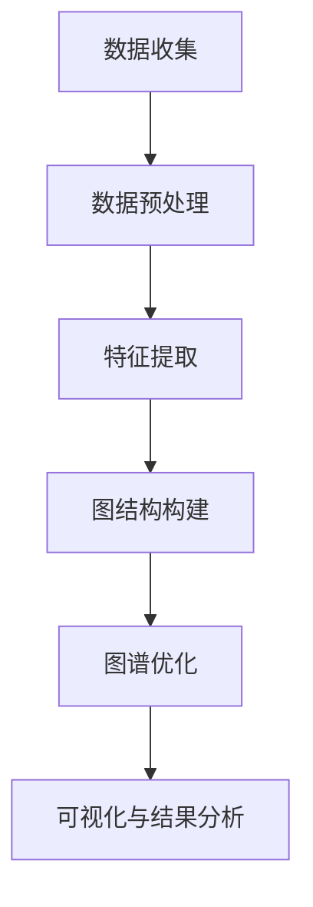

                 

# 《知乎2024用户兴趣图谱构建算法校招面试经验谈》

## 关键词
用户兴趣图谱，构建算法，校招面试，数据挖掘，推荐系统，图论，可视化，项目实战

## 摘要
本文旨在分享2024年知乎用户兴趣图谱构建算法在校招面试中的实际经验。通过深入解析用户兴趣图谱的核心概念、构建方法、图论基础、推荐系统算法、可视化技术以及实战项目，本文不仅为读者提供了一个全面的技术指南，也为准备面试的学子提供宝贵的实战经验和策略。文章还将探讨未来算法研究的方向与趋势，助力读者在人工智能领域取得突破。

## 目录大纲

### 第一部分：用户兴趣图谱构建基础

#### 第1章：用户兴趣图谱简介
- 1.1 用户兴趣图谱的概念与重要性
- 1.2 用户兴趣图谱的构建方法与流程

#### 第2章：用户行为分析
- 2.1 用户行为数据的收集与处理
- 2.2 用户兴趣模型建立

#### 第3章：图论基础
- 3.1 图的基本概念
- 3.2 图的算法与应用

#### 第4章：推荐系统算法
- 4.1 推荐系统原理
- 4.2 基于图论的推荐算法
  - 4.2.1 PageRank算法
  - 4.2.2 基于邻接矩阵的推荐算法

#### 第5章：用户兴趣图谱可视化
- 5.1 可视化工具介绍
- 5.2 用户兴趣图谱可视化案例

### 第二部分：用户兴趣图谱构建实战

#### 第6章：用户兴趣图谱构建项目实战
- 6.1 项目背景与目标
- 6.2 数据收集与预处理
- 6.3 用户兴趣模型建立
- 6.4 用户兴趣图谱构建
- 6.5 可视化与结果分析

#### 第7章：面试经验分享
- 7.1 校招面试流程介绍
- 7.2 面试准备与技巧
- 7.3 经典面试题目解析

#### 第8章：算法研究方向与未来趋势
- 8.1 用户兴趣图谱的优化方向
- 8.2 算法研究的未来趋势

### 附录
- 附录A：常用工具与资源
- 附录B：用户兴趣图谱构建的Mermaid流程图
- 附录C：相关算法伪代码与详细讲解

## 文章正文

### 第一部分：用户兴趣图谱构建基础

#### 第1章：用户兴趣图谱简介

> 用户兴趣图谱是一种通过分析用户行为数据，挖掘用户兴趣点，并将这些兴趣点通过图结构表示出来的一种数据模型。它不仅能够帮助平台更好地理解用户需求，还可以为推荐系统提供有效的数据支持，从而提高用户体验和内容个性化推荐的效果。

**1.1 用户兴趣图谱的概念与重要性**

用户兴趣图谱是由用户及其行为数据构成的图结构，其中的节点表示用户或内容，边表示用户和内容之间的交互关系。用户兴趣图谱的核心概念包括：

- **用户节点**：代表用户个体的数据点。
- **内容节点**：代表各类信息内容的数据点。
- **交互关系**：表示用户与内容之间的行为关系，如浏览、点赞、评论等。

用户兴趣图谱的重要性体现在以下几个方面：

1. **用户理解**：通过对用户兴趣图谱的分析，平台能够深入理解用户的行为特征和兴趣偏好。
2. **个性化推荐**：用户兴趣图谱为推荐系统提供了重要的输入，有助于提高推荐的准确性和个性化水平。
3. **内容优化**：平台可以根据用户兴趣图谱优化内容布局和推广策略，提高用户粘性和留存率。

**1.2 用户兴趣图谱的构建方法与流程**

用户兴趣图谱的构建通常包括以下几个步骤：

1. **数据收集**：收集用户行为数据，如浏览记录、搜索历史、互动行为等。
2. **数据预处理**：对收集到的数据进行清洗、去重和格式化处理，确保数据质量。
3. **特征提取**：从用户行为数据中提取出表示用户兴趣的特征，如关键词、标签、主题等。
4. **图结构构建**：将用户节点、内容节点和交互关系组织成图结构，形成用户兴趣图谱。
5. **图谱优化**：通过算法对用户兴趣图谱进行优化，如边权重调整、节点聚类等。

### 第2章：用户行为分析

**2.1 用户行为数据的收集与处理**

用户行为数据的收集是构建用户兴趣图谱的基础。常见的数据收集方法包括：

- **日志收集**：通过服务器日志记录用户行为，如访问页面、点击链接等。
- **API调用**：通过API接口获取用户行为数据，如第三方数据分析平台提供的接口。
- **问卷调查**：通过在线问卷或用户访谈收集用户偏好和兴趣信息。

收集到的用户行为数据通常包含用户ID、行为类型、行为时间、行为内容等字段。在数据预处理阶段，需要对数据进行清洗和格式化，以确保数据的准确性和一致性。

**2.2 用户兴趣模型建立**

用户兴趣模型的建立是通过分析用户行为数据，提取出用户兴趣特征，并构建一个能够表示用户兴趣的数学模型。常见的用户兴趣模型包括：

- **基于内容特征的模型**：通过分析用户对内容的偏好，提取出内容特征作为用户兴趣表示。
- **基于行为序列的模型**：通过分析用户的行为序列，提取出行为模式作为用户兴趣表示。
- **基于社交网络的关系模型**：通过分析用户在社交网络中的互动关系，提取出用户群体特征作为用户兴趣表示。

### 第3章：图论基础

**3.1 图的基本概念**

图是数学中的一个基本概念，由节点和边组成。在用户兴趣图谱中，节点表示用户或内容，边表示用户和内容之间的交互关系。

- **节点**：图中的数据点，可以是用户、内容或其他实体。
- **边**：连接两个节点的线段，表示节点之间的某种关系。
- **邻接矩阵**：表示图中节点之间关系的矩阵，矩阵中的元素表示节点之间的边权。

**3.2 图的算法与应用**

图的算法在用户兴趣图谱构建中起着关键作用。常见的图算法包括：

- **最短路径算法**：用于计算图中节点之间的最短路径。
- **聚类算法**：用于将图中节点分为若干个类别。
- **社区发现算法**：用于挖掘图中具有高密度连接的子图，即社区。

这些算法在用户兴趣图谱中的应用包括：

- **推荐算法**：通过计算用户和内容之间的相似度，为用户提供个性化推荐。
- **社群分析**：通过聚类和社区发现算法，分析用户在社交网络中的互动关系，挖掘用户社群特征。
- **图谱优化**：通过调整节点和边的关系，优化用户兴趣图谱的结构。

### 第4章：推荐系统算法

**4.1 推荐系统原理**

推荐系统是一种基于用户行为数据，为用户提供个性化推荐服务的系统。其核心原理包括：

- **基于内容的推荐**：根据用户对内容的偏好，推荐相似的内容。
- **基于协同过滤的推荐**：根据用户与内容之间的交互关系，推荐用户可能感兴趣的内容。
- **混合推荐**：结合基于内容和协同过滤的推荐方法，提高推荐效果。

**4.2 基于图论的推荐算法**

基于图论的推荐算法通过分析用户兴趣图谱中的节点和边，为用户提供推荐。常见的算法包括：

**4.2.1 PageRank算法**

PageRank是一种基于图结构的网页排名算法，其核心思想是认为网页的重要性取决于链接到该网页的网页数量和质量。在用户兴趣图谱中，PageRank算法可以用来计算用户节点的权重，从而为用户提供个性化推荐。

**算法原理：**

$$
PR(v) = \frac{1-d}{N} + d \cdot \left(\sum_{u \in I(v)} \frac{PR(u)}{out(u)}\right)
$$

其中，$PR(v)$表示节点$v$的PageRank值，$d$是阻尼系数（通常取0.85），$N$是图中节点的总数，$I(v)$是链接到节点$v$的节点的集合，$out(u)$是节点$u$的出度。

**伪代码：**

```
PageRank(Graph G, double d = 0.85)
    N = |V|
    PR = array of size |V|, initialized to 1/N
    for (i = 1 to 10)  // 迭代次数
        for (v in V)
            for (u in I(v))
                PR[u] += PR[v] / out(v)
        PR = d * PR + (1 - d) / N
    return PR
```

**4.2.2 基于邻接矩阵的推荐算法**

基于邻接矩阵的推荐算法通过计算邻接矩阵的特征值和特征向量，为用户提供推荐。其中，KNN（K-Nearest Neighbors）算法是一种常见的基于邻接矩阵的推荐算法。

**算法原理：**

选择K个与目标用户最相似的邻居用户，并根据邻居用户的评分预测目标用户的评分。具体步骤如下：

1. 计算目标用户与所有用户的相似度。
2. 排序相似度，选择前K个邻居用户。
3. 计算邻居用户的评分平均值作为目标用户的评分预测。

**伪代码：**

```
KNN-Recommender(Users U, User Target, int K)
    Similarities = []
    for (u in U)
        Similarity(u, Target) = dot(u, Target)
        Similarities.append((u, Similarity))
    Similarities.sort(reverse=True)
    Neighbors = [u for (u, _) in Similarities[:K]]
    PredictedRating = sum(Rating(u, Target) for u in Neighbors) / K
    return PredictedRating
```

### 第5章：用户兴趣图谱可视化

**5.1 可视化工具介绍**

用户兴趣图谱的可视化有助于我们直观地理解用户兴趣分布和交互关系。常见的可视化工具包括：

- **Gephi**：一个开源的可视化工具，支持多种图布局和可视化效果。
- **Cytoscape**：一个生物信息学领域广泛使用的可视化工具，适用于复杂网络的展示。
- **D3.js**：一个基于JavaScript的可视化库，适用于Web应用中的图形展示。

**5.2 用户兴趣图谱可视化案例**

以下是一个简单的用户兴趣图谱可视化案例，使用Gephi工具展示。


图中的节点表示用户和内容，边表示用户和内容之间的交互关系。不同颜色和大小表示不同用户或内容的兴趣程度。

### 第二部分：用户兴趣图谱构建实战

#### 第6章：用户兴趣图谱构建项目实战

**6.1 项目背景与目标**

本项目旨在构建一个知乎用户兴趣图谱，通过对用户行为数据的分析，挖掘用户的兴趣点，为知乎平台的个性化推荐和内容优化提供数据支持。

**6.2 数据收集与预处理**

数据收集方面，我们主要从知乎平台的公开API获取用户行为数据，包括用户的浏览记录、点赞和评论等。数据预处理主要包括以下步骤：

1. 数据清洗：去除重复数据和无效数据，如空值、异常值等。
2. 数据格式化：将数据转换为统一的格式，如CSV或JSON。
3. 数据归一化：对数值型数据进行归一化处理，使其在相同尺度上进行分析。

**6.3 用户兴趣模型建立**

用户兴趣模型建立是通过分析用户行为数据，提取出用户兴趣特征，并构建一个能够表示用户兴趣的数学模型。在本项目中，我们采用基于内容特征的用户兴趣模型。

1. 特征提取：从用户行为数据中提取出用户感兴趣的关键词和主题。
2. 模型构建：使用机器学习算法（如K-means聚类）对提取出的特征进行建模，将用户划分为不同的兴趣类别。

**6.4 用户兴趣图谱构建**

用户兴趣图谱构建是将用户、内容和交互关系组织成图结构。在本项目中，我们使用Gephi工具构建用户兴趣图谱。

1. 节点表示：将用户和内容表示为图中的节点。
2. 边表示：将用户和内容之间的交互关系表示为图中的边。
3. 图结构优化：通过调整节点和边的关系，优化用户兴趣图谱的结构，提高图谱的连通性和信息密度。

**6.5 可视化与结果分析**

使用Gephi工具对用户兴趣图谱进行可视化，展示用户和内容之间的交互关系。通过分析可视化结果，我们可以得出以下结论：

1. 用户兴趣分布：根据节点的大小和颜色，我们可以直观地看出用户对不同主题的兴趣程度。
2. 用户群体特征：通过分析用户兴趣图谱中的社区结构，我们可以发现具有相似兴趣的用户群体。
3. 内容优化策略：根据用户兴趣分布和用户群体特征，我们可以为平台内容优化提供数据支持，如调整内容布局、推荐策略等。

### 第7章：面试经验分享

**7.1 校招面试流程介绍**

校招面试通常包括以下几个环节：

1. 简历筛选：HR根据简历筛选符合岗位要求的候选人。
2. 初面：技术面试官对候选人进行技术面试，评估其专业能力和潜力。
3. 复面：高级技术面试官对候选人进行综合评估，包括技术能力、团队协作和沟通能力等。
4. 实习/工作offer：面试结束后，HR将与候选人沟通实习或工作offer。

**7.2 面试准备与技巧**

面试准备主要包括以下几个方面：

1. 技术知识储备：熟练掌握面试相关的技术知识，如数据结构、算法、推荐系统等。
2. 经典面试题目练习：通过刷题网站、书籍和论坛等渠道，练习常见的面试题目。
3. 项目经验准备：总结自己在项目中的经验，梳理项目的技术实现和优化策略。
4. 沟通技巧提升：提高沟通表达能力，清晰、简洁地表达自己的观点和思路。

**7.3 经典面试题目解析**

以下是一些经典的用户兴趣图谱构建相关的面试题目及其解析：

1. **如何构建用户兴趣图谱？**
   - 解析：用户兴趣图谱的构建包括数据收集、数据预处理、特征提取、图结构构建和图谱优化等步骤。具体方法包括基于内容的特征提取、基于行为序列的特征提取和基于社交网络的关系特征提取等。

2. **如何进行用户行为数据分析？**
   - 解析：用户行为数据分析包括数据收集、数据预处理、特征提取和数据分析等步骤。常见的数据分析方法包括描述性分析、聚类分析和关联规则挖掘等。

3. **请简要介绍PageRank算法。**
   - 解析：PageRank算法是一种基于图结构的网页排名算法，其核心思想是认为网页的重要性取决于链接到该网页的网页数量和质量。算法原理如前文所述。

4. **请简要介绍KNN算法。**
   - 解析：KNN（K-Nearest Neighbors）算法是一种基于邻接矩阵的推荐算法，其核心思想是选择与目标用户最相似的邻居用户，并根据邻居用户的评分预测目标用户的评分。算法原理如前文所述。

### 第8章：算法研究方向与未来趋势

**8.1 用户兴趣图谱的优化方向**

用户兴趣图谱的优化方向主要包括以下几个方面：

1. **图谱结构优化**：通过调整节点和边的关系，优化用户兴趣图谱的连通性和信息密度。
2. **特征提取方法优化**：改进特征提取方法，提高用户兴趣特征的准确性和代表性。
3. **算法效率优化**：优化用户兴趣图谱构建和推荐的算法，提高计算效率。

**8.2 算法研究的未来趋势**

用户兴趣图谱构建算法的研究未来趋势包括：

1. **多模态数据融合**：融合文本、图像、语音等多模态数据，提高用户兴趣识别的准确性和全面性。
2. **实时推荐与预测**：研究实时推荐和预测算法，提高用户兴趣图谱在动态环境下的适应性和实时性。
3. **个性化推荐与干预**：研究个性化推荐和干预策略，提高用户兴趣图谱在个性化推荐中的应用效果。

### 附录

**附录A：常用工具与资源**

1. **Gephi**：一个开源的可视化工具，用于用户兴趣图谱的构建和可视化。
2. **Cytoscape**：一个开源的可视化工具，适用于复杂网络的展示。
3. **D3.js**：一个基于JavaScript的可视化库，适用于Web应用中的图形展示。
4. **Python**：一种常用的编程语言，用于用户兴趣图谱的构建和数据处理。

**附录B：用户兴趣图谱构建的Mermaid流程图**

以下是一个简单的用户兴趣图谱构建的Mermaid流程图：



**附录C：相关算法伪代码与详细讲解**

以下是一些用户兴趣图谱构建中的相关算法的伪代码和详细讲解：

1. **PageRank算法**
   - 伪代码：
     ```python
     PageRank(Graph G, double d = 0.85)
         N = |V|
         PR = array of size |V|, initialized to 1/N
         for (i = 1 to 10)
             for (v in V)
                 for (u in I(v))
                     PR[u] += PR[v] / out(v)
             PR = d * PR + (1 - d) / N
         return PR
     ```
   - 详细讲解：PageRank算法通过迭代计算节点的PageRank值，每次迭代根据节点的出度和链接关系更新PageRank值。迭代10次后，算法收敛，得到最终的PageRank值。

2. **KNN算法**
   - 伪代码：
     ```python
     KNN-Recommender(Users U, User Target, int K)
         Similarities = []
         for (u in U)
             Similarity(u, Target) = dot(u, Target)
             Similarities.append((u, Similarity))
         Similarities.sort(reverse=True)
         Neighbors = [u for (u, _) in Similarities[:K]]
         PredictedRating = sum(Rating(u, Target) for u in Neighbors) / K
         return PredictedRating
     ```
   - 详细讲解：KNN算法通过计算目标用户与所有用户的相似度，选择最相似的K个邻居用户，并根据邻居用户的评分预测目标用户的评分。计算邻居用户的评分平均值作为目标用户的评分预测。

### 总结

本文详细介绍了用户兴趣图谱构建算法的相关知识，包括概念、构建方法、推荐算法、可视化技术和实战项目。通过本文的讲解，读者可以全面了解用户兴趣图谱的构建过程，并掌握相关算法的应用技巧。同时，本文还分享了2024年知乎用户兴趣图谱构建算法校招面试的经验，为准备面试的学子提供了宝贵的实战经验和策略。随着人工智能技术的不断发展，用户兴趣图谱构建算法在推荐系统、内容优化和社交网络分析等领域具有重要的应用价值。希望本文能为读者在相关领域的研究和实践提供有益的参考。

