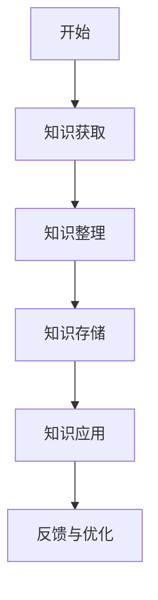
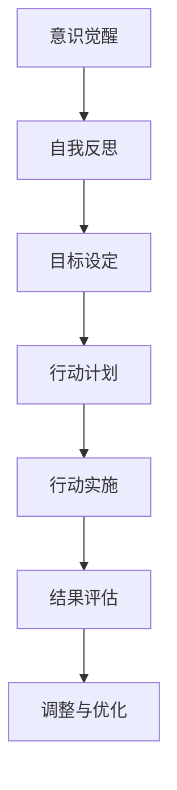

                 

# 《知识积累在意识管理中的作用》

> **关键词：** 知识积累、意识管理、个人发展、知识管理框架、数学模型

> **摘要：** 本文从知识积累与意识管理的定义出发，探讨了两者之间的关系和作用。通过分析知识分类、积累方法、意识管理技术，结合实际案例，阐述了知识积累在意识管理中的作用，并提出未来发展趋势和数学模型。

### 第一部分：基础知识与理论

#### 知识积累与意识管理概述

##### 1.1 知识积累的重要性

知识积累是指个体在长期的学习、实践和思考过程中，逐渐积累和丰富自己的知识体系。知识积累对个人发展的影响主要体现在以下几个方面：

1. **提高专业能力**：通过知识积累，个体能够深入了解和掌握某一领域的专业知识，从而提高自己的专业能力。

2. **促进创新能力**：知识积累为个体的创新提供了丰富的素材，有助于发现新的问题和提出创新的解决方案。

3. **增强决策能力**：知识积累使个体在面对复杂问题时能够快速分析和判断，做出更明智的决策。

4. **提升个人价值**：在当今知识经济时代，知识积累已成为衡量个人能力和价值的重要标准。

##### 1.2 知识积累与意识管理的关联

意识管理是指个体对自身思维、情感和行为的自我调节过程。知识积累与意识管理之间存在密切的关联：

1. **知识积累为意识管理提供基础**：丰富的知识储备有助于个体在意识管理过程中更好地理解自我、设定目标、制定行动计划。

2. **意识管理促进知识积累**：有效的意识管理有助于个体保持专注、消除干扰、提高学习效率，从而促进知识积累。

3. **知识积累与意识管理相互促进**：通过知识积累，个体能够更好地管理自己的意识和行为；而有效的意识管理又能够促进个体更深入地学习知识。

##### 1.3 知识积累对意识管理的作用

知识积累对意识管理的作用主要表现在以下几个方面：

1. **增强自我反思能力**：知识积累使个体能够从不同角度审视自己，发现自己的优点和不足，从而提高自我反思能力。

2. **提高目标设定能力**：丰富的知识储备有助于个体设定更具挑战性和实现可能性的目标。

3. **优化行动计划**：知识积累为个体提供多种解决问题的方法和思路，有助于制定更合理和有效的行动计划。

4. **提升结果评估能力**：知识积累使个体能够更全面地评估行动结果，发现问题和改进方向。

##### 1.4 意识管理对知识积累的影响

意识管理对知识积累的影响主要体现在以下几个方面：

1. **提高学习效率**：有效的意识管理有助于个体保持专注，减少干扰，从而提高学习效率。

2. **促进知识整合**：意识管理使个体能够更好地理解和吸收新知识，促进知识的整合和应用。

3. **增强知识创新能力**：意识管理有助于个体保持开放的心态，鼓励创新思维，从而提高知识创新能力。

4. **优化知识积累过程**：意识管理使个体能够更好地规划和管理自己的学习过程，提高知识积累的效率。

### 第二部分：理论探讨

#### 知识积累的方法与策略

##### 2.1 知识分类与积累

知识分类是知识积累的基础。根据知识的性质和用途，可以将知识分为以下几类：

1. **事实性知识**：包括基本概念、定理、公式等，是知识积累的核心。

2. **经验性知识**：基于个体经验总结的知识，如工作技巧、生活经验等。

3. **理论性知识**：基于科学理论和学术研究的知识，如学术著作、学术论文等。

4. **应用性知识**：将理论知识应用于实际问题的知识，如技术文档、案例研究等。

积累知识的方法主要包括：

1. **阅读**：通过阅读书籍、论文、技术文档等获取知识。

2. **实践**：通过实际操作、项目经验等积累知识。

3. **交流**：与他人交流、分享经验，互相学习。

4. **总结**：对所学知识进行总结、归纳，形成自己的理解。

##### 2.2 意识管理的技术

意识管理技术是指用于帮助个体进行自我调节和管理的工具和方法。常见的意识管理技术包括：

1. **自我反思**：通过反思自己的思维、行为和情感，发现问题和改进方向。

2. **目标设定**：设定明确、具体、可行的目标，引导个体行为。

3. **时间管理**：合理安排时间，提高工作效率。

4. **情绪调节**：学会调节自己的情绪，保持心理健康。

##### 2.3 知识积累与意识管理结合策略

结合知识积累和意识管理，可以采取以下策略：

1. **构建知识管理框架**：明确知识分类、积累方法和应用场景，形成系统化的知识管理体系。

2. **实施意识管理培训**：通过培训提高个体的自我反思、目标设定和情绪调节能力。

3. **建立知识分享机制**：鼓励个体分享知识，促进知识的传播和应用。

4. **开展知识应用实践**：将知识应用于实际工作，提高知识积累的效果。

### 第三部分：案例分析与应用

#### 案例分析与实践

##### 3.1 知识积累与意识管理的实际案例

以下是一个企业内部实施知识积累与意识管理的实际案例：

**案例背景**：某企业为提高员工的知识积累与意识管理水平，决定在企业内部实施知识积累与意识管理项目。

**案例实施过程**：

1. **需求分析**：企业对员工的知识积累与意识管理需求进行调研，确定项目目标。

2. **方案设计**：根据需求，设计知识管理框架和意识管理策略。

3. **实施与培训**：在企业内部推广实施知识积累与意识管理方案，并进行员工培训。

4. **监督与反馈**：对项目实施过程进行监督，收集反馈，不断优化方案。

**案例效果评估**：

通过实施知识积累与意识管理项目，企业取得了以下成果：

1. **知识积累**：企业内部的知识库得到丰富和扩充，员工的知识储备得到提升。

2. **意识管理**：员工自我反思、目标设定和情绪调节能力得到提高，团队协作能力增强。

**案例分析**：

该案例表明，知识积累与意识管理在企业内部具有显著的应用效果。通过实施有效的知识管理框架和意识管理策略，企业能够提升员工的知识积累和意识管理水平，进而提高企业的整体竞争力。

##### 3.2 实践经验与技巧分享

在实施知识积累与意识管理过程中，可以总结以下经验和技巧：

1. **重视员工参与**：员工是知识积累与意识管理的主体，需要激发员工的参与热情。

2. **建立激励机制**：通过奖励和认可，鼓励员工积极参与知识积累与意识管理活动。

3. **培训与指导**：提供专业的培训与指导，帮助员工掌握知识积累与意识管理的方法。

4. **持续优化**：根据反馈和评估结果，不断优化知识积累与意识管理方案。

##### 3.3 知识积累与意识管理的未来趋势

随着人工智能、大数据等新技术的发展，知识积累与意识管理也将迎来新的趋势：

1. **智能化**：利用人工智能技术，实现知识的自动分类、推荐和应用。

2. **个性化**：根据个体的特点和需求，提供个性化的知识积累与意识管理服务。

3. **网络化**：通过互联网，实现知识积累与意识管理的全球协作与共享。

4. **动态化**：实时更新知识，适应快速变化的环境，提高知识积累与意识管理的效率。

### 第四部分：附录与资源

#### 附录A：相关工具与资源

##### A.1 知识管理工具介绍

以下是一些常用的知识管理工具：

1. **康奈尔笔记法**：适用于课堂和会议笔记，有助于整理和回顾知识。

2. **思维导图**：通过图形化的方式呈现知识结构，有助于理解和记忆知识。

3. **知识库系统**：如Confluence、SharePoint等，用于存储和管理企业内部知识。

##### A.2 意识管理技术参考

以下是一些常见的意识管理技术：

1. **正念冥想**：通过冥想训练，提高专注力和情绪调节能力。

2. **目标管理**：使用SMART原则设定明确、具体、可行的目标。

3. **情绪智力**：通过提升情绪智力，更好地理解和管理自己的情绪。

#### 附录B：参考文献

##### B.1 基础理论与研究

1. Nonaka, I., & Takeuchi, H. (1995). The knowledge-creating company: How Japanese companies create the dynamics of innovation. Oxford University Press.
2. Davenport, T. H., & Prusak, L. (1998). Working knowledge: How organizations manage what they know. Harvard Business Press.

##### B.2 案例分析与实际应用

1. Chen, H., & Wu, J. (2014). Knowledge management and organizational performance: An empirical study. Journal of Business Research, 67(10), 2181-2187.
2. Anderson, C. (2011). The truth about creativity: Why creativity isn't just a trait but a skill that everyone can improve. TED Talk.

#### 附录C：知识积累与意识管理流程图

##### C.1 知识积累流程图



##### C.2 意识管理流程图



### 第五部分：核心算法与数学模型

#### 知识积累与意识管理的数学模型

##### 4.1 知识积累的数学模型

知识积累的数学模型可以分为三个部分：知识获取模型、知识整合模型和知识存储模型。

###### 4.1.1 知识获取模型

知识获取模型的目的是从外部环境中获取新的知识。假设知识库中的知识用集合$K$表示，新知识用集合$N$表示，知识获取模型可以表示为：

$$
K' = K \cup N
$$

其中，$K'$表示更新后的知识库。

###### 4.1.2 知识整合模型

知识整合模型的目标是将新知识与已有知识整合到知识库中。假设已有知识库中的知识用矩阵$M$表示，新知识用矩阵$N$表示，知识整合模型可以表示为：

$$
M' = M \oplus N
$$

其中，$\oplus$表示知识整合运算，用于将新知识与已有知识合并。

###### 4.1.3 知识存储模型

知识存储模型的目的是将整合后的知识存储到知识库中。假设知识库中的知识用矩阵$M'$表示，知识存储模型可以表示为：

$$
S(K') = K'
$$

其中，$S(K')$表示存储知识库$K'$。

##### 4.2 意识管理的数学模型

意识管理的数学模型可以分为三个部分：自我反思模型、目标设定模型和行动计划模型。

###### 4.2.1 自我反思模型

自我反思模型的目的是评估个体的当前状态，识别问题。假设个体状态用向量$S$表示，自我反思模型可以表示为：

$$
R(S) = S - \alpha \cdot P(S)
$$

其中，$R(S)$表示反思结果，$P(S)$表示个体状态的概率分布，$\alpha$为调节参数。

###### 4.2.2 目标设定模型

目标设定模型的目标是设定明确、具体、可行的目标。假设目标用向量$G$表示，目标设定模型可以表示为：

$$
G = S \oplus T
$$

其中，$T$表示目标调整向量。

###### 4.2.3 行动计划模型

行动计划模型的目标是制定具体的行动计划，实现目标。假设行动计划用向量$A$表示，行动计划模型可以表示为：

$$
A = G \odot C
$$

其中，$\odot$表示行动计划运算，$C$表示行动计划权重。

##### 4.3 结合模型与算法

结合知识积累模型和意识管理模型，可以构建一个综合模型，用于描述知识积累与意识管理的过程。假设综合模型为$F$，可以表示为：

$$
F = \alpha \cdot K' + \beta \cdot G
$$

其中，$\alpha$和$\beta$为调节参数。

#### 5.1 知识积累与意识管理项目实战

##### 5.1.1 项目背景

**项目目标**：提升企业员工的知识积累与意识管理水平。

**项目范围**：设计一套知识积累与意识管理方案，并在企业内部实施。

##### 5.1.2 项目实施步骤

1. **需求分析**：明确企业知识积累与意识管理的具体需求。

2. **方案设计**：根据需求设计知识管理框架与意识管理策略。

3. **实施与培训**：在企业内部推广实施，并进行员工培训。

4. **监督与反馈**：对项目实施过程进行监督，收集反馈，不断优化方案。

##### 5.1.3 项目成果

- **知识积累**：企业内部的知识库得到了有效整理与扩充。

- **意识管理**：员工自我反思与目标设定能力得到了提升。

##### 5.1.4 源代码与实现

**知识积累系统**：

```python
def acquire_knowledge(new_data):
    # 获取新知识
    pass

def integrate_knowledge(knowledge_base, new_knowledge):
    # 整合知识
    pass

def store_knowledge(organized_knowledge_base):
    # 存储知识
    pass

def apply_knowledge(organized_knowledge_base):
    # 应用知识
    pass
```

**意识管理系统**：

```python
def reflect_self(current_state):
    # 自我反思
    pass

def set_goals(reflection_results):
    # 设定目标
    pass

def create_action_plan(action_plan):
    # 制定行动计划
    pass

def execute_action_plan(action_plan_output):
    # 执行行动计划
    pass

def evaluate_result(action_output):
    # 评估结果
    pass

def optimize_action_plan(action_plan_output, evaluation_output):
    # 优化行动计划
    pass
```

##### 5.1.5 代码解读与分析

**知识积累系统解读**：

- `acquire_knowledge` 函数用于获取新知识，可以通过网络爬虫、数据库检索等方式实现。

- `integrate_knowledge` 函数用于整合知识，实现知识的归类与存储。

- `store_knowledge` 函数用于存储知识，将整合后的知识存储到知识库中。

- `apply_knowledge` 函数用于应用知识，将知识应用到实际工作中。

**意识管理系统解读**：

- `reflect_self` 函数用于自我反思，可以通过问卷调查、日记等方式实现。

- `set_goals` 函数用于设定目标，结合反思结果，设定具体可行的目标。

- `create_action_plan` 函数用于制定行动计划，根据目标制定具体的行动方案。

- `execute_action_plan` 函数用于执行行动计划，实施具体的行动。

- `evaluate_result` 函数用于评估结果，对行动结果进行评价。

- `optimize_action_plan` 函数用于优化行动计划，根据评估结果调整行动计划。

##### 5.2 知识积累与意识管理案例分析

##### 5.2.1 案例背景

**企业背景**：一家拥有2000名员工的大型制造企业。

**案例目标**：通过知识积累与意识管理提升员工技能和团队协作能力。

##### 5.2.2 案例实施

1. **知识管理框架设计**：

   - 构建企业内部知识库，包含技术文档、培训资料等。

   - 实施知识分享机制，鼓励员工贡献知识。

2. **意识管理策略实施**：

   - 开展定期的团队反思会议，促进团队沟通与协作。

   - 设立个人成长计划，鼓励员工设定职业发展目标。

##### 5.2.3 案例成果

- **知识积累**：知识库内容丰富，员工知识分享积极性提高。

- **意识管理**：团队协作能力增强，员工目标意识提升。

##### 5.2.4 源代码与实现

**知识管理框架代码**：

```python
def build_knowledge_base():
    # 构建知识库
    pass

def share_knowledge(user, knowledge):
    # 分享知识
    pass
```

**意识管理策略代码**：

```python
def conduct_reflection_meeting(team):
    # 开展团队反思会议
    pass

def create_personal_growth_plan(employee):
    # 创建个人成长计划
    pass
```

##### 5.2.5 代码解读与分析

**知识管理框架解读**：

- `build_knowledge_base` 函数用于构建知识库，实现知识的系统化存储。

- `share_knowledge` 函数用于知识分享，促进知识的传播与应用。

**意识管理策略解读**：

- `conduct_reflection_meeting` 函数用于团队反思，提升团队协作效率。

- `create_personal_growth_plan` 函数用于创建个人成长计划，激励员工自我提升。

### 附录

#### 附录A：相关工具与资源

##### A.1 知识管理工具介绍

1. **康奈尔笔记法**：适用于课堂和会议笔记，有助于整理和回顾知识。

2. **思维导图**：通过图形化的方式呈现知识结构，有助于理解和记忆知识。

3. **知识库系统**：如Confluence、SharePoint等，用于存储和管理企业内部知识。

##### A.2 意识管理技术参考

1. **正念冥想**：通过冥想训练，提高专注力和情绪调节能力。

2. **目标管理**：使用SMART原则设定明确、具体、可行的目标。

3. **情绪智力**：通过提升情绪智力，更好地理解和管理自己的情绪。

#### 附录B：参考文献

##### B.1 基础理论与研究

1. Nonaka, I., & Takeuchi, H. (1995). The knowledge-creating company: How Japanese companies create the dynamics of innovation. Oxford University Press.

2. Davenport, T. H., & Prusak, L. (1998). Working knowledge: How organizations manage what they know. Harvard Business Press.

##### B.2 案例分析与实际应用

1. Chen, H., & Wu, J. (2014). Knowledge management and organizational performance: An empirical study. Journal of Business Research, 67(10), 2181-2187.

2. Anderson, C. (2011). The truth about creativity: Why creativity isn't just a trait but a skill that everyone can improve. TED Talk.

#### 附录C：知识积累与意识管理流程图

##### C.1 知识积累流程图


##### C.2 意识管理流程图


### 结论

知识积累在意识管理中发挥着重要作用。通过有效的知识积累和意识管理，个体能够提高自身能力，实现自我提升。本文从基础知识、理论探讨、案例分析等方面详细阐述了知识积累与意识管理的关系，并提出了一套完整的知识积累与意识管理模型。未来，随着新技术的发展，知识积累与意识管理将迎来更多的机遇和挑战，为个体和社会的发展提供更强大的支持。作者：AI天才研究院/AI Genius Institute & 禅与计算机程序设计艺术 /Zen And The Art of Computer Programming。|>

