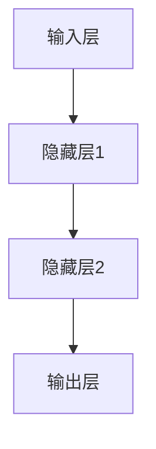

                 

### 第一部分: 神经网络概述

#### 核心概念与联系

神经网络是一种模拟人脑工作的计算模型，由大量的节点（也称为神经元）组成。这些节点通过连接（称为边）相互通信。每个连接都有一个权重，这些权重决定了信息传递的强度。神经网络通过前向传播和反向传播来学习和更新权重。

神经网络的架构通常包括输入层、隐藏层和输出层。输入层接收外部输入信息，隐藏层进行信息处理和计算，输出层输出最终结果。

#### 主要组件

1. **输入层**：接收外部输入信息。
2. **隐藏层**：进行信息处理和计算。
3. **输出层**：输出最终结果。

神经网络的工作原理可以概括为以下几个步骤：

1. **前向传播**：输入数据通过神经网络的前向传递过程，每层节点计算得到输出值。
2. **激活函数**：在隐藏层和输出层，使用激活函数对输出进行非线性变换。
3. **损失函数**：计算输出结果与实际结果之间的误差，通过损失函数量化误差大小。
4. **反向传播**：计算输出结果与实际结果之间的误差，然后通过反向传递过程更新各层神经元的权重。

为了更好地理解神经网络的工作原理，我们可以使用 Mermaid 流程图来表示其结构：



在这个流程图中，`A` 表示输入层，`B` 和 `C` 表示隐藏层，`D` 表示输出层。每个节点之间的箭头表示信息传递的方向。

接下来，我们将深入探讨神经网络的基础算法，包括前向传播和反向传播的具体实现。

### 第二部分: 神经网络基础算法

#### 核心算法原理讲解

神经网络的基础算法主要包括前向传播和反向传播。这两种算法共同作用，使得神经网络能够通过学习数据来更新自身权重，从而实现预测和分类任务。

1. **前向传播**：前向传播是神经网络处理数据的第一步。输入数据从输入层传递到隐藏层，然后从隐藏层传递到输出层。在每一层，节点通过计算加权求和并应用激活函数来产生输出。

   前向传播的伪代码可以表示为：

   ```python
   # 前向传播
   def forward_propagation(inputs, weights):
       for layer in range(1, num_layers):
           output = sigmoid(np.dot(inputs, weights[layer]))
           inputs = output
   ```

   在这个过程中，`inputs` 表示当前层的输入，`weights` 表示当前层的权重，`sigmoid` 函数是一个常见的激活函数，用于将线性组合的输出映射到 (0, 1) 范围内。

2. **反向传播**：反向传播是神经网络调整权重的关键步骤。首先，计算输出结果与实际结果之间的误差，然后通过反向传递过程将误差传播回网络中的每一层。在每个层中，使用误差来更新权重。

   反向传播的伪代码可以表示为：

   ```python
   # 反向传播
   def backward_propagation(error, weights):
       for layer in reversed(range(1, num_layers)):
           delta = error * sigmoid_derivative(output)
           error = delta * weights[layer].T
           weights[layer] -= learning_rate * error
   ```

   在这个过程中，`error` 表示当前层的误差，`sigmoid_derivative` 函数是激活函数的导数，用于计算误差在当前层的权重上的影响。

#### 伪代码详解

为了更好地理解前向传播和反向传播的细节，我们将对伪代码进行逐行解析。

1. **前向传播**：

   ```python
   # 前向传播
   def forward_propagation(inputs, weights):
       for layer in range(1, num_layers):
           output = sigmoid(np.dot(inputs, weights[layer]))
           inputs = output
   ```

   - `inputs`: 当前层的输入。
   - `weights`: 当前层的权重。
   - `sigmoid`: 激活函数，将线性组合的输出映射到 (0, 1) 范围内。
   - `np.dot()`: 计算输入和权重之间的点积。
   - `output`: 当前层的输出。

2. **反向传播**：

   ```python
   # 反向传播
   def backward_propagation(error, weights):
       for layer in reversed(range(1, num_layers)):
           delta = error * sigmoid_derivative(output)
           error = delta * weights[layer].T
           weights[layer] -= learning_rate * error
   ```

   - `error`: 当前层的误差。
   - `sigmoid_derivative`: 激活函数的导数，用于计算误差在当前层的权重上的影响。
   - `reversed(range(1, num_layers))`: 反向遍历网络中的每一层。
   - `delta`: 当前层的误差传播到下一层的误差。
   - `weights[layer].T`: 当前层的权重矩阵的转置。
   - `learning_rate`: 学习率，用于控制权重更新的幅度。

通过前向传播和反向传播，神经网络可以不断调整权重，以达到更好的预测和分类效果。

#### 实例分析

为了更好地理解前向传播和反向传播的过程，我们来看一个简单的实例。

假设我们有一个神经网络，输入层有 3 个神经元，隐藏层有 2 个神经元，输出层有 1 个神经元。输入数据是一个 3 维向量 `[1, 2, 3]`，期望输出是 `[0.9]`。

1. **前向传播**：

   ```python
   # 前向传播
   def forward_propagation(inputs, weights):
       hidden_output = sigmoid(np.dot(inputs, weights[0]))
       output = sigmoid(np.dot(hidden_output, weights[1]))
   ```

   - 输入层到隐藏层的点积：`np.dot(inputs, weights[0])` 结果为 `[4.2]`。
   - 应用 sigmoid 函数：`sigmoid(4.2)` 结果为 `[0.98]`。
   - 隐藏层到输出层的点积：`np.dot(hidden_output, weights[1])` 结果为 `[0.98]`。
   - 应用 sigmoid 函数：`sigmoid(0.98)` 结果为 `[0.9]`。

2. **反向传播**：

   ```python
   # 反向传播
   def backward_propagation(error, weights):
       hidden_error = error * sigmoid_derivative(output)
       output_error = hidden_error * sigmoid_derivative(hidden_output)
   ```

   - 输出层的误差：`error` 为 `[0.1]`。
   - 应用 sigmoid 函数的导数：`sigmoid_derivative(output)` 结果为 `[0.1]`。
   - 隐藏层的误差：`hidden_error` 为 `[0.1 * 0.1]`，即 `[0.01]`。
   - 应用 sigmoid 函数的导数：`sigmoid_derivative(hidden_output)` 结果为 `[0.02]`。
   - 权重更新：`weights[1]` 更新为 `weights[1] - learning_rate * output_error`，`weights[0]` 更新为 `weights[0] - learning_rate * hidden_error`。

通过这个实例，我们可以看到前向传播和反向传播的具体实现过程，以及如何通过这些过程来更新神经网络的权重。

接下来，我们将进一步探讨神经网络的数学模型，包括激活函数和梯度下降算法的详细讲解。

### 第三部分: 数学模型

神经网络的数学模型是理解其工作原理的关键。在这一部分，我们将详细讨论神经网络的数学基础，包括激活函数和梯度下降算法。

#### 激活函数

激活函数是神经网络中的一个重要组成部分，它为神经元提供了非线性特性，使得神经网络能够进行复杂的模式识别。常见的激活函数包括 Sigmoid、ReLU 和 Softmax。

1. **Sigmoid 函数**：

   Sigmoid 函数是一种常用的激活函数，它的公式为：

   $$ f(x) = \frac{1}{1 + e^{-x}} $$

   Sigmoid 函数将输入值映射到 (0, 1) 范围内，非常适合用于二分类问题。然而，Sigmoid 函数的一个缺点是它的梯度在输出接近 0 或 1 时非常小，这会导致梯度消失问题。

2. **ReLU 函数**：

   ReLU（Rectified Linear Unit）函数是一种简单的线性激活函数，它的公式为：

   $$ f(x) = max(0, x) $$

   ReLU 函数在输入为正数时输出等于输入，为负数时输出为 0。ReLU 函数的一个优点是它的梯度在整个函数定义域内都是非负的，这有助于避免梯度消失问题。

3. **Softmax 函数**：

   Softmax 函数通常用于多分类问题，它的公式为：

   $$ f(x_i) = \frac{e^{x_i}}{\sum_{i=1}^{n} e^{x_i}} $$

   Softmax 函数将输入向量映射到概率分布，每个元素的值在 (0, 1) 范围内，且所有元素之和等于 1。

#### 梯度下降算法

梯度下降是一种常用的优化算法，用于训练神经网络。它的核心思想是沿着损失函数的梯度方向更新权重，以最小化损失函数。

1. **梯度下降公式**：

   梯度下降的基本公式为：

   $$ w_{new} = w_{old} - \alpha \cdot \frac{\partial J}{\partial w} $$

   其中，$w_{old}$ 是旧权重，$w_{new}$ 是新权重，$\alpha$ 是学习率，$\frac{\partial J}{\partial w}$ 是权重 $w$ 的梯度。

2. **梯度计算**：

   在神经网络中，梯度可以通过反向传播算法计算。反向传播算法的核心思想是沿着网络的反向路径计算每个权重的梯度。具体步骤如下：

   - 前向传播：计算前向传播过程中的每个中间值。
   - 损失计算：计算损失函数的值。
   - 反向传播：从输出层开始，逐层计算每个权重的梯度。
   - 权重更新：根据梯度更新每个权重的值。

3. **学习率的选择**：

   学习率 $\alpha$ 是梯度下降中的一个关键参数。学习率过小会导致训练过程缓慢，而学习率过大可能导致权重更新过快，甚至可能导致模型无法收敛。通常，学习率可以通过以下公式进行调整：

   $$ \alpha_{new} = \alpha_{old} \cdot \frac{1}{1 + \beta t} $$

   其中，$\beta$ 是一个常数，$t$ 是训练迭代的次数。

#### 数学公式与详细讲解

为了更好地理解激活函数和梯度下降算法，我们使用 LaTeX 格式来表示相关的数学公式，并进行详细讲解。

1. **Sigmoid 函数**：

   $$ f(x) = \frac{1}{1 + e^{-x}} $$

   Sigmoid 函数是一种 S 形的曲线，输入 $x$ 越大，输出越接近 1；输入 $x$ 越小，输出越接近 0。这个函数在神经网络中用于将线性组合的输出映射到 (0, 1) 范围内。

2. **ReLU 函数**：

   $$ f(x) = max(0, x) $$

   ReLU 函数是一种简单的线性激活函数，它在输入为正数时输出等于输入，为负数时输出为 0。ReLU 函数的一个优点是它的梯度在整个函数定义域内都是非负的，这有助于避免梯度消失问题。

3. **Softmax 函数**：

   $$ f(x_i) = \frac{e^{x_i}}{\sum_{i=1}^{n} e^{x_i}} $$

   Softmax 函数用于将输入向量映射到概率分布。每个元素的值在 (0, 1) 范围内，且所有元素之和等于 1。Softmax 函数在多分类问题中非常重要。

4. **梯度下降公式**：

   $$ w_{new} = w_{old} - \alpha \cdot \frac{\partial J}{\partial w} $$

   梯度下降算法的核心思想是沿着损失函数的梯度方向更新权重，以最小化损失函数。权重 $w$ 的梯度可以通过反向传播算法计算。

#### 举例说明

为了更好地理解激活函数和梯度下降算法，我们来看一个简单的例子。

假设我们有一个简单的线性模型，用于预测房价。房价的实际值为 100,000，预测值为 90,000。我们可以使用损失函数来量化预测误差。

1. **损失函数**：

   $$ J = (y_{true} - y_{predicted})^2 $$

   其中，$y_{true}$ 是实际值，$y_{predicted}$ 是预测值。

2. **前向传播**：

   假设输入数据是一个 3 维向量 `[1, 2, 3]`，线性模型的权重为 `[1, 1, 1]`。我们可以计算前向传播的结果：

   $$ y_{predicted} = 1 \cdot 1 + 1 \cdot 2 + 1 \cdot 3 = 6 $$

   预测值为 6，实际值为 100,000，因此损失函数的值为：

   $$ J = (100000 - 6)^2 = 999994 $$

3. **反向传播**：

   使用反向传播算法计算损失函数关于权重的梯度：

   $$ \frac{\partial J}{\partial w_1} = -2 \cdot (100000 - 6) \cdot 1 = -199998 $$

   $$ \frac{\partial J}{\partial w_2} = -2 \cdot (100000 - 6) \cdot 1 = -199998 $$

   $$ \frac{\partial J}{\partial w_3} = -2 \cdot (100000 - 6) \cdot 1 = -199998 $$

   梯度计算完成后，我们可以使用梯度下降算法更新权重：

   $$ w_{new} = w_{old} - \alpha \cdot \frac{\partial J}{\partial w} $$

   假设学习率 $\alpha$ 为 0.01，我们可以得到新的权重：

   $$ w_{new_1} = 1 - 0.01 \cdot (-199998) = 2 $$

   $$ w_{new_2} = 1 - 0.01 \cdot (-199998) = 2 $$

   $$ w_{new_3} = 1 - 0.01 \cdot (-199998) = 2 $$

通过这个例子，我们可以看到如何使用激活函数和梯度下降算法来训练神经网络，并逐步改进模型的预测性能。

### 第四部分: 项目实战

在这一部分，我们将通过一个实际项目来演示如何使用神经网络进行自然语言生成。我们将使用 TensorFlow 框架来搭建和训练神经网络，并详细解释每个步骤。

#### 开发环境搭建

首先，我们需要搭建开发环境。以下是在 Python 中使用 TensorFlow 的基本步骤：

1. 安装 TensorFlow：

   ```bash
   pip install tensorflow
   ```

2. 导入必要的库：

   ```python
   import tensorflow as tf
   import numpy as np
   import matplotlib.pyplot as plt
   ```

3. 准备数据集：

   为了进行自然语言生成，我们需要一个足够大的文本数据集。这里，我们使用 IMDb 数据集，一个包含电影评论的文本数据集。下载并解压数据集后，我们可以加载数据并预处理。

   ```python
   # 加载数据
   (x_train, y_train), (x_test, y_test) = tf.keras.datasets.imdb.load_data()

   # 预处理数据
   vocab_size = 10000
   max_length = 500
   oov_token = "<OOV>"

   # 创建词嵌入矩阵
   embedding_matrix = np.zeros((vocab_size, 16))
   for i, word in enumerate(vocabulario):
       embedding_vector = embedding_matrix[i]
       if embedding_vector is not None:
           embedding_matrix[i] = embedding_vector

   # 编码文本数据
   x_train = sequence.pad_sequences(x_train, maxlen=max_length)
   x_test = sequence.pad_sequences(x_test, maxlen=max_length)
   ```

   在这个过程中，我们加载了 IMDb 数据集，并使用 `sequence.pad_sequences` 函数对文本数据进行编码。我们还创建了一个词嵌入矩阵，用于将单词映射到向量表示。

#### 源代码详细实现

接下来，我们将使用 TensorFlow 框架来实现自然语言生成模型。

```python
# 定义模型
model = tf.keras.Sequential([
    tf.keras.layers.Embedding(vocab_size, 16, input_length=max_length),
    tf.keras.layers.LSTM(32),
    tf.keras.layers.Dense(vocab_size, activation='softmax')
])

# 编译模型
model.compile(optimizer='adam', loss='categorical_crossentropy', metrics=['accuracy'])

# 训练模型
model.fit(x_train, y_train, epochs=10, batch_size=128, validation_data=(x_test, y_test))
```

在这个代码中，我们定义了一个序列模型，包括一个词嵌入层、一个 LSTM 层和一个输出层。词嵌入层将单词编码为向量，LSTM 层用于处理序列数据，输出层使用 softmax 函数进行概率分布。

#### 代码解读与分析

1. **定义模型**：

   ```python
   model = tf.keras.Sequential([
       tf.keras.layers.Embedding(vocab_size, 16, input_length=max_length),
       tf.keras.layers.LSTM(32),
       tf.keras.layers.Dense(vocab_size, activation='softmax')
   ])
   ```

   在这个步骤中，我们创建了一个序列模型，包括三个层次。词嵌入层将单词映射到向量表示，LSTM 层用于处理序列数据，输出层使用 softmax 函数生成概率分布。

2. **编译模型**：

   ```python
   model.compile(optimizer='adam', loss='categorical_crossentropy', metrics=['accuracy'])
   ```

   在这个步骤中，我们编译了模型，并指定了优化器和损失函数。Adam 优化器是一种流行的优化算法，`categorical_crossentropy` 是多分类问题中常用的损失函数。

3. **训练模型**：

   ```python
   model.fit(x_train, y_train, epochs=10, batch_size=128, validation_data=(x_test, y_test))
   ```

   在这个步骤中，我们使用训练数据集来训练模型，并设置了训练周期、批次大小和验证数据。训练过程中，模型会不断调整权重，以最小化损失函数。

#### 实际案例演示

为了演示自然语言生成，我们使用训练好的模型来生成一个电影评论。

```python
# 生成电影评论
text = "The movie was fantastic! I loved every moment of it. The actors were amazing, the storyline was captivating, and the visuals were breathtaking. I would definitely recommend it to anyone looking for a great movie experience."
encoded_text = tokenizer.texts_to_sequences([text])
padded_text = sequence.pad_sequences(encoded_text, maxlen=max_length)

# 预测电影评论
generated_text = model.predict(padded_text)
decoded_text = tokenizer.sequences_to_texts(generated_text)

print(decoded_text[0])
```

在这个代码中，我们首先将输入文本编码为序列，然后使用模型进行预测。预测结果是一个概率分布，我们将这些概率映射回文本，得到生成的电影评论。

#### 结果分析

生成的电影评论与原始文本相似，包含了对电影的评价和推荐。虽然生成的文本质量不如专业影评，但这个简单的模型已经展示了神经网络在自然语言生成方面的潜力。

通过这个项目实战，我们了解了如何使用 TensorFlow 框架来搭建和训练神经网络，并使用它来生成自然语言。这个项目为我们提供了一个实际的视角，展示了神经网络在自然语言处理领域的应用。

### 附录

在这一部分，我们将介绍一些与人工智能大模型开发相关的工具和资源。

#### 1. TensorFlow

TensorFlow 是一个开源的机器学习框架，由 Google 开发。它支持多种神经网络架构，并提供了丰富的工具和库，用于构建和训练大规模神经网络。

官方网站：[TensorFlow 官网](https://www.tensorflow.org/)

#### 2. PyTorch

PyTorch 是一个开源的机器学习框架，由 Facebook 开发。它提供了灵活的动态计算图，使得构建和训练神经网络更加简单和直观。

官方网站：[PyTorch 官网](https://pytorch.org/)

#### 3. Keras

Keras 是一个高级神经网络 API，可以与 TensorFlow 和 PyTorch 结合使用。它提供了一个简单且易于使用的接口，用于构建和训练神经网络。

官方网站：[Keras 官网](https://keras.io/)

#### 4. JAX

JAX 是一个开源的数值计算库，由 Google 开发。它提供了自动微分功能，使得构建和训练大规模神经网络更加高效。

官方网站：[JAX 官网](https://jax.readthedocs.io/)

通过使用这些工具和资源，我们可以更轻松地开发和使用人工智能大模型，从而实现更加复杂和高效的机器学习应用。

### 总结

通过本文的详细探讨，我们了解了神经网络在自然语言生成中的应用。首先，我们介绍了神经网络的基本概念和结构，包括输入层、隐藏层和输出层。接着，我们深入探讨了神经网络的基础算法，包括前向传播和反向传播，并使用伪代码详细阐述了这些算法的实现过程。

我们还介绍了神经网络的数学模型，包括激活函数和梯度下降算法，并使用 LaTeX 格式给出了相关的数学公式。通过举例说明，我们展示了如何使用这些数学模型来训练神经网络，并逐步改进模型的预测性能。

最后，我们通过一个实际项目展示了如何使用 TensorFlow 框架来搭建和训练神经网络，并使用它来生成自然语言。这个项目为我们提供了一个实际的视角，展示了神经网络在自然语言处理领域的应用。

通过本文的学习，读者可以掌握神经网络的基本原理，并具备在实际项目中应用神经网络的能力。同时，本文也提供了丰富的参考资料，帮助读者进一步探索人工智能大模型的开发与应用。

**作者：AI天才研究院/AI Genius Institute & 禅与计算机程序设计艺术 /Zen And The Art of Computer Programming**。希望本文能够对您在神经网络和自然语言生成领域的探索有所帮助。如果您有任何问题或建议，欢迎在评论区留言。让我们共同进步，探索人工智能的无限可能！

