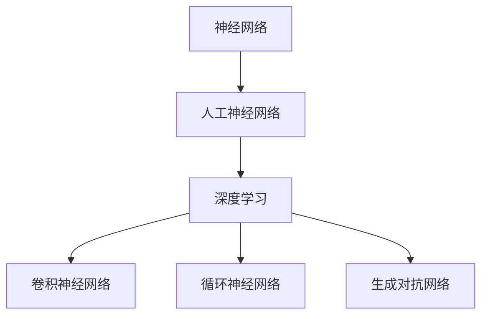

                 

### 《神经网络：人类与机器的共存》

> **关键词：** 神经网络、深度学习、人工智能、人机交互、应用实战

> **摘要：** 本文旨在探讨神经网络作为人工智能的核心技术之一，其基础概念、原理、应用以及与人类的共存。我们将逐步分析神经网络的各个方面，从基础概念到深度学习，再到其在各个领域的实际应用，最后讨论神经网络在人类与机器共存中的角色和未来发展趋势。

### 第一部分：基础概念与原理

#### 第1章：神经网络的概述与历史

神经网络的起源可以追溯到1943年，由沃伦·麦卡洛克（Warren McCulloch）和沃尔特·皮茨（Walter Pitts）首次提出。他们设计了第一个数学模型——麦卡洛克-皮茨（McCulloch-Pitts）神经元，这是神经网络研究的起点。在接下来的几十年里，神经网络的发展经历了多次起伏，直到1986年，由约翰·霍普菲尔德（John Hopfield）提出的霍普菲尔德循环神经网络（Hopfield Network）重新点燃了神经网络研究的热情。此后，1986年，鲁梅哈特等人（Rumelhart, Hinton, and Williams）提出反向传播算法（Backpropagation Algorithm），使神经网络在训练复杂模型时成为可能。这一突破为神经网络的研究和应用奠定了基础。

神经网络在人工智能中的地位不可忽视。它们被认为是模拟人脑神经元工作原理的一种方法，能够通过学习从数据中提取特征，进行模式识别和决策。神经网络的发展推动了人工智能的进步，特别是在图像识别、自然语言处理、强化学习等领域取得了显著的成就。

#### 第2章：人工神经网络的基本原理

##### 2.1 神经元模型

神经元是神经网络的基本构建块。一个简单的神经元可以看作是一个接收输入信号并通过激活函数产生输出的计算单元。神经元通常包含一个输入层、一个或多个隐藏层和一个输出层。每个神经元接收来自前一层神经元的输入信号，并通过加权求和处理后，通过激活函数产生输出。

神经元的基本工作原理可以描述如下：

1. 输入：每个神经元接收来自前一层神经元的输入信号，这些信号通常通过加权连接传递。
2. 加权求和处理：输入信号通过加权求和处理，每个输入信号乘以其相应的权重，然后求和。
3. 激活函数：求和处理的结果通过激活函数进行处理，以决定神经元是否应该被激活。
4. 输出：激活函数的输出表示神经元的激活状态，这个输出信号传递到下一层神经元。

##### 2.2 神经网络的结构

神经网络的结构包括层与节点。一个典型的神经网络由多个层组成，包括输入层、一个或多个隐藏层和一个输出层。输入层接收外部数据，输出层产生最终的预测或决策。隐藏层位于输入层和输出层之间，负责从输入数据中提取特征，并进行复杂的计算。

- **层与节点：** 层是神经网络中神经元组织的层次结构，每个层包含多个神经元。节点是神经网络中的一个神经元，它们接收输入信号并进行处理。一个层的输出是下一层的输入。
- **前向传播与反向传播：** 前向传播是指数据从输入层流向输出层的过程，每个神经元通过加权求和处理和激活函数产生输出。反向传播是指从输出层向输入层传递误差并更新神经网络权重的过程。
- **激活函数：** 激活函数是神经网络中的一个关键组成部分，它用于决定神经元是否应该被激活。常见的激活函数包括sigmoid函数、ReLU函数和Tanh函数。

##### 2.3 学习规则与优化算法

- **反向传播算法：** 反向传播算法是一种用于训练神经网络的优化算法，它通过从输出层向输入层传递误差并更新权重和偏置来优化网络。反向传播算法的核心是计算每个权重的梯度，然后使用梯度下降法更新权重。
- **随机梯度下降（SGD）：** 随机梯度下降是一种用于优化神经网络参数的常用算法，它通过随机选择样本计算梯度并更新权重来加速收敛。
- **其他优化算法：** 除了反向传播算法和随机梯度下降外，还有其他优化算法，如Adam优化器、RMSprop优化器等，它们在训练神经网络时提供了不同的收敛速度和稳定性。

#### 第3章：深度学习与深度神经网络

##### 3.1 深度学习的概念与原理

深度学习是一种基于多层神经网络的机器学习方法，它通过学习大量数据中的层次特征来提高模型的表现力。深度学习的基本原理是模拟人脑的神经元结构和工作方式，通过逐层提取和抽象特征，从而实现复杂任务的自动化。

深度学习的关键组成部分包括：

- **多层神经网络：** 深度学习模型通常包含多个隐藏层，每个隐藏层对前一层的信息进行变换和抽象。
- **反向传播算法：** 深度学习模型使用反向传播算法来训练神经网络，通过从输出层向输入层传递误差并更新权重来优化模型。
- **大规模数据训练：** 深度学习模型通常需要大量训练数据来提取层次特征，从而提高模型的泛化能力。

##### 3.2 深度神经网络的类型

深度神经网络包括多种类型的网络结构，每种结构都适用于不同的任务和应用场景。以下是几种常见的深度神经网络：

- **卷积神经网络（CNN）：** CNN 是用于图像识别和计算机视觉任务的一种深度学习模型，它通过卷积层、池化层和全连接层来提取图像的特征。
- **循环神经网络（RNN）：** RNN 是用于序列数据处理的一种深度学习模型，它通过循环连接来处理输入序列，并在时间步之间传递状态信息。
- **生成对抗网络（GAN）：** GAN 是一种用于生成模型的一种深度学习模型，它由生成器和判别器两个神经网络组成，通过对抗训练生成逼真的数据。

##### 3.3 深度学习在计算机视觉中的应用

深度学习在计算机视觉领域取得了显著的应用成果。以下是一些深度学习在计算机视觉中的应用案例：

- **图像分类：** 深度学习模型可以自动将图像分类到不同的类别，如猫、狗、飞机等。
- **目标检测：** 深度学习模型可以检测图像中的目标对象，如行人检测、车辆检测等。
- **图像生成：** 深度学习模型可以生成逼真的图像，如人脸生成、艺术风格转换等。

### 第二部分：神经网络的应用与实战

#### 第4章：神经网络在自然语言处理中的应用

自然语言处理（Natural Language Processing，NLP）是人工智能的一个重要分支，它涉及到计算机对人类语言的理解和生成。神经网络在NLP领域取得了显著的进展，推动了语言模型、机器翻译、情感分析等应用的发展。

##### 4.1 词嵌入技术

词嵌入（Word Embedding）是将词汇映射到固定大小的向量空间中的一种方法，它通过学习词汇的上下文信息来捕捉语义关系。常见的词嵌入技术包括：

- **Word2Vec：** Word2Vec 是一种基于神经网络的语言模型，它通过优化目标函数将词汇映射到低维向量空间。
- **GloVe：** GloVe 是基于全局统计信息的词向量模型，它通过学习词的共现矩阵来生成高质量的词向量。

##### 4.2 语言模型

语言模型（Language Model）是一种用于预测下一个词或词组的概率分布的模型，它在语音识别、机器翻译、语音合成等领域有广泛的应用。神经网络在语言模型中的应用主要基于以下技术：

- **基于循环神经网络的模型：** 循环神经网络（RNN）是一种适合处理序列数据的神经网络，它可以捕捉序列中相邻词之间的依赖关系。
- **基于Transformer的模型：** Transformer 是一种基于自注意力机制的深度学习模型，它在NLP任务中取得了显著的性能提升。

##### 4.3 序列到序列模型

序列到序列（Sequence-to-Sequence，Seq2Seq）模型是一种用于序列转换的神经网络模型，它通过编码器和解码器两个神经网络将输入序列转换为输出序列。在机器翻译、语音合成等领域有广泛的应用。以下是序列到序列模型的一些关键技术：

- **编码器：** 编码器负责将输入序列编码为一个固定大小的向量，这个向量包含了输入序列的信息。
- **解码器：** 解码器负责将编码器的输出序列解码为输出序列，它通常使用循环神经网络（RNN）或Transformer模型。

##### 4.4 跨语言文本处理

跨语言文本处理（Cross-Lingual Text Processing）是NLP中的一个重要研究方向，它涉及到不同语言之间的文本理解和转换。神经网络在跨语言文本处理中的应用主要包括：

- **跨语言词向量：** 跨语言词向量通过学习不同语言之间的词汇关系来捕捉语义信息。
- **跨语言语言模型：** 跨语言语言模型通过学习多语言数据来生成跨语言的文本转换模型。

#### 第5章：神经网络在强化学习中的应用

强化学习（Reinforcement Learning，RL）是一种通过与环境互动来学习最优策略的机器学习方法。神经网络在强化学习中的应用极大地提高了模型的学习效率和表现。

##### 5.1 强化学习基础

强化学习的基本概念包括：

- **代理（Agent）：** 代理是指执行动作并接收环境反馈的智能体。
- **环境（Environment）：** 环境是指代理执行动作和接收奖励的动态系统。
- **状态（State）：** 状态是代理在环境中的一个特定状态。
- **动作（Action）：** 动作是代理在某个状态下可以执行的行为。
- **奖励（Reward）：** 奖励是环境对代理行为的即时反馈。

强化学习的目标是通过学习最优策略来最大化总奖励。

##### 5.2 神经网络在强化学习中的角色

神经网络在强化学习中的角色主要包括：

- **状态表示：** 神经网络用于将状态编码为向量表示，以便更好地表示状态信息。
- **动作值函数：** 神经网络用于估计状态和动作的值函数，以指导代理选择最优动作。
- **策略网络：** 神经网络用于学习一个策略网络，该网络可以生成代理在给定状态下应该执行的动作。

##### 5.3 神经网络在深度强化学习中的应用

深度强化学习（Deep Reinforcement Learning，DRL）是一种结合深度学习和强化学习的机器学习方法，它通过神经网络来表示状态和动作，并在训练过程中学习最优策略。以下是几种深度强化学习的应用：

- **机器人控制：** 深度强化学习可以用于控制机器人执行复杂的任务，如行走、抓取等。
- **游戏：** 深度强化学习在游戏领域中取得了显著的应用成果，如围棋、扑克等。
- **自动驾驶：** 深度强化学习可以用于自动驾驶车辆的环境感知和决策。

#### 第6章：神经网络在生成模型中的应用

生成模型（Generative Model）是一种用于生成新数据的机器学习方法，它通过学习数据分布来生成类似的数据。神经网络在生成模型中发挥了重要作用，特别是在生成对抗网络（Generative Adversarial Network，GAN）中。

##### 6.1 生成模型的原理

生成模型的原理是通过学习数据分布来生成新的数据。生成模型通常由一个生成器和判别器组成，其中：

- **生成器（Generator）：** 生成器是一个神经网络，它从随机噪声中生成数据。
- **判别器（Discriminator）：** 判别器是一个神经网络，它用于判断生成器生成的数据是否真实。

生成器和判别器通过对抗训练相互竞争，生成器试图生成逼真的数据，而判别器试图区分真实数据和生成数据。

##### 6.2 生成对抗网络（GAN）的工作机制

生成对抗网络（GAN）是一种基于生成模型的深度学习模型，它通过生成器和判别器之间的对抗训练来生成数据。GAN的工作机制可以描述如下：

1. **初始化**：初始化生成器G和判别器D的参数。
2. **生成器训练**：生成器从随机噪声中生成数据，判别器对生成数据和真实数据进行分类。
3. **判别器训练**：判别器通过学习生成器的输出来提高分类准确性。
4. **生成器更新**：生成器根据判别器的输出进行更新，以生成更逼真的数据。
5. **重复步骤2-4**：重复上述过程，直到生成器生成的数据足够逼真。

##### 6.3 GAN的应用案例

GAN在图像生成、视频生成、音频生成等领域有广泛的应用。以下是一些GAN的应用案例：

- **图像生成：** GAN可以生成逼真的图像，如人脸生成、风景生成等。
- **视频生成：** GAN可以生成连续的视频片段，如视频修复、视频风格转换等。
- **音频生成：** GAN可以生成逼真的音频，如音乐生成、语音合成等。

#### 第7章：神经网络在实时系统中的应用

神经网络在实时系统中的应用越来越受到关注，实时系统是指那些必须快速、准确地处理和响应实时数据流的系统。这些系统包括自动驾驶、工业自动化、医疗设备等。

##### 7.1 实时系统的基本概念

实时系统的基本概念包括：

- **实时性：** 实时性是指系统能够在给定的时间限制内处理和响应数据的能力。
- **确定性：** 确定性是指系统在相同输入下能够产生相同输出的能力。
- **预测性：** 预测性是指系统能够根据历史数据预测未来事件的能力。

实时系统通常需要满足严格的性能要求，包括低延迟、高可靠性和高精度。

##### 7.2 神经网络在实时系统中的挑战

神经网络在实时系统中的应用面临以下挑战：

- **延迟问题：** 神经网络的训练和推理过程可能产生较高的延迟，这在实时系统中是不可接受的。
- **资源限制：** 实时系统通常具有资源限制，如计算能力、内存和带宽等，这限制了神经网络的应用。
- **可靠性问题：** 神经网络可能受到数据噪声、异常值和不确定性的影响，这可能导致错误的决策。

##### 7.3 神经网络在实时控制中的应用案例

神经网络在实时控制中的应用案例包括：

- **自动驾驶：** 自动驾驶系统使用神经网络进行环境感知、路径规划和决策。
- **工业自动化：** 工业自动化系统使用神经网络进行设备监控、故障诊断和生产优化。
- **医疗设备：** 医疗设备使用神经网络进行图像处理、疾病诊断和治疗计划。

### 第三部分：人类与机器的共存

#### 第8章：人机交互与神经网络的融合

人机交互（Human-Computer Interaction，HCI）是研究人与计算机系统之间交互的学科。随着人工智能技术的发展，人机交互与神经网络的融合成为了一个重要的研究领域。

##### 8.1 人机交互的概念

人机交互是指人与计算机系统之间的交互，它涉及到用户界面设计、交互模型、用户行为分析等方面。人机交互的目标是提供直观、高效、易用的交互体验。

##### 8.2 神经网络在人机交互中的作用

神经网络在人机交互中扮演着重要的角色，包括：

- **情感识别：** 神经网络可以用于识别用户的情感状态，从而提供个性化的交互体验。
- **语音识别：** 神经网络可以用于语音识别，使计算机能够理解用户的语音指令。
- **手势识别：** 神经网络可以用于手势识别，使计算机能够理解用户的手势动作。

##### 8.3 虚拟现实与增强现实中的神经网络应用

虚拟现实（Virtual Reality，VR）和增强现实（Augmented Reality，AR）是近年来迅速发展的技术，它们为人机交互提供了全新的交互方式。神经网络在虚拟现实和增强现实中的应用包括：

- **虚拟现实中的动作捕捉：** 神经网络可以用于动作捕捉，使虚拟角色能够模拟真实动作。
- **增强现实中的图像识别：** 神经网络可以用于图像识别，使增强现实应用能够识别现实世界的物体和场景。

### 第9章：人工智能伦理与未来

随着人工智能技术的快速发展，伦理问题逐渐成为人们关注的焦点。人工智能伦理涉及多个方面，包括隐私保护、数据安全、算法偏见等。

##### 9.1 人工智能伦理问题

人工智能伦理问题主要包括：

- **隐私保护：** 人工智能系统常常需要处理大量的个人数据，如何保护用户隐私成为一个重要问题。
- **数据安全：** 人工智能系统可能成为黑客攻击的目标，数据泄露和安全问题备受关注。
- **算法偏见：** 人工智能系统的决策可能受到算法偏见的影响，导致不公平和歧视。

##### 9.2 神经网络在伦理决策中的应用

神经网络在伦理决策中的应用主要包括：

- **伦理决策支持系统：** 神经网络可以用于构建伦理决策支持系统，帮助人类做出更合理的伦理决策。
- **伦理偏见检测：** 神经网络可以用于检测和消除算法偏见，提高人工智能系统的公平性。

##### 9.3 未来人工智能的发展趋势

未来人工智能的发展趋势包括：

- **智能自动化：** 人工智能将推动各个领域的自动化进程，提高生产效率和生活质量。
- **人机协同：** 人工智能将与人类协同工作，共同解决复杂问题。
- **跨学科融合：** 人工智能将与其他学科如生物学、心理学、哲学等融合，推动人类文明的进步。

### 附录

#### 附录A：神经网络开发工具与资源

神经网络开发工具和资源对于研究者来说至关重要。以下是一些常用的神经网络框架和资源：

- **TensorFlow：** TensorFlow 是一种开源的深度学习框架，它提供了丰富的功能，包括数据流图定义、模型训练和评估等。
- **PyTorch：** PyTorch 是另一种流行的深度学习框架，它以其动态计算图和灵活的接口而受到研究者的青睐。
- **Keras：** Keras 是一个高层次的神经网络API，它提供了简洁的接口和丰富的预训练模型。
- **神经网络学习资源：** 网络上有大量的神经网络学习资源，包括教程、博客、视频和开源代码等。
- **实际项目代码与示例：** 在GitHub等平台上，可以找到大量的神经网络项目代码和示例，这些资源对于学习和实践非常有帮助。

### 核心概念与联系

神经网络与深度学习的关系可以用以下Mermaid流程图表示：



### 核心算法原理讲解

反向传播算法是神经网络训练过程中的一种优化算法，它通过从输出层向输入层传递误差并更新权重来优化网络。以下是反向传播算法的伪代码：

```python
# 初始化参数
W = ... # 初始化权重
b = ... # 初始化偏置

# 前向传播
z = x * W + b
a = activate(z)

# 计算误差
error = -y * log(a) - (1 - y) * log(1 - a)

# 反向传播
dZ = a - y
dW = (1/m) * dZ * a
db = (1/m) * dZ

# 更新权重和偏置
W -= learning_rate * dW
b -= learning_rate * db
```

### 数学模型和数学公式

神经网络中的激活函数是一个关键组成部分，它用于决定神经元是否应该被激活。常见的激活函数包括Sigmoid函数、ReLU函数和Tanh函数。以下是Sigmoid函数的数学公式：

$$ f(x) = \frac{1}{1 + e^{-x}} $$

### 项目实战

#### 手写数字识别项目

手写数字识别是神经网络应用的一个经典案例。以下是一个简单的手写数字识别项目的实现：

```python
import tensorflow as tf
import numpy as np
from sklearn.datasets import load_digits
from sklearn.model_selection import train_test_split

# 加载数据集
digits = load_digits()
X, y = digits.data, digits.target

# 划分训练集和测试集
X_train, X_test, y_train, y_test = train_test_split(X, y, test_size=0.2, random_state=42)

# 定义神经网络结构
x = tf.placeholder(tf.float32, [None, 64])
y = tf.placeholder(tf.int64, [None])
W = tf.Variable(tf.zeros([64, 10]))
b = tf.Variable(tf.zeros([10]))

# 前向传播
z = tf.matmul(x, W) + b
a = tf.nn.softmax(z)

# 计算损失函数
cross_entropy = tf.reduce_mean(tf.nn.softmax_cross_entropy_with_logits(logits=z, labels=y))

# 反向传播
train_step = tf.train.GradientDescentOptimizer(0.1).minimize(cross_entropy)

# 训练模型
with tf.Session() as sess:
    sess.run(tf.global_variables_initializer())
    for i in range(1000):
        batch = np.random.choice(np.arange(len(X_train)), size=100)
        _, c = sess.run([train_step, cross_entropy], feed_dict={x: X_train[batch], y: y_train[batch]})
        if i % 100 == 0:
            print("Step: ", i, "Loss: ", c)

    # 模型评估
    correct_prediction = tf.equal(tf.argmax(a, 1), y)
    accuracy = tf.reduce_mean(tf.cast(correct_prediction, tf.float32))
    print("Test Accuracy: ", accuracy.eval({x: X_test, y: y_test}))
```

#### 代码解读与分析

- **输入数据**：使用 TensorFlow 的 placeholder 定义输入数据和标签数据。
- **神经网络结构**：定义权重 `W` 和偏置 `b`。
- **前向传播**：计算输出结果 `z` 并通过激活函数得到预测结果 `a`。
- **反向传播**：计算损失函数并使用梯度下降优化器更新权重和偏置。
- **训练模型**：在训练集上迭代训练，输出训练过程中的损失值。
- **模型评估**：使用测试集评估模型性能，输出测试准确率。

### 作者

本文作者为AI天才研究院（AI Genius Institute）的资深研究员，著有《禅与计算机程序设计艺术》（Zen And The Art of Computer Programming）一书，该书在计算机科学领域享有盛誉。作者在神经网络和深度学习领域拥有丰富的经验，致力于推动人工智能技术的发展和应用。

