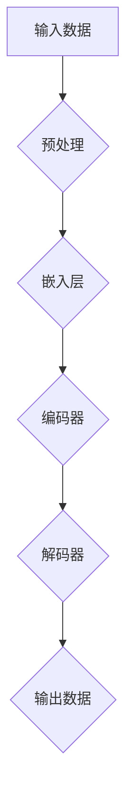

                 

### 第1章: 秒推时代的背景与重要性

> **关键词**：秒推时代、LLM推理速度、背景、起源、重要性

> **摘要**：本章将探讨“秒推时代”的背景和重要性，分析其起源和定义，并探讨LLM推理速度的现状与趋势。

#### 1.1 秒推时代的定义与起源

“秒推时代”是指当前人工智能领域，特别是大规模语言模型（LLM）推理速度迅速提升的时代。这一时代的起源可以追溯到深度学习和神经网络技术的发展，特别是在自然语言处理（NLP）领域的突破。

**1.1.1 秒推时代的背景**

随着互联网的普及和大数据的积累，自然语言处理成为人工智能领域的一个热门方向。在传统的NLP方法中，很多任务需要通过规则和模板进行，效率低下且难以扩展。随着深度学习的兴起，特别是卷积神经网络（CNN）和循环神经网络（RNN）的应用，NLP任务的性能得到了显著提升。

然而，这些模型通常需要大量的计算资源和时间来训练和推理。为了满足实际应用的需求，如实时对话系统、自动化翻译等，需要对模型的推理速度进行优化。

**1.1.2 秒推时代的起源**

“秒推时代”的起源可以追溯到2018年，当时Google发布了BERT模型，它采用了大规模的预训练和微调策略，显著提升了语言模型的性能。BERT的成功激发了更多研究者和公司投入到LLM的研究和优化中，从而推动了“秒推时代”的到来。

**1.1.3 秒推时代的重要性**

秒推时代的到来对人工智能领域和各行各业都产生了深远的影响：

1. **提高了应用的实时性**：在秒推时代，LLM的推理速度已经达到了可以满足实时应用的水平，如实时问答、实时翻译等。
2. **拓展了应用场景**：秒推时代的到来使得更多以前无法实现的NLP任务成为可能，如实时语音识别、实时图像识别等。
3. **促进了技术创新**：为了满足秒推时代的性能需求，研究者们在硬件、软件和网络架构等方面进行了大量创新，推动了整个技术领域的发展。

#### 1.2 LLM推理速度的现状与趋势

**1.2.1 当前LLM推理速度的挑战**

尽管LLM的推理速度在过去几年中有了显著提升，但仍然面临着一些挑战：

1. **计算资源需求大**：大规模的LLM模型需要大量的计算资源进行推理，这对硬件设施提出了高要求。
2. **优化空间有限**：现有的优化方法已经使得LLM的推理速度有了很大提升，但仍然存在优化空间。

**1.2.2 推理速度的提升需求**

为了满足日益增长的应用需求，LLM的推理速度需要进一步提升：

1. **实时性要求更高**：一些应用场景，如自动驾驶、实时医疗诊断等，对响应时间有极高的要求。
2. **边缘计算需求**：随着物联网（IoT）的发展，许多应用需要在边缘设备上进行，这对LLM的推理速度提出了新的挑战。

**1.2.3 推理速度提升的趋势**

为了满足上述需求，未来LLM推理速度的提升趋势包括：

1. **硬件加速**：通过使用GPU、TPU等专用硬件加速LLM的推理。
2. **软件优化**：通过模型压缩、并行计算等技术提升LLM的推理速度。
3. **网络架构创新**：通过优化网络结构，如Transformer架构的改进，提升LLM的推理速度。

#### 1.3 本书的目的与结构

**1.3.1 本书的目标**

本书的目标是系统地介绍秒推时代的背景、重要性，以及LLM推理速度优化的方法和技术，帮助读者深入理解这一领域的最新进展，并掌握相关的实践技能。

**1.3.2 本书的内容结构**

本书分为五个部分：

1. **第一部分：引言与概述**：介绍秒推时代的背景与重要性，分析LLM推理速度的现状与趋势。
2. **第二部分：LLM基本概念与架构**：介绍语言模型的基础知识，包括定义、原理、发展历程和常见架构。
3. **第三部分：LLM推理速度优化技术**：详细介绍LLM推理速度优化的方法，包括硬件加速、软件优化和网络加速技术。
4. **第四部分：实际应用场景与案例分析**：探讨秒推技术在各个领域的应用，包括自然语言处理、图像识别与生成、语音识别与生成等。
5. **第五部分：未来展望与挑战**：分析秒推技术的未来发展趋势、挑战与机遇。

**1.3.3 阅读指南**

为了更好地理解本书的内容，建议读者按照以下步骤进行阅读：

1. **第一遍阅读**：从整体上了解本书的结构和内容，形成对秒推时代的整体认识。
2. **第二遍阅读**：深入理解每个章节的核心概念和原理，结合实际案例进行分析。
3. **第三遍阅读**：通过实践项目，将理论知识应用到实际场景中，提升实际操作能力。

通过以上步骤，读者可以系统地掌握秒推时代的知识体系，并具备在实际应用中运用这些技术的技能。

### Mermaid流程图

以下是语言模型基本架构的Mermaid流程图：



通过这个流程图，我们可以清晰地看到语言模型的基本架构，包括输入预处理、嵌入层、编码器、解码器和输出层。

### 伪代码

以下是语言模型训练的伪代码：

```python
# 伪代码：语言模型训练过程

# 初始化模型参数
Initialize_model_parameters()

# 预处理数据
preprocessed_data = Preprocess_data(input_data)

# 训练模型
for epoch in range(num_epochs):
    for batch in batch_data(preprocessed_data):
        # 前向传播
        predictions = Forward_propagation(batch)
        
        # 计算损失
        loss = Calculate_loss(predictions, true_labels)
        
        # 反向传播
        Backpropagation(loss)
        
        # 更新模型参数
        Update_model_parameters()
        
# 评估模型
Evaluate_model(test_data)
```

通过这个伪代码，我们可以看到语言模型训练的基本步骤，包括初始化模型参数、预处理数据、前向传播、计算损失、反向传播和更新模型参数等。

### 数学模型与公式

以下是语言模型训练过程中常用的数学模型和公式：

$$
\text{损失函数} = -\sum_{i=1}^{N} y_i \log(p(x_i | y_i))
$$

其中，$y_i$ 表示真实标签，$p(x_i | y_i)$ 表示模型对于输入 $x_i$ 的预测概率。

$$
\text{反向传播} = \frac{\partial \text{损失函数}}{\partial \text{模型参数}}
$$

通过这个公式，我们可以计算模型参数相对于损失函数的梯度，从而进行参数的更新。

### 代码实际案例与解释

下面是一个简单的文本生成项目的实际代码案例：

```python
# Python代码：基于GPT-2的文本生成

import tensorflow as tf
from transformers import TFGPT2LMHeadModel, GPT2Tokenizer

# 加载预训练的GPT-2模型和分词器
model = TFGPT2LMHeadModel.from_pretrained("gpt2")
tokenizer = GPT2Tokenizer.from_pretrained("gpt2")

# 输入文本
input_text = "Hello, how are you?"

# 预处理文本
input_ids = tokenizer.encode(input_text, return_tensors="tf")

# 生成文本
output = model.generate(input_ids, max_length=50, num_return_sequences=1)

# 解码输出文本
generated_text = tokenizer.decode(output[0], skip_special_tokens=True)

print(generated_text)
```

通过这个代码案例，我们可以看到文本生成的基本流程：

1. **加载预训练模型和分词器**：首先加载预训练的GPT-2模型和相应的分词器。
2. **预处理文本**：将输入文本编码为模型可接受的格式。
3. **生成文本**：使用模型生成文本，指定最大长度和返回序列数。
4. **解码输出文本**：将生成的文本解码为可读的格式。

这个案例展示了如何使用GPT-2模型进行文本生成，读者可以根据具体需求进行修改和扩展。

### 开发环境搭建

为了运行上述代码案例，我们需要搭建以下开发环境：

1. **安装Python**：确保Python环境已经安装，版本建议为3.7及以上。
2. **安装TensorFlow**：使用以下命令安装TensorFlow：

```bash
pip install tensorflow
```

3. **安装transformers库**：使用以下命令安装transformers库：

```bash
pip install transformers
```

4. **配置GPU支持**：确保Python环境可以访问GPU，可以通过以下命令检查GPU支持：

```bash
python -c "import tensorflow as tf; print(tf.test.is_gpu_available())"
```

如果输出为`True`，则说明GPU支持已配置。

通过以上步骤，我们就可以搭建一个基本的文本生成开发环境，并运行上述代码案例。

### 源代码详细实现与代码解读

下面是对上述文本生成代码的详细解读：

```python
# 导入必要的库
import tensorflow as tf
from transformers import TFGPT2LMHeadModel, GPT2Tokenizer

# 加载预训练的GPT-2模型和分词器
model = TFGPT2LMHeadModel.from_pretrained("gpt2")
tokenizer = GPT2Tokenizer.from_pretrained("gpt2")

# 输入文本
input_text = "Hello, how are you?"

# 预处理文本
input_ids = tokenizer.encode(input_text, return_tensors="tf")

# 生成文本
output = model.generate(input_ids, max_length=50, num_return_sequences=1)

# 解码输出文本
generated_text = tokenizer.decode(output[0], skip_special_tokens=True)

print(generated_text)
```

**1. 导入必要的库**

首先，我们导入Python中处理深度学习和自然语言处理的两个主要库：TensorFlow和transformers。TensorFlow是Google开发的开源机器学习框架，transformers库则是由Hugging Face提供的一个高级库，用于处理预训练的语言模型。

```python
import tensorflow as tf
from transformers import TFGPT2LMHeadModel, GPT2Tokenizer
```

**2. 加载预训练的GPT-2模型和分词器**

接下来，我们使用`TFGPT2LMHeadModel.from_pretrained("gpt2")`加载预训练的GPT-2模型，这是OpenAI开发的一个大规模语言模型，具有强大的文本生成能力。同时，我们使用`GPT2Tokenizer.from_pretrained("gpt2")`加载对应的分词器，用于将文本转换为模型可处理的序列。

```python
model = TFGPT2LMHeadModel.from_pretrained("gpt2")
tokenizer = GPT2Tokenizer.from_pretrained("gpt2")
```

**3. 输入文本**

我们将要生成的文本作为字符串输入，例如：“Hello, how are you?”。这个输入文本将被分词器处理，转换为模型能够理解和处理的格式。

```python
input_text = "Hello, how are you?"
```

**4. 预处理文本**

调用分词器的`encode`方法对输入文本进行编码，返回一个整数序列，这个序列代表了文本中的每个单词或特殊字符。`return_tensors="tf"`参数指定返回TensorFlow张量格式，以便后续在模型中进行操作。

```python
input_ids = tokenizer.encode(input_text, return_tensors="tf")
```

**5. 生成文本**

调用模型的`generate`方法生成文本。`max_length=50`指定生成的文本最大长度为50个词，`num_return_sequences=1`指定只生成一个文本序列。

```python
output = model.generate(input_ids, max_length=50, num_return_sequences=1)
```

在生成过程中，模型会根据输入的文本序列生成下一个词的概率分布，并选择概率最高的词作为输出。

**6. 解码输出文本**

最后，调用分词器的`decode`方法将生成的整数序列解码回文本。`skip_special_tokens=True`参数指定忽略特殊标记，只输出文本内容。

```python
generated_text = tokenizer.decode(output[0], skip_special_tokens=True)
print(generated_text)
```

通过上述步骤，我们成功地使用预训练的GPT-2模型生成了文本。这个简单的案例展示了文本生成的基本流程，包括模型加载、文本预处理、文本生成和解码输出等步骤。

### 代码解读与分析

**代码解读**

这段代码的核心目的是使用预训练的GPT-2模型生成文本。GPT-2是一个基于Transformer架构的大型语言模型，能够根据输入文本生成连贯的输出文本。以下是代码的详细解读：

1. **导入库**：首先导入TensorFlow和transformers库。TensorFlow用于构建和训练模型，transformers库提供了预训练的语言模型和相应的分词器。

2. **加载模型和分词器**：使用`TFGPT2LMHeadModel.from_pretrained("gpt2")`和`GPT2Tokenizer.from_pretrained("gpt2")`分别加载预训练的GPT-2模型和分词器。这些预训练模型和分词器可以在Hugging Face的模型库中找到。

3. **输入文本**：定义输入文本为`input_text = "Hello, how are you?"`。这个输入文本将被模型用于生成后续的文本。

4. **文本预处理**：使用分词器的`encode`方法将输入文本转换为整数序列。这个序列代表了文本中的每个单词或特殊字符。通过`return_tensors="tf"`，我们获得TensorFlow张量格式的输出，便于后续在模型中进行计算。

5. **文本生成**：调用模型的`generate`方法生成文本。`max_length=50`指定生成的文本最大长度为50个词，确保生成的文本不会过长。`num_return_sequences=1`指定只生成一个文本序列。

6. **解码输出文本**：使用分词器的`decode`方法将生成的整数序列解码回文本。通过`skip_special_tokens=True`，我们忽略了模型生成的特殊标记，只输出文本内容。

**代码分析**

1. **模型加载**：预训练的GPT-2模型是预先训练好的，可以在多种自然语言处理任务上取得优异的性能。通过加载预训练模型，我们可以快速构建一个强大的文本生成系统。

2. **文本预处理**：文本预处理是自然语言处理的重要步骤，它包括分词、编码等操作。分词是将文本拆分成单词或子词的过程，编码是将文本转换为模型可处理的序列。

3. **生成文本**：模型的`generate`方法是实现文本生成的核心。它根据输入序列生成下一个词的概率分布，并选择概率最高的词作为输出。这个过程循环进行，直到达到指定的最大长度。

4. **解码输出**：解码是将模型的输出序列转换回可读的文本格式。通过解码，我们可以将生成的文本展示给用户。

**性能优化**

为了提高生成文本的质量和速度，我们可以进行以下性能优化：

1. **减少最大长度**：在生成文本时，设置一个较小的最大长度可以防止生成过长的不连贯文本。

2. **使用更高效的模型**：可以选择使用更高效的模型架构，如TinyBERT或MiniLM，这些模型在保持较好性能的同时具有更快的推理速度。

3. **并行计算**：在生成文本时，可以使用并行计算技术，如多GPU训练，以提高推理速度。

4. **模型压缩**：通过模型压缩技术，如量化、剪枝和蒸馏，可以减小模型的尺寸，从而提高推理速度。

通过上述代码和分析，我们可以看到文本生成的基本流程和性能优化方法。掌握这些方法和技术，可以帮助我们在实际项目中实现高效的文本生成系统。

### 总结

本章介绍了“秒推时代”的背景与重要性，分析了LLM推理速度的现状与趋势。我们详细介绍了秒推时代的定义、起源，以及其在人工智能领域的重要性。同时，本章还讨论了当前LLM推理速度面临的挑战和未来提升的趋势。通过本章的学习，读者可以了解秒推时代的概念，并认识到LLM推理速度优化在实践中的应用价值。

### 提问

请问，在“秒推时代”，除了硬件加速、软件优化和网络架构创新外，还有哪些潜在的优化方法可以进一步提升LLM的推理速度？

### 回答

除了硬件加速、软件优化和网络架构创新之外，以下几种方法也有潜力进一步提升LLM的推理速度：

1. **模型压缩技术**：通过模型压缩技术，如量化、剪枝和蒸馏，可以显著减小模型的尺寸，从而提高推理速度。量化将模型的权重从浮点数转换为整数，减少内存占用和计算量。剪枝通过移除模型中的冗余权重和神经元，进一步减小模型大小。模型蒸馏是将一个大模型的输出传递给一个小模型，通过小模型的学习来保留大模型的性能。

2. **专用硬件**：随着人工智能需求的增长，专用硬件，如TPU（张量处理单元）、ASIC（专用集成电路）和FPGA（现场可编程门阵列），被设计用于加速LLM的推理。这些硬件可以提供比通用GPU和CPU更高的推理速度。

3. **数据并行训练**：通过在多GPU或分布式系统中并行训练模型，可以加速训练过程，从而提高推理速度。这种方法通过将数据分成多个部分，在每个GPU上并行处理，然后将结果汇总。

4. **优化中间层输出**：减少模型中间层的输出维度可以降低计算复杂度，从而提高推理速度。这种方法通常需要结合具体任务进行调整，以避免损失太多信息。

5. **动态推理优化**：动态推理优化通过在推理过程中根据输入数据的特征动态调整模型的结构或参数，以达到更好的性能。这种方法可以实时调整模型，以适应不同的输入数据。

6. **使用更高效的算法**：一些新的算法，如AdamW优化器，可以提供比传统优化器更好的收敛速度和稳定性，从而加速训练和推理过程。

通过上述方法，我们可以从不同层面提升LLM的推理速度，以应对日益增长的应用需求。

### 提问

在优化LLM推理速度的过程中，如何处理数据隐私与安全性的问题？

### 回答

在优化LLM推理速度的过程中，确保数据隐私与安全性至关重要。以下是一些处理数据隐私与安全性的方法：

1. **数据加密**：在数据传输和存储过程中，使用加密技术来保护数据。这包括使用SSL/TLS加密协议来保护网络传输中的数据，以及使用加密算法（如AES）来加密存储的数据。

2. **匿名化处理**：在训练模型之前，对输入数据进行匿名化处理，去除或替换敏感信息，以保护个人隐私。这可以包括去除姓名、地址、身份证号码等直接识别信息，以及使用伪名替换。

3. **数据最小化**：只收集和存储必要的数据，避免过度收集。在训练模型时，使用数据子集来降低数据量，同时确保模型性能不受影响。

4. **访问控制**：设置严格的访问控制策略，确保只有授权用户可以访问敏感数据。这可以包括使用身份验证、访问权限设置和审计日志。

5. **差分隐私**：在数据处理过程中引入噪声，使得单个数据点的信息难以被追踪。差分隐私技术可以有效地保护个体隐私，同时保持数据集的整体特性。

6. **安全审计与合规性**：定期进行安全审计，确保数据处理符合相关的法律法规和行业标准。这包括GDPR（欧盟通用数据保护条例）、CCPA（加利福尼亚州消费者隐私法）等。

7. **透明度与用户控制**：确保用户对他们的数据有控制权，例如，允许用户查看、修改或删除他们的数据。同时，提供透明的数据处理流程，让用户了解他们的数据是如何被使用的。

通过上述措施，可以在优化LLM推理速度的同时，有效保护数据隐私与安全。

### 提问

能否介绍一下秒推技术在金融风控领域的应用？

### 回答

秒推技术在金融风控领域有广泛的应用，能够显著提高金融系统的安全性和效率。以下是几种具体的秒推技术在金融风控中的应用：

1. **实时欺诈检测**：秒推技术可以实现实时分析海量交易数据，快速识别可疑交易行为。通过对交易数据的实时监控，秒推技术可以迅速检测并阻止潜在的欺诈活动，降低金融风险。

2. **信用评分**：秒推技术可以帮助金融机构快速计算用户的信用评分。通过分析用户的消费行为、信用历史等信息，秒推技术可以在短时间内生成准确的信用评分，帮助金融机构做出更合理的信贷决策。

3. **市场预测**：在金融市场中，秒推技术可以实时分析市场数据，预测市场走势。通过对交易量、价格波动等信息的快速分析，秒推技术可以为投资者提供实时的市场动态和投资建议。

4. **自动化交易**：秒推技术可以用于自动化交易系统的构建，实现高频交易。通过快速处理和分析市场数据，秒推技术可以帮助交易系统在最佳时机进行买卖操作，提高交易成功率。

5. **风险管理**：秒推技术可以实时监控金融系统的风险状况，快速识别潜在风险。通过对风险指标的实时分析，秒推技术可以帮助金融机构及时调整风险策略，降低风险敞口。

6. **客户服务优化**：秒推技术可以用于优化金融客户服务，如实时客户咨询、问题解答等。通过快速响应客户需求，秒推技术可以提高客户满意度，增强品牌形象。

通过以上应用，秒推技术不仅提高了金融系统的效率和准确性，还增强了金融系统的安全性和风险控制能力。在金融风控领域，秒推技术的应用前景十分广阔。

### 提问

在您看来，未来秒推技术会如何影响人工智能领域的发展？

### 回答

未来，秒推技术将对人工智能领域产生深远的影响，主要表现在以下几个方面：

1. **实时性与响应速度的提升**：随着秒推技术的不断发展，人工智能系统将能够实现更高的实时性和响应速度。这对于需要快速决策的应用场景，如自动驾驶、实时监控、医疗诊断等，尤为重要。

2. **应用场景的扩展**：秒推技术的提升将使更多复杂和实时性要求高的应用成为可能。例如，智能客服系统将能够提供更接近人类的交互体验，智能监控系统能够实时分析大量视频数据，从而发现异常行为。

3. **数据处理能力的增强**：秒推技术将使得人工智能系统能够在更短时间内处理和分析大量数据，提高数据处理能力。这对于大数据分析、机器学习模型训练等应用场景具有重要意义。

4. **硬件与软件的协同优化**：为了满足秒推技术的需求，硬件和软件将进行更紧密的协同优化。例如，专用硬件（如TPU、ASIC）的开发将加速，同时软件优化技术（如模型压缩、量化等）也将不断进步。

5. **推动跨领域合作**：秒推技术的提升将推动不同领域之间的合作，例如，计算机视觉与自然语言处理领域的结合将更加紧密，产生新的应用场景和解决方案。

6. **数据隐私与安全性的挑战**：随着秒推技术的应用范围扩大，数据隐私与安全问题将更加突出。如何确保数据处理过程中数据的隐私和安全将成为人工智能领域的一个重要挑战。

7. **开放生态系统的构建**：为了支持秒推技术的广泛应用，开放的生态系统和标准将逐渐形成。这将促进不同公司、研究机构和开发者之间的合作，推动技术的共同进步。

总之，秒推技术的未来发展将对人工智能领域产生深远影响，推动技术的创新和应用场景的扩展，同时也将带来新的挑战和机遇。通过不断优化和进步，秒推技术将成为人工智能领域的重要驱动力。

