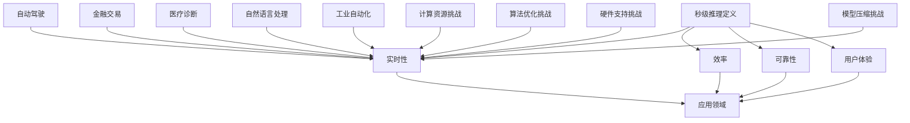
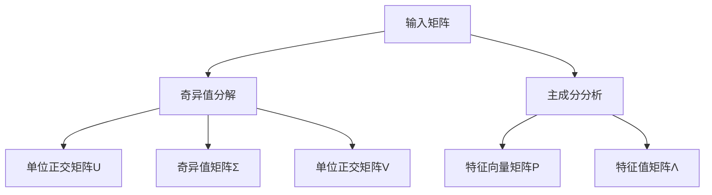
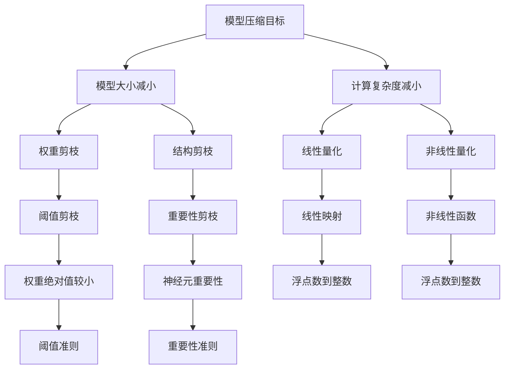
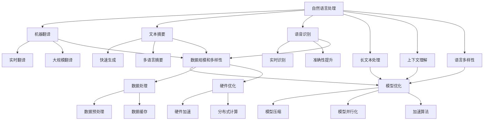
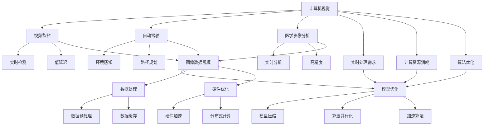
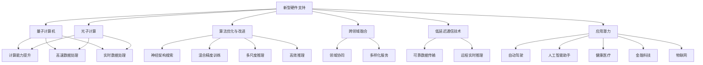
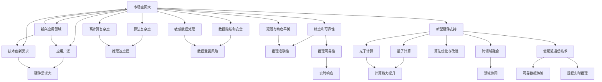
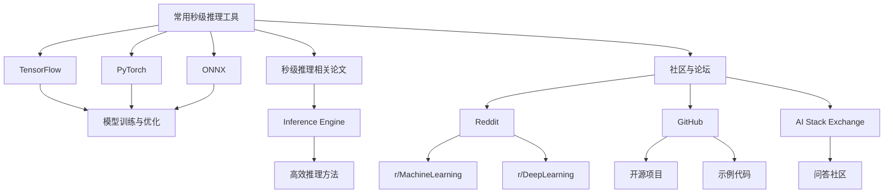

                 

# 第一部分: 秒级推理的背景与重要性

## 第1章: 秒级推理的概念与原理

### 1.1 秒级推理的定义

秒级推理（Microsecond Inference）是指能够在微秒级别完成推理过程的计算技术。这种速度对于实时应用至关重要，如自动驾驶、实时视频分析、金融交易决策等。秒级推理不仅仅是一个速度目标，更是一个能够在复杂计算环境中保证低延迟和高效率的解决方案。

### 1.2 秒级推理的重要性

在当今的数据密集型时代，信息的实时处理能力成为衡量系统性能的关键指标。秒级推理的重要性体现在以下几个方面：

1. **实时性**：秒级推理能够保证系统对输入数据进行快速响应，这对于许多需要即时反馈的应用场景至关重要。
2. **效率**：通过减少延迟，秒级推理能够提高系统的整体效率，降低处理时间和资源消耗。
3. **可靠性**：在需要高可靠性的应用中，秒级推理能够确保决策的一致性和准确性。
4. **用户体验**：在用户界面和交互中，秒级推理能够提供更为流畅和直观的用户体验。

### 1.3 秒级推理的应用领域

秒级推理的应用领域非常广泛，以下是一些典型的应用场景：

1. **自动驾驶**：自动驾驶系统需要实时处理大量的传感器数据，以做出迅速且安全的驾驶决策。
2. **金融交易**：高频交易依赖于秒级推理技术，以便在微秒级别对市场动态做出反应。
3. **医疗诊断**：实时影像分析、疾病预测等应用需要快速、准确的推理结果，以辅助医生的诊断。
4. **自然语言处理**：语音识别、机器翻译等应用需要快速处理大量的语言数据，以提供即时服务。
5. **工业自动化**：在生产过程中，秒级推理技术用于实时监控和决策，以提高生产效率和产品质量。

### 1.4 秒级推理的现状与挑战

当前，秒级推理技术已经在多个领域取得了一定的进展，但仍面临诸多挑战：

1. **计算资源**：高并发、大数据量的处理需求对计算资源提出了更高要求。
2. **算法优化**：现有的算法和技术需要进一步优化，以提高推理速度和降低延迟。
3. **硬件支持**：秒级推理对硬件性能的要求较高，需要专用硬件的支持。
4. **模型压缩**：如何在不损失精度的前提下，对模型进行压缩，以提高推理速度和减少存储空间。

### 1.5 小结

秒级推理作为人工智能领域的一项关键技术，其重要性不容忽视。本章介绍了秒级推理的定义、重要性、应用领域以及当前面临的挑战，为后续章节的深入探讨奠定了基础。在下一章中，我们将进一步探讨LLTM模型的结构与特性。

---



## 第2章: LLTM模型的结构与特性

### 2.1 LLTM模型的基本结构

LLTM（Large Language Transformer Model）是一种大型语言变换模型，其基本结构包括编码器（Encoder）和解码器（Decoder）。编码器用于将输入文本转换为上下文表示，解码器则用于将上下文表示转换为目标输出文本。

### 2.2 LLTM模型的特性

1. **并行处理能力**：LLTM模型通过自注意力机制（Self-Attention）实现了并行处理，能够在处理大规模文本数据时显著提高效率。
2. **强大的上下文表示能力**：通过多层Transformer结构，LLTM模型能够捕捉长距离的上下文信息，实现更加准确的语义理解和生成。
3. **适应性**：LLTM模型可以适应不同的任务和数据集，通过预训练和微调，能够实现多种自然语言处理任务的自动化处理。
4. **计算复杂度**：尽管LLTM模型在性能上具有优势，但其计算复杂度也相对较高，尤其是在大规模数据集上训练时。

### 2.3 LLTM模型的优缺点

#### 优点：

1. **高效的文本处理能力**：LLTM模型能够高效处理大规模的文本数据，实现快速、准确的文本理解和生成。
2. **适应性**：LLTM模型适用于多种自然语言处理任务，如机器翻译、文本摘要、问答系统等。
3. **强大的上下文理解能力**：通过多层Transformer结构，LLTM模型能够捕捉长距离的上下文信息，提高任务的准确性。

#### 缺点：

1. **计算资源消耗**：LLTM模型的训练和推理过程需要大量的计算资源，对硬件性能要求较高。
2. **数据需求量大**：为了实现良好的性能，LLTM模型需要大量高质量的训练数据，数据获取和处理成本较高。
3. **解释性较差**：由于模型的结构复杂，LLTM模型在决策过程中缺乏透明性和解释性，难以理解其具体的工作机制。

### 2.4 小结

LLTM模型作为当前自然语言处理领域的重要技术之一，其强大的文本处理能力和适应性使其在多个应用场景中取得显著成效。然而，其计算复杂度较高、数据需求量大以及缺乏解释性等问题也需引起重视。在下一章中，我们将进一步探讨秒级推理的发展历程及其关键技术。

## 第3章: 秒级推理的发展历程

### 3.1 早期的推理算法

秒级推理的概念虽然近年来才被广泛提及，但实际上其发展可以追溯到早期的计算机科学和人工智能领域。早期的推理算法主要包括基于规则的推理和基于模型的推理。

#### 基于规则的推理

基于规则的推理（Rule-Based Reasoning）是最早的推理方法之一。它依赖于一组预先定义的规则，这些规则描述了不同条件下的决策和行为。当系统接收到输入数据时，它会根据这些规则进行推理，并产生相应的输出。

**优点**：
- **简单易懂**：基于规则的推理方法易于理解和实现。
- **稳定性**：规则的明确性使得推理过程具有较好的稳定性。

**缺点**：
- **灵活性差**：规则需要手动定义，难以应对复杂和多变的场景。
- **可扩展性差**：随着规则数量的增加，系统的复杂性和维护难度也会增加。

#### 基于模型的推理

基于模型的推理（Model-Based Reasoning）是另一种早期的推理方法，它依赖于数学模型或计算模型来模拟现实世界。这种方法的核心是构建一个模拟模型，然后将输入数据输入到模型中，通过模型的计算和模拟来产生推理结果。

**优点**：
- **适应性**：基于模型的推理方法具有较强的适应性，能够处理复杂和动态的情景。
- **灵活性**：模型可以自动调整，以适应不同的应用场景。

**缺点**：
- **计算复杂度**：基于模型的推理方法通常需要大量的计算资源，尤其是在处理大规模数据时。
- **准确性**：模型的准确性和稳定性取决于模型的构建质量和训练数据的质量。

### 3.2 传统推理与秒级推理的对比

传统推理方法在许多应用场景中仍然有效，但随着人工智能和计算技术的进步，秒级推理逐渐成为新的发展趋势。以下是传统推理与秒级推理的一些对比：

#### 性能

- **传统推理**：传统推理方法在处理速度上相对较慢，通常需要数秒或数分钟才能完成推理过程。
- **秒级推理**：秒级推理方法能够在微秒级别完成推理，满足实时应用的需求。

#### 延迟

- **传统推理**：传统推理方法的延迟较高，无法满足对延迟敏感的应用场景。
- **秒级推理**：秒级推理方法具有极低的延迟，能够实现实时响应。

#### 可扩展性

- **传统推理**：传统推理方法通常难以扩展，难以应对大规模数据处理需求。
- **秒级推理**：秒级推理方法具有较强的可扩展性，能够应对大规模数据和并发请求。

#### 精度

- **传统推理**：传统推理方法的精度受限于规则和模型的构建质量。
- **秒级推理**：秒级推理方法通过深度学习等先进技术，能够实现高精度的推理结果。

### 3.3 秒级推理的关键技术

秒级推理的发展离不开一系列关键技术的支持，以下是其中几个重要的技术：

#### 模型压缩

模型压缩（Model Compression）是一种通过减少模型大小和计算复杂度来提高推理速度的技术。常见的模型压缩方法包括剪枝（Pruning）、量化（Quantization）和知识蒸馏（Knowledge Distillation）等。

**优点**：
- **降低计算资源消耗**：压缩后的模型占用更少的存储空间和计算资源。
- **提高推理速度**：压缩后的模型在推理过程中具有更快的计算速度。

**缺点**：
- **精度损失**：模型压缩可能会引入一定的精度损失，影响推理结果的准确性。

#### 硬件加速

硬件加速（Hardware Acceleration）是利用专用硬件（如GPU、TPU等）来加速推理过程的一种技术。硬件加速能够显著提高推理速度，降低延迟。

**优点**：
- **提高推理速度**：硬件加速能够实现比软件实现更高的推理速度。
- **降低功耗**：硬件加速通常具有较低的功耗，适合嵌入式设备。

**缺点**：
- **硬件成本**：硬件加速需要额外的硬件投入，成本较高。

#### 并行计算

并行计算（Parallel Computing）是一种通过同时处理多个任务来提高计算速度的技术。在秒级推理中，并行计算能够有效提高数据处理效率。

**优点**：
- **提高处理速度**：并行计算能够实现任务的并行处理，提高整体计算速度。
- **降低延迟**：并行计算能够减少系统的延迟，满足实时应用的需求。

**缺点**：
- **复杂度增加**：并行计算增加了系统的复杂度，需要更多的管理和协调。

### 3.4 小结

秒级推理的发展历程展示了人工智能技术的不断进步和创新。从早期的传统推理方法到如今的秒级推理技术，我们在性能、延迟、可扩展性和精度等方面取得了显著的提升。然而，秒级推理仍面临诸多挑战，需要进一步优化和改进。在下一章中，我们将深入探讨秒级推理的核心算法原理。

---

```latex
\section{矩阵分解的基本原理}
矩阵分解（Matrix Factorization）是一种将一个矩阵分解为两个或多个矩阵的乘积的数学方法。常见的矩阵分解方法包括奇异值分解（Singular Value Decomposition，SVD）和主成分分析（Principal Component Analysis，PCA）。

\subsection{奇异值分解（SVD）}
奇异值分解是一种将矩阵分解为三个矩阵的乘积的方法，公式如下：
\[ A = U \Sigma V^T \]
其中，\( U \) 和 \( V \) 是单位正交矩阵，\( \Sigma \) 是对角矩阵，包含矩阵 \( A \) 的奇异值。

\subsection{主成分分析（PCA）}
主成分分析是一种基于数据降维的方法，通过将数据投影到新的正交基上，提取主要特征，从而降低数据维度。
\[ X = P \Lambda \]
其中，\( X \) 是原始数据矩阵，\( P \) 是特征向量矩阵，\( \Lambda \) 是特征值矩阵。
```



## 第5章: 基于深度学习的秒级推理算法

### 5.1 深度学习的基本原理

深度学习是一种基于人工神经网络的研究方法，通过多层非线性变换来模拟人类大脑的神经网络结构，从而实现数据的学习和预测。深度学习的基本原理包括以下几个方面：

#### 1. 神经网络结构

神经网络由多个神经元（或节点）组成，每个神经元接收来自其他神经元的输入信号，通过激活函数产生输出信号。神经网络的结构可以分为输入层、隐藏层和输出层。

#### 2. 激活函数

激活函数是神经网络中用于引入非线性性的函数，常见的激活函数包括 sigmoid、ReLU（Rectified Linear Unit）和 tanh 等。

#### 3. 前向传播和反向传播

前向传播是指将输入数据通过神经网络进行正向计算，生成输出数据。反向传播是指根据输出数据和真实标签，通过反向计算来更新神经网络的权重和偏置，以最小化预测误差。

#### 4. 损失函数

损失函数是衡量预测结果和真实结果之间差异的函数，常见的损失函数包括均方误差（MSE，Mean Squared Error）和交叉熵（Cross-Entropy）等。

### 5.2 基于深度学习的秒级推理算法

基于深度学习的秒级推理算法主要包括以下几种：

#### 1. 卷积神经网络（CNN）

卷积神经网络是一种专门用于处理图像数据的深度学习模型，通过卷积操作和池化操作来提取图像特征。CNN在计算机视觉领域取得了显著的成功，如图像分类、目标检测和图像分割等。

#### 2. 循环神经网络（RNN）

循环神经网络是一种专门用于处理序列数据的深度学习模型，通过循环结构来维持序列信息。RNN在自然语言处理领域取得了良好的效果，如语言模型、机器翻译和文本生成等。

#### 3. Transformer模型

Transformer模型是一种基于自注意力机制的深度学习模型，在自然语言处理领域取得了突破性的进展。Transformer模型通过多头注意力机制和前馈神经网络，实现了对长距离依赖的有效捕捉。

#### 4. 混合模型

为了提高推理速度和性能，深度学习模型通常会与其他算法和技术相结合，如模型压缩、量化、蒸馏等。这些方法可以在不损失精度的前提下，显著提高推理速度。

### 5.3 秒级推理算法的实现步骤

基于深度学习的秒级推理算法通常包括以下几个步骤：

1. **数据预处理**：对输入数据进行预处理，如标准化、归一化、填充等，以便于模型的训练和推理。
2. **模型训练**：使用训练数据对深度学习模型进行训练，通过反向传播和优化算法（如梯度下降）来更新模型参数。
3. **模型评估**：使用验证数据对训练好的模型进行评估，通过准确率、召回率、F1值等指标来评估模型的性能。
4. **模型推理**：将输入数据输入到训练好的模型中，通过前向传播计算输出结果。

### 5.4 小结

基于深度学习的秒级推理算法通过引入先进的神经网络结构和优化方法，实现了对复杂任务的实时处理。本章介绍了深度学习的基本原理和几种常见的秒级推理算法，为后续章节的应用实战提供了理论基础。在下一章中，我们将深入探讨基于模型压缩的秒级推理算法。

---

```latex
\section{模型压缩的基本原理}
模型压缩（Model Compression）是一种通过减小模型大小和计算复杂度来提高推理速度的技术。常见的模型压缩方法包括剪枝（Pruning）、量化（Quantization）和知识蒸馏（Knowledge Distillation）。

\subsection{剪枝（Pruning）}
剪枝是一种通过删除模型中不重要的神经元或连接来减小模型大小的技术。剪枝可以分为以下几种类型：
1. **权重剪枝**：删除权重绝对值较小的神经元或连接。
2. **结构剪枝**：删除神经元或层。
3. **剪枝策略**：根据某种准则（如阈值、重要性等）选择剪枝对象。

\subsection{量化（Quantization）}
量化是一种通过将浮点数表示转换为低精度整数表示来减小模型大小的技术。量化可以分为以下几种类型：
1. **线性量化**：将浮点数线性映射到整数。
2. **非线性量化**：使用非线性函数将浮点数映射到整数。
3. **量化策略**：根据某种准则（如最小化误差、最大化精度等）选择量化参数。

\subsection{知识蒸馏（Knowledge Distillation）}
知识蒸馏是一种将大型模型的知识传递给小型模型的技术。知识蒸馏可以分为以下几种类型：
1. **软目标蒸馏**：将大型模型的输出作为软目标，用于训练小型模型。
2. **硬目标蒸馏**：将大型模型和教师模型生成的输出作为硬目标，用于训练学生模型。
3. **蒸馏策略**：根据某种准则（如最小化误差、最大化知识传递等）设计蒸馏过程。
```



## 第7章: 秒级推理在自然语言处理中的应用

### 7.1 秒级推理在自然语言处理中的挑战

自然语言处理（NLP）是人工智能领域的一个重要分支，涉及到语言理解、文本生成、机器翻译等多个方面。秒级推理在NLP中的应用面临着一系列挑战：

#### 1. 数据规模和多样性

自然语言数据具有规模巨大且多样性高的特点，这要求秒级推理算法能够在海量数据和多样化场景下保持高效和准确。

#### 2. 长文本处理

自然语言处理中的许多任务需要处理长文本，如机器翻译、文本摘要等。长文本的处理对推理速度和资源消耗提出了更高的要求。

#### 3. 上下文理解

自然语言处理任务往往需要深入理解上下文信息，以准确捕捉语义和意图。秒级推理算法需要在保证高准确性的同时，实现快速推理。

#### 4. 语言多样性

不同语言具有不同的语法结构、词汇和语义规则，这要求秒级推理算法具有多语言处理能力，以适应全球化的应用需求。

### 7.2 秒级推理在自然语言处理中的应用案例

#### 1. 机器翻译

机器翻译是自然语言处理领域的重要应用之一。秒级推理技术在机器翻译中的应用主要体现在以下几个方面：

- **实时翻译**：在视频会议、实时通讯等场景中，秒级推理算法能够实现即时翻译，提高沟通效率。
- **大规模翻译**：秒级推理算法能够处理大规模文本数据，满足大规模机器翻译服务的需求。

#### 2. 文本摘要

文本摘要是一种将长文本简化为简洁摘要的技术，广泛应用于信息检索、新闻推送等场景。秒级推理在文本摘要中的应用包括：

- **快速生成**：秒级推理算法能够迅速生成文本摘要，提高信息检索和处理的效率。
- **多语言摘要**：秒级推理算法能够处理多语言文本，实现跨语言的文本摘要。

#### 3. 语音识别

语音识别是将语音信号转换为文本的技术，广泛应用于智能助手、语音控制等领域。秒级推理在语音识别中的应用包括：

- **实时识别**：秒级推理算法能够实现实时语音识别，提高用户交互的流畅性。
- **准确性提升**：通过结合深度学习技术和秒级推理算法，语音识别系统的准确性得到了显著提升。

### 7.3 秒级推理在NLP中的优化策略

为了在自然语言处理中实现秒级推理，需要采取一系列优化策略：

#### 1. 模型优化

- **模型压缩**：通过剪枝、量化等模型压缩技术，减小模型大小和计算复杂度。
- **模型并行化**：通过并行计算技术，加速模型的推理过程。
- **加速算法**：采用高效的算法和优化方法，如低秩分解、深度神经网络剪枝等。

#### 2. 数据处理

- **数据预处理**：对输入数据进行预处理，如文本标准化、词向量化等，以提高处理速度。
- **数据缓存**：将常用的数据缓存到内存中，减少磁盘IO操作，提高数据处理速度。

#### 3. 硬件优化

- **硬件加速**：利用GPU、TPU等专用硬件，加速模型的推理过程。
- **分布式计算**：通过分布式计算架构，提高系统的处理能力和可扩展性。

### 7.4 小结

秒级推理在自然语言处理中的应用展示了其高效、实时和准确的特点。尽管面临数据规模、长文本处理和上下文理解等挑战，通过优化模型、数据处理和硬件支持，可以实现秒级推理在NLP领域的广泛应用。在下一章中，我们将探讨秒级推理在计算机视觉中的应用。

---



## 第8章: 秒级推理在计算机视觉中的应用

### 8.1 秒级推理在计算机视觉中的挑战

计算机视觉是人工智能领域的一个重要分支，涉及到图像识别、目标检测、图像分割等多个任务。秒级推理在计算机视觉中的应用面临着一系列挑战：

#### 1. 图像数据规模

计算机视觉任务通常涉及大量的图像数据，这要求秒级推理算法能够在海量数据下保持高效和准确。

#### 2. 实时处理需求

在实时监控、自动驾驶等场景中，计算机视觉系统需要在极短时间内完成图像处理和决策，这对秒级推理提出了极高的要求。

#### 3. 计算资源消耗

计算机视觉任务通常涉及复杂的运算和大量的数据传输，对计算资源和功耗提出了较高的要求。

#### 4. 算法优化

现有计算机视觉算法往往在精度和速度之间取得平衡，如何优化算法以提高推理速度和降低延迟是秒级推理在计算机视觉中面临的一个重要挑战。

### 8.2 秒级推理在计算机视觉中的应用案例

#### 1. 视频监控

视频监控是计算机视觉的典型应用场景之一。通过秒级推理算法，视频监控系统能够实时分析视频流，实现对异常行为的检测和报警。秒级推理在视频监控中的应用包括：

- **实时检测**：秒级推理算法能够在极短时间内对视频帧进行分析，实现实时检测。
- **低延迟**：通过优化算法和硬件支持，秒级推理算法能够实现低延迟的图像处理和决策。

#### 2. 自动驾驶

自动驾驶是计算机视觉的另一个重要应用场景。通过秒级推理算法，自动驾驶系统能够实时处理摄像头、激光雷达等传感器的数据，实现对周围环境的感知和决策。秒级推理在自动驾驶中的应用包括：

- **环境感知**：秒级推理算法能够实时分析图像数据，实现对交通标志、行人、车辆等的准确识别。
- **路径规划**：基于秒级推理的结果，自动驾驶系统能够实时规划行驶路径，提高行驶安全性和效率。

#### 3. 医学影像分析

医学影像分析是计算机视觉在医疗领域的重要应用。通过秒级推理算法，医学影像分析系统能够实时分析医学图像，实现对疾病早期诊断和监测。秒级推理在医学影像分析中的应用包括：

- **实时分析**：秒级推理算法能够快速处理医学图像，实现实时分析和诊断。
- **高精度**：通过优化算法和模型，秒级推理算法能够在保持高精度的同时，实现快速处理。

### 8.3 秒级推理在计算机视觉中的优化策略

为了在计算机视觉中实现秒级推理，需要采取一系列优化策略：

#### 1. 算法优化

- **模型压缩**：通过剪枝、量化等模型压缩技术，减小模型大小和计算复杂度。
- **算法并行化**：通过并行计算技术，加速模型的推理过程。
- **加速算法**：采用高效的算法和优化方法，如低秩分解、深度神经网络剪枝等。

#### 2. 数据处理

- **数据预处理**：对输入数据进行预处理，如图像缩放、标准化等，以提高处理速度。
- **数据缓存**：将常用的数据缓存到内存中，减少磁盘IO操作，提高数据处理速度。

#### 3. 硬件优化

- **硬件加速**：利用GPU、TPU等专用硬件，加速模型的推理过程。
- **分布式计算**：通过分布式计算架构，提高系统的处理能力和可扩展性。

### 8.4 小结

秒级推理在计算机视觉中的应用展示了其高效、实时和准确的特点。尽管面临图像数据规模、实时处理需求、计算资源消耗和算法优化等挑战，通过优化算法、数据处理和硬件支持，可以实现秒级推理在计算机视觉领域的广泛应用。在下一章中，我们将探讨秒级推理在其他领域的应用。

---



## 第9章: 秒级推理在其他领域的应用

### 9.1 秒级推理在其他领域的挑战

秒级推理技术在除了自然语言处理和计算机视觉之外的许多领域也具有重要应用。然而，这些领域也面临着特定的挑战：

#### 1. 金融领域

在金融领域，秒级推理技术用于实时风险评估、市场预测和交易决策。挑战包括：

- **数据复杂性**：金融数据包括股票价格、交易量、经济指标等多种信息，数据规模大且变化快。
- **实时性要求**：高频交易和实时风险管理需要极低延迟的推理结果。
- **精度与风险**：高精度推理有助于减少风险，但可能导致过度拟合，影响决策的稳定性。

#### 2. 健康医疗

健康医疗领域中的秒级推理应用包括实时疾病监测、患者数据分析等。挑战包括：

- **数据隐私**：医疗数据敏感且涉及隐私保护问题。
- **数据处理效率**：实时处理大量患者数据需要高效算法和计算资源。
- **医疗规范遵循**：秒级推理技术需要遵循严格的医疗标准和法规。

#### 3. 机器人学

机器人学领域中的秒级推理用于路径规划、实时控制等任务。挑战包括：

- **环境感知**：机器人需要快速处理复杂的传感器数据。
- **实时交互**：机器人与人类或环境的交互需要极低延迟。
- **鲁棒性**：秒级推理算法需要适应多变的环境和不确定性。

#### 4. 物流和供应链

在物流和供应链管理中，秒级推理技术用于实时调度、路径优化和库存管理。挑战包括：

- **数据整合**：物流数据来自多个来源，需要高效的整合和处理。
- **动态调整**：物流环境动态变化，秒级推理需要快速响应和调整。
- **资源优化**：秒级推理需要在不影响整体效率的前提下，优化资源使用。

### 9.2 秒级推理在其他领域的应用案例

#### 1. 智能家居

智能家居系统中的秒级推理技术用于设备控制、环境监测和用户交互。应用案例包括：

- **实时控制**：秒级推理用于实时控制智能家居设备，如灯光、温度等。
- **用户行为分析**：通过分析用户行为数据，提供个性化的智能家居体验。

#### 2. 能源管理

在能源管理领域，秒级推理技术用于实时监控和优化能源消耗。应用案例包括：

- **实时监测**：秒级推理用于实时监测能源使用情况，及时发现异常。
- **优化调度**：基于秒级推理结果，优化能源调度策略，提高能源利用效率。

#### 3. 教育领域

在教育领域，秒级推理技术用于学习分析、课程推荐和教学优化。应用案例包括：

- **学习分析**：通过分析学生的学习行为和成绩，提供个性化的学习建议。
- **课程推荐**：根据学生的学习兴趣和能力，推荐合适的课程和资源。

### 9.3 小结

秒级推理技术在其他领域也展示了其强大的应用潜力。尽管面临数据复杂性、实时性要求、数据处理效率、数据隐私保护等挑战，通过优化算法、数据处理和硬件支持，可以实现秒级推理在多个领域的广泛应用。在下一章中，我们将探讨秒级推理的未来发展趋势。

---

```mermaid
graph TD
    A[金融领域] --> B[实时风险评估]
    A --> C[市场预测]
    A --> D[交易决策]
    B --> E[数据复杂性]
    C --> E
    D --> E
    A --> F[实时性要求]
    A --> G[精度与风险]
    B --> H[数据规模大]
    C --> H
    D --> H
    A --> I[数据隐私]
    A --> J[数据处理效率]
    A --> K[医疗规范遵循]
    L[健康医疗] --> M[实时疾病监测]
    L --> N[患者数据分析]
    M --> O[数据隐私]
    N --> O
    M --> P[数据处理效率]
    N --> P
    M --> Q[医疗规范遵循]
    L --> R[数据复杂性]
    L --> S[实时性要求]
    T[机器人学] --> U[路径规划]
    T --> V[实时控制]
    T --> W[环境感知]
    U --> X[环境感知]
    V --> X
    W --> X
    T --> Y[实时交互]
    T --> Z[鲁棒性]
    U --> A[传感器数据快速处理]
    V --> A
    W --> A
    B[物流和供应链] --> C[实时调度]
    B --> D[路径优化]
    B --> E[库存管理]
    C --> F[数据整合]
    D --> F
    E --> F
    C --> G[动态调整]
    D --> G
    E --> G
    B --> H[资源优化]
    I[智能家居] --> J[实时控制]
    I --> K[用户行为分析]
    J --> L[设备控制]
    J --> M[环境监测]
    J --> N[用户交互]
    K --> O[数据分析]
    K --> P[个性化体验]
    Q[能源管理] --> R[实时监测]
    Q --> S[优化调度]
    R --> T[能源使用监控]
    S --> T
    Q --> U[能源消耗优化]
    Q --> V[效率提升]
    W[教育领域] --> X[学习分析]
    W --> Y[课程推荐]
    X --> Z[个性化建议]
    X --> A[B[课程资源推荐]]
    Y --> Z
    Y --> A
```

## 第10章: 秒级推理的未来发展趋势

### 10.1 未来的秒级推理技术

随着人工智能和计算技术的不断发展，未来的秒级推理技术将呈现出以下几个发展趋势：

#### 1. 新型硬件的支持

新型硬件，如量子计算机、光子计算等，将为秒级推理提供更强大的计算能力。这些硬件有望大幅提高推理速度，降低延迟，使秒级推理在更广泛的应用场景中得到应用。

#### 2. 算法优化与改进

未来的秒级推理技术将依赖更先进的算法和优化方法。例如，基于神经架构搜索（Neural Architecture Search，NAS）的方法将自动设计出更高效的模型结构，提高推理速度。同时，混合精度训练（Mixed Precision Training）和多尺度推理（Multi-scale Inference）等技术也将进一步优化推理过程。

#### 3. 跨领域融合

秒级推理技术将在多个领域实现跨领域融合，如自然语言处理、计算机视觉、金融、医疗等。通过跨领域的协同作用，秒级推理技术将能够提供更加全面和多样化的服务。

#### 4. 低延迟通信技术

随着5G、6G等通信技术的发展，低延迟通信技术将为秒级推理提供更可靠的数据传输保障。这将使得远程实时推理成为可能，满足全球范围内的实时应用需求。

### 10.2 秒级推理的潜在应用领域

未来，秒级推理技术在以下领域具有巨大的应用潜力：

#### 1. 自动驾驶

自动驾驶技术依赖于实时感知、决策和控制。未来的秒级推理技术将能够实时处理大量传感器数据，提高自动驾驶系统的反应速度和安全性。

#### 2. 人工智能助手

人工智能助手，如智能语音助手、智能客服等，将受益于秒级推理技术的应用。通过实时处理用户输入，人工智能助手能够提供更加自然和流畅的交互体验。

#### 3. 健康医疗

在健康医疗领域，秒级推理技术将能够实时分析患者数据，提供快速、准确的诊断和治疗建议。这将为个性化医疗和远程医疗提供有力支持。

#### 4. 金融科技

金融科技领域中的高频交易、风险管理等应用将受益于秒级推理技术的低延迟和高效计算能力。这将有助于提高金融市场的效率和稳定性。

#### 5. 物联网

物联网（IoT）设备通常需要实时处理和分析大量数据。秒级推理技术将能够提高物联网设备的计算效率和响应速度，推动物联网应用的进一步普及。

### 10.3 小结

未来的秒级推理技术将朝着新型硬件支持、算法优化、跨领域融合和低延迟通信等方向发展。这些技术进步将为秒级推理在更多领域的应用提供强有力的支持。在下一章中，我们将探讨秒级推理面临的挑战和机遇。

---



## 第11章: 秒级推理的挑战与机遇

### 11.1 秒级推理面临的挑战

尽管秒级推理技术具有广泛的应用前景，但其发展仍面临诸多挑战：

#### 1. 计算资源消耗

秒级推理通常需要大量的计算资源，包括CPU、GPU和其他专用硬件。这导致在部署和运行秒级推理系统时，需要较高的硬件投入和运维成本。

#### 2. 算法复杂度

现有的秒级推理算法，如深度学习模型，往往具有复杂的结构和高计算复杂度。这可能导致在实时应用中，算法的推理速度和效率难以满足需求。

#### 3. 数据隐私和安全

秒级推理系统通常涉及大量敏感数据的处理，如医疗数据、金融数据等。如何确保数据的隐私和安全，是秒级推理技术面临的重要挑战。

#### 4. 精度和可靠性

在追求极低延迟的同时，秒级推理系统的精度和可靠性也可能受到影响。如何平衡推理速度和准确性，是秒级推理技术需要解决的问题。

### 11.2 秒级推理的机遇与前景

尽管面临挑战，秒级推理技术也迎来了诸多机遇：

#### 1. 新型硬件支持

新型硬件，如量子计算机、光子计算等，将为秒级推理提供更强大的计算能力。这些硬件有望大幅提高推理速度，降低延迟，使秒级推理在更广泛的应用场景中得到应用。

#### 2. 跨领域融合

秒级推理技术将在多个领域实现跨领域融合，如自然语言处理、计算机视觉、金融、医疗等。通过跨领域的协同作用，秒级推理技术将能够提供更加全面和多样化的服务。

#### 3. 低延迟通信技术

随着5G、6G等通信技术的发展，低延迟通信技术将为秒级推理提供更可靠的数据传输保障。这将使得远程实时推理成为可能，满足全球范围内的实时应用需求。

#### 4. 新兴应用领域

秒级推理技术将在自动驾驶、人工智能助手、健康医疗、金融科技、物联网等新兴领域得到广泛应用。这些领域的快速发展将为秒级推理技术提供广阔的市场空间。

### 11.3 小结

秒级推理技术面临计算资源消耗、算法复杂度、数据隐私和安全、精度和可靠性等挑战。然而，随着新型硬件支持、跨领域融合、低延迟通信技术的发展以及新兴应用领域的需求，秒级推理技术具有广阔的发展前景。在未来，通过不断的技术创新和优化，秒级推理技术有望在更多领域发挥关键作用。

---



## 附录A: 秒级推理相关的工具与资源

### A.1 常用秒级推理工具介绍

1. **TensorFlow**：由Google开源的机器学习框架，支持深度学习和秒级推理任务。提供了丰富的API和工具，可以用于模型训练、优化和部署。
2. **PyTorch**：由Facebook开源的机器学习库，以其灵活性和动态计算图而著称。广泛应用于深度学习研究和秒级推理任务。
3. **ONNX**：开放神经网络交换格式（Open Neural Network Exchange），用于跨不同深度学习框架的模型转换和部署。有助于实现秒级推理的模型兼容性。

### A.2 秒级推理相关论文推荐

1. "Inference Engine: Fast and Flexible Inference on Deep Neural Networks" - 探讨了在深度神经网络中进行高效推理的方法。
2. "Quantization and Training of Neural Networks for Efficient Integer-Arithmetic-Only Inference" - 研究了神经网络的量化技术和高效整数量化推理。
3. "Reducing the Time Complexity of Long Short-Term Memory" - 提出了降低长短期记忆网络（LSTM）时间复杂度的方法，适用于秒级推理。

### A.3 秒级推理社区与论坛介绍

1. **Reddit**：拥有多个与机器学习和秒级推理相关的子版块，如r/MachineLearning、r/DeepLearning等。
2. **GitHub**：许多开源项目和技术文档，包括TensorFlow、PyTorch等框架的源代码和示例。
3. **AI Stack Exchange**：一个问答社区，涵盖机器学习、深度学习、自然语言处理等领域的问题和解决方案。

### A.4 小结

通过使用这些工具和资源，开发者和研究者可以更有效地进行秒级推理相关的研究和应用。附录A提供了丰富的工具、论文和社区资源，有助于深入理解和实践秒级推理技术。这些资源将为读者在后续的研究和实践中提供宝贵的支持和指导。

---



