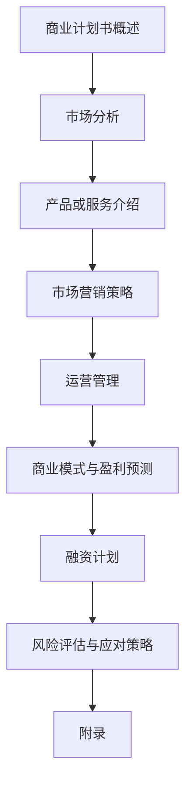

                 

# 程序员创业者的商业计划书：如何撰写吸引投资的方案

> 关键词：商业计划书、创业、投资、市场分析、运营策略、风险控制

> 摘要：本文旨在为程序员创业者提供撰写商业计划书的指导，帮助其撰写出具有吸引力、可行性的投资方案。文章从商业计划书的基础、市场分析、商业运营策略、投资方案与风险评估四个方面进行详细阐述，帮助创业者从技术角度深入思考商业问题，提高商业计划的完整性和吸引力。

## 《程序员创业者的商业计划书：如何撰写吸引投资的方案》目录大纲

### 第一部分：商业计划书基础

1. 商业计划书概述
    1.1 什么是商业计划书
    1.2 商业计划书的重要性
    1.3 商业计划书的目标和受众
    1.4 商业计划书的结构

2. 市场分析
    2.1 市场调研方法
    2.2 市场需求分析
    2.3 竞争分析
    2.4 目标市场定位

3. 产品或服务介绍
    3.1 产品或服务的定义
    3.2 产品或服务的独特性
    3.3 产品或服务的市场前景
    3.4 产品或服务的发展策略

### 第二部分：商业运营策略

4. 市场营销策略
    4.1 品牌建设
    4.2 市场推广渠道
    4.3 营销活动策划
    4.4 市场反馈与调整

5. 运营管理
    5.1 团队建设与管理
    5.2 财务管理
    5.3 供应链管理
    5.4 人力资源管理

6. 商模式与盈利预测
    6.1 商业模式概述
    6.2 盈利模式分析
    6.3 成本分析
    6.4 盈利预测

### 第三部分：投资方案与风险评估

7. 融资计划
    7.1 融资方式选择
    7.2 融资需求分析
    7.3 融资方案设计
    7.4 投资者关系管理

8. 风险评估与应对策略
    8.1 市场风险
    8.2 财务风险
    8.3 运营风险
    8.4 风险应对策略

### 第四部分：附录

9. 附录
    9.1 相关数据表格
    9.2 商业计划书范例
    9.3 投资建议书范例
    9.4 市场调研报告范例

## 附录A：Mermaid流程图

### 第一部分：商业计划书基础

#### 第1章：商业计划书概述

#### 1.1 什么是商业计划书

商业计划书是一份关于企业未来发展的书面文档，它涵盖了企业的发展目标、市场分析、产品或服务介绍、运营策略、投资方案和风险评估等内容。商业计划书不仅是创业者向潜在投资者展示项目的重要工具，也是企业内部管理的重要依据。

#### 1.2 商业计划书的重要性

商业计划书对于创业者来说具有多重重要性：

1. **明确发展方向**：商业计划书帮助创业者梳理企业的核心业务、发展方向和目标，使创业者更加明确企业的战略方向。
2. **吸引投资**：一份优秀的商业计划书能够吸引投资者的关注，提高融资的成功率。
3. **内部管理**：商业计划书是企业管理的重要文件，有助于企业内部各部门协同工作，提高管理效率。
4. **风险评估**：商业计划书通过对市场的调研和风险评估，有助于企业提前识别潜在风险，并制定相应的应对策略。

#### 1.3 商业计划书的目标和受众

商业计划书的目标是向投资者、合作伙伴、员工等受众展示企业的未来发展潜力，并获取他们的支持。具体受众包括：

1. **投资者**：投资者是商业计划书的主要受众，商业计划书需要清晰地展示企业的盈利模式、市场前景和风险控制措施，以吸引投资者的关注和投资。
2. **合作伙伴**：合作伙伴包括供应商、分销商等，商业计划书有助于他们了解企业的运营策略和市场需求，从而更好地进行合作。
3. **员工**：商业计划书有助于员工了解企业的发展目标、战略规划和市场状况，提高员工的凝聚力和积极性。

#### 1.4 商业计划书的结构

商业计划书一般包括以下几个部分：

1. **封面**：包括商业计划书的名称、编写日期、编写人员等信息。
2. **目录**：列出商业计划书各个章节的标题和页码，便于读者查阅。
3. **摘要**：简要概括商业计划书的主要内容，包括企业背景、目标、市场分析、运营策略、投资方案和风险评估等。
4. **企业概述**：介绍企业的基本情况，包括企业名称、成立时间、注册资本、组织架构等。
5. **市场分析**：分析市场现状、市场需求、竞争对手和目标市场等。
6. **产品或服务介绍**：详细介绍产品或服务的特点、市场前景和竞争优势。
7. **运营策略**：阐述企业的市场营销、运营管理、人力资源等方面的策略。
8. **商业模式与盈利预测**：介绍企业的商业模式、盈利模式、成本分析和盈利预测。
9. **融资计划**：说明企业的融资需求、融资方式和融资用途。
10. **风险评估与应对策略**：分析市场风险、财务风险和运营风险，并制定相应的应对策略。
11. **附录**：包括相关数据表格、商业计划书范例、投资建议书范例等。

#### 第2章：市场分析

#### 2.1 市场调研方法

市场调研是商业计划书的重要环节，通过市场调研，可以获取关于市场现状、需求、竞争对手等方面的信息。以下是几种常用的市场调研方法：

1. **问卷调查**：通过设计问卷，向目标客户群体收集相关信息。问卷调查可以收集大量的数据，但容易受到受访者主观意愿的影响。
2. **访谈**：通过与行业专家、潜在客户等进行面对面访谈，获取他们对市场的看法和意见。访谈可以深入了解受访者的真实想法，但成本较高。
3. **观察**：通过观察目标客户的行为和消费习惯，了解市场需求。观察法适用于对市场动态变化的实时监测。
4. **二手资料分析**：通过收集行业报告、市场调研报告等二手资料，分析市场趋势和竞争格局。二手资料分析可以节省时间成本，但数据来源可能不够权威。

#### 2.2 市场需求分析

市场需求分析是商业计划书的核心内容之一，通过分析市场需求，可以确定企业的目标客户群体和市场规模。以下是几种常用的市场需求分析方法：

1. **SWOT分析**：对企业的优势（Strengths）、劣势（Weaknesses）、机会（Opportunities）和威胁（Threats）进行综合分析，以确定企业的市场定位和发展策略。
2. **4P分析**：从产品（Product）、价格（Price）、促销（Promotion）、渠道（Place）四个方面分析市场需求，以制定相应的营销策略。
3. **市场规模分析**：通过统计和分析市场需求的数据，确定市场规模和潜在客户数量。市场规模分析可以为企业提供市场前景和投资回报的参考。
4. **用户画像**：通过收集和分析用户数据，绘制目标客户的用户画像，了解用户的特征和需求，为产品或服务的设计提供依据。

#### 2.3 竞争分析

竞争分析是商业计划书的重要环节，通过对竞争对手的分析，可以了解市场的竞争格局和自身在市场中的地位。以下是几种常用的竞争分析方法：

1. **五力分析**：从行业竞争者、潜在竞争者、供应商、分销商和消费者五个方面分析市场竞争力，以确定企业的竞争策略。
2. **竞争对手分析**：通过对竞争对手的产品、市场占有率、营销策略等方面的分析，了解竞争对手的优势和劣势，为自身的产品定位和市场策略提供参考。
3. **波特价值链分析**：通过分析竞争对手在价值链各个环节的表现，了解竞争对手的核心竞争力，为自身的产品设计和服务提供改进方向。
4. **市场定位分析**：根据竞争对手的市场定位，分析自身在市场中的定位和差异化策略，以提升市场竞争力。

#### 2.4 目标市场定位

目标市场定位是商业计划书的核心内容之一，通过明确目标市场，可以制定有针对性的市场营销策略。以下是几种常用的目标市场定位方法：

1. **细分市场定位**：根据市场特征和用户需求，将市场划分为多个细分市场，选择最具潜力的细分市场作为目标市场。
2. **集中市场定位**：选择一个或几个细分市场，集中资源和力量，针对这些细分市场进行市场开发和推广。
3. **差异化市场定位**：通过产品或服务的差异化，在目标市场中形成独特的竞争优势，提升品牌形象和市场地位。
4. **品牌定位**：根据企业的核心竞争力和品牌特色，进行品牌定位，以提升品牌知名度和市场认可度。

### 第二部分：商业运营策略

#### 第4章：市场营销策略

#### 4.1 品牌建设

品牌建设是市场营销策略的重要一环，通过建立强大的品牌形象，可以提高企业的市场认知度和竞争力。以下是几种常见的品牌建设策略：

1. **品牌定位**：根据企业的核心竞争力和目标市场，进行品牌定位，以明确品牌形象和品牌价值观。
2. **品牌传播**：通过广告、公关、社交媒体等多种渠道，进行品牌传播，提高品牌知名度和认知度。
3. **品牌体验**：通过产品和服务，为消费者提供良好的品牌体验，增强消费者对品牌的忠诚度。
4. **品牌管理**：建立品牌管理体系，对品牌形象、品牌传播和品牌体验进行持续管理，确保品牌形象的稳定性和一致性。

#### 4.2 市场推广渠道

市场推广渠道是市场营销策略的重要组成部分，通过选择合适的推广渠道，可以提升产品或服务的市场渗透率。以下是几种常见的市场推广渠道：

1. **线上渠道**：包括搜索引擎优化（SEO）、搜索引擎营销（SEM）、社交媒体营销、电子邮件营销等。
2. **线下渠道**：包括广告投放、展会、促销活动、合作伙伴推广等。
3. **渠道整合**：结合线上和线下渠道，实现渠道的整合和优化，提高市场推广效果。

#### 4.3 营销活动策划

营销活动策划是市场营销策略的具体实施手段，通过精心策划的营销活动，可以提升品牌知名度、吸引潜在客户、促进销售。以下是几种常见的营销活动策划方法：

1. **品牌推广活动**：通过举办品牌发布会、新品发布会等活动，提升品牌知名度和美誉度。
2. **促销活动**：通过限时折扣、赠品、积分兑换等活动，刺激消费者购买欲望。
3. **公益活动**：通过参与公益活动，提升企业社会责任感和品牌形象。
4. **线上线下联动**：结合线上和线下的营销活动，实现渠道的互补和协同效应。

#### 4.4 市场反馈与调整

市场反馈是市场营销策略的重要依据，通过收集和分析市场反馈，可以及时了解市场变化和消费者需求，为营销策略的调整提供依据。以下是几种常见的方法：

1. **用户调研**：通过问卷调查、用户访谈等方式，了解用户对产品或服务的满意度、需求和期望。
2. **销售数据**：通过销售数据，分析市场趋势和消费者行为，为营销策略的调整提供依据。
3. **市场监控**：通过搜索引擎、社交媒体等渠道，实时监控市场动态和消费者反馈，及时调整营销策略。

### 第5章：运营管理

#### 5.1 团队建设与管理

团队建设是运营管理的重要一环，通过有效的团队建设和管理，可以提升团队的凝聚力和执行力。以下是几种常见的团队建设和管理方法：

1. **明确目标**：为团队设定明确的目标和愿景，确保团队方向一致、共同努力。
2. **激励机制**：建立合理的激励机制，激发团队成员的积极性和创造力。
3. **培训与发展**：提供团队成员培训和职业发展机会，提升团队整体素质和能力。
4. **沟通与协作**：建立良好的沟通渠道和协作机制，促进团队成员之间的沟通和协作。

#### 5.2 财务管理

财务管理是企业运营管理的重要方面，通过有效的财务管理，可以确保企业财务状况的健康和稳定。以下是几种常见的财务管理方法：

1. **预算管理**：制定合理的预算计划，控制成本和费用支出。
2. **成本控制**：通过优化流程、提高效率等方式，降低成本和费用支出。
3. **资金管理**：确保企业资金的安全和有效利用，合理规划资金收支。
4. **财务分析**：通过财务分析，了解企业的盈利能力、偿债能力和经营效率，为决策提供依据。

#### 5.3 供应链管理

供应链管理是运营管理的重要一环，通过有效的供应链管理，可以确保企业的生产和运营顺利进行。以下是几种常见的供应链管理方法：

1. **供应商管理**：选择合适的供应商，建立稳定的合作关系，确保供应商按时交付优质原材料或产品。
2. **库存管理**：合理规划库存水平，避免库存积压或不足，确保生产和销售的稳定。
3. **物流管理**：优化物流流程，提高物流效率，降低物流成本。
4. **质量管理**：建立质量管理体系，确保产品或服务的质量符合标准和客户需求。

#### 5.4 人力资源管理

人力资源管理是企业运营管理的关键，通过有效的人力资源管理，可以提升企业核心竞争力。以下是几种常见的人力资源管理方法：

1. **招聘与选拔**：通过科学的招聘方法和选拔标准，选拔合适的员工，确保企业的人才储备。
2. **培训与发展**：为员工提供培训和发展机会，提升员工素质和能力。
3. **绩效管理**：建立合理的绩效管理体系，激励员工积极工作，提升团队绩效。
4. **薪酬福利**：制定合理的薪酬福利政策，确保员工薪酬公平、合理，提高员工满意度和忠诚度。

### 第6章：商业模式与盈利预测

#### 6.1 商业模式概述

商业模式是企业通过提供产品或服务，实现盈利和价值创造的方式。一个成功的商业模式应该具有以下特征：

1. **价值主张**：明确企业的核心价值和主张，为顾客提供独特而有吸引力的价值。
2. **盈利模式**：明确企业的盈利方式，如销售收入、广告收入、服务费等。
3. **关键资源**：明确企业所拥有的关键资源，如技术、品牌、人才、渠道等。
4. **关键活动**：明确企业所进行的关键活动，如产品研发、市场推广、客户服务等。
5. **客户关系**：明确企业与客户的关系，如销售关系、服务关系等。

#### 6.2 盈利模式分析

盈利模式是企业实现盈利和价值创造的具体方式。以下是几种常见的盈利模式：

1. **产品销售**：通过销售产品实现盈利，如传统的制造业、零售业等。
2. **广告收入**：通过广告收入实现盈利，如媒体、互联网公司等。
3. **服务收费**：通过提供服务实现盈利，如专业咨询、金融服务等。
4. **平台收费**：通过平台服务收费实现盈利，如电商平台、共享经济平台等。
5. **订阅收费**：通过订阅服务实现盈利，如内容平台、软件服务等。

#### 6.3 成本分析

成本分析是商业计划书的重要组成部分，通过对成本的分析和预测，可以帮助企业制定合理的价格策略和盈利目标。以下是几种常见的成本分析方法：

1. **固定成本**：包括租金、设备购置、员工工资等，不随生产规模的变化而变化。
2. **可变成本**：包括原材料、生产成本、物流成本等，随生产规模的变化而变化。
3. **边际成本**：指生产一个额外产品或服务所需的成本，是制定价格策略的重要依据。
4. **总成本**：固定成本和可变成本的总和，是制定预算和盈利预测的重要依据。

#### 6.4 盈利预测

盈利预测是商业计划书的重要组成部分，通过对未来盈利的预测，可以帮助企业制定合理的发展策略和融资计划。以下是几种常见的盈利预测方法：

1. **基于历史的预测**：通过对历史数据的分析和预测，预测未来盈利水平。
2. **基于竞争的预测**：通过分析竞争对手的盈利水平，预测未来盈利水平。
3. **基于行业的预测**：通过对行业趋势和市场的分析，预测未来盈利水平。
4. **基于模型的预测**：通过建立数学模型，预测未来盈利水平。

### 第三部分：投资方案与风险评估

#### 第7章：融资计划

#### 7.1 融资方式选择

融资方式选择是商业计划书的重要组成部分，根据企业的实际情况和融资需求，选择合适的融资方式。以下是几种常见的融资方式：

1. **股权融资**：通过出售股份获得资金，如风险投资、天使投资等。
2. **债务融资**：通过借款获得资金，如银行贷款、债券等。
3. **内部融资**：通过企业自身的利润留存和资本运作获得资金。
4. **外部融资**：通过对外合作、收购等方式获得资金。

#### 7.2 融资需求分析

融资需求分析是商业计划书的重要组成部分，通过对企业资金需求的预测和分析，确定融资的具体需求。以下是几种常见的融资需求分析方法：

1. **运营资金需求**：分析企业的日常运营所需资金，包括人员工资、租金、设备购置等。
2. **项目资金需求**：分析企业项目投资所需资金，包括项目研发、市场推广等。
3. **扩张资金需求**：分析企业扩张所需资金，包括收购、新建生产线等。
4. **应急资金需求**：分析企业应对突发事件所需资金，如市场波动、竞争压力等。

#### 7.3 融资方案设计

融资方案设计是商业计划书的重要组成部分，根据融资需求和融资方式，设计具体的融资方案。以下是几种常见的融资方案设计方法：

1. **股权融资方案**：包括股份比例、融资额度、融资方式等。
2. **债务融资方案**：包括借款金额、还款期限、利率等。
3. **内部融资方案**：包括利润留存、资本运作等。
4. **外部融资方案**：包括对外合作、收购等。

#### 7.4 投资者关系管理

投资者关系管理是商业计划书的重要组成部分，通过有效的投资者关系管理，可以提升企业的形象和融资能力。以下是几种常见的投资者关系管理方法：

1. **信息披露**：及时、准确地披露企业信息，提高投资者对企业的信任度。
2. **沟通与交流**：与投资者建立良好的沟通和交流渠道，及时回应投资者关切。
3. **股东关系管理**：建立良好的股东关系，维护股东权益，提高股东满意度。
4. **投资者关系活动**：举办投资者见面会、业绩说明会等活动，增强投资者对企业的了解。

### 第8章：风险评估与应对策略

#### 8.1 市场风险

市场风险是指由于市场变化导致企业盈利能力下降或投资损失的风险。以下是几种常见的市场风险：

1. **市场竞争加剧**：由于市场竞争加剧，导致产品或服务价格下降，盈利能力下降。
2. **市场需求下降**：由于市场需求下降，导致产品或服务销售不畅，盈利能力下降。
3. **行业法规变化**：由于行业法规变化，导致企业运营受到影响，盈利能力下降。
4. **行业周期波动**：由于行业周期波动，导致企业盈利能力不稳定。

#### 8.2 财务风险

财务风险是指由于财务状况不佳导致企业无法按时偿还债务或盈利能力下降的风险。以下是几种常见的财务风险：

1. **资金链断裂**：由于资金链断裂，导致企业无法正常运营。
2. **债务违约**：由于债务违约，导致企业声誉受损，融资能力下降。
3. **财务报表失真**：由于财务报表失真，导致投资者失去信任，融资能力下降。
4. **利润波动**：由于利润波动，导致企业财务状况不稳定。

#### 8.3 运营风险

运营风险是指由于企业运营问题导致企业盈利能力下降或投资损失的风险。以下是几种常见的运营风险：

1. **供应链中断**：由于供应链中断，导致企业生产受阻，盈利能力下降。
2. **技术风险**：由于技术风险，导致产品或服务质量不稳定，盈利能力下降。
3. **管理风险**：由于管理风险，导致企业运营效率低下，盈利能力下降。
4. **人力资源风险**：由于人力资源风险，导致企业人才流失，盈利能力下降。

#### 8.4 风险应对策略

风险应对策略是指企业应对各种风险的具体措施。以下是几种常见风险应对策略：

1. **风险预防**：通过建立风险管理体系，制定风险管理政策，预防风险的发生。
2. **风险分散**：通过多元化投资、分散业务风险，降低企业整体风险。
3. **风险控制**：通过建立内部控制制度，降低风险发生的概率和影响。
4. **风险转移**：通过购买保险、签订风险合同等方式，将风险转移给第三方。

### 第四部分：附录

#### 第9章：附录

#### 9.1 相关数据表格

附录中的相关数据表格包括市场调研数据、财务数据、成本分析数据等，用于支持商业计划书的各项分析和预测。

#### 9.2 商业计划书范例

附录中的商业计划书范例用于提供商业计划书撰写的参考，包括各个章节的结构和内容。

#### 9.3 投资建议书范例

附录中的投资建议书范例用于提供投资建议书的撰写参考，包括投资项目的分析、投资建议和风险评估等内容。

#### 9.4 市场调研报告范例

附录中的市场调研报告范例用于提供市场调研报告的撰写参考，包括市场分析、竞争分析和用户需求分析等内容。

### 附录A：Mermaid流程图

### 作者信息

作者：AI天才研究院/AI Genius Institute & 禅与计算机程序设计艺术 /Zen And The Art of Computer Programming

### 结束语

商业计划书是程序员创业者向投资者展示项目的重要工具，通过撰写一份详细、有深度的商业计划书，可以提升项目的吸引力，提高融资成功率。本文从商业计划书的基础、市场分析、商业运营策略、投资方案与风险评估四个方面进行了详细阐述，帮助程序员创业者更好地撰写商业计划书，为创业成功奠定基础。在撰写商业计划书时，创业者需要从技术角度深入思考商业问题，结合实际情况，进行详细的分析和预测，以确保商业计划书的完整性和可行性。同时，创业者还需要不断学习和积累经验，提高自身商业素养，以应对创业过程中的各种挑战。

在撰写商业计划书的过程中，创业者可以参考本文提供的方法和思路，结合自己的实际情况进行修改和完善。希望本文能够为程序员创业者提供有益的指导，帮助他们成功撰写出一份具有吸引力的商业计划书，实现创业梦想。同时，也祝愿所有的创业者能够在创业的道路上越走越远，取得更大的成就！

