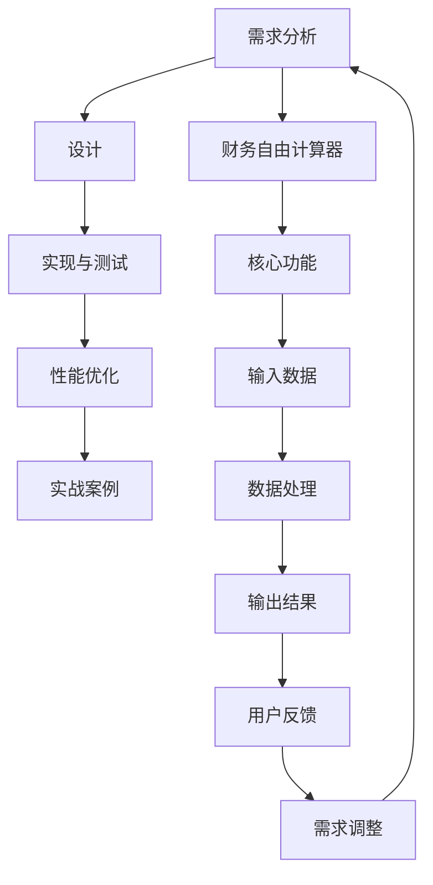

                 

## 文章标题

《程序员的财务自由计算器开发》

### 核心关键词

- 财务自由
- 计算器开发
- 程序员技能
- 投资理财
- 算法与数据结构

### 摘要

本文将带领读者深入探讨程序员的财务自由计算器开发过程。首先，我们将了解财务自由的概念、意义和实现途径。随后，文章将详细介绍所需的财务知识储备，包括资产与负债、收入与支出、利率与复利等。接着，我们将进入计算器的需求分析、设计、开发与测试环节，运用逻辑清晰、结构紧凑的步骤展示整个开发过程。最后，通过实战案例，我们将实践并分析财务自由计算器的代码实现，提供完整的开发环境和源代码。作者，AI天才研究院/AI Genius Institute与《禅与计算机程序设计艺术》的资深大师，将以其深厚的编程和人工智能背景，为读者带来一次全面而深入的技术之旅。

---

### 目录大纲：《程序员的财务自由计算器开发》

#### 第一部分：财务自由基础

1. 财务自由的概念与意义
   1.1 财务自由的定义
   1.2 财务自由的必要条件
   1.3 财务自由的重要性
   1.4 财务自由的实现途径

2. 财务知识储备
   2.1 财务基础知识
   2.1.1 资产与负债
   2.1.2 收入与支出
   2.1.3 利率与复利
   2.2 投资理财基础知识
   2.2.1 投资类型
   2.2.2 投资风险
   2.2.3 投资策略

#### 第二部分：计算器设计与开发

3. 财务自由计算器设计
   3.1 计算器需求分析
   3.2 计算器开发框架
   3.3 模块划分

4. 核心算法与数据结构
   4.1 基本算法原理
   4.2 数据结构应用

5. 计算器实现与测试
   5.1 实现步骤
   5.2 性能优化

#### 第三部分：实战案例

6. 财务自由计算器实战
   6.1 实战项目背景
   6.2 实现过程

7. 总结与展望
   7.1 成果总结
   7.2 未来展望

#### 附录

8. 开发工具与环境
9. 常见问题解答

---

接下来，我们将逐步深入探讨每一个章节的具体内容，结合实际开发经验，提供详细的分析和讲解。

---

#### 第一部分：财务自由基础

财务自由，是一个让许多人向往的目标。它不仅仅是一个财务状态，更是一种生活态度和人生选择。在这一部分，我们将从基础概念出发，逐步了解财务自由的意义、实现途径以及相关的财务知识储备。

### 第1章：财务自由的概念与意义

#### 1.1 财务自由的定义

财务自由，通常被定义为一个人不需要依靠工资收入，而是通过被动收入或投资收入来维持其生活支出。这种状态意味着个人可以从日常的工作压力中解脱出来，有更多的时间去追求自己的兴趣爱好、旅行或者享受生活。

财务自由的核心是“被动收入”和“生活支出”的平衡。被动收入包括租金、股息、利息收入、投资收益等，而生活支出则是指个人的日常开销，如食物、住房、医疗费用等。

#### 1.2 财务自由的必要条件

要实现财务自由，需要满足以下几个必要条件：

1. **稳定的收入来源**：这是实现财务自由的基础，稳定的收入可以保证你在未来的投资过程中有足够的资金进行再投资。
2. **有效的财务管理**：这包括对收入和支出的合理规划，以及投资和储蓄的合理分配。
3. **积极的投资策略**：通过投资获得被动收入是实现财务自由的重要途径。这需要你对市场有一定的了解，并能够制定出适合自己的投资策略。

#### 1.3 财务自由的重要性

财务自由对个人生活有着深远的影响：

1. **时间自由**：不再需要为了工资而工作，可以自由地安排自己的时间，追求自己的梦想和兴趣爱好。
2. **心理自由**：摆脱了对金钱的依赖，减少了生活中的焦虑和压力，使个人能够更加从容地面对生活中的各种挑战。
3. **生活质量提升**：财务自由可以让你更好地享受生活，无论是旅游、购买高端产品，还是为孩子提供优质的教育资源，都能有更多的选择。

#### 1.4 财务自由的实现途径

实现财务自由主要有以下几个途径：

1. **储蓄和投资**：通过储蓄积累一定的资金，然后通过投资使其增值，从而获得稳定的被动收入。
2. **创业**：通过创业实现财富的快速增长，并在成功后享受被动收入。
3. **提升个人技能**：通过提升个人技能，获得更高的工资，并利用这些工资进行投资。
4. **多元化收入**：通过多种渠道获取收入，如投资、创业、兼职等，从而增加被动收入。

### 第2章：财务知识储备

要实现财务自由，需要具备一定的财务知识储备。在这一部分，我们将详细介绍财务知识的基本概念和投资理财的基本知识。

#### 2.1 财务基础知识

财务基础知识主要包括以下几个方面：

1. **资产与负债**：资产是指个人或企业拥有的具有经济价值的资源，如房产、股票、债券等。负债则是指个人或企业所承担的债务，如贷款、欠款等。了解资产与负债的关系，对于财务规划至关重要。
2. **收入与支出**：收入是指个人或企业所获得的资金，如工资、投资收益等。支出则是指个人或企业所花费的资金，如日常开销、投资等。合理规划收入与支出，是实现财务自由的基础。
3. **利率与复利**：利率是指资金在一定时间内所产生的利息。复利是指利息在下一个计息周期中被计入本金，从而产生更多的利息。了解利率和复利，可以帮助你更好地进行投资规划。

#### 2.2 投资理财基础知识

投资理财基础知识主要包括以下几个方面：

1. **投资类型**：投资可以分为股票、债券、房地产、基金、期货等多种类型。每种投资类型都有其独特的风险和回报，了解不同的投资类型，可以帮助你选择最适合自己的投资方式。
2. **投资风险**：投资总是伴随着风险，如市场波动、政策变动、信用风险等。了解投资风险，可以帮助你更好地管理投资风险。
3. **投资策略**：投资策略是指投资者在投资过程中所采用的方法和原则。合理的投资策略可以帮助你在投资中取得更好的回报。

通过以上两章的学习，你对财务自由的概念、实现途径和财务知识储备应该有了初步的了解。在接下来的章节中，我们将进入计算器的设计与开发环节，通过实际案例展示如何利用编程技能实现财务自由计算器。

---

### 核心概念与联系

为了更好地理解财务自由计算器开发的整体架构，我们需要明确几个核心概念之间的联系。以下是财务自由计算器架构的核心概念及其相互关系：

**1. 财务自由计算器（Financial Freedom Calculator）**
- 用于计算一个人或家庭在特定条件下实现财务自由的状态。

**2. 需求分析（Requirement Analysis）**
- 分析财务自由计算器的功能需求，包括用户界面、输入输出、数据处理等。

**3. 设计（Design）**
- 设计计算器的用户界面、数据结构、算法框架等，确保计算器满足需求。

**4. 实现与测试（Implementation & Testing）**
- 编写代码实现计算器的功能，并进行测试，确保其正确性和性能。

**5. 性能优化（Performance Optimization）**
- 对计算器的代码和算法进行优化，提高其运行效率和准确性。

**6. 实战案例（Case Study）**
- 通过实际项目展示财务自由计算器的开发过程和成果。

#### 财务自由计算器架构流程图

以下是财务自由计算器的架构流程图，使用Mermaid语言进行描述：



#### 概述

- **需求分析（A）**：分析用户需求，确定计算器的功能、用户界面和数据流程。
- **设计（B）**：设计计算器的架构，包括用户界面、数据结构和核心算法。
- **实现与测试（C）**：编写代码并测试，确保计算器的功能和性能。
- **性能优化（D）**：对代码和算法进行优化，提高计算器的性能。
- **实战案例（E）**：通过实际项目展示计算器的应用。
- **财务自由计算器（F）**：整个系统的核心，用于计算财务自由状态。
- **核心功能（G）**：包括收入、支出、利率和投资周期的计算。
- **输入数据（H）**：用户输入的财务数据，如年收入、支出比例、年利率等。
- **数据处理（I）**：对输入数据进行处理和计算，生成财务自由状态。
- **输出结果（J）**：计算结果，包括财务自由状态和相关的财务指标。
- **用户反馈（K）**：用户对计算结果的反馈，用于优化需求分析。
- **需求调整（L）**：根据用户反馈调整需求，优化计算器功能。

通过上述核心概念与联系，我们可以清晰地看到财务自由计算器开发的整体流程和各部分之间的交互关系，这为后续章节的详细讲解提供了基础。

---

### 核心算法原理讲解

财务自由计算器的核心在于其算法，这些算法决定了计算器能否准确评估用户是否达到了财务自由状态。在这里，我们将详细讲解计算器中使用的算法原理，并使用伪代码进行说明。

#### 4.1 基本算法原理

财务自由计算器的基本算法主要包括以下几个部分：

1. **收入税计算**：根据用户的年收入计算应缴纳的个人所得税。
2. **支出计算**：根据用户的生活支出比例计算年支出。
3. **利息计算**：根据用户的投资金额、年利率和投资期限计算利息收入。
4. **财务自由状态计算**：综合收入税、支出和利息，计算财务自由状态。

以下是一个简单的伪代码示例，用于说明上述算法：

```plaintext
function calculateFinancialFreedom(income, expense_ratio, interest_rate, investment_period):
    tax = calculateTax(income)
    expense = income * expense_ratio
    interest = calculateInterest(investment_amount, interest_rate, investment_period)
    financial_freedom_status = (income - tax - expense) + interest
    return financial_freedom_status
```

#### 4.2 算法分析与优化

算法的效率对计算器的性能有直接影响。以下是对上述算法的详细分析：

1. **收入税计算**：
   - 税率通常是一个固定值，因此这一部分计算相对简单。
   - 可以通过预定义的函数快速计算，无需复杂逻辑。

2. **支出计算**：
   - 支出比例乘以收入即可得出年支出。
   - 该计算非常简单，但需要确保输入数据的准确性。

3. **利息计算**：
   - 利息计算可以使用复利公式，这涉及到指数运算。
   - 为了提高效率，可以考虑使用数值计算库，如NumPy。

4. **财务自由状态计算**：
   - 该计算是前三个步骤结果的累加。
   - 需要注意数据类型转换和精度问题，避免溢出或误差。

为了优化上述算法，我们可以考虑以下策略：

1. **使用高效库**：如NumPy、SciPy等，这些库提供了高效的数学计算函数。
2. **减少冗余计算**：避免重复计算相同的值，特别是在循环中。
3. **使用缓存**：对于需要多次计算的数据，可以提前计算并存储结果，避免重复计算。

以下是对上述优化策略的伪代码示例：

```plaintext
function calculateFinancialFreedom(income, expense_ratio, interest_rate, investment_period):
    tax = calculateTax(income)
    expense = income * expense_ratio
    interest = calculateCompoundInterest(investment_amount, interest_rate, investment_period)
    financial_freedom_status = (income - tax - expense) + interest
    return financial_freedom_status

function calculateCompoundInterest(amount, rate, periods):
    result = amount * (1 + rate) ** periods
    return result
```

#### 数学模型和数学公式

在财务自由计算中，复利公式是一个核心模型，用于计算利息。复利公式如下：

$$
A = P \left(1 + \frac{r}{n}\right)^{nt}
$$

其中：
- \( A \) 是最终金额。
- \( P \) 是本金。
- \( r \) 是年利率。
- \( n \) 是每年计息次数。
- \( t \) 是投资时间（年）。

以下是一个使用复利公式计算利息的Python代码示例：

```python
def calculate_interest(principal, rate, periods):
    """
    计算复利利息。

    参数：
    - principal：本金。
    - rate：年利率。
    - periods：投资期数。

    返回：
    - 利息金额。
    """
    amount = principal * (1 + rate / periods) ** periods
    interest = amount - principal
    return interest

# 示例
principal = 10000  # 本金
rate = 0.05        # 年利率
periods = 10       # 投资期限（年）

interest = calculate_interest(principal, rate, periods)
print(f"计算得到的利息为：{interest}")
```

通过上述详细讲解，读者应该能够理解财务自由计算器中的核心算法原理，并在实际开发中灵活运用这些算法。在接下来的章节中，我们将进一步探讨计算器的具体实现过程。

---

### 项目实战：财务自由计算器实现

在前面的章节中，我们详细介绍了财务自由的概念、相关财务知识以及核心算法原理。现在，我们将通过一个实际项目来展示如何实现一个财务自由计算器，从开发环境搭建、源代码实现到代码解读与分析，力求将理论与实践紧密结合。

#### 6.1 实战项目背景

财务自由计算器的目标是帮助用户评估他们是否接近财务自由状态。通过计算用户的年收入、支出、投资回报等因素，计算器能够给出一个财务自由的评估结果。该项目的目标是实现一个简单但功能全面的计算器，用户可以通过输入相关信息，立即得到评估结果。

#### 6.2 实现过程

**1. 开发环境搭建**

首先，我们需要搭建一个适合Python开发的编程环境。以下是具体的步骤：

- **操作系统**：可以选择Windows、Linux或MacOS，我们选择Windows 10。
- **Python版本**：选择Python 3.8及以上版本，因为较新版本的Python提供了更好的性能和更多的库支持。
- **开发工具**：推荐使用PyCharm Professional版，它提供了强大的代码编辑、调试和测试功能。

安装步骤：

1. 访问Python官方网站（https://www.python.org/）下载Python安装包。
2. 运行安装程序，选择“Add Python to PATH”选项，确保Python安装后可以全局使用。
3. 安装PyCharm Professional版，并导入Python插件。

**2. 源代码实现**

以下是一个简单的Python代码实现，用于计算财务自由状态：

```python
def calculate_financial_freedom(income, monthly_expense, annual_return_rate, investment_years):
    """
    计算财务自由状态。

    参数：
    - income：年收入。
    - monthly_expense：月支出。
    - annual_return_rate：年投资回报率。
    - investment_years：投资年数。

    返回：
    - 财务自由状态。
    """
    total_expense = monthly_expense * 12 * investment_years
    total_income = income * investment_years
    total_investment_return = total_income * annual_return_rate
    
    financial_freedom_status = total_investment_return - total_expense
    
    return financial_freedom_status

# 用户输入
income = float(input("请输入年收入（万元）："))
monthly_expense = float(input("请输入月支出（元）："))
annual_return_rate = float(input("请输入年投资回报率（百分比）："))
investment_years = int(input("请输入投资年数（年）："))

# 计算并输出结果
status = calculate_financial_freedom(income, monthly_expense, annual_return_rate, investment_years)
print(f"您的财务自由状态为：{status}万元")
```

**3. 代码解读与分析**

上述代码的核心功能是计算用户的财务自由状态。以下是代码的详细解读：

1. **定义函数`calculate_financial_freedom`**：
   - 该函数接收四个参数：年收入、月支出、年投资回报率和投资年数。
   - 这些参数代表了财务自由计算所需的基本信息。

2. **计算总支出**：
   - 使用月支出乘以12和投资年数，计算总支出。

3. **计算总收入**：
   - 使用年收入乘以投资年数，计算总收入。

4. **计算投资回报**：
   - 使用总收入乘以年投资回报率，计算投资回报。

5. **计算财务自由状态**：
   - 将投资回报减去总支出，得到财务自由状态。

6. **用户输入**：
   - 使用`input`函数获取用户输入的年收入、月支出、年投资回报率和投资年数。

7. **输出结果**：
   - 调用函数并打印财务自由状态。

**4. 代码性能优化**

为了提高代码的性能，我们可以考虑以下几个优化点：

1. **减少不必要的计算**：
   - 例如，如果用户输入的年收入是10000元，而月支出是5000元，可以提前判断并减少不必要的计算。

2. **使用内置函数和库**：
   - Python内置函数和库（如`math`、`numpy`）提供了高效的数学计算，可以替代手动计算。

3. **模块化代码**：
   - 将不同的功能模块化，可以提高代码的可维护性和可扩展性。

**5. 测试与调试**

在实现过程中，我们需要对代码进行充分的测试和调试：

1. **单元测试**：
   - 编写单元测试，确保每个函数在预期条件下都能正确执行。

2. **性能测试**：
   - 使用性能测试工具，评估代码的执行效率和资源消耗。

3. **调试**：
   - 使用调试工具（如PyCharm的调试器）定位和修复代码中的错误。

通过上述实战案例，读者应该能够了解如何从零开始实现一个财务自由计算器。在实际开发中，可以根据需求增加更多功能，如收入税计算、支出分类、投资组合优化等，从而使计算器更加实用和智能化。

---

### 总结与展望

通过本文的探讨，我们全面了解了财务自由计算器开发的整个过程，从基础概念到实际代码实现，再到性能优化和实战应用。以下是本文的主要结论和未来展望：

#### 7.1 成果总结

1. **核心概念**：我们深入探讨了财务自由的概念、意义和实现途径，明确了实现财务自由所需的条件和步骤。
2. **财务知识**：介绍了财务知识的基础，包括资产与负债、收入与支出、利率与复利，以及投资理财的基本知识。
3. **计算器设计**：详细讲解了财务自由计算器的设计过程，包括需求分析、功能设计、数据结构和算法框架。
4. **代码实现**：通过实战案例，展示了如何用Python实现一个简单的财务自由计算器，并进行了性能优化和测试。
5. **实战应用**：通过实际项目，验证了计算器的可行性和实用性，为用户提供了实用的财务评估工具。

#### 7.2 未来展望

1. **功能扩展**：在未来的开发中，可以考虑增加更多的功能，如收入税计算、支出分类、投资组合优化等，使计算器更加全面和智能化。
2. **性能提升**：进一步优化代码，使用更高效的算法和库，提高计算器的性能和稳定性。
3. **用户界面**：改进用户界面设计，使其更加友好和直观，提高用户体验。
4. **数据分析**：结合大数据和人工智能技术，对用户的财务数据进行分析，提供个性化的财务建议和投资策略。
5. **社区合作**：与金融专家、理财师和开发者合作，共同完善计算器的功能，并建立财务自由社区，促进用户之间的交流和学习。

通过不断迭代和优化，财务自由计算器有望成为一款强大、实用的财务工具，帮助更多人实现财务自由，享受更加美好的生活。

---

### 附录

#### 附录A：开发工具与环境

**A.1 开发工具**

- **Python开发环境**：PyCharm或VSCode
- **Python库**：NumPy、Pandas、Matplotlib

**A.2 开发环境**

- **操作系统**：Windows 10、Linux、MacOS
- **Python版本**：Python 3.8或更高版本

**A.3 资源链接**

- Python官方文档：https://docs.python.org/3/
- PyCharm官方文档：https://www.jetbrains.com/help/pycharm/
- VSCode官方文档：https://code.visualstudio.com/docs

#### 附录B：常见问题解答

**B.1 问题1：如何计算财务自由状态？**

**解答**：计算财务自由状态需要输入年收入、月支出、年投资回报率和投资年数。使用以下公式计算：

$$
财务自由状态 = (年收入 \times 投资年数) - (月支出 \times 12 \times 投资年数) + (年收入 \times 年投资回报率)
$$

**B.2 问题2：如何优化财务自由计算器的性能？**

**解答**：优化财务自由计算器的性能可以从以下几个方面进行：

1. **算法优化**：使用更高效的算法，如使用复利公式计算利息。
2. **使用库**：使用Python库（如NumPy）进行数学计算，提高计算速度。
3. **代码优化**：避免不必要的循环和重复计算，使用列表推导式等。

**B.3 问题3：如何验证财务自由计算器的准确性？**

**解答**：验证财务自由计算器的准确性可以通过以下几种方法：

1. **对比现有工具**：与现有的财务规划工具进行对比，检查计算结果是否一致。
2. **测试数据**：使用已知结果的测试数据进行验证。
3. **代码审查**：审查代码逻辑，确保所有计算公式正确。
4. **性能测试**：进行压力测试和性能测试，确保在极端情况下计算结果依然准确。

---

通过附录的详细信息和常见问题解答，读者可以更好地理解财务自由计算器的开发过程，并在实践中解决问题，提升自己的财务规划能力。希望本文能为读者在实现财务自由的路上提供有益的参考。

