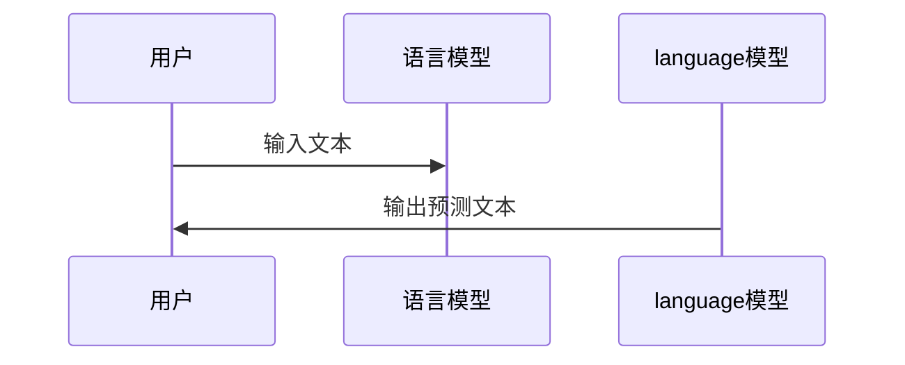

                 

## 文章标题

> **关键词：** 语言模型，无限指令集，边缘计算，实时性优化，未来发展趋势

> **摘要：** 本文将深入探讨大型语言模型（LLM）的无限指令集，分析其概念、实现方法、优势，以及在实际应用中的挑战与解决方案。同时，我们还将探讨LLM在边缘计算和实时性优化方面的应用，并展望其未来发展趋势。通过一系列的实战项目和代码解析，读者将能够更好地理解LLM的核心技术，并在实际开发中加以应用。

### 《突破界限：LLM的无限指令集》目录大纲

---

## 第一部分: LLM的基础知识

### 第1章: 语言模型的基本概念

#### 1.1 什么是语言模型

语言模型是自然语言处理（NLP）中的一个核心概念，它旨在通过统计方法或深度学习模型来模拟人类语言的使用。简单来说，语言模型是一种能够预测下一个单词或字符的概率的算法。

#### 1.2 语言模型的历史与发展

语言模型的发展可以追溯到20世纪50年代。最初，语言模型主要是基于规则的方法，如n-gram模型。随着计算能力和算法的进步，从20世纪80年代开始，基于统计的方法逐渐成为主流。到了21世纪，深度学习模型如循环神经网络（RNN）和Transformer模型的出现，使得语言模型的性能得到了大幅提升。

#### 1.3 语言模型的应用领域

语言模型在多个领域有着广泛的应用，包括但不限于：

- 自然语言处理：如文本分类、情感分析、命名实体识别等。
- 机器翻译：将一种语言的文本翻译成另一种语言。
- 语音识别：将语音信号转换为文本。
- 问答系统：根据用户的问题提供答案。

## 第2章: 语言模型的架构

### 2.1 语言模型的组成

一个典型的语言模型主要由以下几部分组成：

- 输入层：接收文本数据，进行预处理，如分词、标记化等。
- 嵌入层：将文本转换为密集向量表示。
- 隐藏层：进行复杂的计算，如注意力机制、序列建模等。
- 输出层：生成预测结果，如下一个单词、标签等。

### 2.2 语言模型的关键算法

语言模型的关键算法包括：

- 词嵌入：将单词映射到高维空间中的向量。
- 序列模型：如RNN、LSTM等，用于处理序列数据。
- 注意力机制：用于提高模型在序列数据上的建模能力。
- Transformer模型：一个基于自注意力机制的模型，是当前语言模型的主流架构。

### 2.3 语言模型的训练方法

语言模型的训练方法主要包括：

- 有监督训练：使用标注好的数据集进行训练。
- 无监督训练：使用未标注的数据集进行训练，如预训练加微调。
- 自监督训练：通过自我监督的方式，如预测下一个单词，进行训练。

## 第3章: LLM的核心算法

### 3.1 词嵌入技术

词嵌入是将单词映射到高维空间中的向量表示的技术。常见的词嵌入方法包括：

- n-gram模型：基于单词的n元组进行建模。
- Word2Vec：基于神经网络的方法，通过训练得到单词的向量表示。
- GloVe：基于全局上下文信息的词嵌入方法。

### 3.2 序列模型与注意力机制

序列模型如RNN、LSTM等，能够处理序列数据。注意力机制是序列模型中的一个重要组成部分，它能够提高模型在序列数据上的建模能力。

- RNN：循环神经网络，能够记忆序列中的信息。
- LSTM：长短时记忆网络，解决了RNN在长序列上的梯度消失问题。
- 注意力机制：通过加权的方式，使得模型能够关注到序列中的重要信息。

### 3.3 转换器架构详解

转换器（Transformer）模型是一个基于自注意力机制的模型，它在多个任务上都取得了很好的性能。转换器模型的主要组成部分包括：

- 自注意力机制：通过计算序列中每个元素之间的相似度，进行建模。
- 编码器和解码器：编码器用于将输入序列转换为上下文表示，解码器用于生成输出序列。
- 前馈网络：在编码器和解码器中，用于增加模型的非线性能力。

## 第4章: LLM的数学模型与公式

### 4.1 概率论基础

语言模型的数学基础是概率论。概率论中的基本概念如概率分布、条件概率、最大似然估计等，都是语言模型中的重要工具。

- 概率分布：用于描述随机变量的可能取值及其概率。
- 条件概率：描述在某个条件下，另一个随机变量的概率。
- 最大似然估计：用于估计模型参数。

### 4.2 信息论基础

信息论是研究信息传递和处理的一门学科。在语言模型中，信息论的基本概念如熵、信息增益等，都是用于评估模型性能的重要工具。

- 熵：表示信息的随机性程度。
- 信息增益：用于评估特征对分类的重要程度。

### 4.3 优化算法基础

优化算法用于最小化模型的损失函数，从而提高模型的性能。常见的优化算法包括：

- 梯度下降：一种最简单的优化算法，通过更新模型参数，使得损失函数逐渐减小。
- 随机梯度下降：在梯度下降的基础上，引入随机性，提高优化效果。
- Adam优化器：一种结合了 Momentum 和 RMSProp 优点的优化算法。

## 第5章: LLM的实际应用

### 5.1 自然语言处理应用

自然语言处理（NLP）是语言模型最重要的应用领域之一。在NLP中，语言模型可以用于：

- 文本分类：将文本分类到不同的类别中。
- 情感分析：分析文本的情感倾向，如正面、负面等。
- 命名实体识别：识别文本中的命名实体，如人名、地名等。

### 5.2 机器翻译应用

机器翻译是将一种语言的文本翻译成另一种语言的任务。在机器翻译中，语言模型可以用于：

- 翻译质量评估：评估翻译结果的准确性。
- 翻译记忆：将已翻译的文本存储起来，以提高翻译效率。

### 5.3 文本生成应用

文本生成是将一种语言的结构转换为文本的过程。在文本生成中，语言模型可以用于：

- 自动摘要：将长文本生成简短的摘要。
- 问答系统：根据用户的问题生成答案。
- 自动写作：生成文章、故事、诗歌等。

## 第6章: LLM项目实战

### 6.1 项目实战一：构建一个简单的语言模型

在本项目中，我们将使用Python和TensorFlow构建一个简单的语言模型。具体步骤如下：

1. 数据准备：收集和预处理文本数据。
2. 建立模型：使用转换器模型构建语言模型。
3. 训练模型：使用训练数据训练模型。
4. 评估模型：使用测试数据评估模型性能。

### 6.2 项目实战二：优化语言模型性能

在本项目中，我们将通过以下方法优化语言模型的性能：

1. 数据增强：增加训练数据的多样性。
2. 调整超参数：通过实验调整模型的超参数。
3. 使用预训练模型：使用预训练的模型进行微调。

### 6.3 项目实战三：应用语言模型进行文本生成

在本项目中，我们将使用训练好的语言模型生成文本。具体步骤如下：

1. 输入：输入一个起始文本。
2. 生成：使用模型生成后续文本。
3. 输出：输出完整的文本。

## 第二部分: LLM的高级应用

### 第7章: LLM的无限指令集

#### 7.1 无限指令集的概念

无限指令集是指语言模型能够理解和执行无限多种指令的能力。这是通过引入复杂的模型架构和大量的训练数据实现的。

#### 7.2 无限指令集的实现

实现无限指令集的关键在于：

1. 模型架构：使用Transformer模型等高级架构。
2. 数据集：使用大量的、多样化的训练数据。
3. 预训练和微调：通过预训练和微调，使得模型能够适应不同的指令。

#### 7.3 无限指令集的优势

无限指令集的优势包括：

1. 多样性：能够处理多种多样的指令。
2. 准确性：通过大量的训练数据，提高指令理解的准确性。
3. 通用性：能够应用于多种任务，如自然语言处理、机器翻译、文本生成等。

## 第8章: LLM的边缘计算应用

### 8.1 边缘计算的概述

边缘计算是将计算、存储、网络功能分布在网络边缘的一种计算范式。它能够降低延迟、减少带宽消耗，并提高系统的实时性。

### 8.2 LLM在边缘计算中的应用

LLM在边缘计算中的应用包括：

1. 实时自然语言处理：如实时语音识别、实时问答系统等。
2. 移动设备上的文本生成：如聊天机器人、自动写作等。
3. 物联网设备上的智能交互：如智能家居、智能城市等。

### 8.3 LLM边缘计算的挑战与解决方案

LLM在边缘计算中面临的挑战包括：

1. 算力限制：边缘设备的算力通常较低，需要优化模型结构和算法。
2. 数据隐私：边缘设备处理的数据可能涉及隐私问题，需要加强数据保护。
3. 实时性要求：边缘计算要求高实时性，需要优化模型和算法，以降低延迟。

解决方案包括：

1. 模型压缩：通过模型剪枝、量化等方法，降低模型的大小和计算复杂度。
2. 数据加密：使用加密算法，保护数据隐私。
3. 算法优化：使用更高效的算法和架构，提高实时性。

## 第9章: LLM的实时性优化

### 9.1 实时性的重要性

实时性是LLM应用中的一个关键因素。在许多应用中，如智能语音助手、自动驾驶、实时翻译等，都需要低延迟的响应。

### 9.2 优化策略与方法

实时性优化策略包括：

1. 模型优化：使用更高效的模型结构和算法，如转换器剪枝、量化等。
2. 硬件加速：使用GPU、TPU等硬件加速计算。
3. 网络优化：优化网络传输，减少延迟。

### 9.3 实时性优化的实践案例

一些实践案例包括：

1. 实时语音识别：使用卷积神经网络（CNN）和长短时记忆网络（LSTM），实现低延迟的语音识别。
2. 实时机器翻译：使用转换器模型，实现低延迟的机器翻译。
3. 实时问答系统：使用对话生成模型，实现低延迟的问答系统。

## 第10章: LLM的未来发展

### 10.1 LLM的发展趋势

LLM的发展趋势包括：

1. 模型规模：模型规模不断扩大，如GPT-3、OPT等。
2. 多模态处理：结合图像、语音等多模态数据，提高模型的能力。
3. 自适应学习：通过自适应学习，提高模型在不同场景下的适应能力。

### 10.2 LLM在各个领域的应用前景

LLM在各个领域的应用前景包括：

1. 自然语言处理：如文本分类、情感分析、命名实体识别等。
2. 机器翻译：提高翻译质量和效率。
3. 自动驾驶：实现实时语音识别、自然语言理解等。
4. 健康医疗：如疾病预测、药物研发等。

### 10.3 LLM的发展挑战与机遇

LLM的发展挑战包括：

1. 数据隐私：如何保护用户数据隐私。
2. 模型公平性：如何避免模型偏见和歧视。
3. 能耗问题：如何降低模型的能耗。

机遇包括：

1. 人工智能的快速发展：为LLM提供了更多的应用场景。
2. 边缘计算的发展：为LLM提供了更多的计算资源和应用场景。
3. 新型算法的研究：为LLM提供了更多的优化方法。

## 第三部分: 附录

### 附录A: LLM开发工具与资源

#### A.1 主流深度学习框架对比

- TensorFlow：由Google开发，功能强大，但入门门槛较高。
- PyTorch：由Facebook开发，易于使用，社区活跃。
- Keras：基于Theano和TensorFlow，提供了简洁的API。

#### A.2 自然语言处理工具与库

- NLTK：Python的一个自然语言处理库。
- spaCy：一个快速、可扩展的NLP库。
- Hugging Face Transformers：一个基于PyTorch的转换器模型库。

#### A.3 其他相关工具与资源

- JAX：一个用于数值计算和机器学习的库。
- MuZero：一种基于模型的不需要与环境交互的强化学习算法。

### 附录B: LLM项目实战代码解析

#### B.1 项目一：构建简单语言模型

```python
import tensorflow as tf
from tensorflow.keras.preprocessing.sequence import pad_sequences
from tensorflow.keras.layers import Embedding, LSTM, Dense
from tensorflow.keras.models import Sequential

# 数据准备
max_sequence_length = 100
vocab_size = 10000
embedding_dim = 64

# 建立模型
model = Sequential()
model.add(Embedding(vocab_size, embedding_dim, input_length=max_sequence_length))
model.add(LSTM(128))
model.add(Dense(vocab_size, activation='softmax'))

# 训练模型
model.compile(optimizer='adam', loss='categorical_crossentropy', metrics=['accuracy'])
model.fit(X_train, y_train, epochs=10, batch_size=128)

# 评估模型
model.evaluate(X_test, y_test)
```

#### B.2 项目二：优化语言模型性能

```python
from tensorflow.keras.optimizers import Adam
from tensorflow.keras.callbacks import EarlyStopping

# 调整超参数
learning_rate = 0.001
batch_size = 64
epochs = 20

# 使用Adam优化器
optimizer = Adam(learning_rate=learning_rate)

# 使用EarlyStopping回调函数，防止过拟合
early_stopping = EarlyStopping(monitor='val_loss', patience=3)

# 训练模型
model.compile(optimizer=optimizer, loss='categorical_crossentropy', metrics=['accuracy'])
model.fit(X_train, y_train, epochs=epochs, batch_size=batch_size, validation_split=0.2, callbacks=[early_stopping])

# 评估模型
model.evaluate(X_test, y_test)
```

#### B.3 项目三：应用语言模型进行文本生成

```python
import numpy as np

# 生成文本
def generate_text(model, seed_text, length=50):
    seed_text = pad_sequences([[tokenizer.word_index[word] for word in seed_text]], maxlen=max_sequence_length, padding='post')
    for _ in range(length):
        predictions = model.predict(seed_text, verbose=0)[0]
        next_word = np.random.choice(vocab_size, p=predictions)
        seed_text = pad_sequences([[next_word]], maxlen=max_sequence_length, padding='post')
    return ' '.join([index2word[index] for index in seed_text[0]])

# 示例
print(generate_text(model, "This is a simple language model.", length=20))
```

#### B.4 项目实战代码解读与分析

1. **数据准备**：首先，我们需要准备文本数据，并进行预处理，如分词、标记化等。
2. **建立模型**：使用序列模型（如LSTM）构建语言模型，包括嵌入层、隐藏层和输出层。
3. **训练模型**：使用训练数据进行模型训练，并使用验证数据调整模型超参数。
4. **评估模型**：使用测试数据评估模型性能，并进行优化。
5. **文本生成**：使用训练好的模型生成文本，通过预测下一个单词，逐步生成完整的文本。

通过以上实战项目和代码解析，读者可以更好地理解LLM的核心技术，并在实际开发中加以应用。

---

## 图表与流程图

### 图表1: 语言模型的发展历程



### 流程图2: LLM的核心算法架构


### 数学公式3: 语言模型概率计算

$$ P(w_{t} | w_{t-1}, w_{t-2}, ..., w_{1}) = \frac{e^{<s, w_{t}>}}{Z} $$

其中，$<s, w_{t}>$ 表示句子 $w_{t}$ 与句子 $w_{t-1}, w_{t-2}, ..., w_{1}$ 的相似度，$Z$ 是归一化常数。

---

## 作者信息

作者：AI天才研究院/AI Genius Institute & 禅与计算机程序设计艺术 /Zen And The Art of Computer Programming

通过以上的内容，本文深入探讨了大型语言模型（LLM）的无限指令集，以及其在边缘计算、实时性优化等方面的应用。同时，通过实战项目和代码解析，读者可以更好地理解LLM的核心技术，并在实际开发中加以应用。未来，随着人工智能的快速发展，LLM将在更多领域发挥重要作用，为人类带来更多便利和可能性。让我们共同期待LLM的无限可能！

