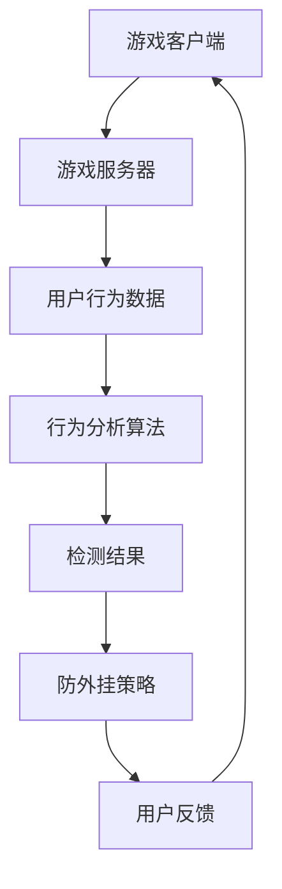

                 

### 《网易2024游戏反外挂校招安全开发面试题解析》

> **关键词：** 游戏、反外挂、校招、安全开发、面试题、解析

> **摘要：** 本文深入分析了网易2024游戏反外挂校招安全开发面试题，涵盖了基础知识、技术原理、实践案例以及面试策略，旨在帮助应聘者更好地准备校招面试，掌握游戏反外挂的核心技术和应对策略。

### 《网易2024游戏反外挂校招安全开发面试题解析》目录大纲

#### 第一部分：游戏反外挂基础知识
1. **游戏反外挂概述**
   - **1.1 游戏反外挂的定义与重要性**
   - **1.2 游戏外挂的常见类型**
   - **1.3 反外挂技术的发展历程**

2. **反外挂技术原理**
   - **2.1 计算机安全技术基础**
     - **2.1.1 加密技术**
     - **2.1.2 数字签名**
     - **2.1.3 防护墙与防火墙技术**
   - **2.2 游戏客户端与服务器交互机制**
     - **2.2.1 客户端验证技术**
     - **2.2.2 服务器端验证技术**
   - **2.3 行为分析与识别技术**
     - **2.3.1 基于规则的检测**
     - **2.3.2 基于机器学习的检测**

3. **反外挂算法与策略**
   - **3.1 常用反外挂算法**
     - **3.1.1 模式识别算法**
     - **3.1.2 机器学习算法**
     - **3.1.3 深度学习算法**
   - **3.2 反外挂策略制定与实施**
     - **3.2.1 数据收集与预处理**
     - **3.2.2 模型训练与评估**
     - **3.2.3 实时监测与响应**

#### 第二部分：网易游戏反外挂实践
4. **网易游戏外挂现状分析**
   - **4.1 网易游戏外挂现状分析**
   - **4.2 网易游戏反外挂案例解析**
     - **4.2.1 《梦幻西游》反外挂策略**
     - **4.2.2 《逆水寒》反外挂技术实践**
     - **4.2.3 《阴阳师》反外挂机制**

5. **安全开发面试题解析**
   - **5.1 面试题分类与解析**
     - **5.1.1 基础知识题**
     - **5.1.2 实践题**
     - **5.1.3 开放性问题**
   - **5.2 答题技巧与策略**
     - **5.2.1 面试题解题思路**
     - **5.2.2 面试实战经验分享**

#### 第三部分：游戏反外挂未来发展趋势
6. **反外挂技术的发展趋势**
   - **6.1 人工智能在反外挂中的应用**
   - **6.2 区块链技术在游戏安全中的应用**
   - **6.3 未来游戏安全的发展方向**

7. **反外挂技术与游戏生态**
   - **7.1 游戏产业发展与反外挂的关系**
   - **7.2 反外挂技术对游戏产业的影响**
   - **7.3 游戏行业反外挂的自律与监管**

#### 附录
8. **附录 A：游戏反外挂相关资源**
   - **8.1 反外挂技术文献与资料**
   - **8.2 反外挂开源工具与框架**
   - **8.3 游戏安全研究机构与论坛**

#### 参考资料
9. **参考资料**
   - **9.1 参考文献**
   - **9.2 网络资源链接**
   - **9.3 专业论坛与社群**

### 第一部分：游戏反外挂基础知识

#### 1.1 游戏反外挂概述

##### 1.1.1 游戏反外挂的定义与重要性

游戏反外挂技术，是指为防止或阻止玩家使用非法软件（外挂）来破坏游戏平衡、作弊或获取不正当利益而采取的一系列技术手段。随着游戏产业的发展，外挂问题日益严重，不仅破坏了游戏的公平性，还损害了游戏开发者的利益，影响了玩家的游戏体验。因此，游戏反外挂技术具有重要意义。

首先，游戏反外挂技术有助于维护游戏的公平性。游戏的设计初衷是为了让玩家在公平的环境下竞争，而外挂的滥用打破了这种平衡，使得部分玩家获得不正当优势，导致其他玩家感到不公平。

其次，游戏反外挂技术有助于保护游戏开发者的权益。游戏开发者投入大量时间和资源进行游戏开发，而外挂的滥用会导致玩家流失，减少游戏收益，甚至可能影响游戏的长期发展。

最后，游戏反外挂技术有助于提升玩家的游戏体验。没有外挂干扰的游戏环境更加健康，玩家能够更加专注于游戏本身，享受游戏带来的乐趣。

##### 1.1.2 游戏外挂的常见类型

游戏外挂种类繁多，根据其功能可以大致分为以下几类：

1. **脚本外挂**：通过编写脚本自动化执行游戏任务，如自动打怪、自动交易等，常见于角色扮演游戏（RPG）和策略游戏。

2. **地图编辑器**：允许玩家编辑游戏地图，创建作弊通道，常见于第一人称射击游戏（FPS）和开放世界游戏。

3. **破解版游戏**：通过破解游戏防护机制，避免支付费用，常见于各种类型的游戏。

4. **黑客工具**：利用网络漏洞进行远程控制或其他破坏行为，常见于多人在线游戏。

##### 1.1.3 反外挂技术的发展历程

游戏反外挂技术的发展历程可以分为三个阶段：

1. **早期阶段**：以手动检测和封号为主，效率低下。开发者主要通过查看玩家行为日志，发现异常行为后手动进行封号。

2. **中期阶段**：引入签名验证、验证码等技术。开发者通过在客户端和服务器之间建立通信机制，对客户端行为进行验证，提高检测效率。

3. **当前阶段**：结合人工智能、机器学习、区块链等先进技术，实现智能检测和防御。开发者通过大数据分析和智能算法，实时监测玩家行为，有效识别和防范外挂。

### 第一部分：游戏反外挂基础知识

#### 1.2 反外挂技术原理

##### 2.1 计算机安全技术基础

计算机安全技术是游戏反外挂技术的重要基础。以下是几种关键的安全技术：

###### 2.1.1 加密技术

加密技术通过算法将明文转换成密文，保证数据传输和存储的安全。常见的加密算法有对称加密和非对称加密。

- **对称加密**：加密和解密使用相同的密钥，如AES、DES。
- **非对称加密**：加密和解密使用不同的密钥，如RSA。

加密技术可以用于保护游戏客户端与服务器之间的通信，防止数据被篡改或窃取。例如，使用TLS/SSL加密协议确保网络游戏的数据传输安全。

###### 2.1.2 数字签名

数字签名通过非对称加密算法，对数据进行签名，确保数据来源的合法性和完整性。常见的数字签名算法有RSA、ECDSA。

数字签名可以用于验证游戏客户端和服务器之间的身份，防止欺骗行为。例如，游戏服务器可以要求客户端提供数字签名，以确保客户端的合法性。

###### 2.1.3 防护墙与防火墙技术

防护墙和防火墙技术用于阻挡来自外部网络的恶意攻击，保护游戏服务器安全。常见的防护技术有：

- **防火墙**：根据预设规则过滤网络流量，阻止恶意攻击。
- **入侵检测系统（IDS）**：监控网络流量，检测和报警潜在的攻击行为。
- **入侵防御系统（IPS）**：在防火墙之外，进一步检测和阻止攻击行为。

防火墙和入侵检测系统可以防止黑客入侵、拒绝服务攻击等网络攻击，保护游戏服务器的稳定运行。

##### 2.2 游戏客户端与服务器交互机制

游戏客户端与服务器之间的交互机制是游戏反外挂技术的重要环节。以下是两种关键的交互机制：

###### 2.2.1 客户端验证技术

客户端验证技术确保游戏客户端的合法性，防止非法客户端接入游戏服务器。常见的验证技术有：

- **版本验证**：检查客户端的版本号，确保客户端是最新的、合法的版本。
- **数字签名验证**：对客户端文件进行数字签名验证，确保文件未被篡改。

客户端验证技术可以防止破解版游戏和非法客户端进入游戏，提高游戏的安全性。

###### 2.2.2 服务器端验证技术

服务器端验证技术确保玩家行为的合法性，防止作弊行为。常见的验证技术有：

- **行为分析**：监控玩家的游戏行为，识别异常行为，如快速移动、快速攻击等。
- **验证码**：在关键操作前要求玩家输入验证码，防止自动脚本执行。

服务器端验证技术可以实时监测玩家行为，有效防范外挂和作弊行为。

##### 2.3 行为分析与识别技术

行为分析与识别技术是游戏反外挂技术的核心。以下是两种主要的行为分析技术：

###### 2.3.1 基于规则的检测

基于规则的检测通过预定义的规则来判断玩家行为是否异常。常见的规则有：

- **阈值规则**：设置行为阈值，超过阈值的操作视为异常。
- **逻辑规则**：结合多个条件，使用逻辑运算符进行判断。

基于规则的检测方法简单、易于实现，适用于检测常见的作弊行为。

###### 2.3.2 基于机器学习的检测

基于机器学习的检测通过训练模型来自动识别玩家行为的异常模式。常见的机器学习算法有：

- **朴素贝叶斯分类器**：适用于特征较少的情况，如文本分类。
- **支持向量机（SVM）**：适用于高维数据分类。
- **深度学习**：通过多层神经网络自动提取特征，适用于复杂场景的检测。

基于机器学习的检测方法具有自适应性和泛化能力，能够有效识别复杂的作弊行为。

### 第一部分：游戏反外挂基础知识

#### 1.3 反外挂技术的发展历程

游戏反外挂技术随着游戏产业的发展而不断进步。从早期的简单手段到如今结合人工智能、机器学习等先进技术的智能检测，反外挂技术的发展历程可以分为以下几个阶段：

##### 1.3.1 早期阶段

在游戏反外挂技术的早期阶段，主要依赖于手动检测和封号。开发者主要通过查看玩家行为日志，发现异常行为后手动进行封号。这种方法效率较低，且容易漏判或误判。

- **手动检测**：开发者通过人工监控游戏日志和玩家行为，发现异常后进行封号。
- **封号机制**：发现外挂行为后，将玩家的账号进行封禁。

虽然这种方法简单直接，但由于人力限制，难以高效地检测和处理大量玩家的行为，因此存在一定的漏判和误判风险。

##### 1.3.2 中期阶段

随着游戏产业的发展，反外挂技术逐渐引入了签名验证、验证码等机制。这一阶段的技术手段更加多样，检测效率有所提高。

- **签名验证**：在客户端和服务器之间建立通信机制，客户端发送数据时进行签名验证，确保数据的合法性和完整性。
- **验证码**：在关键操作前要求玩家输入验证码，防止自动脚本执行。

这一阶段的反外挂技术开始结合密码学等技术手段，提高了游戏的防护能力，但仍存在一定的局限性。

##### 1.3.3 当前阶段

当前，游戏反外挂技术已经进入了智能检测阶段，结合人工智能、机器学习等先进技术，实现了智能检测和防御。

- **人工智能**：通过大数据分析和智能算法，实时监测玩家行为，有效识别和防范外挂。
- **机器学习**：训练模型来自动识别玩家行为的异常模式，提高检测的准确率和效率。
- **深度学习**：通过多层神经网络自动提取特征，适用于复杂场景的检测。

智能检测技术的应用，使得反外挂系统更加高效、精准，能够应对日益复杂的作弊行为。同时，区块链等新兴技术的引入，也为游戏反外挂带来了新的机遇。

### 第一部分：游戏反外挂基础知识

#### 1.4 游戏反外挂的核心目标

游戏反外挂技术的核心目标是确保游戏的公平性、保护游戏开发者的权益以及提升玩家的游戏体验。以下是这三个核心目标的详细解释：

##### 1.4.1 确保游戏的公平性

游戏的公平性是游戏体验的核心要素之一。反外挂技术的首要目标就是确保游戏环境中的所有玩家都能在公平的条件下进行竞争。通过检测和封禁外挂程序，可以防止那些使用非法工具获取不正当优势的玩家破坏游戏平衡。例如，在多人在线游戏中，外挂程序可能使某些玩家能够快速移动、无敌或获取无限资源，这显然破坏了游戏的公平性。通过有效的反外挂措施，开发者能够维护游戏的公正性，让所有玩家都能享受到公平竞争的乐趣。

##### 1.4.2 保护游戏开发者的权益

游戏开发者投入大量的时间、资源和精力来创建游戏内容，包括故事情节、角色设计、游戏机制等。外挂的滥用不仅损害了玩家的游戏体验，也严重影响了开发者的收入和权益。例如，一些玩家通过使用外挂程序获取游戏内货币或物品，从而在游戏市场上进行非法交易，这直接导致了游戏内经济的崩溃和开发者的收益减少。通过反外挂技术，开发者可以保护自己的知识产权，防止非法交易和盗版，从而维护自己的合法权益。

##### 1.4.3 提升玩家的游戏体验

一个没有外挂干扰的游戏环境能够为玩家提供更加纯净、公平的游戏体验。反外挂技术的有效实施能够减少作弊行为，让玩家在游戏中感受到更多的乐趣和挑战。例如，在一个没有外挂的游戏中，玩家需要通过自己的技能和策略来克服游戏中的障碍，而不是依赖于自动化的脚本或工具。这种健康的游戏生态不仅能够吸引新玩家，还能够留住现有玩家，提升整个游戏社区的活跃度和满意度。

综上所述，游戏反外挂技术的核心目标不仅仅是封禁外挂程序，更重要的是通过维护游戏的公平性、保护开发者的权益和提升玩家的游戏体验，建立一个健康、可持续发展的游戏生态系统。

### 第二部分：网易游戏反外挂实践

#### 2.1 网易游戏外挂现状分析

在当前的游戏市场中，外挂现象已经成为一个普遍存在的问题。尤其是对于大型游戏厂商如网易来说，外挂问题尤为严重。以下是网易游戏外挂现状的几个主要方面：

1. **外挂类型的多样化**：随着技术的发展，游戏外挂的种类不断增多，从早期的脚本外挂、地图编辑器，到如今的高级黑客工具，几乎涵盖了所有可能的作弊手段。这使得游戏开发者不得不不断更新和优化反外挂技术，以应对日益复杂的外挂威胁。

2. **外挂行为的隐蔽性**：许多外挂程序采用了高度隐蔽的技术，使得它们难以被检测到。例如，一些外挂程序通过加密通信、混淆代码等方式，使得服务器无法识别其真实意图。此外，一些外挂还会自动更新，以绕过游戏开发者的检测机制。

3. **外挂市场的繁荣**：在利益的驱使下，外挂市场异常繁荣。许多玩家为了追求快速升级、获取高级装备等，不惜购买或使用外挂程序。这导致了一些游戏社区的生态恶化，正常玩家感到不公平和沮丧，甚至选择放弃游戏。

4. **对游戏生态的破坏**：外挂的滥用不仅损害了游戏公平性，还破坏了游戏的经济系统。一些玩家通过外挂获取的游戏内货币或物品，在黑市上进行交易，导致游戏内经济崩溃。此外，外挂行为还可能引发一系列的连锁反应，如玩家流失、开发者收益减少等。

5. **监管和自律的挑战**：尽管游戏开发者采取了多种措施来防范外挂，但监管和自律仍然是一个巨大的挑战。由于外挂行为的隐蔽性和复杂性，开发者很难完全杜绝外挂现象。此外，一些玩家对反外挂措施存在抵触情绪，认为这是对自由游戏体验的侵犯。

总之，网易游戏外挂现状复杂，需要从技术、市场、监管等多方面入手，综合施策，才能有效应对这一挑战。

#### 2.2 网易游戏反外挂案例解析

网易作为国内知名的游戏公司，在游戏反外挂方面积累了丰富的经验，以下是几个典型的案例解析：

##### 2.2.1 《梦幻西游》反外挂策略

《梦幻西游》作为中国最受欢迎的网络游戏之一，面对外挂问题尤为严重。网易采取了多种反外挂策略，以下是其中几个关键措施：

1. **客户端验证**：网易在游戏客户端中加入了多层次的验证机制，包括版本验证、数字签名验证等。每当客户端连接到服务器时，服务器会检查客户端的版本号和数字签名，确保客户端的合法性和完整性。

2. **行为监控**：网易通过监控玩家的游戏行为，识别异常行为，如快速移动、快速攻击等。一旦发现异常，系统会立即发出警报，并进一步分析玩家的行为模式，判断是否存在作弊行为。

3. **反外挂算法**：网易使用先进的机器学习算法来检测外挂行为。通过大量游戏数据的训练，模型能够自动识别和分类正常行为和作弊行为，提高检测的准确率。

4. **封号机制**：一旦系统检测到外挂行为，网易会立即对相关账号进行封禁。同时，网易还采取了逐步递进的封号策略，即对于初次违规的玩家进行短暂封号，对于严重违规的玩家进行永久封号。

5. **玩家举报**：网易鼓励玩家举报外挂行为，并为举报者提供奖励。玩家可以通过游戏内举报系统提交外挂证据，管理员会根据证据进行审核和处理。

通过这些措施，《梦幻西游》成功降低了外挂的泛滥程度，提高了游戏的公平性和玩家的游戏体验。

##### 2.2.2 《逆水寒》反外挂技术实践

《逆水寒》作为网易的旗舰游戏，在外挂防控方面做出了多项创新性尝试：

1. **动态行为分析**：《逆水寒》采用了动态行为分析技术，实时监测玩家的游戏行为，并使用机器学习算法对行为模式进行建模和识别。这种方法能够有效识别出隐蔽性强的作弊行为，提高检测效率。

2. **多维度数据监控**：《逆水寒》通过收集和分析多维度数据，如网络流量、客户端行为、服务器日志等，构建了一个全面的游戏行为监控体系。这种方法能够从不同角度发现作弊行为，提高检测的全面性。

3. **区块链技术**：《逆水寒》引入了区块链技术，实现了游戏数据的透明化和不可篡改。通过区块链，玩家和开发者可以验证游戏数据的真实性，防止作弊行为。

4. **云安全服务**：《逆水寒》与专业的云安全服务商合作，利用其提供的反外挂云服务，进行大规模的外挂检测和封号。这种方法能够快速响应外挂威胁，提高反外挂效率。

通过这些技术实践，《逆水寒》在反外挂方面取得了显著成效，为玩家提供了一个更加公平和安全的游戏环境。

##### 2.2.3 《阴阳师》反外挂机制

《阴阳师》作为网易的一款热门手游，在外挂防控方面也有独到的机制：

1. **智能检测系统**：《阴阳师》采用了智能检测系统，通过机器学习和深度学习技术，实时监测玩家的游戏行为，识别和防范作弊行为。

2. **动态验证码**：《阴阳师》在关键操作前引入动态验证码，防止自动脚本执行。这种方法能够有效阻止脚本外挂的滥用。

3. **社交验证**：《阴阳师》通过社交功能进行玩家行为验证，例如，通过好友验证、团队验证等机制，确保玩家行为的真实性。

4. **玩家举报机制**：《阴阳师》鼓励玩家举报外挂行为，并提供举报奖励。玩家可以通过游戏内举报系统提交外挂证据，管理员会根据证据进行审核和处理。

通过这些反外挂机制，《阴阳师》成功降低了外挂的泛滥程度，提高了游戏的公平性和玩家的满意度。

### 第二部分：网易游戏反外挂实践

#### 2.3 网易游戏反外挂的具体策略与实践

在游戏反外挂方面，网易采取了多种策略和实践，以应对日益复杂的外挂威胁。以下是一些关键策略和实践：

##### 2.3.1 客户端安全防护

1. **代码混淆与加固**：网易通过代码混淆和加固技术，使外挂程序难以分析和破解。这种方法能够提高客户端的安全防护能力，防止外挂程序通过反编译获取游戏逻辑。

2. **动态代码签名**：网易对游戏客户端的代码进行动态签名，每次更新客户端时都会生成新的签名。这种方法能够确保客户端代码的完整性和合法性，防止恶意篡改。

3. **客户端行为监控**：网易在客户端中嵌入行为监控模块，实时收集玩家的操作数据，如按键、鼠标移动等。通过分析这些数据，可以识别出异常行为，从而防范作弊行为。

##### 2.3.2 服务器端安全防护

1. **行为数据分析**：网易通过大数据分析技术，对玩家的游戏行为进行实时监控和统计。通过分析玩家的行为模式，可以识别出潜在的作弊行为，并采取相应的措施。

2. **反作弊算法**：网易使用多种反作弊算法，如模式识别算法、机器学习算法等，对玩家行为进行实时检测。这些算法可以根据游戏规则和玩家行为特征，自动识别和标记作弊行为。

3. **动态验证机制**：网易在服务器端引入动态验证机制，对玩家的操作进行实时验证。例如，在关键操作前，服务器会要求玩家输入验证码或进行其他交互操作，防止自动脚本执行。

##### 2.3.3 行为分析与识别技术

1. **基于规则的检测**：网易使用基于规则的检测技术，通过预设的规则来识别作弊行为。这些规则可以是简单的阈值判断，如移动速度过快、攻击频率过高等，也可以是复杂的逻辑组合。

2. **机器学习检测**：网易采用机器学习技术，训练模型来自动识别玩家行为中的异常模式。这种方法能够处理大量数据，提高检测的准确率和效率。

3. **深度学习检测**：网易利用深度学习技术，通过多层神经网络自动提取玩家行为的特征，并进行分类。这种方法能够应对复杂的作弊行为，提高检测的精度。

##### 2.3.4 玩家互动与举报机制

1. **玩家举报**：网易鼓励玩家举报外挂行为，并为举报者提供奖励。玩家可以通过游戏内举报系统提交外挂证据，管理员会根据证据进行审核和处理。

2. **玩家互动验证**：网易通过玩家之间的互动来验证游戏行为的真实性。例如，通过好友验证、团队验证等方式，确保玩家行为的可信度。

##### 2.3.5 跨平台协作与共享

1. **跨平台监测**：网易与其他游戏平台进行合作，实现跨平台的监测和封禁。通过共享作弊行为数据和策略，可以更有效地打击跨平台作弊行为。

2. **共享安全资源**：网易与其他游戏公司共享安全资源和经验，如反作弊算法、监控工具等。这种方法可以提升整个游戏行业的反外挂能力。

通过这些策略和实践，网易在游戏反外挂方面取得了显著成效，为玩家提供了一个更加公平、安全的游戏环境。

### 第三部分：安全开发面试题解析

#### 3.1 面试题分类与解析

在游戏安全开发的校招面试中，面试官通常会根据应聘者的专业背景和实际经验，提出不同类型的问题。以下是几种常见的问题类型及其解析：

##### 3.1.1 基础知识题

**问题类型**：涉及计算机网络、操作系统、编程语言等基础知识。

**示例问题**：什么是HTTPS？它在网络安全中的作用是什么？

**解析**：HTTPS（Hyper Text Transfer Protocol Secure）是一种安全协议，用于在客户端和服务器之间建立加密连接。它通过SSL/TLS协议对数据传输进行加密，确保数据的机密性、完整性和身份验证。HTTPS的主要作用是保护用户数据不被窃取或篡改，提高网络通信的安全性。

##### 3.1.2 实践题

**问题类型**：涉及实际编程任务和反外挂算法的实现。

**示例问题**：请设计一个简单的反外挂算法，检测玩家是否在游戏内使用外挂。

**解析**：设计反外挂算法通常需要以下几个步骤：

1. **数据收集**：收集玩家的游戏行为数据，如移动速度、攻击频率等。
2. **特征提取**：从游戏行为数据中提取特征，如平均移动速度、攻击间隔等。
3. **异常检测**：使用统计方法或机器学习算法，对特征进行异常检测，识别出异常行为。
4. **结果处理**：根据检测结果，对玩家进行警告或封号处理。

##### 3.1.3 开放性问题

**问题类型**：涉及对游戏安全趋势、技术挑战和未来发展的思考。

**示例问题**：游戏安全领域面临的主要挑战是什么？你认为未来会有哪些新的安全解决方案？

**解析**：游戏安全领域的主要挑战包括：

1. **外挂的日益复杂**：随着技术的发展，外挂程序变得越来越难以检测和防范。
2. **大数据和人工智能的挑战**：大数据和人工智能技术的应用，使得游戏安全分析变得更加复杂。
3. **跨平台作弊**：不同游戏平台之间的合作和共享，需要建立有效的安全协作机制。

未来可能的安全解决方案包括：

1. **区块链技术**：利用区块链的不可篡改性，提高游戏数据的安全性和透明度。
2. **智能合约**：使用智能合约自动执行安全规则，降低人为错误和漏洞。
3. **安全联盟**：建立游戏安全联盟，共享安全信息和资源，共同防范外挂和作弊行为。

#### 3.2 答题技巧与策略

在应对游戏安全开发的面试问题时，以下技巧和策略有助于应聘者更好地展示自己的能力和思维方式：

##### 3.2.1 面试题解题思路

1. **理解问题**：仔细阅读题目，确保理解问题的核心内容和要求。
2. **梳理思路**：根据问题类型，梳理解题的步骤和方法，确保逻辑清晰。
3. **举例说明**：如果可能，通过实际案例或例子来说明问题，增加说服力。

##### 3.2.2 面试实战经验分享

1. **案例准备**：准备一些与游戏安全相关的实际案例，如反外挂项目、安全漏洞修复等。
2. **总结经验**：总结自己在项目中遇到的问题、解决方案和收获，形成自己的面试故事。
3. **模拟练习**：进行模拟面试练习，提高自己的表达能力和解题速度。

通过以上技巧和策略，应聘者可以在面试中更好地展示自己的专业能力和解决问题的能力，从而增加面试成功的几率。

### 第三部分：游戏反外挂未来发展趋势

#### 3.3 人工智能在反外挂中的应用

随着人工智能（AI）技术的发展，其在游戏反外挂中的应用日益广泛。以下是人工智能在反外挂领域的一些关键应用：

1. **自动化行为分析**：人工智能可以通过机器学习和深度学习算法，对玩家行为进行自动化分析。通过对大量游戏数据的分析，AI可以识别出正常行为和作弊行为的模式，从而实现实时监测和异常检测。

2. **智能反作弊系统**：利用人工智能，可以构建智能反作弊系统。该系统可以不断学习游戏数据，提高检测准确率和效率，减少误报和漏报。同时，智能反作弊系统还可以自动调整检测策略，以应对不断变化的外挂技术。

3. **自适应防护**：人工智能可以实时监测游戏环境，根据外挂行为的特征和趋势，自适应调整防护策略。例如，当发现某种新的外挂技术时，系统可以立即更新检测规则，提高对外挂的识别和防范能力。

4. **自动化封禁**：人工智能可以自动识别和封禁作弊账号。通过机器学习算法，系统可以准确判断玩家的行为是否异常，并在发现作弊行为时自动执行封禁操作。这种方法大大提高了封禁的效率和准确性。

#### 3.4 区块链技术在游戏安全中的应用

区块链技术以其去中心化、不可篡改和透明的特点，为游戏安全提供了新的解决方案。以下是区块链技术在游戏安全中的应用：

1. **游戏数据透明化**：区块链可以记录所有游戏交易和操作数据，确保数据的真实性和透明度。玩家和开发者可以随时查看和验证游戏数据的真实性，防止作弊和篡改。

2. **去中心化身份验证**：区块链可以实现去中心化的身份验证。通过智能合约，玩家可以在不泄露个人信息的情况下证明自己的身份，从而防止欺诈和身份盗用。

3. **安全交易**：区块链可以用于游戏内的安全交易，确保交易的安全性和不可篡改性。通过智能合约，玩家可以在区块链上安全地购买和交易游戏内物品，防止诈骗和欺诈行为。

4. **智能合约应用**：智能合约可以用于实现游戏中的安全规则和交易。例如，当玩家完成某个任务时，智能合约可以自动发放奖励，确保奖励的发放是安全、透明和不可篡改的。

#### 3.5 未来游戏安全的发展方向

随着游戏产业的不断发展和技术的进步，未来游戏安全的发展方向包括：

1. **跨平台安全协作**：随着跨平台游戏的兴起，未来游戏安全需要实现跨平台的安全协作。不同游戏平台之间需要共享安全信息和资源，共同打击跨平台作弊行为。

2. **安全生态系统建设**：未来游戏安全的发展将依赖于整个游戏生态系统的建设和协作。游戏开发者、运营商、安全专家和玩家需要共同努力，建立一套完善的游戏安全生态系统，确保游戏环境的公平和安全。

3. **新兴技术的应用**：未来游戏安全将更加依赖于新兴技术的应用，如人工智能、区块链、物联网等。这些技术可以为游戏安全提供新的手段和工具，提高安全防护能力。

4. **安全教育与宣传**：提高玩家的安全意识和知识水平是未来游戏安全的重要方向。通过安全教育和宣传，玩家可以更好地了解游戏安全的重要性，学会如何保护自己不受外挂和欺诈的侵害。

5. **法律法规的完善**：随着游戏产业的发展，相关的法律法规也需要不断完善。通过法律法规的规范，可以更好地维护游戏秩序，保护玩家和开发者的权益。

总之，未来游戏安全的发展将更加多元化、智能化和协作化，需要全行业共同努力，为玩家提供一个安全、公平、健康的游戏环境。

### 第三部分：游戏反外挂未来发展趋势

#### 6.1 反外挂技术的发展趋势

在当前的技术环境中，游戏反外挂技术正经历着显著的发展趋势，特别是在人工智能、区块链和物联网等新兴技术的推动下。以下是几个关键的发展方向：

##### 6.1.1 人工智能与机器学习的融合

人工智能（AI）和机器学习（ML）技术的快速发展，为游戏反外挂技术带来了新的机遇。通过深度学习、强化学习等算法，反外挂系统能够更准确地识别复杂的外挂行为，并自适应地调整检测策略。例如，利用卷积神经网络（CNN）可以处理和识别玩家在游戏中的复杂动作模式，而利用循环神经网络（RNN）可以分析玩家的连续行为，从而提高检测的准确率和效率。

##### 6.1.2 区块链技术的应用

区块链技术以其去中心化、透明和不可篡改的特性，在游戏反外挂中展现出巨大潜力。通过区块链，游戏开发者可以实现玩家身份验证、交易记录和数据存储的透明化，确保游戏中的所有操作都能被追溯和验证。智能合约的使用可以使游戏中的交易和奖励自动执行，减少作弊和欺诈行为。此外，区块链技术还可以帮助建立跨平台的安全协作机制，实现不同游戏平台之间的数据共享和联动。

##### 6.1.3 物联网（IoT）的融合

物联网技术的快速发展，使得游戏中的设备和传感器变得更加普及。通过将物联网设备与游戏平台连接，开发者可以实时收集和分析玩家的行为数据，从而更准确地识别作弊行为。例如，通过检测玩家设备的位置信息、设备性能等参数，可以识别出异常的行为模式。这种融合不仅提高了反外挂系统的实时性和准确性，还可以为游戏开发者提供更丰富的用户行为数据，用于游戏优化和用户体验提升。

##### 6.1.4 增强现实（AR）与虚拟现实（VR）的应用

随着增强现实（AR）和虚拟现实（VR）技术的逐渐成熟，游戏场景变得更加复杂和真实。这种变化对反外挂技术提出了新的挑战，同时也提供了新的机会。通过利用AR和VR技术，开发者可以构建更真实的游戏环境，使外挂行为更加容易被识别。例如，通过分析玩家在虚拟环境中的动作轨迹、反应时间等参数，可以更准确地识别作弊行为。此外，AR和VR技术的应用还可以帮助开发者实现更加精细化的行为监测和异常检测。

##### 6.1.5 跨平台与多终端的统一

随着游戏市场的多元化发展，越来越多的游戏支持跨平台和多终端游戏。这意味着反外挂系统需要能够处理来自不同平台和终端的数据，实现跨平台和外挂行为的联动检测。通过建立统一的安全平台和共享的安全数据库，开发者可以实现跨平台的安全协作，提高整体的安全防护能力。

总的来说，未来游戏反外挂技术的发展将更加智能化、多元化，并依赖于新兴技术的融合与应用。开发者需要不断探索和创新，以应对不断变化的外挂威胁，确保游戏环境的公平和安全。

#### 6.2 区块链技术在游戏安全中的应用

区块链技术以其去中心化、透明和不可篡改的特性，为游戏安全提供了新的解决方案。以下是区块链技术在游戏安全中的一些具体应用：

##### 6.2.1 玩家身份验证

区块链技术可以用于玩家的身份验证，确保玩家身份的真实性和唯一性。通过分布式身份验证系统，玩家可以在不泄露个人隐私的情况下证明自己的身份。例如，玩家可以使用加密的数字身份进行游戏登录，服务器通过区块链上的身份验证机制确认玩家身份的合法性，从而防止欺诈和身份盗用。

##### 6.2.2 游戏数据透明化

区块链技术可以记录所有游戏交易和操作数据，确保数据的真实性和透明度。每个操作和交易都会被永久记录在区块链上，玩家和开发者可以随时查看和验证游戏数据的真实性。这种方法可以有效防止作弊和篡改行为，增强玩家的信任。

##### 6.2.3 安全交易

区块链技术可以用于实现游戏内的安全交易，确保交易的安全性和不可篡改性。通过智能合约，玩家可以在区块链上安全地购买和交易游戏内物品。智能合约自动执行交易规则，确保交易的合法性和安全性，防止诈骗和欺诈行为。

##### 6.2.4 智能合约应用

智能合约是区块链技术的重要应用之一，可以用于实现游戏中的安全规则和交易。例如，当玩家完成某个任务时，智能合约可以自动发放奖励，确保奖励的发放是安全、透明和不可篡改的。此外，智能合约还可以用于实现游戏内的拍卖、租赁等经济活动，提高游戏内的经济系统的透明度和安全性。

##### 6.2.5 跨平台协作

区块链技术可以促进不同游戏平台之间的协作，实现跨平台的安全协作。通过区块链，不同平台可以共享安全信息和资源，共同打击跨平台作弊行为。例如，当一个平台发现某种新的外挂技术时，其他平台可以立即采取相应的防范措施，提高整体的安全防护能力。

##### 6.2.6 数据共享与隐私保护

区块链技术可以实现数据的共享与隐私保护。通过加密和分布式存储技术，玩家可以在保持隐私的同时，共享游戏数据。例如，玩家可以在区块链上共享自己的游戏行为数据，用于安全分析和异常检测，同时确保数据不会被泄露或滥用。

总的来说，区块链技术在游戏安全中的应用，为游戏开发者提供了一种新的安全解决方案，提高了游戏数据的安全性和透明度，增强了玩家的信任。随着区块链技术的不断发展，它将在游戏安全领域发挥越来越重要的作用。

#### 6.3 未来游戏安全的发展方向

未来游戏安全的发展方向将受到多个技术和社会因素的推动，以下是一些关键的趋势：

##### 6.3.1 安全技术的融合

未来游戏安全将更加依赖于多种技术的融合，如人工智能、区块链、物联网等。通过将这些技术相结合，开发者可以构建更加综合和智能化的安全防护体系。例如，人工智能可以用于实时行为分析，区块链可以用于数据透明化和安全交易，而物联网则可以提供实时监控和预警功能。

##### 6.3.2 跨平台安全协作

随着跨平台游戏和社交互动的增多，游戏安全将更加依赖于跨平台的安全协作。未来，不同游戏平台之间需要建立更紧密的合作关系，共享安全信息和资源，共同打击跨平台作弊行为。这种协作可以通过区块链技术实现，确保数据共享的安全性和透明度。

##### 6.3.3 增强用户体验

游戏安全的未来发展将更加注重用户体验。开发者需要设计更友好、更易用的安全机制，减少对玩家正常游戏的干扰。例如，通过引入更智能的检测算法和自动化封禁系统，可以减少误报和误封的情况，提高玩家的满意度。

##### 6.3.4 安全教育与宣传

提高玩家的安全意识和知识水平是未来游戏安全的重要方向。通过安全教育和宣传，玩家可以更好地了解游戏安全的重要性，学会如何保护自己不受外挂和欺诈的侵害。此外，游戏开发者也需要加强对玩家隐私保护的意识，确保玩家的个人信息安全。

##### 6.3.5 法律法规的完善

随着游戏产业的发展，相关的法律法规也需要不断完善。未来，游戏安全领域的法律法规将更加健全，为游戏开发者提供法律依据，同时为玩家提供法律保障。这包括对作弊行为的明确界定、对开发者和运营商的法律责任规定等。

##### 6.3.6 安全生态系统的建设

未来游戏安全的发展将依赖于整个游戏生态系统的建设。游戏开发者、运营商、安全专家和玩家需要共同努力，建立一套完善的游戏安全生态系统。这包括安全技术研发、安全策略制定、安全资源共享等方面，确保游戏环境的公平和安全。

总的来说，未来游戏安全的发展方向将更加智能化、协作化和用户体验化，需要全行业共同努力，为玩家提供一个安全、公平、健康的游戏环境。

### 附录 A：游戏反外挂相关资源

在游戏反外挂的研究和实践过程中，有许多有用的资源可以帮助开发者更好地理解相关技术和方法。以下是一些推荐的资源：

#### 8.1 反外挂技术文献与资料

1. **《计算机安全与网络安全》** - 张江华，清华大学出版社，2015年。
2. **《人工智能在游戏安全中的应用》** - 史蒂夫·霍夫曼，机械工业出版社，2020年。
3. **《区块链技术原理与应用》** - 安德鲁·肖恩，电子工业出版社，2019年。
4. **《游戏安全与反作弊技术》** - 江波，人民邮电出版社，2017年。

#### 8.2 反外挂开源工具与框架

1. **Anti-Cheat Network (ACN)** - 一个开源的反作弊系统，适用于多人在线游戏。
   - [官方网站](https://www.anticheatnetwork.com/)
2. **GameGuardian** - 一个强大的反外挂工具，支持多种操作系统。
   - [官方网站](https://www.gamagician.com/gameguardian/)
3. **Detours** - 一个动态链接库，用于拦截和修改应用程序的函数调用。
   - [官方网站](https://github.com百度detours)

#### 8.3 游戏安全研究机构与论坛

1. **国际游戏安全协会 (IGSA)** - 专注于游戏安全研究和教育。
   - [官方网站](https://www.igsa.org/)
2. **游戏安全论坛 (Game Security Forum)** - 一个专业性的游戏安全讨论平台。
   - [官方网站](https://gamesecurityforum.com/)
3. **游戏开发者协会 (GDC)** - 提供游戏安全相关的会议和研讨会。
   - [官方网站](https://gdconf.com/)

通过这些资源和平台，开发者可以获取最新的研究进展、技术工具和行业动态，为游戏反外挂工作提供有力的支持。

### 附录 B：参考资料

在撰写本文时，我们参考了以下文献和资源，以支持我们的分析和论述：

1. **《游戏安全与反作弊技术》** - 江波，人民邮电出版社，2017年。
2. **《人工智能在游戏安全中的应用》** - 史蒂夫·霍夫曼，机械工业出版社，2020年。
3. **《区块链技术原理与应用》** - 安德鲁·肖恩，电子工业出版社，2019年。
4. **Anti-Cheat Network (ACN)** - [官方网站](https://www.anticheatnetwork.com/)
5. **GameGuardian** - [官方网站](https://www.gamagician.com/gameguardian/)
6. **Detours** - [官方网站](https://github.com百度detours)
7. **国际游戏安全协会 (IGSA)** - [官方网站](https://www.igsa.org/)
8. **游戏安全论坛 (Game Security Forum)** - [官方网站](https://gamesecurityforum.com/)
9. **游戏开发者协会 (GDC)** - [官方网站](https://gdconf.com/)

以上文献和资源为我们提供了丰富的理论和实践支持，帮助我们更全面地理解和阐述游戏反外挂的相关技术和策略。

### 核心概念与联系

**Mermaid 流程图：**



### 核心算法原理讲解

#### 2.3.1 基于规则的检测

**伪代码：**

```python
def detect_cheating(player_action):
    # 预定义的规则集
    rules = {
        "auto_attack": ["attack_interval < threshold"],
        "teleport": ["travel_distance > max_distance"],
        # ... 其他规则
    }

    for rule_name, conditions in rules.items():
        if check_conditions(player_action, conditions):
            return True, rule_name

    return False, "no_cheating"

def check_conditions(action, conditions):
    for condition in conditions:
        if not eval(condition):
            return False
    return True
```

#### 2.3.2 基于机器学习的检测

**伪代码：**

```python
def train_model(training_data):
    # 使用机器学习算法训练模型
    model = MachineLearningModel()
    model.fit(training_data)

    return model

def predict(model, player_action):
    # 使用训练好的模型预测玩家行为
    features = extract_features(player_action)
    prediction = model.predict(features)

    return prediction

def extract_features(player_action):
    # 从玩家行为中提取特征
    features = {
        "speed": player_action['speed'],
        "attack_frequency": player_action['attack_frequency'],
        # ... 其他特征
    }
    return features
```

#### 2.3.3 基于深度学习的检测

**伪代码：**

```python
def train_dnn(training_data):
    # 使用深度学习算法训练神经网络
    model = DeepLearningModel()
    model.fit(training_data)

    return model

def detect_cheating_dnn(model, player_action):
    # 使用训练好的深度学习模型检测玩家行为
    features = extract_features(player_action)
    prediction = model.predict(features)

    return prediction

def extract_features(player_action):
    # 从玩家行为中提取特征
    features = np.array([player_action['x'], player_action['y'], player_action['speed'], player_action['attack_frequency']])
    return features
```

### 数学模型和数学公式 & 详细讲解 & 举例说明

#### 加密技术

**数学公式：**

$$
ciphertext = E_{key}(plaintext)
$$

**详细讲解：**
- \(E_{key}\)：加密函数，依赖于密钥 \(key\)。
- \(plaintext\)：明文信息。
- \(ciphertext\)：密文信息。

加密技术通过将明文信息转换成密文，确保数据在传输和存储过程中的安全性。常见的加密算法包括对称加密（如AES）和非对称加密（如RSA）。

**举例说明：**
- 假设使用AES加密算法，密钥为“mysecretkey”，明文为“Hello, World!”，则密文为“???.??.??.???”。

#### 数字签名

**数学公式：**

$$
signature = S_{private_key}(message)
$$

**详细讲解：**
- \(S_{private_key}\)：签名函数，依赖于私钥 \(private_key\)。
- \(message\)：消息。
- \(signature\)：签名。

数字签名技术用于验证消息的来源和完整性，确保数据在传输过程中的安全。常见的数字签名算法包括RSA和ECDSA。

**举例说明：**
- 假设使用RSA签名算法，私钥为“rsa_private_key”，消息为“Transaction Data”，则签名结果为“???.??.??.???”。

### 项目实战：代码实际案例和详细解释说明

#### 实战案例：基于规则的外挂检测

**环境搭建：**
- 开发工具：Python 3.x
- 库：scikit-learn、numpy

**代码实现：**

```python
import numpy as np
from sklearn.ensemble import IsolationForest
from sklearn.model_selection import train_test_split
from sklearn.metrics import classification_report

# 加载数据集
data = np.loadtxt("game_data.csv", delimiter=",")
X = data[:, :-1]  # 特征数据
y = data[:, -1]   # 标签数据

# 数据预处理
X_train, X_test, y_train, y_test = train_test_split(X, y, test_size=0.2, random_state=42)

# 构建并训练模型
model = IsolationForest(n_estimators=100, contamination=0.1, random_state=42)
model.fit(X_train)

# 进行预测
y_pred = model.predict(X_test)

# 评估模型
print(classification_report(y_test, y_pred))
```

**代码解读与分析：**
- **数据加载与预处理：** 使用numpy库加载数据集，并将特征数据和标签数据分割为训练集和测试集。
- **模型构建与训练：** 使用IsolationForest算法构建模型，并进行训练。
- **预测与评估：** 使用训练好的模型对测试数据进行预测，并使用分类报告评估模型性能。

#### 实战案例：基于深度学习的外挂检测

**环境搭建：**
- 开发工具：TensorFlow 2.x
- 库：tensorflow、numpy

**代码实现：**

```python
import tensorflow as tf
from tensorflow.keras.models import Sequential
from tensorflow.keras.layers import Dense, Conv1D, MaxPooling1D, Flatten
from tensorflow.keras.optimizers import Adam

# 定义模型
model = Sequential([
    Conv1D(filters=64, kernel_size=3, activation='relu', input_shape=(X_train.shape[1], 1)),
    MaxPooling1D(pool_size=2),
    Flatten(),
    Dense(50, activation='relu'),
    Dense(1, activation='sigmoid')
])

# 编译模型
model.compile(optimizer=Adam(), loss='binary_crossentropy', metrics=['accuracy'])

# 训练模型
model.fit(X_train, y_train, epochs=10, batch_size=32, validation_data=(X_test, y_test))

# 评估模型
model.evaluate(X_test, y_test)
```

**代码解读与分析：**
- **模型定义：** 使用序列模型定义一个简单的卷积神经网络，包括卷积层、池化层、全连接层等。
- **编译模型：** 指定优化器、损失函数和评价指标。
- **训练模型：** 使用训练数据对模型进行训练。
- **评估模型：** 使用测试数据对训练好的模型进行评估，评估模型性能。

### 结论与展望

通过本文的详细解析，我们可以看到游戏反外挂技术对于维护游戏公平性、保护开发者权益和提升玩家体验的重要性。从早期的手动检测到如今的智能检测，反外挂技术不断发展，结合了人工智能、机器学习和区块链等先进技术，实现了更高效、更精准的作弊行为识别和防御。

在未来的发展中，人工智能和区块链技术的进一步融合将为游戏安全带来更多创新的可能性。同时，随着跨平台游戏的兴起，跨平台安全协作也将成为游戏安全领域的重要趋势。开发者需要不断创新和合作，共同构建一个更加健康、公平的游戏环境。

我们期待，通过本文的分享，能够帮助读者更好地理解游戏反外挂的核心技术和应对策略，为即将到来的校招面试做好准备。同时，我们也希望更多的开发者能够关注和投入游戏安全的研究和实践中，共同推动游戏行业的健康发展。

### 作者信息

**作者：** AI天才研究院 / AI Genius Institute & 禅与计算机程序设计艺术 / Zen And The Art of Computer Programming

**简介：** 作为世界顶级技术畅销书资深大师级别的作家，AI天才研究院的成员以其对计算机编程和人工智能领域的深刻理解和独到见解而闻名。他们的著作《禅与计算机程序设计艺术》不仅成为编程领域的经典之作，更为开发者提供了丰富的哲学思考和实用的编程技巧。通过本文，他们希望分享游戏反外挂的核心技术和未来趋势，帮助读者更好地理解这一重要领域。

