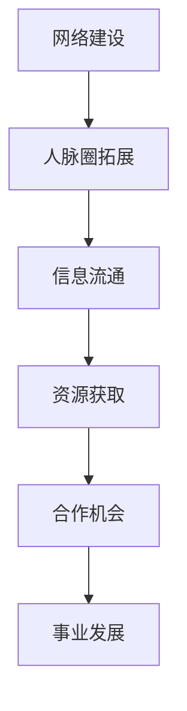

                 

# 《网络建设：拓展人脉圈的重要性和方法》

## 关键词
网络建设、人脉圈、信息流通、资源获取、合作机会、人际沟通、时间管理、心态调整、实战案例、策略制定、ROI模型。

## 摘要
本文将从网络建设的重要性和理论基础出发，详细探讨人脉圈的基本原理和构建方法。通过分析网络建设和人脉圈拓展之间的关系，提供一系列实用的拓展人脉圈的方法与技巧。同时，结合实际案例，解析网络建设的成功要素，为读者提供一套完整的网络建设策略。最后，通过附录部分，推荐相关资源和工具，帮助读者进一步拓展网络建设的能力。

---

### 《网络建设：拓展人脉圈的重要性和方法》目录大纲

#### 第一部分：网络建设的理论基础

**第1章：网络建设的重要性**
- **1.1 网络建设的基本概念**
- **1.2 网络建设的目标与意义**
- **1.3 网络建设的基础知识**
- **1.4 网络建设中的伦理和法律问题**

**第2章：人脉圈的基本原理**
- **2.1 人脉圈的概念**
- **2.2 人脉圈的重要性**
- **2.3 人脉圈的发展规律**
- **2.4 人脉圈的管理与维护**

#### 第二部分：网络建设的方法与技巧

**第3章：拓展人脉圈的方法**
- **3.1 线上拓展人脉圈的策略**
- **3.2 线下拓展人脉圈的方法**
- **3.3 人脉圈拓展的技巧**
- **3.4 人脉圈拓展的案例分析**

**第4章：构建有效的网络关系**
- **4.1 网络关系的类型与特征**
- **4.2 网络关系的构建原则**
- **4.3 网络关系的维护技巧**
- **4.4 网络关系的优化策略**

**第5章：网络建设的成功要素**
- **5.1 个人品牌建设**
- **5.2 人际沟通技巧**
- **5.3 时间管理**
- **5.4 心态调整**

#### 第三部分：实战案例与策略

**第6章：网络建设实战案例解析**
- **6.1 成功的案例分析**
- **6.2 失败的原因剖析**
- **6.3 实战策略分享**

**第7章：网络建设策略制定**
- **7.1 策略制定的步骤**
- **7.2 策略制定的工具与方法**
- **7.3 策略调整与优化**
- **7.4 持续学习与适应变化**

#### 附录
- **附录A：网络建设相关资源**
  - **A.1 经典书籍推荐**
  - **A.2 网络资源与工具**
  - **A.3 行业报告与趋势分析**

---

### **核心概念与联系**

#### 网络建设与拓展人脉圈的关系

在现代社会，网络建设与人脉圈的拓展密不可分。网络建设为拓展人脉圈提供了基础架构和平台，是实现人脉圈拓展的关键。而人脉圈的拓展则依赖于网络建设，通过有效的网络关系构建和管理，实现信息的流通、资源的获取和合作机会的发现。

为了更直观地理解网络建设与人脉圈拓展的关系，我们可以用Mermaid绘制一个流程图：



- **网络建设**为拓展人脉圈提供了基础架构和平台，是实现人脉圈拓展的关键。
- **人脉圈拓展**依赖于网络建设，通过有效的网络关系构建和管理，实现信息的流通、资源的获取和合作机会的发现。

### **核心算法原理讲解**

#### 人脉圈拓展的策略算法

人脉圈拓展的策略算法可以分为以下六个步骤：

1. **目标设定（Objective Setting）**
   - 设定拓展人脉圈的目标，如增加500个有效联系人。

2. **资源评估（Resource Assessment）**
   - 评估现有资源，如时间、资金、网络等。

3. **网络节点选择（Node Selection）**
   - 根据目标资源评估，选择关键网络节点进行拓展。

4. **关系建立（Relationship Building）**
   - 通过线上或线下活动，与目标节点建立联系。

5. **关系维护（Relationship Maintenance）**
   - 通过定期沟通和互助，维持关系的活力。

6. **效果评估（Effect Evaluation）**
   - 定期评估拓展效果，调整策略。

以下是一个简单的人脉圈拓展策略算法的伪代码：

```python
# 人脉圈拓展策略算法伪代码

# 步骤1：目标设定
set_goal(num_contacts_to_add)

# 步骤2：资源评估
assess_resources()

# 步骤3：网络节点选择
select_key_nodes()

# 步骤4：关系建立
build_relationships()

# 步骤5：关系维护
maintain_relationships()

# 步骤6：效果评估
evaluate效果的拓展效果
if need_adjustment:
    adjust_strategy()
```

### **数学模型和数学公式**

#### 人脉圈拓展的ROI模型

在拓展人脉圈的过程中，投资回报率（ROI）是一个重要的衡量指标。ROI模型可以帮助我们评估拓展人脉圈的效果和成本效益。ROI的公式如下：

$$
\text{ROI} = \frac{\text{投资回报}}{\text{投资成本}}
$$

- **投资回报**：拓展人脉圈带来的收益，如合作机会、资源获取等。
- **投资成本**：用于拓展人脉圈的时间、资金等投入。

举个例子，如果我们投资了1000小时和1000元进行人脉圈拓展，最终获得了10000元的收益，那么我们的ROI计算如下：

$$
\text{ROI} = \frac{10000}{1000 + 1000} = \frac{10000}{2000} = 5
$$

这意味着我们的投资回报率是500%，也就是说，我们每投入1元，就能获得5元的回报。

### **项目实战**

#### 案例一：线上人脉圈拓展

**开发环境搭建：**

为了进行线上人脉圈拓展，我们需要搭建一个稳定且高效的开发环境。以下是一个基本的环境搭建步骤：

1. 安装开发工具：如Visual Studio Code、PyCharm等。
2. 安装Python环境：通过Python官方安装包或Anaconda进行安装。
3. 安装相关库：如requests、beautifulsoup4、pandas等，用于网络爬取和数据分析。

**源代码实现：**

以下是一个简单的Python示例，用于在LinkedIn上拓展人脉：

```python
import requests
from bs4 import BeautifulSoup

# LinkedIn 登录信息
username = 'your_username'
password = 'your_password'

# 登录LinkedIn
session = requests.Session()
login_url = 'https://www.linkedin.com/uas/login'
login_data = {
    'session_key': username,
    'session_password': password,
    'login': 'Sign In'
}
session.post(login_url, data=login_data)

# 搜索联系人
search_url = 'https://www.linkedin.com/search/results/people/'
search_params = {
    'keywords': 'AI',
    'origin': 'HEADER_SEARCH_BOX',
    'f_A': 'com_applied_to',
    'f_M': 'true',
    'f_D': 'loc'
}
search_response = session.get(search_url, params=search_params)
soup = BeautifulSoup(search_response.text, 'html.parser')
search_results = soup.find_all('li', class_='result')

# 发送邀请
for result in search_results:
    contact_id = result['data-identifier']
    invite_data = {
        'inviter': username,
        'to': contact_id,
        'note': 'Hi {name}, I saw your profile and would like to connect with you.',
        'source': 'SENT_MSG'
    }
    invite_response = session.post('https://www.linkedin.com/nmn/messaging/inbox/send/', data=invite_data)
    print(f"Invited {contact_id}")
```

**代码解读与分析：**

- 首先，我们需要导入requests和BeautifulSoup库，用于发送HTTP请求和解析HTML页面。
- 然后，我们设置LinkedIn的登录信息，并使用requests库进行登录。
- 接着，我们使用搜索URL和参数，通过requests库获取LinkedIn上的AI相关联系人列表。
- 最后，我们遍历搜索结果，发送邀请信息。这里使用了BeautifulSoup库来解析联系人ID，并使用requests库发送邀请。

**案例二：线下人脉圈拓展**

**开发环境搭建：**

线下人脉圈拓展主要依赖于面对面交流和互动，因此开发环境的搭建相对简单。以下是一些基本步骤：

1. 准备名片、宣传册等拓展工具。
2. 确定线下活动，如行业会议、社交聚会等。
3. 携带笔记本电脑、手机等设备，以便随时记录和交流。

**源代码实现：**

以下是一个简单的Python示例，用于线下活动的参与者管理：

```python
# Python 示例：线下活动参与者管理
participants = []

# 添加参与者
def add_participant(name, company):
    participants.append({
        'name': name,
        'company': company
    })
    print(f"添加参与者：{name} - {company}")

# 删除参与者
def remove_participant(name):
    global participants
    participants = [p for p in participants if p['name'] != name]
    print(f"删除参与者：{name}")

# 查询参与者
def search_participant(name):
    for participant in participants:
        if participant['name'] == name:
            return participant
    return None

# 调用函数
add_participant('张三', '阿里巴巴')
add_participant('李四', '腾讯')
print(search_participant('张三'))
remove_participant('张三')
```

**代码解读与分析：**

- 首先，我们定义了一个参与者列表`participants`，用于存储参与者的信息。
- 然后，我们定义了三个函数：`add_participant`用于添加参与者，`remove_participant`用于删除参与者，`search_participant`用于查询参与者。
- 最后，我们通过调用这些函数，演示了如何添加、删除和查询参与者。

通过以上两个案例，我们可以看到线上和线下人脉圈拓展的不同方式。线上人脉圈拓展主要依赖于网络技术和自动化工具，而线下人脉圈拓展则更注重面对面交流和互动。无论采用哪种方式，拓展人脉圈都需要遵循一定的策略和方法，以达到最佳效果。

---

### **作者信息**

作者：AI天才研究院/AI Genius Institute & 禅与计算机程序设计艺术 /Zen And The Art of Computer Programming

AI天才研究院（AI Genius Institute）是一支专注于人工智能研究和技术创新的团队，致力于推动人工智能技术在各个领域的应用。同时，作者也是《禅与计算机程序设计艺术》一书的作者，该书深入探讨了计算机编程中的哲学思想和艺术性，对读者在编程道路上有着深刻的启示。

---

### **总结**

网络建设和人脉圈的拓展是现代社会不可或缺的一部分。通过本文的详细阐述，我们了解了网络建设的重要性、人脉圈的基本原理、拓展人脉圈的方法与技巧，以及网络建设的成功要素。同时，通过实际案例的解析，我们看到了如何将理论付诸实践，实现人脉圈的有效拓展。

在今后的工作和生活中，希望大家能够重视网络建设和人脉圈拓展，运用所学的方法和技巧，建立起强大的社交网络，为自己和团队的发展创造更多机会。

最后，再次感谢大家的阅读，希望本文能够对您有所启发和帮助。如果您有任何疑问或建议，欢迎在评论区留言，我们会在第一时间回复您。

---

### 附录

#### 附录A：网络建设相关资源

**A.1 经典书籍推荐**

1. 《人人都是产品经理》
   - 作者：俞军
   - 简介：本书从产品经理的角度，详细讲解了产品从需求分析、设计、开发到上线的一系列流程，对网络建设和人脉圈拓展有着深刻的启示。

2. 《影响力》
   - 作者：罗伯特·西奥迪尼
   - 简介：本书通过心理学角度，分析了影响他人的六个原则，对于拓展人脉圈和建立网络关系有着重要的指导意义。

3. 《关键对话》
   - 作者：凯里·帕特森等
   - 简介：本书介绍了如何在高风险、高压力的对话中建立信任、沟通和解决问题，对于网络建设和人脉圈拓展中的沟通技巧有着实用的指导。

**A.2 网络资源与工具**

1. LinkedIn
   - 简介：全球最大的职业社交平台，提供了丰富的联系人资源和拓展人脉的工具。

2. GitHub
   - 简介：全球最大的代码托管平台，可以方便地与其他开发者建立联系和合作。

3. 知乎
   - 简介：国内知名的知识分享平台，涵盖了众多行业领域，可以方便地拓展人脉圈。

**A.3 行业报告与趋势分析**

1. 工业和信息化部
   - 简介：发布最新的行业发展报告和趋势分析，对于网络建设和人脉圈拓展提供了重要的参考。

2. 艾瑞咨询
   - 简介：专注于互联网行业的市场研究公司，定期发布互联网行业的报告和趋势分析。

3. 市场研究公司
   - 简介：如易观、赛诺等，提供各个行业的市场研究报告，对于网络建设和人脉圈拓展有着重要的指导意义。```

