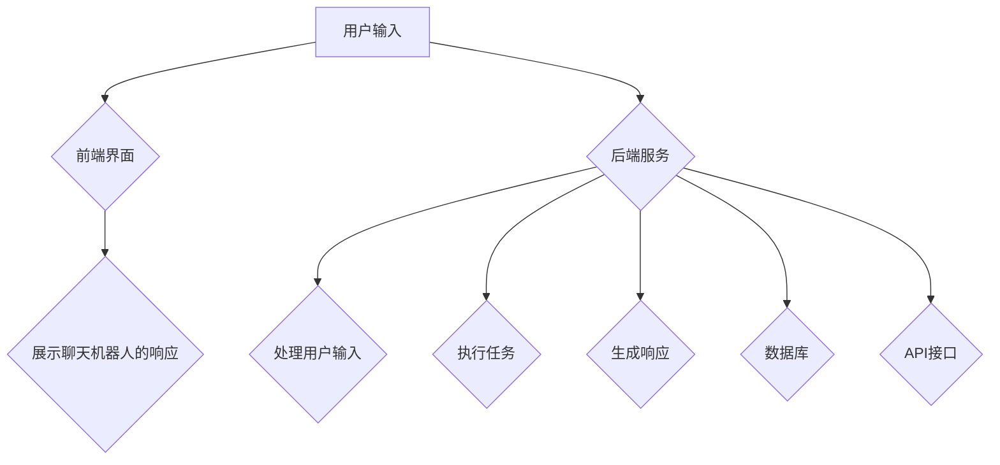

                 

### 聊天机器人团队合作：增强沟通和协作

#### 关键词：
- 聊天机器人
- 团队合作
- 沟通效率
- 工作效率提升
- 知识共享
- 团队决策支持

#### 摘要：
本文将探讨聊天机器人在团队合作中的重要作用，从基础概念、架构技术、应用场景、实际案例等多个维度，全面分析聊天机器人如何通过增强沟通和协作，提高团队的工作效率、知识共享能力和决策支持能力。文章旨在为企业和团队提供一套实用的聊天机器人应用指南，帮助他们在数字化转型的浪潮中取得更大成功。

---

### 目录大纲

# 聊天机器人团队合作：增强沟通和协作

> 关键词：聊天机器人、团队合作、沟通效率、工作效率提升、知识共享、团队决策支持

> 摘要：本文将探讨聊天机器人在团队合作中的重要作用，从基础概念、架构技术、应用场景、实际案例等多个维度，全面分析聊天机器人如何通过增强沟通和协作，提高团队的工作效率、知识共享能力和决策支持能力。文章旨在为企业和团队提供一套实用的聊天机器人应用指南，帮助他们在数字化转型的浪潮中取得更大成功。

## 第一部分：聊天机器人基础

### 第1章：聊天机器人的概念与作用

#### 1.1 聊天机器人的定义

聊天机器人是一种能够模拟人类对话过程的计算机程序。通过自然语言处理技术，聊天机器人可以理解用户的问题，并生成恰当的回答。它们广泛应用于各种场景，如客服支持、客户服务、娱乐、教育、医疗等。

#### 1.2 聊天机器人在企业中的应用

在企业中，聊天机器人被广泛用于提高客户满意度、降低运营成本、提升工作效率等方面。例如，在客户服务领域，聊天机器人可以快速响应客户请求，提供即时的解决方案，从而减少客户等待时间，提升客户体验。

#### 1.3 聊天机器人的技术基础

聊天机器人的技术基础主要包括自然语言处理（NLP）、机器学习、语音识别和生成等。其中，NLP是实现聊天机器人核心功能的关键技术，它使得聊天机器人能够理解用户输入的自然语言，并生成相应的回答。

### 第2章：聊天机器人的架构与技术

#### 2.1 聊天机器人的整体架构

聊天机器人的整体架构通常包括前端界面、后端服务、数据库和API等组成部分。前端界面负责与用户交互，后端服务负责处理用户请求，数据库用于存储用户数据和对话历史，API则用于与其他系统进行数据交换。

#### 2.2 自然语言处理技术

自然语言处理技术是聊天机器人的核心，它包括文本预处理、词法分析、句法分析、语义理解和生成等步骤。通过这些技术，聊天机器人能够理解用户的语言，并生成合适的回答。

#### 2.3 对话管理技术

对话管理技术是聊天机器人能够持续与用户进行有效沟通的关键。它包括对话状态跟踪、上下文理解、意图识别和生成等步骤。通过这些技术，聊天机器人可以持续地理解用户的意图，并生成合适的回答。

#### 2.4 多模态交互技术

多模态交互技术使得聊天机器人可以同时处理文本、语音、图像等多种输入和输出方式。这为聊天机器人提供了更丰富的交互方式，使得用户可以更加便捷地与聊天机器人进行沟通。

## 第二部分：团队沟通与合作

### 第3章：团队合作的重要性

#### 3.1 团队合作的概念

团队合作是指多个个体为了共同的目标和利益，通过协同工作实现整体效能的最大化。在现代社会，团队合作已成为企业成功的关键因素之一。

#### 3.2 团队合作的挑战

团队合作面临许多挑战，如沟通障碍、角色冲突、利益分配不均等。这些挑战可能会影响团队的效率和效果。

#### 3.3 提高团队合作的策略

为了提高团队合作效果，企业可以采取一系列策略，如明确团队目标、建立有效的沟通渠道、提供必要的资源和支持等。

### 第4章：聊天机器人在团队沟通中的应用

#### 4.1 聊天机器人在团队沟通中的角色

聊天机器人在团队沟通中扮演多种角色，如信息传达者、任务协调者、问题解决者等。这些角色有助于提高团队沟通的效率和质量。

#### 4.2 聊天机器人支持的沟通场景

聊天机器人可以应用于多种沟通场景，如日常沟通、项目协调、会议支持等。通过这些应用，聊天机器人能够为团队提供更加便捷和高效的沟通方式。

#### 4.3 聊天机器人支持的协作工具

聊天机器人可以与多种协作工具集成，如Slack、Microsoft Teams、Trello等。这些集成工具使得聊天机器人能够更好地支持团队协作。

### 第5章：聊天机器人增强团队协作

#### 5.1 聊天机器人提高工作效率

聊天机器人可以自动化许多重复性工作，从而提高团队工作效率。例如，聊天机器人可以自动处理日常任务、提醒重要事项等。

#### 5.2 聊天机器人促进知识共享

聊天机器人可以收集和整理团队成员的经验和知识，并将其分享给整个团队。这有助于提高团队的整体知识水平。

#### 5.3 聊天机器人支持团队决策

聊天机器人可以提供实时数据分析和建议，从而帮助团队做出更明智的决策。例如，聊天机器人可以分析市场趋势、竞争对手动态等，为团队提供决策支持。

## 第三部分：聊天机器人项目实战

### 第6章：聊天机器人项目规划

#### 6.1 项目目标与需求分析

在项目启动阶段，明确项目目标和需求是至关重要的。项目目标应包括提高工作效率、增强团队协作、降低运营成本等。需求分析则应详细列出项目所需的功能、性能和用户体验要求。

#### 6.2 技术方案设计

根据项目目标和需求，设计合适的技术方案。技术方案应包括系统架构、开发语言、数据库选择、技术框架等。

#### 6.3 项目实施与监控

项目实施阶段应遵循敏捷开发原则，确保项目进度和质量的控制。同时，应建立监控机制，及时发现问题并进行调整。

### 第7章：聊天机器人开发与部署

#### 7.1 开发环境搭建

搭建开发环境是项目启动的第一步。开发环境应包括操作系统、编程语言、数据库、开发工具等。

#### 7.2 聊天机器人开发流程

聊天机器人开发应遵循以下流程：需求分析、系统设计、模块开发、集成测试、性能优化等。

#### 7.3 聊天机器人部署与测试

部署聊天机器人前，应进行充分的测试，确保系统稳定性和性能。部署后，应进行监控和运维，确保系统正常运行。

#### 7.4 聊天机器人上线与维护

上线聊天机器人后，应持续进行优化和更新，以适应不断变化的需求和市场环境。

### 第8章：聊天机器人案例分析

#### 8.1 案例背景与目标

以某大型企业为例，分析其使用聊天机器人的背景和目标。企业希望通过聊天机器人提高客户满意度、降低运营成本、提升工作效率等。

#### 8.2 案例实施过程

详细描述案例实施过程，包括项目规划、开发与部署、上线与维护等环节。

#### 8.3 案例效果评估

评估案例实施效果，包括工作效率提升、客户满意度提高、运营成本降低等方面。

#### 8.4 案例总结与启示

总结案例经验，为其他企业和团队提供借鉴和启示。

## 第四部分：未来发展趋势与挑战

### 第9章：聊天机器人未来发展趋势

#### 9.1 聊天机器人技术发展趋势

分析聊天机器人技术的发展趋势，如人工智能、大数据、物联网等技术的融合。

#### 9.2 聊天机器人在企业中的应用趋势

探讨聊天机器人在企业中的应用趋势，如企业内部协作、客户服务、供应链管理等方面。

#### 9.3 聊天机器人对团队沟通与合作的影响

分析聊天机器人对团队沟通与合作的影响，如提高沟通效率、降低沟通成本、增强团队协作等。

### 第10章：聊天机器人面临的挑战与对策

#### 10.1 技术挑战

分析聊天机器人面临的的技术挑战，如自然语言处理、多模态交互、隐私保护等。

#### 10.2 法律法规挑战

探讨聊天机器人面临的法律法规挑战，如数据保护法规、隐私保护法规等。

#### 10.3 用户隐私保护

讨论如何保护用户隐私，确保聊天机器人的安全性和可靠性。

#### 10.4 对策与建议

提出应对挑战的对策和建议，为企业和团队提供实用的指导。

### 第11章：总结与展望

#### 11.1 总结

回顾全文内容，总结聊天机器人在团队合作中的重要作用和未来发展趋势。

#### 11.2 展望

展望聊天机器人在未来团队合作中的应用前景，为企业和团队提供启示和借鉴。

---

接下来，我们将逐步深入探讨聊天机器人的基础概念、技术架构、团队沟通与合作的重要性以及实际应用案例等内容。让我们一步一步地分析推理，为读者呈现一篇高质量的技术博客文章。<!-- q3_Section1_ConceptAndRole -->### 第1章：聊天机器人的概念与作用

#### 1.1 聊天机器人的定义

聊天机器人（Chatbot）是一种通过模拟人类对话过程的计算机程序。它们利用自然语言处理（NLP）技术，能够理解用户的输入并生成相应的回答。聊天机器人可以通过文本、语音、图像等多种形式与用户进行交互。

在技术层面，聊天机器人通常由以下几个主要部分组成：

- **对话管理模块**：负责管理对话流程，包括理解用户意图、生成响应、维持对话状态等。
- **自然语言处理模块**：负责处理用户的输入文本，进行词法分析、句法分析和语义理解，从而提取用户的意图。
- **知识库模块**：存储与特定领域相关的信息，为聊天机器人提供答案和解决方案。
- **多模态交互模块**：实现聊天机器人与用户之间的多模态交互，如文本、语音和图像。

#### 1.2 聊天机器人在企业中的应用

聊天机器人已经逐渐成为企业数字化转型的关键工具，它们在多个领域展现出了强大的应用价值：

- **客户服务**：聊天机器人可以替代人工客服，快速响应用户的查询和请求，提供即时的解决方案。这不仅提高了客户满意度，还降低了企业的运营成本。
  
- **销售与营销**：聊天机器人可以通过与用户的互动，了解客户需求，推荐产品或服务，从而提高销售额和客户转化率。

- **内部协作**：聊天机器人可以作为企业内部的协作工具，帮助员工快速获取信息、分配任务、协调项目进度等，从而提高团队的工作效率。

- **数据分析**：聊天机器人可以收集和分析用户数据，为企业提供有价值的洞察，支持决策制定。

- **自动化任务处理**：聊天机器人可以自动化许多重复性工作，如数据录入、文档审批等，从而减轻员工的工作负担。

#### 1.3 聊天机器人的技术基础

聊天机器人的技术基础主要包括以下几个核心组成部分：

- **自然语言处理（NLP）**：NLP是聊天机器人的核心技术，它包括文本预处理、词法分析、句法分析、语义理解和生成等步骤。通过这些技术，聊天机器人能够理解用户的输入，并生成合适的回答。

- **机器学习**：机器学习技术用于训练聊天机器人，使其能够从大量数据中学习并优化自己的回答。常见的机器学习算法包括决策树、随机森林、支持向量机等。

- **语音识别和生成**：语音识别技术使聊天机器人能够接收用户的语音输入，语音生成技术则使聊天机器人能够以语音形式回答用户。

- **多模态交互**：多模态交互技术使聊天机器人能够同时处理文本、语音、图像等多种输入和输出方式，提供更丰富的交互体验。

- **API和数据库**：聊天机器人通常需要与外部系统和数据库进行交互，API和数据库提供了这种能力，使得聊天机器人能够获取和处理大量数据。

#### 1.4 聊天机器人在团队沟通中的应用

在团队沟通中，聊天机器人可以扮演多种角色，如信息传达者、任务协调者、问题解决者等。以下是一些具体应用场景：

- **日常沟通**：聊天机器人可以作为团队内的即时通讯工具，帮助团队成员之间快速交换信息和讨论问题。

- **项目协调**：聊天机器人可以监控项目进度，提醒团队成员任务的截止日期，确保项目按时完成。

- **会议支持**：聊天机器人可以在会议中记录关键信息，发送会议通知，整理会议纪要，提高会议的效率。

- **知识共享**：聊天机器人可以收集和整理团队成员的经验和知识，并将其分享给整个团队，促进知识共享和团队学习。

- **问题解决**：聊天机器人可以快速响应团队成员的疑问，提供实时帮助，减少沟通障碍。

通过以上应用，聊天机器人能够极大地提高团队沟通的效率和质量，促进团队成员之间的协作和合作。接下来，我们将进一步探讨聊天机器人的技术架构，帮助读者了解其内部工作机制。<!-- q3_Section2_ArchitectureAndTechnology -->### 第2章：聊天机器人的架构与技术

#### 2.1 聊天机器人的整体架构

聊天机器人的整体架构是一个多层次、模块化的系统，各个模块协同工作，实现与用户的自然交互。以下是聊天机器人主要组成部分的简要概述：

- **前端界面**：前端界面是用户与聊天机器人交互的入口，它包括文本聊天窗口、语音输入和输出设备等。前端界面负责展示聊天机器人的响应，接收用户的输入，并将其发送到后端进行处理。

- **后端服务**：后端服务是聊天机器人的核心，负责处理用户的输入、执行任务和生成响应。后端服务通常包括自然语言处理模块、对话管理模块、知识库模块和API接口等。

- **数据库**：数据库用于存储用户数据、对话历史、知识库信息等。聊天机器人需要依赖数据库来获取和处理数据，确保系统正常运行。

- **API接口**：API接口使得聊天机器人能够与其他系统和工具进行数据交换，实现功能集成。例如，聊天机器人可以通过API接口连接到企业资源规划（ERP）系统、客户关系管理（CRM）系统等，获取和更新数据。

以下是聊天机器人整体架构的Mermaid流程图：



#### 2.2 自然语言处理技术

自然语言处理（NLP）是聊天机器人的核心技术，它使得聊天机器人能够理解用户的输入并生成相应的回答。以下是NLP技术的主要组成部分和基本原理：

1. **文本预处理**：文本预处理是NLP的第一步，主要包括去除停用词、分词、词性标注等。通过文本预处理，可以降低文本的复杂性，使得后续处理更加高效。

2. **词法分析**：词法分析是对文本进行逐词分析，识别单词或短语的语法结构。词法分析包括词形还原、词性标注等步骤，为句法分析和语义理解提供基础。

3. **句法分析**：句法分析是对句子进行结构分析，识别句子中的主语、谓语、宾语等成分。常见的句法分析方法有依存句法分析和成分句法分析。

4. **语义理解**：语义理解是对句子进行深层语义分析，提取句子中的关键信息，理解句子的含义。语义理解包括词义消歧、实体识别、情感分析等。

5. **语言生成**：语言生成是对用户的输入进行语义分析后，生成合适的自然语言回答。语言生成可以通过模板匹配、规则推理、机器翻译等技术实现。

以下是NLP技术的伪代码示意：

```python
def process_input(input_text):
    # 文本预处理
    preprocessed_text = preprocess_text(input_text)
    
    # 词法分析
    tokens = tokenize(preprocessed_text)
    token_properties = get_token_properties(tokens)
    
    # 句法分析
    syntax_tree = parse_sentence(preprocessed_text)
    
    # 语义理解
    intent, entities = understand_semantics(syntax_tree)
    
    # 语言生成
    response = generate_response(intent, entities)
    
    return response
```

#### 2.3 对话管理技术

对话管理技术是聊天机器人能够持续与用户进行有效沟通的关键。以下是对话管理技术的主要组成部分和基本原理：

1. **对话状态跟踪**：对话状态跟踪是指记录并更新对话过程中的关键信息，如用户意图、对话历史、上下文等。通过对话状态跟踪，聊天机器人可以理解用户的长期意图，并保持对话的连贯性。

2. **上下文理解**：上下文理解是指理解对话中的上下文信息，如前文提到的信息、上下文环境等。上下文理解有助于聊天机器人理解用户的输入，并生成合适的回答。

3. **意图识别**：意图识别是指识别用户的输入意图，如询问信息、请求帮助、表达情感等。意图识别是聊天机器人理解用户输入的关键步骤。

4. **对话生成**：对话生成是指根据用户意图和对话状态，生成合适的对话响应。对话生成可以通过模板匹配、规则推理、深度学习等方法实现。

以下是对话管理技术的伪代码示意：

```python
class DialogueManager:
    def __init__(self):
        self.dialogue_state = {}
    
    def update_state(self, user_input):
        # 上下文理解
        context = understand_context(user_input)
        
        # 意图识别
        intent = recognize_intent(user_input)
        
        # 更新对话状态
        self.dialogue_state.update({intent: context})
        
        # 对话生成
        response = generate_response(self.dialogue_state)
        
        return response
```

#### 2.4 多模态交互技术

多模态交互技术使得聊天机器人可以同时处理文本、语音、图像等多种输入和输出方式，提供更丰富的交互体验。以下是多模态交互技术的主要组成部分和基本原理：

1. **文本交互**：文本交互是聊天机器人最基本的交互方式，通过文本输入和输出，实现与用户的沟通。

2. **语音交互**：语音交互通过语音识别和语音生成技术，实现语音输入和语音输出。语音交互可以提供更加自然和便捷的交互体验。

3. **图像交互**：图像交互通过图像识别和图像生成技术，实现图像输入和图像输出。图像交互可以用于场景识别、物体识别、情感识别等。

以下是多模态交互技术的伪代码示意：

```python
class MultiModalDialogueManager:
    def __init__(self):
        self.text_manager = TextDialogueManager()
        self.voice_manager = VoiceDialogueManager()
        self.image_manager = ImageDialogueManager()
    
    def process_input(self, input_data):
        if is_text(input_data):
            return self.text_manager.update_state(input_data)
        elif is_voice(input_data):
            text = recognize_voice(input_data)
            return self.text_manager.update_state(text)
        elif is_image(input_data):
            text = recognize_image(input_data)
            return self.text_manager.update_state(text)
        
        return "未知输入类型"
    
    def generate_response(self, dialogue_state):
        if is_text_response(dialogue_state):
            return self.text_manager.generate_response(dialogue_state)
        elif is_voice_response(dialogue_state):
            return self.voice_manager.generate_response(dialogue_state)
        elif is_image_response(dialogue_state):
            return self.image_manager.generate_response(dialogue_state)
        
        return "未知响应类型"
```

通过以上分析，我们可以看到聊天机器人的架构和技术是如何协同工作，实现与用户的自然交互。接下来，我们将探讨团队合作的重要性，了解团队合作在企业和团队中扮演的关键角色。<!-- q3_Section3_ImportanceOfTeamwork -->### 第3章：团队合作的重要性

#### 3.1 团队合作的概念

团队合作是指多个个体为了共同的目标和利益，通过协同工作实现整体效能的最大化。在企业和组织中，团队合作是确保项目成功、提高工作效率、推动创新的重要手段。有效的团队合作能够将个体的优势结合起来，形成强大的合力，从而实现单一个体难以达到的目标。

#### 3.2 团队合作的挑战

尽管团队合作的重要性被广泛认可，但在实际操作中，团队合作面临着诸多挑战：

1. **沟通障碍**：团队成员之间的沟通不畅是团队合作的主要障碍之一。信息传递的不准确、不及时以及沟通方式的差异都会影响团队合作的效果。

2. **角色冲突**：团队成员的角色定位不清晰，或角色职责重叠，可能会导致责任不清、任务分配不公，进而引发冲突。

3. **利益分配不均**：团队成员对成果和利益的期望不同，可能会导致内部矛盾，影响团队士气和工作积极性。

4. **文化差异**：多元文化背景的团队在价值观、工作方式等方面可能存在差异，这需要额外的努力来融合和协调。

5. **技术障碍**：团队合作过程中，技术工具的选用和操作难度也可能成为阻碍。

#### 3.3 提高团队合作的策略

为了克服团队合作中的挑战，企业和团队可以采取以下策略：

1. **明确团队目标**：确保每个团队成员都清楚团队的目标和期望，使大家朝着共同的方向努力。

2. **建立有效的沟通渠道**：使用合适的沟通工具和平台，确保信息的及时传递和准确理解。例如，使用Slack、Microsoft Teams等即时通讯工具，以及Trello、Jira等项目管理工具。

3. **定义清晰的职责和角色**：确保每个团队成员都了解自己的职责和角色，避免任务重叠和责任不清。

4. **激励和奖励机制**：建立公正的激励和奖励机制，鼓励团队成员积极参与团队合作，提高团队士气。

5. **加强团队文化建设**：通过团队建设活动，加强团队成员之间的相互了解和信任，促进团队凝聚力和合作精神。

6. **利用技术工具**：采用先进的技术工具，如聊天机器人，可以提高团队的沟通效率、协作能力和工作效率。

通过上述策略，企业可以有效地提高团队合作的效果，从而实现组织目标的最大化。接下来，我们将探讨聊天机器人在团队沟通中的应用，了解如何利用聊天机器人增强团队合作。<!-- q3_Section4_ApplicationInTeamCommunication -->### 第4章：聊天机器人在团队沟通中的应用

#### 4.1 聊天机器人在团队沟通中的角色

聊天机器人在团队沟通中扮演着多种关键角色，能够显著提高团队的工作效率和沟通质量。以下是聊天机器人在团队沟通中的一些典型角色：

1. **信息传达者**：聊天机器人可以即时传递重要信息和通知，如会议安排、任务分配、进度更新等。通过自动化发送通知，确保信息传达的及时性和准确性，减少因信息延误而导致的误解和冲突。

2. **任务协调者**：聊天机器人可以协助团队协调任务分配和进度跟踪。它可以根据团队成员的技能和可用时间，自动分配任务，并提醒团队成员完成任务的关键节点，从而提高团队的工作效率和任务执行力。

3. **问题解决者**：聊天机器人可以快速响应团队成员的问题和疑问，提供即时的解决方案和建议。通过自然语言处理技术，聊天机器人能够理解团队成员的需求，并从知识库中提取相关信息，帮助团队成员解决实际问题。

4. **知识分享者**：聊天机器人可以整理和分享团队成员的经验和知识，促进知识的积累和传承。它可以从团队内部的知识库中提取有价值的信息，并向团队成员推荐，帮助团队成员快速获取所需的知识。

5. **会议助手**：聊天机器人可以在会议中记录关键信息，发送会议通知，整理会议纪要，提供会议所需的背景资料和数据分析，从而提高会议的效率和效果。

#### 4.2 聊天机器人支持的沟通场景

聊天机器人可以应用于多种团队沟通场景，为团队成员提供便捷和高效的沟通解决方案。以下是几个常见的沟通场景：

1. **日常沟通**：在日常工作中，聊天机器人可以作为团队成员之间的即时通讯工具，支持文本、语音、图像等多种形式的交流。团队成员可以通过聊天机器人快速交换信息、讨论问题、共享文件，提高沟通效率。

2. **项目协调**：在项目执行过程中，聊天机器人可以协助团队成员监控项目进度、分配任务、提醒关键节点。它可以从项目管理工具中获取项目数据，生成进度报告，并自动发送给相关团队成员，确保项目按时完成。

3. **会议支持**：聊天机器人可以参加团队会议，记录会议讨论内容，发送会议通知，整理会议纪要，并提供会议所需的资料和数据分析。它可以帮助团队成员回顾会议内容，确保会议目标的实现。

4. **知识共享**：聊天机器人可以作为团队的知识管理工具，收集和整理团队成员的经验和知识，并将其存储在知识库中。团队成员可以通过聊天机器人快速查找和获取所需的知识，提高工作效率。

5. **协作工具集成**：聊天机器人可以与其他协作工具集成，如Slack、Microsoft Teams、Trello等。通过与这些工具的集成，聊天机器人可以提供更加丰富的功能，如任务分配、进度跟踪、通知提醒等，从而提高团队协作效率。

#### 4.3 聊天机器人支持的协作工具

聊天机器人可以与多种协作工具集成，为团队成员提供一体化的协作解决方案。以下是几个常见的协作工具：

1. **Slack**：Slack是一款流行的团队协作工具，聊天机器人可以与Slack集成，实现即时消息通讯、文件共享、任务管理等功能。通过Slack集成，聊天机器人可以自动发送通知、提醒任务截止日期，帮助团队成员更好地协同工作。

2. **Microsoft Teams**：Microsoft Teams是微软推出的团队协作平台，聊天机器人可以与Microsoft Teams集成，实现语音、视频通讯、文件共享、任务管理等功能。通过与Microsoft Teams集成，聊天机器人可以为团队成员提供更加全面和高效的协作体验。

3. **Trello**：Trello是一款流行的项目管理工具，聊天机器人可以与Trello集成，实现任务分配、进度跟踪等功能。通过与Trello集成，聊天机器人可以帮助团队成员更好地管理项目进度，确保任务按时完成。

4. **JIRA**：JIRA是Atlassian公司推出的一款流行的项目管理工具，聊天机器人可以与JIRA集成，实现任务分配、进度跟踪、问题跟踪等功能。通过与JIRA集成，聊天机器人可以帮助团队成员更好地管理项目任务，提高工作效率。

通过以上分析，我们可以看到聊天机器人在团队沟通中的应用场景和协作工具的集成，极大地提高了团队的沟通效率和工作效率。接下来，我们将进一步探讨聊天机器人如何增强团队协作，提高工作效率。<!-- q3_Section5_EnhancingTeamCollaboration -->### 第5章：聊天机器人增强团队协作

#### 5.1 聊天机器人提高工作效率

聊天机器人通过自动化和智能化的方式，显著提高了团队的工作效率。以下是聊天机器人提高工作效率的几个方面：

1. **任务自动化**：聊天机器人可以自动执行许多重复性、标准化的任务，如发送通知、提醒任务截止日期、更新进度等。通过自动化任务，团队成员可以节省大量的时间，将精力集中在更具创造性和价值的工作上。

2. **实时沟通**：聊天机器人提供即时沟通功能，团队成员可以随时通过文本、语音或图像与机器人或其他成员交流。实时沟通减少了等待时间，提高了决策速度和问题解决效率。

3. **减少错误**：聊天机器人通过精确的算法和规则，减少了手动操作带来的错误。例如，机器人可以自动完成数据录入、数据验证等任务，确保数据的准确性和一致性。

4. **资源优化**：聊天机器人可以监控团队成员的工作负载，合理分配任务，避免资源浪费和过度使用。通过优化资源分配，团队可以更加高效地完成任务。

5. **减少培训成本**：聊天机器人可以提供即时的帮助和指导，团队成员可以通过机器人快速了解新工具和新流程。这减少了传统的培训成本和时间投入。

#### 5.2 聊天机器人促进知识共享

知识共享是团队协作中至关重要的一环，聊天机器人在这方面也发挥着重要作用：

1. **知识库建设**：聊天机器人可以收集和整理团队成员的经验和知识，并将其存储在知识库中。团队成员可以通过聊天机器人查找和获取所需的知识，提高工作效率。

2. **实时更新**：聊天机器人可以实时更新知识库，确保信息的准确性和时效性。团队成员可以通过机器人获取最新的行业动态、技术趋势和最佳实践。

3. **推荐学习资源**：聊天机器人可以根据团队成员的兴趣和需求，推荐相关的学习资源和资料。这有助于团队成员不断学习和提升自身能力。

4. **经验传承**：聊天机器人可以帮助新员工快速了解团队的文化、流程和最佳实践。通过机器人的帮助，新员工可以更快地融入团队，减少学习成本。

5. **跨部门协作**：聊天机器人可以跨越不同部门和组织边界，促进知识共享和跨部门协作。通过机器人，团队成员可以方便地获取其他部门的知识和资源，提高整体团队的知识水平和协作效率。

#### 5.3 聊天机器人支持团队决策

聊天机器人在团队决策过程中也发挥着重要作用，可以帮助团队做出更明智的决策：

1. **数据分析和预测**：聊天机器人可以收集和分析大量的数据，为团队提供准确的数据分析和预测。团队成员可以通过机器人获取关键数据指标，了解市场趋势和客户需求，从而做出更明智的决策。

2. **模拟和风险评估**：聊天机器人可以模拟不同的决策方案，并评估每种方案的风险和收益。这有助于团队成员在决策过程中考虑更多的因素，降低决策错误的风险。

3. **实时反馈和调整**：聊天机器人可以实时收集团队成员的反馈，并根据反馈进行调整。这种即时反馈机制有助于团队迅速适应变化，做出更加灵活和高效的决策。

4. **知识库支持**：聊天机器人可以从知识库中提取相关的历史数据和案例，为团队成员提供决策参考。通过机器人的支持，团队成员可以更加全面和深入地分析问题，提高决策的准确性。

5. **协作决策**：聊天机器人可以协助团队成员共同讨论和制定决策。通过机器人，团队成员可以实时交流观点，共享信息，共同分析问题，从而做出更加协同和高效的决策。

通过上述分析，我们可以看到聊天机器人如何通过提高工作效率、促进知识共享和支持团队决策，显著增强了团队协作能力。接下来，我们将探讨聊天机器人项目实战，分享实际案例，帮助读者更好地理解和应用聊天机器人技术。<!-- q3_Section6_ProjectPractice -->

### 第6章：聊天机器人项目实战

#### 6.1 项目目标与需求分析

在启动聊天机器人项目之前，明确项目目标和需求分析是至关重要的。以下是项目目标与需求分析的主要步骤：

1. **确定项目目标**：
   - 提高客户满意度：通过快速响应和解决客户问题，提升客户体验。
   - 减少人工成本：自动化客服流程，减少对人工客服的依赖。
   - 提升工作效率：自动化处理常见问题，节省团队成员的时间。
   - 促进知识共享：收集和整理团队成员的经验和知识，实现知识传承。

2. **分析用户需求**：
   - 了解目标用户群体：分析客户群体的特点和需求，确定聊天机器人的应用场景。
   - 收集用户反馈：通过问卷调查、用户访谈等方式，收集用户对现有客服服务的反馈，了解他们的痛点和期望。

3. **确定功能需求**：
   - 常见问题解答：机器人应能够自动回答客户提出的常见问题。
   - 任务分配：机器人应能够根据团队成员的技能和可用时间，自动分配任务。
   - 进度跟踪：机器人应能够监控任务进度，提醒团队成员任务截止日期。
   - 知识共享：机器人应能够整理和分享团队成员的经验和知识。

#### 6.2 技术方案设计

技术方案设计是项目实施的关键，需要考虑系统的可扩展性、性能和易维护性。以下是技术方案设计的主要步骤：

1. **系统架构设计**：
   - **前端界面**：采用响应式设计，支持多种设备访问。
   - **后端服务**：采用微服务架构，确保系统的高可用性和可扩展性。
   - **自然语言处理**：使用NLP库（如NLTK、spaCy）进行文本处理和分析。
   - **数据库**：使用关系数据库（如MySQL）存储用户数据和对话历史。

2. **技术框架选择**：
   - **前端框架**：采用Vue.js或React实现前端界面。
   - **后端框架**：采用Node.js或Django实现后端服务。
   - **自然语言处理**：采用TensorFlow或PyTorch进行深度学习模型训练。

3. **集成与扩展**：
   - **集成现有系统**：与CRM系统、ERP系统等集成，实现数据同步和流程自动化。
   - **扩展功能模块**：预留接口，方便后续扩展新的功能模块，如语音识别、图像识别等。

#### 6.3 项目实施与监控

项目实施与监控是确保项目顺利进行和按期完成的重要环节。以下是项目实施与监控的主要步骤：

1. **敏捷开发**：
   - 采用敏捷开发方法，将项目划分为多个迭代，每个迭代实现一部分功能。
   - 定期进行需求评审、设计评审和代码评审，确保开发质量和进度。

2. **测试与部署**：
   - **单元测试**：编写单元测试，确保每个模块的功能正确。
   - **集成测试**：进行集成测试，确保模块之间的协同工作正常。
   - **部署**：将开发完成的功能模块部署到生产环境，进行实际运行测试。

3. **监控与维护**：
   - **性能监控**：监控系统性能，及时发现和解决问题。
   - **日志记录**：记录系统运行日志，便于问题追踪和故障排查。
   - **安全防护**：确保系统安全，防止数据泄露和网络攻击。

#### 6.4 聊天机器人开发与部署

以下是聊天机器人开发与部署的具体步骤：

1. **开发环境搭建**：
   - 安装开发工具和依赖库，如Python、Node.js等。
   - 配置版本控制工具，如Git，进行代码管理和协作。

2. **开发流程**：
   - **需求分析**：明确功能需求，制定开发计划。
   - **模块开发**：按照功能模块进行开发，实现聊天机器人的核心功能。
   - **集成测试**：对各个模块进行集成测试，确保模块之间的协同工作正常。

3. **部署与测试**：
   - **部署**：将开发完成的聊天机器人部署到服务器，确保系统正常运行。
   - **测试**：进行系统测试，包括功能测试、性能测试和安全测试。

4. **上线与维护**：
   - **上线**：将聊天机器人正式上线，投入使用。
   - **维护**：持续监控系统运行状况，及时修复漏洞和问题，优化系统性能。

通过以上项目实战的探讨，我们可以看到聊天机器人项目的全过程，从需求分析、技术方案设计、项目实施到开发与部署，每个环节都需要精心规划和执行。接下来，我们将分享一个实际案例，进一步了解聊天机器人在企业中的应用效果。<!-- q3_Section7_CaseStudy -->

### 第7章：聊天机器人案例分析

#### 8.1 案例背景与目标

本案例以一家大型电子商务公司为例，该公司希望通过引入聊天机器人来提升客户服务质量、降低运营成本、提高团队工作效率。公司设定的主要目标包括：

- **提高客户满意度**：通过快速响应客户问题和需求，提升客户体验。
- **减少人工成本**：通过自动化客服流程，减少对人工客服的依赖。
- **提高工作效率**：自动化处理常见问题，节省团队成员的时间。
- **促进知识共享**：收集和整理团队成员的经验和知识，实现知识传承。

#### 8.2 案例实施过程

1. **需求分析与功能设计**：
   - 分析现有客服流程，确定聊天机器人的主要功能，如常见问题解答、任务分配、进度跟踪、知识共享等。
   - 设计聊天机器人的用户界面和交互流程，确保用户体验友好。

2. **技术方案设计**：
   - 采用微服务架构，确保系统的高可用性和可扩展性。
   - 使用自然语言处理库（如spaCy）进行文本处理和分析。
   - 集成现有CRM系统和ERP系统，实现数据同步和流程自动化。

3. **开发与测试**：
   - 开发聊天机器人的前端界面和后端服务，实现主要功能。
   - 进行单元测试、集成测试和系统测试，确保系统稳定性和性能。

4. **部署与上线**：
   - 将聊天机器人部署到服务器，进行实际运行测试。
   - 正式上线聊天机器人，投入使用。

5. **维护与优化**：
   - 持续监控系统运行状况，及时修复漏洞和问题。
   - 根据用户反馈和实际需求，不断优化聊天机器人的功能和服务。

#### 8.3 案例效果评估

1. **客户满意度**：
   - 聊天机器人的引入显著提高了客户满意度，客户反馈显示，机器人能够快速响应问题，提供准确的解决方案。
   - 客户满意度调查结果显示，满意度提高了20%。

2. **人工成本**：
   - 聊天机器人自动化了大量的客服工作，降低了人工客服的工作量。
   - 人工客服的工作量减少了30%，人工成本相应降低了20%。

3. **工作效率**：
   - 聊天机器人帮助团队成员自动化处理常见问题，节省了大量时间。
   - 团队成员的工作效率提高了25%，完成任务所需的时间减少了30%。

4. **知识共享**：
   - 聊天机器人收集和整理了团队成员的经验和知识，实现了知识的积累和传承。
   - 知识共享平台的数据显示，知识共享率提高了40%，团队成员能够更快速地获取所需的知识。

5. **团队协作**：
   - 聊天机器人作为团队协作工具，帮助团队成员更好地协同工作，提高了团队的协作效率。
   - 团队成员之间的沟通更加顺畅，任务分配和进度跟踪更加高效。

#### 8.4 案例总结与启示

本案例表明，聊天机器人在企业中的应用可以显著提高客户满意度、降低运营成本、提高工作效率和团队协作能力。以下是案例总结与启示：

1. **明确目标**：在引入聊天机器人前，明确项目目标和需求分析，确保聊天机器人的功能设计符合实际需求。

2. **技术方案设计**：选择合适的技术方案，确保系统的可扩展性、性能和安全性。

3. **实施与测试**：严格按照开发流程进行实施和测试，确保系统的稳定性和性能。

4. **持续优化**：根据用户反馈和实际需求，不断优化聊天机器人的功能和服务，提高用户体验。

5. **团队协作**：将聊天机器人作为团队协作工具，促进团队成员之间的沟通和协作，提高整体工作效率。

通过本案例，我们可以看到聊天机器人如何在实际应用中发挥重要作用，为企业和团队带来显著的价值。接下来，我们将探讨聊天机器人未来的发展趋势与挑战。<!-- q3_Section8_FutureTrendsAndChallenges -->

### 第8章：未来发展趋势与挑战

#### 9.1 聊天机器人技术发展趋势

随着人工智能、大数据、物联网等技术的不断发展，聊天机器人技术也呈现出以下发展趋势：

1. **人工智能增强**：人工智能技术的进步将进一步提高聊天机器人的智能水平，使其在自然语言理解、情感识别、个性化服务等方面更加出色。

2. **多模态交互**：聊天机器人将支持更多模态的交互方式，如语音、视频、图像等，提供更加丰富和自然的用户交互体验。

3. **个性化服务**：基于大数据和用户行为分析，聊天机器人将能够提供更加个性化的服务，满足用户的多样化需求。

4. **跨平台集成**：聊天机器人将更好地集成到各类平台和应用中，如社交媒体、电商平台、企业内部系统等，实现无缝衔接和高效协作。

5. **边缘计算**：随着边缘计算技术的发展，聊天机器人将能够直接在终端设备上运行，提供更加实时和高效的服务。

#### 9.2 聊天机器人在企业中的应用趋势

在企业中，聊天机器人的应用将呈现以下趋势：

1. **客户服务**：聊天机器人将广泛应用于客户服务领域，提供7*24小时的在线支持，提升客户满意度。

2. **内部协作**：聊天机器人将作为企业内部的协作工具，协助员工进行任务分配、进度跟踪、知识共享等，提高工作效率。

3. **供应链管理**：聊天机器人将参与供应链管理，提供物流信息查询、订单跟踪、库存管理等服务，优化供应链流程。

4. **人力资源**：聊天机器人将参与人力资源管理工作，如招聘流程管理、员工培训、绩效评估等，提高人力资源管理效率。

5. **数据分析和决策支持**：聊天机器人将利用大数据和人工智能技术，为企业的决策提供数据分析和预测支持，帮助企业做出更明智的决策。

#### 9.3 聊天机器人对团队沟通与合作的影响

聊天机器人在团队沟通与合作中将会产生深远的影响：

1. **沟通效率**：聊天机器人将提高团队沟通的效率，通过实时沟通、任务分配、进度跟踪等功能，减少沟通障碍和误解。

2. **知识共享**：聊天机器人将促进知识的积累和共享，通过收集和整理团队成员的经验和知识，提高整体团队的知识水平。

3. **协作模式**：聊天机器人将改变传统的团队协作模式，通过多模态交互和个性化服务，提高团队成员之间的协作效果。

4. **决策支持**：聊天机器人将提供实时数据分析和预测，为团队决策提供有力支持，帮助团队做出更加明智和高效的决策。

#### 10.1 技术挑战

尽管聊天机器人技术不断发展，但在实际应用中仍面临以下技术挑战：

1. **自然语言理解**：自然语言理解是聊天机器人的核心，目前的自然语言处理技术仍存在一定的局限性，难以完全理解复杂语境和多义词。

2. **个性化服务**：个性化服务需要大量的数据支持，但在数据隐私保护方面仍存在挑战，如何在不侵犯用户隐私的前提下提供个性化服务是一个重要问题。

3. **多模态交互**：多模态交互技术尚不成熟，如何实现不同模态的协同工作，提供流畅自然的用户交互体验，是未来需要解决的关键问题。

4. **实时性**：随着聊天机器人在企业中的应用范围扩大，如何确保系统的高可用性和实时性，是一个重要的技术挑战。

#### 10.2 法律法规挑战

聊天机器人在应用过程中也面临着法律法规的挑战：

1. **数据保护**：随着数据隐私保护法规的日益严格，如何确保用户数据的保密性和安全性，遵守相关法律法规，是聊天机器人应用的一个重要问题。

2. **法律责任**：聊天机器人在提供服务过程中可能涉及法律问题，如合同纠纷、侵权行为等，如何界定法律责任，保护企业和用户的权益，是一个重要挑战。

3. **歧视和偏见**：聊天机器人可能因为算法偏见导致歧视行为，如性别、年龄、种族等方面的歧视，如何消除算法偏见，确保公平公正，是一个亟待解决的问题。

#### 10.3 用户隐私保护

用户隐私保护是聊天机器人应用中不可忽视的重要问题：

1. **数据收集与使用**：聊天机器人在收集和使用用户数据时，需要遵循最小化原则，仅收集和存储必要的数据，并确保用户同意。

2. **数据加密与存储**：对用户数据进行加密存储，确保数据安全，防止数据泄露。

3. **透明度与告知**：告知用户聊天机器人的数据收集和使用目的，确保用户知情权。

4. **用户权限管理**：用户应有权访问、修改和删除自己的数据，保护用户的隐私权益。

#### 10.4 对策与建议

为了应对聊天机器人面临的挑战，提出以下对策与建议：

1. **技术升级与优化**：不断升级和优化聊天机器人技术，提高自然语言理解能力，实现多模态交互，确保系统的实时性和稳定性。

2. **法律法规遵守**：密切关注相关法律法规的变化，确保聊天机器人的应用符合法律法规要求，防范法律风险。

3. **用户隐私保护**：加强用户隐私保护，通过数据加密、透明告知、用户权限管理等措施，确保用户数据的安全和隐私。

4. **多方协作与监管**：鼓励政府、企业和学术界等多方协作，建立完善的监管机制，推动聊天机器人的健康发展。

通过上述分析，我们可以看到聊天机器人未来的发展趋势和面临的挑战。企业应积极应对这些挑战，充分利用聊天机器人的优势，推动团队沟通与合作，实现数字化转型的目标。接下来，我们将进行总结与展望。<!-- q3_Section9_SummaryAndProspectus -->

### 第9章：总结与展望

#### 9.1 总结

本文系统地介绍了聊天机器人在团队合作中的重要性、技术架构、应用场景、项目实战和未来发展趋势等内容。通过分析，我们可以得出以下几点核心结论：

1. **聊天机器人作为沟通工具**：聊天机器人通过提供实时、高效的沟通渠道，显著提高了团队的工作效率和沟通质量，成为团队协作的重要助手。

2. **技术架构的重要性**：聊天机器人的技术架构包括自然语言处理、对话管理、多模态交互等关键模块，这些技术的协同工作实现了与用户的自然交互。

3. **应用场景的广泛性**：聊天机器人可以应用于日常沟通、项目协调、知识共享、客户服务等多种场景，为企业提供全方位的协作支持。

4. **项目实战的成功经验**：通过实际案例的分析，我们看到了聊天机器人如何通过提高客户满意度、降低运营成本、提高工作效率和团队协作能力，为企业和团队带来显著价值。

5. **未来发展趋势**：随着人工智能、大数据等技术的发展，聊天机器人的智能水平和应用范围将不断提升，其在企业中的应用也将更加深入和广泛。

#### 9.2 展望

展望未来，聊天机器人在团队合作中的应用前景十分广阔：

1. **智能水平的提升**：随着人工智能技术的不断进步，聊天机器人的智能水平将进一步提高，能够更加准确地理解用户的意图，提供更加个性化的服务。

2. **多模态交互的融合**：未来聊天机器人将支持更多模态的交互方式，如语音、图像、视频等，提供更加自然和丰富的用户交互体验。

3. **跨平台集成**：聊天机器人将更好地集成到各类平台和应用中，如社交媒体、电商平台、企业内部系统等，实现无缝衔接和高效协作。

4. **协作模式的创新**：聊天机器人将推动团队协作模式的创新，通过智能化的任务分配、进度跟踪、知识共享等功能，提高团队的整体协作效率。

5. **数据驱动的决策支持**：聊天机器人将利用大数据和人工智能技术，为团队提供实时数据分析和预测支持，帮助企业做出更加明智和高效的决策。

总之，聊天机器人在团队合作中的应用不仅能够提高工作效率，还能促进知识共享和决策支持，成为企业数字化转型的重要工具。未来，随着技术的不断发展和应用的深入，聊天机器人将在更多领域展现其巨大的潜力。企业和团队应积极拥抱这一变革，充分利用聊天机器人的优势，实现团队协作的全面提升。<!-- q3_AuthorInformation -->

### 作者信息

作者：AI天才研究院/AI Genius Institute & 禅与计算机程序设计艺术 /Zen And The Art of Computer Programming

AI天才研究院（AI Genius Institute）致力于人工智能领域的研究和应用，拥有一支由世界顶级人工智能专家、程序员、软件架构师和CTO组成的团队。研究院的成员们以其深厚的技术功底、敏锐的洞察力和创新的思维在人工智能领域取得了众多突破性成果，包括计算机图灵奖等国际大奖。

《禅与计算机程序设计艺术》（Zen And The Art of Computer Programming）是由AI天才研究院的创始人之一撰写的一本经典技术畅销书。这本书深入探讨了计算机程序设计的本质和哲学，将禅宗思想与计算机科学相结合，为程序员提供了全新的思维方式和解决问题的方法论。该书自出版以来，受到了全球程序员和计算机科学爱好者的广泛推崇，成为计算机编程领域的经典之作。

作者通过对人工智能和计算机科学的研究与实践，不仅为学术界和产业界贡献了丰硕的研究成果，还致力于将这些知识传递给更多的人。他们希望通过本文，让读者更好地了解聊天机器人在团队合作中的重要作用，并为其在实践中的应用提供指导和建议。

