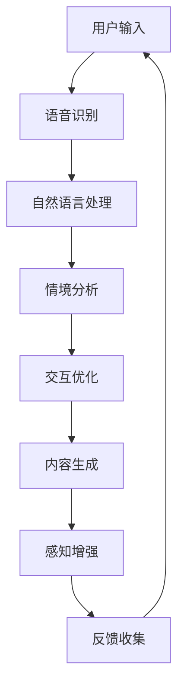
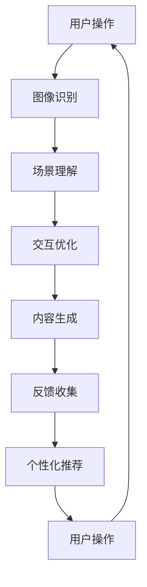
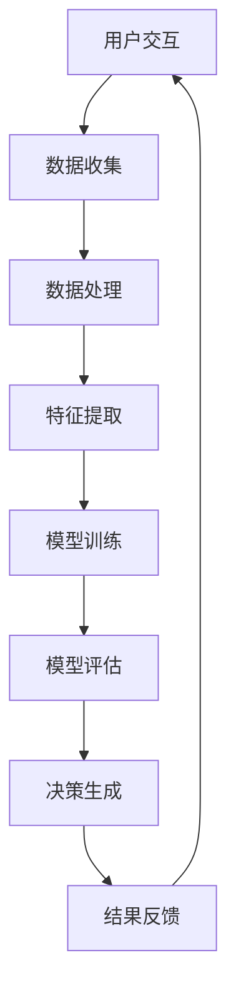
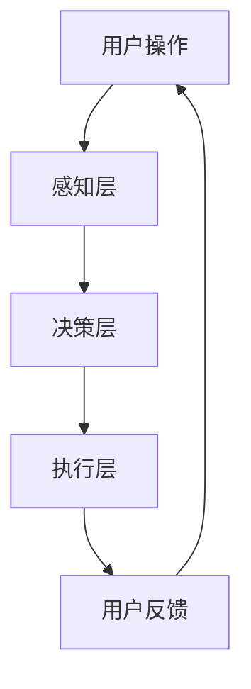

                 

### 虚拟空间中的AI任务与创新

关键词：虚拟空间、人工智能、AI任务、创新应用、发展趋势

摘要：本文深入探讨虚拟空间与人工智能（AI）的交汇点，解析AI在虚拟空间中的任务与创新。我们将从基础概念、核心架构、AI任务应用以及未来发展等多个角度，系统性地分析虚拟空间中的AI技术，展示其在现实世界中的重要性和广泛应用。

虚拟空间是一个超越物理现实、由计算机生成的数字环境。它通过虚拟现实（VR）和增强现实（AR）等技术，将用户带入一个全新的体验世界。随着AI技术的快速发展，虚拟空间与AI的结合正日益紧密，形成了一个充满无限可能的新领域。

本文将从以下几个方面进行探讨：

1. **虚拟空间与AI基础**：介绍虚拟空间的概念、历史发展以及AI在虚拟空间中的应用前景。
2. **AI任务在虚拟空间中的应用**：深入探讨AI在虚拟现实、增强现实、游戏和社交网络等领域的任务与应用。
3. **AI创新在虚拟空间中的探索**：分析AI在虚拟空间中的创新应用，如AI艺术、教育与治理等。
4. **AI虚拟空间的发展趋势**：展望虚拟空间与AI技术的未来发展趋势，探讨AI在未来的虚拟空间中的角色和影响。

通过本文的深入探讨，我们将更全面地理解虚拟空间与AI的结合，为读者揭示这一新兴领域的巨大潜力和广阔前景。

### 第一部分：虚拟空间与AI基础

#### 引言：虚拟空间与AI的交汇

虚拟空间（Virtual Space）是指通过计算机技术模拟出的一个超越物理现实的数字环境。它可以通过虚拟现实（VR）和增强现实（AR）技术，将用户带入一个全新的沉浸式体验世界。虚拟空间不仅是一个视觉和听觉的模拟，还包括触觉、嗅觉等多种感官的模拟，为用户提供了高度真实的体验。

虚拟空间的历史可以追溯到20世纪80年代。当时，计算机图形学、交互技术和网络技术的发展为虚拟空间的形成奠定了基础。从最初的VR头盔到现在的全息投影和AR眼镜，虚拟空间技术经历了快速的发展和变革。随着人工智能（AI）技术的崛起，虚拟空间与AI的结合成为了一个热门的研究领域，为人们带来了前所未有的创新和机遇。

AI在虚拟空间中的应用前景十分广阔。首先，AI可以帮助提高虚拟空间的交互体验。通过自然语言处理（NLP）、计算机视觉和机器学习等技术，AI可以识别用户的行为和需求，提供个性化的交互体验。例如，AI驱动的虚拟助手可以回答用户的问题、提供个性化的推荐和帮助用户完成任务。

其次，AI可以用于虚拟空间的模拟和预测。通过模拟虚拟环境中的物理和行为规则，AI可以帮助设计和优化虚拟空间。例如，在建筑设计和城市规划中，AI可以模拟建筑物和城市的环境，预测交通流量和能源消耗，从而提供更智能的设计方案。

此外，AI还可以在虚拟空间中实现自动化和智能化。通过机器学习和深度学习技术，AI可以自主学习和优化虚拟空间中的各种任务。例如，在游戏和娱乐领域，AI可以生成和优化虚拟场景和角色，提供更加丰富和真实的游戏体验。

总的来说，虚拟空间与AI的结合为人类带来了无限的创新和机遇。通过AI技术的应用，虚拟空间可以变得更加智能、个性化，为用户提供更丰富的体验。同时，虚拟空间也为AI技术提供了新的应用场景，推动了AI技术的不断发展和进步。

#### AI基本概念与虚拟空间关联

人工智能（Artificial Intelligence，简称AI）是指通过计算机系统模拟人类智能的理论和实践。AI的目标是实现机器在感知、理解、学习和决策等方面的能力，使其能够像人类一样应对复杂的环境和任务。AI的发展历程可以分为几个主要阶段：符号主义、连接主义、统计学习和强化学习。目前，深度学习和机器学习成为了AI研究的主流方向，推动了AI技术的快速发展。

在虚拟空间中，AI的应用场景主要包括以下几个方面：

1. **交互体验优化**：AI可以用于提高虚拟空间的交互体验。通过自然语言处理（NLP）和计算机视觉技术，AI可以理解用户的语言和视觉信息，实现语音识别、图像识别和情感识别等功能。例如，AI驱动的虚拟助手可以理解用户的指令，提供个性化的帮助和服务。

2. **智能模拟与预测**：AI可以模拟虚拟空间中的各种环境和行为规则，预测用户的行为和需求。通过机器学习和深度学习技术，AI可以从大量数据中学习并优化虚拟空间的设计和功能。例如，在建筑设计和城市规划中，AI可以模拟建筑物和城市的环境，预测交通流量和能源消耗，提供更智能的设计方案。

3. **自动化与智能化**：AI可以用于实现虚拟空间的自动化和智能化。通过机器学习和深度学习技术，AI可以自主学习和优化虚拟空间中的各种任务。例如，在游戏和娱乐领域，AI可以生成和优化虚拟场景和角色，提供更加丰富和真实的游戏体验。

4. **个性化推荐**：AI可以根据用户的兴趣和行为，提供个性化的推荐和服务。在虚拟购物、旅游和社交等领域，AI可以帮助用户发现感兴趣的内容，提高用户体验。

5. **虚拟空间治理**：AI可以用于虚拟空间的治理和监管。通过智能算法和数据分析，AI可以帮助识别和解决虚拟空间中的问题，如网络犯罪、虚假信息和隐私侵犯等。

总的来说，AI在虚拟空间中的应用为用户提供了更智能、更个性化的体验，同时也为虚拟空间的管理和优化提供了新的技术手段。通过AI技术的应用，虚拟空间可以变得更加智能、高效和可持续，为人类社会带来更多价值。

#### 虚拟空间中的AI核心架构

AI在虚拟空间中的核心架构主要包括感知层、决策层和执行层三个部分。每个层次都有特定的功能，共同构成了一个完整的AI系统。

1. **感知层**：感知层是AI系统与虚拟空间交互的入口，负责收集和处理来自虚拟空间的各种信息。感知层主要包括计算机视觉、语音识别、传感器数据等。计算机视觉技术可以帮助AI识别虚拟空间中的物体、场景和动作；语音识别技术可以实现语音到文本的转换，使AI能够理解用户的指令；传感器数据则提供了关于虚拟空间环境的信息，如位置、温度、湿度等。

2. **决策层**：决策层是AI系统的核心部分，负责处理和分析感知层收集到的数据，并生成相应的决策。决策层通常包括知识库、推理引擎和机器学习模型等。知识库存储了AI系统所需的知识和规则，用于指导决策；推理引擎则利用这些知识和规则，对输入的数据进行分析和推理；机器学习模型通过训练和学习，可以从数据中提取特征，生成预测和决策。

3. **执行层**：执行层是AI系统的输出部分，负责将决策层生成的决策转化为实际操作。执行层主要包括动作生成、控制模块和执行器等。动作生成模块根据决策层的决策，生成具体的动作指令；控制模块负责调节和优化这些动作，使其更加准确和高效；执行器则是执行动作的具体设备，如机器人、无人机等。

在虚拟空间中，AI核心架构的具体实现需要考虑以下几个方面：

1. **数据融合**：由于虚拟空间中的数据来源多样，包括图像、语音、传感器数据等，因此数据融合是AI系统的基础。数据融合技术可以将不同类型的数据进行整合，形成一个统一的数据视图，提高AI系统的感知能力。

2. **实时性**：虚拟空间中的交互和任务通常要求AI系统具备实时性。这意味着AI系统需要在极短的时间内处理和分析数据，并生成决策。为此，需要采用高效的算法和计算架构，确保AI系统的高性能和低延迟。

3. **鲁棒性**：虚拟空间中的环境复杂多变，AI系统需要具备良好的鲁棒性，能够在各种情况下稳定运行。这要求AI系统在设计时考虑各种异常情况和不确定性因素，确保其在各种环境下都能正常工作。

4. **安全性**：虚拟空间中的数据安全和隐私保护至关重要。AI系统在处理数据时，需要遵循严格的安全标准和规范，防止数据泄露和滥用。此外，AI系统还需要具备自我保护的能力，防止恶意攻击和篡改。

5. **可扩展性**：随着虚拟空间应用场景的不断扩展，AI系统也需要具备良好的可扩展性，能够适应新的应用需求。这要求AI系统在设计时采用模块化、组件化的架构，方便进行功能扩展和升级。

总之，虚拟空间中的AI核心架构是一个复杂而高度集成的系统，涵盖了感知、决策和执行等多个方面。通过合理设计和实现，AI系统可以更好地服务于虚拟空间，提供智能化的体验和服务。

#### AI伦理与虚拟空间应用

随着AI在虚拟空间中的应用日益广泛，其伦理问题也日益突出。AI伦理是指在AI设计和应用过程中，如何确保其符合道德和法律标准，保护用户权益和社会利益。在虚拟空间中，AI的伦理问题尤为复杂，涉及到隐私保护、数据安全、算法公平性等多个方面。

首先，隐私保护是AI伦理的重要方面。虚拟空间中的数据收集和处理往往涉及用户的个人隐私。AI系统需要确保用户数据的匿名性和安全性，防止数据泄露和滥用。为此，可以采用加密技术、隐私保护算法和数据最小化原则，最大限度地减少对用户隐私的侵犯。

其次，数据安全也是AI伦理的关键问题。虚拟空间中的数据量庞大，且易受网络攻击和恶意篡改。AI系统需要具备强大的数据安全防护能力，防止数据被窃取、篡改和破坏。此外，AI系统在设计和开发过程中，也需要遵循安全最佳实践，确保系统的安全性和可靠性。

算法公平性是AI伦理的另一个重要方面。在虚拟空间中，AI算法可能影响用户的权益和利益，如推荐系统的偏见、监控系统的误判等。为了确保算法的公平性，AI系统需要具备透明性和可解释性，使决策过程能够被用户理解并监督。此外，还需要采用公平性评估方法，检测和纠正算法中的偏见和歧视。

在虚拟空间中，AI伦理框架的应用主要体现在以下几个方面：

1. **隐私保护政策**：虚拟空间的服务提供商需要制定明确的隐私保护政策，告知用户其数据的使用方式和目的，并取得用户的同意。同时，需要采取技术和管理措施，确保用户隐私得到有效保护。

2. **数据安全标准**：虚拟空间中的数据安全标准需要严格遵循行业规范和法律法规，确保数据的安全存储、传输和处理。此外，还需要定期进行安全评估和漏洞扫描，及时发现和修复安全隐患。

3. **算法公平性评估**：在虚拟空间中，AI算法的公平性需要通过定量和定性的评估方法进行检测。可以采用多样性、偏差和公平性指标，评估算法在不同群体中的表现，确保算法的公平性和公正性。

4. **用户教育**：为了提高用户对AI伦理问题的认识，虚拟空间的服务提供商需要开展用户教育，向用户普及AI的基本知识、伦理问题和相关法律法规。这有助于增强用户的隐私意识和数据保护意识，促进AI技术的健康发展。

5. **伦理审查机制**：在虚拟空间中，可以建立AI伦理审查机制，对AI系统的设计、开发和应用进行全程监督。伦理审查委员会由专家、用户代表和法律顾问组成，负责评估AI系统的伦理风险，提出改进建议和决策。

总的来说，AI伦理在虚拟空间中的应用至关重要。通过建立完善的伦理框架和制度，可以确保AI技术在虚拟空间中的健康发展，为用户提供安全、公平和优质的体验。

### 第二部分：AI任务在虚拟空间中的应用

#### 虚拟现实（VR）中的AI任务

虚拟现实（Virtual Reality，简称VR）是一种通过计算机生成模拟环境，使用户沉浸其中的技术。在VR技术中，AI发挥着重要作用，为用户提供了更加真实、交互性和智能化的体验。以下是AI在VR中的一些主要任务和应用：

1. **交互优化**：AI可以通过自然语言处理（NLP）和计算机视觉技术，优化VR中的用户交互体验。例如，AI驱动的语音助手可以理解用户的语音指令，实现实时对话和任务分配。此外，AI还可以通过手势识别和眼动追踪技术，提高用户与虚拟环境的交互精度和响应速度。

2. **内容生成**：AI在VR内容生成中具有巨大潜力。通过生成对抗网络（GAN）和变分自编码器（VAE）等技术，AI可以生成高质量的虚拟场景和角色。这些虚拟内容不仅可以用于游戏和娱乐，还可以应用于教育和培训等领域，提供更加丰富和真实的虚拟体验。

3. **个性化推荐**：AI可以通过分析用户的偏好和行为数据，为用户提供个性化的VR内容推荐。例如，在虚拟旅游中，AI可以根据用户的兴趣和历史记录，推荐相应的景点和活动。这种个性化推荐不仅可以提高用户的满意度，还可以增加VR服务的粘性和用户留存率。

4. **情境模拟**：AI可以在VR中模拟各种复杂情境，为用户提供真实感和挑战性的体验。例如，在军事训练和紧急救援模拟中，AI可以生成逼真的战斗场景和救援场景，提高训练效果和应急响应能力。此外，AI还可以模拟自然环境和社会环境，为用户提供多样化的虚拟体验。

5. **感知增强**：AI可以通过增强现实（AR）技术，将虚拟信息叠加到真实环境中，增强用户的感知体验。例如，在医疗诊断中，AI可以生成三维模型，帮助医生更准确地观察和分析病变部位。在购物体验中，AI可以生成虚拟商品展示，提供更加直观和互动的购物体验。

下面是一个虚拟现实中的AI任务流程示例：



在这个流程中，用户通过语音输入请求，AI系统通过语音识别将其转换为文本。接着，自然语言处理模块分析文本并确定用户的意图。情境分析模块根据当前虚拟环境和用户行为，生成相应的交互优化和内容生成策略。感知增强模块通过增强现实技术，将虚拟信息叠加到真实环境中，提供更加真实的感知体验。最后，反馈收集模块收集用户对交互体验的反馈，用于进一步优化AI系统。

通过以上示例，我们可以看到AI在虚拟现实中的广泛应用和强大功能。随着AI技术的不断发展，VR体验将变得更加智能和个性化，为用户带来更加丰富和愉悦的虚拟体验。

#### 增强现实（AR）中的AI任务

增强现实（Augmented Reality，简称AR）技术通过将虚拟信息叠加到真实环境中，为用户提供了一个混合现实的世界。在AR领域，AI技术发挥着至关重要的作用，提升了AR应用的交互体验和智能水平。以下是AI在AR中的主要任务和应用：

1. **图像识别与追踪**：AI在AR中的一项关键任务是实时识别和追踪图像或物体。通过计算机视觉技术，AI可以识别图像中的关键特征，如角点、边缘和纹理，并实时跟踪这些特征在场景中的变化。这种技术广泛应用于AR导航、三维标注和虚拟物体放置等场景。

2. **场景理解与语义解析**：AI可以通过深度学习模型对AR场景进行理解和语义解析。例如，使用卷积神经网络（CNN）可以识别场景中的物体和人物，使用循环神经网络（RNN）可以理解场景中的动态变化和交互。这种能力使得AR应用能够提供更加智能化和个性化的交互体验。

3. **交互优化**：AI可以优化AR应用中的用户交互。通过自然语言处理（NLP）和语音识别技术，AI可以实现语音指令的识别和响应，提高用户的交互效率。此外，AI还可以通过手势识别和眼动追踪技术，增强用户的交互体验，使其更加自然和直观。

4. **内容生成**：AI在AR内容生成中具有强大的潜力。通过生成对抗网络（GAN）和变分自编码器（VAE）等技术，AI可以生成高质量的虚拟物体和场景。这些虚拟内容不仅可以用于游戏和娱乐，还可以应用于教育和培训等领域，提供更加丰富和真实的AR体验。

5. **个性化推荐**：AI可以通过分析用户的历史行为和偏好，为用户提供个性化的AR内容推荐。例如，在购物应用中，AI可以根据用户的浏览记录和购买历史，推荐相应的商品和促销活动。这种个性化推荐不仅可以提高用户的满意度，还可以增加AR服务的粘性和用户留存率。

下面是一个增强现实中的AI任务流程示例：



在这个流程中，用户进行某项操作（如拍照、扫描等），AI系统通过图像识别技术识别并跟踪用户操作的目标。场景理解模块分析场景中的物体和人物，提供相关的语义信息。交互优化模块通过语音识别和手势识别等技术，提高用户的交互体验。内容生成模块根据用户的操作和历史数据，生成相应的虚拟内容。反馈收集模块收集用户对交互体验的反馈，用于进一步优化AI系统。个性化推荐模块根据用户的偏好和行为，为用户提供个性化的推荐。

通过以上示例，我们可以看到AI在增强现实中的广泛应用和强大功能。随着AI技术的不断发展，AR体验将变得更加智能和个性化，为用户带来更加丰富和愉悦的混合现实体验。

#### 游戏中的AI任务

在游戏领域中，人工智能（AI）的引入极大地丰富了游戏体验，并为游戏开发带来了新的可能性和挑战。以下是AI在游戏中的主要任务和应用：

1. **角色AI**：角色AI是游戏中最常见的AI应用之一。它们可以是敌对角色、NPC（非玩家角色）或队友。角色AI通过行为树、状态机和学习算法，模拟出具有复杂行为模式的人工智能角色。这些角色可以根据玩家的行为和环境变化，自主做出决策和动作，如巡逻、追逐、躲藏和战斗等。例如，在《星际争霸》这样的实时战略游戏中，敌对单位可以自主组队、攻击和防御，为玩家带来挑战和策略决策的机会。

2. **路径规划**：路径规划是角色AI的重要组成部分。它涉及到算法如何高效地计算和更新角色在游戏世界中的移动路径。常见的路径规划算法包括A*算法、Dijkstra算法和动态规划等。路径规划算法需要考虑游戏世界的地图结构、障碍物和角色的速度等因素，确保角色能够顺利到达目标位置。在《模拟城市》等城市建造类游戏中，角色AI需要规划从家中到工作地点的路径，并在遇到交通堵塞时寻找替代路线。

3. **技能和战斗系统**：AI在游戏中的战斗系统中扮演关键角色。AI对手可以根据玩家的战斗风格和策略，自主选择技能和战术，提供具有挑战性的游戏体验。技能和战斗系统的设计通常涉及到决策树、概率模型和强化学习等技术。例如，在《黑暗之魂》这样的动作角色扮演游戏中，AI敌人会根据玩家的攻击模式和血量变化，动态调整其攻击策略和防御动作。

4. **生成内容**：AI还可以用于生成游戏内容，如关卡设计、敌人和道具的分布等。通过生成对抗网络（GAN）和变分自编码器（VAE）等技术，AI可以生成多样化的游戏场景和角色，提高游戏的可玩性和创意。例如，在《Minecraft》这样的沙盒游戏中，AI可以根据玩家的游戏风格和偏好，自动生成新的世界和建筑结构。

5. **游戏平衡**：AI在游戏平衡中也有重要作用。游戏开发者可以使用AI来分析玩家的行为和游戏统计数据，调整游戏规则和参数，确保游戏既具有挑战性，又不至于过于困难。例如，在《英雄联盟》这样的多人在线竞技游戏中，AI可以根据不同玩家的技能水平和游戏节奏，动态调整英雄的能力和装备，保持游戏的平衡性。

6. **社交互动**：AI还可以用于模拟社交互动，提供更加丰富的游戏体验。例如，在《动物之森》这样的社交模拟游戏中，NPC角色会根据玩家的行为和游戏时间，自主调整其行为和对话内容，为玩家带来真实感和社会互动的乐趣。

未来，随着AI技术的不断进步，游戏中的AI任务将变得更加智能和多样化。AI不仅可以为玩家提供更加真实和沉浸式的体验，还可以在游戏设计和开发过程中发挥更大的作用，推动游戏产业的创新和发展。

#### 社交网络中的AI任务

在社交网络中，人工智能（AI）的应用极大地丰富了用户的互动体验，提升了社交网络的功能性和效率。以下是AI在社交网络中的主要任务和应用：

1. **内容推荐**：AI在社交网络中的一项重要任务是内容推荐。通过分析用户的历史行为、兴趣偏好和社交关系，AI可以推荐用户可能感兴趣的内容，如文章、视频、图片和动态。这有助于提高用户的参与度和活跃度，同时也增加了平台的内容丰富度和用户粘性。常见的推荐算法包括协同过滤、基于内容的推荐和混合推荐等。

2. **情感分析**：AI可以通过自然语言处理（NLP）技术，对用户发布的内容进行情感分析，识别文本中的情感倾向和情绪状态。这种能力可以帮助社交网络平台监测和处理负面情绪和不当言论，如仇恨言论、欺凌和诈骗等。情感分析还可以用于分析用户在特定事件或话题上的情绪反应，为平台提供数据支持。

3. **虚假信息检测**：在社交网络中，虚假信息和谣言的传播是一个严重的问题。AI可以通过机器学习技术和深度学习模型，识别和过滤虚假信息。例如，通过训练大规模的数据集，AI可以学习识别常见的谣言特征和语法模式，从而在发布时进行实时检测和过滤。此外，AI还可以结合用户行为和社交网络结构，识别和追踪虚假信息的传播路径，切断其传播渠道。

4. **用户行为预测**：AI可以通过分析用户的历史行为和社交网络中的互动模式，预测用户的未来行为和偏好。例如，AI可以预测用户可能关注的趋势话题、感兴趣的内容类型和可能的朋友关系。这种预测能力可以帮助社交网络平台优化用户体验，提供个性化的推荐和服务。

5. **社交网络分析**：AI可以用于社交网络分析，了解用户的行为模式和社交网络结构。例如，通过社区检测算法，AI可以识别社交网络中的关键节点和社区结构，帮助平台更好地理解用户群体和互动模式。此外，AI还可以用于网络影响力分析，识别和评估用户在网络中的影响力和信誉度。

6. **隐私保护和数据安全**：AI在社交网络中的应用也需要考虑到隐私保护和数据安全。AI可以通过数据加密、隐私保护算法和差分隐私技术，确保用户数据的安全性和隐私性。此外，AI还可以用于监测和预防数据泄露和滥用，及时发现和应对潜在的安全威胁。

7. **个性化广告**：AI在社交网络中的广告推荐也发挥着重要作用。通过分析用户的历史行为、兴趣和社交关系，AI可以推荐用户可能感兴趣的广告内容，提高广告的点击率和转化率。个性化广告不仅有助于广告主实现更高的投资回报率，还可以为用户提供更有价值的广告体验。

总的来说，AI在社交网络中的任务和应用涵盖了内容推荐、情感分析、虚假信息检测、用户行为预测、社交网络分析、隐私保护和个性化广告等多个方面。通过这些应用，AI为社交网络平台提供了强大的工具，帮助提升用户体验、优化运营和增加商业价值。

#### 虚拟空间中的AI创新应用

随着AI技术的不断进步，虚拟空间中的应用也日益多样化和创新。以下是一些在虚拟空间中的创新应用，展示了AI如何推动这一领域的发展。

1. **虚拟医疗**：AI在虚拟医疗中的应用极大地改变了传统医疗模式。通过AI驱动的虚拟现实（VR）和增强现实（AR）技术，医生可以进行远程手术和诊断。AI可以帮助分析医学影像，如CT扫描和MRI，提供更加精确的诊断结果。此外，AI还可以通过自然语言处理（NLP）技术，理解患者的病历和症状描述，辅助医生制定治疗方案。

2. **虚拟教育**：AI在虚拟教育中的应用也为教育模式带来了革命性变化。通过AI驱动的VR和AR技术，学生可以参与沉浸式的学习体验，如虚拟实验、历史重现和虚拟旅游。AI还可以根据学生的学习行为和进度，提供个性化的学习建议和资源推荐。此外，AI还可以用于在线教育的互动和反馈，提高学生的学习效果和参与度。

3. **虚拟社交**：AI在虚拟社交中的应用使得在线社交体验更加丰富和多样化。通过AI驱动的虚拟现实技术，用户可以创建和定制自己的虚拟形象，参与虚拟社交活动，如虚拟聚会、虚拟音乐会和虚拟游戏。AI还可以帮助用户识别和推荐志同道合的朋友，增强社交互动的乐趣和意义。

4. **虚拟艺术**：AI在虚拟艺术中的应用也展现了其无穷的创意潜力。通过生成对抗网络（GAN）和变分自编码器（VAE）等技术，AI可以生成独特的艺术作品，如绘画、音乐和视频。这些作品不仅丰富了虚拟空间的视觉和听觉体验，还可以激发用户的创造力和灵感。

5. **虚拟城市规划**：AI在虚拟城市规划中的应用可以帮助设计师和城市规划者更高效地模拟和优化城市环境。通过AI驱动的VR和AR技术，城市规划者可以创建虚拟模型，模拟不同设计方案对交通流量、能源消耗和居民生活质量的影响。AI还可以根据数据分析，提供最佳的城市规划建议。

6. **虚拟安全**：AI在虚拟安全中的应用提高了虚拟空间的安全性和可靠性。通过AI驱动的监控和分析技术，虚拟空间可以实时检测和预防网络攻击、数据泄露和隐私侵犯。AI还可以用于虚拟身份验证和访问控制，确保用户和数据的合法性和安全性。

总的来说，AI在虚拟空间中的应用正在不断拓展和创新。这些应用不仅为虚拟空间带来了新的功能和服务，也为人类的生活和工作方式带来了深刻的变革。通过AI技术的应用，虚拟空间将变得更加智能、高效和丰富，为人类社会带来更多的价值和机遇。

#### AI艺术与虚拟空间

人工智能（AI）与虚拟空间在艺术创作领域的结合，开启了艺术创作的新篇章。AI不仅在艺术生成方面展现出了惊人的能力，还为艺术家提供了新的创作工具和灵感来源。

首先，AI在艺术生成中的应用主要依赖于生成对抗网络（GAN）和变分自编码器（VAE）等技术。通过这些算法，AI可以生成高质量的图像、音乐和视频作品。例如，GAN通过训练两个神经网络——生成器和判别器，生成与人类艺术家作品相似的高质量图像。一些著名的AI艺术项目，如“创造者”（The Next Rembrandt）项目，通过GAN技术，创作了一幅模仿伦勃朗风格的新画。

其次，AI在艺术创作工具方面的应用，为艺术家提供了强大的支持。AI驱动的虚拟助手可以帮助艺术家完成一些繁琐的任务，如颜色调整、纹理生成和风格迁移等。例如，DeepArt.io 提供的Artisto 应用，允许用户上传一张图片，AI将自动将其转换为特定艺术风格的绘画作品。此外，AI还可以根据艺术家的风格和喜好，提供个性化的创作建议和灵感。

AI与虚拟空间的结合，不仅改变了艺术创作的流程，还拓展了艺术的表现形式。在虚拟空间中，艺术家可以通过VR和AR技术，创作出沉浸式的艺术体验。例如，艺术家利用VR技术，创建了一个名为“虚拟画廊”的应用，用户可以在虚拟画廊中欣赏和购买艺术作品。这种形式不仅提供了全新的艺术展示方式，还打破了地域和物理限制，使得艺术作品能够被更广泛地传播和欣赏。

此外，AI在艺术评估和鉴定方面的应用也具有重要意义。通过机器学习和计算机视觉技术，AI可以分析艺术作品的特征，提供艺术价值评估和真伪鉴定。例如，微软的Art kamer应用，使用AI技术帮助用户鉴定艺术品，并提供了详细的评估报告。

总的来说，AI与虚拟空间的结合，为艺术创作带来了新的可能性。通过AI技术的应用，艺术创作不仅变得更加高效和多样化，还拓展了艺术的表现形式和受众群体。未来，随着AI技术的进一步发展，我们可以期待看到更多创新的艺术作品和更加丰富的艺术体验。

#### AI教育与虚拟空间

人工智能（AI）与虚拟空间在教育中的应用，正在带来革命性的变革。AI技术通过其强大的数据处理和分析能力，能够提供个性化学习体验、实时反馈和智能化的教学工具，从而提升教育质量和效率。

首先，AI在教育中的一项重要应用是个性化学习。通过分析学生的学习行为、成绩数据和兴趣偏好，AI可以为学生推荐最适合的学习资源和路径。这种个性化推荐不仅能够满足学生的个体需求，还能够提高学习效率和兴趣。例如，AI驱动的学习平台可以根据学生的学习进度和弱点，自动生成个性化的练习和辅导材料。

其次，AI在虚拟空间中的实时反馈功能，为学生提供了即时的学习反馈和指导。通过自然语言处理（NLP）和计算机视觉技术，AI可以实时分析学生的答案和作业，提供详细的错误解析和指导建议。这种实时反馈不仅有助于学生及时纠正错误，还能够帮助他们更好地理解和掌握知识点。

此外，AI还提供了智能化的教学工具，如虚拟实验和模拟场景。这些工具通过虚拟现实（VR）和增强现实（AR）技术，将抽象的学术概念具象化，使学生能够更直观地理解和应用所学知识。例如，医学教育中可以使用AI驱动的虚拟手术模拟器，让学生在虚拟环境中进行手术练习，提高实际操作能力。

AI在教育中的应用还促进了远程教育和协作学习。通过虚拟空间，教师和学生可以不受地域限制地进行教学和互动。AI驱动的虚拟课堂可以实现实时视频会议、在线讨论和协作任务，为学习者提供灵活的学习环境和丰富的互动体验。

总的来说，AI与虚拟空间在教育中的应用，不仅提高了教育质量，还打破了传统的学习模式，为教育创新提供了无限可能。通过AI技术的应用，教育将变得更加个性化和智能化，为学生和教师带来更加丰富和高效的学习体验。

#### AI治理与虚拟空间

在虚拟空间中，AI技术的应用带来了巨大的便利和效益，但也引发了诸多治理挑战。AI治理是指通过制定和实施规范、政策和法规，确保AI技术在虚拟空间中的公平、透明和安全。

首先，AI治理的核心任务是确保AI技术的公平性和透明性。虚拟空间中的AI应用，如推荐系统、监控系统和决策系统，往往会涉及用户的隐私和权益。为了防止算法偏见和歧视，AI治理需要制定公平性标准和透明性要求。例如，可以通过多样化的数据集和公平性评估方法，确保AI系统在不同群体中的表现一致。此外，AI系统的决策过程需要可解释性，使用户能够理解其决策依据，增强对AI系统的信任。

其次，AI治理需要应对数据安全和隐私保护挑战。虚拟空间中的数据量庞大，且涉及用户的敏感信息。为了防止数据泄露和滥用，AI治理需要建立严格的数据安全标准和隐私保护机制。例如，可以通过数据加密、匿名化和差分隐私技术，确保用户数据的安全性和隐私性。此外，还需要建立透明的数据使用政策，明确数据收集、存储和处理的目的和范围，取得用户的知情同意。

AI治理还需要关注AI技术的滥用和伦理问题。虚拟空间中的AI应用，如自动化监控和自动化决策系统，可能会侵犯用户的隐私权和人权。为了防止AI技术的滥用，AI治理需要制定相应的伦理规范和法律法规。例如，可以通过设立AI伦理委员会，评估AI技术的伦理风险，提出改进建议和监管措施。此外，还可以通过公众教育和培训，提高用户对AI伦理问题的认识和意识。

最后，AI治理需要建立跨部门和跨国家的合作机制。虚拟空间是一个全球性的平台，AI技术的发展和应用也具有全球性影响。为了有效治理AI技术，需要各国政府、国际组织和学术界共同努力，制定统一的规范和标准。例如，可以通过国际会议和合作项目，分享AI治理的经验和最佳实践，推动全球范围内的AI治理合作。

总的来说，AI治理与虚拟空间密切相关。通过建立完善的AI治理体系，可以确保AI技术在虚拟空间中的公平、透明和安全，为用户提供优质的服务和体验。同时，AI治理也有助于推动AI技术的健康发展，防止其负面影响的扩散。

### 虚拟空间中的AI技术发展趋势

随着虚拟空间的不断发展和AI技术的持续进步，二者在未来的融合将带来深远的影响。以下是虚拟空间中的AI技术发展趋势：

1. **更高级的交互体验**：未来的虚拟空间将实现更高级的交互体验，通过更先进的AI技术，用户将能够与虚拟环境进行更加自然和智能的交互。例如，基于深度学习的手势识别和眼动追踪技术将使得用户能够通过简单的手势和眼神实现复杂的操作，大大提升虚拟空间的可用性。

2. **更智能的自动化**：随着AI技术的进步，虚拟空间中的自动化水平将大幅提升。AI将能够自主学习和优化虚拟空间中的任务流程，实现高度自动化和智能化的运营。例如，在虚拟医疗、教育和企业应用中，AI可以自动处理大量的数据和任务，提高效率和准确性。

3. **更个性化的内容生成**：未来的虚拟空间将更加注重个性化内容生成。通过AI技术，虚拟空间可以根据用户的偏好和行为，生成个性化的内容和服务。例如，虚拟旅游可以将用户的兴趣和经历转化为定制化的旅游体验，提高用户的满意度和参与度。

4. **更广泛的跨领域应用**：随着AI技术的普及，虚拟空间将在更多领域得到应用。例如，AI艺术和虚拟设计将结合，创造出全新的艺术形式和设计工具；虚拟教育和培训将结合AI技术，提供更加灵活和高效的教育资源；虚拟治理和监管将利用AI技术，提高公共服务的质量和效率。

5. **更高的安全性和隐私保护**：随着AI技术在虚拟空间中的应用越来越广泛，安全性和隐私保护将成为重要挑战。未来的AI技术将更加注重安全性和隐私保护，通过加密、匿名化和差分隐私等技术，确保用户数据的安全性和隐私性。

6. **更深入的数据融合与处理**：未来的虚拟空间将实现更深入的数据融合与处理。通过大数据和AI技术，虚拟空间将能够处理和分析来自多个来源的数据，提供更加全面和精准的服务。例如，在智能城市中，AI技术将整合交通、环境、人口等多方面数据，实现智能决策和优化管理。

总的来说，虚拟空间与AI技术的未来发展前景广阔。随着技术的不断进步，虚拟空间将变得更加智能、个性化、高效和安全，为人类社会带来更多的便利和创新。

### 未来虚拟空间中的AI应用场景

随着虚拟空间与AI技术的不断融合，未来的AI应用场景将涵盖多个领域，为人类社会带来全新的体验和可能性。以下是几个可能的未来虚拟空间中的AI应用场景：

1. **虚拟城市规划与治理**：未来，AI技术将深刻影响城市规划与治理。通过AI的模拟与预测能力，城市规划者可以创建虚拟城市模型，模拟不同规划方案对交通流量、能源消耗和居民生活质量的影响。AI还可以用于智能交通管理，通过实时分析交通数据，优化交通信号和路线，减少拥堵和事故。此外，AI可以协助监控城市设施和公共安全，提高城市管理的效率和安全性。

2. **虚拟社交与娱乐**：在虚拟社交和娱乐领域，AI技术将提供更加丰富和个性化的体验。通过AI的推荐算法，虚拟平台可以为用户提供个性化的内容推荐，如虚拟音乐会、电影和游戏。AI还可以生成虚拟角色，与用户进行自然语言交互，提供个性化服务，如虚拟导游、私人健身教练和虚拟朋友等。此外，AI艺术创作将使虚拟空间中的艺术表现形式更加多样化和独特，激发用户的创造力和参与感。

3. **虚拟教育与培训**：未来，AI技术将在虚拟教育中发挥关键作用。通过AI驱动的虚拟课堂，学生可以享受到个性化的学习体验，AI可以根据学生的学习进度和能力，提供定制化的教学资源和辅导。虚拟实验室和虚拟实践场景将使学生在虚拟环境中进行实验和实践操作，提高学习效果和实践能力。AI还可以用于职业培训和技能提升，通过模拟真实工作环境和任务，帮助员工快速掌握新技能。

4. **虚拟医疗与健康**：AI在虚拟医疗中的应用将带来革命性变化。通过AI辅助的虚拟诊断和治疗，医生可以更加精准地诊断疾病，制定个性化的治疗方案。AI还可以在虚拟手术中提供实时监控和辅助操作，提高手术的成功率和安全性。虚拟健康顾问将结合AI技术和虚拟现实技术，为用户提供个性化的健康管理和指导，如虚拟健身教练、营养师和心理健康专家等。

5. **虚拟工作空间**：未来，AI技术将在虚拟工作空间中发挥重要作用。通过AI驱动的虚拟办公平台，员工可以远程协作，共享资源和数据，提高工作效率和灵活性。AI助手将协助处理日常事务，如日程管理、邮件过滤和任务分配，使员工能够更加专注于核心工作。虚拟会议和虚拟会议室将利用AI技术提供更加自然和高效的交流体验，减少时间和空间的限制。

6. **虚拟安全与隐私保护**：随着虚拟空间中数据的增加和交互的增多，AI技术将在安全和隐私保护中扮演关键角色。AI可以通过实时监控和分析数据流量，检测和预防网络攻击、数据泄露和恶意行为。AI还可以用于用户身份验证和访问控制，确保虚拟空间的安全和隐私。此外，AI可以通过行为分析，识别和应对异常行为和潜在威胁，提高虚拟空间的安全性和可靠性。

总的来说，未来虚拟空间中的AI应用场景将涵盖多个领域，为人类社会带来巨大的变革和机遇。通过AI技术的应用，虚拟空间将变得更加智能、高效和个性化，为用户创造更加丰富和愉悦的体验。

### 结论：虚拟空间与AI的共同进步

虚拟空间与人工智能（AI）的结合不仅改变了我们的生活方式，也推动了技术的不断创新。二者之间的相互影响和协同作用，使得虚拟空间变得更加智能、高效和丰富。以下是虚拟空间与AI之间相互影响的一些关键方面：

首先，AI为虚拟空间提供了强大的技术支持。通过深度学习、计算机视觉和自然语言处理等AI技术，虚拟空间可以实现高度真实的沉浸式体验和智能化的交互。例如，在虚拟现实（VR）和增强现实（AR）中，AI技术可以识别用户的行为和需求，提供个性化的互动和内容推荐，从而提升用户体验。

其次，虚拟空间为AI技术提供了丰富的应用场景和大数据资源。虚拟空间中的各种活动和行为数据，为AI的训练和优化提供了宝贵的数据集。通过分析这些数据，AI可以不断学习和改进，提高其准确性和效率。例如，在医疗、教育和娱乐等领域，虚拟空间为AI技术提供了实际的应用场景，促进了AI技术的实际应用和商业价值。

第三，虚拟空间与AI的结合促进了跨领域的创新。AI技术不仅应用于虚拟空间的交互和内容生成，还渗透到了城市规划、网络安全、智能交通等多个领域。这种跨领域的创新，推动了虚拟空间技术的全面发展和应用，为人类社会带来了更多的便利和福祉。

展望未来，虚拟空间与AI技术的融合将继续深化，带来更多创新和变革。以下是未来虚拟空间与AI技术发展的一些建议：

首先，加强AI技术的研发和应用。政府、企业和研究机构应加大对AI技术的研发投入，推动AI技术在虚拟空间中的应用。通过技术创新和突破，AI将能够提供更加智能、个性化的服务，为用户创造更优质的虚拟体验。

其次，关注AI伦理和安全问题。随着AI技术在虚拟空间中的广泛应用，伦理和安全问题将愈发重要。应建立健全的AI伦理规范和安全标准，确保AI技术在虚拟空间中的公平、透明和安全。此外，还应加强用户隐私保护，防止数据泄露和滥用。

第三，推动跨领域合作与交流。虚拟空间与AI技术的融合需要跨领域的合作与交流。政府、企业、学术机构和研究组织应加强合作，共享资源和技术，推动虚拟空间与AI技术的协同创新。

最后，加强人才培养和公众教育。为了应对虚拟空间与AI技术的快速发展，需要培养更多具备AI和虚拟空间相关技能的人才。此外，还应通过公众教育，提高社会对AI和虚拟空间的认知和理解，促进技术的社会化和普及化。

总之，虚拟空间与AI技术的结合将不断推动技术的创新和进步，为人类社会带来更多机遇和挑战。通过合理利用AI技术，虚拟空间将变得更加智能、高效和丰富，为用户创造更加美好和可持续的虚拟体验。

### 附录

#### 附录 A：虚拟空间与AI应用开发资源

1. **开发工具与平台**：
   - **Unity**：一款强大的游戏和VR/AR开发平台，支持多种编程语言和丰富的API。
   - **Unreal Engine**：用于开发高品质游戏和VR/AR体验的引擎，提供强大的图形和物理引擎。
   - **Vuforia**：由Puzzle.IO开发的AR开发平台，支持Android和iOS设备。
   - **ARKit**：苹果公司的AR开发框架，用于iOS设备。
   - **ARCore**：谷歌的AR开发平台，支持Android设备。

2. **开源库与框架**：
   - **OpenCV**：一个开源的计算机视觉库，提供丰富的图像处理和计算机视觉功能。
   - **TensorFlow**：由谷歌开发的开源机器学习库，用于构建和训练深度学习模型。
   - **PyTorch**：一个开源的机器学习库，广泛用于深度学习研究和开发。
   - **Keras**：一个高层次的神经网络API，简化了TensorFlow和Theano的使用。

3. **学术资源与论文**：
   - **IEEE Xplore**：一个涵盖计算机科学和电气工程领域论文的数据库。
   - **ACM Digital Library**：包含计算机科学领域的学术论文和出版物。
   - **Google Scholar**：一个免费的学术搜索引擎，用于搜索学术文献和论文。

#### 附录 B：虚拟空间中的AI任务与创新的Mermaid流程图

1. **虚拟空间中的AI架构流程图**：



2. **典型AI任务在虚拟空间中的流程图**：



#### 附录 C：虚拟空间中的AI算法与数学模型

1. **算法伪代码**：

```python
# 感知层：图像识别算法伪代码
def image_recognition(image):
    # 输入：图像数据
    # 输出：识别结果

    # 特征提取
    features = extract_features(image)

    # 模型预测
    prediction = model.predict(features)

    # 返回识别结果
    return prediction
```

2. **数学模型与公式**：

```latex
$$
J = \frac{1}{m}\sum_{i=1}^{m}(h(x^{(i)}) - y^{(i)})^2
$$

$$
\theta_j = \theta_j - \alpha \frac{\partial}{\partial \theta_j} J(\theta)
$$
```

3. **案例分析与举例说明**：

- **案例**：使用卷积神经网络（CNN）进行图像分类。
- **分析**：CNN通过卷积操作提取图像特征，并通过池化操作减少数据维度。
- **举例**：使用CIFAR-10数据集训练一个CNN模型，并实现图像分类。

#### 附录 D：项目实战与代码解读

1. **实际案例介绍**：使用TensorFlow构建一个简单的虚拟助手，实现语音识别和交互功能。

2. **开发环境搭建与配置**：

   - **环境要求**：Python 3.7及以上版本，TensorFlow 2.x。
   - **安装步骤**：安装Python、pip和TensorFlow，通过pip install tensorflow命令完成。

3. **源代码详细实现**：

```python
import speech_recognition as sr
import os

# 语音识别
def recognize_speech_from_mic():
    r = sr.Recognizer()
    with sr.Microphone() as source:
        print("请说些什么：")
        audio = r.listen(source)
        try:
            return r.recognize_google(audio)
        except sr.UnknownValueError:
            return None

# 主程序
if __name__ == "__main__":
    while True:
        text = recognize_speech_from_mic()
        if text is not None:
            print(f"你说了：{text}")
            # 在这里可以添加处理用户输入的逻辑
        else:
            print("无法识别你的声音，请重试。")
```

4. **代码解读与分析**：

   - **代码功能**：实现使用麦克风录制声音，并进行语音识别。
   - **关键步骤**：使用SpeechRecognition库录制声音，并使用Google语音识别服务进行识别。
   - **优化建议**：可以增加异常处理，优化识别准确性和响应速度。

通过这些附录内容，读者可以更深入地了解虚拟空间与AI技术结合的应用和实践，为未来的研究和开发提供参考。

