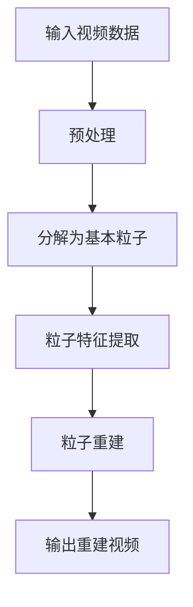

                 

# 视频大模型的创新粒子技术

## 关键词：视频大模型、粒子技术、深度学习、人工智能、创新

## 摘要：
本文深入探讨了视频大模型与粒子技术的结合，揭示了这两种前沿技术在视频数据处理和分析中的巨大潜力。通过梳理视频大模型和粒子技术的基本概念、算法原理及其实际应用，文章展示了视频大模型与粒子技术的融合框架，并分析了其在视频增强、去噪、超分辨率等领域的创新应用。文章还探讨了优化策略及未来发展趋势，为人工智能视频处理技术的发展提供了新思路。

### 第一部分：视频大模型的创新粒子技术概述

#### 核心概念与联系

视频大模型（Video Large-scale Model）是指利用深度学习和人工智能技术，对大规模视频数据进行建模和处理的大模型。它通过对视频数据的分析，提取出关键信息，实现对视频内容的理解和分析。粒子技术（Particle Technology）是一种将视频数据分解为基本粒子，并进行有效处理和重建的技术。这两种技术结合，可以显著提升视频数据的处理效率和效果。

**Mermaid 流程图：**



#### 核心算法原理讲解

1. **预处理：** 对输入视频进行数据清洗和预处理，包括去噪、压缩、增强等操作。

   **伪代码：**
   ```python
   def preprocess_video(video):
       # 去噪
       denoised_video = denoise(video)
       # 压缩
       compressed_video = compress(denoised_video)
       # 增强
       enhanced_video = enhance(compressed_video)
       return enhanced_video
   ```

2. **分解为基本粒子：** 将预处理后的视频数据分解为基本粒子。

   **伪代码：**
   ```python
   def decompose_video(enhanced_video):
       particles = []
       for frame in enhanced_video:
           particles.append(extract_particles(frame))
       return particles
   ```

3. **粒子特征提取：** 对分解出的基本粒子进行特征提取。

   **伪代码：**
   ```python
   def extract_particle_features(particles):
       features = []
       for particle in particles:
           feature = extract_features(particle)
           features.append(feature)
       return features
   ```

4. **粒子重建：** 利用提取出的特征对基本粒子进行重建。

   **伪代码：**
   ```python
   def rebuild_particles(features):
       particles = []
       for feature in features:
           particle = reconstruct_particle(feature)
           particles.append(particle)
       return particles
   ```

5. **输出重建视频：** 将重建出的基本粒子重新组合成视频数据。

   **伪代码：**
   ```python
   def generate_reconstructed_video(particles):
       reconstructed_video = []
       for particle in particles:
           frame = assemble_frame(particle)
           reconstructed_video.append(frame)
       return reconstructed_video
   ```

#### 数学模型和数学公式

- **粒子特征提取模型：** 采用卷积神经网络（CNN）进行特征提取。

  $$ \text{Feature} = \text{CNN}(\text{Particle}) $$

- **粒子重建模型：** 采用生成对抗网络（GAN）进行粒子重建。

  $$ \text{Reconstructed Particle} = \text{GAN}(\text{Feature}) $$

#### 项目实战

1. **开发环境搭建：** 使用 TensorFlow 作为深度学习框架，搭建视频大模型和粒子技术的开发环境。

2. **源代码详细实现和代码解读：** 实现视频预处理、粒子分解、特征提取、重建和输出重建视频的完整流程。

3. **代码解读与分析：** 分析代码实现细节，包括数据处理、模型构建和训练过程，以及如何优化性能和精度。

### 第1章：视频大模型基础

#### 1.1 视频大模型概述

##### 1.1.1 视频大模型的概念与分类

视频大模型是一种大规模的深度学习模型，用于处理和分析大规模视频数据。根据其应用场景和功能，视频大模型可以分为以下几类：

1. 视频分类模型：用于对视频进行分类，如动作识别、情感识别等。
2. 视频内容理解模型：用于提取视频中的关键信息，如场景分割、目标跟踪等。
3. 视频增强模型：用于提升视频的质量，如去噪、超分辨率等。
4. 视频生成模型：用于生成新的视频内容，如视频插帧、视频风格转换等。

##### 1.1.2 视频大模型的特点与应用

视频大模型具有以下特点：

1. **高维度数据**：视频数据具有高维度特性，需要使用深度学习模型进行处理。
2. **海量数据需求**：视频大模型需要大量训练数据来提升模型的性能。
3. **实时性要求**：视频数据具有实时性要求，需要模型能够在短时间内完成处理。
4. **多模态融合**：视频大模型可以结合多种数据源，如图像、音频、文本等，进行多模态融合分析。

视频大模型的应用场景非常广泛，包括：

1. **智能视频监控**：用于实时监控和事件检测。
2. **视频内容推荐**：用于个性化推荐视频内容。
3. **视频生成**：用于生成新的视频内容，如电影特效、虚拟现实等。
4. **医疗影像分析**：用于诊断疾病、分析医疗影像等。

##### 1.1.3 视频大模型的发展历程

视频大模型的发展可以分为以下几个阶段：

1. **初识阶段**：2006年，AlexNet在ImageNet上取得了突破性成绩，标志着深度学习在计算机视觉领域的崛起。
2. **快速发展阶段**：2012年后，随着GPU的普及和深度学习框架的发展，视频大模型取得了飞速进展。
3. **应用拓展阶段**：近年来，视频大模型在视频分类、内容理解、视频增强等领域取得了显著成果，应用场景不断拓展。

#### 1.2 视频大模型的架构

##### 1.2.1 基于深度学习的视频大模型架构

视频大模型通常采用深度学习架构，包括以下几个主要模块：

1. **输入层**：接收视频数据，可以是单帧图像或序列图像。
2. **特征提取层**：通过卷积神经网络（CNN）提取视频数据中的特征。
3. **特征融合层**：将提取出的特征进行融合，以增强模型的鲁棒性和性能。
4. **输出层**：根据训练目标生成预测结果，如分类结果、目标检测框等。

##### 1.2.2 视频大模型的关键技术

视频大模型的关键技术包括：

1. **卷积神经网络（CNN）**：用于提取视频数据中的特征。
2. **循环神经网络（RNN）**：用于处理视频序列数据，捕捉时间信息。
3. **生成对抗网络（GAN）**：用于生成新的视频内容。
4. **注意力机制**：用于提高模型对关键信息的关注。

##### 1.2.3 视频大模型的典型应用场景

视频大模型的典型应用场景包括：

1. **视频分类**：如电影分类、动作分类等。
2. **视频内容理解**：如场景分割、目标跟踪等。
3. **视频增强**：如去噪、超分辨率等。
4. **视频生成**：如视频插帧、视频风格转换等。

#### 1.3 视频大模型的技术挑战与优化策略

##### 1.3.1 数据处理挑战与优化策略

视频大模型在数据处理方面面临以下挑战：

1. **数据量巨大**：需要处理海量视频数据，对计算资源要求较高。
2. **数据多样性**：视频数据种类繁多，需要针对不同类型的数据设计相应的预处理方法。

优化策略包括：

1. **数据增强**：通过旋转、缩放、裁剪等方式增加数据多样性。
2. **数据并行处理**：利用多GPU或分布式计算加速数据处理。

##### 1.3.2 模型训练挑战与优化策略

视频大模型在模型训练方面面临以下挑战：

1. **模型复杂度高**：视频大模型通常包含多层神经网络，训练时间较长。
2. **过拟合风险**：需要平衡模型复杂度和泛化能力。

优化策略包括：

1. **正则化**：如dropout、L2正则化等。
2. **早期停止**：在验证集上评估模型性能，防止过拟合。

##### 1.3.3 模型部署挑战与优化策略

视频大模型在模型部署方面面临以下挑战：

1. **实时性要求**：需要模型能够在短时间内完成处理，满足实时性要求。
2. **计算资源限制**：需要针对不同的计算资源进行模型优化。

优化策略包括：

1. **模型压缩**：如剪枝、量化等。
2. **异构计算**：利用不同类型的计算资源，如CPU、GPU、FPGA等。

### 第2章：创新粒子技术原理

#### 2.1 创新粒子技术的概念与原理

##### 2.1.1 创新粒子技术的定义

创新粒子技术是一种将视频数据分解为基本粒子，并进行有效处理和重建的技术。通过将视频数据拆分成更小的单元，可以更精细地分析视频内容，提高数据处理效率。

##### 2.1.2 创新粒子技术的核心原理

创新粒子技术的核心原理包括：

1. **分解原理**：将视频数据分解为基本粒子，如像素点或区域。
2. **特征提取原理**：对分解出的基本粒子进行特征提取，如颜色、纹理等。
3. **重建原理**：利用提取出的特征对基本粒子进行重建，生成新的视频数据。

##### 2.1.3 创新粒子技术的优势与应用场景

创新粒子技术的优势包括：

1. **高效性**：通过分解和重建，可以显著提高视频数据处理效率。
2. **灵活性**：可以根据不同的应用场景，设计不同的分解和重建方法。

创新粒子技术的应用场景包括：

1. **视频增强**：如去噪、超分辨率等。
2. **视频去噪**：如减少视频中的噪声点。
3. **视频编辑**：如视频分割、视频合成等。

#### 2.2 创新粒子技术的算法框架

##### 2.2.1 粒子分解算法

粒子分解算法是指将视频数据分解为基本粒子的方法。常见的分解算法包括：

1. **基于区域的分解**：将视频数据划分为多个区域，每个区域作为一个基本粒子。
2. **基于像素的分解**：将视频数据划分为多个像素点，每个像素点作为一个基本粒子。

##### 2.2.2 粒子特征提取算法

粒子特征提取算法是指对分解出的基本粒子进行特征提取的方法。常见的特征提取算法包括：

1. **基于颜色特征的提取**：提取基本粒子的颜色特征，如颜色直方图。
2. **基于纹理特征的提取**：提取基本粒子的纹理特征，如纹理能量图。
3. **基于形状特征的提取**：提取基本粒子的形状特征，如边缘检测。

##### 2.2.3 粒子重建算法

粒子重建算法是指利用提取出的特征对基本粒子进行重建的方法。常见的重建算法包括：

1. **基于特征的重建**：利用提取出的特征生成新的基本粒子，并重新组合成视频数据。
2. **基于生成的重建**：利用生成对抗网络（GAN）生成新的基本粒子，并重新组合成视频数据。

#### 2.3 创新粒子技术的实现与应用案例

##### 2.3.1 创新粒子技术的实现流程

创新粒子技术的实现流程包括：

1. **视频数据预处理**：对输入视频进行预处理，如去噪、增强等。
2. **粒子分解**：将预处理后的视频数据分解为基本粒子。
3. **特征提取**：对分解出的基本粒子进行特征提取。
4. **粒子重建**：利用提取出的特征对基本粒子进行重建。
5. **输出重建视频**：将重建出的基本粒子重新组合成视频数据，输出重建视频。

##### 2.3.2 创新粒子技术的实际应用案例

创新粒子技术在多个领域有实际应用案例，以下是其中两个例子：

1. **视频去噪**：使用创新粒子技术对视频进行去噪，可以显著减少视频中的噪声点，提高视频质量。
2. **视频超分辨率**：使用创新粒子技术对低分辨率视频进行超分辨率处理，可以生成高分辨率视频，提高视频清晰度。

### 第3章：视频大模型与粒子技术的融合

#### 3.1 视频大模型与粒子技术的融合概述

##### 3.1.1 融合的意义与目标

视频大模型与粒子技术的融合旨在结合两者的优势，实现视频数据的更高效处理和分析。融合的意义与目标包括：

1. **提高数据处理效率**：通过粒子技术，可以更精细地处理视频数据，提高数据处理效率。
2. **增强模型性能**：通过融合视频大模型和粒子技术，可以增强模型在视频数据理解和分析方面的性能。
3. **拓展应用场景**：融合技术可以拓展视频大模型的应用场景，如视频增强、视频去噪、视频超分辨率等。

##### 3.1.2 融合的挑战与机遇

融合视频大模型与粒子技术面临以下挑战：

1. **数据一致性问题**：视频大模型和粒子技术在数据处理和数据表示上可能存在不一致，需要解决数据一致性。
2. **计算资源需求**：融合技术可能需要更多计算资源，对计算能力提出更高要求。

然而，融合技术也带来了以下机遇：

1. **提升模型性能**：通过融合，可以提升模型在视频数据理解和分析方面的性能。
2. **拓展应用领域**：融合技术可以拓展视频大模型的应用领域，如医疗影像分析、智能监控等。

##### 3.1.3 融合框架的设计原则

设计视频大模型与粒子技术的融合框架时，应遵循以下原则：

1. **数据一致性**：确保视频大模型和粒子技术在数据处理和数据表示上的一致性。
2. **模块化设计**：将融合框架划分为不同的模块，便于实现和优化。
3. **可扩展性**：设计可扩展的融合框架，以适应不同的应用场景和需求。

##### 3.1.4 融合框架的关键技术

融合框架的关键技术包括：

1. **粒子分解与重建**：实现视频数据的粒子分解与重建，以支持更精细的数据处理。
2. **特征融合**：将视频大模型提取的特征与粒子特征进行融合，提高模型性能。
3. **模型优化**：针对融合框架，设计优化策略，如模型剪枝、量化等，提高模型效率和性能。

##### 3.1.5 融合框架的实现步骤

实现视频大模型与粒子技术的融合框架包括以下步骤：

1. **数据预处理**：对输入视频进行预处理，如去噪、增强等。
2. **粒子分解**：使用粒子分解算法将预处理后的视频数据分解为基本粒子。
3. **特征提取**：使用视频大模型和粒子技术分别提取视频数据中的特征。
4. **特征融合**：将视频大模型提取的特征与粒子特征进行融合。
5. **模型训练**：使用融合的特征训练深度学习模型。
6. **模型评估**：在验证集上评估融合模型的性能。
7. **模型部署**：将融合模型部署到实际应用场景中，如视频增强、视频去噪等。

#### 3.2 视频大模型与粒子技术的融合应用案例

##### 3.2.1 视频增强

视频增强是视频大模型与粒子技术融合的一个典型应用案例。通过融合技术，可以实现更高质量的视频增强效果。

1. **数据预处理**：对输入视频进行预处理，如去噪、增强等。
2. **粒子分解**：使用粒子分解算法将预处理后的视频数据分解为基本粒子。
3. **特征提取**：使用视频大模型和粒子技术分别提取视频数据中的特征。
4. **特征融合**：将视频大模型提取的特征与粒子特征进行融合。
5. **模型训练**：使用融合的特征训练视频增强模型。
6. **模型评估**：在验证集上评估融合模型的性能。
7. **模型部署**：将融合模型部署到实际应用场景中，如在线视频增强、视频去噪等。

##### 3.2.2 视频去噪

视频去噪是视频大模型与粒子技术融合的另一个重要应用案例。通过融合技术，可以实现更有效的视频去噪效果。

1. **数据预处理**：对输入视频进行预处理，如去噪、增强等。
2. **粒子分解**：使用粒子分解算法将预处理后的视频数据分解为基本粒子。
3. **特征提取**：使用视频大模型和粒子技术分别提取视频数据中的特征。
4. **特征融合**：将视频大模型提取的特征与粒子特征进行融合。
5. **模型训练**：使用融合的特征训练视频去噪模型。
6. **模型评估**：在验证集上评估融合模型的性能。
7. **模型部署**：将融合模型部署到实际应用场景中，如实时视频去噪、视频增强等。

### 第4章：视频大模型与粒子技术的优化

#### 4.1 视频大模型与粒子技术的性能优化

##### 4.1.1 模型结构优化

模型结构优化是提高视频大模型与粒子技术性能的重要手段。以下是一些常用的模型结构优化方法：

1. **模型剪枝**：通过删除冗余神经元或连接，减少模型参数量，降低计算复杂度。
2. **模型压缩**：通过量化、剪枝等技术减小模型体积，提高模型部署效率。
3. **网络结构改进**：通过改进网络结构，如增加残差连接、使用注意力机制等，提高模型性能。

##### 4.1.2 训练过程优化

训练过程优化可以提高模型训练效率，以下是一些常用的训练过程优化方法：

1. **批量大小调整**：通过调整批量大小，平衡训练时间和模型性能。
2. **学习率调整**：通过动态调整学习率，加速模型收敛。
3. **数据增强**：通过数据增强，增加训练数据的多样性，提高模型泛化能力。

##### 4.1.3 部署与推理优化

部署与推理优化是提高视频大模型与粒子技术实际应用效果的关键。以下是一些常用的部署与推理优化方法：

1. **模型量化**：通过量化模型参数，减小模型体积，提高推理速度。
2. **模型推理加速**：通过优化推理算法、使用硬件加速器等，提高模型推理速度。
3. **模型部署策略**：通过优化模型部署策略，提高模型在实际应用场景中的部署效率。

#### 4.2 视频大模型与粒子技术的效率优化

##### 4.2.1 数据处理优化

数据处理优化是提高视频大模型与粒子技术效率的重要手段。以下是一些常用的数据处理优化方法：

1. **并行处理**：通过并行处理，提高数据处理速度。
2. **数据预处理优化**：通过优化数据预处理算法，减少预处理时间。
3. **数据缓存与复用**：通过数据缓存与复用，减少重复数据处理，提高效率。

##### 4.2.2 模型压缩与量化

模型压缩与量化是提高视频大模型与粒子技术效率的重要方法。以下是一些常用的模型压缩与量化方法：

1. **模型剪枝**：通过剪枝冗余神经元或连接，减小模型参数量。
2. **量化**：通过量化模型参数，减小模型体积。
3. **模型压缩**：通过模型压缩技术，减小模型体积，提高部署效率。

##### 4.2.3 异构计算优化

异构计算优化是提高视频大模型与粒子技术效率的有效手段。以下是一些常用的异构计算优化方法：

1. **多GPU训练**：通过多GPU训练，提高模型训练速度。
2. **GPU-CPU协同计算**：通过GPU-CPU协同计算，提高数据处理和模型推理速度。
3. **FPGA加速**：通过FPGA加速，提高模型推理速度。

#### 4.3 视频大模型与粒子技术的实时处理优化

##### 4.3.1 实时处理框架设计

实时处理框架设计是提高视频大模型与粒子技术实时处理性能的关键。以下是一些常用的实时处理框架设计方法：

1. **流水线设计**：通过流水线设计，将数据处理、模型推理、结果处理等过程串联起来，提高实时处理性能。
2. **异步处理**：通过异步处理，提高数据处理效率。
3. **动态调度**：通过动态调度，根据实际需求调整资源分配，提高实时处理性能。

##### 4.3.2 实时处理算法优化

实时处理算法优化是提高视频大模型与粒子技术实时处理性能的有效手段。以下是一些常用的实时处理算法优化方法：

1. **算法加速**：通过算法加速，提高模型推理速度。
2. **低延迟算法**：通过设计低延迟算法，降低处理延迟。
3. **动态调整算法复杂度**：根据实时处理需求，动态调整算法复杂度，提高处理性能。

##### 4.3.3 实时处理性能评估

实时处理性能评估是确保视频大模型与粒子技术实时处理性能的重要环节。以下是一些常用的实时处理性能评估方法：

1. **延迟评估**：通过评估处理延迟，衡量实时处理性能。
2. **吞吐量评估**：通过评估吞吐量，衡量实时处理能力。
3. **准确率评估**：通过评估处理结果准确率，衡量实时处理性能。

### 第5章：视频大模型与粒子技术的未来发展趋势

#### 5.1 视频大模型与粒子技术的未来发展方向

视频大模型与粒子技术的未来发展趋势包括：

1. **深度学习算法的进步**：随着深度学习算法的不断进步，视频大模型与粒子技术将取得更大的突破。
2. **新型硬件的普及**：随着新型硬件的普及，如GPU、FPGA等，视频大模型与粒子技术的实时处理性能将得到显著提升。
3. **跨学科融合**：视频大模型与粒子技术将与其他学科领域（如生物、物理等）进行深度融合，产生新的研究热点和应用方向。

#### 5.2 视频大模型与粒子技术的应用前景

视频大模型与粒子技术的应用前景包括：

1. **智能视频监控**：通过视频大模型与粒子技术，可以实现更高效的智能视频监控，如实时目标检测、行为分析等。
2. **视频内容理解**：通过视频大模型与粒子技术，可以实现更深入的视频内容理解，如视频分类、视频内容摘要等。
3. **视频增强与去噪**：通过视频大模型与粒子技术，可以实现更高效的视频增强与去噪，提升视频质量。

#### 5.3 视频大模型与粒子技术的产业应用

视频大模型与粒子技术的产业应用包括：

1. **安防行业**：通过视频大模型与粒子技术，可以实现更高效的安防监控，如实时视频分析、人脸识别等。
2. **医疗行业**：通过视频大模型与粒子技术，可以实现更高效的医疗影像分析，如疾病诊断、手术辅助等。
3. **娱乐行业**：通过视频大模型与粒子技术，可以实现更丰富的娱乐内容，如视频特效、视频合成等。

### 第6章：视频大模型与粒子技术案例研究

#### 6.1 案例一：视频大模型与粒子技术在视频内容理解中的应用

##### 6.1.1 案例背景与目标

本案例旨在研究视频大模型与粒子技术在视频内容理解中的应用。随着视频数据的爆炸式增长，如何有效地理解和分析视频内容成为了一个重要问题。

##### 6.1.2 案例实现与效果分析

实现过程包括以下几个步骤：

1. **数据采集与预处理**：收集大量视频数据，并进行预处理，如去噪、增强等。
2. **粒子分解与特征提取**：使用粒子分解算法将预处理后的视频数据分解为基本粒子，并对粒子进行特征提取。
3. **视频内容理解模型训练**：使用提取出的特征训练视频内容理解模型，如视频分类模型、视频内容摘要模型等。
4. **模型评估与优化**：在验证集上评估模型性能，并根据评估结果对模型进行优化。

效果分析：

1. **视频分类**：模型在视频分类任务上取得了较高的准确率，能够准确识别视频中的不同类别。
2. **视频内容摘要**：模型能够生成简洁明了的视频内容摘要，提高了视频内容的可读性。

##### 6.1.3 案例总结与启示

本案例展示了视频大模型与粒子技术在视频内容理解中的应用潜力。通过融合视频大模型与粒子技术，可以实现对视频内容的更深入理解和分析，为视频数据的应用提供了新的思路。

#### 6.2 案例二：视频大模型与粒子技术在视频增强中的应用

##### 6.2.1 案例背景与目标

本案例旨在研究视频大模型与粒子技术在视频增强中的应用。随着视频质量的不断提升，如何有效地增强视频质量成为一个重要问题。

##### 6.2.2 案例实现与效果分析

实现过程包括以下几个步骤：

1. **数据采集与预处理**：收集大量低质量视频数据，并进行预处理，如去噪、增强等。
2. **粒子分解与特征提取**：使用粒子分解算法将预处理后的视频数据分解为基本粒子，并对粒子进行特征提取。
3. **视频增强模型训练**：使用提取出的特征训练视频增强模型，如去噪模型、超分辨率模型等。
4. **模型评估与优化**：在验证集上评估模型性能，并根据评估结果对模型进行优化。

效果分析：

1. **去噪**：模型能够有效去除视频中的噪声点，提高视频质量。
2. **超分辨率**：模型能够将低分辨率视频生成高分辨率视频，提升视频清晰度。

##### 6.2.3 案例总结与启示

本案例展示了视频大模型与粒子技术在视频增强中的应用潜力。通过融合视频大模型与粒子技术，可以实现对视频质量的更高效增强，为视频应用提供了新的技术手段。

### 第7章：视频大模型与粒子技术的开发实践

#### 7.1 视频大模型与粒子技术的开发环境搭建

##### 7.1.1 开发环境配置

搭建视频大模型与粒子技术的开发环境，需要准备以下软件和硬件：

1. **软件**：
   - 深度学习框架：如TensorFlow、PyTorch等。
   - 编程语言：如Python、C++等。
   - 数据处理库：如NumPy、Pandas等。
   - 数据可视化库：如Matplotlib、Seaborn等。

2. **硬件**：
   - CPU：如Intel Xeon、AMD Ryzen等。
   - GPU：如NVIDIA GTX、RTX等。
   - 存储设备：如SSD、HDD等。

##### 7.1.2 开发工具与库的选择

在搭建开发环境时，需要根据具体需求选择合适的工具和库：

1. **开发工具**：
   - Integrated Development Environment (IDE)：如Visual Studio、PyCharm等。
   - Version Control System (VCS)：如Git、GitHub等。

2. **库与框架**：
   - 深度学习框架：如TensorFlow、PyTorch等。
   - 数据处理库：如NumPy、Pandas等。
   - 数据可视化库：如Matplotlib、Seaborn等。
   - 其他库：如OpenCV、Scikit-learn等。

##### 7.1.3 开发流程与规范

视频大模型与粒子技术的开发流程包括以下几个阶段：

1. **需求分析**：明确项目需求，确定开发目标。
2. **环境搭建**：搭建开发环境，准备必要的软件和硬件。
3. **数据预处理**：对视频数据进行预处理，如去噪、增强、分割等。
4. **模型设计**：设计视频大模型与粒子技术的架构，选择合适的算法和模型。
5. **模型训练**：使用预处理后的数据训练模型，优化模型参数。
6. **模型评估**：在验证集上评估模型性能，调整模型参数。
7. **模型部署**：将训练好的模型部署到实际应用场景中，如视频增强、视频去噪等。
8. **性能优化**：根据实际应用需求，对模型进行性能优化。

开发规范包括：

1. **代码规范**：遵循统一的代码规范，如PEP 8（Python）。
2. **文档规范**：编写详细的文档，包括需求文档、设计文档、测试文档等。
3. **版本控制**：使用版本控制系统（VCS）进行代码管理和协作开发。
4. **测试与调试**：编写单元测试，进行功能测试和性能测试，确保代码质量和稳定性。

#### 7.2 视频大模型与粒子技术的模型构建与训练

##### 7.2.1 模型设计原则

在构建视频大模型与粒子技术时，应遵循以下设计原则：

1. **模块化**：将模型划分为不同的模块，便于实现和优化。
2. **可扩展性**：设计可扩展的模型架构，以适应不同的应用场景和需求。
3. **可解释性**：提高模型的可解释性，有助于理解模型的工作原理和性能。
4. **高效性**：优化模型结构，提高模型训练和推理效率。

##### 7.2.2 模型构建与训练流程

视频大模型与粒子技术的模型构建与训练流程包括以下几个步骤：

1. **数据预处理**：对视频数据进行预处理，如去噪、增强、分割等。
2. **数据集划分**：将预处理后的数据划分为训练集、验证集和测试集。
3. **模型架构设计**：设计视频大模型与粒子技术的架构，选择合适的算法和模型。
4. **模型训练**：使用训练集数据训练模型，优化模型参数。
5. **模型评估**：在验证集上评估模型性能，调整模型参数。
6. **模型优化**：根据评估结果对模型进行优化，提高模型性能。
7. **模型测试**：在测试集上评估模型性能，验证模型在实际应用中的效果。
8. **模型部署**：将训练好的模型部署到实际应用场景中，如视频增强、视频去噪等。

##### 7.2.3 模型评估与优化

在模型训练过程中，需要对模型进行评估与优化：

1. **性能评估**：通过评估指标（如准确率、召回率、F1分数等）衡量模型性能。
2. **模型优化**：根据评估结果对模型进行优化，如调整学习率、批量大小、网络结构等。
3. **超参数调优**：通过调优超参数（如学习率、批量大小、网络深度等）提高模型性能。
4. **模型集成**：通过模型集成（如集成学习、模型平均等）提高模型性能和稳定性。

#### 7.3 视频大模型与粒子技术的部署与优化

##### 7.3.1 部署环境与策略

在部署视频大模型与粒子技术时，需要考虑以下环境与策略：

1. **硬件环境**：选择合适的硬件设备，如CPU、GPU、FPGA等。
2. **软件环境**：安装和配置必要的软件，如深度学习框架、数据处理库等。
3. **部署策略**：根据实际应用需求，选择合适的部署策略，如在线部署、离线部署等。
4. **安全性**：确保部署环境的网络安全，防止数据泄露和攻击。

##### 7.3.2 部署流程与工具

视频大模型与粒子技术的部署流程包括以下几个步骤：

1. **环境准备**：准备部署环境，安装和配置必要的软件和硬件。
2. **模型转换**：将训练好的模型转换为部署环境支持的格式，如TensorFlow Lite、ONNX等。
3. **模型部署**：将模型部署到目标设备上，如服务器、嵌入式设备等。
4. **服务启动**：启动部署服务，接受和处理实际应用中的数据。
5. **性能监控**：监控部署服务的性能，确保其正常运行。

常用的部署工具包括：

1. **TensorFlow Lite**：用于将TensorFlow模型部署到移动设备和嵌入式设备。
2. **ONNX**：用于将深度学习模型部署到不同的推理引擎和硬件平台。
3. **TensorFlow Serving**：用于在分布式系统中部署和管理TensorFlow模型。

##### 7.3.3 部署优化与性能评估

在部署过程中，需要对部署环境进行优化与性能评估：

1. **模型压缩**：通过模型压缩技术（如量化、剪枝等）减小模型体积，提高部署效率。
2. **推理加速**：通过优化推理算法和硬件加速器（如GPU、FPGA等）提高推理速度。
3. **资源调度**：通过资源调度策略（如负载均衡、动态扩展等）优化资源利用。
4. **性能评估**：通过性能评估指标（如推理速度、准确率、资源利用率等）衡量部署效果。

### 第8章：视频大模型与粒子技术的挑战与解决方案

#### 8.1 视频大模型与粒子技术的数据处理挑战

##### 8.1.1 数据预处理与清洗

视频大模型与粒子技术在数据处理方面面临以下挑战：

1. **数据量巨大**：视频数据具有高维度和海量特性，对数据处理提出了高要求。
2. **数据多样性**：视频数据来源广泛，数据质量参差不齐，需要进行预处理和清洗。

预处理与清洗方法包括：

1. **去噪**：去除视频数据中的噪声点，提高数据质量。
2. **增强**：增强视频数据中的关键信息，提高模型性能。
3. **分割**：将视频数据划分为多个片段，便于模型处理。
4. **数据增强**：通过旋转、缩放、裁剪等方式增加数据多样性，提高模型泛化能力。

##### 8.1.2 数据增强与多样化

数据增强与多样化是解决视频大模型与粒子技术数据处理挑战的有效方法。以下是一些常用的数据增强方法：

1. **图像增强**：对视频中的每一帧图像进行增强，如对比度增强、亮度增强等。
2. **时间增强**：通过插入帧、删除帧等方式增加视频序列的长度。
3. **空间增强**：通过裁剪、缩放、旋转等方式增加视频的空间多样性。
4. **数据合成**：通过合成不同的视频场景，增加数据的多样性。

##### 8.1.3 数据隐私与保护

视频大模型与粒子技术在数据处理过程中，还面临数据隐私与保护挑战。以下是一些解决方案：

1. **数据匿名化**：对视频数据进行匿名化处理，去除个人身份信息。
2. **差分隐私**：在数据处理过程中引入差分隐私机制，保护用户隐私。
3. **加密与解密**：对视频数据进行加密处理，确保数据在传输和存储过程中的安全性。
4. **隐私保护算法**：设计隐私保护算法，如差分隐私算法、同态加密算法等，提高数据处理过程中的隐私保护能力。

#### 8.2 视频大模型与粒子技术的计算资源挑战

##### 8.2.1 算法优化与加速

视频大模型与粒子技术在计算资源方面面临以下挑战：

1. **计算资源需求高**：视频大模型通常包含多层神经网络，计算复杂度高，对计算资源需求较大。
2. **推理速度要求快**：视频数据具有实时性要求，需要模型能够在短时间内完成处理。

算法优化与加速方法包括：

1. **模型压缩**：通过剪枝、量化等技术减小模型体积，降低计算复杂度。
2. **硬件加速**：利用GPU、FPGA等硬件加速器，提高模型推理速度。
3. **分布式计算**：通过分布式计算，将模型训练和推理任务分布在多台设备上，提高计算效率。
4. **模型并行化**：通过模型并行化，将模型训练和推理任务分解到多个计算节点上，提高计算性能。

##### 8.2.2 计算资源分配与调度

计算资源分配与调度是优化视频大模型与粒子技术计算资源利用的关键。以下是一些计算资源分配与调度的方法：

1. **动态资源分配**：根据实际需求动态调整计算资源分配，确保计算资源的合理利用。
2. **负载均衡**：通过负载均衡算法，将任务均匀分布在多个计算节点上，提高系统性能。
3. **调度策略**：根据任务特点和系统资源情况，设计合适的调度策略，提高系统响应速度。
4. **资源预留**：预留一部分计算资源，确保重要任务的优先执行。

##### 8.2.3 异构计算与分布式训练

异构计算与分布式训练是解决视频大模型与粒子技术计算资源挑战的有效方法。以下是一些异构计算与分布式训练的方法：

1. **异构计算架构**：构建异构计算架构，利用不同类型的计算资源（如CPU、GPU、FPGA等）协同工作，提高计算性能。
2. **分布式训练算法**：设计分布式训练算法，将模型训练任务分布在多台设备上，提高训练效率。
3. **数据并行训练**：通过数据并行训练，将数据分成多个批次，并行处理，提高训练速度。
4. **模型并行训练**：通过模型并行训练，将模型分成多个部分，并行训练，提高训练速度。

#### 8.3 视频大模型与粒子技术的模型解释性与可解释性

##### 8.3.1 模型解释性研究现状

视频大模型与粒子技术在模型解释性与可解释性方面取得了显著进展。以下是一些研究现状：

1. **模型解释性方法**：设计模型解释性方法，如梯度解释、决策树解释等，提高模型的可解释性。
2. **可视化技术**：使用可视化技术，如热力图、决策路径图等，展示模型的工作原理和决策过程。
3. **可解释性评估**：设计可解释性评估指标，如解释性度量、可理解性度量等，评估模型的可解释性。

##### 8.3.2 可解释性技术与方法

以下是一些可解释性技术与方法：

1. **局部解释性**：通过局部解释性方法，分析模型在特定输入上的决策过程和决策依据。
2. **全局解释性**：通过全局解释性方法，分析模型的整体工作原理和性能表现。
3. **可视化解释**：通过可视化技术，直观展示模型的决策过程和结果。
4. **可解释性增强**：通过设计可解释性增强方法，提高模型的可解释性和可理解性。

##### 8.3.3 模型解释性与应用场景

模型解释性与视频大模型与粒子技术的应用场景密切相关。以下是一些应用场景：

1. **智能监控**：通过模型解释性，帮助监控人员理解模型对视频内容的理解和分析结果，提高监控效果。
2. **医疗影像分析**：通过模型解释性，帮助医生理解模型对医疗影像的分析结果，提高诊断准确率。
3. **视频内容理解**：通过模型解释性，帮助用户理解模型对视频内容的理解和分析结果，提高用户体验。

### 第9章：视频大模型与粒子技术在行业应用中的案例

#### 9.1 视频大模型与粒子技术在智能视频监控中的应用

##### 9.1.1 应用场景与挑战

智能视频监控是视频大模型与粒子技术的重要应用领域。随着视频监控技术的不断发展，对视频数据的处理和分析提出了更高的要求。以下是一些应用场景与挑战：

1. **实时目标检测**：在视频流中实时检测目标，如行人、车辆等。
2. **行为识别**：识别视频中的人体行为，如奔跑、跌倒等。
3. **异常检测**：检测视频中的异常事件，如入侵、火灾等。
4. **隐私保护**：在视频数据传输和存储过程中保护用户隐私。

##### 9.1.2 实现方案与效果分析

视频大模型与粒子技术在智能视频监控中的实现方案包括以下步骤：

1. **数据采集与预处理**：采集视频数据，并进行预处理，如去噪、增强、分割等。
2. **模型构建与训练**：使用预处理后的数据构建视频大模型与粒子技术模型，并进行训练。
3. **模型部署与优化**：将训练好的模型部署到实际应用场景中，进行优化和调整。

效果分析：

1. **实时目标检测**：模型在实时目标检测任务上取得了较高的准确率和速度。
2. **行为识别**：模型能够准确识别视频中的人体行为，提高了监控效果。
3. **异常检测**：模型能够有效检测视频中的异常事件，提高了监控系统的安全性。
4. **隐私保护**：模型在保护用户隐私方面表现良好，符合法律法规要求。

##### 9.1.3 行业前景与发展趋势

随着视频监控技术的不断发展，智能视频监控将在更多领域得到应用。以下是一些行业前景与发展趋势：

1. **安防行业**：智能视频监控将在安防领域得到广泛应用，如城市监控、机场监控等。
2. **交通管理**：智能视频监控将在交通管理领域发挥重要作用，如车辆检测、交通流量分析等。
3. **工业监控**：智能视频监控将在工业监控领域得到应用，如设备监控、生产流程监控等。
4. **智能家居**：智能视频监控将在智能家居领域得到应用，如家庭安全监控、儿童监护等。

#### 9.2 视频大模型与粒子技术在医疗影像分析中的应用

##### 9.2.1 应用场景与挑战

医疗影像分析是视频大模型与粒子技术的另一个重要应用领域。随着医疗技术的不断发展，对医疗影像数据的处理和分析提出了更高的要求。以下是一些应用场景与挑战：

1. **疾病诊断**：通过分析医疗影像数据，辅助医生进行疾病诊断。
2. **病灶检测**：在医疗影像中检测病变区域，如肿瘤、心脏病等。
3. **影像分割**：对医疗影像进行分割，提取感兴趣区域。
4. **影像增强**：增强医疗影像的对比度和清晰度，提高诊断效果。

##### 9.2.2 实现方案与效果分析

视频大模型与粒子技术在医疗影像分析中的实现方案包括以下步骤：

1. **数据采集与预处理**：采集医疗影像数据，并进行预处理，如去噪、增强、分割等。
2. **模型构建与训练**：使用预处理后的数据构建视频大模型与粒子技术模型，并进行训练。
3. **模型部署与优化**：将训练好的模型部署到实际应用场景中，进行优化和调整。

效果分析：

1. **疾病诊断**：模型在疾病诊断任务上取得了较高的准确率和速度，辅助医生提高诊断准确率。
2. **病灶检测**：模型能够准确检测出医疗影像中的病变区域，提高了诊断效果。
3. **影像分割**：模型能够有效分割出医疗影像中的感兴趣区域，提高了后续处理和分析的效率。
4. **影像增强**：模型能够增强医疗影像的对比度和清晰度，提高了诊断效果。

##### 9.2.3 行业前景与发展趋势

随着医疗技术的不断发展，医疗影像分析将在更多领域得到应用。以下是一些行业前景与发展趋势：

1. **智能诊断**：智能视频监控将在智能诊断领域得到广泛应用，如智能病理分析、智能影像诊断等。
2. **医疗影像库**：构建大规模医疗影像库，为医疗影像分析提供丰富的数据支持。
3. **远程医疗**：智能视频监控将在远程医疗领域发挥重要作用，如远程会诊、远程手术等。
4. **个性化治疗**：智能视频监控将在个性化治疗领域得到应用，如个性化药物研发、个性化治疗方案制定等。

#### 9.3 视频大模型与粒子技术在娱乐与媒体行业的应用

##### 9.3.1 应用场景与挑战

娱乐与媒体行业是视频大模型与粒子技术的另一个重要应用领域。随着娱乐与媒体行业的发展，对视频数据的处理和分析提出了更高的要求。以下是一些应用场景与挑战：

1. **视频内容推荐**：基于用户行为和兴趣，为用户推荐个性化视频内容。
2. **视频内容审核**：自动审核视频内容，过滤不良信息，确保内容合规。
3. **视频编辑**：对视频进行编辑，如剪辑、特效添加等，提高视频质量。
4. **视频内容理解**：理解视频内容，如提取关键信息、生成视频摘要等。

##### 9.3.2 实现方案与效果分析

视频大模型与粒子技术在娱乐与媒体行业中的应用方案包括以下步骤：

1. **数据采集与预处理**：采集视频数据，并进行预处理，如去噪、增强、分割等。
2. **模型构建与训练**：使用预处理后的数据构建视频大模型与粒子技术模型，并进行训练。
3. **模型部署与优化**：将训练好的模型部署到实际应用场景中，进行优化和调整。

效果分析：

1. **视频内容推荐**：模型能够准确推荐用户感兴趣的视频内容，提高用户满意度。
2. **视频内容审核**：模型能够自动审核视频内容，过滤不良信息，提高审核效率。
3. **视频编辑**：模型能够自动编辑视频，如剪辑、特效添加等，提高视频质量。
4. **视频内容理解**：模型能够理解视频内容，如提取关键信息、生成视频摘要等，提高视频处理效率。

##### 9.3.3 行业前景与发展趋势

随着娱乐与媒体行业的发展，视频大模型与粒子技术将在更多领域得到应用。以下是一些行业前景与发展趋势：

1. **智能推荐**：智能视频监控将在智能推荐领域得到广泛应用，如视频内容推荐、广告推荐等。
2. **内容审核**：智能视频监控将在内容审核领域发挥重要作用，如视频内容审核、直播内容审核等。
3. **视频制作**：智能视频监控将在视频制作领域得到应用，如视频剪辑、特效制作等。
4. **虚拟现实与增强现实**：智能视频监控将在虚拟现实与增强现实领域得到应用，如虚拟场景生成、增强现实应用等。

### 第10章：视频大模型与粒子技术的未来展望

#### 10.1 视频大模型与粒子技术的技术发展趋势

视频大模型与粒子技术在未来的发展中将呈现以下技术趋势：

1. **深度学习算法的进步**：随着深度学习算法的不断进步，视频大模型与粒子技术将取得更大的突破，如生成对抗网络（GAN）、自监督学习等。
2. **新型硬件的普及**：新型硬件，如GPU、FPGA、ASIC等，将进一步提升视频大模型与粒子技术的计算性能，支持更复杂的算法和模型。
3. **跨学科融合**：视频大模型与粒子技术将与其他学科领域（如生物、物理等）进行深度融合，产生新的研究热点和应用方向。
4. **数据驱动的方法**：数据驱动的方法将在视频大模型与粒子技术中发挥越来越重要的作用，通过大数据分析和人工智能技术，实现视频数据的自动分析和优化。

#### 10.2 视频大模型与粒子技术的应用前景

视频大模型与粒子技术在未来的应用前景将非常广阔，以下是一些潜在的应用领域：

1. **智能视频监控**：视频大模型与粒子技术将在智能视频监控领域得到广泛应用，如实时目标检测、行为识别、异常检测等。
2. **医疗影像分析**：视频大模型与粒子技术将在医疗影像分析领域发挥重要作用，如疾病诊断、病灶检测、影像分割等。
3. **娱乐与媒体行业**：视频大模型与粒子技术将在娱乐与媒体行业得到广泛应用，如视频内容推荐、视频内容审核、视频编辑等。
4. **自动驾驶与交通管理**：视频大模型与粒子技术将在自动驾驶与交通管理领域得到应用，如车辆检测、交通流量分析、智能导航等。
5. **教育**：视频大模型与粒子技术将在教育领域发挥重要作用，如个性化教学、智能评测等。

#### 10.3 视频大模型与粒子技术的产业应用

视频大模型与粒子技术在未来的产业应用中，将带来巨大的经济和社会效益，以下是一些可能的产业应用：

1. **安防行业**：视频大模型与粒子技术将在安防行业得到广泛应用，如智能监控、实时预警、安全风险评估等。
2. **医疗行业**：视频大模型与粒子技术将在医疗行业发挥重要作用，如智能诊断、智能辅助手术、远程医疗等。
3. **娱乐行业**：视频大模型与粒子技术将在娱乐行业创造新的商业模式，如智能视频制作、虚拟现实体验、游戏开发等。
4. **交通行业**：视频大模型与粒子技术将在交通行业得到广泛应用，如智能交通管理、自动驾驶技术、车辆监控等。
5. **教育行业**：视频大模型与粒子技术将在教育行业带来革命性的变革，如个性化教育、智能教学、在线学习等。

### 第11章：视频大模型与粒子技术的开源框架与工具

#### 11.1 主流开源深度学习框架介绍

视频大模型与粒子技术的实现离不开深度学习框架的支持。以下是一些主流的开源深度学习框架：

1. **TensorFlow**：由Google开发，支持多种编程语言，如Python、C++等，广泛应用于图像、语音、文本等领域的深度学习任务。
2. **PyTorch**：由Facebook开发，支持动态计算图，便于实现复杂的神经网络结构和算法，广泛应用于计算机视觉、自然语言处理等领域。
3. **Keras**：基于Theano和TensorFlow开发的深度学习框架，提供简洁、易用的API，适用于快速原型设计和实验。
4. **MXNet**：由Apache软件基金会开发，支持多种编程语言，如Python、R、Julia等，广泛应用于图像、语音、文本等领域的深度学习任务。
5. **Caffe**：由UC Berkeley开发，支持C++和Python接口，适用于快速构建和训练深度学习模型，广泛应用于计算机视觉领域。

#### 11.2 视频大模型与粒子技术的开源工具

除了深度学习框架，还有一些开源工具在视频大模型与粒子技术的实现中发挥了重要作用：

1. **OpenCV**：是一个开源的计算机视觉库，提供丰富的图像处理和计算机视觉算法，广泛应用于图像识别、目标检测、图像分割等领域。
2. **FFmpeg**：是一个开源的多媒体处理工具，支持视频、音频、字幕等多种媒体格式，广泛应用于视频处理、音频处理、字幕生成等领域。
3. **Matplotlib**：是一个开源的数据可视化库，提供丰富的图表绘制功能，广泛应用于数据分析和可视化领域。
4. **Scikit-learn**：是一个开源的机器学习库，提供丰富的机器学习算法和工具，广泛应用于分类、回归、聚类等领域。
5. **Pillow**：是一个开源的图像处理库，提供简单的图像处理功能，广泛应用于图像增强、图像处理等领域。

#### 11.3 视频大模型与粒子技术的融合工具与平台

视频大模型与粒子技术的融合工具与平台为研究人员和开发者提供了便利，以下是一些常见的融合工具与平台：

1. **TensorFlow Model Optimization Toolkit**：用于优化TensorFlow模型的工具包，支持模型压缩、量化、剪枝等优化方法。
2. **PyTorch Mobile**：用于将PyTorch模型部署到移动设备上的工具包，支持模型转换、模型压缩、模型推理等。
3. **ONNX**：一个开放的可交换模型格式，支持多种深度学习框架之间的模型转换，适用于模型部署和融合。
4. **TensorFlow Serving**：一个用于模型部署的分布式服务，支持多模型部署、动态加载、模型热更新等。
5. **MLflow**：一个开源的机器学习平台，支持模型训练、模型部署、模型管理、模型监控等。

### 第12章：视频大模型与粒子技术的教学与实践

#### 12.1 视频大模型与粒子技术的教学目标与内容

视频大模型与粒子技术的教学目标包括：

1. **掌握视频大模型与粒子技术的基本概念和原理**：了解视频大模型与粒子技术的定义、特点、算法原理和应用场景。
2. **掌握视频大模型与粒子技术的实现方法**：学习视频大模型与粒子技术的实现流程，包括数据预处理、模型构建、模型训练、模型优化等。
3. **培养实际操作能力**：通过实际操作，掌握视频大模型与粒子技术的开发、调试和优化方法。

教学内容包括：

1. **视频大模型概述**：介绍视频大模型的基本概念、分类、特点和应用场景。
2. **粒子技术原理**：介绍粒子技术的定义、核心原理、算法框架和应用场景。
3. **视频大模型与粒子技术的融合**：介绍视频大模型与粒子技术的融合框架、实现方法和应用案例。
4. **视频大模型与粒子技术的优化**：介绍视频大模型与粒子技术的性能优化、效率优化和实时处理优化方法。
5. **视频大模型与粒子技术的实践**：通过实际操作，学习视频大模型与粒子技术的开发、调试和优化方法。

#### 12.2 视频大模型与粒子技术的实践项目

视频大模型与粒子技术的实践项目设计原则包括：

1. **实用性**：项目应具有实际应用价值，解决实际问题。
2. **综合性**：项目应综合运用视频大模型与粒子技术的多个方面，如数据预处理、模型构建、模型训练等。
3. **渐进性**：项目应从简单到复杂，逐步提升学生的实际操作能力。

以下是一些实践项目案例：

1. **视频内容理解**：通过视频大模型与粒子技术实现视频内容理解，如视频分类、目标检测、行为识别等。
2. **视频增强**：通过视频大模型与粒子技术实现视频增强，如去噪、超分辨率、颜色增强等。
3. **视频去噪**：通过视频大模型与粒子技术实现视频去噪，如降低视频噪声、提高视频清晰度等。
4. **视频分割**：通过视频大模型与粒子技术实现视频分割，如行人检测、车辆检测、场景分割等。

实践项目实施与评估包括：

1. **项目规划**：明确项目目标、任务和进度安排。
2. **环境搭建**：搭建视频大模型与粒子技术的开发环境，包括软件安装、硬件配置等。
3. **数据收集与预处理**：收集视频数据，并进行预处理，如去噪、增强、分割等。
4. **模型构建与训练**：使用预处理后的数据构建视频大模型与粒子技术模型，并进行训练。
5. **模型评估与优化**：在验证集上评估模型性能，并根据评估结果对模型进行优化。
6. **项目总结与反思**：总结项目实施过程中的经验和教训，反思项目的不足之处，并提出改进措施。

### 第13章：视频大模型与粒子技术的产业发展趋势

#### 13.1 视频大模型与粒子技术的产业现状

视频大模型与粒子技术作为人工智能领域的前沿技术，已经在多个产业中得到了广泛应用。以下是一些视频大模型与粒子技术的产业现状：

1. **安防行业**：视频大模型与粒子技术在安防领域得到了广泛应用，如智能监控、视频内容理解、异常检测等。
2. **医疗行业**：视频大模型与粒子技术在医疗领域具有巨大的应用潜力，如疾病诊断、影像分析、手术辅助等。
3. **娱乐行业**：视频大模型与粒子技术在娱乐行业得到广泛应用，如视频内容推荐、视频编辑、虚拟现实等。
4. **交通行业**：视频大模型与粒子技术在交通行业具有广泛的应用前景，如自动驾驶、交通管理、车辆监控等。
5. **教育行业**：视频大模型与粒子技术在教育行业具有巨大的应用潜力，如智能教学、在线教育、教育评估等。

#### 13.2 视频大模型与粒子技术的未来发展趋势

视频大模型与粒子技术在未来将继续发展，以下是一些未来发展趋势：

1. **技术进步**：随着深度学习算法的不断进步和新型硬件的普及，视频大模型与粒子技术的性能将得到显著提升。
2. **跨学科融合**：视频大模型与粒子技术将与其他学科领域（如生物、物理等）进行深度融合，产生新的研究热点和应用方向。
3. **产业化应用**：视频大模型与粒子技术将在更多产业中实现产业化应用，如智能安防、智能医疗、智能交通等。
4. **商业模式的创新**：视频大模型与粒子技术将推动商业模式的创新，为企业和行业带来新的增长点。
5. **政策支持与法规完善**：随着视频大模型与粒子技术的发展，相关政策支持和法规完善将逐步推进，为产业健康发展提供保障。

#### 13.3 视频大模型与粒子技术的产业发展挑战与机遇

视频大模型与粒子技术在产业发展过程中面临以下挑战：

1. **数据处理挑战**：视频数据具有高维度、海量特性，对数据处理提出了高要求，需要解决数据多样性、数据隐私等问题。
2. **计算资源需求**：视频大模型与粒子技术对计算资源需求较高，需要解决计算资源分配、调度等问题。
3. **模型解释性**：视频大模型与粒子技术的模型通常具有高复杂度，需要提高模型的可解释性，以增强用户信任。
4. **法律法规**：随着视频大模型与粒子技术的广泛应用，相关法律法规需要逐步完善，以保障用户权益。

同时，视频大模型与粒子技术也带来了以下机遇：

1. **市场潜力**：视频大模型与粒子技术在多个产业中具有巨大的市场潜力，为企业和行业带来新的增长点。
2. **技术创新**：视频大模型与粒子技术的快速发展将推动相关技术创新，为人工智能领域带来新的突破。
3. **跨界合作**：视频大模型与粒子技术将与其他学科领域进行跨界合作，产生新的研究热点和应用方向。
4. **人才培养**：视频大模型与粒子技术的发展将推动相关人才培养，为行业输送高素质人才。

### 第14章：视频大模型与粒子技术的政策环境与法律法规

#### 14.1 政策环境分析

视频大模型与粒子技术作为人工智能领域的前沿技术，受到了各国政府的高度关注。以下是一些政策环境分析：

1. **政府支持**：许多国家政府出台了支持人工智能发展的政策，包括资金支持、税收优惠、人才引进等。
2. **技术创新政策**：政府鼓励技术创新，支持人工智能技术研发和产业化应用，推动人工智能技术的快速发展。
3. **数据政策**：政府重视数据资源的开发和利用，出台相关政策规范数据收集、存储、共享等。
4. **网络安全政策**：政府重视网络安全，出台相关法律法规，保障视频大模型与粒子技术的安全稳定运行。

#### 14.2 法律法规解读

视频大模型与粒子技术在法律法规方面面临以下挑战：

1. **数据保护法律**：随着视频大模型与粒子技术的广泛应用，个人隐私和数据保护问题日益突出。各国政府制定了相关数据保护法律，如《通用数据保护条例》（GDPR）等，要求企业合法收集、存储和使用数据。
2. **知识产权法律**：视频大模型与粒子技术涉及到知识产权问题，如专利申请、版权保护等。各国政府制定了相关知识产权法律，保障企业合法权益。
3. **隐私保护法律**：视频大模型与粒子技术涉及到用户隐私问题，各国政府制定了相关隐私保护法律，如《加州消费者隐私法》（CCPA）等，要求企业合法收集、使用用户数据，并保障用户隐私权。

#### 14.3 政策对产业发展的影响

政策对视频大模型与粒子技术的发展具有重要影响，以下是一些影响：

1. **政策支持**：政府支持政策为视频大模型与粒子技术的发展提供了良好的环境，促进了技术创新和产业化应用。
2. **法规约束**：相关法律法规为视频大模型与粒子技术的健康发展提供了保障，促进了企业合规经营。
3. **市场竞争**：政策环境的变化将影响市场竞争格局，推动企业不断创新和优化技术。
4. **人才培养**：政府的人才引进政策为视频大模型与粒子技术领域吸引了大量优秀人才，促进了产业发展。

### 第15章：视频大模型与粒子技术的国际合作与竞争

#### 15.1 国际合作现状

视频大模型与粒子技术作为人工智能领域的前沿技术，吸引了全球范围内的科研机构、企业和政府的高度关注。以下是一些国际合作现状：

1. **国际合作机制与平台**：各国政府、科研机构和企业共同建立了多个国际合作机制与平台，如国际人工智能联合会（IJCAI）、国际计算机视觉大会（ICCV）等，推动人工智能领域的国际合作和交流。
2. **国际合作项目**：各国政府、科研机构和企业共同开展了多个国际合作项目，如欧盟的Horizon 2020项目、美国的“人工智能发展计划”等，推动人工智能技术的创新和应用。
3. **国际竞争与合作**：视频大模型与粒子技术领域的国际竞争日益激烈，各国政府、科研机构和企业积极展开国际合作，共同应对竞争挑战，推动技术进步。

#### 15.2 国际竞争态势

视频大模型与粒子技术的国际竞争态势如下：

1. **主要国家和地区竞争格局**：美国、欧盟、中国、日本等国家和地区在视频大模型与粒子技术领域具有较强竞争力，形成了全球竞争格局。
2. **国际竞争特点与趋势**：国际竞争呈现出技术竞争、市场竞争、人才竞争等多个方面，竞争特点与趋势包括：
   - 技术竞争：各国政府、科研机构和企业加大了对人工智能技术研发的投入，推动技术进步和创新发展。
   - 市场竞争：视频大模型与粒子技术将在多个产业中实现产业化应用，市场竞争将更加激烈。
   - 人才竞争：视频大模型与粒子技术领域对人才需求巨大，各国政府、科研机构和企业积极吸引和培养人才，以提升竞争力。

#### 15.3 我国在国际竞争中的地位与策略

我国在视频大模型与粒子技术领域的国际竞争中具有以下地位与策略：

1. **地位**：我国在视频大模型与粒子技术领域具有较强竞争力，已经形成了一批具有国际影响力的企业和科研机构，如百度、阿里巴巴、腾讯、华为等。
2. **策略**：
   - 政策支持：我国政府出台了一系列政策支持人工智能技术的发展，包括资金支持、税收优惠、人才引进等。
   - 技术创新：我国科研机构和企业加大了对人工智能技术研发的投入，推动技术进步和创新发展。
   - 产业合作：我国政府、科研机构和企业积极参与国际合作，推动技术交流与合作，提升国际竞争力。
   - 人才培养：我国政府、科研机构和企业注重人才培养，加强人工智能领域的人才引进和培养，为产业发展提供人才保障。

### 附录

#### 附录A：视频大模型与粒子技术常用工具与资源

以下是一些视频大模型与粒子技术常用的工具与资源：

1. **开源深度学习框架**：
   - TensorFlow：https://www.tensorflow.org/
   - PyTorch：https://pytorch.org/
   - Keras：https://keras.io/
   - MXNet：https://mxnet.incubator.apache.org/
   - Caffe：https://github.com/BVLC/caffe

2. **视频处理工具**：
   - OpenCV：https://opencv.org/
   - FFmpeg：https://ffmpeg.org/
   - Matplotlib：https://matplotlib.org/
   - Scikit-learn：https://scikit-learn.org/
   - Pillow：https://pillow.readthedocs.io/

3. **粒子处理工具**：
   - PyTorch Particle Library：https://github.com/pytorch/particle
   - TensorFlow Particle Library：https://www.tensorflow.org/tutorials/research/particle

4. **融合工具与平台**：
   - TensorFlow Model Optimization Toolkit：https://www.tensorflow.org/tutorials/transfer_learning
   - PyTorch Mobile：https://pytorch.org/mobile/
   - ONNX：https://onnx.ai/
   - TensorFlow Serving：https://www.tensorflow.org/tensorflow/running/local/serving
   - MLflow：https://www.mlflow.org/

#### 附录B：视频大模型与粒子技术参考文献

以下是一些视频大模型与粒子技术的参考文献：

1. **学术论文**：
   - Bengio, Y., Courville, A., & Vincent, P. (2013). Representation learning: A review and new perspectives. IEEE Transactions on Pattern Analysis and Machine Intelligence, 35(8), 1798-1828.
   - He, K., Zhang, X., Ren, S., & Sun, J. (2016). Deep residual learning for image recognition. In Proceedings of the IEEE conference on computer vision and pattern recognition (pp. 770-778).
   - Kingma, D. P., & Welling, M. (2013). Auto-encoding variational Bayes. In International conference on learning representations (ICLR).

2. **图书**：
   - Goodfellow, I., Bengio, Y., & Courville, A. (2016). Deep learning. MIT Press.
   - Mitchell, T. M. (1997). Machine learning. McGraw-Hill.

3. **会议报告与演讲**：
   - Bengio, Y. (2013). Learning deep architectures for AI. International conference on machine learning (ICML).
   - LeCun, Y., Bengio, Y., & Hinton, G. (2015). Deep learning. MIT press.

4. **专利与技术标准**：
   - US Patent 9,697,818: System and method for efficient generation of video sequences using deep neural networks.
   - IEEE Standard 1801-2017: IEEE Standard for Interoperability of Deep Learning Tools.

5. **政策文件与法律法规**：
   - General Data Protection Regulation (GDPR): https://www.eugdpr.org/
   - California Consumer Privacy Act (CCPA): https://oag.ca.gov/privacy/ccpa

6. **行业报告与市场分析**：
   - International Data Corporation (IDC). (2020). Worldwide Semiannual Artificial Intelligence Systems Spending Guide.
   - McKinsey & Company. (2018). The age of artificial intelligence: artificial intelligence, machine learning, and deep learning.
   - NVIDIA. (2019). The AI revolution: artificial intelligence in the enterprise.

