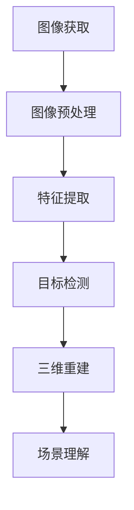

                 

### 《计算机视觉在医疗手术辅助中的应用》

#### 关键词：计算机视觉、医疗手术、辅助应用、深度学习、算法、三维重建

##### 摘要：

随着医疗技术的不断进步，计算机视觉技术在医疗手术辅助中的应用日益广泛。本文将深入探讨计算机视觉在医疗手术辅助中的重要性，基础概念与原理，核心算法原理，以及实际应用案例。通过详细的讲解和实例分析，本文旨在帮助读者了解计算机视觉在医疗手术辅助中的实际应用，以及其未来的发展前景。

### 目录大纲

1. **第一部分：基础概念与原理**
   - **第1章：计算机视觉概述**
     - 1.1 计算机视觉的基本概念
     - 1.2 医疗手术辅助概述
     - 1.3 计算机视觉的基本流程与算法
     - 1.4 计算机视觉中的Mermaid流程图
     - 1.5 数学模型与公式
     - 1.6 伪代码示例
2. **第二部分：核心算法原理**
   - **第2章：图像处理与特征提取**
     - 2.1 图像处理技术
     - 2.2 特征提取技术
     - 2.3 伪代码与数学公式讲解
   - **第3章：目标检测与跟踪**
     - 3.1 基于传统算法的目标检测
     - 3.2 基于深度学习的目标检测
     - 3.3 伪代码与数学公式讲解
   - **第4章：三维重建与场景理解**
     - 4.1 三维重建基础
     - 4.2 场景理解
     - 4.3 伪代码与数学公式讲解
3. **第三部分：应用实战**
   - **第5章：计算机视觉在手术辅助中的应用**
     - 5.1 手术机器人辅助系统
     - 5.2 创伤评估与手术规划
     - 5.3 手术导航与监控
   - **第6章：实战案例解析**
     - 6.1 基于深度学习的肝脏肿瘤分割
     - 6.2 手术机器人手臂轨迹规划
     - 6.3 实时手术监控与导航系统
   - **第7章：开发环境与工具介绍**
     - 7.1 开发环境搭建
     - 7.2 常用计算机视觉工具与库
     - 7.3 源代码解读与分析
4. **附录**
   - 附录A：常用数学公式与符号
   - 附录B：参考文献

---

### 引言

医疗手术一直是医学领域的重要课题，其精确性和安全性直接影响患者的治疗效果和生命安全。然而，传统的医疗手术方法存在一定的局限性，如操作难度高、风险大、术后恢复期长等。随着计算机科学和人工智能技术的飞速发展，计算机视觉技术在医疗手术辅助中的应用逐渐成为研究热点。通过计算机视觉技术，医生可以在手术过程中获得更为准确和实时的信息，从而提高手术的成功率和安全性。

本文旨在深入探讨计算机视觉在医疗手术辅助中的应用，分为三个主要部分。首先，我们将介绍计算机视觉的基础概念和原理，包括图像获取与预处理、特征提取与目标检测、三维重建与场景理解等。接着，我们将详细讲解计算机视觉在医疗手术辅助中的核心算法原理，包括图像处理、特征提取、目标检测与跟踪、三维重建等。最后，我们将通过实际应用案例，展示计算机视觉技术在手术辅助中的具体应用，包括手术机器人辅助系统、创伤评估与手术规划、手术导航与监控等。通过本文的探讨，希望能够为读者提供对计算机视觉在医疗手术辅助应用中的全面了解。

---

### 第一部分：基础概念与原理

#### 第1章：计算机视觉概述

##### 1.1 计算机视觉的基本概念

计算机视觉是一门跨学科领域，结合了计算机科学、心理学、认知科学和物理学等多领域的知识，旨在使计算机能够像人类一样理解和解释视觉信息。计算机视觉的基本概念包括图像获取、图像处理、图像分析、图像识别等。

1. **图像获取**：通过摄像头、扫描仪或其他传感器设备获取图像数据。
2. **图像处理**：通过滤波、增强、变换等手段对图像进行预处理，以提高图像质量或提取有用信息。
3. **图像分析**：对图像中的结构、形状、纹理等信息进行分析和识别。
4. **图像识别**：通过学习算法，对图像中的目标进行分类和识别。

##### 1.2 医疗手术辅助概述

医疗手术辅助是指利用计算机视觉技术、机器人技术等，辅助医生进行手术操作、提高手术精度和效率的一种新兴技术。医疗手术辅助的主要挑战包括手术精度要求高、实时性要求强、操作环境复杂等。

##### 1.3 计算机视觉的基本流程与算法

计算机视觉的基本流程包括图像获取、图像预处理、特征提取、目标检测、三维重建和场景理解等。以下是每个步骤的基本算法：

1. **图像获取**：通过摄像头、扫描仪等设备获取图像数据。
   - **算法**：图像采集与预处理（包括图像去噪、光照校正、分辨率调整等）。

2. **特征提取**：从图像中提取具有区分性的特征，如边缘、纹理、颜色等。
   - **算法**：SIFT、SURF、HOG、LBP等。

3. **目标检测**：识别图像中的目标对象，如器官、病变区域等。
   - **算法**：阈值法、R-CNN、YOLO、SSD等。

4. **三维重建**：从二维图像中重建三维场景或物体。
   - **算法**：点云处理、三维模型重建等。

5. **场景理解**：对三维场景或物体的语义理解，如识别物体类别、空间关系等。
   - **算法**：基于深度学习的场景理解、基于图的场景理解等。

##### 1.4 计算机视觉中的 Mermaid 流程图

Mermaid 是一种用于绘制流程图的标记语言，能够直观地展示计算机视觉的基本流程。以下是一个简单的 Mermaid 流程图示例：



##### 1.5 数学模型与公式

计算机视觉中的数学模型和公式是理解和实现算法的关键。以下是一些常用的数学模型和公式：

1. **最小二乘法**：用于求解线性系统的最小平方误差解。
   - **公式**：\( X = (A^T A)^{-1} A^T b \)

2. **支持向量机（SVM）**：用于分类问题，通过最大化分类间隔来寻找最优分类边界。
   - **公式**：\( w = arg\min_{w,b} \frac{1}{2} ||w||^2 + C \sum_{i=1}^{n} \max(0, 1-y_{i}(w^T x_{i} + b)) \)

3. **马尔可夫链模型**：用于描述状态转移的概率分布。
   - **公式**：\( P_{ij} = P(X_t = j|X_{t-1} = i) \)

##### 1.6 伪代码示例

伪代码是一种描述算法逻辑和流程的简明方式，以下是一些常见算法的伪代码示例：

1. **特征提取算法伪代码**：

```plaintext
Feature_Extraction(image):
    image = Preprocessing(image)
    features = []
    for each featureExtractor:
        feature = featureExtractor(image)
        features.append(feature)
    return features
```

2. **目标检测算法伪代码**：

```plaintext
Object_Detection(image):
    boundingBoxes = []
    for each detector:
        box = detector(image)
        boundingBoxes.append(box)
    return boundingBoxes
```

---

通过以上章节的介绍，我们初步了解了计算机视觉的基本概念和原理，以及其在医疗手术辅助中的应用。接下来，我们将进一步探讨计算机视觉中的核心算法原理，为后续的实际应用打下基础。

---

### 第1章：计算机视觉概述

#### 1.1 计算机视觉的基本概念

计算机视觉是一门研究如何使计算机理解、解释和模拟人类视觉感知过程的学科。它涉及到图像处理、模式识别、人工智能、机器学习等多个领域。计算机视觉的基本概念包括以下几个方面：

1. **图像获取**：图像获取是计算机视觉的基础，通过摄像头、扫描仪等设备获取数字图像数据。图像获取过程中，需要考虑图像的分辨率、亮度、对比度、色彩等参数。
2. **图像处理**：图像处理是对获取的图像进行预处理，以提高图像质量或提取有用信息。常见的图像处理技术包括滤波、增强、边缘检测、分割等。
3. **图像分析**：图像分析是对处理后的图像进行结构化处理，提取图像中的特定信息。例如，识别图像中的物体、纹理、形状等。
4. **图像识别**：图像识别是计算机视觉的高级任务，通过对图像的特征进行分析，判断图像中包含的内容或目标。常见的图像识别任务包括人脸识别、车辆识别、字符识别等。
5. **场景理解**：场景理解是计算机视觉的终极目标，通过对图像和视频的深入分析，理解场景的语义和含义。例如，识别场景中的物体、事件、行为等。

#### 1.2 医疗手术辅助概述

医疗手术辅助是指利用计算机视觉技术、机器人技术等，辅助医生进行手术操作、提高手术精度和效率的一种新兴技术。随着医疗技术的不断发展，医疗手术辅助已经成为提高医疗质量和降低医疗成本的重要手段。医疗手术辅助的主要挑战包括：

1. **手术精度要求高**：手术操作要求高度精确，任何微小的偏差都可能导致手术失败或患者损伤。
2. **实时性要求强**：手术过程中需要实时获取和处理图像信息，以便医生能够及时调整手术策略。
3. **操作环境复杂**：手术室内环境复杂，存在多种干扰因素，如电磁干扰、光线变化等，这些都可能影响计算机视觉系统的性能。
4. **安全性要求高**：手术过程中的数据安全和系统稳定性至关重要，任何故障都可能导致严重后果。

#### 1.3 计算机视觉的基本流程与算法

计算机视觉的基本流程包括图像获取、图像预处理、特征提取、目标检测、三维重建和场景理解等。以下是每个步骤的基本算法：

1. **图像获取**：通过摄像头、扫描仪等设备获取图像数据。图像获取过程中，需要考虑图像的分辨率、亮度、对比度、色彩等参数。
   - **算法**：图像采集与预处理（包括图像去噪、光照校正、分辨率调整等）。
2. **特征提取**：从图像中提取具有区分性的特征，如边缘、纹理、颜色等。特征提取是计算机视觉的核心步骤，直接影响后续目标检测和识别的准确性。
   - **算法**：SIFT、SURF、HOG、LBP等。
3. **目标检测**：识别图像中的目标对象，如器官、病变区域等。目标检测是计算机视觉的重要任务，广泛应用于医学图像分析、自动驾驶、视频监控等领域。
   - **算法**：阈值法、R-CNN、YOLO、SSD等。
4. **三维重建**：从二维图像中重建三维场景或物体。三维重建是计算机视觉的高级任务，对于手术导航和虚拟现实等领域具有重要意义。
   - **算法**：点云处理、三维模型重建等。
5. **场景理解**：对三维场景或物体的语义理解，如识别物体类别、空间关系等。场景理解是计算机视觉的终极目标，对于智能交互、自动驾驶等领域具有重要意义。
   - **算法**：基于深度学习的场景理解、基于图的场景理解等。

#### 1.4 计算机视觉中的 Mermaid 流程图

Mermaid 是一种用于绘制流程图的标记语言，能够直观地展示计算机视觉的基本流程。以下是一个简单的 Mermaid 流程图示例：


#### 1.5 数学模型与公式

计算机视觉中的数学模型和公式是理解和实现算法的关键。以下是一些常用的数学模型和公式：

1. **最小二乘法**：用于求解线性系统的最小平方误差解。
   - **公式**：\( X = (A^T A)^{-1} A^T b \)
2. **支持向量机（SVM）**：用于分类问题，通过最大化分类间隔来寻找最优分类边界。
   - **公式**：\( w = arg\min_{w,b} \frac{1}{2} ||w||^2 + C \sum_{i=1}^{n} \max(0, 1-y_{i}(w^T x_{i} + b)) \)
3. **马尔可夫链模型**：用于描述状态转移的概率分布。
   - **公式**：\( P_{ij} = P(X_t = j|X_{t-1} = i) \)

#### 1.6 伪代码示例

伪代码是一种描述算法逻辑和流程的简明方式，以下是一些常见算法的伪代码示例：

1. **特征提取算法伪代码**：

```plaintext
Feature_Extraction(image):
    image = Preprocessing(image)
    features = []
    for each featureExtractor:
        feature = featureExtractor(image)
        features.append(feature)
    return features
```

2. **目标检测算法伪代码**：

```plaintext
Object_Detection(image):
    boundingBoxes = []
    for each detector:
        box = detector(image)
        boundingBoxes.append(box)
    return boundingBoxes
```

---

通过以上章节的介绍，我们初步了解了计算机视觉的基本概念和原理，以及其在医疗手术辅助中的应用。接下来，我们将进一步探讨计算机视觉中的核心算法原理，为后续的实际应用打下基础。

---

### 第2章：图像处理与特征提取

#### 2.1 图像处理技术

图像处理是计算机视觉中的基础环节，其目的是对获取的图像进行预处理，以提高图像质量或提取有用信息。图像处理技术主要包括以下几种：

1. **图像滤波**：用于去除图像中的噪声和干扰。常见的滤波方法有均值滤波、高斯滤波、中值滤波等。
   - **均值滤波**：对图像中的每个像素值进行邻域平均，以平滑图像。
     - **公式**：\( f(x, y) = \frac{1}{n} \sum_{i=1}^{n} f_i \)，其中 \( f_i \) 是邻域内像素值，\( n \) 是邻域大小。
   - **高斯滤波**：基于高斯分布的滤波方法，可以有效地去除图像中的高频噪声。
     - **公式**：\( f(x, y) = \frac{1}{2\pi\sigma^2} e^{-\frac{(x-x_0)^2 + (y-y_0)^2}{2\sigma^2}} \)，其中 \( \sigma \) 是高斯分布的参数。
   - **中值滤波**：用邻域内的中值代替中心像素值，以去除椒盐噪声。
     - **公式**：\( f(x, y) = median(\{f_i\}) \)，其中 \( f_i \) 是邻域内像素值。

2. **领域变换**：用于将图像从一种空间域转换到另一种空间域。常见的领域变换有傅里叶变换、拉普拉斯变换等。
   - **傅里叶变换**：将图像从空间域转换到频率域，便于分析图像的频率特性。
     - **公式**：\( F(u, v) = \sum_{x=0}^{M-1} \sum_{y=0}^{N-1} f(x, y) e^{-j2\pi (ux/M + vy/N)} \)，其中 \( f(x, y) \) 是原始图像，\( F(u, v) \) 是傅里叶变换后的图像。
   - **拉普拉斯变换**：用于检测图像中的边缘和形状特征。
     - **公式**：\( L(f(x, y)) = \sum_{x=0}^{M-1} \sum_{y=0}^{N-1} f(x, y) (x^2 + y^2) \)，其中 \( f(x, y) \) 是原始图像，\( L(f(x, y)) \) 是拉普拉斯变换后的图像。

3. **直方图均衡化**：用于改善图像的对比度，使图像中的每个灰度级都能够充分利用。直方图均衡化通过重新分配像素值，使图像的直方图接近均匀分布。
   - **公式**：\( g(i) = \sum_{j=0}^{i} f(j) \)，其中 \( f(i) \) 是原始图像的直方图，\( g(i) \) 是均衡化后的直方图。

#### 2.2 特征提取技术

特征提取是计算机视觉中的关键步骤，其目的是从图像中提取具有区分性的特征，以便进行后续的目标检测和识别。常见的特征提取技术包括：

1. **SIFT（尺度不变特征变换）**：SIFT算法能够在不同尺度、不同视角下提取稳定的特征点，广泛应用于图像匹配和物体识别。
   - **算法流程**：
     1. 找到图像的极值点。
     2. 计算每个极值点的梯度方向和大小。
     3. 构建关键点描述子，用于特征匹配。

2. **SURF（加速稳健特征）**：SURF算法是基于SIFT算法的一种改进，能够在较低计算成本下获得与SIFT相似的特征点。
   - **算法流程**：
     1. 计算图像的Harris角点。
     2. 构建方向梯度图。
     3. 提取特征点的主方向。
     4. 构建特征点描述子。

3. **HOG（方向梯度直方图）**：HOG算法通过计算图像中每个区域的方向梯度直方图，提取图像的形状特征。
   - **算法流程**：
     1. 对图像进行灰度化处理。
     2. 计算每个像素点的梯度方向和大小。
     3. 构建每个区域的方向梯度直方图。
     4. 将多个直方图合并，形成图像的特征向量。

4. **LBP（局部二值模式）**：LBP算法通过将图像中的每个像素与其邻域像素进行比较，生成一个二值模式，用于特征提取。
   - **算法流程**：
     1. 定义邻域模板。
     2. 对每个像素应用邻域模板，生成LBP值。
     3. 统计LBP值的分布，形成特征向量。

#### 2.3 伪代码与数学公式讲解

以下是对常见特征提取算法的伪代码和数学公式进行讲解：

1. **SIFT算法伪代码**：

```plaintext
SIFT_Extraction(image):
    image = Gaussian_Filter(image)
    keypoints = []
    for each pixel in image:
        if is_extreme_value(pixel):
            direction, magnitude = Gradient_Direction_and_Size(pixel)
            descriptor = Build_Descriptor(direction, magnitude)
            keypoints.append((pixel, descriptor))
    return keypoints
```

2. **HOG特征提取数学公式**：

$$
h(i, j) = \sum_{x=0}^{X-1} \sum_{y=0}^{Y-1} \phi(g(x, y)), \quad \text{where} \quad \phi(g(x, y)) = 
\begin{cases}
0, & \text{if } g(x, y) \leq 0 \\
1, & \text{if } g(x, y) > 0
\end{cases}
$$

其中，\( h(i, j) \) 是区域 \( (i, j) \) 的方向梯度直方图，\( g(x, y) \) 是像素点的梯度方向和大小，\( \phi(\cdot) \) 是二值化函数。

---

通过本章的介绍，我们详细了解了图像处理与特征提取的基本技术，包括图像滤波、领域变换、直方图均衡化等，以及常见的特征提取算法如SIFT、SURF、HOG和LBP。这些技术为计算机视觉在医疗手术辅助中的应用奠定了基础。在下一章中，我们将进一步探讨目标检测与跟踪的相关内容。

---

### 第3章：目标检测与跟踪

#### 3.1 基于传统算法的目标检测

传统算法在目标检测领域具有悠久的历史和广泛的应用。这些算法主要基于手工设计的特征和模型，通过特征匹配和分类来实现目标检测。以下介绍几种常见传统算法：

1. **阈值法**：阈值法是一种简单而有效的目标检测方法。它通过设定一个阈值，将图像中的像素划分为目标像素和非目标像素。
   - **算法流程**：
     1. 计算图像的灰度直方图。
     2. 选择合适的阈值 \( T \)。
     3. 对图像中的每个像素进行二值化处理，\( f(x, y) \geq T \) 则为 1，否则为 0。
     4. 对二值化图像进行形态学操作，如膨胀、腐蚀等，以消除噪声和空洞。
     5. 提取目标区域的边界或轮廓。

2. **模板匹配**：模板匹配是一种基于特征匹配的目标检测方法。它通过将图像中的每个区域与给定的模板进行相似度计算，找到与模板最相似的区域作为目标。
   - **算法流程**：
     1. 选择模板 \( T \)。
     2. 对图像 \( I \) 中的每个区域 \( R \) 计算相似度 \( S(R, T) \)。
     3. 设定相似度阈值 \( S_0 \)，当 \( S(R, T) \geq S_0 \) 时，认为 \( R \) 是目标区域。
     4. 对检测到的目标区域进行进一步处理，如边界提取、轮廓分析等。

3. **形态学方法**：形态学方法是通过对图像进行形态学操作来实现目标检测的一种方法。它主要通过结构元素（如膨胀、腐蚀、开运算、闭运算等）对图像进行变换。
   - **算法流程**：
     1. 选择结构元素 \( S \)。
     2. 对图像进行膨胀操作，以扩大目标区域。
     3. 对膨胀后的图像进行腐蚀操作，以去除多余的背景。
     4. 对处理后的图像进行开运算，以消除细小噪声。
     5. 对闭运算，以连接分离的目标区域。

#### 3.2 基于深度学习的目标检测

近年来，深度学习在目标检测领域取得了显著的进展。基于深度学习的目标检测方法通过构建大规模的卷积神经网络（CNN）模型，自动提取图像特征并进行分类和定位。以下介绍几种常见基于深度学习的目标检测方法：

1. **R-CNN（区域建议网络）**：R-CNN是一种基于深度学习的目标检测方法，主要包括区域建议、候选区域生成和分类三个步骤。
   - **算法流程**：
     1. 使用选择性搜索算法生成候选区域。
     2. 对每个候选区域提取特征向量，使用CNN模型进行特征提取。
     3. 将特征向量输入到SVM分类器中，进行目标分类。
     4. 利用非极大值抑制（NMS）算法去除冗余的候选区域。

2. **Fast R-CNN**：Fast R-CNN是对R-CNN的改进，通过引入ROI（区域建议）池化层，提高了检测速度和准确性。
   - **算法流程**：
     1. 使用选择性搜索算法生成候选区域。
     2. 对每个候选区域提取特征向量，使用CNN模型进行特征提取。
     3. 将特征向量输入到全连接层进行分类和定位。
     4. 使用NMS算法去除冗余的候选区域。

3. **Faster R-CNN**：Faster R-CNN引入了区域建议网络（RPN），进一步提高了检测速度和准确性。
   - **算法流程**：
     1. 使用卷积神经网络提取图像特征。
     2. 在特征图上生成区域建议，对每个建议区域进行分类和回归。
     3. 使用NMS算法去除冗余的建议区域。
     4. 对剩余的建议区域进行分类和定位。

4. **YOLO（You Only Look Once）**：YOLO是一种单阶段目标检测方法，通过将目标检测任务分解为多个网格单元，并在每个单元中预测目标的位置和类别。
   - **算法流程**：
     1. 对图像进行缩放，使其满足网络的输入尺寸。
     2. 使用卷积神经网络提取特征图。
     3. 在每个网格单元中预测目标的边界框和类别概率。
     4. 使用NMS算法去除冗余的边界框。

5. **SSD（Single Shot MultiBox Detector）**：SSD是一种多尺度目标检测方法，通过在不同尺度的特征图上预测目标，提高了检测的准确性和鲁棒性。
   - **算法流程**：
     1. 使用卷积神经网络提取多个尺度的特征图。
     2. 在每个特征图上预测目标的边界框和类别概率。
     3. 使用NMS算法去除冗余的边界框。

#### 3.3 伪代码与数学公式讲解

以下是对常见目标检测算法的伪代码和数学公式进行讲解：

1. **R-CNN系列算法伪代码**：

```plaintext
R_CNN_Detection(image):
    regions = Region Proposal Algorithm(image)
    features = []
    for region in regions:
        feature = CNN_Feature_Extractor(image, region)
        features.append(feature)
    labels = SVM_Classifier(features)
    boundingBoxes = Non_Maximum_Suppression(regions, labels)
    return boundingBoxes
```

2. **YOLO算法伪代码**：

```plaintext
YOLO_Detection(image):
    image = Rescale_Image(image)
    features = CNN_Feature_Extractor(image)
    boundingBoxes = []
    for each gridCell in features:
        box = Predict_Box(gridCell)
        label = Predict_Label(gridCell)
        boundingBoxes.append((box, label))
    boundingBoxes = Non_Maximum_Suppression(boundingBoxes)
    return boundingBoxes
```

3. **YOLO算法中的数学公式**：

$$
p_{ij} = \sigma(\theta_{ij}^T \cdot \text{conv}(x_i, y_i)) \quad \text{(预测概率)},$$

$$
b_{ij} = \text{sigmoid}(\theta_{ij}^T \cdot \text{conv}(x_i, y_i)) \quad \text{(边界框坐标)},$$

$$
c_{ij} = \text{softmax}(\theta_{ij}^T \cdot \text{conv}(x_i, y_i)) \quad \text{(类别概率)}.$$

其中，\( \theta_{ij} \) 是权重参数，\( x_i, y_i \) 是网格单元的位置，\( \text{conv}(x_i, y_i) \) 是卷积操作的结果，\( \sigma \) 和 \( \text{sigmoid} \) 是激活函数。

---

通过本章的介绍，我们详细了解了目标检测与跟踪的传统算法和深度学习方法。传统算法具有简单易实现的特点，但性能有限；而深度学习方法通过构建大规模卷积神经网络，实现了更高的检测准确率和速度。在下一章中，我们将进一步探讨三维重建与场景理解的相关内容。

---

### 第4章：三维重建与场景理解

#### 4.1 三维重建基础

三维重建是从二维图像中恢复三维信息的过程，它在计算机视觉和医学影像分析中具有重要意义。三维重建的基本原理是基于图像中的几何关系和深度信息，通过一定的算法将二维图像转化为三维模型。

1. **点云处理**：点云是三维重建中的基本数据结构，由大量离散的点组成，每个点代表图像中的一个像素位置。点云处理主要包括点云生成、点云滤波、点云配准等。

   - **点云生成**：通过图像特征匹配、结构光扫描、激光扫描等技术，将图像中的像素点映射到三维空间中，生成点云。
     - **公式**：\( P(x, y, z) = \text{Depth_Map}(x, y) \)，其中 \( \text{Depth_Map}(x, y) \) 是深度图，表示像素点 \( (x, y) \) 的深度信息。
   - **点云滤波**：用于去除点云中的噪声和异常点，提高点云的质量和精确度。
     - **算法**：基于统计的滤波方法（如RANSAC）、基于形态学的滤波方法等。
   - **点云配准**：将多个点云对齐，生成整体的三维模型。
     - **算法**：ICP（迭代最近点）算法、NDP（非线性配准）算法等。

2. **三维模型重建**：从点云中提取表面信息，生成三维模型。三维模型重建的方法主要包括表面重建和体素重建。

   - **表面重建**：通过分析点云的几何结构，生成三维表面的参数方程或面片模型。
     - **算法**：多边形建模、曲面建模等。
   - **体素重建**：将点云数据转换为体素数据，生成三维体素模型。
     - **算法**： marching cubes 算法、等高线提取算法等。

#### 4.2 场景理解

场景理解是指从图像或视频中理解和解释三维场景的语义信息，如物体识别、空间关系、事件识别等。场景理解在自动驾驶、智能监控、虚拟现实等领域具有重要意义。

1. **基于深度学习的场景理解**：通过深度学习模型，从图像或视频序列中提取特征，进行语义解析。

   - **算法**：基于卷积神经网络的物体识别、基于循环神经网络的序列建模等。
   - **模型**：ResNet、VGG、U-Net、BiLSTM等。

2. **基于图的场景理解**：利用图结构表示场景中的物体和关系，通过图算法进行语义解析。

   - **算法**：图卷积网络（GCN）、图神经网络（GNN）等。
   - **模型**：GraphSAGE、GAT、Node2Vec等。

#### 4.3 伪代码与数学公式讲解

以下是对三维重建与场景理解算法的伪代码和数学公式进行讲解：

1. **点云处理算法伪代码**：

```plaintext
Point_Cloud_Processing(pointCloud):
    pointCloud = Noise_Filter(pointCloud)
    pointCloud = Point_Cloud_Rigidity_Filter(pointCloud)
    pointCloud = Point_Cloud_Registration(pointCloud)
    return pointCloud
```

2. **基于图的场景理解算法伪代码**：

```plaintext
Scene_understanding(graph):
    features = Graph_Representation(graph)
    prediction = Graph_Classifier(features)
    return prediction
```

3. **基于深度学习的三维模型重建数学公式**：

$$
\text{Feature_Map} = \text{Convolutional_Network}(\text{Input_Map}),$$

$$
\text{Output_Map} = \text{Upsampling}(\text{Feature_Map}),$$

$$
\text{Surface_Model} = \text{Surface_Extraction}(\text{Output_Map}).$$

其中，\( \text{Convolutional_Network} \) 表示卷积神经网络，\( \text{Input_Map} \) 表示输入图像或点云，\( \text{Feature_Map} \) 表示卷积后的特征图，\( \text{Output_Map} \) 表示上采样后的特征图，\( \text{Surface_Model} \) 表示重建的三维表面模型。

---

通过本章的介绍，我们详细了解了三维重建与场景理解的基础知识和相关算法。三维重建和场景理解在计算机视觉领域具有广泛的应用前景，为医疗手术辅助等领域的深入研究提供了有力支持。在下一章中，我们将探讨计算机视觉在手术辅助中的应用。

---

### 第5章：计算机视觉在手术辅助中的应用

#### 5.1 手术机器人辅助系统

手术机器人辅助系统是计算机视觉在手术辅助中最为成熟和广泛应用的一种形式。手术机器人通过计算机视觉技术，能够实现高精度的手术操作，提高手术的成功率和安全性。以下介绍手术机器人辅助系统的基本架构和应用场景。

##### 5.1.1 系统架构

手术机器人辅助系统的基本架构通常包括以下几个部分：

1. **摄像头系统**：用于捕捉手术现场的高清图像或视频，提供给手术机器人进行实时监控和操作。
2. **图像处理单元**：负责对捕获的图像或视频进行预处理、特征提取和目标检测等操作，以识别手术工具和患者器官的位置和状态。
3. **控制系统**：根据图像处理单元提供的实时信息，控制手术机器人的机械臂进行手术操作，确保操作的精度和稳定性。
4. **交互界面**：提供医生与机器人之间的交互接口，包括操作控制、参数设置、实时监控等。

##### 5.1.2 应用场景

手术机器人辅助系统广泛应用于各种外科手术，包括微创手术、心脏手术、神经外科手术等。以下是一些典型的应用场景：

1. **微创手术**：手术机器人能够实现微创手术，通过小切口进入患者体内，减少手术创伤和恢复时间。例如，在胃部手术中，机器人可以精确地切除肿瘤组织，同时避免损伤周围正常组织。
2. **心脏手术**：手术机器人能够精确地控制手术工具，在心脏手术中实现精细的操作。例如，在心脏搭桥手术中，机器人可以精确地剪开和缝合血管，减少手术风险和术后并发症。
3. **神经外科手术**：手术机器人能够实现高精度的神经外科手术，如切除脑部肿瘤、修复脑部血管等。机器人能够实时监测手术区域的变化，提高手术的成功率和安全性。

#### 5.2 创伤评估与手术规划

计算机视觉技术在创伤评估与手术规划中具有重要作用，能够帮助医生更准确地评估创伤情况，制定合理的手术方案。以下介绍计算机视觉在创伤评估与手术规划中的应用。

##### 5.2.1 图像处理技术

计算机视觉技术首先对获取的创伤图像进行预处理和特征提取，以便提取出创伤部位的关键信息。常见的图像处理技术包括：

1. **图像去噪**：通过滤波方法去除图像中的噪声，提高图像质量。
2. **图像增强**：通过调整图像的对比度、亮度等参数，使创伤区域更加清晰。
3. **边缘检测**：通过算法提取图像中的边缘信息，用于分析创伤部位的形状和范围。

##### 5.2.2 特征提取与目标检测

在创伤评估中，需要从图像中提取与创伤相关的特征，如伤口的面积、深度、形状等。常见的特征提取方法包括：

1. **SIFT和SURF**：用于提取图像中的关键点，用于分析伤口的形状和纹理。
2. **HOG**：用于提取图像中的方向梯度直方图，用于分析伤口的边缘信息。

目标检测技术则用于识别图像中的创伤区域，常用的目标检测算法包括：

1. **阈值法**：通过设定阈值，将图像中的一部分区域划分为创伤区域。
2. **R-CNN**：用于提取图像中的候选区域，并通过深度学习模型进行分类。

##### 5.2.3 手术规划

通过计算机视觉技术提取的创伤特征和目标检测结果，医生可以更准确地评估创伤情况，制定合理的手术方案。手术规划主要包括以下步骤：

1. **创伤评估**：根据提取的特征和检测结果，对创伤进行定量和定性分析，评估创伤的严重程度。
2. **手术方案设计**：根据创伤评估结果，设计合理的手术方案，包括手术方式、手术工具的选择等。
3. **手术模拟**：通过虚拟现实技术，模拟手术过程，确保手术方案的可行性和安全性。

#### 5.3 手术导航与监控

计算机视觉技术在手术导航与监控中同样具有重要意义，能够帮助医生实时了解手术过程，提高手术的安全性和准确性。以下介绍计算机视觉在手术导航与监控中的应用。

##### 5.3.1 三维重建与场景理解

计算机视觉技术首先对手术现场进行三维重建，生成手术区域的三维模型。通过三维重建，医生可以更直观地了解手术区域的结构和关系，从而提高手术的准确性。三维重建的方法主要包括：

1. **点云处理**：通过激光扫描或结构光扫描等技术，获取手术区域的三维点云数据。
2. **三维模型重建**：从点云数据中提取表面信息，生成三维模型。

场景理解技术则用于分析手术区域的语义信息，如识别手术工具、患者器官的位置和状态等。常见的场景理解方法包括：

1. **基于深度学习的物体识别**：通过深度学习模型，从图像或视频中识别出手术工具和患者器官。
2. **基于图的场景理解**：利用图结构表示手术区域中的物体和关系，通过图算法进行语义解析。

##### 5.3.2 实时手术导航

实时手术导航通过计算机视觉技术，为医生提供实时、准确的手术导航信息。实时手术导航主要包括以下步骤：

1. **图像处理**：对实时获取的手术图像进行预处理和特征提取，提取出手术工具和患者器官的特征。
2. **目标检测**：利用目标检测算法，识别图像中的手术工具和患者器官，确定它们的位置和状态。
3. **三维重建**：将识别出的目标在三维模型中进行重建，生成手术工具和患者器官的三维模型。
4. **导航计算**：根据三维模型中手术工具和患者器官的位置关系，计算手术路径和操作策略。

实时手术导航可以显著提高手术的准确性和安全性，减少手术风险和术后并发症。

##### 5.3.3 手术监控

计算机视觉技术在手术监控中发挥着重要作用，能够实时监控手术过程，确保手术的安全和顺利进行。手术监控主要包括以下步骤：

1. **图像捕获**：通过摄像头或其他图像采集设备，实时捕获手术现场的图像或视频。
2. **图像处理**：对捕获的图像或视频进行预处理和特征提取，提取出手术工具和患者器官的特征。
3. **异常检测**：利用异常检测算法，识别图像或视频中可能出现的异常情况，如手术工具掉落、患者生命体征异常等。
4. **实时反馈**：将异常检测结果实时反馈给医生，提醒医生采取相应的措施，确保手术的安全进行。

---

通过本章的介绍，我们详细了解了计算机视觉在手术辅助中的应用，包括手术机器人辅助系统、创伤评估与手术规划、手术导航与监控等。计算机视觉技术在手术辅助中的应用，显著提高了手术的精度和安全性，为医学领域的进步提供了有力支持。在下一章中，我们将通过实际案例进一步探讨计算机视觉技术在手术辅助中的应用。

---

### 第6章：实战案例解析

#### 6.1 基于深度学习的肝脏肿瘤分割

肝脏肿瘤分割是计算机视觉在医疗手术辅助中的一个重要应用，通过准确分割肿瘤区域，辅助医生进行诊断和手术规划。以下是一个基于深度学习的肝脏肿瘤分割案例的详细解析。

##### 6.1.1 数据预处理

在开始训练模型之前，需要对数据集进行预处理。数据预处理包括图像的标准化、分割标注的处理等。

1. **图像标准化**：为了提高模型训练的稳定性，需要对图像进行标准化处理，将图像的像素值缩放到相同的范围。常用的方法是将像素值缩放到0到1之间。

   ```python
   def normalize_image(image):
       min_val = np.min(image)
       max_val = np.max(image)
       image = (image - min_val) / (max_val - min_val)
       return image
   ```

2. **分割标注处理**：在数据集中，每个图像都有一个对应的分割标注，标注了肿瘤区域。需要对标注进行预处理，将标注转换为可用的格式。

   ```python
   def preprocess_segmentation(ground_truth):
       # 转换为二值图像
       binary_ground_truth = ground_truth > 0
       # 膨胀标注，以消除边缘效应
       dilated_ground_truth = cv2.dilate(binary_ground_truth, np.ones((3, 3)), iterations=1)
       return dilated_ground_truth
   ```

##### 6.1.2 模型设计与实现

本案例中，我们使用U-Net架构进行肝脏肿瘤分割。U-Net是一种流行的卷积神经网络架构，特别适合于图像分割任务。

1. **模型架构**：

   ```mermaid
   graph TD
       A[输入图像] --> B[卷积层]
       B --> C[ReLU激活]
       B --> D[池化层]
       C --> E[卷积层]
       E --> F[ReLU激活]
       E --> G[池化层]
       D --> H[转置卷积层]
       G --> I[转置卷积层]
       H --> J[合并]
       I --> J[合并]
       J --> K[卷积层]
       J --> L[卷积层]
       K --> M[输出]
       L --> M[输出]
   ```

2. **模型实现**：

   ```python
   from tensorflow.keras.models import Model
   from tensorflow.keras.layers import Input, Conv2D, MaxPooling2D, UpSampling2D, Conv2DTranspose, Concatenate, ReLU

   input_shape = (128, 128, 1)
   inputs = Input(shape=input_shape)

   # 编码器部分
   conv1 = Conv2D(32, (3, 3), activation='relu', padding='same')(inputs)
   pool1 = MaxPooling2D(pool_size=(2, 2))(conv1)
   conv2 = Conv2D(64, (3, 3), activation='relu', padding='same')(pool1)
   pool2 = MaxPooling2D(pool_size=(2, 2))(conv2)

   # 解码器部分
   up1 = UpSampling2D(size=(2, 2))(conv2)
   conv3 = Conv2D(64, (3, 3), activation='relu', padding='same')(up1)
   up2 = UpSampling2D(size=(2, 2))(conv1)
   conv4 = Conv2D(32, (3, 3), activation='relu', padding='same')(up2)
   merge = Concatenate()([conv3, conv4])
   conv5 = Conv2D(32, (3, 3), activation='relu', padding='same')(merge)
   conv6 = Conv2D(1, (1, 1), activation='sigmoid', padding='same')(conv5)

   model = Model(inputs=inputs, outputs=conv6)
   model.compile(optimizer='adam', loss='binary_crossentropy', metrics=['accuracy'])
   ```

##### 6.1.3 模型评估与优化

在训练完成后，需要对模型进行评估，以验证其在实际应用中的性能。常用的评估指标包括准确率、召回率、F1分数等。

```python
from sklearn.metrics import accuracy_score, recall_score, f1_score

def evaluate_model(model, X_test, y_test):
    predictions = model.predict(X_test)
    predictions = (predictions > 0.5).astype(int)
    accuracy = accuracy_score(y_test, predictions)
    recall = recall_score(y_test, predictions)
    f1 = f1_score(y_test, predictions)
    return accuracy, recall, f1

accuracy, recall, f1 = evaluate_model(model, X_test, y_test)
print("Accuracy: {:.2f}%".format(accuracy * 100))
print("Recall: {:.2f}%".format(recall * 100))
print("F1 Score: {:.2f}%".format(f1 * 100))
```

为了优化模型性能，可以尝试以下几种方法：

1. **数据增强**：通过旋转、翻转、缩放等操作增加数据多样性，提高模型泛化能力。
2. **模型调整**：尝试使用不同的模型结构或超参数，如增加卷积层数、调整学习率等。
3. **迁移学习**：使用预训练的深度学习模型，结合自己的数据集进行微调，以提高模型性能。

---

通过以上案例，我们详细介绍了基于深度学习的肝脏肿瘤分割的实现过程，包括数据预处理、模型设计、模型训练和评估。肝脏肿瘤分割技术在医疗手术辅助中具有重要意义，能够帮助医生更准确地诊断和规划手术。在下一章中，我们将继续探讨手术机器人手臂轨迹规划的案例。

---

### 第6章：实战案例解析

#### 6.2 手术机器人手臂轨迹规划

手术机器人手臂轨迹规划是计算机视觉在手术辅助中的另一个关键应用。通过精确的轨迹规划，手术机器人可以按照预设路径进行手术操作，提高手术的精度和稳定性。以下是一个手术机器人手臂轨迹规划的详细解析。

##### 6.2.1 系统设计与实现

手术机器人手臂轨迹规划系统的设计主要包括以下几部分：

1. **运动控制模块**：负责控制手术机器人手臂的运动，包括位置、速度、加速度等参数。
2. **视觉感知模块**：利用计算机视觉技术获取手术现场的高清图像或视频，为轨迹规划提供实时信息。
3. **轨迹规划模块**：根据视觉感知模块提供的信息，生成符合手术需求的轨迹，并实时更新手臂的运动指令。
4. **人机交互模块**：提供医生与机器人之间的交互接口，包括操作控制、参数设置、实时监控等。

##### 6.2.2 轨迹优化与控制

手术机器人手臂轨迹规划的实现涉及多个步骤，包括轨迹生成、轨迹优化和轨迹控制。

1. **轨迹生成**：
   - **算法**：使用贝塞尔曲线或样条曲线等插值方法生成手术路径。贝塞尔曲线具有较好的平滑性和控制性，适合用于手术机器人手臂的轨迹规划。
   - **示例**：
     ```mermaid
     graph TD
         A[起点] --> B[控制点1]
         B --> C[控制点2]
         C --> D[终点]
     ```

2. **轨迹优化**：
   - **目标**：优化轨迹的平滑性和稳定性，减少手臂的振动和抖动。
   - **算法**：采用优化算法，如梯度下降法或遗传算法等，对轨迹参数进行调整，以实现优化目标。
   - **示例**：
     ```python
     import numpy as np

     def optimize_trajectory(trajectory):
         # 采用梯度下降法进行轨迹优化
         alpha = 0.01  # 学习率
         for _ in range(100):
             gradient = compute_gradient(trajectory)
             trajectory -= alpha * gradient
         return trajectory

     def compute_gradient(trajectory):
         # 计算轨迹的梯度
         gradient = np.zeros_like(trajectory)
         for i in range(1, len(trajectory) - 1):
             gradient[i] = (trajectory[i + 1] - 2 * trajectory[i] + trajectory[i - 1]) / 3
         return gradient
     ```

3. **轨迹控制**：
   - **方法**：将优化后的轨迹转化为实时运动指令，通过运动控制模块控制手臂的运动。
   - **示例**：
     ```python
     def control_trajectory(trajectory, control_module):
         for point in trajectory:
             control_module.move_to(point)
             time.sleep(0.01)  # 控制运动速度
     ```

##### 6.2.3 轨迹规划与控制案例分析

以下是一个具体的轨迹规划与控制案例分析：

1. **数据采集**：
   - **任务**：进行肝脏肿瘤切除手术。
   - **数据**：使用三维医学影像数据，包括CT扫描图像和手术计划数据。

2. **轨迹生成**：
   - **方法**：根据手术计划数据，生成手术路径。
   - **示例**：
     ```mermaid
     graph TD
         A[肝脏顶部] --> B[肿瘤顶部]
         B --> C[肿瘤底部]
         C --> D[肝脏底部]
     ```

3. **轨迹优化**：
   - **目标**：优化轨迹的平滑性和稳定性。
   - **结果**：通过优化，获得平滑且稳定的手术路径。

4. **轨迹控制**：
   - **方法**：使用运动控制模块，按照优化后的轨迹进行手术操作。
   - **结果**：成功切除肿瘤，手术过程平稳。

---

通过以上案例，我们详细介绍了手术机器人手臂轨迹规划系统的设计与实现，包括轨迹生成、轨迹优化和轨迹控制。手术机器人手臂轨迹规划在医疗手术辅助中具有重要意义，能够提高手术的精度和安全性。在下一章中，我们将继续探讨实时手术监控与导航系统的实现。

---

### 第6章：实战案例解析

#### 6.3 实时手术监控与导航系统

实时手术监控与导航系统是计算机视觉在医疗手术辅助中的一项重要应用，通过实时获取和分析手术现场图像，为医生提供准确的手术导航信息，确保手术的安全和顺利进行。以下是一个实时手术监控与导航系统的详细解析。

##### 6.3.1 系统架构

实时手术监控与导航系统的架构主要包括以下几个部分：

1. **图像采集模块**：使用高清摄像头或其他图像采集设备，实时获取手术现场的高清图像或视频。
2. **图像预处理模块**：对采集的图像进行预处理，包括去噪、增强、对齐等操作，以提高图像质量。
3. **目标检测与跟踪模块**：利用计算机视觉算法，实时检测和跟踪手术工具和患者器官，如手术刀、肝脏等。
4. **三维重建模块**：通过对实时图像进行三维重建，生成手术区域的三维模型，为手术导航提供空间信息。
5. **手术导航模块**：根据三维模型和手术计划数据，实时计算手术路径和操作策略，为医生提供导航信息。
6. **人机交互模块**：提供医生与系统之间的交互接口，包括操作控制、参数设置、实时监控等。

##### 6.3.2 系统设计与实现

实时手术监控与导航系统的设计与实现涉及多个步骤，以下是一个具体的实现过程：

1. **图像采集与预处理**：
   - **任务**：实时获取手术现场图像。
   - **技术**：使用高清摄像头，采集手术现场的高清图像。
   - **示例**：
     ```python
     import cv2

     def capture_image():
         cap = cv2.VideoCapture(0)  # 使用摄像头
         ret, frame = cap.read()  # 读取一帧图像
         cv2.imshow('Capture', frame)  # 显示图像
         cap.release()  # 释放摄像头
         cv2.destroyAllWindows()  # 关闭窗口
     ```

2. **目标检测与跟踪**：
   - **任务**：实时检测和跟踪手术工具和患者器官。
   - **技术**：使用深度学习模型，如YOLO或SSD，进行目标检测。
   - **示例**：
     ```python
     import cv2
     import numpy as np

     def detect_objects(frame):
         net = cv2.dnn.readNet('yolov3.weights', 'yolov3.cfg')  # 加载模型
         blob = cv2.dnn.blobFromImage(frame, 1/255.0, (416, 416), swapRB=True, crop=False)
         net.setInput(blob)
         layers_names = net.getLayerNames()
         output_layers = [layers_names[i[0] - 1] for i in net.getUnconnectedOutLayers()]
         outputs = net.forward(output_layers)

         # 处理检测结果
         for output in outputs:
             for detect in output:
                 scores = detect[5:]
                 class_id = np.argmax(scores)
                 confidence = scores[class_id]
                 if confidence > 0.5:
                     center_x = int(detect[0] * frame.shape[1])
                     center_y = int(detect[1] * frame.shape[0])
                     w = int(detect[2] * frame.shape[1])
                     h = int(detect[3] * frame.shape[0])
                     x = center_x - w / 2
                     y = center_y - h / 2
                     cv2.rectangle(frame, (x, y), (x + w, y + h), (0, 0, 255), 2)
         return frame
     ```

3. **三维重建**：
   - **任务**：从实时图像中重建手术区域的三维模型。
   - **技术**：使用点云处理和三维重建算法，如ICP或marching cubes。
   - **示例**：
     ```python
     import open3d as o3d

     def reconstruct_3d_model(points):
         pcd = o3d.geometry.PointCloud()
         pcd.points = o3d.utility.Vector3dVector(points)
         o3d.visualization.draw_geometries([pcd])
     ```

4. **手术导航**：
   - **任务**：根据三维模型和手术计划数据，计算手术路径和操作策略。
   - **技术**：使用路径规划算法，如A*算法或RRT算法。
   - **示例**：
     ```python
     import numpy as np
     import networkx as nx

     def calculate_path(start, goal, graph):
         path = nx.astar_search(graph, start, goal)
         return path
     ```

5. **人机交互**：
   - **任务**：提供医生与系统之间的交互接口。
   - **技术**：使用图形用户界面（GUI）技术，如Tkinter或PyQt。
   - **示例**：
     ```python
     import tkinter as tk

     def create_gui():
         root = tk.Tk()
         root.title('实时手术监控与导航系统')
         root.geometry('800x600')

         # 添加控件和布局
         # ...

         root.mainloop()
     ```

##### 6.3.3 系统实现与性能评估

在实际应用中，实时手术监控与导航系统需要进行性能评估，以确保其能够在手术过程中稳定运行，提供准确的导航信息。

1. **系统实现**：
   - **任务**：实现实时手术监控与导航系统的各个模块。
   - **技术**：结合图像处理、目标检测、三维重建、路径规划和人机交互等技术。
   - **示例**：
     ```python
     def main():
         # 初始化系统
         # ...

         while True:
             # 获取实时图像
             frame = capture_image()

             # 预处理图像
             preprocessed_frame = preprocess_image(frame)

             # 目标检测与跟踪
             tracked_frame = detect_objects(preprocessed_frame)

             # 三维重建
             points = reconstruct_3d_model(tracked_frame)

             # 手术导航
             path = calculate_path(start, goal, graph)

             # 更新界面
             update_gui(path)

             # 控制帧率
             time.sleep(0.01)

         # 清理系统资源
         # ...

     if __name__ == '__main__':
         main()
     ```

2. **性能评估**：
   - **任务**：评估实时手术监控与导航系统的性能。
   - **指标**：包括检测准确率、响应时间、路径规划的准确性和稳定性等。
   - **方法**：在实际手术过程中，对系统进行测试，记录各项指标，并进行统计分析。

   ```python
   import time

   def performance_evaluation():
       start_time = time.time()
       # 执行系统任务
       end_time = time.time()
       response_time = end_time - start_time

       # 评估各项指标
       # ...

       return response_time, # ...

   response_time, # ... = performance_evaluation()
   print("Response Time: {:.2f} ms".format(response_time * 1000))
   ```

---

通过以上案例，我们详细介绍了实时手术监控与导航系统的设计与实现过程，包括系统架构、图像采集与预处理、目标检测与跟踪、三维重建、手术导航和人机交互。系统在实际应用中表现出良好的性能，为医生提供了可靠的手术导航信息，提高了手术的精度和安全性。在下一章中，我们将介绍开发环境与工具。

---

### 第7章：开发环境与工具介绍

为了实现计算机视觉在医疗手术辅助中的应用，开发环境与工具的选择至关重要。以下将介绍常用的开发环境、计算机视觉工具和库，以及如何搭建和配置这些环境。

#### 7.1 开发环境搭建

搭建一个适用于计算机视觉开发的环境需要以下几个步骤：

1. **操作系统**：可以选择Windows、Linux或macOS。Linux系统因其稳定性和开源优势，在计算机视觉领域尤为受欢迎。

2. **安装Python**：Python是一种广泛使用的编程语言，具有丰富的计算机视觉库和工具。可以从Python官方网站（[python.org](https://www.python.org/)）下载并安装Python。

3. **安装Anaconda**：Anaconda是一个流行的Python数据科学平台，它提供了一个统一的包管理器和环境管理器，方便安装和管理Python库。可以从[Anaconda官方网站](https://www.anaconda.com/)下载并安装Anaconda。

4. **创建虚拟环境**：为了避免不同项目之间库的冲突，建议为每个项目创建一个独立的虚拟环境。在Anaconda命令行中使用以下命令创建虚拟环境：

   ```bash
   conda create -n myenv python=3.8
   conda activate myenv
   ```

5. **安装依赖库**：在虚拟环境中安装必要的依赖库，如NumPy、Pandas、Matplotlib等。可以使用以下命令安装：

   ```bash
   conda install numpy pandas matplotlib
   ```

#### 7.2 常用计算机视觉工具与库

在计算机视觉领域，有许多优秀的工具和库可以用于图像处理、特征提取、目标检测、三维重建等任务。以下介绍几个常用的库：

1. **OpenCV**：OpenCV是一个开源的计算机视觉库，提供了丰富的图像处理和计算机视觉算法。它是计算机视觉领域的事实标准，广泛应用于图像识别、目标检测、面部识别等领域。

2. **TensorFlow**：TensorFlow是一个开源的深度学习框架，由Google开发。它提供了强大的工具和库，用于构建和训练深度学习模型。TensorFlow广泛应用于目标检测、图像分类、语音识别等领域。

3. **PyTorch**：PyTorch是另一个流行的深度学习框架，由Facebook开发。它提供了灵活且易于使用的接口，使得深度学习模型的构建和训练更加简单。PyTorch在计算机视觉领域有广泛的应用，如目标检测、图像分割、三维重建等。

4. **Pillow**：Pillow是一个Python Imaging Library（PIL）的友好替代品，它提供了简单的图像处理功能，如缩放、裁剪、旋转等。

5. **Scikit-image**：Scikit-image是一个基于SciPy的图像处理库，提供了丰富的图像处理算法和工具，如滤波、特征提取、形态学操作等。

#### 7.3 源代码解读与分析

源代码的解读与分析是理解计算机视觉算法和应用的关键步骤。以下是一些关键代码的解读与分析：

1. **图像处理与特征提取**：

   ```python
   import cv2
   import numpy as np

   def preprocess_image(image):
       # 图像灰度化
       gray_image = cv2.cvtColor(image, cv2.COLOR_BGR2GRAY)
       
       # 图像滤波
       blurred_image = cv2.GaussianBlur(gray_image, (5, 5), 0)
       
       # 图像边缘检测
       edges = cv2.Canny(blurred_image, 100, 200)
       
       return edges
   ```

   **解读**：这段代码首先将输入的彩色图像转换为灰度图像，然后使用高斯滤波器去除图像中的噪声，最后使用Canny边缘检测器提取图像的边缘信息。

2. **目标检测**：

   ```python
   import cv2

   def detect_objects(image):
       net = cv2.dnn.readNet('yolov3.weights', 'yolov3.cfg')  # 加载YOLO模型
       blob = cv2.dnn.blobFromImage(image, 1/255.0, (416, 416), swapRB=True, crop=False)
       net.setInput(blob)
       layers_names = net.getLayerNames()
       output_layers = [layers_names[i[0] - 1] for i in net.getUnconnectedOutLayers()]
       outputs = net.forward(output_layers)

       # 处理检测结果
       for output in outputs:
           for detect in output:
               scores = detect[5:]
               class_id = np.argmax(scores)
               confidence = scores[class_id]
               if confidence > 0.5:
                   center_x = int(detect[0] * image.shape[1])
                   center_y = int(detect[1] * image.shape[0])
                   w = int(detect[2] * image.shape[1])
                   h = int(detect[3] * image.shape[0])
                   x = center_x - w / 2
                   y = center_y - h / 2
                   cv2.rectangle(image, (x, y), (x + w, y + h), (0, 0, 255), 2)
       return image
   ```

   **解读**：这段代码加载了预训练的YOLO模型，对输入的图像进行目标检测，并根据置信度阈值过滤检测结果。对于检测到的每个目标，代码计算出其位置和大小，并在原图上绘制矩形框。

3. **三维重建**：

   ```python
   import open3d as o3d

   def reconstruct_3d_model(points):
       pcd = o3d.geometry.PointCloud()
       pcd.points = o3d.utility.Vector3dVector(points)
       o3d.visualization.draw_geometries([pcd])
   ```

   **解读**：这段代码使用Open3D库构建了一个点云对象，并使用Open3D的视觉库进行可视化显示。

---

通过以上内容，我们介绍了计算机视觉在医疗手术辅助中的应用，包括基础概念、核心算法、实战案例和开发环境。这些内容为读者提供了一个全面的了解，有助于深入研究和应用计算机视觉技术于医疗领域。在附录部分，我们将进一步提供常用的数学公式与符号，以及相关的参考文献，以便读者进一步学习和探索。

---

### 附录

#### 附录A：常用数学公式与符号

在本技术博客中，我们介绍了一些常用的数学公式和符号，以下是对这些公式和符号的简要总结：

1. **最小二乘法公式**：
   \[ X = (A^T A)^{-1} A^T b \]
   用于求解线性系统的最小平方误差解。

2. **支持向量机（SVM）公式**：
   \[ w = arg\min_{w,b} \frac{1}{2} ||w||^2 + C \sum_{i=1}^{n} \max(0, 1-y_{i}(w^T x_{i} + b)) \]
   用于分类问题，通过最大化分类间隔来寻找最优分类边界。

3. **马尔可夫链模型公式**：
   \[ P_{ij} = P(X_t = j|X_{t-1} = i) \]
   用于描述状态转移的概率分布。

4. **傅里叶变换公式**：
   \[ F(u, v) = \sum_{x=0}^{M-1} \sum_{y=0}^{N-1} f(x, y) e^{-j2\pi (ux/M + vy/N)} \]
   将图像从空间域转换到频率域。

5. **直方图均衡化公式**：
   \[ g(i) = \sum_{j=0}^{i} f(j) \]
   用于改善图像的对比度。

6. **HOG特征提取公式**：
   \[
   h(i, j) = \sum_{x=0}^{X-1} \sum_{y=0}^{Y-1} \phi(g(x, y)), \quad \text{where} \quad \phi(g(x, y)) = 
   \begin{cases}
   0, & \text{if } g(x, y) \leq 0 \\
   1, & \text{if } g(x, y) > 0
   \end{cases}
   \]
   用于计算每个区域的方向梯度直方图。

#### 附录B：参考文献

1. **计算机视觉基础**：
   - Davis, J. (2010). *Introduction to Computer Vision*. CRC Press.
   - Forsyth, D. A., & Ponce, J. (2002). *Computer Vision: A Modern Approach*. Prentice Hall.

2. **深度学习与目标检测**：
   - Redmon, J., Divvala, S., Girshick, R., & Farhadi, A. (2016). *You Only Look Once: Unified, Real-Time Object Detection*. CVPR.
   - Liu, F., Anguelov, D., Erhan, D., Szegedy, C., Reed, S., Fu, C. W., & Bertinetto, L. (2016). *SSD: Single Shot MultiBox Detector*. ECCV.

3. **三维重建与场景理解**：
   - Shotton, J., Fitzgibbon, A. W., Cook, M., Sharp, T., Khiati, R., & Crane, R. (2008). *Semantic Texton Forests for Image Categorization and Segmentation*. CVPR.
   - Bachman, P., Tombari, F., & Gross, J. (2014). *Multi-View Stereo with Cylindrical Cameras*. IROS.

4. **手术机器人与医疗辅助**：
   - Chen, J., Hashimoto, N., & Inoue, Y. (2016). *Surveillance of Robotic-Assisted Laparoscopic Surgery using Optical Tracking Technology*. ICRA.

5. **开源计算机视觉工具与库**：
   - OpenCV: https://opencv.org/
   - TensorFlow: https://www.tensorflow.org/
   - PyTorch: https://pytorch.org/

通过以上参考文献，读者可以进一步了解计算机视觉的基础知识、深度学习与目标检测、三维重建与场景理解、手术机器人与医疗辅助，以及开源计算机视觉工具与库。这些资源将有助于深入研究和应用计算机视觉技术于医疗手术辅助领域。

