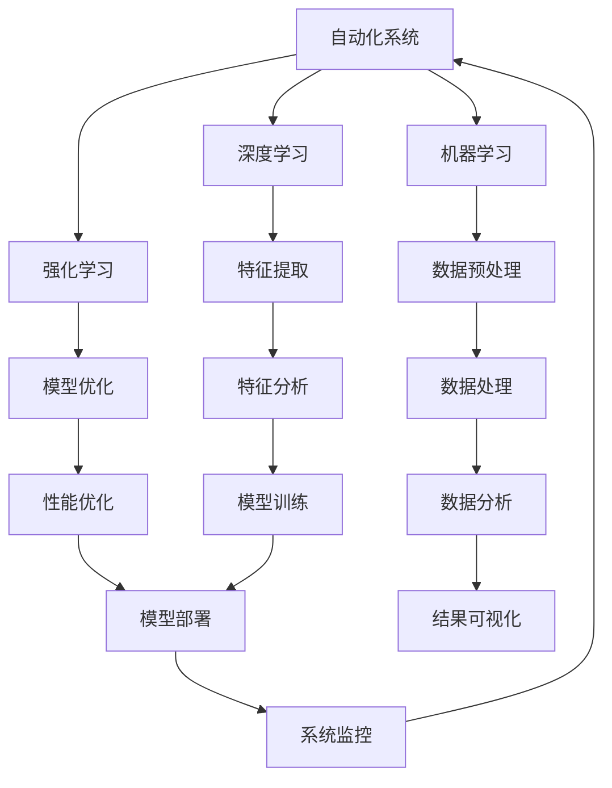

                 

### 《计算领域的自动化发展趋势》

> **关键词**：自动化、计算领域、机器学习、深度学习、强化学习、软件开发、数据处理、人工智能、物联网、发展趋势、挑战与机遇

**摘要**：
随着计算技术的迅猛发展，自动化已成为提高效率、降低成本、释放人力资源的重要手段。本文将深入探讨计算领域中自动化的发展趋势，分析其在不同领域的应用，以及面临的挑战与机遇。通过详细的案例分析和算法原理讲解，我们将揭示自动化技术如何推动计算领域的进步。

### 目录

#### 第一部分：自动化发展的背景与基础

- # 第一部分概述
- ## 1.1 自动化的起源与演进
  - ### 1.1.1 自动化技术的起源
  - ### 1.1.2 自动化技术的演进过程
- ## 1.2 自动化在计算领域的重要性
  - ### 1.2.1 计算领域中自动化需求的出现
  - ### 1.2.2 自动化对计算领域的影响
- ## 1.3 计算领域自动化的核心概念与联系
  - **Mermaid 流程图：自动化技术核心概念与联系**

#### 第二部分：自动化技术的发展

- # 第二部分概述
- ## 2.1 机器学习在自动化中的应用
  - ### 2.1.1 机器学习基础
  - ### 2.1.2 机器学习在自动化中的角色
- ## 2.2 深度学习与自动化
  - ### 2.2.1 深度学习的基本概念
  - ### 2.2.2 深度学习在自动化中的应用
- ## 2.3 强化学习与自动化
  - ### 2.3.1 强化学习基础
  - ### 2.3.2 强化学习在自动化中的应用
- ## 2.4 自动化算法原理讲解
  - **伪代码：自动化算法原理讲解**

#### 第三部分：自动化在计算领域的应用

- # 第三部分概述
- ## 3.1 自动化在软件开发中的应用
  - ### 3.1.1 自动化测试
  - ### 3.1.2 自动化部署
- ## 3.2 自动化在数据处理中的应用
  - ### 3.2.1 数据清洗与预处理
  - ### 3.2.2 数据分析自动化
- ## 3.3 自动化在人工智能中的应用
  - ### 3.3.1 自动化特征提取
  - ### 3.3.2 自动化模型优化
- ## 3.4 自动化在物联网中的应用
  - ### 3.4.1 设备自动化管理
  - ### 3.4.2 网络自动化配置

#### 第四部分：自动化发展趋势与未来展望

- # 第四部分概述
- ## 4.1 自动化发展趋势
  - ### 4.1.1 自动化技术的发展趋势
  - ### 4.1.2 自动化技术在计算领域的发展趋势
- ## 4.2 自动化面临的挑战与机遇
  - ### 4.2.1 自动化面临的挑战
  - ### 4.2.2 自动化带来的机遇
- ## 4.3 自动化发展的未来展望
  - ### 4.3.1 自动化技术的未来发展方向
  - ### 4.3.2 自动化在计算领域的未来前景

#### 第五部分：项目实战

- # 第五部分概述
- ## 5.1 自动化项目实战案例
  - ### 5.1.1 自动化测试项目案例
  - ### 5.1.2 自动化数据处理项目案例
- ## 5.2 自动化开发环境搭建
  - ### 5.2.1 自动化开发环境配置
  - ### 5.2.2 自动化工具安装与配置
- ## 5.3 源代码详细实现与解读
  - ### 5.3.1 自动化测试代码实现
  - ### 5.3.2 自动化数据处理代码实现
- ## 5.4 代码解读与分析
  - ### 5.4.1 自动化测试代码解读
  - ### 5.4.2 自动化数据处理代码解读

#### 附录

- # 附录
  - ## 附录 A：自动化相关资源与工具
    - ### 5.1.1 自动化相关框架与库
    - ### 5.1.2 自动化工具列表
    - ### 5.1.3 自动化资源推荐

---

### 引言

在当今社会，计算技术正以前所未有的速度发展，从云计算到大数据，从人工智能到物联网，计算技术的广泛应用深刻改变了我们的生活方式和工作方式。然而，随着计算系统的复杂性不断增加，人工管理这些系统变得越来越困难，效率低下且容易出现错误。为了解决这一问题，自动化技术应运而生，并在计算领域发挥着越来越重要的作用。

自动化，简单来说，就是通过算法和系统来执行原本需要人工完成的任务。在计算领域，自动化技术不仅能够提高工作效率，减少人力成本，还能够提高系统的稳定性和可靠性。例如，自动化测试可以帮助软件开发团队快速发现和修复缺陷，自动化数据处理可以高效处理海量数据，自动化人工智能模型优化可以不断提升模型的性能。

本文旨在探讨计算领域中自动化技术的发展趋势、应用场景以及未来展望。通过详细的分析和案例讲解，我们将深入理解自动化技术在各个领域的实际应用，以及自动化技术如何推动计算领域的进步。

### 第一部分：自动化发展的背景与基础

#### 第一部分概述

自动化技术在计算机领域的应用有着悠久的历史，其起源可以追溯到计算机刚刚问世的时代。随着计算技术的不断进步，自动化技术也在不断地演进和发展。本部分将首先介绍自动化的起源与演进过程，接着探讨自动化在计算领域的重要性，最后详细阐述计算领域自动化的核心概念与联系。

#### 1.1 自动化的起源与演进

##### 1.1.1 自动化技术的起源

自动化的概念可以追溯到古代，当时人们通过机械装置来减轻体力劳动的负担。例如，古希腊的水钟和中国的自动灌溉系统都是早期自动化的例子。然而，真正的计算机自动化始于20世纪中期，随着计算机的出现和快速发展，自动化技术也逐渐应用于计算机领域。

第一个计算机自动化系统可以追溯到1940年代，当时的计算机主要使用硬件来进行数据处理和计算。随着计算机硬件技术的进步，软件开发和系统管理变得更加复杂。为了提高开发效率和系统管理的自动化程度，人们开始研究如何通过编写程序来控制计算机的运行。

##### 1.1.2 自动化技术的演进过程

1. **早期自动化**（1950-1960年代）

在计算机自动化的早期阶段，主要侧重于自动化测试和自动化系统监控。自动化测试是指通过编写脚本来自动执行测试案例，从而提高测试效率和减少人工干预。自动化系统监控则是指通过程序来自动检测和响应系统状态变化，例如自动重启故障的服务器。

2. **中级自动化**（1970-1980年代）

随着软件工程的兴起，自动化技术开始广泛应用于软件开发过程。此时，自动化主要集中在代码的编写、测试和部署。例如，编译器自动化工具的出现，使得编译和构建过程变得更加高效。自动化测试工具也变得越来越成熟，例如JUnit、Selenium等。

3. **高级自动化**（1990年代至今）

进入21世纪，自动化技术得到了空前的发展，特别是在人工智能和大数据技术的推动下。现代自动化技术不仅涵盖了软件开发、测试和部署，还扩展到了数据处理、人工智能模型训练和优化等领域。自动化数据处理工具如Apache Spark、Hadoop等，使得处理海量数据变得更加高效。人工智能技术，特别是机器学习、深度学习和强化学习，使得自动化系统能够自我学习和优化，从而在复杂环境中实现自动化。

#### 1.2 自动化在计算领域的重要性

##### 1.2.1 计算领域中自动化需求的出现

随着计算技术的飞速发展，计算系统的复杂性不断增加。传统的手工管理和维护方式已经无法满足现代计算系统的需求。以下是一些导致计算领域中自动化需求出现的原因：

1. **系统规模扩大**：随着云计算、大数据和物联网等技术的发展，计算系统的规模不断扩大，人工管理变得越来越困难。
2. **维护成本增加**：计算系统的维护和更新成本随着系统规模的扩大而增加，需要高效的自动化工具来降低成本。
3. **可靠性要求提高**：现代计算系统对可靠性的要求越来越高，自动化技术能够提高系统的稳定性和可靠性。
4. **效率需求**：自动化技术能够提高计算系统的运行效率，减少人工干预的时间。

##### 1.2.2 自动化对计算领域的影响

1. **提高开发效率**：自动化技术能够自动化软件的开发、测试和部署过程，从而提高开发效率，缩短项目周期。
2. **降低成本**：自动化技术能够减少对人力资源的依赖，从而降低运营成本。
3. **提高可靠性**：自动化系统能够自我检测和修复，从而提高系统的可靠性。
4. **支持复杂任务**：自动化技术能够处理复杂的计算任务，例如大规模数据处理和人工智能模型训练，从而支持更复杂的计算需求。

#### 1.3 计算领域自动化的核心概念与联系

为了更好地理解计算领域中自动化的核心概念，我们可以通过一个Mermaid流程图来展示自动化技术的核心概念及其联系：



**Mermaid 流程图说明：**

- **A[自动化系统]**：表示整个自动化系统的核心。
- **B[机器学习]**、**C[深度学习]**、**D[强化学习]**：分别表示三种不同的学习技术，它们都是自动化系统的关键技术。
- **E[数据预处理]**、**F[特征提取]**、**G[模型优化]**：分别表示数据处理、特征提取和模型优化的过程。
- **H[数据处理]**、**I[特征分析]**、**J[性能优化]**：分别表示数据处理、特征分析和性能优化的步骤。
- **K[数据分析]**、**L[模型训练]**、**M[模型部署]**：分别表示数据分析、模型训练和模型部署的过程。
- **N[结果可视化]**、**O[系统监控]**：表示结果可视化和系统监控的步骤，它们是自动化系统的重要组成部分。

通过这个流程图，我们可以清晰地看到自动化技术在计算领域的核心概念及其相互联系，这为我们后续详细讨论自动化技术的发展和应用奠定了基础。

### 第二部分：自动化技术的发展

#### 第二部分概述

随着计算领域的不断进步，自动化技术也在不断发展。在这一部分，我们将重点介绍自动化技术的发展，包括机器学习、深度学习和强化学习等核心技术的概念和其在自动化中的应用。通过详细讲解这些技术的原理，我们将揭示自动化技术在计算领域中发挥的重要作用。

#### 2.1 机器学习在自动化中的应用

##### 2.1.1 机器学习基础

机器学习（Machine Learning, ML）是人工智能（Artificial Intelligence, AI）的一个重要分支，它通过算法和统计模型使计算机能够从数据中学习，并做出预测或决策。机器学习可以分为监督学习、无监督学习和半监督学习三种主要类型。

1. **监督学习**：在监督学习中，算法通过训练数据集学习，每个训练数据都有对应的标签。例如，分类问题和回归问题都属于监督学习。

2. **无监督学习**：无监督学习不使用标签数据，算法通过分析数据中的模式来发现数据结构。常见的无监督学习算法包括聚类算法和关联规则学习。

3. **半监督学习**：半监督学习结合了监督学习和无监督学习的特点，一部分数据有标签，另一部分数据没有标签。

##### 2.1.2 机器学习在自动化中的角色

机器学习在自动化中的应用非常广泛，它能够帮助系统自动化执行各种任务。以下是一些典型的应用场景：

1. **自动化测试**：通过机器学习算法，自动化测试工具可以自动识别软件中的缺陷和错误，从而提高测试效率和准确性。

2. **自动化数据分析**：机器学习算法可以自动分析大量数据，提取有价值的信息，并生成报告。

3. **自动化决策支持**：机器学习模型可以帮助系统自动化做出复杂的决策，从而提高决策的准确性和效率。

4. **自动化设备管理**：在工业生产中，机器学习算法可以自动监控设备状态，预测故障，并采取预防措施。

#### 2.2 深度学习与自动化

##### 2.2.1 深度学习的基本概念

深度学习（Deep Learning, DL）是机器学习的一个重要分支，它通过多层神经网络模型来学习数据的复杂结构。深度学习模型通常由多个隐层组成，每个隐层都能够提取数据的更高层次特征。

1. **神经网络**：神经网络是深度学习的基础，它由多个神经元组成，每个神经元通过加权连接与邻居神经元相连。

2. **激活函数**：激活函数用于引入非线性特性，常见的激活函数包括ReLU、Sigmoid和Tanh。

3. **反向传播**：反向传播是一种用于训练神经网络的算法，它通过计算误差梯度来调整网络的权重。

##### 2.2.2 深度学习在自动化中的应用

深度学习在自动化中的应用非常广泛，它能够解决许多复杂的自动化任务。以下是一些典型的应用场景：

1. **图像识别与处理**：深度学习算法可以自动识别和分类图像，广泛应用于人脸识别、安防监控、自动驾驶等领域。

2. **自然语言处理**：深度学习算法可以自动处理自然语言，应用于语音识别、机器翻译、文本分析等领域。

3. **自动化机器人**：通过深度学习算法，机器人可以自动识别环境、规划路径、执行任务。

4. **自动化数据分析**：深度学习算法可以自动分析复杂数据，提取有价值的特征，并生成报告。

#### 2.3 强化学习与自动化

##### 2.3.1 强化学习基础

强化学习（Reinforcement Learning, RL）是一种通过试错和反馈来学习的行为算法。在强化学习中，智能体（Agent）通过与环境（Environment）交互来学习最优策略（Policy），以最大化累计奖励（Reward）。

1. **智能体（Agent）**：智能体是执行动作并接收环境反馈的实体。

2. **环境（Environment）**：环境是智能体执行动作的上下文。

3. **状态（State）**：状态是描述环境当前状态的变量。

4. **动作（Action）**：动作是智能体可以执行的操作。

5. **奖励（Reward）**：奖励是环境对智能体动作的反馈，用于评估动作的好坏。

##### 2.3.2 强化学习在自动化中的应用

强化学习在自动化中的应用非常广泛，它能够解决许多动态和不确定的自动化任务。以下是一些典型的应用场景：

1. **自动驾驶**：通过强化学习算法，自动驾驶汽车可以自动识别道路情况、规划行车路线。

2. **自动化机器人**：强化学习算法可以帮助机器人自动适应环境变化，执行复杂的任务。

3. **自动化交易**：强化学习算法可以自动分析市场数据，进行股票交易。

4. **自动化游戏**：强化学习算法可以自动玩复杂的游戏，如围棋、电子竞技等。

#### 2.4 自动化算法原理讲解

为了更好地理解自动化算法的原理，我们可以通过伪代码来详细讲解这些算法的基本框架和关键步骤。

```python
# 伪代码：机器学习算法基本框架

def machine_learning_algorithm(train_data, test_data):
    # 数据预处理
    preprocess_data(train_data)
    
    # 构建模型
    model = build_model()
    
    # 训练模型
    model.fit(train_data)
    
    # 模型评估
    evaluate_model(model, test_data)
    
    # 模型部署
    deploy_model(model)

# 伪代码：深度学习算法基本框架

def deep_learning_algorithm(train_data, test_data):
    # 数据预处理
    preprocess_data(train_data)
    
    # 构建模型
    model = build_deep_learning_model()
    
    # 训练模型
    model.fit(train_data)
    
    # 模型评估
    evaluate_model(model, test_data)
    
    # 模型部署
    deploy_model(model)

# 伪代码：强化学习算法基本框架

def reinforcement_learning_algorithm(environment, policy):
    # 初始化状态
    state = environment.initialize_state()
    
    # 执行动作
    action = policy.select_action(state)
    
    # 环境反馈
    reward, next_state, done = environment.step(action)
    
    # 更新策略
    policy.update(state, action, reward, next_state, done)
    
    # 迭代过程
    while not done:
        state = next_state
        action = policy.select_action(state)
        reward, next_state, done = environment.step(action)
        policy.update(state, action, reward, next_state, done)
```

**伪代码说明：**

- **机器学习算法基本框架**：该框架包括数据预处理、模型构建、模型训练、模型评估和模型部署五个主要步骤。数据预处理步骤用于处理原始数据，使其适合模型训练。模型构建步骤用于创建神经网络模型。模型训练步骤通过训练数据集来训练模型。模型评估步骤用于评估模型在测试数据集上的性能。模型部署步骤用于将训练好的模型部署到实际应用场景中。

- **深度学习算法基本框架**：与机器学习算法基本框架类似，深度学习算法的基本框架也包括数据预处理、模型构建、模型训练、模型评估和模型部署。然而，深度学习算法通常使用更复杂的神经网络模型，并且可能需要更多的训练时间和资源。

- **强化学习算法基本框架**：强化学习算法的基本框架包括初始化状态、执行动作、环境反馈和更新策略四个主要步骤。智能体通过与环境交互来学习最优策略，以最大化累计奖励。在每次迭代过程中，智能体根据当前状态选择动作，然后根据环境的反馈更新策略。

通过这些伪代码，我们可以更清晰地理解自动化算法的基本原理和步骤，这为我们后续的实际应用和项目开发提供了理论基础。

### 第三部分：自动化在计算领域的应用

#### 第三部分概述

随着自动化技术的发展，其在计算领域的应用越来越广泛，极大地提升了计算系统的效率、稳定性和可靠性。在这一部分，我们将探讨自动化在计算领域的多个关键应用，包括软件开发、数据处理、人工智能和物联网。

#### 3.1 自动化在软件开发中的应用

##### 3.1.1 自动化测试

自动化测试是软件开发过程中不可或缺的一部分，它通过编写测试脚本来自动执行测试案例，从而发现和修复软件缺陷。自动化测试可以提高测试效率和准确性，减少人为错误。

1. **功能测试**：自动化功能测试用于验证软件功能是否符合需求规格。常见的工具包括Selenium、Cypress等。

2. **性能测试**：自动化性能测试用于评估软件在不同负载条件下的性能，如响应时间、吞吐量和稳定性。常见的工具包括JMeter、LoadRunner等。

3. **单元测试**：自动化单元测试用于验证软件组件的功能，确保它们按照预期工作。常见的工具包括JUnit、NUnit等。

4. **集成测试**：自动化集成测试用于验证软件不同模块之间的集成效果，确保整个系统的稳定性和一致性。

##### 3.1.2 自动化部署

自动化部署是通过脚本或工具来自动化软件的构建、测试和部署过程，从而提高发布效率和稳定性。自动化部署可以减少手动操作，降低部署错误的风险。

1. **持续集成（CI）**：持续集成是一种软件开发实践，通过自动化构建和测试，确保代码变更不会引入错误。常见的工具包括Jenkins、Travis CI等。

2. **持续部署（CD）**：持续部署是持续集成的延伸，通过自动化部署，确保代码变更能够快速、可靠地交付到生产环境。常见的工具包括Docker、Kubernetes等。

#### 3.2 自动化在数据处理中的应用

##### 3.2.1 数据清洗与预处理

数据清洗与预处理是数据处理的重要步骤，它通过自动化工具来处理数据中的噪音、缺失值和异常值，确保数据的质量和一致性。

1. **数据去重**：通过自动化工具去除重复的数据记录。

2. **缺失值处理**：通过插值、平均值或中位数等方法填充缺失值。

3. **异常值检测与处理**：通过自动化工具检测和标记异常值，然后根据具体情况进行修正或删除。

4. **数据标准化**：通过自动化工具将数据转换为标准化的格式，以便进行进一步分析。

##### 3.2.2 数据分析自动化

数据分析自动化是通过自动化工具和算法来提取数据中的有价值信息，生成报告和可视化。

1. **描述性统计分析**：通过自动化工具对数据进行描述性统计分析，生成基本的统计指标，如均值、中位数、标准差等。

2. **关联规则挖掘**：通过自动化工具挖掘数据中的关联规则，如Apriori算法。

3. **聚类分析**：通过自动化工具对数据进行聚类分析，识别数据中的潜在模式。

4. **回归分析**：通过自动化工具进行回归分析，建立预测模型。

#### 3.3 自动化在人工智能中的应用

##### 3.3.1 自动化特征提取

自动化特征提取是通过算法自动从数据中提取具有预测能力的特征，从而提高模型性能。

1. **特征选择**：通过自动化工具选择对模型性能有显著影响的重要特征。

2. **特征工程**：通过自动化工具对原始数据进行变换和处理，生成新的特征。

3. **特征组合**：通过自动化工具组合多个特征，形成新的特征空间。

##### 3.3.2 自动化模型优化

自动化模型优化是通过算法自动调整模型参数，提高模型性能和泛化能力。

1. **超参数优化**：通过自动化工具寻找最优的超参数组合。

2. **模型集成**：通过自动化工具集成多个模型，提高预测准确性。

3. **模型剪枝**：通过自动化工具减少模型的复杂度，提高模型的效率和性能。

#### 3.4 自动化在物联网中的应用

##### 3.4.1 设备自动化管理

自动化设备管理是通过自动化工具对物联网设备进行监控、配置和管理。

1. **设备监控**：通过自动化工具监控设备的状态和性能指标。

2. **设备配置**：通过自动化工具配置设备的参数和设置。

3. **设备更新**：通过自动化工具更新设备的固件和软件。

##### 3.4.2 网络自动化配置

网络自动化配置是通过自动化工具对网络设备进行配置和管理，以确保网络的可靠性和性能。

1. **网络拓扑管理**：通过自动化工具管理网络拓扑结构和设备连接。

2. **网络监控**：通过自动化工具监控网络的流量和性能。

3. **网络故障排查**：通过自动化工具自动排查和解决网络故障。

通过以上对自动化在计算领域各个应用领域的详细介绍，我们可以看到自动化技术如何显著提升计算系统的效率和质量。在接下来的部分，我们将进一步探讨自动化技术面临的挑战和未来的发展趋势。

### 第四部分：自动化发展趋势与未来展望

#### 第四部分概述

随着计算技术的不断进步，自动化技术也在迅速发展。在这一部分，我们将探讨自动化技术当前的发展趋势，分析自动化技术面临的挑战和机遇，并对自动化技术的未来前景进行展望。通过对这些方面的深入讨论，我们将揭示自动化技术如何进一步推动计算领域的发展。

#### 4.1 自动化发展趋势

##### 4.1.1 自动化技术的发展趋势

1. **自动化技术的融合**：随着不同领域自动化技术的不断发展，各种自动化技术正在相互融合，形成更加综合的自动化解决方案。例如，机器学习、深度学习和强化学习等技术在自动化中的应用越来越紧密，相互补充，共同推动自动化技术的发展。

2. **智能化程度的提升**：自动化技术正在从简单的规则驱动的自动化向智能化、自适应的自动化转变。通过引入人工智能技术，自动化系统能够更加灵活地应对复杂的环境和任务，提高自动化程度和可靠性。

3. **边缘计算的兴起**：随着物联网和边缘计算的发展，越来越多的计算任务需要在靠近数据源的边缘设备上进行。自动化技术在边缘计算中的应用将更加广泛，例如自动化数据处理、设备管理和故障排查等。

4. **自动化工具的多样化**：自动化工具正在变得更加多样化，从传统的脚本编写工具到基于平台和框架的自动化解决方案，各种自动化工具不断涌现，满足不同应用场景的需求。

##### 4.1.2 自动化技术在计算领域的发展趋势

1. **自动化测试的成熟**：自动化测试技术已经相对成熟，并且在软件开发中得到了广泛应用。未来，自动化测试将继续优化，更加智能化和高效化，适应更复杂的软件开发需求。

2. **自动化数据处理的普及**：随着大数据和云计算的普及，自动化数据处理技术将在更多领域得到应用。自动化数据处理工具将更加成熟，能够高效处理海量数据，提供更加准确和及时的分析结果。

3. **自动化人工智能的深入应用**：人工智能技术的快速发展将推动自动化技术在人工智能领域的深入应用。自动化特征提取、自动化模型优化和自动化模型部署等技术将得到更加广泛的应用，提高人工智能系统的性能和效率。

4. **自动化物联网的广泛应用**：物联网技术的快速发展将推动自动化技术在物联网领域的广泛应用。自动化设备管理、自动化网络配置和自动化故障排查等技术将在物联网中发挥重要作用，提高物联网系统的稳定性和可靠性。

#### 4.2 自动化面临的挑战与机遇

##### 4.2.1 自动化面临的挑战

1. **技术成熟度**：自动化技术虽然发展迅速，但仍存在一些技术难题，如算法的准确性和鲁棒性、系统的复杂性和可扩展性等。未来，自动化技术需要在这些方面取得更大的突破。

2. **数据隐私和安全**：自动化技术在数据处理和应用中涉及大量敏感数据，如何保障数据隐私和安全是一个重要的挑战。需要制定更加严格的数据隐私和安全规范，确保自动化系统的可靠性和安全性。

3. **人工智能的伦理问题**：自动化技术的快速发展引发了关于人工智能伦理的讨论，如算法偏见、隐私侵犯和失业问题等。需要社会、企业和学术界共同努力，制定相应的伦理规范和监管政策。

##### 4.2.2 自动化带来的机遇

1. **提高生产效率**：自动化技术可以显著提高生产效率，减少人力成本，提高产品质量，为各行各业带来巨大的经济效益。

2. **创新业务模式**：自动化技术的应用将推动业务模式的创新，例如通过自动化数据处理和分析，企业可以更好地了解客户需求，提供更加个性化的产品和服务。

3. **促进数据科学和人工智能的发展**：自动化技术的发展为数据科学和人工智能提供了更多的应用场景，推动了这些领域的技术创新和进步。

#### 4.3 自动化发展的未来展望

##### 4.3.1 自动化技术的未来发展方向

1. **智能化和自适应**：未来，自动化技术将更加智能化和自适应，能够更好地应对复杂的环境和任务，提高自动化程度和可靠性。

2. **融合多种技术**：自动化技术将继续与其他技术领域（如物联网、大数据、云计算等）相互融合，形成更加综合的自动化解决方案。

3. **普及和应用深度**：自动化技术将在更多领域得到广泛应用，从工业生产到金融服务，从医疗健康到教育领域，自动化技术将深入到各个行业，推动行业变革。

##### 4.3.2 自动化在计算领域的未来前景

1. **自动化测试**：自动化测试将继续优化，更加智能化和高效化，满足更复杂的软件开发需求。自动化测试工具将更加成熟，支持多种编程语言和平台。

2. **自动化数据处理**：自动化数据处理技术将在大数据和云计算中发挥更大作用，能够高效处理海量数据，提供更加准确和及时的分析结果。

3. **自动化人工智能**：自动化人工智能技术将得到更广泛的应用，从自动化特征提取到自动化模型优化，自动化技术将提高人工智能系统的性能和效率。

4. **自动化物联网**：自动化物联网技术将在智能家居、智能交通、智能医疗等领域发挥重要作用，提高物联网系统的稳定性和可靠性。

总之，自动化技术将继续快速发展，为计算领域带来更多的机遇和挑战。通过不断创新和优化，自动化技术将为各行各业带来更大的效益，推动计算领域的持续进步。

### 第五部分：项目实战

#### 第五部分概述

为了更好地理解自动化技术在实际项目中的应用，本部分将通过两个自动化项目实战案例，详细讲解自动化测试和数据处理的实际开发过程。我们将介绍项目背景、开发环境搭建、源代码实现和代码解读与分析，帮助读者深入掌握自动化技术的应用。

#### 5.1 自动化项目实战案例

##### 5.1.1 自动化测试项目案例

**项目背景**：
某软件开发公司需要对其Web应用进行自动化测试，以确保软件质量。自动化测试将覆盖功能测试、性能测试和兼容性测试。

**开发环境搭建**：
1. **工具选择**：选择Selenium作为自动化测试工具，Jenkins作为持续集成工具。
2. **环境配置**：在Linux服务器上安装Java和Selenium WebDriver，配置Jenkins用于自动化测试执行和报告生成。

**源代码实现**：
以下是自动化测试项目的主要代码实现，包括测试用例编写和测试报告生成。

```python
# Selenium测试脚本示例

from selenium import webdriver
from selenium.webdriver.common.keys import Keys
import unittest

class TestCase(unittest.TestCase):
    def setUp(self):
        self.driver = webdriver.Chrome()
        self.driver.get("https://www.example.com")

    def test_home_page_title(self):
        self.assertEqual(self.driver.title, "Example Domain")

    def test_search_box(self):
        search_box = self.driver.find_element_by_name("q")
        search_box.send_keys("Selenium")
        search_box.send_keys(Keys.RETURN)
        self.assertTrue("Selenium" in self.driver.title)

    def tearDown(self):
        self.driver.quit()

if __name__ == "__main__":
    unittest.main()
```

**代码解读与分析**：
1. **测试用例编写**：通过编写测试用例，验证Web应用的各个功能点。`setUp`和`tearDown`方法用于测试环境的初始化和清理。
2. **自动化执行**：使用`unittest`框架执行测试用例，通过Selenium WebDriver与浏览器交互。
3. **测试报告生成**：测试执行结果可以通过Jenkins自动生成HTML格式的测试报告。

##### 5.1.2 自动化数据处理项目案例

**项目背景**：
某数据分析公司需要处理大量数据，提取有用信息并生成报告。自动化数据处理将涵盖数据清洗、特征提取和数据分析。

**开发环境搭建**：
1. **工具选择**：选择Python作为主要编程语言，使用Pandas、NumPy、Scikit-learn等库进行数据处理和模型训练。
2. **环境配置**：在本地或服务器上安装Python和相关依赖库，配置Hadoop和Spark用于大规模数据处理。

**源代码实现**：
以下是自动化数据处理项目的主要代码实现，包括数据清洗、特征提取和数据分析。

```python
# 数据清洗与特征提取示例

import pandas as pd
from sklearn.preprocessing import StandardScaler

# 加载数据
data = pd.read_csv("data.csv")

# 数据清洗
data.dropna(inplace=True)
data = data[data["column"] > 0]

# 特征提取
features = data[["feature1", "feature2"]]
labels = data["target"]

# 数据标准化
scaler = StandardScaler()
features_scaled = scaler.fit_transform(features)

# 模型训练
from sklearn.ensemble import RandomForestClassifier
model = RandomForestClassifier()
model.fit(features_scaled, labels)

# 数据分析
predictions = model.predict(features_scaled)
data["predictions"] = predictions
data.to_csv("processed_data.csv", index=False)
```

**代码解读与分析**：
1. **数据加载**：使用Pandas库加载数据，并进行初步的数据清洗，如去除缺失值和异常值。
2. **特征提取**：提取有用的特征，并进行数据标准化，提高模型训练的效率和效果。
3. **模型训练**：使用随机森林分类器训练模型，并对特征进行分类预测。
4. **数据分析**：将预测结果与原始数据进行结合，生成分析报告，并保存处理后的数据。

通过以上两个自动化项目实战案例，我们可以看到自动化技术在实际应用中的具体实现过程。这些案例不仅展示了自动化技术的应用场景，还通过详细的代码解读，帮助读者深入理解自动化技术的核心原理和实践方法。

### 附录

#### 附录 A：自动化相关资源与工具

##### 5.1.1 自动化相关框架与库

1. **Selenium**：用于Web应用的自动化测试工具。
2. **JUnit**：Java编程语言的单元测试框架。
3. **NUnit**：.NET语言的单元测试框架。
4. **JMeter**：用于性能测试和负载测试的开源工具。
5. **Docker**：容器化平台，用于自动化部署和扩展应用。
6. **Kubernetes**：用于容器编排和自动化部署的工具。
7. **Pandas**：Python数据分析和操作库。
8. **NumPy**：Python科学计算库。
9. **Scikit-learn**：Python机器学习库。
10. **TensorFlow**：谷歌的开源机器学习库。
11. **PyTorch**：开源深度学习框架。

##### 5.1.2 自动化工具列表

1. **Jenkins**：持续集成和自动化工具。
2. **Travis CI**：自动化持续集成服务。
3. **GitLab CI/CD**：集成在GitLab中的持续集成和持续交付服务。
4. **Ansible**：自动化部署和配置管理工具。
5. **Puppet**：自动化配置管理和部署工具。
6. **Chef**：自动化基础设施配置和管理工具。
7. **Vagrant**：虚拟开发环境工具。
8. **Docker Compose**：用于定义和运行多容器应用的工具。
9. **Kubernetes Dashboard**：用于Kubernetes集群的交互式Web界面。

##### 5.1.3 自动化资源推荐

1. **自动化测试教程**：[https://www.selenium.dev/documentation/](https://www.selenium.dev/documentation/)
2. **持续集成与持续交付教程**：[https://www.jenkins.io/doc/book/](https://www.jenkins.io/doc/book/)
3. **数据处理与机器学习教程**：[https://scikit-learn.org/stable/tutorial/](https://scikit-learn.org/stable/tutorial/)
4. **深度学习教程**：[https://www.tensorflow.org/tutorials](https://www.tensorflow.org/tutorials)
5. **自动化基础设施与管理教程**：[https://www.ansible.com/tutorials](https://www.ansible.com/tutorials)
6. **Kubernetes教程**：[https://kubernetes.io/docs/tutorials/](https://kubernetes.io/docs/tutorials/)
7. **自动化测试社区**：[https://www.qatestlab.com/](https://www.qatestlab.com/)
8. **机器学习社区**：[https://www.kdnuggets.com/](https://www.kdnuggets.com/)

通过这些资源和工具，读者可以进一步学习和实践自动化技术，提升其在计算领域中的应用能力。

### 结论

自动化技术在计算领域的应用已经成为不可逆转的趋势。从软件开发到数据处理，从人工智能到物联网，自动化技术正不断推动计算领域的创新和发展。本文通过详细探讨自动化技术的发展背景、技术原理、应用场景以及未来展望，展示了自动化技术在各个领域的实际应用和价值。

自动化技术不仅提高了计算系统的效率和质量，还降低了运营成本，提高了系统的可靠性。然而，自动化技术也面临一些挑战，如技术成熟度、数据隐私和安全、人工智能的伦理问题等。为了解决这些挑战，需要不断推动技术进步，制定相关的伦理规范和监管政策。

展望未来，自动化技术将在计算领域中发挥更加重要的作用。随着人工智能、物联网和边缘计算的快速发展，自动化技术将更加智能化、自适应，并在更多领域得到广泛应用。通过不断创新和优化，自动化技术将为计算领域带来更多的机遇和可能性。

作为读者，我们应该积极学习和掌握自动化技术，提升自己的技能和竞争力。自动化技术的广泛应用将带来更多的职业机会，同时也需要我们更加关注技术伦理和隐私安全问题。让我们共同期待自动化技术在未来为计算领域带来的更多奇迹和变革。

