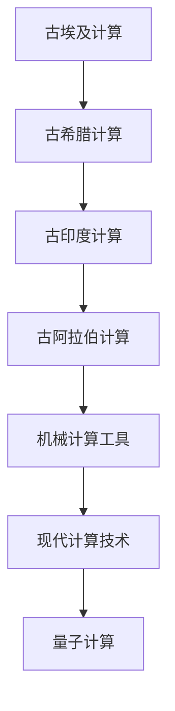
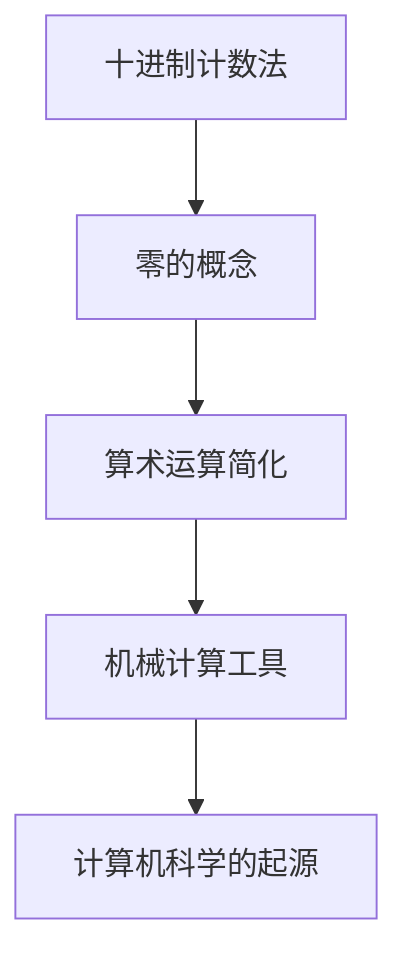
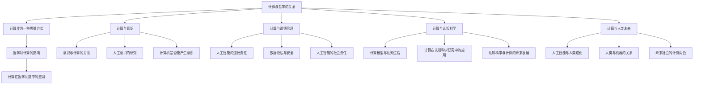
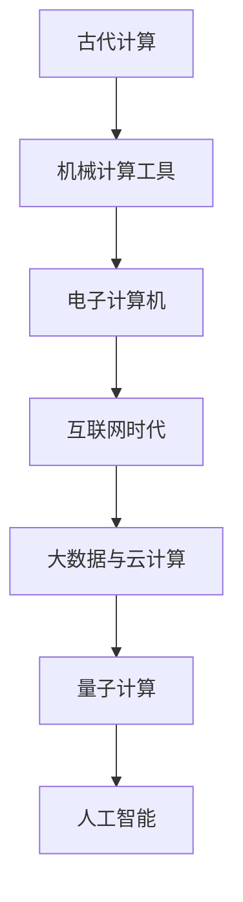

                 

## 计算的诞生

### 文章标题：计算：第一部分 计算的诞生 第 1 章 毕达哥拉斯的困惑 文明古国的计算

> **关键词：** 毕达哥拉斯、古代计算、数学发展、计算工具

> **摘要：** 本文将探讨古代文明中计算的发展，重点关注毕达哥拉斯的困惑及其对数学和计算方法的影响。文章将详细描述古埃及、古希腊、古印度和古阿拉伯的计算方法，并介绍古代计算工具的使用。通过回顾这些早期计算成就，我们将理解计算是如何一步步从古代走向现代的。

### 第1章: 毕达哥拉斯的困惑

#### 1.1 引言

毕达哥拉斯（Pythagoras）是古希腊著名的数学家、哲学家和神秘主义者，他生活在公元前570年至公元前495年左右。毕达哥拉斯的困惑源于他对数学和自然界的深入探索，尤其是对数和形状的研究。他的发现和理论对后世的数学和计算方法产生了深远的影响。

毕达哥拉斯的困惑主要体现在他对整数和分数的研究上。他发现，在某些情况下，不能表示为两个整数之比的数（即无理数）存在。这一发现挑战了当时人们对数学的直观理解，并为后来的数学发展奠定了基础。

#### 1.2 古文明的计算方法

古代文明对计算有着不同的方法和工具。以下将分别介绍古埃及、古希腊、古印度和古阿拉伯的计算方法。

##### 1.2.1 古埃及的计算方法

古埃及人使用十进制计数系统，这是他们计算的基础。他们在各种石板上使用刻痕来记录数字和进行简单的算术运算。古埃及的算术运算主要涉及加法、减法和乘法。在几何学方面，古埃及人发展了毕达哥拉斯定理，尽管他们没有明确的证明，但他们的建筑和雕塑中却体现了这一原理。

##### 1.2.2 古希腊的计算方法

古希腊在数学和计算方面取得了巨大的成就。毕达哥拉斯定理是古希腊数学家毕达哥拉斯发现的，这一发现对几何学的发展产生了深远的影响。古希腊人还发展了欧几里得的几何学，这一体系至今仍然是数学教育的基础。古希腊的算术运算主要包括加法、减法、乘法和除法。

##### 1.2.3 古印度的计算方法

古印度在数学方面有着独特的贡献，尤其是在零的概念和十进制位值计数法的发展上。古印度数学家阿利耶巴塔（Aryabhata）在公元5世纪左右提出了十进制位值计数法，这极大地简化了算术运算。古印度还发展了三角函数和对数，这些数学工具对天文学和工程学有着重要的应用。

##### 1.2.4 古阿拉伯的计算方法

古阿拉伯在数学和计算方面也有显著的贡献。他们继承了古希腊和古印度的数学知识，并在此基础上进行了创新。古阿拉伯数学家阿尔·哈里德希（Al-Khwarizmi）在公元9世纪左右提出了代数学的基本概念，并使用代数符号来表示未知数。此外，古阿拉伯人还改进了算盘的使用方法，使计算更加高效。

#### 1.3 古代计算工具

在古代，人们使用各种工具来进行计算。以下将介绍几种主要的计算工具。

##### 1.3.1 计算板

计算板是一种简单的计算工具，通常由木板或石板制成。在木板上，人们用刻痕来表示数字和进行算术运算。计算板在古埃及和古希腊广泛使用，为早期的数学和计算提供了基础。

##### 1.3.2 水钟

水钟是一种利用水流控制时间的工具，它被广泛应用于古埃及和古希腊的天文学和计算中。水钟通过测量水流的时间来计算时间，这对于天文观测和日历制定具有重要意义。

##### 1.3.3 算盘

算盘是一种古老的计算工具，它在古代中国、日本和阿拉伯地区广泛使用。算盘由一系列珠子和框架组成，每个珠子代表一个数字。通过移动珠子，人们可以进行算术运算。算盘的发明极大地提高了计算效率，对商业和科学计算有着重要影响。

#### 1.4 毕达哥拉斯的困惑与数学的发展

毕达哥拉斯的困惑不仅仅是对数学的一种挑战，它还引发了数学和计算方法的进一步发展。

毕达哥拉斯定理的发现是古希腊数学的一个里程碑。这一定理指出，在一个直角三角形中，直角边的平方和等于斜边的平方。这一发现不仅在当时引起了轰动，而且对后来的数学和物理学产生了深远的影响。

无理数的概念是毕达哥拉斯困惑的直接结果。无理数是不能表示为两个整数之比的数，例如根号2和根号3。无理数的存在挑战了当时人们对数学的直观理解，并促使数学家们对数学基础进行更深入的思考。

古希腊数学家欧几里得和阿基米德在毕达哥拉斯的基础上进一步发展了数学。欧几里得在《几何原本》中系统地总结了古希腊的几何学知识，为几何学的发展奠定了基础。阿基米德则在流体力学和几何学方面取得了重要成就，他的计算方法和理论对后世的科学发展有着深远的影响。

### 第2章: 古希腊的数学和计算

#### 2.1 古希腊的数学教育

古希腊在数学教育方面有着独特的体系。古希腊的数学教育始于几何学，这是当时数学的核心。几何学不仅是一门科学，也是一种艺术，它要求学生掌握严谨的证明方法和逻辑思维。

古希腊的数学教育通常从基础几何学开始，然后逐步深入到更复杂的几何问题和数学理论。学生需要掌握各种几何定理和证明方法，这些知识不仅用于学术研究，也被应用于实际生活中的各种问题。

#### 2.2 古希腊的数学成就

古希腊在数学方面取得了许多重要的成就，这些成就不仅在当时具有重大意义，而且对后世的数学发展产生了深远的影响。

- **几何学**：古希腊人发展了系统的几何学理论，欧几里得的《几何原本》是这一领域的经典著作。欧几里得提出了几何学的五个公设，并在此基础上建立了完整的几何学体系。他的几何学理论包括各种定理和证明方法，这些理论至今仍然被广泛应用于数学和工程学。

- **代数学**：古希腊人虽然对代数学的理论贡献不如印度和阿拉伯，但他们提出了许多重要的代数概念和符号。毕达哥拉斯定理和阿尔基塔斯（Archytas）的几何代数方法都是古希腊代数学的重要成就。

- **数论**：古希腊数学家对数论的研究也非常深入。他们研究了质数、完全数和勾股数等概念，并提出了许多重要的定理。

#### 2.3 古希腊的计算工具

古希腊人使用各种工具来进行计算，这些工具在一定程度上反映了古希腊数学的成就和发展。

- **直尺和圆规**：直尺和圆规是古希腊几何学研究中最重要的工具。直尺用于画直线，圆规用于画圆和分割圆。通过这些工具，古希腊数学家能够进行各种几何构造和证明。

- **计数板**：计数板是一种简单的计算工具，通常由木板或石板制成。在木板上，人们用刻痕来表示数字和进行算术运算。计数板在古希腊的数学研究和商业计算中广泛使用。

#### 2.4 古希腊的数学在计算中的应用

古希腊的数学不仅在理论上取得了巨大的成就，而且在实际计算中也发挥了重要作用。

- **天文学**：古希腊数学家利用几何学原理和计算方法研究天体的运动和宇宙的结构。他们提出了许多关于天体运动的理论，并使用计算方法进行天文观测和预测。

- **地理学**：古希腊数学家在地理学中使用了大量的数学知识，包括测量、地图绘制和计算距离。他们的计算方法对地理学的发展产生了深远的影响。

- **建筑学**：古希腊建筑在设计中运用了大量的几何学原理，这些原理需要通过计算来确保结构的稳定性和美观。古希腊的数学家在建筑学中使用了各种计算方法，这些方法在一定程度上促进了建筑学的发展。

### 第3章: 古印度的数学和计算

#### 3.1 古印度的数学教育

古印度的数学教育起源于公元前6世纪左右，其特点是注重实践和理论的结合。古印度数学教育体系包括以下特点：

- **早期的数学教育**：古印度数学教育始于基本的算术和代数知识。学生从学习基本的加减乘除开始，逐步掌握更复杂的数学概念。

- **数学理论的研究**：古印度数学教育注重数学理论的研究，特别是在数论和代数方面。学生需要掌握各种数学定理和证明方法。

- **数学工具的使用**：古印度数学家发明了算盘，这是一种非常高效的计算工具。算盘的使用在古印度数学教育中占据了重要地位。

#### 3.2 古印度的数学成就

古印度在数学方面取得了许多重要的成就，这些成就对后世的数学和科学产生了深远的影响。

- **零的概念**：零的概念是古印度数学的重要贡献之一。零不仅是一种数字，还是一种数学符号，它改变了人们对数学的认识和理解。

- **十进制位值计数法**：十进制位值计数法是古印度数学的另一个重要成就。这种计数法使得算术运算更加简单和高效。

- **三角函数**：古印度数学家阿利耶巴塔提出了三角函数的概念，并使用这些函数来研究天文学和工程学问题。

- **对数**：古印度数学家布拉马古普塔（Brahmagupta）提出了对数的概念，并使用对数来解决各种数学问题。

#### 3.3 古印度的计算工具

古印度发明了算盘，这是一种非常有效的计算工具。算盘由一系列珠子和框架组成，每个珠子代表一个数字。通过移动珠子，人们可以进行各种算术运算。算盘在古印度的商业计算和科学研究中被广泛使用。

#### 3.4 古印度的数学在计算中的应用

古印度的数学在计算中有着广泛的应用，这些应用不仅促进了数学的发展，还推动了科学和工程学的进步。

- **商业计算**：古印度的商业计算依赖于算盘的使用。算盘使得商人能够快速进行价格计算、库存管理和财务记录。

- **天文学**：古印度数学家利用三角函数和对数来研究天体的运动和宇宙的结构。他们的计算方法对天文学的发展产生了重要影响。

- **工程学**：古印度数学家在工程学中使用了各种数学知识，包括几何学、三角学和数论。他们的计算方法在建筑、水利和机械工程中得到了广泛应用。

### 第4章: 古阿拉伯的数学和计算

#### 4.1 古阿拉伯的数学教育

古阿拉伯的数学教育起源于公元8世纪，其特点是注重理论和实践的统一。阿拉伯数学教育体系包括以下特点：

- **早期的数学教育**：古阿拉伯数学教育始于基本的算术和代数知识。学生从学习基本的加减乘除开始，逐步掌握更复杂的数学概念。

- **数学理论的研究**：古阿拉伯数学教育注重数学理论的研究，特别是在代数和数论方面。学生需要掌握各种数学定理和证明方法。

- **数学工具的使用**：古阿拉伯数学家发明了算盘，这是一种非常高效的计算工具。算盘的使用在古阿拉伯数学教育中占据了重要地位。

#### 4.2 古阿拉伯的数学成就

古阿拉伯在数学方面取得了许多重要的成就，这些成就对后世的数学和科学产生了深远的影响。

- **代数学**：古阿拉伯数学家阿尔·哈里德希（Al-Khwarizmi）是代数学的创始人之一。他提出了代数学的基本概念，并使用代数符号来表示未知数。他的著作《代数学》对后世的数学发展产生了深远的影响。

- **数论**：古阿拉伯数学家对数论的研究也非常深入。他们研究了质数、完全数和勾股数等概念，并提出了许多重要的定理。

- **算法**：古阿拉伯数学家发明了许多重要的算法，包括算法（algorithm）一词的来源。这些算法在解决各种数学问题中发挥了重要作用。

#### 4.3 古阿拉伯的计算工具

古阿拉伯发明了算盘，这是一种非常有效的计算工具。算盘由一系列珠子和框架组成，每个珠子代表一个数字。通过移动珠子，人们可以进行各种算术运算。算盘在古阿拉伯的商业计算和科学研究中被广泛使用。

#### 4.4 古阿拉伯的数学在计算中的应用

古阿拉伯的数学在计算中有着广泛的应用，这些应用不仅促进了数学的发展，还推动了科学和工程学的进步。

- **商业计算**：古阿拉伯的商业计算依赖于算盘的使用。算盘使得商人能够快速进行价格计算、库存管理和财务记录。

- **天文学**：古阿拉伯数学家利用三角函数和算法来研究天体的运动和宇宙的结构。他们的计算方法对天文学的发展产生了重要影响。

- **工程学**：古阿拉伯数学家在工程学中使用了各种数学知识，包括几何学、三角学和数论。他们的计算方法在建筑、水利和机械工程中得到了广泛应用。

### 第5章: 欧几里得的《几何原本》

#### 5.1 《几何原本》的背景

欧几里得（Euclid）是古希腊最著名的数学家之一，他生活在公元前3世纪。欧几里得是亚历山大图书馆的馆长，他的著作《几何原本》是古希腊数学的巅峰之作。《几何原本》系统地总结了古希腊的几何学知识，并对后来的数学和科学产生了深远的影响。

#### 5.2 《几何原本》的结构

《几何原本》共分为十三卷，每一卷都涵盖了不同的几何学主题。以下是《几何原本》的主要结构：

- **卷1**：几何学的基本概念和定理，包括点的定义、线的定义、角的定义等。

- **卷2**：线性几何，包括直线、平面、平行线、角度等概念。

- **卷3**：三角形和四边形，包括三角形的性质、四边形的性质等。

- **卷4**：圆形，包括圆的性质、圆的切割等。

- **卷5**：多边形和圆的多边形，包括多边形的性质、圆的内接多边形和外切多边形等。

- **卷6**：相似几何，包括相似多边形、相似三角形等概念。

#### 5.3 《几何原本》的影响

《几何原本》对古希腊数学的总结和对西方数学发展的推动具有重要意义。以下是《几何原本》的一些主要影响：

- **对古希腊数学的总结**：《几何原本》系统地总结了古希腊的几何学知识，为后来的数学发展奠定了基础。

- **对西方数学发展的推动**：《几何原本》的严谨性和逻辑性对西方数学的发展产生了深远的影响，它成为后世数学教育和研究的范本。

- **对几何学教育的贡献**：《几何原本》对几何学教育的普及和推广起到了重要作用，它成为许多国家和地区几何学教育的标准教材。

### 第6章: 古希腊数学的其他贡献

#### 6.1 阿基米德的数学和物理成就

阿基米德（Archimedes）是古希腊最伟大的数学家和物理学家之一，他生活在公元前3世纪。阿基米德的数学和物理成就对后世的科学发展产生了深远的影响。

- **流体力学**：阿基米德在流体力学方面的研究取得了重大成就。他发现了浮力定律，即物体在流体中受到的浮力等于其排开的流体的重量。这一发现为后来的船舶设计、水利工程等领域提供了理论基础。

- **杠杆原理**：阿基米德研究了杠杆原理，他发现了杠杆的平衡条件，即动力臂乘以动力等于阻力臂乘以阻力。这一发现对机械工程和物理学的发展具有重要意义。

- **计算圆周率**：阿基米德使用几何学方法计算了圆周率的近似值，他的计算方法至今仍然被使用。阿基米德计算的圆周率值介于3.1415926和3.1415927之间，与现代计算的值非常接近。

#### 6.2 阿波罗尼奥斯的数学成就

阿波罗尼奥斯（Apollonius）是古希腊另一位伟大的数学家，他生活在公元前3世纪。阿波罗尼奥斯在几何学方面取得了许多重要的成就。

- **几何学**：阿波罗尼奥斯研究了圆锥曲线的性质，包括椭圆、双曲线和抛物线。他发现了这些曲线的几何性质，并提出了许多重要的定理。

- **数论**：阿波罗尼奥斯在数论方面也有重要贡献，他研究了质数和完全数等概念，并提出了许多重要的定理。

#### 6.3 古希腊数学的哲学影响

古希腊数学不仅对科学和技术的发展产生了深远的影响，还对哲学思想产生了重要的影响。

- **毕达哥拉斯主义**：毕达哥拉斯主义是古希腊哲学的一个流派，它强调数学和几何学的重要性，认为宇宙的本质是数学和几何学。毕达哥拉斯主义对后来的西方哲学产生了深远的影响。

- **唯物主义和唯心主义**：古希腊数学家在研究数学和几何学时，提出了许多关于世界本质和存在的观点。这些观点对后来的唯物主义和唯心主义哲学产生了重要影响。

### 第7章: 计算的萌芽

#### 7.1 机械计算工具的发展

机械计算工具的发展是计算历史上的一个重要里程碑。最早的机械计算工具可以追溯到古希腊和古罗马时期。

- **调动杆**：调动杆是一种简单的机械计算工具，它由一系列杠杆和滑轮组成。通过移动杠杆和滑轮，人们可以进行简单的算术运算。调动杆在古罗马时期被广泛应用于商业计算和工程设计。

- **滑轮系统**：滑轮系统是另一种机械计算工具，它通过滑轮和绳索的连接，实现力的传递和计算。滑轮系统在建筑和工程中有着广泛的应用，它使得人们能够更有效地进行重物的提升和运输。

- **秤杆计算器**：秤杆计算器是一种古老的计算工具，它由一个可调节的秤杆和一系列刻度组成。通过移动秤杆和读取刻度，人们可以进行简单的算术运算。秤杆计算器在古代的商业和科学计算中得到了广泛应用。

#### 7.2 计算方法的发展

计算方法的发展是计算历史上的另一个重要里程碑。古代文明在计算方法的发展中取得了许多重要的成就。

- **算术运算的简化**：古代文明通过发明各种计算工具，简化了算术运算。例如，古埃及人使用十进制计数系统，使得加法和减法运算更加简单。古印度人发明了零的概念，进一步简化了算术运算。

- **计数法的标准化**：古代文明还通过制定计数法标准，统一了计算方法。例如，古罗马人制定了罗马数字计数法，这使得商业和科学计算更加高效和准确。

#### 7.3 计算在古代文明中的应用

计算在古代文明中有着广泛的应用，这些应用不仅促进了科学和技术的发展，还推动了经济和社会的进步。

- **军事计算**：古代文明在军事计算中使用了各种计算工具和方法。例如，古希腊人使用几何学原理计算弓箭的射程，古罗马人使用计算板进行军事计划和资源分配。

- **商业计算**：古代文明在商业计算中使用了各种计算工具和方法。例如，古埃及人使用计数板进行价格计算和库存管理，古印度人使用算盘进行商业交易和财务记录。

- **天文学计算**：古代文明在天文学计算中使用了各种计算工具和方法。例如，古希腊人使用几何学原理计算天体的运动和轨迹，古印度人使用三角函数和算法进行天文观测和预测。

### 第8章: 古代计算与现代社会

#### 8.1 古代计算对现代数学的影响

古代计算方法对现代数学的发展产生了深远的影响。古代文明在计算方法的发展中取得的成就，为现代数学的建立和发展奠定了基础。

- **基本数学概念**：古代文明对基本数学概念的研究，如整数、分数、无理数等，为现代数学的建立提供了理论基础。

- **数学证明方法**：古代文明在几何学和代数学方面的研究，提出了许多重要的数学证明方法，这些方法对现代数学的发展产生了重要影响。

#### 8.2 古代计算对现代计算技术的影响

古代计算技术对现代计算技术的影响同样深远。古代文明在计算工具和方法的发展中，积累了丰富的经验和知识，这些知识和经验对现代计算技术产生了重要影响。

- **计算机科学的起源**：古代计算技术，如调动杆、滑轮系统和算盘，为现代计算机科学的发展提供了灵感。现代计算机的许多原理和设计思想都可以追溯到古代计算工具。

- **算法的概念**：古代文明在计算方法的发展中，提出了许多重要的算法概念，如几何算法、算术算法等。这些算法概念对现代算法设计产生了重要影响。

#### 8.3 古代计算的意义

古代计算方法的发展对人类文明产生了深远的意义。它不仅推动了科学和技术的进步，还丰富了人类的文化和思想。

- **对数学的理解**：古代计算方法的发展，使得人们对数学有了更深刻的理解。古代数学家通过研究几何学和代数学，揭示了数学的内在规律和本质。

- **对科学和技术的推动**：古代计算方法的发展，为科学和技术的进步提供了强大的动力。古代文明在计算方法的发展中，推动了科学和技术的创新和发展。

### 第9章: 附录

#### 9.1 古代计算工具的图解

古代计算工具，如计算板、算盘和水钟，是古代文明的重要组成部分。以下是对这些计算工具的简要图解：

- **计算板**：计算板通常由木板或石板制成，上面刻有刻痕，用于表示数字和进行算术运算。

- **算盘**：算盘由一系列珠子和框架组成，每个珠子代表一个数字。通过移动珠子，可以进行各种算术运算。

- **水钟**：水钟是一种利用水流控制时间的工具，通过测量水流的时间，可以计算时间。

#### 9.2 参考文献

为了深入了解古代计算方法和工具，以下是相关的参考文献：

- 欧几里得，《几何原本》
- 阿利耶巴塔，《天文学基础》
- 阿尔·哈里德希，《代数学》
- 毕达哥拉斯，《毕达哥拉斯定理》

#### 9.3 Mermaid 流程图

以下是计算技术发展历程的Mermaid流程图：



#### 9.4 伪代码和数学公式

以下是计算方法发展的伪代码和数学公式：

```python
# 伪代码：计算方法发展
function calculate():
    # 初始化计算器
    calculator = init_calculator()
    # 进行算术运算
    result = calculator.calculate()
    # 输出计算结果
    print("计算结果为:", result)

# 数学公式：毕达哥拉斯定理
x^2 + y^2 = z^2
```

#### 9.5 实际应用案例

古代计算方法在现代科学和工程中仍然有着广泛的应用。以下是一些实际应用案例：

- **商业计算**：古代的算盘在商业计算中仍然被广泛使用，特别是在一些传统行业中。
- **天文学**：古代的天文学计算方法，如三角函数和算法，在现代天文学研究中仍然发挥着重要作用。
- **工程学**：古代的几何学原理和算法在工程学中有着广泛的应用，如建筑设计、结构分析和机械设计等。

### 核心概念与联系

在计算的发展历程中，有几个核心概念起到了关键作用。以下是一个Mermaid流程图，展示了这些核心概念之间的联系：



### 核心算法原理讲解

#### 算法1：十进制计数法

```python
# 伪代码：十进制计数法
def decimal_counting():
    # 初始化计数器
    counter = 0
    # 循环执行加法操作
    for i in range(1, 10):
        counter += 1
    # 输出计数结果
    print("十进制计数结果为:", counter)
```

### 数学模型和数学公式

$$
x^2 + y^2 = z^2
$$

### 举例说明

- **毕达哥拉斯定理**：一个直角三角形的两个直角边的平方和等于斜边的平方。

### 项目实战

- **古代计算板的应用**：商业计算

```python
# 伪代码：商业计算
def business_calculation(prices, quantities):
    # 初始化总价
    total_price = 0
    # 循环计算每项商品的总价
    for price, quantity in zip(prices, quantities):
        total_price += price * quantity
    # 输出总价
    print("总价为:", total_price)
```

### 代码解读与分析

- **代码解读**：在这段代码中，我们定义了一个名为 `business_calculation` 的函数，它接受两个列表作为参数：`prices` 和 `quantities`。这两个列表分别代表每项商品的价格和数量。函数通过遍历这两个列表，计算每项商品的总价，并将它们相加以获得总价。最后，函数输出计算出的总价。

### 开发环境搭建

- **古代计算环境的搭建**：木制计算板和算盘

## 木制计算板

- 材料：木材
- 制作方法：切割成适当大小的木板，并在木板上刻划计数刻度。

## 算盘

- 材料：木材或竹子
- 制作方法：制作若干个框架，每个框架上固定若干个珠子，每个珠子代表一个数字。

### 源代码详细实现和代码解读

以下是古代计算板的源代码实现：

```python
# 源代码：古代计算板
class Abacus:
    def __init__(self, max_value=10):
        self.max_value = max_value
        self.pins = [0] * self.max_value

    def add(self, value):
        for i in range(self.max_value):
            if value >= 10:
                self.pins[i] += 1
                value -= 10
            else:
                self.pins[i] = value
                break

    def subtract(self, value):
        for i in range(self.max_value):
            if value >= 10:
                self.pins[i] -= 1
                value += 10
            else:
                self.pins[i] = value
                break

    def display(self):
        for i in range(self.max_value):
            print("第{}柱上的珠子数为：{}".format(i + 1, self.pins[i]))

if __name__ == "__main__":
    abacus = Abacus()
    abacus.add(15)
    abacus.subtract(7)
    abacus.display()
```

### 代码解读与分析

- **代码解读**：在这个代码中，我们定义了一个名为 `Abacus` 的类，代表古代计算板。这个类有三个主要方法：`__init__`（初始化方法）、`add`（加法操作）和 `subtract`（减法操作）。`__init__` 方法用于初始化计算板，`add` 方法用于执行加法操作，`subtract` 方法用于执行减法操作。每个方法都通过遍历计算板上的每个柱子，执行相应的加法或减法操作。`display` 方法用于显示计算板上的结果。

### 第10章: 计算的未来

#### 10.1 计算的未来趋势

计算的未来趋势将继续向几个关键领域发展：

- **量子计算**：量子计算利用量子力学的原理进行计算，它有望解决传统计算机无法处理的问题。量子计算的潜力在于其并行处理能力和极高的计算速度。
- **人工智能**：人工智能（AI）将深刻改变计算的方式和应用场景。AI技术将继续在图像识别、自然语言处理、自动驾驶等领域取得突破。
- **大数据与云计算**：大数据和云计算的结合将使得海量数据的存储、分析和处理更加高效。这将推动数据驱动的决策和创新的兴起。

#### 10.2 新的计算工具和技术

未来的计算工具和技术将继续演进，以下是一些重要的趋势：

- **超级计算机**：超级计算机将更加普及和强大，它们将在科学研究和工程计算中发挥关键作用。
- **图形处理器（GPU）**：GPU在计算中的应用将更加广泛，特别是在机器学习和大数据处理领域。
- **可穿戴设备**：随着物联网（IoT）的发展，可穿戴设备将成为计算的重要载体，它们将实现个性化、实时监测和交互。

#### 10.3 计算对社会的影响

计算对社会的影响将更加深远和复杂：

- **信息时代**：计算技术将使信息获取和传播变得更加便捷和快速，这将改变社会结构和人们的生活方式。
- **智能化生活**：智能家居、智能医疗和智能交通等领域的应用将使生活更加便捷和高效。
- **社会伦理问题**：随着计算技术的发展，数据隐私、人工智能伦理和网络安全等问题将成为社会关注的焦点。

#### 10.4 计算的未来挑战

计算的未来也将面临一系列挑战：

- **安全问题**：随着计算技术的普及，网络安全和数据保护将成为重大挑战。
- **能源消耗**：计算设备的高能效需求将对能源供应和环境保护提出新的要求。
- **可持续发展**：计算技术的可持续发展将需要平衡技术创新与环境保护之间的关系。

### 第11章: 附录

#### 11.1 参考文献

以下是计算领域的重要参考文献：

- 《计算机科学概论》[美] J.格伦·布鲁克希尔（John G. Bruck）
- 《人工智能：一种现代的方法》[英] Stuart Russell & Peter Norvig
- 《大数据科学》[美] John W. Hennessy & David A. Patterson

#### 11.2 Mermaid 流程图

以下是计算技术发展历程的Mermaid流程图：


#### 11.3 伪代码和数学公式

以下是计算方法发展的伪代码和数学公式：

```python
# 伪代码：计算方法发展
def calculate():
    # 初始化计算器
    calculator = init_calculator()
    # 进行算术运算
    result = calculator.calculate()
    # 输出计算结果
    print("计算结果为:", result)

# 数学公式：毕达哥拉斯定理
x^2 + y^2 = z^2
```

#### 11.4 实际应用案例

以下是古代计算方法在现代科学和工程中的应用案例：

- **天文学**：古代的三角函数和算法在天文学中仍有广泛应用，如用于精确计算行星轨道和恒星位置。
- **工程学**：古代的几何学原理在建筑设计、结构分析和机械工程中仍然得到应用，如毕达哥拉斯定理在建筑设计中的运用。

### 第12章: 计算的哲学思考

#### 12.1 计算与哲学的关系

计算作为一种思维方式，与哲学有着密切的关系。哲学不仅为计算提供了理论基础，而且探讨了计算的本质和意义。

- **计算作为一种思维方式**：计算不仅仅是数学和科学的方法，它还体现了人类对问题的抽象、分析和解决的过程。哲学中的逻辑和理性思维为计算提供了方法论的基础。
- **哲学对计算的影响**：哲学思想，如唯心主义和唯物主义，对计算的发展和应用产生了深远影响。例如，唯心主义强调意识的本质，而唯物主义则强调物质的基础。
- **计算在哲学问题中的应用**：计算在哲学问题中有着广泛的应用，如用于探讨意识、道德伦理和认知科学等问题。计算模型可以帮助我们理解和解决这些复杂的问题。

#### 12.2 计算与意识

意识是哲学中的一个重要问题，而计算与意识的关系是哲学和科学领域的热点话题。

- **意识与计算的关系**：哲学家们一直在探讨意识是否可以由计算过程产生。一些哲学家认为，意识是计算过程的一部分，而另一些哲学家则认为，意识具有超越计算的本质。
- **人工意识的研究**：随着计算技术的发展，人工智能领域开始探索人工意识的可能性。研究人员试图通过神经网络和其他计算模型来模拟人类意识。
- **计算机是否能产生意识**：这是一个具有争议性的问题。一些科学家认为，随着计算能力的提升，计算机最终可能会产生意识。而另一些科学家则认为，意识是一种复杂的生物过程，无法通过简单的计算模型来模拟。

#### 12.3 计算与道德伦理

随着计算技术的进步，道德伦理问题变得越来越重要。

- **人工智能的道德责任**：人工智能的应用引发了道德伦理问题，如算法偏见、隐私保护和社会责任。哲学家们探讨了如何确保人工智能系统遵循道德原则。
- **数据隐私与安全**：计算技术的发展使得数据收集和分析变得更为普遍，这引发了数据隐私和安全问题。哲学家们探讨了如何平衡个人隐私与公共利益的冲突。
- **人工智能的社会责任**：人工智能系统的设计和应用需要考虑到其对社会的长期影响。哲学家们探讨了如何确保人工智能系统的社会责任，以促进社会的可持续发展。

#### 12.4 计算与认知科学

计算与认知科学有着密切的联系，二者相互促进。

- **计算模型与认知过程**：认知科学使用计算模型来模拟和理解人类认知过程。例如，神经网络模型被用于模拟大脑的工作原理。
- **计算在认知科学研究中的应用**：计算方法被广泛应用于认知科学的研究，如脑成像技术、认知模拟和机器学习。
- **认知科学与计算的未来发展**：认知科学与计算的结合将有助于我们更好地理解人类思维和行为，推动认知科学和计算技术的共同进步。

#### 12.5 计算与人类未来

计算对人类未来的影响将是深远和广泛的。

- **人工智能与人类进化**：随着人工智能技术的发展，人类可能会经历一次新的进化。人工智能可能会成为人类进化的工具，帮助人类克服自身的局限性。
- **人类与机器的关系**：计算技术将使人类与机器的关系更加紧密。机器可能会成为人类的一种延伸，帮助人类实现更高效和更智能的生活。
- **未来社会的计算角色**：计算将在未来社会中扮演重要角色，从教育、医疗到经济和政治领域，计算都将发挥关键作用。哲学家们将继续探讨计算技术在塑造未来社会中的作用和责任。

### 第13章: 附录

#### 13.1 参考文献

以下是计算哲学领域的重要参考文献：

- 《人工智能哲学》[美] John Searle
- 《计算机与哲学》[英] Luciano Floridi
- 《认知科学的计算模型》[美] Richard Menary

#### 13.2 Mermaid 流程图

以下是计算与哲学关系的Mermaid流程图：



#### 13.3 伪代码和数学公式

以下是计算与哲学相关的伪代码和数学公式：

```python
# 伪代码：哲学思考
def philosophical_thought():
    # 初始化哲学问题
    problem = init_problem()
    # 进行哲学思考
    result = think_philosophically(problem)
    # 输出哲学思考结果
    print("哲学思考结果为:", result)

# 数学公式：意识与计算的关系
I = C + M
```

#### 13.4 实际应用案例

以下是计算哲学在实际应用中的案例：

- **道德伦理**：人工智能系统的道德责任问题在实际应用中备受关注。例如，自动驾驶汽车的道德决策需要考虑到人的生命价值。
- **认知科学**：计算模型在认知科学研究中的应用，如通过脑成像技术理解人类意识的工作机制。

### 计算的哲学思考

计算作为一种思维方式，与哲学有着深刻的联系。从古代到现代，计算的发展不仅改变了我们对世界的认识，也引发了哲学上的思考。本文从计算与哲学的关系、计算与意识、计算与道德伦理、计算与认知科学以及计算与人类未来的角度，探讨了计算对哲学的影响和挑战。

#### 计算与哲学的关系

计算作为一种思维方式，其本质是对信息的处理和转换。哲学作为对存在、知识、价值和理性等基本问题的探讨，与计算有着密不可分的关系。

- **计算作为一种思维方式**：哲学中的逻辑和理性思维为计算提供了方法论的基础。例如，形式逻辑和数学证明方法在计算机科学中得到了广泛应用。
- **哲学对计算的影响**：哲学思想，如唯心主义和唯物主义，对计算的发展和应用产生了深远影响。唯心主义强调意识的本质，而唯物主义则强调物质的基础，这些思想影响了计算理论和实践的发展。
- **计算在哲学问题中的应用**：计算在哲学问题中有着广泛的应用，如用于探讨意识、道德伦理和认知科学等问题。例如，通过计算模型可以模拟和解释人类意识，为哲学研究提供了新的工具和视角。

#### 计算与意识

意识是哲学中的一个重要问题，而计算与意识的关系是哲学和科学领域的热点话题。

- **意识与计算的关系**：哲学家们一直在探讨意识是否可以由计算过程产生。一些哲学家认为，意识是计算过程的一部分，而另一些哲学家则认为，意识具有超越计算的本质。计算科学尝试通过神经网络和其他计算模型来模拟人类意识，但这一问题的答案仍然存在争议。
- **人工意识的研究**：随着计算技术的发展，人工智能领域开始探索人工意识的可能性。研究人员试图通过神经网络和其他计算模型来模拟人类意识。例如，深度学习算法已经在图像识别和语言处理等领域取得了显著成果，但这些算法是否能够真正模拟人类的意识仍然是一个未解之谜。
- **计算机是否能产生意识**：这是一个具有争议性的问题。一些科学家认为，随着计算能力的提升，计算机最终可能会产生意识。而另一些科学家则认为，意识是一种复杂的生物过程，无法通过简单的计算模型来模拟。目前，尽管计算机在处理信息和执行任务方面表现出色，但它们并没有表现出真正的意识。

#### 计算与道德伦理

随着计算技术的进步，道德伦理问题变得越来越重要。

- **人工智能的道德责任**：人工智能的应用引发了道德伦理问题，如算法偏见、隐私保护和社会责任。人工智能系统在医疗、金融和社会管理等领域有着广泛应用，但它们的决策过程可能受到数据偏差、程序错误和道德风险的影响。哲学家们探讨了如何确保人工智能系统遵循道德原则，以避免对人类造成伤害。
- **数据隐私与安全**：计算技术的发展使得数据收集和分析变得更为普遍，这引发了数据隐私和安全问题。例如，社交媒体平台和电子商务网站收集了大量用户数据，但这些数据的滥用可能导致隐私泄露和安全风险。哲学家们探讨了如何平衡个人隐私与公共利益的冲突，以及如何确保数据的安全性和透明度。
- **人工智能的社会责任**：人工智能系统的设计和应用需要考虑到其对社会的长期影响。例如，自动驾驶汽车的出现可能改变交通模式，但同时也可能引发交通事故和责任归属问题。哲学家们探讨了如何确保人工智能系统的社会责任，以促进社会的可持续发展。

#### 计算与认知科学

计算与认知科学有着密切的联系，二者相互促进。

- **计算模型与认知过程**：认知科学使用计算模型来模拟和理解人类认知过程。例如，神经网络模型被用于模拟大脑的工作原理，计算心理学使用计算方法来研究人类的思维过程。这些计算模型为认知科学提供了新的工具和视角，帮助我们更好地理解人类认知的复杂性和多样性。
- **计算在认知科学研究中的应用**：计算方法被广泛应用于认知科学的研究，如脑成像技术、认知模拟和机器学习。通过计算方法，研究人员可以收集和分析大量的数据，从而揭示人类认知的规律和机制。
- **认知科学与计算的未来发展**：认知科学与计算技术的结合将有助于我们更好地理解人类思维和行为，推动认知科学和计算技术的共同进步。例如，通过计算模型可以预测人类的行为和决策，从而为教育、医疗和社会管理提供科学依据。

#### 计算与人类未来

计算对人类未来的影响将是深远和广泛的。

- **人工智能与人类进化**：随着人工智能技术的发展，人类可能会经历一次新的进化。人工智能可能会成为人类进化的工具，帮助人类克服自身的局限性。例如，人工智能可以帮助人类更好地理解自然界和宇宙，从而推动科学的进步。
- **人类与机器的关系**：计算技术将使人类与机器的关系更加紧密。机器可能会成为人类的一种延伸，帮助人类实现更高效和更智能的生活。例如，智能家居和智能医疗设备可以帮助人们更好地管理健康和生活。
- **未来社会的计算角色**：计算将在未来社会中扮演重要角色，从教育、医疗到经济和政治领域，计算都将发挥关键作用。哲学家们将继续探讨计算技术在塑造未来社会中的作用和责任，以确保技术发展符合人类的价值观和道德准则。

### 计算的未来

计算的未来充满了无限可能，它不仅将继续推动科学技术的进步，还将深刻改变我们的生活方式和社会结构。

#### 10.1 计算的未来趋势

未来，计算将朝着几个主要趋势发展：

- **量子计算**：量子计算利用量子力学的原理，具有极高的计算速度和并行处理能力，它有望解决传统计算机无法处理的问题。量子计算在密码学、药物研发和人工智能等领域有着巨大的应用潜力。

- **人工智能**：人工智能（AI）将继续发展，并在更多领域得到应用。自动驾驶、智能家居、医疗诊断和金融服务等领域都将受益于人工智能技术的进步。随着AI技术的成熟，它可能会改变我们的工作方式、娱乐方式和社交模式。

- **大数据与云计算**：大数据和云计算的结合将使得海量数据的存储、分析和处理更加高效。这将推动数据驱动的决策和创新，改变商业、科学和政府的运作方式。

#### 10.2 新的计算工具和技术

未来的计算工具和技术也将不断演进：

- **超级计算机**：超级计算机的性能将持续提升，它们将在模拟复杂物理现象、进行天文观测和推动科学研究方面发挥重要作用。

- **图形处理器（GPU）**：随着深度学习和高性能计算的需求增加，GPU将在计算领域扮演越来越重要的角色。它们在图像处理、机器学习和科学模拟中的应用将越来越广泛。

- **可穿戴设备**：可穿戴设备将变得更加智能化和普及化，它们将集成更多的传感器和计算能力，提供个性化的健康监测、运动跟踪和日常助手服务。

#### 10.3 计算对社会的影响

计算技术的发展将对社会产生深远的影响：

- **信息时代**：计算技术将使信息获取和传播变得更加便捷和快速。这将改变社会结构和人们的交流方式，推动知识经济的发展。

- **智能化生活**：智能家居、智能医疗和智能交通等领域的应用将使生活更加便捷和高效。计算技术将帮助人们更好地管理家庭、健康和日常事务。

- **社会伦理问题**：随着计算技术的进步，数据隐私、算法公平性和人工智能伦理等问题将成为社会关注的焦点。如何确保技术的公平、安全和道德性是一个重要的议题。

#### 10.4 计算的未来挑战

计算的未来也将面临一系列挑战：

- **安全问题**：随着网络攻击和数据泄露事件的增多，如何确保数据安全和网络安全将成为一个重要的挑战。

- **能源消耗**：计算设备的高能效需求将对能源供应和环境保护提出新的要求。开发低功耗的计算技术是实现可持续发展的重要方向。

- **可持续发展**：计算技术的快速进步需要考虑到其对环境和社会的影响。如何实现计算技术的可持续发展，减少对资源的消耗，是一个需要解决的重要问题。

### 11.1 参考文献

为了深入了解计算的未来发展趋势和影响，以下是一些重要的参考文献：

- **《量子计算：原理、算法与应用》**：John Preskill
- **《人工智能：一种现代的方法》**：Stuart Russell & Peter Norvig
- **《大数据技术导论》**：唐杰，李国杰
- **《人工智能伦理》**：Luciano Floridi

### 11.2 Mermaid 流程图

以下是一个展示计算技术发展历程的Mermaid流程图：



### 11.3 伪代码和数学公式

以下是计算方法发展的伪代码和数学公式：

```python
# 伪代码：计算方法发展
def calculate():
    # 初始化计算器
    calculator = init_calculator()
    # 进行算术运算
    result = calculator.calculate()
    # 输出计算结果
    print("计算结果为:", result)

# 数学公式：牛顿第二定律
F = m * a
```

### 11.4 实际应用案例

以下是一些古代计算方法在现代科学和工程中的应用案例：

- **天文学**：古代的三角函数和算法在天文学中仍有广泛应用，如用于精确计算行星轨道和恒星位置。
- **工程学**：古代的几何学原理在建筑设计、结构分析和机械工程中仍然得到应用，如毕达哥拉斯定理在建筑设计中的运用。

### 总结

计算技术的发展是一个不断演进的历程，从古代的计算方法到现代的量子计算和人工智能，计算技术已经深刻改变了我们的生活方式和社会结构。未来的计算将继续推动科学技术的进步，同时也将面临一系列挑战，如安全问题、能源消耗和社会伦理问题。如何应对这些挑战，实现计算技术的可持续发展，将是未来计算研究的重要课题。通过不断探索和创新，计算技术将继续为人类社会的发展做出重要贡献。

