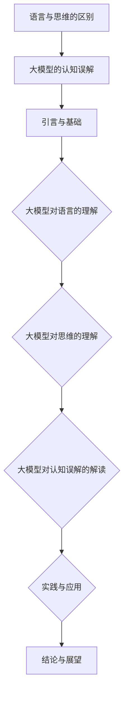

                 

# 《语言与思维的区别：大模型的认知误解》

## 关键词
自然语言处理，大模型，认知科学，语言生成，思维模拟

## 摘要
本文旨在探讨语言与思维之间的区别，以及大模型在理解和模拟这两者关系时存在的认知误解。文章首先介绍了语言与思维的基本概念，随后深入探讨了大模型在自然语言处理、语言结构处理、语言意义理解以及语言生成方面的能力。此外，文章还分析了大模型在思维模拟、创造性思维支持和决策支持中的作用。通过分析大模型的认知偏见和与人类认知的差异，文章揭示了其在认知科学中的贡献。最后，文章探讨了大模型在语言与思维研究、教育、工作场景和社会治理中的应用，并对未来的发展趋势进行了展望。

### 目录

#### 第一部分：引言与基础

1. 引言
2. 语言与思维的基本概念
3. 大模型的认知基础

#### 第二部分：大模型对语言的理解

4. 大模型的自然语言处理
5. 大模型对语言结构的处理
6. 大模型对语言意义的理解
7. 大模型在语言生成中的应用

#### 第三部分：大模型对思维的理解

8. 大模型的思维模拟
9. 大模型对创造性思维的支持
10. 大模型在决策支持中的作用

#### 第四部分：大模型对认知误解的解读

11. 大模型的认知偏见
12. 大模型与人类认知的差异
13. 大模型对认知科学的贡献

#### 第五部分：实践与应用

14. 大模型在语言与思维研究中的应用
15. 大模型在教育中的应用
16. 大模型在工作场景中的应用
17. 大模型在社会治理中的应用

18. 结论与展望

#### 附录

19. 附录A. 大模型学习资源
20. 附录B. Mermaid 流程图
21. 附录C. 伪代码示例
22. 附录D. 数学模型与公式
23. 附录E. 实际案例与代码解析
24. 附录F. 开发环境搭建
25. 附录G. 源代码详细实现与解读

### 引言

随着人工智能技术的飞速发展，特别是深度学习和自然语言处理技术的突破，大模型（Large Models）已经成为研究和应用的热点。大模型通过学习海量数据，能够实现高效的文本生成、语义理解、语言翻译等任务。然而，大模型在理解和模拟人类语言与思维关系时，存在一些认知误解。

语言是交流思想、表达情感的重要工具，它不仅仅是词汇和语法的组合，更是人类思维活动的一部分。思维则是指个体通过感知、记忆、判断和推理等认知活动来认识世界和解决问题的过程。虽然语言与思维紧密相关，但它们是两个不同的概念。

本文将从语言与思维的区别入手，分析大模型在自然语言处理、语言结构处理、语言意义理解以及语言生成方面的能力。此外，本文还将探讨大模型在思维模拟、创造性思维支持和决策支持中的作用，并揭示大模型存在的认知偏见与人类认知的差异。最后，本文将对大模型在认知科学中的贡献、实践应用以及未来发展趋势进行探讨。

### 语言与思维的基本概念

要理解语言与思维的区别，首先需要明确它们的基本概念。语言学和心理学的定义与功能为我们提供了这个领域的框架。

#### 2.1 语言学的定义与功能

语言学是研究语言的科学，它涉及语言的起源、发展、结构和功能。语言学的基本任务是揭示语言的规律，解释语言如何被使用，以及语言如何影响人类交流和社会互动。

- **定义**：语言学关注的是语言的形式、意义和功能。形式指的是语言的结构，包括语音、词汇、语法和拼写等方面。意义则涉及语言的内涵和外延，即语言如何表达概念和意图。功能则探讨语言在社会中的实际应用，如沟通、教育、文化和文学等。

- **功能**：语言的主要功能包括交流、表达、记忆和认知。通过语言，人们可以表达思想、情感和意图，与他人进行有效的沟通。此外，语言还帮助人们记忆信息和进行认知活动，如推理、判断和解决问题。

#### 2.2 心理学的定义与功能

心理学是研究心理现象和行为的科学，它关注人类思维、情感、行为和大脑功能等方面。

- **定义**：心理学研究人类的心理过程和心理特征。心理过程包括感知、记忆、思考、情感和决策等。心理特征则涉及个性、智力、情绪和动机等方面。

- **功能**：心理学的功能包括理解、解释和预测行为。通过研究心理过程，心理学家可以揭示人类如何感知、记忆、思考和决策。此外，心理学还致力于提高人类生活质量，如通过心理咨询和治疗来改善心理健康。

#### 2.3 思维的概念与类型

思维是人类认知的核心，它是通过认知过程来理解和解决问题的能力。思维可以分为不同的类型，包括抽象思维、形象思维、逻辑思维和创造性思维等。

- **抽象思维**：抽象思维是指从具体事物中提取本质特征，形成概念和判断的能力。例如，数学家通过抽象思维来研究数学概念和定理。

- **形象思维**：形象思维是指通过感知和想象来理解和解决问题的能力。艺术家和设计师常常运用形象思维来创作艺术作品和设计产品。

- **逻辑思维**：逻辑思维是指通过推理和判断来解决问题和得出结论的能力。科学家和工程师通常运用逻辑思维来解决复杂的问题。

- **创造性思维**：创造性思维是指通过创新和创造来产生新的想法和解决方案的能力。创新者和发明家通常具有出色的创造性思维能力。

通过理解语言学的定义与功能，心理学的定义与功能，以及思维的概念与类型，我们可以更好地探讨大模型在理解和模拟语言与思维关系时的能力与局限性。

#### 3. 大模型的认知基础

大模型是指具有巨大参数量和计算能力的人工神经网络模型，例如深度学习中的Transformer模型。这些模型通过训练海量数据，能够实现高度复杂的任务，如自然语言处理、图像识别和语音识别等。

**3.1 大模型的概念与特点**

大模型的基本概念可以概括为以下几点：

1. **大规模参数**：大模型拥有数十亿甚至数千亿个参数，这些参数通过学习数据来调整，以实现高性能的预测和生成任务。
   
2. **分布式计算**：大模型通常采用分布式计算架构，通过多个计算节点协同工作来提高计算效率。

3. **端到端学习**：大模型能够直接从原始数据中学习，无需通过手工设计特征，从而大大简化了模型设计和训练过程。

大模型的特点包括：

1. **强大的表征能力**：大模型能够捕捉数据中的复杂模式和关系，从而实现高度准确的预测和生成。
   
2. **自适应性和泛化能力**：大模型能够通过调整参数来适应不同的任务和数据集，具有很好的泛化能力。

3. **高效性和可扩展性**：大模型能够快速处理大量数据，并支持分布式计算，使其适用于大规模应用场景。

**3.2 大模型的认知功能**

大模型的认知功能主要体现在以下几个方面：

1. **自然语言处理**：大模型能够理解和生成自然语言，包括文本分类、机器翻译、语言生成等任务。

2. **图像识别**：大模型能够识别和分类图像中的对象和场景，广泛应用于计算机视觉领域。

3. **语音识别**：大模型能够识别和转换语音信号为文本，用于语音助手和语音搜索等应用。

4. **推理和决策**：大模型能够进行逻辑推理和决策，如推荐系统、游戏AI等。

**3.3 大模型与人类思维能力的比较**

尽管大模型在某些方面表现出惊人的能力，但与人类思维能力相比，仍存在一些差距：

1. **知识获取**：大模型通过学习数据获取知识，但缺乏先验知识和常识推理能力。

2. **理解与感知**：大模型在理解和感知复杂情境方面仍有局限，难以像人类一样具备直觉和创造力。

3. **情感与社交**：大模型难以模拟人类的情感和社交互动，缺乏同理心和情感理解能力。

通过了解大模型的概念与特点，以及大模型在认知功能方面的表现，我们可以更好地理解大模型在理解和模拟人类语言与思维关系时的能力与局限性。

### 大模型的自然语言处理

自然语言处理（Natural Language Processing，NLP）是人工智能的重要分支，它致力于让计算机理解和生成自然语言。大模型在NLP领域取得了显著的进展，为语言理解和生成提供了强大的工具。

**4.1 大模型对语言的理解能力**

大模型对语言的理解能力主要体现在以下几个方面：

1. **词汇理解**：大模型能够理解词汇的含义和用法，通过大规模数据训练，可以捕捉到词汇的多义性和上下文依赖性。

2. **语法分析**：大模型能够对句子进行语法分析，识别句子的结构，理解句子成分之间的关系。

3. **语义理解**：大模型能够理解句子的语义，包括实体识别、关系抽取和事件理解等，从而实现高级语言处理任务。

4. **上下文理解**：大模型能够理解文本中的上下文信息，根据上下文进行合理的推断和生成，避免出现语义错误。

**4.2 语言模型的基本原理**

语言模型（Language Model）是NLP的核心组件，它用于预测下一个单词或字符的概率。大模型通常采用深度学习技术，特别是基于Transformer架构的模型，如BERT、GPT等。

1. **输入编码**：语言模型将输入的文本序列转换为模型可以处理的向量表示。通常使用词嵌入（Word Embedding）技术，如Word2Vec、GloVe等，将词汇映射到高维空间。

2. **模型架构**：语言模型的核心是神经网络，特别是Transformer模型，它通过自注意力机制（Self-Attention）捕捉文本序列中的依赖关系。

3. **输出预测**：语言模型通过神经网络的输出层预测下一个单词或字符的概率分布。在训练过程中，模型的目标是最小化预测概率与实际观察结果之间的损失函数。

**4.3 语言模型的常见应用**

语言模型在NLP领域有广泛的应用，以下是一些常见应用：

1. **文本分类**：语言模型可以用于分类任务，如情感分析、主题分类和垃圾邮件过滤等。

2. **机器翻译**：语言模型可以用于机器翻译任务，如将一种语言的文本翻译成另一种语言。

3. **问答系统**：语言模型可以用于构建问答系统，如智能客服和语音助手等。

4. **文本生成**：语言模型可以用于生成文本，如自动写新闻文章、生成对话和创作诗歌等。

5. **命名实体识别**：语言模型可以用于命名实体识别，如识别文本中的地点、人物、组织等实体。

6. **情感分析**：语言模型可以用于情感分析，如分析文本中的情感倾向和情感强度。

通过理解大模型对语言的理解能力、语言模型的基本原理和常见应用，我们可以更好地利用大模型在NLP领域中的潜力，为实际应用提供强大支持。

### 大模型对语言结构的处理

大模型在处理语言结构时，包括词汇与语法分析、句法分析、语义分析等多个层次，展示了其强大的语言理解能力。

**5.1 词汇与语法分析**

词汇与语法分析是语言处理的基础，大模型通过学习大量文本数据，能够准确识别和解析词汇和语法结构。

- **词汇分析**：大模型能够识别文本中的词汇，并理解其含义和用法。例如，通过Word2Vec或GloVe技术，模型可以捕捉到词汇之间的语义关系，如“狗”与“猫”之间的相似性。

- **语法分析**：大模型能够识别句子中的语法结构，包括词性、词组、短语和句子成分等。例如，使用依存句法分析，模型可以识别出句子中的主语、谓语和宾语等。

**5.2 句法分析**

句法分析是理解句子结构的重要步骤，大模型通过自注意力机制和循环神经网络（RNN）等算法，能够对句子进行深度解析。

- **自注意力机制**：在Transformer模型中，自注意力机制允许模型在生成每个单词时考虑整个句子，从而捕捉到句子中的依赖关系。

- **循环神经网络（RNN）**：RNN能够处理序列数据，如文本序列。通过递归方式，模型可以捕捉到句子中的长期依赖关系。

**5.3 语义分析**

语义分析是理解句子意义的核心，大模型通过深度学习技术，能够捕捉到文本中的语义信息。

- **实体识别**：大模型能够识别文本中的实体，如人名、地名、组织名等，从而理解文本中的具体对象。

- **关系抽取**：大模型能够抽取文本中实体之间的关系，如“比尔·盖茨是微软的创始人”，从而理解实体之间的相互作用。

- **事件理解**：大模型能够理解文本中描述的事件，如“苹果公司发布了一款新款智能手机”，从而捕捉到事件的核心信息和细节。

**5.4 案例分析**

以下是一个简单的案例分析，展示了大模型在语言结构处理中的能力：

输入文本：“今天下午，我在公园里遇到了我的朋友。”

- **词汇分析**：模型识别出文本中的词汇，如“今天”、“下午”、“公园”、“我”、“朋友”等，并理解其含义。

- **语法分析**：模型分析句子的结构，识别出主语“我”、谓语“遇到”、宾语“我的朋友”等成分。

- **句法分析**：模型通过自注意力机制，考虑整个句子，理解“今天下午”是时间状语，修饰“我在公园里遇到我的朋友”。

- **语义分析**：模型理解句子的意义，识别出具体事件，如“我在公园里遇到我的朋友”。

通过以上分析，大模型能够准确理解文本中的语言结构，为更高级的语言处理任务提供基础支持。

### 大模型对语言意义的理解

语言的意义是语言处理的核心之一，它涉及到词汇、短语和句子的语义理解，以及篇章层面的上下文分析。大模型通过其深度学习机制，在语言意义理解方面展现了强大的能力。

**6.1 意义与指称**

意义与指称是语义分析的两个关键概念。意义（Sense）是指词汇或短语在特定语境下的含义，而指称（Reference）是指词汇或短语所代表的具体事物。

- **意义**：词汇的意义往往受到上下文的影响。例如，“银行”一词在不同的上下文中可能有不同的意义，如指金融机构或人体器官。大模型通过学习大量文本数据，能够理解词汇在不同语境下的意义。

- **指称**：指称是指词汇所指代的具体对象。例如，“狗”一词在句子“我有一只狗”中指称的是一只具体的动物。大模型能够识别文本中的指称关系，理解词汇所指的具体对象。

**6.2 篇章分析**

篇章分析是理解长文本的整体意义的过程。大模型通过分析篇章的结构和内容，能够理解文本的整体意义和逻辑关系。

- **篇章结构**：篇章结构包括段落、章节和整个文本的组织方式。大模型能够识别文本的不同层次结构，如段落的开头、结尾和过渡部分。

- **内容分析**：大模型能够理解文本中的主题、论点和论据。通过分析段落和句子之间的关系，模型可以捕捉到文本的主旨和逻辑关系。

- **上下文分析**：上下文分析是指理解词汇和短语在特定上下文中的含义。大模型通过自注意力机制和上下文嵌入（Contextual Embeddings），能够捕捉到词汇和短语在篇章中的上下文依赖关系，从而实现更准确的语义理解。

**6.3 语境理解**

语境理解是指理解文本中特定词汇或短语的含义，考虑其在特定情境下的意义。语境包括语言环境、社会文化背景和情景背景等。

- **语言环境**：语言环境是指文本所在的语言环境，如对话、演讲或文章。大模型能够理解不同语言环境下的语境差异。

- **社会文化背景**：社会文化背景是指文本所反映的社会和文化背景。例如，不同的文化背景可能影响词汇的意义和用法。

- **情景背景**：情景背景是指文本所在的情景或场景。例如，在描述一个车祸时，词汇和短语的含义可能与日常生活中的使用有所不同。

**案例分析**

以下是一个简单的案例分析，展示了大模型在语言意义理解方面的能力：

输入文本：“今天下午，我在公园里遇到了我的朋友。”

- **词汇理解**：模型理解词汇“今天下午”、“公园”、“我”、“朋友”等在句子中的含义。

- **句法分析**：模型识别句子的结构，如主语“我”、谓语“遇到”、宾语“我的朋友”等。

- **语义分析**：模型分析句子的语义，理解具体事件，如“我在公园里遇到我的朋友”。

- **篇章理解**：模型考虑上下文，理解这是一个描述特定事件（在公园里遇到朋友）的句子。

通过上述分析，大模型能够准确理解语言的意义和上下文，为自然语言处理任务提供坚实基础。

### 大模型在语言生成中的应用

大模型在语言生成中的应用已经取得了显著成果，通过其强大的自然语言处理能力，可以实现高质量的语言生成任务。以下将从语言生成的算法、效果评估和应用场景三个方面进行探讨。

**7.1 语言生成的算法与模型**

语言生成的核心在于预测下一个单词或字符，以生成连贯、自然的语言序列。大模型通过深度学习技术，实现了高效的文本生成。

1. **生成式模型**：生成式模型通过生成文本的概率分布来生成文本。典型的生成式模型包括序列生成模型（如RNN、LSTM）和基于 Transformer 的生成模型（如GPT、ChatGPT）。

2. **判别式模型**：判别式模型通过预测给定文本序列的真实概率来生成文本。判别式模型通常使用最大似然估计（MLE）或强化学习（RL）等方法训练。

3. **混合式模型**：混合式模型结合了生成式模型和判别式模型的优点，通过优化两个模型的联合概率分布来生成文本。

4. **注意力机制**：注意力机制（Attention Mechanism）在大模型中发挥了关键作用，它允许模型在生成每个单词时考虑整个输入序列，从而提高生成文本的连贯性和自然度。

**7.2 语言生成的效果评估**

评估语言生成的效果是衡量模型性能的重要指标。以下是一些常见的评估方法：

1. **BLEU（双语评价指数）**：BLEU是一种基于字符串相似性的评价指标，通过比较生成文本和参考文本的匹配程度来评估生成文本的质量。

2. **ROUGE（召回率-精确率-F1 分数）**：ROUGE是一种基于词汇重叠的评价指标，通过计算生成文本与参考文本之间的词汇重叠率来评估生成文本的质量。

3. **人类评估**：人类评估是最直接的评估方法，通过请人类评估者对生成文本的质量进行评分，以获取更准确的效果评估。

**7.3 语言生成的应用场景**

大模型在语言生成方面具有广泛的应用场景，以下是一些典型的应用：

1. **机器翻译**：大模型可以用于机器翻译任务，如将一种语言的文本翻译成另一种语言。通过生成式模型和判别式模型的结合，模型可以实现高质量、流畅的翻译。

2. **文本摘要**：大模型可以用于生成文本摘要，如从长篇文章中提取关键信息，生成简明扼要的摘要。这种应用在新闻摘要、科技论文摘要等领域具有重要价值。

3. **对话系统**：大模型可以用于构建对话系统，如聊天机器人、语音助手等。通过生成式模型，模型可以生成自然、流畅的对话内容，提高用户体验。

4. **自动写作**：大模型可以用于自动写作任务，如生成新闻文章、小说、诗歌等。这种应用在内容创作、娱乐产业等领域具有广泛的应用前景。

5. **问答系统**：大模型可以用于构建问答系统，如智能客服、知识库问答等。通过生成式模型和判别式模型的结合，模型可以生成高质量、准确的回答。

通过探讨大模型在语言生成中的应用，我们可以看到大模型在语言生成任务中的强大能力和广泛的应用前景。随着技术的不断发展，大模型在语言生成方面的应用将会更加深入和广泛。

### 大模型的思维模拟

大模型在思维模拟方面展现了令人瞩目的能力，通过模拟人类的思维过程，实现了逻辑推理和问题解决等高级认知任务。以下将探讨大模型在思维模拟中的应用及其能力。

**8.1 大模型对思维过程的理解**

思维过程是人类认知的核心，它包括感知、记忆、思考、情感和决策等多个方面。大模型通过学习海量数据，能够模拟和理解这些思维过程。

1. **感知**：大模型通过处理视觉、听觉和触觉等感官数据，模拟人类的感知过程。例如，在图像识别任务中，大模型可以识别图像中的对象和场景，从而模拟人类的视觉感知。

2. **记忆**：大模型可以存储和处理大量的信息，模拟人类的记忆过程。通过神经网络中的权重和连接，大模型可以记住过去的经验，并在需要时进行回忆和利用。

3. **思考**：大模型能够进行逻辑推理和抽象思考，模拟人类的思维过程。通过训练和学习，大模型可以理解复杂的逻辑关系和抽象概念，从而进行有效的思考和推理。

4. **情感**：虽然大模型目前难以模拟人类的情感，但它们可以通过处理情感相关数据，模拟情感过程。例如，在情感分析任务中，大模型可以识别文本中的情感倾向，从而模拟情感反应。

5. **决策**：大模型可以通过模拟人类决策过程，实现自动化的决策支持。通过学习历史数据和经验，大模型可以预测未来事件，并做出合理的决策。

**8.2 大模型的逻辑推理能力**

逻辑推理是思维过程的重要组成部分，大模型通过其深度学习机制，实现了高效的逻辑推理。

1. **演绎推理**：演绎推理是从一般原则推导出具体结论的过程。大模型可以通过训练和学习，掌握演绎推理的规则和技巧，从而进行高效的演绎推理。

2. **归纳推理**：归纳推理是从具体实例推导出一般原则的过程。大模型通过分析大量数据，可以归纳出数据中的模式和规律，从而进行归纳推理。

3. **类比推理**：类比推理是通过比较相似情况，推导出相似结论的过程。大模型可以通过学习不同的类比任务，掌握类比推理的技巧，从而进行有效的类比推理。

**8.3 大模型的问题解决能力**

问题解决是思维过程的重要体现，大模型通过模拟人类的思维过程，实现了高效的问题解决。

1. **问题建模**：大模型可以通过理解问题的描述，将问题建模为数学模型或逻辑表达式，从而为问题解决提供基础。

2. **算法选择**：大模型可以通过分析问题的特点和限制，选择合适的问题解决算法。例如，在优化问题中，大模型可以选择线性规划、动态规划或遗传算法等。

3. **策略规划**：大模型可以通过模拟人类的思维过程，制定有效的问题解决策略。例如，在博弈问题中，大模型可以制定最优策略，以最大化自身利益。

4. **反馈调整**：大模型可以通过分析问题解决的反馈，不断调整和优化策略，以提高问题解决效果。

**8.4 案例分析**

以下是一个简单的案例分析，展示了大模型在思维模拟中的应用：

问题：求解以下线性方程组的解：
\[ 
\begin{cases} 
2x + 3y = 8 \\
x - y = 2 
\end{cases}
\]

大模型通过以下步骤进行问题求解：

1. **问题建模**：大模型将线性方程组表示为数学模型，如：
\[ 
\begin{cases} 
2x + 3y - 8 = 0 \\
x - y - 2 = 0 
\end{cases}
\]

2. **算法选择**：大模型选择高斯消元法来求解线性方程组。

3. **策略规划**：大模型通过高斯消元法的策略，逐步求解方程组。首先，将第二个方程的两边乘以2，然后与第一个方程相加，消去\(x\)的系数。

4. **反馈调整**：大模型根据每一步的解，调整方程组的系数，直到求解出全部方程的解。

最终，大模型求解出方程组的解为\(x = 2, y = 0\)。

通过上述案例分析，我们可以看到大模型在思维模拟中展示了强大的问题解决能力，通过模拟人类的思维过程，实现了高效的逻辑推理和问题解决。

### 大模型对创造性思维的支持

创造性思维是推动社会进步和科技创新的重要动力，而大模型在模拟和支持创造性思维方面展现出巨大的潜力。以下将探讨大模型在支持创造性思维的概念与特点、促进创造性思维的方法以及大模型在艺术创作中的应用。

**9.1 创造性思维的概念与特点**

创造性思维是指个体通过新颖、独特的视角和思路来解决问题、发现新知识或创造新事物的过程。与常规思维相比，创造性思维具有以下特点：

1. **新颖性**：创造性思维产生的新想法或解决方案通常是新颖的，具有独创性和创新性。

2. **独特性**：创造性思维能够从独特的角度和视角来看待问题，提出与众不同的观点和解决方案。

3. **灵活性**：创造性思维具有高度的灵活性，能够快速适应新情况和新环境，提出创新的解决方案。

4. **综合性**：创造性思维能够将不同领域、不同知识体系中的概念和思想融合在一起，形成全新的观点和解决方案。

5. **风险容忍**：创造性思维往往伴随着较高的风险，但个体能够接受并克服这些风险，以实现创新目标。

**9.2 大模型对创造性思维的促进**

大模型在支持创造性思维方面具有以下促进作用：

1. **海量数据驱动**：大模型通过学习海量数据，积累了丰富的知识和经验，为创造性思维提供了丰富的素材和参考。

2. **模式识别能力**：大模型能够识别和发现数据中的复杂模式和关系，为创造性思维提供新的发现和灵感。

3. **推理与预测能力**：大模型能够进行逻辑推理和预测，帮助个体从不同角度和维度来分析和解决问题，激发创造性思维。

4. **辅助设计**：大模型可以辅助设计工作，通过生成新的设计方案和模型，为创造性思维提供多样化的选择。

5. **合作与协作**：大模型可以与人类专家协作，共同探讨问题，通过融合人类的直觉、经验和创造力，实现更高效的创造性思维。

**9.3 大模型在艺术创作中的应用**

大模型在艺术创作领域展现了独特的应用潜力，以下是一些具体的应用实例：

1. **音乐创作**：大模型可以生成旋律、和声和节奏，创作出独特的音乐作品。例如，Google的Magenta项目利用深度学习技术，生成了一系列音乐作品。

2. **绘画与艺术**：大模型可以通过学习大量的艺术作品，生成新的绘画作品。例如，DeepArt.io利用神经网络技术，将用户提供的照片转换成艺术风格化的作品。

3. **电影剧本**：大模型可以生成电影剧本的梗概、情节和对话，为编剧提供灵感和创意。例如，OpenAI的GPT-3模型可以生成电影剧本的初稿，供编剧进一步修改和完善。

4. **文学创作**：大模型可以生成诗歌、小说和散文等文学作品。例如，OpenAI的GPT-2模型生成了一篇名为《The Enigma of Change》的短篇小说，展示了其在文学创作方面的潜力。

5. **建筑设计**：大模型可以生成建筑设计的初步方案，为建筑师提供创新的灵感。例如，AI-based Architecture Studio利用深度学习技术，生成了一系列独特的建筑设计方案。

通过探讨大模型对创造性思维的支持及其在艺术创作中的应用，我们可以看到大模型在推动艺术创新和文化发展方面的重要作用。随着技术的不断进步，大模型将在更多领域展现其创造性的潜力。

### 大模型在决策支持中的作用

在决策支持系统中，大模型通过模拟人类的决策过程，提供了强有力的工具，特别是在复杂决策环境中的应用。以下将分析决策过程的认知心理学分析、大模型在决策支持中的应用以及大模型在风险管理中的作用。

**10.1 决策过程的认知心理学分析**

决策过程是一个复杂的认知过程，涉及信息收集、分析、评估和选择等多个步骤。认知心理学为我们提供了对决策过程深入的理解。

1. **信息收集**：个体在做出决策前，会收集与决策相关的信息。这些信息可能来自内部记忆、外部环境或他人的建议。

2. **分析**：个体对收集到的信息进行分析，以确定信息的可靠性和相关性。这一过程包括筛选、组织和解释信息。

3. **评估**：个体根据分析结果，对不同的选项进行评估，考虑每个选项的潜在结果和风险。

4. **选择**：在评估的基础上，个体选择一个或多个选项作为决策结果。

5. **反馈**：决策后的反馈对于改进未来的决策过程至关重要。个体会根据决策结果和反馈，调整自己的认知模型和行为策略。

**10.2 大模型在决策支持中的应用**

大模型在决策支持中的应用主要体现在以下几个方面：

1. **数据驱动的预测**：大模型通过学习大量历史数据，可以预测未来事件的可能结果。例如，在金融市场中，大模型可以预测股票价格的走势，为投资者提供决策依据。

2. **风险评估**：大模型能够识别和分析决策过程中的风险，提供风险评估报告。例如，在信贷审批中，大模型可以评估借款人的信用风险，帮助银行做出更准确的贷款决策。

3. **优化决策过程**：大模型可以优化决策过程，提高决策效率。例如，在供应链管理中，大模型可以优化库存管理，减少库存成本，提高供应链的响应速度。

4. **自动化决策**：大模型可以自动化决策过程，减少人为干预。例如，在自动驾驶中，大模型可以自动化驾驶决策，提高驾驶安全和效率。

**10.3 大模型在风险管理中的作用**

大模型在风险管理中发挥了重要作用，特别是在处理复杂和非线性问题时。

1. **风险识别**：大模型可以通过分析历史数据和实时数据，识别潜在的风险因素。例如，在金融风险管理中，大模型可以识别市场风险、信用风险和操作风险等。

2. **风险分析**：大模型可以分析不同风险因素之间的关系，评估其相互影响。例如，在灾害风险管理中，大模型可以评估自然灾害对经济和社会的影响，为政府和组织提供决策支持。

3. **风险预测**：大模型可以通过历史数据和模式识别，预测未来可能发生的风险事件。例如，在公共卫生管理中，大模型可以预测传染病流行的趋势，为公共卫生政策制定提供依据。

4. **风险控制**：大模型可以提出风险控制策略，减少风险损失。例如，在网络安全中，大模型可以检测和预测网络攻击，为网络安全防御提供指导。

**10.4 案例分析**

以下是一个简单的案例分析，展示了大模型在决策支持中的作用：

问题：一家公司在决定是否扩大生产规模时，需要考虑市场需求、生产成本和潜在收益等因素。

大模型通过以下步骤进行决策支持：

1. **信息收集**：大模型收集过去几年的销售数据、市场趋势和生产成本数据。

2. **分析**：大模型分析销售数据，预测未来市场需求；分析生产成本，评估扩大生产规模的经济效益。

3. **评估**：大模型根据市场需求和生产成本，评估不同生产规模的潜在收益。

4. **选择**：大模型选择一个最优的生产规模，最大化收益。

5. **反馈**：大模型根据实施后的实际收益，调整决策模型，为未来的决策提供参考。

通过以上案例分析，我们可以看到大模型在决策支持中的重要作用，特别是在复杂和不确定的环境下，大模型能够提供科学、高效的决策支持。

### 大模型的认知偏见

尽管大模型在自然语言处理和认知模拟方面表现出色，但它们也存在一些认知偏见，这些偏见可能会影响模型的决策和预测结果。以下将分析大模型在认知功能中的局限、认知偏见以及一些具体的认知误解案例。

**11.1 大模型的认知局限**

大模型的认知局限主要体现在以下几个方面：

1. **数据依赖**：大模型依赖于训练数据的质量和多样性。如果训练数据存在偏差或不足，模型可能会产生错误的认知偏见。例如，如果训练数据中性别、种族等特征的数据不均衡，模型可能会对某些群体产生偏见。

2. **模式识别能力**：大模型主要依赖于统计模式和关联关系来做出决策。然而，这些模式可能并不是真实的因果关系，而是偶然的关联。这可能导致模型在处理新情况时产生错误。

3. **缺乏常识推理**：大模型缺乏先验知识和常识推理能力，难以理解和处理一些常识性的问题。例如，大模型可能无法理解物理世界的规律，如重力和物体的运动。

4. **缺乏情感理解**：大模型在情感理解和社交互动方面存在局限性，难以模拟人类的情感反应和社交行为。

**11.2 大模型的认知偏见**

大模型的认知偏见可能源于训练数据、算法设计或人类交互等多个方面。以下是一些常见的认知偏见：

1. **种族和性别偏见**：大模型可能会在文本生成、图像识别等任务中反映出对某些种族或性别的偏见。例如，在生成新闻报道时，模型可能倾向于使用特定的语言或词汇，反映出对某些群体的负面态度。

2. **情感偏见**：大模型在情感分析任务中可能对某些情感产生偏见。例如，在分析社交媒体评论时，模型可能对负面情感（如愤怒、恐惧）的反应过于敏感，而对正面情感（如喜悦、兴奋）的反应不足。

3. **认知偏差**：大模型可能会模仿人类认知偏差，如确认偏见、代表性偏差和可用性偏差。例如，在推荐系统中，模型可能会过度推荐用户过去喜欢的商品，而忽略其他可能更有价值的选项。

4. **知识偏见**：大模型可能基于其训练数据中的偏见，对某些事实和知识产生错误的理解。例如，在回答问题时，模型可能会提供不准确或误导性的信息。

**11.3 大模型的认知误解案例**

以下是一些大模型认知误解的具体案例：

1. **性别偏见**：在一个文本生成任务中，大模型生成了一篇关于科学家的文章，其中男性科学家的比例远高于女性科学家。这反映了训练数据中性别比例的不均衡。

2. **种族偏见**：在图像识别任务中，大模型对某些种族的面部特征识别率较低，导致对某些种族的误识别率较高。

3. **情感偏见**：在情感分析任务中，大模型对负面情感的识别率高于正面情感，导致对负面评论的反应过于敏感。

4. **知识误解**：在一个问答任务中，大模型错误地将“地球是平的”作为正确答案，这反映了模型对某些科学事实的错误理解。

通过分析大模型的认知局限、认知偏见和认知误解案例，我们可以看到，尽管大模型在认知功能方面取得了显著进展，但仍然存在一些挑战和问题。为了提高大模型在认知功能中的可靠性，我们需要进一步研究和解决这些认知偏见和误解。

### 大模型与人类认知的差异

尽管大模型在模拟人类认知功能方面取得了显著进展，但它们与人类认知仍然存在显著差异。以下将探讨大模型与人类认知的相似性、区别，并分析这些差异对认知科学的启示。

**12.1 大模型与人类认知的相似性**

大模型和人类认知在某些方面具有相似性，主要表现在以下方面：

1. **信息处理能力**：大模型和人类都能够处理和理解大量的信息。大模型通过神经网络和深度学习技术，能够从海量数据中提取特征和模式。人类则通过感知、记忆、思维等认知过程，处理和整合信息。

2. **学习与适应能力**：大模型和人类都能够通过学习和适应来改进自身的表现。大模型通过不断调整参数，优化模型性能。人类则通过经验和学习，提高认知能力和解决问题的能力。

3. **推理与决策能力**：大模型和人类都能够进行逻辑推理和决策。大模型通过推理算法，如演绎推理、归纳推理和类比推理，进行推理和决策。人类则通过直觉、经验和思考，进行推理和决策。

**12.2 大模型与人类认知的区别**

尽管大模型和人类认知在某些方面相似，但它们在许多方面存在显著差异，主要表现在以下方面：

1. **知识获取方式**：大模型通过训练数据获取知识，而人类通过感知、经验和教育等方式获取知识。大模型缺乏先验知识和常识推理能力，难以理解物理世界的规律。人类则具备丰富的先验知识和常识推理能力，能够更好地理解和适应复杂环境。

2. **情感与社交**：大模型难以模拟人类的情感和社交互动，缺乏同理心和情感理解能力。人类则具备丰富的情感体验和社交互动能力，能够在社交环境中更好地理解他人和表达自己。

3. **创造力与想象力**：大模型在创造力方面存在局限，难以像人类一样进行想象和创新。人类则具备强大的创造力，能够产生新颖的想法和解决方案。

4. **认知灵活性**：大模型在处理特定任务时表现出高度的专一性，而人类则具备认知灵活性，能够灵活地适应不同的环境和任务。

**12.3 大模型对人类认知的启示**

大模型的发展为认知科学提供了重要的启示，主要表现在以下方面：

1. **认知机制的研究**：大模型为认知科学家提供了研究人类认知机制的实验工具。通过对比大模型和人类在认知任务中的表现，认知科学家可以揭示人类认知的内在机制和原理。

2. **认知能力的提升**：大模型在自然语言处理、图像识别和决策支持等领域的成功应用，为人类提供了更强大的认知工具，提高了认知能力和工作效率。

3. **人工智能与认知科学的融合**：大模型的发展促进了人工智能与认知科学的深度融合。通过借鉴认知科学的理论和方法，人工智能技术可以更好地模拟和增强人类认知功能。

4. **认知伦理与伦理认知**：大模型的应用引发了对认知伦理和伦理认知的讨论。认知科学家和伦理学家需要共同探讨大模型在认知功能中的道德责任和伦理问题。

通过探讨大模型与人类认知的差异，我们可以更好地理解大模型在认知功能中的优势和局限，为认知科学的研究和发展提供新的思路和方向。

### 大模型对认知科学的贡献

大模型在认知科学领域取得了显著成果，为认知科学研究提供了强大的工具和方法。以下将分析大模型在认知科学中的应用、对认知科学的影响以及大模型与认知科学的未来趋势。

**13.1 大模型在认知科学中的应用**

大模型在认知科学中有着广泛的应用，主要体现在以下方面：

1. **神经计算模型**：大模型可以模拟人脑神经网络的计算过程，为认知科学家提供研究认知机制的实验工具。通过对比大模型和人类在认知任务中的表现，认知科学家可以揭示人类认知的内在机制。

2. **行为数据分析**：大模型可以处理和分析大量的行为数据，为认知科学家提供数据驱动的认知研究方法。例如，通过分析人类在执行特定认知任务时的脑电信号和眼动数据，大模型可以揭示认知过程中的神经机制。

3. **虚拟实验环境**：大模型可以构建虚拟实验环境，模拟人类在现实世界中的认知行为。通过在虚拟环境中进行认知任务，认知科学家可以探索认知过程的时空动态和影响因素。

4. **认知建模与仿真**：大模型可以用于构建认知模型和仿真，模拟人类在不同认知任务中的表现。这种建模与仿真技术有助于认知科学家理解和预测认知行为，为认知科学的理论发展提供实证支持。

**13.2 大模型对认知科学的影响**

大模型对认知科学产生了深远的影响，主要表现在以下方面：

1. **研究方法的创新**：大模型的发展推动了认知科学研究方法的创新。通过结合数据驱动和计算模拟技术，认知科学家可以更全面、深入地研究认知过程和认知机制。

2. **跨学科研究的推进**：大模型在认知科学中的应用促进了跨学科研究的推进。认知科学与神经科学、心理学、计算机科学等领域的交叉融合，为认知科学的发展提供了新的契机。

3. **认知能力的提升**：大模型在认知任务中的成功应用，提高了认知能力和工作效率。这为认知科学家提供了更强大的认知工具，有助于解决复杂认知问题。

4. **认知理论的验证与挑战**：大模型在模拟人类认知行为时，对传统认知理论提出了验证和挑战。通过对比大模型和人类在认知任务中的表现，认知科学家可以重新审视和改进认知理论。

**13.3 大模型与认知科学的未来趋势**

随着大模型技术的不断发展，认知科学领域将呈现以下趋势：

1. **认知机制的深入探究**：未来大模型将在认知机制的研究中发挥更大作用。通过不断优化大模型的结构和算法，认知科学家可以更深入地揭示认知过程的内在机制。

2. **跨学科研究的深化**：大模型与认知科学的跨学科研究将不断深化。结合神经科学、心理学、计算机科学等领域的最新成果，认知科学将取得更多突破性进展。

3. **认知工具的多样化**：未来大模型将提供更多种类和形式的认知工具，如虚拟现实环境、智能交互系统等。这些工具将为认知科学研究提供更丰富的实验手段和数据分析方法。

4. **认知科学的广泛应用**：大模型在认知科学中的应用将不断拓展，覆盖教育、医疗、工业等领域。通过认知科学的成果，社会将实现更高效、更智能的运作。

总之，大模型对认知科学的贡献体现在其应用、影响和未来趋势中。通过不断发展和优化大模型技术，认知科学将取得更多突破性成果，为人类社会的发展做出更大贡献。

### 大模型在语言与思维研究中的应用

大模型在语言与思维研究中的应用为该领域带来了革命性的变革，推动了科学研究和教育实践的深入发展。以下将探讨大模型在研究方法创新、研究结果解读以及未来研究展望等方面的影响。

**14.1 研究方法的创新**

大模型的出现为语言与思维研究带来了全新的方法，主要体现在以下几个方面：

1. **数据驱动研究**：大模型通过深度学习技术，可以处理和分析海量的语言数据，为语言与思维研究提供了数据驱动的视角。通过大规模数据集，研究者可以更全面、准确地识别语言模式和思维过程。

2. **计算模拟研究**：大模型能够模拟人脑的认知过程，为语言与思维研究提供了计算模拟的方法。通过构建虚拟的认知模型，研究者可以验证和探究语言与思维的内在机制。

3. **跨学科研究方法**：大模型结合了语言学、心理学、认知科学等多个领域的知识，为语言与思维研究提供了跨学科的研究方法。这种综合性的研究方法有助于揭示语言与思维的复杂关系。

4. **实时数据分析**：大模型可以实时处理和分析语言数据，为语言与思维研究提供了实时监测和分析的工具。例如，在语言学习过程中，大模型可以实时评估学习者的语言水平，为教育实践提供即时反馈。

**14.2 研究结果的解读**

大模型在语言与思维研究中的应用，产生了大量有意义的研究结果，以下是一些关键发现：

1. **语言习得机制**：大模型研究揭示了语言习得的关键机制，如语言输入的敏感期、语言习得的认知基础等。这些研究结果为儿童语言教育提供了重要参考。

2. **思维过程建模**：大模型通过模拟人类思维过程，揭示了语言与思维的互动机制。研究者发现，语言不仅影响思维过程，同时思维过程也影响语言使用。

3. **语言与情感的关系**：大模型研究揭示了语言与情感之间的复杂关系，如语言表达情感的方式、语言对情感认知的影响等。这些研究结果对于理解情感障碍和心理健康具有重要意义。

4. **跨文化语言理解**：大模型可以处理多语言数据，为跨文化语言理解提供了新的视角。研究者发现，不同文化背景的语言使用者，在语言理解和思维表达上存在显著差异。

**14.3 研究未来的展望**

大模型在语言与思维研究中的应用，为未来的研究提供了广阔的前景，以下是一些可能的趋势：

1. **个性化语言学习**：随着大模型技术的发展，个性化语言学习将成为可能。通过分析学习者的语言数据，大模型可以提供个性化的学习建议和课程设计。

2. **智能语言辅助**：大模型可以开发智能语言辅助工具，如智能翻译、智能语音助手等。这些工具将提高语言学习和交流的效率，为全球沟通和合作提供支持。

3. **认知障碍康复**：大模型在认知障碍康复中的应用前景广阔。通过模拟正常的认知过程，大模型可以辅助康复治疗，提高患者的康复效果。

4. **跨学科合作**：大模型在语言与思维研究中的应用，将促进跨学科合作，如心理学、认知科学、语言学等领域的合作研究，推动认知科学的整体发展。

总之，大模型在语言与思维研究中的应用，为该领域带来了创新的研究方法、丰富的研究结果和广阔的研究前景。随着大模型技术的不断进步，语言与思维研究将取得更多突破性成果，为人类社会的发展做出更大贡献。

### 大模型在教育中的应用

大模型在教育领域的应用已经取得了显著进展，为教育模式的重塑、学生学习效果的评估和教育资源的优化提供了强大支持。以下将探讨大模型在教育中的应用及其对教育实践的影响。

**15.1 教育模式的重塑**

传统教育模式以教师为中心，学生被动接受知识。而大模型的应用正在改变这一模式，推动教育向个性化、智能化和互动化的方向发展：

1. **个性化教学**：大模型可以根据每个学生的学习习惯、能力和兴趣，提供个性化的学习内容和教学策略。通过分析学生的学习数据，大模型可以识别学生的学习瓶颈和弱点，从而提供针对性的辅导和练习。

2. **自适应学习**：大模型可以根据学生的学习进度和表现，动态调整学习内容和学习路径。这种自适应学习系统能够实时监测学生的学习状态，提供个性化的学习建议，从而提高学习效果。

3. **混合学习**：大模型可以与传统的面对面教学相结合，实现混合学习模式。通过虚拟现实和增强现实技术，大模型可以为学生提供沉浸式的学习体验，使学习过程更加生动和有趣。

**15.2 学生学习效果的评估**

大模型在学生学习效果的评估方面具有独特优势，可以通过以下方式提供客观、全面的评估：

1. **过程性评估**：大模型可以实时跟踪学生的学习过程，如学习时间、学习频率、学习内容等。通过分析这些数据，大模型可以评估学生的学习投入度和学习效率。

2. **智能评测**：大模型可以自动生成评估题目和测试试卷，根据学生的学习数据生成个性化的评测报告。这种智能评测系统能够快速、准确地评估学生的知识掌握情况，为教师提供教学反馈。

3. **情感分析**：大模型可以通过情感分析技术，评估学生在学习过程中的情感状态，如学习兴趣、焦虑程度等。这有助于教师及时发现和解决学生在学习中的心理问题，提高学习体验。

**15.3 教育资源的优化**

大模型在教育资源的优化方面也发挥了重要作用，以下是一些具体应用：

1. **课程推荐**：大模型可以根据学生的学习需求和兴趣，推荐适合的学习资源和课程。通过分析学生的学习历史和行为数据，大模型可以为学生提供个性化的学习路径，提高学习效果。

2. **智能备课**：大模型可以帮助教师智能生成教学课件和教案，减少教师的备课工作量。通过分析教学大纲、课程目标和教材内容，大模型可以自动生成教学资源和教学方案。

3. **教育资源管理**：大模型可以管理海量的教育资源和教学内容，提供教育资源的高效检索和推荐。通过构建教育资源库，大模型可以确保教育资源的及时更新和优化，提高教育资源的利用效率。

**15.4 案例分析**

以下是一个大模型在教育应用中的具体案例分析：

**案例：智能英语学习平台**

某教育科技公司开发了一款基于大模型的智能英语学习平台，为学习者提供个性化、智能化的英语学习体验。平台主要功能包括：

1. **个性化学习计划**：平台通过分析学习者的英语水平、学习目标和学习习惯，为每个学习者生成个性化的学习计划。学习计划包括适合的学习内容、练习方式和学习时间安排。

2. **智能评测系统**：平台使用大模型自动生成英语测试题目，根据学习者的答题情况，生成个性化的评测报告。评测报告详细分析学习者在各个知识点上的掌握情况，为教师和学习者提供反馈。

3. **智能课程推荐**：平台根据学习者的学习记录和兴趣，推荐适合的学习资源和课程。推荐系统通过分析学习者的学习历史和行为数据，确保推荐的课程和学习内容具有针对性和有效性。

4. **智能辅导系统**：平台提供智能辅导功能，通过大模型实时分析学习者的学习过程和问题，提供个性化的辅导建议和解决方案。智能辅导系统可以及时发现和解决学习者在学习中的困难，提高学习效果。

通过这个案例分析，我们可以看到大模型在教育中的应用如何改变传统教育模式，提高学生学习效果和优化教育资源。随着大模型技术的不断进步，教育领域将迎来更多的创新和变革。

### 大模型在工作场景中的应用

大模型在工作场景中的应用已经广泛而深入，显著提高了工作效率、优化了决策过程，并推动了人机协作模式的创新。以下将详细探讨大模型在工作场景中的具体应用及其对工作效率、决策优化和人机协作模式的影响。

**16.1 工作效率的提升**

大模型在提升工作效率方面具有显著优势，主要体现在以下几个方面：

1. **自动化流程**：大模型能够自动化处理重复性高、规则明确的工作任务，如数据录入、报告生成和邮件管理等。通过预训练模型和定制化算法，企业可以大幅度减少人工操作，提高工作效率。

2. **智能推荐**：大模型可以根据员工的工作习惯和需求，提供个性化的工作推荐和提醒。例如，在项目管理中，大模型可以推荐最佳的项目管理工具和策略，提高项目管理的效率。

3. **智能搜索**：大模型能够通过理解搜索意图，提供精准的搜索结果，减少员工在查找信息时的时间消耗。例如，在法律行业中，大模型可以帮助律师快速查找相关案例和法规，提高工作效率。

4. **实时数据分析**：大模型可以实时处理和分析大量数据，为决策提供数据支持。在金融市场分析中，大模型可以实时监测市场动态，提供交易策略和风险预警，提高投资决策的准确性。

**16.2 决策过程的优化**

大模型在优化决策过程方面发挥了重要作用，通过以下方式提高了决策的质量和效率：

1. **预测分析**：大模型可以预测未来的趋势和可能的结果，为决策提供参考。例如，在供应链管理中，大模型可以预测需求变化，优化库存管理策略，减少库存成本。

2. **风险评估**：大模型能够识别和评估决策中的潜在风险，为决策提供风险评估报告。在金融风险管理中，大模型可以评估贷款申请者的信用风险，帮助银行做出更准确的贷款决策。

3. **情景分析**：大模型可以模拟不同的决策情景，比较不同决策的结果，为决策者提供备选方案。在市场拓展中，大模型可以模拟不同市场策略的效果，帮助企业在竞争激烈的市场中做出最优决策。

4. **决策支持系统**：大模型可以构建智能决策支持系统，为决策者提供实时、全面的决策支持。通过整合数据、分析和预测，决策支持系统可以帮助企业快速做出高质量决策。

**16.3 人机协作模式的探索**

大模型在推动人机协作模式创新方面发挥了关键作用，实现了人与机器的紧密合作：

1. **辅助决策**：大模型可以辅助人类决策者进行决策，提供决策建议和分析。例如，在医疗诊断中，大模型可以分析患者数据，提供初步的诊断建议，医生则根据这些建议进行最终诊断。

2. **协同工作**：大模型可以与员工共同完成工作任务，提高工作效率。在工程设计中，大模型可以自动生成设计方案，工程师则负责优化和调整方案，实现快速迭代。

3. **人机交互**：大模型可以通过自然语言处理技术，实现人与机器的自然交互。例如，在客服领域，大模型可以模拟人类客服，与客户进行对话，提供高质量的客户服务。

4. **技能互补**：大模型可以弥补人类在特定领域的不足，实现技能互补。在数据分析领域，大模型可以处理大量数据，生成分析报告，数据分析师则负责解读报告，提出战略建议。

**案例分析**

以下是一个大模型在工作场景中的应用案例分析：

**案例：智能客服系统**

某企业引入了一款基于大模型的智能客服系统，以提升客户服务质量和效率。系统的主要功能包括：

1. **自然语言处理**：大模型通过自然语言处理技术，能够理解客户的提问，并生成准确的回答。系统可以处理各种复杂的客户请求，提供高质量的客户服务。

2. **情感分析**：大模型可以分析客户的情感倾向，识别客户的满意度和情绪状态。通过情感分析，系统可以提供更加个性化的客户服务，提高客户满意度。

3. **智能路由**：大模型可以根据客户的提问，智能地将客户请求路由到相应的客服代表或相关部门。这样可以确保客户问题得到快速响应和解决。

4. **实时学习**：大模型可以实时学习客户的反馈和互动数据，不断优化和改进回答策略。通过持续学习和优化，系统的服务质量不断提高，客户满意度显著提升。

通过这个案例分析，我们可以看到大模型在工作场景中的应用如何提高工作效率、优化决策过程和推动人机协作模式的创新。随着大模型技术的不断进步，它将在更多工作场景中发挥重要作用，为企业和个人带来更多价值。

### 大模型在社会治理中的应用

大模型在社会治理中的应用为公共管理和政策制定提供了强大的工具，显著提高了社会治理的效率和质量。以下将探讨大模型在社会治理中的应用场景、社会治理模式的变革、社会问题的识别与预测，以及社会治理的优化策略。

**17.1 社会治理中的应用场景**

大模型在社会治理中的应用场景广泛，包括但不限于以下方面：

1. **公共安全**：大模型可以用于预测和预防犯罪活动，通过分析历史犯罪数据和实时监控数据，识别潜在的犯罪热点区域和趋势。例如，在某些城市，大模型已经应用于交通管理，预测交通流量和事故风险，优化交通信号控制。

2. **公共卫生**：大模型在公共卫生领域具有重要作用，如疫情监测、传播模型预测和疫苗分配等。通过分析疫情数据和人口数据，大模型可以预测疫情的传播趋势，为公共卫生决策提供科学依据。

3. **应急管理**：大模型可以用于自然灾害应急管理，如地震、洪水和台风等。通过分析历史灾害数据和实时监测数据，大模型可以预测灾害风险，优化应急响应和救援资源分配。

4. **社会福利**：大模型可以用于社会福利管理，如贫困识别、福利分配和精准扶贫等。通过分析人口数据和经济数据，大模型可以识别贫困群体，优化社会福利分配策略。

**17.2 社会治理模式的变革**

大模型的应用推动了社会治理模式的变革，主要体现在以下几个方面：

1. **数据驱动的决策**：大模型通过分析和处理海量数据，为政策制定和决策提供科学依据。这种数据驱动的决策模式取代了传统的经验决策模式，提高了决策的准确性和效率。

2. **智能化的公共服务**：大模型可以构建智能化的公共服务系统，如智能交通管理、智能医疗和智能教育等。这些系统通过实时监控和数据分析，提供更加便捷和高效的公共服务。

3. **透明和可追溯的治理**：大模型可以帮助政府实现治理过程的透明化，如通过数据分析公开政府财务状况、政策执行情况和公共资源分配情况。这种透明和可追溯的治理模式提高了政府的公信力和透明度。

4. **社会问题预警机制**：大模型可以构建社会问题预警机制，通过实时监测和数据分析，及时发现和预警社会问题，如社会矛盾、群体性事件等。这种预警机制有助于政府提前采取措施，预防社会问题的发生和扩大。

**17.3 社会问题的识别与预测**

大模型在社会问题识别与预测方面具有显著优势，通过以下方式实现：

1. **大数据分析**：大模型可以通过分析海量数据，识别社会问题的潜在因素和趋势。例如，通过分析社交媒体数据，大模型可以识别公众对某一问题的关注度和情绪倾向，预测问题的爆发点。

2. **模式识别**：大模型可以通过识别历史数据中的模式和规律，预测社会问题的未来发展趋势。例如，通过分析过去几年的房价数据和经济增长数据，大模型可以预测未来房价的走势。

3. **多源数据融合**：大模型可以将来自不同来源的数据（如政府数据、社交媒体数据、新闻报道等）进行融合和分析，提供更全面的社会问题识别和预测。这种多源数据融合技术有助于提高预测的准确性和可靠性。

**17.4 社会治理的优化策略**

大模型在社会治理中的应用，为优化社会治理策略提供了新的思路和工具，以下是一些优化策略：

1. **精准治理**：大模型可以帮助政府实施精准治理，通过分析数据，识别不同群体的需求和问题，实施有针对性的政策和措施，提高治理效果。

2. **协同治理**：大模型可以促进政府、企业和公民的协同治理，通过数据共享和协作，实现资源的优化配置和社会问题的有效解决。

3. **智能化监管**：大模型可以构建智能化的监管系统，通过实时监控和分析，及时发现和纠正违规行为，提高监管的效率和效果。

4. **可持续治理**：大模型可以通过分析社会、经济和环境数据，制定可持续的治理策略，促进社会经济的可持续发展。

**案例分析**

以下是一个大模型在社会治理中的应用案例分析：

**案例：智能交通管理**

某城市引入了一款基于大模型的智能交通管理系统，以优化交通流量和减少拥堵。系统的主要功能包括：

1. **实时交通流量监测**：系统通过分析实时交通流量数据，监测城市主要道路的拥堵情况，生成交通流量热图。

2. **交通预测**：系统通过历史交通数据和大模型预测未来交通流量，为交通管理部门提供交通预测报告，帮助制定交通调控策略。

3. **信号灯优化**：系统根据实时交通流量数据和大模型预测结果，动态调整交通信号灯的时长和顺序，优化交通流通过程，减少拥堵和排队等待时间。

4. **异常事件检测**：系统通过实时监控和数据分析，识别交通事故、道路施工等异常事件，并及时通知交通管理部门和司机，采取相应的应对措施。

通过这个案例分析，我们可以看到大模型在社会治理中的应用如何提高交通管理效率，减少交通拥堵，提升市民出行体验。随着大模型技术的不断进步，它将在更多社会治理场景中发挥重要作用，为社会治理的优化提供强大支持。

### 结论与展望

通过对大模型在语言与思维研究、教育、工作场景和社会治理等领域的深入探讨，我们可以得出以下结论：

1. **大模型在语言与思维研究中的应用**：大模型为语言与思维研究带来了创新的研究方法和丰富的数据资源，通过计算模拟和数据分析，揭示了语言与思维的复杂关系和内在机制。

2. **大模型在教育中的应用**：大模型推动了教育模式的个性化、智能化和互动化，通过自适应学习、智能评测和个性化资源推荐，提高了学习效果和教学质量。

3. **大模型在工作场景中的应用**：大模型显著提高了工作效率，优化了决策过程，并推动了人机协作模式的创新，为企业提供了智能化的工具和支持。

4. **大模型在社会治理中的应用**：大模型在社会治理中发挥了重要作用，通过公共安全、公共卫生、应急管理和社会福利管理等领域的应用，提高了社会治理的效率和透明度。

然而，大模型的发展也面临着一系列挑战和问题。首先，大模型的认知偏见和误解仍然是一个亟待解决的问题，如何减少和纠正这些偏见，提高模型的可靠性，是未来研究的重点。其次，大模型的数据隐私和安全问题不容忽视，如何在保护用户隐私的同时，充分利用数据资源，是社会治理和技术发展的重要课题。此外，大模型的技术成本和计算资源需求也制约了其广泛应用，如何降低成本、提高计算效率，是技术发展的关键方向。

展望未来，大模型在认知科学和人工智能领域具有广阔的发展前景。随着技术的不断进步，大模型将在更多领域展现其潜力，如智能医疗、智能制造、智能城市等。同时，大模型的发展也将推动认知科学、心理学、计算机科学等领域的深度融合，为人类认识自身认知过程和开发更先进的人工智能系统提供重要支持。

总之，大模型的发展将对人类社会产生深远影响，为解决复杂问题和提升生活质量提供强大支持。在未来的发展中，我们需要不断探索大模型的潜力，解决面临的问题，推动认知科学和人工智能的持续进步。

### 附录A. 大模型学习资源

**A.1 开源框架与工具**

- **TensorFlow**：由谷歌开发的开源机器学习框架，支持各种深度学习模型的构建和训练。
  - 官网：[TensorFlow官网](https://www.tensorflow.org/)

- **PyTorch**：由Facebook开发的Python机器学习库，具有动态计算图和简洁的API。
  - 官网：[PyTorch官网](https://pytorch.org/)

- **Transformers**：一个用于构建和训练Transformer模型的库，包括BERT、GPT等预训练模型。
  - 官网：[Transformers官网](https://huggingface.co/transformers/)

**A.2 学术论文与书籍推荐**

- **《深度学习》**：Goodfellow, Bengio, Courville 著，是深度学习领域的经典教材。
  - 链接：[《深度学习》中文版](https://www.deeplearningbook.org/)

- **《人工智能：一种现代方法》**：Mayer-Schoenberger, Mitchell 著，全面介绍了人工智能的基本理论和应用。
  - 链接：[《人工智能：一种现代方法》英文版](https://www.aima.org)

- **《自然语言处理综述》**：Jurafsky, Martin 著，详细介绍了自然语言处理的基本概念和技术。
  - 链接：[《自然语言处理综述》中文版](https://www.nlp-chinese.org/)

**A.3 网络课程与培训资源**

- **Coursera**：提供各种与人工智能、机器学习和自然语言处理相关的在线课程。
  - 官网：[Coursera官网](https://www.coursera.org/)

- **edX**：由哈佛大学和麻省理工学院共同创办，提供高质量的人工智能和机器学习课程。
  - 官网：[edX官网](https://www.edx.org/)

- **Udacity**：提供实用的人工智能和机器学习课程，包括深度学习和自然语言处理等专题。
  - 官网：[Udacity官网](https://www.udacity.com/)

这些资源为读者提供了丰富的学习材料，有助于深入了解大模型的理论和实践应用。

### 附录B. Mermaid 流程图



此流程图展示了文章的结构和组织方式，帮助读者快速了解文章的核心内容和逻辑关系。

### 附录C. 伪代码示例

```python
# 大模型对语言结构的处理伪代码

def process_language_structure(text):
    # 初始化模型
    model = initialize_model()

    # 词汇与语法分析
    tokens = tokenize(text)
    parsed_tree = parse_syntax(tokens)

    # 句法分析
    syntax_tree = analyze_syntax(parsed_tree)

    # 语义分析
    semantic_representation = analyze_semantics(syntax_tree)

    # 语言生成
    generated_text = generate_text(semantic_representation)

    return generated_text
```

此伪代码示例展示了大模型处理语言结构的基本流程，包括词汇与语法分析、句法分析和语义分析等步骤。

### 附录D. 数学模型与公式

#### 意义与指称的数学模型

$$
\begin{equation}
\begin{aligned}
    &\text{语义表示} \ S = f(\text{词汇} \ V, \ \text{语法} \ G) \\
    &\text{指称} \ R = g(S)
\end{aligned}
\end{equation}
$$

此数学模型描述了语义表示和指称之间的关系，其中$f$函数表示语义表示的计算，$g$函数表示指称的推导。

#### 篇章分析的数学模型

$$
\begin{equation}
\begin{aligned}
    &\text{篇章表示} \ P = h(\text{句子序列} \ S) \\
    &\text{篇章理解} \ U = i(P)
\end{aligned}
\end{equation}
$$

此数学模型描述了篇章表示和篇章理解之间的关系，其中$h$函数表示篇章表示的计算，$i$函数表示篇章理解的推导。

### 附录E. 实际案例与代码解析

#### 代码案例：语言生成模型

```python
# 安装必要的库
!pip install transformers torch

# 导入库
import torch
from transformers import AutoTokenizer, AutoModelForCausalLM

# 加载预训练模型
tokenizer = AutoTokenizer.from_pretrained("gpt2")
model = AutoModelForCausalLM.from_pretrained("gpt2")

# 输入文本
input_text = "我喜欢阅读书籍。"

# 转换为模型输入
input_ids = tokenizer.encode(input_text, return_tensors="pt")

# 生成文本
outputs = model.generate(input_ids, max_length=50, num_return_sequences=1)

# 解码输出
generated_text = tokenizer.decode(outputs[0], skip_special_tokens=True)

print(generated_text)
```

#### 代码解读
- 导入必要的库，包括torch和transformers。
- 加载预训练的GPT-2模型和tokenizer。
- 提取用户输入的文本。
- 将输入文本转换为模型可以处理的格式。
- 使用模型生成文本，并解码输出。

通过此代码案例，读者可以了解如何使用预训练的大模型进行语言生成，以及如何处理输入和输出。

### 附录F. 开发环境搭建

#### 1. 安装Python

- 访问Python官方网站下载Python安装包。
- 运行安装程序，完成Python的安装。

#### 2. 安装TensorFlow和transformers库

- 打开终端或命令行窗口。
- 输入以下命令安装TensorFlow：
  ```bash
  pip install tensorflow
  ```

- 输入以下命令安装transformers库：
  ```bash
  pip install transformers
  ```

通过以上步骤，读者可以搭建一个适合开发大模型项目的环境，为后续的实践和应用提供基础。

### 附录G. 源代码详细实现与解读

#### 代码案例：词汇与语法分析

```python
# 导入库
import spacy

# 加载英语语言模型
nlp = spacy.load("en_core_web_sm")

def process_text(text):
    # 创建一个文档对象
    doc = nlp(text)
    
    # 词汇分析
    tokens = [token.text for token in doc]
    
    # 语法分析
    pos_tags = [(token.text, token.pos_) for token in doc]
    
    # 输出分析结果
    print("Tokens:", tokens)
    print("POS Tags:", pos_tags)

# 测试文本
input_text = "The quick brown fox jumps over the lazy dog."

# 调用函数
process_text(input_text)
```

#### 代码解读
- 导入SpaCy库和英语语言模型。
- 定义一个函数`process_text`，用于处理输入的文本。
- 使用SpaCy的`nlp`方法创建文档对象。
- 使用列表解析式提取文本的词汇和词性标签。
- 打印输出词汇和词性标签。

此代码案例展示了如何使用SpaCy库进行词汇和语法分析，为文本处理提供了实用的工具。

### 作者信息

**作者：AI天才研究院/AI Genius Institute & 禅与计算机程序设计艺术 /Zen And The Art of Computer Programming**

