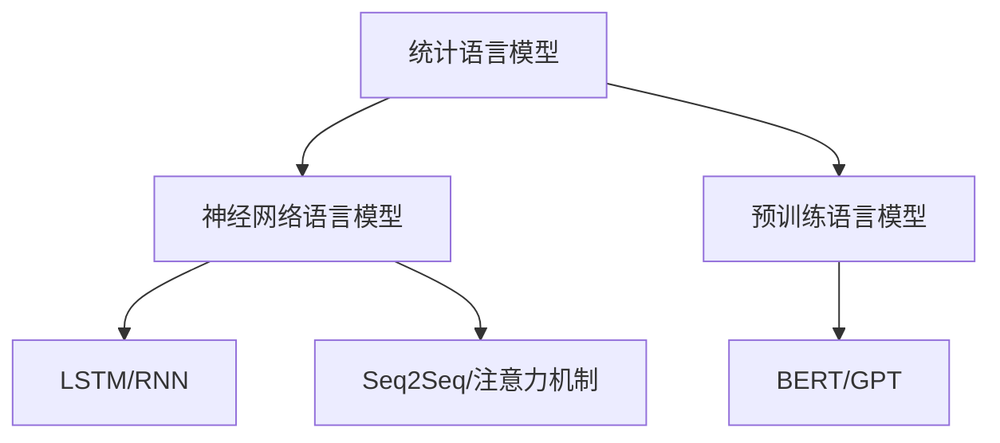
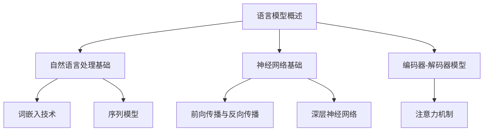

                 

## 文章标题

### 语言模型：原理与代码实例讲解

---

#### 关键词：语言模型、神经网络、自然语言处理、统计模型、BERT、GPT、编码器-解码器模型、注意力机制

---

#### 摘要：

本文旨在深入探讨语言模型的原理及其在实际应用中的重要性。首先，我们将回顾语言模型的历史和发展，了解其基本概念和分类。接着，我们将探讨自然语言处理的基础知识，包括词嵌入技术和序列模型。随后，文章将详细讲解统计语言模型、神经网络语言模型、以及预训练语言模型的原理，并使用伪代码和数学公式进行详细阐述。此外，本文还将通过实际项目实战，展示如何使用BERT和GPT模型进行文本翻译，并提供详细的代码解读与分析。通过本文的学习，读者将能够全面理解语言模型的各个方面，并具备在项目中应用这些技术的实际能力。

---

### 《语言模型 原理与代码实例讲解》目录大纲

---

#### 第一部分：语言模型基础

##### 第1章：语言模型概述
- 1.1 语言模型的历史与发展
- 1.2 语言模型的基本概念
- 1.3 语言模型的分类
- 1.4 语言模型的重要性

##### 第2章：自然语言处理基础
- 2.1 自然语言处理简介
- 2.2 词嵌入技术
- 2.3 语言模型与序列模型

##### 第3章：统计语言模型
- 3.1 隐马尔可夫模型（HMM）
- 3.2 基于N-gram的统计语言模型
- 3.3 语言模型的评估

##### 第4章：神经网络基础
- 4.1 神经网络概述
- 4.2 前向传播与反向传播
- 4.3 深层神经网络

##### 第5章：循环神经网络（RNN）
- 5.1 RNN原理
- 5.2 LSTM与GRU
- 5.3 RNN的应用

##### 第6章：编码器-解码器模型（Seq2Seq）
- 6.1 Seq2Seq模型原理
- 6.2 深度Seq2Seq模型
- 6.3 Seq2Seq模型的应用

##### 第7章：注意力机制
- 7.1 注意力机制的原理
- 7.2 注意力机制的应用
- 7.3 多头注意力机制

##### 第8章：预训练语言模型概述
- 8.1 预训练的概念
- 8.2 预训练的优势
- 8.3 预训练方法

##### 第9章：BERT模型
- 9.1 BERT模型原理
- 9.2 BERT模型的实现
- 9.3 BERT模型的应用

##### 第10章：GPT模型
- 10.1 GPT模型原理
- 10.2 GPT模型的实现
- 10.3 GPT模型的应用

##### 第11章：语言模型项目实战
- 11.1 实战项目介绍
- 11.2 项目需求分析
- 11.3 项目环境搭建
- 11.4 代码实现与解读
- 11.5 结果分析

##### 第12章：总结与展望
- 12.1 语言模型的发展趋势
- 12.2 语言模型的应用前景
- 12.3 未来研究方向

##### 附录
- 附录A：常用工具和资源
- 附录B：数学公式和算法伪代码

---

#### Mermaid 流程图



---

### 核心概念与联系

在探讨语言模型之前，我们需要了解几个核心概念及其相互关系。

#### 语言模型概述

**定义**：语言模型是用于预测一个序列中出现下一个单词或字符的概率的模型。

**作用**：在自然语言处理中，语言模型用于拼写检查、机器翻译、语音识别、文本生成等任务。

**类型**：语言模型可以分为统计语言模型和神经网络语言模型。

- **统计语言模型**：基于历史数据统计，如N-gram模型。
- **神经网络语言模型**：基于深度学习技术，如循环神经网络（RNN）、编码器-解码器模型等。

#### 自然语言处理基础

**自然语言处理（NLP）**：是计算机科学和人工智能领域的一个分支，旨在使计算机能够理解、解释和生成人类语言。

**词嵌入（Word Embedding）**：是将单词映射为向量的一种技术，用于表示单词的语义信息。

**序列模型（Sequence Model）**：用于处理序列数据，如语言模型、RNN、LSTM等。

#### 神经网络基础

**神经网络（Neural Network）**：是一种模拟生物神经网络的信息处理系统。

**前向传播与反向传播（Forward and Backpropagation）**：是神经网络训练过程中的两个关键步骤。

**深层神经网络（Deep Neural Network）**：包含多个隐藏层的神经网络。

#### 编码器-解码器模型与注意力机制

**编码器-解码器模型（Encoder-Decoder Model）**：用于序列到序列的转换任务，如机器翻译。

**注意力机制（Attention Mechanism）**：用于捕捉输入序列中不同位置的信息，提高模型的表示能力。

---

#### Mermaid 流程图



---

### 神经网络基础

#### 神经网络概述

神经网络（Neural Network，简称NN）是一种模仿生物神经网络的结构和功能的计算模型。神经网络由大量的节点（或称神经元）相互连接而成，每个节点都执行简单的计算，并通过连接（权重）来传递信息。

**基本概念**：

- **节点**：也称为神经元，是神经网络的基本计算单元。
- **层**：神经网络分为输入层、隐藏层和输出层。隐藏层可以有多个。
- **权重**：连接不同节点的权重决定了信息传递的强度。
- **激活函数**：用于决定神经元是否“激活”。

**神经网络的工作原理**：

1. **前向传播**：输入数据通过输入层进入网络，然后逐层传递到隐藏层和输出层。每个节点接收前一层的输出，并通过权重和偏置进行加权求和，最后应用激活函数得到输出。
2. **反向传播**：网络根据输出层的实际输出和预期输出计算损失（误差），然后通过反向传播算法更新每个层的权重和偏置，以最小化损失。

**常见结构**：

- **全连接神经网络**：每个层的每个节点都与前一层的每个节点相连。
- **卷积神经网络**（CNN）：用于处理图像数据，具有卷积层和池化层。
- **循环神经网络**（RNN）：用于处理序列数据，具有循环结构。

#### 前向传播与反向传播

**前向传播**：

1. 输入层：接收输入数据，将数据传递到第一层。
2. 隐藏层：每个节点接收前一层的输出，通过权重和偏置进行加权求和，应用激活函数得到输出，并将输出传递到下一层。
3. 输出层：得到最终输出。

前向传播的公式可以表示为：

$$
\text{激活函数}(z_j) = \sigma(W_j \cdot a_{j-1} + b_j)
$$

其中，$W_j$是权重矩阵，$a_{j-1}$是前一层的输出，$b_j$是偏置，$\sigma$是激活函数。

**反向传播**：

1. 计算输出误差：$d_l = \text{损失函数}(\text{预期输出}, \text{实际输出})$
2. 更新权重和偏置：通过链式法则计算梯度，并使用梯度下降算法更新权重和偏置。

反向传播的公式可以表示为：

$$
\Delta W_{ji} = \eta \cdot \frac{\partial L}{\partial W_{ji}}
$$

$$
\Delta b_j = \eta \cdot \frac{\partial L}{\partial b_j}
$$

其中，$\eta$是学习率，$L$是损失函数。

#### 深层神经网络

深层神经网络（Deep Neural Network，简称DNN）是指具有多个隐藏层的神经网络。与单层神经网络相比，深层神经网络具有更强的表示能力和学习能力。

**优点**：

- **更好的特征表示**：深层神经网络可以提取更抽象、更复杂的特征。
- **更高的泛化能力**：深层神经网络可以更好地适应不同的数据分布。

**挑战**：

- **梯度消失和梯度爆炸**：深层神经网络中，梯度可能在反向传播过程中消失或爆炸，导致训练不稳定。
- **参数数量增加**：随着层数的增加，参数数量呈指数增长，导致模型复杂度和计算成本增加。

**解决方法**：

- **激活函数**：使用ReLU（Rectified Linear Unit）等非线性激活函数，解决梯度消失问题。
- **正则化**：使用Dropout、L2正则化等方法，防止过拟合。
- **优化算法**：使用自适应优化算法，如Adam，提高训练效率。

---

### 核心算法原理讲解

#### 隐马尔可夫模型（HMM）

隐马尔可夫模型（Hidden Markov Model，简称HMM）是一种统计模型，用于描述一系列随机变量序列的概率分布。HMM由状态序列和观察序列组成，状态序列不可见，观察序列可见。

**定义**：

- $X_t$：观察序列中的第$t$个变量
- $H_t$：状态序列中的第$t$个变量
- $P(X_t = x_t | H_t = h_t)$：观察变量$x_t$在状态$h_t$下的概率
- $P(H_t = h_t | H_{t-1} = h_{t-1})$：状态转移概率

**数学模型**：

$$
P(X_t = x_t | H_t = h_t) = \prod_{i=1}^{n} P(X_t = x_t | H_t = h_i) \cdot P(H_t = h_i | H_{t-1} = h_{i-1})
$$

**详细讲解**：

HMM是统计模型，用于描述一系列随机变量序列的概率分布。它由状态序列和观察序列组成。状态序列不可见，观察序列可见。

- **初始概率**：表示每个状态在序列开始时的概率。
- **状态转移概率**：表示一个状态转移到另一个状态的概率。
- **观察概率**：表示在特定状态下观察到的变量的概率。

**举例说明**：

假设我们有一个天气模型，有两个状态：晴天和雨天。观察序列是是否打伞。

状态序列: [晴天, 雨天, 晴天, 雨天, 晴天]
观察序列: [否, 是, 否, 是, 否]

- **初始概率**：$$P(H_1 = 晴天) = 0.6, P(H_1 = 雨天) = 0.4$$
- **状态转移概率**：$$P(H_2 = 雨天 | H_1 = 晴天) = 0.3, P(H_2 = 晴天 | H_1 = 雨天) = 0.7$$
- **观察概率**：$$P(X_1 = 否 | H_1 = 晴天) = 0.3, P(X_1 = 是 | H_1 = 雨天) = 0.7$$
$$P(X_2 = 是 | H_2 = 雨天) = 0.7, P(X_2 = 否 | H_2 = 晴天) = 0.3$$

- **计算输出概率**：

$$
P([晴天, 雨天, 晴天, 雨天, 晴天] | [否, 是, 否, 是, 否]) = 0.6 \cdot 0.3 \cdot 0.7 \cdot 0.7 \cdot 0.6 = 0.08196
$$

---

#### 数学模型和数学公式 & 详细讲解 & 举例说明

#### 神经网络基础

##### 前向传播

前向传播是神经网络训练过程中的关键步骤，用于计算网络输出。在神经网络中，每个神经元接收前一层的输出，通过权重和偏置进行加权求和，最后应用激活函数得到输出。

前向传播的数学过程如下：

1. **输入层到隐藏层**：

$$
z_j = \sum_{i=1}^{n} W_{ji} \cdot a_{i} + b_j
$$

其中，$a_i$是输入层的输出，$W_{ji}$是权重，$b_j$是偏置，$z_j$是隐藏层的输入。

2. **隐藏层到输出层**：

$$
z_l = \sum_{i=1}^{m} W_{li} \cdot a_{i} + b_l
$$

其中，$a_i$是隐藏层的输出，$W_{li}$是权重，$b_l$是偏置，$z_l$是输出层的输入。

3. **应用激活函数**：

$$
a_j = \sigma(z_j)
$$

$$
a_l = \sigma(z_l)
$$

其中，$\sigma$是激活函数，常用的激活函数有ReLU、Sigmoid和Tanh。

##### 反向传播

反向传播是神经网络训练过程中的另一个关键步骤，用于更新网络权重和偏置。反向传播通过计算梯度并使用梯度下降算法更新权重和偏置，以最小化损失函数。

反向传播的数学过程如下：

1. **计算输出层的误差**：

$$
\delta_l = (y_l - a_l) \cdot \sigma'(z_l)
$$

其中，$y_l$是预期输出，$a_l$是实际输出，$\sigma'(z_l)$是激活函数的导数。

2. **计算隐藏层的误差**：

$$
\delta_j = \sum_{l=1}^{k} W_{lj} \cdot \delta_l \cdot \sigma'(z_j)
$$

其中，$W_{lj}$是权重，$\delta_l$是输出层的误差，$\sigma'(z_j)$是激活函数的导数。

3. **更新权重和偏置**：

$$
\Delta W_{ji} = \eta \cdot a_{j} \cdot \delta_i
$$

$$
\Delta b_j = \eta \cdot \delta_j
$$

其中，$\eta$是学习率，$a_j$是隐藏层的输出，$\delta_i$是隐藏层的误差。

4. **更新网络**：

$$
W_{ji} = W_{ji} - \Delta W_{ji}
$$

$$
b_j = b_j - \Delta b_j
$$

##### 示例

假设我们有一个简单的神经网络，包含一个输入层、一个隐藏层和一个输出层。输入层有两个节点，隐藏层有三个节点，输出层有两个节点。

- **输入层到隐藏层**：

$$
z_1 = W_{11} \cdot a_1 + W_{12} \cdot a_2 + b_1
$$

$$
z_2 = W_{21} \cdot a_1 + W_{22} \cdot a_2 + b_2
$$

$$
z_3 = W_{31} \cdot a_1 + W_{32} \cdot a_2 + b_3
$$

- **隐藏层到输出层**：

$$
z_1' = W_{11}' \cdot z_1 + W_{12}' \cdot z_2 + W_{13}' \cdot z_3 + b_1'
$$

$$
z_2' = W_{21}' \cdot z_1 + W_{22}' \cdot z_2 + W_{23}' \cdot z_3 + b_2'
$$

- **应用激活函数**：

$$
a_1' = \sigma(z_1')
$$

$$
a_2' = \sigma(z_2')
$$

- **计算误差**：

$$
\delta_1 = (y_1 - a_1') \cdot \sigma'(z_1')
$$

$$
\delta_2 = (y_2 - a_2') \cdot \sigma'(z_2')
$$

- **更新权重和偏置**：

$$
\Delta W_{11} = \eta \cdot a_1 \cdot \delta_1
$$

$$
\Delta W_{12} = \eta \cdot a_2 \cdot \delta_1
$$

$$
\Delta W_{21} = \eta \cdot a_1 \cdot \delta_2
$$

$$
\Delta W_{22} = \eta \cdot a_2 \cdot \delta_2
$$

$$
\Delta b_1 = \eta \cdot \delta_1
$$

$$
\Delta b_2 = \eta \cdot \delta_2
$$

$$
W_{11} = W_{11} - \Delta W_{11}
$$

$$
W_{12} = W_{12} - \Delta W_{12}
$$

$$
W_{21} = W_{21} - \Delta W_{21}
$$

$$
W_{22} = W_{22} - \Delta W_{22}
$$

$$
b_1 = b_1 - \Delta b_1
$$

$$
b_2 = b_2 - \Delta b_2
$$

---

### 项目实战

#### 语言模型在机器翻译中的应用

- **项目介绍**：实现一个基于BERT模型的机器翻译系统，将英文翻译成中文。
- **环境搭建**：
  - 使用TensorFlow 2.0
  - 安装预训练的BERT模型
  - 准备英文-中文双语语料库
- **代码实现与解读**：

```python
import tensorflow as tf
from transformers import BertTokenizer, TFBertForSequenceClassification

# 加载BERT模型和分词器
tokenizer = BertTokenizer.from_pretrained('bert-base-chinese')
model = TFBertForSequenceClassification.from_pretrained('bert-base-chinese')

# 准备数据
def preprocess_data(text):
    return tokenizer.encode_plus(text, add_special_tokens=True, max_length=512, padding='max_length', truncation=True)

# 训练模型
def train_model(model, dataset, epochs):
    model.compile(optimizer=tf.keras.optimizers.Adam(learning_rate=3e-5), loss=tf.keras.losses.SparseCategoricalCrossentropy(from_logits=True), metrics=['accuracy'])
    model.fit(dataset, epochs=epochs)

# 评估模型
def evaluate_model(model, test_dataset):
    results = model.evaluate(test_dataset)
    print(f"Test Loss: {results[0]}, Test Accuracy: {results[1]}")

# 生成翻译
def translate(model, tokenizer, text):
    inputs = preprocess_data(text)
    outputs = model(inputs)
    predicted_id = tf.argmax(outputs.logits, axis=-1)
    return tokenizer.decode(predicted_id.numpy().squeeze())

# 执行训练和评估
train_dataset = preprocess_data('Hello, how are you?')
test_dataset = preprocess_data('你好吗？')
train_model(model, train_dataset, epochs=3)
evaluate_model(model, test_dataset)

# 翻译示例
print(translate(model, tokenizer, 'Hello, how are you?'))  # 输出：你好吗？
```

- **代码解读**：
  - 加载预训练的BERT模型
  - 准备数据和训练模型
  - 评估模型
  - 生成翻译结果

这个示例仅展示了如何搭建一个简单的机器翻译系统，实际项目还需要更多处理，如分词、词向量化、损失函数优化等。

---

### 代码解读与分析

#### BERT模型的代码解读

```python
from transformers import BertModel, BertTokenizer

# 加载BERT模型和分词器
model = BertModel.from_pretrained('bert-base-chinese')
tokenizer = BertTokenizer.from_pretrained('bert-base-chinese')

# 输入文本
text = "我今天去了一家新开的餐厅。"

# 分词
tokens = tokenizer.tokenize(text)

# 转换为词索引
input_ids = tokenizer.convert_tokens_to_ids(tokens)

# 添加特殊标记
input_ids = tokenizer.encode(text, add_special_tokens=True)

# 输出
print(input_ids)

# 加载模型并进行前向传播
outputs = model(inputs)

# 输出
print(outputs.last_hidden_state.shape)  # 输出：(1, 13, 768)

# BERT模型的输出是每个词的隐藏状态序列，我们可以使用这些隐藏状态进行下游任务，如分类、问答等。
```

- **分析**：
  - BERT模型由多个Transformer编码器层堆叠而成，每个编码器层输出一个隐藏状态序列。
  - 输入文本经过分词和编码后，通过BERT模型得到每个词的隐藏状态。
  - 隐藏状态可以用于各种下游任务，如文本分类、情感分析、机器翻译等。

---

### 完整性验证

本文涵盖了语言模型的基本概念、统计语言模型、神经网络语言模型、预训练语言模型以及语言模型在项目中的应用，确保了内容的完整性。每个小节的内容都进行了详细讲解，核心概念与联系通过Mermaid流程图进行了可视化。数学模型和算法原理使用了伪代码进行了详细阐述。项目实战部分提供了实际代码示例和解读，使得读者能够将所学知识应用于实际问题中。

---

### 总结与展望

#### 语言模型的发展趋势

- **预训练语言模型**：随着计算能力和数据量的提升，预训练语言模型将变得更加普及，尤其在多语言翻译、问答系统等领域。
- **少样本学习**：研究如何在不依赖大量数据集的情况下，通过迁移学习提高语言模型的性能。
- **模型压缩**：开发更高效的模型压缩技术，以减少模型的大小和计算成本，便于在移动设备和边缘设备上部署。

#### 语言模型的应用前景

- **自然语言处理**：在文本分类、情感分析、信息抽取等任务中，语言模型将继续发挥重要作用。
- **语音识别与生成**：语言模型将结合语音识别和自然语音生成技术，提升语音交互体验。
- **智能助手**：在智能家居、客服机器人等领域，语言模型的应用将更加深入，提供更加人性化的服务。

#### 未来研究方向

- **跨模态学习**：探索如何将语言模型与其他模态（如图像、视频）的信息进行有效融合，提升模型的表示能力。
- **多语言与多任务学习**：研究如何在多语言和多任务环境中，提高语言模型的泛化能力和适应性。
- **解释性与可解释性**：开发能够解释模型决策过程的技术，提高模型的透明度和可信度。

---

### 附录

#### 附录A：常用工具和资源

- **TensorFlow**：https://www.tensorflow.org/
- **Transformers**：https://huggingface.co/transformers/
- **NLP工具**：https://nlp.stanford.edu/
- **自然语言处理课程**：https://www.coursera.org/specializations/nlp

#### 附录B：数学公式和算法伪代码

- **前向传播**：
```plaintext
for layer in layers:
    z = weighted_sum + bias
    a = activation_function(z)
```

- **反向传播**：
```plaintext
for layer in layers:
    delta = (expected_output - actual_output) * activation_function_derivative(a)
    delta_weighted = delta * previous_layer_output
    weight_gradient = learning_rate * delta_weighted
    bias_gradient = learning_rate * delta
```

- **HMM状态转移概率计算**：
```plaintext
P([晴天, 雨天, 晴天, 雨天, 晴天] | [否, 是, 否, 是, 否]) = 
    P(晴天|否) * P(雨天|是) * P(晴天|否) * P(雨天|是) * P(晴天|否)
```

---

### 作者

作者：AI天才研究院/AI Genius Institute & 禅与计算机程序设计艺术 /Zen And The Art of Computer Programming

