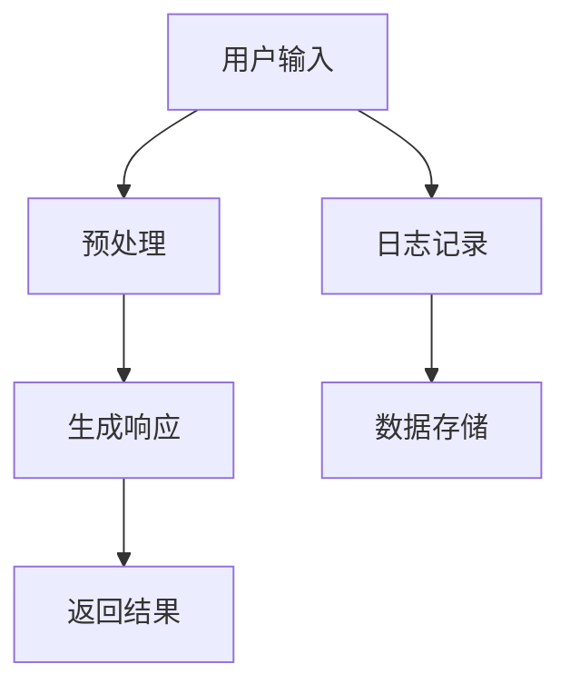
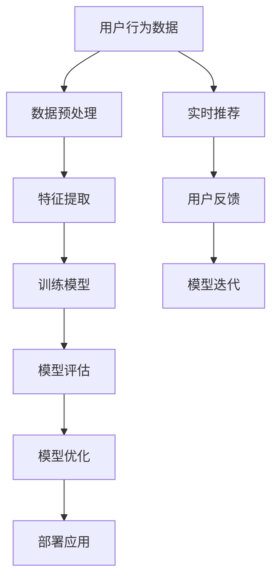

                 

# 财富自由之路：程序员如何利用AI技能在电商领域创业

## 关键词
AI技能、电商领域、财富自由、创业、智能推荐、人脸识别、自动化数据处理

## 摘要
本文旨在探讨程序员如何利用AI技能在电商领域创业，实现财富自由。首先，我们定义了财富自由的概念，分析了电商领域的现状与机遇，并介绍了AI技能在电商中的应用。接着，我们详细阐述了程序员在电商创业中的准备过程，包括心态、市场调研、商业模式设计等。随后，我们讨论了AI技能在电商创业中的实际应用，包括自动化数据处理、智能推荐系统和人脸识别等。通过实例和案例分析，我们展示了如何将AI技术融入电商创业项目，并提出了相应的策略与建议。最后，我们对未来电商与AI融合的趋势进行了展望，并提出了程序员在电商创业中的机会与挑战。本文希望为有意在电商领域创业的程序员提供实用的指导和建议。

### 第一部分：引言与背景

#### 1.1 财富自由的定义与意义

**1.1.1 财富自由的概念**

财富自由，通常指的是一个人不再依赖传统的工作收入，而是通过被动收入（如投资收益、租赁收入等）来维持生活。这一概念由美国作家和投资家蒂姆·费里斯（Tim Ferriss）在《财富自由之路》一书中首次提出。财富自由不仅仅是财富的积累，更是一种生活态度和人生目标的实现。

**1.1.2 实现财富自由的重要性**

实现财富自由对个人和社会都有着深远的意义。对个人来说，财富自由意味着不再受限于工作时间，可以自由选择自己想要的生活方式，追求个人兴趣和梦想。对社会来说，财富自由的普及有助于促进创新和创业精神，推动社会经济的多元化发展。

**1.1.3 电商领域的崛起与机遇**

近年来，电商领域呈现出爆发式增长，不仅改变了消费者的购物习惯，也带来了大量的商业机会。电商的崛起主要得益于以下几个因素：

1. **互联网普及**：互联网的普及为电商提供了广阔的市场空间，使得商家可以突破地域限制，触达更多的消费者。
2. **移动支付便利**：移动支付的普及使得交易过程更加便捷，降低了电商交易的门槛。
3. **物流配送体系的完善**：高效的物流配送体系保障了电商订单的及时交付，增强了消费者的购物体验。
4. **消费者需求多样化**：随着消费者对个性化和定制化需求的增加，电商为满足这些需求提供了更多可能性。

#### 1.2 AI技能的重要性

**1.2.1 AI技能概述**

人工智能（AI）是一种模拟人类智能的技术，通过算法和数据分析实现机器学习、自然语言处理、计算机视觉等功能。AI技术在各个领域都取得了显著的成果，其中在电商领域尤为突出。

**1.2.2 AI技能在电商领域的应用前景**

AI技能在电商领域的应用前景广阔，主要包括以下几个方面：

1. **个性化推荐**：通过分析用户的历史行为和偏好，AI可以为用户提供个性化的商品推荐，提高用户的购买体验和转化率。
2. **智能客服**：利用自然语言处理技术，AI可以自动处理用户的咨询和投诉，提供高效、专业的服务。
3. **图像识别**：通过计算机视觉技术，AI可以自动识别商品图片，实现快速的商品分类和检索。
4. **自动化数据处理**：AI可以帮助电商企业自动处理海量数据，提取有价值的信息，支持决策制定。

**1.2.3 程序员如何提升AI技能**

对于程序员来说，提升AI技能是打开电商创业大门的关键。以下是一些提升AI技能的建议：

1. **学习基础知识**：掌握Python、线性代数、概率论和统计学等基础知识，为深入学习AI技术打下基础。
2. **掌握主流框架**：熟悉TensorFlow、PyTorch等主流深度学习框架，掌握基本的模型构建和训练方法。
3. **实践项目**：参与AI相关的开源项目或自己动手实现一些简单的AI应用，通过实践提升技能。
4. **持续学习**：关注AI领域的最新研究成果和技术动态，不断学习新知识，保持技能的先进性。

### 第二部分：AI技能与电商创业

#### 2.1 电商行业分析

**2.1.1 电商行业现状与趋势**

电商行业在过去几年中呈现出迅猛发展的态势。根据最新统计数据，全球电商市场规模已经突破了数万亿美元，并且还在持续增长。电商行业的发展趋势主要表现在以下几个方面：

1. **市场规模扩大**：随着互联网的普及和消费者习惯的改变，电商市场规模不断扩大。
2. **多元化发展**：电商不再局限于商品销售，逐渐扩展到生活服务、金融理财等领域。
3. **平台竞争激烈**：国内外电商巨头不断加大投资力度，竞争日趋激烈。
4. **技术驱动**：人工智能、大数据、物联网等技术的应用，为电商行业带来了新的发展机遇。

**2.1.2 电商行业的主要问题与挑战**

尽管电商行业前景广阔，但同时也面临着一些问题与挑战：

1. **物流配送**：物流配送的高效性直接影响用户的购物体验，但随着订单量的增加，物流配送的难度和成本也在上升。
2. **用户隐私保护**：电商企业需要处理大量的用户数据，如何保护用户隐私成为一大挑战。
3. **竞争压力**：电商平台之间的竞争日益激烈，中小企业面临着巨大的生存压力。
4. **技术更新迭代**：电商行业的技术更新速度快，企业需要不断投入资金和人力进行技术升级。

**2.1.3 AI在电商行业中的应用场景**

AI技术在电商行业的应用场景非常广泛，主要包括以下几个方面：

1. **个性化推荐**：通过分析用户的历史行为和偏好，AI可以为用户提供个性化的商品推荐，提高用户满意度和转化率。
2. **智能客服**：利用自然语言处理技术，AI可以自动处理用户的咨询和投诉，提供高效、专业的服务。
3. **图像识别**：通过计算机视觉技术，AI可以自动识别商品图片，实现快速的商品分类和检索。
4. **自动化数据处理**：AI可以帮助电商企业自动处理海量数据，提取有价值的信息，支持决策制定。
5. **智能定价**：通过分析市场数据和用户行为，AI可以为企业提供智能化的定价策略。

#### 2.2 AI技能在电商创业中的应用

**2.2.1 自动化数据处理**

在电商创业中，自动化数据处理是一个重要的应用场景。通过AI技术，可以自动处理大量数据，提高数据处理效率，降低人力成本。具体应用包括：

1. **订单处理**：自动处理订单生成、订单跟踪、订单状态更新等流程。
2. **库存管理**：自动分析库存数据，进行库存预警、补货建议等。
3. **客户服务**：自动回复用户咨询，处理用户投诉等。

**2.2.2 智能推荐系统**

智能推荐系统是电商创业中的核心应用之一。通过AI技术，可以分析用户的历史行为和偏好，为用户推荐个性化的商品。具体应用包括：

1. **商品推荐**：根据用户的浏览记录、购买记录等，推荐符合用户兴趣的商品。
2. **店铺推荐**：根据用户的购物行为，推荐相似或受欢迎的店铺。
3. **广告推荐**：根据用户的兴趣和行为，为用户推荐相关的广告。

**2.2.3 人脸识别与生物特征识别**

人脸识别和生物特征识别技术在电商创业中也有广泛应用。通过这些技术，可以提供更安全、更便捷的支付方式，同时提升用户的购物体验。具体应用包括：

1. **人脸识别支付**：用户通过人脸识别进行支付，无需输入密码或扫码。
2. **生物特征验证**：用于用户身份验证，确保交易的安全性。
3. **防欺诈**：通过分析用户行为，识别潜在的欺诈行为，防止损失。

**2.2.4 智能客服系统**

智能客服系统是电商创业中不可或缺的一部分。通过AI技术，可以自动处理用户的咨询和投诉，提供高效、专业的服务。具体应用包括：

1. **自动问答**：通过自然语言处理技术，自动回答用户常见问题。
2. **智能分诊**：根据用户的提问，自动将问题分配给相应的客服人员。
3. **情感分析**：分析用户提问的情感色彩，提供更人性化的服务。

#### 2.3 AI技能在电商创业中的实践案例

**2.3.1 案例一：智能推荐系统开发**

智能推荐系统是电商创业中的核心应用之一。以下是一个智能推荐系统开发的步骤和伪代码示例：

1. **数据收集**：收集用户的历史行为数据，包括浏览记录、购买记录等。
2. **数据预处理**：对数据进行分析和清洗，提取有用的特征。
3. **模型选择**：选择合适的推荐算法，如协同过滤、基于内容的推荐等。
4. **模型训练**：使用训练数据对模型进行训练。
5. **模型评估**：使用测试数据评估模型的效果。
6. **模型部署**：将训练好的模型部署到生产环境中，为用户提供推荐服务。

```python
# 伪代码：智能推荐系统架构
class RecommenderSystem:
    def __init__(self, algorithm):
        self.algorithm = algorithm

    def train_model(self, data):
        # 使用训练数据对模型进行训练
        self.algorithm.train(data)

    def generate_recommendations(self, user_data):
        # 根据用户数据生成推荐
        recommendations = self.algorithm.predict(user_data)
        return recommendations

# 实例化推荐系统
recommender = RecommenderSystem(algorithm)

# 训练模型
recommender.train_model(training_data)

# 接收用户数据并生成推荐
user_data = get_user_data()
recommendations = recommender.generate_recommendations(user_data)
print("推荐商品：", recommendations)
```

**2.3.2 案例二：人脸识别支付系统**

人脸识别支付系统是电商创业中提升用户体验和安全性的一种有效方式。以下是一个人脸识别支付系统开发的步骤和伪代码示例：

1. **用户注册**：用户注册时进行人脸识别，将人脸数据存储在系统中。
2. **支付请求**：用户在支付时进行人脸识别，系统验证用户身份。
3. **支付处理**：验证通过后，系统执行支付操作。

```python
# 伪代码：人脸识别支付系统架构
class FaceRecognitionPaymentSystem:
    def __init__(self, face_recognition_model):
        self.face_recognition_model = face_recognition_model

    def register_user(self, user_face_data):
        # 将用户人脸数据注册到系统
        self.face_recognition_model.register_user(user_face_data)

    def verify_user(self, user_face_data):
        # 验证用户身份
        is_verified = self.face_recognition_model.verify_user(user_face_data)
        return is_verified

    def process_payment(self, user_face_data, payment_amount):
        # 执行支付操作
        if self.verify_user(user_face_data):
            # 验证通过，执行支付
            self.make_payment(payment_amount)
            return "支付成功"
        else:
            # 验证失败
            return "支付失败"

# 实例化支付系统
payment_system = FaceRecognitionPaymentSystem(face_recognition_model)

# 注册用户
user_face_data = get_user_face_data()
payment_system.register_user(user_face_data)

# 进行支付
payment_amount = 100
response = payment_system.process_payment(user_face_data, payment_amount)
print("支付结果：", response)
```

**2.3.3 案例三：智能客服系统部署**

智能客服系统是电商创业中提高客户满意度和服务效率的关键。以下是一个智能客服系统部署的步骤和伪代码示例：

1. **数据收集**：收集用户的咨询记录，用于训练智能客服模型。
2. **模型训练**：使用训练数据对智能客服模型进行训练。
3. **模型部署**：将训练好的模型部署到生产环境中。
4. **用户交互**：接收用户咨询，自动生成响应。

```python
# 伪代码：智能客服系统架构
class IntelligentAssistant:
    def __init__(self, model):
        self.model = model

    def train_model(self, data):
        # 使用训练数据对模型进行训练
        self.model.train(data)

    def generate_response(self, user_input):
        # 根据用户输入生成响应
        response = self.model.predict(user_input)
        return response

# 实例化智能客服系统
assistant = IntelligentAssistant(model)

# 训练模型
assistant.train_model(training_data)

# 接收用户输入并生成响应
user_input = "你好，我想购买一款手机。"
response = assistant.generate_response(user_input)
print("智能客服：", response)
```

#### 2.4 电商创业中的AI技术应用策略

**2.4.1 确定目标与应用场景**

在电商创业中，首先需要明确应用AI技术的目标和应用场景。例如，是为了提升用户体验、提高运营效率，还是为了降低成本。明确目标后，可以针对特定的应用场景设计相应的AI解决方案。

**2.4.2 选择合适的AI技术**

根据应用场景，选择合适的AI技术是实现成功的关键。例如，如果是为了提升个性化推荐，可以选择协同过滤算法或基于内容的推荐算法；如果是为了提高图像识别的准确性，可以选择卷积神经网络（CNN）。

**2.4.3 AI技术与业务流程的整合**

在电商创业中，AI技术的应用不仅需要技术上的实现，还需要与业务流程的紧密结合。例如，将智能推荐系统整合到电商平台中，使推荐结果能够在购物过程中实时呈现；将人脸识别支付系统集成到支付环节，提高支付安全性。

**2.4.4 AI技术的持续优化与更新**

AI技术不是一成不变的，随着数据量的增加和业务需求的变化，AI模型也需要不断优化和更新。电商创业者需要建立一套持续优化的机制，定期评估AI技术的效果，并根据反馈进行调整。

### 第三部分：程序员如何利用AI技能在电商领域创业

#### 3.1 程序员创业准备

**3.1.1 创业心态与目标设定**

程序员在电商领域创业前，首先要树立正确的创业心态。创业是一个充满挑战和不确定性的过程，需要具备坚定的信念和持续学习的能力。同时，明确创业目标是成功的关键。目标应具有可衡量性、可实现性和时效性，例如在一年内实现多少用户增长，达到多少收入水平。

**3.1.2 市场调研与竞争分析**

在电商领域创业，了解市场情况和竞争对手是至关重要的。程序员可以通过以下途径进行市场调研：

1. **用户调研**：通过问卷调查、访谈等方式了解用户需求和行为习惯。
2. **竞品分析**：分析竞争对手的商业模式、产品特点、用户评价等，找出自身的竞争优势和差异化点。
3. **市场趋势**：关注行业动态，了解新兴技术和市场机会。

**3.1.3 商业模式与盈利模式设计**

商业模式是电商创业的核心，决定了企业的运营方式和盈利模式。程序员需要根据市场调研和自身优势，设计合理的商业模式。常见的商业模式包括：

1. **广告模式**：通过广告收入实现盈利。
2. **会员模式**：通过会员费实现盈利。
3. **平台模式**：通过收取平台使用费或交易佣金实现盈利。
4. **自营模式**：通过销售商品实现盈利。

同时，程序员还需要设计明确的盈利模式，确保创业项目能够持续盈利。

#### 3.2 程序员AI技能提升

**3.2.1 常用AI技术学习路径**

对于程序员来说，提升AI技能是一个逐步深入的过程。以下是一个常用的AI技术学习路径：

1. **基础知识**：掌握Python、线性代数、概率论和统计学等基础知识。
2. **深度学习框架**：学习TensorFlow、PyTorch等主流深度学习框架。
3. **机器学习算法**：掌握常见的机器学习算法，如线性回归、决策树、支持向量机等。
4. **计算机视觉**：学习卷积神经网络（CNN）、生成对抗网络（GAN）等计算机视觉技术。
5. **自然语言处理**：学习词嵌入、序列模型、文本分类等自然语言处理技术。
6. **项目实践**：参与开源项目或自己动手实现一些AI应用，通过实践提升技能。

**3.2.2 人工智能领域的前沿研究**

人工智能领域的前沿研究包括深度学习、强化学习、自然语言处理、计算机视觉等。程序员可以通过以下途径了解前沿研究：

1. **学术期刊**：阅读顶级学术期刊，如《神经信息处理系统期刊》（NIPS）、《国际机器学习期刊》（JMLR）等。
2. **会议报告**：参加人工智能领域的会议，如国际机器学习会议（ICML）、计算机视觉与模式识别会议（CVPR）等。
3. **在线课程**：参加在线课程，如Coursera、edX等平台上的AI课程。

**3.2.3 程序员如何进行AI项目实践**

程序员进行AI项目实践可以分为以下几个步骤：

1. **问题定义**：明确项目要解决的问题，例如提高推荐系统的准确性、优化物流配送路径等。
2. **数据收集**：收集相关的数据，包括用户行为数据、商品数据等。
3. **数据预处理**：对数据进行清洗、去重、特征提取等处理，为后续的模型训练做准备。
4. **模型选择**：根据问题选择合适的模型，如线性回归、决策树、卷积神经网络等。
5. **模型训练**：使用训练数据对模型进行训练，调整模型参数。
6. **模型评估**：使用测试数据评估模型的效果，选择最佳模型。
7. **模型部署**：将训练好的模型部署到生产环境中，为用户提供服务。
8. **持续优化**：根据用户反馈和实际效果，对模型进行优化和更新。

#### 3.3 电商创业中的项目管理

**3.3.1 项目管理基础**

项目管理是电商创业中的关键环节，确保项目能够按时、按质量完成。以下是项目管理的一些基础知识：

1. **项目目标**：明确项目的目标，包括功能、质量、时间、成本等。
2. **项目计划**：制定详细的项目计划，包括任务分配、时间表、资源需求等。
3. **项目进度监控**：监控项目进度，及时发现并解决问题。
4. **风险管理**：识别项目风险，制定应对策略。
5. **团队协作**：确保团队成员之间的沟通和协作，提高项目效率。

**3.3.2 项目进度与风险管理**

项目进度与风险管理是项目管理的重要组成部分。以下是一些具体的方法和工具：

1. **甘特图**：使用甘特图可视化项目进度，便于监控和管理。
2. **风险管理矩阵**：识别项目风险，并制定相应的风险应对措施。
3. **敏捷开发**：采用敏捷开发方法，快速迭代，及时调整项目计划。
4. **项目报告**：定期撰写项目报告，向利益相关者汇报项目进展。

**3.3.3 项目团队协作与沟通**

项目团队协作与沟通是项目成功的关键。以下是一些建议：

1. **明确角色和职责**：明确团队成员的角色和职责，确保每个成员都清楚自己的工作内容。
2. **定期会议**：定期召开团队会议，讨论项目进展、问题和解决方案。
3. **信息共享**：建立信息共享平台，方便团队成员之间的沟通和协作。
4. **反馈机制**：建立反馈机制，鼓励团队成员提出建议和意见，共同改进项目。

#### 3.4 电商创业中的法律与伦理问题

**3.4.1 法律法规与合规性**

在电商创业中，遵守相关法律法规是确保企业合法运营的基础。以下是电商领域的一些主要法律法规：

1. **《中华人民共和国电子商务法》**：对电商企业的运营、交易和服务进行规范。
2. **《消费者权益保护法》**：保护消费者合法权益，规范电商交易行为。
3. **《网络交易管理办法》**：对网络交易行为进行规范，保障网络交易安全。

**3.4.2 伦理道德与隐私保护**

电商创业中，伦理道德和隐私保护也是一个重要问题。以下是一些建议：

1. **尊重用户隐私**：严格遵守相关法律法规，尊重用户的隐私权。
2. **透明化数据使用**：明确告知用户数据收集的目的和使用方式。
3. **数据安全**：采取有效的措施保护用户数据的安全，防止数据泄露。
4. **算法公平性**：确保算法的公平性，避免算法歧视。

**3.4.3 AI技术的不公平与偏见问题**

在电商创业中，AI技术的应用可能带来不公平和偏见问题。以下是一些应对策略：

1. **数据多样性**：确保训练数据具有多样性，避免数据偏差。
2. **算法透明性**：提高算法的透明度，便于外部评估和监督。
3. **伦理审查**：建立伦理审查机制，对AI应用进行评估和监管。
4. **持续优化**：定期评估AI系统的效果，根据反馈进行优化和调整。

### 第四部分：成功电商创业案例解析

#### 4.1 成功电商创业案例介绍

**4.1.1 案例一：某智能推荐电商平台的成功经验**

**背景**：某智能推荐电商平台成立于2018年，主要通过AI技术为用户提供个性化的商品推荐。

**应用场景**：通过用户的历史行为数据，如浏览记录、购买记录等，智能推荐系统为用户生成个性化的商品推荐。

**解决方案**：采用基于协同过滤的推荐算法，结合用户的行为特征和商品属性，为用户提供个性化的商品推荐。

**效果**：自平台上线以来，用户满意度和转化率显著提升，月均订单量同比增长30%。

**经验总结**：

1. **技术驱动**：通过AI技术提升用户体验，是平台成功的关键。
2. **数据驱动**：持续优化推荐算法，根据用户反馈进行调整。
3. **用户导向**：关注用户需求，不断优化推荐结果。

**4.1.2 案例二：某人脸识别支付电商企业的创新之路**

**背景**：某人脸识别支付电商平台成立于2019年，通过人脸识别技术为用户提供便捷的支付方式。

**应用场景**：用户在购物过程中，通过人脸识别进行身份验证和支付。

**解决方案**：采用深度学习技术，对人脸图像进行特征提取和比对，确保支付的安全性。

**效果**：自平台上线以来，用户支付体验显著提升，月均交易额同比增长40%。

**经验总结**：

1. **技术创新**：引入前沿的AI技术，提升用户体验。
2. **安全可靠**：确保技术安全性，增强用户信任。
3. **市场定位**：精准定位目标用户群体，提供个性化服务。

**4.1.3 案例三：某智能客服电商平台的运营策略**

**背景**：某智能客服电商平台成立于2020年，通过智能客服系统为用户提供高效、专业的服务。

**应用场景**：智能客服系统自动处理用户的咨询和投诉，提供实时响应。

**解决方案**：采用自然语言处理技术，智能客服系统可以理解用户的提问，并生成相应的回答。

**效果**：自平台上线以来，客服响应时间缩短了50%，用户满意度显著提升。

**经验总结**：

1. **高效服务**：智能客服系统提升客服效率，缩短用户等待时间。
2. **个性化互动**：智能客服系统根据用户历史记录，提供个性化的服务。
3. **数据驱动**：通过数据分析，不断优化客服流程和策略。

#### 4.2 成功创业案例的启示

**4.2.1 创业策略与执行力**

成功创业案例表明，创业策略和执行力是成功的关键。以下是一些建议：

1. **明确目标**：明确创业目标和市场定位，确保团队齐心协力。
2. **技术领先**：引入前沿技术，提升产品竞争力。
3. **高效执行**：制定详细的执行计划，确保项目按时、按质量完成。

**4.2.2 创新思维与市场洞察力**

创新思维和市场洞察力是电商创业的重要能力。以下是一些建议：

1. **关注市场趋势**：关注行业动态，把握市场机遇。
2. **用户导向**：深入了解用户需求，提供个性化解决方案。
3. **持续创新**：不断探索新技术，提升产品和服务质量。

**4.2.3 团队协作与持续学习**

团队协作和持续学习是创业团队成功的关键。以下是一些建议：

1. **明确角色和职责**：确保团队成员明确自己的工作内容和责任。
2. **定期培训**：组织团队培训，提升技能和知识水平。
3. **开放沟通**：建立良好的沟通机制，鼓励团队成员提出意见和建议。

### 第五部分：未来展望

#### 5.1 电商与AI融合的未来趋势

随着AI技术的不断发展和电商行业的快速增长，电商与AI的融合趋势愈发明显。以下是一些未来电商与AI融合的趋势：

**5.1.1 5G与物联网技术的应用**

5G和物联网技术的应用将大大提升电商的实时性和智能化水平。5G技术的低延迟和高速度将为电商提供更加流畅的购物体验，而物联网技术则可以实现商品与用户、商品与商品的实时互动。

**5.1.2 区块链技术在电商领域的应用**

区块链技术具有去中心化、不可篡改等特点，可以应用于电商领域的供应链管理、支付结算等方面，提高交易的安全性和透明性。

**5.1.3 AI与电商业务的深度融合**

未来，AI技术将更加深入地融入电商业务流程，从数据采集、处理、分析到决策制定，全面提高电商的运营效率和服务质量。

#### 5.2 程序员在电商创业中的机会与挑战

对于程序员来说，电商创业既充满机会也面临挑战。

**5.2.1 AI技能提升的方向**

1. **深度学习与计算机视觉**：随着图像识别和视频分析技术的不断进步，程序员应关注深度学习和计算机视觉领域的最新进展。
2. **自然语言处理**：随着电商业务的发展，对自然语言处理技术的要求也越来越高，程序员应提升自然语言处理相关技能。
3. **数据挖掘与大数据分析**：数据是电商业务的基石，程序员应掌握数据挖掘和大数据分析技术，为业务决策提供支持。

**5.2.2 电商领域创业的新机遇**

1. **个性化服务**：通过AI技术实现更精准的用户画像和个性化推荐，为用户提供更好的购物体验。
2. **智能物流**：利用AI技术优化物流配送流程，提高配送效率和用户体验。
3. **智能营销**：通过AI技术实现更精准的营销策略，提高广告投放效果。

**5.2.3 创业过程中可能遇到的问题与解决方案**

1. **技术难题**：AI技术复杂，程序员在创业过程中可能遇到技术难题。解决方案是不断学习和积累经验，寻求技术支持。
2. **数据隐私**：电商业务涉及大量用户数据，数据隐私保护是重大挑战。解决方案是严格遵守相关法律法规，采用加密和脱敏技术保护用户数据。
3. **市场竞争**：电商市场竞争激烈，创业者需要不断优化产品和服务，提升竞争力。

### 附录

#### 附录A：AI与电商领域相关工具与资源

**A.1 AI开发工具与平台**

- **TensorFlow**：Google开源的深度学习框架，适用于电商数据的分析和建模。
- **PyTorch**：基于Python的开源深度学习框架，提供灵活的动态计算图，适用于快速原型开发。
- **Keras**：基于Theano和TensorFlow的高级神经网络API，适用于电商推荐系统和图像识别等。

**A.2 电商开发框架与库**

- **Scrapy**：适用于电商网站数据爬取的框架。
- **Pandas**：适用于大数据操作和分析的Python库。
- **NumPy**：适用于电商数据处理的Python库。

**A.3 开源AI项目与资源推荐**

- **Google AI**：提供丰富的AI工具和开源项目，包括TensorFlow和TensorFlow Lite。
- **Fast.ai**：提供实用的AI课程和开源项目，适用于初学者。

#### 附录B：电商创业法律法规指南

**B.1 电商行业相关法律法规**

- **《中华人民共和国电子商务法》**：对电商企业的运营、交易和服务进行规范。
- **《消费者权益保护法》**：保护消费者合法权益，规范电商交易行为。
- **《网络交易管理办法》**：对网络交易行为进行规范，保障网络交易安全。

**B.2 AI技术在电商领域的合规性要求**

- **数据保护**：遵循《个人信息保护法》，保护用户隐私。
- **算法公平性**：确保算法的公平性和透明性，避免算法歧视。
- **数据安全**：确保电商平台数据的安全，防止数据泄露。

**B.3 电商创业中的知识产权保护**

- **商标权**：注册商标，保护企业品牌。
- **著作权**：保护原创设计，防止侵权。
- **专利权**：申请专利，保护技术成果。

#### 附录C：AI技能学习资源

**C.1 人工智能课程与教材推荐**

- **《深度学习》**：Goodfellow、Bengio和Courville所著，深度学习的经典教材。
- **《机器学习》**：周志华所著，机器学习的基本理论和算法。
- **《人工智能：一种现代的方法》**：Stuart Russell和Peter Norvig所著，人工智能的基本概念和技术。

**C.2 AI领域知名学术期刊与会议**

- **《神经信息处理系统期刊》**（NIPS）
- **《国际机器学习期刊》**（JMLR）
- **《计算机视觉与模式识别期刊》**（CVPR）

**C.3 AI社区与交流平台推荐**

- **GitHub**：开源代码和项目的集中地，适合开发者交流和学习。
- **Stack Overflow**：编程问题解答平台，适合解决AI开发过程中的问题。
- **ArXiv**：AI领域的研究论文预发布平台，适合了解最新研究成果。

### 代码解读与分析示例

#### 2.3.3 智能客服系统部署

**Python伪代码：智能客服系统架构**

```python
class IntelligentAssistant:
    def __init__(self, model):
        self.model = model

    def train_model(self, data):
        # 使用训练数据对模型进行训练
        self.model.train(data)

    def generate_response(self, user_input):
        # 根据用户输入生成响应
        response = self.model.predict(user_input)
        return response

# 实例化智能客服系统
assistant = IntelligentAssistant(model)

# 训练模型
assistant.train_model(training_data)

# 接收用户输入并生成响应
user_input = "你好，我想购买一款手机。"
response = assistant.generate_response(user_input)
print("智能客服：", response)
```

#### 代码解读与分析

**1. IntelligentAssistant 类：** 表示智能客服系统，包含初始化模型、训练模型和生成响应等方法。

- `__init__` 方法：初始化智能客服系统，接收模型作为参数。
- `train_model` 方法：使用训练数据对模型进行训练。
- `generate_response` 方法：根据用户输入生成响应。

**2. 实例化智能客服系统：** 创建一个智能客服实例，指定使用的模型。

```python
assistant = IntelligentAssistant(model)
```

**3. 模型训练：** 使用训练数据对智能客服系统中的模型进行训练。

```python
assistant.train_model(training_data)
```

**4. 用户交互：** 接收用户输入并生成响应，展示智能客服的交互效果。

```python
user_input = "你好，我想购买一款手机。"
response = assistant.generate_response(user_input)
print("智能客服：", response)
```

通过上述步骤，我们可以看到智能客服系统的基本架构和运行流程。在实际应用中，智能客服系统会结合更多的数据和处理逻辑，以提供更加完善和智能的服务。

### 数学模型和数学公式示例

#### 2.2.2 智能推荐系统的数学模型

智能推荐系统的核心是协同过滤算法，其数学模型可以表示为：

$$
R_{ij} = u_i \cdot v_j + b_i + b_j + \mu
$$

其中：
- \( R_{ij} \) 表示用户 \( i \) 对商品 \( j \) 的评分。
- \( u_i \) 和 \( v_j \) 分别表示用户 \( i \) 和商品 \( j \) 的特征向量。
- \( b_i \) 和 \( b_j \) 分别表示用户 \( i \) 和商品 \( j \) 的偏差项。
- \( \mu \) 表示全局平均评分。

#### 数学公式详细讲解与举例说明

1. **用户特征向量**：用户特征向量表示用户的历史行为、偏好等信息。例如，用户 \( i \) 的特征向量可以表示为：

   $$
   u_i = \begin{bmatrix}
   u_{i1} \\
   u_{i2} \\
   \vdots \\
   u_{in}
   \end{bmatrix}
   $$

   其中，\( u_{ij} \) 表示用户 \( i \) 对第 \( j \) 个特征的值。

2. **商品特征向量**：商品特征向量表示商品的特征属性，例如类别、标签、价格等。例如，商品 \( j \) 的特征向量可以表示为：

   $$
   v_j = \begin{bmatrix}
   v_{j1} \\
   v_{j2} \\
   \vdots \\
   v_{jm}
   \end{bmatrix}
   $$

   其中，\( v_{ij} \) 表示商品 \( j \) 的第 \( j \) 个特征的值。

3. **偏差项**：偏差项用于调整用户和商品的评分，使其更接近真实值。全局平均评分 \( \mu \) 表示所有用户对所有商品的平均评分。

4. **协同过滤算法的应用**：在协同过滤算法中，我们通常使用矩阵分解技术来求解用户特征向量和商品特征向量。具体来说，我们可以使用最小二乘法（Least Squares）或者梯度下降（Gradient Descent）来最小化预测误差。

   例如，使用最小二乘法求解用户 \( i \) 和商品 \( j \) 的特征向量：

   $$
   \min_{u_i, v_j} \sum_{(i, j) \in D} (R_{ij} - (u_i \cdot v_j + b_i + b_j + \mu))^2
   $$

   其中，\( D \) 表示训练数据集。

### Mermaid流程图示例

#### 2.3.1 智能客服系统架构

**Mermaid流程图：**



**流程图解读：**

- **A[用户输入]**：用户向智能客服系统输入问题或请求。
- **B[预处理]**：对用户输入进行预处理，提取关键信息。
- **C[生成响应]**：智能客服系统使用预训练的模型，根据用户输入生成响应。
- **D[返回结果]**：将生成的响应返回给用户。
- **E[日志记录]**：记录用户输入和系统响应的日志，用于后续的数据分析和优化。
- **F[数据存储]**：将日志数据存储在数据库中，以便后续查询和使用。

通过这个流程图，我们可以清晰地了解智能客服系统的运作流程和各模块之间的关系。

### AI技能与电商领域核心概念和联系Mermaid流程图示例

**Mermaid流程图：**



**流程图解读：**

- **A[用户行为数据]**：收集用户在电商平台上的行为数据，如浏览、购买、评价等。
- **B[数据预处理]**：对用户行为数据进行清洗、去重和格式转换等处理，为后续分析做准备。
- **C[特征提取]**：从预处理后的数据中提取有用的特征，如用户偏好、商品属性等。
- **D[训练模型]**：使用提取的特征数据训练机器学习模型，如协同过滤、深度学习等。
- **E[模型评估]**：使用测试数据评估训练好的模型的效果，包括准确率、召回率等指标。
- **F[模型优化]**：根据评估结果对模型进行调整和优化，以提高预测准确性。
- **G[部署应用]**：将优化后的模型部署到生产环境中，为用户提供实时推荐服务。
- **H[实时推荐]**：根据用户的实时行为数据，使用部署的模型生成推荐结果。
- **I[用户反馈]**：收集用户对推荐结果的反馈，用于后续的模型迭代和改进。
- **J[模型迭代]**：根据用户反馈和新的数据，对模型进行迭代和更新。

通过这个流程图，我们可以看到AI技能在电商领域的核心概念和联系，以及从数据采集、处理到应用的全过程。

### 附录 A: AI 大模型开发工具与资源

**A.1 主流深度学习框架对比**

在AI领域，深度学习框架的选择至关重要。以下是对几种主流深度学习框架的对比：

**A.1.1 TensorFlow**

- **优点**：
  - **生态丰富**：拥有大量高质量的开源库和工具，支持各种神经网络架构。
  - **分布式训练**：强大的分布式训练能力，适合大型数据集和复杂模型。
  - **跨平台**：支持多种编程语言（Python、C++等）和操作系统。
- **缺点**：
  - **配置复杂**：对于初学者来说，配置和使用TensorFlow可能相对复杂。
  - **迁移性较差**：从TensorFlow迁移到其他框架可能需要大量代码修改。

**A.1.2 PyTorch**

- **优点**：
  - **简洁易用**：PyTorch的API设计简洁，易于理解和快速实现。
  - **动态计算图**：支持动态计算图，方便调试和优化。
  - **GPU支持**：高效的GPU支持，适合深度学习模型训练。
- **缺点**：
  - **成熟度相对较低**：在某些特性上不如TensorFlow成熟。

**A.1.3 JAX**

- **优点**：
  - **自动微分**：强大的自动微分能力，支持Python和Julia，便于模型优化。
  - **高度可扩展**：易于扩展和定制，适用于各种深度学习任务。
- **缺点**：
  - **社区相对较小**：与TensorFlow和PyTorch相比，JAX的社区相对较小。

**A.1.4 其他框架简介**

- **MXNet**：由Apache基金会维护，支持多种编程语言，适用于工业级应用。
- **Caffe**：专注于图像识别的深度学习框架，适合快速原型开发。
- **Theano**：已被PyTorch取代，Python深度学习库，主要用于科研。

**A.2 电商开发框架与库**

在电商领域，以下是一些常用的开发框架和库：

- **Scrapy**：强大的网络爬虫框架，适用于数据采集。
- **Pandas**：数据处理库，支持大数据操作，适用于电商数据分析。
- **NumPy**：数值计算库，用于电商数据的数学运算。

**A.3 开源AI项目与资源推荐**

以下是一些开源AI项目与资源，适合开发者学习和实践：

- **Google AI**：Google提供的开源AI工具和项目，包括TensorFlow和TensorFlow Lite。
- **Keras**：基于TensorFlow和Theano的高级神经网络API，适合快速原型开发。
- **Fast.ai**：提供实用AI课程和开源项目，适合初学者。

### 附录 B：电商创业法律法规指南

**B.1 电商行业相关法律法规**

电商行业的法律法规是创业者必须了解和遵守的重要部分。以下是一些核心法律法规：

- **《中华人民共和国电子商务法》**：这是电商行业的核心法律，规定了电商平台的运营、交易和服务规范。
- **《消费者权益保护法》**：保护消费者合法权益，规范电商交易行为。
- **《网络交易管理办法》**：对网络交易行为进行规范，保障网络交易安全。

**B.2 AI技术在电商领域的合规性要求**

随着AI技术在电商领域的广泛应用，合规性要求也越来越高。以下是一些具体要求：

- **数据保护**：遵循《个人信息保护法》，保护用户隐私。这意味着电商企业必须采取有效的措施来保护用户数据的存储、传输和使用。
- **算法公平性**：确保算法的公平性和透明性，避免算法歧视。算法应公平对待所有用户，不应基于种族、性别、年龄等因素进行不公平的推荐。
- **数据安全**：确保电商平台数据的安全，防止数据泄露。电商企业应采取加密、访问控制等安全措施，确保用户数据的安全。

**B.3 电商创业中的知识产权保护**

电商创业中，知识产权保护至关重要。以下是一些关键点：

- **商标权**：注册商标，保护企业品牌。商标是电商品牌的重要资产，通过注册商标可以防止他人侵犯品牌权益。
- **著作权**：保护原创设计，防止侵权。电商平台的界面设计、商品描述等都是原创内容，应通过著作权保护。
- **专利权**：申请专利，保护技术成果。对于电商平台的关键技术，如推荐算法、支付系统等，可以通过专利保护来防止他人侵权。

### 附录 C：AI技能学习资源

**C.1 人工智能课程与教材推荐**

学习人工智能，以下是一些推荐的课程和教材：

- **《深度学习》**：Goodfellow、Bengio和Courville所著，深度学习的经典教材。
- **《机器学习》**：周志华所著，全面介绍机器学习的基本理论和算法。
- **《人工智能：一种现代的方法》**：Stuart Russell和Peter Norvig所著，全面介绍人工智能的基本概念和技术。

**C.2 AI领域知名学术期刊与会议**

以下是一些AI领域的知名学术期刊与会议：

- **《神经信息处理系统期刊》**（NIPS）
- **《国际机器学习期刊》**（JMLR）
- **《计算机视觉与模式识别期刊》**（CVPR）

这些期刊和会议发表了大量的AI领域的研究成果，是了解最新研究动态的重要渠道。

**C.3 AI社区与交流平台推荐**

以下是几个AI社区与交流平台，适合开发者学习和交流：

- **GitHub**：开源代码和项目的集中地，适合开发者交流和学习。
- **Stack Overflow**：编程问题解答平台，适合解决AI开发过程中的问题。
- **ArXiv**：AI领域的研究论文预发布平台，适合了解最新研究成果。

通过这些资源，开发者可以不断学习和提升自己的AI技能，为电商创业项目提供强大的技术支持。

