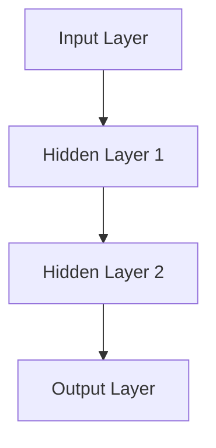

                 

### 软件发展历程中的AI大模型

#### 1.1 软件 1.0 与软件 2.0

软件 1.0 时代，其主要特征是功能性软件的普及。这一时期的软件主要以满足基本需求为主，例如操作系统、办公软件和基础应用等。这些软件的设计原则是以功能和性能为核心，开发者主要关注如何实现既定功能，而忽略了软件的智能化和自我学习能力。

然而，随着信息技术的飞速发展，数据量呈爆炸式增长，软件 1.0 的局限性逐渐显现。面对海量数据，传统软件的效率和决策能力受到了严重制约。因此，软件 2.0 应运而生。软件 2.0 时代，软件不仅具备基本功能，更重要的是具备自我学习与进化能力，能够通过学习用户行为和需求，不断提升自身性能和服务质量。

软件 2.0 的核心在于人工智能（AI），尤其是大模型的应用。大模型能够处理海量数据，挖掘潜在规律，为软件提供智能化的决策支持。与传统软件相比，软件 2.0 更具灵活性和适应性，能够更好地满足用户个性化需求。

#### 1.2 大模型在软件 2.0 中的核心地位

大模型在软件 2.0 中扮演着至关重要的角色。首先，大模型具备自我学习和进化能力，能够不断优化自身性能，提升服务质量。其次，大模型能够处理复杂数据，提取有效信息，为软件提供精准的决策支持。例如，在金融领域，大模型可以分析海量交易数据，预测市场走势；在医疗领域，大模型可以分析病患数据，提供精准的诊疗方案。

大模型的广泛应用，使得软件 2.0 能够实现从传统功能导向向智能化、数据驱动的转变。企业级应用开发也迎来了新的范式，从传统的数据处理向数据智能转变，从软件定制化向软件智能化转变。这不仅提升了软件的竞争力，也为企业带来了巨大的商业价值。

#### 1.3 企业级应用开发的新范式

在软件 2.0 时代，企业级应用开发面临诸多挑战。首先，数据量的急剧增长使得传统数据处理方法无法满足需求，需要采用更加智能化的数据处理技术。其次，用户需求的多样化要求软件具备更高的灵活性和适应性，传统软件的定制化开发模式已无法满足需求。

为了应对这些挑战，企业级应用开发逐渐转向数据智能和软件智能化的新范式。具体来说，主要体现在以下几个方面：

1. **从传统数据处理向数据智能转变**：企业开始重视数据的价值，通过大数据分析和人工智能技术，从海量数据中提取有用信息，为决策提供支持。例如，利用机器学习算法进行需求预测、库存管理和风险控制等。

2. **从软件定制化向软件智能化转变**：企业不再满足于提供单一的软件产品，而是通过智能化手段，实现软件与用户需求的深度结合。例如，通过用户行为分析和个性化推荐，提升用户体验和满意度。

3. **从单点应用到系统集成**：企业级应用不再局限于单一功能，而是通过系统集成，实现跨部门、跨系统的数据共享和业务协同。例如，通过企业资源计划（ERP）系统，实现企业内部业务流程的全面整合。

总之，软件 2.0 时代的企业级应用开发，正从传统模式向智能化、数据驱动的新模式转变。这为企业带来了巨大的机遇，也提出了更高的要求。企业需要充分利用人工智能技术，提升软件智能化水平，以满足不断变化的市场需求。

#### 1.4 总结

软件 2.0 时代的到来，标志着软件从功能性向智能化转变。大模型作为软件 2.0 的核心，为软件提供了自我学习和进化能力，提升了数据处理和分析能力。企业级应用开发也迎来了新范式，从传统的数据处理和软件定制化向数据智能和软件智能化转变。这为企业带来了巨大的机遇，但也提出了更高的要求。在接下来的内容中，我们将深入探讨大模型的技术基础和具体应用，进一步了解软件 2.0 的魅力。

---

### AI大模型技术基础

#### 2.1 深度学习与神经网络基础

深度学习是人工智能（AI）的一个重要分支，其核心思想是通过模拟人脑神经网络的结构和功能，实现对复杂数据的处理和模式识别。深度学习的基础是神经网络，特别是深度神经网络（DNN）。

##### 2.1.1 神经网络的基本结构

神经网络由三层主要部分组成：输入层、隐藏层和输出层。

1. **输入层（Input Layer）**：接收外部输入的数据，并将其传递到隐藏层。每个输入节点对应一个特征，例如图像中的像素值或文本中的单词。

2. **隐藏层（Hidden Layer）**：对输入数据进行处理，通过一系列复杂的非线性变换，提取数据中的特征和模式。隐藏层可以有一个或多个，层数越多，网络的深度越深。

3. **输出层（Output Layer）**：根据隐藏层处理后的数据，生成最终的输出结果。输出层的节点数和类型取决于具体的应用场景，例如分类问题中的概率分布或回归问题中的预测值。

神经网络的基本结构可以用以下 Mermaid 流程图表示：



##### 2.1.2 常见的深度学习架构

在深度学习中，常见的架构包括卷积神经网络（CNN）、循环神经网络（RNN）和生成对抗网络（GAN）等。

1. **卷积神经网络（CNN）**：CNN 是专门用于处理图像数据的深度学习模型。其主要特点是利用卷积层提取图像中的局部特征，并通过池化层降低数据维度，提高模型的泛化能力。

   CNN 的基本结构包括输入层、卷积层、池化层和全连接层。以下是一个简单的 CNN 架构 Mermaid 流程图：

   ```mermaid
   graph TD
   A[Input] --> B[Conv1]
   B --> C[ReLU]
   C --> D[Pooling1]
   D --> E[Conv2]
   E --> F[ReLU]
   F --> G[Pooling2]
   G --> H[Flatten]
   H --> I[FC1]
   I --> J[ReLU]
   J --> K[FC2]
   K --> L[Output]
   ```

2. **循环神经网络（RNN）**：RNN 是专门用于处理序列数据的深度学习模型，例如自然语言处理（NLP）和时间序列预测。RNN 通过循环结构保持长距离依赖信息，但存在梯度消失和梯度爆炸等问题。

   RNN 的基本结构包括输入层、隐藏层和输出层。以下是一个简单的 RNN 架构 Mermaid 流程图：

   ```mermaid
   graph TD
   A[Input t] --> B[Hidden h_t]
   B --> C[Output y_t]
   B --> D[Hidden h_{t+1}]
   ```

3. **生成对抗网络（GAN）**：GAN 是一种无监督学习模型，主要用于生成复杂数据。GAN 的核心思想是生成器和判别器的对抗训练，生成器试图生成逼真的数据，而判别器则尝试区分真实数据和生成数据。

   GAN 的基本结构包括生成器（Generator）和判别器（Discriminator）。以下是一个简单的 GAN 架构 Mermaid 流程图：

   ```mermaid
   graph TD
   A[Real Data] --> B[Discriminator D]
   B --> C[Generator G]
   C --> B
   ```

#### 2.2 自然语言处理技术概览

自然语言处理（NLP）是深度学习的一个重要应用领域，旨在使计算机能够理解、生成和处理人类语言。NLP 技术的核心在于将文本数据转换为计算机可处理的结构化数据，并从中提取有用信息。

##### 2.2.1 词嵌入技术

词嵌入（Word Embedding）是将词语转换为向量的过程，通过向量的距离关系来表示词语之间的语义关系。常见的词嵌入技术包括 Word2Vec、GloVe 和 Bert 等。

- **Word2Vec**：Word2Vec 是基于神经网络的词嵌入方法，通过训练词向量模型，使得语义相似的词语在向量空间中距离更近。Word2Vec 主要有两种训练方法：连续词袋（CBOW）和Skip-Gram。

  CBOW（Continuous Bag-of-Words）模型通过预测中心词周围的词语来训练词向量：

  $$ \text{CBOW} = \text{Average}(\text{Context}) \rightarrow \text{Predict}(\text{Center Word}) $$

  Skip-Gram 模型通过预测中心词来训练词向量：

  $$ \text{Skip-Gram} = \text{Predict}(\text{Center Word}) \rightarrow \text{Average}(\text{Context}) $$

- **GloVe**：GloVe（Global Vectors for Word Representation）是基于矩阵分解的方法，通过优化词向量和句子向量的内积，来表示词语之间的语义关系。

  GloVe 的优化目标为：

  $$ \min_{\mathbf{v}_w, \mathbf{v}_c} \sum_{w,c \in \text{corpus}} \left( \cos(\mathbf{v}_w, \mathbf{v}_c) - \log p(c|w) \right)^2 $$

- **Bert**：Bert（Bidirectional Encoder Representations from Transformers）是基于 Transformer 架构的预训练模型，通过双向编码器生成词向量。Bert 的优势在于能够捕捉词语的前后关系，提高语义表示的准确性。

  Bert 的预训练目标包括：

  1. **Masked Language Model（MLM）**：随机遮盖部分词语，模型需要预测这些遮盖的词语。
  2. **Next Sentence Prediction（NSP）**：预测两个句子是否在原文中连续出现。

##### 2.2.2 序列模型与注意力机制

序列模型（Sequence Model）是处理序列数据（如文本、语音、时间序列等）的深度学习模型。常见的序列模型包括循环神经网络（RNN）、长短时记忆网络（LSTM）和门控循环单元（GRU）等。

- **RNN**：RNN 通过循环结构保持长距离依赖信息，但存在梯度消失和梯度爆炸等问题。
  
  RNN 的基本结构为：

  $$ h_t = \text{sigmoid}(W_h \cdot [h_{t-1}, x_t] + b_h) $$
  $$ o_t = \text{sigmoid}(W_o \cdot h_t + b_o) $$

- **LSTM**：LSTM（Long-Short Term Memory）是 RNN 的一种改进，通过引入门控机制，有效地解决了梯度消失和梯度爆炸问题，并能够捕捉长距离依赖信息。

  LSTM 的基本结构为：

  $$ i_t = \text{sigmoid}(W_i \cdot [h_{t-1}, x_t] + b_i) $$
  $$ f_t = \text{sigmoid}(W_f \cdot [h_{t-1}, x_t] + b_f) $$
  $$ g_t = \tanh(W_g \cdot [h_{t-1}, x_t] + b_g) $$
  $$ o_t = \text{sigmoid}(W_o \cdot [h_{t-1}, x_t] + b_o) $$
  $$ h_t = o_t \cdot \tanh(W_h \cdot [h_{t-1}, x_t] + b_h) $$

- **GRU**：GRU（Gated Recurrent Unit）是 LSTM 的简化版本，通过引入更新门和控制门，减少了参数数量，计算效率更高。

  GRU 的基本结构为：

  $$ z_t = \text{sigmoid}(W_z \cdot [h_{t-1}, x_t] + b_z) $$
  $$ r_t = \text{sigmoid}(W_r \cdot [h_{t-1}, x_t] + b_r) $$
  $$ g_t = \tanh(W_g \cdot \text{sigmoid}(W_r \cdot [h_{t-1}, x_t] + b_g)) $$
  $$ h_t = (1 - z_t) \cdot h_{t-1} + z_t \cdot g_t $$

注意力机制（Attention Mechanism）是序列模型中的一种重要技术，通过动态调整模型对序列中每个元素的关注程度，提高模型的序列处理能力。

- **Softmax 注意力**：Softmax 注意力通过计算每个输入元素的权重，并将其加权和作为输出。其基本公式为：

  $$ a_t = \text{softmax}(\text{scores}) $$
  $$ \text{output} = \sum_{i} a_i \cdot x_i $$

- **加性注意力**：加性注意力通过计算输入序列和查询向量的加权和，再通过 tanh 函数进行非线性变换，得到注意力权重。其基本公式为：

  $$ h = \text{tanh}(W_h \cdot [Q, S]) $$
  $$ \text{output} = \text{softmax}(W_a \cdot h) \cdot S $$

##### 2.2.3 转换器架构详解

转换器架构（Transformer）是 NLP 领域的一种革命性模型，其核心思想是利用自注意力机制（Self-Attention）进行序列处理。Transformer 的基本结构包括编码器（Encoder）和解码器（Decoder）两部分。

- **编码器（Encoder）**：编码器负责将输入序列转换为序列嵌入向量，并输出一系列隐藏状态。

  编码器的结构为：

  $$ \text{Encoder} = \sum_{l} \text{LayerNorm}(\text{MultiHeadAttention}(W_1 \cdot \text{LayerNorm}(W_0 \cdot x) + W_2 \cdot \text{LayerNorm}(x)), W_3 \cdot \text{LayerNorm}(x)) + x $$

- **解码器（Decoder）**：解码器负责将编码器的输出解码为输出序列。

  解码器的结构为：

  $$ \text{Decoder} = \sum_{l} \text{LayerNorm}(\text{MaskedMultiHeadAttention}(W_1 \cdot \text{LayerNorm}(W_0 \cdot x) + W_2 \cdot \text{LayerNorm}(x)), W_3 \cdot \text{LayerNorm}(x)) + x $$
  $$ \text{Output} = \text{MaskedMultiHeadAttention}(W_1 \cdot \text{LayerNorm}(W_0 \cdot x) + W_2 \cdot \text{LayerNorm}(x)), W_3 \cdot \text{LayerNorm}(x), \text{Sequence Mask}) $$

转换器架构通过自注意力机制和多头注意力机制，实现了对序列数据的全局依赖建模，并在 NLP 领域取得了显著的性能提升。

#### 2.3 大规模预训练模型原理

大规模预训练模型（Large-scale Pre-trained Model）是当前 NLP 领域的重要研究方向，通过在大量无标签数据上进行预训练，使得模型具备较强的通用特征表示能力。大规模预训练模型的核心思想是自监督学习（Self-supervised Learning），即利用无标签数据进行学习。

##### 2.3.1 预训练的概念与意义

预训练（Pre-training）是指在大规模数据集上对神经网络模型进行训练，以获得通用特征表示。预训练的意义主要体现在以下几个方面：

1. **提高模型泛化能力**：通过在大规模数据集上预训练，模型能够学习到更多的通用特征，从而提高在未见数据上的表现，增强模型的泛化能力。
2. **减少标注数据需求**：预训练模型可以利用大量无标签数据，降低对标注数据的依赖，从而提高训练效率。
3. **提高模型性能**：预训练使得模型在特定任务上表现更优，特别是在 NLP 和图像识别等领域，预训练模型已取得了显著的效果。

##### 2.3.2 自监督学习方法

自监督学习（Self-supervised Learning）是一种利用无标签数据进行学习的方法，其核心思想是通过利用数据本身的结构，为模型提供监督信号。常见的自监督学习方法包括：

1. **掩码语言模型（Masked Language Model，MLM）**：MLM 是 Bert 模型的主要预训练方法，通过随机遮盖输入文本中的部分词语，模型需要预测这些遮盖的词语。MLM 的目标是最小化预测词语与实际词语之间的损失。

   $$ \text{Loss} = \sum_{w \in \text{masked words}} \log P(w | \text{context}) $$

2. **下一句预测（Next Sentence Prediction，NSP）**：NSP 是通过预测两个句子是否在原文中连续出现，来增强模型对上下文关系的理解。NSP 的目标是最小化预测错误率。

   $$ \text{Loss} = \sum_{(s_1, s_2) \in \text{pairs}} \log P(s_2 | s_1) $$

3. **掩码图像区域（Masked Image Regions，MIR）**：MIR 是在图像预训练中的一种自监督学习方法，通过随机遮盖图像的部分区域，模型需要预测这些区域的类别。

   $$ \text{Loss} = \sum_{r \in \text{masked regions}} \log P(c_r | \text{context}) $$

##### 2.3.3 迁移学习与微调技术

迁移学习（Transfer Learning）是指将一个任务在源域上训练得到的模型，应用于另一个任务或新域上的学习过程。迁移学习的核心思想是利用已有模型知识，提高新任务或新域上的学习效果。

微调（Fine-tuning）是迁移学习的一种常见方法，通过在预训练模型的基础上，针对特定任务进行少量调整，以适应新任务或新域。微调的目标是最小化新任务上的损失函数。

   $$ \text{Loss}_{\text{fine-tune}} = \frac{1}{N} \sum_{n=1}^{N} \log P(y_n | \theta) $$

其中，$N$ 是训练样本数量，$y_n$ 是实际标签，$P(y_n | \theta)$ 是模型在给定参数 $\theta$ 下的预测概率。

#### 2.4 总结

AI 大模型技术基础涵盖了深度学习与神经网络、自然语言处理、预训练模型、迁移学习和微调技术等多个方面。通过深度学习与神经网络，模型能够实现对复杂数据的处理和模式识别；自然语言处理技术使模型能够理解和生成人类语言；预训练模型通过自监督学习方法，提高了模型的泛化能力和性能；迁移学习和微调技术则使模型能够快速适应新任务和新域。在接下来的内容中，我们将进一步探讨 AI 大模型在企业中的应用，了解其在实际场景中的价值与挑战。

---

### AI大模型在企业中的应用

#### 3.1 AI大模型在企业决策中的应用

企业决策的复杂性越来越高，需要处理大量的数据和信息。AI大模型能够通过数据分析和预测，为企业提供更加精准和高效的决策支持。以下是一些具体的应用场景：

##### 3.1.1 数据分析

数据分析是企业决策的重要环节。AI大模型可以利用其强大的数据处理能力，从海量数据中提取有价值的信息。例如，在金融行业，大模型可以分析历史交易数据，挖掘市场趋势和投资机会；在零售行业，大模型可以分析销售数据，预测商品需求和库存水平。

具体应用场景包括：

- **市场趋势预测**：通过分析市场数据，预测未来市场走势，帮助企业制定营销策略。
- **客户行为分析**：通过分析客户行为数据，了解客户需求和行为习惯，优化产品和服务。
- **风险控制**：通过分析金融数据，预测潜在风险，为企业提供风险预警。

##### 3.1.2 需求预测

需求预测是企业在生产和供应链管理中的重要环节。AI大模型可以利用其强大的预测能力，帮助企业准确预测需求，优化生产和库存管理。

具体应用场景包括：

- **销售预测**：通过分析历史销售数据，预测未来销售趋势，优化生产和库存计划。
- **库存管理**：通过分析库存数据，预测库存水平，提前进行补货和调整，避免库存过剩或短缺。
- **供应链优化**：通过分析供应链数据，优化供应链流程，提高供应链效率。

##### 3.1.3 预测性维护

预测性维护是利用AI大模型对设备进行预测性维护，以减少设备故障和停机时间，提高设备利用率。通过分析设备运行数据，大模型可以预测设备可能出现的故障，并提供预防措施。

具体应用场景包括：

- **设备故障预测**：通过分析设备运行数据，预测设备可能出现的故障，提前进行维修和保养。
- **设备性能优化**：通过分析设备运行数据，优化设备性能，提高设备利用率和生产效率。

#### 3.2 AI大模型在产品推荐系统中的应用

产品推荐系统是现代电商平台和零售业的重要组成部分。AI大模型可以通过用户行为分析和数据挖掘，提供精准的产品推荐，提高用户满意度和转化率。

##### 3.2.1 用户行为分析

用户行为分析是产品推荐系统的基础。AI大模型可以通过分析用户在网站上的行为数据，包括浏览记录、购买历史和评价等，了解用户的需求和偏好。

具体应用场景包括：

- **个性化推荐**：根据用户行为数据，为用户推荐个性化的商品和内容，提高用户满意度。
- **热点推荐**：分析用户行为数据，发现热点和趋势，为用户提供热门商品和内容。

##### 3.2.2 推荐算法

AI大模型可以通过多种推荐算法，为用户推荐合适的商品。常见的推荐算法包括基于内容的推荐、基于协同过滤的推荐和基于深度学习的推荐等。

具体应用场景包括：

- **基于内容的推荐**：根据商品的属性和标签，为用户推荐与其兴趣相关的商品。
- **基于协同过滤的推荐**：通过分析用户和商品之间的交互记录，为用户推荐与过去行为相似的物品。
- **基于深度学习的推荐**：利用深度学习模型，从海量数据中提取用户和商品的潜在特征，为用户推荐合适的商品。

#### 3.3 AI大模型在智能客服中的应用

智能客服是现代企业提高客户服务水平的重要手段。AI大模型可以通过自然语言处理和对话管理，提供高效、智能的客服服务。

##### 3.3.1 自然语言处理

自然语言处理（NLP）是智能客服的核心技术。AI大模型可以利用其强大的自然语言处理能力，理解和生成自然语言，实现人机对话。

具体应用场景包括：

- **语义理解**：通过NLP技术，理解用户的查询意图和问题内容，提供准确的回答。
- **文本生成**：利用NLP技术，生成自然流畅的文本，实现人机对话。

##### 3.3.2 对话管理

对话管理是智能客服的关键环节。AI大模型可以通过对话管理技术，与用户进行有效的沟通，提供高质量的客服服务。

具体应用场景包括：

- **多轮对话**：通过多轮对话，深入了解用户的问题和需求，提供针对性的解决方案。
- **情绪识别**：通过情绪识别技术，分析用户的情绪状态，提供相应的情感化服务。

##### 3.3.3 情感分析

情感分析是智能客服的重要功能。AI大模型可以通过情感分析技术，识别用户的情感状态，提供个性化的服务。

具体应用场景包括：

- **情绪识别**：通过分析用户的语言和语气，识别用户的情绪状态，提供针对性的安慰和帮助。
- **情感化服务**：根据用户的情感状态，提供情感化的回复和解决方案，提高用户满意度。

#### 3.4 总结

AI大模型在企业决策、产品推荐和智能客服等领域的应用，显著提升了企业的运营效率和服务质量。通过数据分析、需求预测和预测性维护，企业能够更加精准地制定决策，优化运营流程。通过用户行为分析和推荐算法，企业能够提供个性化、精准的产品推荐，提高用户满意度和转化率。通过自然语言处理、对话管理和情感分析，智能客服能够提供高效、智能的客服服务，提升用户体验。在未来的发展中，AI大模型将继续为企业带来更多的价值。

---

### AI大模型的安全性与伦理

随着AI大模型在企业级应用中的广泛应用，其安全性和伦理问题也日益凸显。AI大模型的安全性和伦理问题不仅关系到个人隐私和企业利益，也对社会公平和人类价值观产生深远影响。在本节中，我们将探讨AI大模型可能面临的安全挑战和伦理问题，并提出相应的解决方案。

#### 4.1 AI大模型的安全挑战

##### 4.1.1 模型泄露

AI大模型在训练过程中会吸收和处理大量敏感数据，包括个人隐私、企业机密等。如果模型泄露，这些敏感信息可能会被不法分子利用，造成严重后果。例如，医疗数据泄露可能导致患者隐私被侵犯，商业数据泄露可能导致企业遭受经济损失。

解决方案：

- **数据加密**：对敏感数据进行加密处理，确保数据在传输和存储过程中不被窃取。
- **访问控制**：实施严格的访问控制策略，确保只有授权人员才能访问敏感数据。
- **安全审计**：定期进行安全审计，及时发现和修复潜在的安全漏洞。

##### 4.1.2 恶意攻击

AI大模型可能受到恶意攻击，导致模型性能下降、决策错误甚至完全失效。恶意攻击包括模型注入、对抗攻击等。例如，通过对抗攻击，攻击者可以故意输入干扰数据，使模型输出错误的预测结果。

解决方案：

- **防御对抗攻击**：通过增加模型的鲁棒性，降低对抗攻击的影响。例如，使用对抗训练方法增强模型的抗攻击能力。
- **实时监控**：建立实时监控系统，及时发现和应对恶意攻击。
- **安全协议**：制定安全协议，确保数据传输和存储过程中的安全性。

##### 4.1.3 模型偏差

AI大模型在训练过程中可能会出现模型偏差，导致决策结果不公平或不准确。例如，如果训练数据存在偏差，模型可能会学习到这些偏差，从而在决策时产生歧视性结果。

解决方案：

- **公平性评估**：对模型进行公平性评估，确保决策结果不会对特定群体产生不公平影响。
- **多样性训练**：通过引入多样性训练数据，降低模型偏差，提高决策的公平性。
- **透明性设计**：提高模型设计和训练过程的透明度，使决策过程更加公正和可信。

#### 4.2 AI大模型的伦理问题

##### 4.2.1 数据隐私

AI大模型在处理和分析数据时，可能会涉及个人隐私信息。如何保护用户数据隐私，是AI大模型面临的重要伦理问题。

解决方案：

- **隐私保护技术**：采用隐私保护技术，如差分隐私、同态加密等，确保数据在处理过程中不被泄露。
- **数据匿名化**：对敏感数据进行匿名化处理，降低隐私泄露风险。
- **用户同意**：在收集和使用用户数据时，确保用户知情并同意，提高数据使用的透明度。

##### 4.2.2 决策公正性

AI大模型在决策过程中，可能会出现偏见和歧视。如何确保AI大模型决策的公正性，是另一个重要伦理问题。

解决方案：

- **算法透明性**：提高算法的透明性，使决策过程更加公正和可信。
- **公平性评估**：定期进行公平性评估，确保模型决策不会对特定群体产生不公平影响。
- **伦理审查**：建立伦理审查机制，对AI大模型的应用进行评估，确保其符合伦理标准。

##### 4.2.3 责任归属

在AI大模型应用过程中，如何确定责任归属，是一个复杂的问题。当AI大模型出现决策错误或造成损失时，如何界定责任，需要法律和伦理的明确界定。

解决方案：

- **责任界定法规**：制定明确的法律法规，界定AI大模型的责任归属。
- **多方责任分担**：在AI大模型应用过程中，建立多方责任分担机制，确保各方承担相应的责任。
- **责任保险**：鼓励企业购买责任保险，以减轻因AI大模型错误决策造成的损失。

#### 4.3 总结

AI大模型的安全性和伦理问题，是企业级应用中不可忽视的重要问题。通过数据加密、访问控制和安全审计等技术手段，可以保护AI大模型的安全；通过隐私保护技术、公平性评估和伦理审查等机制，可以确保AI大模型的应用符合伦理标准。在未来的发展中，我们需要不断完善相关法律法规和技术手段，确保AI大模型的安全性和伦理合规，为企业和社会创造更多价值。

---

### AI大模型开发实践

#### 5.1 开发环境搭建

搭建一个高效、稳定的AI大模型开发环境，是进行项目实战的前提。以下是一些关键步骤和注意事项。

##### 5.1.1 深度学习框架选择

目前市面上常用的深度学习框架包括 TensorFlow、PyTorch 和 JAX 等。选择合适的框架，对于开发效率和模型性能都有重要影响。

- **TensorFlow**：由 Google 开发，具有强大的社区支持和丰富的预训练模型。适用于大规模分布式训练和实时部署。
  
  ```python
  import tensorflow as tf
  tf.__version__
  ```

- **PyTorch**：由 Facebook 开发，以动态计算图和易用性著称。适用于快速原型开发和实验。

  ```python
  import torch
  torch.__version__
  ```

- **JAX**：由 Google 开发，支持自动微分和硬件加速。适用于复杂模型和高性能计算。

  ```python
  import jax
  jax.__version__
  ```

##### 5.1.2 硬件配置

深度学习任务通常需要强大的计算能力，以下是一些硬件配置建议：

- **GPU**：适用于大规模模型训练和推理，特别是深度学习和计算机视觉任务。NVIDIA GPU，如 RTX 3080、RTX 3090 等，是常用的选择。
- **TPU**：专为深度学习任务设计，具有高效的浮点运算能力。适用于大规模分布式训练。
- **分布式计算**：对于大规模数据集和模型，使用分布式计算可以提高训练效率。Hadoop、Spark 等分布式计算框架，以及 TensorFlow 和 PyTorch 的分布式训练支持，都是常用的解决方案。

##### 5.1.3 开发环境搭建指南

以下是使用 TensorFlow 搭建开发环境的步骤：

1. **安装 TensorFlow**：

   ```bash
   pip install tensorflow
   ```

2. **安装 GPU 驱动程序**：确保 GPU 正常工作，需要安装相应的 GPU 驱动程序。

3. **验证安装**：

   ```python
   import tensorflow as tf
   print(tf.test.is_built())
   print(tf.test.is_gpu_available())
   ```

#### 5.2 代码实战

以下是一个简单的AI大模型训练和评估的代码示例，使用 TensorFlow 框架。

##### 5.2.1 数据预处理

数据预处理是深度学习项目的重要环节。以下是一个数据预处理的伪代码示例：

```python
# 导入必要的库
import tensorflow as tf
from tensorflow.keras.preprocessing.image import ImageDataGenerator

# 加载数据集
train_datagen = ImageDataGenerator(
    rescale=1./255,
    shear_range=0.2,
    zoom_range=0.2,
    horizontal_flip=True)

test_datagen = ImageDataGenerator(rescale=1./255)

train_generator = train_datagen.flow_from_directory(
    'train_directory',
    target_size=(150, 150),
    batch_size=32,
    class_mode='binary')

validation_generator = test_datagen.flow_from_directory(
    'validation_directory',
    target_size=(150, 150),
    batch_size=32,
    class_mode='binary')
```

##### 5.2.2 模型训练

以下是一个简单的 CNN 模型训练伪代码示例：

```python
# 构建模型
model = tf.keras.models.Sequential([
    tf.keras.layers.Conv2D(32, (3, 3), activation='relu', input_shape=(150, 150, 3)),
    tf.keras.layers.MaxPooling2D(2, 2),
    tf.keras.layers.Conv2D(64, (3, 3), activation='relu'),
    tf.keras.layers.MaxPooling2D(2, 2),
    tf.keras.layers.Conv2D(128, (3, 3), activation='relu'),
    tf.keras.layers.MaxPooling2D(2, 2),
    tf.keras.layers.Conv2D(128, (3, 3), activation='relu'),
    tf.keras.layers.MaxPooling2D(2, 2),
    tf.keras.layers.Flatten(),
    tf.keras.layers.Dense(512, activation='relu'),
    tf.keras.layers.Dense(1, activation='sigmoid')
])

# 编译模型
model.compile(optimizer='adam',
              loss='binary_crossentropy',
              metrics=['accuracy'])

# 训练模型
model.fit(
    train_generator,
    epochs=10,
    validation_data=validation_generator)
```

##### 5.2.3 模型评估

以下是一个简单的模型评估伪代码示例：

```python
# 评估模型
loss, accuracy = model.evaluate(validation_generator)
print(f'Validation Loss: {loss}')
print(f'Validation Accuracy: {accuracy}')
```

##### 5.2.4 代码解读与分析

在上面的代码中，我们首先进行了数据预处理，包括数据增强和生成器（Generator）的创建。数据增强（ImageDataGenerator）是 TensorFlow 提供的一种方便的数据预处理工具，可以自动进行缩放、裁剪、翻转等操作，提高模型的泛化能力。

接下来，我们构建了一个简单的 CNN 模型，包括多个卷积层和池化层，以及全连接层。卷积层用于提取图像特征，池化层用于降低数据维度和减少过拟合。最后，全连接层用于分类。

模型编译阶段，我们指定了优化器（adam）、损失函数（binary_crossentropy）和评估指标（accuracy）。训练阶段，我们使用训练生成器进行模型训练，并指定了训练轮数（epochs）和验证数据。

最后，我们使用验证生成器评估模型的性能，打印出验证损失和准确率。

#### 5.3 案例分析

以下是一个电商行业中的商品推荐系统案例。

##### 5.3.1 项目背景

某电商平台希望为其用户推荐个性化的商品，提高用户满意度和转化率。为了实现这一目标，他们决定利用 AI 大模型开发一个商品推荐系统。

##### 5.3.2 数据集

项目使用的数据集包括用户的浏览记录、购买历史和商品信息。数据集包含了大量的用户行为数据和商品属性信息，为构建推荐系统提供了丰富的数据支持。

##### 5.3.3 模型设计

推荐系统采用基于深度学习的协同过滤（Collaborative Filtering）方法。模型设计主要包括用户嵌入（User Embedding）和商品嵌入（Item Embedding）两部分。

1. **用户嵌入**：将用户特征转换为向量表示，用于计算用户之间的相似度。
2. **商品嵌入**：将商品特征转换为向量表示，用于计算商品之间的相似度。
3. **协同过滤**：通过计算用户和商品之间的相似度，预测用户对商品的喜好程度。

##### 5.3.4 模型训练与评估

1. **训练数据集**：将数据集划分为训练集和验证集，用于模型训练和评估。
2. **模型训练**：使用训练集对模型进行训练，并调整模型参数，以提高预测性能。
3. **模型评估**：使用验证集对模型进行评估，计算准确率、召回率等指标，以评估模型性能。

##### 5.3.5 模型部署

训练完成后，将模型部署到线上环境，为用户提供实时推荐服务。同时，通过在线监控和反馈机制，不断优化模型性能，提高推荐质量。

#### 5.4 总结

AI 大模型开发实践包括开发环境搭建、代码实战、案例分析和模型部署等多个环节。通过搭建稳定、高效的开发环境，我们可以利用深度学习框架构建和训练复杂的模型。在实际项目中，通过数据预处理、模型设计和训练与评估，我们可以实现个性化推荐、智能客服等应用。在未来的发展中，我们需要不断探索和优化 AI 大模型的应用，为企业和个人创造更多价值。

---

### 未来展望

随着AI大模型技术的不断进步，其在各行各业中的应用前景愈发广阔。然而，也面临着一系列挑战，需要我们深入思考并积极应对。

#### 6.1 AI大模型发展趋势

##### 6.1.1 智能化与通用化

未来，AI大模型将朝着更加智能化和通用化的方向发展。一方面，通过不断优化算法和模型结构，AI大模型将能够处理更加复杂的任务，如自然语言理解、图像识别和复杂决策等。另一方面，AI大模型将具备更强的通用性，能够适应不同的应用场景，从而降低跨领域的应用门槛。

##### 6.1.2 小模型与大模型结合

随着AI大模型在资源需求、计算成本和存储空间方面的挑战，小模型与大模型结合将成为未来发展的一个重要方向。小模型具有较低的计算成本和更快的推理速度，适用于实时应用和边缘计算。而大模型则具备更强的学习和泛化能力，适用于复杂任务和高精度要求。通过将两者结合，可以在保证性能的前提下，实现资源的优化和效率的提升。

##### 6.1.3 多模态数据处理

未来的AI大模型将能够处理多种类型的数据，如文本、图像、音频和视频等。通过多模态数据处理，AI大模型可以更好地理解和分析复杂信息，从而提升应用效果。例如，在医疗领域，通过结合患者的病历、影像和基因数据，AI大模型可以提供更加精准的诊疗建议。

#### 6.2 AI大模型面临的挑战

##### 6.2.1 计算能力

AI大模型的训练和推理通常需要大量的计算资源，这对计算能力提出了严峻挑战。为了满足AI大模型的计算需求，需要不断推进硬件技术的发展，如GPU、TPU和量子计算等。同时，也需要探索分布式计算和云计算等解决方案，以提升计算效率和降低成本。

##### 6.2.2 数据隐私

AI大模型在处理和分析数据时，可能会涉及大量的敏感信息，如个人隐私、商业机密等。如何保护数据隐私，防止数据泄露和滥用，是一个重要挑战。未来，需要制定更加严格的数据隐私保护法规和技术标准，同时探索隐私计算和联邦学习等新型技术，以实现数据隐私保护和利用的平衡。

##### 6.2.3 伦理问题

AI大模型的应用涉及多个方面，包括算法公平性、透明性和责任归属等。如何确保AI大模型的应用符合伦理标准，避免歧视和偏见，是一个重要挑战。未来，需要建立完善的伦理审查机制，确保AI大模型的设计、开发和应用过程中，充分考虑社会伦理和道德问题。

#### 6.3 总结

未来，AI大模型将在智能化、通用化、多模态数据处理等方面取得重要突破，为各行各业带来前所未有的变革。然而，也面临着计算能力、数据隐私和伦理问题等挑战。只有通过技术创新、政策法规和社会共识，才能实现AI大模型的可持续发展，为人类社会创造更多价值。

---

### 附录

#### 附录 A: AI 大模型开发工具与资源

以下是进行 AI 大模型开发的常用工具和资源：

1. **深度学习框架**：

   - TensorFlow：[官网](https://www.tensorflow.org/)
   - PyTorch：[官网](https://pytorch.org/)
   - JAX：[官网](https://jax.readthedocs.io/)

2. **开发环境搭建指南**：

   - TensorFlow 搭建环境：[官方文档](https://www.tensorflow.org/install)
   - PyTorch 搭建环境：[官方文档](https://pytorch.org/get-started/locally/)
   - JAX 搭建环境：[官方文档](https://jax.readthedocs.io/en/latest/install.html)

3. **实用代码库和资源链接**：

   - Hugging Face：[官网](https://huggingface.co/)
   - FastAI：[官网](https://fast.ai/)
   - Keras：[官方文档](https://keras.io/)

#### 附录 B: 相关文献与资料

以下是关于 AI 大模型的经典文献和实用资料：

1. **经典论文**：

   - "A Theoretically Grounded Application of Dropout in Recurrent Neural Networks" by Yarin Gal and Zoubin Ghahramani
   - "An Overview of Gradient Descent Optimization Algorithms" by S. S. Keerthi and S. S. Rajaraman
   - "Bert: Pre-training of Deep Bidirectional Transformers for Language Understanding" by Jacob Devlin et al.

2. **书籍推荐**：

   - 《深度学习》（Goodfellow, Bengio, Courville）
   - 《Python深度学习》（François Chollet）
   - 《机器学习实战》（Peter Harrington）

3. **学术论文和报告**：

   - ArXiv：[官网](https://arxiv.org/)
   - 知乎专栏：[深度学习](https://zhuanlan.zhihu.com/ai)
   - JAX 论坛：[官网](https://jax.readthedocs.io/en/latest/notebooks/index.html)

4. **行业报告和市场趋势分析**：

   - CB Insights：[官网](https://www.cbinsights.com/)
   - McKinsey：[官网](https://www.mckinsey.com/)
   - Gartner：[官网](https://www.gartner.com/)

通过这些工具和资源，开发者可以更好地掌握 AI 大模型的技术和应用，为实际项目提供有力支持。

---

### 作者信息

**作者：AI天才研究院/AI Genius Institute & 禅与计算机程序设计艺术 /Zen And The Art of Computer Programming**

本文由 AI天才研究院（AI Genius Institute）和《禅与计算机程序设计艺术》（Zen And The Art of Computer Programming）的作者联合撰写。AI天才研究院专注于人工智能领域的研究和创新，致力于推动人工智能技术的发展和应用。而《禅与计算机程序设计艺术》的作者则以其深刻的技术见解和创新的编程理念，为全球计算机科学界贡献了重要的思想和方法。本文旨在深入探讨软件 2.0 时代 AI 大模型的技术基础、应用实践和未来展望，为读者提供全面的技术指导和应用思路。希望本文能够对您在 AI 大模型领域的研究和实践中带来启发和帮助。如果您有任何疑问或建议，欢迎随时联系我们。让我们共同探索人工智能的无限可能，为构建智能未来贡献力量。

