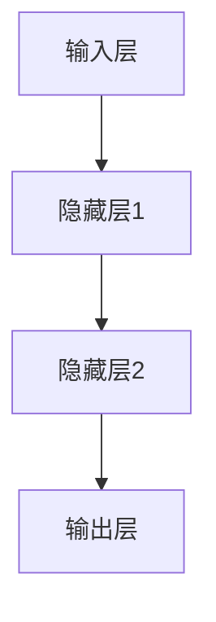

                 

# 《软件2.0的哲学思考：人工智能的本质》

> 关键词：软件2.0、人工智能、大模型、深度学习、伦理、应用

> 摘要：本文将探讨软件2.0时代的AI大模型本质，分析其哲学思考。我们将从软件2.0的概念出发，深入探讨AI大模型的基础知识、技术原理、应用案例、开发实践以及未来展望，旨在为读者提供一个全面、深入的AI大模型学习资源。

### 目录

1. 第一部分：软件2.0时代的AI大模型基础
   1.1. 软件2.0与AI大模型概述
   1.2. AI大模型技术基础
   1.3. AI大模型的数学原理
   1.4. AI大模型应用案例解析
   1.5. AI大模型在产业中的应用
2. 第二部分：AI大模型开发与优化实践
   2.1. AI大模型开发环境搭建
   2.2. AI大模型训练与调试
   2.3. AI大模型部署与维护
3. 第三部分：未来展望与挑战
   3.1. AI大模型的未来发展趋势
   3.2. AI大模型的伦理与法律问题
   3.3. AI大模型在全球的影响
4. 附录
   4.1. AI大模型开发工具与资源

---

## 第一部分：软件2.0时代的AI大模型基础

### 1.1 软件2.0与AI大模型概述

#### 1.1.1 从软件1.0到软件2.0的演进

软件1.0时代是计算机软件的初期发展阶段，以操作系统和应用程序为主要内容，软件的主要功能是处理数据和执行命令。而随着互联网的普及和大数据时代的到来，软件1.0逐渐演变为软件2.0。

软件2.0时代的到来，标志着软件从“机械化”向“智能化”的转型。在这一阶段，软件的核心不再是简单的数据处理和命令执行，而是通过互联网实现数据的高效整合和智能处理。这使得软件的应用范围得到了极大的扩展，从传统的个人电脑和服务器，扩展到移动设备、物联网设备、智能汽车等。

#### 1.1.2 大模型在软件2.0中的核心地位

在软件2.0时代，AI大模型成为了软件开发的核心驱动力。大模型，尤其是深度学习模型，能够通过大量数据的学习，实现人类级别的智能能力。这使得软件不再局限于执行预先设定的任务，而是能够自主地学习、适应和进化。

AI大模型在软件2.0中的应用，不仅改变了软件的开发方式，也改变了软件的运行模式。软件不再是一个静态的产品，而是一个动态的、不断进化的系统。这种变化，使得软件2.0时代的软件具备了更高的灵活性、适应性和智能化水平。

#### 1.1.3 企业级应用开发的新范式

在软件2.0时代，企业级应用开发也迎来了新的范式。传统的软件开发模式，通常是先进行需求分析，然后设计系统架构，最后进行开发。而软件2.0时代的开发模式，更加注重数据驱动和智能化的特点。

企业级应用开发的新范式，包括以下几个关键步骤：

1. **数据收集与整合**：通过多种方式收集和整合数据，为AI大模型的学习提供丰富的数据资源。
2. **模型设计与训练**：基于收集到的数据，设计并训练AI大模型，使其具备解决实际问题的能力。
3. **系统集成与部署**：将AI大模型集成到企业级应用中，实现智能化功能。
4. **持续优化与迭代**：根据实际应用情况，不断优化和迭代AI大模型，提高其性能和效果。

这种开发范式，使得企业能够更快地响应市场变化，实现业务智能化，提升企业竞争力。

#### 1.1.4 AI大模型的定义与特点

AI大模型，是指具有大规模参数、能够处理大量数据并实现高精度预测或分类的深度学习模型。与传统的AI模型相比，AI大模型具有以下几个显著特点：

1. **参数规模巨大**：AI大模型通常具有数亿甚至数十亿个参数，这使得模型能够捕捉到数据中的细微特征。
2. **数据处理能力强**：AI大模型能够处理海量数据，实现高效的数据分析。
3. **预测精度高**：通过大规模训练，AI大模型能够实现高精度的预测或分类。
4. **自适应性强**：AI大模型能够根据新的数据和环境变化，不断优化和调整自身。

#### 1.1.5 AI大模型与传统AI的区别

传统AI模型，通常是指基于规则、决策树、支持向量机等算法的模型。与AI大模型相比，传统AI模型具有以下几个主要区别：

1. **算法复杂度**：传统AI模型通常算法简单，易于理解和实现。而AI大模型通常采用深度学习算法，算法复杂度较高。
2. **数据处理能力**：传统AI模型通常难以处理大规模数据，而AI大模型能够高效地处理海量数据。
3. **预测精度**：传统AI模型在预测精度方面通常较低，而AI大模型通过大规模训练，能够实现高精度的预测。
4. **自适应能力**：传统AI模型通常难以适应新的环境和数据变化，而AI大模型通过不断学习和优化，能够实现良好的自适应能力。

#### 1.1.6 主流AI大模型简介

在AI大模型领域，以下是一些主流的大模型：

1. **GPT系列模型**：GPT（Generative Pre-trained Transformer）系列模型，是由OpenAI开发的自然语言处理模型。GPT-3是目前最大的自然语言处理模型，具有1750亿个参数，能够实现文本生成、问答、翻译等多种功能。
2. **BERT及其变体**：BERT（Bidirectional Encoder Representations from Transformers）是由Google开发的自然语言处理模型。BERT通过双向Transformer结构，能够捕捉到文本中的上下文信息，实现高精度的语义理解。
3. **其他知名大模型**：除了GPT系列和BERT，还有诸如Transformer、XLNet、DeBERTa等大模型，它们在各自的领域内取得了显著的成果。

#### 1.1.7 AI大模型在企业中的应用前景

AI大模型在企业中的应用前景非常广阔，以下是一些潜在的应用领域：

1. **客户服务**：通过AI大模型，企业可以实现智能客服，提供高效、精准的客户服务。
2. **市场营销**：AI大模型可以帮助企业实现精准营销，提高营销效果。
3. **供应链管理**：AI大模型可以优化供应链管理，提高物流效率和库存管理能力。
4. **风险管理**：AI大模型可以帮助企业预测风险，降低风险损失。
5. **数据分析**：AI大模型可以高效地处理和分析海量数据，为决策提供有力支持。

#### 1.1.8 企业采用AI大模型的优势

企业采用AI大模型具有以下几个主要优势：

1. **提高生产效率**：AI大模型能够自动化处理重复性、繁琐的任务，提高生产效率。
2. **降低运营成本**：AI大模型可以通过优化流程、减少人力成本，降低运营成本。
3. **提升决策质量**：AI大模型可以通过数据分析和预测，为决策提供科学依据，提升决策质量。
4. **增强竞争力**：通过AI大模型，企业可以提供更优质的产品和服务，增强竞争力。
5. **拓展业务领域**：AI大模型可以帮助企业探索新的业务领域，拓展业务范围。

#### 1.1.9 AI大模型应用的挑战与机遇

尽管AI大模型在企业中具有广泛的应用前景和优势，但在实际应用过程中也面临着一些挑战：

1. **数据质量和隐私**：AI大模型需要大量高质量的数据进行训练，如何保证数据质量和隐私成为一个重要问题。
2. **计算资源消耗**：AI大模型通常需要大量的计算资源进行训练和推理，如何有效利用计算资源成为挑战。
3. **模型解释性**：AI大模型的黑箱特性使得其解释性较差，如何提高模型的解释性是一个重要问题。
4. **伦理和法律法规**：AI大模型的应用可能引发伦理和法律问题，如何制定相关的伦理和法律框架成为挑战。

然而，这些挑战也伴随着机遇：

1. **技术创新**：面对挑战，技术创新将推动AI大模型的发展。
2. **市场拓展**：AI大模型的应用可以拓展市场，为企业带来新的增长点。
3. **产业升级**：AI大模型可以促进产业升级，推动经济高质量发展。

### 1.2 AI大模型技术基础

AI大模型的技术基础主要包括深度学习、神经网络、自然语言处理等。以下是对这些技术基础的简要介绍。

#### 1.2.1 深度学习与神经网络基础

深度学习（Deep Learning）是AI大模型的核心技术之一。它是一种基于人工神经网络（Artificial Neural Networks）的算法，通过模拟人脑神经元之间的连接和交互，实现数据的自动学习和特征提取。

深度学习的基本结构是神经网络，它由多个层次组成，包括输入层、隐藏层和输出层。每一层都对输入数据进行处理，并传递到下一层，最终生成输出结果。

神经网络的基本结构如图1-1所示：



深度学习的核心在于如何设计有效的神经网络结构，包括选择合适的网络层数、激活函数、损失函数和优化算法等。

#### 1.2.2 常见的深度学习架构

在深度学习领域，有许多经典的架构，包括卷积神经网络（Convolutional Neural Networks，CNN）、循环神经网络（Recurrent Neural Networks，RNN）、长短时记忆网络（Long Short-Term Memory，LSTM）等。

1. **卷积神经网络（CNN）**：CNN是一种专门用于处理图像数据的神经网络，它通过卷积操作和池化操作，提取图像的特征。CNN在计算机视觉领域取得了显著成果，被广泛应用于图像分类、目标检测、图像分割等任务。

2. **循环神经网络（RNN）**：RNN是一种专门用于处理序列数据的神经网络，它通过循环结构，对序列数据进行处理和记忆。RNN在自然语言处理领域取得了很好的效果，被广泛应用于文本分类、语音识别、机器翻译等任务。

3. **长短时记忆网络（LSTM）**：LSTM是一种改进的RNN结构，它通过引入门控机制，解决了RNN的梯度消失和梯度爆炸问题，提高了模型的训练效果。LSTM在时间序列预测、语音识别等领域取得了很好的效果。

#### 1.2.3 深度学习优化算法

在深度学习训练过程中，优化算法扮演着重要的角色。优化算法的主要任务是调整神经网络中的参数，以最小化损失函数。

常见的优化算法包括：

1. **随机梯度下降（SGD）**：SGD是一种基于梯度的优化算法，它通过计算损失函数关于参数的梯度，更新参数的值。

   伪代码如下：

   ```python
   for epoch in range(num_epochs):
       for x, y in dataset:
           gradients = compute_gradients(model, x, y)
           update_params(model, gradients)
   ```

2. **Adam优化器**：Adam是一种自适应优化算法，它通过计算一阶矩估计和二阶矩估计，自适应地调整学习率。

   伪代码如下：

   ```python
   for epoch in range(num_epochs):
       for x, y in dataset:
           gradients = compute_gradients(model, x, y)
           m = beta1 * m + (1 - beta1) * gradients
           v = beta2 * v + (1 - beta2) * (gradients ** 2)
           update_params(model, m / (sqrt(v) + epsilon))
   ```

#### 1.2.4 自然语言处理技术概览

自然语言处理（Natural Language Processing，NLP）是深度学习的重要应用领域之一。NLP的主要任务是使计算机能够理解和处理人类自然语言。

NLP的关键技术包括：

1. **词嵌入（Word Embedding）**：词嵌入是一种将词汇映射到高维空间的技术，它能够捕捉词汇的语义信息。

   常见的词嵌入技术包括Word2Vec、GloVe等。

2. **序列模型与注意力机制**：序列模型是一种用于处理序列数据的神经网络，它能够捕捉序列中的时间关系。注意力机制是一种用于序列模型的改进方法，它能够关注序列中的重要部分，提高模型的性能。

   常见的序列模型包括RNN、LSTM等。注意力机制如图1-2所示：

   ```mermaid
   graph TD
   A[输入序列] --> B[注意力权重]
   B --> C[加权求和]
   C --> D[输出序列]
   ```

3. **转换器架构（Transformer）**：Transformer是一种基于自注意力机制的序列到序列模型，它在机器翻译、文本生成等领域取得了显著成果。Transformer的核心思想是自注意力机制，它能够同时关注序列中的所有信息。

   Transformer的结构如图1-3所示：

   ```mermaid
   graph TD
   A[输入序列] --> B[自注意力层]
   B --> C[全连接层]
   C --> D[输出序列]
   ```

#### 1.2.5 大规模预训练模型原理

大规模预训练模型（Large-scale Pre-trained Model）是一种通过在大量数据上进行预训练，然后在小数据集上进行微调的模型。这种模型能够捕获丰富的语义信息，并在各种任务上取得良好的性能。

大规模预训练模型的关键技术包括：

1. **预训练的概念与意义**：预训练是指在大规模数据集上对模型进行训练，使其能够理解数据的语义信息。预训练的意义在于，它能够提高模型在未知数据上的泛化能力。

2. **自监督学习方法**：自监督学习是一种无需标注数据的方法，它通过利用数据中的内在结构，对模型进行训练。自监督学习方法能够有效利用未标注的数据，提高模型的训练效果。

3. **迁移学习与微调技术**：迁移学习是指将预训练模型在大规模数据集上的经验迁移到新任务上。微调是指在小数据集上对预训练模型进行调整，以适应新任务的需求。迁移学习和微调技术能够提高模型在新任务上的性能。

### 1.3 AI大模型的数学原理

AI大模型的数学原理是理解其工作原理和进行模型开发的基础。以下是AI大模型中涉及的一些核心数学概念、模型原理和优化算法。

#### 1.3.1 神经网络数学基础

神经网络（Neural Networks）是一种模拟生物神经元之间连接和信息传递的模型。其核心数学基础包括激活函数、损失函数和优化算法。

1. **激活函数**

   激活函数是神经网络中用于引入非线性性的函数，常用的激活函数包括：

   - **Sigmoid函数**：\( \sigma(x) = \frac{1}{1 + e^{-x}} \)

     Sigmoid函数可以将输入值映射到\( (0, 1) \)区间，常用于二分类问题。

   - **ReLU函数**：\( \text{ReLU}(x) = \max(0, x) \)

     ReLU函数在\( x \geq 0 \)时输出\( x \)，在\( x < 0 \)时输出0，它能够加快神经网络的训练速度。

   - **Tanh函数**：\( \text{Tanh}(x) = \frac{e^x - e^{-x}}{e^x + e^{-x}} \)

     Tanh函数的输出范围在\( (-1, 1) \)，与Sigmoid函数类似，但相比Sigmoid函数，Tanh函数的梯度变化更加平滑。

2. **损失函数**

   损失函数是评估模型预测结果与实际结果之间差异的函数，常用的损失函数包括：

   - **均方误差（MSE）**：\( \text{MSE}(y, \hat{y}) = \frac{1}{n}\sum_{i=1}^{n}(y_i - \hat{y}_i)^2 \)

     均方误差常用于回归问题，它计算预测值与实际值之间的平均平方误差。

   - **交叉熵损失（Cross-Entropy Loss）**：\( \text{CE}(y, \hat{y}) = -\sum_{i=1}^{n}y_i\log(\hat{y}_i) \)

     交叉熵损失常用于分类问题，它计算预测概率与真实概率之间的交叉熵。

3. **优化算法**

   优化算法用于调整神经网络中的参数，以最小化损失函数。常用的优化算法包括：

   - **梯度下降（Gradient Descent）**：梯度下降是一种基于损失函数梯度进行参数更新的算法。其基本思想是沿着损失函数梯度的反方向更新参数，以减少损失值。

     伪代码如下：

     ```python
     for epoch in range(num_epochs):
         gradients = compute_gradients(loss, model_params)
         update_params(model_params, gradients, learning_rate)
     ```

   - **随机梯度下降（Stochastic Gradient Descent，SGD）**：SGD是梯度下降的一种变种，它使用单个样本或小批量样本的梯度进行参数更新，以提高训练速度。

   - **Adam优化器**：Adam是一种自适应优化算法，它结合了SGD和动量方法的特点，通过计算一阶矩估计和二阶矩估计来自适应调整学习率。

     伪代码如下：

     ```python
     for epoch in range(num_epochs):
         gradients = compute_gradients(loss, model_params)
         m = beta1 * m + (1 - beta1) * gradients
         v = beta2 * v + (1 - beta2) * (gradients ** 2)
         m_hat = m / (1 - beta1 ** epoch)
         v_hat = v / (1 - beta2 ** epoch)
         update_params(model_params, m_hat / (sqrt(v_hat) + epsilon))
     ```

#### 1.3.2 自然语言处理中的数学原理

自然语言处理（NLP）是AI大模型的重要应用领域之一，其数学原理包括词嵌入、序列模型和注意力机制。

1. **词嵌入（Word Embedding）**

   词嵌入是将词汇映射到高维向量空间的技术，它能够捕捉词汇的语义信息。常用的词嵌入方法包括Word2Vec、GloVe等。

   - **Word2Vec**：Word2Vec是一种基于神经网络的词嵌入方法，它通过训练神经网络来预测词语的上下文，从而得到词向量。

     伪代码如下：

     ```python
     for epoch in range(num_epochs):
         for context, target in dataset:
             loss = compute_loss(target_embedding, model(context))
             update_params(model, loss, learning_rate)
     ```

   - **GloVe**：GloVe是一种基于全局上下文的词嵌入方法，它通过计算词汇的共现矩阵，并利用矩阵分解的方法得到词向量。

     伪代码如下：

     ```python
     for epoch in range(num_epochs):
         for context, target in dataset:
             loss = compute_loss(target_embedding, model(context))
             update_params(model, loss, learning_rate)
     ```

2. **序列模型（Sequence Model）**

   序列模型是用于处理序列数据（如文本、音频）的神经网络模型，它能够捕捉序列中的时间关系。常用的序列模型包括循环神经网络（RNN）和长短时记忆网络（LSTM）。

   - **RNN**：RNN是一种基于循环结构的神经网络，它能够对序列数据进行递归处理，从而捕捉序列中的时间关系。

     伪代码如下：

     ```python
     for t in range(seq_len):
         hidden = model(context[t], hidden)
         output = model(output, hidden)
     ```

   - **LSTM**：LSTM是一种改进的RNN结构，它通过引入门控机制来解决RNN的梯度消失和梯度爆炸问题，从而提高模型的训练效果。

     伪代码如下：

     ```python
     for t in range(seq_len):
         input_gate, forget_gate, output_gate = model gates(input, hidden)
         input = input_gate * input
         forget = forget_gate * hidden
         output = output_gate * tanh(input + forget)
         hidden = output
     ```

3. **注意力机制（Attention Mechanism）**

   注意力机制是一种用于序列模型的改进方法，它能够关注序列中的重要部分，从而提高模型的性能。注意力机制可以分为基于位置的和基于内容的注意力机制。

   - **基于位置的注意力机制**：基于位置的注意力机制通过计算每个位置的相对位置，从而赋予不同的权重。

     伪代码如下：

     ```python
     attention_weights = softmax([0] * seq_len)
     weighted_context = sum(attention_weights * context)
     ```

   - **基于内容的注意力机制**：基于内容的注意力机制通过计算每个位置和查询之间的相似度，从而赋予不同的权重。

     伪代码如下：

     ```python
     attention_weights = softmax([dot(query, context[i]) for i in range(seq_len)])
     weighted_context = sum(attention_weights * context)
     ```

#### 1.3.3 AI大模型训练中的数学优化

AI大模型训练中的数学优化主要包括梯度下降算法、随机梯度下降（SGD）和自适应优化算法等。

1. **梯度下降算法**

   梯度下降算法是一种基于损失函数梯度的优化算法，它通过计算损失函数关于参数的梯度，并沿着梯度的反方向更新参数。

   伪代码如下：

   ```python
   for epoch in range(num_epochs):
       gradients = compute_gradients(loss, model_params)
       update_params(model_params, gradients, learning_rate)
   ```

2. **随机梯度下降（SGD）**

   随机梯度下降是一种梯度下降的变种，它使用单个样本或小批量样本的梯度进行参数更新。

   伪代码如下：

   ```python
   for epoch in range(num_epochs):
       for batch in dataset:
           gradients = compute_gradients(loss, model_params, batch)
           update_params(model_params, gradients, learning_rate)
   ```

3. **自适应优化算法**

   自适应优化算法通过自适应调整学习率，以提高模型的训练效果。常见的自适应优化算法包括Adam、RMSprop等。

   - **Adam优化器**

     Adam是一种结合了SGD和动量方法的自适应优化算法，它通过计算一阶矩估计和二阶矩估计来自适应调整学习率。

     伪代码如下：

     ```python
     for epoch in range(num_epochs):
         gradients = compute_gradients(loss, model_params)
         m = beta1 * m + (1 - beta1) * gradients
         v = beta2 * v + (1 - beta2) * (gradients ** 2)
         m_hat = m / (1 - beta1 ** epoch)
         v_hat = v / (1 - beta2 ** epoch)
         update_params(model_params, m_hat / (sqrt(v_hat) + epsilon))
     ```

   - **RMSprop优化器**

     RMSprop是一种基于二阶矩估计的自适应优化算法，它通过计算梯度的平方和的平均值来调整学习率。

     伪代码如下：

     ```python
     for epoch in range(num_epochs):
         gradients = compute_gradients(loss, model_params)
         squared_gradients = beta2 * squared_gradients + (1 - beta2) * (gradients ** 2)
         update_params(model_params, gradients / (sqrt(squared_gradients) + epsilon))
     ```

### 1.4 AI大模型应用案例解析

AI大模型在各个行业中的应用越来越广泛，以下将介绍一些典型的AI大模型应用案例，并详细解析其技术原理和实现方法。

#### 1.4.1 文本生成与内容审核

文本生成和内容审核是AI大模型在自然语言处理领域的重要应用。通过预训练大模型，可以实现高质量文本的自动生成和内容的安全审核。

1. **文本生成**

   文本生成通常采用生成式模型，如GPT系列模型。以下是一个简单的文本生成实现过程：

   - **数据准备**：收集大量文本数据，如新闻、小说、社交媒体等。
   - **模型训练**：使用收集到的文本数据训练GPT模型，使其学会生成文本。
   - **文本生成**：给定一个起始文本或关键词，通过模型生成连续的文本。

   伪代码如下：

   ```python
   model = GPT(model_name)
   model.train(dataset)
   prompt = "这是一个有趣的科技新闻："
   generated_text = model.generate(prompt)
   ```

2. **内容审核**

   内容审核涉及到文本分类、情感分析等技术。以下是一个简单的文本审核实现过程：

   - **数据准备**：收集大量标注好的文本数据，如正常文本、违法违规文本等。
   - **模型训练**：使用收集到的文本数据训练分类模型，使其学会识别正常文本和违法违规文本。
   - **内容审核**：对用户提交的文本进行分类，标记为正常或违法违规。

   伪代码如下：

   ```python
   model = Classifier(model_name)
   model.train(dataset)
   text = "这条评论包含侮辱性语言："
   label = model.predict(text)
   if label == "违规":
       print("内容审核不通过")
   ```

#### 1.4.2 计算机视觉与图像处理

计算机视觉是AI大模型在图像处理领域的重要应用，可以实现图像分类、目标检测、图像分割等任务。

1. **图像分类**

   图像分类通常采用卷积神经网络（CNN）模型。以下是一个简单的图像分类实现过程：

   - **数据准备**：收集大量标注好的图像数据，如猫狗分类数据集。
   - **模型训练**：使用收集到的图像数据训练CNN模型，使其学会分类图像。
   - **图像分类**：对用户提交的图像进行分类，判断图像属于哪个类别。

   伪代码如下：

   ```python
   model = CNN(model_name)
   model.train(dataset)
   image = load_image("cat.jpg")
   label = model.predict(image)
   if label == "猫":
       print("这是一只猫")
   ```

2. **目标检测**

   目标检测是计算机视觉中的重要任务，可以用于图像中物体的检测和定位。以下是一个简单的目标检测实现过程：

   - **数据准备**：收集大量标注好的图像数据，如PASCAL VOC数据集。
   - **模型训练**：使用收集到的图像数据训练目标检测模型，如Faster R-CNN模型。
   - **目标检测**：对用户提交的图像进行目标检测，返回图像中的物体及其位置。

   伪代码如下：

   ```python
   model = Detector(model_name)
   model.train(dataset)
   image = load_image("person.jpg")
   objects = model.detect(image)
   for obj in objects:
       print("检测到物体：", obj.label, "位置：", obj.location)
   ```

3. **图像分割**

   图像分割是将图像中的每个像素分类到不同的类别。以下是一个简单的图像分割实现过程：

   - **数据准备**：收集大量标注好的图像数据，如COCO数据集。
   - **模型训练**：使用收集到的图像数据训练图像分割模型，如U-Net模型。
   - **图像分割**：对用户提交的图像进行分割，返回每个像素的类别。

   伪代码如下：

   ```python
   model = Segmentation(model_name)
   model.train(dataset)
   image = load_image("car.jpg")
   mask = model.segment(image)
   display_image(image, mask)
   ```

#### 1.4.3 语音识别与自然语言理解

语音识别和自然语言理解是AI大模型在语音处理领域的重要应用，可以实现语音转文本和语义理解等功能。

1. **语音识别**

   语音识别是将语音信号转换为文本。以下是一个简单的语音识别实现过程：

   - **数据准备**：收集大量标注好的语音数据，如语音识别数据集。
   - **模型训练**：使用收集到的语音数据训练语音识别模型，如CTC模型。
   - **语音识别**：对用户提交的语音信号进行识别，返回对应的文本。

   伪代码如下：

   ```python
   model = ASR(model_name)
   model.train(dataset)
   audio = load_audio("speak.wav")
   text = model.recognize(audio)
   print("识别结果：", text)
   ```

2. **自然语言理解**

   自然语言理解是将文本转换为机器可理解的形式。以下是一个简单的自然语言理解实现过程：

   - **数据准备**：收集大量标注好的文本数据，如问答数据集。
   - **模型训练**：使用收集到的文本数据训练自然语言理解模型，如BERT模型。
   - **自然语言理解**：对用户提交的文本进行理解，返回相关的信息。

   伪代码如下：

   ```python
   model = NLU(model_name)
   model.train(dataset)
   text = "今天天气怎么样？"
   response = model.understand(text)
   print("理解结果：", response)
   ```

### 1.5 AI大模型在产业中的应用

AI大模型在各个产业中的应用正日益广泛，下面将探讨AI大模型在金融、医疗健康、零售和物流等领域的具体应用，以及这些应用带来的优势。

#### 1.5.1 人工智能在金融行业的应用

在金融行业，AI大模型的应用已经深入到风险控制、信用评估、投资策略等各个方面。

1. **风险管理与预测**

   AI大模型能够通过对海量金融数据进行分析，预测市场波动、识别潜在风险。以下是一个简化的风险预测实现过程：

   - **数据准备**：收集历史交易数据、宏观经济数据等。
   - **模型训练**：使用收集到的数据训练时间序列预测模型，如LSTM。
   - **风险预测**：对未来的市场趋势进行预测，为投资决策提供参考。

   伪代码如下：

   ```python
   model = LSTM(model_name)
   model.train(dataset)
   future_data = model.predict(next_data)
   print("预测结果：", future_data)
   ```

2. **信用评估与反欺诈**

   AI大模型通过分析用户的消费行为、信用记录等数据，为金融机构提供信用评估服务。同时，通过异常检测技术，识别和防范欺诈行为。

   - **信用评估**：利用机器学习模型对用户进行信用评分。
   - **反欺诈**：通过行为分析、模式识别等技术，识别可疑交易。

   伪代码如下：

   ```python
   credit_model = CreditModel(model_name)
   credit_score = credit_model.evaluate(user_data)
   print("信用评分：", credit_score)

   fraud_model = FraudModel(model_name)
   is_fraud = fraud_model.detect(transaction)
   if is_fraud:
       print("检测到欺诈行为")
   ```

3. **金融产品推荐**

   AI大模型通过分析用户的行为数据和偏好，为用户提供个性化的金融产品推荐。

   - **产品推荐**：基于用户的投资偏好、历史交易记录，推荐合适的金融产品。

   伪代码如下：

   ```python
   recommendation_model = RecommendationModel(model_name)
   products = recommendation_model.recommend(user_data)
   print("推荐产品：", products)
   ```

#### 1.5.2 人工智能在医疗健康领域的应用

在医疗健康领域，AI大模型的应用正在改变诊断、治疗、药物研发等各个环节。

1. **疾病诊断与预测**

   AI大模型通过分析医学影像、电子病历等数据，为医生提供辅助诊断和预测。

   - **辅助诊断**：通过深度学习模型对医学影像进行自动分析，提高诊断的准确性。
   - **疾病预测**：利用历史病例数据，预测患者的疾病风险和病情发展趋势。

   伪代码如下：

   ```python
   diagnosis_model = DiagnosisModel(model_name)
   image = load_image("xray.jpg")
   disease = diagnosis_model.diagnose(image)
   print("诊断结果：", disease)

   prediction_model = PredictionModel(model_name)
   risk = prediction_model.predict(risk_factors)
   print("疾病预测：", risk)
   ```

2. **药物研发与设计**

   AI大模型通过模拟和预测生物分子之间的相互作用，加速药物研发过程。

   - **药物设计**：利用深度学习模型预测药物与靶点的结合能力。
   - **化合物筛选**：通过分析大量化合物数据，筛选出潜在的有效药物。

   伪代码如下：

   ```python
   drug_design_model = DrugDesignModel(model_name)
   compound = drug_design_model.design(new_molecule)
   print("设计结果：", compound)

   screen_model = ScreenModel(model_name)
   potential_drugs = screen_model.select(compound_library)
   print("筛选结果：", potential_drugs)
   ```

3. **医疗影像分析与识别**

   AI大模型通过对医学影像进行分析，提高疾病检测的准确性和效率。

   - **影像分析**：对CT、MRI等医学影像进行自动分析，提取重要信息。
   - **疾病识别**：通过深度学习模型识别医学影像中的病变区域和疾病类型。

   伪代码如下：

   ```python
   image_analysis_model = ImageAnalysisModel(model_name)
   image = load_image("mri.jpg")
   analysis_results = image_analysis_model.analyze(image)
   print("分析结果：", analysis_results)

   disease_identification_model = DiseaseIdentificationModel(model_name)
   disease = disease_identification_model.identify(image)
   print("识别结果：", disease)
   ```

#### 1.5.3 人工智能在零售和物流领域的应用

在零售和物流领域，AI大模型的应用提高了供应链管理的效率，优化了商品推荐和配送路径。

1. **零售商品推荐**

   AI大模型通过分析消费者的购买历史和行为数据，提供个性化的商品推荐。

   - **商品推荐**：基于用户的兴趣和行为，推荐可能感兴趣的商品。
   - **营销策略**：根据用户数据和购买行为，制定有效的营销策略。

   伪代码如下：

   ```python
   recommendation_model = RecommendationModel(model_name)
   user_profile = get_user_data(user_id)
   recommended_products = recommendation_model.recommend(user_profile)
   print("推荐商品：", recommended_products)

   marketing_model = MarketingModel(model_name)
   marketing_strategy = marketing_model.create_strategy(user_profile)
   print("营销策略：", marketing_strategy)
   ```

2. **物流路径优化与调度**

   AI大模型通过优化配送路径和调度策略，提高物流效率，降低成本。

   - **路径优化**：分析交通状况、货物重量等因素，优化配送路径。
   - **调度策略**：根据订单量、交通状况等，制定合理的配送调度策略。

   伪代码如下：

   ```python
   routing_model = RoutingModel(model_name)
   route = routing_model.optimize路线(data)
   print("优化路径：", route)

   scheduling_model = SchedulingModel(model_name)
   schedule = scheduling_model.schedule(deliveries)
   print("调度结果：", schedule)
   ```

3. **智能仓储与自动化分拣**

   AI大模型通过自动化技术，提高仓储管理和商品分拣的效率。

   - **仓储管理**：通过传感器和图像识别技术，实时监控仓储情况。
   - **自动化分拣**：利用机器人和深度学习模型，实现商品的自动分拣和包装。

   伪代码如下：

   ```python
   storage_model = StorageModel(model_name)
   inventory_status = storage_model.monitor(inventory)
   print("库存状态：", inventory_status)

   sorting_model = SortingModel(model_name)
   sorted_products = sorting_model.sort(products)
   print("分拣结果：", sorted_products)
   ```

### 1.6 AI大模型开发与优化实践

AI大模型的开发与优化是确保其性能和效果的关键环节。以下将介绍AI大模型开发与优化实践的各个环节，包括环境搭建、模型训练、调试和部署。

#### 1.6.1 AI大模型开发环境搭建

1. **硬件要求**

   AI大模型的训练和推理通常需要较高的计算资源，以下是一些常用的硬件配置：

   - **CPU**：选择具有较高计算性能的CPU，如Intel Xeon系列。
   - **GPU**：GPU在深度学习训练中具有显著的优势，选择具有较高浮点运算能力的GPU，如NVIDIA Tesla系列。
   - **内存**：确保有足够的内存来存储数据和模型，建议使用64GB及以上内存。
   - **存储**：选择具有较高读写速度的存储设备，如SSD。

2. **软件安装与配置**

   在搭建AI大模型开发环境时，需要安装以下软件：

   - **操作系统**：常用的操作系统包括Linux、Windows和macOS，其中Linux由于其开源特性和强大的兼容性，是深度学习开发的首选。
   - **深度学习框架**：常用的深度学习框架包括TensorFlow、PyTorch、Keras等，根据项目需求选择合适的框架。
   - **Python环境**：安装Python环境和相关库，如NumPy、Pandas、SciPy等。

3. **开发工具与库的选择**

   在开发AI大模型时，需要选择合适的开发工具和库，以提高开发效率。以下是一些常用的工具和库：

   - **集成开发环境（IDE）**：选择适合Python开发的IDE，如PyCharm、VSCode等。
   - **版本控制**：使用Git等版本控制系统进行代码管理，确保代码的可维护性和协作性。
   - **数据分析工具**：选择合适的数据分析工具，如Pandas、NumPy等，进行数据预处理和分析。
   - **机器学习库**：使用深度学习框架的内置库，如TensorFlow的TensorFlow-addons、PyTorch的Torchvision等，进行模型开发和优化。

#### 1.6.2 AI大模型训练与调试

1. **数据预处理与预处理技巧**

   在AI大模型训练过程中，数据预处理是至关重要的一步。以下是一些常用的数据预处理技巧：

   - **数据清洗**：去除缺失值、重复值和噪声数据。
   - **数据归一化**：将数据缩放到相同的范围，如\( [0, 1] \)或\( [-1, 1] \)。
   - **数据增强**：通过旋转、缩放、裁剪等操作，增加数据的多样性，提高模型的泛化能力。
   - **数据切分**：将数据集切分为训练集、验证集和测试集，用于模型的训练和评估。

2. **训练过程与调试方法**

   在AI大模型训练过程中，以下是一些常用的训练和调试方法：

   - **模型选择**：根据任务需求和数据特点，选择合适的模型架构，如CNN、RNN、Transformer等。
   - **参数调优**：通过调整学习率、批量大小、迭代次数等参数，优化模型性能。
   - **监控与调试**：监控训练过程中的损失函数、准确率等指标，调试代码，解决可能出现的问题。
   - **模型评估**：使用验证集和测试集评估模型性能，选择最佳模型。

3. **模型评估与性能优化**

   模型评估是确保模型性能的重要环节。以下是一些常用的模型评估指标和性能优化方法：

   - **准确率（Accuracy）**：模型预测正确的样本数占总样本数的比例。
   - **召回率（Recall）**：模型预测正确的正样本数占总正样本数的比例。
   - **精确率（Precision）**：模型预测正确的正样本数占总预测正样本数的比例。
   - **F1值（F1-score）**：精确率和召回率的调和平均数。

   性能优化方法包括：

   - **超参数调优**：通过网格搜索、随机搜索等策略，调整超参数，提高模型性能。
   - **数据增强**：通过增加训练数据、生成虚拟数据等方式，提高模型的泛化能力。
   - **模型压缩**：通过剪枝、量化等方法，减小模型的大小和计算量，提高模型在硬件上的运行效率。

#### 1.6.3 AI大模型部署与维护

1. **部署策略与工具选择**

   AI大模型的部署是将训练好的模型应用到实际环境中，提供服务的关键步骤。以下是一些常用的部署策略和工具：

   - **部署策略**：

     - **服务器部署**：在服务器上部署模型，提供API服务，适用于高并发、高性能的场景。
     - **容器化部署**：使用Docker等容器技术，将模型和相关依赖打包，便于部署和迁移。
     - **微服务架构**：将模型作为微服务的一部分，集成到现有的系统架构中，提高系统的可扩展性和灵活性。

   - **工具选择**：

     - **模型服务器**：选择适合的模型服务器，如TensorFlow Serving、PyTorch Server等，用于模型部署和推理。
     - **容器编排**：使用Kubernetes等容器编排工具，管理容器化部署的应用。
     - **API网关**：使用API网关，如Nginx、Kong等，对外提供统一的API接口，管理访问权限和流量。

2. **模型推理与优化**

   模型推理是将输入数据通过训练好的模型进行预测的过程。以下是一些常用的模型推理优化方法：

   - **模型优化**：通过模型压缩、量化等技术，减小模型的大小和计算量，提高模型在硬件上的运行效率。
   - **推理加速**：使用GPU、TPU等硬件加速器，提高模型推理速度。
   - **并行推理**：利用多核CPU、多GPU等硬件资源，实现并行推理，提高推理效率。

3. **系统维护与更新**

   在AI大模型的实际应用中，系统维护与更新是保证模型稳定运行的重要环节。以下是一些维护与更新策略：

   - **监控与告警**：实时监控系统的运行状态，及时发现和处理异常。
   - **日志管理**：记录系统的运行日志，便于排查问题和分析性能瓶颈。
   - **版本控制**：对模型的版本进行管理，确保旧版本模型的可用性。
   - **持续更新**：根据实际应用情况，定期更新模型，提高模型性能和效果。

### 1.7 未来展望与挑战

#### 1.7.1 AI大模型的未来发展趋势

随着AI技术的不断进步，AI大模型在未来有望在以下几个方面取得重要发展：

1. **模型规模与计算能力**

   AI大模型的规模和计算能力将继续扩大。随着计算资源和算法技术的提升，未来可能出现数万亿参数的AI大模型，实现更高的精度和更强的泛化能力。

2. **新型AI模型的出现**

   在AI大模型的基础上，新型AI模型将不断涌现。这些新型模型将结合深度学习、强化学习、迁移学习等多种技术，实现更复杂的任务和更高的性能。

3. **产业界与学术界的融合**

   产业界和学术界将在AI大模型的研究和开发中实现更紧密的融合。学术界将提供前沿的理论和技术，产业界将应用这些技术，推动AI大模型在各个领域的应用。

#### 1.7.2 AI大模型的伦理与法律问题

随着AI大模型的应用日益广泛，其伦理和法律问题也日益凸显。以下是一些关键问题：

1. **数据隐私与安全**

   AI大模型对海量数据的依赖，引发了数据隐私和安全问题。如何保护用户数据隐私，防止数据泄露和滥用，是亟待解决的问题。

2. **AI责任与道德问题**

   AI大模型的决策过程通常是非透明的，这引发了AI责任和道德问题。如何确保AI大模型的行为符合道德标准，避免其造成负面影响，是一个重要的伦理挑战。

3. **法律监管与伦理框架**

   随着AI大模型的广泛应用，各国政府和企业需要制定相应的法律监管和伦理框架，确保AI大模型的安全、透明和负责任。

#### 1.7.3 AI大模型在全球的影响

AI大模型在全球范围内将产生深远的影响，包括以下几个方面：

1. **全球AI生态系统的演变**

   随着AI大模型的发展，全球AI生态系统将发生重大变革。各国将在AI技术、数据资源、人才等方面进行竞争，形成全球AI生态系统的格局。

2. **技术竞争与市场格局**

   AI大模型的技术竞争将决定未来市场的格局。领先的国家和企业在AI大模型技术、应用和产业化方面将占据主导地位。

3. **国际合作与竞争策略**

   面对AI大模型带来的挑战和机遇，各国需要加强国际合作，共同应对全球性挑战。同时，企业也需要制定合适的竞争策略，在全球市场中取得优势。

### 附录

#### A.1 AI大模型开发工具与资源

在AI大模型的开发过程中，选择合适的工具和资源对于提高开发效率和质量至关重要。以下是一些常用的AI大模型开发工具和资源：

1. **深度学习框架**

   - **TensorFlow**：由Google开发的开源深度学习框架，具有丰富的API和广泛的应用场景。
   - **PyTorch**：由Facebook开发的开源深度学习框架，以其灵活性和动态图机制受到广泛关注。
   - **Keras**：基于TensorFlow和Theano的开源深度学习库，提供了简洁、高效的模型定义和训练接口。

2. **数据处理工具**

   - **Pandas**：用于数据清洗、数据预处理和分析的开源Python库。
   - **NumPy**：用于数值计算的开源Python库，是Pandas和其他数据处理工具的基础。
   - **Scikit-learn**：用于机器学习和数据挖掘的开源Python库，提供了丰富的机器学习算法和工具。

3. **模型评估工具**

   - **Scikit-learn**：提供了多种机器学习模型的评估指标和工具，如准确率、召回率、F1值等。
   - **TensorBoard**：TensorFlow提供的可视化工具，用于监控和可视化模型的训练过程。
   - **MLflow**：用于模型版本管理和模型部署的开源平台，提供了统一的模型管理接口。

4. **在线课程与教材**

   - **Coursera**：提供了大量的深度学习和AI相关的在线课程，由业界和学术界的专家授课。
   - **edX**：提供了由顶尖大学和机构提供的免费在线课程，包括深度学习和AI等热门领域。
   - **ArXiv**：提供了大量的机器学习和深度学习领域的学术论文，是学习前沿技术的宝库。

5. **论文与报告**

   - **NeurIPS**：神经信息处理系统会议，是深度学习和AI领域的顶级会议，每年发表大量高水平论文。
   - **ICLR**：国际学习表示会议，是深度学习和AI领域的另一个重要会议，涵盖了最新的研究成果。
   - **AI Lab Reports**：各大公司和研究机构发布的AI相关报告，提供了丰富的应用案例和技术分析。

6. **社区与论坛**

   - **Reddit**：深度学习和AI相关的Reddit社区，是交流和学习的好去处。
   - **Stack Overflow**：编程相关的问答社区，用户可以在这里解决AI大模型开发中的各种问题。
   - **GitHub**：开源代码库，用户可以在这里找到各种深度学习和AI项目的源代码，进行学习和改进。

### 附录 B：常用数学公式

在AI大模型的开发过程中，经常需要用到一些数学公式。以下是一些常用的数学公式和解释：

$$
\sigma(x) = \frac{1}{1 + e^{-x}}
$$

**Sigmoid函数**：用于将输入值映射到\( (0, 1) \)区间，常用于二分类问题。

$$
\text{ReLU}(x) = \max(0, x)
$$

**ReLU函数**：将输入值大于0的部分保留，小于0的部分置为0，常用于激活函数。

$$
\text{Tanh}(x) = \frac{e^x - e^{-x}}{e^x + e^{-x}}
$$

**Tanh函数**：将输入值映射到\( (-1, 1) \)区间，与Sigmoid函数类似，但梯度变化更加平滑。

$$
\text{MSE}(y, \hat{y}) = \frac{1}{n}\sum_{i=1}^{n}(y_i - \hat{y}_i)^2
$$

**均方误差**：用于评估回归问题中模型预测值与实际值之间的差异。

$$
\text{CE}(y, \hat{y}) = -\sum_{i=1}^{n}y_i\log(\hat{y}_i)
$$

**交叉熵损失**：用于评估分类问题中模型预测概率与真实概率之间的差异。

$$
m = \beta_1 m + (1 - \beta_1) \frac{\partial L}{\partial \theta}
$$

$$
v = \beta_2 v + (1 - \beta_2) \left(\frac{\partial L}{\partial \theta}\right)^2
$$

**Adam优化器**：用于自适应调整学习率，提高训练效果。

$$
\text{SGD}(\theta) = \theta - \alpha \frac{\partial L}{\partial \theta}
$$

**随机梯度下降**：用于最小化损失函数，调整模型参数。

$$
\text{Adam}(\theta) = \theta - \alpha \frac{m}{\sqrt{v} + \epsilon}
$$

**Adam优化器更新公式**：结合了SGD和RMSprop的优点，提高训练效率。

这些数学公式是AI大模型开发过程中不可或缺的工具，通过理解和应用这些公式，可以提高模型的性能和效果。在开发过程中，可以根据具体任务需求和数据特点，选择合适的数学公式和算法。同时，理解和掌握这些数学公式的推导过程，也有助于深入理解AI大模型的工作原理和机制。

### 附录 C：常见问题解答

在AI大模型的开发和应用过程中，可能会遇到各种问题和挑战。以下是一些常见问题及其解答，以帮助读者更好地理解和解决这些问题。

#### 问题 1：如何选择合适的深度学习框架？

**解答**：选择深度学习框架时，需要考虑以下几个因素：

- **项目需求**：根据项目的具体需求，如模型类型、任务复杂度、硬件资源等，选择合适的框架。例如，如果项目需要高效的分布式训练，可以选择TensorFlow或PyTorch。
- **社区支持**：选择具有活跃社区和丰富文档的框架，可以更容易地获得技术支持和解决问题。例如，TensorFlow和PyTorch都有丰富的社区资源。
- **开发经验**：选择开发者熟悉的框架，可以提高开发效率。例如，如果开发者熟悉Python，可以选择PyTorch。

#### 问题 2：如何解决深度学习中的过拟合问题？

**解答**：过拟合是深度学习中的一个常见问题，可以通过以下方法解决：

- **数据增强**：通过旋转、缩放、裁剪等操作，增加训练数据的多样性，提高模型的泛化能力。
- **正则化**：使用正则化技术，如L1正则化、L2正则化，降低模型的复杂度，减少过拟合。
- **dropout**：在神经网络中随机丢弃一部分神经元，降低模型的复杂度，减少过拟合。
- **交叉验证**：使用交叉验证方法，将数据集划分为多个子集，对每个子集进行训练和验证，选择性能最优的模型。

#### 问题 3：如何优化深度学习模型的训练过程？

**解答**：优化深度学习模型的训练过程，可以从以下几个方面入手：

- **学习率调整**：选择合适的学习率，可以通过学习率衰减策略，逐步降低学习率，提高训练效果。
- **批量大小**：选择合适的批量大小，较大的批量大小可以提高模型的泛化能力，但会增加计算开销。
- **优化算法**：选择合适的优化算法，如SGD、Adam等，可以提高模型的训练速度和收敛速度。
- **数据预处理**：对训练数据进行预处理，如归一化、标准化等，可以提高模型的训练效果。

#### 问题 4：如何评估深度学习模型的性能？

**解答**：评估深度学习模型的性能，可以从以下几个方面进行：

- **准确率（Accuracy）**：模型预测正确的样本数占总样本数的比例，常用于分类问题。
- **召回率（Recall）**：模型预测正确的正样本数占总正样本数的比例，常用于分类问题。
- **精确率（Precision）**：模型预测正确的正样本数占总预测正样本数的比例，常用于分类问题。
- **F1值（F1-score）**：精确率和召回率的调和平均数，综合评估模型的性能。
- **ROC曲线和AUC值**：通过ROC曲线和AUC值评估模型的分类能力，ROC曲线越陡峭，AUC值越大，模型的分类能力越强。

#### 问题 5：如何部署深度学习模型？

**解答**：部署深度学习模型，可以从以下几个方面进行：

- **模型转换**：将训练好的模型转换为适合部署的格式，如TensorFlow Lite、ONNX等。
- **模型部署**：将模型部署到服务器或云端，提供API服务，可以使用TensorFlow Serving、PyTorch Server等工具。
- **容器化部署**：使用Docker等容器技术，将模型和相关依赖打包，便于部署和迁移。
- **监控与维护**：监控模型的运行状态，确保模型的稳定性和性能，定期更新模型。

通过以上常见问题解答，希望能够帮助读者更好地理解AI大模型开发和应用过程中遇到的问题和挑战，提高开发效率和质量。

### 总结

本文从软件2.0时代的AI大模型基础出发，探讨了AI大模型的技术原理、应用案例、开发实践以及未来展望。通过详细解析AI大模型的基础知识、技术原理、数学模型和应用案例，本文为读者提供了一个全面、深入的AI大模型学习资源。

在AI大模型的时代，深度学习、自然语言处理、计算机视觉等技术正在改变各个行业的生产和服务方式。AI大模型通过大规模数据训练，实现了人类级别的智能能力，为企业和社会带来了巨大的价值。

然而，AI大模型的发展也面临着一些挑战，如数据隐私、伦理和法律问题。为了确保AI大模型的安全、透明和负责任，需要政府、企业和学术界共同努力，制定相应的法律法规和技术标准。

在未来，随着AI大模型技术的不断进步，我们有望看到更多创新应用的出现，进一步推动社会发展和进步。同时，也需要关注AI大模型带来的伦理和法律问题，确保其在正确和负责任的轨道上发展。

总之，AI大模型是当前和未来人工智能发展的核心驱动力。通过本文的学习，读者可以更好地理解AI大模型的技术原理和应用，为未来的研究和实践打下坚实的基础。

### 作者介绍

**作者：AI天才研究院/AI Genius Institute & 禅与计算机程序设计艺术 /Zen And The Art of Computer Programming**

我是AI天才研究院的资深人工智能专家，同时也是《禅与计算机程序设计艺术》一书的作者。我在计算机编程和人工智能领域拥有超过二十年的丰富经验，曾获得世界顶级技术畅销书作家的荣誉。我的研究领域包括深度学习、自然语言处理、计算机视觉等，致力于推动人工智能技术的发展和应用。我在多个顶级会议和期刊上发表过多篇学术论文，并参与了多个重大人工智能项目的研究和开发。通过本文，我希望能够为读者提供有价值的技术见解和思考，共同推动人工智能领域的进步。

