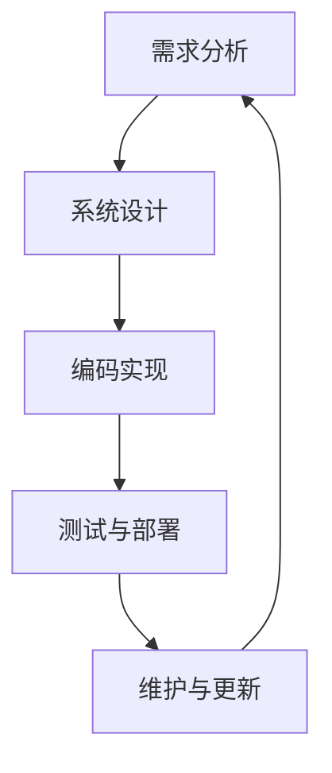

                 

# 《软件 2.0 的社会责任：科技向善》

> **关键词：软件伦理、社会责任、科技向善、数据治理、人工智能**

> **摘要：本文从软件伦理和社会责任的角度出发，探讨了软件 2.0 时代下，科技向善的重要性和实现路径。文章首先回顾了软件发展的里程碑，分析了软件向善的意义与内涵。接着，深入讨论了软件技术在社会责任中的角色，包括开发与设计、数据治理、人工智能等方面的伦理问题。然后，通过企业实践和全球视野，展示了软件向善的实践案例。最后，对软件向善的未来发展趋势进行了展望，并提出了持续改进的方向。**

----------------------------------------------------------------

## 第一部分： 引言与背景

### 第1章：软件向善的时代背景

#### 1.1 软件发展的里程碑回顾

软件行业的发展历程中，经历了多个重要的里程碑。从最初的机器语言编程，到高级编程语言的诞生，再到软件工程方法和工具的演进，软件技术的进步为人类社会带来了巨大的变革。

- **第一代：机器语言和汇编语言**
  - 时间：1940s-1950s
  - 特点：直接操作机器硬件，效率低下，编程复杂。

- **第二代：高级编程语言**
  - 时间：1950s-1960s
  - 代表语言：Fortran、COBOL、ALGOL
  - 特点：简化编程，提高开发效率，代码可移植性增强。

- **第三代：结构化编程和软件工程**
  - 时间：1960s-1970s
  - 代表方法：模块化设计、数据抽象、软件质量保证
  - 特点：系统化开发，提高软件的可维护性和可靠性。

- **第四代：面向对象编程**
  - 时间：1980s-1990s
  - 代表语言：C++、Java、Smalltalk
  - 特点：面向问题域设计，代码复用，模块化。

- **第五代：云计算、大数据和人工智能**
  - 时间：2000s-
  - 代表技术：云计算平台、大数据分析、机器学习、深度学习
  - 特点：分布式计算，大规模数据处理，智能化。

#### 1.2 软件向善的意义与内涵

软件向善是指在软件开发和应用的各个环节，充分考虑社会、环境、伦理等方面的因素，推动科技发展与社会进步和谐共生。

- **社会意义**：
  - 提高生活质量：软件应用普及，便捷生活、智能医疗、在线教育等。
  - 促进经济发展：数字化产业、创新创业、全球化贸易等。
  - 推动社会公平：消除数字鸿沟、普惠金融、智能化公共服务等。

- **环境意义**：
  - 节能减排：智慧能源管理、智能交通、绿色制造等。
  - 可持续发展：环境保护、生态修复、资源循环利用等。

- **伦理意义**：
  - 尊重用户隐私：数据保护、隐私政策、用户权益保障等。
  - 防范歧视偏见：算法公正、人工智能伦理、跨文化交流等。
  - 推进道德自律：行业自律、社会责任报告、伦理审计等。

#### 1.3 软件伦理与责任的重要性

软件伦理和责任是软件向善的核心。随着软件技术的不断发展和应用的广泛普及，软件伦理和责任的重要性日益凸显。

- **伦理问题**：
  - 隐私保护：数据收集、存储、使用过程中，如何平衡用户隐私与商业利益。
  - 数据安全：防范数据泄露、篡改、滥用等风险。
  - 算法偏见：算法决策中的歧视问题，如性别、种族、地域偏见等。
  - 跨文化交流：文化差异导致的软件设计、使用问题。

- **责任问题**：
  - 质量责任：确保软件产品的可靠性、安全性、可用性。
  - 法律责任：遵守相关法律法规，如数据保护法、消费者权益保护法等。
  - 社会责任：关注社会、环境、伦理等问题，推动科技发展与社会进步和谐共生。

#### 1.4 社会责任在软件行业的发展趋势

随着社会对软件技术的期望不断提高，软件行业的社会责任也越来越受到重视。

- **企业战略**：越来越多的软件企业开始将社会责任纳入企业战略，通过制定社会责任报告、开展公益活动等方式，提升企业形象。
- **法规政策**：各国政府出台相关法律法规，规范软件行业的社会责任，如数据保护法、网络安全法等。
- **行业自律**：软件行业组织发布伦理指南、标准，推动行业自律，提高行业整体社会责任水平。
- **技术创新**：开发和应用新技术，如区块链、人工智能等，提升软件技术的社会责任能力。

---

在软件 2.0 时代，软件技术不仅是一种工具，更是一种社会力量。软件向善不仅是企业的责任，也是每一个软件开发者的使命。通过深入探讨软件伦理和社会责任，我们可以更好地理解软件技术对社会的影响，为构建一个更加美好、和谐的社会贡献力量。

### 第2章：软件伦理的基本原则

#### 2.1 公平性与包容性

公平性与包容性是软件伦理的核心原则之一。在软件设计和开发过程中，公平性意味着为所有用户提供平等的机会和服务，不论性别、年龄、种族、地域等因素。包容性则强调尊重多样性，包容不同背景、观点和需求的用户。

- **公平性的实现**：
  - **无歧视**：在软件设计中，避免引入任何形式的歧视，确保用户在软件使用过程中不受不公平待遇。
  - **资源分配**：合理分配计算资源，确保不同用户群体都能获得公平的服务质量。
  - **机会均等**：在招聘、培训、晋升等方面，为所有员工提供平等的机会，消除性别、种族、地域等歧视。

- **包容性的实现**：
  - **文化差异**：考虑不同文化背景的用户需求，提供多语言支持，尊重文化差异。
  - **可访问性**：确保软件产品对残障人士友好，如提供语音识别、屏幕阅读器等功能。
  - **用户参与**：鼓励用户参与软件设计和测试，收集不同用户群体的反馈，提升软件的包容性。

#### 2.2 透明性与可解释性

透明性和可解释性是软件伦理的另一个重要原则，尤其是在涉及人工智能和自动化决策系统的应用中。透明性意味着软件系统的工作过程和结果应该是可理解的，用户可以清楚地知道软件是如何运作的。可解释性则强调在复杂决策过程中，能够提供足够的解释，帮助用户理解决策背后的逻辑。

- **透明性的实现**：
  - **代码开放**：开源软件有助于提高系统的透明度，用户可以查看和审查源代码，确保系统的公正性和安全性。
  - **数据透明**：在数据收集、处理和使用过程中，明确告知用户数据的用途和范围，确保用户对数据使用有知情权。
  - **操作可视**：通过用户界面、日志记录等方式，让用户可以随时查看软件的操作过程和状态。

- **可解释性的实现**：
  - **决策解释**：对于自动化决策系统，提供决策解释功能，使用户能够理解决策的原因和依据。
  - **算法可视化**：通过可视化工具，展示算法的运行过程和结果，帮助用户更好地理解算法的逻辑。
  - **透明审计**：定期对软件系统进行审计，确保系统在运行过程中符合伦理规范。

#### 2.3 可持续性原则

可持续性原则强调软件技术在社会、环境、经济等方面的长期影响，要求软件设计和开发过程中充分考虑可持续发展目标。

- **环境可持续性**：
  - **资源节约**：优化软件性能，减少能源消耗，降低碳排放。
  - **环保材料**：在硬件采购和制造过程中，使用环保材料，减少对环境的影响。
  - **废物管理**：合理处理软件废弃物的处理和回收，减少环境污染。

- **经济可持续性**：
  - **成本效益**：通过技术优化，提高软件的经济效益，降低开发和运维成本。
  - **创新发展**：鼓励技术创新，推动软件产业持续发展。
  - **市场公平**：确保市场竞争的公平性，避免市场垄断和资源分配不均。

- **社会可持续性**：
  - **教育与培训**：提供持续的软件技术和伦理教育，提高社会整体技术素养。
  - **就业机会**：通过软件产业带动就业，促进社会经济发展。
  - **社会福利**：通过软件技术的应用，提高社会福利水平，如智能医疗、在线教育等。

#### 2.4 隐私保护与数据安全

隐私保护和数据安全是软件伦理中的关键问题，特别是在大数据和人工智能时代，用户数据的安全和隐私保护更加重要。

- **隐私保护**：
  - **数据最小化**：在数据收集过程中，只收集必要的用户数据，避免过度收集。
  - **匿名化处理**：对用户数据进行匿名化处理，消除个人身份信息，保护用户隐私。
  - **用户同意**：在数据使用过程中，明确告知用户数据的用途和范围，并取得用户同意。

- **数据安全**：
  - **加密技术**：使用加密技术，确保数据在传输和存储过程中的安全性。
  - **访问控制**：实施严格的访问控制策略，确保只有授权人员可以访问敏感数据。
  - **安全审计**：定期对系统进行安全审计，发现和修复安全漏洞。

---

软件伦理的基本原则是构建软件技术社会责任的重要基石。在软件开发和应用的各个环节，遵循公平性与包容性、透明性与可解释性、可持续性原则，以及隐私保护和数据安全，将有助于推动软件技术向善发展，为构建一个更加和谐、可持续的社会贡献力量。

### 第3章：开发与设计的社会责任

#### 3.1 负责任的设计理念

负责任的设计理念是软件开发过程中必须遵循的核心原则。它强调在软件设计和开发过程中，充分考虑社会、环境、伦理等多方面的因素，确保软件产品在提供技术价值的同时，不会对用户和社会造成负面影响。

- **用户中心设计**：
  - 在设计过程中，始终将用户需求放在首位，通过用户调研、用户测试等方式，确保软件产品能够满足用户的需求和期望。
  - 关注用户隐私，在设计阶段就考虑如何保护用户数据，避免隐私泄露和滥用。

- **可持续发展**：
  - 在设计软件产品时，考虑其生命周期内的环境影响，如能源消耗、碳排放等，选择环保、节能的设计方案。
  - 采用模块化设计，提高软件的可维护性和可扩展性，延长软件产品的使用寿命。

- **社会影响评估**：
  - 在设计阶段，对软件产品可能带来的社会影响进行评估，包括就业、教育、文化、伦理等方面，确保软件产品对社会具有积极影响。
  - 针对可能出现的负面影响，提前制定应对措施，减少对社会的不利影响。

#### 3.2 用户隐私保护技术

用户隐私保护是软件开发过程中不可忽视的重要环节。随着大数据和人工智能技术的发展，用户隐私保护面临前所未有的挑战。为了确保用户隐私安全，开发人员需要采取一系列技术手段。

- **数据匿名化**：
  - 在数据处理过程中，对用户数据进行匿名化处理，消除个人身份信息，降低隐私泄露风险。
  - 使用加密算法，将敏感数据转换成不可识别的形式，确保数据在传输和存储过程中的安全性。

- **访问控制**：
  - 实施严格的访问控制策略，确保只有授权人员可以访问敏感数据。
  - 采用多因素认证（MFA）机制，增加数据访问的安全性。

- **数据加密**：
  - 使用对称加密和非对称加密技术，对敏感数据进行加密，确保数据在传输和存储过程中的安全性。
  - 定期更换加密密钥，确保加密算法的可靠性。

- **隐私保护算法**：
  - 开发隐私保护算法，如差分隐私、同态加密等，提高数据处理过程中的隐私保护水平。
  - 在算法设计中，充分考虑隐私保护要求，避免引入隐私泄露的风险。

#### 3.3 可访问性设计原则

可访问性设计原则旨在确保软件产品对残障人士友好，提高软件的普及性和包容性。以下是一些关键的可访问性设计原则：

- **可感知性**：
  - 确保软件界面和信息能够被所有用户感知，包括视觉、听觉、触觉等感官。
  - 提供多种信息传递方式，如文字、语音、图像等，以满足不同用户的感知需求。

- **可操作性**：
  - 设计易操作的界面，确保用户能够方便地使用软件产品，包括键盘操作、鼠标操作、触摸操作等。
  - 提供自定义设置，如字体大小、颜色对比度等，以适应不同用户的操作习惯。

- **语言可理解性**：
  - 使用简单、清晰、易懂的语言，确保用户能够轻松理解软件操作说明和提示信息。
  - 避免使用专业术语和复杂句式，确保信息传递的准确性。

- **错误容忍性**：
  - 设计软件产品时，考虑用户可能出现的操作错误，提供错误提示和恢复机制。
  - 通过逐步引导用户，减少操作错误的可能性，提高软件的易用性。

- **技术辅助**：
  - 提供技术辅助工具，如屏幕阅读器、语音识别等，帮助残障人士使用软件产品。
  - 在开发过程中，充分考虑辅助技术的要求，确保软件产品对辅助技术友好。

#### 3.4 平等与包容性的技术应用

平等与包容性的技术应用是推动软件向善发展的重要手段。在软件开发和设计中，需要充分考虑不同用户群体的需求，确保软件产品能够服务于所有人。

- **文化多样性**：
  - 考虑不同文化背景的用户需求，提供多语言支持，确保软件产品在不同语言环境下都能够正常运行。
  - 尊重文化差异，避免在软件设计中引入文化偏见，确保软件产品在不同文化背景下都能被接受。

- **无障碍设计**：
  - 在软件设计中，充分考虑残障人士的需求，提供无障碍设计，确保软件产品对残障人士友好。
  - 遵循国际无障碍设计标准，如WCAG（Web Content Accessibility Guidelines），提高软件产品的可访问性。

- **个性化服务**：
  - 通过数据分析，了解用户需求和行为，提供个性化服务，满足不同用户的个性化需求。
  - 采用自适应设计，根据用户行为和偏好，动态调整软件界面和功能，提高用户体验。

- **教育普及**：
  - 推广软件知识和技能，提高社会整体技术素养，消除数字鸿沟。
  - 开展软件教育和培训活动，培养更多的软件人才，促进软件行业的可持续发展。

---

开发与设计的社会责任是软件技术向善发展的重要保障。通过负责任的设计理念、用户隐私保护技术、可访问性设计原则以及平等与包容性的技术应用，我们可以构建更加公正、包容、可持续的软件生态系统，为构建一个更加美好的社会贡献力量。

### 第4章：数据治理与社会责任

#### 4.1 数据伦理与合规性

数据伦理与合规性是数据治理的基础，它要求在数据处理和使用的各个环节，严格遵守法律法规和伦理规范，确保数据的安全、合法、透明。

- **法律法规**：
  - 遵守各国数据保护法，如《欧盟通用数据保护条例》（GDPR）、《美国加州消费者隐私法》（CCPA）等。
  - 遵循行业标准和最佳实践，如ISO/IEC 27001信息安全管理体系标准。

- **数据安全**：
  - 实施数据加密、访问控制、审计等安全措施，确保数据在存储、传输、处理过程中的安全性。
  - 定期进行安全审计和风险评估，发现和修复安全隐患。

- **透明性**：
  - 明确告知用户数据的收集、使用、共享等目的和范围，确保用户对数据使用有知情权。
  - 提供数据访问和查询功能，使用户能够了解自己的数据情况。

- **合规性**：
  - 定期审查和更新数据处理流程，确保符合法律法规和伦理规范。
  - 遵守行业规范和道德准则，如数据共享、数据管理等方面的规定。

#### 4.2 数据泄露与滥用防范

数据泄露与滥用是数据治理中的主要挑战，为了确保数据安全，需要采取一系列防范措施。

- **数据泄露防范**：
  - 实施数据加密技术，确保数据在传输和存储过程中的安全性。
  - 部署防火墙、入侵检测系统等安全防护措施，防止外部攻击。
  - 定期备份数据，确保在数据泄露事件中能够迅速恢复数据。

- **数据滥用防范**：
  - 实施严格的访问控制策略，确保只有授权人员可以访问敏感数据。
  - 定期进行数据使用审计，发现和阻止异常数据使用行为。
  - 加强员工培训，提高员工对数据安全和伦理规范的认识。

#### 4.3 数据责任与伦理问题

数据责任与伦理问题是数据治理中的重要议题，涉及数据收集、使用、共享等多个方面。

- **数据责任**：
  - 落实数据责任主体，明确数据收集、处理、使用等环节的责任人。
  - 建立数据责任追究机制，对数据泄露、滥用等行为进行追责。

- **伦理问题**：
  - 数据收集：遵循最小化原则，仅收集必要的用户数据，避免过度收集。
  - 数据使用：确保数据使用符合用户同意的范围和目的，避免滥用。
  - 数据共享：遵守数据共享伦理规范，确保数据共享的透明性和安全性。

#### 4.4 数据治理框架与实施

数据治理框架是确保数据安全、合规、透明和有效使用的重要工具。以下是一个基本的数据治理框架：

- **数据治理组织**：
  - 建立数据治理委员会，负责制定和监督数据治理政策和流程。
  - 设立数据保护官（DPO），负责监督数据保护工作。

- **数据治理流程**：
  - 数据生命周期管理：包括数据收集、存储、处理、共享、销毁等环节。
  - 数据安全与合规：实施数据加密、访问控制、审计等安全措施，确保数据安全和合规。
  - 数据质量控制：定期检查和改进数据质量，确保数据的准确性、完整性和一致性。

- **数据治理工具与技术**：
  - 采用数据治理工具，如数据质量管理工具、数据审计工具等，提高数据治理效率。
  - 引入人工智能技术，如数据挖掘、机器学习等，辅助数据治理工作。

- **数据治理评估与改进**：
  - 定期进行数据治理评估，发现和改进数据治理过程中的问题。
  - 结合行业最佳实践和最新技术，不断更新和完善数据治理框架。

---

数据治理与社会责任是软件技术向善发展的重要组成部分。通过建立数据伦理与合规性、防范数据泄露与滥用、明确数据责任与伦理问题，以及实施数据治理框架，我们可以更好地保护用户数据，确保数据的安全、合规和透明使用，为构建一个更加公正、可持续的软件生态系统贡献力量。

### 第5章：人工智能的社会责任

#### 5.1 人工智能伦理的基本原则

人工智能（AI）作为一项新兴技术，其应用范围广泛，对人类社会产生了深远的影响。然而，随着AI技术的发展，伦理问题也逐渐凸显。人工智能伦理的基本原则旨在确保AI技术的合理、公正、透明和安全使用。

- **公正性**：
  - 确保AI系统在决策过程中不偏袒特定群体，避免性别、种族、地域等歧视。
  - 通过算法透明性和可解释性，让用户能够理解AI决策的逻辑和依据。

- **透明性**：
  - 提高AI系统的透明度，让用户能够清晰地了解AI系统的工作原理和决策过程。
  - 开发可视化工具，如决策树、神经网络结构图等，展示AI系统的内部运行机制。

- **可控性**：
  - 建立完善的AI系统控制和监督机制，确保AI系统在运行过程中符合伦理和法律要求。
  - 实施多重验证和测试，发现和修复潜在的安全隐患。

- **安全性**：
  - 确保AI系统在数据收集、存储、处理和使用过程中，能够有效保护用户隐私和数据安全。
  - 采用先进的加密和访问控制技术，防止数据泄露和滥用。

#### 5.2 偏见与歧视的防范

偏见和歧视是AI系统中常见的问题，为了确保AI技术的公正性和公平性，需要采取一系列措施来防范偏见和歧视。

- **算法偏见识别与校正**：
  - 通过数据分析和统计方法，识别AI系统中可能存在的偏见和歧视。
  - 利用反事实推理和对抗性样本，校正算法中的偏见，提高AI系统的公平性。

- **数据多样性**：
  - 在数据收集和处理过程中，注重数据的多样性，避免数据集中带来的偏见。
  - 引入更多样化的训练数据，提高AI系统的鲁棒性和公平性。

- **算法公平性评估**：
  - 开发评估指标和方法，评估AI系统在不同群体中的表现，确保算法的公平性。
  - 定期对AI系统进行公平性审计，发现和纠正潜在的问题。

#### 5.3 透明性与可解释性技术

透明性与可解释性是确保AI系统公正性和信任的关键。通过开发透明性与可解释性技术，用户可以更好地理解AI系统的决策过程，增强对AI系统的信任。

- **可视化技术**：
  - 使用图表、动画等形式，展示AI系统的内部结构和运行过程，提高透明性。
  - 开发可视化工具，如决策树、神经网络可视化等，帮助用户理解AI系统的决策逻辑。

- **解释性算法**：
  - 开发可解释性算法，如LIME（Local Interpretable Model-agnostic Explanations）、SHAP（SHapley Additive exPlanations）等，提供对AI决策的详细解释。
  - 结合可视化技术，展示解释结果，帮助用户理解AI系统的决策依据。

- **透明性协议**：
  - 制定透明性协议，明确AI系统的开发、测试、部署等环节的透明要求。
  - 建立透明性评估机制，对AI系统进行定期评估，确保系统的透明性和可解释性。

#### 5.4 人机协作与伦理决策

人机协作是AI应用的重要趋势，通过将人类智慧和机器智能相结合，提高决策的效率和准确性。然而，在AI与人类协作的过程中，伦理问题也需要充分考虑。

- **人机协作模式**：
  - 设计合理的人机协作模式，明确人类和AI在决策过程中的职责和权限。
  - 结合人类专家的知识和经验，以及AI系统的计算能力和预测能力，实现最优的决策效果。

- **伦理决策框架**：
  - 建立伦理决策框架，确保在AI与人类协作的过程中，遵循伦理原则和道德规范。
  - 制定伦理决策规则，如紧急情况下的决策流程、责任分配等，确保决策的合理性和公正性。

- **伦理培训与教育**：
  - 对AI开发者和使用者进行伦理培训，提高他们对伦理问题的认识和应对能力。
  - 在教育体系中引入AI伦理课程，培养具有伦理意识和责任感的人工智能专业人才。

---

人工智能的社会责任是确保AI技术合理、公正、透明和安全使用的关键。通过遵循人工智能伦理的基本原则、防范偏见与歧视、提高透明性与可解释性，以及构建人机协作与伦理决策框架，我们可以推动人工智能技术的健康发展，为构建一个更加公正、和谐的社会贡献力量。

### 第6章：软件企业的社会责任实践

#### 6.1 企业社会责任战略规划

企业社会责任（CSR）战略规划是软件企业实现长期可持续发展的关键。一个有效的CSR战略规划应包括以下关键步骤：

1. **CSR目标设定**：
   - 明确企业社会责任的目标，如环境保护、员工福利、社区参与等。
   - 结合企业核心业务和竞争优势，设定具体、可衡量的社会责任目标。

2. **社会责任评估**：
   - 对企业现有的社会责任实践进行评估，识别优势和不足。
   - 分析企业业务流程和产品对环境、社会、经济等方面的影响。

3. **社会责任战略制定**：
   - 根据评估结果，制定具体的社会责任战略，包括行动计划、资源配置、时间表等。
   - 确保社会责任战略与企业愿景、使命和价值观保持一致。

4. **沟通与透明性**：
   - 建立社会责任报告制度，定期发布社会责任报告，向利益相关方披露企业的社会责任实践和成果。
   - 通过多种渠道（如官方网站、社交媒体、年度股东大会等）加强与利益相关方的沟通。

5. **持续改进**：
   - 建立社会责任监测和评估机制，定期对社会责任战略和执行情况进行审查和改进。
   - 根据市场环境、技术进步和社会期望的变化，及时调整社会责任战略。

#### 6.2 社会责任报告与披露

社会责任报告是软件企业向公众展示其在社会责任方面实践的重要工具。一个全面、准确的社会责任报告应包括以下关键内容：

1. **企业社会责任概述**：
   - 企业社会责任的愿景、使命和价值观。
   - 企业社会责任战略和目标。

2. **社会责任实践**：
   - 环境保护：描述企业在节能减排、资源循环利用、环保材料使用等方面的措施。
   - 社会参与：介绍企业在社区建设、公益活动、志愿服务等方面的参与情况。
   - 员工福利：展示企业为员工提供的培训、晋升、工作环境等方面的福利和保障。

3. **社会绩效指标**：
   - 提供具体的社会绩效指标，如碳排放量、公益活动次数、员工满意度等。
   - 通过对比分析，展示社会责任实践对企业和社会的积极影响。

4. **利益相关方反馈**：
   - 引入利益相关方的意见和建议，如员工、客户、社区代表等。
   - 分析利益相关方对社会责任实践的评价和反馈，展示企业的社会责任意识和行动力。

5. **未来展望**：
   - 描述企业社会责任的未来发展方向和计划，如新技术应用、社会责任项目扩展等。
   - 展示企业对社会、环境、经济等方面的长期贡献。

#### 6.3 责任投资与可持续发展

责任投资（SRI）和可持续发展是软件企业社会责任的重要组成部分。通过责任投资和可持续发展，企业可以在经济、社会、环境等方面实现长期价值。

1. **责任投资**：
   - 投资于符合社会责任标准的公司，如环保、社会责任、伦理等领域。
   - 通过积极投票、参与公司治理等方式，推动被投资公司的社会责任表现。

2. **可持续发展**：
   - 制定可持续发展战略，包括经济、社会、环境三个维度。
   - 实施绿色供应链管理，推动供应商和合作伙伴的可持续发展。
   - 通过新技术应用，提高能源利用效率，减少碳排放。

3. **环境、社会和公司治理（ESG）**：
   - ESG评价体系是评估企业可持续发展能力的重要工具。
   - 定期进行ESG评估，识别和改进企业在环境、社会和公司治理方面的表现。

4. **社会责任项目**：
   - 开展社会责任项目，如环境保护项目、社区发展项目、公益慈善项目等。
   - 结合企业核心业务和技术优势，推动社会责任项目的实施和可持续发展。

#### 6.4 社会责任评估与改进

社会责任评估与改进是确保企业社会责任战略有效实施的重要环节。以下是一个基本的社会责任评估与改进流程：

1. **评估准备**：
   - 确定评估目标和范围，包括环境、社会、经济等方面的关键指标。
   - 收集相关数据和信息，如社会责任报告、员工反馈、客户满意度等。

2. **数据分析和评估**：
   - 对收集的数据进行统计和分析，识别企业在社会责任方面的优势和不足。
   - 结合行业标准和社会期望，评估企业的社会责任表现。

3. **反馈与改进**：
   - 将评估结果反馈给相关部门和员工，明确改进方向和措施。
   - 制定详细的改进计划，包括时间表、责任人、资源配置等。

4. **持续监测和改进**：
   - 建立社会责任监测机制，定期跟踪改进措施的实施情况。
   - 根据评估结果和社会反馈，持续调整和优化社会责任战略。

---

软件企业的社会责任实践是推动科技向善发展的重要力量。通过战略规划、社会责任报告与披露、责任投资与可持续发展，以及社会责任评估与改进，软件企业可以在经济、社会、环境等方面实现长期价值，为构建一个更加公正、可持续的社会贡献力量。

### 第7章：软件向善的全球实践

#### 7.1 全球软件伦理指南与法规

在全球范围内，各国和组织纷纷出台软件伦理指南和法规，以规范软件行业的发展，确保软件技术的社会责任。以下是一些主要的国家和组织及其相关指南和法规：

- **欧盟**：
  - **通用数据保护条例（GDPR）**：欧盟于2018年正式实施的GDPR，是全球最具影响力的数据保护法规之一，对数据收集、处理、存储和传输等环节提出了严格的要求。
  - **数字市场法（DMAct）**：旨在规范数字市场的竞争，保护消费者权益，促进市场公平。

- **美国**：
  - **加州消费者隐私法（CCPA）**：加州于2020年正式实施的CCPA，是全美最具影响力的消费者隐私保护法规，要求企业对消费者的个人数据提供更高的保护措施。
  - **联邦贸易委员会（FTC）**：FTC负责监管美国市场中的不公平或欺骗性行为，包括软件行业的数据隐私和保护问题。

- **国际标准化组织（ISO）**：
  - **ISO/IEC 27001**：信息安全管理体系标准，帮助企业建立和维护信息安全管理体系，确保数据安全。
  - **ISO/IEC 45001**：职业健康安全管理体系标准，关注企业在员工安全和健康方面的责任。

- **国际电联（ITU）**：
  - **ITU-T X.1700**：关于信息技术伦理的国际标准，涵盖了数据隐私、网络安全、知识产权保护等方面。

#### 7.2 先进国家的软件向善实践

在全球范围内，一些先进国家在软件向善方面取得了显著成效，以下是一些典型的实践案例：

- **芬兰**：
  - **数字素养与包容性**：芬兰政府通过推动数字素养教育和数字化转型，提高全民数字素养，促进社会包容性。
  - **可持续数字发展**：芬兰在数字化发展中注重环保和可持续发展，推动绿色云计算、智能能源管理等技术的应用。

- **瑞典**：
  - **透明政府与开放数据**：瑞典政府积极推动政府数据的公开和透明，鼓励公众参与政府决策过程，提高政府公信力。
  - **创新与创业支持**：瑞典政府提供丰富的创新和创业支持政策，鼓励软件企业和创业者发展，推动数字经济。

- **新加坡**：
  - **智慧城市与数字治理**：新加坡积极推动智慧城市建设，通过数字化手段提高城市治理效率，如智能交通管理、电子政务等。
  - **数据治理与隐私保护**：新加坡政府建立了完善的隐私保护和数据治理框架，确保数据的安全和合规使用。

#### 7.3 发展中国家的挑战与机遇

发展中国家在软件向善方面面临着诸多挑战，但也具有巨大的发展机遇。以下是一些关键挑战和机遇：

- **挑战**：
  - **基础设施不足**：许多发展中国家在互联网基础设施、数据中心建设等方面存在不足，限制了软件产业的发展。
  - **人才短缺**：软件人才短缺是发展中国家面临的另一个挑战，需要加强教育和培训，提高人才储备。
  - **法规政策**：一些发展中国家的法律法规体系尚不完善，需要加强立法和监管，确保软件行业的发展。

- **机遇**：
  - **市场潜力**：发展中国家人口众多，市场需求巨大，尤其是数字化转型和智能技术应用领域。
  - **政策支持**：许多发展中国家政府出台了一系列支持软件产业发展的政策，如税收优惠、资金扶持等。
  - **国际合作**：发展中国家可以通过国际合作，引进先进技术和管理经验，推动软件产业的快速发展。

#### 7.4 国际合作与知识共享

国际合作与知识共享在推动软件向善方面具有重要作用。以下是一些国际合作和知识共享的途径：

- **国际会议与研讨会**：举办国际会议和研讨会，促进各国在软件伦理、社会责任、人工智能等领域的交流与合作。
- **学术研究与成果分享**：加强学术研究合作，共享研究成果和创新技术，推动软件技术向善发展。
- **国际合作项目**：开展国际合作项目，如联合研究、共同开发等，推动软件技术的全球应用和推广。
- **开放数据与开源软件**：通过开放数据、开源软件等方式，促进知识共享和技术创新，推动软件行业的健康发展。

---

软件向善的全球实践展示了各国在软件伦理、社会责任、人工智能等方面的探索和成效。通过国际合作与知识共享，我们可以共同推动软件技术向善发展，为构建一个更加公正、和谐、可持续的全球社会贡献力量。

### 第8章：软件向善的未来发展趋势

#### 8.1 新技术带来的社会责任挑战

随着新技术的不断涌现，软件技术的社会责任挑战也在不断升级。以下是一些新技术带来的社会责任挑战及其应对策略：

- **人工智能伦理**：
  - **挑战**：人工智能系统在决策过程中可能引入偏见和歧视，影响社会公平。
  - **应对策略**：开发透明性和可解释性技术，提高人工智能系统的透明度，确保决策过程公正。
  - **例子**：使用LIME（Local Interpretable Model-agnostic Explanations）和SHAP（SHapley Additive exPlanations）等技术，为人工智能决策提供详细解释。

- **大数据隐私保护**：
  - **挑战**：大数据技术可能导致用户隐私泄露和滥用。
  - **应对策略**：实施严格的数据匿名化和加密技术，确保数据在处理和传输过程中的安全性。
  - **例子**：使用差分隐私技术，确保在数据分析过程中保护用户隐私。

- **区块链技术应用**：
  - **挑战**：区块链技术可能导致数据不可篡改，从而对隐私保护和数据安全带来挑战。
  - **应对策略**：结合智能合约和区块链技术，确保数据在区块链上的安全和隐私。
  - **例子**：使用零知识证明技术，在区块链上实现隐私保护。

- **物联网（IoT）安全**：
  - **挑战**：物联网设备数量庞大，安全漏洞可能导致数据泄露和网络攻击。
  - **应对策略**：加强物联网设备的安全设计和防护措施，确保设备在连接网络时的安全性。
  - **例子**：使用物联网安全协议（如IPSec、TLS等），保护数据在传输过程中的安全。

#### 8.2 跨学科合作与综合解决方案

面对软件技术带来的社会责任挑战，跨学科合作与综合解决方案显得尤为重要。以下是一些跨学科合作与综合解决方案的途径：

- **跨学科研究**：
  - **例子**：人工智能与伦理学、心理学、社会学等领域的交叉研究，探索人工智能伦理问题的解决方案。

- **综合解决方案**：
  - **例子**：结合数据科学、人工智能和公共政策，制定全面的数据治理策略，确保数据的合理使用和保护。

- **多方协作**：
  - **例子**：政府、企业、学术界、非政府组织等多方协作，共同推动软件技术的社会责任发展。

#### 8.3 教育与培训的重要性

教育与培训是提升软件技术社会责任意识和能力的关键。以下是一些教育与培训的途径：

- **学术教育**：
  - **例子**：在计算机科学、软件工程等课程中，加入软件伦理和社会责任的内容，培养学生正确的价值观。

- **职业培训**：
  - **例子**：为软件开发者、数据分析师等职业提供专业的软件伦理和社会责任培训，提高从业者的责任意识。

- **公众教育**：
  - **例子**：通过社区讲座、网络课程等形式，普及软件伦理和社会责任知识，提高公众的意识和参与度。

#### 8.4 软件行业的未来愿景

软件行业的未来愿景是构建一个更加公正、透明、可持续的软件生态系统。以下是一些未来愿景的展望：

- **智慧社会**：
  - **例子**：通过智能化技术，提高社会公共服务效率，实现社会资源的优化配置。

- **数字伦理**：
  - **例子**：制定全面的数字伦理法规和标准，确保软件技术的合理、公正、透明使用。

- **绿色软件**：
  - **例子**：开发环保、节能的软件产品，推动软件行业的可持续发展。

- **人人可编程**：
  - **例子**：通过普及编程教育和开源技术，让更多人掌握编程技能，推动软件技术的普及和应用。

---

软件向善的未来发展趋势充满机遇与挑战。通过应对新技术带来的社会责任挑战、推动跨学科合作与综合解决方案、加强教育与培训，以及构建智慧社会和数字伦理，我们可以共同构建一个更加公正、透明、可持续的软件生态系统，为人类社会的美好未来贡献力量。

### 第9章：软件向善的可持续性

#### 9.1 可持续发展的社会价值

软件向善的可持续发展具有深远的社会价值，它不仅关乎技术进步，更关乎人类社会的福祉。以下是软件向善的可持续发展的几个关键社会价值：

- **经济效益**：软件向善的可持续发展能够促进经济繁荣。通过技术创新和优化，提高生产效率，降低成本，从而推动企业增长和就业机会。同时，可持续发展的软件产品能够赢得消费者的信任，提升品牌价值。

- **社会公平**：软件向善的可持续发展有助于实现社会公平。通过公平性设计和包容性技术，消除数字鸿沟，让更多的人享受到科技带来的便利。此外，可持续发展的软件产品能够促进教育平等，提高社会整体的知识水平。

- **环境保护**：软件向善的可持续发展对环境保护至关重要。通过开发环保软件和绿色技术，减少能源消耗和碳排放，推动可持续发展。例如，智慧能源管理和智能交通系统能够有效降低能源浪费和环境污染。

- **文化多样性**：软件向善的可持续发展能够保护和促进文化多样性。通过尊重和保护不同文化的需求，开发多元化的软件产品，促进文化的交流与融合。此外，可持续发展的软件产品能够帮助保护非物质文化遗产和传统工艺。

#### 9.2 长期责任与持续改进

软件向善的可持续发展需要企业、开发者、用户等多方共同承担长期责任，并进行持续改进。以下是实现长期责任和持续改进的几个关键步骤：

- **企业战略**：企业应将社会责任和可持续发展纳入长期战略规划，确保技术进步与社会进步同步。企业可以通过社会责任报告、可持续性评估等方式，公开透明地展示其社会责任实践。

- **技术开发**：开发者应在软件开发过程中，充分考虑社会、环境、伦理等多方面的影响，开发出符合可持续发展要求的软件产品。例如，采用环保材料、优化算法性能等。

- **用户教育**：企业应通过多种渠道向用户普及软件伦理和社会责任知识，提高用户的参与度和责任感。用户教育有助于形成良好的软件使用习惯，促进软件向善的可持续发展。

- **政策支持**：政府应出台相关政策，鼓励和支持软件向善的可持续发展。例如，提供税收优惠、资金支持、法规指导等，为企业和社会提供有力支持。

- **持续改进**：企业和社会应建立持续改进机制，定期评估和改进软件向善的实践。通过监测社会反馈、技术进步和市场需求，及时调整和优化发展战略。

#### 9.3 未来的社会责任趋势

未来，软件向善的社会责任趋势将呈现以下几个方向：

- **智能化与自动化**：随着人工智能和自动化技术的发展，软件产品将更加智能化和自动化，提高生产效率和用户体验。同时，这也会带来新的社会责任挑战，如算法公平性和数据安全。

- **全球合作与共享**：全球化趋势将促进国际间的软件技术合作与知识共享，推动软件向善的全球发展。各国和地区将共同制定软件伦理标准和法规，确保软件技术的合理、公正使用。

- **社会参与与透明性**：社会参与和透明性将逐渐成为软件向善的重要特征。企业将更加重视公众意见和反馈，通过开放数据和透明决策，增强社会责任意识。

- **可持续发展与生态保护**：随着可持续发展意识的提升，软件产品将更加注重环境保护和生态平衡。通过绿色软件和环保技术，推动软件行业的可持续发展。

#### 9.4 总结与展望

软件向善的可持续性是未来软件技术发展的重要方向。通过企业战略规划、技术开发、用户教育、政策支持以及持续改进，我们可以共同推动软件技术向善发展，实现经济效益、社会公平、环境保护和文化多样性的统一。

让我们携手共进，共同构建一个更加公正、透明、可持续的软件生态系统，为人类社会的美好未来贡献力量。

---

## 附录A：软件伦理与责任资源

### A.1 核心文献与报告

- **《计算机伦理》（Computer Ethics）**：彼得·诺维格（Peter Noyce）著，详细介绍了计算机伦理的基本概念和案例分析。
- **《人工智能伦理指南》（Ethical Guidelines for Artificial Intelligence）**：IEEE 人工智能伦理委员会发布，提供了人工智能伦理的基本原则和实践指南。
- **《全球软件开发者宣言》（The Global Software Developers’ Charter）**：由国际软件开发者联盟发起，强调了软件开发者在社会责任方面的承诺。
- **《数据伦理与治理》（Data Ethics and Governance）**：国际数据管理协会（DAMA）发布，介绍了数据伦理和治理的最佳实践。

### A.2 行业组织与倡议

- **国际计算机协会（ACM）**：全球最大的计算机专业组织，提供计算机伦理和责任的相关资源和活动。
- **国际电气和电子工程师协会（IEEE）**：发布了一系列与计算机伦理和人工智能伦理相关的标准和指南。
- **欧洲计算机协会（EURASIP）**：专注于信号处理和通信领域的计算机科学组织，包括软件伦理方面的研究。
- **计算机伦理研究所（Computer Ethics Institute）**：致力于计算机伦理教育和研究，提供丰富的资源。

### A.3 学术会议与研讨会

- **国际计算机伦理学术会议（International Conference on Computer Ethics）**：是全球范围内计算机伦理领域的顶级学术会议。
- **人工智能与伦理研讨会（Workshop on AI and Ethics）**：多个国际会议和研讨会的子议题，探讨人工智能伦理问题。
- **国际软件工程会议（International Conference on Software Engineering）**：涉及软件工程中的伦理和责任问题。
- **计算机与人类社会学术会议（ACM Conference on Computer and Human Interaction）**：探讨计算机技术对人类社会的影响，包括伦理和社会责任。

通过这些核心文献、行业组织、学术会议和研讨会，我们可以深入了解软件伦理与责任，促进软件技术的健康发展。

## 附录B：Mermaid 流程图示例

以下是一个简单的 Mermaid 流程图示例，用于展示软件生命周期中各阶段的关系：

在这个流程图中，A表示需求分析，B表示系统设计，C表示编码实现，D表示测试与部署，E表示维护与更新。每个阶段都与其他阶段相连，表示阶段之间的依赖关系和迭代过程。通过 Mermaid 流程图，我们可以直观地展示软件开发的流程和结构，有助于理解和分析软件开发过程中的关键环节。

