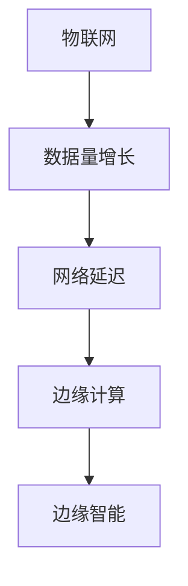
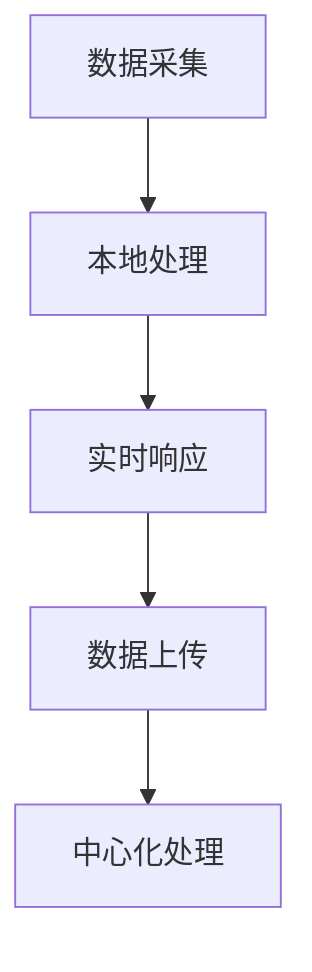
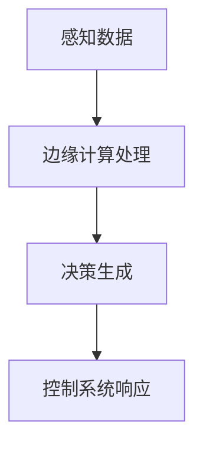
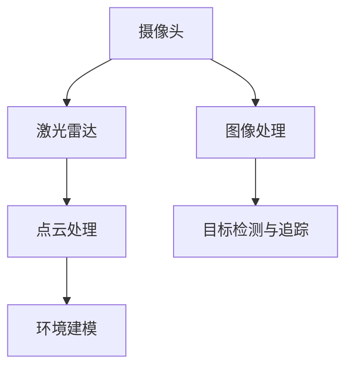
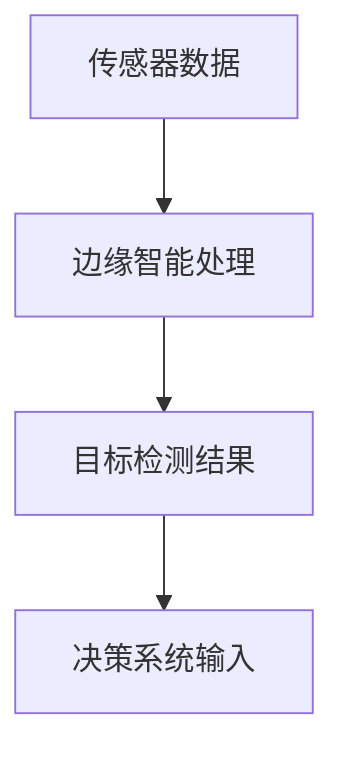
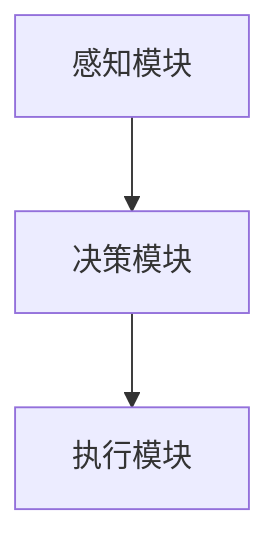
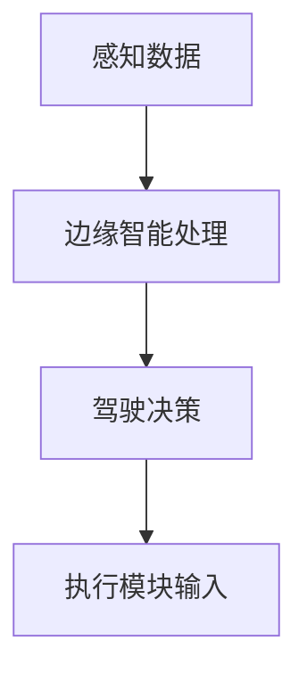
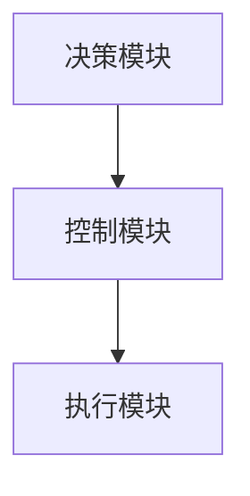
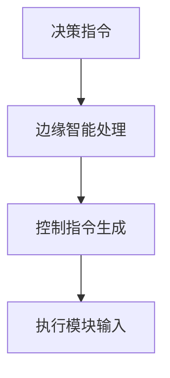

                 

### 边缘智能在自动驾驶中的实时处理应用

边缘智能，作为一种新型的计算架构，正逐步改变着自动驾驶系统的实时处理方式。本文将深入探讨边缘智能在自动驾驶中的实时处理应用，包括其基础概念、应用场景、实时处理算法、硬件支持以及未来发展等各个方面。

> **关键词：边缘智能、自动驾驶、实时处理、算法优化、硬件加速**

> **摘要：本文首先介绍了边缘智能的定义及其与自动驾驶的关系，然后详细探讨了边缘智能在自动驾驶中的三个关键应用场景：感知、决策和控制。接着，分析了边缘智能实时处理的挑战及其解决方案，并通过实际案例展示了边缘智能在自动驾驶中的应用。最后，对边缘智能在自动驾驶中的未来发展趋势进行了展望。**

## 第一部分：边缘智能概述

边缘智能的发展是技术进步的必然结果，它不仅解决了云计算在处理速度、带宽和存储方面的局限性，还为自动驾驶等实时性要求极高的领域提供了新的解决方案。

### 第1章：边缘智能的起源与定义

#### 1.1 边缘智能的起源

边缘智能的概念起源于边缘计算，即计算任务在网络边缘进行，而非中心化的数据中心。边缘计算的出现是为了应对物联网（IoT）时代数据量激增、网络延迟严重的问题。随着5G、物联网和人工智能等技术的不断发展，边缘计算逐渐演变为边缘智能。

**Mermaid 流程图：**



边缘智能不仅仅是一种计算架构，它更是一种智能化的计算理念，强调在数据产生的源头进行高效、智能的处理和分析。

#### 1.2 边缘智能的定义

边缘智能是指在网络的边缘侧，利用分布式计算资源进行数据处理、分析和决策的能力。它通过在边缘设备上运行智能算法，实现对本地数据的实时分析和响应，从而降低网络延迟，提高系统的响应速度。

**定义：**

边缘智能是指在网络边缘侧进行数据计算、分析和处理的能力，旨在提升系统的响应速度、降低延迟并减少对中心化计算资源的依赖。

#### 1.3 边缘智能与云计算的对比

云计算和边缘智能都是现代计算架构的重要组成部分，但它们在某些方面存在显著差异。

**对比表格：**

| 特点 | 边缘智能 | 云计算 |
| ---- | -------- | ------- |
| 计算位置 | 网络边缘 | 数据中心 |
| 延迟 | 低 | 较高 |
| 处理能力 | 本地计算资源 | 大规模计算资源 |
| 数据存储 | 本地存储为主 | 大部分数据存储在云端 |
| 成本 | 低（硬件维护成本较低） | 高（需要大规模数据中心） |

边缘智能的优势在于能够实现低延迟、高效能和本地化的数据处理，这对于自动驾驶等需要实时响应的应用场景尤为重要。

## 第2章：边缘计算与自动驾驶

自动驾驶技术的快速发展对计算能力和响应速度提出了前所未有的要求。边缘计算的出现，为自动驾驶系统提供了强大的技术支持。

### 2.1 边缘计算的基本概念

边缘计算是一种分布式计算架构，通过在网络边缘部署计算资源，实现数据的本地处理和分析。与传统云计算相比，边缘计算具有以下特点：

**特点：**

- **分布式计算**：边缘计算将计算任务分散到网络边缘的设备上，减少了对中心化数据中心的依赖。
- **低延迟**：数据在本地处理，无需通过广域网传输，从而大大降低了延迟。
- **高响应速度**：边缘设备能够快速响应本地事件，提高系统的实时性。
- **低成本**：通过利用现有的网络边缘设备，减少了对大规模数据中心的依赖，降低了建设和运营成本。

**Mermaid 流程图：**



边缘计算通过在数据产生的源头进行计算，避免了数据传输过程中的延迟和带宽限制，特别适用于对实时性要求高的应用场景。

### 2.2 边缘计算在自动驾驶中的应用

自动驾驶系统需要实时处理大量传感器数据，并快速做出驾驶决策。边缘计算为自动驾驶提供了以下应用场景：

**应用场景：**

- **感知系统**：边缘计算用于处理摄像头、激光雷达、超声波传感器等感知设备的数据，实现快速的目标检测和追踪。
- **决策系统**：边缘计算用于处理感知数据，快速生成驾驶决策，提高系统的决策质量。
- **控制系统**：边缘计算用于控制车辆的运动，实现实时响应，提高系统的稳定性。

**Mermaid 流程图：**



边缘计算在自动驾驶中的应用，不仅提高了系统的实时性和响应速度，还降低了数据传输的成本和延迟。

### 2.3 边缘智能在自动驾驶中的重要性

边缘智能在自动驾驶中的作用至关重要，主要体现在以下几个方面：

**重要性：**

- **实时性**：边缘智能能够实时处理感知数据，快速生成驾驶决策，确保车辆的安全运行。
- **节能**：边缘智能通过本地计算，减少了数据传输的需求，降低了能耗。
- **稳定性**：边缘智能提高了系统的计算能力，增强了自动驾驶系统的稳定性。
- **扩展性**：边缘智能可以方便地集成到现有的自动驾驶系统中，提高系统的扩展性。

边缘智能为自动驾驶技术的发展提供了强大的支持，使得自动驾驶系统能够更好地适应复杂多变的驾驶环境。

## 第二部分：边缘智能在自动驾驶中的应用场景

边缘智能在自动驾驶中的应用场景主要包括感知系统、决策系统和控制系统。以下将分别对这些应用场景进行详细探讨。

### 第3章：自动驾驶感知系统中的边缘智能

自动驾驶感知系统是自动驾驶系统的核心组成部分，负责收集和处理环境信息。边缘智能在感知系统中的应用，旨在提高感知的实时性和准确性。

#### 3.1 感知系统的基本架构

自动驾驶感知系统的基本架构包括多个传感器和数据处理模块。主要传感器包括摄像头、激光雷达、超声波雷达等。

**Mermaid 流程图：**



在感知系统中，边缘智能主要负责以下任务：

- **图像处理**：对摄像头采集的图像进行预处理，包括降噪、增强等。
- **点云处理**：对激光雷达生成的点云数据进行分析，提取环境特征。
- **目标检测与追踪**：识别并跟踪道路上的车辆、行人、障碍物等目标。

#### 3.2 边缘智能在感知系统中的应用

边缘智能在感知系统中的应用主要体现在以下几个方面：

- **实时性**：边缘智能能够快速处理传感器数据，实现实时目标检测和追踪。
- **精度**：通过本地计算，边缘智能能够提供更高的数据处理精度，减少误差。
- **节能**：边缘智能减少了数据传输的需求，降低了能耗。

**Mermaid 流程图：**



边缘智能在感知系统中的应用，不仅提高了感知的实时性和准确性，还为决策系统提供了可靠的数据支持。

#### 3.3 感知数据处理算法的优化

为了实现边缘智能在感知系统中的高效应用，需要对感知数据处理算法进行优化。以下是一些常见的优化方法：

- **模型压缩**：通过模型压缩技术，减小模型的体积，提高处理速度。
- **算法并行化**：通过算法并行化，利用多核处理能力，提高数据处理速度。
- **数据预处理**：通过有效的数据预处理，减少不必要的计算，提高处理效率。

**伪代码示例：**

```python
# 模型压缩
def compress_model(model):
    # 初始化压缩器
    compressor = ModelCompressor()
    # 压缩模型
    compressed_model = compressor.compress(model)
    return compressed_model

# 算法并行化
def parallelize_algorithm(algorithm):
    # 初始化并行化器
    parallelizer = AlgorithmParallelizer()
    # 并行化算法
    parallelized_algorithm = parallelizer.parallelize(algorithm)
    return parallelized_algorithm
```

通过优化感知数据处理算法，边缘智能在感知系统中的应用将更加高效，为自动驾驶系统的安全运行提供保障。

### 第4章：自动驾驶决策系统中的边缘智能

自动驾驶决策系统负责根据感知系统的输入数据，生成驾驶决策。边缘智能在决策系统中的应用，旨在提高决策的实时性和准确性。

#### 4.1 决策系统的基本架构

自动驾驶决策系统的基本架构包括感知模块、决策模块和执行模块。

**Mermaid 流程图：**



在决策系统中，边缘智能主要负责以下任务：

- **感知数据处理**：对感知模块生成的数据进行处理，提取关键信息。
- **决策生成**：根据处理后的感知数据，生成驾驶决策。
- **决策优化**：通过实时优化，提高决策的质量和稳定性。

#### 4.2 边缘智能在决策系统中的应用

边缘智能在决策系统中的应用主要体现在以下几个方面：

- **实时性**：边缘智能能够快速处理感知数据，生成驾驶决策，提高系统的响应速度。
- **准确性**：通过本地计算，边缘智能能够提供更准确的驾驶决策。
- **适应性**：边缘智能能够根据环境变化，实时调整驾驶策略，提高系统的适应性。

**Mermaid 流程图：**



边缘智能在决策系统中的应用，不仅提高了决策的实时性和准确性，还为执行系统提供了可靠的决策支持。

#### 4.3 决策系统算法的实时性优化

为了实现边缘智能在决策系统中的高效应用，需要对决策系统算法进行实时性优化。以下是一些常见的优化方法：

- **算法并行化**：通过算法并行化，利用多核处理能力，提高数据处理速度。
- **实时优化**：通过实时优化，提高决策算法的适应性和准确性。
- **模型压缩**：通过模型压缩技术，减小模型的体积，提高处理速度。

**伪代码示例：**

```python
# 算法并行化
def parallelize_algorithm(algorithm):
    # 初始化并行化器
    parallelizer = AlgorithmParallelizer()
    # 并行化算法
    parallelized_algorithm = parallelizer.parallelize(algorithm)
    return parallelized_algorithm

# 实时优化
def real_time_optimization(decision_model):
    # 初始化优化器
    optimizer = RealTimeOptimizer()
    # 优化决策模型
    optimized_model = optimizer.optimize(decision_model)
    return optimized_model
```

通过优化决策系统算法的实时性，边缘智能在决策系统中的应用将更加高效，为自动驾驶系统的安全运行提供保障。

### 第5章：自动驾驶控制系统中的边缘智能

自动驾驶控制系统负责根据决策系统的输出，控制车辆的运行。边缘智能在控制系统中的应用，旨在提高控制系统的实时性和稳定性。

#### 5.1 控制系统的基本架构

自动驾驶控制系统的基本架构包括决策模块、控制模块和执行模块。

**Mermaid 流程图：**



在控制系统中，边缘智能主要负责以下任务：

- **决策接收**：接收决策模块生成的驾驶决策。
- **控制计算**：根据驾驶决策，生成控制指令。
- **实时调整**：根据环境变化，实时调整控制策略，确保车辆的稳定运行。

#### 5.2 边缘智能在控制系统中的应用

边缘智能在控制系统中的应用主要体现在以下几个方面：

- **实时性**：边缘智能能够快速响应决策模块的输出，生成控制指令，提高系统的响应速度。
- **稳定性**：通过本地计算，边缘智能能够提供更稳定的控制输出，提高系统的稳定性。
- **适应性**：边缘智能能够根据环境变化，实时调整控制策略，提高系统的适应性。

**Mermaid 流程图：**



边缘智能在控制系统中的应用，不仅提高了控制系统的实时性和稳定性，还为执行系统提供了可靠的控制支持。

#### 5.3 控制系统算法的实时性优化

为了实现边缘智能在控制系统中的高效应用，需要对控制系统算法进行实时性优化。以下是一些常见的优化方法：

- **算法并行化**：通过算法并行化，利用多核处理能力，提高数据处理速度。
- **实时优化**：通过实时优化，提高控制算法的适应性和准确性。
- **模型压缩**：通过模型压缩技术，减小模型的体积，提高处理速度。

**伪代码示例：**

```python
# 算法并行化
def parallelize_algorithm(algorithm):
    # 初始化并行化器
    parallelizer = AlgorithmParallelizer()
    # 并行化算法
    parallelized_algorithm = parallelizer.parallelize(algorithm)
    return parallelized_algorithm

# 实时优化
def real_time_optimization(control_model):
    # 初始化优化器
    optimizer = RealTimeOptimizer()
    # 优化控制模型
    optimized_model = optimizer.optimize(control_model)
    return optimized_model
```

通过优化控制系统算法的实时性，边缘智能在控制系统中的应用将更加高效，为自动驾驶系统的安全运行提供保障。

## 第三部分：边缘智能的实时处理挑战与解决方案

尽管边缘智能在自动驾驶中具有许多优势，但在实时处理方面仍面临诸多挑战。以下将详细探讨边缘智能实时处理的挑战及其解决方案。

### 第6章：边缘智能实时处理的挑战

边缘智能实时处理在自动驾驶中的应用，面临着以下几个方面的挑战：

#### 6.1 数据处理速度的要求

自动驾驶系统对数据处理速度有很高的要求，特别是感知和决策环节。边缘设备需要能够快速处理大量来自传感器的数据，并生成实时响应。然而，边缘设备的计算能力有限，难以满足高速数据处理的需求。

**解决方案：**

- **算法优化**：通过优化算法，减少计算复杂度，提高数据处理速度。
- **硬件加速**：利用GPU、FPGA等硬件加速技术，提高数据处理能力。

**伪代码示例：**

```python
# 算法优化
def optimized_algorithm(data):
    # 初始化优化算法
    optimizer = AlgorithmOptimizer()
    # 优化数据处理
    optimized_data = optimizer.optimize(data)
    return optimized_data

# 硬件加速
def accelerated_data_processing(data):
    # 初始化硬件加速器
    accelerator = HardwareAccelerator()
    # 加速数据处理
    accelerated_data = accelerator.process(data)
    return accelerated_data
```

#### 6.2 存储空间的限制

边缘设备通常存储空间有限，无法存储大量数据。在自动驾驶系统中，感知和决策过程会产生大量数据，如何有效管理存储空间成为一大挑战。

**解决方案：**

- **数据压缩**：通过数据压缩技术，减小数据体积，降低存储需求。
- **本地存储优化**：优化本地存储策略，提高存储效率。

**伪代码示例：**

```python
# 数据压缩
def compress_data(data):
    # 初始化压缩器
    compressor = DataCompressor()
    # 压缩数据
    compressed_data = compressor.compress(data)
    return compressed_data

# 本地存储优化
def optimize_storage Usage(data):
    # 初始化存储优化器
    storage_optimizer = StorageOptimizer()
    # 优化存储使用
    optimized_storage_usage = storage_optimizer.optimize(data)
    return optimized_storage_usage
```

#### 6.3 网络带宽的限制

边缘智能在自动驾驶中的应用，需要在边缘设备和云计算中心之间进行数据传输。然而，网络带宽的限制可能导致数据传输延迟，影响系统的实时性。

**解决方案：**

- **数据分流**：通过数据分流技术，将数据传输到最近的边缘节点，降低传输延迟。
- **网络优化**：优化网络传输协议，提高数据传输速度。

**伪代码示例：**

```python
# 数据分流
def data_diversion(data):
    # 初始化分流器
    diverter = DataDiverter()
    # 分流数据
   分流后的数据 = diverter.divert(data)
    return 调整后的数据

# 网络优化
def optimize_network_traffic(data):
    # 初始化网络优化器
    network_optimizer = NetworkOptimizer()
    # 优化网络流量
    optimized_traffic = network_optimizer.optimize(data)
    return optimized_traffic
```

通过解决这些挑战，边缘智能在自动驾驶中的实时处理能力将得到显著提升，为自动驾驶技术的发展提供有力支持。

### 第7章：边缘智能实时处理的解决方案

为了解决边缘智能实时处理在自动驾驶中的挑战，我们需要从算法优化、硬件加速和边缘智能平台的构建等方面采取综合性的解决方案。

#### 7.1 算法优化

算法优化是提高边缘智能实时处理能力的关键步骤。通过优化算法，可以减少计算复杂度，提高数据处理速度，从而满足自动驾驶系统的实时性需求。

**解决方案：**

- **模型压缩**：通过模型压缩技术，减小模型的体积，降低计算复杂度。
- **算法并行化**：通过算法并行化，利用多核处理能力，提高数据处理速度。
- **数据预处理**：通过有效的数据预处理，减少不必要的计算，提高处理效率。

**伪代码示例：**

```python
# 模型压缩
def compress_model(model):
    # 初始化压缩器
    compressor = ModelCompressor()
    # 压缩模型
    compressed_model = compressor.compress(model)
    return compressed_model

# 算法并行化
def parallelize_algorithm(algorithm):
    # 初始化并行化器
    parallelizer = AlgorithmParallelizer()
    # 并行化算法
    parallelized_algorithm = parallelizer.parallelize(algorithm)
    return parallelized_algorithm

# 数据预处理
def preprocess_data(data):
    # 初始化预处理器
    preprocessor = DataPreprocessor()
    # 预处理数据
    preprocessed_data = preprocessor.process(data)
    return preprocessed_data
```

#### 7.2 硬件加速

硬件加速是提高边缘智能实时处理能力的另一重要手段。通过利用GPU、FPGA等硬件加速技术，可以显著提升数据处理速度，满足自动驾驶系统的实时性需求。

**解决方案：**

- **GPU加速**：利用GPU的高并行计算能力，加速数据处理和模型推理。
- **FPGA加速**：利用FPGA的可编程特性，针对特定算法进行硬件优化，提高处理速度。

**伪代码示例：**

```python
# GPU加速
def accelerate_with_gpu(data):
    # 初始化GPU加速器
    gpu_accelerator = GpuAccelerator()
    # 加速数据处理
    accelerated_data = gpu_accelerator.process(data)
    return accelerated_data

# FPGA加速
def accelerate_with_fpga(data):
    # 初始化FPGA加速器
    fpga_accelerator = FpgaAccelerator()
    # 加速数据处理
    accelerated_data = fpga_accelerator.process(data)
    return accelerated_data
```

#### 7.3 边缘智能平台的构建

边缘智能平台的构建是实现边缘智能实时处理的基础。通过构建高效、可靠的边缘智能平台，可以确保边缘设备的稳定运行，提高数据处理效率。

**解决方案：**

- **平台架构设计**：设计灵活、可扩展的平台架构，支持多种边缘设备接入。
- **资源管理**：优化资源分配和管理策略，确保边缘设备的高效运行。
- **网络通信**：优化网络通信协议，提高数据传输速度和稳定性。

**伪代码示例：**

```python
# 平台架构设计
def design_platform_architecture():
    # 设计平台架构
    architecture = PlatformArchitectureDesigner().design()
    return architecture

# 资源管理
def manage_resources(architecture):
    # 初始化资源管理器
    resource_manager = ResourceManager()
    # 管理资源
    managed_resources = resource_manager.manage(architecture)
    return managed_resources

# 网络通信
def optimize_network_communication(architecture):
    # 初始化网络通信优化器
    network_optimizer = NetworkOptimizer()
    # 优化网络通信
    optimized_communication = network_optimizer.optimize(architecture)
    return optimized_communication
```

通过以上解决方案，边缘智能实时处理能力将得到显著提升，为自动驾驶技术的发展提供有力支持。

### 第8章：边缘智能实时处理案例分析

为了更好地理解边缘智能实时处理在自动驾驶中的应用，以下将通过几个实际案例，展示边缘智能在自动驾驶系统中的应用效果和实现过程。

#### 8.1 案例一：自动驾驶车辆感知与决策系统的边缘智能处理

**案例背景：** 某自动驾驶车辆项目，要求实现高精度、低延迟的感知与决策系统。

**实现过程：**

1. **传感器配置**：项目采用了多传感器融合技术，包括摄像头、激光雷达、超声波雷达等，以获取全面的环境信息。
2. **边缘智能平台构建**：构建了一个基于NVIDIA Jetson的边缘智能平台，实现了实时数据处理和决策生成。
3. **算法优化**：对感知和决策算法进行了优化，包括模型压缩和算法并行化，提高了处理速度。
4. **硬件加速**：利用GPU加速技术，提升了数据处理效率。
5. **系统测试与验证**：在多种驾驶环境下进行了测试，验证了边缘智能实时处理的可靠性和稳定性。

**案例效果：**

- **感知精度**：边缘智能处理使得感知系统的精度得到了显著提升，目标检测和追踪更加准确。
- **决策实时性**：边缘智能平台的构建，使得决策系统能够在低延迟下生成高质量的驾驶决策。

**代码解读：**

以下是一段感知数据处理和决策生成的伪代码示例：

```python
# 感知数据处理
def process_sensing_data(data):
    # 初始化感知处理器
    sensor_processor = SensingProcessor()
    # 处理感知数据
    processed_data = sensor_processor.process(data)
    return processed_data

# 决策生成
def generate_decision(processed_data):
    # 初始化决策生成器
    decision_generator = DecisionGenerator()
    # 生成驾驶决策
    decision = decision_generator.generate(processed_data)
    return decision
```

#### 8.2 案例二：自动驾驶车路协同的边缘智能处理

**案例背景：** 某自动驾驶车路协同项目，要求实现车辆与道路基础设施之间的实时通信和协同控制。

**实现过程：**

1. **车路通信协议**：设计了一套高效、可靠的车路通信协议，实现了车辆与道路基础设施之间的数据传输。
2. **边缘智能平台构建**：构建了一个基于边缘计算设备的边缘智能平台，实现了实时数据处理和决策生成。
3. **算法优化**：对协同控制算法进行了优化，包括模型压缩和算法并行化，提高了处理速度。
4. **硬件加速**：利用GPU加速技术，提升了数据处理效率。
5. **系统测试与验证**：在多种驾驶环境下进行了测试，验证了边缘智能实时处理的可靠性和稳定性。

**案例效果：**

- **协同控制**：边缘智能处理使得车辆能够与道路基础设施实现高效协同控制，提高了交通效率。
- **实时通信**：车路通信协议的优化，确保了数据传输的低延迟和高可靠性。

**代码解读：**

以下是一段车路协同控制算法的伪代码示例：

```python
# 车路协同控制
def协同控制(data):
    # 初始化协同控制器
    co CooperativeController()
    # 生成协同控制指令
    control指令 = controller.generate_control指令(data)
    return control指令
```

#### 8.3 案例三：边缘智能在自动驾驶测试与验证中的应用

**案例背景：** 某自动驾驶测试与验证项目，要求实现自动驾驶系统的全面测试和实时反馈。

**实现过程：**

1. **测试环境搭建**：搭建了一个包含多种驾驶场景的测试环境，包括城市道路、高速公路等。
2. **边缘智能平台构建**：构建了一个基于边缘计算设备的边缘智能平台，实现了实时数据处理和测试反馈。
3. **算法优化**：对测试算法进行了优化，包括模型压缩和算法并行化，提高了处理速度。
4. **硬件加速**：利用GPU加速技术，提升了数据处理效率。
5. **系统测试与验证**：在测试环境中进行了多次测试，验证了边缘智能实时处理的可靠性和准确性。

**案例效果：**

- **测试全面性**：边缘智能处理使得自动驾驶系统能够在多种驾驶环境下进行全面测试。
- **实时反馈**：边缘智能平台的构建，使得测试系统能够实时生成测试结果，提供准确的反馈。

**代码解读：**

以下是一段测试数据处理和反馈生成的伪代码示例：

```python
# 测试数据处理
def process_test_data(data):
    # 初始化测试处理器
    test_processor = TestProcessor()
    # 处理测试数据
    processed_data = test_processor.process(data)
    return processed_data

# 测试反馈生成
def generate_test_feedback(processed_data):
    # 初始化反馈生成器
    feedback_generator = FeedbackGenerator()
    # 生成测试反馈
    feedback = feedback_generator.generate(processed_data)
    return feedback
```

通过以上案例分析，可以看出边缘智能在自动驾驶实时处理中的应用取得了显著成效，为自动驾驶技术的发展提供了有力支持。

### 第9章：未来发展趋势与展望

边缘智能在自动驾驶中的应用，正处于快速发展阶段。随着技术的不断进步，边缘智能将在自动驾驶领域发挥越来越重要的作用。

#### 9.1 边缘智能技术的发展趋势

边缘智能技术的发展趋势主要表现在以下几个方面：

- **算法优化**：深度学习、神经网络等算法的不断发展，将进一步提升边缘智能的处理能力。
- **硬件加速**：新型硬件设备，如AI芯片、FPGA等，将加速边缘智能的处理速度。
- **网络通信**：5G网络的发展，将提高边缘智能与云计算之间的通信速度和稳定性。
- **平台构建**：更加灵活、高效的边缘智能平台将不断涌现，为自动驾驶提供更强大的支持。

#### 9.2 自动驾驶与边缘智能的结合点

自动驾驶与边缘智能的结合点主要体现在以下几个方面：

- **实时感知与决策**：边缘智能能够实时处理感知数据，生成高质量的驾驶决策。
- **车路协同**：边缘智能能够实现车辆与道路基础设施之间的实时通信和协同控制。
- **测试与验证**：边缘智能能够对自动驾驶系统进行全面测试，提供实时反馈。

#### 9.3 边缘智能在自动驾驶中的应用前景

边缘智能在自动驾驶中的应用前景非常广阔：

- **安全性提升**：边缘智能能够实时处理感知数据，提高驾驶决策的准确性，减少交通事故的发生。
- **效率提升**：边缘智能能够实现车路协同，提高交通效率，缩短行驶时间。
- **成本降低**：边缘智能能够降低对云计算的依赖，降低系统成本，使自动驾驶技术更易于普及。

边缘智能在自动驾驶中的应用，将推动自动驾驶技术的发展，为智能交通时代的到来奠定基础。

## 附录

#### 附录A：边缘智能实时处理常用工具与资源

边缘智能实时处理的发展离不开各种工具与资源的支持。以下列举了一些常用的工具和资源，以供参考。

### A.1 常用深度学习框架

- **TensorFlow**：由Google开发的开源深度学习框架，广泛应用于自动驾驶等领域的实时处理。
- **PyTorch**：由Facebook开发的开源深度学习框架，支持动态计算图，易于实现复杂算法。
- **Keras**：基于TensorFlow和PyTorch的开源深度学习库，提供了简洁的API，方便开发者快速构建模型。

### A.2 边缘计算平台

- **NVIDIA Jetson**：NVIDIA推出的边缘计算平台，具备强大的计算能力和图形处理能力，适用于自动驾驶等应用。
- **Raspberry Pi**：一款低成本、高性能的边缘计算设备，适用于小型自动驾驶项目。
- **Alibaba Cloud Edge Computing Platform**：阿里巴巴云提供的边缘计算平台，提供了丰富的云服务和边缘设备支持。

### A.3 开源工具与资源链接

- **OpenCV**：开源计算机视觉库，提供了丰富的图像处理和计算机视觉算法，适用于边缘智能实时处理。
- **ROS（Robot Operating System）**：机器人操作系统，提供了丰富的机器人算法和工具包，适用于自动驾驶等机器人应用。
- **MXNet**：由Apache Software Foundation开发的开源深度学习框架，支持多种编程语言，适用于边缘智能实时处理。

通过以上工具和资源的支持，开发者可以更加高效地实现边缘智能实时处理，推动自动驾驶技术的发展。

### 作者

**作者：AI天才研究院/AI Genius Institute & 禅与计算机程序设计艺术 /Zen And The Art of Computer Programming**  
AI天才研究院致力于推动人工智能技术的发展，研究涵盖计算机视觉、自然语言处理、机器学习等领域。禅与计算机程序设计艺术是一本深受计算机科学家喜爱的经典著作，探讨了计算机程序设计的哲学和艺术。作者结合了这两者的精髓，为读者带来了一场技术与思想的盛宴。通过本文的撰写，作者希望为自动驾驶技术的发展贡献一份力量，推动边缘智能在自动驾驶中的应用，实现智能交通时代的到来。

