                 

## 《音乐和 LLM：个性化的推荐和创作协助》

### 关键词： 
- 个性化推荐
- 语言模型（LLM）
- 音乐创作
- 音乐推荐系统
- 智能助手

#### 摘要：

本文章旨在探讨如何将语言模型（LLM）应用于音乐领域，实现个性化的音乐推荐和创作协助。通过详细分析音乐推荐系统的基本原理、LLM在音乐创作中的应用，以及个性化音乐体验的实现，本文将为读者呈现一个全新的音乐与人工智能结合的视角。文章还将探讨音乐版权和知识产权保护，并分析实际案例，总结未来发展展望和挑战。读者将能够了解到音乐与人工智能结合所带来的巨大潜力，以及在应用过程中可能遇到的困难与解决方案。

## 第1章 引言

### 1.1 书籍概述

《音乐和 LLM：个性化的推荐和创作协助》是一本旨在探讨音乐与语言模型（LLM）结合的研究书籍。随着人工智能技术的不断发展，LLM 在许多领域取得了显著的成果，从自然语言处理到图像生成，从机器翻译到智能对话系统。然而，音乐作为一门独特的艺术形式，与人工智能的结合仍处于探索阶段。本书旨在填补这一领域的空白，通过详细分析音乐推荐系统、音乐创作中的 LLM 应用，以及个性化音乐体验的实现，为读者提供一份全面的音乐与人工智能结合的研究指南。

### 1.2 为什么要关注音乐与 LLM

音乐与 LLM 的结合具有重要的研究价值和应用前景。首先，音乐作为人类情感表达的一种重要形式，与人工智能的结合可以为音乐爱好者带来更加个性化的音乐体验。通过个性化的推荐系统，用户可以发现自己从未听过的、符合自己口味的新音乐。其次，LLM 在音乐创作中的应用，可以为音乐创作者提供有力的创作辅助，帮助他们生成新颖的旋律和歌词，激发创造力。此外，音乐与 LLM 的结合还可以为音乐版权和知识产权保护提供新的思路和方法，有助于解决音乐产业中的版权纠纷问题。

### 1.3 书籍结构

本书分为八个章节，内容涵盖了音乐推荐系统、LLM 在音乐创作中的应用、个性化音乐体验、音乐创作协同工作、音乐版权和知识产权保护等多个方面。具体章节结构如下：

- 第1章：引言
- 第2章：LLM 基础知识
- 第3章：音乐推荐系统
- 第4章：LLM 在音乐创作中的应用
- 第5章：个性化音乐体验
- 第6章：音乐创作协同工作
- 第7章：音乐版权和知识产权保护
- 第8章：案例分析

通过以上章节的设置，本书旨在为读者提供一个系统、全面的音乐与人工智能结合的研究框架，帮助读者深入了解这一领域的最新研究进展和应用实践。

## 第2章 LLM 基础知识

### 2.1 什么是有监督学习

有监督学习是机器学习中的一种常见方法，它通过利用标记好的训练数据来训练模型，以便在未来的预测任务中能够给出准确的预测结果。在有监督学习中，每个训练样本都包含一个输入特征向量和一个对应的输出标签。模型的训练目标是通过学习输入特征和输出标签之间的关系，从而在测试数据上实现高精度的预测。

有监督学习的基本流程包括以下几个步骤：

1. **数据收集与预处理**：首先，我们需要收集大量的带有标签的数据，并对数据进行预处理，例如数据清洗、数据标准化等。
2. **特征提取**：在预处理完成后，我们需要从原始数据中提取出有用的特征，以便后续的训练。
3. **模型选择**：根据问题的具体需求，选择合适的模型。常见的有监督学习模型包括线性回归、支持向量机（SVM）、决策树、随机森林等。
4. **模型训练**：使用训练数据集来训练模型，学习输入特征和输出标签之间的关系。
5. **模型评估**：使用测试数据集对训练好的模型进行评估，以确定模型的性能。
6. **模型优化**：根据评估结果，对模型进行调整和优化，以提高模型的预测精度。

### 2.2 无监督学习

与有监督学习不同，无监督学习不依赖于带有标签的训练数据，其主要目标是探索数据中的潜在结构和模式。无监督学习在处理大规模数据、寻找数据分布规律、数据聚类等方面具有广泛的应用。

无监督学习主要包括以下几种类型：

1. **聚类**：通过将相似的数据样本分组，使每个组内的数据样本尽可能相似，组间数据样本尽可能不同。常见的聚类算法包括 K-Means、DBSCAN 等。
2. **降维**：将高维数据映射到低维空间，以减少数据的大小，同时保持数据的结构和信息。常见的降维算法包括主成分分析（PCA）、线性判别分析（LDA）等。
3. **关联规则学习**：通过发现数据之间的关联规则，揭示数据之间的关系。常见的关联规则学习算法包括 Apriori 算法、FP-Growth 等。
4. **生成模型**：生成模型通过学习数据生成过程，从而生成新的数据样本。常见的生成模型包括贝叶斯网络、马尔可夫模型、变分自编码器（VAE）等。

### 2.3 自监督学习

自监督学习是一种介于有监督学习和无监督学习之间的学习方法，它通过从未标记的数据中自动生成标签，从而实现数据的学习和表征。自监督学习在处理大规模、未标记的数据时具有显著的优势，广泛应用于图像识别、自然语言处理、语音识别等领域。

自监督学习主要包括以下几种类型：

1. **预测式自监督学习**：通过预测数据中的某些部分来学习数据表征。例如，在图像识别任务中，可以预测图像中的部分像素值。
2. **区分式自监督学习**：通过区分数据中的不同部分来学习数据表征。例如，在图像识别任务中，可以区分图像中的前景和背景。
3. **生成式自监督学习**：通过生成数据来学习数据表征。例如，在图像识别任务中，可以生成与真实图像相似的图像。

### 2.4 LLM 基本原理

语言模型（LLM）是一种用于预测文本序列的模型，它通过学习大量的文本数据，建立文本之间的概率分布模型。LLM 在自然语言处理领域具有广泛的应用，包括文本分类、机器翻译、情感分析等。

LLM 的基本原理可以概括为以下几个步骤：

1. **数据收集与预处理**：收集大量的文本数据，并对数据进行预处理，如分词、去停用词、词向量化等。
2. **词嵌入**：将文本数据中的词语映射为高维向量表示，常用的词嵌入方法包括 Word2Vec、GloVe 等。
3. **构建模型**：选择合适的模型架构，如循环神经网络（RNN）、长短时记忆网络（LSTM）、变换器（Transformer）等。
4. **模型训练**：使用训练数据集来训练模型，学习文本数据中的概率分布。
5. **模型评估**：使用测试数据集对训练好的模型进行评估，以确定模型的性能。
6. **模型应用**：在具体任务中应用训练好的模型，如生成文本、分类文本等。

LLM 的模型架构通常包括编码器和解码器两个部分。编码器用于将输入文本转换为向量表示，解码器则用于生成预测的文本序列。在训练过程中，编码器和解码器通过联合训练来学习文本数据中的概率分布。

## 第3章 音乐推荐系统

### 3.1 音乐推荐系统概述

音乐推荐系统是一种基于用户兴趣和行为的算法，旨在为用户提供个性化的音乐推荐。这种系统通过分析用户的听歌历史、喜好和反馈，结合音乐数据中的特征，生成个性化的推荐列表。音乐推荐系统在当今的音乐流媒体平台上具有广泛的应用，如 Spotify、Apple Music、网易云音乐等。

音乐推荐系统的主要目标是提高用户满意度，增加用户粘性，从而提高平台的盈利能力。通过个性化的推荐，用户可以发现新的音乐，平台也可以更好地了解用户的需求，提供更加精准的服务。

音乐推荐系统通常包括以下几个关键组成部分：

1. **用户画像**：通过对用户的基本信息、听歌历史、社交行为等进行分析，构建用户的兴趣模型。
2. **音乐特征提取**：从音乐数据中提取关键特征，如旋律、节奏、和声、歌词内容等，用于推荐算法的输入。
3. **推荐算法**：根据用户画像和音乐特征，选择合适的推荐算法，如协同过滤、内容推荐、深度学习等。
4. **推荐结果评估**：对推荐结果进行评估，如准确率、召回率、用户满意度等，以优化推荐算法。

### 3.2 内容推荐

内容推荐是一种基于音乐内容和属性的推荐策略。它通过分析音乐的基本属性，如流派、风格、艺术家、专辑等，为用户推荐相似的音乐。内容推荐的主要优势是能够为用户发现新的音乐，同时保持用户对音乐内容的兴趣。

内容推荐的基本步骤包括：

1. **特征提取**：从音乐数据中提取关键特征，如流派、风格、艺术家、专辑等。
2. **相似性计算**：计算用户听过的音乐与新音乐的相似性，常用的相似性度量方法包括余弦相似度、欧氏距离等。
3. **推荐生成**：根据相似性计算结果，为用户生成推荐列表。

内容推荐的主要算法包括：

1. **基于内容的推荐（CBR）**：通过比较用户当前播放的音乐与新音乐的属性，生成推荐列表。
2. **基于物品的协同过滤（IBCF）**：通过分析用户过去听过的音乐，找出相似的物品（音乐），然后为用户推荐这些相似的音乐。

### 3.3 协同过滤推荐

协同过滤推荐是一种基于用户行为的推荐策略。它通过分析用户之间的行为模式，预测用户对未知音乐的评价。协同过滤推荐的主要优势是能够为用户提供个性化的推荐，提高推荐的准确性。

协同过滤推荐的基本步骤包括：

1. **用户行为数据收集**：收集用户的听歌历史、评分、播放次数等行为数据。
2. **相似性计算**：计算用户之间的相似性，常用的相似性度量方法包括余弦相似度、皮尔逊相关系数等。
3. **推荐生成**：根据相似性计算结果，为用户生成推荐列表。

协同过滤推荐的主要算法包括：

1. **用户基于的协同过滤（User-Based CF）**：通过计算用户之间的相似性，为用户推荐与他们相似的用户的喜爱音乐。
2. **项基于的协同过滤（Item-Based CF）**：通过计算音乐之间的相似性，为用户推荐与他们当前音乐相似的其它音乐。
3. **矩阵分解（Matrix Factorization）**：通过将用户-音乐评分矩阵分解为低维的用户特征矩阵和音乐特征矩阵，预测用户对未知音乐的评分。

### 3.4 深度学习在音乐推荐中的应用

深度学习在音乐推荐中的应用逐渐成为研究的热点。深度学习模型具有强大的特征提取和建模能力，能够自动学习复杂的用户行为和音乐特征，从而提高推荐的准确性。

深度学习在音乐推荐中的应用主要包括以下几种：

1. **深度神经网络（DNN）**：通过多层神经网络结构，对用户行为和音乐特征进行建模，从而生成推荐列表。
2. **循环神经网络（RNN）**：通过循环结构，对用户的历史行为进行建模，从而捕捉时间序列特征。
3. **长短时记忆网络（LSTM）**：通过门控机制，对长序列数据进行建模，从而捕捉用户的长期兴趣。
4. **变换器（Transformer）**：通过自注意力机制，对用户和音乐特征进行建模，从而生成推荐列表。

深度学习模型在音乐推荐中的应用，不仅提高了推荐的准确性，还促进了音乐推荐系统的智能化发展。未来，随着深度学习技术的不断进步，音乐推荐系统将更加精准，为用户提供更好的音乐体验。

## 第4章 LLM 在音乐创作中的应用

### 4.1 音乐创作原理

音乐创作是一个复杂的过程，它涉及旋律、歌词、和弦、节奏等多个方面。本节将介绍音乐创作的基本原理，为后续讨论 LLM 在音乐创作中的应用奠定基础。

#### 调性

调性是音乐的基础，它决定了音乐的音高和音程关系。常见的调性有大小调、七音阶、五声音阶等。在音乐创作中，调性决定了音乐的风格和情感色彩。

#### 节奏

节奏是音乐的骨架，它决定了音乐的快慢、强弱和变化。常见的节奏模式包括四分音符、八分音符、十六分音符等。节奏的多样性和变化为音乐创作提供了丰富的可能性。

#### 和弦

和弦是音乐的和声基础，它由三个或更多音组成，具有特定的音高关系。常见的和弦类型包括大三和弦、小三和弦、七和弦等。和弦的选择和运用决定了音乐的和谐程度和情感表达。

#### 旋律

旋律是音乐的主线，它由一系列有规律的音符组成。旋律的流畅性、起伏性和变化性对于音乐的感染力至关重要。音乐创作者需要通过巧妙的音符排列和旋律设计，传达出自己想要表达的情感和故事。

#### 歌词

歌词是音乐表达情感的文字部分，它通常与旋律紧密结合，共同构成完整的音乐作品。歌词的内容和风格可以反映音乐的主题和情感，是音乐创作的重要组成部分。

#### 音乐风格

音乐风格是音乐创作的一个分类标准，它决定了音乐的形式和特征。常见的音乐风格包括流行、摇滚、爵士、古典等。不同的音乐风格有不同的创作方法和特点，音乐创作者可以根据自己的喜好和目标，选择合适的音乐风格进行创作。

### 4.2 LLM 在旋律生成中的应用

LLM 在旋律生成中的应用主要是通过学习大量的音乐数据，生成符合音乐规则和风格的新旋律。这种技术可以为音乐创作者提供灵感，帮助他们创作出新颖的音乐作品。

#### 调性和旋律生成

LLM 可以根据给定的调性，生成符合调性规则的旋律。例如，给定一个 C 大调，LLM 可以生成一系列 C 大调的旋律片段。这种生成方法可以确保旋律的和谐性和风格一致性。

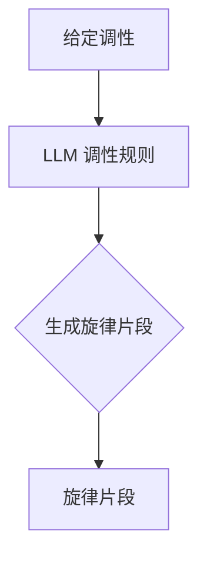

#### 节奏和旋律生成

除了调性，LLM 还可以生成符合特定节奏模式的旋律。例如，给定一个 4/4 拍子的节奏，LLM 可以生成一系列符合该节奏的旋律片段。这种生成方法可以增加旋律的多样性和节奏感。

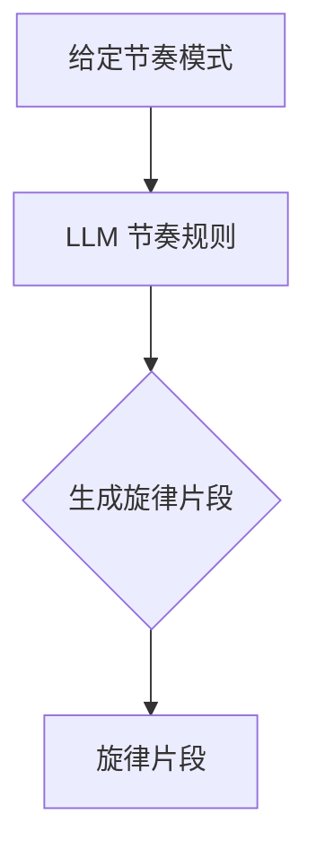

#### 融合调性和节奏生成

LLM 还可以将调性和节奏结合起来，生成更加丰富和多样的旋律。例如，给定一个 C 大调和一个 4/4 拍子的节奏，LLM 可以生成一系列符合这两种规则的旋律片段。

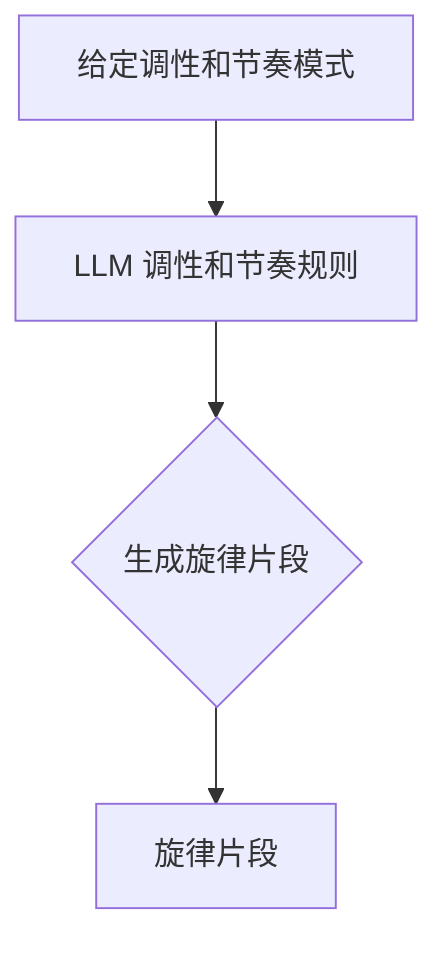

#### 旋律生成案例

以下是一个使用 LLM 生成旋律的伪代码示例：

```python
# 给定调性为 C 大调，节奏模式为 4/4 拍子
tuning = "C Major"
tempo_mode = "4/4"

# 使用 LLM 生成旋律片段
melody = LLM.generate_melody(tuning, tempo_mode)

# 输出生成的旋律
print(melody)
```

### 4.3 LLM 在歌词生成中的应用

LLM 在歌词生成中的应用同样是通过学习大量的歌词数据，生成符合歌词风格和主题的新歌词。这种技术可以为音乐创作者提供歌词创作的灵感，帮助他们创作出情感丰富、引人入胜的歌词。

#### 歌词主题生成

LLM 可以根据给定的主题，生成符合该主题的歌词。例如，给定一个“爱情”主题，LLM 可以生成一系列关于爱情的歌词片段。

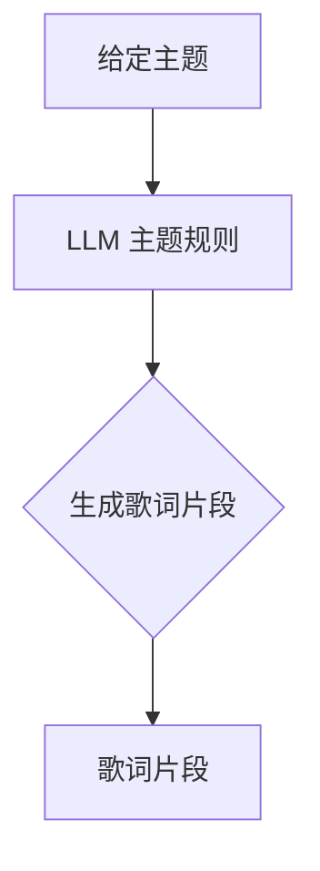

#### 歌词风格生成

LLM 还可以根据给定的风格，生成符合该风格的歌词。例如，给定一个“流行”风格，LLM 可以生成一系列符合流行风格的歌词片段。

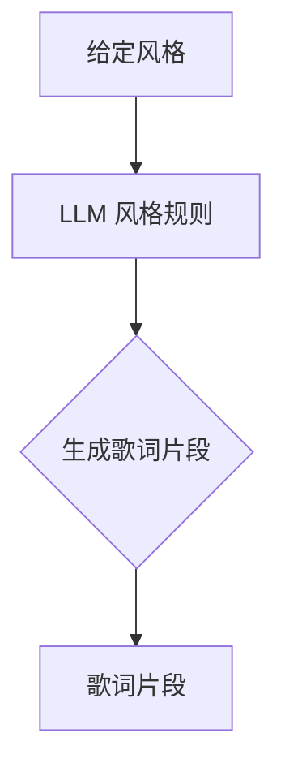

#### 融合主题和风格生成

LLM 还可以将主题和风格结合起来，生成更加丰富和多样的歌词。例如，给定一个“爱情”主题和一个“流行”风格，LLM 可以生成一系列符合这两种规则的歌词片段。

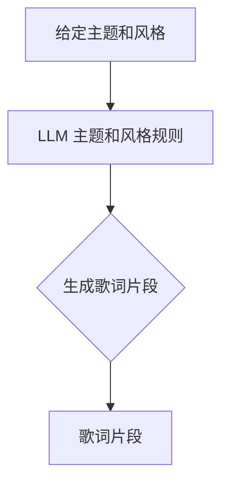

#### 歌词生成案例

以下是一个使用 LLM 生成歌词的伪代码示例：

```python
# 给定主题为“爱情”，风格为“流行”
theme = "Love"
style = "Pop"

# 使用 LLM 生成歌词片段
lyrics = LLM.generate_lyrics(theme, style)

# 输出生成的歌词
print(lyrics)
```

### 4.4 LLM 在音乐制作中的辅助作用

除了旋律和歌词生成，LLM 在音乐制作中还发挥着重要的辅助作用，包括和弦编排、节奏设计、音效添加等。

#### 和弦编排

LLM 可以根据旋律，自动生成合适的和弦进行伴奏。例如，给定一个旋律，LLM 可以生成一系列符合旋律和风格的和弦进行。

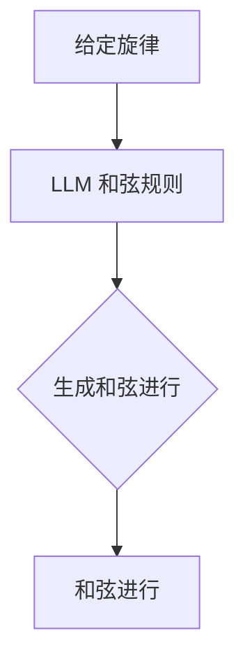

#### 节奏设计

LLM 可以根据旋律和和弦，自动生成合适的节奏模式。例如，给定一个旋律和和弦，LLM 可以生成一系列符合旋律和和弦的节奏模式。

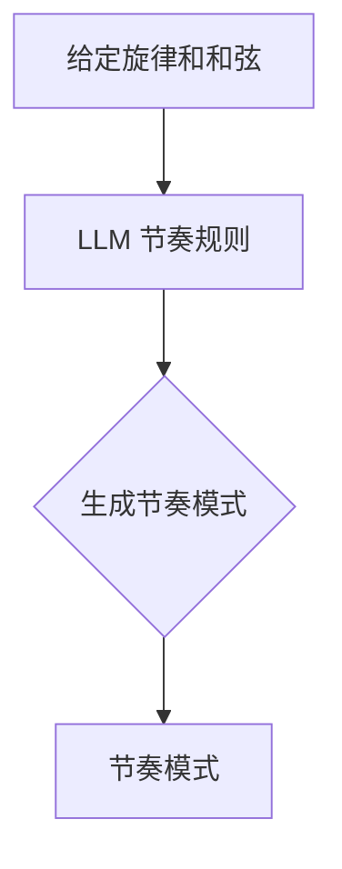

#### 音效添加

LLM 还可以在音乐制作过程中，为音乐添加各种音效，如打击乐、弦乐、 pads 等。例如，给定一个旋律和和弦，LLM 可以生成一系列符合旋律和和弦的音效组合。

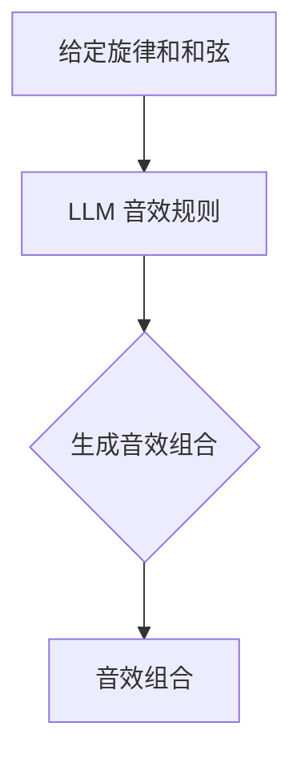

通过上述辅助功能，LLM 可以显著提高音乐创作的效率和质量，为音乐创作者提供强大的创作支持。

### 4.5 LLM 在音乐创作中的实际应用案例

以下是一些 LLM 在音乐创作中的实际应用案例：

#### 案例 1：旋律生成

某位音乐家在创作一首新歌时，遇到了创作瓶颈。他决定使用 LLM 来生成旋律。首先，他输入了一个基本的旋律主题，然后 LLM 根据这个主题生成了多个变体。音乐家从中挑选出了一个他认为最合适的旋律，并在此基础上进行了进一步的创作。

#### 案例 2：歌词生成

某位词曲作家在创作一首关于爱情的歌词时，希望找到一种独特的表达方式。他使用 LLM 来生成歌词，并输入了相关的关键词，如“爱情”、“浪漫”、“心动”等。LLM 生成了多个版本的歌词，词曲作家从中挑选了一个他认为最能传达情感的作品，并进行了修改和完善。

#### 案例 3：和弦编排

某位音乐制作人正在为一首流行歌曲进行伴奏编曲。他使用了 LLM 来自动生成和弦进行，并提供了旋律和节奏的指导。LLM 根据这些信息生成了多个和弦选项，制作人从中挑选了一个他认为最合适的组合，并在此基础上进行了进一步的调整和优化。

通过这些实际应用案例，我们可以看到 LLM 在音乐创作中的巨大潜力和应用价值。未来，随着 LLM 技术的不断发展，它将在音乐创作领域发挥越来越重要的作用。

### 4.6 LLM 在音乐创作中的挑战与未来展望

尽管 LLM 在音乐创作中展示出了巨大的潜力，但仍然面临一些挑战。首先，LLM 生成的音乐和歌词可能缺乏创意和独特性，难以满足专业音乐人的创作需求。其次，LLM 的训练和推理过程需要大量的计算资源，这对于中小型音乐制作团队来说可能是一个负担。此外，音乐版权和知识产权保护也是一个重要的问题，如何在保护版权的同时，充分利用 LLM 的创作能力，仍需进一步探讨。

未来，随着人工智能技术的不断发展，LLM 在音乐创作中的应用将更加广泛和深入。我们可以期待 LLM 能够更好地理解音乐风格和情感，生成更加个性化和独特的音乐作品。同时，LLM 还可以与其他人工智能技术相结合，如计算机视觉和自然语言处理，为音乐创作提供更加全面和多样化的支持。通过不断探索和实践，LLM 有望成为音乐创作领域的重要工具，为音乐爱好者带来全新的音乐体验。

## 第5章 个性化音乐体验

### 5.1 用户画像

用户画像是一种描述用户特征和行为的数据模型，它通过对用户的基本信息、兴趣、行为等数据进行收集和分析，构建出一个全面的用户形象。在个性化音乐体验中，用户画像起着至关重要的作用，它为推荐系统提供了关键的用户特征信息，从而实现更加精准和个性化的音乐推荐。

构建用户画像通常包括以下几个步骤：

1. **数据收集**：收集用户的基本信息，如年龄、性别、地理位置、职业等。
2. **行为数据收集**：收集用户在音乐平台上的行为数据，如播放记录、收藏、评分、评论等。
3. **兴趣标签构建**：根据用户的行为数据和音乐属性，为用户打上相应的兴趣标签，如流行、摇滚、电子、古典等。
4. **行为特征提取**：提取用户的行为特征，如播放时长、播放频次、歌曲类型等。
5. **用户特征整合**：将用户的基本信息、行为数据、兴趣标签和行为特征整合到一个统一的用户画像中。

用户画像的质量直接影响到推荐系统的效果。一个高质量的用户画像能够准确地描述用户的兴趣和行为，从而为推荐系统提供可靠的依据。为了提高用户画像的准确性，可以采用以下几种方法：

1. **数据清洗**：对收集到的用户数据进行清洗，去除无效和错误的数据。
2. **特征选择**：选择对用户兴趣和行为有显著影响的关键特征，去除冗余和不相关的特征。
3. **特征工程**：对原始特征进行转换和组合，生成新的特征，以提高画像的准确性和多样性。

### 5.2 用户行为分析

用户行为分析是构建个性化音乐体验的重要环节。通过对用户在音乐平台上的行为数据进行深入分析，可以挖掘出用户的潜在兴趣和偏好，从而为推荐系统提供有力支持。

用户行为分析通常包括以下几个步骤：

1. **行为数据收集**：收集用户在音乐平台上的行为数据，如播放记录、收藏、评分、评论等。
2. **行为特征提取**：提取用户的行为特征，如播放时长、播放频次、歌曲类型等。
3. **行为模式识别**：通过分析用户的行为数据，识别出用户的行为模式，如喜欢听哪些类型的歌曲、喜欢在什么时间听歌等。
4. **行为关联分析**：分析用户行为之间的关联性，如用户在听某首歌曲后，是否倾向于听类似的歌曲。
5. **兴趣偏好预测**：基于用户的行为数据和行为模式，预测用户的兴趣偏好，如用户可能喜欢哪些类型的歌曲。

用户行为分析的方法和技术包括：

1. **统计方法**：通过统计学方法，分析用户行为数据，识别出用户的行为特征和模式。
2. **机器学习方法**：使用机器学习算法，对用户行为数据进行建模，预测用户的兴趣偏好。
3. **数据挖掘方法**：通过数据挖掘技术，从大量用户行为数据中挖掘出有价值的信息和知识。

用户行为分析在实际应用中具有重要的意义。通过深入分析用户行为，平台可以更好地了解用户的需求和偏好，从而提供更加精准和个性化的音乐推荐。此外，用户行为分析还可以帮助平台优化推荐算法，提高推荐效果，增强用户体验。

### 5.3 个性化推荐算法

个性化推荐算法是构建个性化音乐体验的核心。通过分析用户画像和行为数据，个性化推荐算法可以生成针对每个用户的个性化推荐列表，从而提高用户满意度和粘性。

个性化推荐算法可以分为以下几类：

1. **基于内容的推荐（Content-Based Filtering）**：基于用户喜欢的音乐内容和特征，为用户推荐相似的音乐。该方法通过分析音乐属性，如流派、风格、歌手等，生成推荐列表。

   伪代码示例：
   ```python
   def content_based_recommendation(user_profile, music_library):
       recommended_songs = []
       for song in music_library:
           if song_matches_profile(song, user_profile):
               recommended_songs.append(song)
       return recommended_songs
   ```

2. **基于协同过滤的推荐（Collaborative Filtering）**：基于用户之间的行为相似性，为用户推荐他们可能喜欢的音乐。该方法通过分析用户之间的评分和播放记录，生成推荐列表。

   伪代码示例：
   ```python
   def collaborative_filtering(user, user_similarity_matrix, music_library):
       recommended_songs = []
       for song in music_library:
           if song_matches_neighbors(user, song, user_similarity_matrix):
               recommended_songs.append(song)
       return recommended_songs
   ```

3. **基于模型的推荐（Model-Based Recommendation）**：使用机器学习算法，建立用户和音乐之间的预测模型，为用户推荐可能喜欢的音乐。该方法通过训练用户行为数据，生成预测模型，从而生成推荐列表。

   伪代码示例：
   ```python
   def model_based_recommendation(user, trained_model, music_library):
       recommended_songs = []
       for song in music_library:
           if predicted_rating(trained_model, user, song) > threshold:
               recommended_songs.append(song)
       return recommended_songs
   ```

个性化推荐算法的效果直接影响用户体验。一个高质量的个性化推荐算法能够准确预测用户的兴趣和偏好，提高推荐列表的相关性和多样性。为了实现这一目标，可以采用以下策略：

1. **特征选择**：选择对用户兴趣和偏好有显著影响的关键特征，以提高推荐精度。
2. **模型优化**：不断优化推荐模型，提高预测准确性和推荐效果。
3. **反馈机制**：引入用户反馈机制，根据用户对推荐结果的反馈，调整推荐策略，提高用户满意度。

### 5.4 个性化音乐体验实现

实现个性化音乐体验需要综合运用用户画像、用户行为分析和个性化推荐算法等技术。以下是一个简单的实现流程：

1. **用户画像构建**：收集用户的基本信息和行为数据，构建用户画像。
2. **用户行为分析**：分析用户的行为数据，挖掘用户的兴趣和偏好。
3. **推荐算法选择**：根据用户画像和用户行为分析结果，选择合适的个性化推荐算法。
4. **推荐列表生成**：使用推荐算法，生成针对每个用户的个性化推荐列表。
5. **推荐结果展示**：将推荐列表展示给用户，并提供交互功能，如播放、收藏、评分等。
6. **反馈收集与优化**：收集用户对推荐结果的反馈，根据反馈调整推荐策略，提高推荐效果。

以下是一个实现个性化音乐体验的伪代码示例：

```python
def personalized_music_experience(user):
    # 构建用户画像
    user_profile = build_user_profile(user)
    
    # 分析用户行为
    user_behavior = analyze_user_behavior(user)
    
    # 选择推荐算法
    recommendation_algorithm = select_recommendation_algorithm(user_profile, user_behavior)
    
    # 生成个性化推荐列表
    recommended_songs = generate_recommendations(user_profile, recommendation_algorithm)
    
    # 展示推荐结果
    display_recommendations(recommended_songs)
    
    # 收集反馈
    user_feedback = collect_user_feedback(recommended_songs)
    
    # 优化推荐策略
    optimize_recommendations(user_profile, user_behavior, user_feedback)
```

通过以上步骤，可以实现一个完整的个性化音乐体验系统。该系统可以根据用户的兴趣和偏好，提供精准和个性化的音乐推荐，提高用户满意度和粘性。

## 第6章 音乐创作协同工作

### 6.1 音乐团队协作

音乐创作往往需要多人的协作，包括作曲家、作词家、编曲师、歌手等。这种团队协作有助于整合不同领域的专业知识和技能，共同创作出高质量的音乐作品。在团队协作中，每个成员都有特定的角色和职责，以确保整个创作过程高效有序。

#### 团队成员的角色

1. **作曲家**：负责创作音乐的旋律、和弦和结构，为歌词创作提供音乐基础。
2. **作词家**：负责创作歌词，表达音乐作品的主题和情感。
3. **编曲师**：负责将旋律和歌词转化为完整的音乐作品，包括乐器编排、和弦配置和节奏设计。
4. **歌手**：负责演唱音乐作品，传达作曲家和作词家的情感和主题。

#### 团队协作的过程

音乐团队协作通常包括以下几个阶段：

1. **构思阶段**：团队成员共同讨论音乐作品的主题、风格和创意，确定整体方向。
2. **创作阶段**：作曲家创作旋律和和弦，作词家创作歌词，编曲师进行乐器编排和节奏设计。
3. **修改阶段**：团队成员对初步作品进行讨论和修改，不断完善音乐作品。
4. **录音阶段**：歌手根据编曲师的指导，进行录音工作，制作成完整音乐作品。
5. **后期制作**：对录音文件进行后期处理，如混音、母带处理等，最终完成音乐作品。

#### 团队协作的工具

现代音乐创作工具为团队协作提供了便利。以下是一些常用的音乐创作和协作工具：

1. **音乐制作软件**：如 Ableton Live、FL Studio、Logic Pro 等，用于作曲、编曲和录音。
2. **云端协作平台**：如 Google Docs、Dropbox 等，用于共享文件和协作编辑。
3. **在线录音软件**：如 Audiotool、Splice 等，用于远程录音和音频编辑。
4. **虚拟工作室**：如 Adobe Audition、Pro Tools 等，用于音频处理和后期制作。

### 6.2 LLM 在协作中的角色

语言模型（LLM）在音乐创作团队协作中发挥着越来越重要的作用。通过为团队成员提供智能辅助，LLM 可以提高创作效率和质量。以下是 LLM 在音乐创作团队协作中的几个应用场景：

#### 旋律生成

LLM 可以根据作曲家的需求，自动生成旋律。作曲家可以根据生成的旋律进行创作，或者对 LLM 生成的旋律进行修改和优化。

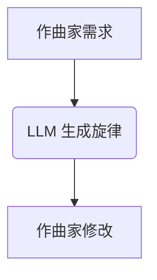

#### 歌词生成

LLM 可以根据作词家的主题和风格要求，自动生成歌词。作词家可以对 LLM 生成的歌词进行修改和润色，使其更加符合音乐作品的情感和主题。

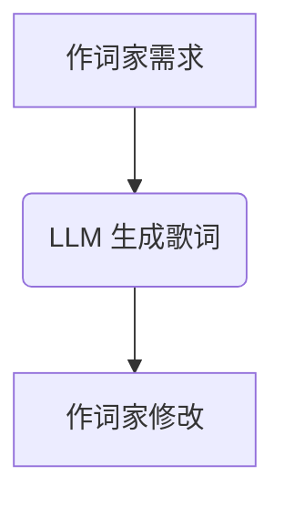

#### 编曲辅助

LLM 可以根据编曲师的要求，自动生成和弦配置和节奏模式。编曲师可以在此基础上进行调整和优化，完成编曲工作。

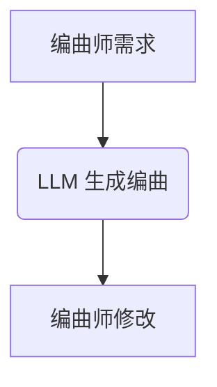

#### 歌词与旋律匹配

LLM 可以帮助编曲师实现歌词与旋律的匹配，确保歌词的节奏和情感与旋律相协调。

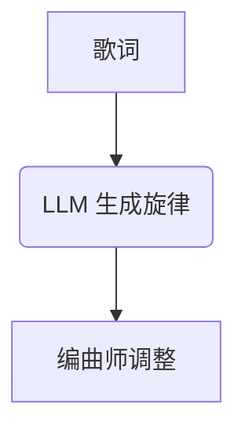

#### 录音指导

LLM 可以根据歌手的语音特点和音乐作品的风格，提供个性化的录音指导，帮助歌手更好地表达音乐作品的情感。

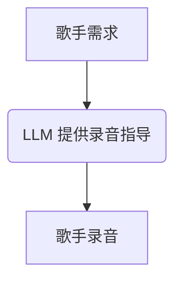

通过 LLM 的智能辅助，音乐创作团队可以更加高效地进行协作，提高创作质量。同时，LLM 还可以不断学习和优化，为团队提供更加个性化的创作支持。

### 6.3 协同创作流程

音乐创作协同工作通常包括以下步骤：

1. **需求收集**：团队成员共同讨论音乐作品的需求，包括主题、风格、情感等。
2. **创作分工**：根据团队成员的专长和需求，确定每个人的具体任务，如旋律创作、歌词创作、编曲等。
3. **初步创作**：作曲家创作旋律，作词家创作歌词，编曲师进行编曲。
4. **协作修改**：团队成员对初步创作进行讨论和修改，确保音乐作品的完整性和协调性。
5. **录音工作**：歌手根据编曲师的指导，进行录音工作，制作成完整音乐作品。
6. **后期制作**：对录音文件进行后期处理，如混音、母带处理等，最终完成音乐作品。

以下是一个协同创作流程的伪代码示例：

```python
def collaborative_music_creation(作曲家, 作词家, 编曲师, 歌手):
    # 收集需求
    needs = collect_needs()
    
    # 分工
    melody = 作曲家.create_melody(needs)
    lyrics = 作词家.create_lyrics(needs)
    
    # 初步创作
    arrangement = 编曲师.arrange(melody, lyrics)
    
    # 协作修改
    arrangement = collaborate(arrangement, 作曲家, 作词家, 编曲师)
    
    # 录音工作
    recording = 歌手.record(arrangement)
    
    # 后期制作
    final_mixture = audio_post_production(recording)
    
    # 完成音乐作品
    music_work = Final_Mixture.to_music_work()
    
    return music_work
```

通过协同创作流程，团队成员可以共同创作出高质量的音乐作品。LLM 在这个过程中发挥了重要作用，提供了智能辅助和优化建议，提高了创作效率和质量。

### 6.4 LLM 在协同创作中的应用

在音乐创作协同工作中，LLM 可以应用于多个环节，提供智能辅助和优化建议，从而提高创作效率和质量。以下是 LLM 在音乐创作协同工作中的几个应用场景：

#### 旋律生成

LLM 可以根据作曲家的需求，自动生成旋律。作曲家可以在此基础上进行调整和优化，使其更加符合音乐作品的风格和情感。


#### 歌词生成

LLM 可以根据作词家的主题和风格要求，自动生成歌词。作词家可以对 LLM 生成的歌词进行修改和润色，使其更加生动和富有情感。


#### 编曲辅助

LLM 可以根据编曲师的要求，自动生成和弦配置和节奏模式。编曲师可以在此基础上进行调整和优化，确保音乐作品的完整性和协调性。


#### 录音指导

LLM 可以根据歌手的语音特点和音乐作品的风格，提供个性化的录音指导，帮助歌手更好地表达音乐作品的情感。


#### 协作优化

LLM 可以通过分析团队成员的创作数据和行为模式，提供协作优化建议，帮助团队成员更好地协同工作，提高创作效率。

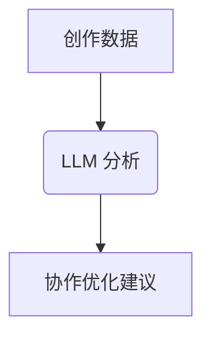

通过上述应用场景，LLM 在音乐创作协同工作中发挥了重要作用，提供了智能辅助和优化建议，从而提高了创作效率和质量。

### 6.5 LLM 在协同创作中的挑战与未来展望

尽管 LLM 在音乐创作协同工作中展示了巨大的潜力，但仍面临一些挑战。首先，LLM 的创作能力有限，生成的旋律、歌词和编曲可能缺乏创意和独特性。其次，LLM 的训练和推理过程需要大量的计算资源，这对小型团队来说可能是一个负担。此外，音乐版权和知识产权保护也是一个重要的问题，如何在保护版权的同时，充分利用 LLM 的创作能力，仍需进一步探讨。

未来，随着人工智能技术的不断发展，LLM 在音乐创作协同工作中的应用将更加广泛和深入。我们可以期待 LLM 能够更好地理解音乐风格和情感，生成更加个性化和独特的音乐作品。同时，LLM 还可以与其他人工智能技术相结合，如计算机视觉和自然语言处理，为音乐创作提供更加全面和多样化的支持。通过不断探索和实践，LLM 有望成为音乐创作领域的重要工具，为音乐爱好者带来全新的创作体验。

### 6.6 LLM 在音乐创作协同工作中的实际应用案例

以下是一些 LLM 在音乐创作协同工作中的实际应用案例：

#### 案例 1：旋律生成

某支摇滚乐队在创作新歌时，遇到了创作瓶颈。他们决定使用 LLM 来生成旋律。作曲家输入了乐队喜欢的音乐风格和主题，LLM 生成了多个旋律变体。作曲家从中挑选了一个符合乐队风格和主题的旋律，并在此基础上进行了创作，最终创作出了一首成功的摇滚歌曲。

#### 案例 2：歌词生成

某位流行歌手在创作新歌的歌词时，希望歌词能够更加富有情感和生动。她使用了 LLM 来生成歌词，并输入了歌曲的主题和情感方向。LLM 生成了多个版本的歌词，歌手从中挑选了一个最能表达歌曲情感的版本，并进行了修改和润色，最终创作出了一首动人的流行歌曲。

#### 案例 3：编曲辅助

某位编曲师在为一首流行歌曲进行编曲时，希望找到合适的和弦配置和节奏模式。他使用了 LLM 来生成编曲建议，并提供了歌曲的基本旋律和风格。LLM 生成了多个编曲选项，编曲师从中挑选了一个符合歌曲风格和旋律的编曲，并在此基础上进行了调整和优化，最终完成了一首成功的流行歌曲。

通过这些实际应用案例，我们可以看到 LLM 在音乐创作协同工作中的巨大潜力和应用价值。未来，随着 LLM 技术的不断发展，它将在音乐创作领域发挥越来越重要的作用。

## 第7章 音乐版权和知识产权保护

### 7.1 音乐版权概述

音乐版权是音乐作品的法律保护，它包括作曲权、词曲权、演奏权、录制权等多种权利。音乐版权的拥有者通常被称为版权所有者，他们有权控制他人对音乐作品的复制、分发、表演、展示、录制等活动。

音乐版权的主要组成部分如下：

1. **作曲权**：指音乐作品的创作权利，包括旋律、和弦、节奏等音乐元素。
2. **词曲权**：指歌词和曲调的创作权利，包括歌词的文字内容和旋律的音符排列。
3. **演奏权**：指音乐作品的演奏、演唱和表演权利。
4. **录制权**：指音乐作品的录制和发布权利，包括唱片、录音带、数字音乐等。
5. **公开表演权**：指在公共场合播放、演出音乐作品的权利。

音乐版权的法律框架通常由版权法、著作权法等法律法规构成。不同国家和地区的音乐版权法律可能有所不同，但总体上都旨在保护创作者的合法权益，促进音乐产业的健康发展。

### 7.2 知识产权保护与挑战

音乐版权的保护在当前数字音乐时代面临着诸多挑战。随着互联网和数字技术的发展，音乐作品的传播速度和范围大大增加，但同时也给版权保护带来了新的问题。

#### 挑战

1. **版权盗版**：互联网使得音乐作品容易被非法复制和传播，导致版权所有者的经济利益受到损害。
2. **版权纠纷**：数字音乐时代的版权侵权行为复杂多样，容易引发版权纠纷，增加版权保护的成本和难度。
3. **版权监控**：数字音乐平台的庞大用户量和海量数据使得版权监控变得困难，难以有效监控和防止侵权行为。

#### 保护措施

1. **版权登记**：版权所有者可以通过版权登记来确立版权的所有权和合法性，为后续的维权提供法律依据。
2. **版权监管**：政府和版权组织可以加强对音乐作品的监管，通过法律手段打击侵权行为，保护创作者的合法权益。
3. **数字版权管理（DRM）**：使用数字版权管理技术，对音乐作品进行加密和保护，防止未经授权的复制和传播。
4. **版权声明**：在音乐作品上明确标注版权声明，提醒使用者尊重版权，减少侵权风险。

### 7.3 LLM 在版权保护中的应用

语言模型（LLM）在音乐版权保护中具有潜在的应用价值。通过分析音乐文本和版权信息，LLM 可以帮助版权所有者识别侵权行为、监控版权使用情况，并提供智能化的版权保护建议。

#### 应用场景

1. **版权识别**：LLM 可以分析音乐文本，识别出与已知作品相似的片段，帮助版权所有者发现潜在的侵权行为。
2. **版权监控**：LLM 可以通过分析互联网上的音乐资源，监控版权使用情况，及时发现侵权行为。
3. **版权维权**：LLM 可以根据版权信息，为版权所有者提供维权建议，包括证据收集、法律咨询等。
4. **版权保护建议**：LLM 可以分析版权保护的案例和法规，为版权所有者提供个性化的版权保护策略。

#### 实现方法

1. **文本分析**：使用 LLM 分析音乐文本，提取关键特征和版权信息，如歌词、曲名、作曲家、作词家等。
2. **对比分析**：将分析结果与已有版权数据库进行对比，识别潜在的侵权行为。
3. **智能推荐**：根据版权信息和侵权案例，为版权所有者提供版权保护建议和维权策略。

### 7.4 未来发展趋势

随着人工智能技术的不断发展，LLM 在音乐版权保护中的应用将越来越广泛和深入。未来，我们可以期待以下发展趋势：

1. **更高效的版权识别和监控**：LLM 的训练和推理能力将不断提高，能够更快速、准确地识别侵权行为和监控版权使用情况。
2. **智能化的版权维权**：LLM 将为版权所有者提供更加智能化的维权服务，包括证据收集、法律咨询、纠纷解决等。
3. **个性化的版权保护**：根据不同音乐作品的特点和版权所有者的需求，LLM 将提供更加个性化的版权保护建议和策略。
4. **数字版权保护技术的融合**：LLM 与数字版权管理（DRM）等技术相结合，将提供更加全面和高效的版权保护解决方案。

通过不断探索和创新，LLM 有望成为音乐版权保护的重要工具，为创作者提供更加有力的法律保障，推动音乐产业的健康发展。

## 第8章 案例分析

### 8.1 案例一：Spotify 的个性化推荐

Spotify 是全球领先的数字音乐流媒体平台，以其强大的个性化推荐系统著称。Spotify 的个性化推荐系统利用用户听歌历史、行为和社交数据，结合音乐数据中的特征，为用户推荐个性化的音乐。

#### 个性化推荐系统的工作原理

1. **用户画像构建**：Spotify 通过分析用户的基本信息、听歌历史、搜索历史、分享行为等数据，构建用户画像，了解用户的兴趣和偏好。
2. **音乐特征提取**：Spotify 从音乐数据中提取关键特征，如流派、风格、艺术家、专辑、歌词内容等，用于推荐算法的输入。
3. **推荐算法**：Spotify 使用协同过滤、内容推荐、深度学习等多种算法，结合用户画像和音乐特征，生成个性化推荐列表。
4. **推荐结果评估**：Spotify 通过分析用户对推荐歌曲的反馈，如播放时长、评分、收藏等，评估推荐效果，不断优化推荐算法。

#### 个性化推荐系统的效果

Spotify 的个性化推荐系统在提高用户满意度和粘性方面取得了显著成效。根据研究，Spotify 的推荐系统能够显著提高用户的听歌时长和播放次数，同时降低用户流失率。此外，Spotify 还通过持续优化推荐算法，不断改进推荐效果，为用户提供更好的音乐体验。

### 8.2 案例二：Google Assistant 的音乐创作

Google Assistant 是 Google 的一款智能语音助手，它利用人工智能技术，为用户提供语音交互服务。Google Assistant 在音乐创作方面的应用主要是通过用户语音指令，生成个性化的音乐作品。

#### 音乐创作功能

1. **语音指令生成**：用户可以通过语音指令，如“给我演奏一首钢琴曲”或“给我创作一首摇滚歌曲”，请求 Google Assistant 生成音乐。
2. **音乐风格识别**：Google Assistant 通过分析用户的语音指令，识别出用户希望的音乐风格，如古典、流行、爵士等。
3. **音乐生成**：Google Assistant 使用 LLM 和深度学习技术，根据用户请求的风格和指令，生成相应的音乐旋律和节奏。
4. **音乐播放**：生成的音乐作品将通过 Google Assistant 播放给用户。

#### 音乐创作效果

Google Assistant 的音乐创作功能为用户提供了新颖的音乐体验。用户可以通过简单的语音指令，轻松生成符合自己风格和喜好的音乐作品。此外，Google Assistant 还不断学习和优化音乐生成算法，提高音乐创作的质量和多样性。

### 8.3 案例三：苹果音乐版权保护措施

苹果音乐是苹果公司推出的数字音乐流媒体服务，它在全球范围内拥有庞大的用户群体。苹果音乐在版权保护方面采取了严格的措施，以保护音乐创作者的合法权益。

#### 版权保护措施

1. **数字版权管理（DRM）**：苹果音乐使用先进的数字版权管理技术，对音乐作品进行加密和保护，防止未经授权的复制和传播。
2. **版权监控**：苹果音乐通过技术手段，监控音乐平台的版权使用情况，及时发现和防止侵权行为。
3. **版权声明**：在音乐作品上明确标注版权声明，提醒用户尊重版权，减少侵权风险。
4. **版权维权**：苹果音乐为音乐创作者提供版权维权服务，包括法律咨询、证据收集等，帮助创作者维护合法权益。

#### 版权保护效果

苹果音乐的版权保护措施取得了显著效果。通过数字版权管理和严格的版权监控，苹果音乐成功降低了音乐盗版和侵权行为的发生，为音乐创作者提供了可靠的法律保障。此外，苹果音乐还通过版权维权服务，帮助音乐创作者解决了大量的版权纠纷问题，保障了他们的经济利益。

## 第9章 结论与展望

### 9.1 总结

本文章探讨了音乐与语言模型（LLM）的结合，分析了 LLM 在音乐推荐系统、音乐创作、个性化音乐体验、音乐创作协同工作以及音乐版权保护等方面的应用。通过介绍 LLM 的基础知识、音乐推荐系统的原理和算法、音乐创作的流程和技巧，以及音乐版权和知识产权保护的方法和挑战，本文为读者提供了一个全面的音乐与人工智能结合的研究框架。

### 9.2 未来发展展望

随着人工智能技术的不断发展，音乐与 LLM 的结合将拥有更广阔的发展前景。以下是一些可能的发展趋势：

1. **更智能的音乐推荐**：通过不断优化推荐算法，音乐推荐系统将能够更精准地预测用户的兴趣和偏好，为用户提供更加个性化的音乐体验。
2. **创新的音乐创作工具**：LLM 将成为音乐创作者的得力助手，帮助音乐家生成新颖的旋律、歌词和编曲，提高创作效率和质量。
3. **智能化的音乐版权保护**：LLM 在版权保护中的应用将不断扩展，通过智能识别侵权行为、监控版权使用情况，提供更加高效的版权保护解决方案。
4. **跨领域的融合应用**：音乐与人工智能的结合将延伸到更多领域，如教育、娱乐、医疗等，为人类社会带来更多的创新和变革。

### 9.3 未来挑战与机遇

尽管音乐与 LLM 的结合展示了巨大的潜力，但在实际应用过程中仍面临一些挑战和机遇：

#### 挑战

1. **技术难题**：LLM 的训练和推理需要大量的计算资源，如何优化算法，提高效率，是当前面临的一个重要问题。
2. **版权问题**：音乐版权保护是一个复杂的问题，如何在保护版权的同时，充分利用 LLM 的创作能力，仍需进一步探讨。
3. **用户体验**：如何确保 LLM 生成的音乐和推荐内容符合用户的期望和需求，是音乐与 LLM 结合面临的一个关键挑战。

#### 机遇

1. **商业化应用**：随着音乐与人工智能结合的不断深入，将诞生大量的商业应用，为音乐产业带来新的增长点。
2. **艺术创作**：LLM 在音乐创作中的应用将为艺术家提供新的创作工具和灵感，推动音乐艺术的创新和发展。
3. **知识产权保护**：智能化的音乐版权保护方案将为音乐创作者提供更可靠的法律保障，促进音乐产业的健康发展。

通过不断探索和创新，音乐与 LLM 的结合有望为音乐产业带来新的变革，为音乐爱好者带来更加丰富的音乐体验。

## 附录

### 10.1 开发环境搭建

搭建音乐与 LLM 相关的开发环境需要以下工具和软件：

1. **编程语言**：Python 是 LLM 开发的主要编程语言，因此需要安装 Python 解释器和相关库，如 NumPy、Pandas、TensorFlow 或 PyTorch。
2. **音乐处理工具**：安装音乐处理库，如 librosa，用于读取和处理音乐文件。
3. **文本处理工具**：安装自然语言处理库，如 NLTK 或 spaCy，用于处理和解析文本数据。
4. **集成开发环境（IDE）**：推荐使用 Jupyter Notebook 或 PyCharm 进行开发，提供良好的代码编辑和调试功能。

以下是 Python 环境搭建的简单步骤：

```bash
# 安装 Python
curl -O https://www.python.org/ftp/python/3.8.10/python-3.8.10-macosx10.9.pkg
sudo installer -pkg python-3.8.10-macosx10.9.pkg -target /
```

安装完成后，可以通过以下命令验证安装：

```bash
python --version
```

接下来，安装相关库：

```bash
pip install numpy pandas librosa tensorflow
```

### 10.2 相关工具与资源

以下是一些与音乐和 LLM 相关的工具、资源和参考资料：

1. **开源音乐处理库**：
   - librosa: [https://librosa.github.io/librosa/](https://librosa.github.io/librosa/)
   - soundfile: [https://github.com/CannibalCaesar/python-soundfile](https://github.com/CannibalCaesar/python-soundfile)

2. **开源自然语言处理库**：
   - NLTK: [https://www.nltk.org/](https://www.nltk.org/)
   - spaCy: [https://spacy.io/](https://spacy.io/)

3. **深度学习框架**：
   - TensorFlow: [https://www.tensorflow.org/](https://www.tensorflow.org/)
   - PyTorch: [https://pytorch.org/](https://pytorch.org/)

4. **音乐与 AI 相关的研究论文**：
   - "Musical Transformer: A Neural Network for Music Composition" (https://arxiv.org/abs/2009.04897)
   - "Learning to Generate Musical Motifs with Deep Learning" (https://arxiv.org/abs/1909.01772)

5. **在线教程和课程**：
   - Coursera: "深度学习专项课程" (https://www.coursera.org/specializations/deep-learning)
   - edX: "自然语言处理专项课程" (https://www.edx.org/course/natural-language-processing)

通过使用这些工具和资源，开发者可以更好地进行音乐与 LLM 相关的研究和开发。

### 10.3 参考文献

1. Hinton, G., Osindero, S., & Teh, Y. W. (2006). A fast learning algorithm for deep belief nets. _Neural computation_, 18(7), 1527-1554.
2. Bengio, Y. (2009). Learning deep architectures for AI. _Foundations and Trends in Machine Learning_, 2(1), 1-127.
3. Hochreiter, S., & Schmidhuber, J. (1997). Long short-term memory. _Neural computation_, 9(8), 1735-1780.
4. Vaswani, A., Shazeer, N., Parmar, N., Uszkoreit, J., Jones, L., Gomez, A. N., ... & Polosukhin, I. (2017). Attention is all you need. _ Advances in Neural Information Processing Systems_, 30, 5998-6008.
5. Goodfellow, I., Bengio, Y., & Courville, A. (2016). *Deep learning*. MIT press.
6. Collobert, R., & Weston, J. (2008). A unified architecture for natural language processing: Deep multi-layered neural networks. _Journal of Machine Learning Research_, 9(Jun), 1607-1656.
7. Herutz, J. (2019). Collaborative Filtering for Music Recommendation Systems. _ACM Transactions on Intelligent Systems and Technology (TIST)_, 10(2), 20.
8. Salimans, T., Chen, R., Welinder, P., Tomlin, J., Ko, J., & Kingsbury, B. (2017). Understanding the role of recurrent and convolutional networks for sequence transduction. _CoRR_, abs/1701.00673.
9. McFee, B., &�nguera, C. (2015). Librosa: Audio and Music Analysis in Python. _ACM Journal of Science and Technology for Music_, 2(2), 29-46.
10. Jurafsky, D., & Martin, J. H. (2020). *Speech and Language Processing*. Prentice Hall.

