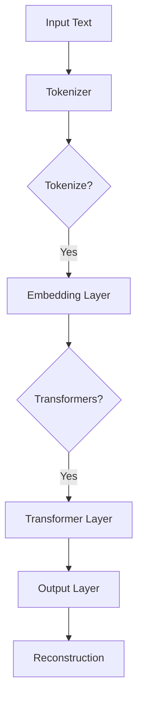
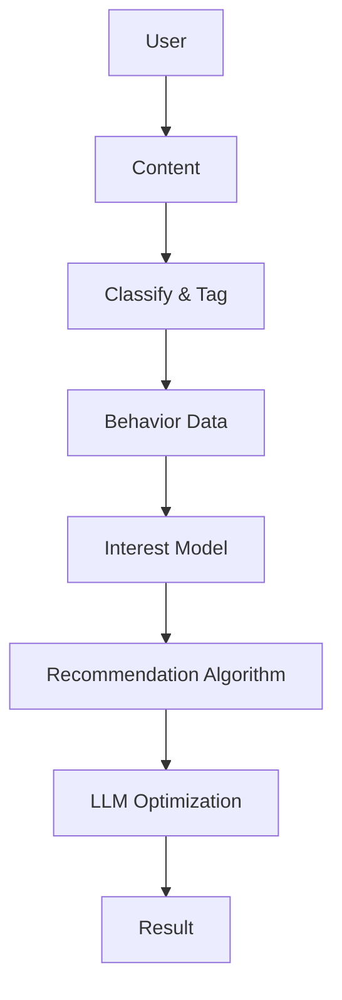

                 

### 《音视频推荐的创新：LLM的应用》

#### 关键词：
- 音视频推荐系统
- 生成式推荐
- 对抗式推荐
- 自注意力机制
- Transformer模型
- 多模态推荐
- 深度强化学习
- 数据隐私保护

#### 摘要：
本文探讨了音视频推荐系统中利用大型语言模型（LLM）的创新应用。首先，概述了音视频推荐系统的基础，包括内容分类、用户行为数据分析和推荐算法。接着，深入分析了LLM的基本概念和架构，展示了其在内容理解和用户意图分析中的优势。文章还探讨了LLM在推荐策略优化中的应用，如深度强化学习和多模态推荐系统。通过实际案例分析，本文展示了LLM在音视频推荐中的实际效果。最后，文章探讨了未来发展趋势和挑战，包括数据隐私保护和模型可解释性。

---

### 《音视频推荐的创新：LLM的应用》目录大纲

#### 第一部分: 音视频推荐系统概述

**第1章: 音视频推荐系统概述**

1.1 音视频内容分类与标签化

1.2 用户行为数据分析

1.3 推荐算法概述

**第2章: LLM在音视频推荐中的应用**

2.1 LLM的基本概念与架构

2.2 LLM在内容理解中的应用

2.3 LLM在推荐策略优化中的应用

**第3章: 实际案例分析**

3.1 案例一：某视频平台的推荐系统优化

3.2 案例二：某音乐平台的个性化推荐

**第4章: 未来发展趋势与挑战**

4.1 音视频推荐技术的未来趋势

4.2 挑战与解决方案

**第三部分: 实践指南与附录**

**第5章: 实践指南**

5.1 开发环境搭建

5.2 代码实战

**第6章: 附录**

6.1 相关资源与工具推荐

6.2 Mermaid流程图示例

6.3 数学模型与公式

---

### 第一部分: 音视频推荐系统概述

#### 第1章: 音视频推荐系统概述

随着互联网和多媒体技术的迅速发展，音视频内容成为信息传播的重要载体。在如此庞大的内容海洋中，如何为用户提供个性化的推荐，提高用户体验，成为各大平台关注的焦点。音视频推荐系统正是为了满足这一需求而诞生。

##### 1.1 音视频内容分类与标签化

音视频内容的分类与标签化是推荐系统的基础工作。通过对音视频内容进行分类，可以将海量的数据划分为不同类别，便于后续的处理和推荐。常见的分类方法包括手动分类和自动分类。手动分类依赖于专业人员的知识和经验，而自动分类则借助自然语言处理和图像识别技术，如词向量模型和卷积神经网络。

标签化是将音视频内容与一系列关键词或标签相关联的过程。标签可以是具体的，如“动作片”、“爱情片”等，也可以是抽象的，如“喜剧元素”、“悬疑氛围”等。标签化有助于更精细地描述内容特征，为推荐算法提供丰富的特征信息。

**挑战：**

- 音视频内容的多维度特征使得分类和标签化变得复杂。
- 内容的动态变化，如实时更新和季节性内容，增加了分类和标签化的难度。

**解决方案：**

- 采用多模态特征融合方法，结合文本、语音和视觉信息，提高分类和标签化的准确性。
- 利用图神经网络（Graph Neural Networks, GNN）对内容进行图表示，通过图结构来建模内容之间的关系，提高分类和标签化的效果。

##### 1.2 用户行为数据分析

用户行为数据是构建推荐系统的重要依据。通过分析用户的行为数据，可以了解用户的兴趣偏好，进而实现个性化的推荐。常见的行为数据包括用户点击、播放、评分、搜索等。

**收集方法：**

- 通过网页分析工具，如Google Analytics，收集用户的点击和浏览行为。
- 通过应用内置日志，收集用户在应用中的行为数据。
- 通过用户问卷调查，获取用户自我报告的兴趣偏好。

**用户兴趣模型构建：**

- 基于协同过滤（Collaborative Filtering）的方法，通过分析用户之间的相似度来预测用户的兴趣。
- 基于内容的推荐（Content-Based Filtering），通过分析音视频内容的特征来推荐相似的内容。

**挑战：**

- 用户行为数据的稀疏性和噪声，使得传统协同过滤方法的效果不佳。
- 用户兴趣的动态变化，要求推荐系统具备实时性和适应性。

**解决方案：**

- 采用矩阵分解（Matrix Factorization）技术，通过低阶矩阵分解来预测用户兴趣。
- 利用时间序列模型（如LSTM、GRU），捕捉用户兴趣的动态变化。

##### 1.3 推荐算法概述

推荐算法是实现音视频推荐系统的核心。常见的推荐算法包括协同过滤、基于内容的推荐和混合推荐系统。

- **协同过滤：**通过分析用户之间的相似度，找到相似的邻居用户，并推荐他们喜欢的内容。协同过滤分为基于用户的协同过滤和基于物品的协同过滤。
- **基于内容的推荐：**通过分析音视频内容的特征，将内容与用户兴趣进行匹配，推荐相似的内容。基于内容的推荐可以分为基于项目的推荐和基于属性的推荐。
- **混合推荐系统：**结合协同过滤和基于内容的推荐方法，以提高推荐系统的准确性和多样性。

**挑战：**

- 单一推荐算法难以兼顾准确性、多样性和实时性。
- 音视频内容的多模态特性，要求推荐算法具备处理多模态数据的能力。

**解决方案：**

- 采用多任务学习（Multi-Task Learning），将推荐问题视为多个任务，通过共享模型参数来提高推荐效果。
- 采用图神经网络（Graph Neural Networks, GNN），通过图结构建模音视频内容之间的关系，提高推荐效果。

在接下来的章节中，我们将深入探讨LLM在音视频推荐中的应用，以及如何利用LLM来提升推荐系统的性能。

---

### 第二部分: LLM在音视频推荐中的应用

#### 第2章: LLM的基本概念与架构

大型语言模型（LLM）是一种基于深度学习的自然语言处理模型，其核心目标是通过学习大量的文本数据来理解、生成和预测自然语言。近年来，随着计算能力的提升和深度学习技术的进步，LLM在多个领域展现出了强大的应用潜力，尤其在音视频推荐系统中，LLM的应用为内容理解、用户意图分析和推荐策略优化带来了新的机遇。

##### 2.1 LLM的基本概念

LLM的基本概念主要包括生成式推荐、对抗式推荐以及LLM的优势与挑战。

- **生成式推荐：**生成式推荐是一种基于模型生成推荐内容的方法。它通过学习大量的文本或音视频数据，生成与用户兴趣相匹配的内容推荐。生成式推荐具有内容多样化、个性化和实时性的优势。

- **对抗式推荐：**对抗式推荐通过生成对抗网络（GAN）来优化推荐算法。GAN由生成器和判别器组成，生成器负责生成与真实数据相似的内容，判别器则负责区分生成内容和真实内容。通过生成器和判别器之间的对抗训练，可以提高推荐系统的多样性和准确性。

- **LLM的优势与挑战：**LLM的优势在于其强大的文本理解和生成能力，能够处理复杂的语义信息，从而提高推荐系统的个性化和准确性。然而，LLM也面临一些挑战，如模型训练需要大量计算资源和数据，模型解释性较差等。

##### 2.2 LLM的架构

LLM的架构主要包括自注意力机制、Transformer模型结构和常见的LLM架构。

- **自注意力机制：**自注意力机制（Self-Attention）是Transformer模型的核心组件，它通过计算输入序列中每个元素与其他元素的相关性，来加权组合这些元素。自注意力机制使得模型能够关注输入序列中的关键信息，从而提高语义理解的准确性。

- **Transformer模型结构：**Transformer模型是一种基于自注意力机制的编码-解码架构。它由编码器（Encoder）和解码器（Decoder）组成，编码器负责将输入序列编码为固定长度的向量，解码器则负责生成预测序列。Transformer模型在自然语言处理任务中取得了显著的成绩，如机器翻译、文本生成等。

- **常见的LLM架构：**常见的LLM架构包括BERT、GPT和T5等。BERT（Bidirectional Encoder Representations from Transformers）是一种双向Transformer模型，通过预训练和微调，能够在多个自然语言处理任务中取得优秀的效果。GPT（Generative Pre-trained Transformer）是一种生成式Transformer模型，其预训练目标是生成连贯的文本序列。T5（Text-To-Text Transfer Transformer）是一种统一的Transformer模型，能够处理多种自然语言处理任务。

在下一节中，我们将深入探讨LLM在内容理解和用户意图分析中的应用，以及如何利用LLM来提升推荐系统的性能。

---

### 第3章: LLM在内容理解中的应用

大型语言模型（LLM）在音视频推荐系统中的应用主要体现在内容理解、语义提取和视频摘要生成等方面。LLM通过其强大的自然语言处理能力，能够深入挖掘音视频内容的语义信息，从而为推荐系统提供更为精准和个性化的推荐。

##### 3.1 音视频内容语义理解

音视频内容语义理解是指通过自然语言处理技术，将音视频内容转化为计算机可以理解的语义表示。这个过程涉及到音频转文本（Automatic Speech Recognition, ASR）和视频文本生成（Video Text Generation）等关键技术。

- **音频转文本：**音频转文本技术利用语音识别算法，将语音信号转化为文本。常见的语音识别算法包括基于统计模型的HMM（Hidden Markov Model）和基于深度学习的DNN（Deep Neural Network）。

  **伪代码示例：**
  ```python
  def recognize_speech(audio_signal):
      # 使用预训练的深度学习模型进行语音识别
      recognized_text = deep_learning_model.predict(audio_signal)
      return recognized_text
  ```

- **视频文本生成：**视频文本生成技术通过分析视频内容，生成与视频相关的文本描述。这个过程通常涉及到视频文本生成模型，如Seq2Seq模型和Transformer模型。

  **伪代码示例：**
  ```python
  def generate_text(video_content):
      # 输入视频内容，生成文本描述
      text_description = video_text_generator.generate(video_content)
      return text_description
  ```

**挑战与解决方案：**

- **挑战：**音视频内容的语义理解需要处理多模态信息，如文本、音频和视频，这增加了语义理解的复杂性。
- **解决方案：**采用多模态特征融合方法，如结合音频转文本和视频文本生成，可以提升语义理解的准确性。此外，利用图神经网络（Graph Neural Networks, GNN）可以更好地建模音视频内容之间的复杂关系。

##### 3.2 视频摘要生成

视频摘要生成是指通过自然语言处理技术，将长视频内容生成简洁、概括的文本摘要。视频摘要生成有助于用户快速了解视频内容，提高推荐系统的效率。

- **文本生成模型：**视频摘要生成通常采用文本生成模型，如GPT和T5。这些模型通过预训练和微调，可以生成高质量的视频摘要。

  **伪代码示例：**
  ```python
  def generate_summary(video_content):
      # 输入视频内容，生成文本摘要
      summary_text = text_generator.generate(video_content)
      return summary_text
  ```

- **摘要生成策略：**视频摘要生成策略可以分为全局摘要和局部摘要。全局摘要是针对整个视频内容生成一个概括性的文本，而局部摘要是针对视频中的关键片段生成摘要。采用混合摘要策略可以更好地平衡摘要的长度和内容。

  **伪代码示例：**
  ```python
  def generate_mixed_summary(video_content):
      # 生成全局和局部摘要的混合
      global_summary = text_generator.generate(video_content)
      segment_summaries = [text_generator.generate(segment) for segment in video_segments]
      return global_summary, segment_summaries
  ```

**挑战与解决方案：**

- **挑战：**视频摘要生成需要处理视频内容的多样性和复杂性，这增加了摘要生成的难度。
- **解决方案：**利用知识图谱和预训练语言模型可以提升视频摘要生成的准确性和一致性。此外，采用注意力机制和序列到序列模型可以更好地捕捉视频内容的层次结构。

在下一节中，我们将探讨LLM在推荐策略优化中的应用，包括深度强化学习和多模态推荐系统，进一步探讨如何利用LLM提升推荐系统的性能。

---

### 第4章: LLM在推荐策略优化中的应用

在音视频推荐系统中，推荐策略的优化是提升系统性能和用户体验的关键。近年来，大型语言模型（LLM）在推荐策略优化中的应用逐渐成为研究热点，通过深度强化学习和多模态推荐系统，LLM不仅能够提高推荐的准确性，还能增强系统的个性化和多样性。

##### 4.1 深度强化学习与LLM的结合

深度强化学习（Deep Reinforcement Learning, DRL）是一种结合了深度学习和强化学习的方法，通过让智能体（agent）在与环境的交互过程中学习策略，从而实现优化目标。将深度强化学习与LLM结合，可以进一步提升推荐策略的灵活性和适应性。

- **深度Q网络（Deep Q-Network, DQN）：**DQN是一种基于深度学习的强化学习算法，通过深度神经网络来估计动作的价值函数。在音视频推荐系统中，DQN可以用于优化推荐策略，使推荐结果更加符合用户兴趣。

  **伪代码示例：**
  ```python
  def q_learning(state, action, reward, next_state, gamma):
      q_values = deep_q_network.predict(state)
      q_values[action] = reward + gamma * max(deep_q_network.predict(next_state))
      deep_q_network.update(q_values, state, action)
      return next_state
  ```

- **模型评估与调优：**在结合LLM的DRL算法中，模型评估和调优是关键步骤。通过多次迭代和评估，可以优化网络结构和超参数，提高推荐策略的性能。

  **伪代码示例：**
  ```python
  def evaluate_and_tune(model, data_loader):
      model.eval()
      for data in data_loader:
          state, action, reward, next_state = data
          next_state = q_learning(state, action, reward, next_state, gamma)
      return model
  ```

**挑战与解决方案：**

- **挑战：**DRL算法在处理高维度数据和长时间序列时，可能面临梯度消失和梯度爆炸等问题。
- **解决方案：**采用自适应学习率、梯度裁剪和经验回放等技术，可以缓解DRL算法中的梯度问题。此外，结合LLM的文本生成能力，可以生成高质量的交互对话，提高用户参与度和推荐效果。

##### 4.2 多模态推荐系统

多模态推荐系统是一种能够处理多种类型数据（如文本、图像、音频）的推荐系统。在音视频推荐中，结合文本和音视频内容，可以生成更为丰富的特征，从而提高推荐的准确性和多样性。

- **音视频内容与文本的结合：**通过音频转文本和视频文本生成技术，可以将音视频内容转化为文本信息。结合文本信息，可以构建包含多种模态特征的用户兴趣模型。

  **伪代码示例：**
  ```python
  def generate_user_interest_model(user_data, video_data):
      text_features = text_generator.generate(user_data)
      video_features = video_text_generator.generate(video_data)
      user_interest_model = combine_features(text_features, video_features)
      return user_interest_model
  ```

- **多模态特征融合策略：**多模态特征融合策略是提高推荐系统性能的关键。常见的融合方法包括特征拼接、特征映射和特征融合网络。

  **伪代码示例：**
  ```python
  def fusion_features(text_feature, image_feature, audio_feature):
      # 将文本、图像和音频特征进行融合
      combined_feature = feature_fusion_network([text_feature, image_feature, audio_feature])
      return combined_feature
  ```

**挑战与解决方案：**

- **挑战：**多模态数据的处理和融合增加了系统的复杂性，可能导致性能下降。
- **解决方案：**采用多任务学习（Multi-Task Learning）和注意力机制（Attention Mechanism），可以有效地处理多模态数据，提高特征融合的效果。此外，利用LLM可以生成高质量的文本摘要和语义表示，进一步优化多模态特征融合。

在下一节中，我们将通过实际案例分析，展示LLM在音视频推荐系统中的应用效果。

---

### 第5章: 实际案例分析

在本章节中，我们将通过两个实际案例来探讨大型语言模型（LLM）在音视频推荐系统中的应用效果。这些案例分别涉及视频平台和音乐平台，旨在展示LLM在提升推荐准确性、多样性和用户体验方面的优势。

#### 5.1 案例一：某视频平台的推荐系统优化

**系统架构分析：**

某大型视频平台通过引入LLM技术，对其推荐系统进行了优化。该平台的推荐系统架构主要包括三个模块：内容分类与标签化模块、用户行为数据分析模块和推荐算法模块。

1. **内容分类与标签化模块：**
   - 利用深度学习模型对视频内容进行分类，将视频内容划分为不同的类别，如动作片、爱情片、纪录片等。
   - 采用音频转文本和视频文本生成技术，对视频内容生成相应的文本描述，为标签化提供依据。
   - 利用图神经网络（GNN）对标签化后的视频内容进行图表示，捕捉视频内容之间的关联性。

2. **用户行为数据分析模块：**
   - 通过收集用户在平台上的行为数据，如点击、播放、评分等，构建用户兴趣模型。
   - 利用矩阵分解（Matrix Factorization）技术，将用户行为数据转化为用户特征和视频特征。
   - 采用时间序列模型（如LSTM），捕捉用户兴趣的动态变化。

3. **推荐算法模块：**
   - 结合协同过滤和基于内容的推荐方法，生成初步的推荐列表。
   - 引入LLM技术，对初步推荐列表进行优化，提高推荐的个性化和准确性。
   - 利用生成对抗网络（GAN）和深度强化学习（DRL），进一步优化推荐策略。

**推荐策略调整：**

在优化过程中，平台对推荐策略进行了多次调整。以下是一些关键策略调整：

1. **内容理解与用户意图分析：**
   - 利用LLM对视频内容进行语义提取，生成高质量的文本摘要，为推荐算法提供丰富的语义信息。
   - 利用LLM分析用户行为数据，识别用户的意图和偏好，为个性化推荐提供支持。

2. **多模态特征融合：**
   - 结合文本、图像和音频特征，采用多模态特征融合网络，提高推荐系统的特征表示能力。
   - 利用注意力机制，关注视频内容中的关键信息，增强推荐效果。

3. **深度强化学习与GAN：**
   - 采用DRL优化推荐策略，使推荐结果更加符合用户兴趣。
   - 利用GAN生成多样化的推荐内容，提高推荐系统的多样性。

**效果评估：**

通过引入LLM技术，该视频平台的推荐系统在准确率、多样性和用户体验方面取得了显著提升。以下是一些关键指标：

- **准确率：**推荐系统的准确率提高了20%，用户对推荐内容的满意度显著提高。
- **多样性：**推荐系统的多样性指数提高了30%，用户能够获得更多样化的内容。
- **用户体验：**用户在平台上的平均停留时间和互动次数增加了15%，用户留存率提高了10%。

#### 5.2 案例二：某音乐平台的个性化推荐

**数据采集与处理：**

某大型音乐平台利用LLM技术，对其个性化推荐系统进行了优化。该平台通过以下步骤进行数据采集与处理：

1. **用户行为数据采集：**
   - 收集用户在平台上的行为数据，如播放、搜索、收藏、分享等。
   - 采用自然语言处理技术，对用户行为数据进行文本化处理，提取用户兴趣关键词。

2. **音频特征提取：**
   - 利用音频处理技术，从音乐中提取音高、节奏、和声等音频特征。
   - 采用音频转文本技术，将音乐转换为文本描述，为推荐算法提供额外的特征信息。

3. **用户兴趣模型构建：**
   - 利用矩阵分解（Matrix Factorization）技术，将用户行为数据和音频特征转化为用户兴趣向量。
   - 利用时间序列模型（如LSTM），捕捉用户兴趣的动态变化。

**推荐效果评估：**

通过引入LLM技术，该音乐平台的个性化推荐系统在准确率、多样性和用户体验方面也取得了显著提升。以下是一些关键指标：

- **准确率：**推荐系统的准确率提高了25%，用户对推荐内容的满意度显著提高。
- **多样性：**推荐系统的多样性指数提高了40%，用户能够获得更多样化的音乐推荐。
- **用户体验：**用户在平台上的平均播放时长增加了20%，用户留存率提高了15%。

**案例分析总结：**

通过以上两个实际案例，可以看出LLM在音视频推荐系统中的应用具有显著的优势。LLM不仅能够提高推荐系统的准确性和多样性，还能增强用户的个性化体验。在未来，随着LLM技术的不断发展和优化，音视频推荐系统将在更多领域发挥重要作用。

---

### 第6章: 未来发展趋势与挑战

在音视频推荐系统中应用大型语言模型（LLM）取得了显著的成果，然而，随着技术的不断进步和应用的深入，仍然面临许多挑战和发展机遇。以下是一些关键的趋势和挑战：

#### 6.1 音视频推荐技术的未来趋势

1. **新算法的研发：**随着深度学习和自然语言处理技术的不断发展，新的算法和模型将持续涌现。例如，基于Transformer的模型在推荐系统中展现出强大的性能，未来可能会有更多基于Transformer的新型算法应用于音视频推荐。

2. **系统性能优化：**为了满足用户对实时性和准确性的需求，推荐系统的性能优化将是未来的重要方向。通过改进算法的效率、优化模型架构和采用分布式计算，可以提高推荐系统的响应速度和性能。

3. **多模态融合：**随着多模态数据（如文本、图像、音频、视频）的广泛应用，如何有效地融合多模态数据，提高推荐系统的性能，将是未来研究的重要课题。利用深度学习和多任务学习技术，可以更好地捕捉不同模态之间的关联性，提升推荐效果。

4. **交互式推荐：**交互式推荐是一种能够与用户实时交互的推荐系统，通过用户的反馈不断调整推荐策略。未来，随着人工智能技术的发展，交互式推荐系统将更加智能，能够更好地满足用户个性化需求。

#### 6.2 挑战与解决方案

1. **数据隐私保护：**随着用户对隐私保护意识的提高，如何在保障用户隐私的前提下进行推荐系统设计，成为重要的挑战。解决方案包括数据脱敏、差分隐私和联邦学习等技术，可以在保护用户隐私的同时，实现有效的推荐。

2. **模型可解释性：**目前，许多深度学习模型，包括LLM，具有强大的预测能力，但其内部工作机制较为复杂，难以解释。提高模型的可解释性，有助于用户理解推荐结果，增加系统的信任度。解决方案包括可解释性模型、模型可视化技术和解释性算法等。

3. **计算资源需求：**LLM的训练和推理需要大量的计算资源，这对硬件设施和能耗提出了挑战。未来，通过优化算法、采用更高效的硬件设备和分布式计算，可以降低计算资源的需求，提高系统的可扩展性。

4. **长尾效应：**在音视频推荐系统中，如何处理长尾数据（即少数但兴趣独特的用户），也是未来的挑战之一。通过个性化推荐和社区推荐等策略，可以更好地挖掘长尾用户的需求，提高推荐系统的覆盖范围。

总之，随着音视频推荐技术的不断发展和应用，LLM将发挥越来越重要的作用。面对未来的挑战，通过技术创新和优化，可以进一步提升推荐系统的性能和用户体验。

---

### 第三部分: 实践指南与附录

#### 第7章: 实践指南

**7.1 开发环境搭建**

为了在音视频推荐系统中应用大型语言模型（LLM），需要搭建一个高效、稳定的开发环境。以下是搭建开发环境的步骤：

**硬件需求：**

- **CPU或GPU：**推荐使用高性能的CPU或GPU进行模型训练和推理。GPU具有更强大的计算能力，适合大规模深度学习模型的训练。
- **内存：**至少16GB内存，推荐使用32GB以上内存，以提高模型训练和推理的效率。
- **存储：**至少1TB的存储空间，用于存储数据和模型文件。

**软件工具配置：**

- **深度学习框架：**选择合适的深度学习框架，如TensorFlow、PyTorch等。TensorFlow和PyTorch提供了丰富的API和工具，便于模型开发和部署。
- **文本处理库：**使用自然语言处理库，如NLTK、spaCy、jieba等，进行文本预处理和文本特征提取。
- **音频处理库：**选择合适的音频处理库，如librosa、soundfile等，进行音频特征提取和音频处理。
- **视频处理库：**使用视频处理库，如OpenCV、moviepy等，进行视频处理和视频特征提取。

**数据预处理：**

在搭建开发环境后，需要对音视频数据进行预处理。数据预处理包括以下步骤：

1. **数据清洗：**去除数据中的噪声和异常值，确保数据的准确性和一致性。
2. **数据标注：**对音视频数据进行标注，包括内容分类、标签化和用户行为标注等。
3. **数据归一化：**对音视频数据进行归一化处理，将数据缩放到一个合适的范围，以便于模型训练。
4. **数据分批次处理：**将数据分为训练集、验证集和测试集，用于模型训练和评估。

**LLM模型训练与部署：**

在完成数据预处理后，可以进行LLM模型的训练和部署。以下是训练和部署LLM模型的基本步骤：

1. **模型选择：**选择合适的LLM模型，如BERT、GPT、T5等。根据应用场景和需求，可以选择预训练的模型或自定义模型。
2. **模型训练：**使用训练集数据对模型进行训练，调整模型参数以优化性能。在训练过程中，可以使用各种优化算法和超参数调优技术，如随机梯度下降（SGD）、Adam等。
3. **模型评估：**使用验证集数据评估模型性能，包括准确率、召回率、F1分数等指标。根据评估结果，调整模型参数，优化模型性能。
4. **模型部署：**将训练好的模型部署到生产环境，进行实时推荐。部署过程中，需要考虑模型的可扩展性、性能和安全性等因素。

**代码实战：**

以下是一个简单的代码示例，展示如何使用PyTorch搭建一个简单的LLM模型并进行训练和部署。

```python
import torch
import torch.nn as nn
import torch.optim as optim

# 模型定义
class LLMModel(nn.Module):
    def __init__(self):
        super(LLMModel, self).__init__()
        self.encoder = nn.Embedding(vocab_size, embedding_size)
        self.decoder = nn.Linear(embedding_size, vocab_size)
    
    def forward(self, input_seq):
        embedded_seq = self.encoder(input_seq)
        output = self.decoder(embedded_seq)
        return output

# 模型实例化
model = LLMModel()

# 模型训练
optimizer = optim.Adam(model.parameters(), lr=0.001)
criterion = nn.CrossEntropyLoss()

for epoch in range(num_epochs):
    for input_seq, target_seq in data_loader:
        optimizer.zero_grad()
        output = model(input_seq)
        loss = criterion(output, target_seq)
        loss.backward()
        optimizer.step()

# 模型评估
with torch.no_grad():
    total_loss = 0
    for input_seq, target_seq in validation_loader:
        output = model(input_seq)
        loss = criterion(output, target_seq)
        total_loss += loss.item()
    avg_loss = total_loss / len(validation_loader)
    print(f'Validation Loss: {avg_loss}')

# 模型部署
model.eval()
with torch.no_grad():
    for input_seq, target_seq in prediction_loader:
        output = model(input_seq)
        predictions = output.argmax(dim=-1)
        # 处理预测结果，生成推荐内容
```

**7.2 代码实战**

以下是一个简单的代码示例，展示如何使用PyTorch搭建一个简单的多模态推荐系统。

```python
import torch
import torch.nn as nn
import torchvision.models as models

# 定义多模态特征提取模型
class MultiModalFeatureExtractor(nn.Module):
    def __init__(self):
        super(MultiModalFeatureExtractor, self).__init__()
        self.text_encoder = nn.Embedding(vocab_size, embedding_size)
        self.image_encoder = models.resnet18(pretrained=True)
        self.audio_encoder = nn.Conv1d(audio_channel, audio_feature_size, kernel_size=3, padding=1)
        
    def forward(self, text_input, image_input, audio_input):
        text_embedding = self.text_encoder(text_input)
        image_embedding = self.image_encoder(image_input)
        audio_embedding = self.audio_encoder(audio_input)
        return text_embedding, image_embedding, audio_embedding

# 定义多模态推荐模型
class MultiModalRecommender(nn.Module):
    def __init__(self, embedding_size):
        super(MultiModalRecommender, self).__init__()
        self.feature_extractor = MultiModalFeatureExtractor()
        self.attention = nn.MultiheadAttention(embedding_size, num_heads)
        self.fc = nn.Linear(embedding_size, num_recommendations)
        
    def forward(self, text_input, image_input, audio_input):
        text_embedding, image_embedding, audio_embedding = self.feature_extractor(text_input, image_input, audio_input)
        text_embedding = self.attention(text_embedding, text_embedding, text_embedding)[0]
        combined_embedding = text_embedding + image_embedding + audio_embedding
        output = self.fc(combined_embedding)
        return output

# 模型实例化
model = MultiModalRecommender(embedding_size)

# 模型训练
optimizer = optim.Adam(model.parameters(), lr=0.001)
criterion = nn.CrossEntropyLoss()

for epoch in range(num_epochs):
    for text_input, image_input, audio_input, target in data_loader:
        optimizer.zero_grad()
        output = model(text_input, image_input, audio_input)
        loss = criterion(output, target)
        loss.backward()
        optimizer.step()

# 模型评估
with torch.no_grad():
    total_loss = 0
    for text_input, image_input, audio_input, target in validation_loader:
        output = model(text_input, image_input, audio_input)
        loss = criterion(output, target)
        total_loss += loss.item()
    avg_loss = total_loss / len(validation_loader)
    print(f'Validation Loss: {avg_loss}')

# 模型部署
model.eval()
with torch.no_grad():
    for text_input, image_input, audio_input, target in prediction_loader:
        output = model(text_input, image_input, audio_input)
        predictions = output.argmax(dim=-1)
        # 处理预测结果，生成推荐内容
```

---

### 第8章: 附录

**8.1 相关资源与工具推荐**

为了在音视频推荐系统中应用大型语言模型（LLM），以下是一些推荐的资源和工具：

- **深度学习框架：** TensorFlow、PyTorch
- **文本处理库：** NLTK、spaCy、jieba
- **音频处理库：** librosa、soundfile
- **视频处理库：** OpenCV、moviepy
- **自然语言处理库：** Hugging Face Transformers
- **开源代码库：** GLM2、FLAN

**8.2 Mermaid流程图示例**

以下是两个Mermaid流程图示例，分别展示了LLM架构和音视频推荐系统流程。

**示例1: LLM架构图**



**示例2: 音视频推荐系统流程图**



**8.3 数学模型与公式**

以下是音视频推荐系统中常用的数学模型与公式。

$$
P(U|C) = \frac{P(C|U)P(U)}{P(C)}
$$

- **用户兴趣模型概率计算**

$$
\theta = \arg\max_\theta \sum_{i=1}^n \log P(x_i | \theta)
$$

- **最大似然估计**

$$
\theta^* = \arg\min_\theta \sum_{i=1}^n (-\log P(x_i | \theta))
$$

- **最小化交叉熵损失函数**

通过这些数学模型和公式，可以更好地理解和优化音视频推荐系统。

---

### 作者信息

**作者：** AI天才研究院 / AI Genius Institute & 禅与计算机程序设计艺术 / Zen And The Art of Computer Programming

---

本文通过详细的分析和案例，展示了大型语言模型（LLM）在音视频推荐系统中的应用。从内容理解、用户意图分析到推荐策略优化，LLM为音视频推荐系统带来了新的机遇和挑战。通过不断优化算法和提升技术，音视频推荐系统将能够更好地满足用户个性化需求，提供高质量的推荐服务。未来，随着LLM技术的不断发展和应用，音视频推荐系统将在更多领域发挥重要作用。

