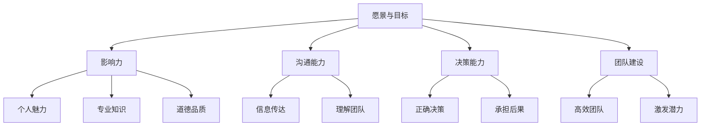
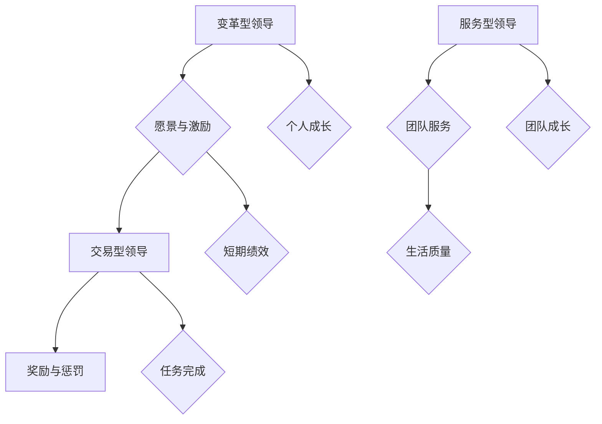
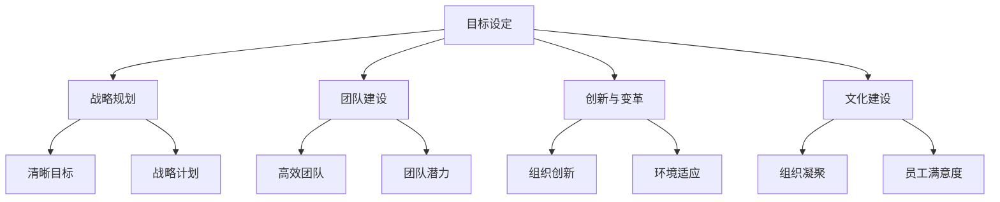
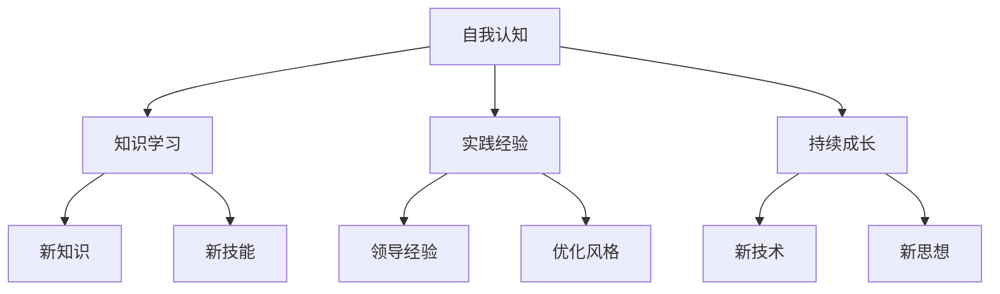
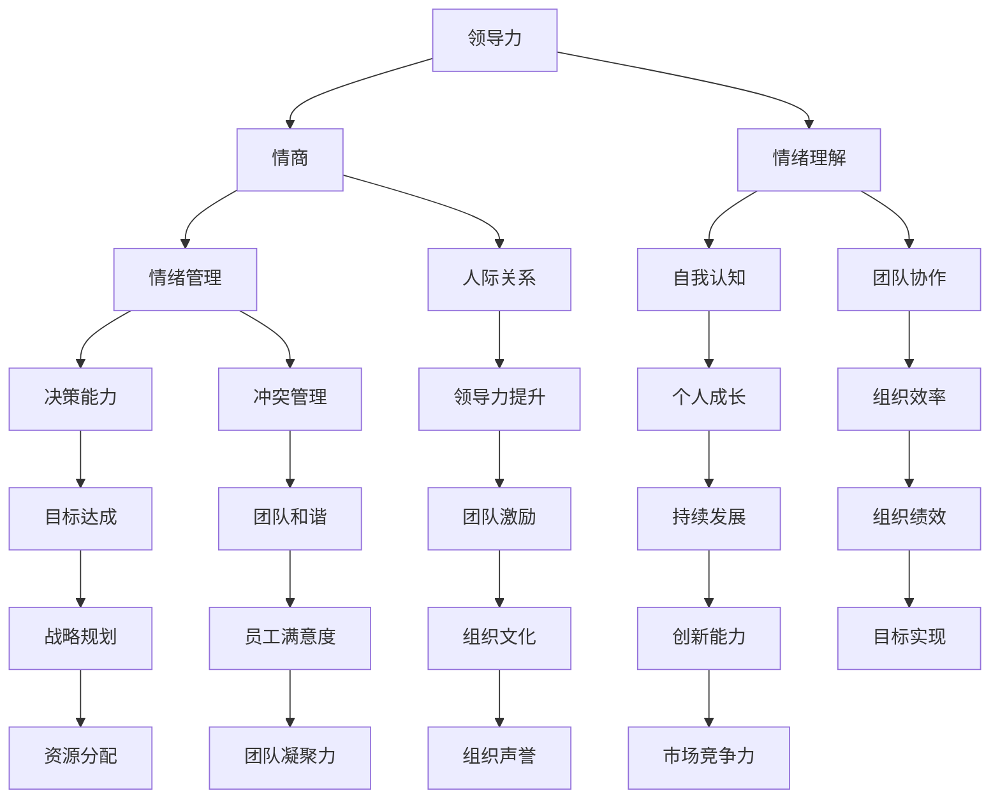
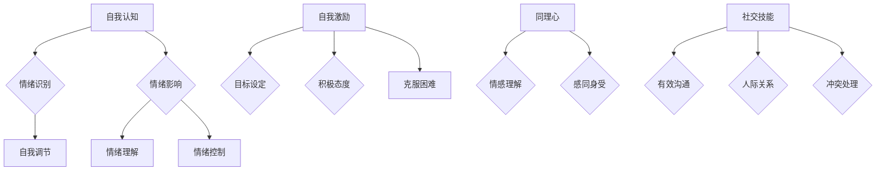
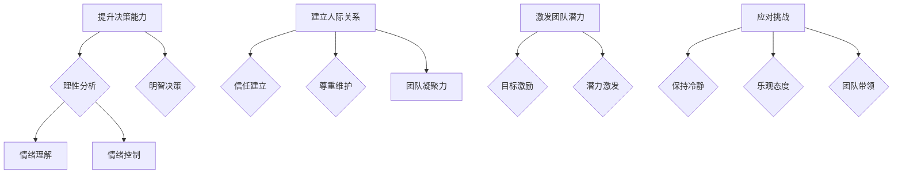
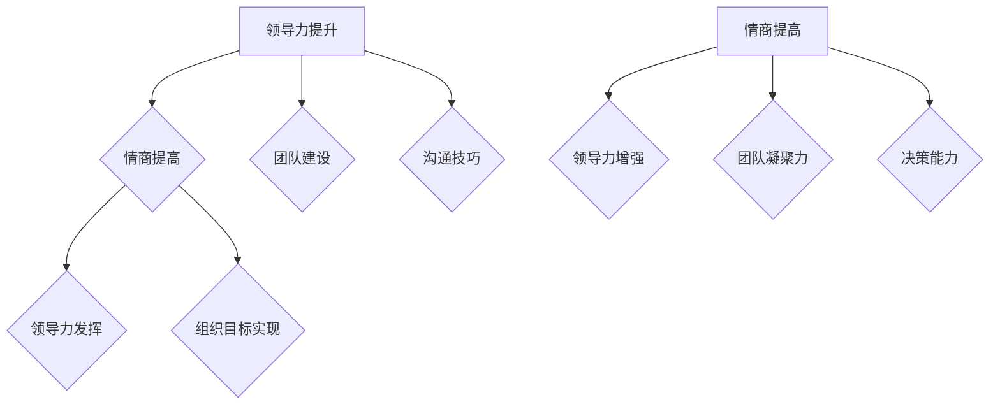
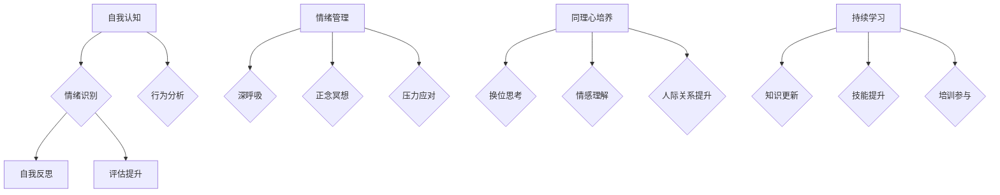

                 

# 《领导力与情商提升：增强人际关系管理》

## 关键词
- 领导力
- 情商
- 人际关系管理
- 团队协作
- 冲突管理
- 情绪感染
- 领导者情绪智慧

## 摘要
本文旨在探讨领导力与情商提升在人际关系管理中的重要性。通过对领导力基础理论、情商提升策略以及人际关系管理的深入分析，本文揭示了领导力与情商如何相互影响，如何通过有效的管理策略提升人际关系质量。文章结构分为四个主要部分：领导力基础理论，情商提升策略，人际关系管理，以及综合案例与实践。通过实际案例和详细解释，本文为IT领域的领导者提供了一套实用的提升人际关系管理的指南。

## 目录大纲

### 第一部分：领导力基础理论

#### 1.1 领导力的本质与类型
##### 1.1.1 领导力的定义与核心要素
##### 1.1.2 不同类型的领导力模型
##### 1.1.3 领导力在组织中的作用

#### 1.2 领导力发展路径
##### 1.2.1 领导力成长的关键阶段
##### 1.2.2 自我反思与领导力提升
##### 1.2.3 持续学习与领导力发展

#### 1.3 领导力与情商的联系
##### 1.3.1 情商的定义与构成
##### 1.3.2 情商在领导力中的重要性
##### 1.3.3 领导力与情商的互动关系

### 第二部分：情商提升策略

#### 2.1 情绪管理
##### 2.1.1 情绪的类型与识别
##### 2.1.2 情绪调节技巧
##### 2.1.3 高效应对负面情绪

#### 2.2 自我认知
##### 2.2.1 自我认知的重要性
##### 2.2.2 自我认知的工具与方法
##### 2.2.3 提升自我认知的实践策略

#### 2.3 社交能力
##### 2.3.1 社交技巧的基本要素
##### 2.3.2 高效沟通的技巧
##### 2.3.3 建立和维护人际关系

#### 2.4 同理心培养
##### 2.4.1 同理心的定义与作用
##### 2.4.2 同理心培养的实践方法
##### 2.4.3 同理心在领导力提升中的应用

### 第三部分：人际关系管理

#### 3.1 团队协作
##### 3.1.1 团队协作的重要性
##### 3.1.2 团队成员的角色与责任
##### 3.1.3 提升团队协作效率的策略

#### 3.2 冲突管理
##### 3.2.1 冲突的类型与原因
##### 3.2.2 冲突管理的策略与技巧
##### 3.2.3 高效解决冲突的实践案例

#### 3.3 情绪感染与传染
##### 3.3.1 情绪感染的概念与机制
##### 3.3.2 情绪传染的影响与应对
##### 3.3.3 建立积极情绪环境的方法

#### 3.4 领导者的情绪智慧
##### 3.4.1 领导者情绪智慧的定义与重要性
##### 3.4.2 领导者情绪智慧的培养方法
##### 3.4.3 情绪智慧在领导决策中的应用

### 第四部分：综合案例与实践

#### 4.1 领导力与情商提升的综合实践
##### 4.1.1 综合实践的意义与方法
##### 4.1.2 实践案例一：提升团队领导力
##### 4.1.3 实践案例二：情商提升与人际交往

#### 4.2 情商提升在人际关系管理中的应用
##### 4.2.1 情商提升在职场中的具体应用
##### 4.2.2 实际案例解析：情商在领导力提升中的作用
##### 4.2.3 情商提升的持续影响

#### 4.3 个人成长与领导力发展的持续路径
##### 4.3.1 领导力与情商提升的长期策略
##### 4.3.2 个人成长与领导力发展的结合
##### 4.3.3 领导力与情商提升的未来趋势

### 第五部分：附录

#### 附录A：领导力与情商提升工具与方法
##### A.1 自我评估工具
##### A.2 情商提升练习
##### A.3 团队协作与冲突管理工具

#### 附录B：推荐阅读与资源
##### B.1 相关书籍推荐
##### B.2 学术论文精选
##### B.3 在线课程与培训资源

### 第一部分：领导力基础理论

## 1.1 领导力的本质与类型

### 1.1.1 领导力的定义与核心要素

领导力，是指一个人在组织或团队中，通过影响和激励他人，实现共同目标的能力。这种能力不仅涉及到个人的素质，还涉及到对组织的理解、对人际关系的处理以及对局势的判断。

从核心要素来看，领导力主要包括以下几个方面：

1. **愿景与目标**：领导者需要具备清晰的愿景和目标，并能够将这些愿景和目标传达给团队成员，激发他们的热情和动力。

2. **影响力**：领导者需要拥有影响他人的能力，这种影响力不仅来自于职位权力，还包括个人魅力、专业知识以及道德品质。

3. **沟通能力**：领导者需要具备良好的沟通能力，能够清晰、准确地传达信息，并理解团队成员的需求和想法。

4. **决策能力**：领导者需要能够在复杂多变的环境中做出正确的决策，并能够承担决策带来的后果。

5. **团队建设**：领导者需要能够建立高效、和谐的团队，激发团队成员的潜力，实现团队目标。

下面是一个关于领导力核心要素的 Mermaid 流程图：

### 1.1.2 不同类型的领导力模型

领导力模型是描述领导力行为的工具，可以帮助我们理解不同情境下的领导行为。以下是一些常见的领导力模型：

1. ** Transformational Leadership（变革型领导）**：这种领导方式强调领导者的个人魅力和愿景，通过激励和启发团队成员实现共同目标。变革型领导者关注个人成长和团队发展。

2. ** Transactional Leadership（交易型领导）**：这种领导方式更注重短期的成果和绩效，通过明确的奖励和惩罚机制激励团队成员。交易型领导者更关注任务完成和目标达成。

3. **Servant Leadership（服务型领导）**：这种领导方式强调领导者为团队成员提供服务，关注团队需求和成长。服务型领导者相信领导是一种服务，旨在提升团队成员的生活质量。

下面是一个关于不同类型领导力模型的 Mermaid 流程图：

### 1.1.3 领导力在组织中的作用

领导力在组织中的作用至关重要。以下是领导力在组织中的几个关键作用：

1. **目标设定与战略规划**：领导者需要为组织设定清晰的目标，并制定实现这些目标的战略计划。

2. **团队建设与管理**：领导者需要建立高效的团队，激发团队成员的潜力，实现团队目标。

3. **创新与变革**：领导者需要推动组织创新，适应外部环境的变化，确保组织的持续发展。

4. **文化建设**：领导者需要塑造组织文化，提高组织凝聚力和员工满意度。

下面是一个关于领导力在组织中作用的 Mermaid 流程图：

### 1.2 领导力发展路径

领导力的发展是一个长期的过程，需要不断的学习和实践。以下是领导力发展的几个关键阶段：

1. **自我认知与反思**：领导者需要了解自己的优势和不足，通过反思和自我评估不断提升自己。

2. **专业知识与技能**：领导者需要不断学习新的知识和技能，以适应不断变化的环境。

3. **实践与经验**：领导者需要通过实际工作，积累领导经验，不断优化自己的领导风格。

4. **持续成长与学习**：领导者需要持续成长，保持对新技术和新思想的敏感度。

下面是一个关于领导力发展路径的 Mermaid 流程图：

### 1.3 领导力与情商的联系

领导力与情商之间存在着密切的联系。以下是领导力与情商之间的几个关键点：

1. **情商在领导力中的作用**：情商是领导者成功的关键因素之一。情商高的人能够更好地理解和管理自己的情绪，也能更好地理解和管理他人的情绪。

2. **领导力对情商的影响**：领导力的培养过程本身就会提高个体的情商。通过领导实践，领导者可以更好地了解自己的情绪，学会如何有效地处理情绪。

3. **领导力与情商的互动关系**：领导力和情商是相辅相成的。高情商的领导者能够更好地发挥领导力，实现组织目标。

下面是一个关于领导力与情商互动关系的 Mermaid 流程图：

### 1.3.1 情商的定义与构成

情商（Emotional Intelligence，简称EQ）是指个体识别、理解、管理自己情绪的能力，以及识别、理解和影响他人情绪的能力。情商主要由以下几个维度构成：

1. **自我认知**：了解自己的情绪状态，能够认识到自己的情绪是如何影响自己的思维和行为。

2. **情绪管理**：有效地管理自己的情绪，包括调节情绪、避免情绪失控以及处理负面情绪。

3. **自我激励**：能够设定目标，保持积极态度，克服困难，实现目标。

4. **同理心**：理解他人的情绪，能够站在他人的角度看问题，感同身受。

5. **社交技能**：有效地与他人沟通，建立良好的人际关系，处理社交中的冲突。

下面是一个关于情商构成的 Mermaid 流程图：

### 1.3.2 情商在领导力中的重要性

情商在领导力中扮演着至关重要的角色。以下是情商在领导力中的几个关键作用：

1. **提升决策能力**：情商高的领导者能够更好地理解自己的情绪，以及这些情绪如何影响决策。他们能够更理性地分析问题，做出更明智的决策。

2. **建立良好的人际关系**：情商高的领导者能够更好地理解和管理他人的情绪，建立信任和尊重的人际关系。这有助于提升团队凝聚力和工作效率。

3. **激发团队潜力**：情商高的领导者能够激励团队成员，激发他们的潜力，实现团队目标。

4. **应对挑战与变化**：情商高的领导者能够更好地应对压力和挑战，保持冷静和乐观的态度，带领团队走出困境。

下面是一个关于情商在领导力中重要性的 Mermaid 流�程图：

### 1.3.3 领导力与情商的互动关系

领导力与情商之间存在着紧密的互动关系。以下是领导力与情商的几个关键互动点：

1. **领导力促进情商提升**：领导力的培养过程，如团队建设、沟通技巧等，有助于提升个体的情商。

2. **情商增强领导力**：高情商的领导者能够更好地发挥领导力，实现组织目标。

3. **情商与领导力的共同发展**：领导力和情商是相辅相成的，二者共同发展，有助于提升领导者的整体素质。

下面是一个关于领导力与情商互动关系的 Mermaid 流程图：

### 1.3.4 领导力与情商提升的方法

为了提升领导力与情商，领导者可以采取以下方法：

1. **自我认知与反思**：领导者需要定期进行自我评估，了解自己的情绪和行为，找到提升的空间。

2. **情绪管理**：领导者需要学会情绪管理技巧，如深呼吸、正念冥想等，以更好地应对压力和挑战。

3. **同理心培养**：领导者需要培养同理心，学会站在他人的角度思考问题，提升人际关系管理能力。

4. **持续学习与培训**：领导者需要持续学习新的知识和技能，参加领导力与情商相关的培训，不断提升自己的素质。

下面是一个关于领导力与情商提升方法的 Mermaid 流程图：

### 第一部分总结

在本部分中，我们探讨了领导力的定义、类型及其在组织中的作用，详细分析了领导力发展的关键阶段，并探讨了领导力与情商之间的紧密联系。通过这一部分的讨论，我们认识到领导力与情商的提升对于提升人际关系管理的重要性。在下一部分，我们将深入探讨情商提升的策略，包括情绪管理、自我认知、社交能力和同理心培养等方面的内容。这些策略将为领导者提供实用的工具和方法，以提升他们在人际关系管理中的能力。

## 第二部分：情商提升策略

情商的提升对于领导者在人际关系管理中的表现至关重要。在这一部分，我们将深入探讨情商提升的几个关键策略，包括情绪管理、自我认知、社交能力和同理心培养。通过这些策略，领导者可以更好地理解和管理自己的情绪，提升人际交往能力，从而更有效地管理人际关系。

### 2.1 情绪管理

情绪管理是情商提升的基础，它涉及到如何识别、理解和控制自己的情绪。一个情绪管理的领导者能够更好地应对压力，保持冷静和理性，从而更好地处理工作和生活中的各种挑战。

#### 2.1.1 情绪的类型与识别

情绪可以分为正面情绪和负面情绪两大类。正面情绪包括喜悦、快乐、满足等，而负面情绪则包括焦虑、愤怒、沮丧等。领导者需要学会识别这些情绪，以便更好地管理和调节它们。

1. **情绪识别**：情绪识别是指领导者能够察觉到自己情绪的变化，并理解这些情绪背后的原因。领导者可以通过以下方法提高情绪识别能力：

   - **自我观察**：领导者需要花时间观察自己的情绪变化，了解情绪的起因和表现。
   - **日记记录**：通过记录每天的所思所感，领导者可以更好地理解自己的情绪模式。
   - **反馈收集**：领导者可以寻求他人的反馈，了解他们在与自己互动时的感受，从而更全面地认识自己的情绪。

2. **情绪标签化**：情绪标签化是指给情绪赋予一个名称，使其具体化和可识别。例如，将愤怒情绪标签化为“愤怒”，将焦虑情绪标签化为“焦虑”。通过情绪标签化，领导者可以更清晰地认识到自己的情绪状态。

#### 2.1.2 情绪调节技巧

情绪调节是指领导者通过特定的方法来调整和控制自己的情绪，使其更加积极和健康。以下是一些有效的情绪调节技巧：

1. **深呼吸**：深呼吸可以帮助领导者放松身体，缓解紧张情绪。当感到焦虑或愤怒时，领导者可以尝试深呼吸，将注意力集中在呼吸上，从而降低情绪的激烈程度。

2. **正念冥想**：正念冥想是一种通过集中注意力来调节情绪的方法。领导者可以通过冥想练习，学会专注于当前时刻，减少对过去和未来的担忧，从而提高情绪稳定性。

3. **情绪释放**：领导者可以通过运动、写日记或与朋友倾诉等方式，释放负面情绪。这些活动有助于领导者释放情绪压力，保持心理健康。

4. **积极思考**：领导者可以通过积极的自我对话来调节情绪。当遇到挫折或困难时，领导者可以用积极的话语来鼓励自己，如“我可以克服这个挑战”，“我有能力解决这个问题”。

#### 2.1.3 高效应对负面情绪

负面情绪如焦虑、愤怒和沮丧是领导过程中难以避免的。然而，领导者需要学会高效应对这些情绪，以避免情绪对工作和人际关系产生负面影响。

1. **情绪冷却法**：当感到情绪激烈时，领导者可以暂时离开现场，给自己一些时间冷静下来。这种方法有助于避免在情绪激动时做出冲动的决策。

2. **换位思考**：领导者可以尝试站在他人的角度思考问题，理解他人的感受和立场。这种方法有助于缓解冲突，建立更好的合作关系。

3. **寻求支持**：领导者可以寻求家人、朋友或同事的支持，分享自己的情绪和困惑。他人的建议和支持可以帮助领导者更好地应对负面情绪。

4. **积极行动**：领导者可以通过采取积极行动来改变负面情绪。例如，面对挑战时，领导者可以制定解决方案，采取行动来克服困难，从而转化为积极的情绪。

#### 2.1.4 情绪管理案例

以下是一个情绪管理案例，展示了领导者如何通过情绪调节技巧来应对工作中的挑战：

**案例**：一位项目经理在项目中遇到了严重的延迟问题，导致团队成员感到焦虑和不满。项目经理感到压力巨大，情绪紧张。

**解决方案**：

1. **情绪冷却**：项目经理意识到情绪紧张，决定暂时离开会议室，给自己一些时间冷静下来。

2. **深呼吸**：项目经理进行了深呼吸练习，以放松身体和情绪。

3. **积极思考**：项目经理告诉自己，“这个项目对我来说是一次挑战，但我有能力和团队一起克服它。”

4. **换位思考**：项目经理尝试理解团队成员的感受，意识到他们的焦虑和不满是合理的。

5. **寻求支持**：项目经理与团队成员进行了沟通，分享了项目的挑战和解决方案，得到了他们的理解和支持。

6. **积极行动**：项目经理制定了详细的计划，分配了任务，确保项目能够按时完成。

通过这些情绪管理技巧，项目经理不仅缓解了负面情绪，还增强了团队的凝聚力和工作效率。

### 2.2 自我认知

自我认知是情商提升的关键环节，它涉及到领导者如何认识和理解自己的个性、价值观、动机和需求。一个具有高度自我认知的领导者能够更好地了解自己的优势和不足，从而进行有针对性的自我提升。

#### 2.2.1 自我认知的重要性

自我认知对于领导者的成长和发展至关重要，主要体现在以下几个方面：

1. **个人成长**：自我认知帮助领导者识别自己的成长需求，制定个人发展计划，不断提升自己的能力和素质。

2. **团队合作**：自我认知使领导者能够更好地理解团队成员的需求和期望，促进团队协作和沟通。

3. **决策能力**：自我认知有助于领导者更理性地分析问题，做出更明智的决策。

4. **情绪管理**：自我认知使领导者能够更好地了解自己的情绪触发点，从而更有效地管理情绪。

#### 2.2.2 自我认知的工具与方法

以下是几种常用的自我认知工具和方法：

1. **自我反思**：自我反思是领导者进行自我认知的重要方法。通过定期反思自己的行为、决策和情绪，领导者可以深入理解自己的内心世界，发现潜在的成长机会。

2. **360度反馈**：360度反馈是一种通过收集来自不同视角（上级、同事、下属和客户）的反馈，帮助领导者全面了解自己的方法。这种方法有助于领导者从多个角度认识自己的优势和不足。

3. **心理测试**：心理测试如MBTI（性格类型指标）、DISC（行为风格指标）等，可以帮助领导者深入了解自己的性格和行为特点，从而更好地发挥自己的优势。

4. **日记记录**：通过日记记录自己的想法、感受和经历，领导者可以更系统地反思自己的行为和决策，提升自我认知。

#### 2.2.3 提升自我认知的实践策略

为了提升自我认知，领导者可以采取以下实践策略：

1. **定期自我反思**：领导者可以设定固定的反思时间，回顾过去一段时间的行为和决策，分析自己的情绪和行为模式。

2. **主动寻求反馈**：领导者可以主动向同事、下属和客户寻求反馈，了解他们的看法和建议，从而更全面地认识自己。

3. **参加培训与发展项目**：通过参加领导力培训和发展项目，领导者可以学习新的知识和技能，提升自我认知。

4. **阅读和学习**：阅读相关书籍、学术论文和领导力博客，可以帮助领导者了解最新的领导理论和实践，从而提升自我认知。

#### 2.2.4 自我认知案例

以下是一个关于自我认知的案例，展示了领导者如何通过实践策略提升自我认知：

**案例**：一位技术团队负责人意识到自己在团队沟通中存在障碍，影响了团队的协作效率。他决定采取以下措施提升自我认知：

1. **定期自我反思**：团队负责人每天晚上花10分钟反思自己的行为和决策，记录下自己的想法和感受。

2. **主动寻求反馈**：团队负责人主动与团队成员沟通，询问他们在团队协作中的困难和期望。

3. **参加培训项目**：团队负责人参加了领导力沟通技巧培训项目，学习了如何更有效地沟通。

4. **阅读和学习**：团队负责人阅读了关于团队沟通和领导力的书籍，了解最新的理论和实践方法。

通过这些实践策略，团队负责人不仅提升了自我认知，还改善了团队沟通，提升了团队协作效率。

### 2.3 社交能力

社交能力是情商的重要组成部分，它涉及到领导者如何与他人建立和维护良好的关系。一个具备良好社交能力的领导者能够更有效地管理人际关系，提升团队凝聚力和工作效率。

#### 2.3.1 社交技巧的基本要素

社交技巧包括倾听、表达、沟通和协调等基本要素。以下是几个关键的社交技巧：

1. **倾听**：倾听是建立良好人际关系的基础。领导者需要学会倾听他人的意见和需求，理解他们的情感和立场。

2. **表达**：表达技巧包括清晰、准确地传达信息，以及有效地表达自己的情感和观点。

3. **沟通**：沟通技巧涉及人际互动的各个方面，包括口头沟通、书面沟通和肢体语言等。

4. **协调**：协调技巧是指领导者如何协调不同利益相关者的需求和期望，达成共识和合作。

#### 2.3.2 高效沟通的技巧

高效沟通是提升社交能力的关键。以下是几种高效沟通的技巧：

1. **主动倾听**：主动倾听是指领导者不仅在别人说话时聆听，还通过提问、复述和反馈来确认自己的理解。这种方法有助于建立信任和理解。

2. **清晰表达**：清晰表达是指领导者能够用简洁、准确的语言表达自己的观点和需求。这需要领导者具备良好的语言组织和表达能力。

3. **情感共鸣**：情感共鸣是指领导者能够理解并感受到他人的情感，从而更好地与他人沟通。这需要领导者具备同理心。

4. **反馈与回应**：领导者需要学会给予积极的反馈和回应，鼓励团队成员表达自己的意见和需求，从而促进良好的沟通。

#### 2.3.3 建立和维护人际关系

建立和维护人际关系是领导者的关键任务之一。以下是几种建立和维护人际关系的策略：

1. **建立信任**：信任是人际关系的基础。领导者需要通过诚实、透明和一致的行为建立信任。

2. **尊重差异**：领导者需要尊重团队成员的个性和观点，避免主观偏见，建立包容性的团队氛围。

3. **主动沟通**：领导者需要主动与团队成员沟通，分享信息、反馈和期望，促进双向沟通。

4. **关注他人**：领导者需要关注团队成员的需求和情感，提供支持和帮助，建立深厚的情感联系。

#### 2.3.4 社交能力案例

以下是一个关于社交能力的案例，展示了领导者如何通过社交技巧提升人际关系管理：

**案例**：一位项目经理在团队项目中遇到了沟通障碍，导致项目进展缓慢。项目经理决定采取以下措施提升社交能力：

1. **主动倾听**：项目经理在会议中主动倾听团队成员的意见和建议，通过提问和复述来确认自己的理解。

2. **清晰表达**：项目经理在会议中用简洁、准确的语言表达自己的观点和需求，避免使用复杂的术语。

3. **情感共鸣**：项目经理尝试理解团队成员的情感和立场，表达对他们工作的认可和鼓励。

4. **反馈与回应**：项目经理给予团队成员积极的反馈和回应，鼓励他们表达意见和需求，建立良好的沟通氛围。

通过这些社交技巧，项目经理成功改善了团队沟通，提升了项目进展和团队凝聚力。

### 2.4 同理心培养

同理心是情商的核心要素之一，它涉及到领导者如何理解、感知和回应他人的情绪和需求。同理心不仅有助于建立良好的人际关系，还能提升领导者的管理和沟通能力。

#### 2.4.1 同理心的定义与作用

同理心是指领导者能够站在他人的角度思考问题，理解他人的感受和需求。同理心在领导力中的作用主要体现在以下几个方面：

1. **建立信任**：同理心使领导者能够更好地理解团队成员的需求和期望，建立信任和尊重的关系。

2. **提升沟通效果**：同理心有助于领导者更准确地理解他人的意图和感受，从而提高沟通效果。

3. **增强团队凝聚力**：同理心使领导者能够关注团队成员的情感需求，增强团队的凝聚力和归属感。

4. **激发团队潜力**：同理心使领导者能够更好地激发团队成员的潜力，实现团队目标。

#### 2.4.2 同理心培养的实践方法

以下是几种培养同理心的实践方法：

1. **观察与倾听**：领导者需要学会观察团队成员的行为和情绪，倾听他们的需求和期望。通过仔细观察和倾听，领导者可以更好地理解团队成员的感受。

2. **换位思考**：领导者需要尝试站在他人的角度思考问题，理解他们的立场和情感。这种方法有助于领导者建立同理心。

3. **情感共鸣**：领导者需要学会表达情感共鸣，通过语言和肢体语言表达对团队成员的理解和支持。这有助于建立深厚的情感联系。

4. **反馈与回应**：领导者需要给予团队成员积极的反馈和回应，鼓励他们表达意见和需求。这有助于增强团队的互动和沟通。

#### 2.4.3 同理心在领导力提升中的应用

同理心在领导力提升中发挥着重要作用。以下是几个应用场景：

1. **团队建设**：同理心有助于领导者理解团队成员的需求和期望，制定更有针对性的团队建设策略，提升团队凝聚力。

2. **员工激励**：同理心使领导者能够更好地理解员工的需求和情感，制定更有效的激励措施，激发员工的潜力。

3. **冲突管理**：同理心有助于领导者理解冲突双方的立场和情感，采取更公正和合理的冲突管理策略，解决冲突。

4. **领导决策**：同理心使领导者能够更全面地考虑团队成员的需求和利益，做出更明智的领导决策。

#### 2.4.4 同理心培养案例

以下是一个关于同理心培养的案例，展示了领导者如何通过实践方法提升同理心：

**案例**：一位团队领导意识到团队中存在沟通不畅和情感冲突。为了提升同理心，团队领导采取了以下措施：

1. **观察与倾听**：团队领导开始注意团队成员的行为和情绪，倾听他们的需求和期望，通过观察和倾听了解团队成员的感受。

2. **换位思考**：团队领导尝试站在团队成员的角度思考问题，理解他们的立场和情感，从而更好地理解团队成员的需求。

3. **情感共鸣**：团队领导在会议中表达对团队成员的理解和支持，通过语言和肢体语言传达情感共鸣，建立深厚的情感联系。

4. **反馈与回应**：团队领导给予团队成员积极的反馈和回应，鼓励他们表达意见和需求，促进团队的互动和沟通。

通过这些实践方法，团队领导成功提升了同理心，改善了团队沟通和凝聚力。

### 第二部分总结

在本部分中，我们详细探讨了情商提升的几个关键策略，包括情绪管理、自我认知、社交能力和同理心培养。通过这些策略，领导者可以更好地理解和管理自己的情绪，提升人际交往能力，从而更有效地管理人际关系。在下一部分，我们将深入探讨人际关系管理的关键方面，包括团队协作、冲突管理和情绪感染与传染。这些内容将为领导者提供实用的工具和方法，以提升他们在人际关系管理中的能力。

## 第三部分：人际关系管理

在领导力与情商提升的过程中，人际关系管理是一个至关重要的环节。本部分将重点探讨团队协作、冲突管理、情绪感染与传染以及领导者的情绪智慧等关键方面，帮助领导者提升人际关系管理能力。

### 3.1 团队协作

团队协作是组织成功的关键因素之一。一个高效的团队能够充分发挥每个成员的潜力，实现共同的目标。以下是团队协作的几个关键要素：

#### 3.1.1 团队协作的重要性

1. **资源整合**：团队协作能够整合团队成员的不同技能和资源，形成合力，提高工作效率。

2. **创新与创造力**：多样化的团队背景和思维能够促进创新和创造力的产生，有助于解决复杂问题。

3. **协作优势**：团队协作可以降低个体的工作压力，提高工作满意度和忠诚度。

4. **共同目标**：团队协作有助于建立共同的目标和愿景，增强团队的凝聚力和向心力。

#### 3.1.2 团队成员的角色与责任

在一个高效的团队中，每个成员都有明确的角色和责任。以下是几个常见的团队成员角色：

1. **领导者**：领导者负责设定团队目标，协调成员之间的工作，提供支持和指导。

2. **执行者**：执行者负责按照团队计划执行任务，确保项目进展。

3. **协调者**：协调者负责处理团队内部的沟通和协调，解决成员之间的冲突。

4. **监督者**：监督者负责监控团队的工作进度和质量，确保项目目标的实现。

5. **贡献者**：贡献者负责提供专业技能和资源，为团队的成功做出贡献。

#### 3.1.3 提升团队协作效率的策略

1. **明确目标**：团队需要明确共同的目标和愿景，确保每个成员都清楚自己的工作方向。

2. **沟通畅通**：建立高效的沟通机制，确保信息的及时传递和理解。

3. **分工明确**：明确每个成员的角色和责任，避免重复工作和责任不明。

4. **协同合作**：鼓励团队成员相互支持，共同解决问题，提高工作效率。

5. **激励机制**：建立合理的激励机制，激发团队成员的积极性和创造力。

#### 3.1.4 团队协作实践案例

以下是一个团队协作实践案例，展示了如何通过有效管理提升团队协作效率：

**案例**：某IT公司的开发团队在开发新项目时遇到了沟通不畅和任务分配不均的问题，导致项目进度缓慢。为了提升团队协作效率，团队采取了以下措施：

1. **明确目标**：团队明确了项目的最终目标，并将目标分解为可执行的任务，确保每个成员都清楚自己的任务和责任。

2. **沟通畅通**：团队建立了定期的项目会议，确保成员之间的沟通和信息传递。同时，团队使用了协作工具，如Slack和Trello，以实时共享信息和进度。

3. **分工明确**：团队根据成员的技能和兴趣，合理分配任务，确保每个成员都能发挥自己的优势。

4. **协同合作**：团队鼓励成员之间相互支持和合作，共同解决问题，提高工作效率。

5. **激励机制**：团队设置了合理的奖励机制，对按时完成任务的成员给予奖励，激励成员的积极性和创造力。

通过这些措施，团队成功提升了协作效率，项目进度得到了显著改善。

### 3.2 冲突管理

在团队协作中，冲突是不可避免的。有效的冲突管理能够帮助团队解决分歧，达成共识，提高工作效率。以下是冲突管理的几个关键策略：

#### 3.2.1 冲突的类型与原因

冲突可以分为以下几种类型：

1. **任务冲突**：由于工作任务分配或优先级不同而产生的冲突。

2. **关系冲突**：由于团队成员之间的个人关系问题而产生的冲突。

3. **价值观冲突**：由于团队成员的价值观和信仰不同而产生的冲突。

4. **目标冲突**：由于团队目标不一致或目标不明确而产生的冲突。

冲突的原因主要包括：

1. **沟通不畅**：信息传递不及时或不准确，导致误解和冲突。

2. **利益冲突**：团队成员的利益需求不一致，导致冲突。

3. **个人性格**：团队成员的个人性格差异，如内向和外向，也可能导致冲突。

4. **资源有限**：当团队资源有限时，成员之间可能为了争夺资源而产生冲突。

#### 3.2.2 冲突管理的策略与技巧

有效的冲突管理需要采取以下策略和技巧：

1. **预防为主**：在冲突发生之前，通过明确目标、规范流程和加强沟通，预防冲突的产生。

2. **中立立场**：在处理冲突时，领导者需要保持中立立场，避免偏袒任何一方，以公正的方式解决冲突。

3. **倾听与理解**：领导者需要倾听双方的意见和需求，理解他们的立场和感受，找到共同点。

4. **理性分析**：领导者需要理性分析冲突的原因和影响，制定合理的解决方案。

5. **合作协商**：领导者需要鼓励双方进行合作协商，共同寻找解决问题的方法。

6. **冲突解决后反思**：在冲突解决后，团队需要进行反思，总结经验教训，避免类似冲突的再次发生。

#### 3.2.3 高效解决冲突的实践案例

以下是一个关于高效解决冲突的实践案例，展示了领导者如何处理团队中的冲突：

**案例**：某软件团队在项目开发过程中出现了任务冲突，导致项目进度延误。团队领导采取了以下措施：

1. **中立立场**：领导者在冲突中保持中立立场，避免了偏袒任何一方的情况。

2. **倾听与理解**：领导者分别与冲突双方进行了沟通，了解他们的立场和感受。

3. **理性分析**：领导者分析了冲突的原因，发现是由于任务分配不明确和沟通不畅导致的。

4. **合作协商**：领导者组织双方进行了合作协商，重新分配了任务，明确了沟通机制。

5. **冲突解决后反思**：在冲突解决后，团队进行了反思，制定了更明确的任务分配和沟通规范，以防止类似冲突的再次发生。

通过这些措施，团队成功解决了冲突，项目进度得到了恢复。

### 3.3 情绪感染与传染

情绪感染与传染是指情绪从一个个体传播到另一个个体的过程。在团队中，情绪感染与传染可以显著影响团队成员的情绪状态和行为。以下是情绪感染与传染的几个关键方面：

#### 3.3.1 情绪感染的概念与机制

情绪感染是指一个人的情绪状态影响他人的情绪状态，使他人产生类似的情绪。情绪感染主要通过以下机制实现：

1. **情感模仿**：人们通过观察他人的行为和表情，模仿他们的情绪状态。

2. **情感共鸣**：人们通过共享经历和感受，产生情感共鸣，从而感染他人的情绪。

3. **社会传递**：人们通过言语、文字和肢体语言等方式，传递情感状态，影响他人的情绪。

#### 3.3.2 情绪传染的影响与应对

情绪传染对团队的影响可以分为积极和消极两个方面：

**积极影响**：

1. **增强团队凝聚力**：积极的情绪传染可以增强团队成员之间的情感联系，提升团队凝聚力。

2. **提高工作积极性**：积极的情绪传染可以激发团队成员的工作热情和积极性，提高工作效率。

**消极影响**：

1. **情绪压力**：消极的情绪传染可能导致团队成员产生情绪压力，影响工作表现和身心健康。

2. **情绪传染链**：消极情绪的传染可能导致整个团队陷入消极情绪，影响团队的稳定和效率。

为了应对情绪传染，领导者可以采取以下措施：

1. **建立积极情绪环境**：领导者可以通过正面激励和积极沟通，营造积极的团队氛围。

2. **提高情绪管理能力**：领导者需要提高自身的情绪管理能力，避免在团队中传播负面情绪。

3. **加强情绪反馈**：领导者需要关注团队成员的情绪状态，及时给予积极的反馈和支持。

4. **促进情感交流**：领导者可以组织团队活动，促进团队成员之间的情感交流，建立深厚的情感联系。

#### 3.3.3 建立积极情绪环境的方法

以下是建立积极情绪环境的几个方法：

1. **正面激励**：领导者可以通过表扬、奖励和认可，激发团队成员的积极情绪，增强他们的自信心和动力。

2. **情感支持**：领导者需要关注团队成员的情感需求，提供情感支持和鼓励，帮助他们克服困难。

3. **建立团队文化**：领导者需要塑造积极向上的团队文化，鼓励团队成员相互支持，共同进步。

4. **促进情感交流**：领导者可以组织定期的团队会议和活动，促进团队成员之间的情感交流，增强团队的凝聚力。

#### 3.3.4 情绪传染案例

以下是一个关于情绪传染的案例，展示了领导者如何通过建立积极情绪环境来影响团队情绪：

**案例**：某团队在项目开发过程中，领导者在项目初期就表现出积极的情绪和态度，鼓励团队成员克服困难。这种积极的情绪传染到了整个团队，团队成员在工作中表现出高度的积极性和创造力。项目最终提前完成，并得到了客户的高度评价。

通过这个案例，我们可以看到领导者通过建立积极情绪环境，成功激发了团队的积极情绪，促进了项目成功。

### 3.4 领导者的情绪智慧

领导者的情绪智慧是指领导者识别、理解和管理自己及他人情绪的能力。情绪智慧对于领导者的决策能力、团队管理和人际关系管理具有重要意义。以下是领导者情绪智慧的关键要素：

#### 3.4.1 领导者情绪智慧的定义与重要性

领导者情绪智慧包括以下几个要素：

1. **情绪识别**：领导者能够识别自己和他人的情绪状态。

2. **情绪理解**：领导者能够理解情绪背后的原因和影响。

3. **情绪管理**：领导者能够有效地管理自己和他人的情绪，使其积极影响工作氛围和团队效率。

4. **情绪适应**：领导者能够适应不同的情绪环境，调整自己的情绪状态。

领导者情绪智慧的重要性体现在以下几个方面：

1. **决策能力**：情绪智慧的领导者能够更理性地分析问题，做出更明智的决策。

2. **团队管理**：情绪智慧的领导者能够更好地理解和管理团队成员的情绪，提升团队凝聚力和工作效率。

3. **人际关系管理**：情绪智慧的领导者能够建立良好的人际关系，提升沟通效果和合作效率。

#### 3.4.2 领导者情绪智慧的培养方法

以下是几种培养领导者情绪智慧的方法：

1. **自我反思**：领导者需要定期进行自我反思，了解自己的情绪和行为模式。

2. **情绪管理培训**：领导者可以通过参加情绪管理培训，学习情绪识别、理解和管理的技巧。

3. **情感交流**：领导者需要加强与团队成员的情感交流，理解他们的需求和期望。

4. **心理辅导**：领导者可以寻求专业的心理辅导，提升自己的情绪智慧和心理健康。

#### 3.4.3 情绪智慧在领导决策中的应用

情绪智慧在领导决策中的应用主要体现在以下几个方面：

1. **情境适应**：领导者需要根据不同的情境，调整自己的情绪状态，做出适应性的决策。

2. **风险识别**：情绪智慧的领导者能够更好地识别潜在的风险和挑战，提前制定应对策略。

3. **决策平衡**：领导者需要平衡理性分析和情感因素，做出综合考虑的决策。

4. **团队激励**：领导者需要通过情绪智慧激发团队成员的积极性和创造力，实现团队目标。

#### 3.4.4 情绪智慧实践案例

以下是一个关于情绪智慧实践案例，展示了领导者如何通过情绪智慧提升决策能力和团队管理：

**案例**：某公司的CEO在一次重大项目决策中，通过情绪智慧成功应对了团队内部的情绪波动和压力。他在决策过程中：

1. **情绪识别**：CEO识别到了团队成员的焦虑和担忧，及时了解了他们的情绪状态。

2. **情绪理解**：CEO理解了团队成员的情绪背后的原因，即对项目成功与否的担忧。

3. **情绪管理**：CEO通过积极的沟通和激励，缓解了团队成员的焦虑情绪，增强了他们的信心。

4. **情境适应**：CEO根据团队的实际情况，调整了项目计划和目标，确保项目的顺利推进。

通过这些措施，CEO成功提升了团队的凝聚力和工作效率，项目最终取得了成功。

### 第三部分总结

在本部分中，我们深入探讨了人际关系管理的关键方面，包括团队协作、冲突管理、情绪感染与传染以及领导者的情绪智慧。通过这些内容，领导者可以更好地理解和管理人际关系，提升团队协作效率和工作满意度。在下一部分，我们将通过综合案例与实践，进一步探讨如何在实际工作中应用领导力与情商提升策略，以提升人际关系管理能力。

## 第四部分：综合案例与实践

在前三部分中，我们详细探讨了领导力、情商提升和人际关系管理的关键策略和实践方法。为了更好地理解这些策略的实际应用，本部分将通过综合案例与实践，展示如何在实际工作中应用领导力与情商提升策略，提升人际关系管理能力。

### 4.1 领导力与情商提升的综合实践

#### 4.1.1 综合实践的意义与方法

领导力与情商提升的综合实践是指在实际工作中，领导者通过系统的策略和方法，提升自身的领导力和情商，从而更有效地管理人际关系。以下是综合实践的意义和方法：

**意义**：

1. **提升领导力**：通过综合实践，领导者可以提升自己的领导能力，更好地指导和管理团队。

2. **增强情商**：领导者通过综合实践，可以提升自己的情商，更好地理解和应对他人的情绪，建立良好的人际关系。

3. **提升工作效率**：领导力与情商的提升有助于提高团队协作效率，实现组织目标。

**方法**：

1. **自我认知与反思**：领导者需要定期进行自我认知和反思，了解自己的情绪和行为模式，找到提升的空间。

2. **情绪管理**：领导者需要学会情绪管理技巧，如深呼吸、正念冥想等，以更好地应对压力和挑战。

3. **同理心培养**：领导者需要培养同理心，学会站在他人的角度看问题，提升人际交往能力。

4. **实践与应用**：领导者需要将学到的领导力和情商提升策略应用于实际工作中，通过实践来验证和提升自己的能力。

#### 4.1.2 实践案例一：提升团队领导力

以下是一个提升团队领导力的实践案例，展示了领导者如何通过综合实践提升领导力：

**案例背景**：某公司的开发团队在项目初期由于任务分配不明确和沟通不畅，导致项目进展缓慢。团队领导意识到需要提升团队领导力，以改善团队协作和项目进度。

**实施步骤**：

1. **自我认知与反思**：团队领导首先进行了自我反思，识别自己在领导力方面的不足，如沟通技巧不足、任务分配不明确等。

2. **情绪管理**：团队领导通过深呼吸和正念冥想练习，提升自己的情绪管理能力，保持冷静和理性。

3. **同理心培养**：团队领导积极参与团队成员的日常沟通，了解他们的需求和期望，培养同理心。

4. **明确目标和任务**：团队领导重新制定了项目目标和任务分配，确保每个成员都清楚自己的责任和目标。

5. **沟通与协调**：团队领导建立了定期的项目会议，通过有效的沟通和协调，确保团队成员之间的信息传递和协作。

6. **激励与反馈**：团队领导通过表扬和奖励，激励团队成员，同时提供及时的反馈，帮助他们改进。

**结果**：通过这些措施，团队领导成功提升了团队领导力，项目进展得到了显著改善，团队成员的工作满意度和凝聚力也得到了提升。

#### 4.1.3 实践案例二：情商提升与人际交往

以下是一个情商提升与人际交往的实践案例，展示了领导者如何通过综合实践提升情商，改善人际关系：

**案例背景**：某公司的项目经理在与客户沟通时，经常因为意见不合而引发冲突，导致项目进展受阻。项目经理意识到需要提升自己的情商，以改善人际关系和项目效果。

**实施步骤**：

1. **自我认知与反思**：项目经理进行了自我反思，识别自己在情绪管理方面的不足，如情绪控制不当、沟通技巧不足等。

2. **情绪管理**：项目经理通过情绪管理技巧，如深呼吸和正念冥想，提升自己的情绪控制能力，避免情绪对沟通的影响。

3. **同理心培养**：项目经理积极参与客户沟通，了解客户的需求和期望，培养同理心，提高沟通效果。

4. **积极沟通**：项目经理采用了积极沟通技巧，如主动倾听、清晰表达和情感共鸣，改善与客户的沟通。

5. **冲突管理**：项目经理学习了冲突管理策略，如冷静处理、换位思考和合作协商，以解决与客户的意见分歧。

6. **持续学习**：项目经理参加了情商提升和沟通技巧培训，持续提升自己的情商和人际交往能力。

**结果**：通过这些措施，项目经理成功提升了情商，改善了与客户的沟通，项目进展更加顺利，客户满意度也显著提升。

### 4.2 情商提升在人际关系管理中的应用

情商提升在人际关系管理中的应用主要体现在以下几个方面：

#### 4.2.1 情商提升在职场中的具体应用

1. **团队协作**：情商提升有助于团队成员更好地理解和管理自己的情绪，提高团队协作效率。

2. **冲突管理**：情商提升有助于领导者更好地处理冲突，避免负面情绪的传染，促进团队和谐。

3. **客户沟通**：情商提升有助于领导者更好地理解客户的需求和期望，提高客户满意度和项目成功率。

4. **领导决策**：情商提升有助于领导者更理性地分析问题，做出更明智的决策。

#### 4.2.2 实际案例解析：情商在领导力提升中的作用

以下是一个实际案例，展示了情商在领导力提升中的作用：

**案例背景**：某公司的项目经理在领导一个跨部门项目时，遇到了部门之间的沟通障碍和冲突。项目经理意识到需要提升自己的情商，以改善团队协作和项目进展。

**实施步骤**：

1. **自我认知与反思**：项目经理进行了自我反思，识别自己在情绪管理方面的不足，如情绪控制不当、沟通技巧不足等。

2. **情绪管理**：项目经理通过情绪管理技巧，如深呼吸和正念冥想，提升自己的情绪控制能力，避免情绪对沟通的影响。

3. **同理心培养**：项目经理积极参与团队成员的日常沟通，了解他们的需求和期望，培养同理心。

4. **积极沟通**：项目经理采用了积极沟通技巧，如主动倾听、清晰表达和情感共鸣，改善与团队成员的沟通。

5. **冲突管理**：项目经理学习了冲突管理策略，如冷静处理、换位思考和合作协商，以解决部门之间的意见分歧。

6. **团队建设**：项目经理组织团队建设活动，增强团队凝聚力和协作精神。

**结果**：通过这些措施，项目经理成功提升了情商，改善了团队协作，项目进展更加顺利，团队成员的工作满意度和项目成功率也得到了显著提升。

#### 4.2.3 情商提升的持续影响

情商提升对领导者的人际关系管理具有持续影响，主要体现在以下几个方面：

1. **增强人际信任**：情商提升有助于领导者建立良好的人际关系，增强信任和尊重。

2. **提高沟通效果**：情商提升有助于领导者更有效地沟通，减少误解和冲突。

3. **增强团队凝聚力**：情商提升有助于领导者建立和谐团队，提高团队凝聚力和工作效率。

4. **提升领导力**：情商提升有助于领导者更好地发挥领导力，实现组织目标。

### 4.3 个人成长与领导力发展的持续路径

个人成长与领导力发展的持续路径包括以下几个方面：

#### 4.3.1 领导力与情商提升的长期策略

1. **持续学习**：领导者需要持续学习新的知识和技能，不断提升自己的领导力和情商。

2. **自我反思**：领导者需要定期进行自我反思，识别自己的优势和不足，制定个人发展计划。

3. **实践应用**：领导者需要将学到的领导力和情商提升策略应用于实际工作中，通过实践来验证和提升自己的能力。

4. **情感交流**：领导者需要积极参与情感交流，了解团队成员的需求和期望，培养同理心。

5. **心理辅导**：领导者可以寻求专业的心理辅导，提升自己的情商和心理健康。

#### 4.3.2 个人成长与领导力发展的结合

个人成长与领导力发展是相辅相成的。以下是将二者结合的方法：

1. **目标设定**：领导者需要设定清晰的个人成长和领导力发展目标，并制定实现这些目标的计划。

2. **角色扮演**：领导者需要在不同的角色中实践领导力，如团队成员、项目经理、部门负责人等，积累多样化的领导经验。

3. **反馈与评估**：领导者需要定期收集反馈，评估自己的领导力和情商提升效果，制定改进计划。

4. **持续发展**：领导者需要将个人成长和领导力发展视为一个持续的过程，不断学习和进步。

#### 4.3.3 领导力与情商提升的未来趋势

未来，领导力与情商提升将呈现以下趋势：

1. **个性化发展**：领导者将更加关注个性化发展，根据个人特点和需求，制定个性化的领导力提升计划。

2. **数字化赋能**：数字化工具和技术的应用将使领导力与情商提升更加高效和便捷。

3. **全球视野**：随着全球化的发展，领导者将需要具备全球视野和跨文化沟通能力，提升领导力与情商。

4. **心理健康重视**：领导者将更加重视心理健康，通过心理辅导和情感支持，提升自身的情绪智慧和领导力。

## 第四部分总结

在本部分中，我们通过综合案例与实践，展示了领导力与情商提升策略在实际工作中的应用。这些案例和实践方法为领导者提供了实用的工具和经验，帮助他们提升人际关系管理能力。在下一部分，我们将探讨个人成长与领导力发展的持续路径，为领导者的长期发展提供指导。

## 第五部分：附录

### 附录A：领导力与情商提升工具与方法

#### A.1 自我评估工具

**1. 领导力自评问卷**：通过一系列问题，帮助领导者评估自己在领导力各个方面的表现。

**2. 情商自测量表**：通过一系列问题，帮助领导者评估自己的情商水平。

#### A.2 情商提升练习

**1. 情绪识别练习**：通过练习识别自己的情绪状态，提高情绪识别能力。

**2. 情绪调节练习**：通过练习深呼吸、正念冥想等情绪调节技巧，提高情绪管理能力。

**3. 同理心培养练习**：通过角色扮演、情感共鸣练习，提高同理心。

#### A.3 团队协作与冲突管理工具

**1. 团队建设活动**：通过团队游戏、团队建设活动，增强团队凝聚力和协作精神。

**2. 冲突管理工具**：如冲突管理矩阵、冲突管理策略图等，帮助领导者有效管理冲突。

### 附录B：推荐阅读与资源

#### B.1 相关书籍推荐

**1. 《领导力的五项修炼》**：作者：约翰·曼斯
**2. 《情商》**：作者：丹尼尔·戈尔曼
**3. 《团队协作力》**：作者：凯瑟琳·科利

#### B.2 学术论文精选

**1. “Emotional Intelligence as a predictor of leadership effectiveness”**：作者：Schein，E. H.
**2. “The role of emotional intelligence in team performance”**：作者：Salas，E., & Reyes，M.
**3. “The impact of transformational leadership on team innovation”**：作者：Bass，B. M.

#### B.3 在线课程与培训资源

**1. Coursera：领导力与情商课程**
**2. edX：领导力与团队管理课程**
**3. LinkedIn Learning：情商提升课程**

## 结论

本文系统地探讨了领导力与情商提升在人际关系管理中的重要性，并通过综合案例与实践，展示了如何在实际工作中应用这些策略。通过提升领导力和情商，领导者可以更有效地管理人际关系，提升团队协作效率，实现组织目标。

领导力与情商提升是一个持续的过程，需要领导者不断地学习、实践和反思。通过自我认知、情绪管理、同理心培养以及有效的沟通和冲突管理，领导者可以不断提升自己的领导力和情商，成为优秀的领导者。

希望本文能为领导者提供实用的指导，助力他们在人际关系管理中取得成功。

### 作者信息

**作者：AI天才研究院/AI Genius Institute & 禅与计算机程序设计艺术 /Zen And The Art of Computer Programming**

