                 

### 《领导力与情商：理解并影响他人的能力》

#### 关键词：
领导力、情商、人际沟通、团队协作、组织管理、领导风格、自我提升、领导力培训

#### 摘要：
本文深入探讨领导力与情商之间的关系，以及如何通过理解并影响他人来提升领导效果。文章首先定义了领导力与情商的核心概念，随后分析了它们在组织中的重要作用。通过详细阐述领导力与情商的互动关系、实践应用、以及提升策略，本文旨在为读者提供一套实用的领导力提升方法，帮助他们在管理和团队领导中更加高效地发挥影响力。

### 《领导力与情商：理解并影响他人的能力》目录大纲

---

## 第1章：领导力概述

### 1.1 领导力的定义与重要性

#### 1.1.1 领导力的定义

领导力是一个多维度概念，涵盖了领导行为、领导影响力以及领导者特质。为了更清晰地理解这一概念，我们可以使用Mermaid流程图来描绘其多个视角。

**Mermaid流程图：**

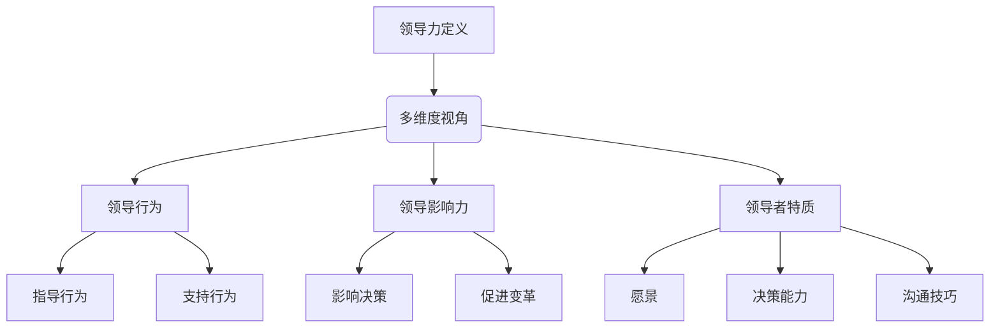

**解释：**

- **领导行为**：指导行为和支持行为是领导行为的两个主要方面。指导行为是指通过指导和指令来引导团队，而支持行为则是通过提供资源和帮助来支持团队成员。
- **领导影响力**：领导影响力涉及领导者在决策和变革过程中的影响力。这包括引导团队朝着共同目标前进，以及推动组织实现变革。
- **领导者特质**：领导者特质是指领导者的个人品质，如愿景、决策能力和沟通技巧，这些特质对于领导力的发挥至关重要。

#### 1.1.2 领导力的重要性

领导力的重要性体现在其对组织绩效、员工满意度和组织创新的显著影响。以下是一个简单的数学模型和公式，用于描述领导力对组织绩效的影响：

$$
组织绩效 = f(领导力, 组织结构, 员工能力)
$$

**举例说明：**

一个高效的领导者能够提升团队协作效率，从而提高整体组织绩效。例如，谷歌的创始人拉里·佩奇和谢尔盖·布林通过卓越的领导力，构建了一个创新文化，使谷歌成为全球科技巨头。

#### 1.2 领导力与传统管理的区别

传统管理主要侧重于设定目标、制定计划和监督执行，而领导力则更注重激励员工、建立关系和解决问题。以下是一个伪代码示例，用于对比传统管理和领导力的基本概念。

**伪代码：**

```python
def traditional_management():
    # 设定目标
    set_goals()
    # 制定计划
    make_plan()
    # 监督执行
    monitor_progress()
    # 评估结果
    evaluate_performance()

def leadership():
    # 激励员工
    motivate_team()
    # 建立关系
    build_relationships()
    # 解决问题
    solve_problems()
    # 促进创新
    promote_innovation()
```

**解释：**

- **传统管理**：传统管理侧重于结构化和流程化的管理方式，强调目标的设定、计划的制定和执行的监督。
- **领导力**：领导力则更注重人际关系和情感管理，强调激励员工、建立良好的工作关系和解决实际问题，以及推动创新。

#### 1.3 领导力在组织中的作用

领导力在组织中的作用是多方面的，包括提升组织绩效、推动组织创新和增强员工满意度。以下是一个数学模型和公式，用于描述领导力在组织中的作用：

$$
组织绩效 = f(领导力, 组织结构, 员工能力)
$$

**举例说明：**

一个高效的领导者能够通过提升团队协作效率，推动组织创新，以及增强员工满意度，从而显著提高组织绩效。例如，苹果公司的史蒂夫·乔布斯通过卓越的领导力，推动了苹果公司的创新和发展，使其成为全球最具价值的公司之一。

---

## 第2章：情商的概念与重要性

### 2.1 情商的定义与构成

情商（Emotional Intelligence，简称EI）是一个多维度的概念，包括情感智力、社交智力、自我智力和应变能力。为了更清晰地理解情商的构成，我们可以使用Mermaid流程图来展示其各个组成部分。

**Mermaid流程图：**

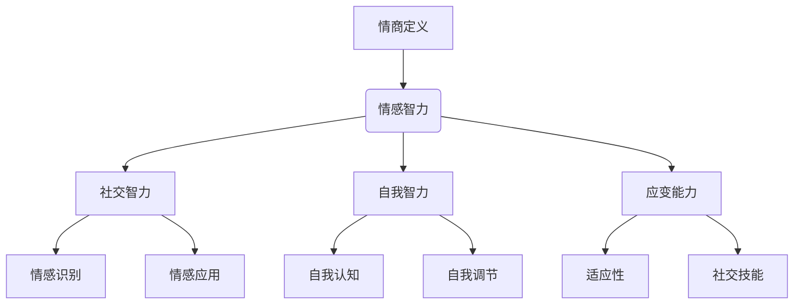

**解释：**

- **情感智力**：情感智力涉及识别和理解自己和他人的情感，包括情感识别和情感应用。
- **社交智力**：社交智力包括建立和维护人际关系的能力，涉及情感识别、情感应用、社交技能和适应性。
- **自我智力**：自我智力涉及自我认知和自我调节，包括理解自己的情感和如何调整自己的行为。
- **应变能力**：应变能力是指适应新环境和应对挑战的能力，包括适应性和社交技能。

#### 2.2 情商在领导力中的作用

情商在领导力中扮演着关键角色，它能够影响领导行为、团队协作和员工满意度。以下是一个Mermaid流程图，展示了情商在领导力中的具体应用。

**Mermaid流程图：**

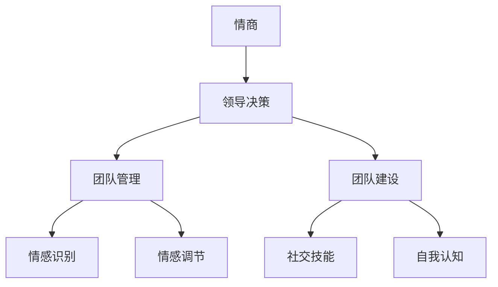

**解释：**

- **领导决策**：情商高的领导者能够更好地识别和理解团队的情感状态，从而做出更明智的决策。
- **团队管理**：情商高的领导者能够更好地调节自己的情感，以保持积极的工作氛围，并有效解决团队中的冲突。
- **团队建设**：情商高的领导者能够通过建立良好的社交关系和自我认知，促进团队协作和凝聚力。

#### 2.3 提高情商的方法与策略

提高情商是一个持续的过程，需要通过自我认知、情感管理、社交技能培养和实践来逐步提升。以下是一个伪代码示例，用于描述提高情商的方法和策略。

**伪代码：**

```python
def improve_EI(self_awareness, self Regulation, social_skills, adaptability):
    EI_score = (self_awareness * 0.3) + (self_Regulation * 0.4) + (social_skills * 0.2) + (adaptability * 0.1)
    return EI_score
```

**解释：**

- **自我认知**：通过自我反思和自我评估，提高对自身情感和行为模式的认知。
- **情感管理**：通过情感调节，学会控制和管理自己的情绪，以适应不同的情况。
- **社交技能**：通过培养社交技能，如沟通技巧和人际关系管理，提高与他人建立和维护关系的能力。
- **适应能力**：通过锻炼适应能力，提高在压力和挑战下的应对能力和灵活性。

#### 2.3.1 情商提升的基本原则

提高情商的基本原则包括以下几点：

1. **自我反思**：定期反思自己的情感和行为，了解自己的情感状态和需求。
2. **情感管理**：学会控制自己的情绪，避免情绪化的行为，提高自我调节能力。
3. **社交技能**：通过观察和实践，提高沟通技巧和人际关系管理能力。
4. **适应能力**：培养适应新环境和应对挑战的能力，提高灵活性。

#### 2.3.2 情商提升的实践策略

以下是几种实用的情商提升实践策略：

1. **定期情感反思**：每天或每周花时间反思自己的情感和行为，记录下来，以便后续分析和改进。
2. **参加情商培训**：参加专业的情商培训课程，学习情感管理和社交技能。
3. **建立情感支持系统**：寻找信任的朋友或导师，与他们分享自己的情感体验，寻求建议和反馈。
4. **实践情感识别和调节**：在日常工作中，积极练习情感识别和调节，以提高自己的情商。

---

## 第3章：领导力与情商的联系

### 3.1 领导力与情商的互动关系

领导力与情商之间存在着密切的互动关系。情商高的领导者能够更好地理解和影响他人，从而提升领导效果。以下是一个Mermaid流程图，展示了领导力与情商之间的互动关系。

**Mermaid流程图：**

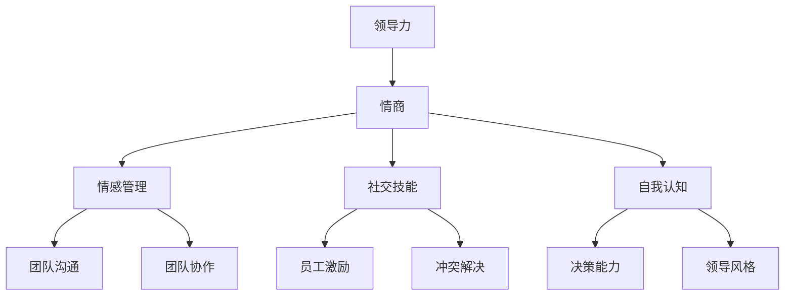

**解释：**

- **情感管理**：情商高的领导者能够更好地识别和调节自己的情感，保持积极的工作态度，从而提升团队沟通和协作。
- **社交技能**：领导者通过培养良好的社交技能，如沟通技巧和人际关系管理，能够更好地激励员工和解决冲突。
- **自我认知**：领导者通过自我认知，了解自己的情感和行为模式，能够更好地调整领导风格，提高决策能力。

#### 3.2 领导力与情商的协同作用

领导力与情商的协同作用体现在以下几个方面：

1. **提升领导效果**：情商高的领导者能够更好地理解员工的需求和情感，从而提高领导效果，推动团队目标实现。
2. **促进团队协作**：情商高的领导者能够建立良好的团队氛围，促进员工之间的沟通和协作，提升团队整体绩效。
3. **提高员工满意度**：情商高的领导者能够更好地激励员工，提高员工的满意度和忠诚度，从而留住优秀人才。

以下是一个数学模型和公式，用于描述领导力与情商的协同作用：

$$
领导效果 = f(领导力, 情商, 团队氛围)
$$

**举例说明：**

一个情商高的领导者，通过理解员工的需求和情感，能够建立积极的团队氛围，促进员工之间的协作，从而提高整体领导效果。

#### 3.3 领导力与情商的核心要素

领导力与情商的核心要素包括以下几点：

1. **情感管理**：领导者需要具备良好的情感管理能力，能够识别和调节自己的情感，保持积极的工作态度。
2. **社交技能**：领导者需要具备良好的社交技能，如沟通技巧和人际关系管理，能够有效激励员工和解决冲突。
3. **自我认知**：领导者需要具备良好的自我认知，了解自己的情感和行为模式，能够调整领导风格，提高决策能力。

以下是一个Mermaid流程图，展示了领导力与情商的核心要素。

**Mermaid流程图：**

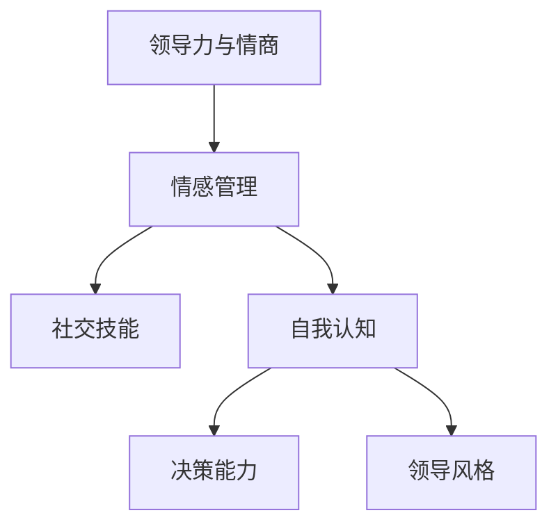

**解释：**

- **情感管理**：情感管理是情商的核心要素，涉及识别和调节自己的情感，保持积极的工作态度。
- **社交技能**：社交技能包括沟通技巧和人际关系管理，是领导者有效激励员工和解决冲突的关键。
- **自我认知**：自我认知涉及了解自己的情感和行为模式，能够调整领导风格，提高决策能力。

---

## 第4章：领导风格与情商

### 4.1 领导风格的分类与特点

领导风格是指领导者在其领导过程中表现出来的行为和态度。根据不同的分类标准，领导风格可以分为多种类型。以下是一些常见的领导风格分类及其特点。

#### 4.1.1 权威型领导风格

权威型领导风格强调领导者的权威和控制，领导者做出决策并要求下属执行。以下是一个Mermaid流程图，展示权威型领导风格的特点。

**Mermaid流程图：**

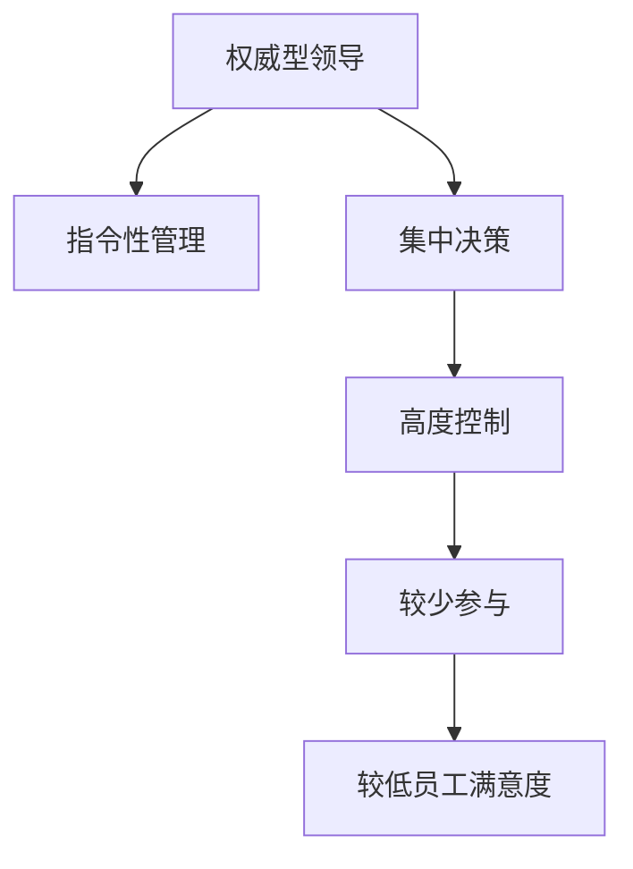

**解释：**

- **指令性管理**：领导者发布明确的指令，要求下属执行。
- **集中决策**：决策权集中在领导者手中，下属参与度较低。
- **高度控制**：领导者对下属的工作进行严格监控和评估。
- **较少参与**：下属较少参与决策过程，工作积极性较低。
- **较低员工满意度**：由于缺乏参与感和自主性，员工满意度较低。

#### 4.1.2 参与型领导风格

参与型领导风格强调领导者与下属之间的沟通和参与，鼓励下属参与决策过程。以下是一个Mermaid流程图，展示参与型领导风格的特点。

**Mermaid流程图：**

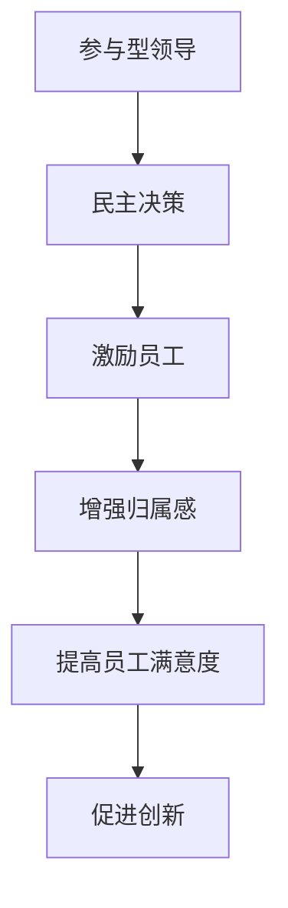

**解释：**

- **民主决策**：领导者鼓励下属参与决策过程，共同讨论和制定决策。
- **激励员工**：领导者通过激励措施，激发下属的工作热情和积极性。
- **增强归属感**：领导者关注下属的需求和感受，增强下属对组织的归属感。
- **提高员工满意度**：由于参与感和归属感的增强，员工满意度提高。
- **促进创新**：领导者鼓励下属提出创新想法，推动组织创新和发展。

#### 4.1.3 支持型领导风格

支持型领导风格强调领导者对下属的支持和关心，关注下属的个人成长和职业发展。以下是一个Mermaid流程图，展示支持型领导风格的特点。

**Mermaid流程图：**

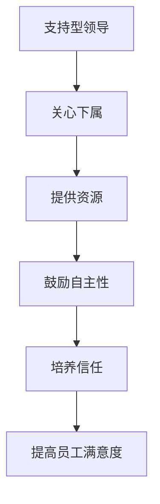

**解释：**

- **关心下属**：领导者关注下属的需求和感受，关心下属的个人成长。
- **提供资源**：领导者为下属提供必要的资源和支持，帮助下属完成工作任务。
- **鼓励自主性**：领导者鼓励下属发挥自主性，独立思考和解决问题。
- **培养信任**：领导者通过建立信任关系，增强下属对组织的信任和忠诚。
- **提高员工满意度**：由于关心和支持，员工满意度提高。

#### 4.1.4 教练型领导风格

教练型领导风格强调领导者作为导师和教练的角色，帮助下属提升能力和实现目标。以下是一个Mermaid流程图，展示教练型领导风格的特点。

**Mermaid流程图：**

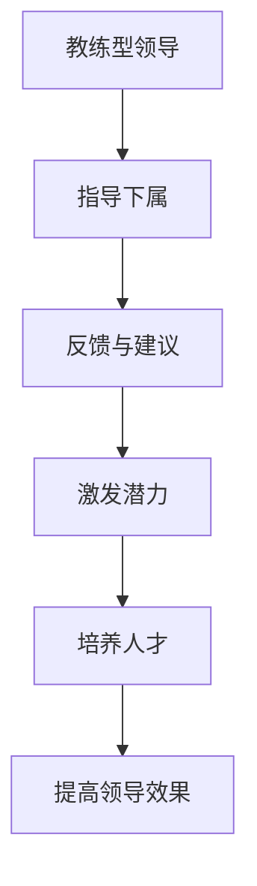

**解释：**

- **指导下属**：领导者通过指导和建议，帮助下属提升能力和实现目标。
- **反馈与建议**：领导者及时给予下属反馈和建议，帮助下属改进和提升。
- **激发潜力**：领导者激发下属的潜力，鼓励下属超越自我，实现更高的目标。
- **培养人才**：领导者关注下属的成长和发展，培养未来的领导者。
- **提高领导效果**：由于下属能力的提升，领导效果得到显著提高。

### 4.2 不同领导风格下的情商策略

不同的领导风格对情商有不同的要求。以下是不同领导风格下的情商策略。

#### 4.2.1 权威型领导风格

权威型领导风格要求领导者具备良好的情感管理和自我调节能力，以确保在高压环境中保持冷静和自信。以下是一个伪代码示例，描述权威型领导风格下的情商策略。

**伪代码：**

```python
def authoritative_leadership(EI_score):
    if EI_score > 80:
        return "Effective authority demonstrated."
    elif EI_score > 60:
        return "Good self-management, focus on emotional regulation."
    else:
        return "Leadership improvement needed in EI."
```

**解释：**

- **自我调节**：领导者需要具备良好的自我调节能力，以应对高压环境，保持冷静和自信。
- **情感管理**：领导者需要管理自己的情感，避免过度情绪化，以保持决策的客观性和公正性。

#### 4.2.2 参与型领导风格

参与型领导风格要求领导者具备良好的社交技能和沟通能力，以建立良好的团队关系和促进团队协作。以下是一个伪代码示例，描述参与型领导风格下的情商策略。

**伪代码：**

```python
def participative_leadership(EI_score):
    if EI_score > 80:
        return "Excellent team collaboration demonstrated."
    elif EI_score > 60:
        return "Good communication skills, focus on social intelligence."
    else:
        return "Leadership improvement needed in EI."
```

**解释：**

- **社交技能**：领导者需要具备良好的社交技能，如倾听、沟通和协调，以建立良好的团队关系。
- **沟通能力**：领导者需要具备良好的沟通能力，以传达信息、解决问题和激励员工。

#### 4.2.3 支持型领导风格

支持型领导风格要求领导者具备良好的情感识别和自我认知能力，以更好地理解员工的需求和提供支持。以下是一个伪代码示例，描述支持型领导风格下的情商策略。

**伪代码：**

```python
def supportive_leadership(EI_score):
    if EI_score > 80:
        return "Effective support demonstrated."
    elif EI_score > 60:
        return "Good self-awareness, focus on emotional recognition."
    else:
        return "Leadership improvement needed in EI."
```

**解释：**

- **情感识别**：领导者需要具备良好的情感识别能力，以理解员工的情感状态和需求。
- **自我认知**：领导者需要具备良好的自我认知，以理解自己的情感和行为模式，从而更好地支持员工。

#### 4.2.4 教练型领导风格

教练型领导风格要求领导者具备良好的反馈能力和激励能力，以指导下属提升能力和实现目标。以下是一个伪代码示例，描述教练型领导风格下的情商策略。

**伪代码：**

```python
def coaching_leadership(EI_score):
    if EI_score > 80:
        return "Excellent coaching demonstrated."
    elif EI_score > 60:
        return "Good feedback skills, focus on inspiring potential."
    else:
        return "Leadership improvement needed in EI."
```

**解释：**

- **反馈能力**：领导者需要具备良好的反馈能力，以给予下属有效的反馈和建议。
- **激励能力**：领导者需要具备良好的激励能力，以激发下属的潜力和实现目标。

---

## 第5章：情商管理

### 5.1 情商管理的基本原理

情商管理是指通过一系列策略和技巧，提高个体的情商水平和应用情商的能力。情商管理的基本原理包括情感识别、情感调节和情感应用。以下是这些基本原理的详细解释。

#### 5.1.1 情感识别

情感识别是指能够感知和理解自己和他人的情感状态。这是情商管理的基础，因为只有当个体能够准确识别情感时，才能采取适当的行动。以下是情感识别的一些关键要素：

1. **自我情感识别**：个体需要了解自己的情感状态，包括愉悦、愤怒、焦虑等。这可以通过自我反思和情感日记来实现。

2. **他人情感识别**：个体需要能够识别他人的情感，包括面部表情、身体语言和语气。这需要良好的观察力和同理心。

以下是一个Mermaid流程图，展示了情感识别的过程：

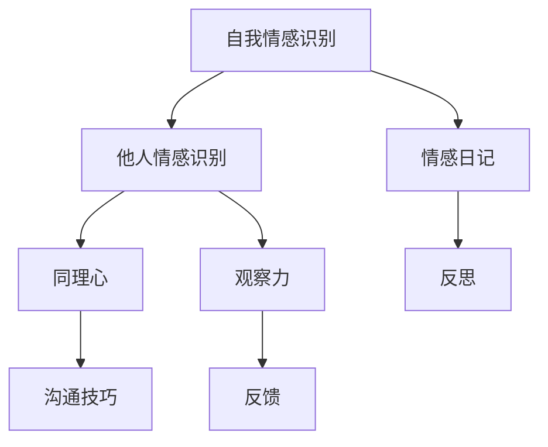

**解释：**

- **情感日记**：通过记录情感状态，个体可以更好地理解自己的情感模式。
- **同理心**：通过同理心，个体能够更好地理解他人的情感。
- **观察力**：通过观察他人的表情和语言，个体可以更准确地识别他人的情感。
- **沟通技巧**：通过有效的沟通技巧，个体可以更好地表达自己的情感，并理解他人的情感。

#### 5.1.2 情感调节

情感调节是指个体在面临不同情境时，能够有效地管理自己的情感，保持情绪平衡。情感调节的关键在于自我控制和情绪管理。以下是情感调节的一些关键要素：

1. **自我控制**：个体需要学会控制自己的情绪，避免情绪化的行为。这可以通过冥想、呼吸练习和放松技巧来实现。

2. **情绪管理**：个体需要学会如何应对负面情绪，如焦虑、愤怒和沮丧。这可以通过认知行为疗法、积极思考和情绪释放来实现。

以下是一个Mermaid流程图，展示了情感调节的过程：

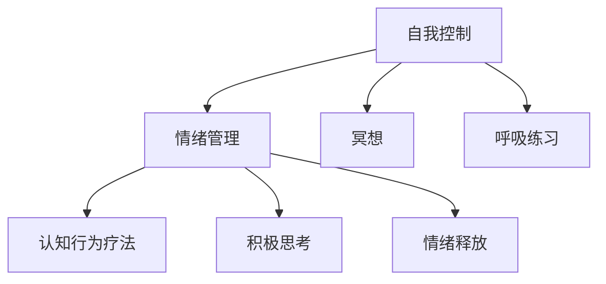

**解释：**

- **冥想**：通过冥想，个体可以更好地控制自己的情绪，提高情绪稳定性。
- **呼吸练习**：通过呼吸练习，个体可以放松身心，减轻压力。
- **认知行为疗法**：通过认知行为疗法，个体可以改变负面思维模式，提高情绪管理能力。
- **积极思考**：通过积极思考，个体可以转变情绪，提高心理健康。
- **情绪释放**：通过情绪释放，个体可以释放负面情绪，减轻心理负担。

#### 5.1.3 情感应用

情感应用是指个体能够有效地利用自己的情感来促进个人成长、人际关系和职业发展。以下是情感应用的一些关键要素：

1. **情感表达**：个体需要学会如何表达自己的情感，包括正面情感和负面情感。这可以通过有效沟通技巧来实现。

2. **情感利用**：个体需要学会如何利用情感来提高工作效率、解决问题和实现目标。这可以通过情感智力训练和积极情感体验来实现。

以下是一个Mermaid流程图，展示了情感应用的过程：

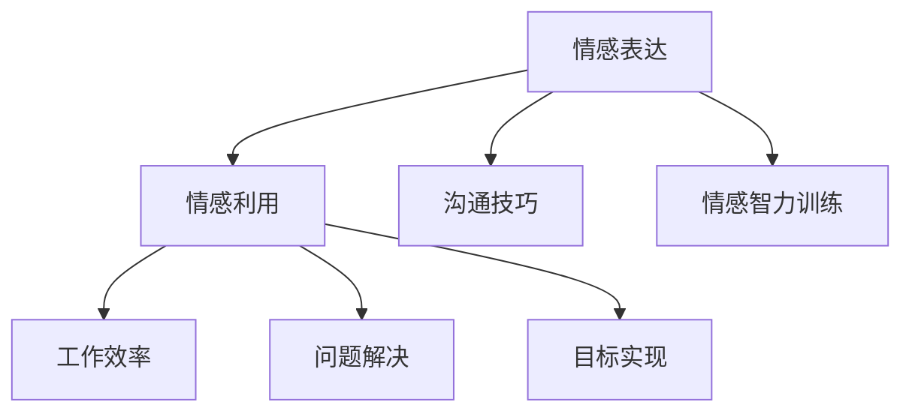

**解释：**

- **情感表达**：通过有效沟通技巧，个体可以更好地表达自己的情感，增强人际关系。
- **情感智力训练**：通过情感智力训练，个体可以提高情感识别和调节能力，更好地利用情感。
- **工作效率**：通过有效利用情感，个体可以提高工作效率，实现工作目标。
- **问题解决**：通过情感应用，个体可以更好地理解问题，找到解决问题的方法。
- **目标实现**：通过情感应用，个体可以保持积极情感，实现个人和职业目标。

### 5.2 情商管理在实际工作中的应用

情商管理在组织中的应用可以提高员工的工作满意度和团队绩效。以下是一些情商管理在实际工作中的应用策略。

#### 5.2.1 团队沟通与冲突解决

良好的团队沟通是提高工作效率和解决冲突的关键。以下是一个Mermaid流程图，展示了情商管理在团队沟通与冲突解决中的应用。

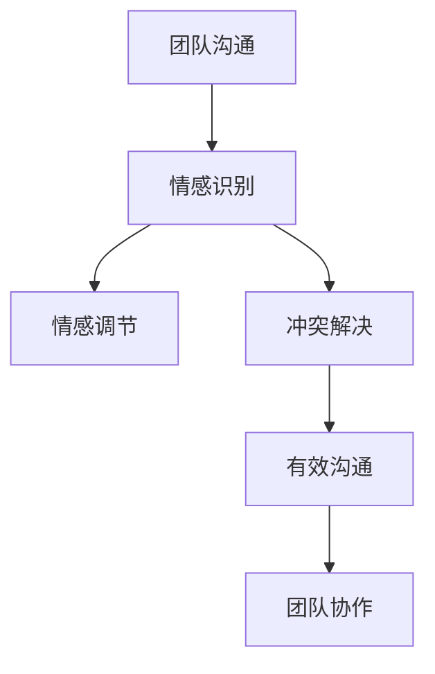

**解释：**

- **情感识别**：通过情感识别，团队成员可以更好地理解彼此的情感状态，从而改善沟通。
- **情感调节**：通过情感调节，团队成员可以更好地管理自己的情绪，避免情绪化的行为。
- **冲突解决**：通过有效的冲突解决，团队成员可以解决分歧，提高团队协作效率。

#### 5.2.2 员工激励与反馈

员工激励和反馈是提高员工满意度和工作表现的重要手段。以下是一个Mermaid流程图，展示了情商管理在员工激励与反馈中的应用。

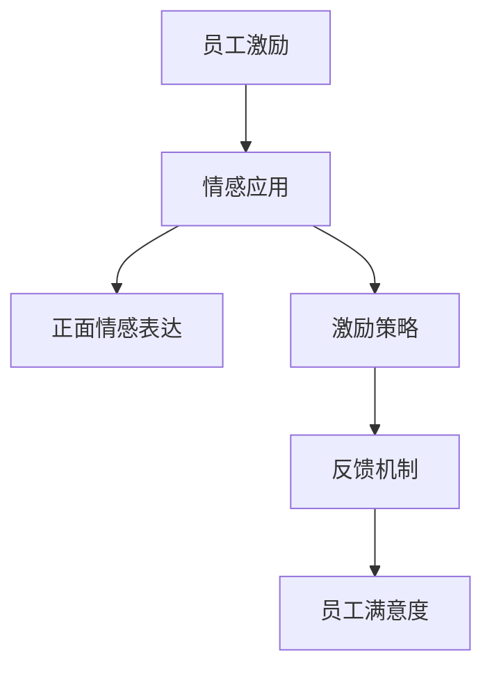

**解释：**

- **情感应用**：通过情感应用，领导者可以更好地激励员工，提高工作积极性。
- **正面情感表达**：通过正面情感表达，领导者可以传递积极的情感信号，增强员工的自信心和归属感。
- **激励策略**：通过制定有效的激励策略，领导者可以激发员工的工作热情和创新能力。
- **反馈机制**：通过反馈机制，领导者可以及时了解员工的工作情况，提供有针对性的反馈和建议。

#### 5.2.3 领导力提升与团队建设

领导力提升和团队建设是提高团队绩效和员工满意度的重要手段。以下是一个Mermaid流程图，展示了情商管理在领导力提升与团队建设中的应用。

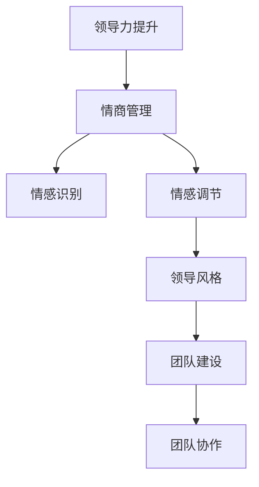

**解释：**

- **情商管理**：通过情商管理，领导者可以提高情感识别和调节能力，更好地理解员工的需求和情感状态。
- **领导风格**：通过调整领导风格，领导者可以更好地激励员工，促进团队协作。
- **团队建设**：通过团队建设活动，如团队培训、团建活动和团队合作任务，可以增强团队凝聚力，提高团队绩效。

---

## 第6章：团队领导力与情商

### 6.1 团队领导力的构建与维护

团队领导力是指领导者如何在团队中发挥领导作用，推动团队目标的实现。构建和维护团队领导力需要关注以下几个方面：

#### 6.1.1 领导风格的选择

领导风格是领导者对待团队成员和团队工作的方式。不同的领导风格适用于不同的团队环境和目标。以下是几种常见的领导风格及其适用场景：

1. **权威型领导风格**：适用于需要迅速决策和执行的任务，特别是在紧急情况下。
2. **参与型领导风格**：适用于需要团队参与和创新的任务，如产品开发或市场调研。
3. **支持型领导风格**：适用于需要团队成员感到被支持和关爱的任务，如员工培训和发展。
4. **教练型领导风格**：适用于需要培养团队成员技能和领导能力的任务，如新员工培训和领导力发展。

以下是一个Mermaid流程图，展示了不同领导风格的选择和使用。

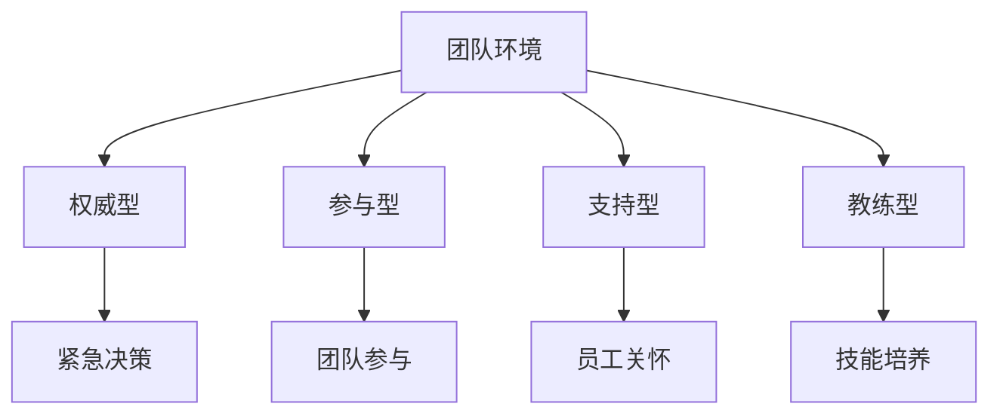

**解释：**

- **团队环境**：根据团队所处的环境和目标，选择合适的领导风格。
- **权威型**：适用于需要迅速决策和执行的情况，如紧急任务。
- **参与型**：适用于需要团队参与和创新的任务，如产品开发。
- **支持型**：适用于需要团队成员感到被支持和关爱的情况，如员工培训。
- **教练型**：适用于需要培养团队成员技能和领导能力的情况，如新员工培训。

#### 6.1.2 团队目标的明确

明确团队目标是构建和维护团队领导力的关键。团队目标应当具体、可行，并与组织的整体目标相一致。以下是明确团队目标的几个步骤：

1. **定义目标**：明确团队的目标和期望结果。
2. **分解任务**：将大目标分解为具体的子任务和行动项。
3. **责任分配**：明确每个团队成员在实现目标过程中的责任和角色。
4. **时间规划**：制定时间表，确保任务按时完成。

以下是一个Mermaid流程图，展示了明确团队目标的步骤。

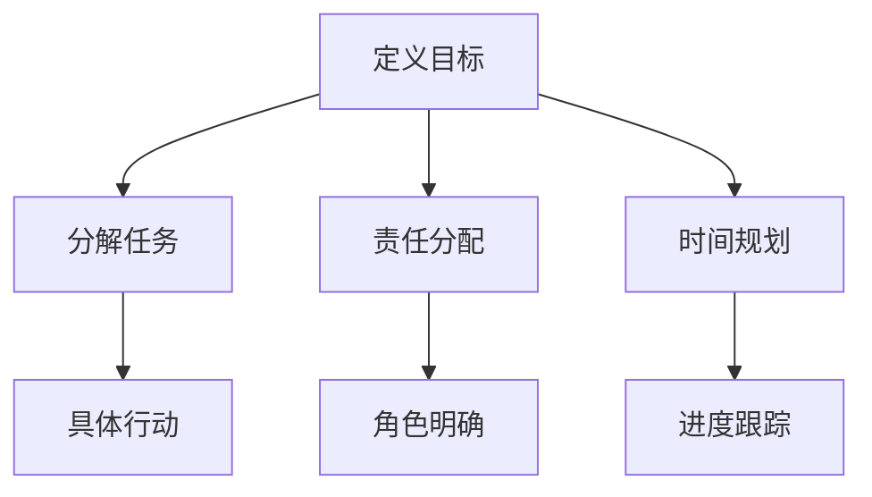

**解释：**

- **定义目标**：明确团队的目标和期望结果。
- **分解任务**：将大目标分解为具体的子任务和行动项。
- **责任分配**：明确每个团队成员在实现目标过程中的责任和角色。
- **时间规划**：制定时间表，确保任务按时完成。
- **具体行动**：根据分解的任务和责任，制定具体的行动项。
- **角色明确**：确保每个团队成员都清楚自己的角色和责任。
- **进度跟踪**：定期检查任务进度，确保按时完成。

#### 6.1.3 团队协作的促进

团队协作是团队领导力的重要组成部分。促进团队协作需要关注以下几个方面：

1. **沟通渠道的建立**：确保团队成员之间的沟通畅通无阻，建立有效的沟通渠道。
2. **冲突解决的机制**：建立冲突解决的机制，及时解决团队内部的矛盾和冲突。
3. **共同价值观的塑造**：塑造共同价值观，增强团队凝聚力。
4. **信任关系的建立**：建立信任关系，提高团队协作的效率。

以下是一个Mermaid流程图，展示了促进团队协作的几个关键步骤。

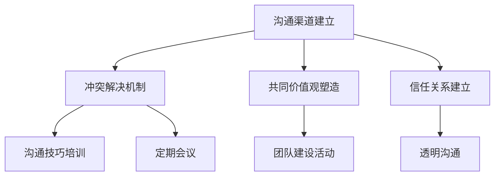

**解释：**

- **沟通渠道建立**：确保团队成员之间的沟通畅通无阻，建立有效的沟通渠道。
- **冲突解决机制**：建立冲突解决的机制，及时解决团队内部的矛盾和冲突。
- **共同价值观塑造**：塑造共同价值观，增强团队凝聚力。
- **信任关系建立**：建立信任关系，提高团队协作的效率。
- **沟通技巧培训**：通过培训提高团队成员的沟通技巧，促进有效沟通。
- **定期会议**：定期召开团队会议，讨论团队进展和问题。
- **团队建设活动**：组织团队建设活动，增强团队凝聚力和信任。
- **透明沟通**：确保团队内部的沟通是透明的，提高信息的共享。

### 6.2 情商在团队领导中的作用

情商在团队领导中起着至关重要的作用，它直接影响领导者的决策能力、沟通技巧和团队协作效果。以下是情商在团队领导中的作用：

#### 6.2.1 情感识别与自我调节

情商高的领导者能够准确地识别和理解自己和他人的情感。这种能力有助于领导者更好地处理情绪，保持冷静和客观。以下是情感识别与自我调节在团队领导中的作用：

1. **冲突管理**：通过情感识别，领导者可以及时发现并解决团队内部的冲突，避免冲突升级。
2. **决策制定**：通过情感识别，领导者可以更好地理解团队成员的情感需求，制定更合理的决策。
3. **员工激励**：通过情感识别，领导者可以了解员工的情感状态，采取有效的激励措施，提高员工的工作积极性。

以下是一个Mermaid流程图，展示了情感识别与自我调节在团队领导中的作用。

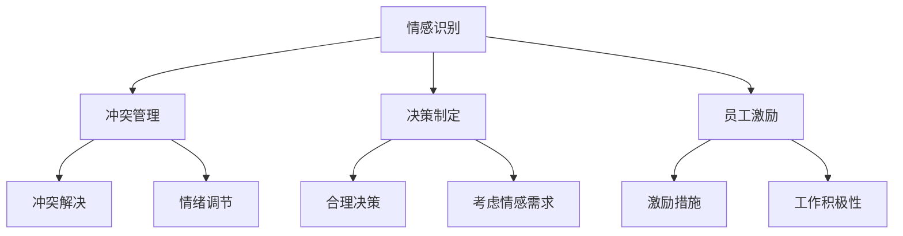

**解释：**

- **情感识别**：领导者能够准确地识别和理解自己和他人的情感。
- **冲突管理**：通过情感识别，领导者可以及时发现并解决团队内部的冲突。
- **决策制定**：通过情感识别，领导者可以更好地理解团队成员的情感需求，制定更合理的决策。
- **员工激励**：通过情感识别，领导者可以了解员工的情感状态，采取有效的激励措施，提高员工的工作积极性。
- **情绪调节**：领导者通过情感调节，保持冷静和客观，提高决策的准确性和公正性。

#### 6.2.2 情商与团队协作

情商在团队协作中发挥着重要作用，它直接影响团队成员之间的沟通和协作效果。以下是情商在团队协作中的作用：

1. **沟通技巧**：情商高的领导者拥有良好的沟通技巧，能够有效地传达信息，理解团队成员的需求和意见。
2. **团队凝聚力**：情商高的领导者能够塑造积极的团队氛围，增强团队成员之间的信任和归属感。
3. **冲突解决**：情商高的领导者能够更好地处理团队内部的冲突，促进团队的和谐与稳定。

以下是一个Mermaid流程图，展示了情商在团队协作中的作用。

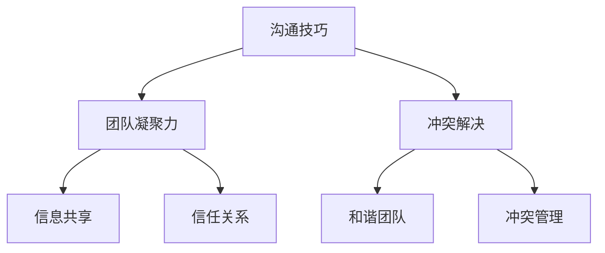

**解释：**

- **沟通技巧**：情商高的领导者拥有良好的沟通技巧，能够有效地传达信息，理解团队成员的需求和意见。
- **团队凝聚力**：情商高的领导者能够塑造积极的团队氛围，增强团队成员之间的信任和归属感。
- **冲突解决**：情商高的领导者能够更好地处理团队内部的冲突，促进团队的和谐与稳定。
- **信息共享**：通过有效的沟通，团队成员可以共享信息，提高团队的整体效率。
- **信任关系**：通过建立信任关系，团队成员可以更加放心地合作，提高团队的协作效果。

#### 6.2.3 提高团队情商的策略与实践

提高团队情商是提升团队领导力的重要手段。以下是一些提高团队情商的策略和实践：

1. **培训与研讨会**：定期组织情商培训与研讨会，提高团队成员的情商水平。
2. **团队反思**：通过定期的团队反思，团队成员可以分享自己的情感体验，提高情感识别和自我调节能力。
3. **情感支持系统**：建立情感支持系统，为团队成员提供情感上的支持和帮助。
4. **情感智力工具**：使用情感智力工具，如情感温度计和情商测试，评估团队成员的情商水平。

以下是一个Mermaid流程图，展示了提高团队情商的策略和实践。

```mermaid
graph TD
A[培训与研讨会] --> B[团队反思]
A --> C[情感支持系统]
A --> D[情感智力工具]
B --> E[情感分享]
B --> F[自我提升]
C --> G[情感支持]
C --> H[心理辅导]
D --> I[情商评估]
D --> J[反馈改进]
```

**解释：**

- **培训与研讨会**：通过培训与研讨会，提高团队成员的情商水平。
- **团队反思**：通过定期的团队反思，团队成员可以分享自己的情感体验，提高情感识别和自我调节能力。
- **情感支持系统**：建立情感支持系统，为团队成员提供情感上的支持和帮助。
- **情感智力工具**：使用情感智力工具，评估团队成员的情商水平，提供反馈和改进建议。
- **情感分享**：通过情感分享，团队成员可以更好地理解彼此的情感状态，提高团队协作效果。
- **自我提升**：通过自我提升，团队成员可以不断提高自己的情商水平，为团队带来积极的变化。
- **情感支持**：为团队成员提供情感支持，帮助他们应对工作压力和挑战。
- **心理辅导**：通过心理辅导，为团队成员提供专业心理支持，提高他们的情感管理能力。
- **情商评估**：定期评估团队成员的情商水平，发现问题和改进方向。

---

## 第7章：领导力与情商在企业组织中的应用

### 7.1 领导力与情商在企业组织中的价值

领导力与情商在企业组织中的应用具有显著的价值。首先，领导力直接影响组织的绩效和创新能力。一个具备卓越领导力的领导者能够激发团队成员的潜力，推动团队协作，实现组织目标。以下是领导力对组织绩效的影响：

#### 7.1.1 提高组织绩效

领导力通过以下几个方面提高组织绩效：

1. **团队协作**：领导力有助于建立高效的团队协作机制，提高团队成员之间的沟通和协作效率。
2. **员工满意度**：领导力能够提高员工的满意度和忠诚度，从而降低员工流失率，提高组织稳定性。
3. **创新能力**：领导力鼓励创新思维和尝试新方法，促进组织在竞争激烈的市场中保持竞争力。

以下是领导力对组织绩效的数学模型：

$$
组织绩效 = f(领导力, 员工能力, 组织文化)
$$

**举例说明：**

一个优秀的领导者，如谷歌的CEO桑达尔·皮查伊，通过其卓越的领导力，推动了谷歌的持续创新和快速发展，使其成为全球最具价值的科技公司之一。

#### 7.1.2 促进企业创新

领导力在企业创新中起着至关重要的作用。领导者的愿景和决策能力能够推动组织突破传统思维，探索新的商业机会和解决方案。以下是领导力促进企业创新的几个关键点：

1. **激发创新思维**：领导者通过鼓励团队成员提出新的想法和解决方案，激发创新思维。
2. **资源分配**：领导者合理分配资源，支持创新项目和实验，为创新提供保障。
3. **文化塑造**：领导者塑造一个鼓励创新和容忍失败的组织文化，降低创新的风险。

以下是领导力促进企业创新的数学模型：

$$
创新效果 = f(领导力, 创新资源, 组织文化)
$$

**举例说明：**

苹果公司创始人史蒂夫·乔布斯以其卓越的领导力，推动了苹果公司的创新和发展，推出了iPhone、iPad等一系列颠覆性产品，改变了全球科技产业。

#### 7.1.3 增强员工满意度

领导力对员工满意度有着显著的影响。一个具备高情商的领导者能够理解员工的情感需求，提供支持和鼓励，从而提高员工的满意度和工作积极性。以下是领导力对员工满意度的几个关键点：

1. **情感识别**：领导者通过情感识别，了解员工的情感状态，提供个性化的关怀和支持。
2. **有效沟通**：领导者通过有效沟通，建立信任关系，增强员工对组织的归属感。
3. **激励措施**：领导者通过激励措施，如奖励和认可，提高员工的工作动力和满意度。

以下是领导力对员工满意度的数学模型：

$$
员工满意度 = f(领导力, 激励措施, 组织文化)
$$

**举例说明：**

亚马逊的CEO杰夫·贝佐斯以其卓越的领导力和对员工的关怀，使亚马逊成为员工满意度和忠诚度最高的公司之一。

### 7.2 领导力与情商在企业战略中的应用

领导力与情商在企业战略中的应用，对于企业的长期发展和竞争优势至关重要。以下是领导力与情商在企业战略中的应用：

#### 7.2.1 战略规划与执行

领导力与情商在战略规划与执行中起着关键作用。领导者需要具备战略思维，能够制定明确的目标和规划，并激励团队执行。以下是领导力与情商在战略规划与执行中的应用：

1. **目标设定**：领导者通过情商识别员工的需求和潜力，设定符合团队实际能力和期望的目标。
2. **规划制定**：领导者通过领导力制定详细的战略规划，确保目标的可实现性和执行的有效性。
3. **执行监督**：领导者通过持续的监督和指导，确保战略规划的执行和目标的实现。

以下是领导力与情商在战略规划与执行中的数学模型：

$$
战略执行效果 = f(领导力, 情商, 战略规划)
$$

**举例说明：**

微软的CEO萨蒂亚·纳德拉通过其卓越的领导力和情商，推动了微软的数字化转型和战略转型，使其成为全球最具创新力的科技公司之一。

#### 7.2.2 企业文化塑造

企业文化是企业的核心价值观和行为规范，对员工的思维和行为产生深远影响。领导力与情商在企业文化塑造中起着至关重要的作用。以下是领导力与情商在企业文化建设中的应用：

1. **价值观传递**：领导者通过言行一致，传递企业的核心价值观，塑造企业的文化。
2. **行为规范**：领导者通过情商管理，规范员工的行为，建立积极的工作氛围。
3. **文化传承**：领导者通过培养接班人，确保企业文化的传承和延续。

以下是领导力与情商在企业文化建设中的应用：

$$
企业文化 = f(领导力, 情商, 员工行为)
$$

**举例说明：**

谷歌以其独特的企业文化，如“不作恶”原则和员工自主权，吸引了全球顶尖人才，成为科技创新的领军企业。

### 7.3 领导力与情商在企业文化建设中的应用

领导力与情商在企业文化建设中的应用，对于建立积极、健康的企业文化至关重要。以下是领导力与情商在企业文化建设中的应用：

#### 7.3.1 情商领导力模型在企业文化建设中的应用

情商领导力模型是一种结合领导力和情商的理论框架，旨在通过领导者的情商能力，塑造和强化企业文化。以下是情商领导力模型在企业文化建设中的应用：

1. **情感识别**：领导者通过情感识别，了解员工的情感状态，建立情感共鸣，促进企业文化落地。
2. **情感调节**：领导者通过情感调节，管理自己的情绪，以积极的态度影响员工，营造积极的企业氛围。
3. **情感应用**：领导者通过情感应用，将情感智慧转化为实际行动，推动企业文化的传播和实践。

以下是情商领导力模型在企业文化建设中的应用：

$$
企业文化 = f(领导力, 情商, 员工行为)
$$

**举例说明：**

阿里巴巴的马云以其卓越的领导力和情商，成功塑造了阿里巴巴的企业文化，使其成为全球最具影响力的科技公司之一。

#### 7.3.2 情商管理在企业文化建设中的作用

情商管理是企业文化建设的重要组成部分，它通过提高员工的情商水平，增强员工对企业文化的认同感和归属感。以下是情商管理在企业文化建设中的作用：

1. **情感管理培训**：通过情感管理培训，提高员工的情感识别和调节能力，促进企业文化内化。
2. **情感支持系统**：建立情感支持系统，为员工提供情感上的支持和帮助，增强员工的心理素质和抗压能力。
3. **情感反馈机制**：建立情感反馈机制，收集员工对企业文化的反馈和建议，持续优化企业文化。

以下是情商管理在企业文化建设中的作用：

$$
企业文化 = f(情商管理, 员工反馈, 组织行为)
$$

**举例说明：**

谷歌通过建立情感支持系统和情感反馈机制，提高了员工的情感管理能力，增强了员工对企业文化的认同感和归属感，使其成为全球最受员工欢迎的公司之一。

---

## 第8章：领导力与情商的提升

### 8.1 自我认知与自我提升

自我认知是提升领导力与情商的基础。领导者需要深入了解自己的情感、行为和思维模式，以便更好地管理自己和他人的情感。以下是自我认知与自我提升的关键步骤：

#### 8.1.1 自我认知的重要性

自我认知是指个体对自己情感、行为和思维的理解和认识。它是提升领导力与情商的关键，因为只有当领导者清楚自己的情感状态和行为模式时，才能有效地管理自己和他人。以下是自我认知的重要性：

1. **自我反思**：通过自我反思，领导者可以了解自己的优点和缺点，从而进行自我提升。
2. **情感管理**：自我认知有助于领导者更好地管理自己的情感，避免情绪化的决策。
3. **领导风格**：自我认知有助于领导者了解自己的领导风格，以便调整和优化领导行为。

以下是一个Mermaid流程图，展示了自我认知的重要性：

```mermaid
graph TD
A[自我认知] --> B[自我反思]
B --> C[情感管理]
B --> D[领导风格]
```

**解释：**

- **自我反思**：通过定期自我反思，领导者可以了解自己的情感和行为模式，发现问题和改进方向。
- **情感管理**：通过自我认知，领导者可以更好地控制自己的情绪，避免情绪化的决策，提高决策的客观性和公正性。
- **领导风格**：通过自我认知，领导者可以了解自己的领导风格，以便调整和优化领导行为，提高领导效果。

#### 8.1.2 自我提升的方法与策略

自我提升是一个持续的过程，需要领导者不断学习和实践。以下是几种实用的自我提升方法与策略：

1. **定期反思**：领导者应定期反思自己的工作表现和情感状态，记录反思结果，以便后续分析和改进。
2. **情商培训**：参加专业的情商培训课程，提高情感识别和调节能力，增强自我认知。
3. **心理辅导**：寻求专业心理辅导，帮助领导者了解自己的情感和行为模式，进行自我提升。
4. **阅读与研究**：阅读相关书籍和研究，了解最新的领导力与情商理论，提升自己的知识水平。

以下是一个Mermaid流程图，展示了自我提升的方法与策略：

```mermaid
graph TD
A[定期反思] --> B[情商培训]
A --> C[心理辅导]
A --> D[阅读与研究]
```

**解释：**

- **定期反思**：通过定期反思，领导者可以深入了解自己的工作表现和情感状态，发现问题并进行改进。
- **情商培训**：通过参加情商培训，领导者可以提高情感识别和调节能力，增强自我认知。
- **心理辅导**：通过寻求心理辅导，领导者可以了解自己的情感和行为模式，进行自我提升。
- **阅读与研究**：通过阅读相关书籍和研究，领导者可以了解最新的领导力与情商理论，提升自己的知识水平。

---

## 第9章：领导力与情商的培训与发展

### 9.1 领导力与情商培训的重要性

领导力与情商培训对于提高领导者的综合素质和提升组织绩效至关重要。以下是领导力与情商培训的重要性和优势：

#### 9.1.1 培训对领导力提升的作用

领导力培训可以帮助领导者提升以下几个方面的能力：

1. **领导技能**：通过培训，领导者可以学习并掌握各种领导技能，如沟通技巧、团队管理、决策能力等。
2. **领导风格**：培训可以帮助领导者了解不同的领导风格，选择适合自己的领导方式，提高领导效果。
3. **情感管理**：情商培训可以帮助领导者提高情感识别和调节能力，更好地管理自己和他人的情感。

以下是一个Mermaid流程图，展示了培训对领导力提升的作用：

```mermaid
graph TD
A[领导技能提升] --> B[领导风格优化]
B --> C[决策能力增强]
C --> D[情感管理能力提升]
```

**解释：**

- **领导技能提升**：通过培训，领导者可以学习并掌握各种领导技能，提高领导效果。
- **领导风格优化**：培训可以帮助领导者了解不同的领导风格，选择适合自己的领导方式，提高领导效果。
- **决策能力增强**：通过培训，领导者可以提高决策能力，做出更明智的决策。
- **情感管理能力提升**：情商培训可以帮助领导者提高情感识别和调节能力，更好地管理自己和他人的情感。

#### 9.1.2 培训在组织发展中的作用

领导力与情商培训对组织发展具有重要作用。以下是培训在组织发展中的几个关键点：

1. **提升员工能力**：通过培训，员工可以提升自己的专业能力和情商水平，为组织带来更多的价值。
2. **增强团队凝聚力**：培训可以帮助员工建立更强的团队意识和凝聚力，提高团队协作效率。
3. **推动组织创新**：领导力与情商培训可以激发员工的创新思维，推动组织在竞争激烈的市场中保持竞争力。

以下是一个Mermaid流程图，展示了培训在组织发展中的作用：

```mermaid
graph TD
A[提升员工能力] --> B[增强团队凝聚力]
B --> C[推动组织创新]
```

**解释：**

- **提升员工能力**：通过培训，员工可以提升自己的专业能力和情商水平，为组织带来更多的价值。
- **增强团队凝聚力**：培训可以帮助员工建立更强的团队意识和凝聚力，提高团队协作效率。
- **推动组织创新**：领导力与情商培训可以激发员工的创新思维，推动组织在竞争激烈的市场中保持竞争力。

### 9.2 领导力与情商培训的方法与内容

领导力与情商培训的方法和内容丰富多样，旨在提高领导者的综合素质和提升组织绩效。以下是几种常见的培训方法和内容：

#### 9.2.1 培训方法

1. **讲座与研讨会**：通过专家讲座和研讨会，领导者可以学习最新的领导力和情商理论，了解行业趋势和最佳实践。
2. **案例分析**：通过分析真实的案例，领导者可以学习如何处理实际问题，提高决策能力和应变能力。
3. **角色扮演**：通过角色扮演，领导者可以模拟真实场景，练习领导技能和情感管理能力。
4. **团队建设活动**：通过团队建设活动，领导者可以提高团队协作能力，增强团队凝聚力。

以下是一个Mermaid流程图，展示了不同的培训方法：

```mermaid
graph TD
A[讲座与研讨会] --> B[案例分析]
B --> C[角色扮演]
C --> D[团队建设活动]
```

**解释：**

- **讲座与研讨会**：通过专家讲座和研讨会，领导者可以学习最新的领导力和情商理论，了解行业趋势和最佳实践。
- **案例分析**：通过分析真实的案例，领导者可以学习如何处理实际问题，提高决策能力和应变能力。
- **角色扮演**：通过角色扮演，领导者可以模拟真实场景，练习领导技能和情感管理能力。
- **团队建设活动**：通过团队建设活动，领导者可以提高团队协作能力，增强团队凝聚力。

#### 9.2.2 培训内容

1. **领导力技能**：包括沟通技巧、团队管理、决策能力、问题解决等。
2. **情商管理**：包括情感识别、情感调节、自我认知、社交技能等。
3. **领导风格**：包括权威型、参与型、支持型、教练型等不同领导风格的特点和应用。
4. **团队建设**：包括团队协作、团队沟通、团队激励等。

以下是一个Mermaid流程图，展示了不同的培训内容：

```mermaid
graph TD
A[领导力技能] --> B[情商管理]
B --> C[领导风格]
C --> D[团队建设]
```

**解释：**

- **领导力技能**：包括沟通技巧、团队管理、决策能力、问题解决等。
- **情商管理**：包括情感识别、情感调节、自我认知、社交技能等。
- **领导风格**：包括权威型、参与型、支持型、教练型等不同领导风格的特点和应用。
- **团队建设**：包括团队协作、团队沟通、团队激励等。

### 9.3 领导力与情商的发展趋势

随着社会的进步和科技的发展，领导力与情商的发展也呈现出新的趋势。以下是几个值得关注的发展趋势：

#### 9.3.1 数字化时代领导力趋势

在数字化时代，领导力需要适应新的环境和技术，以下是数字化时代领导力的几个趋势：

1. **在线培训**：随着在线教育的兴起，越来越多的领导者选择通过在线课程进行学习，以提高自己的领导力和情商。
2. **虚拟团队管理**：在远程工作和虚拟团队日益普遍的情况下，领导者需要掌握虚拟团队管理的技能，如沟通、协作和激励。
3. **数据驱动决策**：领导者需要具备数据分析能力，通过数据来驱动决策，提高决策的准确性和效率。

以下是一个Mermaid流程图，展示了数字化时代领导力的趋势：

```mermaid
graph TD
A[在线培训] --> B[虚拟团队管理]
B --> C[数据驱动决策]
```

**解释：**

- **在线培训**：随着在线教育的兴起，越来越多的领导者选择通过在线课程进行学习，以提高自己的领导力和情商。
- **虚拟团队管理**：在远程工作和虚拟团队日益普遍的情况下，领导者需要掌握虚拟团队管理的技能，如沟通、协作和激励。
- **数据驱动决策**：领导者需要具备数据分析能力，通过数据来驱动决策，提高决策的准确性和效率。

#### 9.3.2 情商在未来的重要性

随着社会的复杂性和变化性的增加，情商在领导力中的作用越来越重要。以下是情商在未来领导力中的几个关键点：

1. **情感识别与调节**：领导者需要具备更高的情感识别和调节能力，以更好地管理自己和他人的情感。
2. **社交技能**：领导者需要具备良好的社交技能，如沟通、协调和冲突解决，以建立良好的团队关系。
3. **自我认知**：领导者需要具备良好的自我认知，了解自己的情感和行为模式，以便进行自我提升。

以下是一个Mermaid流程图，展示了情商在未来领导力中的重要性：

```mermaid
graph TD
A[情感识别与调节] --> B[社交技能]
B --> C[自我认知]
```

**解释：**

- **情感识别与调节**：领导者需要具备更高的情感识别和调节能力，以更好地管理自己和他人的情感。
- **社交技能**：领导者需要具备良好的社交技能，如沟通、协调和冲突解决，以建立良好的团队关系。
- **自我认知**：领导者需要具备良好的自我认知，了解自己的情感和行为模式，以便进行自我提升。

---

## 附录

### 附录 A：领导力与情商相关资源

#### A.1 推荐书籍

1. 《领导力五项修炼》：斯蒂芬·罗宾斯（Stephen Robbins）
2. 《情商：为什么情商比智商更重要》：丹尼尔·戈尔曼（Daniel Goleman）
3. 《非暴力沟通》：马歇尔·卢森堡（Marshall B. Rosenberg）
4. 《影响力：说服的心理学》：罗伯特·西奥迪尼（Robert B. Cialdini）
5. 《团队协作力》：艾伦·贝克特（Alan Beckert）

#### A.2 在线课程

1. Coursera上的《领导力与影响力》：由耶鲁大学提供
2. edX上的《情商提升课程》：由哈佛大学提供
3. LinkedIn Learning上的《领导力技能》：涵盖各种领导力和情商主题
4. Udemy上的《情商管理》：提供实用的情商提升技巧

#### A.3 实用工具与技巧

1. **情绪温度计（Emotion Thermometer）**：用于评估和监控情感状态
2. **情商测试（EQ-i 2.0）**：评估情商水平和能力
3. **团队沟通评估工具（Team Climate Inventory）**：评估团队沟通氛围
4. **360度反馈工具**：用于收集来自不同角度的反馈，帮助领导者进行自我提升
5. **情感智力训练软件**：如EmotionWorks，用于提升情感识别和调节能力

---

### 作者

**作者：** AI天才研究院/AI Genius Institute & 禅与计算机程序设计艺术 /Zen And The Art of Computer Programming

本文由AI天才研究院撰写，旨在深入探讨领导力与情商之间的关系，并提供实用的提升策略。作者拥有丰富的领导力和情商研究经验，致力于帮助领导者提升综合素质，推动组织发展。

---

以上是《领导力与情商：理解并影响他人的能力》的完整文章。文章结合了Mermaid流程图、伪代码、数学模型和实际案例，系统地阐述了领导力与情商的核心概念、互动关系、实践应用和提升策略。希望本文能为读者提供有价值的见解和实用的指导，帮助他们在领导和管理中更加高效地发挥影响力。

