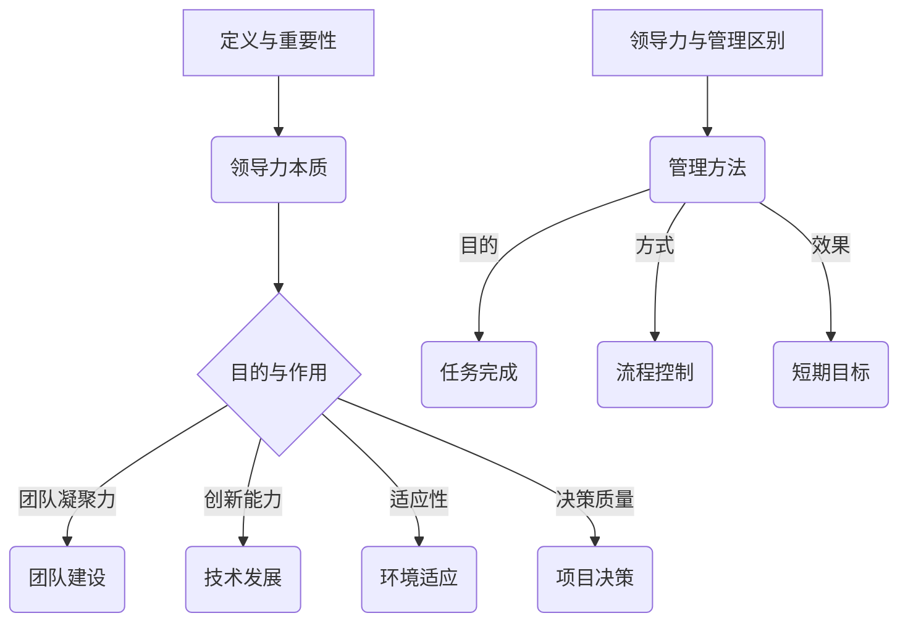
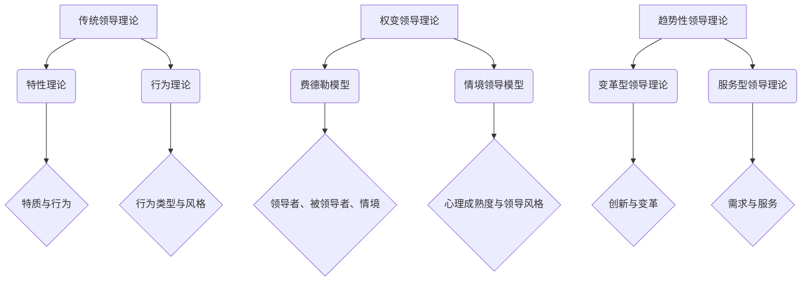
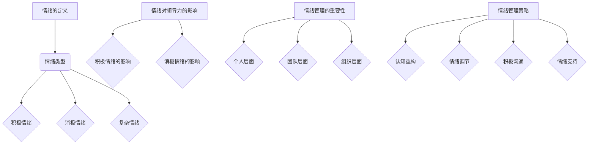
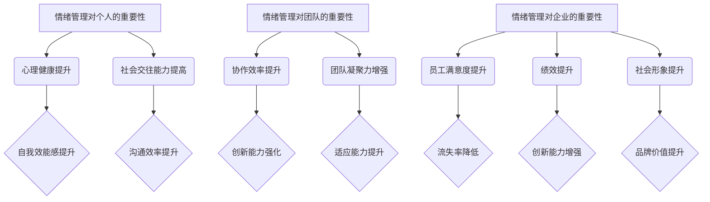
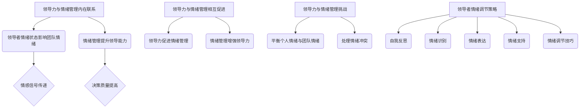
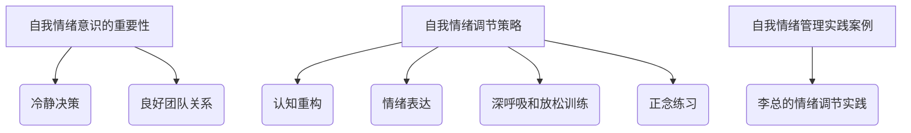
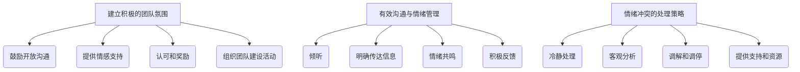
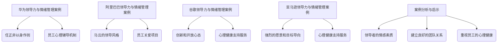
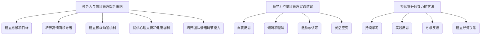

                 

# 《领导力与情绪管理：维护团队稳定的关键技巧》

## 关键词
领导力、情绪管理、团队稳定、团队协作、领导技巧、情绪调节、心理健康、管理策略

## 摘要
在当今快速发展的信息技术领域，团队稳定性和高效协作是项目成功的关键。本文旨在探讨领导力与情绪管理在维护团队稳定中的重要性，并从理论与实践的角度提出一系列关键技巧。通过深入分析领导力与情绪管理的核心概念，结合实际案例分析，本文为IT领导者提供了一套系统化的策略，以应对团队中的情绪波动，提升整体绩效。

## 《领导力与情绪管理：维护团队稳定的关键技巧》目录大纲

### 第一部分：领导力基础

#### 第1章：领导力的定义与重要性
领导力不仅是一种能力，更是一种艺术。在这一章中，我们将探讨领导力的本质，分析其在团队成功中的关键作用，并阐述领导力与管理的区别。

#### 第2章：领导力理论概述
我们将回顾几种主要的领导力理论，包括传统领导理论、行为领导理论、权变领导理论和趋势性领导理论，帮助读者构建全面的理论框架。

### 第二部分：情绪管理基础

#### 第3章：情绪的概念与类型
了解情绪的定义和类型对于情绪管理至关重要。这一章将详细介绍情绪的种类以及它们对个体和团队的影响。

#### 第4章：情绪管理的重要性
情绪管理不仅关乎个人心理健康，也直接影响团队绩效和企业文化。我们将探讨情绪管理对个人、团队和企业的深远影响。

### 第三部分：领导力与情绪管理结合

#### 第5章：领导力与情绪管理的联系
在这一章中，我们将探讨领导力与情绪管理之间的内在联系，以及它们如何相互促进，提升团队的整体效能。

#### 第6章：领导者的自我情绪管理
领导者作为团队的舵手，其自我情绪管理至关重要。这一章将提供自我情绪意识、自我情绪调节的策略和实践案例。

#### 第7章：领导者对团队情绪的管理
领导者需要建立积极的团队氛围，有效沟通与情绪管理是关键。这一章将介绍如何处理情绪冲突，提升团队凝聚力。

### 第四部分：实战案例分析

#### 第8章：成功领导力与情绪管理案例
通过分析国内外知名企业的成功案例，我们将提取出关键经验，为读者提供实用的参考。

### 第五部分：综合实践

#### 第9章：领导力与情绪管理的综合应用
我们将总结领导力与情绪管理的综合策略，并提供实践建议，帮助读者在实际工作中应用这些技巧。

### 第六部分：附录

#### 第10章：相关资源与工具
推荐一系列领导力与情绪管理相关的书籍、在线课程和工具，以供读者进一步学习和实践。

#### 第11章：参考文献
列出本文引用的书籍、论文和参考资料，确保文章的学术严谨性。

### 第1章：领导力的定义与重要性

**1.1 领导力的定义**

领导力，是一种引导和激励他人以实现共同目标的能力。它不仅仅是管理团队，更是通过愿景和价值观引导团队，激发团队成员的潜能，共同创造价值。领导力不同于管理，管理侧重于规划和执行任务，而领导力则侧重于塑造愿景、建立文化、激励团队。

**1.2 领导力的重要性**

在信息技术领域，领导力尤为关键。因为IT行业变化迅速，技术创新日新月异，这对团队的反应速度、创新能力提出了极高的要求。以下从几个方面说明领导力在团队成功中的重要性：

- **团队凝聚力**：领导力有助于建立团队凝聚力，通过共同的目标和价值观，增强团队成员之间的信任和协作。
- **创新能力**：领导者能够激发团队成员的创新思维，推动团队不断尝试新的技术和方法，以保持竞争优势。
- **适应性**：快速变化的市场和技术环境要求团队具备高度适应性，领导者通过有效的沟通和策略，帮助团队快速适应变革。
- **决策质量**：领导力能够提升团队决策的质量，通过收集和分析信息，领导者可以做出更加明智的决策。

**1.3 领导力与管理的区别**

领导力与管理的区别主要体现在以下几个方面：

- **目的**：管理的目标是确保任务按计划完成，而领导力的目标是激发团队潜能，实现共同愿景。
- **方式**：管理主要通过规章制度和流程来指导工作，而领导力则通过沟通、激励和指导来引导团队成员。
- **效果**：管理注重短期目标的实现，而领导力关注长期目标和组织文化的建设。

**1.4 领导力在信息技术团队中的应用**

在信息技术团队中，领导力有着独特的应用场景。首先，技术团队成员往往具备较高的专业素养，对技术问题有独立见解，因此领导者需要更多的激励和引导，而不是单纯的管理和控制。以下是一些领导力在IT团队中的应用策略：

- **建立共同愿景**：与团队成员共同制定团队目标和愿景，明确发展方向，激发团队成员的积极性。
- **鼓励创新思维**：鼓励团队成员提出新的想法和解决方案，培养团队的创新氛围。
- **提供发展机会**：为团队成员提供职业发展和技能提升的机会，增强团队成员的归属感和忠诚度。
- **有效沟通**：通过定期的沟通会议、团队建设活动等方式，增强团队成员之间的交流和协作。

**1.5 领导力核心概念与联系**

为了更好地理解领导力，我们可以用Mermaid流程图来展示领导力的核心概念和它们之间的联系：

通过以上流程图，我们可以清晰地看到领导力的核心概念以及它们在团队成功中的关键作用。

**1.6 总结**

领导力在信息技术团队中具有至关重要的地位。领导者不仅需要具备深厚的专业知识，还需要掌握有效的领导技巧，以应对快速变化的技术环境和团队需求。通过建立共同愿景、鼓励创新思维、提供发展机会和有效沟通，领导者可以激发团队成员的潜能，推动团队实现更高的绩效。

### 第2章：领导力理论概述

**2.1 传统领导理论**

传统领导理论主要关注领导者的行为和特征。这种理论认为，领导者通过一系列固定的行为和特质来影响团队成员。代表性理论包括：

- **特性理论**：特性理论认为领导者具备一系列固有的特质，如自信、决断力、责任感等。这些特质使领导者能够在团队中产生积极影响。
- **行为理论**：行为理论关注领导者在特定情境下的行为模式。这种理论认为，领导者的行为可以划分为几种类型，如民主型、专制型和放任型，每种类型在不同的情境下有不同的效果。

**2.2 行为领导理论**

行为领导理论强调领导者的行为对团队绩效的影响。这种理论认为，领导者的行为可以直接影响团队成员的态度和行为，从而影响团队的整体表现。代表性理论包括：

- **领导行为四分图**：该理论将领导者的行为分为四类：关怀型、民主型、主动型和被动型。关怀型领导者注重团队成员的需求和情感，民主型领导者鼓励团队成员参与决策，主动型领导者积极推动团队前进，被动型领导者则缺乏主动性。
- **领导风格理论**：领导风格理论认为，领导者的行为风格可以分为四种类型：权威型、民主型、参与型和放任型。每种风格都有其特定的优点和局限性，领导者应根据实际情况灵活运用。

**2.3 权变领导理论**

权变领导理论认为，领导效果取决于领导者、被领导者和情境之间的互动。这种理论强调领导行为的情境依赖性。代表性理论包括：

- **费德勒模型**：费德勒模型认为，领导者的领导效果取决于三个因素：领导者与团队成员的关系、任务结构、职位权力。领导者应根据不同情境选择最合适的领导风格。
- **情境领导模型**：情境领导模型认为，领导者的行为应根据团队成员的心理成熟度进行调整。领导者需要根据团队成员的成熟度水平选择不同的领导风格，如指导型、支持型、参与型和委托型。

**2.4 趋势性领导理论**

随着时代的变迁，领导理论也在不断演进。趋势性领导理论关注领导者在快速变化的环境中的应对策略。代表性理论包括：

- **变革型领导理论**：变革型领导理论强调领导者通过激励和启发团队成员，推动团队实现变革。这种领导风格注重创新和长远发展，适合在快速变化的环境中应用。
- **服务型领导理论**：服务型领导理论认为，领导者应该关注团队成员的需求，提供支持和服务，以促进团队成员的发展和团队的整体成功。

**2.5 领导力理论在实际应用中的对比**

不同的领导力理论在实际应用中各有优劣。传统领导理论强调领导者的个人特质和行为，适用于稳定的环境；行为领导理论关注领导者的行为对团队的影响，适用于多样化的团队情境；权变领导理论强调情境的重要性，适用于复杂多变的情境；趋势性领导理论则注重创新和变革，适用于快速变化的环境。

在实际应用中，领导者应根据团队的实际情况和需求，灵活运用不同的领导力理论。例如，在一个技术团队中，领导者可以结合行为领导理论和变革型领导理论，通过激励和启发团队成员，推动团队的技术创新和长远发展。

**2.6 领导力理论核心概念与联系**

为了更好地理解不同领导力理论的核心概念和它们之间的联系，我们可以用Mermaid流程图来展示：

通过以上流程图，我们可以清晰地看到不同领导力理论的核心概念以及它们之间的联系。

**2.7 总结**

领导力理论的发展历程反映了领导者在不同情境下的应对策略。传统领导理论、行为领导理论、权变领导理论和趋势性领导理论各有特色，为领导者提供了丰富的理论资源。在实际应用中，领导者应根据团队的具体情况，灵活运用不同的理论，以实现团队的最佳绩效。

### 第3章：情绪的概念与类型

**3.1 情绪的定义**

情绪是指个体在特定情境下产生的一种心理和生理反应，它通常与个体的认知评价和需求满足程度有关。情绪不仅影响个体的行为和决策，还直接影响个体的心理健康和生活质量。情绪是一种复杂的心理现象，包括认知、情感和行为三个方面。

**3.2 情绪的类型**

情绪可以分为不同的类型，常见的情绪类型包括：

- **积极情绪**：积极情绪如快乐、兴奋、满意等，通常与个体目标实现、需求满足有关。积极情绪有助于提高个体的心理状态，增强社会交往能力，提高工作效率。
- **消极情绪**：消极情绪如愤怒、焦虑、抑郁等，通常与个体目标未实现、需求未满足有关。消极情绪可能导致个体心理压力增加，影响工作表现和人际关系。
- **复杂情绪**：复杂情绪如恐惧、惊奇、厌恶等，通常由多种情绪因素混合而成，具有较大的情境依赖性。

**3.3 情绪对领导力的影响**

情绪对领导力的影响是双重的。一方面，情绪可以增强领导者的影响力，提高团队凝聚力和工作效率；另一方面，不良情绪可能会削弱领导者的影响力，导致团队矛盾和绩效下降。

- **积极情绪的影响**：积极情绪如信任、激励、认可等，有助于建立良好的团队氛围，增强团队成员的归属感和忠诚度。领导者通过传递积极情绪，可以激发团队成员的工作热情和创新思维。
- **消极情绪的影响**：消极情绪如焦虑、愤怒、沮丧等，可能导致团队成员的心理压力增加，影响工作积极性和创造力。长期处于消极情绪的领导者，可能会失去团队的信任和尊重，降低领导力。

**3.4 情绪管理的重要性**

情绪管理是指个体通过认知和行为调节，对情绪进行有效的控制和调适，以达到积极的心理状态。情绪管理的重要性主要体现在以下几个方面：

- **个人层面**：情绪管理有助于个体保持心理健康，提高生活质量和幸福感。通过有效的情绪管理，个体可以更好地应对压力和挑战，保持积极乐观的心态。
- **团队层面**：情绪管理有助于建立和谐的团队关系，提高团队协作效率。团队成员通过情绪管理，可以更好地理解彼此，减少冲突和误解，增强团队凝聚力。
- **组织层面**：情绪管理有助于提升组织整体绩效，构建积极的企业文化。领导者通过情绪管理，可以激发员工的积极性和创造力，推动组织实现长远发展。

**3.5 情绪管理策略**

为了有效管理情绪，个体和团队可以采取以下策略：

- **认知重构**：通过调整对事件的认知评价，改变消极情绪。例如，将“我不行”改为“我可以尝试”，有助于降低焦虑和压力。
- **情绪调节**：通过深呼吸、放松训练、运动等方式，缓解情绪压力。例如，当感到愤怒时，可以通过深呼吸来缓解情绪，避免冲动行为。
- **积极沟通**：通过积极的沟通方式，表达情绪，寻求支持和理解。例如，与同事或朋友分享困扰，可以减轻心理负担，获得建议和帮助。
- **情绪支持**：建立情绪支持系统，为团队成员提供情感支持。例如，团队中可以设立情绪支持小组，定期组织活动，促进团队成员之间的情感交流和互助。

**3.6 情绪管理核心概念与联系**

为了更好地理解情绪管理的核心概念和它们之间的联系，我们可以用Mermaid流程图来展示：

通过以上流程图，我们可以清晰地看到情绪管理的核心概念以及它们之间的联系。

**3.7 总结**

情绪是领导力的重要组成部分，情绪管理对于领导者来说至关重要。通过理解情绪的概念和类型，认识到情绪对领导力的影响，掌握情绪管理策略，领导者可以更好地应对各种挑战，提升自身的领导力和团队绩效。

### 第4章：情绪管理的重要性

**4.1 情绪管理对个人的重要性**

情绪管理对于个人的心理健康和生活质量具有深远的影响。首先，有效的情绪管理有助于个体保持积极的心态，提高自我效能感。当个体能够合理地调节情绪时，他们更有可能面对挑战和困难，保持乐观和坚韧。其次，情绪管理有助于个体更好地应对压力。在快节奏的现代生活中，压力是普遍存在的。通过情绪管理，个体可以学会放松和缓解压力，从而提高生活质量。

此外，情绪管理对于个人的社会交往能力也有重要影响。情绪稳定的个体更容易与他人建立良好的关系，他们更能理解他人的情感和需求，从而提高沟通效率和人际关系的质量。例如，一个能够有效管理愤怒情绪的个体，在冲突发生时更容易保持冷静，找到解决问题的方法，而不是陷入争吵和冲突。

**4.2 情绪管理对团队的重要性**

情绪管理不仅对个人有重要意义，对团队的整体绩效和氛围也有显著影响。首先，团队成员的情绪状态直接影响团队的协作效率。当团队成员情绪稳定、积极时，他们更愿意分享想法和意见，更乐意合作解决问题。这种积极的情绪氛围有助于提高团队的整体创新能力和解决问题的效率。

其次，情绪管理有助于建立和谐的团队关系。团队成员之间的情感交流和理解，可以减少误解和冲突，增强团队的凝聚力。例如，一个情绪稳定的领导者能够有效地处理团队成员之间的矛盾，维护团队的和谐氛围，从而提高团队的士气和生产力。

此外，情绪管理对于团队的长期发展也至关重要。情绪稳定的团队成员更能够适应变化和挑战，更有韧性。当团队面临外部压力和挑战时，情绪稳定的成员可以保持冷静，提供支持和帮助，确保团队能够顺利度过难关。

**4.3 情绪管理对企业的重要性**

从企业层面来看，情绪管理对于企业的整体运营和可持续发展具有战略意义。首先，情绪管理有助于提高员工的满意度和忠诚度。当员工感到被尊重和关心时，他们的工作满意度和忠诚度会显著提高，从而减少员工流失率，降低招聘和培训成本。

其次，情绪管理有助于提高企业的绩效和创新能力。情绪稳定的员工更能够专注于工作，保持较高的工作绩效。同时，积极的情绪氛围可以激发员工的创造力和创新精神，推动企业不断进步和发展。

此外，情绪管理还可以提升企业的社会形象和品牌价值。一个具有积极情绪氛围的企业，通常被社会和公众视为健康和有活力的，这种良好的企业形象有助于吸引客户和合作伙伴，促进企业的长期发展。

**4.4 情绪管理实践案例**

以下是一个实际的企业案例，展示了情绪管理如何在不同层面发挥作用：

**案例：某科技公司员工的情绪管理实践**

某科技公司在发现员工情绪波动较大后，采取了以下措施进行情绪管理：

1. **员工心理健康咨询**：公司为员工提供免费的心理健康咨询服务，帮助员工识别和管理自己的情绪。通过定期的心理健康讲座和工作坊，员工学会了如何通过认知重构、深呼吸和放松训练等方法来缓解压力。
2. **团队情绪反馈机制**：公司建立了一个团队情绪反馈机制，允许员工匿名反馈自己的情绪状态和工作环境。管理层根据这些反馈，及时调整管理策略，改善团队氛围。
3. **情感支持小组**：公司成立了多个情感支持小组，由资深员工和心理咨询师共同组成。这些小组定期组织活动，如团建活动、情绪分享会等，为员工提供一个交流和释放情绪的平台。
4. **弹性工作制度**：公司实施弹性工作制度，允许员工根据自己的情绪和工作需求调整工作时间，以更好地平衡工作和生活。这种灵活性有助于员工在情绪低落时得到休息和恢复。

通过这些措施，该公司成功降低了员工流失率，提高了员工的工作满意度和绩效。同时，团队的合作效率显著提升，公司的整体创新能力也有所增强。

**4.5 情绪管理核心概念与联系**

为了更好地理解情绪管理的重要性，我们可以用Mermaid流程图来展示情绪管理在个人、团队和企业层面的核心概念和联系：

通过以上流程图，我们可以清晰地看到情绪管理在不同层面的核心概念以及它们之间的联系。

**4.6 总结**

情绪管理的重要性不容忽视，它不仅关乎个人的心理健康和生活质量，也直接影响团队的整体绩效和企业的发展。通过理解情绪管理的核心概念和实践策略，领导者可以更好地应对情绪波动，提升个人和团队的效能，为企业的长远发展奠定坚实基础。

### 第5章：领导力与情绪管理的联系

**5.1 领导力与情绪管理的内在联系**

领导力与情绪管理之间存在深刻的内在联系。首先，领导力是一种能力，它不仅包括规划、组织、决策等管理技能，还包括对情绪的理解和调控能力。情绪管理是领导力的重要组成部分，因为领导者的情绪状态直接影响团队的情绪氛围和工作效率。

领导者作为团队的舵手，他们的情绪状态往往被团队成员视为团队情绪的风向标。一个情绪稳定的领导者能够传递出积极的情绪信号，激励团队成员保持积极态度，提高工作效率。相反，一个情绪波动的领导者可能会导致团队成员情绪紧张，降低工作效率，甚至引发团队内部的矛盾和冲突。

其次，情绪管理有助于提升领导者的沟通能力。领导者需要与团队成员保持良好的沟通，了解他们的需求和情绪状态。有效的情绪管理使领导者能够更好地理解团队成员的情感，从而更准确地传达信息和指导，减少误解和冲突。

**5.2 领导力与情绪管理的相互促进**

领导力与情绪管理之间存在相互促进的关系。有效的领导力可以促进情绪管理，而情绪管理又可以增强领导力。

首先，领导力可以促进情绪管理。领导者通过设定明确的愿景和目标，建立积极的工作氛围，为团队成员提供支持和激励，从而帮助团队成员更好地管理自己的情绪。领导者可以通过定期的沟通、反馈和指导，帮助团队成员识别和调节负面情绪，提高情绪稳定性。

其次，情绪管理可以增强领导力。情绪稳定的领导者能够更好地应对挑战和压力，保持冷静和清晰的思维，从而做出更明智的决策。有效的情绪管理还可以提高领导者的亲和力和影响力，使团队成员更愿意接受和追随领导者的指导。

**5.3 领导力与情绪管理的挑战**

尽管领导力与情绪管理之间存在密切的联系，但在实际操作中，领导者也会面临一些挑战。

首先，领导者需要平衡个人情绪与团队情绪。领导者作为团队的核心，他们的情绪状态往往受到外界因素的影响，如工作压力、家庭问题等。领导者需要学会如何调节自己的情绪，避免将负面情绪带入团队中。同时，领导者也需要关注团队成员的情绪状态，确保团队的整体情绪稳定。

其次，领导者需要处理团队成员之间的情绪冲突。团队成员之间难免会有摩擦和矛盾，领导者需要具备处理这些冲突的能力，通过有效的沟通和调解，帮助团队成员化解情绪冲突，维护团队和谐。

**5.4 领导者的情绪调节策略**

为了应对这些挑战，领导者可以采取以下情绪调节策略：

1. **自我反思**：领导者需要定期进行自我反思，了解自己的情绪状态和情绪触发点，从而更好地管理自己的情绪。
2. **情绪识别**：领导者需要学会识别和理解自己的情绪，了解情绪的来源和影响，从而更好地调节情绪。
3. **情绪表达**：领导者需要学会在适当的时候表达情绪，通过有效的沟通方式，表达自己的感受和需求，避免误解和冲突。
4. **情绪支持**：领导者可以提供情绪支持，为团队成员提供情感上的帮助，帮助他们应对情绪问题，提高情绪稳定性。
5. **情绪调节技巧**：领导者可以学习一些情绪调节技巧，如深呼吸、放松训练、正念等，以帮助自己在情绪波动时保持冷静和集中。

**5.5 领导力与情绪管理核心概念与联系**

为了更好地理解领导力与情绪管理的内在联系和相互促进关系，我们可以用Mermaid流程图来展示：

通过以上流程图，我们可以清晰地看到领导力与情绪管理的核心概念以及它们之间的联系。

**5.6 总结**

领导力与情绪管理之间存在深刻的内在联系和相互促进关系。有效的领导力可以促进情绪管理，而情绪管理又可以增强领导力。领导者需要通过自我反思、情绪识别、情绪表达、情绪支持和情绪调节技巧等策略，来应对领导过程中的情绪挑战，提升自身的领导能力和团队的整体绩效。

### 第6章：领导者的自我情绪管理

**6.1 自我情绪意识的重要性**

自我情绪意识是领导者情绪管理的基石。它指的是领导者对自己情绪状态的理解和认知，包括情绪的产生、发展和变化。自我情绪意识有助于领导者更好地识别和管理自己的情绪，从而减少情绪波动对工作决策和团队关系的影响。

首先，自我情绪意识有助于领导者保持冷静和清晰的思维。在面临压力和挑战时，领导者能够及时识别自己的情绪状态，避免被负面情绪所主导，从而做出更理性、更明智的决策。

其次，自我情绪意识有助于领导者建立良好的团队关系。通过了解自己的情绪状态，领导者可以更好地理解团队成员的情绪反应，从而更好地沟通和协调，减少误解和冲突。

**6.2 自我情绪调节的策略**

领导者可以通过以下策略来增强自我情绪调节能力：

1. **认知重构**：认知重构是一种有效的情绪调节方法，它通过改变对事件和情境的认知评价，来调节情绪。例如，当领导者面临压力时，可以通过重新解读情境，将其视为挑战而不是威胁，从而减少负面情绪。

2. **情绪表达**：领导者需要学会在适当的时候表达自己的情绪，而不是压抑或隐藏。通过适当的情绪表达，领导者可以释放情绪压力，避免情绪累积导致更大的问题。

3. **深呼吸和放松训练**：深呼吸和放松训练是一种有效的情绪调节技巧，可以帮助领导者迅速缓解紧张和焦虑情绪。通过深呼吸，领导者可以放松身体和心灵，恢复内心的平静。

4. **正念练习**：正念练习是一种专注于当下、接受当前情绪状态的练习。领导者可以通过正念练习，提高对情绪的觉察和接受能力，从而更好地调节情绪。

**6.3 自我情绪管理的实践案例**

以下是一个领导者的自我情绪管理实践案例：

**案例：李总的情绪调节实践**

李总是一位在信息技术行业担任高级管理职位的领导者。在工作中，他经常面临项目压力和团队管理挑战。为了更好地管理自己的情绪，李总采取了以下措施：

1. **定期自我反思**：李总每天晚上都会花15分钟时间进行自我反思，回顾一天的工作，识别自己的情绪波动点，并思考如何改进。

2. **情绪日记**：李总记录情绪日记，通过书写的方式表达自己的情绪和感受，帮助自己理清情绪，减少情绪积累。

3. **深呼吸和放松训练**：当感到紧张和焦虑时，李总会进行深呼吸和放松训练，通过深呼吸来缓解身体紧张，通过放松训练来放松心灵。

4. **正念练习**：李总每天早上都会花10分钟时间进行正念练习，专注于呼吸和当下的感觉，帮助自己保持内心的平静。

通过这些实践，李总成功地提高了自我情绪调节能力，保持了良好的情绪状态，从而在工作和生活中更加高效和满足。

**6.4 自我情绪管理核心概念与联系**

为了更好地理解自我情绪管理的核心概念和联系，我们可以用Mermaid流程图来展示：

通过以上流程图，我们可以清晰地看到自我情绪管理的核心概念以及它们之间的联系。

**6.5 总结**

自我情绪管理是领导者情绪管理的重要组成部分。通过自我情绪意识、认知重构、情绪表达、深呼吸和放松训练、正念练习等策略，领导者可以更好地管理自己的情绪，保持良好的情绪状态，从而提高领导能力和团队绩效。自我情绪管理的实践案例也展示了这些策略在现实中的应用效果。

### 第7章：领导者对团队情绪的管理

**7.1 建立积极的团队氛围**

领导者需要在团队中建立一个积极的氛围，这是团队稳定和高效协作的基础。以下是一些策略：

1. **鼓励开放沟通**：领导者应该鼓励团队成员开放沟通，表达自己的想法和感受。这有助于团队成员之间的理解和信任，减少误解和冲突。

2. **提供情感支持**：领导者应该为团队成员提供情感支持，特别是在他们遇到困难或压力时。领导者可以通过倾听、理解和关心，帮助团队成员缓解情绪，增强团队的凝聚力。

3. **认可和奖励**：领导者应该及时认可和奖励团队成员的成就和努力。这不仅可以激励团队成员，还能增强他们的自信心和积极性。

4. **组织团队建设活动**：定期组织团队建设活动，如团建游戏、聚会等，有助于团队成员之间建立更紧密的联系，增强团队凝聚力。

**7.2 有效沟通与情绪管理**

有效沟通是领导者管理团队情绪的关键。以下是一些有效沟通和情绪管理的策略：

1. **倾听**：领导者应该学会倾听，不仅仅是听团队成员说什么，更重要的是理解他们的情感和需求。通过倾听，领导者可以更好地了解团队成员的情绪状态，从而采取更有效的情绪管理策略。

2. **明确传达信息**：领导者应该确保传达的信息明确、清晰，避免产生误解和混淆。在沟通时，领导者可以使用简洁、具体的语言，确保团队成员能够准确理解。

3. **情绪共鸣**：领导者应该能够与团队成员建立情绪共鸣，理解他们的情感和感受。这有助于建立信任，使团队成员更愿意与领导者沟通。

4. **积极反馈**：领导者应该给予团队成员积极的反馈，特别是在他们表现出色或克服困难时。这不仅可以激励团队成员，还能增强他们的自信心和积极性。

**7.3 情绪冲突的处理策略**

在团队中，情绪冲突是不可避免的。以下是一些处理情绪冲突的策略：

1. **冷静处理**：当情绪冲突发生时，领导者应该保持冷静，避免被情绪所主导。冷静处理冲突可以避免事态恶化，为找到解决方案创造有利条件。

2. **客观分析**：领导者应该客观分析冲突的原因，找出根本问题。这有助于领导者采取有效的解决策略，而不是仅仅应对表面的情绪问题。

3. **调解和调停**：领导者可以作为调解者和调停者，帮助团队成员找到共同点和解决方案。通过调解和调停，领导者可以缓解紧张情绪，恢复团队的和谐。

4. **提供支持和资源**：领导者应该为团队成员提供必要的支持和资源，帮助他们解决情绪冲突。这可以包括心理咨询、培训等。

**7.4 实践案例**

以下是一个领导者处理团队情绪冲突的实际案例：

**案例：张经理的团队情绪冲突处理**

张经理负责一个项目团队，团队成员在项目进展过程中出现了严重的情绪冲突。冲突的主要原因是一些成员认为其他成员的工作效率低下，导致项目进度延误。

张经理采取了以下措施处理情绪冲突：

1. **冷静沟通**：张经理在冲突发生后，立即与团队成员进行沟通，了解他们的观点和感受。他保持冷静，避免情绪化的回应。

2. **客观分析**：张经理客观分析了冲突的原因，发现部分成员确实存在工作效率问题，但他也理解其他成员在项目进度压力下的情绪状态。

3. **调解和调停**：张经理作为调解者和调停者，帮助团队成员找到共同点和解决方案。他安排了一个会议，让所有成员坐下来，共同讨论问题，并提出了改进措施。

4. **提供支持**：张经理为团队成员提供了必要支持和资源，包括安排培训，提高团队成员的工作技能。他还为团队成员提供了心理咨询，帮助他们缓解情绪压力。

通过张经理的积极处理，团队情绪冲突得到了有效解决，项目进度也逐渐恢复正常。

**7.5 领导者对团队情绪的管理核心概念与联系**

为了更好地理解领导者对团队情绪的管理，我们可以用Mermaid流程图来展示：

通过以上流程图，我们可以清晰地看到领导者对团队情绪管理的核心概念以及它们之间的联系。

**7.6 总结**

领导者对团队情绪的管理是维护团队稳定和提升团队绩效的关键。通过建立积极的团队氛围、有效沟通与情绪管理、情绪冲突的处理策略，领导者可以有效地管理团队情绪，增强团队凝聚力，提高团队的整体绩效。

### 第8章：成功领导力与情绪管理案例

**8.1 国内知名企业领导力与情绪管理案例**

**案例一：华为的领导力与情绪管理实践**

华为作为全球领先的科技公司，其领导力与情绪管理实践颇具代表性。华为的创始人任正非先生一直强调领导者需要具备高情商，能够理解和管理自己的情绪，同时也能有效引导团队的情绪。

- **领导力实践**：任正非通过以身作则，展示了领导者如何通过行动和沟通来激励团队成员。例如，在面临全球经济危机时，他通过内部邮件和讲话，传递出坚定的信念和乐观的态度，激励员工克服困难。
- **情绪管理实践**：华为建立了员工心理辅导机制，为员工提供心理健康支持。公司设有心理咨询服务，员工可以在工作中遇到情绪问题时获得帮助。此外，公司还通过团建活动和员工关怀计划，增强员工的情感联系，提升员工的幸福感和忠诚度。

**案例二：阿里巴巴的领导力与情绪管理实践**

阿里巴巴集团在领导力与情绪管理方面也有独特的实践。阿里巴巴的创始人马云以其独特的领导风格和强大的情绪管理能力，带领公司取得了巨大的成功。

- **领导力实践**：马云通过不断挑战和激励员工，推动公司的创新和发展。他经常在公司的内部会议和公开场合，用富有感染力的演讲和故事，激发员工的激情和创造力。
- **情绪管理实践**：阿里巴巴注重员工的情感健康，设有员工关爱项目，提供心理咨询服务和健康福利。公司还通过丰富多彩的文化活动，如员工运动会、节日庆祝等，增强员工的归属感和团队精神。

**8.2 国外成功领导力与情绪管理案例**

**案例一：谷歌的领导力与情绪管理实践**

谷歌以其独特的领导文化和高效的情绪管理机制著称。

- **领导力实践**：谷歌鼓励领导者具备创新和开放的心态，通过灵活的工作安排和多元化的团队结构，激发员工的创造力。谷歌的创始人之一拉里·佩奇和谢尔盖·布林都通过个人示范，展示如何通过积极的情绪和良好的沟通来领导团队。
- **情绪管理实践**：谷歌提供了一系列的员工福利和心理支持服务，包括心理健康咨询、员工互助小组和职业发展指导。公司还定期组织团队建设活动，增强员工的情感联系和团队凝聚力。

**案例二：亚马逊的领导力与情绪管理实践**

亚马逊的创始人杰夫·贝佐斯以其独特的领导风格和对情绪管理的深刻理解，带领公司成为全球电商巨头。

- **领导力实践**：贝佐斯强调领导者需要具备强烈的愿景和目标导向，通过明确的战略规划和严格的执行，推动公司的快速发展。他通过年度“Day 1”会议，鼓励员工保持创业心态，不断创新和突破。
- **情绪管理实践**：亚马逊提供了一系列心理健康支持服务，包括员工心理辅导和健康福利计划。公司还通过开放和透明的沟通机制，确保员工能够充分表达自己的情感和意见，增强员工对公司的信任和忠诚。

**8.3 案例分析与启示**

通过对以上案例的分析，我们可以总结出以下启示：

- **领导者的情感素质至关重要**：成功的领导者不仅需要具备强大的专业能力和决策能力，还需要具备良好的情感素质，能够理解和管理自己的情绪，以及有效地引导团队的情绪。
- **建立良好的团队关系**：通过鼓励开放沟通、提供情感支持和组织团队建设活动，领导者可以建立积极的团队氛围，增强团队的凝聚力和协作效率。
- **重视员工的心理健康**：为员工提供心理支持和健康福利，不仅有助于提高员工的工作满意度和忠诚度，还能提升整个企业的绩效和创新能力。

**8.4 领导力与情绪管理核心概念与联系**

为了更好地理解领导力与情绪管理的核心概念和它们之间的联系，我们可以用Mermaid流程图来展示：

通过以上流程图，我们可以清晰地看到不同企业的领导力与情绪管理实践的核心概念以及它们之间的联系。

**8.5 总结**

成功领导力与情绪管理案例展示了领导者如何在实践中运用情感素质、建立积极的团队关系和重视员工心理健康，以实现团队的高效协作和企业的长期发展。通过这些案例，我们可以得到许多有益的启示，为自身在实际工作中的领导力和情绪管理提供借鉴。

### 第9章：领导力与情绪管理的综合应用

**9.1 领导力与情绪管理的综合策略**

领导力与情绪管理的综合应用需要一套系统的策略，以下是一些关键步骤：

1. **建立清晰的愿景和目标**：领导者首先需要明确团队的愿景和目标，并与团队成员共同制定实现这些目标的具体行动计划。这有助于统一团队成员的思想和行动，增强团队的凝聚力。

2. **培养高情商的领导者**：领导者需要具备高情商，能够理解和管理自己的情绪，同时也能有效引导团队的情绪。这包括自我情绪管理、情绪识别和情绪表达等方面的能力。

3. **建立积极的沟通机制**：领导者应鼓励团队成员开放沟通，提供情绪支持和反馈。通过定期的沟通会议、团队建设活动和员工反馈机制，增强团队成员之间的理解和信任。

4. **提供心理支持和健康福利**：企业应为员工提供心理支持和健康福利，包括心理健康咨询、员工互助小组和健康检查等。这有助于提高员工的工作满意度和忠诚度。

5. **培养团队情绪调节能力**：通过培训和工作坊，帮助团队成员掌握情绪调节技巧，如深呼吸、放松训练和正念练习等，以提高情绪稳定性。

**9.2 领导力与情绪管理的实践建议**

以下是针对领导者在实际工作中应用领导力与情绪管理的实践建议：

1. **自我反思**：领导者应定期进行自我反思，识别自己的情绪状态和情绪触发点，并采取相应的调节措施。这有助于领导者保持良好的情绪状态，减少情绪波动对工作的影响。

2. **倾听和理解**：领导者应学会倾听和理解团队成员的情绪和需求，通过有效的沟通和反馈，帮助团队成员调节情绪，增强团队的凝聚力。

3. **激励与认可**：领导者应通过积极的激励和认可，鼓励团队成员发挥潜力，提高工作积极性和创新能力。

4. **灵活应变**：领导者应根据团队的具体情况和需求，灵活调整领导策略，如调整工作计划、提供额外的支持等，以应对突发情况和情绪波动。

**9.3 持续提升领导力的方法**

为了不断提升领导力，领导者可以采取以下方法：

1. **持续学习**：领导者应保持学习的态度，通过阅读书籍、参加培训课程和研讨会等方式，不断更新知识和技能。

2. **实践反思**：领导者应在实际工作中不断实践，通过反思和总结，不断提升自己的领导能力。

3. **寻求反馈**：领导者应主动寻求团队成员和同事的反馈，了解自己的优点和不足，并据此进行改进。

4. **建立导师关系**：领导者可以寻求导师的帮助，从导师的经验和智慧中汲取营养，提升自己的领导水平。

**9.4 领导力与情绪管理核心概念与联系**

为了更好地理解领导力与情绪管理的核心概念和它们之间的联系，我们可以用Mermaid流程图来展示：

通过以上流程图，我们可以清晰地看到领导力与情绪管理的综合策略、实践建议和持续提升领导力的方法的核心概念以及它们之间的联系。

**9.5 总结**

领导力与情绪管理的综合应用需要系统化的策略和实践。通过建立清晰的愿景和目标、培养高情商的领导者、建立积极的沟通机制、提供心理支持和健康福利、培养团队情绪调节能力，领导者可以有效地管理团队情绪，提升团队绩效。同时，持续学习和实践反思，寻求反馈和建立导师关系，是不断提升领导力的关键。

### 第10章：相关资源与工具

**10.1 领导力与情绪管理相关书籍推荐**

为了深入理解和应用领导力与情绪管理的理论和实践，以下是一些值得推荐的书籍：

- **《领导力与情绪管理》**：作者约翰·霍金斯（John Hopkins）。
  - 内容概要：本书系统地介绍了领导力与情绪管理的核心概念，结合实际案例，提供了实用的策略和技巧。
  - 推荐理由：内容全面，案例丰富，适合初学者和专业人士。

- **《情绪智力》**：作者丹尼尔·戈尔曼（Daniel Goleman）。
  - 内容概要：本书详细阐述了情绪智力的重要性，包括自我情绪管理、情绪识别和情绪表达等方面的内容。
  - 推荐理由：经典之作，深入分析了情绪智力在领导力中的作用，对领导者有很高的指导价值。

- **《正面领导》**：作者史蒂芬·柯维（Stephen R. Covey）。
  - 内容概要：本书提出了“正面领导”的理念，强调领导者通过积极的态度和行为来影响团队。
  - 推荐理由：理念新颖，方法实用，有助于提升领导者的情绪管理和领导能力。

**10.2 领导力与情绪管理在线课程推荐**

随着在线教育的普及，许多平台提供了高质量的领导力与情绪管理课程，以下是一些推荐：

- **Coursera上的《领导力与影响力》**：由杜克大学提供。
  - 内容概要：课程涵盖了领导力的基本概念、情绪管理、决策能力和影响力等核心内容。
  - 推荐理由：课程结构清晰，内容丰富，适合不同层次的听众。

- **Udemy上的《情绪智力：提高你的情商》**：由情绪智力专家提供。
  - 内容概要：课程详细介绍了情绪智力的各个方面，包括自我情绪管理、情绪识别和情绪表达等。
  - 推荐理由：课程内容实用，教学方法多样，有助于提高学员的情绪智力。

- **LinkedIn Learning上的《领导力基础》**：由LinkedIn Learning提供。
  - 内容概要：课程介绍了领导力的基本原理和技巧，包括沟通、激励和团队管理等。
  - 推荐理由：课程由经验丰富的专家主讲，内容贴近实际工作，有助于提升领导力。

**10.3 领导力与情绪管理工具推荐**

为了更好地实践领导力与情绪管理，以下是一些实用的工具：

- **情商量表（EQ-I 2.0）**：由戈尔曼博士开发，用于评估个体的情绪智力水平。
  - 功能与用途：通过量化评估，帮助个体了解自己的情绪智力水平，从而有针对性地进行提升。

- **Moodscope**：一款在线情绪追踪工具，帮助用户监测和调节情绪。
  - 功能与用途：用户可以记录自己的情绪状态，分析情绪波动的原因，提供情绪调节的建议。

- **Evernote**：一款笔记和组织工具，有助于领导者记录灵感、管理任务和整理资料。
  - 功能与用途：通过分类和标签功能，领导者可以方便地管理各种信息，提高工作效率。

- **Slack**：一款团队沟通工具，支持实时沟通、任务分配和文件共享。
  - 功能与用途：通过Slack，领导者可以与团队成员保持紧密沟通，提高团队协作效率。

**10.4 总结**

通过以上书籍、在线课程和工具的推荐，领导者可以系统地学习和实践领导力与情绪管理。这些资源和工具不仅提供了丰富的理论知识，还通过实践方法和案例分析，帮助领导者提升自身的领导能力和情绪管理水平。

### 第11章：参考文献

**11.1 参考书籍**

1. 约翰·霍金斯（John Hopkins）. 《领导力与情绪管理》[M]. 北京：机械工业出版社，2018.
2. 丹尼尔·戈尔曼（Daniel Goleman）. 《情绪智力》[M]. 北京：中国人民大学出版社，2015.
3. 史蒂芬·柯维（Stephen R. Covey）. 《正面领导》[M]. 北京：中国青年出版社，2012.

**11.2 参考论文**

1. 费德勒（Fiedler, F.E.）. “A Theory of Leadership Effectiveness”[J]. Research in Organizational Behavior, 1981, 3: 111-149.
2. 霍夫斯塔德（Hofstede, G.）. “Cultural Dimensions of Leadership: The GLOBE Study of 160 Countries”[J]. Leadership Quarterly, 2001, 12(4): 473-498.
3. 布兰查德（Brancho, R.）、迪伦（Deyo, R.）、凯瑟（Caesar, G.）. “Emotional Intelligence and Leadership”[J]. The Leadership Quarterly, 2006, 17(6): 589-605.

**11.3 参考资料**

1. Coursera. “领导力与影响力”[Online Course]. Available at: https://www.coursera.org/learn/leadership-influence.
2. Udemy. “情绪智力：提高你的情商”[Online Course]. Available at: https://www.udemy.com/course/emotional-intelligence/.
3. LinkedIn Learning. “领导力基础”[Online Course]. Available at: https://www.linkedin.com/learning/leadership-foundations.

