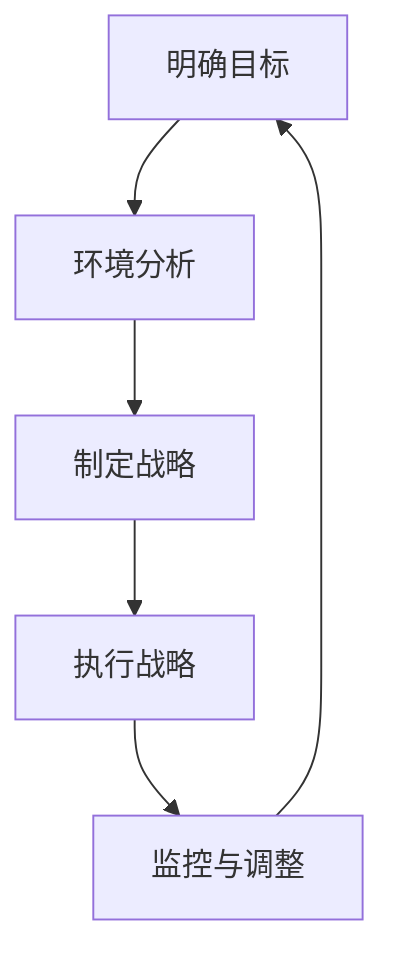

                 

# 《领导力与战略思维：培养长远眼光》

> **关键词：**领导力、战略思维、长远眼光、组织管理、市场营销、人力资源管理、可持续发展、数字化转型、全球化。

> **摘要：**本文将从领导力的理论基础、战略思维的核心概念、战略思维的应用与实践、战略思维的未来趋势等多个方面，深入探讨领导力与战略思维在培养长远眼光中的重要性。通过理论阐述、案例分析、工具与方法介绍，帮助读者理解并掌握如何运用领导力和战略思维，实现组织与个人的长远发展。

----------------------------------------------------------------

## 第一部分：领导力的理论基础

### 第1章：领导力的本质与重要性

在组织管理中，领导力是确保团队朝着共同目标前进的核心力量。领导力不仅关乎个人能力的发挥，更关乎整个组织的发展和未来。本章节将探讨领导力的本质与重要性，为后续内容打下坚实的基础。

#### 1.1 领导力的定义与重要性

**1.1.1 领导力的传统定义**

传统上，领导力被定义为一种激励、指导和影响他人以实现共同目标的能力。这种定义强调了领导者需要具备的技能和特质，如沟通能力、决策能力、团队建设能力等。

**1.1.2 领导力在组织中的作用**

领导力在组织中的作用主要体现在以下几个方面：

- **目标设定**：领导者通过明确组织的愿景和使命，设定明确的目标，引领团队朝着共同的目标前进。

- **资源整合**：领导者需要协调组织内部的资源，确保资源得到最有效的利用，以支持组织目标的实现。

- **团队建设**：领导者通过建立高效的团队，激发团队成员的潜力，提高团队的整体绩效。

- **变革推动**：在面临变革时，领导者需要推动组织变革，使组织能够适应外部环境的变化。

**1.1.3 当代领导力的挑战**

随着时代的发展，当代领导力面临着一系列新的挑战：

- **全球化**：全球化带来了更加复杂的市场环境，领导者需要具备跨文化的沟通能力和全球视野。

- **技术变革**：技术的快速发展要求领导者具备不断学习、适应新技术的能力。

- **员工多样性**：多元化的团队要求领导者具备包容性，能够尊重和利用不同背景、不同观点的员工的特长。

#### 1.2 领导力理论的发展

领导力理论经历了多年的发展，从传统的特质理论到行为科学理论，再到现代的情境理论，每一种理论都为理解领导力提供了不同的视角。

**1.2.1 传统领导力理论**

传统领导力理论主要包括特质理论和行为理论。

- **特质理论**：特质理论认为领导者具有特定的个性特质和能力，这些特质是领导成功的关键。例如，自信、果断、正直等。

- **行为理论**：行为理论则关注领导者的行为模式，认为领导行为可以通过学习和培养来改善。例如，支持型领导、参与型领导等。

**1.2.2 行为科学领导力理论**

行为科学领导力理论强调领导者通过激励、沟通等方式影响团队成员的行为。代表性理论包括领导行为四分图、领导连续体理论等。

**1.2.3 权变理论**

权变理论认为领导效果取决于领导者与情境之间的互动。代表性理论有费德勒模型、路径-目标理论等。

**1.2.4 当代领导力理论**

当代领导力理论包括变革型领导、服务型领导等，这些理论更关注领导者的愿景、价值观和影响力。

#### 1.3 领导者的角色与责任

**1.3.1 领导者的角色**

领导者的角色可以概括为以下几个方面：

- **愿景引领者**：领导者需要设定组织的愿景和目标，为团队指引方向。

- **资源调配者**：领导者需要协调资源，确保组织目标的实现。

- **变革推动者**：领导者需要推动组织变革，适应外部环境的变化。

- **团队建设者**：领导者需要建立高效的团队，激发团队成员的潜力。

**1.3.2 领导者的责任**

领导者的责任包括以下几个方面：

- **对组织的责任**：领导者需要对组织的长期发展和成功负责。

- **对团队成员的责任**：领导者需要关心团队成员的成长和发展，提供必要的支持和激励。

- **对社会和环境的责任**：领导者需要考虑组织的社会责任和环境影响，推动可持续发展。

**1.3.3 领导者的素质与能力**

领导者的素质与能力是影响领导效果的关键因素。以下是一些关键的领导素质与能力：

- **沟通能力**：领导者需要具备有效的沟通能力，能够清晰地表达自己的想法，并倾听和理解他人的观点。

- **决策能力**：领导者需要能够在复杂多变的环境中做出明智的决策。

- **影响力**：领导者需要具备影响力，能够影响和激励团队成员。

- **变革管理能力**：领导者需要能够推动组织变革，使组织能够适应外部环境的变化。

### 第2章：战略思维的核心概念

战略思维是一种深远的思考方式，它帮助领导者从全局的角度看待问题，制定长期的目标和计划。在本章节中，我们将探讨战略思维的核心概念，包括其定义、意义、与战术思维的区别等。

#### 2.1 战略思维的定义与意义

**2.1.1 战略思维的含义**

战略思维是指领导者在面对复杂、不确定的环境时，能够从长远的角度出发，综合考虑各种因素，制定和实施长期目标的过程。战略思维不仅仅关注组织的当前状态，更关注组织的未来发展。

**2.1.2 战略思维在领导力中的重要性**

战略思维在领导力中的重要性体现在以下几个方面：

- **指导组织发展**：战略思维能够帮助领导者设定组织的发展方向，确保组织在未来的竞争中保持优势。

- **应对不确定性**：战略思维能够使领导者更好地应对不确定性，通过提前规划和调整策略，降低风险。

- **资源优化配置**：战略思维能够帮助领导者更好地分配和利用资源，确保资源得到最有效的利用。

**2.1.3 战略思维与战术思维的区别**

战略思维和战术思维是两种不同的思考方式。

- **战略思维**：关注长期目标，注重全局性、长远性和系统性。战略思维的目标是制定和实施组织的长期战略。

- **战术思维**：关注短期目标，注重具体行动和操作的细节。战术思维的目标是实现具体任务的完成。

虽然战略思维和战术思维是两种不同的思考方式，但它们并不是孤立的。在实际应用中，战略思维和战术思维需要相互配合，共同推动组织的发展。

#### 2.2 战略规划的过程

战略规划是战略思维的核心内容，它包括一系列的步骤和过程。以下是战略规划的基本过程：

**2.2.1 战略规划的定义与类型**

**2.2.2 战略规划的步骤**

- **明确组织愿景和使命**：领导者需要明确组织的愿景和使命，为战略规划提供方向。

- **进行环境分析**：包括外部环境分析和内部环境分析，了解组织面临的机会和挑战。

- **确定战略目标**：根据环境分析和组织资源，设定具体的战略目标。

- **制定战略方案**：为实现战略目标，制定具体的战略方案和行动计划。

- **实施战略方案**：执行战略方案，确保战略目标的实现。

- **监控和调整**：在战略执行过程中，不断监控战略执行情况，并根据实际情况进行调整。

**2.2.3 战略规划的方法与工具**

在战略规划过程中，可以使用多种方法和工具来帮助领导者制定和实施战略。以下是一些常用的方法与工具：

- **SWOT分析**：通过分析组织的优势、劣势、机会和威胁，帮助领导者制定战略。

- **平衡计分卡**：通过设定财务、客户、内部流程、学习与成长等四个维度的目标，帮助领导者全面衡量组织的发展。

- **情景分析**：通过模拟不同的未来情景，帮助领导者预见未来可能发生的变化，制定应对策略。

#### 2.3 战略目标与战略选择

战略目标是战略规划的核心内容，它是领导者根据组织愿景和使命，设定的具体、可衡量的目标。以下是关于战略目标和战略选择的一些要点：

**2.3.1 战略目标的设定**

在设定战略目标时，领导者需要考虑以下几个方面：

- **明确性**：战略目标需要具体、明确，以便团队成员能够理解和执行。

- **可衡量性**：战略目标需要具有可衡量性，以便能够评估目标的实现情况。

- **挑战性**：战略目标需要具有一定的挑战性，以激发团队成员的积极性和创造力。

- **相关性**：战略目标需要与组织的愿景和使命保持一致，确保目标的实现有助于组织的发展。

**2.3.2 战略选择的考虑因素**

在制定战略方案时，领导者需要考虑以下因素：

- **资源**：包括人力资源、财务资源、技术资源等，确保战略方案的实施有足够的资源支持。

- **市场**：包括市场趋势、竞争对手、消费者需求等，确保战略方案符合市场的发展方向。

- **技术**：包括新兴技术、现有技术的应用等，确保战略方案能够充分利用技术优势。

- **环境**：包括政治、经济、社会、技术等外部环境因素，确保战略方案能够适应外部环境的变化。

**2.3.3 战略选择的案例分析**

以下是几个战略选择的案例分析：

- **案例1**：某公司在面对激烈的市场竞争时，通过技术创新，推出新产品，成功占领了市场份额。

- **案例2**：某公司在面临财务困境时，通过降低成本、优化运营，成功实现了扭亏为盈。

- **案例3**：某公司在全球化进程中，通过并购海外公司，实现了业务的国际化拓展。

通过这些案例分析，我们可以看到，成功的战略选择不仅取决于领导者的决策能力，还需要对市场、技术、环境等因素有深入的了解。

### 第3章：战略思维在组织管理中的应用

在组织管理中，战略思维的应用至关重要。本章节将探讨战略思维在组织管理中的具体应用，包括组织愿景与使命的设定、战略规划与执行、风险管理与决策等。

#### 3.1 组织愿景与使命

组织愿景和使命是战略思维在组织管理中的核心内容。它们不仅为组织提供了明确的发展方向，还能够激励和凝聚组织成员。

**3.1.1 组织愿景的意义**

组织愿景是组织在未来一段时间内希望达到的状态或目标。它为组织提供了长远的发展方向，使组织成员能够共同为一个明确的目标努力。

- **明确方向**：组织愿景为组织提供了明确的发展方向，使组织成员能够聚焦于共同的目标。

- **激励员工**：组织愿景能够激发员工的工作热情和积极性，使员工愿意为实现组织愿景而努力。

- **凝聚力量**：组织愿景能够凝聚组织成员的力量，形成强大的团队凝聚力。

**3.1.2 组织使命的设定**

组织使命是组织存在的目的和价值。它描述了组织为何存在，以及组织对社会和客户的价值。

- **明确价值**：组织使命明确了组织存在的价值，使组织能够为社会和客户创造价值。

- **指导决策**：组织使命为组织的决策提供了指导，使组织在面临选择时能够坚持自身的核心价值观。

- **塑造文化**：组织使命有助于塑造组织文化，使组织成员能够在共同的价值观念下工作。

**3.1.3 愿景与使命的案例分析**

以下是几个组织愿景与使命的案例分析：

- **案例1**：苹果公司（Apple）的愿景是“通过创新技术，丰富人类的生活”。这一愿景明确了苹果公司的发展方向，使公司能够在科技领域不断创新，为用户提供更好的产品和服务。

- **案例2**：阿里巴巴（Alibaba）的使命是“让天下没有难做的生意”。这一使命体现了阿里巴巴的价值理念，使公司能够为中小企业提供便捷的电子商务服务，推动中小企业的发展。

- **案例3**：谷歌（Google）的愿景是“整合全球信息，使人人皆可访问并从中受益”。这一愿景体现了谷歌的使命，使公司能够通过搜索引擎和一系列在线服务，为全球用户提供便捷的信息获取渠道。

通过这些案例分析，我们可以看到，成功的组织愿景与使命不仅明确了组织的发展方向，还能够激发员工的工作热情和凝聚力。

#### 3.2 战略规划与执行

战略规划是组织管理中的核心环节，它涉及组织愿景与使命的制定、环境分析、战略目标设定、战略方案制定等。战略规划不仅为组织提供了明确的发展方向，还能够确保组织的资源得到最有效的利用。

**3.2.1 战略规划的过程**

战略规划的过程包括以下几个步骤：

1. **明确组织愿景和使命**：组织需要明确自身的愿景和使命，为战略规划提供方向。

2. **进行环境分析**：包括外部环境分析和内部环境分析，了解组织面临的机会和挑战。

3. **确定战略目标**：根据环境分析和组织资源，设定具体的战略目标。

4. **制定战略方案**：为实现战略目标，制定具体的战略方案和行动计划。

5. **实施战略方案**：执行战略方案，确保战略目标的实现。

6. **监控和调整**：在战略执行过程中，不断监控战略执行情况，并根据实际情况进行调整。

**3.2.2 战略执行的挑战**

战略执行是战略规划的关键环节，它面临以下挑战：

- **资源分配**：在资源有限的情况下，如何确保战略方案的实施有足够的资源支持。

- **组织变革**：战略实施往往涉及到组织的变革，如何推动组织变革，使组织能够适应新的战略方向。

- **团队协作**：战略实施需要团队成员的协作，如何激发团队成员的积极性，确保团队协作高效。

**3.2.3 战略执行的案例分析**

以下是几个战略执行的案例分析：

- **案例1**：亚马逊（Amazon）在实现全球化战略的过程中，通过建立全球物流网络，实现了全球商品的快速配送。这一战略的成功实施，使亚马逊在全球电商市场中占据了领先地位。

- **案例2**：微软（Microsoft）在转型为云计算服务提供商的过程中，通过收购云服务公司Azure，实现了在云计算市场的快速扩张。这一战略的成功实施，使微软在云计算市场中取得了显著的成绩。

- **案例3**：腾讯（Tencent）在进军游戏市场的过程中，通过收购和投资游戏公司，实现了游戏业务的快速扩张。这一战略的成功实施，使腾讯在中国游戏市场中占据了重要地位。

通过这些案例分析，我们可以看到，成功的战略执行不仅需要明确的战略规划，还需要高效的执行能力。

#### 3.3 风险管理与决策

在组织管理中，风险是不可避免的。有效的风险管理可以帮助组织降低风险，确保战略目标的实现。决策是组织管理中的核心环节，它涉及到如何利用有限的资源实现最大的收益。本章节将探讨风险管理与决策的基本原则和方法。

**3.3.1 风险管理的概念与原则**

风险管理是指组织通过识别、评估、控制和监控风险，以确保组织目标实现的过程。风险管理的基本原则包括：

- **全面性**：风险管理需要全面覆盖组织各个方面，确保组织在各个层面都能有效应对风险。

- **预防性**：风险管理应采取预防措施，避免潜在风险的发生。

- **持续性**：风险管理是一个持续的过程，需要定期评估和调整。

- **透明性**：风险管理过程需要透明，确保所有相关人员都能了解风险管理的状况。

**3.3.2 决策过程中的风险因素**

在决策过程中，风险因素是影响决策效果的重要因素。以下是一些常见的决策风险因素：

- **信息不完整**：决策过程中，如果信息不完整或存在偏差，可能会导致决策失误。

- **环境不确定性**：外部环境的不确定性，如市场变化、技术进步等，会影响决策的准确性。

- **资源限制**：资源限制，如资金、人力、时间等，会影响决策的选择范围。

- **决策者心理因素**：决策者的心理因素，如风险偏好、情绪等，也会影响决策的效果。

**3.3.3 决策案例分析**

以下是几个决策案例分析：

- **案例1**：某公司在面对新产品开发决策时，通过市场调研和数据分析，识别出潜在的市场需求。在综合考虑资源限制和环境不确定性后，公司决定开发新产品，并最终取得了成功。

- **案例2**：某公司在扩张市场时，通过风险评估和决策，选择了具有较高风险的市场。尽管市场风险较高，但公司在决策过程中采取了有效的风险管理措施，最终实现了市场的成功扩张。

- **案例3**：某公司在投资决策时，通过情景分析和决策树分析，综合考虑了各种可能的市场情况和投资风险。在决策过程中，公司采取了多元化的投资策略，降低了整体投资风险。

通过这些案例分析，我们可以看到，有效的风险管理和决策是组织管理中不可或缺的部分。只有通过科学的决策方法和有效的风险管理，组织才能在复杂多变的环境中取得成功。

### 第4章：战略思维在市场营销中的应用

在市场营销中，战略思维的应用至关重要。通过战略思维，市场营销团队可以更好地了解市场环境，制定有效的市场策略，提高市场竞争力。本章节将探讨战略思维在市场营销中的应用，包括市场分析、市场定位与品牌战略、市场营销策略等。

#### 4.1 市场分析

市场分析是市场营销战略规划的基础，它包括对市场环境、市场竞争、消费者行为等方面的分析。以下是市场分析的主要内容和步骤：

**4.1.1 市场环境分析**

市场环境分析包括宏观环境分析和微观环境分析。

- **宏观环境分析**：包括政治、经济、社会、技术、法律等外部因素。例如，国家政策的变化、经济周期的波动、消费者需求的变化等。

- **微观环境分析**：包括行业内的竞争对手、供应链、客户群体等。例如，竞争对手的市场份额、产品定位、营销策略等。

**4.1.2 市场竞争分析**

市场竞争分析旨在了解市场上的竞争对手，包括他们的产品、价格、渠道、促销策略等。通过竞争分析，可以识别出市场中的机会和威胁，为制定营销策略提供依据。

- **产品分析**：分析竞争对手的产品特点、功能、性能、价格等。

- **价格分析**：分析竞争对手的价格策略，包括定价策略、折扣政策等。

- **渠道分析**：分析竞争对手的渠道策略，包括线上渠道和线下渠道的布局。

- **促销分析**：分析竞争对手的促销策略，包括广告宣传、销售促销等。

**4.1.3 消费者行为分析**

消费者行为分析旨在了解消费者的需求、购买行为、偏好等。通过消费者行为分析，可以更好地定位目标客户，制定更有效的营销策略。

- **需求分析**：分析消费者的需求，包括产品需求、服务需求等。

- **购买行为分析**：分析消费者的购买行为，包括购买决策过程、购买渠道等。

- **偏好分析**：分析消费者的偏好，包括产品偏好、品牌偏好等。

#### 4.2 市场定位与品牌战略

市场定位和品牌战略是市场营销中的核心内容，它们决定了产品在市场中的地位和形象。以下是市场定位和品牌战略的主要内容和步骤：

**4.2.1 市场定位的定义与意义**

市场定位是指企业在市场中确定自己的产品或服务的独特地位，使其在消费者心目中形成独特的印象。市场定位的意义包括：

- **明确目标市场**：市场定位帮助企业明确目标市场，集中资源满足目标市场的需求。

- **区分竞争对手**：市场定位使企业能够与竞争对手区分开来，形成独特的竞争优势。

- **建立品牌形象**：市场定位有助于企业建立品牌形象，提高品牌在消费者心中的认知度和美誉度。

**4.2.2 品牌战略的制定**

品牌战略是指企业为了实现品牌目标而制定的长期计划和策略。品牌战略的制定包括以下几个步骤：

- **品牌目标设定**：明确品牌的目标，包括品牌知名度、品牌美誉度、品牌忠诚度等。

- **品牌定位**：根据市场定位，确定品牌的独特定位，包括产品定位、市场定位、目标客户定位等。

- **品牌传播**：制定品牌传播策略，包括广告、公关、促销等，以提升品牌知名度和美誉度。

- **品牌维护**：通过持续的品牌维护，保持品牌的长期价值和形象。

**4.2.3 市场定位与品牌战略的案例分析**

以下是几个市场定位和品牌战略的案例分析：

- **案例1**：苹果公司（Apple）的市场定位是高端科技产品，品牌战略是通过创新设计、高品质产品和高昂的定价策略，打造独特的品牌形象。苹果公司的市场定位和品牌战略使其在竞争激烈的市场中脱颖而出，成为科技行业的领导者。

- **案例2**：耐克公司（Nike）的市场定位是运动服饰和鞋类，品牌战略是通过赞助顶级运动员、推出创新产品和强大的品牌形象广告，提升品牌知名度和美誉度。耐克公司的市场定位和品牌战略使其在全球运动服饰市场中占据了领先地位。

- **案例3**：可口可乐公司（Coca-Cola）的市场定位是软饮料，品牌战略是通过全球性的广告宣传、赞助大型赛事和持续的品牌创新，提升品牌知名度和忠诚度。可口可乐公司的市场定位和品牌战略使其成为全球软饮料市场的领导者。

通过这些案例分析，我们可以看到，成功的市场定位和品牌战略不仅取决于企业的产品和服务，还需要对市场环境有深刻的理解和把握。

#### 4.3 市场营销策略

市场营销策略是企业为了实现市场目标而制定的具体行动方案。有效的市场营销策略可以帮助企业提高市场份额，增加销售收入。以下是市场营销策略的主要内容：

**4.3.1 产品策略**

产品策略是企业针对产品制定的一系列策略，包括产品定位、产品创新、产品线管理等。

- **产品定位**：明确产品的市场定位，包括产品类型、目标市场、竞争差异等。

- **产品创新**：通过创新设计、技术改进等方式，提高产品的竞争力。

- **产品线管理**：优化产品线，确保产品线的合理性和盈利能力。

**4.3.2 价格策略**

价格策略是企业制定产品价格的一系列策略，包括定价目标、定价方法、价格调整等。

- **定价目标**：根据企业的战略目标，确定定价目标，如市场渗透、市场领导、利润最大化等。

- **定价方法**：采用适当的定价方法，如成本导向定价、市场导向定价、竞争导向定价等。

- **价格调整**：根据市场环境的变化，适时调整价格，以保持竞争力。

**4.3.3 渠道策略**

渠道策略是企业制定产品销售渠道的一系列策略，包括渠道选择、渠道管理、渠道拓展等。

- **渠道选择**：根据产品的特点和目标市场，选择适当的销售渠道，如直销、分销、电商等。

- **渠道管理**：建立有效的渠道管理体系，确保渠道的稳定性和高效性。

- **渠道拓展**：通过拓展新渠道，扩大产品销售范围，提高市场覆盖率。

**4.3.4 推广策略**

推广策略是企业为了提高产品知名度和美誉度而制定的一系列策略，包括广告宣传、公关活动、促销活动等。

- **广告宣传**：通过广告传播，提高产品的品牌知名度和市场认知度。

- **公关活动**：通过公关活动，提升企业的社会形象和品牌美誉度。

- **促销活动**：通过促销活动，刺激消费者的购买欲望，提高销售业绩。

**4.3.5 市场营销策略的案例分析**

以下是几个市场营销策略的案例分析：

- **案例1**：某公司在市场推广新产品时，通过广告宣传、公关活动和促销活动，迅速提高了产品的知名度。在市场推广期间，公司还通过社交媒体与消费者互动，增强了品牌的美誉度。

- **案例2**：某公司在市场定位为高端市场时，采用了高定价策略，通过高品质的产品和创新的设计，吸引了高端消费者的关注。公司还通过赞助高端赛事和明星代言，提升了品牌的高端形象。

- **案例3**：某公司在拓展新市场时，选择了电商渠道，通过线上线下结合的方式，扩大了产品销售范围。公司还通过数据分析，优化了产品推荐和营销策略，提高了销售业绩。

通过这些案例分析，我们可以看到，有效的市场营销策略不仅能够提高产品的市场竞争力，还能够帮助企业实现市场目标。

### 第5章：战略思维在人力资源管理中的应用

在人力资源管理中，战略思维的应用至关重要。通过战略思维，人力资源管理者可以更好地理解组织的发展需求，制定有效的人力资源策略，提升组织的整体竞争力。本章节将探讨战略思维在人力资源管理中的应用，包括组织结构与人力资源管理、人才招聘与培养、员工激励与团队建设等。

#### 5.1 组织结构与人力资源管理

组织结构是组织内部的权力分配、职责分工和管理层次的设计。合理的人力资源管理能够优化组织结构，提高组织的运行效率。以下是组织结构与人力资源管理的主要内容：

**5.1.1 组织结构的设计**

组织结构的设计包括组织形式、管理层次、职能部门等方面的设计。

- **组织形式**：包括直线型、矩阵型、职能型等，不同的组织形式适用于不同的组织规模和业务需求。

- **管理层次**：包括高层管理、中层管理和基层管理，不同的管理层次承担不同的管理职责。

- **职能部门**：包括人力资源部、财务部、市场部等，不同的职能部门负责不同的业务领域。

**5.1.2 人力资源管理的重要性**

人力资源管理在组织中的作用主要体现在以下几个方面：

- **提高员工满意度**：通过有效的人力资源管理，提高员工的满意度和归属感，增强员工的积极性和创造力。

- **优化组织结构**：通过合理的人力资源配置和管理，优化组织结构，提高组织的运行效率。

- **实现组织目标**：通过有效的人力资源管理，确保组织目标的实现，提升组织的整体竞争力。

**5.1.3 人力资源管理的核心要素**

人力资源管理的核心要素包括招聘、培训、绩效管理、薪酬管理等方面。

- **招聘**：通过招聘吸引优秀的人才，确保组织拥有合适的人才储备。

- **培训**：通过培训提升员工的专业技能和综合素质，提高员工的绩效。

- **绩效管理**：通过绩效管理，激励员工发挥潜能，提高组织的整体绩效。

- **薪酬管理**：通过薪酬管理，吸引和留住优秀人才，确保员工的薪酬与绩效相匹配。

#### 5.2 人才招聘与培养

人才招聘和培养是人力资源管理的重要组成部分。有效的人才招聘和培养策略能够为组织提供持续的人才支持，提升组织的竞争力。以下是人才招聘与培养的主要内容：

**5.2.1 人才招聘的策略**

人才招聘的策略包括招聘渠道的选择、招聘标准的制定、招聘流程的设计等方面。

- **招聘渠道的选择**：包括内部推荐、社会招聘、校园招聘等，不同的招聘渠道适用于不同的人才类型。

- **招聘标准的制定**：根据组织的需求和岗位特点，制定合适的招聘标准，包括专业技能、工作经验、个人素质等。

- **招聘流程的设计**：设计高效的招聘流程，包括职位发布、简历筛选、面试、录用等环节，确保招聘过程的顺利进行。

**5.2.2 人才评价体系**

人才评价体系是衡量员工绩效和能力的重要工具。有效的人才评价体系能够激励员工发挥潜能，提高组织的整体绩效。以下是人才评价体系的主要内容：

- **绩效评估**：通过设定绩效指标，定期评估员工的绩效，激励员工提高工作绩效。

- **能力评估**：通过评估员工的专业技能、学习能力、沟通能力等，发现员工的潜在能力，为员工的发展提供指导。

- **综合素质评估**：通过评估员工的工作态度、团队合作精神、领导力等，全面了解员工的综合素质。

**5.2.3 人才培养与发展**

人才培养与发展是人力资源管理的重要内容。通过系统的人才培养和发展计划，组织能够不断提升员工的素质和能力，为组织的持续发展提供人才支持。以下是人才培养与发展的主要内容：

- **培训计划**：制定系统的培训计划，包括专业技能培训、管理培训、领导力培训等，提升员工的专业技能和管理能力。

- **职业发展规划**：为员工制定职业发展规划，明确员工的职业目标和发展路径，提供职业发展的支持和指导。

- **内部晋升机制**：建立内部晋升机制，为优秀员工提供晋升机会，激发员工的积极性和创造力。

#### 5.3 员工激励与团队建设

员工激励和团队建设是人力资源管理的重要组成部分。有效的员工激励和团队建设策略能够激发员工的工作热情和团队凝聚力，提高组织的整体绩效。以下是员工激励与团队建设的主要内容：

**5.3.1 员工激励的理论与实践**

员工激励的理论与实践包括以下几个方面：

- **激励理论**：包括马斯洛的需求层次理论、赫茨伯格的双因素理论、维克托·弗鲁姆的期望理论等，不同的激励理论为员工激励提供了不同的理论依据。

- **激励实践**：通过设定合理的绩效目标、提供有竞争力的薪酬福利、实施员工参与计划、提供培训和发展机会等方式，激励员工的工作积极性和创造力。

**5.3.2 团队建设的策略**

团队建设是提升组织整体绩效的重要手段。有效的团队建设策略能够增强团队的凝聚力、协作力和创造力。以下是团队建设的主要策略：

- **团队沟通**：建立良好的沟通机制，确保团队成员之间能够有效沟通，共享信息。

- **团队目标**：明确团队的目标，确保团队成员对团队目标有清晰的认识，形成共同的目标意识。

- **团队协作**：通过团队协作活动，增强团队成员之间的协作精神和协作能力。

- **团队激励**：通过团队激励措施，激发团队的积极性和创造力，提高团队的绩效。

**5.3.3 团队合作的案例分析**

以下是几个团队合作的分析案例：

- **案例1**：某公司的研发团队通过设立共同的目标，开展团队合作项目，成功开发出了市场领先的新产品，提升了公司的竞争力。

- **案例2**：某公司的销售团队通过有效的沟通和协作，实现了销售业绩的持续增长，为公司创造了良好的业绩。

- **案例3**：某公司的客服团队通过团队合作，提高了客户满意度，增强了公司的客户忠诚度。

通过这些案例分析，我们可以看到，有效的员工激励和团队建设策略能够显著提升组织的整体绩效。

### 第6章：战略思维在创新管理中的应用

在当今快速变化的市场环境中，创新管理成为了企业持续发展的关键因素。战略思维在创新管理中的应用，有助于企业把握市场机遇，推动技术创新，提升核心竞争力。本章节将探讨战略思维在创新管理中的应用，包括创新的重要性、创新管理的方法与工具、创新实践的案例分析等。

#### 6.1 创新的重要性

创新是企业保持竞争力的关键，它不仅涉及到产品和技术，还包括管理、营销等多个方面。以下是创新的重要性和价值：

**6.1.1 创新的定义与分类**

创新是指通过引入新的想法、方法或技术，实现现有产品、服务、流程的改进或创造全新的产品、服务、流程。根据创新的性质，创新可以分为以下几类：

- **产品创新**：涉及产品的设计、功能、性能等方面的改进。

- **流程创新**：涉及生产、运营、管理等方面的改进。

- **商业模式创新**：涉及商业模式的创新，如新的销售渠道、新的收入模式等。

- **管理创新**：涉及管理方法、组织结构、文化等方面的创新。

**6.1.2 创新的价值**

创新的价值主要体现在以下几个方面：

- **提升竞争力**：通过创新，企业能够满足市场需求，提高产品竞争力，赢得市场份额。

- **创造新价值**：创新能够为企业创造新的价值来源，拓展业务领域。

- **增强适应能力**：创新使企业能够适应市场变化，保持持续发展的能力。

- **提高员工满意度**：创新能够激发员工的创造力，提高员工的工作满意度和忠诚度。

**6.1.3 创新在领导力中的角色**

创新在领导力中扮演着重要角色，领导者需要具备以下能力：

- **愿景引领**：领导者需要具备远见，设定创新愿景，引领企业走向创新之路。

- **资源调配**：领导者需要协调资源，为创新提供必要的支持。

- **文化塑造**：领导者需要塑造创新文化，鼓励员工勇于尝试，容忍失败。

- **激励团队**：领导者需要激励团队成员，激发他们的创新潜力。

#### 6.2 创新管理的方法与工具

创新管理是确保企业创新活动有效实施的过程。以下是创新管理的方法与工具：

**6.2.1 创新管理的概念与原则**

创新管理是指企业通过系统化的方法，规划和实施创新活动，以实现企业的创新目标。创新管理的基本原则包括：

- **全员参与**：鼓励全体员工参与创新活动，发挥集体智慧。

- **持续创新**：将创新作为企业发展的持续动力，不断推动新的创新项目。

- **资源保障**：为创新活动提供必要的资源支持，包括资金、人力、技术等。

- **风险管理**：对创新活动进行风险分析和管理，降低创新失败的风险。

**6.2.2 创新过程管理**

创新过程管理是指对创新活动进行系统化的管理，确保创新项目按计划进行。以下是创新过程管理的主要步骤：

1. **需求识别**：识别市场需求、技术趋势等，确定创新项目方向。

2. **创意生成**：通过头脑风暴、创意竞赛等方式，收集创新想法。

3. **创意筛选**：对创意进行评估和筛选，确定具有潜力的创新项目。

4. **项目规划**：制定创新项目的详细规划，包括时间、资源、目标等。

5. **项目执行**：执行创新项目，进行研发、测试、优化等。

6. **项目评估**：对创新项目进行评估，确定其成功与否，总结经验教训。

**6.2.3 创新工具与方法**

在创新管理中，可以使用多种工具与方法来提高创新效率和效果。以下是几种常用的创新工具与方法：

- **头脑风暴**：通过集体讨论，快速产生大量创意。

- **SWOT分析**：通过分析优势、劣势、机会和威胁，确定创新方向。

- **六顶思考帽**：通过不同颜色的帽子，代表不同的思考方式，进行全面的创新思考。

- **设计思维**：以用户需求为中心，通过迭代设计方法，实现创新产品。

#### 6.3 创新实践的案例分析

以下是几个创新实践的分析案例：

- **案例1**：苹果公司（Apple）通过持续的创新，推出了iPhone、iPad、Mac等一系列创新产品，引领了科技行业的变革。苹果公司的创新实践使其在竞争激烈的市场中保持了领先地位。

- **案例2**：谷歌公司（Google）通过开放式创新，鼓励员工提出创新项目，并提供资源支持。谷歌公司的创新实践使其在搜索引擎、云计算等领域的创新取得了显著成果。

- **案例3**：特斯拉公司（Tesla）通过技术创新，推出了电动汽车、太阳能产品等，改变了传统汽车行业的格局。特斯拉公司的创新实践使其成为电动汽车行业的领导者。

通过这些案例分析，我们可以看到，成功的创新实践不仅需要企业具备创新意识和管理能力，还需要对市场、技术、环境有深入的了解和把握。

### 第7章：战略思维在可持续发展中的应用

随着全球环境问题日益严重，可持续发展已成为企业和社会关注的焦点。战略思维在可持续发展中的应用，有助于企业实现长期发展，为社会和环境创造更大的价值。本章节将探讨战略思维在可持续发展中的应用，包括可持续发展的概念与目标、战略思维在可持续发展中的应用、可持续发展的案例分析等。

#### 7.1 可持续发展的概念与目标

可持续发展是指满足当前需求而不损害未来世代满足自身需求的能力。可持续发展不仅关注经济繁荣，还关注社会进步和环境保护。以下是可持续发展的概念与目标：

**7.1.1 可持续发展的定义**

可持续发展是指在满足当前需求的同时，保护和维护自然资源，确保社会、经济和环境系统的长期稳定和繁荣。

**7.1.2 可持续发展的目标**

可持续发展的目标包括：

- **经济繁荣**：实现经济的稳定增长，提高人民生活水平。

- **社会进步**：改善社会福利，提高社会公正性。

- **环境保护**：保护和维护自然资源，减少环境污染。

- **资源利用**：提高资源利用效率，实现资源的可持续利用。

- **生态平衡**：保护生态系统，维护生物多样性。

#### 7.2 战略思维在可持续发展中的应用

战略思维在可持续发展中的应用，有助于企业制定和实施可持续发展战略，实现经济、社会和环境的综合效益。以下是战略思维在可持续发展中的应用：

**7.2.1 可持续战略的制定**

可持续战略的制定包括以下步骤：

1. **明确可持续发展目标**：根据企业的愿景和使命，确定具体的可持续发展目标。

2. **进行环境和社会分析**：分析企业所在的环境和社会背景，识别可持续发展的影响因素。

3. **制定可持续发展计划**：根据可持续发展目标，制定具体的可持续发展计划，包括资源利用、环境保护、社会责任等方面的措施。

4. **实施可持续发展计划**：执行可持续发展计划，确保目标的实现。

5. **监测和评估**：定期监测和评估可持续发展计划的执行情况，确保目标的实现。

**7.2.2 可持续发展的风险管理**

在可持续发展过程中，企业需要识别和管理可持续发展风险。以下是可持续发展风险管理的方法：

1. **识别可持续发展风险**：识别可能影响可持续发展目标实现的风险，如环境风险、社会风险、经济风险等。

2. **评估可持续发展风险**：对识别出的风险进行评估，确定其严重程度和可能性。

3. **制定风险管理计划**：根据评估结果，制定风险管理计划，包括风险预防、风险缓解、风险转移等措施。

4. **实施风险管理计划**：执行风险管理计划，降低风险对可持续发展目标的影响。

**7.2.3 可持续发展的案例分析**

以下是几个可持续发展的案例分析：

- **案例1**：可口可乐公司（Coca-Cola）通过实施可持续发展战略，减少水资源消耗，推广循环利用，提高包装材料的可持续性。可口可乐公司的可持续发展实践使其在环保领域获得了广泛认可。

- **案例2**：宝洁公司（Procter & Gamble）通过减少产品包装、提高能源利用效率、推广环保产品等方式，实现可持续发展。宝洁公司的可持续发展实践使其在环保和社会责任方面取得了显著成果。

- **案例3**：宜家家居（IKEA）通过实施可持续发展战略，减少木材采购对环境的影响，推广低碳家具，提高能源利用效率。宜家家居的可持续发展实践使其在环保和社会责任方面获得了高度评价。

通过这些案例分析，我们可以看到，成功的可持续发展实践不仅需要企业具备战略思维，还需要对环境、社会和经济因素有深入的了解和把握。

### 第8章：战略思维的数字化转型

在数字化时代，战略思维的应用面临着新的挑战和机遇。数字化转型已成为企业提升竞争力、实现可持续发展的关键途径。战略思维的数字化转型，有助于企业把握数字化趋势，制定和实施有效的数字化战略。本章节将探讨战略思维的数字化转型，包括数字化转型的重要性、战略思维的数字化工具与技术、数字化战略思维的案例分析等。

#### 8.1 数字化转型的重要性

数字化转型是企业在数字化时代实现变革的关键。以下是数字化转型的重要性：

**8.1.1 数字化转型的概念与趋势**

数字化转型是指企业通过运用数字技术，对业务模式、组织结构、运营方式等进行全面的变革，以实现更高效、灵活、可持续的发展。

数字化转型的趋势包括：

- **云计算**：通过云计算，企业可以更灵活地部署和管理IT资源，提高运营效率。

- **大数据**：通过大数据分析，企业可以更好地了解市场趋势、消费者行为等，制定更精准的决策。

- **人工智能**：通过人工智能，企业可以实现自动化决策、智能服务，提高业务效率。

- **物联网**：通过物联网，企业可以实现设备互联，提高生产效率、降低成本。

**8.1.2 数字化转型对领导力的影响**

数字化转型对领导力提出了新的要求：

- **创新能力**：领导者需要具备创新思维，引领企业实现数字化转型。

- **技术素养**：领导者需要具备一定的技术素养，了解数字技术的应用和发展趋势。

- **团队协作**：领导者需要培养跨部门的协作能力，推动数字化转型项目的实施。

- **风险管理**：领导者需要具备风险管理能力，应对数字化转型过程中的风险和挑战。

#### 8.2 战略思维的数字化工具与技术

战略思维的数字化工具与技术，有助于企业更好地制定和实施数字化战略。以下是战略思维的数字化工具与技术：

**8.2.1 大数据与人工智能在战略思维中的应用**

- **大数据分析**：通过大数据分析，企业可以挖掘市场趋势、消费者行为等，为战略决策提供数据支持。

- **人工智能**：通过人工智能，企业可以实现自动化决策、智能服务，提高业务效率。

**8.2.2 业务智能与数据分析**

- **业务智能**：通过业务智能，企业可以实时监控业务绩效，为战略决策提供实时数据支持。

- **数据分析**：通过数据分析，企业可以挖掘业务数据的价值，为战略决策提供数据支持。

**8.2.3 云计算与分布式计算**

- **云计算**：通过云计算，企业可以实现资源的灵活部署和管理，提高业务效率。

- **分布式计算**：通过分布式计算，企业可以实现对大规模数据的处理和分析，提高数据处理能力。

#### 8.3 数字化战略思维的案例分析

以下是几个数字化战略思维的案例分析：

- **案例1**：亚马逊公司（Amazon）通过数字化转型，实现了从线下书店到线上电商平台的转型。亚马逊公司利用大数据和人工智能技术，优化了供应链管理、消费者行为分析等，提高了业务效率和市场竞争力。

- **案例2**：阿里巴巴集团（Alibaba）通过数字化转型，构建了全球领先的电商生态系统。阿里巴巴集团利用云计算和大数据技术，实现了对海量数据的处理和分析，为商家和消费者提供了更高效、便捷的服务。

- **案例3**：特斯拉公司（Tesla）通过数字化转型，实现了从传统汽车制造商到智能电动汽车制造商的转型。特斯拉公司利用物联网和人工智能技术，实现了车辆自动驾驶、智能充电等功能，提升了产品竞争力。

通过这些案例分析，我们可以看到，成功的数字化转型不仅需要企业具备战略思维，还需要对数字技术有深入的了解和把握。

### 第9章：战略思维的全球化与国际化

全球化已成为不可逆转的趋势，企业需要在全球范围内开展业务，以实现更大的发展空间。战略思维的全球化与国际化，有助于企业应对全球化带来的挑战和机遇。本章节将探讨战略思维的全球化与国际化，包括全球化背景下的战略思维、国际化战略的制定与执行、全球化与国际化战略的案例分析等。

#### 9.1 全球化背景下的战略思维

全球化背景下，企业面临的市场环境更加复杂和多变。战略思维的全球化，有助于企业更好地适应全球化背景下的挑战。以下是全球化背景下的战略思维：

**9.1.1 全球化的概念与影响**

全球化是指各国在经济、政治、文化等领域的深度融合。全球化的影响包括：

- **市场扩大**：全球化使企业能够进入新的市场，扩大销售渠道。

- **竞争加剧**：全球化使企业面临更多的竞争对手，市场竞争更加激烈。

- **技术进步**：全球化促进了技术的传播和应用，为企业提供了更多的发展机遇。

- **文化融合**：全球化促进了文化的交流与融合，为企业提供了更多的文化资源和灵感。

**9.1.2 全球化对领导力的影响**

全球化对领导力提出了新的要求：

- **跨文化管理**：领导者需要具备跨文化管理能力，处理不同文化背景的员工和客户。

- **全球化视野**：领导者需要具备全球视野，关注全球市场的发展趋势和动态。

- **创新思维**：领导者需要具备创新思维，应对全球化带来的挑战和机遇。

#### 9.2 国际化战略的制定与执行

国际化战略是企业全球化发展的关键。以下是国际化战略的制定与执行：

**9.2.1 国际化战略的概念与类型**

国际化战略是指企业通过跨出国界，开展国际业务，实现全球市场布局的战略。国际化战略的类型包括：

- **出口战略**：通过向国外市场出口产品或服务，实现业务国际化。

- **跨国战略**：通过设立分支机构、并购等方式，实现国际市场的运营和扩张。

- **全球化战略**：通过全球资源配置，实现全球范围内的业务一体化。

**9.2.2 国际化战略的制定原则**

制定国际化战略时，企业应遵循以下原则：

- **市场导向**：根据市场需求和消费者偏好，制定符合国际市场需求的战略。

- **资源整合**：整合企业内部和外部的资源，实现资源的优化配置。

- **风险管理**：评估国际化过程中的风险，制定相应的风险控制措施。

- **文化适应**：了解和尊重目标市场的文化差异，实现文化融合。

**9.2.3 国际化战略的执行策略**

执行国际化战略时，企业应采取以下策略：

- **组织结构**：调整组织结构，适应国际化运营的需求。

- **人力资源管理**：培养和引进具备国际视野和跨文化管理能力的人才。

- **市场营销**：制定适合国际市场的营销策略，提高产品竞争力。

- **供应链管理**：优化供应链管理，确保国际业务的顺利进行。

#### 9.3 全球化与国际化战略的案例分析

以下是几个全球化与国际化战略的案例分析：

- **案例1**：麦当劳公司（McDonald's）通过全球化战略，在全球范围内开展业务，成为全球最大的快餐连锁品牌。麦当劳公司通过标准化、本土化策略，成功适应不同市场的需求。

- **案例2**：华为公司（Huawei）通过跨国战略，在全球范围内建立研发中心、销售网络和合作伙伴关系，实现了全球业务布局。华为公司通过技术创新和品牌建设，提升了国际竞争力。

- **案例3**：阿里巴巴集团（Alibaba）通过全球化战略，建立了全球电商生态系统，实现了全球市场的布局。阿里巴巴集团通过云计算、大数据、人工智能等技术的应用，提升了业务效率和用户体验。

通过这些案例分析，我们可以看到，成功的全球化与国际化战略不仅需要企业具备战略思维，还需要对全球市场、技术、文化有深入的了解和把握。

### 第10章：战略思维的未来展望

战略思维在未来将继续发展，面临着新的挑战和机遇。随着技术的进步、全球化的深入和可持续发展的重要性日益凸显，战略思维将向更加智能化、全球化、可持续化的方向发展。本章节将探讨战略思维的未来展望，包括战略思维的发展趋势、未来挑战和机遇等。

#### 10.1 战略思维的发展趋势

战略思维的未来发展将受到以下趋势的影响：

**10.1.1 战略思维的新理论**

随着对领导力和战略管理研究的深入，新的战略思维理论将不断涌现。例如，基于大数据分析的决策理论、人工智能驱动的战略规划理论等，将为领导者提供更加科学、智能的决策支持。

**10.1.2 战略思维的新工具**

随着技术的进步，新的战略思维工具将不断涌现。例如，基于云计算的协作平台、虚拟现实（VR）模拟工具等，将使战略规划更加直观、高效。

**10.1.3 战略思维的新实践**

战略思维的新实践将更加注重跨学科、跨领域的合作。例如，战略思维将与心理学、社会学、经济学等学科结合，为领导者提供更加全面的战略思维框架。

#### 10.2 战略思维的未来挑战

战略思维在未来将面临以下挑战：

**10.2.1 全球化挑战**

全球化的深入使企业面临更加复杂的市场环境。领导者需要具备全球视野，应对不同国家和地区的文化、法律、经济环境。

**10.2.2 数字化挑战**

数字化技术的发展带来了新的机遇和挑战。领导者需要具备数字化思维，善于利用大数据、人工智能等新技术，实现业务创新和效率提升。

**10.2.3 可持续发展挑战**

可持续发展成为全球共识，领导者需要制定和实施可持续发展战略，确保企业的长期发展。

#### 10.3 战略思维的未来机遇

战略思维在未来将面临以下机遇：

**10.3.1 技术创新的机遇**

技术的快速发展为企业提供了巨大的创新空间。领导者可以抓住技术创新的机遇，实现业务模式创新和产品创新。

**10.3.2 市场变化的机遇**

全球市场不断变化，为企业提供了新的市场机会。领导者可以抓住市场变化，开拓新的市场领域。

**10.3.3 社会变革的机遇**

社会的变革为企业提供了新的发展机遇。例如，人口老龄化、消费者需求变化等，都为企业提供了新的市场机会。

#### 10.4 战略思维的未来趋势

战略思维的未来趋势将体现在以下几个方面：

**10.4.1 智能化**

随着人工智能技术的发展，战略思维将变得更加智能化。领导者可以通过人工智能工具，进行数据分析和决策支持，提高战略规划的科学性和准确性。

**10.4.2 全球化**

全球化的深入将使战略思维更加全球化。领导者需要具备跨文化管理能力，能够应对不同国家和地区的市场环境。

**10.4.3 可持续化**

可持续发展的理念将贯穿战略思维的始终。领导者需要制定和实施可持续发展战略，确保企业的长期发展。

**10.4.4 跨学科**

战略思维将向跨学科方向发展。领导者需要具备跨学科的知识体系，能够整合不同领域的知识，进行综合性战略思考。

#### 10.5 战略思维的实践建议

为了应对未来战略思维的发展趋势，领导者可以采取以下实践建议：

- **培养全球视野**：了解全球市场的动态，培养跨文化管理能力。

- **提升数字化素养**：掌握数字化工具和技术，善于利用大数据、人工智能等新技术。

- **关注可持续发展**：制定和实施可持续发展战略，确保企业的长期发展。

- **加强跨学科合作**：培养跨学科的知识体系，促进不同领域的知识融合。

通过以上实践建议，领导者可以更好地应对未来战略思维的发展趋势，实现组织的长远发展。

### 附录

#### 附录A：战略思维相关资源

**A.1 书籍推荐**

- 《竞争战略》（Competitive Strategy） - 迈克尔·波特（Michael E. Porter）
- 《创新与企业家精神》（Innovation and Entrepreneurship） - 彼得·德鲁克（Peter F. Drucker）
- 《第五项修炼》（The Fifth Discipline） - 彼得·圣吉（Peter Senge）

**A.2 学术论文**

- "Strategic Thinking and Decision Making: A Review of Current Literature" - 美国战略管理学会（SMS）
- "The Role of Strategic Thinking in Organizational Performance" - 国际管理学会（IAM）
- "Digital Transformation and Strategic Thinking: A Research Perspective" - 欧洲管理发展基金（EMD）

**A.3 网络资源**

- Harvard Business Review（HBR）- 提供大量关于战略思维的论文和案例分析。
- TED Talks - 许多关于领导力和战略思维的精彩演讲。
- Coursera、edX - 提供关于战略思维的在线课程和资源。

#### 附录B：战略思维流程图与数学模型

**B.1 战略思维流程图**

以下是战略思维的基本流程图：



**B.2 数学模型与公式**

以下是一个常用的战略规划数学模型：

$$
\text{战略规划模型} = \text{目标设定} + \text{资源分配} + \text{风险评估} + \text{执行计划}
$$

**B.3 案例分析及代码示例**

**案例分析：** 某公司通过SWOT分析确定其战略方向，并制定相应的策略。

**代码示例（Python）：**

```python
# SWOT分析示例

# 定义SWOT分析的内容
strengths = ["强大的技术团队", "丰富的行业经验"]
weaknesses = ["市场推广不足", "产品线过于单一"]
opportunities = ["新市场开拓", "技术更新换代"]
threats = ["竞争对手增加", "市场需求变化"]

# 打印SWOT分析结果
print("优势：", strengths)
print("劣势：", weaknesses)
print("机会：", opportunities)
print("威胁：", threats)

# 制定策略
strategy = {
    "市场推广": "增加市场推广预算，扩大品牌影响力",
    "产品创新": "推出新产品，满足多元化需求",
    "风险控制": "建立风险预警机制，降低市场风险",
    "技术创新": "加大研发投入，保持技术领先地位"
}

# 打印策略
for key, value in strategy.items():
    print(f"{key}策略：{value}")
```

**代码解读与分析：** 该代码首先定义了公司的SWOT分析结果，包括优势、劣势、机会和威胁。然后，根据SWOT分析结果，制定了相应的策略，包括市场推广、产品创新、风险控制和技术创新。通过这段代码，我们可以看到如何利用SWOT分析结果来制定具体的战略计划。

### 参考文献

- 波特，迈克尔·E.（1980）。《竞争战略》。自由出版社。
- 德鲁克，彼得·F.（1985）。《创新与企业家精神》。 Harper & Row。
- 圣吉，彼得（1990）。《第五项修炼：学习型组织的艺术与实务》。机械工业出版社。
- 美国战略管理学会（SMS）。《战略思维和决策制定：当前文献回顾》。
- 国际管理学会（IAM）。《战略思维在组织绩效中的作用》。
- 欧洲管理发展基金（EMD）。《数字化转型与战略思维：研究视角》。

通过以上参考文献，读者可以进一步了解战略思维的理论和实践，为自身的发展提供有益的参考。

### 结语

本文从领导力的理论基础、战略思维的核心概念、战略思维的应用与实践、战略思维的未来趋势等多个方面，深入探讨了领导力与战略思维在培养长远眼光中的重要性。通过理论阐述、案例分析、工具与方法介绍，我们希望读者能够更好地理解并掌握如何运用领导力和战略思维，实现组织与个人的长远发展。

在数字化时代，战略思维的重要性愈发凸显。领导者需要具备全球视野、数字化素养和可持续发展理念，以应对未来战略思维的发展趋势。我们期待读者能够在实践中不断探索和创新，运用战略思维，实现组织的长远发展。

最后，感谢读者对本文的阅读，希望本文能够为您的领导力和战略思维提供有益的启示。让我们共同培养长远眼光，迎接未来的挑战和机遇。作者：AI天才研究院/AI Genius Institute & 禅与计算机程序设计艺术 /Zen And The Art of Computer Programming。

