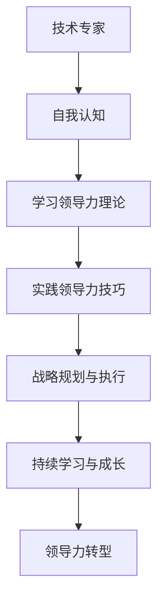

                 

# 《领导力转型：从技术专家到管理者的蜕变》

## 第1章：引言

### 1.1 领导力的定义与重要性

领导力是一种能力，它涉及到激励和引导他人实现共同目标的过程。领导力不仅仅是指挥和控制，更是一种影响力，能够激发团队成员的积极性和创造力。对于技术专家而言，领导力的重要性体现在多个方面：

1. **团队协作**：技术专家往往擅长独立工作，但在团队环境中，领导力有助于协调团队成员，发挥每个人的优势，共同完成项目。
2. **决策能力**：作为管理者，技术专家需要具备快速做出决策的能力，这些决策往往涉及技术、资源、人员等多个方面。
3. **沟通能力**：技术专家需要将复杂的技术知识传达给非技术人员，同时也要倾听和理解团队成员的意见和需求。

### 1.2 技术专家与管理者的角色差异

技术专家与管理者的角色存在显著差异。技术专家通常专注于技术本身，他们的职责包括设计、编码、测试和解决问题。而管理者则需要承担更多的责任，如：

1. **团队管理**：管理者需要了解团队的需求，合理分配任务，确保项目按时完成。
2. **资源管理**：管理者需要协调资源，包括人力资源、物资和资金等，以支持项目的顺利进行。
3. **决策制定**：管理者需要根据项目的目标和实际情况，做出合适的决策，并对决策结果负责。

### 1.3 从技术专家到管理者的需求变化

技术专家向管理者转型，需求发生以下变化：

1. **技能需求**：管理者需要具备更多的管理技能，如沟通、协调、决策等。
2. **思维方式**：管理者需要从技术思维转向全局思维，关注项目的整体目标和影响。
3. **心理承受能力**：管理者需要承担更多的责任和压力，有时需要面对困难和挑战。

## 第2章：领导力转型的基础

### 2.1 自我认知与定位

自我认知是领导力转型的基础。技术专家需要清楚自己的优势、劣势和职业目标。以下是一些建议：

1. **自我评估**：通过自我反思和他人反馈，了解自己的能力和行为。
2. **职业规划**：明确自己的职业发展方向，确定是否转型为管理者。
3. **学习与成长**：不断学习新知识、技能，提升自己的综合素质。

### 2.2 领导力模型与框架

领导力模型提供了理解和管理领导力的框架。以下是一些常见的领导力模型：

1. **情境领导模型**：根据团队成员的不同成熟度，采取不同的领导风格。
2. **变革型领导模型**：通过激励和启发团队成员，推动团队实现变革。
3. **授权型领导模型**：信任并授权团队成员，让他们发挥主动性。

### 2.3 情商与人际关系管理

情商是领导力的重要组成部分。技术专家需要关注以下几个方面：

1. **自我意识**：了解自己的情绪，并学会管理情绪。
2. **同理心**：理解他人的情绪和需求，关心团队成员。
3. **社交技巧**：提高沟通和协调能力，建立良好的人际关系。

## 第3章：技术视角下的领导力

### 3.1 技术趋势与业务发展

技术专家需要关注技术趋势，并将其与业务发展相结合。以下是一些建议：

1. **技术预见**：了解新兴技术，预见技术发展的方向。
2. **业务理解**：了解业务需求，将技术优势转化为业务价值。
3. **战略规划**：制定技术战略，确保技术发展与业务目标相一致。

### 3.2 技术管理与决策

技术管理是技术专家转型为管理者的重要组成部分。以下是一些建议：

1. **技术评估**：对技术方案进行评估，选择最优方案。
2. **风险管理**：识别和管理技术风险，确保项目顺利进行。
3. **资源分配**：合理分配技术资源，确保项目高效执行。

### 3.3 团队协作与知识分享

团队协作是技术专家领导力的关键。以下是一些建议：

1. **协作工具**：使用协作工具，提高团队沟通效率。
2. **知识共享**：鼓励团队成员分享知识，促进团队学习。
3. **文化建设**：建立积极向上的团队文化，增强团队凝聚力。

## 第4章：沟通与协调

### 4.1 沟通技巧提升

有效沟通是技术专家转型为管理者的重要能力。以下是一些建议：

1. **倾听**：认真倾听他人的意见和需求，理解对方的观点。
2. **表达**：清晰、简洁地表达自己的观点，避免误解和冲突。
3. **非语言沟通**：注意肢体语言和面部表情，增强沟通效果。

### 4.2 协调资源与利益

管理者需要协调资源，确保项目顺利进行。以下是一些建议：

1. **资源规划**：合理分配资源，确保资源利用率最大化。
2. **利益平衡**：平衡各方利益，确保项目目标的实现。
3. **优先级管理**：根据项目需求和资源情况，制定合理的优先级。

### 4.3 激励与团队建设

激励和团队建设是管理者的重要职责。以下是一些建议：

1. **激励机制**：建立有效的激励机制，激发团队成员的积极性。
2. **团队活动**：组织团队活动，增强团队凝聚力。
3. **人才培养**：关注团队成员的成长，提供培训和发展机会。

## 第5章：领导力实践案例

### 5.1 成功案例分享

以下是一些成功的领导力实践案例：

1. **谷歌的OKR制度**：谷歌通过实施OKR（目标与关键结果）制度，实现了高效的目标管理。
2. **特斯拉的领导风格**：特斯拉的领导风格强调创新和执行力，推动了公司的快速发展。

### 5.2 失败案例解析

以下是一些失败的领导力实践案例及其原因：

1. **诺基亚的衰落**：诺基亚未能及时适应市场变化，导致市场份额大幅下降。
2. **微软的领导层动荡**：微软的领导层频繁更替，影响了公司的稳定发展。

### 5.3 案例中的领导力要素分析

通过分析成功和失败案例，可以总结出以下领导力要素：

1. **创新意识**：领导者应具备创新意识，引领企业不断发展。
2. **执行力**：领导者需要具备强大的执行力，确保战略目标的实现。
3. **团队协作**：领导者应注重团队协作，发挥团队的整体优势。
4. **适应能力**：领导者需要具备适应市场变化的能力，应对不确定性。

## 第6章：战略规划与执行力

### 6.1 战略规划与目标设定

战略规划是领导力的重要组成部分。以下是一些建议：

1. **愿景与使命**：明确企业的愿景和使命，为战略规划提供方向。
2. **市场分析**：分析市场环境，了解竞争对手和客户需求。
3. **目标设定**：制定明确、可行的目标，确保战略规划的实现。

### 6.2 战略实施与风险管理

战略实施是战略规划的关键环节。以下是一些建议：

1. **资源整合**：整合企业内部资源，支持战略目标的实现。
2. **风险管理**：识别和管理战略实施过程中的风险，确保项目的顺利进行。

### 6.3 执行力提升策略

执行力是战略成功的关键。以下是一些建议：

1. **明确责任**：明确团队成员的责任，确保任务的落实。
2. **监督与反馈**：建立监督机制，及时反馈执行情况，纠正偏差。
3. **激励与考核**：建立激励机制，激励团队成员提高执行力。

## 第7章：持续学习与个人成长

### 7.1 领导力发展的学习路径

领导力发展需要不断学习和实践。以下是一些建议：

1. **理论学习**：学习领导力理论，了解不同的领导风格和策略。
2. **实践锻炼**：参与实际项目，锻炼领导力。
3. **反思总结**：定期反思自己的领导行为，总结经验教训。

### 7.2 职业发展规划

职业发展规划是领导力发展的重要方面。以下是一些建议：

1. **设定目标**：设定明确的职业发展目标，制定实现目标的计划。
2. **持续学习**：不断学习新知识、技能，提升自己的综合素质。
3. **寻求指导**：寻求导师或同事的指导，获得宝贵的经验和建议。

### 7.3 持续改进与自我超越

持续改进和自我超越是领导力发展的重要目标。以下是一些建议：

1. **自我挑战**：勇于接受新的挑战，不断突破自己的舒适区。
2. **创新思维**：培养创新思维，寻找新的解决方案。
3. **终身学习**：终身学习，跟上时代的步伐，保持竞争力。

## 第8章：领导力转型之路

### 8.1 转型过程中的挑战与应对

领导力转型过程中，技术专家可能会面临以下挑战：

1. **角色转变**：从技术专家到管理者，需要适应新的角色和责任。
2. **管理技能不足**：管理技能不足可能导致决策失误和团队管理问题。
3. **沟通障碍**：技术背景可能导致与团队成员的沟通障碍。

应对策略包括：

1. **学习管理知识**：学习管理知识和技能，提升自己的管理水平。
2. **寻求指导**：寻求导师或同事的指导，学习领导力的实践方法。
3. **加强沟通**：提高沟通能力，确保团队信息的有效传递。

### 8.2 转型成功的关键要素

领导力转型成功的关键要素包括：

1. **自我认知**：清楚自己的优势和不足，制定合适的转型计划。
2. **持续学习**：不断学习新知识、技能，提升自己的综合素质。
3. **实践锻炼**：参与实际项目，锻炼领导力。

### 8.3 领导力转型的未来趋势

随着技术的发展和商业环境的变革，领导力转型的未来趋势包括：

1. **数字化领导力**：数字化时代，领导者需要具备数字素养和数字化转型能力。
2. **全球化领导力**：全球化背景下，领导者需要具备跨文化沟通和管理能力。
3. **创新领导力**：创新成为企业发展的关键，领导者需要具备创新思维和创新能力。

## 附录：领导力转型工具与资源

### A.1 领导力评估工具

以下是一些常用的领导力评估工具：

1. **360度评估**：通过团队成员、上级和下属的反馈，评估领导力的各个方面。
2. **MBTI**：用于了解个人性格类型，帮助领导者更好地理解自己和他人。
3. **领导力自评问卷**：通过自我评估，了解自己的领导力水平和改进方向。

### A.2 管理技能提升资源

以下是一些管理技能提升资源：

1. **领导力书籍**：如《领导力五项修炼》、《领导力的艺术》等。
2. **在线课程**：如哈佛大学公开课《领导力与影响力》等。
3. **管理论坛**：如领英（LinkedIn）的管理社区等。

### A.3 领导力发展书籍推荐

以下是一些领导力发展的书籍推荐：

1. **《领导力的五项修炼》**：作者：史蒂芬·柯维
2. **《领导者的语言》**：作者：约瑟夫·马吉奥利
3. **《领导力的力量》**：作者：约翰·肯尼迪

## 技术视角下的领导力算法原理伪代码

```python
# 技术管理与决策伪代码
def 技术管理与决策(技术需求，资源限制，目标效果):
    # 初始化技术评估指标
    评估指标 = ["性能", "稳定性", "成本", "时间"]
    
    # 收集并分析技术需求
    需求分析 = 分析技术需求(技术需求)
    
    # 根据资源限制，调整技术方案
    调整方案 = 调整技术方案(需求分析，资源限制)
    
    # 对比不同技术方案的效果评估指标
    效果评估 = 对比评估指标(调整方案，评估指标)
    
    # 选择最优技术方案进行决策
    最优方案 = 选择最优方案(效果评估)
    
    # 执行决策并监控技术实施过程
    实施过程 = 执行技术方案(最优方案)
    监控过程 = 监控实施效果(实施过程)
    
    # 根据实施效果进行反馈调整
    反馈调整 = 调整技术方案(监控过程)
    
    return 最优方案，反馈调整
```

## 数学模型与公式

### 成本效益分析公式

$$
CBE = \frac{E}{C}
$$

其中，CBE表示成本效益比（Cost Benefit Ratio），E表示总收益（Total Earnings），C表示总成本（Total Cost）。

### 激励函数公式

$$
激励函数 = f(绩效, 成长机会, 工作环境)
$$

其中，绩效、成长机会和工作环境是激励函数的变量，f是激励函数。

## 项目实战

### 实战案例：团队建设与沟通技巧提升

1. **项目背景**：
   - 企业成立一个新的项目团队，成员来自不同部门，需要快速建立协作关系。

2. **目标**：
   - 提升团队沟通效率，建立良好的团队氛围。

3. **开发环境搭建**：
   - 使用企业内部沟通工具（如钉钉、微信）进行日常交流。
   - 定期组织团队建设活动，增强团队凝聚力。

4. **源代码详细实现和代码解读**：

```python
# 沟通日志记录程序（伪代码）
def record_communication(log_entry):
    with open("communication_log.txt", "a") as log_file:
        log_file.write(log_entry + "\n")

# 查询沟通日志
def search_communication(keyword):
    with open("communication_log.txt", "r") as log_file:
        for line in log_file:
            if keyword in line:
                print(line)

# 统计沟通频率
def count_communication():
    with open("communication_log.txt", "r") as log_file:
        count = 0
        for line in log_file:
            count += 1
        return count
```

5. **代码解读与分析**：
   - `record_communication` 函数用于记录沟通日志，确保每次沟通都被记录下来。
   - `search_communication` 函数用于搜索特定关键词的沟通记录，帮助团队成员快速找到相关信息。
   - `count_communication` 函数用于统计沟通次数，作为评估团队沟通频率的指标。

通过这个项目实战，团队成员能够更好地了解沟通情况，提高沟通效率，为领导力转型打下坚实基础。

## 作者信息

作者：AI天才研究院/AI Genius Institute & 禅与计算机程序设计艺术 /Zen And The Art of Computer Programming

## Mermaid 流程图：领导力转型流程



# 总结

领导力转型是从技术专家到管理者的关键步骤。在这一过程中，技术专家需要不断提升自我认知，学习领导力理论，实践领导力技巧，制定战略规划，并持续学习与成长。通过本文的阐述，我们详细探讨了领导力转型的各个阶段和关键要素，为技术专家提供了有价值的指导。希望读者能够结合实际情况，制定适合自己的领导力转型计划，成功实现职业发展。

---

**关键词**：
领导力、技术专家、管理者、转型、自我认知、战略规划、沟通技巧

**摘要**：
本文详细探讨了从技术专家到管理者的领导力转型过程，包括自我认知、领导力理论学习、实践领导力技巧、战略规划与执行力等方面的内容，为技术专家提供了有价值的转型指导。

