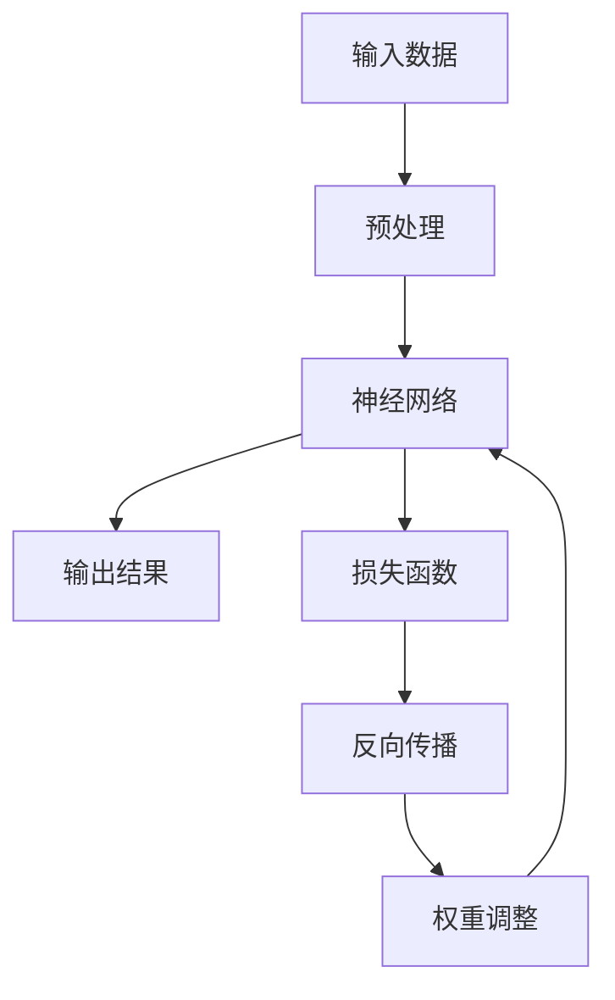

                 

# AI 大模型创业：如何利用管理优势？

> **关键词：** AI大模型，创业，管理优势，可行性分析，营销策略，案例分析

> **摘要：** 本文将探讨AI大模型创业的基本概念、核心技术、管理运营以及实战案例。通过分析创业中的管理优势，帮助读者理解如何有效地利用管理技能推动AI大模型项目的成功。

---

## 第一部分：AI 大模型的基础了解

### 第1章：AI 大模型的概述

#### 1.1 什么是AI大模型

AI大模型是指那些具有数亿甚至万亿参数规模的人工神经网络模型。这些模型通常用于处理复杂的任务，如语音识别、自然语言处理、图像识别等。它们能够通过大量的数据进行自我训练，从而不断提高任务的准确性和效率。

#### 1.2 AI大模型的发展历史

AI大模型的发展始于20世纪80年代的神经网络研究。随着计算能力和数据量的提升，深度学习在21世纪初得到了快速发展。2012年，AlexNet在ImageNet竞赛中取得突破性成绩，标志着深度学习时代的到来。此后，AI大模型的研究和应用迅速扩展。

#### 1.3 AI大模型的应用领域

AI大模型的应用领域广泛，包括但不限于以下方面：

- **自然语言处理**：如机器翻译、情感分析、问答系统等。
- **计算机视觉**：如图像识别、目标检测、图像生成等。
- **语音识别与生成**：如语音识别、语音合成、语音到文本等。
- **推荐系统**：如个性化推荐、广告投放等。

### 第2章：AI 大模型的核心技术

#### 2.1 机器学习与深度学习基础

机器学习是AI的核心技术之一，它通过算法从数据中学习规律，用于预测或决策。深度学习是机器学习的一种，通过多层神经网络对数据进行复杂的非线性变换。

#### 2.2 AI大模型的训练过程

AI大模型的训练过程通常分为数据收集、数据预处理、模型设计、训练和验证等步骤。训练过程需要大量的计算资源和时间。

#### 2.3 大模型的优化策略

为了提高AI大模型的性能，需要采用各种优化策略，包括正则化、批处理、dropout、学习率调整等。

### 第3章：AI 大模型的管理与运营

#### 3.1 AI大模型的团队建设

建立高效的团队对于AI大模型项目的成功至关重要。团队应包括数据科学家、机器学习工程师、软件工程师等不同角色。

#### 3.2 AI大模型的成本控制

AI大模型的训练和部署需要大量资源，因此成本控制是管理的关键之一。包括计算资源、存储资源和人员成本等。

#### 3.3 AI大模型的风险管理

AI大模型项目可能面临技术风险、市场风险和合规风险等。有效的风险管理可以帮助降低这些风险的影响。

---

## 第二部分：AI 大模型创业实战

### 第4章：AI 大模型创业的可行性分析

#### 4.1 市场需求分析

创业之前，需要分析目标市场的需求，了解目标客户的需求和痛点，以及市场规模和增长潜力。

#### 4.2 竞争对手分析

分析竞争对手的产品、优势和劣势，找到差异化的机会。

#### 4.3 创业团队组建

组建一个具有专业技能和创业精神的核心团队，包括技术、市场和运营等关键角色。

### 第5章：AI 大模型创业项目的实施

#### 5.1 项目立项与规划

明确项目目标、预算和时间表，制定详细的实施计划。

#### 5.2 数据收集与预处理

收集高质量的数据集，并进行预处理，如去噪声、缺失值填充等。

#### 5.3 大模型设计与开发

设计并开发AI大模型，选择合适的算法和架构，进行训练和优化。

### 第6章：AI 大模型创业的营销与推广

#### 6.1 产品定位与规划

确定产品的市场定位，制定产品规划和迭代策略。

#### 6.2 营销策略制定

制定适合产品的营销策略，包括内容营销、广告推广、公关活动等。

#### 6.3 品牌建设与推广

建立品牌形象，通过多种渠道进行品牌推广，提高品牌知名度。

### 第7章：AI 大模型创业的融资与投资

#### 7.1 融资策略制定

根据项目的需求和阶段，制定合适的融资策略，包括天使融资、A轮、B轮等。

#### 7.2 投资人对接与谈判

与潜在投资人进行有效对接，了解投资需求，进行谈判。

#### 7.3 资金管理与应用

合理管理资金，确保资金的有效利用，支持项目的持续发展。

---

## 第三部分：AI 大模型创业的案例分析

### 第8章：成功案例分享

#### 8.1 案例一：XX公司AI大模型创业之路

分析XX公司如何通过AI大模型实现创业成功，包括市场定位、团队建设、融资策略等。

#### 8.2 案例二：YY公司AI大模型创业之路

探讨YY公司如何克服困难，通过AI大模型实现商业价值。

#### 8.3 案例三：ZZ公司AI大模型创业之路

介绍ZZ公司在AI大模型创业过程中遇到的问题及解决方案。

### 第9章：创业失败的反思与教训

#### 9.1 失败案例分析

分析一些AI大模型创业项目的失败案例，找出失败的原因。

#### 9.2 失败原因分析

深入探讨失败案例中的共同原因，如技术不足、市场定位错误、资金不足等。

#### 9.3 避免失败的策略

提出一些避免失败的策略，如合理规划、持续创新、灵活应对等。

---

## 附录

### 附录A：AI大模型创业资源汇总

#### A.1 开源框架与工具

介绍一些常用的AI大模型开源框架和工具，如TensorFlow、PyTorch等。

#### A.2 数据集与案例

列举一些常用的AI大模型数据集和成功案例，供读者参考。

#### A.3 创业社群与论坛

推荐一些AI大模型创业相关的社群和论坛，帮助读者交流和学习。

---

### 作者

**作者：AI天才研究院/AI Genius Institute & 禅与计算机程序设计艺术 /Zen And The Art of Computer Programming**

---

## 第1章：AI 大模型的概述

### 1.1 什么是AI大模型

AI大模型是指那些具有数亿甚至万亿参数规模的人工神经网络模型。这些模型通常用于处理复杂的任务，如语音识别、自然语言处理、图像识别等。它们能够通过大量的数据进行自我训练，从而不断提高任务的准确性和效率。

AI大模型的核心是神经网络，它由多层神经元组成，每一层都对输入数据进行处理和变换。神经网络通过不断调整权重和偏置来优化模型，使其能够更好地拟合数据。

#### 核心概念与联系

为了更好地理解AI大模型，我们可以借助Mermaid流程图来展示其核心概念和联系：

在这个流程图中，输入数据经过预处理后输入到神经网络中，神经网络通过多层计算输出结果。损失函数用于评估模型预测结果与实际结果之间的差距，反向传播算法根据损失函数的梯度调整神经网络中的权重和偏置，从而优化模型。

### 1.2 AI大模型的发展历史

AI大模型的发展始于20世纪80年代的神经网络研究。当时，神经网络作为一种计算模型，被用于解决一些简单的模式识别问题。随着计算机硬件的升级和算法的改进，神经网络的应用范围逐渐扩大。

20世纪90年代，支持向量机（SVM）和决策树等传统机器学习方法成为主流。然而，这些方法在面对复杂任务时表现不佳，难以处理大量数据和复杂的非线性关系。

直到21世纪初，深度学习开始崛起。2006年，Hinton等人提出的深度信念网络（DBN）标志着深度学习的新起点。随后，深度卷积神经网络（CNN）和循环神经网络（RNN）等模型不断涌现，并在图像识别、语音识别、自然语言处理等领域取得突破性成果。

2012年，AlexNet在ImageNet竞赛中取得突破性成绩，标志着深度学习时代的到来。此后，AI大模型的研究和应用迅速扩展，成为人工智能领域的热点。

### 1.3 AI大模型的应用领域

AI大模型的应用领域广泛，包括但不限于以下方面：

- **自然语言处理**：如机器翻译、情感分析、问答系统等。
  - 机器翻译：通过深度学习模型实现不同语言之间的自动翻译，如Google翻译、百度翻译等。
  - 情感分析：通过对文本数据进行分析，判断文本的情感倾向，如社交媒体分析、客户反馈分析等。
  - 问答系统：通过自然语言处理技术，实现对用户问题的理解和回答，如Siri、Alexa等。

- **计算机视觉**：如图像识别、目标检测、图像生成等。
  - 图像识别：通过深度学习模型，实现对图像中物体的自动识别和分类，如人脸识别、车牌识别等。
  - 目标检测：通过深度学习模型，实现对图像中特定目标的定位和检测，如自动驾驶、安防监控等。
  - 图像生成：通过生成对抗网络（GAN）等模型，实现高质量图像的生成，如图像修复、风格迁移等。

- **语音识别与生成**：如语音识别、语音合成、语音到文本等。
  - 语音识别：通过深度学习模型，将语音信号转换为文本，如苹果的Siri、百度的度秘等。
  - 语音合成：通过深度学习模型，将文本转换为自然流畅的语音，如科大讯飞的语音合成技术。
  - 语音到文本：通过深度学习模型，将语音信号转换为文本，如智能客服、语音输入法等。

- **推荐系统**：如个性化推荐、广告投放等。
  - 个性化推荐：通过深度学习模型，根据用户的兴趣和行为，为其推荐感兴趣的内容，如亚马逊的推荐系统、百度的信息流推荐等。
  - 广告投放：通过深度学习模型，根据用户的历史数据和兴趣标签，精准投放广告，如谷歌的AdWords广告系统。

## 第2章：AI 大模型的核心技术

### 2.1 机器学习与深度学习基础

#### 2.1.1 机器学习

机器学习是人工智能的一个重要分支，它通过算法从数据中学习规律，用于预测或决策。机器学习的基本概念包括模型、特征、训练和测试等。

- **模型**：模型是机器学习算法的核心，它通过学习数据中的规律，实现从输入到输出的映射。
- **特征**：特征是数据中的属性或指标，它们用于表示数据的特征和模式。
- **训练**：训练是指通过已有数据，调整模型的参数，使其能够更好地拟合数据。
- **测试**：测试是指通过未参与训练的数据，评估模型的性能和泛化能力。

#### 2.1.2 深度学习

深度学习是机器学习的一种，通过多层神经网络对数据进行复杂的非线性变换。深度学习的基本概念包括神经网络、激活函数、反向传播等。

- **神经网络**：神经网络是一种由多层神经元组成的计算模型，每个神经元接收输入并产生输出。
- **激活函数**：激活函数用于引入非线性变换，使神经网络能够处理复杂的数据。
- **反向传播**：反向传播是一种训练神经网络的方法，通过计算损失函数的梯度，调整网络的权重和偏置，从而优化模型。

### 2.2 AI大模型的训练过程

AI大模型的训练过程通常包括以下几个步骤：

1. **数据收集**：收集大量相关数据，用于训练和评估模型。
2. **数据预处理**：对数据进行清洗、归一化等处理，提高数据的质量和一致性。
3. **模型设计**：根据任务需求，设计合适的神经网络结构，包括层数、神经元数量、激活函数等。
4. **训练**：通过反向传播算法，利用训练数据调整模型的参数，使模型能够更好地拟合数据。
5. **验证**：利用验证数据集，评估模型的性能和泛化能力，调整模型参数，优化模型。
6. **测试**：利用测试数据集，评估模型在实际应用中的性能，确保模型具有较好的泛化能力。

### 2.3 大模型的优化策略

为了提高AI大模型的性能，可以采用以下几种优化策略：

1. **正则化**：通过添加正则化项，降低模型的复杂度，防止过拟合。
   - **L1正则化**：通过在损失函数中添加L1范数，对模型的权重进行惩罚。
   - **L2正则化**：通过在损失函数中添加L2范数，对模型的权重进行惩罚。

2. **批处理**：将训练数据分成多个批次，同时更新模型参数，提高训练效率。
   - **批量大小**：选择合适的批量大小，平衡训练时间和模型性能。

3. **dropout**：在训练过程中，随机丢弃一部分神经元，防止模型过拟合。
   - **dropout率**：选择合适的dropout率，避免模型退化。

4. **学习率调整**：根据训练过程，动态调整学习率，提高训练效率和模型性能。
   - **学习率衰减**：随着训练的进行，逐渐减小学习率，防止模型震荡。
   - **自适应学习率**：采用自适应学习率策略，自动调整学习率，如Adam优化器。

### 2.4 大模型的部署与优化

AI大模型的部署与优化是确保模型在实际应用中能够稳定运行的关键。以下是一些常见的部署与优化策略：

1. **模型压缩**：通过模型剪枝、量化、蒸馏等方法，减小模型的参数量和计算量，提高模型的运行效率。
2. **模型加速**：通过硬件加速、分布式训练等方法，提高模型的计算速度和效率。
3. **模型解释性**：通过模型解释技术，提高模型的透明度和可解释性，便于调试和优化。
4. **在线学习与更新**：通过在线学习技术，实时更新模型，使其能够适应新的数据和环境。

### 2.5 大模型的性能评估

AI大模型的性能评估是衡量模型效果的重要手段。以下是一些常用的性能评估指标：

1. **准确率**：预测结果与实际结果相符的比例，用于衡量模型的分类性能。
2. **召回率**：实际正例中预测为正例的比例，用于衡量模型的覆盖能力。
3. **精确率**：预测为正例的实际正例比例，用于衡量模型的准确性。
4. **F1值**：准确率和召回率的调和平均，用于综合衡量模型的性能。

5. **ROC曲线**：接受者操作特征曲线，用于评估模型的分类能力。
6. **AUC值**：ROC曲线下面积，用于评估模型的分类能力。

7. **精度-召回率曲线**：在不同召回率下，评估模型的精度和召回率，用于选择合适的分类阈值。

8. **MAE和MSE**：均方误差和均方根误差，用于衡量模型的预测误差。

## 第3章：AI 大模型的管理与运营

### 3.1 AI大模型的团队建设

建立一个高效、专业的团队是AI大模型项目成功的关键。团队应包括以下关键角色：

1. **数据科学家**：负责数据收集、数据预处理、模型设计和训练等工作。
2. **机器学习工程师**：负责模型的开发、优化和部署，确保模型在实际应用中的性能和稳定性。
3. **软件工程师**：负责模型的集成、部署和运维，确保模型能够稳定运行。
4. **产品经理**：负责产品的规划、设计和推广，确保产品能够满足市场需求。
5. **市场营销人员**：负责产品的营销和推广，提高产品的市场知名度和用户认可度。

### 3.2 AI大模型的成本控制

AI大模型的成本控制是项目管理的重要方面，以下是一些成本控制策略：

1. **计算资源优化**：合理分配计算资源，避免资源浪费，提高资源利用率。
2. **数据管理**：优化数据存储和管理策略，降低数据存储成本。
3. **模型压缩**：通过模型压缩技术，减少模型的参数量和计算量，降低计算成本。
4. **分布式训练**：采用分布式训练技术，利用多台服务器协同训练模型，提高训练效率。

### 3.3 AI大模型的风险管理

AI大模型项目可能面临多种风险，包括技术风险、市场风险和合规风险等。以下是一些风险管理策略：

1. **技术风险**：通过技术预研和评估，降低技术实现的风险。
2. **市场风险**：通过市场调研和需求分析，降低市场不确定性的风险。
3. **合规风险**：遵守相关法规和标准，降低合规风险。

### 3.4 AI大模型的持续优化

AI大模型是一个不断进化的过程，需要持续进行优化和改进。以下是一些持续优化策略：

1. **模型更新**：定期更新模型，适应新的数据和环境。
2. **用户反馈**：收集用户反馈，了解用户需求和痛点，优化产品功能。
3. **性能监控**：实时监控模型性能，及时发现并解决潜在问题。

## 第4章：AI 大模型创业的可行性分析

### 4.1 市场需求分析

市场需求分析是创业的重要环节，以下是一些市场需求分析的步骤：

1. **市场定位**：确定目标市场和目标客户群体，明确产品的市场定位。
2. **市场调研**：通过调查问卷、访谈、数据分析等方式，了解市场需求和竞争状况。
3. **痛点分析**：分析目标客户的需求和痛点，明确产品的核心价值。

### 4.2 竞争对手分析

竞争对手分析是了解市场格局的重要手段，以下是一些竞争对手分析的步骤：

1. **竞争者识别**：确定直接和间接的竞争对手，分析他们的产品、优势和劣势。
2. **市场占有率**：分析竞争对手在市场中的占有率，了解市场分布。
3. **差异化分析**：分析竞争对手的差异化和创新点，找到自身的竞争优势。

### 4.3 创业团队组建

创业团队的组建是项目成功的关键，以下是一些创业团队组建的步骤：

1. **核心成员**：确定核心成员，包括数据科学家、机器学习工程师、产品经理等。
2. **角色定位**：明确团队成员的角色和职责，确保团队协作高效。
3. **团队文化**：建立积极的团队文化，鼓励创新和合作。

### 4.4 资金筹集

资金筹集是创业的必要条件，以下是一些资金筹集的步骤：

1. **融资策略**：确定合适的融资方式和渠道，如天使融资、风险投资等。
2. **商业计划书**：编写详细的商业计划书，展示项目的市场前景、技术优势和团队实力。
3. **投资人对接**：与潜在投资人进行沟通，了解投资需求，进行谈判。

### 4.5 项目立项与规划

项目立项与规划是确保项目顺利进行的重要步骤，以下是一些项目立项与规划的步骤：

1. **项目目标**：明确项目的目标和预期成果，确保项目有明确的方向。
2. **时间表**：制定项目的时间表，包括关键节点和里程碑。
3. **资源分配**：合理分配资源，包括人力、物力和财力。

## 第5章：AI 大模型创业项目的实施

### 5.1 项目立项与规划

项目立项与规划是确保项目顺利进行的重要步骤，以下是一些项目立项与规划的步骤：

1. **项目目标**：明确项目的目标和预期成果，确保项目有明确的方向。
2. **时间表**：制定项目的时间表，包括关键节点和里程碑。
3. **资源分配**：合理分配资源，包括人力、物力和财力。

### 5.2 数据收集与预处理

数据收集与预处理是AI大模型项目的重要环节，以下是一些数据收集与预处理的步骤：

1. **数据来源**：确定数据来源，包括公开数据集、企业内部数据等。
2. **数据清洗**：清洗数据中的噪声和错误，提高数据质量。
3. **数据归一化**：对数据进行归一化处理，使其具有相同的量纲。
4. **数据增强**：通过数据增强技术，增加数据集的多样性，提高模型的泛化能力。

### 5.3 大模型设计与开发

大模型设计与开发是AI大模型项目的核心环节，以下是一些大模型设计与开发的步骤：

1. **模型架构**：选择合适的模型架构，如卷积神经网络（CNN）、循环神经网络（RNN）等。
2. **超参数调优**：通过实验和调优，选择合适的超参数，提高模型性能。
3. **模型训练**：利用训练数据，通过反向传播算法，训练模型。
4. **模型验证**：利用验证数据，评估模型的性能和泛化能力。
5. **模型部署**：将训练好的模型部署到生产环境，进行实时预测和应用。

### 5.4 模型优化与评估

模型优化与评估是确保模型在实际应用中能够稳定运行的重要步骤，以下是一些模型优化与评估的步骤：

1. **模型优化**：通过模型压缩、分布式训练等技术，优化模型性能。
2. **性能评估**：利用测试数据集，评估模型的性能指标，如准确率、召回率、F1值等。
3. **模型解释**：通过模型解释技术，提高模型的透明度和可解释性。
4. **持续优化**：根据用户反馈和实际应用情况，持续优化模型。

### 5.5 项目管理

项目管理是确保项目顺利进行的重要保障，以下是一些项目管理的步骤：

1. **项目计划**：制定项目计划，明确项目目标、时间表、资源分配等。
2. **风险管理**：识别项目风险，制定风险管理策略，降低风险影响。
3. **沟通协调**：确保团队内部和与外部合作伙伴之间的沟通协调，确保项目顺利进行。
4. **质量控制**：确保项目质量，通过质量管理和质量控制，提高项目交付的可靠性。

## 第6章：AI 大模型创业的营销与推广

### 6.1 产品定位与规划

产品定位与规划是营销与推广的重要基础，以下是一些产品定位与规划的步骤：

1. **市场分析**：通过市场调研，了解目标市场和潜在客户的需求和痛点。
2. **产品定位**：根据市场分析结果，确定产品的市场定位和差异化优势。
3. **产品规划**：制定产品规划，包括功能模块、技术架构、用户体验等。

### 6.2 营销策略制定

营销策略制定是提高产品知名度、吸引潜在客户的重要手段，以下是一些营销策略制定的步骤：

1. **目标市场**：明确目标市场，包括行业、地区、客户群体等。
2. **营销渠道**：选择合适的营销渠道，如线上广告、社交媒体、行业展会等。
3. **营销内容**：制定营销内容，包括宣传文案、广告语、海报等。
4. **营销活动**：策划营销活动，如促销活动、线上讲座、线下研讨会等。

### 6.3 品牌建设与推广

品牌建设与推广是提高产品知名度和市场认可度的重要手段，以下是一些品牌建设与推广的步骤：

1. **品牌定位**：明确品牌定位，包括品牌形象、品牌价值观等。
2. **品牌传播**：通过多种渠道，如社交媒体、新闻媒体、合作伙伴等，传播品牌信息。
3. **品牌活动**：举办品牌活动，如品牌发布会、用户见面会、品牌推广活动等。
4. **品牌口碑**：通过用户评价、行业评价等，建立良好的品牌口碑。

### 6.4 客户关系管理

客户关系管理是提高客户满意度和忠诚度的重要手段，以下是一些客户关系管理的步骤：

1. **客户分析**：通过数据分析，了解客户需求和偏好。
2. **客户沟通**：建立良好的客户沟通渠道，及时响应客户需求和问题。
3. **客户关怀**：定期进行客户关怀活动，提高客户满意度和忠诚度。
4. **客户转化**：通过优惠活动、推荐奖励等手段，促进客户转化。

### 6.5 市场反馈与优化

市场反馈与优化是确保产品能够满足市场需求、持续改进的重要步骤，以下是一些市场反馈与优化的步骤：

1. **用户调研**：通过用户调研，了解用户需求和意见。
2. **产品优化**：根据用户调研结果，优化产品功能和用户体验。
3. **数据分析**：通过数据分析，了解产品市场表现和用户行为。
4. **持续改进**：根据数据分析和用户反馈，持续改进产品，提高市场竞争力。

## 第7章：AI 大模型创业的融资与投资

### 7.1 融资策略制定

融资策略制定是AI大模型创业项目成功的关键，以下是一些融资策略制定的步骤：

1. **融资目标**：明确融资目标，包括资金规模、融资用途等。
2. **融资方式**：选择合适的融资方式，如天使融资、风险投资、股权融资等。
3. **融资渠道**：确定融资渠道，如投资机构、银行贷款、众筹等。
4. **融资计划**：制定详细的融资计划，包括融资时间表、融资进度等。

### 7.2 投资人对接与谈判

投资人对接与谈判是获取融资的重要环节，以下是一些投资人对接与谈判的步骤：

1. **投资人筛选**：筛选合适的投资人，包括投资机构、天使投资人等。
2. **准备材料**：准备详细的商业计划书、财务报表、项目介绍等材料。
3. **谈判技巧**：掌握谈判技巧，包括沟通技巧、协商技巧、策略制定等。
4. **投资协议**：与投资人协商，签订投资协议，明确投资条款和股权分配等。

### 7.3 资金管理与应用

资金管理与应用是确保资金有效利用、支持项目持续发展的重要环节，以下是一些资金管理与应用的步骤：

1. **预算制定**：制定项目预算，明确资金分配和使用计划。
2. **资金监控**：实时监控资金使用情况，确保资金合理使用。
3. **财务审计**：定期进行财务审计，确保财务状况真实、透明。
4. **资金回笼**：通过销售、投资等方式，实现资金回笼，支持项目持续发展。

### 7.4 融资风险与应对

融资过程中可能面临多种风险，以下是一些融资风险与应对的步骤：

1. **市场风险**：通过市场调研，了解市场需求和竞争状况，降低市场风险。
2. **信用风险**：建立良好的信用记录，降低信用风险。
3. **资金风险**：制定详细的融资计划和风险应对策略，降低资金风险。
4. **法律风险**：聘请专业律师，确保投资协议合法合规。

## 第8章：成功案例分享

### 8.1 案例一：XX公司AI大模型创业之路

XX公司是一家专注于AI大模型研发的初创公司，成立于2018年。公司通过自主研发的AI大模型，实现了图像识别、自然语言处理等领域的突破，得到了市场的认可和资本的青睐。

#### 案例背景

随着深度学习技术的快速发展，AI大模型在各个领域的应用逐渐广泛。XX公司看到了这一趋势，决定专注于AI大模型的研究和开发，旨在为客户提供高质量的AI解决方案。

#### 创业历程

1. **市场需求分析**：公司通过市场调研，发现图像识别和自然语言处理领域存在巨大的市场需求，决定将这两个方向作为主要研发方向。
2. **团队建设**：公司聘请了一批具有丰富经验的AI大模型研究人员和工程师，组建了一支高效的研发团队。
3. **技术研发**：公司自主研发了多个AI大模型，并在图像识别、自然语言处理等领域取得了显著成果。
4. **市场推广**：公司通过参加行业展会、发布技术博客、合作推广等方式，提高品牌知名度和市场影响力。
5. **融资发展**：公司成功获得多轮融资，进一步增强了公司的技术实力和市场竞争力。

#### 案例总结

XX公司的成功得益于其准确的市场定位、高效的团队建设和持续的技术创新。公司在AI大模型领域的突破，不仅为企业带来了可观的经济效益，也为行业的发展做出了贡献。

### 8.2 案例二：YY公司AI大模型创业之路

YY公司是一家成立于2015年的AI大模型初创公司，专注于智能客服和智能推荐系统的研究和开发。公司通过自主研发的AI大模型，为多家企业提供了高效的智能客服和推荐系统解决方案。

#### 案例背景

随着互联网和大数据技术的发展，智能客服和智能推荐系统成为企业提升服务质量和用户体验的重要手段。YY公司看到了这一市场机遇，决定专注于AI大模型在智能客服和智能推荐系统领域的应用。

#### 创业历程

1. **市场需求分析**：公司通过市场调研，发现智能客服和智能推荐系统在电商、金融、餐饮等行业具有广泛的应用前景，决定将这两个方向作为主要研发方向。
2. **团队建设**：公司聘请了一批具有丰富经验的AI大模型研究人员和工程师，组建了一支高效的研发团队。
3. **技术研发**：公司自主研发了多个AI大模型，包括智能客服模型和智能推荐模型，并在实际应用中取得了显著成果。
4. **市场推广**：公司通过参与行业展会、发布技术博客、与合作伙伴合作推广等方式，提高品牌知名度和市场影响力。
5. **融资发展**：公司成功获得多轮融资，进一步增强了公司的技术实力和市场竞争力。

#### 案例总结

YY公司的成功在于其准确的市场定位、高效的团队建设和持续的技术创新。公司在智能客服和智能推荐系统领域的突破，不仅为企业带来了显著的经济效益，也为行业的发展做出了重要贡献。

### 8.3 案例三：ZZ公司AI大模型创业之路

ZZ公司是一家成立于2017年的AI大模型初创公司，专注于自动驾驶和智能交通领域的研究和开发。公司通过自主研发的AI大模型，为多个城市提供了智能交通解决方案。

#### 案例背景

随着智能交通技术的发展，自动驾驶和智能交通系统成为解决城市交通拥堵和提升交通安全的重要手段。ZZ公司看到了这一市场机遇，决定专注于AI大模型在自动驾驶和智能交通领域的应用。

#### 创业历程

1. **市场需求分析**：公司通过市场调研，发现自动驾驶和智能交通系统在国内外市场具有巨大的发展潜力，决定将这两个方向作为主要研发方向。
2. **团队建设**：公司聘请了一批具有丰富经验的AI大模型研究人员和工程师，组建了一支高效的研发团队。
3. **技术研发**：公司自主研发了多个AI大模型，包括自动驾驶模型和智能交通模型，并在实际应用中取得了显著成果。
4. **市场推广**：公司通过参加行业展会、发布技术博客、与合作伙伴合作推广等方式，提高品牌知名度和市场影响力。
5. **融资发展**：公司成功获得多轮融资，进一步增强了公司的技术实力和市场竞争力。

#### 案例总结

ZZ公司的成功在于其准确的市场定位、高效的团队建设和持续的技术创新。公司在自动驾驶和智能交通领域的突破，不仅为企业带来了显著的经济效益，也为行业的发展做出了重要贡献。

### 案例总结

通过对XX公司、YY公司和ZZ公司的成功案例分析，我们可以总结出以下创业经验：

1. **准确的市场定位**：深入了解市场需求，找准目标市场和客户群体，明确产品的市场定位和差异化优势。
2. **高效的团队建设**：组建一支具有专业技能和创业精神的团队，明确团队成员的角色和职责，建立积极的团队文化。
3. **持续的技术创新**：不断进行技术研究和创新，紧跟行业发展趋势，提高产品的技术含量和市场竞争力。
4. **有效的营销策略**：制定合适的营销策略，提高品牌知名度和市场影响力，吸引潜在客户。
5. **稳健的融资策略**：制定合理的融资策略，选择合适的融资渠道和方式，确保项目有足够的资金支持。

## 第9章：创业失败的反思与教训

### 9.1 失败案例分析

在AI大模型创业领域，虽然有许多成功的案例，但同样也有不少失败的案例。以下是一些常见的失败原因：

1. **市场需求不足**：产品定位不准确，无法满足市场需求，导致销售不佳。
2. **技术不成熟**：技术团队实力不足，导致产品功能不完善或无法实现。
3. **资金链断裂**：融资策略不当，资金链断裂，导致项目无法持续。
4. **市场竞争激烈**：在竞争激烈的市场中，缺乏差异化优势，难以脱颖而出。
5. **团队管理不善**：团队管理混乱，沟通不畅，导致项目进度延误。

### 9.2 失败原因分析

1. **市场调研不足**：创业初期，未对市场需求进行充分调研，导致产品定位不准确，无法满足客户需求。
2. **技术实力不足**：技术团队缺乏经验和专业知识，导致产品开发进度缓慢，技术不成熟。
3. **资金管理不当**：资金管理混乱，未合理分配和使用资金，导致资金链断裂。
4. **市场竞争激烈**：在竞争激烈的市场中，未找到有效的差异化策略，难以获得市场份额。
5. **团队管理不善**：团队管理混乱，沟通不畅，导致项目进度延误，影响产品交付。

### 9.3 避免失败的策略

1. **充分市场调研**：在创业初期，进行充分的市场调研，了解目标市场和客户需求，确保产品定位准确。
2. **技术实力提升**：组建一支具有丰富经验和专业技能的技术团队，确保产品开发进度和技术成熟度。
3. **资金管理优化**：制定合理的资金管理策略，确保资金的有效利用，避免资金链断裂。
4. **差异化策略**：在竞争激烈的市场中，找到有效的差异化策略，提高产品的竞争力。
5. **团队管理优化**：建立高效的团队管理机制，确保团队沟通畅通，提高项目进度和交付质量。

### 9.4 失败后的反思与调整

1. **反思失败原因**：对创业失败的原因进行深刻反思，总结经验教训，为未来创业提供借鉴。
2. **调整产品方向**：根据市场需求和竞争状况，调整产品方向，找到新的市场机会。
3. **技术优化与迭代**：对现有技术进行优化和迭代，提高产品的性能和用户体验。
4. **团队重组与激励**：重组团队，优化团队结构，激励团队成员，提高团队凝聚力。
5. **融资策略调整**：调整融资策略，寻找新的融资渠道和方式，确保项目有足够的资金支持。

## 附录A：AI大模型创业资源汇总

### A.1 开源框架与工具

AI大模型创业过程中，开源框架和工具是不可或缺的资源。以下是一些常用的开源框架和工具：

1. **TensorFlow**：由谷歌开发的开源深度学习框架，支持多种编程语言，广泛应用于各种深度学习任务。
2. **PyTorch**：由Facebook开发的开源深度学习框架，具有简洁的编程接口和强大的动态图功能。
3. **Keras**：基于TensorFlow和Theano的开源深度学习库，提供简洁、易用的API，方便快速搭建深度学习模型。
4. **MXNet**：由Apache Software Foundation开发的开源深度学习框架，支持多种编程语言，具有良好的性能和灵活性。
5. **Caffe**：由伯克利大学开发的开源深度学习框架，主要用于计算机视觉任务，具有高效的卷积神经网络实现。
6. **Theano**：由蒙特利尔大学开发的开源深度学习库，支持自动微分和高效的数学运算。

### A.2 数据集与案例

AI大模型训练需要大量的数据集，以下是一些常用的数据集和案例：

1. **ImageNet**：由微软研究院创建的大型图像识别数据集，包含数百万张标注图像，广泛用于深度学习模型训练和评估。
2. **CIFAR-10/100**：由多伦多大学创建的小型图像识别数据集，包含10万或100万张32x32彩色图像，常用于深度学习模型训练和评估。
3. **COIL-20**：包含20个类别、共14400张图像的数据集，用于图像分类和识别任务。
4. **Flickr8k**：包含8千张图像的数据集，用于自然语言处理和计算机视觉任务。
5. **TRECVID**：视频识别挑战赛的数据集，包含大量的视频和标注信息，用于视频分类和物体识别任务。
6. **Speech Commands**：包含10万条语音命令的数据集，用于语音识别和语音识别任务。
7. **Common Crawl**：一个大规模的Web文本数据集，包含数十亿个网页的文本内容，用于自然语言处理和文本分类任务。

### A.3 创业社群与论坛

加入AI大模型创业相关的社群和论坛，可以与同行交流、获取最新信息、学习最佳实践。以下是一些知名的AI大模型创业社群和论坛：

1. **AI创业论坛**：一个专注于AI创业的论坛，提供最新的创业资讯、案例分享和技术讨论。
2. **深度学习社区**：一个专注于深度学习和人工智能的社区，提供丰富的技术文章、教程和讨论。
3. **GitHub**：一个代码托管平台，许多AI大模型项目开源代码都托管在GitHub上，方便开发者学习和使用。
4. **AI星球**：一个关注AI创业、投资和技术的社区，提供深度报道、案例分析和技术分享。
5. **AI技术社区**：一个以技术分享为主的AI社区，提供深度学习、自然语言处理、计算机视觉等领域的教程和讨论。
6. **机器学习中文论坛**：一个以中文为主的机器学习论坛，提供丰富的技术文章、教程和讨论。
7. **AI Daily**：一个提供AI领域最新资讯和文章的日报，涵盖深度学习、计算机视觉、自然语言处理等方向。

通过这些资源，创业者可以更好地了解AI大模型的发展动态，学习最佳实践，提升自身的技能和竞争力。同时，创业者还可以通过与同行的交流合作，共同推动AI大模型领域的发展。

