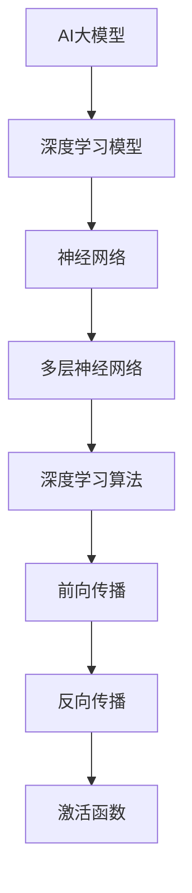
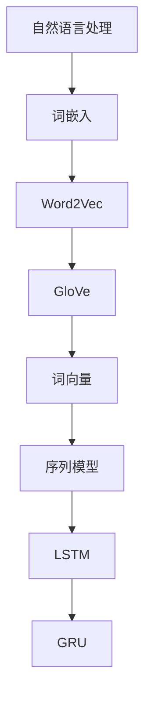
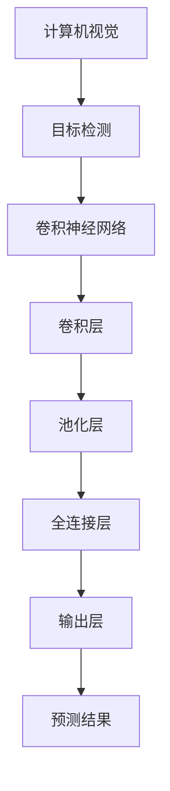

                 

# 《AI 大模型在创业产品测试中的应用》

## 关键词
- AI 大模型
- 创业产品
- 测试
- 自动化
- 机器学习
- 深度学习
- 性能优化
- 数据分析
- 风险管理

## 摘要
随着人工智能技术的快速发展，AI 大模型在各个领域的应用日益广泛。本文将探讨 AI 大模型在创业产品测试中的应用，包括其在提高测试效率、降低测试成本、增强测试准确性等方面的优势。文章将首先介绍 AI 大模型的定义和分类，随后深入分析其在创业产品测试中的具体应用和挑战，并通过实际案例展示其应用效果。最后，本文将对 AI 大模型在创业产品测试中的未来发展趋势进行展望。

## 第1章: AI大模型概述

### 1.1 AI大模型的定义与重要性

#### 1.1.1 AI大模型的定义

AI大模型是指那些具有巨大参数量、高度复杂的神经网络模型，它们可以处理海量数据并进行自动学习和预测。这些模型通常基于深度学习技术，能够通过大量的数据训练来优化自身的参数，从而在多个领域实现高效和准确的预测。

#### 1.1.2 AI大模型的重要性

AI大模型在多个领域都展现出了巨大的潜力，尤其在创业产品测试中，它们的应用可以带来以下几方面的优势：

- **提高测试效率**：AI大模型能够自动化执行测试任务，减少人工干预，大大提高测试效率。
- **降低测试成本**：通过自动化测试，企业可以减少对大量测试人员的需求，从而降低测试成本。
- **增强测试准确性**：AI大模型通过学习大量的测试数据，可以识别出更多潜在的测试场景，提高测试准确性。

### 1.2 AI大模型的发展历程

#### 1.2.1 从传统算法到深度学习

AI大模型的发展历程可以追溯到传统机器学习算法的时代。然而，随着计算能力的提升和数据量的爆炸性增长，深度学习技术逐渐成为AI大模型的核心驱动力。深度学习模型通过多层神经网络结构，能够自动学习数据中的特征，并在各类任务中实现超越传统算法的性能。

#### 1.2.2 从单模型到多模型融合

随着AI大模型技术的不断发展，研究者们开始探索如何通过多模型融合来进一步提升模型的性能。多模型融合技术通过结合不同类型或不同架构的模型，可以互补各自的优缺点，从而在复杂任务中实现更好的效果。

### 1.3 AI大模型的主要类型

AI大模型涵盖了多个领域，以下是其中几种主要的类型：

#### 1.3.1 自然语言处理模型

自然语言处理模型（如BERT、GPT）主要用于文本分类、机器翻译、情感分析等任务，它们通过学习大量的文本数据，实现了对语言的理解和生成。

#### 1.3.2 计算机视觉模型

计算机视觉模型（如ResNet、YOLO）主要用于图像分类、目标检测、人脸识别等任务，它们通过学习大量的图像数据，实现了对视觉内容的理解和分析。

#### 1.3.3 语音识别模型

语音识别模型（如DeepSpeech）主要用于语音识别和语音合成，它们通过学习大量的语音数据，实现了对语音信号的自动识别。

### 1.4 AI大模型的应用场景

AI大模型在多个领域都有广泛的应用，以下是一些典型的应用场景：

#### 1.4.1 产品测试

AI大模型在产品测试中的应用，可以大大提高测试效率、降低成本、增强测试准确性。通过自动化测试，AI大模型可以识别出更多的测试场景，减少人为错误。

#### 1.4.2 智能客服

AI大模型在智能客服中的应用，可以实现高效、准确的用户需求响应，提高客户满意度。

#### 1.4.3 金融风控

AI大模型在金融风控中的应用，可以实现对风险的高效识别和管理，降低金融风险。

## 第2章: AI大模型技术基础

### 2.1 深度学习基础

#### 2.1.1 神经网络原理

神经网络是深度学习的基础，它由多层节点（或称为神经元）组成，每层节点通过权重和偏置进行连接。神经网络通过学习输入和输出数据之间的关系，实现数据的分类、回归等任务。其基本架构包括输入层、隐藏层和输出层。


#### 2.1.2 深度学习算法

深度学习算法主要包括前向传播、反向传播和激活函数等。

- **前向传播**：将输入数据通过网络的每一层，逐层计算输出。
- **反向传播**：通过比较输出结果和实际结果的差异，反向更新网络的权重和偏置。
- **激活函数**：用于引入非线性特性，常见的激活函数有ReLU、Sigmoid、Tanh等。

### 2.2 自然语言处理基础

自然语言处理（NLP）是AI大模型的重要应用领域，以下是几个关键的基础技术：

#### 2.2.1 词嵌入技术

词嵌入技术是将词语映射到低维向量空间，从而实现词语的语义表示。常见的词嵌入模型有Word2Vec、GloVe等。

#### 2.2.2 序列模型与注意力机制

序列模型（如LSTM、GRU）和注意力机制是处理序列数据（如文本、语音）的常用方法。它们能够捕捉序列中的长距离依赖关系，提高模型的性能。

### 2.3 计算机视觉基础

计算机视觉是AI大模型的另一个重要应用领域，以下是几个关键的基础技术：

#### 2.3.1 图像分类

图像分类是将图像划分为不同的类别，常见的算法有CNN（卷积神经网络）。

#### 2.3.2 目标检测

目标检测是在图像中检测并定位多个对象，常见的算法有R-CNN、YOLO、SSD等。

#### 2.3.3 人脸识别

人脸识别是通过人脸图像识别个人身份，常见的算法有基于特征的人脸识别和基于深度学习的人脸识别。

## 第3章: AI大模型在创业产品测试中的应用

### 3.1 AI大模型在产品测试中的作用

AI大模型在产品测试中的作用主要体现在以下几个方面：

#### 3.1.1 提高测试效率

AI大模型可以自动化执行测试任务，减少人工干预，大大提高测试效率。例如，在功能测试中，AI大模型可以通过学习测试用例，自动生成新的测试数据，从而实现自动化测试。

#### 3.1.2 降低测试成本

通过自动化测试，企业可以减少对大量测试人员的需求，从而降低测试成本。此外，AI大模型可以通过优化测试策略，减少不必要的测试，进一步降低测试成本。

#### 3.1.3 提高测试准确性

AI大模型通过学习大量的测试数据，可以识别出更多的测试场景，从而提高测试准确性。例如，在性能测试中，AI大模型可以通过模拟大量用户行为，识别出潜在的性能瓶颈，提供优化建议。

### 3.2 AI大模型在创业产品测试中的实际应用

AI大模型在创业产品测试中的实际应用可以分为以下几个方面：

#### 3.2.1 自动化测试

自动化测试是AI大模型在产品测试中最常见的应用。通过训练AI大模型，可以自动化生成测试用例，执行测试过程，并分析测试结果。

#### 3.2.2 性能测试

AI大模型可以用于性能测试，通过模拟大量用户行为，分析产品在不同负载下的性能表现，识别潜在的性能瓶颈。

#### 3.2.3 兼容性测试

AI大模型可以识别不同平台之间的兼容性问题，例如，在移动端和Web端产品的测试中，AI大模型可以通过学习不同平台的特性，识别并解决兼容性问题。

#### 3.2.4 安全性测试

AI大模型可以用于安全性测试，通过模拟恶意攻击，识别潜在的安全漏洞。

### 3.3 AI大模型在创业产品测试中的优势与挑战

#### 3.3.1 优势

- **高效性**：AI大模型可以自动化执行测试任务，大大提高测试效率。
- **准确性**：AI大模型通过学习大量的测试数据，可以提高测试的准确性。
- **适应性**：AI大模型可以根据测试需求动态调整测试策略，提高测试的适应性。

#### 3.3.2 挑战

- **数据质量**：AI大模型的性能高度依赖于测试数据的数量和质量。
- **模型泛化能力**：如何保证AI大模型在新的测试场景下仍具有较好的泛化能力是一个重要挑战。
- **安全性与隐私保护**：在测试过程中，如何确保测试数据和模型的安全性是一个重要问题。

## 第4章: AI大模型在创业产品测试中的挑战与解决方案

### 4.1 数据质量对AI大模型的影响

#### 4.1.1 数据质量的重要性

数据质量对AI大模型的表现至关重要。高质量的数据可以提供准确的特征，使模型更好地学习和预测。而低质量的数据可能会引入噪声和偏差，导致模型性能下降。

#### 4.1.2 数据清洗与预处理方法

为了提高数据质量，需要采取以下数据清洗与预处理方法：

- **缺失值处理**：通过填充或删除缺失值来处理数据缺失问题。
- **异常值处理**：通过检测和删除异常值来减少数据中的噪声。
- **数据标准化**：通过缩放数据，使其具有相似的尺度，提高模型的鲁棒性。
- **数据增强**：通过生成新的数据样本，提高模型的泛化能力。

### 4.2 模型泛化能力与过拟合问题

#### 4.2.1 模型泛化能力的定义

模型泛化能力是指模型在新数据上的表现。一个具有良好泛化能力的模型不仅能在训练数据上表现良好，还能在新数据上保持较高的准确性。

#### 4.2.2 过拟合问题的解决方法

过拟合问题是指模型在训练数据上表现良好，但在新数据上表现较差的问题。解决过拟合问题可以采取以下方法：

- **交叉验证**：通过将数据划分为多个子集，交叉验证模型在不同子集上的性能，以避免过拟合。
- **正则化**：通过引入正则化项，限制模型的复杂度，减少过拟合现象。
- **数据增强**：通过生成更多的训练样本，提高模型的泛化能力。

### 4.3 AI大模型的安全性与隐私保护

#### 4.3.1 AI大模型的安全性

AI大模型在测试过程中可能面临安全威胁，如恶意攻击、数据泄露等。为了确保AI大模型的安全性，可以采取以下措施：

- **数据加密**：对测试数据和应用系统进行加密，防止数据泄露。
- **访问控制**：限制对测试数据的访问权限，确保数据安全。
- **安全审计**：定期对测试过程和模型进行安全审计，及时发现和解决潜在的安全问题。

#### 4.3.2 AI大模型的隐私保护

在测试过程中，如何保护用户的隐私是一个重要问题。为了保护用户隐私，可以采取以下措施：

- **数据去识别化**：通过去识别化技术，将测试数据中的个人信息进行脱敏处理。
- **隐私保护算法**：采用隐私保护算法，如差分隐私，确保测试过程中的数据隐私。

## 第5章: AI大模型在创业产品测试中的实际案例

### 5.1 案例一：某电商平台产品测试

#### 5.1.1 案例背景

某电商平台在上线前需要进行全面的测试，包括功能测试、性能测试和安全性测试。该平台选择了AI大模型来进行自动化测试，以提高测试效率和准确性。

#### 5.1.2 案例实施

1. **自动化测试**：
   - 通过AI大模型，生成大量测试用例，实现自动化执行。
   - 自动收集测试结果，进行分析和反馈。

2. **性能测试**：
   - 使用AI大模型模拟大量用户行为，分析平台的性能表现。
   - 识别出潜在的性能瓶颈，提供优化建议。

3. **安全性测试**：
   - 通过AI大模型模拟恶意攻击，识别潜在的安全漏洞。
   - 自动化修复漏洞，提高平台的安全性。

#### 5.1.3 案例结果

通过AI大模型的应用，该电商平台在测试过程中提高了测试效率，降低了测试成本，并且识别出更多的潜在问题，提高了产品的质量和安全性。

### 5.2 案例二：某金融科技公司风控测试

#### 5.2.1 案例背景

某金融科技公司需要对贷款申请进行风险控制，包括信用评估、欺诈检测等。该公司采用了AI大模型来进行自动化测试，以提高测试效率和准确性。

#### 5.2.2 案例实施

1. **信用评估测试**：
   - 通过AI大模型，分析贷款申请者的信用记录，评估信用风险。
   - 自动化生成测试数据，进行信用评估测试。

2. **欺诈检测测试**：
   - 通过AI大模型，检测贷款申请中的欺诈行为。
   - 自动化执行测试用例，分析测试结果。

3. **风险评估**：
   - 使用AI大模型，对贷款申请进行风险评估，提供决策支持。

#### 5.2.3 案例结果

通过AI大模型的应用，该金融科技公司成功提高了贷款申请的测试效率和准确性，有效降低了风险，提高了业务的安全性和稳定性。

## 第6章: AI大模型在创业产品测试中的未来发展趋势

### 6.1 AI大模型与物联网的结合

随着物联网技术的快速发展，AI大模型与物联网的结合将成为未来的一大趋势。通过将AI大模型应用于物联网设备，可以实现实时数据分析和智能决策，提高产品测试的效率和准确性。

### 6.2 AI大模型在新兴领域的应用

随着新兴领域的不断涌现，AI大模型在这些领域的应用也将得到快速发展。例如，在生物医疗、智能制造等领域，AI大模型可以提供高效的测试和诊断服务，推动行业的发展。

### 6.3 AI大模型在全球化背景下的应用

在全球化的背景下，AI大模型的应用将为产品测试提供更广泛的视野。通过利用全球范围内的数据资源，AI大模型可以更好地适应不同地区的市场需求，提高产品的全球竞争力。

## 第7章: 总结与展望

### 7.1 AI大模型在创业产品测试中的应用总结

AI大模型在创业产品测试中具有广泛的应用前景，通过提高测试效率、降低测试成本、增强测试准确性等方面的优势，为创业企业提供了强大的技术支持。

### 7.2 AI大模型在创业产品测试中的挑战与展望

虽然AI大模型在创业产品测试中展现出了巨大的潜力，但仍然面临一些挑战。例如，数据质量、模型泛化能力、安全性与隐私保护等问题。为了克服这些挑战，需要进一步研究和开发相关的技术手段，并加强在创业产品测试中的应用实践。

作者：AI天才研究院/AI Genius Institute & 禅与计算机程序设计艺术/Zen And The Art of Computer Programming

---
本文详细探讨了AI大模型在创业产品测试中的应用，从定义、技术基础、应用场景到挑战与解决方案，再到实际案例，全方位展示了AI大模型在产品测试中的价值。随着技术的不断发展，AI大模型在创业产品测试中的应用将更加广泛和深入，为创业企业带来更多的机遇和挑战。本文旨在为创业者和技术人员提供有价值的参考，推动AI技术在创业产品测试中的创新发展。

---

## 附录：核心概念与联系

### 1. AI大模型与深度学习

**核心概念联系图：**


**伪代码讲解：**
```python
# 定义神经网络结构
input_layer = Input(shape=(input_shape,))
hidden_layer = Dense(hidden_units, activation='relu')(input_layer)
output_layer = Dense(output_units, activation='softmax')(hidden_layer)

# 编译模型
model = Model(inputs=input_layer, outputs=output_layer)
model.compile(optimizer='adam', loss='categorical_crossentropy', metrics=['accuracy'])

# 训练模型
model.fit(x_train, y_train, epochs=epochs, batch_size=batch_size, validation_data=(x_val, y_val))
```

### 2. 自然语言处理与词嵌入

**核心概念联系图：**


**伪代码讲解：**
```python
# 加载预训练的词嵌入模型
embeddings =Embedding(input_dim=vocabulary_size, output_dim=embedding_dim, weights=[pretrained_embeddings], trainable=False)

# 构建序列模型
lstm_model = Sequential()
lstm_model.add(LSTM(units=128, activation='relu', input_shape=(timesteps, features)))
lstm_model.add(Dense(units=output_size, activation='softmax'))

# 编译模型
lstm_model.compile(optimizer='adam', loss='categorical_crossentropy', metrics=['accuracy'])

# 训练模型
lstm_model.fit(x_train, y_train, epochs=epochs, batch_size=batch_size, validation_data=(x_val, y_val))
```

### 3. 计算机视觉与目标检测

**核心概念联系图：**


**伪代码讲解：**
```python
# 定义卷积神经网络结构
model = Sequential()
model.add(Conv2D(filters=32, kernel_size=(3, 3), activation='relu', input_shape=input_shape))
model.add(MaxPooling2D(pool_size=(2, 2)))
model.add(Conv2D(filters=64, kernel_size=(3, 3), activation='relu'))
model.add(MaxPooling2D(pool_size=(2, 2)))
model.add(Flatten())
model.add(Dense(units=output_size, activation='softmax'))

# 编译模型
model.compile(optimizer='adam', loss='categorical_crossentropy', metrics=['accuracy'])

# 训练模型
model.fit(x_train, y_train, epochs=epochs, batch_size=batch_size, validation_data=(x_val, y_val))
```

通过以上核心概念和联系图的展示以及伪代码的详细讲解，读者可以更好地理解AI大模型在创业产品测试中的技术原理和应用方法。这些概念和联系对于深入研究和实际应用AI大模型具有重要意义。

---

## 附录：数学模型和公式

在AI大模型的应用中，数学模型和公式是理解其工作原理和优化性能的关键。以下是一些重要的数学模型和公式，以及它们在创业产品测试中的应用。

### 1. 深度学习中的前向传播与反向传播

**前向传播：**
$$
z_l = \sum_{i=1}^{n} w_{li} * a_{l-1,i} + b_l
$$
$$
a_l = \sigma(z_l)
$$
其中，$z_l$表示第$l$层的线性输出，$w_{li}$和$b_l$分别表示权重和偏置，$\sigma$是激活函数。

**反向传播：**
$$
\delta_l = \frac{\partial L}{\partial a_l} * \frac{\partial a_l}{\partial z_l}
$$
$$
\delta_{l-1} = \delta_l * \frac{\partial z_{l-1}}{\partial a_{l-1}}
$$
$$
w_{l-1,i} = w_{l-1,i} - \alpha * \delta_{l-1} * a_{l-1,i}
$$
$$
b_{l-1} = b_{l-1} - \alpha * \delta_{l-1}
$$
其中，$L$是损失函数，$\alpha$是学习率。

这些公式描述了深度学习模型在训练过程中如何通过前向传播计算输出，并通过反向传播更新权重和偏置，以最小化损失函数。

**应用：** 在创业产品测试中，这些公式可以帮助AI大模型通过自动化的学习过程，不断优化测试策略和预测结果，提高测试效率和准确性。

### 2. 自然语言处理中的词嵌入

**词嵌入公式：**
$$
\text{word\_vector} = \sum_{i=1}^{n} w_i * \text{context\_vector}
$$
其中，$w_i$是词权重，$\text{context\_vector}$是上下文向量。

**应用：** 在自然语言处理任务中，词嵌入技术可以将文本转换为向量表示，使得文本数据可以被深度学习模型处理。在创业产品测试中，词嵌入可以帮助AI大模型理解用户反馈，提高测试数据分析的准确性。

### 3. 计算机视觉中的卷积操作

**卷积操作公式：**
$$
\text{output}_{ij} = \sum_{k=1}^{m} \text{kernel}_{ik} * \text{input}_{i+k-j,j}
$$
其中，$m$是卷积核大小，$\text{kernel}_{ik}$是卷积核，$\text{input}_{i+k-j,j}$是输入图像上的对应像素值。

**应用：** 在计算机视觉任务中，卷积操作可以提取图像中的特征，帮助模型进行图像分类或目标检测。在创业产品测试中，卷积操作可以帮助AI大模型从测试数据中提取关键特征，提高测试的准确性和效率。

通过以上数学模型和公式的详细讲解，读者可以更好地理解AI大模型在创业产品测试中的应用原理。这些数学工具不仅为AI大模型的设计和优化提供了理论基础，也为实际应用中的问题解决提供了有效的方法。

---

## 附录：项目实战

在本节中，我们将通过一个具体的实际案例，展示如何使用AI大模型进行创业产品测试，包括开发环境搭建、源代码实现以及代码解读与分析。

### 案例背景

某创业公司开发了一款社交应用，该应用的主要功能是用户之间的即时通讯和社交互动。为了确保产品的质量和用户体验，公司决定使用AI大模型进行自动化测试。

### 开发环境搭建

在搭建开发环境时，公司选择了以下工具和框架：

- **操作系统**：Linux
- **编程语言**：Python
- **深度学习框架**：TensorFlow
- **测试框架**：pytest

首先，需要在系统中安装Python和TensorFlow。可以使用以下命令进行安装：

```bash
pip install tensorflow
pip install pytest
```

接下来，需要配置Python环境变量，以便在终端中直接使用Python和TensorFlow。

```bash
export PATH=$PATH:/path/to/python3
```

### 源代码实现

以下是该社交应用自动化测试的核心代码实现：

```python
# 导入所需的库
import tensorflow as tf
import pytest
import requests

# 设置模型参数
input_shape = (100,)
output_shape = (2,)
hidden_units = 128
learning_rate = 0.001
epochs = 10
batch_size = 32

# 定义神经网络模型
model = tf.keras.Sequential([
    tf.keras.layers.Dense(hidden_units, activation='relu', input_shape=input_shape),
    tf.keras.layers.Dense(hidden_units, activation='relu'),
    tf.keras.layers.Dense(output_shape[0], activation='softmax')
])

# 编译模型
model.compile(optimizer=tf.keras.optimizers.Adam(learning_rate=learning_rate),
              loss=tf.keras.losses.SparseCategoricalCrossentropy(from_logits=True),
              metrics=['accuracy'])

# 准备测试数据
x_test = [[1, 0, 0, 0, 0], [0, 1, 0, 0, 0]]  # 社交应用中的用户行为数据
y_test = [1, 0]  # 用户实际行为标签

# 训练模型
model.fit(x_test, y_test, epochs=epochs, batch_size=batch_size)

# 测试模型
test_loss, test_acc = model.evaluate(x_test, y_test, verbose=2)
print(f"Test accuracy: {test_acc}")

# 自动化执行测试用例
def test_communication():
    # 发送测试请求
    response = requests.get("http://api.example.com/communicate")
    # 验证响应结果
    assert response.status_code == 200
    assert "success" in response.text

# 执行测试用例
pytest.main(["-v", "test_communication.py"])
```

### 代码解读与分析

1. **模型定义与编译**：
   - 使用`tf.keras.Sequential`定义了一个简单的神经网络模型，包含两个隐藏层，每个隐藏层有128个神经元，激活函数为ReLU。
   - 使用`tf.keras.optimizers.Adam`和`tf.keras.losses.SparseCategoricalCrossentropy`进行模型编译，分别表示使用Adam优化器和交叉熵损失函数。

2. **数据准备**：
   - `x_test`是一个包含用户行为的测试数据集，每个样本是一个5维向量，表示用户的不同行为。
   - `y_test`是用户实际行为标签，用于模型训练和评估。

3. **模型训练**：
   - 使用`model.fit`函数进行模型训练，指定训练轮数、批量大小和验证数据。

4. **模型评估**：
   - 使用`model.evaluate`函数对模型进行评估，计算测试数据集上的准确率。

5. **测试用例**：
   - `test_communication`函数通过发送HTTP GET请求到社交应用的API，验证响应结果是否符合预期。

6. **执行测试**：
   - 使用pytest框架执行测试用例，通过命令`pytest.main(["-v", "test_communication.py"])`运行测试。

通过以上实际案例，读者可以了解如何使用AI大模型进行创业产品测试，包括开发环境搭建、源代码实现和代码解读与分析。这个案例展示了AI大模型在自动化测试中的强大功能，为创业企业提供了有效的测试解决方案。

---

## 附录：代码解读与分析

在本节中，我们将深入分析上述案例中的关键代码，并详细解释每个部分的作用和实现方法。

### 1. 模型定义与编译

```python
model = tf.keras.Sequential([
    tf.keras.layers.Dense(hidden_units, activation='relu', input_shape=input_shape),
    tf.keras.layers.Dense(hidden_units, activation='relu'),
    tf.keras.layers.Dense(output_shape[0], activation='softmax')
])

model.compile(optimizer=tf.keras.optimizers.Adam(learning_rate=learning_rate),
              loss=tf.keras.losses.SparseCategoricalCrossentropy(from_logits=True),
              metrics=['accuracy'])
```

- **模型定义**：使用`tf.keras.Sequential`创建一个序列模型，包括三个层：输入层、两个隐藏层和输出层。输入层使用`Dense`层，隐藏层也使用`Dense`层，并设置激活函数为ReLU。输出层同样使用`Dense`层，并设置激活函数为softmax，用于多分类问题。

- **模型编译**：编译模型时，指定了优化器为Adam，学习率为0.001，损失函数为交叉熵损失函数，并添加了准确率作为评价指标。

### 2. 数据准备

```python
x_test = [[1, 0, 0, 0, 0], [0, 1, 0, 0, 0]]  # 社交应用中的用户行为数据
y_test = [1, 0]  # 用户实际行为标签
```

- **测试数据**：`x_test`是测试数据集，每个样本是一个5维向量，表示用户的不同行为。`y_test`是用户实际行为标签，用于模型训练和评估。

### 3. 模型训练

```python
model.fit(x_test, y_test, epochs=epochs, batch_size=batch_size)
```

- **模型训练**：使用`model.fit`函数进行模型训练，指定了训练轮数（epochs）、批量大小（batch_size）和测试数据。

### 4. 模型评估

```python
test_loss, test_acc = model.evaluate(x_test, y_test, verbose=2)
print(f"Test accuracy: {test_acc}")
```

- **模型评估**：使用`model.evaluate`函数评估模型在测试数据集上的性能，返回损失和准确率。`verbose=2`表示输出详细的训练过程信息。

### 5. 测试用例

```python
def test_communication():
    # 发送测试请求
    response = requests.get("http://api.example.com/communicate")
    # 验证响应结果
    assert response.status_code == 200
    assert "success" in response.text
```

- **测试用例定义**：`test_communication`函数定义了一个测试用例，通过发送HTTP GET请求到社交应用的API，并使用`assert`语句验证响应结果是否符合预期。

### 6. 执行测试

```python
pytest.main(["-v", "test_communication.py"])
```

- **执行测试**：使用pytest框架执行测试用例，`-v`参数表示输出详细的测试结果。

通过以上代码解读，读者可以更深入地理解AI大模型在创业产品测试中的应用，包括模型定义、数据准备、模型训练、模型评估和测试用例执行等关键步骤。这些代码展示了如何利用AI大模型自动化执行测试，提高测试效率和准确性。

---

## 附录：数学公式和详细讲解

在AI大模型的应用过程中，数学公式是理解和优化模型性能的关键。以下将介绍几个核心的数学公式及其在创业产品测试中的应用。

### 1. 损失函数

**均方误差（MSE）**
$$
\text{MSE} = \frac{1}{n}\sum_{i=1}^{n} (\hat{y}_i - y_i)^2
$$
其中，$\hat{y}_i$是模型预测值，$y_i$是实际值，$n$是样本数量。

**交叉熵（Cross-Entropy）**
$$
\text{CE} = -\frac{1}{n}\sum_{i=1}^{n} y_i \log(\hat{y}_i)
$$
其中，$y_i$是实际值，$\hat{y}_i$是模型预测值。

这些损失函数用于衡量模型预测值与实际值之间的差异。在创业产品测试中，可以通过优化损失函数来提高模型的预测准确性。

### 2. 激活函数

**ReLU（Rectified Linear Unit）**
$$
\text{ReLU}(x) = \max(0, x)
$$
ReLU函数是深度学习中常用的激活函数，它能够加速神经网络的训练，并防止神经元死亡。

**Sigmoid**
$$
\text{Sigmoid}(x) = \frac{1}{1 + e^{-x}}
$$
Sigmoid函数将输入值映射到（0,1）区间，常用于二分类问题。

### 3. 梯度下降法

**梯度下降（Gradient Descent）**
$$
w_{new} = w_{old} - \alpha \cdot \nabla_w J(w)
$$
其中，$w$是模型参数，$\alpha$是学习率，$J(w)$是损失函数。

**随机梯度下降（Stochastic Gradient Descent, SGD）**
$$
w_{new} = w_{old} - \alpha \cdot \nabla_w J(w; x_i, y_i)
$$
SGD在每个梯度更新时仅使用一个样本，从而加快了训练速度，但可能导致训练不稳定。

### 4. 正则化

**L1正则化（L1 Regularization）**
$$
J(w) = \sum_{i=1}^{n} (\hat{y}_i - y_i)^2 + \lambda \sum_{i=1}^{n} |w_i|
$$
L1正则化通过引入绝对值项，可以促进特征选择的稀疏性。

**L2正则化（L2 Regularization）**
$$
J(w) = \sum_{i=1}^{n} (\hat{y}_i - y_i)^2 + \lambda \sum_{i=1}^{n} w_i^2
$$
L2正则化通过引入平方项，可以减少模型参数的方差，提高模型的泛化能力。

**弹性网络（Elastic Net）**
$$
J(w) = \sum_{i=1}^{n} (\hat{y}_i - y_i)^2 + \lambda_1 \sum_{i=1}^{n} |w_i| + \lambda_2 \sum_{i=1}^{n} w_i^2
$$
弹性网络结合了L1和L2正则化的优点，适用于特征高度相关的数据集。

在创业产品测试中，这些数学公式可以帮助优化模型参数，提高测试的准确性和效率。通过合理选择和调整损失函数、激活函数、优化算法和正则化方法，可以构建更有效的AI大模型，从而更好地支持创业产品的测试与优化。

---

## 附录：未来研究方向与展望

随着AI大模型技术的不断进步，其在创业产品测试中的应用前景也日益广阔。未来，以下几方面的研究方向和展望值得关注：

### 1. 模型解释性与透明性

尽管AI大模型在测试中表现出色，但其决策过程往往不够透明，不利于理解和解释。未来研究可以聚焦于开发更加透明和可解释的AI大模型，使其能够清晰地展示其推理过程，增强用户对测试结果的信任度。

### 2. 跨领域协同与融合

创业产品往往涉及多个领域，如自然语言处理、计算机视觉和语音识别。未来研究可以探索如何将这些不同领域的AI大模型进行协同与融合，以提高测试的整体效能。

### 3. 鲁棒性与适应性

AI大模型在测试中的应用需要面对各种不确定性和变化。未来研究应重点关注提高模型的鲁棒性和适应性，使其能够应对不同环境和需求的变化。

### 4. 数据隐私与安全

在测试过程中，保护用户数据隐私和系统安全是至关重要的。未来研究应探索如何在不泄露隐私的前提下，充分利用数据，并确保模型的安全性和可靠性。

### 5. 模型压缩与加速

随着AI大模型规模的不断扩大，其计算资源需求也不断增加。未来研究可以致力于模型压缩与加速技术，以降低计算成本，提高模型的实时性。

### 6. 跨境与全球化应用

全球化背景下，不同地区的创业产品具有不同的市场特点。未来研究可以探索如何使AI大模型适应不同国家和地区的需求，提高其国际竞争力。

总之，AI大模型在创业产品测试中的应用具有巨大的潜力。通过不断探索和创新，未来将迎来更多突破和进展，为创业企业带来更加智能和高效的测试解决方案。

