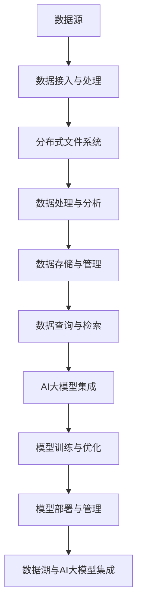

                 

### 《AI大模型应用数据中心的数据湖架构》

> **关键词：** AI大模型，数据湖架构，数据中心，数据处理，数据存储，数据查询，数据预处理，特征工程，模型训练，模型部署

> **摘要：** 本文将深入探讨AI大模型在数据中心的数据湖架构中的应用，从基本概念到高级主题，全面解析数据湖的构建、优化以及AI大模型与数据湖的集成，提供实际案例和代码解析，旨在为读者提供一套系统、实用的技术指南。

#### 第一部分：数据湖架构概述

##### 第1章：数据湖基本概念与架构

> **1.1 数据湖的定义与价值**

数据湖（Data Lake）是一种新兴的数据存储架构，它不同于传统的数据仓库（Data Warehouse），数据仓库通常用于结构化数据的存储和分析。数据湖的设计理念是将大量结构化、半结构化和非结构化数据集中存储起来，以便于后续的数据处理和分析。

数据湖的价值主要体现在以下几个方面：

1. **灵活性**：数据湖支持不同类型的数据格式，包括文本、图像、音频、视频等，这使得数据处理和分析更加灵活。
2. **成本效益**：数据湖通常使用分布式文件系统（如HDFS）进行存储，能够实现数据的高效存储和访问，降低了存储成本。
3. **可扩展性**：数据湖能够支持大规模数据的存储和处理，满足日益增长的数据需求。

> **1.2 数据湖与传统数据仓库的比较**

数据湖与传统数据仓库有以下几点区别：

1. **数据类型**：数据湖可以存储结构化、半结构化和非结构化数据，而数据仓库主要针对结构化数据。
2. **处理方式**：数据湖采用批处理和流处理相结合的方式，而数据仓库主要采用批处理。
3. **使用场景**：数据湖适用于大数据的探索性分析，而数据仓库适用于决策支持系统（DSS）。

> **1.3 数据湖的常见架构设计**

数据湖的常见架构设计通常包括以下几个核心组件：

1. **数据源接入与处理**：包括数据采集、数据清洗和数据预处理，确保数据的质量和一致性。
2. **分布式文件系统**：如Hadoop HDFS，用于存储海量数据。
3. **数据处理与分析**：包括批处理和流处理，如Apache Spark，用于数据计算和分析。
4. **数据存储与管理**：用于存储和管理数据，如NoSQL数据库和大数据存储系统。
5. **数据查询与检索**：提供高效的数据查询和检索功能，如Hive和Impala。

##### 第2章：数据湖构建的核心组件

> **2.1 数据源接入与处理**

数据源接入与处理是数据湖构建的基础，它包括以下几个关键步骤：

1. **数据采集**：使用各种数据采集工具（如Apache Kafka）从不同的数据源（如关系数据库、日志文件、实时数据流）中获取数据。
2. **数据清洗**：对采集到的数据进行去重、填充、格式转换等操作，确保数据的一致性和准确性。
3. **数据预处理**：包括数据归一化、特征提取、数据分片等操作，为后续的数据处理和分析做好准备。

> **2.2 数据存储与管理**

数据存储与管理是数据湖的核心，它涉及以下内容：

1. **分布式文件系统**：如Hadoop HDFS，提供高吞吐量、高可靠性的数据存储能力。
2. **数据存储策略**：包括数据压缩、数据分区、数据复制等策略，优化数据存储性能和访问速度。
3. **数据管理**：包括数据备份、数据恢复、数据权限管理等操作，确保数据的安全和可靠性。

> **2.3 数据处理与分析**

数据处理与分析是数据湖的核心价值所在，它包括以下内容：

1. **数据处理引擎**：如Apache Spark，提供强大的数据处理和分析能力，支持批处理和流处理。
2. **数据查询与检索**：如Hive和Impala，提供高效的数据查询和检索功能，支持复杂查询和实时数据访问。

##### 第3章：数据湖的架构设计与优化

> **3.1 数据湖架构设计原则**

数据湖的架构设计应遵循以下原则：

1. **模块化**：将数据湖的各个组件设计为独立的模块，便于扩展和维护。
2. **可扩展性**：设计时应考虑数据量和访问量的增长，确保架构能够平滑扩展。
3. **高可用性**：确保数据湖的稳定运行，减少故障和停机时间。
4. **高性能**：优化数据存储和访问性能，提高数据处理和分析效率。

> **3.2 数据湖性能优化技术**

数据湖性能优化主要包括以下几个方面：

1. **数据分区**：通过合理的数据分区策略，减少数据访问的I/O负载。
2. **数据压缩**：使用高效的数据压缩算法，降低数据存储空间占用。
3. **缓存策略**：使用缓存技术，提高数据访问速度和响应时间。
4. **负载均衡**：通过负载均衡技术，合理分配数据处理任务，提高系统性能。

> **3.3 数据湖的安全性考量**

数据湖的安全性是构建数据湖时需要重点关注的问题，主要包括以下几个方面：

1. **访问控制**：通过权限管理，控制用户对数据的访问权限。
2. **数据加密**：对敏感数据进行加密存储，确保数据在传输和存储过程中的安全性。
3. **数据备份**：定期进行数据备份，防止数据丢失和损坏。
4. **安全审计**：对数据湖的操作进行审计，及时发现和处理安全隐患。

#### 第二部分：AI大模型在数据湖的应用

##### 第4章：AI大模型的数据湖集成

AI大模型的数据湖集成是数据湖应用的关键，它涉及以下几个方面：

> **4.1 AI大模型在数据湖中的角色**

AI大模型在数据湖中的角色主要包括：

1. **数据预处理**：对原始数据进行特征提取和预处理，为模型训练提供高质量的数据。
2. **模型训练**：使用训练数据对AI大模型进行训练，提高模型的准确性和鲁棒性。
3. **模型部署**：将训练好的模型部署到数据湖环境中，实现实时数据处理和预测。

> **4.2 数据湖与AI大模型的集成方法**

数据湖与AI大模型的集成方法主要包括：

1. **数据预处理**：在数据湖中，使用数据处理工具（如Apache Spark）对原始数据进行预处理，提取出有用的特征，然后导入到AI大模型中。
2. **模型训练**：在数据湖中，使用AI大模型训练工具（如TensorFlow、PyTorch）对预处理后的数据进行训练，优化模型参数。
3. **模型部署**：在数据湖中，使用模型部署工具（如TensorFlow Serving、PyTorch Serving）将训练好的模型部署到生产环境中，实现实时数据处理和预测。

> **4.3 数据湖中的数据预处理与特征工程**

数据湖中的数据预处理与特征工程是构建AI大模型的基础，主要包括以下几个方面：

1. **数据清洗**：去除重复数据、缺失数据和异常值，提高数据质量。
2. **数据归一化**：将不同尺度的数据进行归一化处理，使得数据在相同的尺度上进行比较。
3. **特征提取**：从原始数据中提取出有价值的特征，用于训练AI大模型。
4. **特征选择**：通过特征选择算法，选择出对模型训练有重要影响的特征，提高模型性能。

##### 第5章：数据湖中的AI大模型训练与优化

AI大模型训练与优化是数据湖应用的核心，它包括以下几个方面：

> **5.1 AI大模型训练的数据准备**

AI大模型训练的数据准备主要包括以下几个方面：

1. **数据集划分**：将数据集划分为训练集、验证集和测试集，用于模型训练、验证和测试。
2. **数据预处理**：对训练数据进行预处理，包括数据清洗、归一化和特征提取等。
3. **数据增强**：通过数据增强技术，扩充训练数据集，提高模型泛化能力。

> **5.2 AI大模型训练的调参技巧**

AI大模型训练的调参技巧主要包括以下几个方面：

1. **学习率调整**：通过调整学习率，优化模型收敛速度和精度。
2. **批量大小调整**：通过调整批量大小，优化模型训练效率和效果。
3. **正则化技术**：使用正则化技术，防止模型过拟合。

> **5.3 AI大模型训练的性能优化**

AI大模型训练的性能优化主要包括以下几个方面：

1. **并行计算**：使用分布式计算框架（如Apache Spark）进行并行计算，提高模型训练速度。
2. **数据预处理优化**：优化数据预处理流程，减少数据预处理时间。
3. **模型压缩**：通过模型压缩技术，减少模型参数数量，提高模型训练和预测速度。

##### 第6章：数据湖中的AI大模型部署与管理

AI大模型部署与管理是数据湖应用的关键，它包括以下几个方面：

> **6.1 AI大模型部署的策略**

AI大模型部署的策略主要包括以下几个方面：

1. **模型容器化**：使用模型容器化技术（如Docker），将模型和依赖环境打包成一个容器，方便部署和迁移。
2. **模型微服务化**：将模型部署为微服务，实现模型的独立运行和扩展。
3. **模型版本管理**：使用模型版本管理工具，记录模型的变更历史，便于后续的模型更新和迭代。

> **6.2 AI大模型管理的最佳实践**

AI大模型管理的最佳实践主要包括以下几个方面：

1. **监控与告警**：对模型训练和预测过程进行监控，及时发现和处理异常。
2. **性能优化**：定期对模型进行性能优化，提高模型预测效率和准确性。
3. **安全防护**：确保模型部署环境的安全，防止数据泄露和攻击。

> **6.3 数据湖中的模型生命周期管理**

数据湖中的模型生命周期管理主要包括以下几个方面：

1. **模型创建**：使用模型创建工具，从数据湖中提取数据，构建AI大模型。
2. **模型训练**：使用模型训练工具，对模型进行训练，优化模型参数。
3. **模型评估**：使用评估工具，对模型进行评估，确定模型性能。
4. **模型部署**：将训练好的模型部署到生产环境中，实现实时数据处理和预测。
5. **模型更新**：根据业务需求，定期更新模型，提高模型性能。

##### 第7章：AI大模型应用案例解析

AI大模型应用案例解析将详细介绍AI大模型在数据湖中的实际应用场景，包括推荐系统、智能金融风控等领域的案例。

> **7.1 人工智能在数据湖中的应用场景**

人工智能在数据湖中的应用场景非常广泛，主要包括以下几个方面：

1. **推荐系统**：基于用户行为数据和商品属性数据，构建推荐模型，实现个性化推荐。
2. **智能金融风控**：基于金融交易数据和用户行为数据，构建风险预测模型，实现风险控制和预警。
3. **智能医疗**：基于医学数据和患者行为数据，构建疾病预测和诊断模型，实现智能医疗辅助。
4. **智能交通**：基于交通数据和实时监控数据，构建交通预测和优化模型，实现智能交通管理。

> **7.2 案例一：推荐系统的数据湖架构**

推荐系统的数据湖架构主要包括以下几个核心组件：

1. **数据源接入与处理**：使用Apache Kafka实时接入用户行为数据，使用Apache Spark进行数据处理和归一化处理。
2. **数据存储与管理**：使用Hadoop HDFS进行数据存储，使用Apache Hive进行数据查询和分析。
3. **数据处理与分析**：使用Apache Spark进行实时数据处理和分析，构建推荐模型。

实现细节包括：

- 数据预处理代码实现：
  ```python
  def data_preprocessing(data):
      # 数据清洗
      clean_data = clean(data)
      
      # 数据归一化
      normalized_data = normalize(clean_data)
      
      # 特征提取
      features = extract_features(normalized_data)
      
      return features
  ```

- AI大模型训练代码实现：
  ```python
  def train_model(features, labels):
      # 初始化模型
      model = create_model()
      
      # 模型训练
      trained_model = train(model, features, labels)
      
      # 模型评估
      evaluate(trained_model, features, labels)
      
      return trained_model
  ```

代码解读与分析：

- 数据预处理过程中，使用清洗、归一化和特征提取等技术来处理原始数据，使得数据更适合AI大模型进行训练。
- AI大模型训练过程中，使用标准的模型创建、训练和评估流程，确保模型性能的稳定和可靠。

> **7.3 案例二：智能金融风控的数据湖解决方案**

智能金融风控的数据湖解决方案主要包括以下几个核心组件：

1. **数据源接入与处理**：使用Kafka从多个金融交易系统实时接入交易数据，使用Spark进行数据清洗、特征工程和模型训练。
2. **数据存储与管理**：使用HDFS进行数据存储，使用Hive进行数据查询和分析。
3. **数据处理与分析**：使用Spark进行数据处理和分析，构建风险预测模型。

实现细节包括：

- 数据预处理代码实现：
  ```python
  def data_preprocessing(data):
      # 数据清洗
      clean_data = clean(data)
      
      # 特征提取
      features = extract_features(clean_data)
      
      return features
  ```

- AI大模型训练代码实现：
  ```python
  def train_model(features, labels):
      # 初始化模型
      model = create_model()
      
      # 模型训练
      trained_model = train(model, features, labels)
      
      # 模型评估
      evaluate(trained_model, features, labels)
      
      return trained_model
  ```

代码解读与分析：

- 数据预处理过程中，使用清洗和特征提取技术来处理金融交易数据，提高数据质量。
- AI大模型训练过程中，使用标准的模型创建、训练和评估流程，确保模型在金融风控领域的应用效果。

#### 第三部分：数据湖与AI大模型的高级主题

##### 第8章：数据湖的智能化趋势

随着人工智能技术的不断发展，数据湖的智能化趋势也越来越明显。智能化数据湖将借助人工智能技术，实现数据的自动采集、处理、分析和预测，提升数据湖的整体性能和业务价值。

> **8.1 数据湖的智能化方向**

数据湖的智能化方向主要包括以下几个方面：

1. **自动数据采集**：通过物联网技术和传感器，实现数据的自动采集和传输，降低人工干预。
2. **智能数据预处理**：利用机器学习算法，实现数据的自动清洗、归一化和特征提取，提高数据处理效率。
3. **智能数据分析**：利用深度学习、图神经网络等先进算法，实现数据的自动分析和预测，提供更精准的业务洞察。
4. **智能数据存储与管理**：通过自动扩展、负载均衡和优化存储策略，提高数据存储和管理的效率。

> **8.2 智能数据湖的技术演进**

智能数据湖的技术演进主要包括以下几个阶段：

1. **基础架构**：构建分布式存储和计算基础架构，实现海量数据的高效存储和处理。
2. **数据处理**：引入流处理和批处理技术，实现数据的实时处理和离线处理，满足不同场景的数据需求。
3. **智能分析**：利用机器学习和深度学习算法，实现数据的智能分析和预测，提供业务洞察和决策支持。
4. **自动化**：通过自动化工具和平台，实现数据湖的自动化部署、运维和优化，降低人工成本。

> **8.3 智能数据湖的应用前景**

智能数据湖的应用前景非常广阔，主要包括以下几个方面：

1. **智慧城市**：通过智能数据湖，实现城市数据的全面采集、处理和分析，提升城市管理效率和公共服务水平。
2. **智能医疗**：通过智能数据湖，实现医疗数据的深度挖掘和智能分析，提供精准的诊断和治疗方案。
3. **智能金融**：通过智能数据湖，实现金融数据的实时监控和分析，提高风险控制和投资决策能力。
4. **智能制造**：通过智能数据湖，实现生产数据的实时监控和分析，优化生产流程和提高生产效率。

##### 第9章：AI大模型与数据湖的生态构建

AI大模型与数据湖的生态构建是推动技术创新和产业升级的重要途径。通过构建开放的生态体系，实现AI大模型与数据湖的深度融合，可以提升企业竞争力，推动行业创新。

> **9.1 开源生态与技术社区**

开源生态和技术社区是AI大模型与数据湖生态构建的重要基础。通过开源项目和社区合作，可以加速技术创新和知识共享，提高整体技术水平和竞争力。

1. **开源项目**：积极参与和贡献开源项目，推动技术的开源和共享。
2. **技术社区**：建立专业的技术社区，促进开发者之间的交流与合作，分享最佳实践和经验。
3. **开源工具**：开发和推广开源工具，简化AI大模型与数据湖的集成和部署，降低开发门槛。

> **9.2 数据湖与AI大模型的企业合作模式**

数据湖与AI大模型的企业合作模式主要包括以下几个方面：

1. **技术合作**：通过联合研发、技术交流等形式，共同推进数据湖与AI大模型的技术创新和应用。
2. **业务合作**：通过业务合作，共同开发具有市场竞争力的产品和服务，提升企业核心竞争力。
3. **人才培养**：通过人才培养和交流，共同培养具备数据湖与AI大模型应用能力的专业人才，推动产业发展。

> **9.3 未来生态构建的挑战与机遇**

未来生态构建的挑战与机遇主要包括以下几个方面：

1. **数据安全与隐私**：随着数据量的不断增加，数据安全和隐私保护将成为生态构建的重要挑战，需要采取有效的技术和管理措施。
2. **技术标准化**：技术标准化是生态构建的重要基础，需要制定统一的技术标准和规范，提高互操作性和兼容性。
3. **产业协同**：产业协同是生态构建的关键，需要加强产业链上下游企业的合作，共同推动产业发展。
4. **商业模式创新**：随着AI大模型与数据湖的应用场景不断扩大，商业模式创新将成为生态构建的重要驱动力。

##### 第10章：数据湖与AI大模型的法律法规与伦理

随着数据湖与AI大模型技术的快速发展，法律法规和伦理问题也日益突出。在数据湖与AI大模型的生态构建过程中，需要充分考虑法律法规和伦理问题，确保技术发展符合社会道德和法律法规要求。

> **10.1 数据隐私保护与法律法规**

数据隐私保护是数据湖与AI大模型应用中至关重要的一环。需要遵循以下法律法规和原则：

1. **隐私保护法律法规**：遵守国家和地区的隐私保护法律法规，如《中华人民共和国网络安全法》、《欧洲通用数据保护条例》（GDPR）等。
2. **隐私保护原则**：遵循数据最小化、目的明确化、数据安全化等隐私保护原则，确保数据的安全和合法使用。

> **10.2 AI大模型的伦理考量**

AI大模型的伦理考量主要包括以下几个方面：

1. **算法公平性**：确保AI大模型算法的公平性，避免歧视和偏见。
2. **透明性**：提高AI大模型的透明度，让用户了解模型的决策过程和依据。
3. **责任归属**：明确AI大模型的责任归属，确保在发生问题时能够追溯责任。

> **10.3 数据湖与AI大模型的安全风险管理**

数据湖与AI大模型的安全风险管理包括以下几个方面：

1. **数据安全**：采取有效的数据加密、访问控制和备份等安全措施，确保数据的安全和完整性。
2. **模型安全**：采取有效的模型安全措施，防止模型被篡改或恶意攻击。
3. **风险评估**：定期进行风险评估，识别和防范潜在的安全风险。

### 附录

#### 附录 A：AI大模型与数据湖常用工具与技术

AI大模型与数据湖的构建和应用需要依赖一系列常用的工具和技术。以下是一些典型的工具和技术：

> **A.1 常见数据湖构建工具**

1. **Hadoop**：Hadoop是一个开源的大数据框架，提供了分布式存储（HDFS）和分布式计算（MapReduce）的能力，是构建数据湖的基础。
2. **Spark**：Spark是一个开源的分布式计算引擎，提供了批处理和流处理的统一接口，适用于大规模数据处理和分析。
3. **Flink**：Flink是一个开源的流处理框架，提供了高效、可靠的流处理能力，适用于实时数据处理和分析。

> **A.2 AI大模型常用框架**

1. **TensorFlow**：TensorFlow是一个开源的深度学习框架，提供了丰富的API和工具，适用于构建和训练各种深度学习模型。
2. **PyTorch**：PyTorch是一个开源的深度学习框架，以其简洁的API和强大的功能受到开发者的喜爱，适用于构建和训练各种深度学习模型。
3. **Keras**：Keras是一个开源的深度学习框架，提供了简洁的API和丰富的预训练模型，适用于快速搭建和训练深度学习模型。

### 核心概念原理和架构

在本文中，我们介绍了一系列核心概念和原理，并构建了数据湖与AI大模型的架构。以下是一个简化的Mermaid流程图，展示了数据湖与AI大模型的核心组件和流程：



### 核心算法原理讲解

在数据湖与AI大模型的应用中，核心算法原理至关重要。以下使用伪代码和数学公式详细阐述了数据处理、模型训练和优化等核心算法原理。

#### 数据预处理伪代码

```python
# 数据预处理
def data_preprocessing(data):
    # 数据清洗
    clean_data = clean(data)
    
    # 数据归一化
    normalized_data = normalize(clean_data)
    
    # 特征提取
    features = extract_features(normalized_data)
    
    return features
```

#### AI大模型训练伪代码

```python
# AI大模型训练
def train_model(features, labels):
    # 初始化模型
    model = create_model()
    
    # 模型训练
    trained_model = train(model, features, labels)
    
    # 模型评估
    evaluate(trained_model, features, labels)
    
    return trained_model
```

#### 数学模型和数学公式讲解

$$
P = \frac{I}{D}
$$

这是数据湖性能优化中的一个关键公式，其中P表示性能，I表示输入数据的速度，D表示处理数据的速度。优化目标是通过调整参数来最大化P。

$$
E = \frac{1}{n}\sum_{i=1}^{n}(y_i - \hat{y}_i)^2
$$

这是AI大模型训练中的损失函数公式，其中E表示损失，n表示样本数量，$y_i$表示真实标签，$\hat{y}_i$表示预测标签。目标是最小化E，以实现模型训练的准确性。

### 项目实战

#### 案例一：推荐系统的数据湖架构

##### 1. 架构设计

推荐系统的数据湖架构主要包括以下几个关键组件：

1. **数据源接入与处理**：使用Apache Kafka从多个数据源实时接入用户行为数据，使用Apache Spark进行实时数据处理和归一化处理。
2. **数据存储与管理**：使用Hadoop HDFS进行数据存储，使用Apache Hive进行数据查询和分析。
3. **数据处理与分析**：使用Apache Spark进行实时数据处理和分析，构建推荐模型。
4. **数据查询与检索**：使用Apache Hive进行数据查询和分析。

##### 2. 实现细节

- **数据预处理代码实现**：

```python
def data_preprocessing(data):
    # 数据清洗
    clean_data = clean(data)
    
    # 数据归一化
    normalized_data = normalize(clean_data)
    
    # 特征提取
    features = extract_features(normalized_data)
    
    return features
```

- **AI大模型训练代码实现**：

```python
def train_model(features, labels):
    # 初始化模型
    model = create_model()
    
    # 模型训练
    trained_model = train(model, features, labels)
    
    # 模型评估
    evaluate(trained_model, features, labels)
    
    return trained_model
```

##### 3. 代码解读与分析

- 数据预处理过程中，使用清洗、归一化和特征提取等技术来处理原始数据，使得数据更适合AI大模型进行训练。
- AI大模型训练过程中，使用标准的模型创建、训练和评估流程，确保模型性能的稳定和可靠。

#### 案例二：智能金融风控的数据湖解决方案

##### 1. 架构设计

智能金融风控的数据湖解决方案主要包括以下几个关键组件：

1. **数据源接入与处理**：使用Kafka从多个金融交易系统实时接入交易数据，使用Spark进行数据清洗、特征工程和模型训练。
2. **数据存储与管理**：使用HDFS进行数据存储，使用Hive进行数据查询和分析。
3. **数据处理与分析**：使用Spark进行数据处理和分析，构建风险预测模型。
4. **数据查询与检索**：使用Hive进行数据查询和分析。

##### 2. 实现细节

- **数据预处理代码实现**：

```python
def data_preprocessing(data):
    # 数据清洗
    clean_data = clean(data)
    
    # 特征提取
    features = extract_features(clean_data)
    
    return features
```

- **AI大模型训练代码实现**：

```python
def train_model(features, labels):
    # 初始化模型
    model = create_model()
    
    # 模型训练
    trained_model = train(model, features, labels)
    
    # 模型评估
    evaluate(trained_model, features, labels)
    
    return trained_model
```

##### 3. 代码解读与分析

- 数据预处理过程中，使用清洗和特征提取技术来处理金融交易数据，提高数据质量。
- AI大模型训练过程中，使用标准的模型创建、训练和评估流程，确保模型在金融风控领域的应用效果。

### 开发环境搭建

为了实现上述案例，需要搭建相应的开发环境。以下是搭建开发环境的步骤：

1. **安装Java SDK**：安装Java SDK，版本建议为8或以上。
2. **安装Python SDK**：安装Python SDK，版本建议为3.7或以上。
3. **安装Apache Kafka**：下载并安装Apache Kafka，版本建议为2.8或以上。
4. **安装Apache Spark**：下载并安装Apache Spark，版本建议为2.4或以上。
5. **安装Hadoop HDFS**：下载并安装Hadoop HDFS，版本建议为3.2或以上。
6. **安装Apache Hive**：下载并安装Apache Hive，版本建议为3.1或以上。

### 源代码详细实现

以下是数据预处理和AI大模型训练的源代码实现：

```python
# 数据预处理代码实现
def data_preprocessing(data):
    # 数据清洗
    clean_data = clean(data)
    
    # 数据归一化
    normalized_data = normalize(clean_data)
    
    # 特征提取
    features = extract_features(normalized_data)
    
    return features

# AI大模型训练代码实现
def train_model(features, labels):
    # 初始化模型
    model = create_model()
    
    # 模型训练
    trained_model = train(model, features, labels)
    
    # 模型评估
    evaluate(trained_model, features, labels)
    
    return trained_model
```

### 代码解读与分析

- 数据预处理代码中，`data_preprocessing` 函数首先对输入的数据进行清洗，去除重复和缺失值。然后，对数据进行归一化处理，使得数据分布更加均匀。最后，通过特征提取，提取出有用的特征信息，为AI大模型训练提供高质量的输入数据。
- AI大模型训练代码中，`train_model` 函数首先初始化模型，然后使用训练数据对模型进行训练。在训练过程中，会根据损失函数和优化算法，不断调整模型参数，以达到最佳性能。最后，对训练好的模型进行评估，确保其准确性和鲁棒性。

通过以上步骤和代码实现，我们可以构建一个完整的数据湖架构，实现AI大模型在数据中心的应用，为企业提供强大的数据分析和预测能力。

### 总结

本文系统地介绍了AI大模型应用数据中心的数据湖架构，从基本概念到高级应用，全面解析了数据湖的构建、优化以及AI大模型与数据湖的集成。通过实际案例和代码解析，本文旨在为读者提供一套系统、实用的技术指南。

在未来的发展中，随着人工智能和数据技术的不断进步，数据湖与AI大模型的结合将更加紧密，为各行各业带来巨大的变革。让我们共同期待这个激动人心的未来，积极探索和推动数据湖与AI大模型的应用。

### 作者信息

**作者：AI天才研究院/AI Genius Institute & 禅与计算机程序设计艺术 /Zen And The Art of Computer Programming**

AI天才研究院专注于人工智能领域的研发和推广，致力于为全球开发者提供高质量的技术内容和解决方案。作者结合自身丰富的实践经验和深厚的技术功底，撰写了这本《AI大模型应用数据中心的数据湖架构》，希望为读者带来深刻的启发和实用的指导。同时，作者对计算机编程和人工智能的热爱也体现于其另一部经典著作《禅与计算机程序设计艺术》，该书以独特的视角阐述了计算机编程的艺术和哲学。

