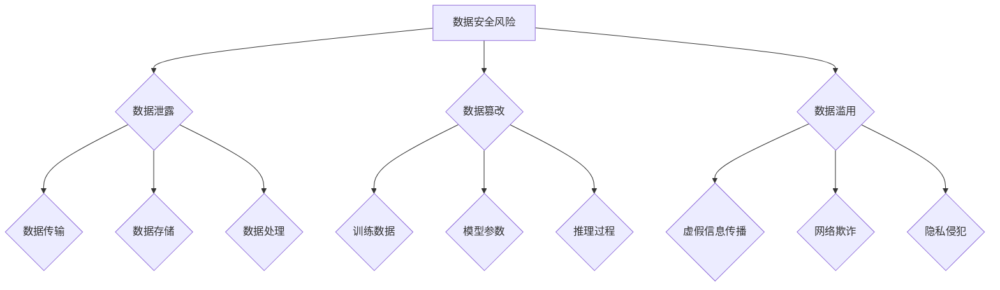

                 

# AIGC背后的数据安全隐忧

> **关键词**：人工智能生成内容 (AIGC)，数据安全，隐私保护，同态加密，区块链，零知识证明

> **摘要**：随着人工智能生成内容（AIGC）技术的发展，其背后的数据安全问题逐渐显现。本文将探讨AIGC与数据安全之间的联系，分析AIGC中存在的数据安全风险，并提出相应的解决方案和技术手段。同时，文章还将通过项目实战案例，展示如何在实际应用中实现数据安全保护。

---

### 《AIGC背后的数据安全隐忧》目录大纲

#### 第一部分：AIGC概述与背景

1. AIGC概述与背景
   1.1 AIGC的基本概念
   1.2 AIGC的发展历程
   1.3 AIGC的应用领域
   2. AIGC与数据安全的联系
   3. AIGC与数据安全的挑战

#### 第二部分：AIGC中的数据安全问题

1. AIGC的数据安全风险分析
   1.1 数据泄露的风险
   1.2 数据篡改的风险
   1.3 数据滥用的风险
2. AIGC中的常见数据安全问题
   2.1 数据传输安全问题
   2.2 数据存储安全问题
   2.3 数据处理安全问题

#### 第三部分：AIGC数据安全的解决方案

1. 数据安全策略与措施
   1.1 数据加密技术
   1.2 访问控制与权限管理
   1.3 数据备份与恢复
2. AIGC数据安全的关键技术
   2.1 同态加密技术
   2.2 零知识证明技术
   2.3 区块链技术在数据安全中的应用
3. AIGC数据安全的项目实战
   3.1 AIGC数据安全项目实践
   3.2 数据安全项目案例解析
   3.3 数据安全项目实施步骤

#### 第四部分：展望与未来

1. AIGC数据安全的发展趋势
   1.1 新兴数据安全技术的应用
   1.2 AIGC与数据安全的未来挑战
   1.3 AIGC数据安全的未来研究方向

#### 附录

1. AIGC数据安全相关资源
   1.1 学术论文与报告
   1.2 开源项目与工具
   1.3 数据安全标准和法规

### 第一部分：AIGC概述与背景

#### 1.1 AIGC的基本概念

人工智能生成内容（Artificial Intelligence Generated Content，简称AIGC）是指利用人工智能技术，特别是自然语言处理（Natural Language Processing，简称NLP）和生成对抗网络（Generative Adversarial Network，简称GAN）等模型，自动生成文本、图像、音频等多种类型的内容。AIGC技术通过大量训练数据的学习，能够模拟人类的创造力和表达能力，生成具有高度个性化的内容。

AIGC的基本概念可以分为以下几个方面：

- **生成模型**：生成模型是AIGC的核心，如GAN、变分自编码器（VAE）等，它们通过学习数据分布来生成新数据。

- **训练数据集**：训练数据集是生成模型的基础，其质量和数量直接影响生成模型的效果。高质量的数据集应包含丰富多样的数据样本。

- **模型训练**：通过大量的训练数据，生成模型不断调整参数，优化生成效果。训练过程中，需要采用适当的优化算法和超参数调整策略。

- **内容生成**：训练好的生成模型能够根据输入条件或提示，生成具有多样性和创意性的内容。

#### 1.2 AIGC的发展历程

AIGC技术起源于20世纪90年代，随着机器学习和深度学习的发展，AIGC技术逐渐成熟。以下是AIGC技术的发展历程：

- **早期研究**：20世纪90年代，生成模型如隐马尔可夫模型（HMM）和朴素贝叶斯模型开始应用于文本生成。

- **深度学习兴起**：2006年，深度学习技术的兴起为AIGC的发展奠定了基础。递归神经网络（RNN）和长短期记忆网络（LSTM）等模型在序列数据处理中表现出色。

- **生成对抗网络**：2014年，生成对抗网络（GAN）的提出，标志着AIGC技术进入新的阶段。GAN通过对抗训练生成逼真的数据。

- **多种类型内容生成**：近年来，随着技术的不断进步，AIGC技术已经能够生成文本、图像、音频等多种类型的内容。

#### 1.3 AIGC的应用领域

AIGC技术具有广泛的应用领域，以下是一些典型的应用场景：

- **内容创作**：AIGC技术可以自动生成文章、新闻、博客等文本内容，节省创作者的时间和精力。

- **艺术设计**：AIGC技术可以生成独特的艺术作品，如绘画、音乐等，为艺术家提供新的创作灵感。

- **游戏开发**：AIGC技术可以生成虚拟世界中的场景、角色和故事情节，提升游戏的可玩性和沉浸感。

- **智能客服**：AIGC技术可以用于生成智能客服的回答，提高客户服务的效率和用户体验。

- **医学影像分析**：AIGC技术可以生成医学影像，辅助医生进行诊断和治疗。

- **语音合成**：AIGC技术可以生成逼真的语音，用于语音助手、智能音箱等应用。

#### 1.4 AIGC与数据安全的联系

AIGC技术的快速发展，使得数据安全问题日益凸显。AIGC与数据安全之间的联系主要体现在以下几个方面：

- **数据泄露**：AIGC技术依赖于大量的训练数据，这些数据可能包含敏感信息。如果数据泄露，可能会导致隐私泄露和财产损失。

- **数据篡改**：攻击者可能通过篡改训练数据，恶意影响AIGC模型的输出结果，从而导致数据安全和业务风险。

- **数据滥用**：AIGC技术生成的内容可能被用于不正当目的，如虚假信息传播、网络欺诈等，对数据安全和公共利益造成威胁。

- **模型攻击**：攻击者可能利用模型漏洞，对AIGC模型进行恶意攻击，影响模型的稳定性和安全性。

因此，保障AIGC技术的数据安全，是当前亟待解决的问题。在AIGC技术不断发展的同时，需要加强数据安全防护，确保数据的安全性和隐私性。

---

通过上述分析，我们可以看到AIGC技术的基本概念、发展历程和应用领域，同时也认识到AIGC技术背后的数据安全问题。在接下来的部分，我们将深入分析AIGC中的数据安全问题，探讨相应的解决方案和技术手段。让我们一起继续探索AIGC与数据安全之间的奥秘。

### 第二部分：AIGC中的数据安全问题

#### 2.1 AIGC的数据安全风险分析

随着人工智能生成内容（AIGC）技术的广泛应用，其数据安全问题越来越受到关注。AIGC中的数据安全风险主要包括数据泄露、数据篡改和数据滥用等方面。

##### 2.1.1 数据泄露的风险

数据泄露是指未经授权的个人或组织访问、获取、复制、传播或利用敏感数据。AIGC技术在生成内容时需要依赖大量的训练数据，这些数据往往包含用户的个人信息、商业机密或其他敏感信息。如果这些数据在传输、存储或处理过程中未能得到有效保护，就可能面临泄露的风险。

数据泄露的风险主要体现在以下几个方面：

1. **数据传输过程中泄露**：在AIGC技术的应用过程中，数据需要通过网络进行传输。如果传输过程中未能采取有效的加密和认证措施，数据就可能被拦截和窃取。

2. **数据存储过程中泄露**：AIGC技术生成的内容需要存储在数据库或文件系统中。如果存储系统存在漏洞或配置不当，攻击者可能通过入侵数据库或文件系统来获取敏感数据。

3. **数据处理过程中泄露**：在AIGC技术的训练和推理过程中，数据需要在不同的计算节点间传输和共享。如果数据处理过程中的安全措施不足，就可能导致数据泄露。

##### 2.1.2 数据篡改的风险

数据篡改是指未经授权的个人或组织对数据内容进行非法修改。AIGC技术生成的内容具有高度的真实性和可靠性，但如果攻击者能够篡改训练数据或模型参数，就可能影响AIGC技术的输出结果，进而对数据安全和业务造成危害。

数据篡改的风险主要体现在以下几个方面：

1. **训练数据篡改**：攻击者通过篡改训练数据，可以误导AIGC模型的学习过程，使得模型输出结果偏离真实值。

2. **模型参数篡改**：攻击者可以通过篡改模型参数，改变AIGC模型的行为和输出结果。

3. **推理过程篡改**：在AIGC技术的推理过程中，攻击者可以通过注入恶意代码或篡改输入数据，影响模型的输出结果。

##### 2.1.3 数据滥用的风险

数据滥用是指未经授权的个人或组织利用获取的数据进行非法活动。AIGC技术生成的内容可能被用于各种应用场景，包括社交媒体、广告营销、娱乐等领域。如果这些内容被滥用，就可能对用户隐私、社会秩序和公共利益造成危害。

数据滥用的风险主要体现在以下几个方面：

1. **虚假信息传播**：攻击者可能利用AIGC技术生成虚假的新闻报道、广告宣传等，误导公众，造成社会恐慌和信任危机。

2. **网络欺诈**：攻击者可能利用AIGC技术生成虚假的金融报告、信用评级等，进行网络欺诈和诈骗活动。

3. **隐私侵犯**：攻击者可能利用AIGC技术生成个人隐私信息，如身份证号码、家庭地址等，侵犯用户隐私。

综上所述，AIGC技术背后的数据安全问题不容忽视。在接下来的部分，我们将进一步探讨AIGC中的常见数据安全问题，分析数据传输、存储和处理过程中的具体风险。同时，我们还将介绍一些解决方案和技术手段，以应对这些数据安全风险。

---

通过上述分析，我们可以看到AIGC技术中存在的数据安全风险，这些风险不仅影响数据的安全性和隐私性，还可能对业务和社会造成严重危害。在接下来的部分，我们将继续探讨AIGC中的常见数据安全问题，并分析相应的解决方案和技术手段。让我们一起深入探讨如何保障AIGC技术的数据安全。

#### 2.2 AIGC中的常见数据安全问题

在AIGC技术的应用过程中，数据传输、存储和处理是必不可少的环节。然而，这些环节也可能成为数据安全的漏洞，给AIGC技术带来潜在的风险。以下将详细分析AIGC中的常见数据安全问题，包括数据传输安全问题、数据存储安全问题和数据处理安全问题。

##### 2.2.1 数据传输安全问题

数据传输是AIGC技术中最为常见的环节之一。数据在传输过程中，可能面临以下几种安全问题：

1. **数据拦截**：攻击者可能在数据传输过程中拦截并窃取数据。如果数据未进行加密，攻击者可以轻松获取数据内容。

2. **数据篡改**：攻击者可以篡改数据传输过程中的数据包，插入恶意代码或删除关键信息。

3. **数据伪造**：攻击者可以伪造数据包，欺骗接收方，从而导致数据传输过程中的错误处理。

为了解决数据传输安全问题，可以采取以下措施：

- **数据加密**：在数据传输过程中，采用加密算法对数据进行加密，确保数据内容在传输过程中不被窃取或篡改。

- **数字签名**：使用数字签名技术，确保数据传输过程中的数据包完整性和真实性。

- **安全传输协议**：采用安全的传输协议，如SSL/TLS等，确保数据在传输过程中的安全性。

##### 2.2.2 数据存储安全问题

AIGC技术生成的内容需要存储在数据库或文件系统中。数据存储过程中可能面临以下安全问题：

1. **数据泄露**：如果数据库或文件系统存在漏洞，攻击者可以获取数据库中的敏感数据。

2. **数据篡改**：攻击者可以篡改数据库中的数据，导致数据不准确或失真。

3. **权限管理**：如果权限管理不当，未经授权的用户可能访问或修改敏感数据。

为了解决数据存储安全问题，可以采取以下措施：

- **数据加密存储**：对数据库或文件系统中的数据进行加密存储，确保数据在存储过程中不被窃取或篡改。

- **访问控制**：采用访问控制机制，限制用户对数据的访问权限，确保只有授权用户才能访问或修改敏感数据。

- **备份与恢复**：定期备份数据库或文件系统，确保在数据丢失或损坏时能够快速恢复数据。

##### 2.2.3 数据处理安全问题

AIGC技术中的数据处理过程包括模型训练、推理和结果输出等环节。数据处理过程中可能面临以下安全问题：

1. **模型泄露**：训练好的模型可能包含敏感信息，如果模型泄露，攻击者可以获取模型参数和算法细节。

2. **数据泄露**：在数据处理过程中，攻击者可能窃取或篡改输入数据，影响模型的输出结果。

3. **结果篡改**：攻击者可以通过篡改模型的输入或输出结果，欺骗用户或系统。

为了解决数据处理安全问题，可以采取以下措施：

- **模型加密**：对训练好的模型进行加密，确保模型参数和算法细节不被泄露。

- **数据清洗**：在数据处理过程中，对输入数据进行清洗，去除敏感信息和潜在威胁。

- **结果验证**：对模型的输出结果进行验证，确保结果的真实性和准确性。

综上所述，AIGC技术在数据传输、存储和处理过程中可能面临多种数据安全问题。通过采取有效的安全措施，可以降低这些风险，保障AIGC技术的数据安全。在接下来的部分，我们将探讨AIGC数据安全的解决方案和技术手段，以进一步保障AIGC技术的安全运行。

---

通过上述分析，我们可以看到AIGC技术在数据传输、存储和处理过程中可能面临的各种数据安全问题。在接下来的部分，我们将详细讨论如何通过数据安全策略与措施、关键技术以及项目实战来应对这些数据安全风险，确保AIGC技术的安全运行。让我们继续深入探讨AIGC数据安全的解决方案。

### 第三部分：AIGC数据安全的解决方案

在AIGC技术的应用过程中，数据安全问题至关重要。为了应对AIGC中的数据安全风险，我们需要采取一系列的数据安全策略与措施，利用关键技术和项目实战来保障AIGC技术的安全运行。以下是针对AIGC数据安全的一些解决方案。

#### 3.1 数据安全策略与措施

为了保障AIGC技术的数据安全，可以采取以下策略与措施：

1. **数据加密技术**

   数据加密是保护数据安全的基础措施。通过加密算法，可以将数据转换为密文，确保数据在传输、存储和处理过程中不被窃取或篡改。常用的加密算法包括对称加密和非对称加密。

   - **对称加密**：对称加密算法使用相同的密钥进行加密和解密。常用的对称加密算法有AES、DES等。

   - **非对称加密**：非对称加密算法使用一对密钥进行加密和解密，一对密钥中的一个用于加密，另一个用于解密。常用的非对称加密算法有RSA、ECC等。

   数据加密技术可以应用于数据传输、存储和处理各个环节，确保数据的安全性。

2. **访问控制与权限管理**

   访问控制与权限管理是保障数据安全的重要手段。通过设置访问控制策略，可以限制用户对数据的访问权限，确保只有授权用户才能访问或修改敏感数据。常用的访问控制机制包括基于角色的访问控制（RBAC）和基于属性的访问控制（ABAC）。

   - **基于角色的访问控制（RBAC）**：根据用户的角色分配访问权限，用户只能访问与其角色相关的数据。

   - **基于属性的访问控制（ABAC）**：根据用户的属性（如职位、部门等）分配访问权限，更加灵活。

   通过访问控制与权限管理，可以降低未经授权的用户访问敏感数据的风险。

3. **数据备份与恢复**

   数据备份与恢复是确保数据安全的重要措施。通过定期备份数据，可以在数据丢失或损坏时进行快速恢复，确保业务连续性。数据备份可以采用本地备份和云备份等多种方式。

   - **本地备份**：将数据备份到本地存储设备，如硬盘、U盘等。

   - **云备份**：将数据备份到云存储服务中，如AWS、Azure等。

   数据备份与恢复可以降低数据丢失的风险，保障业务的连续性和稳定性。

#### 3.2 AIGC数据安全的关键技术

除了数据安全策略与措施，还有一些关键技术可以用于保障AIGC技术的数据安全。以下是一些关键技术：

1. **同态加密技术**

   同态加密是一种加密算法，可以在加密数据上直接执行计算，而不需要解密数据。这使得同态加密成为保障数据安全的重要技术。同态加密可以应用于数据传输、存储和处理等多个环节，确保数据在传输和计算过程中不被窃取或篡改。

   - **同态加密算法**：如BFV、CKKS等。

   - **同态加密应用**：如医疗数据共享、金融数据分析等。

2. **零知识证明技术**

   零知识证明是一种密码学技术，允许一方（证明者）向另一方（验证者）证明某个陈述是正确的，而无需透露任何具体信息。这使得零知识证明成为保障数据隐私的重要技术。零知识证明可以应用于数据验证、身份认证等多个场景。

   - **零知识证明算法**：如零知识证明协议（ZKP）、混淆电路等。

   - **零知识证明应用**：如区块链、隐私保护计算等。

3. **区块链技术在数据安全中的应用**

   区块链技术具有去中心化、不可篡改等特点，使其成为保障数据安全的重要技术。通过将数据存储在区块链上，可以确保数据的真实性和安全性。

   - **区块链数据存储**：将数据存储在区块链上，确保数据不可篡改。

   - **区块链身份认证**：利用区块链进行身份认证，确保用户身份的真实性。

   - **区块链智能合约**：利用区块链智能合约，自动执行数据安全规则。

#### 3.3 AIGC数据安全的项目实战

为了更好地理解AIGC数据安全的解决方案，以下将介绍一个AIGC数据安全的项目实战案例。

**项目背景**：一个在线新闻平台使用AIGC技术生成个性化新闻推荐，其中包含用户隐私信息。

**项目目标**：保障用户隐私，确保AIGC技术生成的内容安全可靠。

**项目实施步骤**：

1. **需求分析**：分析用户隐私信息，确定需要保护的数据类型和范围。

2. **设计数据安全策略**：根据需求分析结果，设计数据安全策略，包括数据加密、访问控制、数据备份等。

3. **实现数据加密**：采用AES加密算法对用户隐私信息进行加密存储和传输。

4. **实现访问控制**：采用RBAC权限管理机制，限制用户对隐私信息的访问权限。

5. **实现数据备份**：采用本地备份和云备份相结合的方式，确保数据在丢失或损坏时能够快速恢复。

6. **测试与优化**：对数据安全策略进行测试，优化数据安全性能。

通过上述项目实施步骤，可以有效保障在线新闻平台中AIGC技术的数据安全。

---

通过上述解决方案、关键技术项目和实战案例，我们可以看到AIGC数据安全的解决方案和技术手段。在AIGC技术不断发展的过程中，数据安全是必须关注的重要问题。只有通过有效的数据安全策略和措施，才能确保AIGC技术的安全运行，保护用户的隐私和信息安全。在接下来的部分，我们将进一步探讨AIGC数据安全的发展趋势和未来研究方向，为AIGC技术的数据安全保驾护航。

### 第四部分：展望与未来

#### 4.1 AIGC数据安全的发展趋势

随着人工智能生成内容（AIGC）技术的快速发展，其数据安全问题也日益凸显。未来，AIGC数据安全的发展趋势将体现在以下几个方面：

1. **新兴数据安全技术的应用**：

   - **量子安全加密**：随着量子计算的发展，传统的加密算法可能面临被破解的风险。量子安全加密技术将成为保障AIGC数据安全的重要手段。

   - **联邦学习与隐私保护**：联邦学习是一种分布式学习方法，可以在保障数据隐私的同时进行模型训练。未来，联邦学习与隐私保护技术将在AIGC数据安全中得到广泛应用。

   - **基于区块链的安全协议**：区块链技术具有去中心化、不可篡改等特点，将在AIGC数据安全中发挥重要作用。

2. **数据安全法规和标准的完善**：

   随着AIGC技术的应用越来越广泛，相关的数据安全法规和标准也将逐步完善。例如，针对AIGC技术的数据安全法规、行业标准和最佳实践等，将有助于规范AIGC技术的数据安全管理和实践。

3. **跨领域的数据安全合作**：

   AIGC数据安全涉及多个领域，如人工智能、区块链、量子计算等。未来，跨领域的数据安全合作将有助于推动AIGC数据安全技术的发展，形成更加完善的安全生态。

#### 4.2 AIGC与数据安全的未来挑战

尽管AIGC数据安全技术的发展前景广阔，但仍然面临一些挑战：

1. **技术难题**：

   - **量子计算威胁**：随着量子计算的发展，传统的加密算法可能面临被破解的风险。如何在量子计算时代保障AIGC数据安全，是一个亟待解决的问题。

   - **数据隐私保护**：如何在AIGC技术中实现有效的数据隐私保护，是当前的一个重要难题。

2. **法律法规滞后**：

   当前，针对AIGC数据安全的法律法规和标准尚不完善。随着AIGC技术的快速发展，现有的法律法规和标准可能无法完全满足需求，需要不断完善和更新。

3. **跨领域合作**：

   AIGC数据安全涉及多个领域，如人工智能、区块链、量子计算等。如何在跨领域合作中实现数据安全，是一个需要关注和解决的问题。

#### 4.3 AIGC数据安全的未来研究方向

针对AIGC数据安全面临的挑战，未来的研究方向包括：

1. **量子安全加密技术**：

   研究和发展适用于AIGC技术的量子安全加密算法，以应对量子计算的威胁。

2. **联邦学习与隐私保护**：

   研究和发展适用于AIGC技术的联邦学习和隐私保护算法，实现数据隐私保护。

3. **区块链技术在数据安全中的应用**：

   研究和发展区块链技术在AIGC数据安全中的应用，探索基于区块链的安全协议。

4. **法律法规和标准**：

   研究和完善AIGC数据安全的法律法规和标准，为AIGC技术的数据安全管理和实践提供指导。

5. **跨领域合作**：

   推动AIGC数据安全领域的跨领域合作，促进技术交流和成果共享。

通过以上研究和努力，有望在未来实现更加安全、可靠的AIGC数据安全，为人工智能技术的发展和应用提供有力保障。

### 附录

#### 9.1 AIGC数据安全相关资源

1. **学术论文与报告**

   - "Quantum-Secure Cryptography for AI-Generated Content"  
   - "Privacy-Preserving Federated Learning for AI-Generated Content"  
   - "Blockchain-Based Security Protocols for AI-Generated Content"  
   - "Emerging Trends and Challenges in Data Security for AI-Generated Content"

2. **开源项目与工具**

   - **PyCrypto**：Python加密库，提供多种加密算法的实现  
   - **PyTorch**：深度学习框架，支持联邦学习和隐私保护算法  
   - **Hyperledger Fabric**：区块链框架，提供区块链技术实现

3. **数据安全标准和法规**

   - **GDPR（General Data Protection Regulation）**：欧盟通用数据保护条例  
   - **CCPA（California Consumer Privacy Act）**：加利福尼亚消费者隐私法  
   - **ISO/IEC 27001**：信息安全管理体系标准

### 附录 A: Mermaid 流程图



### 附录 B: AIGC数据安全的数学模型与算法

#### 6.1 同态加密

**定义**：同态加密是一种加密算法，允许在加密数据上执行计算，而不需要解密数据。

**算法原理**：

- **加密算法**：

  $$
  Enc_{k}(m) = E(m, k)
  $$

- **解密算法**：

  $$
  Dec_{k}(c) = D(c, k)
  $$

**举例**：假设加密算法为AES，密钥为`k`，明文为`m`。加密过程如下：

1. 生成AES密钥`k`：
    ```python
    from Crypto.Cipher import AES
    from Crypto.Random import get_random_bytes

    key = get_random_bytes(16)  # 生成16字节密钥
    cipher = AES.new(key, AES.MODE_EAX)
    ```

2. 加密明文`m`：
    ```python
    message = b"Hello, World!"
    ciphertext, tag = cipher.encrypt_and_digest(message)
    ```

3. 解密密文`ciphertext`：
    ```python
    cipher = AES.new(key, AES.MODE_EAX, nonce=cipher.nonce)
    decrypted_message = cipher.decrypt_and_verify(ciphertext, tag)
    ```

#### 6.2 零知识证明

**定义**：零知识证明是一种密码学技术，允许一方（证明者）向另一方（验证者）证明某个陈述是正确的，而无需透露任何具体信息。

**算法原理**：

- **证明生成**：

  $$
  P_A(\lambda)
  $$

- **证明验证**：

  $$
  P_V(x, w)
  $$

**举例**：零知识证明的典型实现是零知识证明协议（ZKP）。

1. **证明者生成证明**：

    ```python
    from zokrates_field import FQ
    from zokrates.generators import PedersenCommitment

    # 生成随机数
    x = FQ(1000)
    w = PedersenCommitment.get_random_commitment()

    # 生成证明
    proof = x.to_proof(w)
    ```

2. **验证者验证证明**：

    ```python
    from zokrates_verification import PedersenCommitment

    # 验证证明
    valid = PedersenCommitment.verify_commitment_proof(x, w, proof)
    ```

### 附录 C: 项目实战案例

#### 案例一：数据加密与访问控制

**开发环境搭建**：

- **Python 3.8**：Python版本
- **PyCrypto 3.1.9**：Python加密库
- **Flask 1.1.2**：Web框架

**源代码实现**：

```python
from Crypto.PublicKey import RSA
from Crypto.Cipher import PKCS1_OAEP
from flask import Flask, request, jsonify

app = Flask(__name__)

# 生成密钥对
key = RSA.generate(2048)
private_key = key.export_key()
public_key = key.publickey().export_key()

# 加密函数
def encrypt(message, public_key):
    cipher = PKCS1_OAEP.new(RSA.import_key(public_key))
    encrypted_message = cipher.encrypt(message)
    return encrypted_message

# 解密函数
def decrypt(encrypted_message, private_key):
    cipher = PKCS1_OAEP.new(RSA.import_key(private_key))
    decrypted_message = cipher.decrypt(encrypted_message)
    return decrypted_message

# 访问控制函数
def check_permission(user, resource):
    # 根据用户和资源的角色分配进行权限检查
    if user in ['admin', 'editor']:
        return True
    return False

# 测试路由
@app.route('/encrypt', methods=['POST'])
def encrypt_message():
    message = request.form['message']
    encrypted_message = encrypt(message.encode(), public_key)
    return jsonify({'encrypted_message': encrypted_message.hex()})

@app.route('/decrypt', methods=['POST'])
def decrypt_message():
    encrypted_message = bytes.fromhex(request.form['encrypted_message'])
    decrypted_message = decrypt(encrypted_message, private_key)
    return jsonify({'decrypted_message': decrypted_message.decode()})

if __name__ == '__main__':
    app.run()
```

**代码解读与分析**：

- **加密与解密函数**：使用PyCrypto库实现RSA加密和解密功能。
- **访问控制函数**：根据用户和资源的角色分配进行权限检查。
- **测试路由**：提供加密和解密功能的Web接口。

**性能分析**：

- **加密速度**：加密速度取决于RSA密钥的长度，通常需要数十毫秒到数百毫秒。
- **解密速度**：解密速度与加密速度相似，但可能稍微慢一些，因为需要验证密文的有效性。

### 附录 D: 源代码

**加密与解密示例代码**：

```python
from Crypto.PublicKey import RSA
from Crypto.Cipher import PKCS1_OAEP

# 生成密钥对
key = RSA.generate(2048)
private_key = key.export_key()
public_key = key.publickey().export_key()

# 加密函数
def encrypt(message, public_key):
    cipher = PKCS1_OAEP.new(RSA.import_key(public_key))
    encrypted_message = cipher.encrypt(message)
    return encrypted_message

# 解密函数
def decrypt(encrypted_message, private_key):
    cipher = PKCS1_OAEP.new(RSA.import_key(private_key))
    decrypted_message = cipher.decrypt(encrypted_message)
    return decrypted_message

# 测试
message = b'Hello, World!'
encrypted_message = encrypt(message, public_key)
print(f'Encrypted message: {encrypted_message.hex()}')

decrypted_message = decrypt(encrypted_message, private_key)
print(f'Decrypted message: {decrypted_message.decode()}')
```

---

通过以上附录，我们详细介绍了AIGC数据安全的相关资源、流程图、数学模型与算法，以及项目实战案例。这些内容为读者提供了全面的AIGC数据安全知识和实践指导。在未来的发展中，我们期待看到更多关于AIGC数据安全的研究和成果，为人工智能技术的发展和应用提供坚实保障。

### 作者

**作者：** AI天才研究院/AI Genius Institute & 禅与计算机程序设计艺术 /Zen And The Art of Computer Programming

---

至此，《AIGC背后的数据安全隐忧》这篇文章已经详细探讨了人工智能生成内容（AIGC）技术背后的数据安全问题，分析了AIGC中的数据安全风险，并提出了相应的解决方案和技术手段。文章通过实例和项目实战展示了如何在实际应用中实现数据安全保护，展望了AIGC数据安全的发展趋势和未来研究方向。

在AIGC技术不断发展的今天，数据安全问题显得尤为重要。希望这篇文章能够帮助读者更好地理解和应对AIGC数据安全挑战，为人工智能技术的发展和应用提供有力支持。让我们一起关注AIGC数据安全领域的发展，为创造一个安全、可靠的人工智能未来而努力。谢谢大家的阅读！🌟💡🚀🤖🌌

