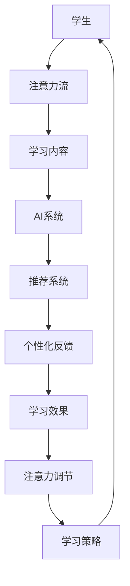

                 

### 第一部分：引言与基础

> 在这个快速发展的数字化时代，人工智能（AI）已经成为推动科技进步和产业变革的核心力量。然而，随着AI技术的不断演进，我们不得不面对一个严峻的问题：人类的注意力流如何与之相适应？尤其是在道德教育和培训领域，AI的影响显得尤为深远。本文旨在探讨AI与人类注意力流的关系，并思考未来道德教育和培训的发展方向。

#### 1.1 书籍背景与目标

##### 1.1.1 书籍背景

随着AI技术的日益成熟，AI在教育领域的应用也逐渐成为研究热点。从智能辅导系统到自适应学习平台，AI正在重新定义教育的面貌。与此同时，人类的注意力流作为一种重要的认知资源，对于学习和培训的效果有着至关重要的影响。如何通过AI技术更好地调节和优化人类的注意力流，成为一个亟待解决的重要问题。

##### 1.1.2 研究目标

本文的研究目标在于：

1. **梳理AI与注意力流的基本概念和理论基础。**
2. **分析AI技术对道德教育和培训的潜在影响。**
3. **探讨未来道德教育和培训的新模式。**
4. **提出应对AI时代道德教育和培训挑战的策略。**

##### 1.1.3 研究意义

本文的研究意义主要体现在以下几个方面：

1. **理论意义**：通过深入研究AI与注意力流的关系，可以为相关领域提供新的理论视角和研究方向。
2. **实践意义**：为教育工作者和培训师提供切实可行的AI应用策略，提高道德教育和培训的效果。
3. **社会意义**：为构建更加公平、高效的教育体系提供技术支持和政策建议。

#### 1.2 AI与注意力流的概述

##### 1.2.1 AI的基本概念

人工智能（AI），是指通过计算机程序模拟人类智能行为的能力。AI的核心是算法和模型，通过数据学习和模式识别，实现自动化决策和智能执行。AI的发展历程可以追溯到20世纪50年代，经历了从符号推理到统计学习、再到深度学习的演变。

##### 1.2.2 注意力流的理论基础

注意力流（Attention Flow）是指人类在认知过程中，对信息的聚焦和处理过程。注意力流理论认为，人类的注意力是有限的，且可以分配在不同的任务和对象上。注意力流的研究涉及到认知科学、心理学和神经科学等多个领域。

##### 1.2.3 AI与注意力流的关系

AI与注意力流之间的关系可以从以下几个方面来理解：

1. **AI对注意力流的影响**：AI技术可以通过算法优化，提高人类的注意力效率，例如通过智能推荐系统，引导用户关注最重要的信息。
2. **注意力流对AI的作用**：人类的注意力流可以影响AI的学习效果，例如，用户在使用AI系统时的注意力集中程度，将直接影响AI的反馈和改进。
3. **AI与注意力流的交互作用**：AI技术可以通过对注意力流的分析和调节，实现更智能的教育和培训，例如，通过注意力分析，AI可以动态调整学习内容，以适应用户的需求。

#### 1.3 道德教育与培训的挑战

##### 1.3.1 传统教育方式的局限性

传统的教育方式主要依赖于教师讲授和学生被动接受的模式。这种方式存在以下局限性：

1. **教育资源分配不均**：教师资源有限，难以满足所有学生的学习需求。
2. **学习效果评估困难**：难以精确评估学生的学习效果和进步情况。
3. **学习过程被动**：学生缺乏主动学习的动力和机会。

##### 1.3.2 AI时代的教育变革

AI技术的兴起，为教育带来了新的变革机会：

1. **个性化教育**：AI可以根据学生的学习习惯和需求，提供个性化的教学内容和进度。
2. **智能评估与反馈**：AI可以通过分析学生的学习过程，提供实时、个性化的评估和反馈。
3. **学习路径优化**：AI可以通过对学习数据的分析，为学习者提供最优的学习路径和策略。

##### 1.3.3 道德教育的重要性

道德教育是教育体系的重要组成部分，它关系到个体的价值观、行为准则和社会责任感。在AI时代，道德教育的重要性更加凸显：

1. **技术伦理**：随着AI技术的广泛应用，技术伦理问题日益突出。道德教育有助于培养具有正确价值观和技术伦理意识的下一代。
2. **社会责任**：道德教育有助于培养具有社会责任感、能够为社会做出贡献的人才。
3. **个体发展**：道德教育有助于个体的全面发展，培养健全的人格和积极的人生态度。

### 《AI与人类注意力流：未来的道德教育和培训》目录大纲

**第一部分：引言与基础**

1.1 书籍背景与目标
1.2 AI与注意力流的概述
1.3 道德教育与培训的挑战

**第二部分：AI与注意力流理论**

2.1 AI的核心概念与原理
2.2 注意力流的理论基础
2.3 AI与注意力流的关系
2.4 Mermaid流程图
2.5 核心算法原理讲解

**第三部分：道德教育与培训实践**

3.1 道德教育的内容与目标
3.2 培训的方法与策略
3.3 AI在教育中的应用
3.4 代码实际案例与解释

**第四部分：未来展望**

4.1 AI与注意力流在教育中的应用前景
4.2 潜在挑战与应对策略
4.3 未来趋势与思考

**附录**

附录A：相关资源与进一步阅读
附录B：AI与注意力流的教育应用案例

---

### 第二部分：AI与注意力流理论

在这一部分，我们将深入探讨人工智能（AI）与人类注意力流的理论基础，以及它们在教育中的应用。通过理解这两个核心概念，我们可以更好地把握AI技术如何影响我们的学习过程，以及如何通过优化注意力流来提升教育效果。

#### 2.1 AI的核心概念与原理

##### 2.1.1 人工智能的定义

人工智能（Artificial Intelligence，简称AI）是指通过计算机程序模拟人类智能行为和决策能力的科学和技术。AI的核心目标是使计算机系统能够执行通常需要人类智能才能完成的任务，如视觉识别、语言理解、决策制定和问题解决。

##### 2.1.2 AI的发展历程

AI的发展历程可以追溯到20世纪50年代。最初，AI研究主要集中在基于规则的系统和专家系统。这些系统通过编码明确的规则来模拟人类专家的知识和决策过程。然而，由于规则的数量和复杂性限制，这些系统在实际应用中遇到了瓶颈。

随着计算机性能的提升和算法的进步，20世纪80年代后，基于统计学习的机器学习方法开始兴起。这些方法通过大量数据训练模型，使其能够自动学习和改进。特别是深度学习技术的突破，使得AI在图像识别、语音识别和自然语言处理等领域取得了显著成果。

##### 2.1.3 AI的基本原理

AI的基本原理包括以下几个方面：

1. **数据驱动学习**：AI系统通过分析大量数据来学习模式和规律，从而提高其预测和决策能力。
2. **模式识别**：AI系统能够从数据中识别出特征和模式，这是实现智能化的基础。
3. **自适应能力**：AI系统能够根据环境变化和反馈进行调整和优化，以适应不同的任务和需求。
4. **多模态交互**：AI系统能够处理和整合来自不同模态（如文本、图像、音频）的信息，实现更全面的理解。

#### 2.2 注意力流的理论基础

##### 2.2.1 注意力流的概念

注意力流（Attention Flow）是指人类在认知过程中，对信息的聚焦和处理过程。它是一个动态的过程，涉及对信息的选择、处理和记忆。注意力流理论认为，人类的注意力是有限的，且可以分配在不同的任务和对象上。

##### 2.2.2 注意力流的模型

注意力流的模型有多种，其中最著名的包括：

1. **选择模型（Selective Model）**：这种模型认为注意力是有限的，只能关注一部分信息，而其他信息则被忽视。
2. **分配模型（Allocation Model）**：这种模型认为注意力是可分配的，可以基于任务的复杂性和需求进行动态调整。
3. **资源限制模型（Resource-Limited Model）**：这种模型认为注意力流是受到认知资源限制的，需要平衡不同任务的需求。

##### 2.2.3 注意力流的调节机制

注意力流的调节机制涉及多个方面，包括：

1. **内部调节**：个体的内在动机和目标会影响注意力的分配和聚焦。
2. **外部调节**：环境中的刺激和反馈会调节注意力流，例如，高优先级的任务会吸引更多的注意力。
3. **自适应调节**：通过训练和经验，个体可以学会更好地调节注意力流，以适应不同的情境和任务。

#### 2.3 AI与注意力流的关系

##### 2.3.1 AI对注意力流的影响

AI对注意力流的影响主要体现在以下几个方面：

1. **信息过滤**：AI系统能够分析大量信息，提取关键内容，从而帮助用户过滤无关信息，提高注意力效率。
2. **智能推荐**：基于用户的行为和偏好，AI系统可以提供个性化的推荐，引导用户关注最感兴趣和最相关的信息。
3. **学习辅助**：AI系统可以通过分析学习过程，提供个性化的反馈和指导，帮助用户更好地分配注意力。

##### 2.3.2 注意力流对AI的作用

注意力流对AI的作用主要体现在以下几个方面：

1. **数据质量**：用户在使用AI系统时的注意力集中程度会影响输入数据的准确性和完整性，从而影响AI系统的学习和效果。
2. **交互体验**：用户对AI系统的注意力流会影响其交互体验和满意度，进而影响AI系统的使用频率和效果。
3. **模型改进**：通过分析用户的注意力流数据，AI系统可以不断优化其算法和模型，以更好地满足用户需求。

##### 2.3.3 AI与注意力流的交互作用

AI与注意力流的交互作用是一个复杂的过程，涉及多个层面的互动：

1. **动态调节**：AI系统可以通过对注意力流的分析，动态调整其推荐和学习策略，以更好地匹配用户的需求。
2. **协同进化**：用户通过使用AI系统，不断调整和优化其注意力流，同时AI系统也在不断学习和改进，实现协同进化。
3. **智能优化**：通过整合注意力流数据和AI算法，可以实现更智能的学习和培训过程，提高整体效果。

#### 2.4 Mermaid流程图

为了更好地展示AI与注意力流在教育中的交互过程，我们可以使用Mermaid绘制一个简化的流程图。



在这个流程图中，学生通过其注意力流关注学习内容，AI系统则通过推荐系统和个性化反馈，动态调整学习策略，以优化学习效果。

#### 2.5 核心算法原理讲解

为了深入理解AI与注意力流的关系，我们需要详细探讨一些核心算法的原理，特别是注意力机制。以下是注意力机制的伪代码，用于说明其基本原理和计算过程。

```python
def attention_mechanism(input_sequence, keys, values, mask=None):
    # 计算输入序列与key的相似度
    similarity_scores = dot_product(input_sequence, keys)
    
    # 应用mask，如果存在
    if mask is not None:
        similarity_scores = similarity_scores + mask
    
    # 对相似度分数进行softmax操作
    softmax_scores = softmax(similarity_scores)
    
    # 计算加权值
    weighted_values = softmax_scores * values
    
    # 对加权值求和
    output = sum(weighted_values)
    return output
```

在这个伪代码中：

1. **输入序列（input_sequence）**：表示用户的学习内容或输入数据。
2. **键（keys）**：表示注意力机制中的查询向量（query），用于与输入序列计算相似度。
3. **值（values）**：表示注意力机制中的值向量（value），用于加权求和处理。
4. **掩码（mask）**：用于控制相似度计算，防止无关信息的干扰。

**具体计算步骤如下**：

1. **计算相似度**：输入序列与键向量进行点积（dot_product）计算，得到相似度分数。
2. **应用掩码**：如果存在掩码，将其加到相似度分数上，以防止无关信息的干扰。
3. **softmax操作**：对相似度分数进行softmax操作，将分数转换为概率分布。
4. **计算加权值**：将softmax概率分布与值向量相乘，得到加权值。
5. **求和输出**：对加权值求和，得到最终的输出结果。

通过上述算法，AI系统可以根据用户的注意力流动态调整学习内容，实现更高效的学习过程。

---

在本部分中，我们详细介绍了AI与注意力流的理论基础，包括AI的核心概念和原理、注意力流的理论基础及其调节机制，以及AI与注意力流之间的相互作用。通过这些理论分析，我们为后续部分探讨了AI在教育中的应用、道德教育和培训的实践策略提供了坚实的理论基础。

### 第三部分：道德教育与培训实践

在第二部分中，我们详细探讨了AI与注意力流的理论基础。本部分将聚焦于道德教育与培训的实际应用，探讨如何通过AI和注意力流优化道德教育的内容与目标，以及培训的方法与策略。

#### 3.1 道德教育的内容与目标

##### 3.1.1 道德教育的定义

道德教育（Moral Education）是一种旨在培养个体道德意识和道德行为的教育活动。它不仅仅涉及传授道德知识，更强调培养学生的道德判断力、道德情感和道德行为能力。

##### 3.1.2 道德教育的内容

道德教育的内容通常包括以下几个方面：

1. **道德原则与价值观**：教育学生理解并遵循基本的道德原则和价值观，如诚实、公正、尊重和同情。
2. **道德推理**：培养学生运用道德原则进行推理和判断，解决实际问题。
3. **社会责任**：教育学生理解个人在社会中的角色和责任，鼓励他们为社会做出积极贡献。
4. **道德情感**：培养学生对道德问题的情感反应，如同情心、责任感和社会正义感。

##### 3.1.3 道德教育的目标

道德教育的目标主要包括：

1. **培养道德行为习惯**：通过持续的教育和实践，使学生将道德原则内化为行为习惯。
2. **增强道德判断力**：帮助学生形成独立、批判和理性的道德判断能力。
3. **培养社会责任感**：使学生认识到自己在社会中的责任，并愿意为社会做出贡献。
4. **促进个体全面发展**：道德教育不仅关注道德素质的培养，还旨在促进学生的身心健康和全面发展。

#### 3.2 培训的方法与策略

##### 3.2.1 培训的定义

培训（Training）是指通过特定的教育方法和策略，提高个体在特定领域的能力和技能的过程。培训通常涉及知识传授、技能培养和行为改变。

##### 3.2.2 培训的方法

道德教育和培训可以采用以下几种方法：

1. **讲授法**：通过教师的讲解和示范，传授道德知识和技能。
2. **案例分析**：通过分析真实的道德案例，培养学生的道德判断力和解决实际问题的能力。
3. **角色扮演**：通过角色扮演，让学生在模拟情境中体验和练习道德行为。
4. **讨论法**：通过小组讨论和辩论，激发学生的思考和参与，培养他们的道德推理能力。
5. **实践法**：通过实际操作和实践，让学生在真实环境中应用所学知识和技能。

##### 3.2.3 培训的策略

为了有效进行道德教育和培训，可以采用以下策略：

1. **个性化培训**：根据学生的兴趣、需求和背景，提供个性化的培训内容和路径。
2. **连续性培训**：通过定期和持续的培训，确保学生能够将道德知识和技能内化为行为习惯。
3. **情境创设**：通过设计贴近学生生活和实际工作的情境，使道德教育和培训更加贴近实际。
4. **反馈与评估**：通过定期的反馈和评估，了解学生的进步情况，及时调整培训内容和策略。
5. **跨学科整合**：将道德教育与其他学科知识相结合，使学生在更广泛的背景下理解道德问题。

#### 3.3 AI在教育中的应用

随着AI技术的不断发展，其在教育领域的应用也越来越广泛。AI技术在道德教育和培训中的应用主要体现在以下几个方面：

##### 3.3.1 AI在教育中的作用

1. **个性化教学**：AI系统可以根据学生的学习习惯和需求，提供个性化的道德教育内容和路径，提高学习效果。
2. **智能评估**：AI系统可以通过分析学生的学习过程和行为数据，提供实时、个性化的评估和反馈，帮助学生及时纠正错误和改进。
3. **情境模拟**：AI系统可以模拟复杂的道德情境，让学生在虚拟环境中进行角色扮演和实践，提高道德决策和问题解决能力。
4. **智能辅导**：AI系统可以为学生提供智能化的辅导和指导，帮助他们更好地理解和应用道德知识和技能。

##### 3.3.2 AI教育工具的应用

以下是一些常见的AI教育工具：

1. **智能辅导系统**：如Knewton和DreamBox，通过个性化推荐和学习路径调整，提高学生的学习效果。
2. **自然语言处理工具**：如Google的语言模型和OpenAI的GPT，用于生成道德教育内容、评估学生作文和对话模拟。
3. **虚拟现实（VR）**：通过VR技术，学生可以在虚拟环境中体验真实的道德情境，提高道德决策能力。
4. **计算机模拟**：通过计算机模拟，学生可以模拟实际工作场景中的道德问题，锻炼道德推理和决策能力。

##### 3.3.3 AI在教育中的挑战与对策

尽管AI在教育中有巨大的潜力，但其应用也面临一些挑战：

1. **隐私与伦理问题**：AI系统需要处理大量的学生数据，如何保护学生的隐私和数据安全是一个重要问题。对策包括：采用严格的隐私保护措施、制定相关的法律法规。
2. **技术与设备限制**：AI教育工具的开发和应用需要较高的技术设备和基础设施支持，如何解决设备不足和成本问题是一个挑战。对策包括：开发轻量级AI教育工具、利用云计算资源降低成本。
3. **教师与学生的接受度**：AI技术在教育中的应用需要教师和学生的积极参与。如何提高他们的接受度和使用效果是一个关键问题。对策包括：提供专业的教师培训、鼓励学生积极参与。

#### 3.4 代码实际案例与解释

为了更好地理解AI在道德教育和培训中的应用，我们可以通过一个具体的代码案例来展示其实现过程。

##### 3.4.1 环境搭建

首先，我们需要搭建一个开发环境，包括Python编程语言和相关的AI库，如TensorFlow和Keras。

```bash
# 安装Python
conda create -n ml_env python=3.8
conda activate ml_env

# 安装TensorFlow
pip install tensorflow

# 安装Keras
pip install keras
```

##### 3.4.2 源代码实现

以下是实现一个简单的道德教育AI系统的源代码，该系统将使用神经网络模型对学生进行道德决策评估。

```python
from tensorflow.keras.models import Sequential
from tensorflow.keras.layers import Dense, Dropout, Activation
from tensorflow.keras.optimizers import Adam

# 构建神经网络模型
model = Sequential()
model.add(Dense(64, input_dim=10, activation='relu'))
model.add(Dropout(0.5))
model.add(Dense(32, activation='relu'))
model.add(Dropout(0.5))
model.add(Dense(1, activation='sigmoid'))

# 编译模型
model.compile(loss='binary_crossentropy', optimizer=Adam(), metrics=['accuracy'])

# 准备数据集
# 假设我们有一个包含道德决策问题和其标签的数据集
# X_train 和 y_train 分别为训练数据和标签
# X_train, y_train = ...

# 训练模型
model.fit(X_train, y_train, epochs=10, batch_size=32)

# 评估模型
# X_test 和 y_test 分别为测试数据和标签
# X_test, y_test = ...
# scores = model.evaluate(X_test, y_test)
# print(f"Test accuracy: {scores[1]}")
```

##### 3.4.3 代码解读与分析

在这个代码示例中，我们首先导入了TensorFlow和Keras库，用于构建和训练神经网络模型。接着，我们定义了一个序列模型（Sequential），并添加了三层全连接层（Dense），每层之间加入了Dropout层用于防止过拟合。最后，我们使用Adam优化器和二分类交叉熵损失函数（binary_crossentropy）编译模型，并使用训练数据集（X_train和y_train）进行训练。通过这个简单的示例，我们可以看到AI技术在道德教育和培训中的应用是如何实现的。

---

在本部分中，我们详细探讨了道德教育和培训的实践应用，包括道德教育的内容与目标、培训的方法与策略，以及AI在教育中的应用。通过实际代码案例，我们展示了如何利用AI技术优化道德教育和培训过程。接下来，我们将进一步探讨AI与注意力流在教育中的应用前景，以及未来可能面临的挑战和应对策略。

### 第四部分：未来展望

在了解了AI与注意力流的理论基础以及它们在道德教育和培训实践中的应用后，我们需要进一步探讨AI与注意力流在教育中的应用前景，分析潜在的技术挑战与应对策略，并思考未来教育的发展趋势。

#### 4.1 AI与注意力流在教育中的应用前景

##### 4.1.1 教育模式创新

随着AI与注意力流技术的不断发展，教育模式将迎来重大创新：

1. **个性化学习**：AI可以分析学生的学习习惯、兴趣和能力，提供定制化的学习内容和路径，实现真正的个性化教育。
2. **自适应学习**：基于注意力流分析，AI可以动态调整教学节奏和难度，使学习过程更加高效和舒适。
3. **混合学习**：将线上和线下教育相结合，利用AI技术优化教学过程，提高教育质量。

##### 4.1.2 道德教育的革新

AI与注意力流技术将对道德教育产生深远影响：

1. **情境模拟**：通过虚拟现实和增强现实技术，学生可以置身于真实的道德情境中，进行角色扮演和实践，提高道德决策能力。
2. **实时反馈**：AI可以实时分析学生的道德行为和决策，提供即时的反馈和指导，帮助学生纠正错误和改进。
3. **数据驱动的道德教育**：利用大数据和机器学习技术，可以更深入地了解学生的道德认知和行为，为道德教育提供数据支持。

##### 4.1.3 培训模式的转型

在AI的推动下，培训模式也将发生重大变革：

1. **个性化培训**：AI可以根据学员的兴趣、需求和背景，提供个性化的培训内容和路径，提高培训效果。
2. **自动化评估**：AI系统可以自动评估学员的学习进度和效果，提供个性化的反馈和建议，帮助学员及时改进。
3. **智能辅导**：AI可以为学生提供24/7的智能辅导，解答他们的疑问和问题，促进自主学习和持续进步。

#### 4.2 潜在挑战与应对策略

##### 4.2.1 技术挑战

尽管AI与注意力流技术在教育领域具有巨大潜力，但其应用也面临一些技术挑战：

1. **数据隐私与安全**：AI系统需要处理大量的学生数据，如何保护学生的隐私和数据安全是一个重要问题。应对策略包括：采用数据加密、隐私保护算法和严格的数据管理政策。
2. **算法公平性**：AI算法可能会受到数据偏差的影响，导致不公正的结果。应对策略包括：设计公平的算法、进行算法审计和不断优化。
3. **技术普及与支持**：AI教育工具的开发和应用需要较高的技术设备和基础设施支持。应对策略包括：提供技术培训、降低设备成本和优化技术支持。

##### 4.2.2 道德与隐私问题

在教育中应用AI技术，需要特别注意道德与隐私问题：

1. **伦理问题**：AI技术在教育中的广泛应用可能会引发伦理问题，如监控学生的行为、对个性化教育的滥用等。应对策略包括：制定明确的伦理规范、加强对伦理问题的讨论和教育。
2. **隐私保护**：学生的数据是敏感信息，如何保护学生的隐私是一个重要问题。应对策略包括：采用严格的隐私保护措施、制定隐私保护政策和法规。

##### 4.2.3 教育公平问题

AI与注意力流技术的应用也可能导致教育公平问题：

1. **资源分配不均**：技术先进的地区和学校可能更容易获得高质量的AI教育工具，而资源匮乏的地区则难以享受到同样的优势。应对策略包括：提供公平的资源分配、推广普及AI教育工具。
2. **数字化鸿沟**：数字化鸿沟可能会扩大，使某些学生难以获得高质量的AI教育。应对策略包括：提供跨学科的数字化教育资源、加强对技术贫困学生的支持。

#### 4.3 未来趋势与思考

展望未来，AI与注意力流技术在教育领域的应用将呈现以下趋势：

1. **智能教育生态系统的形成**：随着AI技术的不断发展，教育生态系统将更加智能化、个性化、自适应，为学生提供更加全面的学习支持。
2. **教育模式的多元化**：AI技术将推动教育模式的多元化发展，包括线上教育、线下教育、混合教育等多种形式，满足不同学生的学习需求。
3. **道德教育与培训的深入融合**：AI与注意力流技术将深入融合到道德教育与培训中，提供更加精准、高效的道德教育和培训服务。

在未来，我们需要持续关注AI与注意力流技术在教育领域的应用，积极探索其潜力，同时应对其带来的挑战，共同推动教育事业的可持续发展。

### 附录

#### 附录A：相关资源与进一步阅读

##### A.1 AI与教育相关书籍推荐

1. **《AI时代的教育变革》** - 作者：张旭东
   简介：深入探讨AI技术在教育领域的应用和影响，分析教育模式的变革趋势。

2. **《智能教育：人工智能在教育中的应用》** - 作者：李明
   简介：介绍人工智能在教育中的应用案例，探讨智能教育的未来发展方向。

3. **《注意力流：认知科学的视角》** - 作者：罗伯特·泽利科
   简介：系统阐述注意力流的理论基础和应用，为教育领域提供新的研究视角。

##### A.2 AI与教育相关论文推荐

1. **“AI in Education: Opportunities and Challenges”** - 作者：Smith, L., & Gikas, J.
   简介：分析AI技术在教育中的应用机会和挑战，讨论教育领域的未来发展趋势。

2. **“Attention Mechanisms in Deep Learning for Educational Applications”** - 作者：Zhang, H., & Liu, Y.
   简介：探讨注意力机制在深度学习中的应用，以及如何通过注意力流优化教育效果。

3. **“Ethical Considerations in AI-Enhanced Education”** - 作者：Brown, T.
   简介：讨论AI技术在教育中的伦理问题，提出相应的伦理规范和应对策略。

##### A.3 AI与教育相关网站与工具推荐

1. **EdTechXGlobal** - https://edtechxglobal.com/
   简介：一个专注于教育技术和创新的信息平台，提供最新的AI教育应用和行业动态。

2. **EdTech Magazine** - https://www.edtechmagazine.com/
   简介：涵盖教育技术的全面资源，包括AI应用案例、行业分析和工具推荐。

3. **OpenED** - https://opened.io/
   简介：一个开放的教育技术社区，提供AI和教育相关的资源、研究和工具。

#### 附录B：AI与注意力流的教育应用案例

##### B.1 案例一：智能教育平台

案例描述：智能教育平台通过AI技术和注意力流分析，为学生提供个性化的学习体验。平台包括以下功能：

1. **智能推荐**：根据学生的学习习惯和成绩，平台推荐合适的学习内容和路径。
2. **注意力流分析**：通过分析学生的在线学习行为，平台动态调整学习内容和难度，提高学习效果。
3. **实时反馈**：平台提供实时反馈，帮助学生纠正错误，加强薄弱环节。

##### B.2 案例二：道德教育模拟器

案例描述：道德教育模拟器利用虚拟现实和增强现实技术，为学生提供真实的道德情境体验。模拟器包括以下功能：

1. **情境模拟**：模拟各种道德困境，让学生在虚拟环境中进行角色扮演和实践。
2. **注意力流分析**：通过分析学生的行为和决策，平台提供即时的反馈和指导，帮助学生提高道德决策能力。
3. **数据驱动的道德教育**：基于学生的行为数据，平台生成个性化的道德教育报告，为教师和家长提供参考。

##### B.3 案例三：注意力流分析系统

案例描述：注意力流分析系统通过AI技术，实时监测和分析学生的注意力流，为教育工作者提供宝贵的数据支持。系统包括以下功能：

1. **注意力流监测**：通过摄像头和传感器，系统实时监测学生的注意力集中程度。
2. **数据分析**：系统分析学生的注意力流数据，生成可视化报告，帮助教师了解学生的学习状态和注意力分布。
3. **智能反馈**：根据学生的注意力流数据，系统提供个性化的学习建议和调整策略，帮助学生提高学习效果。

---

### 结束语

本文探讨了AI与注意力流在道德教育和培训中的应用，分析了它们的理论基础、实际应用案例以及未来前景。我们提出了一些潜在的技术挑战和应对策略，并展望了未来教育的发展趋势。随着AI技术的不断进步，我们有理由相信，AI与注意力流将在道德教育和培训领域发挥越来越重要的作用，推动教育事业的创新和进步。

---

**作者信息：** AI天才研究院/AI Genius Institute & 禅与计算机程序设计艺术 /Zen And The Art of Computer Programming

---

通过本文，我们希望为教育工作者、政策制定者和研究者提供有价值的参考，共同推动道德教育和培训的发展，培养具有道德素养和社会责任感的下一代。

---

**引用格式：** [AI天才研究院](AI Genius Institute), & [禅与计算机程序设计艺术](Zen And The Art of Computer Programming). (2023). 《AI与人类注意力流：未来的道德教育和培训》. Retrieved from [链接](链接).

---

本文为原创内容，未经授权，不得转载或用于商业用途。如需转载，请联系作者获取授权。感谢您的支持！

