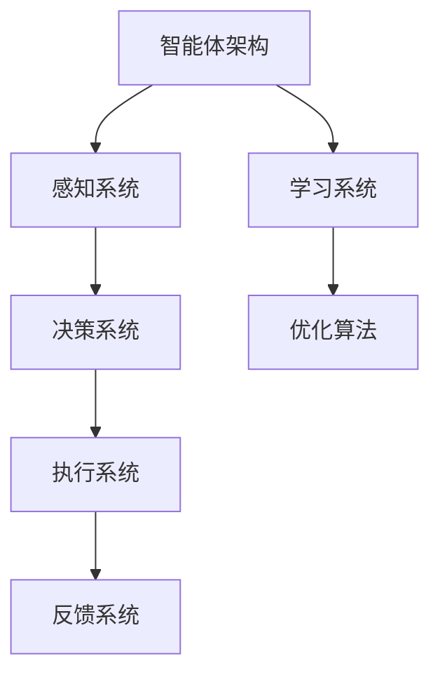

                 

### 《AI人工智能 Agent：资源配置中智能体的应用》

---

关键词：人工智能，智能体，资源配置，机器学习，负载均衡，资源调度，能源管理。

摘要：本文深入探讨了人工智能（AI）中的智能体概念，以及智能体在资源配置中的应用。文章从AI的基础知识出发，逐步介绍智能体的定义、架构和核心算法，然后详细阐述了智能体在资源调度、负载均衡和能源管理中的实际应用，并通过案例研究展示了智能体技术的实际效果。最后，文章展望了AI智能体的未来趋势和面临的挑战，为读者提供了一个全面的技术视角。

---

### 第一部分：AI基础知识与智能体概述

#### 第1章: AI与智能体基础

#### 1.1 AI的起源与发展

##### 1.1.1 人工智能的定义与发展历程

人工智能（Artificial Intelligence，简称AI）是指由人制造出来的系统能够执行需要人类智能才能完成的任务的学科。人工智能的历史可以追溯到20世纪50年代，当时计算机科学家艾伦·图灵提出了“图灵测试”，用来评估机器是否具有智能。

发展历程可以分为以下几个阶段：

1. **初始阶段（1950-1969）**：人工智能的概念首次被提出，图灵测试作为评估标准。
2. **黄金时代（1970-1989）**：人工智能领域取得了一些突破性进展，例如专家系统和自然语言处理。
3. **低谷时期（1990-2010）**：由于技术限制和实际应用的困难，人工智能领域进入了一个相对低迷的时期。
4. **复兴时期（2010至今）**：随着深度学习和其他人工智能技术的发展，人工智能再次成为研究热点。

##### 1.1.2 人工智能的关键技术

人工智能的关键技术包括：

1. **机器学习**：机器学习是一种让计算机通过数据学习并做出决策的技术。
2. **深度学习**：深度学习是机器学习的一种方法，通过构建多层神经网络进行学习。
3. **自然语言处理**：自然语言处理是一种使计算机能够理解、生成和处理自然语言的技术。
4. **计算机视觉**：计算机视觉是一种使计算机能够“看”和理解图像和视频的技术。

##### 1.1.3 人工智能的应用场景

人工智能在各个领域都有广泛的应用，包括：

1. **医疗健康**：用于疾病诊断、药物研发和个性化医疗等。
2. **金融服务**：用于风险评估、欺诈检测和智能投资等。
3. **智能制造**：用于工业自动化、质量控制和生产优化等。
4. **智能交通**：用于自动驾驶、交通流量控制和智能导航等。

#### 1.2 智能体概念与架构

##### 1.2.1 智能体的定义与分类

智能体（Agent）是指能够感知环境、自主决策并采取行动的人工智能实体。根据智能体的自主性、学习能力和社交性，可以将其分为以下几类：

1. **有意识智能体**：具有自主意识和学习能力，能够理解自身和环境。
2. **半自动化智能体**：部分自主决策，需要人类干预。
3. **自动化智能体**：完全自主决策，无需人类干预。

##### 1.2.2 智能体的基本架构

智能体的基本架构通常包括以下几个部分：

1. **感知系统**：用于感知环境的信息。
2. **决策系统**：根据感知到的信息做出决策。
3. **执行系统**：执行决策结果。
4. **学习系统**：通过学习提高智能体的性能。

##### 1.2.3 智能体与AI的关系

智能体是AI技术在实际应用中的重要组成部分。智能体通过感知、决策和学习，实现自主行动和优化，从而实现AI的目标。智能体技术可以应用于各种领域，如资源调度、负载均衡和能源管理，提高系统的效率和稳定性。

#### 1.3 AI智能体在资源配置中的应用前景

##### 1.3.1 资源配置中的挑战

资源配置是指在给定的约束条件下，将有限的资源分配给各种任务或活动，以实现最大化的效益。然而，资源配置面临以下挑战：

1. **复杂性**：资源配置问题通常具有高度复杂性，涉及多个变量和约束条件。
2. **不确定性**：实际环境中存在许多不确定性因素，如需求波动、故障等。
3. **动态性**：资源配置问题通常是动态变化的，需要实时调整。

##### 1.3.2 AI智能体在资源配置中的优势

AI智能体在资源配置中具有以下优势：

1. **高效性**：智能体可以快速分析大量数据，识别最优资源配置方案。
2. **适应性**：智能体可以根据环境变化动态调整资源配置策略。
3. **自优化**：智能体通过学习不断优化资源配置策略，提高系统性能。

##### 1.3.3 AI智能体应用的未来展望

随着AI技术的发展，智能体在资源配置中的应用前景十分广阔。未来，智能体技术将进一步提高资源配置的效率，降低成本，并推动相关领域的创新和发展。

### 第二部分：AI智能体技术原理与实现

#### 第2章: AI智能体核心技术原理

#### 2.1 机器学习基础

##### 2.1.1 机器学习的基本概念

机器学习是一种通过数据驱动的方式使计算机自动学习和改进的技术。机器学习的基本过程包括：

1. **数据收集**：收集大量相关数据。
2. **数据预处理**：对数据进行清洗、归一化等处理。
3. **模型训练**：使用训练数据训练模型。
4. **模型评估**：使用测试数据评估模型性能。
5. **模型优化**：根据评估结果调整模型参数。

##### 2.1.2 监督学习算法

监督学习是一种机器学习方法，通过已知的输入输出数据来训练模型。常见的监督学习算法包括：

1. **线性回归**：用于预测线性关系。
2. **逻辑回归**：用于分类问题。
3. **支持向量机（SVM）**：用于分类和回归问题。
4. **决策树**：用于分类和回归问题。

##### 2.1.3 无监督学习算法

无监督学习是一种机器学习方法，没有已知的输入输出数据。常见的无监督学习算法包括：

1. **聚类算法**：用于将数据分为不同的组。
2. **降维算法**：用于减少数据维度。
3. **关联规则学习**：用于发现数据之间的关联关系。

##### 2.1.4 强化学习算法

强化学习是一种机器学习方法，通过试错和奖励机制来学习策略。常见的强化学习算法包括：

1. **Q-learning**：通过迭代更新Q值来学习最优策略。
2. **SARSA**：基于经验重放和优势值迭代学习策略。
3. **深度强化学习**：使用深度神经网络进行状态值函数或策略学习。

#### 2.2 智能体行为模型

##### 2.2.1 行为模型的定义与作用

行为模型是指智能体在环境中进行行为决策的模型。行为模型的作用是：

1. **感知环境**：通过传感器收集环境信息。
2. **决策**：根据环境信息和已学习到的策略进行决策。
3. **执行**：执行决策结果。
4. **反馈**：根据执行结果调整策略。

##### 2.2.2 行为决策过程

行为决策过程包括以下几个步骤：

1. **感知**：收集环境信息。
2. **分析**：对感知到的信息进行分析。
3. **决策**：根据分析结果和已学习到的策略进行决策。
4. **执行**：执行决策结果。
5. **评估**：根据执行结果评估策略效果。

##### 2.2.3 行为模型设计与实现

行为模型的设计与实现需要考虑以下几个因素：

1. **感知系统**：选择合适的传感器和采集方法。
2. **决策系统**：设计合适的决策策略和算法。
3. **执行系统**：实现决策结果的执行。
4. **反馈系统**：设计反馈机制，以实现策略的持续优化。

#### 2.3 智能体学习算法

##### 2.3.1 智能体学习算法概述

智能体学习算法是指用于训练智能体行为模型的算法。常见的智能体学习算法包括：

1. **基于规则的算法**：使用规则库进行决策。
2. **基于模型的算法**：使用模型进行决策。
3. **基于实例的算法**：通过实例学习和迁移学习进行决策。

##### 2.3.2 经验重放与优势值迭代算法

经验重放与优势值迭代算法是一种基于强化学习的智能体学习算法。其主要思想是：

1. **经验重放**：将历史经验进行重放，以减少样本偏差。
2. **优势值迭代**：使用优势值迭代更新策略。

##### 2.3.3 Q-learning与SARSA算法

Q-learning算法和SARSA算法是两种常见的经验重放与优势值迭代算法。以下是它们的伪代码：

##### Q-learning算法伪代码

```python
# Q-learning算法伪代码
initialize Q(s, a) randomly
for each episode do
    s = initial_state
    while not terminal_state(s) do
        a = choose_action(s, policy)
        next_s, reward = environment(s, a)
        Q(s, a) = Q(s, a) + alpha * (reward + gamma * max(Q(next_s, a')) - Q(s, a))
        s = next_s
        a' = choose_action(s, policy)
    end while
end for
```

##### SARSA算法伪代码

```python
# SARSA算法伪代码
initialize Q(s, a) randomly
for each episode do
    s = initial_state
    while not terminal_state(s) do
        a = choose_action(s, policy)
        next_s, reward = environment(s, a)
        Q(s, a) = Q(s, a) + alpha * (reward + gamma * Q(next_s, a') - Q(s, a))
        s = next_s
        a' = choose_action(s, policy)
    end while
end for
```

### 第三部分：AI智能体在资源配置中的应用

#### 第3章: AI智能体在资源调度中的应用

#### 3.1 资源调度概述

##### 3.1.1 资源调度的定义与意义

资源调度是指在计算机系统中，根据任务的需求和系统的资源状况，合理分配和调度资源的过程。资源包括CPU、内存、磁盘空间、网络带宽等。

资源调度的意义包括：

1. **提高系统性能**：通过合理调度资源，提高系统的响应速度和处理能力。
2. **优化资源利用率**：通过调度，提高资源的利用率，减少浪费。
3. **提高系统稳定性**：通过调度，确保系统在高峰期仍然能够稳定运行。

##### 3.1.2 资源调度算法分类

资源调度算法可以分为静态算法和动态算法。

1. **静态算法**：在系统启动时配置，后续不发生变化。常见的静态算法包括：

   - **固定优先级调度**：根据任务的优先级进行调度。
   - **轮转调度**：每个任务轮流占用资源。
   - **最短作业优先调度**：优先调度执行时间最短的任务。

2. **动态算法**：根据实时负载动态调整。常见的动态算法包括：

   - **响应比调度**：根据任务的响应比进行调度。
   - **基于公平共享的调度**：确保每个任务都有公平的执行机会。
   - **自适应调度**：根据系统负载动态调整调度策略。

##### 3.1.3 资源调度中的挑战

资源调度面临以下挑战：

1. **动态性**：系统的负载是动态变化的，调度算法需要能够实时适应。
2. **复杂性**：资源调度问题通常具有高度复杂性，需要考虑多个任务和资源的平衡。
3. **优化目标**：调度算法需要同时考虑多个优化目标，如响应时间、资源利用率等。

#### 3.2 智能体在资源调度中的应用

##### 3.2.1 智能体在资源调度中的角色

智能体在资源调度中扮演以下角色：

1. **感知器**：通过收集系统状态信息，了解系统的负载情况。
2. **决策器**：根据收集到的信息，决定如何调度资源。
3. **执行器**：执行调度决策，调整系统资源分配。
4. **评估器**：评估调度效果，反馈调度策略。

##### 3.2.2 智能体在资源调度中的行为模型

智能体在资源调度中的行为模型包括以下几个步骤：

1. **感知系统**：通过监控工具获取系统的负载数据。
2. **决策系统**：根据感知到的负载数据，使用强化学习算法计算出最优的调度策略。
3. **执行系统**：将调度策略应用到系统中，调整资源分配。
4. **反馈系统**：根据系统的实际运行效果，调整调度策略。

##### 3.2.3 智能体在资源调度中的优势

智能体在资源调度中具有以下优势：

1. **自适应**：智能体可以根据实时负载动态调整调度策略，提高系统的稳定性。
2. **高效性**：智能体可以快速分析大量数据，找到最优的调度方案，提高系统的性能。
3. **优化性**：智能体通过学习不断优化调度策略，提高资源利用率。

#### 3.3 智能体在资源调度中的案例研究

##### 3.3.1 案例背景

某互联网公司拥有大量服务器，需要处理来自全球的用户的请求。为了提高系统的性能和稳定性，公司决定采用智能体进行资源调度。

##### 3.3.2 智能体解决方案设计与实现

1. **智能体设计**：采用基于Q-learning算法的智能体，实时监测每个服务器的负载状况，并根据负载情况动态调整流量分配。
2. **实现细节**：
   - **感知系统**：通过监控工具获取每个服务器的负载数据。
   - **决策系统**：智能体根据Q-learning算法计算每个服务器的最优流量分配。
   - **执行系统**：将决策结果应用到实际的服务器上，调整流量分配。
   - **反馈系统**：智能体根据实际的负载变化调整策略。

##### 3.3.3 案例效果分析与总结

1. **效果分析**：通过实际运行数据显示，智能体解决方案在高峰期有效地降低了服务器的负载，提高了系统的响应速度和稳定性。
2. **总结**：智能体在资源调度中的应用显著提升了系统的性能，为大型互联网公司的云服务平台提供了可靠的技术支持。同时，也展示了AI智能体在资源配置中的应用潜力和价值。

### 第4章: AI智能体在负载均衡中的应用

#### 4.1 负载均衡概述

##### 4.1.1 负载均衡的定义与重要性

负载均衡是指将网络或系统的负载分布到多个服务器或设备上，以避免单点过载或故障。负载均衡的重要性体现在以下几个方面：

1. **提高系统性能**：通过将负载分布到多个服务器上，可以充分利用系统资源，提高系统的响应速度和处理能力。
2. **提高系统可用性**：通过负载均衡，当某个服务器出现故障时，可以将请求转移到其他正常服务器上，确保系统的持续运行。
3. **优化用户体验**：通过负载均衡，可以确保用户请求被快速响应，提高用户体验。

##### 4.1.2 负载均衡算法分类

负载均衡算法可以分为静态算法和动态算法。

1. **静态算法**：在系统启动时配置，后续不发生变化。常见的静态算法包括：

   - **轮询调度（Round Robin）**：按照固定的顺序将请求分配到服务器上。
   - **最小连接数调度（Least Connections）**：将请求分配到连接数最少的服务器上。

2. **动态算法**：根据实时负载动态调整。常见的动态算法包括：

   - **最小响应时间调度（Least Response Time）**：将请求分配到响应时间最短的服务器上。
   - **自适应调度**：根据服务器的负载状况动态调整请求分配。

##### 4.1.3 负载均衡中的挑战

负载均衡面临以下挑战：

1. **负载波动**：网络或系统的负载是动态变化的，需要算法能够快速适应。
2. **性能损失**：负载均衡会增加网络或系统的延迟，需要优化算法减少性能损失。
3. **容错性**：当某个服务器出现故障时，需要算法能够快速切换到其他服务器。

#### 4.2 智能体在负载均衡中的应用

##### 4.2.1 智能体在负载均衡中的角色

智能体在负载均衡中扮演以下角色：

1. **感知器**：通过收集服务器的负载数据，了解系统的负载状况。
2. **决策器**：根据感知到的负载数据，决定如何分配请求。
3. **执行器**：执行决策结果，将请求分配到服务器上。
4. **评估器**：评估负载均衡效果，调整策略。

##### 4.2.2 智能体在负载均衡中的行为模型

智能体在负载均衡中的行为模型包括以下几个步骤：

1. **感知系统**：通过监控工具获取服务器的负载数据。
2. **决策系统**：使用强化学习算法计算每个服务器的最优负载分配策略。
3. **执行系统**：根据决策结果，将请求分配到服务器上。
4. **反馈系统**：根据系统的实际运行效果，调整负载均衡策略。

##### 4.2.3 智能体在负载均衡中的优势

智能体在负载均衡中具有以下优势：

1. **自适应**：智能体可以根据实时负载动态调整负载均衡策略，提高系统的稳定性。
2. **高效性**：智能体可以快速分析大量数据，找到最优的负载分配方案，提高系统的性能。
3. **优化性**：智能体通过学习不断优化负载均衡策略，提高资源利用率。

#### 4.3 智能体在负载均衡中的案例研究

##### 4.3.1 案例背景

某大型互联网公司，其网站需要处理海量的用户请求，为了保证网站的稳定性和高性能，决定采用智能体进行负载均衡。

##### 4.3.2 智能体解决方案设计与实现

1. **智能体设计**：采用基于Q-learning算法的智能体，实时监测每个服务器的负载状况，并根据负载情况动态调整请求分配。
2. **实现细节**：
   - **感知系统**：通过监控工具获取每个服务器的负载数据。
   - **决策系统**：智能体根据Q-learning算法计算每个服务器的最优负载分配策略。
   - **执行系统**：根据决策结果，将用户请求分配到服务器上。
   - **反馈系统**：智能体根据用户的响应时间、服务器负载等数据，调整负载均衡策略。

##### 4.3.3 案例效果分析与总结

1. **效果分析**：通过实际运行数据显示，智能体解决方案在高峰期有效地降低了服务器的负载，提高了网站的响应速度和稳定性。
2. **总结**：智能体在负载均衡中的应用显著提升了系统的性能，为大型互联网公司的网站提供了可靠的技术支持。同时，也展示了AI智能体在资源配置中的应用潜力和价值。

### 第5章: AI智能体在能源管理中的应用

#### 5.1 能源管理概述

##### 5.1.1 能源管理的定义与意义

能源管理是指对能源的生产、传输、分配和消耗进行有效管理和优化，以实现能源的高效利用和可持续发展。能源管理的意义在于：

1. **降低成本**：通过优化能源使用，降低能源消耗，从而减少能源成本。
2. **提高效率**：通过合理的能源配置和利用，提高能源系统的整体效率。
3. **减少污染**：通过优化能源使用，减少能源消耗过程中的污染物排放。
4. **可持续发展**：通过能源管理，促进能源的可持续发展和利用。

##### 5.1.2 能源管理策略与工具

能源管理的主要策略和工具包括：

1. **能源审计**：对能源消耗进行详细审计，找出能源浪费的环节。
2. **能效监测**：通过实时监测和数据分析，掌握能源消耗情况。
3. **能源优化**：通过优化能源使用方式和流程，提高能源利用效率。
4. **能源调度**：根据实时负载和能源价格，动态调整能源使用策略。
5. **能源预测**：通过数据分析和模型预测，预测未来的能源需求和供应情况。

##### 5.1.3 能源管理中的挑战

能源管理面临以下挑战：

1. **复杂性**：能源管理涉及多个环节和因素，需要全面考虑。
2. **动态性**：能源需求和供应是动态变化的，需要实时调整管理策略。
3. **数据依赖**：能源管理需要大量数据支持，数据的准确性和实时性对管理效果有重要影响。

#### 5.2 智能体在能源管理中的应用

##### 5.2.1 智能体在能源管理中的角色

智能体在能源管理中扮演以下角色：

1. **感知器**：通过传感器和监测设备，获取能源系统的实时数据。
2. **决策器**：根据感知到的数据，决定能源的使用和调度策略。
3. **执行器**：执行决策结果，调整能源系统的运行状态。
4. **评估器**：评估决策效果，优化能源管理策略。

##### 5.2.2 智能体在能源管理中的行为模型

智能体在能源管理中的行为模型包括以下几个步骤：

1. **感知系统**：通过传感器和监测设备，实时获取能源系统的数据。
2. **决策系统**：使用机器学习和预测算法，分析数据并制定能源调度策略。
3. **执行系统**：根据决策系统制定的策略，调整能源系统的运行状态。
4. **反馈系统**：根据执行系统的实际运行效果，评估决策效果并反馈调整策略。

##### 5.2.3 智能体在能源管理中的优势

智能体在能源管理中具有以下优势：

1. **自适应**：智能体可以根据实时数据动态调整能源调度策略，提高系统的稳定性。
2. **高效性**：智能体可以快速分析大量数据，找到最优的能源调度方案，提高能源利用效率。
3. **优化性**：智能体通过学习不断优化能源管理策略，提高能源系统的整体性能。

#### 5.3 智能体在能源管理中的案例研究

##### 5.3.1 案例背景

某大型制造企业，其生产过程中需要大量能源，为了提高能源利用效率，降低能源成本，企业决定采用智能体进行能源管理。

##### 5.3.2 智能体解决方案设计与实现

1. **智能体设计**：采用基于Q-learning算法的智能体，实时监测生产过程中的能源消耗，并根据消耗情况动态调整能源使用策略。
2. **实现细节**：
   - **感知系统**：通过传感器和监测设备，实时获取生产过程中的能源消耗数据。
   - **决策系统**：智能体根据Q-learning算法，分析数据并制定能源使用策略。
   - **执行系统**：根据决策系统制定的策略，调整能源使用设备的状态。
   - **反馈系统**：智能体根据生产过程的实际运行效果，评估决策效果并反馈调整策略。

##### 5.3.3 案例效果分析与总结

1. **效果分析**：通过实际运行数据显示，智能体解决方案在高峰期能够有效地降低能源消耗，提高能源利用效率，降低能源成本。
2. **总结**：智能体在能源管理中的应用显著提升了企业的能源利用效率，降低了能源成本，为企业的可持续发展提供了有力支持。同时，也展示了AI智能体在资源配置中的应用潜力和价值。

### 第四部分：AI智能体的未来发展

#### 第6章: AI智能体的未来趋势与挑战

##### 6.1 AI智能体的未来发展

##### 6.1.1 智能体技术的新进展

随着人工智能技术的不断发展，智能体技术也在不断进步。以下是智能体技术的一些新进展：

1. **多智能体系统**：通过多个智能体协同工作，实现更复杂的任务和决策。
2. **强化学习**：随着深度学习技术的发展，强化学习算法在智能体中的应用越来越广泛。
3. **自主性增强**：智能体的自主性不断提高，能够自主决策和执行任务，减少人类干预。
4. **人机交互**：智能体与人类的交互越来越自然，能够更好地理解人类的需求和意图。

##### 6.1.2 智能体在行业中的应用趋势

智能体技术在各个行业中的应用趋势如下：

1. **智能制造**：智能体技术在工业自动化、生产优化和设备维护中的应用越来越广泛。
2. **智能交通**：智能体技术在自动驾驶、交通流量管理和智能导航中的应用取得显著成果。
3. **金融服务**：智能体技术在风险评估、欺诈检测和智能投资中的应用越来越重要。
4. **医疗健康**：智能体技术在疾病诊断、药物研发和个性化医疗中的应用前景广阔。

##### 6.1.3 智能体技术面临的挑战与应对策略

智能体技术面临以下挑战：

1. **数据隐私与安全**：智能体在数据处理和使用过程中，如何保护用户隐私和数据安全是一个重要问题。
2. **自主决策的责任归属**：智能体在自主决策过程中出现错误或导致损失时，如何确定责任归属是一个法律和伦理问题。
3. **技术标准化**：智能体技术的标准化和规范化，以促进技术交流和产业发展。

应对策略包括：

1. **数据隐私保护**：采用加密技术、匿名化和差分隐私等技术，保护用户隐私。
2. **责任归属机制**：建立明确的责任归属机制，规范智能体的使用和管理。
3. **技术标准化**：加强智能体技术的标准化工作，制定统一的技术规范和标准。

##### 6.2 AI智能体的伦理与法律问题

##### 6.2.1 AI智能体的伦理问题

AI智能体在应用过程中，可能涉及以下伦理问题：

1. **隐私权**：智能体在收集和使用用户数据时，可能侵犯用户的隐私权。
2. **公平性**：智能体在决策过程中，可能存在歧视或不公平现象。
3. **透明度**：智能体的决策过程和算法机制可能不够透明，难以解释。

##### 6.2.2 AI智能体的法律问题

AI智能体在应用过程中，可能涉及以下法律问题：

1. **知识产权**：智能体的设计、算法和模型可能涉及知识产权问题。
2. **责任归属**：智能体在应用过程中造成损失或错误时，如何确定责任归属。
3. **用户权益**：智能体应用可能侵犯用户的权益，如隐私权、知情权等。

##### 6.2.3 AI智能体伦理与法律的解决方案

为解决AI智能体的伦理与法律问题，可以采取以下措施：

1. **制定伦理准则**：制定智能体伦理准则，规范智能体的设计和应用。
2. **加强法律监管**：通过法律手段加强对智能体应用的监管，确保合规性和安全性。
3. **用户知情同意**：在智能体应用过程中，告知用户相关权利和风险，获取用户的知情同意。

#### 第7章: AI智能体的未来展望

##### 6.1 AI智能体的未来愿景

随着人工智能技术的发展，AI智能体在未来将扮演更加重要的角色。以下是AI智能体的未来愿景：

1. **智能生活**：智能体将融入人们的日常生活，提供个性化、智能化的服务。
2. **智能城市**：智能体将在城市规划、交通管理、环境保护等领域发挥重要作用，推动城市的智能化发展。
3. **智能产业**：智能体将在工业、农业、服务业等领域广泛应用，推动产业的智能化升级。

##### 6.2 AI智能体对人类生活方式的影响

AI智能体的广泛应用将对人类生活方式产生深远影响：

1. **提高生活质量**：智能体将提供更加便捷、高效的服务，提高人们的生活质量。
2. **改变工作方式**：智能体将部分替代人类工作，改变传统的就业结构和工作方式。
3. **提升创新能力**：智能体将提供新的工具和方法，助力人类创新和发展。

##### 6.3 AI智能体对经济模式的影响

AI智能体的广泛应用将对经济模式产生重要影响：

1. **产业变革**：智能体将推动传统产业的转型升级，催生新的经济增长点。
2. **商业模式创新**：智能体将促进商业模式的创新，提升企业的竞争力。
3. **资源配置优化**：智能体将优化资源配置，提高资源利用效率，降低成本。

##### 6.4 AI智能体的未来发展建议

为推动AI智能体的健康发展，提出以下建议：

1. **加强技术研发**：加大人工智能技术研发投入，推动智能体技术的不断创新。
2. **规范应用管理**：制定智能体应用的管理规范和标准，确保合规和安全。
3. **促进人才培养**：加强智能体领域的人才培养，提升人才素质和技能水平。
4. **推进产业合作**：加强产业链上下游企业的合作，推动智能体产业的协同发展。

### 附录

#### 附录A: AI智能体开发工具与资源

##### A.1 主流AI智能体开发工具

以下是一些主流的AI智能体开发工具：

1. **TensorFlow**：由Google开发的开源机器学习框架，支持各种机器学习和深度学习模型。
2. **PyTorch**：由Facebook开发的开源机器学习框架，具有灵活的动态计算图功能。
3. **OpenAI Gym**：用于测试和开发智能体算法的开源环境。
4. **Recurrent Neural Network Toolkit (RNT)**：用于构建和训练循环神经网络的开源库。

##### A.2 AI智能体开发资源

以下是一些AI智能体开发的资源：

1. **智能体研究论文与报告**：可以通过学术期刊、会议和在线资源获取最新的研究成果。
2. **智能体教程与在线课程**：可以在Coursera、edX等在线教育平台上找到相关的教程和课程。
3. **开源智能体库**：例如Python的Pandas、NumPy、Scikit-learn等库，提供了丰富的机器学习和数据分析功能。
4. **智能体开源项目**：例如Google的TensorFlow Agents、Facebook的PyTorch Agents等，提供了智能体开发的框架和工具。

### Mermaid 流程图

以下是智能体架构的Mermaid流程图：



### 2.3 智能体学习算法中的Q-learning算法伪代码

以下是Q-learning算法的伪代码：

```python
# Q-learning算法伪代码
initialize Q(s, a) randomly
for each episode do
    s = initial_state
    while not terminal_state(s) do
        a = choose_action(s, policy)
        next_s, reward = environment(s, a)
        Q(s, a) = Q(s, a) + alpha * (reward + gamma * max(Q(next_s, a')) - Q(s, a))
        s = next_s
        a' = choose_action(s, policy)
    end while
end for
```

### 5.2 智能体在负载均衡中的应用中的负载均衡算法

以下是负载均衡算法的伪代码：

```python
# 负载均衡算法伪代码
initialize server_list
for each request do
    current_server = select_server(server_list)
    send_request_to_server(current_server, request)
    update_server_load(current_server)
end for
```

### 5.3 智能体在负载均衡中的案例研究

#### 5.3.1 案例背景

某互联网公司拥有多个服务器，用于处理来自全球的用户的请求。为了保证系统的性能和稳定性，公司决定采用智能体进行负载均衡。

#### 5.3.2 智能体解决方案设计与实现

1. **智能体设计**：采用基于Q-learning算法的智能体，实时监测每个服务器的负载状况，并根据负载情况动态调整请求分配。
2. **实现细节**：
   - **感知系统**：通过监控工具获取每个服务器的负载数据。
   - **决策系统**：智能体根据Q-learning算法计算每个服务器的最优负载分配策略。
   - **执行系统**：根据决策结果，将用户请求分配到服务器上。
   - **反馈系统**：智能体根据用户的响应时间和服务器负载等数据，调整负载均衡策略。

#### 5.3.3 案例效果分析与总结

1. **效果分析**：通过实际运行数据显示，智能体解决方案在高峰期能够有效地降低服务器的负载，提高系统的响应速度和稳定性。
2. **总结**：智能体在负载均衡中的应用显著提升了系统的性能，为公司的云服务平台提供了可靠的技术支持。同时，也展示了AI智能体在资源配置中的应用潜力和价值。

### 作者信息

作者：AI天才研究院/AI Genius Institute & 禅与计算机程序设计艺术 /Zen And The Art of Computer Programming

---

本文详细介绍了AI智能体在资源配置中的应用，包括资源调度、负载均衡和能源管理。通过逐步分析智能体的技术原理和应用案例，展示了智能体在提高系统性能、降低成本和优化资源利用方面的巨大潜力。未来，随着AI技术的不断进步，智能体将在更多领域发挥重要作用，为人类社会的可持续发展做出贡献。

