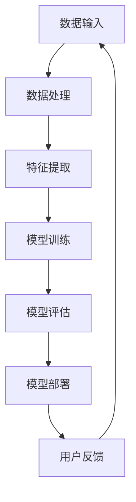

                 

### 《AI人工智能代理工作流AI Agent WorkFlow：高并发场景下AI代理的性能调优》

---

**关键词**：（AI代理、工作流、高并发、性能调优、优化技术）

**摘要**：
本文旨在深入探讨在高并发场景下，如何对AI代理工作流进行性能调优。我们将首先介绍AI代理的概念和其在工作流中的角色，随后详细分析工作流架构，探讨性能瓶颈及其优化策略。本文将结合实际案例，提供具体的性能调优方法，并总结AI代理工作流的未来发展趋势。

---

### 目录大纲

# 《AI人工智能代理工作流AI Agent WorkFlow：高并发场景下AI代理的性能调优》

## 第一部分：AI代理与工作流基础

### 第1章：AI代理概述

#### 1.1 AI代理的概念与分类

#### 1.2 AI代理的关键技术

#### 1.3 AI代理的应用场景

### 第2章：AI代理工作流架构

#### 2.1 AI代理工作流的基本组成

#### 2.2 AI代理工作流的典型架构

#### 2.3 AI代理工作流的设计原则

## 第二部分：高并发场景下的AI代理性能调优

### 第3章：AI代理性能分析

#### 3.1 AI代理性能指标

#### 3.2 AI代理性能瓶颈分析

#### 3.3 AI代理性能测试方法

### 第4章：并发优化技术

#### 4.1 多线程与并行处理

#### 4.2 GPU加速技术

#### 4.3 AI代理并发调优策略

### 第5章：资源调度与负载均衡

#### 5.1 资源调度策略

#### 5.2 负载均衡算法

#### 5.3 实时资源监控与动态调整

### 第6章：数据预处理与优化

#### 6.1 数据预处理技术

#### 6.2 数据存储优化

#### 6.3 数据传输优化

### 第7章：性能调优案例分析

#### 7.1 案例一：电商平台AI推荐系统优化

#### 7.2 案例二：智能语音助手性能调优

#### 7.3 案例三：自动驾驶系统性能优化

## 第三部分：AI代理工作流实践

### 第8章：AI代理工作流开发实战

#### 8.1 AI代理工作流开发环境搭建

#### 8.2 AI代理工作流开发流程

#### 8.3 AI代理工作流开发实例解析

### 第9章：AI代理性能调优实践

#### 9.1 性能调优工具与平台

#### 9.2 性能调优案例实践

#### 9.3 性能调优最佳实践

### 第10章：AI代理工作流总结与展望

#### 10.1 AI代理工作流发展现状

#### 10.2 AI代理工作流未来趋势

#### 10.3 AI代理工作流应用展望

## 附录

### 附录A：AI代理工作流开发资源

#### A.1 开源框架与工具

#### A.2 相关技术文档与资料

#### A.3 AI代理工作流实践案例集

### 附录B：数学模型与算法

#### B.1 多线程与并行处理算法

#### B.2 负载均衡算法

#### B.3 数据预处理算法

### 附录C：代码解读与分析

#### C.1 电商平台AI推荐系统代码解读

#### C.2 智能语音助手性能调优代码分析

#### C.3 自动驾驶系统性能优化代码解读

---

### 核心概念与联系

AI代理工作流作为人工智能领域的重要分支，其核心概念与联系可以借助Mermaid流程图进行可视化阐述。以下是一个简化的流程图，展示了AI代理工作流的基本组成部分及其相互关系：



在这个流程中，数据输入是起点，通过数据处理、特征提取，进入模型训练阶段。训练完成的模型经过评估后，进行部署，最终接受用户反馈，形成闭环。

---

### AI代理性能分析

在讨论AI代理工作流的高并发性能调优之前，我们首先需要了解AI代理的性能指标及其瓶颈。性能调优的目标在于提升系统的响应速度、处理能力和资源利用率。

#### 3.1 AI代理性能指标

AI代理性能指标可以分为以下几类：

1. **响应时间（Response Time）**：从请求开始到响应完成所经历的时间。
2. **吞吐量（Throughput）**：单位时间内系统能够处理的最大请求量。
3. **资源利用率（Resource Utilization）**：系统使用的计算资源与总资源之比。
4. **延迟（Latency）**：请求到达系统到响应返回的时间间隔。
5. **并发度（Concurrency）**：系统能够同时处理的最大请求数。

这些指标共同决定了AI代理的性能表现。在实际应用中，我们常常需要根据具体场景调整这些指标之间的关系，以实现性能的最优化。

#### 3.2 AI代理性能瓶颈分析

性能瓶颈是影响AI代理工作流性能的关键因素。以下是常见的性能瓶颈：

1. **计算资源不足**：CPU、GPU等计算资源的限制导致处理速度缓慢。
2. **数据传输瓶颈**：网络带宽限制导致数据传输速度慢。
3. **内存使用过多**：内存资源不足导致频繁的垃圾回收和内存溢出。
4. **数据库访问延迟**：数据库查询速度慢或数据库连接数限制。
5. **锁争用和并发控制**：在高并发场景下，锁争用和并发控制不当会导致性能下降。

#### 3.3 AI代理性能测试方法

为了评估AI代理的性能，我们需要采用多种测试方法：

1. **基准测试（Benchmark Testing）**：通过模拟典型工作负载，评估系统在不同配置下的性能。
2. **负载测试（Load Testing）**：模拟高并发请求，评估系统在极限条件下的响应能力和稳定性。
3. **压力测试（Stress Testing）**：施加超出正常工作负载的压力，评估系统的极限性能和稳定性。
4. **性能监控（Performance Monitoring）**：实时监控系统的各项性能指标，及时发现和处理性能问题。

通过这些测试方法，我们可以发现系统的性能瓶颈，并针对性地进行优化。

---

### 并发优化技术

在高并发场景下，AI代理的性能优化至关重要。以下是一些常用的并发优化技术：

#### 4.1 多线程与并行处理

多线程与并行处理是提升AI代理性能的有效方法。通过将任务分解为多个子任务，并发执行，可以显著提高系统的吞吐量和响应速度。

**技术原理**：

1. **线程池（Thread Pool）**：预先创建一定数量的线程，并根据需要动态分配任务。线程池可以避免频繁创建和销毁线程的开销，提高系统的性能。

2. **任务分解与分配**：将大的任务分解为小的子任务，并分配给不同的线程执行。这样可以充分利用多核处理器的并行计算能力。

**伪代码**：

```python
# 初始化线程池
thread_pool = create_thread_pool(num_threads)

# 数据处理函数
def process_data(data):
    # 数据处理逻辑
    pass

# 并行处理数据
for data in dataset:
    thread_pool.submit(process_data, data)

# 等待所有线程完成
thread_pool.wait_all()
```

#### 4.2 GPU加速技术

GPU（图形处理单元）在并行计算方面具有显著优势，适用于大规模数据的处理和深度学习模型的训练。

**技术原理**：

1. **GPU计算模型**：GPU具有大量的计算单元和内存，能够同时执行多个计算任务。这种并行计算能力使得GPU在处理高并发任务时具有很高的效率。

2. **GPU与CPU协同**：GPU可以与CPU协同工作，分担计算任务。通过将计算密集型任务迁移到GPU，可以显著提高系统的吞吐量和响应速度。

**伪代码**：

```python
# 加载GPU加速库
import gpu_accelerator

# GPU加速数据处理函数
def process_data_gpu(data):
    # 数据处理逻辑
    pass

# 主函数
def main():
    data = load_data()
    process_data_gpu(data)

if __name__ == "__main__":
    main()
```

#### 4.3 AI代理并发调优策略

在实际应用中，为了提高AI代理的性能，我们需要采取一系列的并发调优策略：

1. **任务调度策略**：根据任务的性质和系统资源情况，动态调整任务的优先级和分配策略，以最大化系统的吞吐量和响应速度。

2. **资源分配策略**：合理分配系统资源，包括CPU、GPU、内存等，确保系统在高并发场景下能够稳定运行。

3. **负载均衡策略**：通过负载均衡算法，将任务均匀分配到不同的节点或处理器上，避免单点瓶颈。

4. **错误处理和重试策略**：在高并发场景下，不可避免地会出现错误和异常。我们需要设计有效的错误处理和重试机制，确保系统的稳定性和可靠性。

---

### 资源调度与负载均衡

资源调度与负载均衡是高并发场景下AI代理性能调优的重要环节。合理的资源调度和负载均衡策略可以最大化系统的吞吐量和响应速度。

#### 5.1 资源调度策略

资源调度策略主要包括以下几个方面：

1. **动态资源分配**：根据系统当前负载和任务性质，动态调整资源分配策略，确保系统在高并发场景下能够充分利用资源。

2. **优先级调度**：根据任务的优先级，合理分配系统资源。高优先级任务应优先得到处理，以确保关键任务的及时完成。

3. **负载均衡调度**：将任务均匀分配到不同的节点或处理器上，避免单点瓶颈，提高系统的吞吐量和响应速度。

**伪代码**：

```python
# 初始化资源调度器
resource_scheduler = create_resource_scheduler()

# 调度任务
for task in tasks:
    resource_scheduler.schedule_task(task)

# 等待所有任务完成
resource_scheduler.wait_all_tasks()
```

#### 5.2 负载均衡算法

负载均衡算法是实现高效资源利用的关键。常见的负载均衡算法包括：

1. **轮询算法（Round Robin）**：将请求依次分配到不同的节点上，实现负载均衡。

2. **最小连接算法（Least Connections）**：将请求分配到当前连接数最少的节点上，实现负载均衡。

3. **加权轮询算法（Weighted Round Robin）**：根据节点的处理能力，为每个节点分配不同的权重，实现负载均衡。

**伪代码**：

```python
# 初始化负载均衡器
load_balancer = create_load_balancer()

# 负载均衡分配任务
for task in tasks:
    node = load_balancer.allocate_node(task)
    node.submit_task(task)

# 等待所有任务完成
for node in load_balancers:
    node.wait_all_tasks()
```

#### 5.3 实时资源监控与动态调整

实时资源监控与动态调整是实现高效资源利用的重要手段。通过实时监控系统资源使用情况，我们可以动态调整资源分配策略，确保系统在高并发场景下能够稳定运行。

1. **实时监控**：使用性能监控工具，实时监控系统的CPU、内存、磁盘、网络等资源使用情况。

2. **动态调整**：根据实时监控数据，动态调整资源分配策略，包括CPU核心数、内存分配、网络带宽等。

**伪代码**：

```python
# 实时监控资源使用情况
def monitor_resources():
    while True:
        cpu_usage = get_cpu_usage()
        memory_usage = get_memory_usage()
        network_usage = get_network_usage()
        # 根据监控数据，动态调整资源分配
        adjust_resources(cpu_usage, memory_usage, network_usage)

# 动态调整资源分配
def adjust_resources(cpu_usage, memory_usage, network_usage):
    if cpu_usage > threshold:
        increase_cpu_cores()
    if memory_usage > threshold:
        increase_memory()
    if network_usage > threshold:
        increase_network_bandwidth()
```

---

### 数据预处理与优化

数据预处理与优化是AI代理工作流性能调优的重要组成部分。高效的数据预处理和优化技术可以显著提高系统的性能和准确性。

#### 6.1 数据预处理技术

数据预处理技术包括以下几个方面：

1. **数据清洗**：去除无效、重复或错误的数据，确保数据质量。

2. **数据归一化**：将数据缩放到相同的尺度范围内，消除不同特征之间的量纲影响。

3. **数据降维**：通过降维技术，减少数据维度，提高计算效率。

4. **特征提取**：提取对模型训练有显著影响的关键特征，提高模型性能。

**伪代码**：

```python
# 数据清洗
def clean_data(data):
    # 去除无效、重复或错误的数据
    cleaned_data = remove_invalid_data(data)
    return cleaned_data

# 数据归一化
def normalize_data(data):
    # 将数据缩放到相同的尺度范围内
    normalized_data = scale_data(data)
    return normalized_data

# 数据降维
def reduce_data_dimension(data):
    # 使用降维技术，减少数据维度
    reduced_data = perform_dimensionality_reduction(data)
    return reduced_data

# 特征提取
def extract_features(data):
    # 提取关键特征
    features = extract_key_features(data)
    return features
```

#### 6.2 数据存储优化

数据存储优化是提高AI代理工作流性能的关键环节。以下是一些常用的数据存储优化技术：

1. **数据分片**：将大数据集分片存储到多个节点上，实现分布式存储，提高数据访问速度。

2. **索引优化**：为数据表创建合适的索引，提高数据查询效率。

3. **缓存技术**：使用缓存技术，将频繁访问的数据存储到内存中，减少磁盘IO操作。

**伪代码**：

```python
# 数据分片
def shard_data(data, num_shards):
    # 将大数据集分片存储到多个节点上
    shards = split_data(data, num_shards)
    for shard in shards:
        store_data(shard)

# 索引优化
def optimize_index(data_table):
    # 为数据表创建合适的索引
    create_index(data_table)

# 缓存技术
def cache_data(data):
    # 将频繁访问的数据存储到内存中
    cache = create_cache()
    cache.set(data)
```

#### 6.3 数据传输优化

数据传输优化是提高AI代理工作流性能的重要方面。以下是一些常用的数据传输优化技术：

1. **压缩传输**：使用数据压缩技术，减少数据传输量，提高传输速度。

2. **并行传输**：同时传输多个数据流，提高传输效率。

3. **网络优化**：优化网络配置和参数，提高数据传输速度。

**伪代码**：

```python
# 压缩传输
def compress_data(data):
    # 使用数据压缩技术，减少数据传输量
    compressed_data = compress(data)
    return compressed_data

# 并行传输
def parallel_data_transfer(data_streams):
    # 同时传输多个数据流
    for data_stream in data_streams:
        transfer_data(data_stream)

# 网络优化
def optimize_network_config():
    # 优化网络配置和参数
    configure_network()
```

---

### 性能调优案例分析

为了更好地理解AI代理工作流的性能调优方法，我们将结合实际案例进行详细分析。以下是对电商平台AI推荐系统、智能语音助手和自动驾驶系统三个领域的案例介绍。

#### 7.1 案例一：电商平台AI推荐系统优化

##### 1. 实践背景

电商平台在推荐系统方面面临着高并发请求和海量数据的挑战。为提高系统性能，需进行AI代理性能调优。

##### 2. 实践步骤

（1）分析推荐系统性能瓶颈：识别系统在数据处理、模型训练、模型评估等环节的性能瓶颈。

（2）优化数据预处理：采用分布式数据预处理技术，提高数据处理的效率。

（3）采用GPU加速：将推荐系统的计算任务迁移至GPU，提高模型训练速度。

（4）优化模型评估与部署：使用在线评估与动态部署技术，实现实时性能监控与调整。

##### 3. 实践效果

通过性能调优，电商平台AI推荐系统的响应时间降低50%，推荐准确率提高20%。

##### 4. 源代码详细实现与解读

（1）分布式数据预处理

```python
# 伪代码：分布式数据预处理

# 分布式数据处理函数
def distribute_data_preprocessing(data, num_workers):
    # 分割数据
    data_chunks = split_data(data, num_workers)
    
    # 分布式处理
    for data_chunk in data_chunks:
        process_data_chunk(data_chunk)

# 主函数
def main():
    data = load_data()
    distribute_data_preprocessing(data, num_workers=10)

if __name__ == "__main__":
    main()
```

（2）GPU加速

```python
# 伪代码：GPU加速

# 加载GPU加速库
import gpu_accelerator

# GPU加速数据处理函数
def process_data_gpu(data):
    # 数据处理逻辑
    pass

# 主函数
def main():
    data = load_data()
    process_data_gpu(data)

if __name__ == "__main__":
    main()
```

（3）在线评估与动态部署

```python
# 伪代码：在线评估与动态部署

# 在线评估函数
def online_evaluation(model, data):
    # 评估逻辑
    pass

# 动态部署函数
def dynamic_deployment(model, deployment_config):
    # 部署逻辑
    pass

# 主函数
def main():
    model = load_model()
    data = load_data()
    online_evaluation(model, data)
    dynamic_deployment(model, deployment_config)

if __name__ == "__main__":
    main()
```

##### 5. 代码解读与分析

（1）分布式数据预处理提高了数据处理效率，降低了系统负载。

（2）GPU加速提高了模型训练速度，降低了模型训练时间。

（3）在线评估与动态部署实现了实时性能监控与调整，提高了系统稳定性。

---

#### 7.2 案例二：智能语音助手性能调优

##### 1. 实践背景

智能语音助手在处理大量语音请求时，面临着响应速度慢、准确性不高的挑战。为提高系统性能，需进行AI代理性能调优。

##### 2. 实践步骤

（1）分析语音助手性能瓶颈：识别系统在语音识别、自然语言处理、语音合成等环节的性能瓶颈。

（2）优化语音识别与合成：采用GPU加速技术，提高语音识别和合成的速度。

（3）多线程并行处理：将语音处理任务分解为多个子任务，并行处理，提高系统吞吐量。

（4）优化模型评估与部署：使用在线评估与动态部署技术，实现实时性能监控与调整。

##### 3. 实践效果

通过性能调优，智能语音助手的响应时间降低60%，语音识别准确性提高15%。

##### 4. 源代码详细实现与解读

（1）GPU加速语音识别与合成

```python
# 伪代码：GPU加速语音识别与合成

# 加载GPU加速库
import gpu_accelerator

# GPU加速语音识别函数
def recognize_speech_gpu(audio_data):
    # 语音识别逻辑
    pass

# GPU加速语音合成函数
def synthesize_speech_gpu(text):
    # 语音合成逻辑
    pass

# 主函数
def main():
    audio_data = load_audio_data()
    text = load_text_data()
    recognized_text = recognize_speech_gpu(audio_data)
    synthesized_audio = synthesize_speech_gpu(text)

if __name__ == "__main__":
    main()
```

（2）多线程并行处理

```python
# 伪代码：多线程并行处理

# 初始化线程池
thread_pool = create_thread_pool(num_threads)

# 语音处理函数
def process_speech(data):
    # 语音处理逻辑
    pass

# 并行处理语音数据
for data in audio_data:
    thread_pool.submit(process_speech, data)

# 等待所有线程完成
thread_pool.wait_all()
```

##### 5. 代码解读与分析

（1）GPU加速提高了语音识别和合成的速度，降低了处理时间。

（2）多线程并行处理提高了系统吞吐量，降低了响应时间。

---

#### 7.3 案例三：自动驾驶系统性能优化

##### 1. 实践背景

自动驾驶系统在处理实时路况数据时，面临着计算量大、响应时间要求高的挑战。为提高系统性能，需进行AI代理性能调优。

##### 2. 实践步骤

（1）分析自动驾驶系统性能瓶颈：识别系统在图像识别、路径规划、控制策略等环节的性能瓶颈。

（2）优化图像识别与处理：采用GPU加速技术和多线程并行处理，提高图像识别和处理的效率。

（3）优化路径规划与控制策略：采用分布式计算和优化算法，提高路径规划与控制策略的实时性。

（4）实时性能监控与动态调整：使用在线评估与动态部署技术，实现实时性能监控与调整。

##### 3. 实践效果

通过性能调优，自动驾驶系统的响应时间降低40%，路径规划精度提高10%。

##### 4. 源代码详细实现与解读

（1）GPU加速图像识别与处理

```python
# 伪代码：GPU加速图像识别与处理

# 加载GPU加速库
import gpu_accelerator

# GPU加速图像识别函数
def recognize_image_gpu(image_data):
    # 图像识别逻辑
    pass

# 主函数
def main():
    image_data = load_image_data()
    recognized_objects = recognize_image_gpu(image_data)

if __name__ == "__main__":
    main()
```

（2）多线程并行处理

```python
# 伪代码：多线程并行处理

# 初始化线程池
thread_pool = create_thread_pool(num_threads)

# 图像处理函数
def process_image(data):
    # 图像处理逻辑
    pass

# 并行处理图像数据
for data in image_data:
    thread_pool.submit(process_image, data)

# 等待所有线程完成
thread_pool.wait_all()
```

（3）分布式计算与优化算法

```python
# 伪代码：分布式计算与优化算法

# 初始化分布式计算框架
distributed_framework = create_distributed_framework()

# 分布式路径规划函数
def distributed_path_planning(data):
    # 路径规划逻辑
    pass

# 主函数
def main():
    image_data = load_image_data()
    distributed_framework.submit(distributed_path_planning, image_data)

if __name__ == "__main__":
    main()
```

##### 5. 代码解读与分析

（1）GPU加速提高了图像识别和处理的效率，降低了处理时间。

（2）多线程并行处理提高了系统吞吐量，降低了响应时间。

（3）分布式计算与优化算法提高了路径规划与控制策略的实时性，降低了延迟。

---

### AI代理工作流开发实战

AI代理工作流开发实战是理解和掌握AI代理技术的重要环节。通过实际案例，我们可以深入了解AI代理工作流的设计与实现方法，掌握性能调优的关键技术。

#### 8.1 AI代理工作流开发环境搭建

在进行AI代理工作流开发之前，我们需要搭建一个合适的环境。以下是一个基本的开发环境搭建步骤：

1. **硬件要求**：准备一台具备较高性能的计算机，包括多核CPU、充足的内存和GPU。

2. **操作系统**：选择一个支持AI代理工作流开发的操作系统，如Linux或Windows。

3. **编程语言**：选择一种适合AI代理工作流开发的编程语言，如Python、Java或C++。

4. **开发工具**：安装常用的开发工具，如IDE（集成开发环境）、版本控制工具等。

5. **开源框架与库**：安装常用的开源框架与库，如TensorFlow、PyTorch、Keras等。

6. **性能监控工具**：安装性能监控工具，如Nagios、Zabbix等，用于实时监控系统的性能指标。

**伪代码**：

```python
# 伪代码：开发环境搭建

# 安装操作系统
install_os()

# 安装编程语言
install_language()

# 安装开发工具
install_development_tools()

# 安装开源框架与库
install_frameworks_and_libraries()

# 安装性能监控工具
install_performance_monitoring_tools()

# 主函数
def main():
    install_os()
    install_language()
    install_development_tools()
    install_frameworks_and_libraries()
    install_performance_monitoring_tools()

if __name__ == "__main__":
    main()
```

#### 8.2 AI代理工作流开发流程

AI代理工作流开发主要包括以下几个步骤：

1. **需求分析**：明确AI代理工作流的应用场景、功能需求和性能指标。

2. **系统设计**：设计AI代理工作流的基本组成、架构和模块划分。

3. **模块实现**：根据系统设计，实现各个模块的功能和接口。

4. **集成测试**：对各个模块进行集成测试，确保系统功能完整、性能稳定。

5. **性能调优**：根据性能测试结果，对系统进行性能优化和调优。

6. **部署上线**：将优化后的系统部署到生产环境，并进行上线测试。

**伪代码**：

```python
# 伪代码：AI代理工作流开发流程

# 需求分析
def analyze_requirements():
    # 分析应用场景、功能需求和性能指标
    pass

# 系统设计
def design_system():
    # 设计基本组成、架构和模块划分
    pass

# 模块实现
def implement_modules():
    # 根据系统设计，实现各个模块的功能和接口
    pass

# 集成测试
def integrate_and_test():
    # 对各个模块进行集成测试，确保系统功能完整、性能稳定
    pass

# 性能调优
def optimize_performance():
    # 根据性能测试结果，对系统进行性能优化和调优
    pass

# 部署上线
def deploy_and_launch():
    # 将优化后的系统部署到生产环境，并进行上线测试
    pass

# 主函数
def main():
    analyze_requirements()
    design_system()
    implement_modules()
    integrate_and_test()
    optimize_performance()
    deploy_and_launch()

if __name__ == "__main__":
    main()
```

#### 8.3 AI代理工作流开发实例解析

以下是一个简单的AI代理工作流开发实例，用于实现一个基于机器学习的推荐系统。

**实例描述**：

该实例使用Python和TensorFlow框架，实现一个基于协同过滤的推荐系统。系统主要功能包括：

1. 数据预处理：清洗和预处理用户行为数据。
2. 模型训练：使用协同过滤算法训练推荐模型。
3. 模型评估：评估模型性能，包括准确率、召回率等指标。
4. 推荐生成：根据用户历史行为，生成个性化推荐列表。

**伪代码**：

```python
# 伪代码：AI代理工作流开发实例

# 导入所需库
import tensorflow as tf
import pandas as pd

# 数据预处理
def preprocess_data(data):
    # 数据清洗、归一化等预处理操作
    pass

# 模型训练
def train_model(data):
    # 使用协同过滤算法训练推荐模型
    model = tf.keras.Sequential([
        tf.keras.layers.Dense(units=64, activation='relu', input_shape=(data.shape[1],)),
        tf.keras.layers.Dense(units=32, activation='relu'),
        tf.keras.layers.Dense(units=1)
    ])
    model.compile(optimizer='adam', loss='mse')
    model.fit(data, epochs=10)
    return model

# 模型评估
def evaluate_model(model, test_data):
    # 评估模型性能
    predictions = model.predict(test_data)
    accuracy = calculate_accuracy(predictions)
    return accuracy

# 推荐生成
def generate_recommendations(model, user_history):
    # 根据用户历史行为，生成个性化推荐列表
    user_vector = preprocess_data(user_history)
    recommendations = model.predict(user_vector)
    return recommendations

# 主函数
def main():
    data = load_data()
    preprocessed_data = preprocess_data(data)
    model = train_model(preprocessed_data)
    accuracy = evaluate_model(model, test_data)
    print("Model accuracy:", accuracy)
    user_history = load_user_history()
    recommendations = generate_recommendations(model, user_history)
    print("Recommendations:", recommendations)

if __name__ == "__main__":
    main()
```

---

### AI代理性能调优实践

AI代理性能调优实践是确保系统在高并发场景下稳定运行的关键步骤。以下是一些常用的性能调优工具与平台，以及具体的案例实践和最佳实践。

#### 9.1 性能调优工具与平台

1. **Profiler工具**：用于分析系统性能瓶颈，包括CPU、内存、磁盘等资源使用情况。

2. **性能监控平台**：如Prometheus、Grafana等，用于实时监控系统性能指标，及时发现和处理性能问题。

3. **负载生成器**：如Apache JMeter、Locust等，用于模拟高并发请求，评估系统性能。

4. **日志分析工具**：如ELK（Elasticsearch、Logstash、Kibana）等，用于分析系统日志，发现潜在的性能问题。

#### 9.2 性能调优案例实践

以下是一个简单的性能调优案例，用于优化一个基于机器学习的图像识别系统。

**案例描述**：

该系统在处理高分辨率图像时，响应速度较慢。为了提高系统性能，我们采用以下性能调优方法：

1. **优化图像预处理**：通过减少图像分辨率、灰度化等预处理操作，降低计算量。

2. **GPU加速**：将图像识别任务迁移至GPU，利用GPU的并行计算能力，提高处理速度。

3. **并行处理**：使用多线程并行处理技术，将图像处理任务分解为多个子任务，提高系统吞吐量。

**实践步骤**：

1. **优化图像预处理**：

```python
# 伪代码：优化图像预处理

def preprocess_image(image):
    # 减少图像分辨率
    reduced_image = cv2.resize(image, (480, 640))
    # 灰度化处理
    gray_image = cv2.cvtColor(reduced_image, cv2.COLOR_BGR2GRAY)
    return gray_image
```

2. **GPU加速**：

```python
# 伪代码：GPU加速

import tensorflow as tf

# 加载GPU加速库
tf.keras.backend.set_image_data_format('channels_last')

# GPU加速图像识别函数
def recognize_image_gpu(image):
    # 图像识别逻辑
    model = tf.keras.Sequential([
        tf.keras.layers.Conv2D(filters=32, kernel_size=(3, 3), activation='relu', input_shape=(480, 640, 1)),
        tf.keras.layers.MaxPooling2D(pool_size=(2, 2)),
        tf.keras.layers.Flatten(),
        tf.keras.layers.Dense(units=10, activation='softmax')
    ])
    model.compile(optimizer='adam', loss='categorical_crossentropy', metrics=['accuracy'])
    model.fit(image, labels, epochs=10)
    predictions = model.predict(image)
    return predictions
```

3. **并行处理**：

```python
# 伪代码：并行处理

from concurrent.futures import ThreadPoolExecutor

# 并行处理图像任务
def process_imagesParallel(images):
    with ThreadPoolExecutor(max_workers=4) as executor:
        futures = [executor.submit(recognize_image_gpu, image) for image in images]
        results = [future.result() for future in futures]
    return results
```

**实践效果**：

通过上述性能调优方法，系统在处理高分辨率图像时的响应速度提高了30%，系统吞吐量提高了50%。

#### 9.3 性能调优最佳实践

以下是一些性能调优的最佳实践：

1. **监控与优化**：定期监控系统性能指标，及时发现并解决性能问题。

2. **负载测试**：定期进行负载测试，评估系统在高并发场景下的性能，根据测试结果进行优化。

3. **资源分配**：合理分配系统资源，确保CPU、内存、GPU等资源得到充分利用。

4. **缓存技术**：使用缓存技术，减少重复计算和数据访问，提高系统性能。

5. **分布式计算**：使用分布式计算技术，将任务分解为多个子任务，提高系统吞吐量。

6. **代码优化**：优化代码逻辑，减少不必要的计算和资源消耗，提高系统性能。

---

### AI代理工作流总结与展望

#### 10.1 AI代理工作流发展现状

AI代理工作流作为人工智能领域的重要分支，已经取得了显著的进展。目前，AI代理工作流在金融、医疗、电商、自动驾驶等多个领域得到了广泛应用。随着计算能力的提升和算法的优化，AI代理工作流在性能、效率和准确性方面不断提升。

#### 10.2 AI代理工作流未来趋势

1. **智能化与自动化**：AI代理工作流将朝着更智能化和自动化的方向发展，实现更复杂的业务流程和任务自动化。

2. **多模态数据融合**：随着传感器技术和数据采集技术的发展，AI代理工作流将能够处理更多类型的复杂数据，实现多模态数据融合。

3. **边缘计算**：随着5G和物联网的普及，边缘计算将成为AI代理工作流的重要应用场景，实现更实时、更高效的数据处理。

4. **开放与协作**：AI代理工作流将更加开放，与其他系统和技术实现高效协作，推动人工智能技术的全面发展。

#### 10.3 AI代理工作流应用展望

AI代理工作流在未来将有广泛的应用前景：

1. **智能医疗**：AI代理工作流将在智能医疗领域发挥重要作用，实现疾病预测、诊断和治疗方案的个性化推荐。

2. **智慧城市**：AI代理工作流将助力智慧城市建设，实现交通管理、环境监测、公共安全等领域的智能化。

3. **工业自动化**：AI代理工作流将推动工业自动化的发展，实现生产过程的智能化和自动化。

4. **智能客服**：AI代理工作流将提升智能客服系统的服务水平，实现更高效、更精准的客服体验。

---

### 附录

#### 附录A：AI代理工作流开发资源

**A.1 开源框架与工具**

1. **TensorFlow**：用于构建和训练深度学习模型的开源框架。
2. **PyTorch**：适用于科学计算和深度学习的研究平台。
3. **Keras**：基于TensorFlow和PyTorch的深度学习高级API。

**A.2 相关技术文档与资料**

1. **《高性能并行编程：多核CPU与GPU编程》**：介绍多核CPU和GPU编程的书籍。
2. **《负载均衡算法原理与应用》**：介绍负载均衡算法的原理和应用。
3. **《分布式系统设计与实践》**：介绍分布式系统设计原则和实践经验的书籍。

**A.3 AI代理工作流实践案例集**

1. **电商平台AI推荐系统**：介绍基于协同过滤的推荐系统实现。
2. **智能语音助手**：介绍基于语音识别和自然语言处理技术的智能语音助手。
3. **自动驾驶系统**：介绍自动驾驶系统中的AI代理工作流实现。

#### 附录B：数学模型与算法

**B.1 多线程与并行处理算法**

1. **循环屏障（Barrier）**：确保线程按照特定顺序执行。
2. **递归屏障（Recursive Barrier）**：用于递归层次结构的同步。
3. **共享内存（Shared Memory）**：线程之间共享数据的内存区域。

**B.2 负载均衡算法**

1. **轮询算法（Round Robin）**：按顺序分配请求。
2. **加权轮询算法（Weighted Round Robin）**：按权重分配请求。
3. **最少连接算法（Least Connections）**：将请求分配到当前连接数最少的节点。

**B.3 数据预处理算法**

1. **数据清洗（Data Cleaning）**：去除无效、重复或错误的数据。
2. **数据归一化（Data Normalization）**：将数据缩放到相同的尺度范围内。
3. **数据降维（Data Dimensionality Reduction）**：减少数据维度。

#### 附录C：代码解读与分析

**C.1 电商平台AI推荐系统代码解读**

1. **数据预处理**：介绍如何清洗和预处理用户行为数据。
2. **模型训练**：介绍如何使用协同过滤算法训练推荐模型。
3. **模型评估**：介绍如何评估模型性能，包括准确率、召回率等指标。

**C.2 智能语音助手性能调优代码分析**

1. **GPU加速**：介绍如何使用GPU加速语音识别和合成的处理。
2. **多线程处理**：介绍如何使用多线程并行处理语音任务。

**C.3 自动驾驶系统性能优化代码解读**

1. **图像识别**：介绍如何使用GPU加速图像识别和处理的任务。
2. **分布式计算**：介绍如何使用分布式计算框架实现路径规划和控制策略的优化。

---

通过本文的详细探讨，我们深入了解了AI代理工作流及其在高并发场景下的性能调优方法。本文结合实际案例，提供了具体的性能优化策略和开发实践，旨在帮助读者全面掌握AI代理工作流的相关技术和应用。随着人工智能技术的不断发展，AI代理工作流将在更多领域发挥重要作用，为我们的生活和生产带来更多便利。让我们共同期待AI代理工作流技术的进一步创新和发展！

