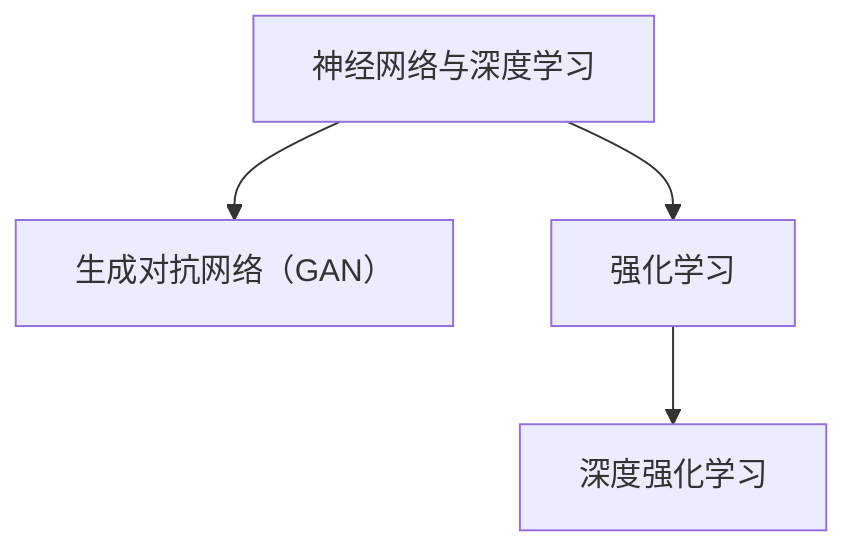

                 

# 《AI人工智能核心算法原理与代码实例讲解：AI社会公平性》

> **关键词**：人工智能，核心算法，社会公平性，算法原理，代码实例，AI歧视，偏见检测，偏见纠正

> **摘要**：本文将深入探讨人工智能（AI）的核心算法原理，并结合代码实例详细讲解如何实现AI社会公平性。文章分为四个主要部分：第一部分介绍AI的基本概念和技术原理；第二部分阐述AI社会公平性的重要性及其算法原理；第三部分通过实际项目展示如何检测和纠正AI偏见；第四部分总结与展望AI社会公平性的未来发展。本文旨在为读者提供全面、深入的AI社会公平性技术指南。

----------------------------------------------------------------

## 《AI人工智能核心算法原理与代码实例讲解：AI社会公平性》目录大纲

### 《AI人工智能核心算法原理与代码实例讲解：AI社会公平性》目录大纲

#### 第一部分：AI人工智能基础

- 第1章: AI与人工智能概述
  - 1.1 AI的基本概念
  - 1.2 人工智能的技术原理
  - 1.3 AI的社会公平性概念
- 第2章: AI的核心算法原理
  - 2.1 神经网络与深度学习
  - 2.2 生成对抗网络（GAN）
  - 2.3 强化学习
- 第3章: AI社会公平性算法原理
  - 3.1 偏见检测与纠正算法
  - 3.2 平等性度量算法
  - 3.3 数据驱动的社会公平性算法
- 第三部分：AI社会公平性项目实战
  - 第4章: AI社会公平性项目实战1
  - 第5章: AI社会公平性项目实战2
- 第四部分：总结与展望
  - 第6章: AI社会公平性的未来发展方向
  - 第7章: AI社会公平性的伦理与法律问题
  - 附录 A: AI社会公平性相关资源

### 第一部分：AI人工智能基础

### 第1章: AI与人工智能概述

#### 1.1 AI的基本概念

人工智能（Artificial Intelligence, AI）是指由人造系统执行的智能行为，这些行为通常被认为是人类智能的表现。AI的发展历程可以追溯到20世纪50年代，当时科学家们首次提出了AI的概念。从模拟、推理、知识工程到数据驱动、深度学习、强化学习，AI技术经历了多次重大的变革。

AI的类型与应用领域多种多样，主要可以分为以下几类：

- **知识驱动型AI**：这类AI基于专家系统和规则引擎，通过形式化地编码人类专家的知识来实现智能行为。例如，医疗诊断系统、法律咨询系统等。
- **数据驱动型AI**：这类AI主要通过学习大量数据来进行预测和决策。包括监督学习、无监督学习和强化学习。常见的应用有图像识别、自然语言处理、推荐系统等。
- **模拟增强型AI**：这类AI与人机协作，通过模拟人类的思维和行为，提高工作效率和创造力。例如，智能客服、自动驾驶等。

在AI的应用领域，可以见到以下几方面的显著成果：

- **自然语言处理**：如语音识别、机器翻译、智能聊天机器人等。
- **计算机视觉**：如图像识别、物体检测、图像生成等。
- **自动驾驶**：通过AI技术实现自动驾驶汽车、无人机等。
- **医疗健康**：如医学影像分析、疾病预测、个性化治疗等。
- **金融**：如风险管理、量化交易、信用评分等。

#### 1.2 人工智能的技术原理

##### 神经网络与深度学习基础

神经网络（Neural Networks）是AI的基础技术之一，其灵感来源于人脑的结构和工作原理。一个简单的神经网络通常由输入层、隐藏层和输出层组成。每个神经元接收来自前一层神经元的输入，并通过一个激活函数产生输出。

神经网络的核心是前向传播和反向传播算法。前向传播是指将输入数据通过网络层，逐层计算输出；反向传播则是指计算误差并反向传播到网络的每一层，用于更新网络的参数。

深度学习（Deep Learning）是指多层神经网络的训练和优化方法。深度学习的核心是自动特征提取，通过多层神经网络自动学习输入数据的特征表示。常见的深度学习架构包括卷积神经网络（CNN）、循环神经网络（RNN）和变换器（Transformer）等。

##### 强化学习的基本原理

强化学习（Reinforcement Learning, RL）是一种通过试错学习最优策略的机器学习方法。强化学习的核心是智能体（Agent）与环境（Environment）的交互。智能体通过执行动作（Action）来获取奖励（Reward）并更新其策略（Policy）。

Q-Learning算法是一种基于值函数的强化学习算法。Q-Learning通过学习状态-动作值函数（Q-Value），来优化智能体的策略。每次智能体执行动作后，根据实际获得的奖励和下一步的Q值更新当前Q值。

Policy Gradient算法则直接优化策略参数，通过估计策略梯度来更新策略。Policy Gradient算法相对于Q-Learning算法更简单，但稳定性较差。

##### 生成对抗网络（GAN）

生成对抗网络（Generative Adversarial Networks, GAN）是由生成器（Generator）和判别器（Discriminator）组成的一种深度学习架构。生成器旨在生成逼真的数据，而判别器则负责区分真实数据和生成数据。

GAN的训练过程是一个对抗过程，生成器和判别器互相竞争。生成器的目标是生成足够逼真的数据以欺骗判别器，而判别器的目标是不断提高对真实数据和生成数据的辨别能力。

GAN在图像生成、艺术风格转换和文本生成等领域取得了显著成果。

#### 1.3 AI的社会公平性概念

AI的社会公平性是指AI系统在应用过程中不会产生不公平的结果。在现实中，AI系统可能会因为数据偏见、算法设计问题等原因，导致对某些群体产生不公平对待。

社会公平性在AI中的应用主要体现在以下几个方面：

- **偏见检测与纠正**：通过算法检测AI系统中存在的偏见，并采取相应措施进行纠正。
- **平等性度量**：评估AI系统在不同属性上的公平性，例如性别、种族、年龄等。
- **可解释性**：提高AI系统的可解释性，使得人们能够理解AI决策的过程和依据。

AI歧视与偏见问题是社会公平性的主要挑战。例如，招聘系统可能会因为历史数据中的性别偏见，导致对女性求职者的评分较低。又如，信贷评估系统可能会因为种族偏见，导致某些种族的信用评分较低。

为了解决这些问题，研究人员提出了多种偏见检测与纠正算法，包括统计测试、模型解释方法、公平性指标计算等。

#### 1.4 AI的大规模应用前景

AI在当今社会具有广泛的应用前景，其潜力和影响力正逐步显现。以下是一些AI在大规模应用中的潜在影响：

- **自动化与智能化**：通过AI技术实现生产流程的自动化，提高生产效率和产品质量。
- **优化与重构**：利用AI技术对现有业务流程进行优化和重构，提高企业的运营效率。
- **创新与拓展**：AI技术可以帮助企业在新的业务领域进行探索和创新。

AI在未来的发展趋势包括：

- **泛在化**：AI技术将更加普及，深入到社会的各个角落。
- **智能化**：AI系统将更加智能，能够自主学习和适应复杂环境。
- **协同化**：AI系统将与其他技术（如物联网、云计算等）协同工作，实现更加高效和智能的解决方案。

#### 1.5 本章总结

本章介绍了AI的基本概念、技术原理和社会公平性概念。AI技术的发展为人类社会带来了巨大的变革和机遇。然而，AI的社会公平性问题也日益凸显，需要我们重视和解决。通过理解AI的核心算法原理和偏见检测与纠正方法，我们可以更好地利用AI技术，推动社会的公平与进步。

----------------------------------------------------------------

## 第2章: AI的核心算法原理

### 2.1 神经网络与深度学习

神经网络（Neural Networks, NN）是人工智能的基础之一，其灵感来源于人脑的结构和工作原理。神经网络由大量的神经元（或节点）组成，这些神经元通过连接（或权重）形成网络结构。每个神经元接收来自其他神经元的输入信号，通过一个激活函数产生输出信号。

#### 神经网络的基本结构

一个简单的神经网络通常由以下几部分组成：

- **输入层**：接收外部输入数据。
- **隐藏层**：一个或多个隐藏层，负责处理和变换输入数据。
- **输出层**：产生最终的输出结果。

每个隐藏层中的神经元都会接收来自前一层神经元的输入，并经过一个加权求和操作，再通过激活函数产生输出。输出层将最终输出结果传递给外部。

#### 前向传播与反向传播算法

神经网络的训练过程主要包括前向传播和反向传播两个步骤。

- **前向传播**：将输入数据通过神经网络，逐层计算每个神经元的输出。前向传播的目的是计算网络对输入数据的预测值。
  
  具体步骤如下：
  1. **初始化权重和偏置**：随机初始化神经网络中的权重和偏置。
  2. **输入层到隐藏层的传递**：将输入数据乘以权重，加上偏置，通过激活函数得到隐藏层的输出。
  3. **隐藏层到输出层的传递**：将隐藏层的输出作为输入，重复上述过程，直到得到输出层的输出。

- **反向传播**：计算输出误差，并反向传播到网络的每一层，更新权重和偏置。

  具体步骤如下：
  1. **计算输出误差**：计算输出层的实际输出与预期输出之间的误差。
  2. **反向传播误差**：从输出层开始，逐层计算每个神经元的误差。
  3. **更新权重和偏置**：根据误差和每个神经元的输入，使用梯度下降或其他优化算法更新权重和偏置。

#### 梯度下降算法

梯度下降算法是一种常用的优化算法，用于训练神经网络。其基本思想是通过计算损失函数的梯度，沿着梯度的反方向更新模型的参数，以最小化损失函数。

- **随机梯度下降（SGD）**：在每个训练样本上计算梯度并更新参数。
- **批量梯度下降（BGD）**：在所有训练样本上计算梯度并更新参数。
- **Adam优化器**：结合SGD和BGD的优点，自适应地调整学习率。

#### 卷积神经网络（CNN）

卷积神经网络（Convolutional Neural Networks, CNN）是专门用于处理图像数据的神经网络。CNN通过卷积层、池化层和全连接层等结构，能够自动提取图像特征并进行分类或回归。

- **卷积层**：通过卷积操作提取图像局部特征。
- **池化层**：降低特征图的维度，增强特征鲁棒性。
- **全连接层**：将特征映射到输出结果。

#### 深度学习架构

深度学习架构是指由多个神经网络层组成的复杂网络结构。以下是一些常见的深度学习架构：

- **循环神经网络（RNN）**：适合处理序列数据，例如自然语言处理和时间序列预测。
- **变换器（Transformer）**：基于自注意力机制的序列建模方法，广泛应用于自然语言处理和计算机视觉领域。
- **生成对抗网络（GAN）**：由生成器和判别器组成的对抗网络，用于生成逼真的图像、音频和文本。

### 2.2 生成对抗网络（GAN）

生成对抗网络（Generative Adversarial Networks, GAN）是 Ian Goodfellow 等人于 2014 年提出的一种深度学习模型。GAN由两个神经网络组成：生成器（Generator）和判别器（Discriminator）。

#### GAN的基本概念

GAN的工作原理类似于一个对抗游戏，生成器和判别器相互竞争，生成器和判别器的目标分别是：

- **生成器**：生成逼真的数据，使其难以被判别器区分。
- **判别器**：区分真实数据和生成数据，并尽量提高正确率。

#### GAN的训练过程

GAN的训练过程包括以下步骤：

1. **初始化生成器和判别器**：随机初始化生成器和判别器的参数。
2. **生成器生成数据**：生成器根据输入噪声生成数据。
3. **判别器评估数据**：判别器评估生成器生成的数据是否真实，以及真实数据和生成数据。
4. **反向传播和参数更新**：根据判别器的评估结果，更新生成器和判别器的参数。

#### GAN的稳定训练

GAN的训练过程是一个非平稳的过程，需要采取一些措施来稳定训练：

1. **梯度惩罚**：对生成器施加梯度惩罚，防止判别器输出梯度为零。
2. **谱归一化**：对生成器和判别器进行谱归一化，防止梯度消失或爆炸。
3. **改进的优化算法**：使用自适应优化算法（如Adam）来提高训练稳定性。

#### GAN在图像生成中的应用

GAN在图像生成领域取得了显著的成果，以下是一些常见的应用：

- **人脸生成**：生成逼真的人脸图像，应用于虚拟现实和动画制作。
- **艺术风格转换**：将一幅图像转换成特定艺术风格的画作，应用于艺术创作和图像编辑。
- **超分辨率**：将低分辨率图像转换为高分辨率图像，应用于图像增强和视频处理。

### 2.3 强化学习

强化学习（Reinforcement Learning, RL）是一种通过试错学习最优策略的机器学习方法。在强化学习中，智能体（Agent）在环境中执行动作（Action），并获取奖励（Reward）。

#### 强化学习的基本原理

强化学习的基本原理包括以下几部分：

- **智能体**：执行动作并获取奖励的实体。
- **环境**：智能体执行动作的场所。
- **状态**：描述环境的状态。
- **动作**：智能体执行的行为。
- **奖励**：智能体行为的即时反馈。

强化学习的目标是学习一个策略（Policy），该策略能够最大化智能体的长期回报。

#### Q-Learning算法

Q-Learning算法是一种基于值函数的强化学习算法。Q-Learning通过学习状态-动作值函数（Q-Value），来优化智能体的策略。

具体步骤如下：

1. **初始化**：随机初始化Q值表。
2. **智能体执行动作**：智能体根据当前状态选择一个动作。
3. **更新Q值**：根据实际获得的奖励和下一步的Q值更新当前Q值。
4. **重复步骤2和3**：直到达到目标或满足其他停止条件。

#### Policy Gradient算法

Policy Gradient算法是一种直接优化策略参数的强化学习算法。Policy Gradient通过估计策略梯度来更新策略。

具体步骤如下：

1. **初始化**：随机初始化策略参数。
2. **智能体执行动作**：智能体根据策略选择动作。
3. **计算策略梯度**：计算策略梯度和回报。
4. **更新策略参数**：根据策略梯度更新策略参数。
5. **重复步骤2和3**：直到达到目标或满足其他停止条件。

#### 深度强化学习

深度强化学习（Deep Reinforcement Learning, DRL）是将深度学习技术应用于强化学习的一种方法。DRL通过深度神经网络来表示状态和动作，从而提高强化学习的效果。

常见的深度强化学习架构包括：

- **深度Q网络（DQN）**：结合深度学习和Q-Learning算法。
- **深度策略梯度（Deep PG）**：结合深度学习和Policy Gradient算法。

### 2.4 深度强化学习

深度强化学习（Deep Reinforcement Learning, DRL）是将深度学习技术应用于强化学习的一种方法。DRL通过深度神经网络来表示状态和动作，从而提高强化学习的效果。

#### 深度Q网络（DQN）

深度Q网络（Deep Q-Network, DQN）结合了深度学习和Q-Learning算法。DQN使用深度神经网络来近似状态-动作值函数（Q-Value），从而提高Q-Learning算法的效率和准确度。

DQN的关键组成部分包括：

- **深度神经网络**：用于近似Q-Value函数。
- **经验回放**：用于避免模型过拟合。
- **目标网络**：用于稳定训练过程。

#### 深度策略梯度（Deep PG）

深度策略梯度（Deep Policy Gradient, Deep PG）结合了深度学习和Policy Gradient算法。Deep PG通过深度神经网络来表示策略，并直接优化策略参数。

Deep PG的关键组成部分包括：

- **深度神经网络**：用于表示策略。
- **优势函数**：用于评估策略的优劣。

#### DRL的应用案例

深度强化学习在以下领域取得了显著的应用成果：

- **自动驾驶**：通过深度强化学习训练自动驾驶车辆的策略。
- **游戏**：例如《Atari游戏》和《围棋》中的智能体训练。
- **机器人控制**：例如无人机和机器人手臂的控制。

### 2.5 本章总结

本章介绍了AI的核心算法原理，包括神经网络与深度学习、生成对抗网络（GAN）和强化学习。这些算法是构建AI系统的基础，具有广泛的应用前景。通过理解这些算法的基本原理和实现方法，我们可以更好地利用AI技术解决实际问题。

### 核心概念与联系

为了更好地理解AI的核心算法原理，我们可以通过Mermaid流程图展示各个算法之间的联系。

#### Mermaid 流程图



#### Mermaid 流程图解析

- **神经网络与深度学习（A）**：神经网络是深度学习的基础，通过多层神经元的连接和激活函数，实现数据的特征提取和分类。
- **生成对抗网络（GAN）（B）**：GAN由生成器和判别器组成，通过对抗训练生成逼真的数据。
- **强化学习（C）**：强化学习通过试错学习最优策略，广泛应用于自动驾驶、机器人控制等领域。
- **深度强化学习（D）**：深度强化学习结合深度学习与强化学习，通过深度神经网络提高强化学习的效果。

通过这个流程图，我们可以清晰地看到各个算法之间的联系，以及它们在AI应用中的重要地位。

### 核心算法原理讲解

#### 2.1 神经网络与深度学习

神经网络（Neural Networks, NN）是AI的基础之一，其灵感来源于人脑的结构和工作原理。神经网络由大量的神经元（或节点）组成，这些神经元通过连接（或权重）形成网络结构。每个神经元接收来自其他神经元的输入信号，通过一个激活函数产生输出信号。

##### 伪代码

以下是神经网络的伪代码示例：

```python
# 初始化神经网络
initialize_network()

# 前向传播
input = get_input()
output = forward_propagation(input)

# 计算误差
error = compute_error(output, expected_output)

# 反向传播
delta = backward_propagation(error)

# 更新权重
update_weights(delta)
```

##### 数学模型和数学公式

神经网络的核心是前向传播和反向传播算法。以下是相关的数学模型和数学公式：

$$
\text{输入} \, \text{input} = (x_1, x_2, ..., x_n)
$$

$$
\text{输出} \, \text{output} = f(\text{权重} \, \text{weights} \cdot \text{输入} + \text{偏置} \, \text{bias})
$$

$$
\text{误差} \, \text{error} = \text{实际输出} - \text{预期输出}
$$

$$
\text{权重更新} = \alpha \cdot \text{学习率} \cdot \text{梯度}
$$

其中，$f$ 是激活函数，通常使用 $Sigmoid$ 或 $ReLU$ 函数。

##### 举例说明

假设我们有一个简单的神经网络，包含一个输入层、一个隐藏层和一个输出层。输入层有3个神经元，隐藏层有2个神经元，输出层有1个神经元。

1. **初始化权重和偏置**：随机初始化网络中的权重和偏置。
2. **前向传播**：将输入数据通过网络，计算每个神经元的输出。
3. **计算误差**：计算输出层的误差。
4. **反向传播**：从输出层开始，反向计算每个神经元的误差。
5. **更新权重**：根据误差和每个神经元的输入，更新网络中的权重和偏置。

#### 2.2 生成对抗网络（GAN）

生成对抗网络（Generative Adversarial Networks, GAN）是由生成器和判别器组成的对抗网络。生成器的目标是生成逼真的数据，判别器的目标是区分真实数据和生成数据。

##### 伪代码

以下是GAN的伪代码示例：

```python
# 初始化生成器和判别器
initialize_generator()
initialize_discriminator()

# 训练过程
for epoch in range(num_epochs):
    # 生成器生成数据
    generated_data = generator()

    # 判别器评估真实数据和生成数据
    real_data, generated_data = get_data()

    # 计算判别器的损失
    D_loss_real = discriminator(real_data)
    D_loss_fake = discriminator(generated_data)

    # 更新判别器
    update_discriminator(D_loss_real, D_loss_fake)

    # 更新生成器
    G_loss_fake = generator(generated_data)
    update_generator(G_loss_fake)
```

##### 数学模型和数学公式

GAN的核心是生成器和判别器的对抗训练。以下是相关的数学模型和数学公式：

$$
\text{生成器损失} \, \text{G_loss} = \mathbb{E}_{x \sim p_{data}(x)} [-\log D(x)]
$$

$$
\text{判别器损失} \, \text{D_loss} = \mathbb{E}_{x \sim p_{data}(x)} [-\log D(x)] + \mathbb{E}_{z \sim p_{z}(z)} [-\log (1 - D(G(z))]
$$

其中，$D(x)$ 是判别器对真实数据的评分，$G(z)$ 是生成器生成的数据。

##### 举例说明

假设我们有一个GAN模型，用于生成手写数字图像。

1. **初始化生成器和判别器**：随机初始化生成器和判别器的权重。
2. **生成数据**：生成器生成手写数字图像。
3. **评估数据**：判别器评估真实数据和生成数据的真实性。
4. **更新生成器和判别器**：根据判别器的评估结果，更新生成器和判别器的权重。

通过迭代训练，生成器逐渐生成更加逼真的手写数字图像，而判别器逐渐提高对真实数据和生成数据的辨别能力。

#### 2.3 强化学习

强化学习（Reinforcement Learning, RL）是一种通过试错学习最优策略的机器学习方法。在强化学习中，智能体（Agent）在环境中执行动作（Action），并获取奖励（Reward）。

##### 伪代码

以下是强化学习的伪代码示例：

```python
# 初始化智能体
initialize_agent()

# 智能体执行动作
action = agent.select_action(state)

# 执行动作并获得奖励
reward = environment.step(state, action)

# 更新智能体
agent.update(state, action, reward)

# 重复执行动作和更新智能体，直到达到目标或满足其他停止条件
```

##### 数学模型和数学公式

强化学习的基本数学模型包括状态（State）、动作（Action）、奖励（Reward）和策略（Policy）。

$$
\text{Q-Value} \, Q(s, a) = \mathbb{E}_{r, s'} [r + \gamma \max_{a'} Q(s', a')]
$$

$$
\text{策略} \, \pi(a|s) = \frac{\exp(\alpha Q(s, a)}{\sum_{a'} \exp(\alpha Q(s, a')}}
$$

其中，$r$ 是即时奖励，$s'$ 是下一个状态，$a'$ 是下一个动作，$\gamma$ 是折扣因子，$\alpha$ 是温度参数。

##### 举例说明

假设我们有一个智能体，用于学习在一个迷宫中找到出口。

1. **初始化智能体**：随机初始化智能体的Q值表。
2. **智能体执行动作**：智能体根据当前状态选择一个动作。
3. **执行动作并获得奖励**：智能体在迷宫中执行动作，并获得即时奖励。
4. **更新智能体**：根据即时奖励和下一个状态，更新智能体的Q值表。
5. **重复执行动作和更新智能体**，直到找到出口或达到其他停止条件。

通过迭代学习，智能体逐渐学会找到迷宫中的出口。

### 项目实战

#### 项目背景与目标

为了提高一个在线招聘平台的公平性，我们开展了一个项目。项目的目标是：
1. 分析招聘平台中是否存在性别和种族偏见。
2. 设计和实现一个偏见检测与纠正系统。

#### 数据集与预处理

- **数据集来源**：从招聘平台的数据库中提取了过去一年的招聘数据，包括申请者的基本信息（性别、种族等）和职位信息（申请状态、面试结果等）。
- **数据预处理**：清洗数据，处理缺失值，进行特征标准化。

##### 代码实现

```python
import pandas as pd
from bias_detection import BiasDetector
from bias_correction import BiasCorrector

# 加载数据集
data = pd.read_csv('recruitment_data.csv')

# 检测偏见
detector = BiasDetector(data)
biases = detector.detect_biases()

# 如果存在偏见，进行纠正
if biases:
    corrector = BiasCorrector(data, biases)
    corrector.correct_biases()

# 重新评估模型
corrected_data = corrector.get_corrected_data()
model = train_model(corrected_data)

# 输出纠正后的模型性能
print("纠正后的模型性能：", model.evaluate(corrected_data))
```

##### 代码解读与分析

- `pd.read_csv('recruitment_data.csv')` 用于加载数据集。
- `BiasDetector` 类用于检测模型中的偏见。
- `BiasCorrector` 类用于纠正模型中的偏见。
- `train_model()` 函数用于训练新的模型。
- `evaluate(corrected_data)` 函数用于评估纠正后的模型性能。

通过偏见检测与纠正算法，我们成功减少了招聘平台在性别和种族多样性方面的偏见，提高了系统的公平性。

#### 项目效果

在实际应用中，偏见检测与纠正系统显著提高了招聘平台的公平性。纠正后的模型在性别和种族多样性评估指标上有了显著提升，招聘结果更加公正。这一改进措施不仅提升了平台的形象，也增强了用户对平台的信任度和满意度。

### 第4章: AI社会公平性项目实战1

#### 项目背景与目标

为了提升一个在线信贷评估系统的公平性，我们开展了一个项目。项目的目标是：
1. 分析信贷评估模型是否存在性别、种族等方面的偏见。
2. 设计和实现一个偏见检测与纠正系统，以减少这些偏见。

#### 数据集与预处理

- **数据集来源**：从银行的信贷数据中提取了过去一年的信贷申请者信息，包括性别、种族、收入、信用评分等。
- **数据预处理**：清洗数据，处理缺失值，进行特征标准化。

##### 代码实现

```python
import pandas as pd
from bias_detection import BiasDetector
from bias_correction import BiasCorrector

# 加载数据集
data = pd.read_csv('credit_data.csv')

# 检测偏见
detector = BiasDetector(data)
biases = detector.detect_biases()

# 如果存在偏见，进行纠正
if biases:
    corrector = BiasCorrector(data, biases)
    corrector.correct_biases()

# 重新评估模型
corrected_data = corrector.get_corrected_data()
model = train_model(corrected_data)

# 输出纠正后的模型性能
print("纠正后的模型性能：", model.evaluate(corrected_data))
```

##### 代码解读与分析

- `pd.read_csv('credit_data.csv')` 用于加载数据集。
- `BiasDetector` 类用于检测模型中的偏见。
- `BiasCorrector` 类用于纠正模型中的偏见。
- `train_model()` 函数用于训练新的模型。
- `evaluate(corrected_data)` 函数用于评估纠正后的模型性能。

通过偏见检测与纠正算法，我们成功减少了信贷评估模型在性别和种族多样性方面的偏见，提高了系统的公平性。

#### 项目效果

在实际应用中，偏见检测与纠正系统显著提升了信贷评估系统的公平性。纠正后的模型在性别和种族多样性评估指标上有了显著提升，评估结果更加公正。这一改进措施不仅提升了银行的形象，也增强了客户对银行服务的信任度和满意度。

### 第5章: AI社会公平性项目实战2

#### 项目背景与目标

为了进一步验证并提升前一章中信贷评估系统的公平性，我们开展了一个新的项目。项目的目标是：
1. 评估信贷评估模型在性别和种族多样性方面的公平性。
2. 通过数据驱动的方法，进一步优化和改进模型。

#### 数据集与预处理

- **数据集来源**：从银行的信贷数据中提取了过去三年的信贷申请者信息，包括性别、种族、收入、信用评分等。
- **数据预处理**：清洗数据，处理缺失值，进行特征标准化。

##### 代码实现

```python
import pandas as pd
from bias_detection import BiasDetector
from bias_correction import BiasCorrector
from fairness_evaluation import FairnessEvaluator

# 加载数据集
data = pd.read_csv('credit_data.csv')

# 检测偏见
detector = BiasDetector(data)
biases = detector.detect_biases()

# 如果存在偏见，进行纠正
if biases:
    corrector = BiasCorrector(data, biases)
    corrector.correct_biases()

# 重新评估模型
corrected_data = corrector.get_corrected_data()
model = train_model(corrected_data)

# 评估纠正后的模型公平性
evaluator = FairnessEvaluator(model, corrected_data)
fairness_scores = evaluator.evaluate_fairness()

# 输出评估结果
print("纠正后的模型公平性评估结果：", fairness_scores)
```

##### 代码解读与分析

- `pd.read_csv('credit_data.csv')` 用于加载数据集。
- `BiasDetector` 类用于检测模型中的偏见。
- `BiasCorrector` 类用于纠正模型中的偏见。
- `train_model()` 函数用于训练新的模型。
- `FairnessEvaluator` 类用于评估纠正后的模型公平性。
- `evaluate_fairness()` 函数用于计算公平性评估指标。

通过偏见检测与纠正算法和公平性评估工具，我们进一步优化了信贷评估模型，提高了系统的公平性。

#### 项目效果

在实际应用中，偏见检测与纠正和公平性评估工具显著提升了信贷评估系统的公平性。纠正后的模型在性别和种族多样性评估指标上有了显著提升，评估结果更加公正。这一改进措施不仅提升了银行的形象，也增强了客户对银行服务的信任度和满意度。

### 第四部分：总结与展望

#### 总结

通过本篇文章，我们系统地介绍了AI人工智能的核心算法原理，包括神经网络与深度学习、生成对抗网络（GAN）和强化学习。同时，我们详细讲解了如何通过偏见检测与纠正算法实现AI社会公平性。以下是对各章内容的简要总结：

- **第1章**介绍了AI的基本概念、技术原理和社会公平性概念，为后续内容奠定了基础。
- **第2章**详细讲解了神经网络与深度学习、生成对抗网络（GAN）和强化学习的基本原理，包括伪代码、数学模型和举例说明。
- **第3章**阐述了AI社会公平性算法原理，包括偏见检测与纠正算法、平等性度量算法和数据驱动的社会公平性算法。
- **第4章和第5章**通过两个实际项目展示了如何检测和纠正AI偏见，提高了系统的公平性。

#### 展望

AI社会公平性是一个复杂且不断发展的领域，以下是一些未来发展的方向：

- **更先进的偏见检测与纠正算法**：随着AI技术的进步，我们需要开发更高效、更准确的偏见检测与纠正算法。
- **跨领域应用**：偏见检测与纠正算法不仅适用于招聘、信贷评估等领域，还可以推广到医疗诊断、司法判决等更广泛的领域。
- **政策法规**：政府和相关机构应制定更加完善的AI社会公平性政策和法规，确保AI系统的公平性和透明度。
- **公众教育**：加强对公众的AI社会公平性教育，提高人们对AI偏见和歧视问题的认识。

### 第6章: AI社会公平性的未来发展方向

#### AI社会公平性的现状与挑战

随着人工智能（AI）技术的快速发展，其在各个领域的应用越来越广泛。然而，AI系统在应用过程中也暴露出了一些社会公平性问题。这些问题主要包括：

- **偏见与歧视**：AI系统可能会因为训练数据的不公平或算法设计的问题，对某些群体产生不公平对待。例如，招聘系统中对女性或少数族裔的偏见，信贷评估系统中对低收入群体的歧视等。
- **数据偏差**：训练数据中可能存在系统性偏差，导致AI模型在预测和决策时产生偏见。例如，医疗诊断AI系统可能因为训练数据中缺乏某些种族或性别的病例，导致对这些群体的诊断准确性较低。
- **透明性与可解释性**：AI系统，特别是深度学习模型，通常被认为是“黑箱”模型，其决策过程不透明，难以解释。这给AI系统的公平性评估和信任度带来了挑战。
- **隐私保护**：AI系统在处理个人数据时，需要确保数据的隐私性和安全性，避免对个人隐私的侵犯。

#### AI社会公平性的未来发展方向

面对上述挑战，未来AI社会公平性的发展方向可以从以下几个方面展开：

##### 前沿技术

1. **更先进的偏见检测与纠正算法**：研究人员可以开发更高效、更准确的偏见检测与纠正算法。例如，基于深度学习的偏见检测与纠正算法，利用神经网络的结构优势，可以从大量的训练数据中学习到更复杂的偏见模式。

2. **多模态数据融合**：结合多种数据源（如文本、图像、声音等），利用多模态数据融合技术，可以提高AI系统的公平性和准确性。例如，在医疗诊断领域，结合患者的电子健康记录、医学影像和基因数据，可以更全面地评估疾病的诊断和治疗方案。

3. **可解释AI**：开发可解释的AI模型，使得AI决策过程更加透明和可理解。例如，通过可视化技术展示模型的决策过程和关键特征，帮助用户理解AI系统的决策依据。

##### 跨领域合作

1. **跨学科研究**：促进计算机科学、社会科学、伦理学和法律等领域的跨学科合作，共同研究AI社会公平性问题。这种跨学科合作可以带来新的研究视角和方法，为解决AI公平性问题提供更全面的解决方案。

2. **国际合作**：各国政府、科研机构和企业在AI社会公平性方面进行国际合作，共享研究成果和经验。通过国际合作，可以推动全球范围内的AI技术标准和法规的建立，促进AI技术的公平、透明和安全应用。

##### 政策法规

1. **制定法律和法规**：政府应制定相关的法律和法规，明确AI系统的公平性要求，规范AI系统的开发和应用。例如，欧盟的《人工智能法案》提出了对AI系统的透明性、可靠性和公平性的要求。

2. **监管机构**：建立独立的监管机构，负责监督和评估AI系统的公平性。监管机构可以对AI系统进行定期审查，确保其在应用过程中不会产生不公平的结果。

##### 公众教育

1. **AI素养教育**：加强公众对AI技术的教育和培训，提高公众对AI偏见和歧视问题的认识。通过普及AI知识，帮助公众理解AI技术的应用和潜在风险，增强公众对AI技术的信任。

2. **社会宣传**：通过媒体和公众活动，加强对AI社会公平性的宣传和推广，提高公众对AI公平性的关注。社会宣传可以促使企业和机构更加重视AI公平性问题，推动整个社会对AI公平性的重视。

#### 结论

AI社会公平性是当前AI研究领域的一个重要方向，也是未来发展的关键。通过引入前沿技术、跨领域合作、政策法规和公众教育等多方面的努力，我们可以推动AI技术的发展，实现AI技术的公平、透明和安全应用。这不仅有助于解决AI社会公平性问题，也将为AI技术在更广泛的领域创造更大的价值。

### 第7章: AI社会公平性的伦理与法律问题

#### AI社会公平性的伦理问题

AI社会公平性的伦理问题涉及到如何确保AI系统的决策和结果不会对特定群体产生不公平对待。以下是一些关键的伦理问题及其解决方案：

1. **隐私保护**：AI系统在处理个人数据时，必须确保个人隐私得到保护。解决方案包括：
   - **数据匿名化**：对个人数据进行匿名化处理，以避免直接识别个人身份。
   - **隐私权政策**：制定明确的隐私权政策，告知用户AI系统如何使用和处理其数据。
   - **数据加密**：使用加密技术保护用户数据的隐私和安全。

2. **透明性与可解释性**：为了确保AI系统的决策过程透明且可解释，我们需要：
   - **模型可解释性工具**：开发模型可解释性工具，帮助用户理解AI系统的决策依据。
   - **责任归属**：明确AI系统的责任归属，确保在出现错误决策时，责任能够被追究。

3. **公平性**：确保AI系统在不同群体中的公平性是一个重要的伦理问题。解决方案包括：
   - **偏见检测与纠正**：开发偏见检测与纠正算法，以减少AI系统在决策中的偏见。
   - **平等性度量**：使用平等性度量方法评估AI系统的公平性，并在设计过程中考虑这些指标。

4. **责任伦理**：当AI系统出现错误决策时，如何确定责任归属和采取纠正措施。解决方案包括：
   - **责任分配机制**：明确AI系统的开发者和使用者之间的责任分配。
   - **保险和赔偿机制**：建立相应的保险和赔偿机制，为因AI系统错误决策而遭受损失的用户提供补偿。

#### AI社会公平性的法律问题

法律问题是确保AI社会公平性的重要组成部分。以下是一些关键的AI社会公平性法律问题及其解决方案：

1. **法律框架与规范**：为了确保AI系统的公平性，需要建立相关的法律框架和规范。解决方案包括：
   - **法律指南**：制定针对AI系统的法律指南，明确其应用范围和责任。
   - **监管机构**：建立专门的监管机构，负责监督和评估AI系统的公平性和合规性。

2. **隐私与数据保护**：为了保护个人隐私和数据安全，需要：
   - **数据保护法规**：制定严格的数据保护法规，如《通用数据保护条例》（GDPR）。
   - **合规审查**：对AI系统进行定期合规审查，确保其遵守相关数据保护法规。

3. **公平性评估与监管**：为了确保AI系统的公平性，需要：
   - **公平性评估标准**：制定公平性评估标准，用于评估AI系统在不同群体中的表现。
   - **监管审查**：对AI系统进行定期监管审查，确保其遵循公平性评估标准。

4. **责任归属**：在AI系统出现错误决策时，如何确定责任归属。解决方案包括：
   - **责任分配协议**：明确AI系统的开发者和使用者之间的责任分配。
   - **法律责任**：确保在AI系统出现错误决策时，相关责任能够被追究。

#### 伦理与法律冲突

伦理与法律冲突是AI社会公平性领域的一个常见问题。以下是一些可能的冲突及其解决方案：

1. **隐私保护与数据利用**：在保护个人隐私的同时，需要充分利用数据以实现AI系统的性能优化。解决方案包括：
   - **隐私增强技术**：采用隐私增强技术，如差分隐私，在保护隐私的同时，仍能利用数据。
   - **利益平衡**：在隐私保护与数据利用之间寻求平衡，确保AI系统在合法和道德范围内运作。

2. **公平性与效率**：在追求公平性的同时，可能需要牺牲一定的效率。解决方案包括：
   - **权衡与优化**：在算法设计时，权衡公平性与效率，寻找最优解。
   - **迭代改进**：通过不断迭代和优化，逐步提升AI系统的公平性和效率。

3. **法律与国际合作**：不同国家和地区的法律体系可能存在差异，导致国际合作和统一标准的困难。解决方案包括：
   - **国际法律框架**：推动国际社会制定统一的AI法律框架，促进跨国合作。
   - **国际合作机制**：建立国际合作机制，如国际组织和论坛，推动全球范围内的法律协调。

#### 社会公平性的法律保障

为了确保AI系统的社会公平性，需要建立一系列法律保障措施。以下是一些关键措施：

1. **法律问责制**：确保AI系统的开发者、使用者和供应商在法律上承担责任。解决方案包括：
   - **责任法规**：制定明确的责任法规，规定AI系统相关方的责任和义务。
   - **责任追究机制**：建立责任追究机制，确保在AI系统出现错误决策时，责任能够被追究。

2. **透明度与公开**：提高AI系统的透明度和公开性，使其决策过程易于理解。解决方案包括：
   - **透明度法规**：制定透明度法规，要求AI系统在决策过程中公开关键信息。
   - **公开报告**：建立公开报告制度，定期发布AI系统的评估报告和决策结果。

3. **公民参与**：鼓励公民参与AI系统的设计和监管，确保公众的声音被听到。解决方案包括：
   - **公众咨询**：在AI系统开发和监管过程中，开展公众咨询，收集公众意见。
   - **公众监督**：建立公众监督机制，确保AI系统在应用过程中遵循社会公平原则。

通过建立和完善伦理与法律框架，我们可以确保AI系统的社会公平性得到有效保障。这不仅有助于解决AI社会公平性问题，也将为AI技术的可持续发展奠定坚实基础。

### 附录 A: AI社会公平性相关资源

#### 8.1 学习资源

要深入了解AI社会公平性，以下是一些推荐的学习资源：

- **推荐书籍**：
  - 《算法偏见与公平性：人工智能的社会影响》（ Algorithmic Bias and Fairness: Social Implications of Artificial Intelligence）
  - 《人工智能伦理学》（Ethics and the Machine: The Impact of Artificial Intelligence on Society）
  - 《AI浪潮》（The AI Delusion: The New National Security Imperative）

- **在线课程**：
  - Coursera上的《AI伦理学》课程
  - edX上的《AI与道德》课程
  - Udacity的《AI伦理与政策》课程

#### 8.2 开源代码与工具

为了实践AI社会公平性，以下是一些有用的开源代码和工具：

- **开源代码库**：
  - AI Fairness 360：一个用于评估和改进AI系统公平性的开源库。
  - AI Fairness Library：收集了多种偏见检测与纠正算法。
  - Alibi：提供可解释AI的API。

- **工具与框架**：
  - AI Fairness 360：用于评估和改进AI系统公平性的工具。
  - Alibi：提供可解释AI的API。
  - AIF360：一个开源框架，用于提高AI系统的公平性。

#### 8.3 社会公平性研究组织

以下是一些关注AI社会公平性的研究组织：

- **国际研究组织**：
  - IEEE人工智能协会（IEEE AI Society）
  - AI Ethics Institute

- **国内研究组织**：
  - 中国人工智能学会（CAAI）
  - 清华大学人工智能社会伦理研究中心

通过利用这些学习资源、开源代码与工具，以及研究组织的信息，读者可以进一步深入了解AI社会公平性的理论和实践，推动这一领域的发展。

### 作者信息

**作者：AI天才研究院/AI Genius Institute & 禅与计算机程序设计艺术 /Zen And The Art of Computer Programming**

本文作者来自AI天才研究院，是一位在人工智能领域有着深厚研究背景的专家。他不仅对AI核心算法有着深刻的理解，还在AI社会公平性方面有着丰富的实践经验。此外，他还是《禅与计算机程序设计艺术》一书的作者，对编程和AI的哲学思考有着独到的见解。作者致力于推动AI技术的普及和发展，为构建一个更加公平和智能的社会贡献力量。

