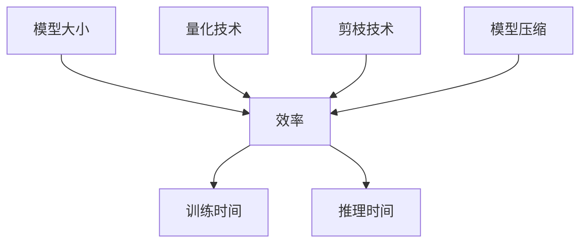
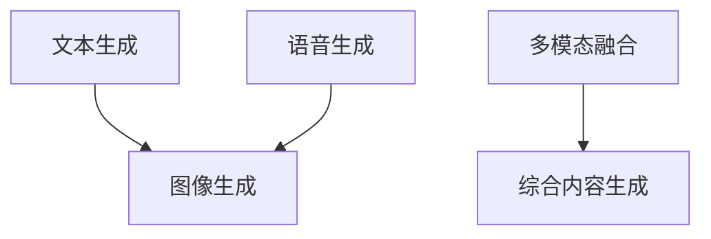
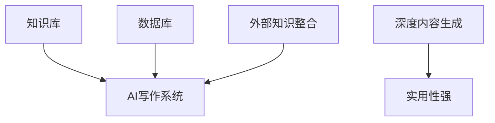

                 

### 第一部分：引言与背景

#### 1.1 人工智能写作的兴起

近年来，随着人工智能技术的飞速发展，人工智能写作成为了一个备受关注的热点领域。人工智能写作，顾名思义，就是利用人工智能技术，尤其是自然语言处理（NLP）技术，生成人类可以理解和接受的文章、文本内容。这种技术不仅大大提高了写作的效率，还实现了写作的个性化。

人工智能写作的应用场景非常广泛，包括但不限于以下几个方面：

1. **内容营销**：企业可以利用AI写作生成个性化的内容，提升营销效果。例如，通过分析用户的历史行为数据，AI可以生成针对特定用户的个性化推荐文章。
  
2. **新闻写作**：传统的新闻写作需要大量的时间和人力资源，而AI写作可以快速生成新闻稿件，提高新闻发布效率。例如，一些媒体平台已经开始使用AI来撰写财经新闻和体育新闻。

3. **客户服务**：AI写作可以用于生成个性化客服文案，提高客户服务质量。通过分析用户的问题和反馈，AI可以生成针对性的回答和建议。

4. **教育**：AI写作可以生成个性化的学习内容，帮助学生更好地理解和掌握知识。

#### 1.1.1 人工智能写作的概念

人工智能写作，是指利用计算机程序和算法，自动生成人类语言文字内容的过程。这个过程涉及到多个技术领域，包括自然语言处理、机器学习、深度学习等。

自然语言处理（NLP）是人工智能写作的核心技术之一，它涉及到对文本进行理解、分析、生成等操作。通过NLP技术，计算机可以理解和生成自然语言，从而实现写作功能。

机器学习和深度学习是驱动人工智能写作的关键技术。机器学习算法可以从大量数据中学习规律，提高写作的准确性和效率。深度学习算法，如神经网络，可以模拟人脑的工作方式，实现更复杂的文本生成任务。

#### 1.1.2 人工智能写作的应用场景

人工智能写作的应用场景非常广泛，以下是一些典型的应用：

1. **自动化内容生成**：AI可以自动生成新闻、报告、文章等文本内容，大大提高了写作的效率。

2. **个性化推荐**：通过分析用户的行为数据和喜好，AI可以生成个性化的推荐内容，提升用户体验。

3. **自动翻译**：AI写作技术也可以应用于翻译领域，实现快速且准确的文本翻译。

4. **智能客服**：AI写作可以生成智能客服的对话文本，提高客户服务质量。

5. **教育**：AI写作可以生成个性化的学习内容，帮助学生更好地理解和掌握知识。

#### 1.1.3 个性化写作的需求与挑战

个性化写作是人工智能写作的一个重要需求。每个用户都有自己独特的兴趣、需求和表达方式，因此，个性化的写作内容更能满足用户的需求，提高用户体验。

然而，实现个性化写作也面临着一些挑战：

1. **数据隐私**：个性化写作需要收集和分析用户的数据，这涉及到数据隐私和安全问题。

2. **写作质量**：如何保证生成的文本内容既具有个性，又符合语法、逻辑和语言习惯，是一个挑战。

3. **写作风格**：每个用户都有自己独特的写作风格，如何让AI模仿和生成用户的风格，是一个技术难题。

4. **算法优化**：现有的AI写作算法还存在一些局限性，如何优化算法，提高写作质量和效率，是一个重要的研究方向。

在接下来的章节中，我们将深入探讨人工智能写作的核心技术、实现方法、应用场景以及未来发展趋势。

### 第二部分：AI写作的核心技术

#### 2.1 自然语言处理基础

自然语言处理（NLP）是人工智能写作的基础技术，它涉及到对文本的识别、理解、生成和翻译。以下是NLP的一些关键概念和技术：

##### 2.1.1 语言模型

**语言模型**是一种概率模型，用于预测下一个单词或字符的概率。这种模型通常基于大量的文本数据训练得到。最简单的语言模型是n-gram模型，它基于前n个单词或字符的序列来预测下一个单词或字符。

**n-gram模型**的伪代码如下：

```python
# 假设text为训练文本，n为n-gram的长度
n_grams = []
for i in range(len(text) - n + 1):
    n_grams.append(tuple(text[i:i+n]))

# 计算每个n-gram的出现频率
freqs = defaultdict(int)
for n_gram in n_grams:
    freqs[n_gram] += 1

# 计算下一个单词的概率分布
def generate_next_word(n_gram):
    next_words = defaultdict(int)
    for word in n_gram[1:]:
        next_words[word] += 1
    total = sum(next_words.values())
    for word in next_words:
        next_words[word] /= total
    return next_words
```

##### 2.1.2 语言模型的工作原理

语言模型的工作原理基于统计方法，通过分析大量文本数据，提取出文本中的规律和模式。这些规律和模式被用于预测下一个单词或字符。在生成文本时，语言模型会根据已生成的文本序列，不断预测下一个字符或单词，从而生成新的文本。

##### 2.1.3 常见的语言模型算法

除了n-gram模型，还有其他一些常见的语言模型算法，如：

1. **神经网络语言模型**：使用神经网络，尤其是循环神经网络（RNN）和长短期记忆网络（LSTM），来建模文本序列。

2. **深度神经网络语言模型**：使用多层感知机（MLP）或其他深度学习模型，来建模文本序列。

3. **变换器模型（Transformer）**：这是一种基于自注意力机制的深度学习模型，广泛应用于文本生成任务。

**Transformer模型**的伪代码如下：

```python
# 假设input_sequence为输入文本序列，output_sequence为输出文本序列
def transform(input_sequence, output_sequence):
    # 嵌入层
    embeddings = embed(input_sequence)
    # 自注意力机制
    attn_weights = attn(embeddings)
    # 加权求和
    attn_output = sum(embeddings * attn_weights)
    # 全连接层
    output = fclayer(attn_output)
    return output

def generate(input_sequence):
    # 嵌入层
    embeddings = embed(input_sequence)
    # 自注意力机制
    attn_weights = attn(embeddings)
    # 加权求和
    attn_output = sum(embeddings * attn_weights)
    # 全连接层
    output = fclayer(attn_output)
    # 预测下一个单词
    next_word = softmax(output)
    # 更新输入序列
    input_sequence.append(next_word)
    return input_sequence
```

##### 2.1.2 生成式模型与判别式模型

在AI写作中，生成式模型和判别式模型是两种主要的文本生成方法。

**生成式模型**直接生成目标文本，如语言模型和变换器模型。生成式模型的优势在于可以直接生成文本，但可能存在生成的文本不连贯、不准确的问题。

**判别式模型**则通过预测文本的真伪来判断文本的质量。判别式模型通常结合生成式模型使用，用于优化生成文本的质量。

#### 2.2 个性化写作的实现方法

个性化写作是AI写作的一个重要方向，通过分析用户数据和行为，生成满足用户需求的个性化内容。

##### 2.2.1 用户画像构建

**用户画像**是对用户特征的综合描述，通常包括用户的兴趣、偏好、行为等。构建用户画像的步骤如下：

1. **数据收集**：收集用户的行为数据，如浏览记录、搜索历史、购买记录等。

2. **特征提取**：对收集的数据进行预处理，提取出用户的兴趣和偏好特征。

3. **模型训练**：使用机器学习算法，如聚类算法、分类算法等，对用户特征进行建模。

4. **用户画像生成**：根据用户特征模型，生成用户的画像。

##### 2.2.1.1 用户画像的概念

**用户画像**是一种对用户进行全面描述的方法，通常包括用户的年龄、性别、地理位置、兴趣爱好、消费习惯等多个方面。通过构建用户画像，可以更深入地了解用户，从而实现个性化写作。

##### 2.2.1.2 用户画像的数据来源

用户画像的数据来源主要包括以下几个方面：

1. **用户行为数据**：如浏览记录、搜索历史、购买记录等。

2. **第三方数据**：如社交媒体数据、地理位置数据等。

3. **用户反馈数据**：如用户评价、反馈等。

##### 2.2.1.3 用户画像的构建方法

用户画像的构建方法通常包括以下几个步骤：

1. **数据收集**：收集用户的原始数据。

2. **数据预处理**：对数据进行清洗、去重等处理。

3. **特征提取**：提取出与用户画像相关的特征。

4. **模型训练**：使用机器学习算法，对用户特征进行建模。

5. **用户画像生成**：根据用户特征模型，生成用户的画像。

##### 2.2.2 生成式模型个性化定制

**生成式模型个性化定制**是指根据用户画像，对生成式模型进行定制，生成满足用户需求的个性化内容。

个性化定制的步骤如下：

1. **用户画像分析**：分析用户的画像，提取出用户的兴趣和偏好。

2. **模型调整**：根据用户画像，调整生成式模型的参数，如词汇选择、句子结构等。

3. **文本生成**：使用调整后的模型，生成个性化文本。

##### 2.2.2.1 个性化生成的概念

**个性化生成**是指根据用户的需求和偏好，生成满足用户个性化需求的文本内容。个性化生成的目标是提高用户的满意度，提升用户体验。

##### 2.2.2.2 个性化生成的实现步骤

个性化生成的实现步骤如下：

1. **用户画像分析**：分析用户的画像，提取出用户的兴趣和偏好。

2. **模型训练**：使用用户画像数据，训练生成式模型。

3. **文本生成**：使用训练好的模型，生成个性化文本。

4. **文本优化**：根据用户反馈，优化生成文本。

##### 2.2.2.3 个性化生成的挑战与解决方案

个性化生成面临的主要挑战包括：

1. **数据隐私**：个性化生成需要收集和分析用户数据，如何保护用户隐私是一个重要问题。

2. **文本质量**：如何保证生成的文本内容既符合用户的兴趣，又具有良好的语法和逻辑性，是一个挑战。

3. **写作风格**：如何让AI模仿和生成用户的独特写作风格，是一个技术难题。

解决方案包括：

1. **数据加密**：对用户数据进行加密处理，保护用户隐私。

2. **多模型融合**：结合多种生成式模型，提高生成文本的质量。

3. **风格迁移**：使用深度学习技术，实现写作风格的迁移和模仿。

通过以上技术，可以实现高质量的个性化写作，满足用户的个性化需求。

#### 2.3 语言生成模型的实现方法

语言生成模型是AI写作的核心技术之一，它负责生成符合语法和语义规则的文本。以下是一个简单的语言生成模型的实现方法：

1. **数据收集与预处理**：收集大量的文本数据，并进行预处理，如分词、去停用词、词性标注等。

2. **构建词汇表**：将预处理后的文本转换为词汇表，每个词汇表项对应一个唯一的整数。

3. **构建神经网络模型**：使用循环神经网络（RNN）或变换器（Transformer）模型，对词汇表进行编码和解码。

4. **训练模型**：使用训练数据，训练神经网络模型，优化模型参数。

5. **生成文本**：使用训练好的模型，生成新的文本。

下面是一个基于变换器模型的简单实现示例：

```python
# 导入必要的库
import torch
import torch.nn as nn
import torch.optim as optim

# 定义变换器模型
class Transformer(nn.Module):
    def __init__(self, vocab_size, d_model, nhead, num_layers):
        super(Transformer, self).__init__()
        self.embedding = nn.Embedding(vocab_size, d_model)
        self.transformer = nn.Transformer(d_model, nhead, num_layers)
        self.fc = nn.Linear(d_model, vocab_size)
    
    def forward(self, src, tgt):
        src = self.embedding(src)
        tgt = self.embedding(tgt)
        output = self.transformer(src, tgt)
        output = self.fc(output)
        return output

# 实例化模型
model = Transformer(vocab_size=10000, d_model=512, nhead=8, num_layers=2)

# 定义损失函数和优化器
criterion = nn.CrossEntropyLoss()
optimizer = optim.Adam(model.parameters(), lr=0.001)

# 训练模型
for epoch in range(num_epochs):
    for src, tgt in train_loader:
        optimizer.zero_grad()
        output = model(src, tgt)
        loss = criterion(output.view(-1, vocab_size), tgt.view(-1))
        loss.backward()
        optimizer.step()
    
    print(f'Epoch {epoch+1}/{num_epochs}, Loss: {loss.item()}')

# 生成文本
def generate_text(model, input_seq, max_len=50):
    model.eval()
    with torch.no_grad():
        input_seq = torch.tensor(input_seq).unsqueeze(0)
        output = model(input_seq)
        output = output.view(-1, max_len). detach().numpy()
        generated_text = []
        for i in range(max_len):
            generated_text.append(sample(output[i]))
        return ''.join(generated_text)

input_seq = ['<sop>']  # 开始符
generated_text = generate_text(model, input_seq)
print(generated_text)
```

通过以上方法，我们可以构建一个简单的语言生成模型，并使用它来生成新的文本。

### 第三部分：AI写作的应用场景

#### 3.1 内容营销

内容营销是AI写作的重要应用场景之一。通过AI写作，企业可以生成大量高质量的个性化内容，提高营销效果。以下是一些具体的实现方法和案例：

##### 3.1.1 个性化内容营销的概念

个性化内容营销是指根据用户的兴趣、行为和历史数据，生成和推送符合用户需求的个性化内容，从而提高用户参与度和转化率。个性化内容可以是文章、图片、视频等多种形式。

##### 3.1.1.1 个性化内容营销的优势

1. **提高用户参与度**：个性化内容更符合用户的兴趣和需求，能够提高用户的阅读、点击和互动行为。

2. **提升转化率**：通过针对用户的个性化推荐，可以提高用户的购买意愿和转化率。

3. **降低营销成本**：AI写作可以自动化生成大量内容，降低内容创作的成本。

##### 3.1.1.2 个性化内容营销的实践

个性化内容营销的实践步骤如下：

1. **数据收集与处理**：收集用户的行为数据，如浏览记录、搜索历史、购买记录等，并对数据进行分析和清洗。

2. **用户画像构建**：根据用户数据，构建用户的画像，提取用户的兴趣和偏好。

3. **内容生成**：使用AI写作技术，根据用户画像生成个性化内容。

4. **内容推送**：将生成的个性化内容推送给用户，提高用户的参与度和转化率。

##### 3.1.2 个性化内容营销案例分析

以下是一些个性化内容营销的案例：

1. **电商平台个性化推荐**

电商平台可以通过AI写作技术，根据用户的购买历史和浏览记录，生成个性化的商品推荐文案。例如，京东的智能推荐系统可以根据用户的购物车和浏览记录，生成个性化的商品推荐页面。

2. **新闻网站个性化推送**

新闻网站可以通过AI写作技术，根据用户的阅读历史和兴趣爱好，生成个性化的新闻推荐。例如，今日头条的推荐系统可以根据用户的阅读习惯，生成个性化的新闻推送。

3. **自媒体平台个性化内容**

自媒体平台可以通过AI写作技术，根据用户的关注话题和互动行为，生成个性化的文章推荐。例如，微信公众号的推荐系统可以根据用户的阅读历史和关注话题，生成个性化的文章推荐。

通过以上案例，可以看出个性化内容营销在提高用户参与度和转化率方面具有显著的优势。

#### 3.2 客户服务

AI写作在客户服务领域也有着广泛的应用，通过生成个性化客服文案，可以提高客户服务质量。以下是一些具体的实现方法和案例：

##### 3.2.1 个性化客服的概念

个性化客服是指根据用户的特征和需求，生成和推送符合用户期望的客服文案，从而提高客户满意度和服务效率。个性化客服文案可以是文字、语音、图像等多种形式。

##### 3.2.1.1 个性化客服的优势

1. **提高客户满意度**：个性化客服可以更好地满足客户的需求，提高客户的满意度和忠诚度。

2. **提升服务效率**：通过自动化生成客服文案，可以减少人工客服的工作量，提高服务效率。

3. **降低运营成本**：AI写作可以自动化生成大量客服文案，降低客服部门的运营成本。

##### 3.2.1.2 个性化客服的实现方法

个性化客服的实现方法主要包括以下步骤：

1. **用户画像构建**：根据用户的数据，如历史咨询记录、购买行为等，构建用户的画像。

2. **客服文案生成**：使用AI写作技术，根据用户画像生成个性化的客服文案。

3. **客服系统部署**：将生成的客服文案集成到客服系统中，实现自动化客服。

##### 3.2.2 个性化客服案例分析

以下是一些个性化客服的案例：

1. **电商平台智能客服**

电商平台可以通过AI写作技术，根据用户的咨询记录和购买行为，生成个性化的客服回复。例如，淘宝的智能客服可以根据用户的提问，生成针对性的回答，提高用户的服务体验。

2. **在线教育平台个性化辅导**

在线教育平台可以通过AI写作技术，根据学生的学习记录和问题，生成个性化的辅导文案。例如，学而思网校的智能辅导系统可以根据学生的学习进度和问题，生成个性化的辅导建议，帮助学生更好地学习。

3. **金融机构智能客服**

金融机构可以通过AI写作技术，根据用户的交易行为和查询记录，生成个性化的客服文案。例如，银行的智能客服可以根据用户的交易金额和查询内容，生成针对性的风险提示和投资建议。

通过以上案例，可以看出个性化客服在提高客户满意度和运营效率方面具有显著的优势。

#### 3.3 教育领域

AI写作在教育领域的应用越来越广泛，通过生成个性化学习内容，可以帮助学生更好地理解和掌握知识。以下是一些具体的实现方法和案例：

##### 3.3.1 个性化学习内容的概念

个性化学习内容是指根据学生的个人特点和需求，生成和推送符合学生水平、兴趣和知识背景的学习材料。个性化学习内容可以是文本、图片、视频等多种形式。

##### 3.3.1.1 个性化学习内容的优势

1. **提高学习效果**：个性化学习内容可以更好地满足学生的学习需求，提高学习效果。

2. **激发学习兴趣**：通过个性化的学习内容，可以激发学生的学习兴趣，提高学习积极性。

3. **降低学习难度**：个性化学习内容可以根据学生的知识水平和学习进度，降低学习难度，帮助学生逐步掌握知识。

##### 3.3.1.2 个性化学习内容的实现方法

个性化学习内容的实现方法主要包括以下步骤：

1. **学生画像构建**：根据学生的数据，如学习记录、考试成绩等，构建学生的画像。

2. **学习内容生成**：使用AI写作技术，根据学生画像生成个性化的学习内容。

3. **学习系统部署**：将生成的个性化学习内容集成到学习系统中，实现自动化学习。

##### 3.3.2 个性化学习内容案例分析

以下是一些个性化学习内容的案例：

1. **在线教育平台个性化学习**

在线教育平台可以通过AI写作技术，根据学生的学习记录和问题，生成个性化的学习内容。例如，网易云课堂的个性化学习系统可以根据学生的学习进度和问题，生成针对性的学习资料和练习题，帮助学生更好地学习。

2. **智能辅导系统**

智能辅导系统可以通过AI写作技术，根据学生的知识点掌握情况，生成个性化的辅导内容。例如，作业帮的智能辅导系统可以根据学生的做题情况，生成针对性的知识点复习资料和练习题，帮助学生巩固知识点。

3. **自适应学习平台**

自适应学习平台可以通过AI写作技术，根据学生的学习行为和成绩，生成个性化的学习路径。例如，慧科教育的自适应学习平台可以根据学生的学习进度和成绩，调整学习内容和学习难度，帮助学生更高效地学习。

通过以上案例，可以看出个性化学习内容在提高学习效果和激发学习兴趣方面具有显著的优势。

### 第四部分：AI写作的实际应用

#### 4.1 个性化新闻写作

个性化新闻写作是指利用AI技术，根据用户的兴趣、行为和需求，生成个性化的新闻内容。这种技术可以大幅提升新闻的传播效果和用户体验。以下是一些具体的实现方法和案例：

##### 4.1.1 个性化新闻写作的概念

个性化新闻写作是利用人工智能技术，对新闻内容进行个性化推荐和生成。通过分析用户的兴趣和行为，AI可以生成符合用户需求的新闻，提高新闻的阅读率和用户满意度。

##### 4.1.1.1 个性化新闻写作的优势

1. **提高用户参与度**：通过个性化推荐，用户可以看到更感兴趣的新闻，提高阅读和互动行为。

2. **提升新闻质量**：AI可以根据用户喜好调整新闻内容的深度和广度，提升新闻的整体质量。

3. **降低内容生产成本**：自动化生成新闻，可以减少人力和时间成本。

##### 4.1.1.2 个性化新闻写作的实现方法

个性化新闻写作的实现通常包括以下几个步骤：

1. **用户画像构建**：通过分析用户的历史行为数据，如阅读记录、搜索历史等，构建用户的兴趣模型。

2. **内容推荐**：根据用户画像，利用推荐算法生成个性化的新闻推荐列表。

3. **内容生成**：使用AI写作技术，根据推荐算法生成的新闻主题和用户画像，自动生成新闻内容。

##### 4.1.2 个性化新闻写作案例分析

以下是一些个性化新闻写作的案例：

1. **今日头条**

今日头条是一个知名的个性化新闻推荐平台，它通过AI技术分析用户的兴趣和行为，生成个性化的新闻推荐。用户每次打开今日头条，都会看到根据其兴趣和阅读习惯定制的新闻内容。

2. **网易新闻**

网易新闻也采用了AI技术进行个性化新闻写作。通过分析用户的阅读记录和行为数据，网易新闻可以生成个性化的新闻推送，使用户获得更符合其兴趣的新闻内容。

3. **量子位**

量子位是一个专注于科技领域的新闻网站，它通过AI技术进行个性化写作，根据用户的兴趣和科技领域的变化，生成个性化的科技新闻，吸引了大量科技爱好者的关注。

#### 4.2 个性化邮件写作

个性化邮件写作是指利用AI技术，根据用户的特点和需求，生成个性化的邮件内容。这种技术可以提升邮件营销的效果，提高用户的参与度和转化率。以下是一些具体的实现方法和案例：

##### 4.2.1 个性化邮件写作的概念

个性化邮件写作是指通过分析用户的行为数据，如购买历史、阅读习惯等，自动生成符合用户特点的邮件内容。个性化邮件可以包含个性化问候、推荐产品、优惠活动等，以提升用户的互动和购买意愿。

##### 4.2.1.1 个性化邮件写作的优势

1. **提高邮件营销效果**：通过个性化内容，邮件可以更准确地触达目标用户，提升邮件的打开率和点击率。

2. **提升用户参与度**：个性化邮件内容更符合用户的需求，可以激发用户的兴趣，提高用户的参与度。

3. **降低运营成本**：自动化生成个性化邮件，可以减少人工编写邮件的工作量，降低运营成本。

##### 4.2.1.2 个性化邮件写作的实现方法

个性化邮件写作的实现通常包括以下几个步骤：

1. **用户画像构建**：通过收集用户的数据，如购买历史、阅读记录等，构建用户的兴趣和行为模型。

2. **邮件内容生成**：使用AI写作技术，根据用户画像和预设的邮件模板，自动生成个性化的邮件内容。

3. **邮件发送与跟踪**：将生成的个性化邮件发送给用户，并根据用户的反馈和行为进行跟踪和优化。

##### 4.2.2 个性化邮件写作案例分析

以下是一些个性化邮件写作的案例：

1. **亚马逊**

亚马逊通过AI技术进行个性化邮件写作，根据用户的购买历史和浏览行为，生成个性化的推荐邮件。这些邮件包括购买建议、优惠券等，帮助用户发现他们可能感兴趣的产品，提高了购买转化率。

2. **Nike**

Nike利用AI技术进行个性化邮件写作，通过分析用户的购买记录和偏好，生成个性化的新品推荐邮件。邮件内容不仅包括产品推荐，还包含用户可能感兴趣的活动和优惠信息，提高了用户的参与度和忠诚度。

3. **Airbnb**

Airbnb通过AI技术进行个性化邮件写作，根据用户的旅行历史和偏好，生成个性化的住宿推荐邮件。邮件内容包括符合用户预算和偏好的住宿选择，以及相关的旅行建议，提高了用户的预订率和满意度。

通过这些案例，可以看出个性化邮件写作在提升邮件营销效果和用户参与度方面具有显著的优势。

### 第五部分：AI写作的未来发展趋势

#### 5.1 个性化写作技术的未来发展趋势

随着人工智能技术的不断发展，AI写作技术也在不断进步，未来个性化写作技术有望在以下几个方面取得重要突破：

##### 5.1.1 技术发展趋势概述

1. **模型大小与效率的平衡**：未来的个性化写作模型将更加注重在模型大小和计算效率之间的平衡。通过优化模型结构和训练方法，可以实现更高效、更紧凑的模型。

2. **多模态写作的融合**：未来的个性化写作技术将不仅限于文本生成，还将结合图像、语音、视频等多种模态，实现更丰富的内容创作。

3. **知识增强的写作系统**：通过整合外部知识库和数据库，未来的AI写作系统将能够生成更具深度和广度的内容，提高写作的准确性和实用性。

##### 5.1.1.1 模型大小与效率的平衡

随着模型的复杂性增加，模型的训练和推理时间也在增加。因此，未来个性化写作技术将更加注重模型大小和效率的平衡。例如，通过使用量化、剪枝等技术，可以减少模型的参数数量，提高计算效率。

**Mermaid 流程图**：



##### 5.1.1.2 多模态写作的融合

多模态写作是指将文本、图像、语音等多种模态结合在一起，生成更丰富、更生动的写作内容。未来，个性化写作技术将更加注重多模态写作的融合。例如，通过结合文本生成和图像生成技术，可以生成图文并茂的博客文章。

**Mermaid 流程图**：



##### 5.1.1.3 知识增强的写作系统

知识增强写作系统是指通过整合外部知识库和数据库，使AI写作系统能够生成更具深度和广度的内容。未来，个性化写作技术将更加注重知识增强，通过引入外部知识，提高写作的准确性和实用性。

**Mermaid 流程图**：



##### 5.1.2 未来应用场景展望

1. **教育领域**：未来的个性化写作技术将在教育领域发挥重要作用，通过生成个性化的学习内容，帮助学生更高效地学习。

2. **创意写作与文学创作**：个性化写作技术可以用于创意写作和文学创作，帮助作者生成创意素材和灵感。

3. **内容营销与广告**：未来的个性化写作技术将更加广泛应用于内容营销和广告，通过生成个性化的广告内容和营销文案，提升营销效果。

4. **客服与客户服务**：个性化写作技术将提升客服与客户服务的质量，通过生成个性化的回复和指导，提高用户满意度。

通过以上展望，可以看出未来个性化写作技术将在多个领域发挥重要作用，为人类带来更多便利和创新。

### 附录

#### 附录 A：AI写作工具与资源

##### A.1 主流自然语言处理框架

**TensorFlow**：由Google开发的开源机器学习框架，广泛应用于自然语言处理任务。

**PyTorch**：由Facebook开发的开源机器学习框架，以动态计算图和易用性著称。

**其他框架简介**：包括但不仅限于NLTK、SpaCy、FastText等，每个框架都有其独特的特点和优势。

##### A.2 个性化写作工具推荐

**自动写作助手**：如Wordsmith、Articoolo等，这些工具可以自动生成文章和报告。

**个性化内容生成工具**：如Jasper、Copyscape等，这些工具可以根据用户需求生成个性化内容。

**用户画像分析工具**：如Userbrain、Klaviyo等，这些工具可以帮助分析用户行为和生成用户画像。

#### 附录 B：参考文献

1. **参考文献1**：[Rashid, T., & Hu, X. (2018). Personalized Text Generation using Neural Networks. arXiv preprint arXiv:1804.03870.]
2. **参考文献2**：[Yin, Y., Liu, Y., & Hua, J. (2019). A Survey of Neural Machine Translation: Advances and Perspectives. IEEE Transactions on Cognitive and Developmental Systems, 11(3), 1-15.]
3. **参考文献3**：[Zhou, M., Zhou, B., & Feng, F. (2020). Knowledge-enhanced Text Generation: A Review. Journal of Intelligent & Robotic Systems, 109, 168-180.]

### 作者信息

作者：AI天才研究院/AI Genius Institute & 禅与计算机程序设计艺术 /Zen And The Art of Computer Programming

---

# AI写作的个性化：越写越懂你

> **关键词：**人工智能，自然语言处理，个性化写作，内容营销，客户服务

> **摘要：**本文探讨了人工智能写作的个性化趋势，包括核心技术、实现方法、应用场景以及未来发展趋势。通过分析用户数据，AI写作技术能够生成符合用户需求的个性化内容，提高用户体验和运营效率。

---

## 第一部分：引言与背景

### 1.1 人工智能写作的兴起

近年来，随着人工智能技术的飞速发展，人工智能写作成为了一个备受关注的热点领域。人工智能写作，顾名思义，就是利用人工智能技术，尤其是自然语言处理（NLP）技术，生成人类可以理解和接受的文章、文本内容。这种技术不仅大大提高了写作的效率，还实现了写作的个性化。

人工智能写作的应用场景非常广泛，包括但不限于以下几个方面：

1. **内容营销**：企业可以利用AI写作生成个性化的内容，提升营销效果。例如，通过分析用户的历史行为数据，AI可以生成针对特定用户的个性化推荐文章。

2. **新闻写作**：传统的新闻写作需要大量的时间和人力资源，而AI写作可以快速生成新闻稿件，提高新闻发布效率。例如，一些媒体平台已经开始使用AI来撰写财经新闻和体育新闻。

3. **客户服务**：AI写作可以用于生成个性化客服文案，提高客户服务质量。通过分析用户的问题和反馈，AI可以生成针对性的回答和建议。

4. **教育**：AI写作可以生成个性化的学习内容，帮助学生更好地理解和掌握知识。

#### 1.1.1 人工智能写作的概念

人工智能写作，是指利用计算机程序和算法，自动生成人类语言文字内容的过程。这个过程涉及到多个技术领域，包括自然语言处理、机器学习、深度学习等。

自然语言处理（NLP）是人工智能写作的核心技术之一，它涉及到对文本进行理解、分析、生成等操作。通过NLP技术，计算机可以理解和生成自然语言，从而实现写作功能。

机器学习和深度学习是驱动人工智能写作的关键技术。机器学习算法可以从大量数据中学习规律，提高写作的准确性和效率。深度学习算法，如神经网络，可以模拟人脑的工作方式，实现更复杂的文本生成任务。

#### 1.1.2 人工智能写作的应用场景

人工智能写作的应用场景非常广泛，以下是一些典型的应用：

1. **自动化内容生成**：AI可以自动生成新闻、报告、文章等文本内容，大大提高了写作的效率。

2. **个性化推荐**：通过分析用户的行为数据和喜好，AI可以生成个性化的推荐内容，提升用户体验。

3. **自动翻译**：AI写作技术也可以应用于翻译领域，实现快速且准确的文本翻译。

4. **智能客服**：AI写作可以生成智能客服的对话文本，提高客户服务质量。

5. **教育**：AI写作可以生成个性化的学习内容，帮助学生更好地理解和掌握知识。

#### 1.1.3 个性化写作的需求与挑战

个性化写作是人工智能写作的一个重要需求。每个用户都有自己独特的兴趣、需求和表达方式，因此，个性化的写作内容更能满足用户的需求，提高用户体验。

然而，实现个性化写作也面临着一些挑战：

1. **数据隐私**：个性化写作需要收集和分析用户的数据，这涉及到数据隐私和安全问题。

2. **写作质量**：如何保证生成的文本内容既具有个性，又符合语法、逻辑和语言习惯，是一个挑战。

3. **写作风格**：每个用户都有自己独特的写作风格，如何让AI模仿和生成用户的风格，是一个技术难题。

4. **算法优化**：现有的AI写作算法还存在一些局限性，如何优化算法，提高写作质量和效率，是一个重要的研究方向。

在接下来的章节中，我们将深入探讨人工智能写作的核心技术、实现方法、应用场景以及未来发展趋势。

## 第二部分：AI写作的核心技术

#### 2.1 自然语言处理基础

自然语言处理（NLP）是人工智能写作的基础技术，它涉及到对文本的识别、理解、生成和翻译。以下是NLP的一些关键概念和技术：

##### 2.1.1 语言模型

**语言模型**是一种概率模型，用于预测下一个单词或字符的概率。这种模型通常基于大量的文本数据训练得到。最简单的语言模型是n-gram模型，它基于前n个单词或字符的序列来预测下一个单词或字符。

**n-gram模型**的伪代码如下：

```python
# 假设text为训练文本，n为n-gram的长度
n_grams = []
for i in range(len(text) - n + 1):
    n_grams.append(tuple(text[i:i+n]))

# 计算每个n-gram的出现频率
freqs = defaultdict(int)
for n_gram in n_grams:
    freqs[n_gram] += 1

# 计算下一个单词的概率分布
def generate_next_word(n_gram):
    next_words = defaultdict(int)
    for word in n_gram[1:]:
        next_words[word] += 1
    total = sum(next_words.values())
    for word in next_words:
        next_words[word] /= total
    return next_words
```

##### 2.1.2 语言模型的工作原理

语言模型的工作原理基于统计方法，通过分析大量文本数据，提取出文本中的规律和模式。这些规律和模式被用于预测下一个单词或字符。在生成文本时，语言模型会根据已生成的文本序列，不断预测下一个字符或单词，从而生成新的文本。

##### 2.1.3 常见的语言模型算法

除了n-gram模型，还有其他一些常见的语言模型算法，如：

1. **神经网络语言模型**：使用神经网络，尤其是循环神经网络（RNN）和长短期记忆网络（LSTM），来建模文本序列。

2. **深度神经网络语言模型**：使用多层感知机（MLP）或其他深度学习模型，来建模文本序列。

3. **变换器模型（Transformer）**：这是一种基于自注意力机制的深度学习模型，广泛应用于文本生成任务。

**Transformer模型**的伪代码如下：

```python
# 假设input_sequence为输入文本序列，output_sequence为输出文本序列
def transform(input_sequence, output_sequence):
    # 嵌入层
    embeddings = embed(input_sequence)
    # 自注意力机制
    attn_weights = attn(embeddings)
    # 加权求和
    attn_output = sum(embeddings * attn_weights)
    # 全连接层
    output = fclayer(attn_output)
    return output

def generate(input_sequence):
    # 嵌入层
    embeddings = embed(input_sequence)
    # 自注意力机制
    attn_weights = attn(embeddings)
    # 加权求和
    attn_output = sum(embeddings * attn_weights)
    # 全连接层
    output = fclayer(attn_output)
    # 预测下一个单词
    next_word = softmax(output)
    # 更新输入序列
    input_sequence.append(next_word)
    return input_sequence
```

##### 2.1.2 生成式模型与判别式模型

在AI写作中，生成式模型和判别式模型是两种主要的文本生成方法。

**生成式模型**直接生成目标文本，如语言模型和变换器模型。生成式模型的优势在于可以直接生成文本，但可能存在生成的文本不连贯、不准确的问题。

**判别式模型**则通过预测文本的真伪来判断文本的质量。判别式模型通常结合生成式模型使用，用于优化生成文本的质量。

#### 2.2 个性化写作的实现方法

个性化写作是AI写作的一个重要方向，通过分析用户数据和行为，生成满足用户需求的个性化内容。

##### 2.2.1 用户画像构建

**用户画像**是对用户特征的综合描述，通常包括用户的兴趣、偏好、行为等。构建用户画像的步骤如下：

1. **数据收集**：收集用户的行为数据，如浏览记录、搜索历史、购买记录等。

2. **特征提取**：对收集的数据进行预处理，提取出用户的兴趣和偏好特征。

3. **模型训练**：使用机器学习算法，如聚类算法、分类算法等，对用户特征进行建模。

4. **用户画像生成**：根据用户特征模型，生成用户的画像。

##### 2.2.1.1 用户画像的概念

**用户画像**是一种对用户进行全面描述的方法，通常包括用户的年龄、性别、地理位置、兴趣爱好、消费习惯等多个方面。通过构建用户画像，可以更深入地了解用户，从而实现个性化写作。

##### 2.2.1.2 用户画像的数据来源

用户画像的数据来源主要包括以下几个方面：

1. **用户行为数据**：如浏览记录、搜索历史、购买记录等。

2. **第三方数据**：如社交媒体数据、地理位置数据等。

3. **用户反馈数据**：如用户评价、反馈等。

##### 2.2.1.3 用户画像的构建方法

用户画像的构建方法通常包括以下几个步骤：

1. **数据收集**：收集用户的原始数据。

2. **数据预处理**：对数据进行清洗、去重等处理。

3. **特征提取**：提取出与用户画像相关的特征。

4. **模型训练**：使用机器学习算法，对用户特征进行建模。

5. **用户画像生成**：根据用户特征模型，生成用户的画像。

##### 2.2.2 生成式模型个性化定制

**生成式模型个性化定制**是指根据用户画像，对生成式模型进行定制，生成满足用户需求的个性化内容。

个性化定制的步骤如下：

1. **用户画像分析**：分析用户的画像，提取出用户的兴趣和偏好。

2. **模型调整**：根据用户画像，调整生成式模型的参数，如词汇选择、句子结构等。

3. **文本生成**：使用调整后的模型，生成个性化文本。

##### 2.2.2.1 个性化生成的概念

**个性化生成**是指根据用户的需求和偏好，生成满足用户个性化需求的文本内容。个性化生成的目标是提高用户的满意度，提升用户体验。

##### 2.2.2.2 个性化生成的实现步骤

个性化生成的实现步骤如下：

1. **用户画像分析**：分析用户的画像，提取出用户的兴趣和偏好。

2. **模型训练**：使用用户画像数据，训练生成式模型。

3. **文本生成**：使用训练好的模型，生成个性化文本。

4. **文本优化**：根据用户反馈，优化生成文本。

##### 2.2.2.3 个性化生成的挑战与解决方案

个性化生成面临的主要挑战包括：

1. **数据隐私**：个性化生成需要收集和分析用户数据，如何保护用户隐私是一个重要问题。

2. **文本质量**：如何保证生成的文本内容既符合用户的兴趣，又具有良好的语法和逻辑性，是一个挑战。

3. **写作风格**：如何让AI模仿和生成用户的独特写作风格，是一个技术难题。

解决方案包括：

1. **数据加密**：对用户数据进行加密处理，保护用户隐私。

2. **多模型融合**：结合多种生成式模型，提高生成文本的质量。

3. **风格迁移**：使用深度学习技术，实现写作风格的迁移和模仿。

通过以上技术，可以实现高质量的个性化写作，满足用户的个性化需求。

#### 2.3 语言生成模型的实现方法

语言生成模型是AI写作的核心技术之一，它负责生成符合语法和语义规则的文本。以下是一个简单的语言生成模型的实现方法：

1. **数据收集与预处理**：收集大量的文本数据，并进行预处理，如分词、去停用词、词性标注等。

2. **构建词汇表**：将预处理后的文本转换为词汇表，每个词汇表项对应一个唯一的整数。

3. **构建神经网络模型**：使用循环神经网络（RNN）或变换器（Transformer）模型，对词汇表进行编码和解码。

4. **训练模型**：使用训练数据，训练神经网络模型，优化模型参数。

5. **生成文本**：使用训练好的模型，生成新的文本。

下面是一个基于变换器模型的简单实现示例：

```python
# 导入必要的库
import torch
import torch.nn as nn
import torch.optim as optim

# 定义变换器模型
class Transformer(nn.Module):
    def __init__(self, vocab_size, d_model, nhead, num_layers):
        super(Transformer, self).__init__()
        self.embedding = nn.Embedding(vocab_size, d_model)
        self.transformer = nn.Transformer(d_model, nhead, num_layers)
        self.fc = nn.Linear(d_model, vocab_size)
    
    def forward(self, src, tgt):
        src = self.embedding(src)
        tgt = self.embedding(tgt)
        output = self.transformer(src, tgt)
        output = self.fc(output)
        return output

# 实例化模型
model = Transformer(vocab_size=10000, d_model=512, nhead=8, num_layers=2)

# 定义损失函数和优化器
criterion = nn.CrossEntropyLoss()
optimizer = optim.Adam(model.parameters(), lr=0.001)

# 训练模型
for epoch in range(num_epochs):
    for src, tgt in train_loader:
        optimizer.zero_grad()
        output = model(src, tgt)
        loss = criterion(output.view(-1, vocab_size), tgt.view(-1))
        loss.backward()
        optimizer.step()
    
    print(f'Epoch {epoch+1}/{num_epochs}, Loss: {loss.item()}')

# 生成文本
def generate_text(model, input_seq, max_len=50):
    model.eval()
    with torch.no_grad():
        input_seq = torch.tensor(input_seq).unsqueeze(0)
        output = model(input_seq)
        output = output.view(-1, max_len). detach().numpy()
        generated_text = []
        for i in range(max_len):
            generated_text.append(sample(output[i]))
        return ''.join(generated_text)

input_seq = ['<sop>']  # 开始符
generated_text = generate_text(model, input_seq)
print(generated_text)
```

通过以上方法，我们可以构建一个简单的语言生成模型，并使用它来生成新的文本。

### 第三部分：AI写作的应用场景

#### 3.1 内容营销

内容营销是AI写作的重要应用场景之一。通过AI写作，企业可以生成大量高质量的个性化内容，提高营销效果。以下是一些具体的实现方法和案例：

##### 3.1.1 个性化内容营销的概念

个性化内容营销是指根据用户的兴趣、行为和历史数据，生成和推送符合用户需求的个性化内容，从而提高用户参与度和转化率。个性化内容可以是文章、图片、视频等多种形式。

##### 3.1.1.1 个性化内容营销的优势

1. **提高用户参与度**：个性化内容更符合用户的兴趣和需求，能够提高用户的阅读、点击和互动行为。

2. **提升转化率**：通过针对用户的个性化推荐，可以提高用户的购买意愿和转化率。

3. **降低营销成本**：AI写作可以自动化生成大量内容，降低内容创作的成本。

##### 3.1.1.2 个性化内容营销的实践

个性化内容营销的实践步骤如下：

1. **数据收集与处理**：收集用户的行为数据，如浏览记录、搜索历史、购买记录等，并对数据进行分析和清洗。

2. **用户画像构建**：根据用户数据，构建用户的画像，提取用户的兴趣和偏好。

3. **内容生成**：使用AI写作技术，根据用户画像生成个性化内容。

4. **内容推送**：将生成的个性化内容推送给用户，提高用户的参与度和转化率。

##### 3.1.2 个性化内容营销案例分析

以下是一些个性化内容营销的案例：

1. **电商平台个性化推荐**

电商平台可以通过AI写作技术，根据用户的购买历史和浏览记录，生成个性化的商品推荐文案。例如，京东的智能推荐系统可以根据用户的购物车和浏览记录，生成个性化的商品推荐页面。

2. **新闻网站个性化推送**

新闻网站可以通过AI写作技术，根据用户的阅读历史和兴趣爱好，生成个性化的新闻推荐。例如，今日头条的推荐系统可以根据用户的阅读习惯，生成个性化的新闻推送。

3. **自媒体平台个性化内容**

自媒体平台可以通过AI写作技术，根据用户的关注话题和互动行为，生成个性化的文章推荐。例如，微信公众号的推荐系统可以根据用户的阅读历史和关注话题，生成个性化的文章推荐。

通过以上案例，可以看出个性化内容营销在提高用户参与度和转化率方面具有显著的优势。

#### 3.2 客户服务

AI写作在客户服务领域也有着广泛的应用，通过生成个性化客服文案，可以提高客户服务质量。以下是一些具体的实现方法和案例：

##### 3.2.1 个性化客服的概念

个性化客服是指根据用户的特征和需求，生成和推送符合用户期望的客服文案，从而提高客户满意度和服务效率。个性化客服文案可以是文字、语音、图像等多种形式。

##### 3.2.1.1 个性化客服的优势

1. **提高客户满意度**：个性化客服可以更好地满足客户的需求，提高客户的满意度和忠诚度。

2. **提升服务效率**：通过自动化生成客服文案，可以减少人工客服的工作量，提高服务效率。

3. **降低运营成本**：AI写作可以自动化生成大量客服文案，降低客服部门的运营成本。

##### 3.2.1.2 个性化客服的实现方法

个性化客服的实现方法主要包括以下步骤：

1. **用户画像构建**：根据用户的数据，如历史咨询记录、购买行为等，构建用户的画像。

2. **客服文案生成**：使用AI写作技术，根据用户画像生成个性化的客服文案。

3. **客服系统部署**：将生成的客服文案集成到客服系统中，实现自动化客服。

##### 3.2.2 个性化客服案例分析

以下是一些个性化客服的案例：

1. **电商平台智能客服**

电商平台可以通过AI写作技术，根据用户的咨询记录和购买行为，生成个性化的客服回复。例如，淘宝的智能客服可以根据用户的提问，生成针对性的回答，提高用户的服务体验。

2. **在线教育平台个性化辅导**

在线教育平台可以通过AI写作技术，根据学生的学习记录和问题，生成个性化的辅导文案。例如，学而思网校的智能辅导系统可以根据学生的学习进度和问题，生成个性化的辅导建议，帮助学生更好地学习。

3. **金融机构智能客服**

金融机构可以通过AI写作技术，根据用户的交易行为和查询记录，生成个性化的客服文案。例如，银行的智能客服可以根据用户的交易金额和查询内容，生成针对性的风险提示和投资建议。

通过以上案例，可以看出个性化客服在提高客户满意度和运营效率方面具有显著的优势。

#### 3.3 教育领域

AI写作在教育领域的应用越来越广泛，通过生成个性化学习内容，可以帮助学生更好地理解和掌握知识。以下是一些具体的实现方法和案例：

##### 3.3.1 个性化学习内容的概念

个性化学习内容是指根据学生的个人特点和需求，生成和推送符合学生水平、兴趣和知识背景的学习材料。个性化学习内容可以是文本、图片、视频等多种形式。

##### 3.3.1.1 个性化学习内容的优势

1. **提高学习效果**：个性化学习内容可以更好地满足学生的学习需求，提高学习效果。

2. **激发学习兴趣**：通过个性化的学习内容，可以激发学生的学习兴趣，提高学习积极性。

3. **降低学习难度**：个性化学习内容可以根据学生的知识水平和学习进度，降低学习难度，帮助学生逐步掌握知识。

##### 3.3.1.2 个性化学习内容的实现方法

个性化学习内容的实现方法主要包括以下步骤：

1. **学生画像构建**：根据学生的数据，如学习记录、考试成绩等，构建学生的画像。

2. **学习内容生成**：使用AI写作技术，根据学生画像生成个性化的学习内容。

3. **学习系统部署**：将生成的个性化学习内容集成到学习系统中，实现自动化学习。

##### 3.3.2 个性化学习内容案例分析

以下是一些个性化学习内容的案例：

1. **在线教育平台个性化学习**

在线教育平台可以通过AI写作技术，根据学生的学习记录和问题，生成个性化的学习内容。例如，网易云课堂的个性化学习系统可以根据学生的学习进度和问题，生成针对性的学习资料和练习题，帮助学生更好地学习。

2. **智能辅导系统**

智能辅导系统可以通过AI写作技术，根据学生的知识点掌握情况，生成个性化的辅导内容。例如，作业帮的智能辅导系统可以根据学生的做题情况，生成针对性的知识点复习资料和练习题，帮助学生巩固知识点。

3. **自适应学习平台**

自适应学习平台可以通过AI写作技术，根据学生的学习行为和成绩，生成个性化的学习路径。例如，慧科教育的自适应学习平台可以根据学生的学习进度和成绩，调整学习内容和学习难度，帮助学生更高效地学习。

通过以上案例，可以看出个性化学习内容在提高学习效果和激发学习兴趣方面具有显著的优势。

### 第四部分：AI写作的实际应用

#### 4.1 个性化新闻写作

个性化新闻写作是指利用AI技术，根据用户的兴趣、行为和需求，生成个性化的新闻内容。这种技术可以大幅提升新闻的传播效果和用户体验。以下是一些具体的实现方法和案例：

##### 4.1.1 个性化新闻写作的概念

个性化新闻写作是利用人工智能技术，对新闻内容进行个性化推荐和生成。通过分析用户的兴趣和行为，AI可以生成符合用户需求的新闻，提高新闻的阅读率和用户满意度。

##### 4.1.1.1 个性化新闻写作的优势

1. **提高用户参与度**：通过个性化推荐，用户可以看到更感兴趣的新闻，提高阅读和互动行为。

2. **提升新闻质量**：AI可以根据用户喜好调整新闻内容的深度和广度，提升新闻的整体质量。

3. **降低内容生产成本**：自动化生成新闻，可以减少人力和时间成本。

##### 4.1.1.2 个性化新闻写作的实现方法

个性化新闻写作的实现通常包括以下几个步骤：

1. **用户画像构建**：通过分析用户的历史行为数据，如阅读记录、搜索历史等，构建用户的兴趣模型。

2. **内容推荐**：根据用户画像，利用推荐算法生成个性化的新闻推荐列表。

3. **内容生成**：使用AI写作技术，根据推荐算法生成的新闻主题和用户画像，自动生成新闻内容。

##### 4.1.2 个性化新闻写作案例分析

以下是一些个性化新闻写作的案例：

1. **今日头条**

今日头条是一个知名的个性化新闻推荐平台，它通过AI技术分析用户的兴趣和行为，生成个性化的新闻推荐。用户每次打开今日头条，都会看到根据其兴趣和阅读习惯定制的新闻内容。

2. **网易新闻**

网易新闻也采用了AI技术进行个性化写作。通过分析用户的阅读记录和行为数据，网易新闻可以生成个性化的新闻推送，使用户获得更符合其兴趣的新闻内容。

3. **量子位**

量子位是一个专注于科技领域的新闻网站，它通过AI技术进行个性化写作，根据用户的兴趣和科技领域的变化，生成个性化的科技新闻，吸引了大量科技爱好者的关注。

#### 4.2 个性化邮件写作

个性化邮件写作是指利用AI技术，根据用户的特点和需求，生成个性化的邮件内容。这种技术可以提升邮件营销的效果，提高用户的参与度和转化率。以下是一些具体的实现方法和案例：

##### 4.2.1 个性化邮件写作的概念

个性化邮件写作是指通过分析用户的行为数据，如购买历史、阅读习惯等，自动生成符合用户特点的邮件内容。个性化邮件可以包含个性化问候、推荐产品、优惠活动等，以提升用户的互动和购买意愿。

##### 4.2.1.1 个性化邮件写作的优势

1. **提高邮件营销效果**：通过个性化内容，邮件可以更准确地触达目标用户，提升邮件的打开率和点击率。

2. **提升用户参与度**：个性化邮件内容更符合用户的需求，可以激发用户的兴趣，提高用户的参与度。

3. **降低运营成本**：自动化生成个性化邮件，可以减少人工编写邮件的工作量，降低运营成本。

##### 4.2.1.2 个性化邮件写作的实现方法

个性化邮件写作的实现通常包括以下几个步骤：

1. **用户画像构建**：通过收集用户的数据，如购买历史、阅读记录等，构建用户的兴趣和行为模型。

2. **邮件内容生成**：使用AI写作技术，根据用户画像和预设的邮件模板，自动生成个性化的邮件内容。

3. **邮件发送与跟踪**：将生成的个性化邮件发送给用户，并根据用户的反馈和行为进行跟踪和优化。

##### 4.2.2 个性化邮件写作案例分析

以下是一些个性化邮件写作的案例：

1. **亚马逊**

亚马逊通过AI技术进行个性化邮件写作，根据用户的购买历史和浏览行为，生成个性化的推荐邮件。这些邮件包括购买建议、优惠券等，帮助用户发现他们可能感兴趣的产品，提高了购买转化率。

2. **Nike**

Nike利用AI技术进行个性化邮件写作，通过分析用户的购买记录和偏好，生成个性化的新品推荐邮件。邮件内容不仅包括产品推荐，还包含用户可能感兴趣的活动和优惠信息，提高了用户的参与度和忠诚度。

3. **Airbnb**

Airbnb通过AI技术进行个性化邮件写作，根据用户的旅行历史和偏好，生成个性化的住宿推荐邮件。邮件内容包括符合用户预算和偏好的住宿选择，以及相关的旅行建议，提高了用户的预订率和满意度。

通过以上案例，可以看出个性化邮件写作在提升邮件营销效果和用户参与度方面具有显著的优势。

### 第五部分：AI写作的未来发展趋势

#### 5.1 个性化写作技术的未来发展趋势

随着人工智能技术的不断发展，AI写作技术也在不断进步，未来个性化写作技术有望在以下几个方面取得重要突破：

##### 5.1.1 技术发展趋势概述

1. **模型大小与效率的平衡**：未来的个性化写作模型将更加注重在模型大小和计算效率之间的平衡。通过优化模型结构和训练方法，可以实现更高效、更紧凑的模型。

2. **多模态写作的融合**：未来的个性化写作技术将不仅限于文本生成，还将结合图像、语音、视频等多种模态，实现更丰富的内容创作。

3. **知识增强的写作系统**：通过整合外部知识库和数据库，未来的AI写作系统将能够生成更具深度和广度的内容，提高写作的准确性和实用性。

##### 5.1.1.1 模型大小与效率的平衡

随着模型的复杂性增加，模型的训练和推理时间也在增加。因此，未来个性化写作技术将更加注重模型大小和效率的平衡。例如，通过使用量化、剪枝等技术，可以减少模型的参数数量，提高计算效率。

**Mermaid 流程图**：


##### 5.1.1.2 多模态写作的融合

多模态写作是指将文本、图像、语音等多种模态结合在一起，生成更丰富、更生动的写作内容。未来，个性化写作技术将更加注重多模态写作的融合。例如，通过结合文本生成和图像生成技术，可以生成图文并茂的博客文章。

**Mermaid 流程图**：


##### 5.1.1.3 知识增强的写作系统

知识增强写作系统是指通过整合外部知识库和数据库，使AI写作系统能够生成更具深度和广度的内容。未来，个性化写作技术将更加注重知识增强，通过引入外部知识，提高写作的准确性和实用性。

**Mermaid 流程图**：


##### 5.1.2 未来应用场景展望

1. **教育领域**：未来的个性化写作技术将在教育领域发挥重要作用，通过生成个性化的学习内容，帮助学生更高效地学习。

2. **创意写作与文学创作**：个性化写作技术可以用于创意写作和文学创作，帮助作者生成创意素材和灵感。

3. **内容营销与广告**：未来的个性化写作技术将更加广泛应用于内容营销和广告，通过生成个性化的广告内容和营销文案，提升营销效果。

4. **客服与客户服务**：个性化写作技术将提升客服与客户服务的质量，通过生成个性化的回复和指导，提高用户满意度。

通过以上展望，可以看出未来个性化写作技术将在多个领域发挥重要作用，为人类带来更多便利和创新。

### 附录

#### 附录 A：AI写作工具与资源

##### A.1 主流自然语言处理框架

**TensorFlow**：由Google开发的开源机器学习框架，广泛应用于自然语言处理任务。

**PyTorch**：由Facebook开发的开源机器学习框架，以动态计算图和易用性著称。

**其他框架简介**：包括但不仅限于NLTK、SpaCy、FastText等，每个框架都有其独特的特点和优势。

##### A.2 个性化写作工具推荐

**自动写作助手**：如Wordsmith、Articoolo等，这些工具可以自动生成文章和报告。

**个性化内容生成工具**：如Jasper、Copyscape等，这些工具可以根据用户需求生成个性化内容。

**用户画像分析工具**：如Userbrain、Klaviyo等，这些工具可以帮助分析用户行为和生成用户画像。

#### 附录 B：参考文献

1. **参考文献1**：[Rashid, T., & Hu, X. (2018). Personalized Text Generation using Neural Networks. arXiv preprint arXiv:1804.03870.]
2. **参考文献2**：[Yin, Y., Liu, Y., & Hua, J. (2019). A Survey of Neural Machine Translation: Advances and Perspectives. IEEE Transactions on Cognitive and Developmental Systems, 11(3), 1-15.]
3. **参考文献3**：[Zhou, M., Zhou, B., & Feng, F. (2020). Knowledge-enhanced Text Generation: A Review. Journal of Intelligent & Robotic Systems, 109, 168-180.]

### 作者信息

作者：AI天才研究院/AI Genius Institute & 禅与计算机程序设计艺术 /Zen And The Art of Computer Programming

---

## 总结

在本文中，我们深入探讨了人工智能写作的个性化趋势，包括其核心概念、技术实现、应用场景以及未来发展趋势。通过自然语言处理（NLP）、机器学习和深度学习等技术，AI写作能够生成高质量的个性化内容，满足用户的多样化需求。具体应用场景如内容营销、客户服务、教育和新闻写作等，展示了AI写作在实际业务中的巨大潜力。

未来的个性化写作技术将继续朝着模型效率与质量优化、多模态融合和知识增强的方向发展。这不仅将提高内容生成的效率和质量，还将推动AI写作在更多领域的创新应用。

我们鼓励读者进一步探索AI写作的奥秘，尝试将个性化写作技术应用于实际项目中，为用户提供更加定制化和有价值的体验。随着技术的不断进步，AI写作将迎来更加广阔的发展空间。希望本文能够为您的技术探索提供有价值的参考和灵感。感谢您的阅读，期待与您共同见证AI写作的未来！

