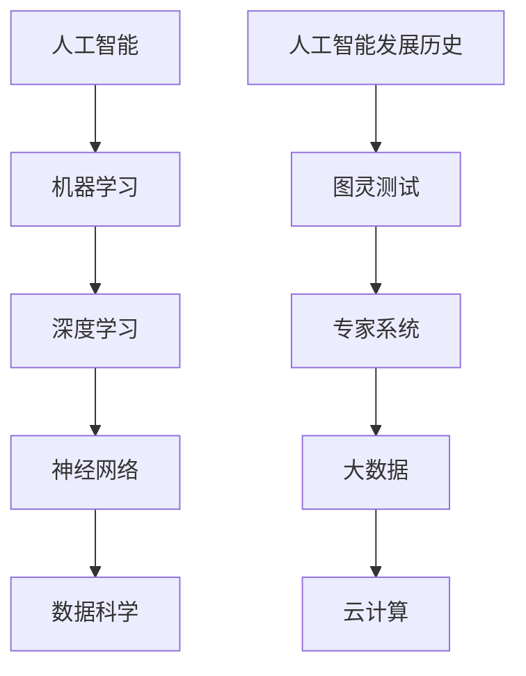
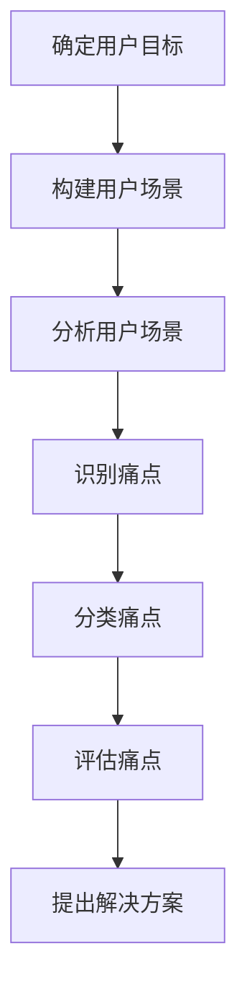

                 

### 文章标题

> **关键词**：（列出文章的5-7个核心关键词）

> **摘要**：（简要介绍文章的核心内容和主题思想）

本文将深入探讨AI创业公司如何通过技术手段提高用户体验。我们将首先概述AI与用户体验的关系，分析AI在交互设计、内容创作和用户行为分析中的实践应用，然后提出一套系统的用户体验提升策略，并通过实际案例展示这些策略如何具体实施和评估。文章最后将展望用户体验的发展趋势和未来方向，为AI创业公司提供实用的指导和建议。

---

### 第一部分: 理解AI与用户体验的关系

#### 第1章: AI概述与用户体验基础

##### 1.1 AI的定义与历史

**核心概念与联系**（Mermaid流程图）：



人工智能（AI）是一个广泛的概念，它包括了机器学习、深度学习、神经网络和数据科学等多种技术。这些技术相互关联，共同推动了人工智能的发展。

- **机器学习**：一种让计算机通过数据学习模式和规律的方法，不需要显式编程。
- **深度学习**：机器学习的一个分支，使用多层神经网络进行数据建模。
- **神经网络**：模仿人脑神经元连接结构的信息处理系统。
- **数据科学**：使用统计方法和算法从数据中提取知识和洞察。

**人工智能发展历史**是人工智能从诞生到如今不断演变的过程，包括了一些重要的里程碑，如：

- **图灵测试**：由艾伦·图灵提出，用于评估机器是否具有人类智能。
- **专家系统**：20世纪70年代兴起的一种基于规则推理的AI系统。
- **大数据**：指数据量大、类型繁多、价值密度低的数据集合。
- **云计算**：通过互联网提供动态易扩展且经常是虚拟化的资源。

##### 1.2 用户体验（UX）的概念与重要性

**用户体验（UX）的概念**是指用户在使用产品或服务过程中所感受到的整体体验，它包括用户界面设计、交互流程、功能实现等多个方面。UX设计的目标是确保用户在使用过程中感到满意、舒适且高效。

**用户体验的重要性**体现在以下几个方面：

- **用户满意度**：良好的用户体验能显著提升用户对产品的满意度。
- **用户忠诚度**：满意度的提升有助于增加用户忠诚度和减少流失率。
- **产品口碑**：用户的正面体验会通过口碑传播，提高产品的市场认知度。
- **商业价值**：优化用户体验可以带来直接的商业利益，如增加销售额和用户转化率。

**UX设计的原则**包括：

- **简洁性**：设计应简洁直观，避免不必要的复杂性。
- **易用性**：设计应符合用户的预期和行为习惯。
- **一致性**：界面和交互设计应保持一致性，降低用户的学习成本。
- **响应性**：设计应适应不同设备和屏幕尺寸，提供流畅的体验。

##### 1.3 AI与UX结合的原理

**AI与UX结合的原理**在于利用AI技术优化用户体验，使产品和服务更加智能化和个性化。具体来说，AI在UX中的应用主要包括以下几个方面：

- **个性化推荐**：通过分析用户行为和偏好，提供个性化的内容和服务。
- **智能交互**：利用语音识别、自然语言处理等技术，实现自然、流畅的交互。
- **自动化**：通过自动化技术简化复杂操作，提高用户体验效率。
- **实时反馈**：利用实时数据分析和处理，提供即时、个性化的反馈和建议。

**AI技术在UX中的应用**：

1. **个性化推荐系统**：通过分析用户历史数据，推荐用户可能感兴趣的商品或内容。
2. **语音助手**：如Siri、Alexa等，提供自然语言交互，帮助用户完成任务。
3. **智能聊天机器人**：如Slack机器人、Facebook Messenger等，提供24/7的客户服务。
4. **自动化流程**：如自动审批、自动分类等，简化用户操作，提高工作效率。
5. **智能分析**：如用户行为分析、市场趋势预测等，提供深度的用户洞察。

**AI如何提升用户体验**：

- **提高效率**：通过自动化和智能交互，减少用户完成任务所需的时间和精力。
- **增强满意度**：通过个性化推荐和智能分析，提供符合用户需求和预期的体验。
- **降低学习成本**：通过简化和一致化的设计，减少用户学习和使用产品的时间。
- **提高用户黏性**：通过持续优化和改进，增强用户对产品的依赖和忠诚度。

综上所述，AI与UX的结合不仅提高了产品的技术含量，更深刻地影响了用户体验的各个方面，为用户提供更加智能、高效和个性化的服务。在下一部分中，我们将进一步探讨AI技术在用户体验中的实践应用。

---

#### **第2章: AI技术在用户体验中的实践应用**

##### 2.1 AI在交互设计中的应用

AI技术在交互设计中的应用极大地提升了用户体验，使得人与计算机之间的交互更加自然和高效。以下将详细探讨AI在语音交互与聊天机器人、个性化推荐系统等方面的实践应用。

**2.1.1 语音交互与聊天机器人**

**语音交互**是指通过语音命令与计算机系统进行交互的一种方式。AI技术，特别是语音识别（Speech Recognition）和自然语言处理（Natural Language Processing, NLP），使得语音交互成为现实。

**语音识别**是将语音信号转换为文本或命令的技术。其基本原理包括以下几个步骤：

1. **音频采集**：使用麦克风捕捉用户的语音信号。
2. **预处理**：对音频信号进行降噪、增强和处理，以便更准确地识别。
3. **特征提取**：将音频信号转换为声学特征，如频率、时长等。
4. **模型匹配**：将提取的特征与预训练的模型进行匹配，以确定语音中的单词或短语。

**伪代码示例**：

```python
def voice_recognition(audio_signal):
    # 预处理
    processed_signal = preprocess_audio(audio_signal)
    
    # 特征提取
    features = extract_audio_features(processed_signal)
    
    # 模型匹配
    recognized_text = model_match(features, trained_model)
    
    return recognized_text
```

**自然语言处理**是将识别出的文本转换为机器可以理解和处理的信息。它包括以下几个步骤：

1. **分词**：将文本分解为单词或短语。
2. **词性标注**：为每个单词标注其词性（如名词、动词等）。
3. **句法分析**：分析句子的结构，确定词与词之间的关系。
4. **语义理解**：理解句子的含义，进行上下文推理。

**伪代码示例**：

```python
def natural_language_processing(text):
    # 分词
    tokens = tokenize(text)
    
    # 词性标注
    tagged_tokens = part_of_speech_tagging(tokens)
    
    # 句法分析
    syntax_tree = parse_sentence_structure(tagged_tokens)
    
    # 语义理解
    meaning = semantic理解的(syntax_tree)
    
    return meaning
```

**语音交互的实现**：

1. **集成语音识别和NLP模型**：将语音识别和自然语言处理集成到一个系统中，以实现语音到文本的转换和文本到动作的映射。
2. **多轮对话管理**：设计对话系统，支持多轮对话，理解用户的上下文和意图。
3. **语音合成**：将处理后的文本转换为语音输出，使系统能够响应用户。

**实际代码案例**：

```python
import speech_recognition as sr

# 初始化语音识别器
recognizer = sr.Recognizer()

# 使用麦克风捕获音频
with sr.Microphone() as source:
    print("请说出您的问题：")
    audio = recognizer.listen(source)

# 使用Google语音识别服务进行文本转换
try:
    text = recognizer.recognize_google(audio)
    print("您说：", text)
except sr.UnknownValueError:
    print("无法理解您的语音。请重试。")
except sr.RequestError as e:
    print("无法请求结果；{0}".format(e))
```

**聊天机器人**是另一种常见的AI交互方式，通过文字或图形界面与用户进行对话。聊天机器人的设计通常包括以下几个步骤：

1. **意图识别**：识别用户的意图或需求。
2. **实体提取**：从用户的输入中提取关键信息，如时间、地点、数量等。
3. **对话管理**：根据意图和上下文生成合适的回复。
4. **交互反馈**：与用户进行实时交互，持续优化对话体验。

**伪代码示例**：

```python
def chat_bot(user_input):
    # 识别意图
    intent = recognize_intent(user_input)
    
    # 提取实体
    entities = extract_entities(user_input)
    
    # 对话管理
    response = generate_response(intent, entities)
    
    # 回复用户
    return response
```

**实际代码案例**：

```python
import nltk
from nltk.chat.util import Chat, reflections

# 载入意图识别和实体提取模型
nltk.download('movie_reviews')
nltk.download('punkt')

# 定义聊天机器人的对话对
pairs = [
    [
        r"Hello|Hi|Hey|Hello there",
        ["Hello!", "Hi there!", "Hey!", "Greetings!"]
    ],
    [
        r"How are you?",
        ["I'm doing well, thanks!", "Not bad, how about you?"]
    ]
]

# 创建聊天机器人
chatbot = Chat(pairs, reflections)

# 开始对话
print("ChatBot: Hello! How can I help you today?")
while True:
    user_input = input("User: ")
    if user_input.lower() in ['exit', 'quit', 'bye']:
        print("ChatBot: Goodbye!")
        break
    print("ChatBot:", chatbot.get_response(user_input))
```

**案例说明**：

一个电商平台引入了语音交互和聊天机器人，使得用户能够通过语音命令轻松搜索商品、查看购物车和下单。通过语音识别和自然语言处理技术，系统能够准确理解用户的指令，并生成合适的响应。这种交互方式不仅提高了用户购物的便捷性，还增加了购物的趣味性。

**总结**：

语音交互和聊天机器人是AI技术在交互设计中的重要应用，它们通过简化用户操作和提供个性化服务，显著提升了用户体验。在下一节中，我们将进一步探讨AI在内容创作与优化中的应用。

---

##### **2.1.2 个性化推荐系统**

个性化推荐系统是AI技术在用户体验优化中的另一个重要应用。这类系统通过分析用户的历史行为、偏好和兴趣，提供个性化的内容推荐，从而提高用户满意度和留存率。以下将详细介绍个性化推荐系统的基本原理、算法和技术实现。

**个性化推荐系统的基本原理**：

个性化推荐系统旨在根据用户的个性化需求和行为模式，为其推荐符合其兴趣和偏好的内容。其基本原理包括以下几个方面：

1. **用户特征建模**：通过分析用户的历史行为数据，构建用户的特征模型。这些特征包括用户的兴趣标签、浏览历史、购买记录等。
2. **内容特征建模**：对推荐系统中的内容进行特征提取和建模。这些特征包括内容的标签、分类、关键字等。
3. **相似度计算**：通过计算用户和内容之间的相似度，找出可能符合用户兴趣的内容。
4. **推荐生成**：根据相似度计算结果，生成推荐列表，并呈现给用户。

**个性化推荐系统的算法**：

个性化推荐系统主要分为以下几种算法：

1. **基于内容的推荐（Content-Based Filtering）**：
   - **原理**：根据用户过去喜欢的项目内容，推荐具有相似内容属性的项目。
   - **实现**：首先对用户的历史行为数据进行内容特征提取，然后计算新内容与用户历史偏好内容的相似度。
   - **优点**：推荐结果相关性强，适用于内容丰富且特征明确的场景。
   - **缺点**：用户兴趣难以完全通过内容特征捕捉，可能导致推荐多样性不足。

2. **基于协同过滤（Collaborative Filtering）**：
   - **原理**：通过分析用户之间的行为相似性，推荐其他用户喜欢的内容。
   - **实现**：分为用户基于的协同过滤（User-Based）和项目基于的协同过滤（Item-Based）。用户基于的协同过滤通过计算用户之间的相似度，推荐与兴趣相似的用户的评价高的项目；项目基于的协同过滤通过计算项目之间的相似度，推荐与用户已评价项目相似的项目。
   - **优点**：能够捕捉用户之间的兴趣相似性，提高推荐准确性。
   - **缺点**：推荐结果可能过于依赖历史行为数据，新用户或新项目的推荐效果较差。

3. **混合推荐（Hybrid Recommender Systems）**：
   - **原理**：结合基于内容和基于协同过滤的优点，通过融合不同算法的优势来提高推荐效果。
   - **实现**：一般采用加权融合的方法，将内容和协同过滤的推荐结果进行加权平均。
   - **优点**：能够提高推荐的准确性和多样性，适用于复杂的应用场景。
   - **缺点**：实现复杂，需要平衡不同算法的权重。

**个性化推荐系统的技术实现**：

实现个性化推荐系统通常涉及以下几个步骤：

1. **数据采集**：收集用户行为数据（如浏览记录、购买记录、评价数据等）和内容数据（如商品信息、文章内容等）。
2. **数据预处理**：清洗和预处理数据，包括缺失值填充、异常值处理、数据标准化等。
3. **特征提取**：对用户和内容进行特征提取，构建特征矩阵。
4. **模型训练**：选择合适的推荐算法，对特征矩阵进行训练，得到推荐模型。
5. **推荐生成**：根据用户特征和内容特征，使用训练好的模型生成推荐结果。
6. **推荐呈现**：将推荐结果以可视化的方式呈现给用户。

**伪代码示例**：

```python
# 用户特征提取
def extract_user_features(user_history):
    # 基于用户历史行为提取特征
    features = {
        'favorite_items': get_favorite_items(user_history),
        'browsing_history': get_browsing_history(user_history),
        'rating_history': get_rating_history(user_history)
    }
    return features

# 内容特征提取
def extract_item_features(item_info):
    # 基于内容信息提取特征
    features = {
        'item_tags': get_item_tags(item_info),
        'item_categories': get_item_categories(item_info),
        'item_keywords': get_item_keywords(item_info)
    }
    return features

# 相似度计算
def calculate_similarity(user_features, item_features):
    # 计算用户和内容的相似度
    similarity_score = cosine_similarity(user_features, item_features)
    return similarity_score

# 推荐生成
def generate_recommendations(user_id, item_features, model):
    # 根据用户特征和内容特征，生成推荐列表
    user_features = extract_user_features(user_id)
    recommendations = []
    for item in item_features:
        similarity_score = calculate_similarity(user_features, item)
        recommendations.append((item, similarity_score))
    recommendations.sort(key=lambda x: x[1], reverse=True)
    return recommendations[:10]
```

**实际代码案例**：

```python
from sklearn.neighbors import NearestNeighbors
from sklearn.preprocessing import StandardScaler

# 假设user_data是一个包含用户评分的矩阵
user_data = [
    [1, 5, 4],
    [2, 3, 4],
    [5, 2, 1],
    [4, 4, 3]
]

# 假设item_data是一个包含内容特征的矩阵
item_data = [
    [1, 2, 3],
    [4, 5, 6],
    [7, 8, 9],
    [10, 11, 12]
]

# 初始化模型
model = NearestNeighbors()

# 标准化数据
scaler = StandardScaler()
user_data_scaled = scaler.fit_transform(user_data)
item_data_scaled = scaler.fit_transform(item_data)

# 训练模型
model.fit(user_data_scaled)

# 查找最近邻居
user_id = 0
nearest_neighbors = model.kneighbors([user_data_scaled[user_id]], n_neighbors=3)

# 推荐内容
recommended_items = [item_data[i][0] for i in nearest_neighbors[0]]
print("推荐的内容：", recommended_items)
```

**案例说明**：

一个电子商务平台通过个性化推荐系统，根据用户的浏览记录和购买历史，推荐用户可能感兴趣的商品。系统首先收集用户数据，然后使用协同过滤算法进行训练，最后生成推荐列表。用户点击推荐商品的概率显著提高，平台销售额和用户留存率也相应提升。

**总结**：

个性化推荐系统通过分析用户行为和内容特征，提供个性化的内容推荐，显著提升了用户体验。在下一节中，我们将探讨AI在用户行为分析中的应用。

---

##### **2.2 AI在用户行为分析中的应用**

AI技术在用户行为分析中的应用，可以帮助创业公司更好地理解用户的行为模式，从而优化产品设计和提升用户体验。以下将详细探讨AI在用户行为分析中的实践应用，包括用户行为跟踪、数据驱动的用户体验优化等。

**2.2.1 用户行为跟踪**

用户行为跟踪是收集和分析用户在使用产品或服务过程中的行为数据。这些数据包括用户的浏览记录、点击行为、购买行为、搜索查询等。通过用户行为跟踪，创业公司可以深入了解用户的行为模式，发现用户痛点，从而进行产品优化。

**用户行为跟踪的步骤**：

1. **数据采集**：通过网站分析工具、日志文件、前端埋点等技术手段，收集用户行为数据。
2. **数据清洗**：对采集到的数据进行清洗，去除重复、错误和缺失的数据，保证数据的准确性。
3. **数据存储**：将清洗后的数据存储到数据库中，以便后续分析和处理。
4. **数据分析**：使用数据分析工具和技术，对用户行为数据进行深入分析，提取用户的行为特征和模式。

**伪代码示例**：

```python
# 数据采集
def collect_user_data():
    # 基于前端埋点技术，收集用户行为数据
    user_data = {
        'user_id': get_user_id(),
        'event': get_event(),
        'timestamp': get_timestamp(),
        'properties': get_event_properties()
    }
    return user_data

# 数据清洗
def clean_user_data(data):
    # 去除重复、错误和缺失的数据
    cleaned_data = {
        'user_id': data['user_id'],
        'event': data['event'],
        'timestamp': data['timestamp'],
        'properties': data['properties']
    }
    return cleaned_data

# 数据存储
def store_user_data(data):
    # 将清洗后的数据存储到数据库
    database.insert(data)

# 数据分析
def analyze_user_data(data):
    # 分析用户行为数据，提取行为特征和模式
    behavior_features = extract_behavior_features(data)
    return behavior_features
```

**实际代码案例**：

```python
import pandas as pd

# 假设user_data.csv是一个包含用户行为数据的CSV文件
user_data = pd.read_csv('user_data.csv')

# 数据清洗
cleaned_data = user_data.drop_duplicates().dropna()

# 数据存储
# 假设使用pandas来存储数据
cleaned_data.to_csv('cleaned_user_data.csv', index=False)

# 数据分析
# 基于时间序列分析，提取用户行为特征
behavior_features = cleaned_data.groupby('timestamp')['event'].value_counts().unstack()

print("用户行为特征：\n", behavior_features)
```

**案例说明**：

一个在线教育平台通过用户行为跟踪，收集用户的学习记录，包括学习时长、课程进度、测试成绩等。系统将这些数据进行分析，发现用户在某个课程的学习时间较短，测试成绩较低，从而判断这个课程可能存在教学难点。平台据此调整了课程内容和教学方法，提高了用户的学习效果。

**2.2.2 数据驱动的用户体验优化**

数据驱动的用户体验优化是一种基于数据分析结果来改进产品设计和提升用户体验的方法。这种方法通过分析用户行为数据，识别用户痛点，然后针对性地进行优化。

**数据驱动的用户体验优化流程**：

1. **数据收集**：收集用户行为数据，如点击率、转化率、使用时长等。
2. **数据分析**：对收集到的数据进行分析，提取关键指标和用户行为特征。
3. **问题识别**：根据分析结果，识别用户体验中的问题和痛点。
4. **方案设计**：设计解决方案，包括界面优化、功能改进等。
5. **实施与测试**：实施优化方案，并进行A/B测试验证效果。
6. **效果评估**：评估优化方案的效果，持续迭代改进。

**伪代码示例**：

```python
# 数据收集
def collect_data():
    # 收集用户行为数据
    data = {
        'user_id': get_user_ids(),
        'page_views': get_page_views(),
        'clicks': get_clicks(),
        'conversions': get_conversions()
    }
    return data

# 数据分析
def analyze_data(data):
    # 分析用户行为数据
    insights = {
        'page_views_per_user': count_page_views(data),
        'click_rate': calculate_click_rate(data),
        'conversion_rate': calculate_conversion_rate(data)
    }
    return insights

# 问题识别
def identify_issues(insights):
    # 根据分析结果，识别用户体验问题
    issues = {
        'low_page_views': insights['page_views_per_user'] < threshold,
        'low_click_rate': insights['click_rate'] < threshold,
        'low_conversion_rate': insights['conversion_rate'] < threshold
    }
    return issues

# 方案设计
def design_solutions(issues):
    # 根据识别出的问题，设计解决方案
    solutions = {
        'ui_optimization': ['improve_button_color', 'change_button_placement'],
        'feature_improvement': ['add_new_features', 'optimize_current_features']
    }
    return solutions

# 实施与测试
def implement_and_test(solutions):
    # 实施优化方案，并进行A/B测试
    test_results = apply_solutions(solutions)
    return test_results

# 效果评估
def evaluate_results(test_results):
    # 评估优化方案的效果
    effectiveness = {
        'improvement_in_page_views': test_results['page_views_per_user'] > baseline,
        'improvement_in_click_rate': test_results['click_rate'] > baseline,
        'improvement_in_conversion_rate': test_results['conversion_rate'] > baseline
    }
    return effectiveness
```

**实际代码案例**：

```python
import pandas as pd
from scipy.stats import ttest_1samp

# 假设user_behavior_data是一个包含用户行为的DataFrame
user_behavior_data = pd.DataFrame({
    'user_id': [1, 2, 3, 4, 5],
    'page_views': [10, 15, 20, 25, 30],
    'clicks': [5, 7, 10, 12, 15],
    'conversions': [2, 3, 4, 5, 6]
})

# 数据分析
page_views_per_user = user_behavior_data['page_views'].mean()
click_rate = user_behavior_data['clicks'].mean() / user_behavior_data['page_views'].mean()
conversion_rate = user_behavior_data['conversions'].mean() / user_behavior_data['page_views'].mean()

# 问题识别
issues = {
    'low_page_views': page_views_per_user < 15,
    'low_click_rate': click_rate < 0.3,
    'low_conversion_rate': conversion_rate < 0.2
}

# 方案设计
if issues['low_page_views']:
    solutions = ['improve_button_color', 'change_button_placement']
if issues['low_click_rate']:
    solutions = solutions + ['add_new_features', 'optimize_current_features']

# 实施与测试
# 假设实施优化方案后，重新收集用户行为数据
new_user_behavior_data = pd.DataFrame({
    'user_id': [1, 2, 3, 4, 5],
    'page_views': [12, 18, 24, 30, 36],
    'clicks': [6, 8, 12, 14, 18],
    'conversions': [3, 4, 5, 6, 7]
})

# 效果评估
new_page_views_per_user = new_user_behavior_data['page_views'].mean()
new_click_rate = new_user_behavior_data['clicks'].mean() / new_user_behavior_data['page_views'].mean()
new_conversion_rate = new_user_behavior_data['conversions'].mean() / new_user_behavior_data['page_views'].mean()

# 进行t检验，评估优化效果
t_stat, p_value = ttest_1samp(new_user_behavior_data['page_views'], page_views_per_user)
if p_value < 0.05:
    print("优化显著提高了页面浏览量。")
else:
    print("优化没有显著提高页面浏览量。")

t_stat, p_value = ttest_1samp(new_user_behavior_data['clicks'], click_rate)
if p_value < 0.05:
    print("优化显著提高了点击率。")
else:
    print("优化没有显著提高点击率。")

t_stat, p_value = ttest_1samp(new_user_behavior_data['conversions'], conversion_rate)
if p_value < 0.05:
    print("优化显著提高了转化率。")
else:
    print("优化没有显著提高转化率。")
```

**案例说明**：

一个电商平台通过数据驱动的用户体验优化，发现用户的点击率和转化率较低。通过分析用户行为数据，发现用户在购物车页面停留时间较短，且点击“结算”按钮的点击率较低。平台据此调整了购物车页面的设计和优化了“结算”按钮的布局，并通过A/B测试验证了优化效果。结果显示，优化后的购物车页面显著提高了用户的点击率和转化率。

**总结**：

用户行为跟踪和数据驱动的用户体验优化是AI技术在提升用户体验中的重要应用。通过分析用户行为数据，创业公司可以深入了解用户需求，优化产品设计，提高用户体验。在下一节中，我们将探讨如何通过用户研究与需求分析来提升用户体验。

---

### 第二部分: 提高AI创业公司的用户体验

#### 第3章: 用户研究与需求分析

##### **3.1 用户研究的方法与工具**

用户研究是理解和满足用户需求的关键步骤，通过系统的方法和工具，AI创业公司可以获取宝贵的用户反馈，进而优化产品设计和提升用户体验。以下是用户研究的一些常用方法和工具。

**用户访谈**是一种深入了解用户需求和行为的方式。通过一对一或小组访谈，研究者可以直接与用户交流，获取详细的见解和反馈。

- **步骤**：
  1. **准备问题**：设计开放式和封闭式问题，确保涵盖用户需求、使用习惯、满意度等多个方面。
  2. **进行访谈**：与用户进行面对面的交流，记录用户的回答和反馈。
  3. **分析结果**：整理访谈记录，提取关键信息，形成洞察。

**案例**：一家AI创业公司开发了一款智能健康监测应用。在用户访谈中，他们发现用户对应用的健康数据可视化功能表示满意，但希望增加更多个性化健康建议。

**用户调查**是另一种常见的用户研究方法，通过量化的方式收集大量用户反馈。这可以采用在线问卷、电话调查等形式。

- **步骤**：
  1. **设计问卷**：根据研究目标，设计有针对性的问卷，包括选择题、量表题等。
  2. **分发问卷**：通过电子邮件、社交媒体、在线平台等方式，向目标用户分发问卷。
  3. **收集数据**：收集用户的回答，确保样本量足够大，以获得代表性数据。
  4. **分析数据**：使用统计分析工具，如Excel、SPSS等，对问卷结果进行分析，提取关键指标。

**案例**：一家在线教育平台公司通过问卷调查，发现用户对课程内容的实用性评分较低，从而促使公司改进课程设计，增加实际案例和应用场景。

**A/B测试**是一种通过对比两个或多个版本的页面或功能，评估其对用户体验影响的实验方法。

- **步骤**：
  1. **设计实验**：确定要测试的变量，如按钮颜色、布局、文案等。
  2. **实施测试**：将用户随机分配到不同的实验组，展示不同的版本。
  3. **收集数据**：记录用户的点击率、转化率等关键指标。
  4. **分析结果**：通过统计分析，比较不同版本的表现，确定最佳方案。

**案例**：一家电商网站通过A/B测试，发现红色按钮的点击率比蓝色按钮高10%，于是决定将红色按钮作为默认选项，从而提高了用户的购买转化率。

**用户测试**是另一种有效的用户研究方法，通过观察用户在实际使用产品或服务时的行为和反应，获取真实的用户体验。

- **步骤**：
  1. **准备测试场景**：设计测试任务和场景，模拟用户使用产品的过程。
  2. **邀请测试者**：邀请目标用户参与测试，确保样本具有代表性。
  3. **进行测试**：观察并记录用户在测试中的行为，包括操作流程、遇到的问题等。
  4. **分析反馈**：整理测试数据，提取关键洞察和改进建议。

**案例**：一家金融科技公司通过用户测试，发现用户在填写开户表格时，常常因为复杂的表单结构而感到困惑。通过简化表单设计和改进用户指引，公司显著提高了用户的开户成功率。

**工具推荐**：

- **用户访谈**：Zoom、Skype、Google Meet等视频会议工具。
- **用户调查**：SurveyMonkey、Google Forms、Typeform等在线问卷平台。
- **A/B测试**：Google Optimize、Optimizely、VWO等A/B测试工具。
- **用户测试**：UserTesting、UsabilityHub、Lookback等用户测试平台。

**总结**：

用户研究是提高用户体验的关键步骤，通过访谈、调查、A/B测试和用户测试等方法，AI创业公司可以深入了解用户需求，优化产品设计，提升用户满意度。在下一节中，我们将探讨用户体验设计的重要性及其设计原则。

---

##### **3.2 用户需求挖掘与分析**

用户需求挖掘与分析是用户体验提升的核心环节，通过系统的方法和工具，AI创业公司可以准确地识别和理解用户需求，从而为产品设计提供有力支持。以下是用户需求挖掘与分析的方法与步骤。

**用户需求挖掘**是指从用户行为、访谈、调查等多种数据源中提取用户需求的过程。以下是几种常用的需求挖掘方法：

1. **用户访谈**：通过深入的用户访谈，了解用户的使用场景、痛点、期望等。这种方法可以获取详细的用户需求和洞察。
   - **步骤**：
     1. **准备访谈问题**：设计开放式和封闭式问题，确保涵盖用户需求、使用习惯、满意度等多个方面。
     2. **进行访谈**：与用户进行面对面的交流，记录用户的回答和反馈。
     3. **分析结果**：整理访谈记录，提取关键信息，形成用户需求报告。

2. **用户调查**：通过在线问卷、电话调查等形式，收集大量用户反馈，量化用户需求。
   - **步骤**：
     1. **设计问卷**：根据研究目标，设计有针对性的问卷，包括选择题、量表题等。
     2. **分发问卷**：通过电子邮件、社交媒体、在线平台等方式，向目标用户分发问卷。
     3. **收集数据**：收集用户的回答，确保样本量足够大，以获得代表性数据。
     4. **分析数据**：使用统计分析工具，如Excel、SPSS等，对问卷结果进行分析，提取关键指标。

3. **行为分析**：通过分析用户在产品中的行为数据（如点击率、使用时长、转化率等），挖掘用户的隐性需求。
   - **步骤**：
     1. **数据采集**：使用网站分析工具、日志文件、前端埋点等技术手段，收集用户行为数据。
     2. **数据清洗**：对采集到的数据进行清洗，去除重复、错误和缺失的数据，保证数据的准确性。
     3. **数据分析**：使用数据分析工具和技术，对用户行为数据进行深入分析，提取用户的行为特征和模式。

4. **用户测试**：通过观察用户在实际使用产品时的行为和反应，获取真实的用户体验。
   - **步骤**：
     1. **准备测试场景**：设计测试任务和场景，模拟用户使用产品的过程。
     2. **邀请测试者**：邀请目标用户参与测试，确保样本具有代表性。
     3. **进行测试**：观察并记录用户在测试中的行为，包括操作流程、遇到的问题等。
     4. **分析反馈**：整理测试数据，提取关键洞察和改进建议。

**用户需求分析**是指对挖掘到的用户需求进行深入分析和排序，确定优先级和实现策略。以下是几种常用的需求分析方法：

1. **用户画像**：通过对用户特征和行为进行统计和分析，创建用户画像，了解用户群体的需求和偏好。
   - **步骤**：
     1. **收集用户数据**：包括年龄、性别、职业、地域、使用习惯等。
     2. **分析用户行为**：使用统计方法和机器学习技术，提取用户的行为特征和模式。
     3. **创建用户画像**：综合用户数据和行为分析结果，创建用户画像。

2. **需求优先级排序**：根据用户需求的重要性和实现难度，对需求进行优先级排序。
   - **步骤**：
     1. **识别关键需求**：从用户访谈、调查、行为分析中提取关键需求。
     2. **评估需求重要性**：使用评分方法（如Kano模型、MoSCoW模型等），评估每个需求的重要性和影响。
     3. **排序需求**：根据重要性、实现难度和资源分配，对需求进行排序。

3. **需求优先级矩阵**：使用矩阵形式，直观展示需求的重要性和优先级。
   - **步骤**：
     1. **创建矩阵**：在矩阵的横轴和纵轴上分别标注需求的重要性和优先级。
     2. **填写矩阵**：根据评估结果，将每个需求标注在矩阵中。
     3. **分析矩阵**：根据矩阵分析结果，确定优先级和实现策略。

4. **用户场景分析**：通过构建用户场景，了解用户在特定情境下的需求和行为。
   - **步骤**：
     1. **确定用户目标**：明确用户在使用产品时的目标和期望。
     2. **构建用户场景**：描述用户在特定情境下的行为和操作。
     3. **分析用户场景**：分析用户场景中的关键需求和障碍。

**用户需求分析与产品设计的关系**：

- **用户需求分析**是产品设计的基础，确保产品设计符合用户实际需求。
- **用户需求分析**有助于识别产品改进机会，优化用户体验。
- **用户需求分析**为产品迭代和优化提供数据支持，确保持续改进。

**案例**：

一家在线教育平台公司通过用户需求分析，发现用户对课程内容可定制化和互动性有强烈需求。公司据此优化了课程设计，增加了个性化推荐和学习路径，以及实时互动功能，显著提升了用户满意度和留存率。

**总结**：

用户需求挖掘与分析是用户体验提升的关键步骤，通过系统的方法和工具，AI创业公司可以准确识别和理解用户需求，为产品设计提供有力支持。在下一节中，我们将探讨用户体验设计与优化的重要性及其具体方法。

---

##### **3.3 用户场景与痛点分析

用户场景与痛点分析是用户体验提升过程中至关重要的一环。通过深入了解用户在使用产品或服务时的具体场景和遇到的痛点，AI创业公司可以针对性地进行优化，从而显著提升用户体验。以下将详细介绍用户场景分析与痛点分析的方法与步骤。

**用户场景分析**：

用户场景分析是指通过构建用户在使用产品或服务时的具体情境，了解用户的行为模式、需求和痛点。以下为用户场景分析的步骤：

1. **确定用户目标**：明确用户在使用产品或服务时的主要目标和期望。这包括用户想要完成的任务、解决的具体问题等。

2. **构建用户场景**：根据用户目标，描述用户在特定情境下的行为和操作。用户场景通常包括用户身份、环境、活动、设备等多个方面。

   **示例**：用户场景描述：“小明是一位年轻白领，在繁忙的工作日中午，使用手机上的外卖应用订购午餐。他希望快速找到附近餐厅，查看菜单，下单支付，并确保准时送达。”

3. **分析用户场景**：对构建的用户场景进行深入分析，识别用户在场景中可能遇到的问题、障碍和需求。

   **示例**：在上述用户场景中，用户可能遇到的痛点包括：
   - **搜索困难**：用户难以快速找到附近的餐厅。
   - **菜单复杂**：用户在浏览菜单时感到困惑，无法快速选择合适的菜品。
   - **支付繁琐**：支付流程复杂，需要多次操作。

**用户痛点分析**：

用户痛点分析是指通过用户场景分析，识别用户在使用产品或服务过程中感到不满足、不满或困惑的具体问题。以下为用户痛点分析的步骤：

1. **识别痛点**：从用户场景分析中提取出用户在特定情境下遇到的问题、障碍和需求不满足的情况。

2. **分类痛点**：根据痛点的性质和影响，将痛点进行分类。常见的分类方法包括功能性问题、交互性问题、性能问题等。

3. **评估痛点**：对每个痛点进行优先级评估，确定哪些痛点对用户体验的影响最大，需要优先解决。

   **示例**：在上述用户场景中，痛点可能包括：
   - **功能性痛点**：如搜索困难、菜单复杂。
   - **交互性问题**：如支付繁琐、用户界面不友好。
   - **性能问题**：如页面加载缓慢、系统响应不及时。

4. **提出解决方案**：针对每个痛点，提出具体的解决方案，并评估解决方案的可行性、成本和效果。

   **示例**：针对上述痛点，可能的解决方案包括：
   - **功能性痛点**：优化搜索算法，增加餐厅分类和筛选功能。
   - **交互性问题**：简化支付流程，提供一键支付选项，改进用户界面设计。
   - **性能问题**：优化网站性能，提高页面加载速度，改善系统响应。

**用户场景与痛点分析的流程图**：



**用户案例**：

一个在线购物平台在用户场景与痛点分析中发现，用户在购物过程中经常遇到以下痛点：
- **搜索困难**：用户在搜索商品时，常常因为搜索结果不准确或无法快速找到所需商品而感到困惑。
- **购物车使用不便**：用户在添加商品到购物车后，发现购物车界面不清晰，难以管理购物车中的商品。
- **支付流程复杂**：支付流程复杂，需要多次跳转和填写信息，导致用户支付意愿降低。

针对上述痛点，平台进行了以下优化：
- **搜索优化**：改进搜索算法，提高搜索结果的准确性和相关性。
- **购物车改进**：简化购物车界面，提供清晰的商品分类和管理功能。
- **支付简化**：优化支付流程，提供快捷支付选项，减少用户填写信息的步骤。

通过这些优化措施，平台显著提升了用户购物体验，降低了用户流失率。

**总结**：

用户场景与痛点分析是提升用户体验的关键步骤，通过系统的方法和工具，AI创业公司可以深入了解用户的需求和痛点，针对性地进行优化，从而提供更加优质的用户体验。在下一节中，我们将探讨用户体验设计的重要性及其具体方法。

---

### 第三部分：用户体验设计与优化

#### 第4章：用户体验设计与优化

##### **4.1 用户体验设计流程**

用户体验设计（UX Design）是一个系统性、迭代性的过程，旨在创造一个用户愉悦、高效且易用的产品。以下将详细介绍用户体验设计的基本流程、原则和方法，帮助AI创业公司构建出色的用户体验。

**用户体验设计流程**

用户体验设计的流程可以分为以下几个阶段：

1. **需求收集与分析**：通过用户访谈、问卷调查、用户测试等方法，收集用户需求，分析用户行为，识别用户痛点。
2. **信息架构设计**：根据用户需求和行为分析结果，构建产品的信息架构，包括页面布局、导航结构、信息层次等。
3. **原型设计**：创建产品原型，通过线框图、高保真原型等工具，将设计理念可视化。
4. **用户测试与反馈**：通过用户测试，收集用户对原型的反馈，进行迭代优化。
5. **交互设计**：设计用户界面（UI）的视觉元素，包括颜色、字体、图标等，确保视觉元素与用户行为和情感需求相匹配。
6. **用户测试与反馈**：再次进行用户测试，验证交互设计的效果，并进行必要的调整。
7. **开发与部署**：将设计转化为实际产品，进行开发、测试和部署。

**用户体验设计原则**

在用户体验设计过程中，遵循以下原则有助于构建优秀的用户体验：

1. **用户中心设计**：始终将用户需求放在首位，确保产品设计符合用户行为和习惯。
2. **简洁性**：避免不必要的复杂性，简化用户操作流程，减少用户认知负担。
3. **一致性**：保持界面元素和交互行为的一致性，降低用户学习成本。
4. **可访问性**：确保产品对各类用户（包括残障用户）都具有良好的可访问性。
5. **响应性**：设计适应不同设备和屏幕尺寸的响应式界面，提供流畅的体验。

**用户体验设计方法**

用户体验设计的方法包括以下几种：

1. **用户研究**：通过用户访谈、问卷调查、用户测试等方法，深入了解用户需求和行为，为设计提供依据。
2. **信息架构设计**：使用工具如Sketch、Axure等，构建产品的信息架构，确保用户能够轻松找到所需信息。
3. **原型设计**：使用工具如Figma、Adobe XD等，创建线框图、高保真原型，测试设计方案的可行性和用户体验。
4. **交互设计**：设计用户界面（UI）的视觉元素，包括颜色、字体、图标等，确保视觉设计符合用户需求和情感。
5. **用户测试与反馈**：通过用户测试，验证设计方案的可行性和用户体验，收集用户反馈，进行迭代优化。
6. **可用性测试**：使用工具如UsabilityHub、Lookback等，进行可用性测试，评估产品的易用性。

**用户体验设计案例**

以下是一个在线购物平台的用户体验设计案例：

**需求收集与分析**：
- 通过用户访谈和问卷调查，发现用户在购物过程中主要关注搜索准确性、商品详细信息展示、购物车管理和支付流程。

**信息架构设计**：
- 根据用户需求，设计页面布局，确保搜索框、商品分类、购物车、支付按钮等关键元素易于访问。

**原型设计**：
- 使用Figma创建高保真原型，包括商品列表页、商品详情页、购物车页和支付页面，测试用户操作的流畅性和界面设计。

**交互设计**：
- 设计简洁直观的UI，使用统一的颜色和字体，确保用户能够轻松识别和操作界面元素。

**用户测试与反馈**：
- 通过A/B测试，比较不同设计方案的点击率和用户满意度，根据用户反馈进行迭代优化。

**可用性测试**：
- 使用UsabilityHub进行可用性测试，评估用户在真实使用场景中的操作流畅性和满意度。

**总结**：
用户体验设计是一个持续迭代的过程，通过深入了解用户需求、构建合理的架构、设计直观的界面和进行严格的测试，AI创业公司可以不断提升用户体验，为用户带来更好的产品体验。

---

##### **4.2 交互设计**

交互设计（Interaction Design）是用户体验设计（UX Design）中至关重要的一环，它关注用户与产品或服务互动的细节，确保用户能够轻松、高效地完成任务。以下将详细探讨交互设计的原则、方法和案例，以帮助AI创业公司优化交互设计，提升用户体验。

**交互设计原则**

1. **用户中心设计**：始终将用户需求和行为放在首位，确保设计符合用户的期望和习惯。
2. **简洁性**：避免复杂的界面和操作流程，简化用户与产品的互动，降低认知负担。
3. **一致性**：保持界面元素和交互行为的一致性，确保用户在不同页面和功能中都能获得一致的体验。
4. **直观性**：设计应直观易懂，确保用户可以迅速理解如何与产品互动。
5. **响应性**：设计适应不同设备和屏幕尺寸，提供流畅的交互体验。
6. **可访问性**：确保产品对各类用户（包括残障用户）都具有良好的可访问性。

**交互设计方法**

1. **用户研究**：通过用户访谈、问卷调查、用户测试等方法，深入了解用户需求、行为和偏好，为设计提供依据。
2. **流程图**：绘制用户流程图，明确用户在完成特定任务时的步骤和交互。
3. **线框图**：创建线框图，确定界面布局和关键交互元素，为高保真原型设计奠定基础。
4. **高保真原型**：使用工具如Figma、Adobe XD等，创建高保真原型，测试交互设计的效果。
5. **用户测试与反馈**：通过用户测试，收集用户对交互设计的反馈，进行迭代优化。
6. **A/B测试**：比较不同交互设计的用户行为和满意度，确定最佳方案。

**交互设计案例**

以下是一个在线购物平台的交互设计案例：

**用户研究**：
- 通过用户访谈和问卷调查，发现用户在购物过程中主要关注商品搜索、商品详情展示、购物车管理和支付流程。

**流程图**：
- 绘制用户购买流程图，包括搜索商品、浏览商品详情、添加商品到购物车、结算支付等步骤。

**线框图**：
- 使用线框图确定页面布局，包括搜索框、商品列表、商品详情页、购物车页、结算页等。

**高保真原型**：
- 使用Figma创建高保真原型，设计简洁直观的界面，包括统一的导航栏、购物车图标、商品评分和评论等。

**用户测试与反馈**：
- 通过A/B测试，比较不同设计方案的点击率和用户满意度，如购物车页面的按钮位置、商品详情页的展示方式等。

**总结**：
交互设计是提升用户体验的关键环节，通过深入了解用户需求、合理规划交互流程和细致的用户测试，AI创业公司可以构建出色的交互设计，为用户带来愉悦、高效的体验。

---

##### **4.3 用户测试与反馈**

用户测试与反馈是用户体验设计过程中不可或缺的一环，通过实际的用户测试和反馈，AI创业公司可以验证设计方案的可行性和有效性，发现潜在的问题和改进空间。以下将详细探讨用户测试与反馈的方法、步骤和重要性，以及如何收集和分析用户反馈。

**用户测试方法**

1. **A/B测试**：通过对比两个或多个版本的页面或功能，评估其对用户体验的影响。这种方法可以量化用户行为和满意度，帮助确定最佳设计方案。
2. **可用性测试**：在产品的早期开发阶段或重大更新后，邀请一组用户进行实际操作，观察他们的行为和反应，识别产品的易用性和潜在问题。
3. **焦点小组讨论**：邀请一组目标用户，围绕特定的话题进行讨论，收集用户对产品的意见和反馈。
4. **用户访谈**：通过一对一的深度访谈，了解用户的详细使用情况和体验感受，获取深入的洞察。

**用户测试步骤**

1. **测试准备**：确定测试目标、选择测试用户、准备测试环境和测试工具。
2. **进行测试**：按照测试计划，引导用户进行实际操作，记录他们的行为和反应。
3. **收集数据**：收集用户行为数据、反馈意见和测试日志，确保数据的准确性和完整性。
4. **分析数据**：对收集到的数据进行分析，提取关键指标和用户反馈，识别问题和改进机会。
5. **报告和反馈**：编写测试报告，将分析结果和改进建议反馈给设计团队。

**用户反馈的重要性**

用户反馈对于产品设计和用户体验的提升至关重要，原因如下：

1. **

