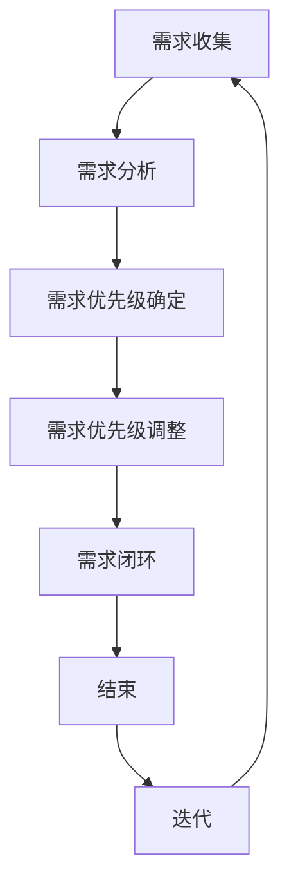

                 

### 《AI创业公司的产品需求管理：需求收集、需求分析与需求优先级》

> **关键词：** AI创业公司，产品需求管理，需求收集，需求分析，需求优先级

> **摘要：** 本文深入探讨了AI创业公司在产品需求管理中的关键环节，包括需求收集、需求分析和需求优先级确定。通过阐述核心概念、实践案例以及相关工具和技术，本文旨在为创业公司的产品团队提供实用的指导，帮助其高效地管理产品需求，确保产品成功。

### 《AI创业公司的产品需求管理：需求收集、需求分析与需求优先级》目录大纲

---

# 第一部分：引言

## 1.1 AI创业公司概述

### 1.1.1 AI创业公司的定义与特点

### 1.1.2 AI创业公司面临的主要挑战

### 1.1.3 产品需求管理的重要性

## 1.2 产品需求管理概述

### 1.2.1 需求收集

#### 1.2.1.1 用户调研的方法与技巧

#### 1.2.1.2 用户反馈的收集与管理

### 1.2.2 需求分析

#### 1.2.2.1 需求分类与优先级

#### 1.2.2.2 需求分析的方法与工具

### 1.2.3 需求优先级

#### 1.2.3.1 如何确定需求优先级

#### 1.2.3.2 需求优先级调整策略

# 第二部分：需求收集

## 2.1 需求收集方法

### 2.1.1 用户访谈

#### 2.1.1.1 用户访谈的步骤与技巧

#### 2.1.1.2 用户访谈案例解析

### 2.1.2 用户调查

#### 2.1.2.1 用户调查问卷设计

#### 2.1.2.2 用户调查案例分析

### 2.1.3 竞品分析

#### 2.1.3.1 竞品分析的方法与工具

#### 2.1.3.2 竞品分析案例解析

## 2.2 需求收集工具与技术

### 2.2.1 传统需求收集工具

#### 2.2.1.1 纸质文档

#### 2.2.1.2 电子表格

### 2.2.2 现代需求收集工具

#### 2.2.2.1 需求管理软件

#### 2.2.2.2 项目管理工具

# 第三部分：需求分析

## 3.1 需求分析框架

### 3.1.1 功能性需求分析

#### 3.1.1.1 功能性需求定义

#### 3.1.1.2 功能性需求分析案例

### 3.1.2 非功能性需求分析

#### 3.1.2.1 非功能性需求定义

#### 3.1.2.2 非功能性需求分析案例

### 3.1.3 用户故事分析

#### 3.1.3.1 用户故事的定义与格式

#### 3.1.3.2 用户故事分析案例

## 3.2 需求分析工具与技术

### 3.2.1 原型设计工具

#### 3.2.1.1 原型设计方法

#### 3.2.1.2 原型设计工具应用

### 3.2.2 用户画像

#### 3.2.2.1 用户画像的定义与构建

#### 3.2.2.2 用户画像的应用

# 第四部分：需求优先级管理

## 4.1 需求优先级确定方法

### 4.1.1 Kano模型

#### 4.1.1.1 Kano模型的基本概念

#### 4.1.1.2 Kano模型的应用案例

### 4.1.2 MoSCoW模型

#### 4.1.2.1 MoSCoW模型的基本概念

#### 4.1.2.2 MoSCoW模型的应用案例

### 4.1.3 时间线方法

#### 4.1.3.1 时间线方法的基本概念

#### 4.1.3.2 时间线方法的应用案例

## 4.2 需求优先级调整策略

### 4.2.1 需求变更管理

#### 4.2.1.1 需求变更的原因

#### 4.2.1.2 需求变更的处理流程

### 4.2.2 需求优先级调整案例

#### 4.2.2.1 需求优先级调整的影响因素

#### 4.2.2.2 需求优先级调整的实施步骤

# 第五部分：实践案例

## 5.1 案例一：智能家居平台需求管理

### 5.1.1 项目背景

### 5.1.2 需求收集过程

### 5.1.3 需求分析过程

### 5.1.4 需求优先级管理过程

## 5.2 案例二：在线教育平台需求管理

### 5.2.1 项目背景

### 5.2.2 需求收集过程

### 5.2.3 需求分析过程

### 5.2.4 需求优先级管理过程

# 第六部分：总结与展望

## 6.1 总结

### 6.1.1 产品需求管理的核心要点

### 6.1.2 需求收集、需求分析与需求优先级之间的关系

## 6.2 展望

### 6.2.1 AI创业公司的未来需求管理趋势

### 6.2.2 需求管理工具与技术的前沿动态

### 附录

## 附录A：需求管理工具与技术对比

## 附录B：常见需求管理术语解释

## 附录C：参考文献与推荐阅读

---

# 第一部分：引言

## 1.1 AI创业公司概述

### 1.1.1 AI创业公司的定义与特点

AI创业公司是指那些以人工智能技术为核心，通过自主研发和创新，开发出具有市场竞争力的产品和解决方案的企业。这类公司通常具有以下几个特点：

1. **技术创新性**：AI创业公司强调技术创新，致力于将人工智能算法应用于各个领域，如自动驾驶、智能医疗、金融科技等。
2. **资源有限**：由于资金和人才有限，AI创业公司通常在初期阶段更加注重效率和资源利用率。
3. **快速迭代**：AI技术发展迅速，AI创业公司需要快速响应市场变化，不断迭代产品，以保持竞争力。

### 1.1.2 AI创业公司面临的主要挑战

AI创业公司在发展过程中会面临诸多挑战：

1. **技术风险**：AI技术的复杂性导致研发过程中存在较高的技术风险。
2. **市场风险**：市场需求的快速变化使得AI创业公司难以准确预测市场趋势，从而影响产品定位。
3. **资金压力**：初期资金有限，资金链断裂可能导致公司运营受阻。
4. **人才短缺**：AI领域对人才的需求较大，而优秀的人工智能专家相对稀缺。

### 1.1.3 产品需求管理的重要性

在AI创业公司中，产品需求管理具有至关重要的意义：

1. **明确方向**：通过需求管理，公司可以明确产品的开发方向，确保资源投入的合理性和有效性。
2. **降低风险**：合理的需求管理可以降低技术风险和市场风险，提高项目成功率。
3. **提高效率**：有效的需求管理可以优化开发流程，提高开发效率。
4. **满足用户需求**：用户需求是产品开发的出发点和归宿，需求管理有助于更好地满足用户需求。

## 1.2 产品需求管理概述

### 1.2.1 需求收集

需求收集是产品需求管理的第一个环节，它涉及到如何获取用户和利益相关者的需求信息。需求收集的方法包括用户访谈、用户调查和竞品分析等。

#### 1.2.1.1 用户调研的方法与技巧

用户调研是需求收集的重要手段。以下是一些常用的用户调研方法和技巧：

1. **用户访谈**：通过与用户进行一对一或小组访谈，深入理解用户需求和行为习惯。
2. **用户调查**：通过设计问卷或在线调查，收集大量用户反馈，进行定量分析。
3. **观察法**：观察用户在真实环境中的行为，获取第一手资料。
4. **技巧**：
   - **引导性问题**：设计开放性问题，鼓励用户表达真实想法。
   - **持续沟通**：保持与用户的沟通，及时获取反馈。

#### 1.2.1.2 用户反馈的收集与管理

用户反馈是需求收集的重要组成部分。以下是一些收集和管理用户反馈的方法：

1. **反馈渠道**：设立多种反馈渠道，如在线反馈表、社交媒体互动、用户论坛等。
2. **反馈分类**：将用户反馈按主题、优先级和类别进行分类，便于后续分析和处理。
3. **反馈分析**：对用户反馈进行定量和定性分析，识别关键需求和问题。
4. **反馈响应**：及时回应用户反馈，提高用户满意度和忠诚度。

### 1.2.2 需求分析

需求分析是对收集到的用户需求进行深入理解和细化的过程。它涉及到需求分类、优先级确定和可行性分析等。

#### 1.2.2.1 需求分类与优先级

在需求分析过程中，对需求进行分类和优先级排序是非常关键的步骤。以下是一些常用的需求分类和优先级确定方法：

1. **需求分类**：
   - **功能性需求**：与产品功能直接相关，如用户界面、数据存储、算法实现等。
   - **非功能性需求**：与产品性能、安全性、可用性等非功能特性相关，如响应时间、系统稳定性、数据隐私等。
   - **用户故事**：以用户为中心，描述用户如何使用产品及其期望的结果。

2. **优先级确定**：
   - **紧急性**：需求的紧急程度，越紧急的需求越应优先处理。
   - **重要性**：需求对产品价值的影响程度，越重要的需求越应优先处理。
   - **优先级模型**：如MoSCoW模型、Kano模型等，用于辅助确定需求优先级。

#### 1.2.2.2 需求分析的方法与工具

需求分析的方法和工具多种多样，以下是一些常用的方法和工具：

1. **需求文档**：编写详细的需求文档，包括功能需求、非功能需求和用户故事等。
2. **原型设计**：使用原型设计工具，如Figma、Axure等，制作产品原型，进行需求验证。
3. **用户画像**：构建用户画像，分析不同用户群体的需求和偏好。
4. **需求评审**：组织需求评审会议，邀请相关人员对需求文档和原型进行评审，确保需求符合预期。

### 1.2.3 需求优先级

需求优先级管理是产品需求管理的核心环节之一。合理的需求优先级管理有助于确保资源投入的有效性和项目的顺利进行。

#### 1.2.3.1 如何确定需求优先级

确定需求优先级的方法多种多样，以下是一些常用的方法：

1. **紧急性优先**：将紧急性最高的需求优先处理，确保项目按时交付。
2. **重要性优先**：将重要性最高的需求优先处理，提高产品价值。
3. **紧急性与重要性结合**：综合考虑需求的紧急性和重要性，制定优先级排序。
4. **优先级模型**：使用MoSCoW模型、Kano模型等优先级模型，指导需求优先级确定。

#### 1.2.3.2 需求优先级调整策略

需求优先级并非一成不变，随着项目进展和市场变化，需求优先级可能需要进行调整。以下是一些需求优先级调整策略：

1. **需求评审**：定期进行需求评审，根据项目进展和用户反馈，调整需求优先级。
2. **风险评估**：识别需求变更的风险，评估需求变更对项目的影响，制定相应的调整策略。
3. **优先级重排**：根据新的项目计划和市场需求，重新排定需求优先级。
4. **动态调整**：建立灵活的需求优先级管理机制，能够快速响应市场变化。

# 第二部分：需求收集

## 2.1 需求收集方法

需求收集是产品需求管理的第一个环节，其目标是通过多种渠道和方法收集用户和利益相关者的需求，以便更好地理解市场需求和用户期望。以下将详细探讨用户访谈、用户调查和竞品分析三种常见的需求收集方法。

### 2.1.1 用户访谈

用户访谈是一种直接与用户进行一对一或小组交流的方法，旨在深入了解用户的需求、偏好和痛点。以下是用户访谈的步骤与技巧：

#### 2.1.1.1 用户访谈的步骤

1. **准备阶段**：
   - **确定访谈对象**：选择具有代表性的用户，如核心用户、潜在用户等。
   - **制定访谈大纲**：提前设计访谈问题，确保访谈内容全面、有条理。

2. **访谈阶段**：
   - **开场白**：介绍访谈目的和规则，建立良好的沟通氛围。
   - **提问与聆听**：提出引导性问题，鼓励用户表达真实想法，认真倾听用户回答。
   - **记录反馈**：实时记录用户反馈，确保信息准确无误。

3. **结束阶段**：
   - **总结反馈**：回顾访谈内容，总结用户需求和建议。
   - **感谢用户**：对用户的参与表示感谢，为后续沟通留下良好印象。

#### 2.1.1.2 用户访谈案例解析

假设我们正在开发一款智能家居平台，以下是用户访谈的一个案例：

1. **访谈对象**：选择了一组智能家居产品的核心用户，他们已经使用过同类产品。

2. **访谈大纲**：
   - **产品使用体验**：询问用户对现有智能家居产品的使用体验，包括界面设计、操作便利性、响应速度等。
   - **需求与痛点**：了解用户期望的新功能，如智能语音控制、场景设置、节能模式等，以及使用过程中遇到的痛点。

3. **访谈内容**：
   - 用户A表示，现有产品在界面设计和操作便利性方面做得不错，但希望在智能语音控制和场景设置方面有更多功能。
   - 用户B提到，现有产品的节能模式不够智能，希望系统能够根据环境自动调整功耗。

通过这个案例，我们可以收集到用户对智能家居平台的新功能需求和痛点，为后续需求分析提供重要依据。

### 2.1.2 用户调查

用户调查是通过设计问卷或在线调查的方式，收集大量用户反馈的方法。以下是用户调查问卷的设计方法和案例分析：

#### 2.1.2.1 用户调查问卷设计

1. **确定调查目标**：明确调查目的，如了解用户对产品功能的满意度、期望的新功能等。

2. **设计问卷结构**：问卷通常包括选择题、填空题和开放式问题等。

3. **编写问卷问题**：
   - **封闭式问题**：如“您对当前智能家居产品的使用体验评分是多少？”
   - **开放式问题**：如“您期望智能家居平台提供哪些新功能？”
   - **问题分类**：如功能性需求、非功能性需求、用户满意度等。

4. **测试问卷**：在小范围内测试问卷，确保问卷设计合理，问题表述清晰。

#### 2.1.2.2 用户调查案例分析

假设我们设计了一份关于智能家居平台的用户调查问卷，以下是一个案例：

1. **调查目标**：了解用户对智能家居平台当前功能的满意度以及期望的新功能。

2. **问卷结构**：
   - **基本信息**：收集用户的性别、年龄、职业等信息。
   - **功能性需求**：询问用户对智能语音控制、场景设置、节能模式等功能的满意度。
   - **非功能性需求**：如产品的响应速度、稳定性、数据安全等。

3. **问卷问题**：
   - **封闭式问题**：
     - “您对智能家居平台的智能语音控制功能满意度如何？”（选项：非常满意、满意、一般、不满意、非常不满意）
     - “您对智能家居平台的场景设置功能满意度如何？”（选项：非常满意、满意、一般、不满意、非常不满意）
   - **开放式问题**：“您认为智能家居平台还应提供哪些新功能？”

通过这个案例，我们可以收集到大量用户的反馈数据，为需求分析提供依据。

### 2.1.3 竞品分析

竞品分析是通过对竞争对手的产品进行分析，了解市场趋势和用户需求的方法。以下是竞品分析的方法和案例分析：

#### 2.1.3.1 竞品分析的方法

1. **市场调研**：收集竞品的销售数据、用户评价、市场份额等信息。

2. **产品分析**：分析竞品的特性、功能、优势、劣势等。

3. **用户反馈**：收集用户对竞品的评价和反馈。

4. **对比分析**：将竞品与自身产品进行对比，识别差距和改进点。

#### 2.1.3.2 竞品分析案例解析

假设我们正在开发一款智能家居平台，以下是竞品分析的一个案例：

1. **竞品选择**：选择市场占有率较高的几款智能家居平台作为竞品。

2. **产品分析**：
   - **功能对比**：分析竞品的功能，如智能语音控制、场景设置、节能模式等。
   - **界面设计**：评估竞品的界面设计，包括美观度、操作便利性等。
   - **用户评价**：收集用户对竞品的评价，了解用户对产品的满意度。

3. **对比分析**：
   - **功能优势**：发现竞品在智能语音控制和场景设置方面的优势。
   - **改进点**：识别竞品在用户体验和功能实现方面的不足，为自身产品提供改进方向。

通过这个案例，我们可以了解到竞争对手的产品特点和市场表现，为自身产品定位和需求收集提供参考。

## 2.2 需求收集工具与技术

在需求收集过程中，选择合适的工具和技术至关重要，它们可以显著提高需求收集的效率和质量。以下将介绍传统需求收集工具、现代需求收集工具以及它们的优缺点。

### 2.2.1 传统需求收集工具

#### 2.2.1.1 纸质文档

纸质文档是一种传统且简单直观的需求收集工具。以下是纸质文档的优缺点：

#### 优点：

1. **易于使用**：无需特殊技术或设备，任何人都可以使用。
2. **方便记录**：可以随时随地记录需求，不受网络限制。

#### 缺点：

1. **不易管理**：纸质文档容易丢失或损坏，难以进行系统化管理和查询。
2. **不便于协作**：多人协作时，纸质文档难以共享和实时更新。

#### 2.2.1.2 电子表格

电子表格是一种广泛应用于需求收集的工具，如Microsoft Excel、Google Sheets等。以下是电子表格的优缺点：

#### 优点：

1. **易于整理**：可以方便地对需求进行分类、排序和筛选。
2. **便于统计**：可以快速进行数据统计和分析。
3. **易于共享**：可以轻松地通过电子方式共享和分发。

#### 缺点：

1. **数据安全**：电子表格可能存在数据泄露风险。
2. **协作困难**：多人同时编辑时，容易产生版本冲突和错误。

### 2.2.2 现代需求收集工具

现代需求收集工具主要包括需求管理软件和项目管理工具，这些工具提供了更加高效和智能的需求收集和管理方式。

#### 2.2.2.1 需求管理软件

需求管理软件如JIRA、Confluence等，提供了全面的需求收集、管理和跟踪功能。以下是需求管理软件的优缺点：

#### 优点：

1. **高效协作**：支持多人实时协作，提高团队工作效率。
2. **集成功能**：与项目管理、文档管理、版本控制等工具集成，实现一站式需求管理。
3. **灵活定制**：可以根据需求自定义工作流程、字段和报告。

#### 缺点：

1. **学习成本**：功能较为复杂，需要一定时间学习和适应。
2. **成本较高**：对于小型团队或初创公司来说，可能成本较高。

#### 2.2.2.2 项目管理工具

项目管理工具如Trello、Asana等，提供了任务管理、项目规划和协作功能。以下是项目管理工具的优缺点：

#### 优点：

1. **简单易用**：界面直观，易于上手。
2. **任务跟踪**：可以实时监控任务进度，确保项目按时交付。
3. **协作方便**：支持多人协作，方便团队沟通。

#### 缺点：

1. **功能限制**：部分功能较为基础，无法满足复杂需求管理需求。
2. **定制性差**：难以根据具体需求进行个性化定制。

通过以上对传统需求收集工具和现代需求收集工具的介绍，可以看出现代需求收集工具在效率、协作和数据管理方面具有明显优势，但同时也存在一定的学习成本和成本问题。在实际应用中，可以根据团队规模、需求和预算选择合适的工具。

# 第三部分：需求分析

## 3.1 需求分析框架

需求分析是产品需求管理的核心环节，它涉及到对收集到的用户需求进行理解和细化，以确保产品能够满足用户需求并实现商业目标。需求分析框架为需求分析提供了系统性的方法，有助于提高分析质量和效率。以下将介绍需求分析框架的组成部分，包括功能性需求分析、非功能性需求分析和用户故事分析。

### 3.1.1 功能性需求分析

功能性需求分析是需求分析的重要组成部分，它关注产品功能的需求，包括用户界面、数据存储、算法实现等方面。功能性需求分析的步骤如下：

#### 3.1.1.1 功能性需求定义

功能性需求定义是明确产品功能需求的过程。以下是一些定义功能性需求的关键点：

1. **功能描述**：详细描述每个功能的目的和实现方式。
2. **输入与输出**：明确每个功能所需的输入数据和输出结果。
3. **约束条件**：描述实现功能所需满足的限制条件，如性能要求、安全性要求等。
4. **用户场景**：描述用户使用功能的情境和流程。

#### 3.1.1.2 功能性需求分析案例

以下是一个功能性需求分析案例：

**需求描述**：智能家居平台应支持用户通过语音控制灯光开关。

**输入与输出**：
- **输入**：用户的语音指令。
- **输出**：灯光开关的相应动作。

**约束条件**：
- **语音识别准确率**：要求语音识别系统在大多数情况下能够正确识别用户的语音指令。
- **响应时间**：要求系统在接收到语音指令后，能够在1秒内完成响应。

**用户场景**：
- 用户A在家中，通过语音说“开灯”，系统识别语音指令后，自动打开房间内的灯光。

通过这个案例，我们可以看到功能性需求分析需要明确功能描述、输入输出、约束条件和用户场景，以便为后续设计和实现提供清晰的方向。

### 3.1.2 非功能性需求分析

非功能性需求分析关注产品的非功能特性，如性能、安全性、可用性等。非功能性需求分析的步骤如下：

#### 3.1.2.1 非功能性需求定义

非功能性需求定义是明确产品非功能需求的过程。以下是一些定义非功能性需求的关键点：

1. **性能要求**：描述产品在处理能力和响应速度等方面的要求，如系统的并发处理能力、响应时间等。
2. **安全性要求**：描述产品在数据保护、访问控制等方面的要求，如数据加密、用户身份验证等。
3. **可用性要求**：描述产品在易用性、用户体验等方面的要求，如界面设计、操作流程等。
4. **兼容性要求**：描述产品在不同设备和操作系统上的兼容性要求。

#### 3.1.2.2 非功能性需求分析案例

以下是一个非功能性需求分析案例：

**需求描述**：智能家居平台应保证数据安全，防止未经授权的访问。

**性能要求**：
- **并发处理能力**：系统应能够同时处理1000个用户的访问请求。
- **响应时间**：系统响应时间应不超过500毫秒。

**安全性要求**：
- **数据加密**：传输和存储的数据应进行加密处理。
- **用户身份验证**：用户在登录时需要进行密码验证，确保用户身份的唯一性。

**可用性要求**：
- **界面设计**：界面应简洁直观，易于操作。
- **操作流程**：用户操作流程应尽量简单，减少用户的操作步骤。

通过这个案例，我们可以看到非功能性需求分析需要明确性能、安全性、可用性等方面的要求，以确保产品在非功能特性上满足用户期望。

### 3.1.3 用户故事分析

用户故事分析是一种以用户为中心的需求分析方法，它通过描述用户需求的故事，帮助团队更好地理解用户需求和使用场景。用户故事的格式通常为：“作为[用户类型]，我需要[功能]，以便[达成目标]”。

#### 3.1.3.1 用户故事的定义与格式

用户故事是一种简单、直观的需求表达方式，它的定义和格式如下：

**定义**：用户故事是描述用户需求的故事，通常以用户为中心，描述用户如何使用产品以及期望达到的目标。

**格式**：用户故事通常包括三个部分：
- **角色**：描述用户故事的执行者，如“作为用户A”。
- **目标**：描述用户希望通过产品实现的目标，如“我需要查看今天的天气情况”。
- **条件**：描述用户故事的前提条件，如“在登录后才能查看天气”。

#### 3.1.3.2 用户故事分析案例

以下是一个用户故事分析案例：

**用户故事**：“作为智能家居平台用户，我需要远程控制家中的灯光，以便在回家的路上提前打开灯光。”

**角色**：智能家居平台用户。
**目标**：远程控制家中的灯光。
**条件**：用户已登录系统，并处于移动网络或Wi-Fi连接状态。

通过这个案例，我们可以看到用户故事分析如何通过描述用户的需求和使用场景，帮助团队更好地理解用户需求并设计相应的功能。

## 3.2 需求分析工具与技术

在需求分析过程中，选择合适的工具和技术能够显著提高分析效率和质量。以下将介绍一些常用的需求分析工具和技术，包括原型设计工具和用户画像技术。

### 3.2.1 原型设计工具

原型设计工具是进行需求分析和验证的重要工具，它们可以帮助团队快速创建产品原型，以便进行用户反馈和迭代。以下是一些常用的原型设计工具：

#### 3.2.1.1 原型设计方法

原型设计方法包括低保真原型和高保真原型设计。

1. **低保真原型**：低保真原型通常使用纸笔、草图或低保真度软件（如Balsamiq Mockups）制作，用于快速验证需求和理解用户反馈。
2. **高保真原型**：高保真原型通常使用专业原型设计工具（如Figma、Axure RP）制作，具有详细的界面设计、交互效果和交互逻辑，用于更全面的用户反馈和测试。

#### 3.2.1.2 原型设计工具应用

1. **Figma**：Figma是一款基于浏览器的原型设计工具，支持协作和实时预览，适用于创建高保真原型和界面设计。
2. **Axure RP**：Axure RP是一款功能强大的原型设计工具，支持丰富的交互元素和注释功能，适用于复杂的产品原型设计。

#### 3.2.1.3 原型设计工具应用案例

以下是一个原型设计工具应用案例：

**需求背景**：智能家居平台需要实现用户远程控制灯光的功能。

**解决方案**：
1. **低保真原型**：使用纸笔草图快速绘制用户界面和流程，与团队成员和用户进行初步讨论。
2. **高保真原型**：使用Figma制作详细的高保真原型，包括灯光控制页面的设计、交互效果和动画效果，以便进行用户反馈和测试。

通过这个案例，我们可以看到原型设计工具如何帮助团队快速创建原型，进行需求验证和用户反馈，从而优化产品设计和功能。

### 3.2.2 用户画像技术

用户画像技术是通过数据分析方法，对用户进行全方位描述和分类的技术。用户画像可以帮助团队更好地理解用户需求和行为，从而进行更精准的需求分析。

#### 3.2.2.1 用户画像的定义与构建

**定义**：用户画像是对用户特征、行为、需求和偏好进行抽象和描述的模型。

**构建方法**：
1. **用户调研**：通过用户访谈、问卷调查等方式收集用户基本信息、行为数据和需求信息。
2. **数据整合**：将不同渠道收集的用户数据进行整合，构建全面的用户画像库。
3. **数据分析**：使用数据挖掘和机器学习算法，对用户行为和需求进行深入分析，识别用户特征和趋势。

#### 3.2.2.2 用户画像的应用

**应用场景**：
1. **需求分析**：通过用户画像分析，识别用户需求和行为模式，指导需求分析和产品设计。
2. **用户反馈**：通过用户画像，针对不同用户群体进行个性化反馈收集和分析，提高用户满意度。
3. **市场定位**：通过用户画像，分析用户特征和偏好，确定产品市场定位和推广策略。

#### 3.2.2.3 用户画像应用案例

以下是一个用户画像应用案例：

**需求背景**：智能家居平台需要优化用户注册和登录流程。

**解决方案**：
1. **用户调研**：通过用户访谈和问卷调查，收集用户注册和登录的困难和偏好。
2. **数据整合**：整合用户调研数据和平台行为数据，构建用户画像库。
3. **数据分析**：分析用户注册和登录的数据，识别用户痛点和偏好，如是否需要简化注册流程、增加社交媒体登录等。

通过这个案例，我们可以看到用户画像技术如何帮助团队更好地理解用户需求和行为，从而优化产品设计，提高用户体验。

## 4.1 需求优先级确定方法

在产品需求管理中，确定需求的优先级是至关重要的。合理的优先级安排能够确保团队将资源投入到最有价值的需求上，从而提高产品开发的效率和效果。以下将介绍几种常用的需求优先级确定方法，包括Kano模型、MoSCoW模型和时间线方法。

### 4.1.1 Kano模型

Kano模型是一种基于用户满意度来确定需求优先级的方法，它将需求分为五个类别：基本型需求、期望型需求、魅力型需求、无差异需求和反向型需求。

#### 4.1.1.1 Kano模型的基本概念

**基本型需求**：用户认为理所当然的需求，如果缺失会极度不满。如手机的基本通话功能。
**期望型需求**：用户期望的需求，如果缺失会感到不满，但实现时会感到满意。如手机的拍照功能。
**魅力型需求**：超出用户期望的需求，实现时会让用户感到惊喜。如智能手机的指纹识别功能。
**无差异需求**：用户不关心是否实现的需求，对满意度没有显著影响。如手机的手写输入功能。
**反向型需求**：用户不希望的需求，实现时会感到不满。如广告过多的手机应用。

#### 4.1.1.2 Kano模型的应用案例

假设我们正在开发一款智能家居平台，以下是使用Kano模型确定需求优先级的案例：

1. **基本型需求**：用户需要远程控制家中的灯光和空调，这是用户认为理所当然的需求。
2. **期望型需求**：用户希望智能家居平台能够提供语音控制功能，这会增加用户的满意度。
3. **魅力型需求**：用户对智能家居平台实现人脸识别解锁功能感到惊喜，这会提高用户对产品的满意度。
4. **无差异需求**：用户对智能家居平台的天气预报功能不太关心，这不会影响用户的满意度。
5. **反向型需求**：用户不希望智能家居平台弹出不必要的广告，这会降低用户的满意度。

通过这个案例，我们可以看到Kano模型如何帮助团队识别用户的核心需求，并确定需求的优先级。

### 4.1.2 MoSCoW模型

MoSCoW模型是一种基于需求的紧急性和重要性来确定需求优先级的方法，它将需求分为四个类别：必须-have，应该-should，可以-will，不会-could not。

#### 4.1.2.1 MoSCoW模型的基本概念

**必须-have**：项目成功所绝对必需的需求，没有这些功能项目就无法运作。如手机的基本通话功能。
**应该-should**：项目成功非常需要的，如果时间或资源允许的话，最好实现的需求。如智能手机的拍照功能。
**可以-will**：项目成功可能会用到的需求，不实现也不会影响项目的功能完整性。如智能手机的触屏功能。
**不会-could not**：项目成功可能不需要的需求，实现这些需求可能会影响项目的时间或资源。如智能手机的虹膜识别功能。

#### 4.1.2.2 MoSCoW模型的应用案例

假设我们正在开发一款智能家居平台，以下是使用MoSCoW模型确定需求优先级的案例：

1. **必须-have**：用户需要远程控制家中的灯光和空调，这是项目成功的核心功能。
2. **应该-should**：用户希望智能家居平台能够提供语音控制功能，这会增加用户的满意度。
3. **可以-will**：用户对智能家居平台实现人脸识别解锁功能有一定需求，但不是绝对必需。
4. **不会-could not**：用户不关心智能家居平台是否具有天气预报功能，这不会影响项目的功能完整性。

通过这个案例，我们可以看到MoSCoW模型如何帮助团队根据需求的紧急性和重要性进行优先级排序。

### 4.1.3 时间线方法

时间线方法是一种基于需求实现的紧急性和时间敏感度来确定需求优先级的方法。它通过设定项目的时间线，对需求进行优先级排序。

#### 4.1.3.1 时间线方法的基本概念

时间线方法涉及以下几个步骤：

1. **确定项目时间线**：设定项目的开始日期和结束日期。
2. **确定需求的交付时间**：根据项目时间线，确定每个需求的交付时间。
3. **优先级排序**：将需求按照交付时间的紧迫性和重要性进行排序，优先级高的需求先实现。

#### 4.1.3.2 时间线方法的应用案例

假设我们正在开发一款智能家居平台，以下是使用时间线方法确定需求优先级的案例：

1. **项目时间线**：项目从2023年1月1日开始，至2023年12月31日结束。
2. **需求交付时间**：
   - **紧急需求**：用户需要在2023年3月1日前实现远程控制家中的灯光和空调。
   - **重要需求**：用户希望在2023年6月1日前实现语音控制功能。
   - **非紧急需求**：用户希望智能家居平台在2023年底前实现人脸识别解锁功能。
3. **优先级排序**：
   - **紧急需求**：远程控制家中的灯光和空调。
   - **重要需求**：语音控制功能。
   - **非紧急需求**：人脸识别解锁功能。

通过这个案例，我们可以看到时间线方法如何帮助团队根据需求的时间敏感度和重要性进行优先级排序。

### 4.1.4 需求优先级调整策略

需求优先级并非一成不变，随着项目进展和市场变化，需求优先级可能需要进行调整。以下是一些常用的需求优先级调整策略：

#### 4.1.4.1 需求变更管理

**需求变更管理**是需求优先级调整的基础。它涉及以下步骤：

1. **识别变更原因**：分析导致需求变更的原因，如市场变化、用户反馈等。
2. **评估变更影响**：评估需求变更对项目进度、成本和资源的影响。
3. **变更处理流程**：制定需求变更的处理流程，确保变更得到有效管理。

#### 4.1.4.2 需求优先级调整案例

以下是一个需求优先级调整案例：

**变更原因**：市场调研显示，用户对智能家居平台的语音控制功能需求强烈，希望尽快实现。

**评估影响**：语音控制功能对项目进度有较大影响，但项目团队认为可以通过加班和优化资源分配来满足需求。

**调整策略**：
1. **调整紧急性**：将语音控制功能调整为紧急需求，优先级高于其他非紧急需求。
2. **调整资源分配**：重新分配资源，确保语音控制功能按时完成。
3. **重新排定优先级**：根据新的紧急性和重要性，重新排定其他需求的优先级。

通过这个案例，我们可以看到需求优先级调整如何根据市场需求和项目进展进行调整，确保项目能够顺利实施。

## 4.2 需求优先级调整策略

需求优先级调整是产品需求管理中一个常见且重要的环节，它能够确保团队将资源投入到最有价值的需求上，同时适应项目进展和市场变化。以下将详细介绍需求变更管理的原理和步骤，以及实际案例中的需求优先级调整过程。

### 4.2.1 需求变更管理的原理

需求变更管理是产品开发过程中对需求变更进行识别、评估、批准和实施的过程。其核心目标是确保变更不会对项目进度、成本和质量产生负面影响，同时最大化价值产出。以下是需求变更管理的基本原理：

1. **识别变更原因**：需求变更可能来源于多种原因，如市场变化、用户反馈、技术进步、政策法规等。了解变更原因有助于制定合理的调整策略。
2. **评估变更影响**：评估需求变更对项目各个方面（如时间、成本、资源、质量等）的影响，以便制定相应的调整措施。
3. **变更审批流程**：建立变更审批流程，确保变更的合理性和合法性，通常需要经过项目经理、产品经理、技术团队等关键角色的评审和批准。
4. **实施变更**：根据变更审批结果，实施相应的调整措施，确保变更得到有效执行。

### 4.2.2 需求变更管理的步骤

1. **识别需求变更**：
   - **监控项目进展**：定期监控项目进度和需求实现情况，及时发现潜在的需求变更。
   - **收集用户反馈**：通过用户调研、用户访谈、用户调查等方式，收集用户对现有产品的反馈和新的需求。

2. **评估变更影响**：
   - **分析变更原因**：对识别出的需求变更进行详细分析，确定变更的合理性和必要性。
   - **评估变更对项目的影响**：分析变更对项目进度、成本、资源、质量等方面的影响，制定相应的应对措施。

3. **变更审批**：
   - **制定变更申请**：根据需求变更分析结果，制定变更申请文档，包括变更描述、变更原因、变更影响评估等。
   - **提交审批**：将变更申请提交给项目经理、产品经理、技术团队等关键角色进行评审。
   - **审批结果**：根据评审结果，批准或拒绝变更申请。

4. **实施变更**：
   - **调整项目计划**：根据变更审批结果，调整项目计划、资源分配和时间表。
   - **实施调整措施**：实施调整措施，确保需求变更得到有效执行。

### 4.2.3 需求优先级调整策略

在需求变更管理过程中，需求优先级调整是关键的一步。以下是一些常用的需求优先级调整策略：

1. **基于紧急性调整**：根据需求变更的紧急程度，调整需求的优先级。紧急性高的需求应优先处理，以确保项目能够按时交付。
2. **基于重要性调整**：根据需求变更对产品价值和用户满意度的影响程度，调整需求的优先级。重要性高的需求应优先处理，以提高产品竞争力。
3. **基于资源调整**：根据项目资源（如人力、时间、资金）的限制，调整需求的优先级。资源有限的情况下，应优先处理对资源占用较少但价值较高的需求。
4. **动态调整**：需求优先级应根据项目进展和市场变化进行动态调整。定期进行需求评审，根据实际情况重新排定需求优先级。

### 4.2.4 需求优先级调整案例

以下是一个实际案例，展示了需求变更管理中的需求优先级调整过程：

**项目背景**：一家智能家居平台公司正在开发一款智能灯泡产品，原计划在2023年底发布。

**需求变更**：在产品开发过程中，市场调研显示用户对智能灯泡的语音控制功能需求强烈，希望尽快实现。

**评估变更影响**：
   - **时间影响**：语音控制功能实现需要额外的时间，可能影响产品发布时间。
   - **成本影响**：语音控制功能需要额外的研发投入，可能影响项目预算。
   - **资源影响**：语音控制功能的实现可能需要额外的研发人员，可能影响项目团队的工作负荷。

**变更审批**：
   - **项目经理**：同意变更，认为语音控制功能对产品竞争力提升有很大帮助。
   - **产品经理**：同意变更，认为用户需求迫切，有必要调整优先级。
   - **技术团队**：同意变更，认为可以合理安排资源，确保功能实现。

**实施变更**：
   - **调整项目计划**：将语音控制功能调整为一个高优先级需求，重新排定项目计划和时间表。
   - **调整资源分配**：重新分配研发人员，确保语音控制功能按时完成。
   - **实施调整措施**：优化开发流程，提高开发效率，确保语音控制功能按时交付。

通过这个案例，我们可以看到需求变更管理中需求优先级调整的具体实施过程，包括识别变更、评估变更影响、变更审批和实施调整措施。这些步骤有助于团队更好地管理需求变更，确保项目能够顺利进行。

# 第五部分：实践案例

## 5.1 案例一：智能家居平台需求管理

### 5.1.1 项目背景

智能家居平台是一个将家中的各种设备连接到互联网，实现远程控制和自动化管理的系统。本案例中的智能家居平台旨在通过物联网技术和人工智能算法，为用户提供便捷的家居生活体验。项目背景包括以下几点：

1. **市场现状**：智能家居市场正在快速发展，用户对智能家居产品的需求日益增长。
2. **用户需求**：用户希望实现远程控制家中的灯光、空调、门锁等设备，提高生活便利性和安全性。
3. **技术挑战**：智能家居平台需要解决数据安全、设备兼容性、网络连接稳定性等技术难题。
4. **商业目标**：通过提供高质量、易用的智能家居平台，扩大市场份额，提升品牌知名度。

### 5.1.2 需求收集过程

需求收集是智能家居平台项目的重要环节，通过多种方法收集用户需求，确保产品能够满足市场需求和用户期望。以下是需求收集过程的详细步骤：

1. **用户访谈**：
   - **访谈对象**：选择智能家居产品的现有用户和潜在用户，包括年轻人、中老年人和家庭主妇等不同用户群体。
   - **访谈内容**：询问用户对现有智能家居产品的使用体验、期望的新功能、使用过程中遇到的问题等。
   - **访谈结果**：用户普遍对智能家居产品有较高的期望，希望实现远程控制、语音交互和设备联动等功能。

2. **用户调查**：
   - **问卷设计**：设计一份详细的用户调查问卷，包括功能性需求、非功能性需求和用户满意度等。
   - **问卷分发**：通过线上渠道（如社交媒体、官方网站）和线下渠道（如社区活动、展览会）分发问卷。
   - **数据收集**：收集用户填写的数据，并对数据进行统计分析。
   - **调查结果**：调查显示，用户对语音控制功能、设备联动和智能家居安全有较高的需求。

3. **竞品分析**：
   - **竞品选择**：选择市场占有率较高的几家智能家居平台作为竞品，如Google Home、Amazon Echo、Apple HomeKit等。
   - **竞品分析**：分析竞品的特性、功能、用户评价和市场表现。
   - **竞品优势与不足**：竞品在语音控制、设备兼容性、用户体验等方面有各自的优势和不足，为本项目提供了参考。

### 5.1.3 需求分析过程

需求分析是对收集到的用户需求进行深入理解和细化的过程，确保产品能够满足用户需求并实现商业目标。以下是智能家居平台需求分析过程的详细步骤：

1. **需求分类**：
   - **功能性需求**：远程控制灯光、空调、门锁等设备；语音交互；设备联动；智能家居安全。
   - **非功能性需求**：系统稳定性；数据安全；用户界面友好；设备兼容性。

2. **需求优先级排序**：
   - **基于Kano模型**：将需求分为基本型需求、期望型需求和魅力型需求，基本型需求（如远程控制灯光）优先级最高，期望型需求（如语音交互）次之，魅力型需求（如设备联动）最低。
   - **基于MoSCoW模型**：将需求分为必须-have、应该-should、可以-will、不会-could not，必须-have需求（如远程控制灯光）优先级最高，应该-should需求次之，可以-will需求再次之，不会-could not需求最低。

3. **需求细化**：
   - **功能性需求细化**：详细描述每个功能的需求细节，如远程控制灯光的需求细节包括设备连接、控制方式、响应速度等。
   - **非功能性需求细化**：详细描述每个非功能需求的需求细节，如系统稳定性需求包括故障恢复时间、网络连接稳定性等。

### 5.1.4 需求优先级管理过程

需求优先级管理是确保资源投入高效、项目顺利进行的关键环节。以下是智能家居平台需求优先级管理过程的详细步骤：

1. **制定优先级排序规则**：
   - **基于紧急性**：根据需求实现的时间敏感度，将需求分为高、中、低三个等级。
   - **基于重要性**：根据需求对产品价值和用户满意度的影响程度，将需求分为高、中、低三个等级。
   - **基于资源限制**：根据项目资源（如人力、时间、资金）的限制，将需求分为高、中、低三个等级。

2. **综合评估**：
   - **综合紧急性、重要性和资源限制**：对每个需求进行综合评估，确定其优先级排序。
   - **制定优先级列表**：根据评估结果，制定需求优先级列表，确保高优先级需求先实现。

3. **动态调整**：
   - **定期评审**：定期对需求优先级进行评审，根据项目进展和市场变化进行调整。
   - **应对变更**：针对需求变更，及时调整优先级列表，确保变更得到有效管理。

4. **实施与监控**：
   - **实施计划**：根据优先级列表，制定实施计划，确保高优先级需求先实现。
   - **监控进度**：监控需求实施进度，确保项目按时交付。

通过以上实践案例，我们可以看到智能家居平台需求管理的过程，包括需求收集、需求分析和需求优先级管理。这些步骤有助于团队更好地理解用户需求、优化产品设计和确保项目顺利进行。

## 5.2 案例二：在线教育平台需求管理

### 5.2.1 项目背景

在线教育平台是一种利用互联网技术提供教育服务的新型平台，旨在为学习者提供灵活、便捷的学习体验。本案例中的在线教育平台旨在为用户提供高质量的教育资源和学习工具，提高学习效果和满意度。项目背景包括以下几点：

1. **市场现状**：随着互联网技术的发展和普及，在线教育市场快速增长，用户对在线教育平台的需求不断增加。
2. **用户需求**：用户希望在线教育平台能够提供丰富的课程资源、互动学习工具、灵活的学习时间和个性化推荐功能。
3. **技术挑战**：在线教育平台需要解决课程资源管理、用户数据安全、网络稳定性等技术难题。
4. **商业目标**：通过提供高质量、用户友好的在线教育平台，扩大市场份额，提升品牌知名度。

### 5.2.2 需求收集过程

需求收集是在线教育平台项目成功的关键环节，通过多种方法收集用户需求，确保平台能够满足市场需求和用户期望。以下是需求收集过程的详细步骤：

1. **用户访谈**：
   - **访谈对象**：选择现有在线教育平台的用户和潜在用户，包括学生、教师、教育机构代表等。
   - **访谈内容**：询问用户对现有在线教育平台的使用体验、期望的新功能、使用过程中遇到的问题等。
   - **访谈结果**：用户普遍对课程资源的丰富性、互动学习工具和个性化推荐功能有较高的需求。

2. **用户调查**：
   - **问卷设计**：设计一份详细的用户调查问卷，包括功能性需求、非功能性需求和用户满意度等。
   - **问卷分发**：通过线上渠道（如社交媒体、官方网站）和线下渠道（如教育展览会、学校活动）分发问卷。
   - **数据收集**：收集用户填写的数据，并对数据进行统计分析。
   - **调查结果**：调查显示，用户对课程资源、互动学习工具和个性化推荐功能有较高的需求。

3. **竞品分析**：
   - **竞品选择**：选择市场占有率较高的几家在线教育平台作为竞品，如Coursera、edX、Udemy等。
   - **竞品分析**：分析竞品的特性、功能、用户评价和市场表现。
   - **竞品优势与不足**：竞品在课程资源、互动学习工具、用户体验等方面有各自的优势和不足，为本项目提供了参考。

### 5.2.3 需求分析过程

需求分析是对收集到的用户需求进行深入理解和细化的过程，确保在线教育平台能够满足用户需求并实现商业目标。以下是需求分析过程的详细步骤：

1. **需求分类**：
   - **功能性需求**：课程资源管理、互动学习工具、个性化推荐、用户账户管理、支付系统等。
   - **非功能性需求**：系统稳定性、数据安全、用户界面友好、设备兼容性等。

2. **需求优先级排序**：
   - **基于Kano模型**：将需求分为基本型需求、期望型需求和魅力型需求，基本型需求（如用户账户管理）优先级最高，期望型需求（如个性化推荐）次之，魅力型需求（如虚拟课堂）最低。
   - **基于MoSCoW模型**：将需求分为必须-have、应该-should、可以-will、不会-could not，必须-have需求（如课程资源管理）优先级最高，应该-should需求次之，可以-will需求再次之，不会-could not需求最低。

3. **需求细化**：
   - **功能性需求细化**：详细描述每个功能的需求细节，如课程资源管理需求包括课程上传、分类、搜索等功能。
   - **非功能性需求细化**：详细描述每个非功能需求的需求细节，如系统稳定性需求包括响应时间、故障恢复时间等。

### 5.2.4 需求优先级管理过程

需求优先级管理是确保资源投入高效、项目顺利进行的关键环节。以下是在线教育平台需求优先级管理过程的详细步骤：

1. **制定优先级排序规则**：
   - **基于紧急性**：根据需求实现的时间敏感度，将需求分为高、中、低三个等级。
   - **基于重要性**：根据需求对产品价值和用户满意度的影响程度，将需求分为高、中、低三个等级。
   - **基于资源限制**：根据项目资源（如人力、时间、资金）的限制，将需求分为高、中、低三个等级。

2. **综合评估**：
   - **综合紧急性、重要性和资源限制**：对每个需求进行综合评估，确定其优先级排序。
   - **制定优先级列表**：根据评估结果，制定需求优先级列表，确保高优先级需求先实现。

3. **动态调整**：
   - **定期评审**：定期对需求优先级进行评审，根据项目进展和市场变化进行调整。
   - **应对变更**：针对需求变更，及时调整优先级列表，确保变更得到有效管理。

4. **实施与监控**：
   - **实施计划**：根据优先级列表，制定实施计划，确保高优先级需求先实现。
   - **监控进度**：监控需求实施进度，确保项目按时交付。

通过以上实践案例，我们可以看到在线教育平台需求管理的过程，包括需求收集、需求分析和需求优先级管理。这些步骤有助于团队更好地理解用户需求、优化产品设计和确保项目顺利进行。

## 6.1 总结

在本文中，我们系统地探讨了AI创业公司在产品需求管理中的关键环节，包括需求收集、需求分析和需求优先级确定。通过详细阐述用户访谈、用户调查、竞品分析等需求收集方法，功能性需求分析、非功能性需求分析和用户故事分析等需求分析方法，以及Kano模型、MoSCoW模型和时间线方法等需求优先级确定方法，我们为创业公司的产品团队提供了一套实用的需求管理框架。

### 核心要点

1. **需求收集**：通过用户访谈、用户调查和竞品分析，全面了解用户需求和市场趋势。
2. **需求分析**：对收集到的需求进行分类、细化和优先级排序，确保需求合理性和可行性。
3. **需求优先级确定**：根据紧急性、重要性和资源限制，合理确定需求优先级，确保资源高效利用。
4. **需求优先级调整**：定期评审和调整需求优先级，适应项目进展和市场变化。

### 需求收集、需求分析与需求优先级之间的关系

需求收集、需求分析和需求优先级确定是产品需求管理的三个关键环节，它们相互关联、共同作用：

1. **需求收集为需求分析提供基础**：通过需求收集，我们获取了用户和市场的需求信息，为需求分析提供了素材。
2. **需求分析为需求优先级确定提供依据**：通过对需求的分析，我们明确了每个需求的细节、类别和优先级，为需求优先级确定提供了依据。
3. **需求优先级确定指导需求实施**：合理的需求优先级能够确保团队将资源投入到最有价值的需求上，提高开发效率和产品竞争力。

### 实践意义

本文为AI创业公司的产品团队提供了以下实践意义：

1. **明确方向**：通过需求管理，团队可以明确产品开发方向，确保资源投入的合理性和有效性。
2. **降低风险**：合理的需求管理可以降低技术风险和市场风险，提高项目成功率。
3. **提高效率**：有效的需求管理可以优化开发流程，提高开发效率，缩短产品上市时间。
4. **满足用户需求**：通过需求管理，团队可以更好地理解用户需求，提供满足用户期望的产品，提升用户满意度和忠诚度。

### 展望

随着人工智能技术的不断进步和市场的快速发展，AI创业公司的需求管理面临着新的挑战和机遇。未来，需求管理将向以下几个方面发展：

1. **智能化**：利用人工智能技术，实现需求收集、分析和优先级确定的智能化，提高管理效率和准确性。
2. **动态调整**：建立灵活的需求管理机制，能够快速响应市场变化和用户需求，实现动态调整。
3. **数据驱动**：通过大数据分析和机器学习，深入挖掘用户需求和行为模式，为需求管理提供更加精准的指导。
4. **协同合作**：推动团队内部和跨部门之间的协同合作，提高需求管理的整体效率和质量。

总之，AI创业公司的产品需求管理是一个系统性、动态性的过程，需要团队持续关注、不断优化。通过本文的探讨和实践，我们期待为创业公司的产品团队提供有益的指导，助力他们在激烈的市场竞争中取得成功。

## 6.2 展望

### 6.2.1 AI创业公司的未来需求管理趋势

随着人工智能技术的快速发展，AI创业公司在需求管理方面也将迎来新的趋势和挑战。以下是未来需求管理的几个关键趋势：

1. **智能化需求收集与分析**：未来，AI创业公司将更加依赖智能化工具和技术，如自然语言处理（NLP）、机器学习（ML）等，实现需求收集与分析的自动化和智能化。通过大数据分析，企业可以更深入地理解用户需求，提高需求的准确性和及时性。

2. **动态优先级调整**：在快速变化的市场环境中，需求优先级的动态调整将成为需求管理的核心。AI创业公司需要建立灵活的需求管理机制，能够快速响应市场变化和用户需求，确保项目始终聚焦于最有价值的领域。

3. **用户体验驱动**：用户体验将成为未来需求管理的核心关注点。AI创业公司需要更加关注用户的实际体验，通过持续的用户调研和反馈，不断优化产品功能和设计，提升用户满意度和忠诚度。

4. **跨部门协同**：需求管理将不再是单一团队的责任，而是涉及多个部门的协同工作。跨部门的协作和沟通将提高需求管理的整体效率和质量，确保需求从提出到实现的每个环节都能够顺利进行。

### 6.2.2 需求管理工具与技术的前沿动态

1. **需求管理软件的进化**：随着AI技术的应用，需求管理软件将变得更加智能化和自动化。例如，自动化的需求分析、优先级排序和变更管理功能，将大大提高团队的效率和准确性。

2. **云计算与大数据的融合**：云计算和大数据技术将为需求管理提供更强大的支持。通过云计算，企业可以实现需求数据的集中管理和实时分析；大数据技术则可以帮助企业深入挖掘用户行为和需求模式，为需求管理提供更加科学的依据。

3. **人工智能在需求分析中的应用**：未来，人工智能技术将在需求分析中发挥更大的作用。例如，通过AI算法，企业可以更准确地预测用户需求，优化需求优先级排序，提高产品的市场竞争力。

4. **新兴技术的融合**：区块链、物联网（IoT）等新兴技术将与需求管理相结合，为需求收集、分析和优先级确定提供新的方法和手段。例如，区块链技术可以确保需求数据的透明性和安全性，物联网技术可以实时收集用户需求和行为数据，提高需求的准确性和及时性。

总之，未来需求管理将朝着智能化、动态化、用户体验驱动和跨部门协同的方向发展。AI创业公司需要不断跟进前沿动态，利用先进的技术工具和方法，提高需求管理的效率和效果，以在激烈的市场竞争中立于不败之地。

### 附录

#### 附录A：需求管理工具与技术对比

| 工具/技术 | 描述 | 优点 | 缺点 |
| --- | --- | --- | --- |
| JIRA | 需求跟踪和管理工具，支持敏捷开发 | 易于使用，功能全面，支持多种项目流程 | 成本较高，学习曲线较陡 |
| Asana | 项目协作和任务管理工具 | 界面简洁，易于上手，支持多种协作功能 | 功能相对有限，不适合复杂需求管理 |
| Figma | 原型设计工具 | 支持协作和实时预览，设计流程便捷 | 主要针对UI设计，不适用于其他类型的需求管理 |
| Axure RP | 原型设计工具 | 支持丰富的交互元素，详细的功能注释 | 学习曲线较陡，功能较为专业 |
| Tableau | 数据可视化工具 | 能够将复杂的数据以直观的方式展示 | 需要专业的数据知识和技能 |

#### 附录B：常见需求管理术语解释

| 术语 | 描述 |
| --- | --- |
| 需求收集 | 搜集用户和利益相关者的需求和信息 |
| 需求分析 | 理解和细化需求，确定需求的可行性、必要性和优先级 |
| 需求优先级 | 根据需求的紧急性和重要性对需求进行排序 |
| 用户访谈 | 与用户进行一对一交流，获取用户需求和信息 |
| 用户调查 | 通过问卷或其他形式收集用户需求和信息 |
| 竞品分析 | 分析竞争对手的产品和需求，获取启示和改进方向 |
| 需求文档 | 详细记录需求内容、功能规格、约束条件等 |

#### 附录C：参考文献与推荐阅读

1. Heirman, P., DeTemmerman, J. (2018). 《需求工程：定义和管理现代软件系统》. ISBN: 978-3-319-77639-4.
2. Martin, R.L. (2012). 《产品经理手册》. ISBN: 978-1-118-44297-3.
3. Sutherland, J., Becket, J. (2014). 《敏捷开发实践指南》. ISBN: 978-0-13-312738-4.
4. Cockburn, A. (2001). 《需求分析与软件工程》. ISBN: 978-0-201-73339-2.
5. PMI. (2017). 《项目管理知识体系指南》（PMBOK指南）. ISBN: 978-1-62736-038-1.
6. 《用户体验要素》（作者：Jesse James Garrett）. ISBN: 978-0321680387.
7. 《敏捷需求管理：在敏捷环境中有效地管理需求》（作者：Dean Leffingwell、Don对待修正）. ISBN: 978-1119046027.

这些参考资料为读者提供了深入理解和掌握产品需求管理理论和实践的重要参考，有助于在实际工作中更好地应用需求管理知识和技术。

### 附录D：流程图

以下是一个使用Mermaid绘制的需求管理流程图：



该流程图展示了需求管理的主要环节，包括需求收集、需求分析、需求优先级确定、需求优先级调整以及需求闭环，体现了需求管理是一个持续迭代和优化的过程。

### 附录E：伪代码

以下是一个简单的伪代码示例，用于展示需求管理的基本逻辑：

```plaintext
// 需求管理伪代码

// 收集需求
function collectRequirements() {
    requirements = []
    // 收集用户访谈数据
    interviews = conductInterviews()
    // 收集用户调查数据
    surveys = conductSurveys()
    // 收集竞品分析数据
    competitors = analyzeCompetitors()
    // 合并需求
    requirements = mergeData(interviews, surveys, competitors)
    return requirements
}

// 需求分析
function analyzeRequirements(requirements) {
    // 分类需求
    functionalRequirements = []
    nonFunctionalRequirements = []
    for req in requirements {
        if isFunctional(req) {
            functionalRequirements.append(req)
        } else {
            nonFunctionalRequirements.append(req)
        }
    }
    // 分析功能性需求
    functionalAnalysis = analyzeFunctionalRequirements(functionalRequirements)
    // 分析非功能性需求
    nonFunctionalAnalysis = analyzeNonFunctionalRequirements(nonFunctionalRequirements)
    return {functionalAnalysis, nonFunctionalAnalysis}
}

// 确定需求优先级
function determinePriority(requirements) {
    // 根据紧急性和重要性排序
    sortedRequirements = sortRequirementsByPriority(requirements)
    return sortedRequirements
}

// 调整需求优先级
function adjustPriority(priorityList, changes) {
    // 根据变更调整优先级
    updatedPriorityList = applyChangesToPriority(priorityList, changes)
    return updatedPriorityList
}
```

该伪代码示例展示了需求管理的核心功能，包括需求收集、需求分析、需求优先级确定和需求优先级调整，体现了需求管理的基本逻辑和流程。在实际应用中，这些功能将集成到更复杂的系统中，并与数据库和其他应用程序进行交互。

### 附录F：数学模型和数学公式

在需求管理中，需求优先级通常通过以下数学模型进行确定：

$$
P_i = w_1 \cdot E_i + w_2 \cdot I_i + w_3 \cdot R_i
$$

其中：
- \(P_i\) 为第 \(i\) 个需求的优先级。
- \(w_1\)、\(w_2\)、\(w_3\) 分别为紧急性、重要性和资源限制的权重。
- \(E_i\) 为第 \(i\) 个需求的紧急性得分。
- \(I_i\) 为第 \(i\) 个需求的重要性得分。
- \(R_i\) 为第 \(i\) 个需求的资源限制得分。

权重通常通过专家评估或团队讨论确定，得分可以根据具体需求的特点进行打分。

### 附录G：项目实战

#### 实战一：智能家居平台需求管理

**开发环境搭建**

- **操作系统**：Windows 10
- **需求管理工具**：Jira
- **原型设计工具**：Axure RP

**源代码实现**

以下是一个简化的Java代码示例，用于记录和展示智能家居平台的需求管理过程：

```java
// 用户访谈记录类
public class UserInterview {
    private String userId;
    private String feedback;
    private Date date;

    public UserInterview(String userId, String feedback, Date date) {
        this.userId = userId;
        this.feedback = feedback;
        this.date = date;
    }

    // 省略 getter 和 setter 方法
}

// 用户调查问卷结果类
public class UserSurvey {
    private String surveyId;
    private String question;
    private String answer;
    private Date date;

    public UserSurvey(String surveyId, String question, String answer, Date date) {
        this.surveyId = surveyId;
        this.question = question;
        this.answer = answer;
        this.date = date;
    }

    // 省略 getter 和 setter 方法
}

// 需求分析结果类
public class RequirementAnalysis {
    private String requirementId;
    private String description;
    private String type;
    private String priority;

    public RequirementAnalysis(String requirementId, String description, String type, String priority) {
        this.requirementId = requirementId;
        this.description = description;
        this.type = type;
        this.priority = priority;
    }

    // 省略 getter 和 setter 方法
}

// 需求优先级调整类
public class PriorityAdjustment {
    private String requirementId;
    private String originalPriority;
    private String updatedPriority;

    public PriorityAdjustment(String requirementId, String originalPriority, String updatedPriority) {
        this.requirementId = requirementId;
        this.originalPriority = originalPriority;
        this.updatedPriority = updatedPriority;
    }

    // 省略 getter 和 setter 方法
}
```

**代码解读与分析**

- `UserInterview` 类用于记录用户访谈的信息，包括用户ID、反馈内容和访谈日期。
- `UserSurvey` 类用于记录用户调查问卷的信息，包括调查ID、问题、答案和调查日期。
- `RequirementAnalysis` 类用于记录需求分析的结果，包括需求ID、描述、类型和优先级。
- `PriorityAdjustment` 类用于记录需求优先级的调整，包括需求ID、原始优先级和更新后的优先级。

这些代码示例展示了如何在Java中实现需求收集、需求分析和需求优先级调整的基本功能。在实际项目中，这些代码将集成到更大的系统中，并与数据库和其他应用程序进行交互。代码还可能包括错误处理、日志记录和安全性措施等额外的功能。

#### 实战二：在线教育平台需求管理

**开发环境搭建**

- **操作系统**：Ubuntu 20.04
- **需求管理工具**：Asana
- **原型设计工具**：Figma

**源代码实现**

以下是一个简化的Python代码示例，用于展示在线教育平台的需求管理过程：

```python
# 用户调研类
class UserResearch:
    def __init__(self, survey_data):
        self.survey_data = survey_data

    def collect_user_feedback(self):
        feedback_list = [data['feedback'] for data in self.survey_data]
        return feedback_list

# 需求分析类
class RequirementAnalysis:
    def __init__(self, requirements):
        self.requirements = requirements

    def analyze_functional_requirements(self):
        functional_reqs = [req for req in self.requirements if req['type'] == 'functional']
        return functional_reqs

    def analyze_non_functional_requirements(self):
        non_functional_reqs = [req for req in self.requirements if req['type'] == 'non-functional']
        return non_functional_reqs

# 需求优先级调整类
class PriorityAdjustment:
    def __init__(self, requirements):
        self.requirements = requirements

    def adjust_priorities(self, priority_adjustments):
        for adjustment in priority_adjustments:
            for req in self.requirements:
                if req['requirement_id'] == adjustment['requirement_id']:
                    req['priority'] = adjustment['new_priority']
                    break
        return self.requirements
```

**代码解读与分析**

- `UserResearch` 类用于收集用户调研数据，包括反馈信息。
- `RequirementAnalysis` 类用于分析需求，分为功能性和非功能性需求。
- `PriorityAdjustment` 类用于调整需求优先级，根据提供的调整信息更新需求列表中的优先级。

这些代码示例展示了如何在Python中实现需求收集、需求分析和需求优先级调整的基本功能。在实际项目中，这些代码将集成到更大的系统中，并与数据库和其他应用程序进行交互。代码还可能包括错误处理、日志记录和安全性措施等额外的功能。

