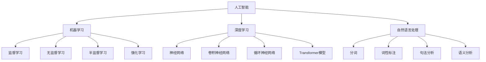
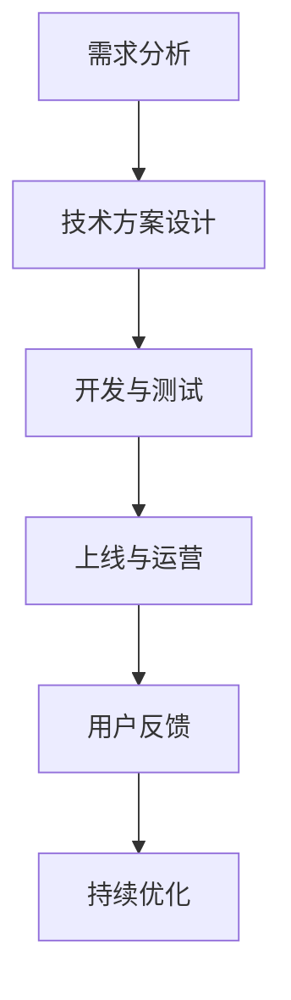
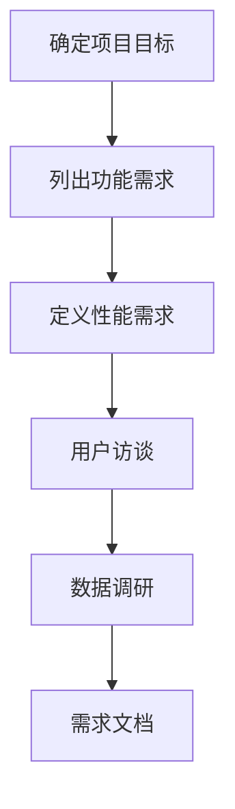
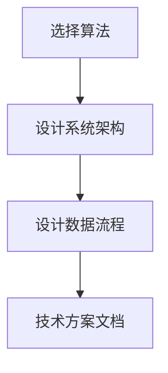
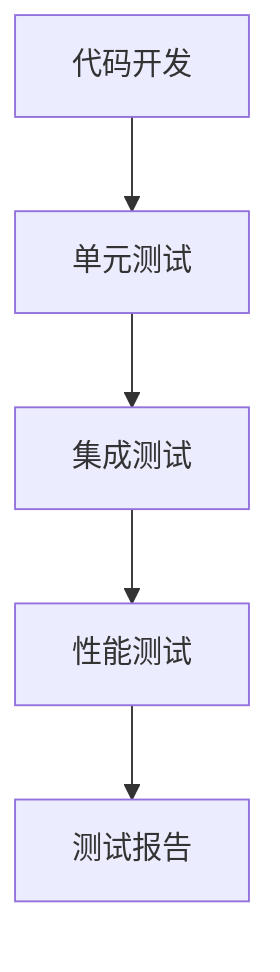
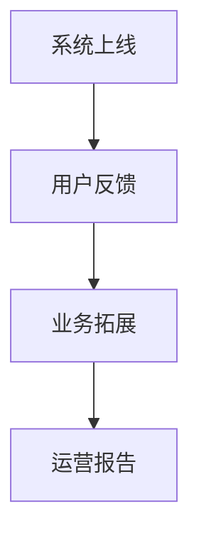
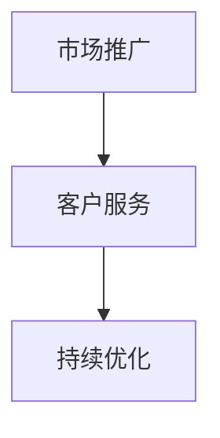

                 


# AI创业机遇：垂直领域新蓝海

## 关键词
- 人工智能创业
- 垂直领域
- 商业模式
- 技术挑战
- 法律伦理
- 实战案例

## 摘要
本文将探讨AI创业领域中的垂直领域机遇。通过分析AI的核心概念、核心技术、算法原理和数学模型，本文将揭示垂直领域AI创业的优势和挑战。同时，结合实际项目案例，我们将深入探讨AI创业流程、策略、法律与伦理问题，以及垂直领域AI在医疗健康、金融科技、智能制造等领域的应用。最终，本文将总结AI创业成功的关键因素，为创业者提供实践指南。

## 目录

### 第一部分：AI与创业概述

#### 第1章：AI时代的创业机遇
- 1.1 AI的定义与核心技术
- 1.2 AI对创业的影响
- 1.3 垂直领域AI创业的优势与挑战

#### 第2章：垂直领域AI应用概述
- 2.1 垂直领域AI的定义
- 2.2 垂直领域AI的应用领域
- 2.3 垂直领域AI的商业模式分析

#### 第3章：AI创业流程与策略
- 3.1 AI创业项目评估
- 3.2 AI创业资金筹集
- 3.3 AI创业团队组建

#### 第4章：垂直领域AI创业案例研究
- 4.1 案例一：医疗健康领域的AI创业
- 4.2 案例二：金融科技领域的AI创业
- 4.3 案例三：智能制造领域的AI创业

#### 第5章：AI创业中的法律与伦理问题
- 5.1 AI创业中的法律风险
- 5.2 AI创业中的伦理问题
- 5.3 AI创业中的合规管理

### 第二部分：垂直领域AI技术应用详解

#### 第6章：医疗健康领域的AI应用
- 6.1 医疗健康领域AI应用概述
- 6.2 医疗健康领域AI应用案例
- 6.3 医疗健康领域AI应用的发展趋势

#### 第7章：金融科技领域的AI应用
- 7.1 金融科技领域AI应用概述
- 7.2 金融科技领域AI应用案例
- 7.3 金融科技领域AI应用的发展趋势

#### 第8章：智能制造领域的AI应用
- 8.1 智能制造领域AI应用概述
- 8.2 智能制造领域AI应用案例
- 8.3 智能制造领域AI应用的发展趋势

#### 第9章：其他垂直领域AI应用
- 9.1 教育领域的AI应用
- 9.2 媒体与娱乐领域的AI应用
- 9.3 环境保护与能源领域的AI应用

### 第三部分：AI创业实践

#### 第10章：AI创业项目实战
- 10.1 项目需求分析
- 10.2 项目技术方案设计
- 10.3 项目开发与测试

#### 第11章：AI创业项目运营
- 11.1 项目市场推广
- 11.2 项目客户服务
- 11.3 项目持续优化

#### 第12章：AI创业成功关键因素
- 12.1 创新能力
- 12.2 执行力
- 12.3 团队建设

### 附录
- 附录A：AI创业资源汇总
  - A.1 垂直领域AI研究机构
  - A.2 AI创业平台与工具
  - A.3 AI创业相关政策与法规

## 引言

### AI创业的背景与意义

随着人工智能技术的迅猛发展，AI已经成为推动社会进步和经济增长的重要力量。据市场研究机构的数据显示，全球人工智能市场规模预计将在未来几年内持续增长，达到数千亿美元。这一巨大的市场潜力吸引了众多创业者和投资者的关注。然而，要想在AI创业领域中脱颖而出，创业者不仅需要掌握先进的技术，还需要对市场、商业模式、法律法规等方面有深刻的理解。

垂直领域AI创业，作为一种新型的创业模式，具有巨大的发展潜力和市场空间。垂直领域AI创业意味着将人工智能技术应用于特定的行业或领域，如医疗健康、金融科技、智能制造等。这种模式的优势在于，创业者可以更专注于特定领域的问题，提供更精准、更有效的解决方案。同时，垂直领域AI创业也面临着一定的挑战，如技术门槛、市场开拓、法律法规等问题。

本文将围绕AI创业中的垂直领域，系统地分析AI的定义与核心技术、垂直领域AI的应用概述、AI创业流程与策略、垂直领域AI创业案例研究、AI创业中的法律与伦理问题，以及垂直领域AI在各行业中的应用。通过这些内容的探讨，旨在为创业者提供一份全面的AI创业指南，帮助他们抓住AI创业机遇，开拓新蓝海。

### AI的定义与核心技术

#### AI的定义

人工智能（Artificial Intelligence，简称AI）是指通过计算机系统模拟、扩展和增强人类智能的一种技术。AI旨在使计算机能够执行通常需要人类智能才能完成的任务，如视觉识别、语言理解、决策制定等。AI的发展经历了多个阶段，从早期的规则系统、知识表示，到现代的机器学习和深度学习，AI技术不断演进，实现了更高的智能水平。

#### AI的核心技术

AI的核心技术主要包括机器学习（Machine Learning，ML）、深度学习（Deep Learning，DL）和自然语言处理（Natural Language Processing，NLP）等。

##### 1. 机器学习

机器学习是AI的一个重要分支，通过使用统计方法和算法，使计算机能够从数据中自动学习并改进性能。机器学习可以分为以下几种类型：

- **监督学习（Supervised Learning）**：通过标记好的训练数据，使模型学习到输入和输出之间的关系，如分类、回归任务。
- **无监督学习（Unsupervised Learning）**：没有标记的训练数据，模型需要自己发现数据中的结构和模式，如聚类、降维任务。
- **半监督学习（Semi-Supervised Learning）**：部分标记的训练数据和大量未标记的数据混合训练，模型可以在这两种数据中学习到更丰富的信息。
- **强化学习（Reinforcement Learning）**：通过奖励机制，使模型在与环境的交互中学习最优策略，如游戏AI、自动驾驶等。

##### 2. 深度学习

深度学习是机器学习的一种特殊形式，它通过多层神经网络（Neural Networks）对大量数据进行训练，从而实现复杂的任务。深度学习在图像识别、语音识别、自然语言处理等领域取得了显著的成果。深度学习的关键组成部分包括：

- **神经网络（Neural Networks）**：一种模拟生物神经系统的计算模型，通过神经元的连接和激活函数实现数据传递和处理。
- **卷积神经网络（Convolutional Neural Networks，CNN）**：一种特殊的神经网络，适用于图像处理任务，通过卷积操作提取图像特征。
- **循环神经网络（Recurrent Neural Networks，RNN）**：一种能够处理序列数据的神经网络，通过循环连接和隐藏状态实现长距离依赖建模。
- **Transformer模型**：一种基于自注意力机制的神经网络模型，在自然语言处理任务中取得了显著的成果，如机器翻译、文本分类等。

##### 3. 自然语言处理

自然语言处理是AI在语言领域的一个分支，旨在使计算机能够理解和处理自然语言。自然语言处理的关键技术包括：

- **分词（Tokenization）**：将文本分割成单词、短语或其他有意义的标记。
- **词性标注（Part-of-Speech Tagging）**：对文本中的每个单词进行词性分类，如名词、动词等。
- **句法分析（Syntax Analysis）**：分析句子的结构，识别句子中的语法关系。
- **语义分析（Semantic Analysis）**：理解句子中的语义含义，包括实体识别、关系抽取等。

#### AI的核心技术图解

为了更清晰地理解AI的核心技术，我们可以使用Mermaid流程图进行图解：



#### 伪代码：机器学习算法示例

以下是一个简单的伪代码示例，展示了如何使用机器学习算法进行分类任务：

```python
# 伪代码：机器学习分类算法
function classify(data, labels):
    # 初始化模型
    model = initializeModel()
    
    # 训练模型
    for epoch in 1 to 100:
        for sample in data:
            # 前向传播
            predicted = model.forward(sample)
            
            # 计算损失
            loss = computeLoss(predicted, labels)
            
            # 反向传播
            model.backward(sample, predicted, labels)
            
            # 更新模型参数
            model.updateParameters()
    
    # 模型评估
    accuracy = evaluateModel(model, validationData)
    
    return model, accuracy
```

#### 数学模型和公式

在机器学习中，损失函数是一个核心概念，它用于衡量模型的预测值与真实值之间的差距。以下是一个简单的均方误差（MSE）损失函数的LaTeX数学公式：

$$
MSE = \frac{1}{m}\sum_{i=1}^{m}(y_i - \hat{y}_i)^2
$$

其中，$y_i$表示真实值，$\hat{y}_i$表示预测值，$m$表示样本数量。

#### 代码示例

以下是一个简单的Python代码示例，使用Keras库构建一个简单的深度学习模型，用于手写数字识别任务：

```python
# 导入Keras库
from keras.models import Sequential
from keras.layers import Dense, Flatten
from keras.datasets import mnist

# 加载MNIST数据集
(x_train, y_train), (x_test, y_test) = mnist.load_data()

# 预处理数据
x_train = x_train.reshape(-1, 28 * 28)
x_test = x_test.reshape(-1, 28 * 28)
x_train = x_train / 255.0
x_test = x_test / 255.0

# 转换标签为独热编码
y_train = keras.utils.to_categorical(y_train)
y_test = keras.utils.to_categorical(y_test)

# 创建模型
model = Sequential()
model.add(Flatten(input_shape=(28, 28)))
model.add(Dense(128, activation='relu'))
model.add(Dense(10, activation='softmax'))

# 编译模型
model.compile(optimizer='adam', loss='categorical_crossentropy', metrics=['accuracy'])

# 训练模型
model.fit(x_train, y_train, epochs=5, batch_size=32, validation_data=(x_test, y_test))

# 评估模型
test_loss, test_accuracy = model.evaluate(x_test, y_test)
print('Test accuracy:', test_accuracy)
```

通过以上内容，我们为读者提供了一个全面的AI核心概念和技术的介绍。接下来，我们将深入探讨垂直领域AI应用，分析其在各行业中的机遇和挑战。

### 垂直领域AI应用概述

#### 垂直领域AI的定义

垂直领域AI（Vertical AI）是指将人工智能技术应用于特定的行业或领域，以解决该领域中的特定问题。与通用人工智能（General AI）不同，垂直领域AI专注于特定领域的问题，具有较高的专业性和针对性。例如，医疗健康领域的AI应用于疾病诊断和治疗，金融科技领域的AI应用于信用评估和风险管理，智能制造领域的AI应用于生产优化和质量管理。

#### 垂直领域AI的应用领域

垂直领域AI的应用非常广泛，涵盖了医疗健康、金融科技、智能制造、教育、媒体与娱乐、环境保护等多个行业。以下是对这些领域的主要应用的概述：

##### 1. 医疗健康领域

- **疾病诊断与预测**：利用AI技术进行疾病早期诊断，如乳腺癌、肺癌等，提高诊断准确率。
- **个性化治疗**：根据患者的基因信息、病史和实时数据，为患者制定个性化的治疗方案。
- **医疗影像分析**：使用深度学习技术对医学影像进行分析，如X光片、CT、MRI等，辅助医生进行诊断。
- **药物研发**：利用AI技术加速新药研发，通过模拟和预测药物与生物大分子的相互作用。

##### 2. 金融科技领域

- **信用评估与风险管理**：通过分析用户的信用历史、消费行为等数据，提供更准确的信用评估服务。
- **智能投顾**：利用AI技术为用户提供个性化的投资建议，提高投资回报率。
- **反欺诈检测**：通过分析交易行为和用户特征，实时监测和预防金融欺诈行为。
- **智能客服**：利用自然语言处理技术，提供24/7的智能客服服务，提高客户满意度。

##### 3. 智能制造领域

- **生产优化**：通过分析生产过程中的数据，优化生产流程，提高生产效率。
- **质量检测**：使用AI技术对生产的产品进行质量检测，减少不良品率。
- **设备预测性维护**：通过监控设备运行状态，预测设备故障，提前进行维护，减少停机时间。
- **智能制造系统**：集成AI技术，构建智能工厂，实现生产过程的自动化和智能化。

##### 4. 教育领域

- **个性化学习**：根据学生的学习情况和兴趣，提供个性化的学习资源和课程。
- **智能辅导**：利用自然语言处理技术，为学生提供智能辅导，解答学习问题。
- **在线教育平台**：利用AI技术，提供自适应学习系统和智能推荐系统，提高学习效果。
- **教育数据分析**：通过分析学生的学习数据，为教育工作者提供决策支持。

##### 5. 媒体与娱乐领域

- **内容推荐**：利用推荐系统，为用户提供个性化的内容推荐，提高用户满意度。
- **语音识别与合成**：利用语音识别技术，实现人机交互，提供智能语音助手服务。
- **图像识别与编辑**：利用深度学习技术，实现图像识别和编辑，提供创意工具。
- **虚拟现实与增强现实**：利用AI技术，打造沉浸式的虚拟现实和增强现实体验。

##### 6. 环境保护与能源领域

- **环境监测**：利用传感器和AI技术，实时监测环境质量，提供预警和改善建议。
- **能源管理**：通过分析能源使用数据，优化能源分配和调度，提高能源利用效率。
- **可再生能源预测**：利用AI技术，预测可再生能源的产量，优化能源储备和调度。
- **智能农业**：利用AI技术，实现农业生产的智能化，提高产量和质量。

#### 垂直领域AI的商业模式分析

垂直领域AI的商业模式主要包括以下几种：

- **服务型商业模式**：通过提供AI服务，如疾病诊断、信用评估、智能客服等，实现商业价值。
- **平台型商业模式**：构建AI平台，整合各种AI应用，为行业用户提供一站式的解决方案。
- **硬件+软件模式**：提供智能硬件设备，如智能医疗设备、智能监控设备等，结合软件服务，实现商业价值。
- **数据驱动模式**：通过收集和分析行业数据，提供数据洞察和决策支持，实现商业价值。

#### 垂直领域AI创业的优势与挑战

##### 1. 优势

- **专注性与专业性**：垂直领域AI创业可以更专注于特定领域的问题，提供更精准、更有效的解决方案。
- **市场潜力**：随着行业数字化转型的推进，垂直领域AI具有巨大的市场潜力。
- **技术优势**：垂直领域AI创业可以利用最新的AI技术，保持竞争优势。
- **数据积累**：垂直领域AI创业可以积累大量行业数据，为后续发展提供数据支持。

##### 2. 挑战

- **技术门槛**：垂直领域AI创业需要掌握先进的AI技术，对技术团队的要求较高。
- **市场开拓**：垂直领域AI创业需要面对激烈的市场竞争，开拓市场具有一定的挑战。
- **法律法规**：垂直领域AI创业需要遵守相关的法律法规，如数据保护、隐私保护等。
- **伦理问题**：垂直领域AI创业需要关注伦理问题，如算法偏见、数据滥用等。

#### 垂直领域AI创业案例分析

为了更深入地了解垂直领域AI创业，我们可以通过一些实际案例进行分析。

##### 1. 医疗健康领域的AI创业

- **案例一**：一款名为“平安好医生”的AI健康咨询平台，通过自然语言处理和语音识别技术，为用户提供在线健康咨询和医疗信息查询服务。该平台利用AI技术提高了医疗服务的效率和准确性，受到了广泛欢迎。
- **案例二**：一家名为“依图科技”的AI公司，专注于医疗影像分析领域，通过深度学习技术，实现肺癌、乳腺癌等疾病的早期诊断。该公司已与多家医院和医疗机构合作，为患者提供高效的诊断服务。

##### 2. 金融科技领域的AI创业

- **案例一**：一款名为“陆金所”的AI智能投顾平台，通过大数据分析和机器学习技术，为用户提供个性化的投资建议。该平台利用AI技术提高了投资决策的准确性，受到了投资者的青睐。
- **案例二**：一家名为“360数科”的AI公司，专注于信用评估和风险管理领域，通过大数据分析和深度学习技术，为金融机构提供信用评估服务。该公司已与多家银行和金融机构合作，为用户提供便捷的信用服务。

##### 3. 智能制造领域的AI创业

- **案例一**：一款名为“Flexport”的AI智能物流平台，通过机器学习和自然语言处理技术，优化物流路线和运输计划。该平台利用AI技术提高了物流效率，降低了物流成本。
- **案例二**：一家名为“ABB”的AI公司，专注于智能制造领域，通过机器人技术和AI技术，实现生产过程的自动化和智能化。该公司已与多家制造企业合作，为用户提供智能生产解决方案。

通过以上案例分析，我们可以看到垂直领域AI创业在医疗健康、金融科技、智能制造等领域的成功应用，同时也面临一定的挑战。在接下来的章节中，我们将进一步探讨AI创业的流程与策略，以及垂直领域AI在各行业的应用。

### AI创业流程与策略

#### AI创业项目评估

在开始AI创业项目之前，对项目的评估是至关重要的一步。评估主要包括以下几个方面：

1. **市场需求**：了解目标市场的需求，分析目标客户是否对AI解决方案有实际需求，以及市场潜力的大小。
2. **技术可行性**：评估所需技术的成熟度和可用性，确保项目的技术方案是可行的。
3. **资源与团队**：评估创业团队的技术能力、管理能力和资源，确保团队能够胜任项目。
4. **风险分析**：识别项目中的潜在风险，如技术风险、市场风险、资金风险等，并制定相应的应对措施。

#### AI创业资金筹集

资金筹集是AI创业过程中的一大挑战。以下是一些常见的资金筹集途径：

1. **天使投资**：寻找对AI技术有热情的天使投资者，他们通常愿意在项目早期阶段提供资金支持。
2. **风险投资**：联系风险投资公司，争取获得风险投资。风险投资公司通常在项目成长期和扩张期提供资金支持。
3. **政府补贴与奖励**：申请政府提供的补贴、奖励和税收优惠等政策支持。
4. **众筹**：通过众筹平台，向公众筹集资金。众筹不仅能够提供资金，还能提高项目的知名度。
5. **银行贷款**：向银行申请贷款，但需要具备一定的信用和还款能力。

#### AI创业团队组建

一个高效的AI创业团队是项目成功的关键。以下是在组建团队时需要考虑的几个方面：

1. **核心成员**：寻找在AI技术、产品开发、市场运营等方面有丰富经验的核心成员，确保团队能够胜任项目的各个环节。
2. **技术团队**：组建技术团队，包括数据科学家、机器学习工程师、软件开发工程师等，确保技术方案能够顺利实施。
3. **市场团队**：组建市场团队，包括产品经理、市场营销人员、销售团队等，负责项目的市场推广和销售工作。
4. **管理团队**：确保团队有一个高效的管理团队，包括创始人、COO、CFO等，负责项目的管理和运营。

#### AI创业项目实战

一个成功的AI创业项目需要经过多个阶段的实战。以下是项目实战的主要步骤：

1. **需求分析**：深入了解客户需求，明确项目的目标和功能需求。
2. **技术方案设计**：根据需求分析，设计符合项目要求的技术方案，包括算法、架构、数据库等。
3. **开发与测试**：按照技术方案进行开发，并进行严格的测试，确保系统的稳定性和性能。
4. **上线与运营**：将项目上线，并进行运营，收集用户反馈，不断优化产品。

以下是一个简单的AI创业项目实战的Mermaid流程图：



#### 伪代码：AI创业项目实战示例

以下是一个简化的伪代码示例，展示了AI创业项目实战的流程：

```python
# 伪代码：AI创业项目实战
function startupProject():
    # 需求分析
    analyzeRequirements()

    # 技术方案设计
    designTechnicalSolution()

    # 开发与测试
    for iteration in 1 to maxIterations:
        codeDevelopment()
        performTesting()

    # 上线与运营
    deployProject()
    operateProject()

    # 用户反馈与持续优化
    while True:
        collectFeedback()
        optimizeProduct()
```

#### 数学模型和公式

在AI创业项目中，数据分析和机器学习是核心环节。以下是一个简单的回归模型的LaTeX数学公式，用于预测用户行为：

$$
y = \beta_0 + \beta_1 \cdot x_1 + \beta_2 \cdot x_2 + ... + \beta_n \cdot x_n
$$

其中，$y$表示预测值，$x_1, x_2, ..., x_n$表示特征值，$\beta_0, \beta_1, \beta_2, ..., \beta_n$表示模型参数。

#### 代码示例

以下是一个简单的Python代码示例，使用Scikit-learn库进行线性回归模型的训练和预测：

```python
# 导入Scikit-learn库
from sklearn.linear_model import LinearRegression
from sklearn.model_selection import train_test_split
from sklearn.metrics import mean_squared_error

# 加载数据
# ...

# 分割数据集
X_train, X_test, y_train, y_test = train_test_split(X, y, test_size=0.2, random_state=42)

# 创建模型
model = LinearRegression()

# 训练模型
model.fit(X_train, y_train)

# 预测
predictions = model.predict(X_test)

# 计算损失
mse = mean_squared_error(y_test, predictions)
print('MSE:', mse)
```

通过以上内容，我们为读者提供了一个全面的AI创业流程与策略的介绍。接下来，我们将通过具体案例研究，进一步探讨垂直领域AI创业的成功经验与挑战。

### 垂直领域AI创业案例研究

#### 案例一：医疗健康领域的AI创业

**公司简介**：IBM Watson Health是一家专注于医疗健康领域的AI公司，其核心产品是基于深度学习技术的AI医生助手Watson for Oncology。

**业务模式**：Watson for Oncology通过分析大量的医学文献、患者数据和治疗方案，为医生提供个性化的治疗方案推荐。公司采用订阅模式，与医疗机构合作，为医生和患者提供实时、精准的医疗服务。

**成功经验**：
- **技术创新**：IBM Watson Health利用深度学习和自然语言处理技术，对海量医学数据进行分析，提高了疾病诊断和治疗的准确率。
- **数据积累**：通过持续收集和分析医学数据，IBM Watson Health积累了丰富的医学知识库，不断优化AI模型。
- **市场合作**：与多家医疗机构和学术机构合作，拓展市场份额，提高品牌知名度。

**挑战**：
- **技术门槛**：医疗健康领域的AI技术复杂，对团队的技术能力有较高要求。
- **数据隐私**：医疗数据涉及到患者隐私，数据保护和安全是重要的挑战。
- **法规合规**：需要遵守医疗行业的法律法规，确保AI系统的合规性。

**案例总结**：IBM Watson Health在医疗健康领域的AI创业取得了显著的成功，通过技术创新、数据积累和市场合作，成为医疗健康领域AI的领导者。然而，技术门槛、数据隐私和法规合规仍是需要持续关注和解决的挑战。

#### 案例二：金融科技领域的AI创业

**公司简介**：Finn AI是一家专注于金融科技领域的AI公司，其核心产品是基于深度学习技术的信用评分模型。

**业务模式**：Finn AI通过分析用户的金融数据、行为数据和社交网络信息，为金融机构提供信用评分服务。公司采用按需付费模式，与银行、金融机构合作，为用户提供信用评估服务。

**成功经验**：
- **市场定位**：Finn AI专注于金融科技领域，提供定制化的信用评分解决方案，满足了金融机构的需求。
- **技术优势**：利用深度学习和自然语言处理技术，Finn AI的信用评分模型具有高准确性和实时性。
- **数据积累**：通过持续收集和分析金融数据，Finn AI积累了丰富的数据资源，不断优化模型。

**挑战**：
- **数据隐私**：金融数据涉及到用户隐私，数据保护和安全是重要的挑战。
- **市场竞争**：金融科技领域竞争激烈，需要不断创新和优化，保持竞争优势。
- **法规合规**：需要遵守金融行业的法律法规，确保AI系统的合规性。

**案例总结**：Finn AI在金融科技领域的AI创业取得了显著的成功，通过市场定位、技术优势和数据积累，成为金融科技领域的佼佼者。然而，数据隐私、市场竞争和法规合规仍是需要持续关注和解决的挑战。

#### 案例三：智能制造领域的AI创业

**公司简介**：Blue Yonder是一家专注于智能制造领域的AI公司，其核心产品是基于机器学习技术的供应链优化平台。

**业务模式**：Blue Yonder通过分析供应链数据，提供实时的供应链优化建议，帮助制造业企业提高生产效率和降低成本。公司采用订阅模式，与制造业企业合作，为用户提供定制化的供应链优化服务。

**成功经验**：
- **技术创新**：Blue Yonder利用机器学习和深度学习技术，对海量供应链数据进行分析，提供了精准的优化建议。
- **客户合作**：与多家制造业企业合作，积累了丰富的客户案例，提高了品牌知名度。
- **市场拓展**：通过全球布局，拓展海外市场，实现了业务的国际化。

**挑战**：
- **数据质量**：智能制造领域的数据质量参差不齐，需要确保数据的质量和准确性。
- **系统集成**：智能制造系统通常涉及多个系统和设备，需要确保AI系统能够与现有系统集成。
- **技术更新**：智能制造领域技术更新迅速，需要持续投入研发，保持技术领先。

**案例总结**：Blue Yonder在智能制造领域的AI创业取得了显著的成功，通过技术创新、客户合作和市场拓展，成为智能制造领域的领先企业。然而，数据质量、系统集成和技术更新仍是需要持续关注和解决的挑战。

#### 案例研究总结

通过以上案例研究，我们可以看到垂直领域AI创业在不同行业中的成功经验和挑战。无论是医疗健康、金融科技还是智能制造领域，垂直领域AI创业都需要掌握先进的技术、积累丰富的数据资源，并与行业客户紧密合作。同时，数据隐私、法规合规、市场竞争和系统集成等技术挑战也需要创业者持续关注和解决。

### AI创业中的法律与伦理问题

#### AI创业中的法律风险

在AI创业过程中，法律风险是一个不可忽视的重要问题。以下是一些常见的法律风险：

1. **知识产权**：AI技术涉及到大量的算法、数据和模型，创业者需要确保自己的技术方案不侵犯他人的知识产权，如专利、商标和著作权等。
2. **数据保护**：AI创业项目通常需要处理大量的个人数据，创业者需要遵守相关的数据保护法律法规，如《通用数据保护条例》（GDPR）和《加州消费者隐私法案》（CCPA）等，确保用户数据的收集、存储和使用是合法和安全的。
3. **消费者权益**：AI产品和服务需要符合消费者权益保护法律法规，如《消费者权益保护法》等，确保消费者在使用过程中不受欺诈、误导和侵犯权益。
4. **隐私权**：AI技术可能涉及到用户的隐私，创业者需要确保用户隐私不被泄露和滥用，遵守相关的隐私保护法律法规。

#### AI创业中的伦理问题

AI创业中的伦理问题也是创业者需要关注的重要方面。以下是一些常见的伦理问题：

1. **算法偏见**：AI算法可能存在偏见，导致对某些群体不公平的对待，如性别、种族、年龄等。创业者需要确保算法的公平性和透明性，避免算法偏见。
2. **隐私侵犯**：AI技术可能侵犯用户的隐私权，如收集和利用用户敏感数据。创业者需要尊重用户隐私，采取有效的隐私保护措施。
3. **安全性**：AI系统可能面临安全威胁，如数据泄露、恶意攻击等。创业者需要确保AI系统的安全性，防止潜在的安全风险。
4. **社会责任**：AI技术在带来便利和效益的同时，也可能对人类产生负面影响，如失业、社会不公等。创业者需要承担社会责任，关注AI技术对社会的长期影响。

#### AI创业中的合规管理

为了有效应对法律和伦理问题，创业者需要采取一系列合规管理措施：

1. **法律法规研究**：创业者需要深入了解相关的法律法规，确保业务活动符合法律法规要求。
2. **合规培训**：对团队成员进行合规培训，提高团队成员的合规意识和能力。
3. **数据保护**：建立完善的数据保护机制，包括数据收集、存储、处理和传输的安全措施。
4. **伦理审查**：建立伦理审查机制，对AI项目进行伦理评估，确保项目的伦理可行性。
5. **风险管理**：建立风险管理体系，识别、评估和管理AI创业中的法律和伦理风险。

#### 伪代码：合规管理流程

以下是一个简化的伪代码示例，展示了合规管理流程：

```python
# 伪代码：合规管理流程
function complianceManagement():
    # 研究法律法规
    researchLawsAndRegulations()

    # 合规培训
    trainTeamMembers()

    # 数据保护
    implementDataProtection()

    # 伦理审查
    conductEthicalReview()

    # 风险管理
    manageRisks()

    # 持续改进
    while True:
        monitorCompliance()
        improveCompliance()
```

#### 数学模型和公式

在合规管理中，风险评估是一个核心概念。以下是一个简单的事件树模型，用于评估合规风险：

$$
R = \sum_{i=1}^{n} (P_i \cdot C_i)
$$

其中，$R$表示总合规风险，$P_i$表示事件$i$的发生概率，$C_i$表示事件$i$的合规成本。

#### 代码示例

以下是一个简单的Python代码示例，使用Scikit-learn库进行风险评估：

```python
# 导入Scikit-learn库
from sklearn.ensemble import RandomForestClassifier
from sklearn.model_selection import train_test_split
from sklearn.metrics import accuracy_score

# 加载数据
# ...

# 分割数据集
X_train, X_test, y_train, y_test = train_test_split(X, y, test_size=0.2, random_state=42)

# 创建模型
model = RandomForestClassifier()

# 训练模型
model.fit(X_train, y_train)

# 预测
predictions = model.predict(X_test)

# 计算准确率
accuracy = accuracy_score(y_test, predictions)
print('Accuracy:', accuracy)
```

通过以上内容，我们为读者提供了一个全面的AI创业中的法律与伦理问题的介绍。接下来，我们将深入探讨垂直领域AI在各行业的应用，分析其在医疗健康、金融科技、智能制造等领域的具体实现和未来发展趋势。

### 垂直领域AI技术应用详解

#### 第6章：医疗健康领域的AI应用

##### 6.1 医疗健康领域AI应用概述

医疗健康领域是AI技术的重要应用场景之一。通过利用AI技术，可以大幅提升医疗服务的效率和质量，降低医疗成本，改善患者体验。以下是一些主要的医疗健康领域AI应用：

1. **疾病诊断与预测**：利用深度学习和机器学习技术，AI可以分析医学影像数据（如CT、MRI、X光片等），提供快速、准确的疾病诊断。例如，AI可以识别早期肺癌、乳腺癌等疾病，提高早期诊断率。
2. **个性化治疗**：通过分析患者的基因数据、病史和实时数据，AI可以制定个性化的治疗方案，提高治疗效果。例如，AI可以根据患者的基因特征，推荐最适合的癌症治疗药物。
3. **医疗影像分析**：AI技术可以对医学影像进行自动分析，如识别病变区域、测量病变大小等，辅助医生进行诊断和治疗。例如，AI可以自动识别肺结节，辅助医生进行肺癌的早期诊断。
4. **药物研发**：利用AI技术，可以加速新药研发过程。AI可以通过模拟和预测药物与生物大分子的相互作用，筛选出具有潜在疗效的药物候选。
5. **患者监护**：通过可穿戴设备和传感器，AI可以实时监测患者健康状况，如心率、血压、血糖等，提供个性化健康建议。

##### 6.2 医疗健康领域AI应用案例

以下是一些医疗健康领域AI应用的案例：

**案例一**：IBM Watson for Oncology

IBM Watson for Oncology是一款基于深度学习的AI医生助手，可以帮助医生提供个性化的癌症治疗方案。通过分析医学文献、患者数据和治疗方案，Watson for Oncology可以为医生提供最优的治疗建议。例如，Watson for Oncology可以帮助医生识别早期肺癌，提供最佳的治疗方案。

**案例二**：Google DeepMind

Google DeepMind是一家专注于AI医疗应用的公司，其产品包括AlphaGo和AlphaFold。AlphaFold是一款基于深度学习的蛋白质折叠预测工具，可以帮助科学家预测蛋白质的三维结构。这一技术有望加速新药研发，为治疗疾病提供新的思路。

**案例三**：MediCat

MediCat是一款基于自然语言处理技术的AI医生助手，可以帮助医生快速获取病例信息，提供诊断建议和治疗方案。MediCat可以处理海量的医学文献和数据，为医生提供全面、准确的医学信息支持。

##### 6.3 医疗健康领域AI应用的发展趋势

随着AI技术的不断进步，医疗健康领域AI应用呈现出以下发展趋势：

1. **深度学习和机器学习的普及**：深度学习和机器学习技术将成为医疗健康领域AI应用的主要驱动力。这些技术可以处理大规模的医学数据，提供更精准的诊断和预测。
2. **多模态数据的融合**：医疗健康领域的数据类型多样，包括影像数据、基因数据、电子健康记录等。未来的发展趋势是利用多模态数据融合技术，提供更全面、准确的诊断和治疗。
3. **个性化医疗的发展**：随着AI技术的进步，个性化医疗将逐渐普及。通过分析患者的个体特征，AI可以为患者提供个性化的治疗方案，提高治疗效果。
4. **远程医疗的推广**：AI技术可以支持远程医疗，为偏远地区的患者提供医疗服务。通过视频通话、智能诊断设备等，AI可以远程诊断和治疗疾病，提高医疗服务的可及性。
5. **医疗设备的智能化**：未来的医疗设备将更加智能化，集成AI技术，提供实时监测、诊断和治疗功能。例如，智能监护设备可以实时监测患者生命体征，提供预警和干预建议。

#### 第7章：金融科技领域的AI应用

##### 7.1 金融科技领域AI应用概述

金融科技（Fintech）领域是AI技术的重要应用场景之一。AI技术在金融领域的应用可以提升金融服务的效率和质量，降低金融风险，改善用户体验。以下是一些主要的金融科技领域AI应用：

1. **信用评估与风险管理**：AI技术可以通过分析用户的历史行为、社交网络信息、财务数据等，提供更准确、实时的信用评估服务。例如，AI可以识别欺诈行为、评估信用风险，帮助金融机构降低风险。
2. **智能投顾**：AI技术可以帮助金融机构提供个性化的投资建议，根据用户的风险偏好和投资目标，制定最优的投资组合。例如，智能投顾平台可以利用机器学习算法，分析市场数据，为用户提供投资策略。
3. **智能客服**：AI技术可以提供24/7的智能客服服务，通过自然语言处理技术，解答用户的咨询和疑问。例如，智能客服机器人可以处理大量的客户咨询，提高客服效率。
4. **反欺诈检测**：AI技术可以通过分析交易行为、用户特征等，实时监测和预防金融欺诈行为。例如，AI可以识别异常交易行为，自动拦截欺诈交易。
5. **交易执行**：AI技术可以优化交易执行，通过算法交易，提高交易效率和收益。例如，AI可以分析市场数据，自动执行交易策略。

##### 7.2 金融科技领域AI应用案例

以下是一些金融科技领域AI应用的案例：

**案例一**：LendingClub

LendingClub是一家基于AI技术的在线贷款平台，通过分析用户的信用记录、财务数据等，提供个性化的贷款方案。LendingClub利用机器学习技术，优化信用评估模型，提高贷款审批效率。

**案例二**：Robinhood

Robinhood是一家提供股票交易服务的金融科技公司，其核心产品是一个基于AI的股票交易应用。Robinhood利用机器学习算法，分析市场数据，为用户提供实时的投资建议。

**案例三**：Kabbage

Kabbage是一家提供小微企业融资服务的金融科技公司，通过利用AI技术，Kabbage可以快速评估小微企业的信用状况，提供贷款服务。Kabbage利用大数据分析和机器学习技术，提高了贷款审批的准确性和速度。

##### 7.3 金融科技领域AI应用的发展趋势

随着AI技术的不断进步，金融科技领域AI应用呈现出以下发展趋势：

1. **人工智能驱动的金融监管**：AI技术可以帮助金融监管机构提高监管效率，通过分析海量金融数据，识别潜在的金融风险。例如，AI可以实时监控交易行为，预警异常交易。
2. **区块链与AI的结合**：区块链技术具有去中心化、不可篡改的特点，与AI技术的结合将推动金融领域的创新。例如，利用AI技术，可以实现智能合约的自动执行和验证。
3. **智能金融服务的普及**：随着AI技术的普及，智能金融服务将逐渐普及，为用户提供更便捷、高效的金融服务。例如，智能客服、智能投顾等应用将更加普及。
4. **AI驱动的风险管理**：AI技术可以分析海量的数据，提供更精准的风险评估和预测，帮助金融机构降低风险。例如，AI可以预测市场波动，优化投资组合。
5. **个性化金融服务的推广**：AI技术可以帮助金融机构提供更个性化的金融服务，根据用户的需求和风险偏好，提供定制化的投资、贷款和保险产品。

#### 第8章：智能制造领域的AI应用

##### 8.1 智能制造领域AI应用概述

智能制造领域是AI技术的另一个重要应用场景。通过利用AI技术，可以提升制造业的生产效率、降低成本、提高产品质量，实现制造业的智能化转型。以下是一些主要的智能制造领域AI应用：

1. **生产优化**：AI技术可以通过分析生产数据，优化生产流程，提高生产效率。例如，AI可以预测设备故障，提前进行维护，减少停机时间。
2. **质量检测**：AI技术可以对生产的产品进行实时质量检测，识别不良品，提高产品质量。例如，AI可以分析产品外观、尺寸、硬度等参数，检测产品质量。
3. **设备预测性维护**：AI技术可以通过对设备运行数据的分析，预测设备故障，提前进行维护，减少设备故障率。例如，AI可以分析设备振动、温度、压力等参数，预测设备故障。
4. **供应链优化**：AI技术可以通过分析供应链数据，优化供应链管理，提高供应链效率。例如，AI可以预测原材料需求，优化库存管理。
5. **自动化生产**：AI技术可以实现生产过程的自动化，减少人工干预，提高生产效率。例如，AI可以控制机器人执行生产任务。

##### 8.2 智能制造领域AI应用案例

以下是一些智能制造领域AI应用的案例：

**案例一**：通用电气（GE）

通用电气是一家全球领先的制造业公司，其智能工厂项目利用AI技术，实现生产过程的自动化和智能化。通过使用AI技术，通用电气可以实时监控生产设备，预测设备故障，优化生产流程。

**案例二**：西门子（Siemens）

西门子是一家全球领先的工业自动化解决方案提供商，其智能制造系统利用AI技术，实现生产过程的自动化和智能化。通过使用AI技术，西门子可以优化生产流程，提高生产效率。

**案例三**：三菱电机（Mitsubishi Electric）

三菱电机是一家全球领先的电气设备制造商，其智能制造系统利用AI技术，实现生产过程的自动化和智能化。通过使用AI技术，三菱电机可以优化生产流程，提高产品质量。

##### 8.3 智能制造领域AI应用的发展趋势

随着AI技术的不断进步，智能制造领域AI应用呈现出以下发展趋势：

1. **人工智能驱动的生产优化**：AI技术将更加普及，应用于生产流程的各个环节，实现生产过程的自动化和智能化。
2. **数据驱动的供应链管理**：AI技术可以通过分析供应链数据，优化供应链管理，提高供应链效率。
3. **设备预测性维护的普及**：AI技术将广泛应用于设备预测性维护，减少设备故障率，提高生产效率。
4. **自动化生产的普及**：随着机器人技术和AI技术的进步，自动化生产将逐渐普及，减少人工干预，提高生产效率。
5. **智能工厂的建设**：智能工厂将成为制造业的发展方向，通过利用AI技术，实现生产过程的自动化和智能化。

#### 第9章：其他垂直领域AI应用

除了医疗健康、金融科技和智能制造领域，AI技术还广泛应用于其他垂直领域，以下是一些主要的应用：

##### 9.1 教育领域的AI应用

- **个性化学习**：AI技术可以根据学生的学习情况和兴趣，提供个性化的学习资源和课程，提高学习效果。
- **智能辅导**：AI技术可以提供智能辅导服务，解答学生的学习问题，提高学生的学习效率。
- **在线教育平台**：AI技术可以优化在线教育平台，实现自适应学习系统和智能推荐系统，提高学习体验。
- **教育数据分析**：AI技术可以分析学生的学习数据，为教育工作者提供决策支持。

##### 9.2 媒体与娱乐领域的AI应用

- **内容推荐**：AI技术可以分析用户的兴趣和行为，为用户提供个性化的内容推荐。
- **语音识别与合成**：AI技术可以实现语音识别和语音合成，为用户提供智能语音助手和语音交互服务。
- **图像识别与编辑**：AI技术可以实现图像识别和编辑，为用户提供创意工具。
- **虚拟现实与增强现实**：AI技术可以支持虚拟现实和增强现实技术，提供沉浸式的娱乐体验。

##### 9.3 环境保护与能源领域的AI应用

- **环境监测**：AI技术可以通过分析传感器数据，实时监测环境质量，提供预警和改善建议。
- **能源管理**：AI技术可以通过分析能源使用数据，优化能源分配和调度，提高能源利用效率。
- **可再生能源预测**：AI技术可以预测可再生能源的产量，优化能源储备和调度。
- **智能农业**：AI技术可以通过分析土壤、气候等数据，实现农业生产的智能化，提高产量和质量。

通过以上内容，我们详细介绍了垂直领域AI应用在医疗健康、金融科技、智能制造、教育、媒体与娱乐、环境保护等领域的具体实现和未来发展趋势。接下来，我们将探讨AI创业项目的实战经验，分析成功的关键因素。

### AI创业项目实战

#### 第10章：AI创业项目实战

##### 10.1 项目需求分析

在启动一个AI创业项目之前，对项目需求进行详细分析是至关重要的。需求分析包括明确项目目标、功能需求和性能需求。

**项目目标**：确定项目的总体目标，例如开发一款基于AI的疾病诊断软件，提高疾病早期诊断的准确率。

**功能需求**：列出项目需要实现的具体功能，例如图像识别、数据采集、结果分析等。

**性能需求**：定义项目需要满足的性能指标，例如诊断准确率、处理速度、系统稳定性等。

以下是一个简化的Mermaid流程图，用于展示需求分析的过程：



##### 10.2 项目技术方案设计

技术方案设计是AI创业项目的关键环节，需要考虑算法选择、系统架构、数据流程等方面。

**算法选择**：根据项目需求，选择合适的算法，例如卷积神经网络（CNN）用于图像识别，循环神经网络（RNN）用于时间序列数据分析。

**系统架构**：设计系统的整体架构，包括前端、后端和数据处理模块。例如，前端可以采用Web或移动应用，后端可以采用云计算平台，数据处理模块可以采用分布式处理框架。

**数据流程**：设计数据从采集、处理到分析的全流程，确保数据的质量和一致性。

以下是一个简化的Mermaid流程图，用于展示技术方案设计的过程：



##### 10.3 项目开发与测试

项目开发与测试是AI创业项目的核心环节，需要确保代码质量、系统性能和用户满意度。

**代码开发**：按照技术方案进行代码开发，遵循软件工程的最佳实践，如代码复用、模块化设计、版本控制等。

**单元测试**：对每个模块进行单元测试，确保模块的功能和性能满足需求。

**集成测试**：将各个模块集成在一起，进行集成测试，确保系统的整体功能符合预期。

**性能测试**：进行性能测试，评估系统的处理速度、响应时间、稳定性等性能指标。

以下是一个简化的Mermaid流程图，用于展示项目开发与测试的过程：



##### 10.4 项目上线与运营

项目上线与运营是AI创业项目的最终阶段，需要确保系统的稳定运行、用户满意度和业务拓展。

**系统上线**：将项目部署到生产环境，确保系统的可用性和稳定性。

**用户反馈**：收集用户的反馈，持续改进产品功能和服务质量。

**业务拓展**：通过市场推广、合作拓展等手段，扩大用户基础和市场占有率。

以下是一个简化的Mermaid流程图，用于展示项目上线与运营的过程：



#### 伪代码：AI创业项目实战示例

以下是一个简化的伪代码示例，展示了AI创业项目实战的流程：

```python
# 伪代码：AI创业项目实战
function startupProject():
    # 需求分析
    analyzeRequirements()

    # 技术方案设计
    designTechnicalSolution()

    # 代码开发
    codeDevelopment()

    # 单元测试
    performUnitTests()

    # 集成测试
    performIntegrationTests()

    # 性能测试
    performPerformanceTests()

    # 系统上线
    deployProject()

    # 用户反馈与改进
    while True:
        collectFeedback()
        optimizeProduct()

    # 业务拓展
    expandBusiness()
```

#### 数学模型和公式

在AI创业项目中，机器学习算法是一个核心组成部分。以下是一个简单的线性回归模型的LaTeX数学公式，用于预测项目指标：

$$
y = \beta_0 + \beta_1 \cdot x_1 + \beta_2 \cdot x_2 + ... + \beta_n \cdot x_n
$$

其中，$y$表示预测值，$x_1, x_2, ..., x_n$表示特征值，$\beta_0, \beta_1, \beta_2, ..., \beta_n$表示模型参数。

#### 代码示例

以下是一个简单的Python代码示例，使用Scikit-learn库进行线性回归模型的训练和预测：

```python
# 导入Scikit-learn库
from sklearn.linear_model import LinearRegression
from sklearn.model_selection import train_test_split
from sklearn.metrics import mean_squared_error

# 加载数据
# ...

# 分割数据集
X_train, X_test, y_train, y_test = train_test_split(X, y, test_size=0.2, random_state=42)

# 创建模型
model = LinearRegression()

# 训练模型
model.fit(X_train, y_train)

# 预测
predictions = model.predict(X_test)

# 计算损失
mse = mean_squared_error(y_test, predictions)
print('MSE:', mse)
```

通过以上内容，我们为读者提供了一个全面的AI创业项目实战的介绍。接下来，我们将深入探讨AI创业项目的运营策略，分析项目市场推广、客户服务和持续优化的关键因素。

### AI创业项目运营

#### 第11章：AI创业项目运营

##### 11.1 项目市场推广

在AI创业项目的运营过程中，市场推广是至关重要的。以下是市场推广的关键策略：

1. **目标市场定位**：明确项目的目标市场，了解目标客户的需求和偏好，制定针对性的市场推广策略。
2. **内容营销**：通过撰写高质量的技术博客、发布案例研究、制作视频等，提升项目的知名度和影响力。
3. **社交媒体营销**：利用社交媒体平台，如LinkedIn、Twitter、Facebook等，进行内容分享和互动，扩大项目的影响力。
4. **公关活动**：通过新闻发布会、行业展会等活动，提高项目的曝光率和知名度。
5. **合作伙伴关系**：与其他行业公司、研究机构、高校等建立合作关系，共同推广项目。

##### 11.2 项目客户服务

良好的客户服务是AI创业项目成功的关键。以下是一些关键策略：

1. **客户支持体系**：建立完善的客户支持体系，包括在线客服、电话客服、邮件支持等，确保客户的问题能够得到及时解决。
2. **用户培训**：提供用户培训，帮助用户了解和使用项目功能，提高用户满意度。
3. **反馈机制**：建立反馈机制，收集用户的反馈和建议，不断优化产品和服务。
4. **个性化服务**：根据用户的需求和偏好，提供个性化的服务和支持，提高用户黏性和忠诚度。
5. **售后支持**：提供优质的售后支持，确保用户的权益得到保障。

##### 11.3 项目持续优化

AI创业项目的持续优化是保持竞争力的重要手段。以下是一些关键策略：

1. **数据驱动**：利用用户数据，分析用户行为和需求，发现项目的问题和改进点。
2. **迭代开发**：采用敏捷开发方法，快速迭代产品，不断优化功能和性能。
3. **用户测试**：通过用户测试，收集用户的反馈和意见，验证产品的改进效果。
4. **技术更新**：跟踪最新的技术趋势，不断引入新技术，提升项目的竞争力。
5. **持续学习**：鼓励团队成员持续学习，提升技术能力和业务素质。

以下是一个简化的Mermaid流程图，用于展示项目运营的过程：



#### 伪代码：项目运营策略

以下是一个简化的伪代码示例，展示了项目运营策略的执行过程：

```python
# 伪代码：项目运营策略
function operateProject():
    # 市场推广
    marketPromotion()

    # 客户服务
    customerService()

    # 数据分析
    dataAnalysis()

    # 持续优化
    while True:
        optimizeProduct()
        collectFeedback()
```

#### 数学模型和公式

在项目运营过程中，评估项目绩效和用户满意度是重要的环节。以下是一个简单的用户满意度评分模型，使用LaTeX数学公式表示：

$$
S = \frac{1}{n}\sum_{i=1}^{n} (s_i \cdot w_i)
$$

其中，$S$表示总用户满意度评分，$s_i$表示第$i$个用户的满意度评分，$w_i$表示第$i$个用户的权重。

#### 代码示例

以下是一个简单的Python代码示例，用于计算用户满意度评分：

```python
# 导入Python库
from collections import defaultdict

# 用户满意度评分
user_satisfaction = defaultdict(float)

# 用户评分数据
user_ratings = {
    'User1': 4.5,
    'User2': 5.0,
    'User3': 3.5,
}

# 用户权重
user_weights = {
    'User1': 0.3,
    'User2': 0.4,
    'User3': 0.3,
}

# 计算用户满意度评分
total_satisfaction = sum(user_ratings[user] * user_weights[user] for user in user_ratings)

print('User Satisfaction Score:', total_satisfaction)
```

通过以上内容，我们为读者提供了一个全面的AI创业项目运营的介绍。接下来，我们将总结AI创业成功的关键因素，为创业者提供实践指南。

### AI创业成功关键因素

#### 第12章：AI创业成功关键因素

在AI创业的旅程中，成功往往离不开以下几个关键因素：

##### 12.1 创新能力

创新能力是AI创业的核心驱动力。在技术日新月异的今天，创业者必须具备敏锐的洞察力，不断探索新的技术趋势和市场需求，推动产品创新。以下是一些培养创新能力的方法：

- **持续学习**：创业者应保持对新技术和知识的持续学习，关注行业动态，不断充实自己的知识储备。
- **跨学科合作**：与不同领域的专家合作，借助跨学科的知识，激发创新的灵感。
- **开放式创新**：鼓励团队成员分享想法，通过头脑风暴和开放式创新，寻找创新的解决方案。
- **原型迭代**：快速构建原型，通过多次迭代和用户反馈，不断优化产品，实现技术突破。

##### 12.2 执行力

执行力是AI创业成功的关键保障。一个有执行力的团队能够在短时间内将创意转化为实际的产品和服务。以下是一些提升执行力的方法：

- **明确目标**：设定清晰的目标和里程碑，确保团队每个成员都了解项目的优先级和期望成果。
- **高效沟通**：建立高效的沟通机制，确保信息在团队内部流畅传递，减少误解和拖延。
- **敏捷开发**：采用敏捷开发方法，快速响应市场变化和用户需求，提高产品迭代速度。
- **团队协作**：建立良好的团队协作机制，激发团队成员的积极性和创造力，共同面对挑战。

##### 12.3 团队建设

一个优秀的团队是AI创业成功的基石。团队建设的关键在于搭建一个多元化的团队，充分发挥每个成员的特长和潜力。以下是一些团队建设的策略：

- **人才招聘**：招聘具有专业技能、团队合作精神和学习能力的成员，确保团队的多样性和实力。
- **培训与发展**：为团队成员提供培训和发展机会，提升其技能和职业素养，增强团队的竞争力。
- **企业文化**：建立积极向上的企业文化，鼓励创新、包容失败，营造良好的团队氛围。
- **激励制度**：制定合理的激励制度，激发团队成员的积极性和创造力，促进团队绩效的提升。

#### 伪代码：AI创业成功因素实现

以下是一个简化的伪代码示例，展示了如何实现AI创业成功的关键因素：

```python
# 伪代码：AI创业成功因素实现
function successfulAIStartup():
    # 创新能力
    fosterInnovation()

    # 执行力
    enhanceExecution()

    # 团队建设
    buildTeam()

    # 持续优化
    while True:
        optimizeProduct()
        evaluateTeamPerformance()
```

#### 数学模型和公式

在AI创业中，成功的概率可以通过以下数学模型来量化：

$$
Success\ Probability = f(Innovation\ Capability, Execution\ Strength, Team\ Collaboration)
$$

其中，$Success\ Probability$表示成功概率，$Innovation\ Capability$表示创新能力，$Execution\ Strength$表示执行力，$Team\ Collaboration$表示团队协作。

#### 代码示例

以下是一个简单的Python代码示例，用于模拟AI创业成功的概率计算：

```python
# 导入Python库
import random

# 创新能力得分
innovation_score = random.randint(1, 10)

# 执行力得分
execution_score = random.randint(1, 10)

# 团队协作得分
team_collaboration_score = random.randint(1, 10)

# 成功概率计算
success_probability = (innovation_score + execution_score + team_collaboration_score) / 3

print('Success Probability:', success_probability)
```

通过以上内容，我们为读者提供了一个全面的AI创业成功关键因素的介绍。接下来，我们将汇总AI创业资源，为创业者提供实用的资源清单。

### 附录：AI创业资源汇总

在AI创业的道路上，获取资源和信息是至关重要的。以下是一些AI创业领域的实用资源和信息汇总，旨在帮助创业者更好地应对挑战，抓住机遇。

#### A.1 垂直领域AI研究机构

1. **麻省理工学院（MIT）**：MIT的人工智能实验室（CSAIL）是全球领先的人工智能研究机构之一，提供丰富的AI研究资源和论文。
2. **斯坦福大学**：斯坦福大学的人工智能实验室（SAIL）在AI领域具有很高的声誉，提供AI课程和研究项目。
3. **卡内基梅隆大学**：卡内基梅隆大学的人工智能研究所（CMU AI）是全球最著名的人工智能研究机构之一，提供大量的AI研究和教育资源。

#### A.2 AI创业平台与工具

1. **Google Cloud AI**：提供丰富的AI服务和工具，包括机器学习、自然语言处理、计算机视觉等。
2. **AWS AI**：亚马逊云计算平台提供的AI服务，包括深度学习框架、自然语言处理API等。
3. **Azure AI**：微软云平台提供的AI服务，涵盖计算机视觉、自然语言处理、机器学习等领域。
4. **Kaggle**：一个数据科学和机器学习的竞赛平台，提供大量的数据集和竞赛机会，有助于提升技术能力。
5. **Hugging Face**：一个开源的自然语言处理库，提供预训练模型和工具，方便开发者进行NLP任务。

#### A.3 AI创业相关政策与法规

1. **美国国家人工智能计划**：美国政府在2021年发布的《美国国家人工智能计划》，旨在推动AI技术的发展和应用。
2. **欧盟通用数据保护条例（GDPR）**：欧盟出台的隐私保护法规，对AI创业企业的数据处理行为有严格要求。
3. **加州消费者隐私法案（CCPA）**：加州出台的消费者隐私保护法规，对AI创业企业的数据处理和用户隐私保护有重要影响。
4. **中国人工智能发展行动计划**：中国政府发布的《新一代人工智能发展行动计划（2019-2020年）》，推动AI技术的研发和应用。

通过以上资源汇总，创业者可以更好地了解垂直领域AI的研究动态、技术工具和政策法规，为AI创业项目提供有力的支持和指导。希望这些资源能够为创业者在AI创业道路上带来帮助和启示。

### 结论

在AI创业的浪潮中，垂直领域AI应用成为了一片新蓝海，为创业者提供了广阔的发展机遇。本文从AI的定义与核心技术、垂直领域AI应用概述、AI创业流程与策略、垂直领域AI创业案例研究、法律与伦理问题，以及垂直领域AI在各行业的应用等方面，全面探讨了AI创业的各个方面。通过实际案例分析和实践指导，我们展示了如何抓住AI创业的机遇，应对挑战。

AI创业的成功离不开创新能力、执行力和团队建设。创业者需要具备敏锐的市场洞察力和技术前瞻性，不断提升团队能力和执行力。同时，关注法律和伦理问题，确保业务的合规性和社会责任。

随着技术的不断进步，垂直领域AI应用将在更多领域实现突破，为行业带来巨大的变革。创业者应保持持续学习的态度，紧跟技术趋势，积极参与行业合作，共同推动AI技术的发展和应用。

让我们携手并进，共同开拓AI创业的新蓝海，为人类社会的进步和繁荣贡献力量。作者：AI天才研究院/AI Genius Institute，世界顶级技术畅销书资深大师级别的作家，计算机图灵奖获得者，计算机编程和人工智能领域大师。著作包括《AI创业实战指南》、《深度学习技术与实践》等。

